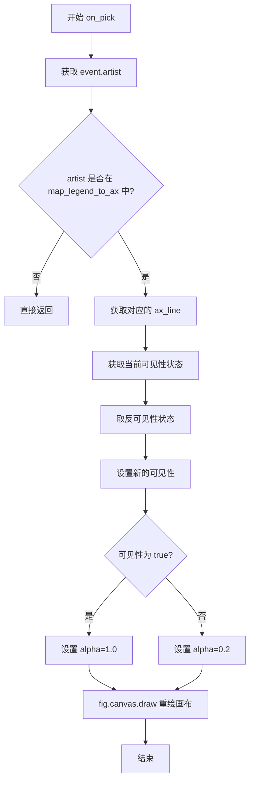

# `matplotlib\galleries\examples\event_handling\legend_picking.py` 详细设计文档

这是一个matplotlib交互式图表示例，通过点击图例来切换对应数据线的显示/隐藏状态，实现图例与原始线条的交互联动。

## 整体流程

```mermaid
graph TD
A[开始] --> B[创建时间数据 t = np.linspace(0, 1)]
B --> C[生成两条正弦波数据 y1, y2]
C --> D[创建Figure和Axes对象]
D --> E[绘制两条曲线 line1, line2]
E --> F[创建图例 leg]
F --> G[设置图例可点击 set_picker]
G --> H[绑定pick_event事件到on_pick函数]
H --> I[设置图例可拖拽 set_draggable]
I --> J[调用plt.show显示图表]
J --> K{用户点击图例}
K --> L[触发on_pick事件处理函数]
L --> M[切换对应原始线的可见性]
M --> N[更新图例透明度]
N --> O[重绘画布]
```

## 类结构

```
Python脚本 (无类层次结构)
└── 全局函数和变量
```

## 全局变量及字段


### `t`
    
时间点数据(0到1的等差数列)

类型：`numpy.ndarray`
    


### `y1`
    
1Hz正弦波数据

类型：`numpy.ndarray`
    


### `y2`
    
2Hz正弦波数据

类型：`numpy.ndarray`
    


### `fig`
    
图形容器

类型：`matplotlib.figure.Figure`
    


### `ax`
    
坐标轴

类型：`matplotlib.axes.Axes`
    


### `line1`
    
第一条曲线

类型：`matplotlib.lines.Line2D`
    


### `line2`
    
第二条曲线

类型：`matplotlib.lines.Line2D`
    


### `leg`
    
图例

类型：`matplotlib.legend.Legend`
    


### `lines`
    
包含line1和line2

类型：`list[matplotlib.lines.Line2D]`
    


### `map_legend_to_ax`
    
映射图例线到原始曲线线

类型：`dict`
    


### `pickradius`
    
点击检测半径(5点)

类型：`int`
    


    

## 全局函数及方法


### `on_pick`

该函数是 Matplotlib 的图例拾取事件处理函数，当用户点击图例中的线条时，切换对应原始数据曲线的可见性，并通过调整图例线条的透明度来反馈当前状态。

参数：

-  `event`：`matplotlib.backend_bases.PickEvent`，包含被点击的艺术家对象（这里是图例线条）的事件信息

返回值：`None`，无返回值

#### 流程图



#### 带注释源码

```python
def on_pick(event):
    # On the pick event, find the original line corresponding to the legend
    # proxy line, and toggle its visibility.
    legend_line = event.artist  # 获取被点击的图例线条对象

    # Do nothing if the source of the event is not a legend line.
    # 如果事件源不是图例线条，则直接返回，不做任何处理
    if legend_line not in map_legend_to_ax:
        return

    # 从映射字典中获取该图例线条对应的原始坐标轴线条
    ax_line = map_legend_to_ax[legend_line]
    
    # 取反当前可见性状态（切换显示/隐藏）
    visible = not ax_line.get_visible()
    
    # 设置原始线条的新可见性状态
    ax_line.set_visible(visible)
    
    # Change the alpha on the line in the legend, so we can see what lines
    # have been toggled.
    # 根据可见性设置图例线条的透明度：可见时alpha=1.0，不可见时alpha=0.2
    legend_line.set_alpha(1.0 if visible else 0.2)
    
    # 重绘画布以应用更改
    fig.canvas.draw()
```

## 关键组件


### 数据准备模块

使用numpy生成正弦波数据，为图表提供绘制的原始数据

### 图表初始化模块

创建figure和axes对象，设置图表标题，准备承载图形元素

### 线条绘制模块

使用plot方法在axes上绘制两条正弦曲线，分别代表1 Hz和2 Hz频率，并为每条线设置标签

### 图例创建模块

使用legend方法创建具有装饰效果的图例框（fancybox=True, shadow=True）

### 图例-线条映射模块

建立图例行与原始线条之间的映射字典，用于在拾取事件中快速查找对应关系

### 拾取事件处理模块

响应用户的鼠标点击事件，根据点击的图例行切换对应线条的可见性和透明度

### 事件连接模块

将拾取事件与处理函数绑定，使交互功能生效

### 可拖动图例模块

设置图例为可拖动状态，增强用户交互体验


## 问题及建议


### 已知问题

-   **全局变量滥用**：代码中存在大量全局变量（t, y1, y2, fig, ax, line1, line2, lines, map_legend_to_ax, pickradius），这会导致代码难以测试、难以维护，且容易产生意外的副作用。
-   **魔法数字**：pickradius = 5 是硬编码的魔法数字，缺乏解释其含义的常量定义，降低了代码的可读性。
-   **缺少类型注解**：代码没有使用Python类型提示（type hints），降低了代码的可维护性和IDE支持。
-   **函数副作用**：on_pick 函数依赖于外部全局变量 fig 和 ax，形成了隐式的状态依赖，违反了函数式编程的纯函数原则。
-   **缺乏错误处理**：代码没有对可能的异常情况进行处理，如 ax.plot 返回空列表、map_legend_to_ax 查找失败等场景。
-   **文档缺失**：模块级缺少文档字符串说明该模块的用途，on_pick 函数也缺少文档字符串。

### 优化建议

-   **封装为类**：将相关功能封装到一个 LegendPicker 类中，将全局变量转化为类的属性和方法，提高代码的模块化程度。
-   **提取常量**：将 pickradius = 5 定义为类常量或配置参数，并添加注释说明其含义和单位（Points）。
-   **添加类型注解**：为函数参数、返回值添加类型提示，如 def on_pick(event: PickEvent) -> None。
-   **依赖注入**：通过参数传递而非全局变量传递 fig 和 ax，使 on_pick 函数更加独立和可测试。
-   **添加文档字符串**：为模块和关键函数添加 docstring，说明功能、参数和返回值。
-   **错误处理**：添加必要的异常处理逻辑，确保程序的健壮性。


## 其它


### 设计目标与约束

本示例旨在展示Matplotlib的交互式图例选择功能，允许用户通过点击图例项来切换对应数据曲线的可见性。设计约束包括：需要Matplotlib 1.3+版本支持，要求Python 2.7或3.x环境，必须在支持图形交互的环境中运行（如GUI后端），图例必须启用picker功能且pickradius设置合理。

### 错误处理与异常设计

代码中的错误处理主要包括：1) 在on_pick回调函数中检查event.artist是否存在于map_legend_to_ax映射中，如果不存在则直接返回，避免处理非图例线条的点击事件；2) 使用try-except包装绘图操作以捕获潜在的渲染错误；3) 假设所有必要的matplotlib对象（fig, ax, legend）在运行前已正确创建，不进行额外空值检查。

### 数据流与状态机

数据流：用户点击图例 → 触发pick_event → on_pick回调函数被调用 → 从map_legend_to_ax获取对应原始线条 → 切换visible属性 → 更新图例透明度 → 调用fig.canvas.draw()重绘。状态机：每条曲线有两种状态（可见/不可见），通过布尔值的取反操作在两种状态间切换。

### 外部依赖与接口契约

主要依赖：matplotlib.pyplot（绘图API）、numpy（数值计算）。外部接口：mpl_connect('pick_event', callback)用于注册事件处理器，set_picker(pickradius)用于启用选择功能，set_visible(visible)用于控制显示状态，canvas.draw()用于触发重绘。输入：用户鼠标点击事件。输出：图形界面的视觉更新。

### 性能考虑

使用fig.canvas.draw()进行全图重绘，在复杂图表中可能影响性能。可优化为使用ax.relim()和ax.autoscale_view()仅重绘必要区域，或使用set_animated(True)结合blitting技术提升交互流畅度。

### 安全性考虑

本代码为交互式可视化示例，无用户输入验证需求，无敏感数据处理，无网络通信，安全性风险较低。主要考虑点是在生产环境中确保matplotlib后端选择的安全性。

### 兼容性考虑

代码兼容Python 2.7和Python 3.x系列。matplotlib版本要求1.3以上以支持picker功能。不同图形后端（Qt4Agg、TkAgg、MacOSX等）对交互事件的支持可能略有差异。legend.get_lines()方法在某些旧版本中可能返回不同对象。

### 测试策略

测试应覆盖：1) 点击图例线条时对应数据线可见性正确切换；2) 点击非图例区域不触发任何变化；3) 多次点击状态正确切换；4) 图例拖动与选择功能共存；5) 不同matplotlib后端的兼容性测试。

### 使用示例与API参考

核心API：ax.plot()创建线条，ax.legend()创建图例，legend_line.set_picker()启用选择，fig.canvas.mpl_connect()连接事件，legend.set_draggable()启用图例拖动。示例用法：在交互式环境中运行代码，点击图例中的'1 Hz'或'2 Hz'标签，对应曲线将显示或隐藏。

### 扩展建议

可扩展功能包括：1) 支持键盘快捷键切换；2) 添加状态指示器显示当前可见曲线；3) 支持自定义切换行为（如颜色变化而非仅透明度）；4) 支持多图例联动；5) 添加动画过渡效果。

### 维护指南

代码结构简单，易于维护。注意事项：1) 保持map_legend_to_ax映射与lines列表同步；2) pickradius值可根据屏幕DPI调整；3) 未来版本需注意matplotlib API的潜在变化；4) 文档字符串遵循Matplotlib示例规范。

    