# `matplotlib\galleries\examples\event_handling\looking_glass.py` 详细设计文档

This code provides an interactive looking glass feature using Matplotlib to inspect data by simulating mouse events.

## 整体流程

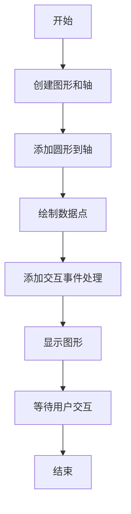

## 类结构

```
EventHandler (事件处理器类)
```

## 全局变量及字段


### `fig`
    
The main figure object created by Matplotlib for the plot.

类型：`matplotlib.figure.Figure`
    


### `ax`
    
The axes object where the plot is drawn.

类型：`matplotlib.axes._subplots.AxesSubplot`
    


### `circ`
    
The circle patch that represents the looking glass.

类型：`matplotlib.patches.Circle`
    


### `x`
    
The x-coordinates of the data points.

类型：`numpy.ndarray`
    


### `y`
    
The y-coordinates of the data points.

类型：`numpy.ndarray`
    


### `line`
    
The line object representing the data plot.

类型：`matplotlib.lines.Line2D`
    


### `handler`
    
The EventHandler instance that handles the mouse events for the looking glass.

类型：`EventHandler`
    


### `EventHandler.x0`
    
The x-coordinate of the center of the looking glass circle.

类型：`float`
    


### `EventHandler.y0`
    
The y-coordinate of the center of the looking glass circle.

类型：`float`
    


### `EventHandler.pressevent`
    
The event object that is captured when the mouse button is pressed.

类型：`matplotlib.backend_bases.Event`
    
    

## 全局函数及方法


### plt.subplots

`plt.subplots` 是 Matplotlib 库中的一个函数，用于创建一个图形和一个轴（Axes）对象。

参数：

- `figsize`：`tuple`，图形的大小（宽度和高度），默认为 (6, 4)。
- `dpi`：`int`，图形的分辨率，默认为 100。
- `facecolor`：`color`，图形的背景颜色，默认为 'white'。
- `edgecolor`：`color`，图形的边缘颜色，默认为 'none'。
- `frameon`：`bool`，是否显示图形的边框，默认为 True。
- `num`：`int`，轴的数量，默认为 1。
- `gridspec_kw`：`dict`，用于 GridSpec 的关键字参数。
- `constrained_layout`：`bool`，是否启用约束布局，默认为 False。

返回值：`Figure` 对象和 `Axes` 对象的元组。

#### 流程图

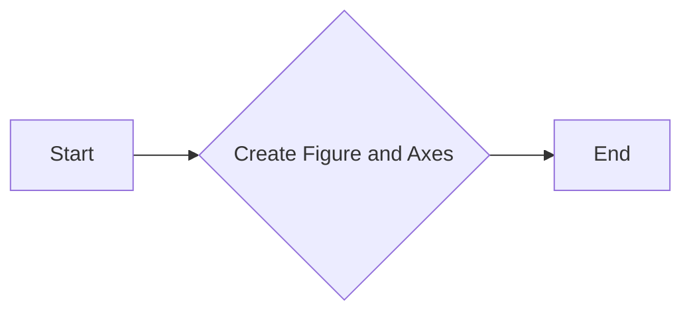

#### 带注释源码

```python
fig, ax = plt.subplots()
```

在这个例子中，`fig` 是创建的图形对象，`ax` 是图形中的轴对象。这个函数用于初始化图形和轴，以便可以在它们上绘制图形和图表。


### patches.Circle

`patches.Circle` 是一个用于创建圆形的类，它继承自 `matplotlib.patches.Patch`。

参数：

- `center`：`(x, y)`，圆形的中心坐标。
- `radius`：`float`，圆形的半径。
- `alpha`：`float`，圆形的透明度。
- `fc`：`str` 或 `color`，圆形的填充颜色。

返回值：`patches.Circle` 实例，表示创建的圆形。

#### 流程图

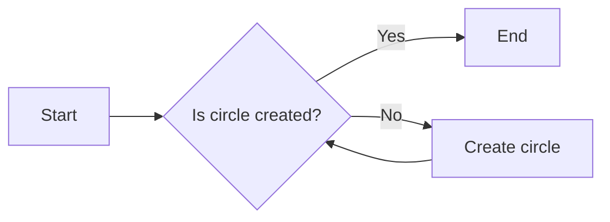

#### 带注释源码

```python
import matplotlib.patches as patches

# 创建圆形
circ = patches.Circle((0.5, 0.5), 0.25, alpha=0.8, fc='yellow')
```


### ax.plot

`ax.plot` 是一个用于在 Matplotlib 的轴对象 `ax` 上绘制线图的函数。

参数：

- `x`：`numpy.ndarray`，表示 x 轴的数据点。
- `y`：`numpy.ndarray`，表示 y 轴的数据点。
- `alpha`：`float`，表示线图的透明度，默认为 1.0。
- `clip_path`：`matplotlib.patches.Patch`，表示线图应该被裁剪的路径，默认为 None。

返回值：`Line2D`，表示绘制的线图对象。

#### 流程图

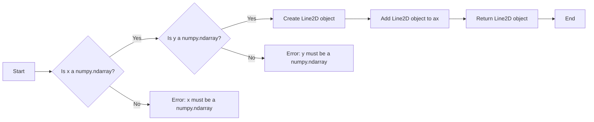

#### 带注释源码

```python
line, = ax.plot(x, y, alpha=1.0, clip_path=circ)
```

在这行代码中，我们创建了一个名为 `line` 的 `Line2D` 对象，该对象在轴 `ax` 上绘制了从 `x` 到 `y` 的线图，透明度为 1.0，并且被 `circ` 指定的圆形路径裁剪。


### fig.canvas.mpl_connect

连接matplotlib的事件处理函数。

参数：

- `event_type`：`str`，事件类型，如 'button_press_event', 'button_release_event', 'motion_notify_event' 等。
- `handler_function`：`callable`，事件发生时调用的处理函数。

返回值：`None`

#### 流程图

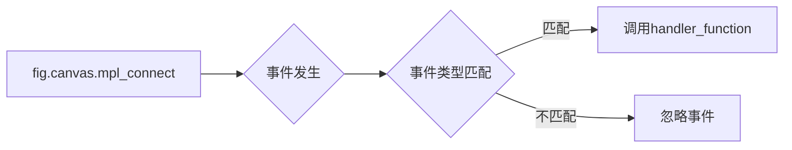

#### 带注释源码

```python
fig.canvas.mpl_connect('button_press_event', self.on_press)
fig.canvas.mpl_connect('button_release_event', self.on_release)
fig.canvas.mpl_connect('motion_notify_event', self.on_move)
```


### plt.show()

显示当前图形。

参数：

- 无

返回值：无

#### 流程图

```mermaid
graph LR
A[开始] --> B{调用plt.show()}
B --> C[结束]
```

#### 带注释源码

```
plt.show()
```


### EventHandler.on_move

处理鼠标移动事件。

参数：

- `event`：`matplotlib.event.Event`，鼠标移动事件对象

返回值：无

#### 流程图

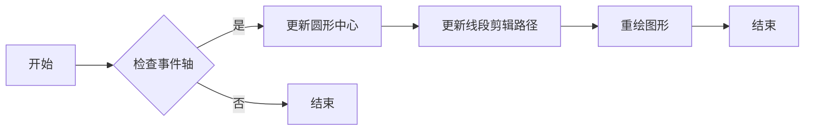

#### 带注释源码

```python
def on_move(self, event):
    if self.pressevent is None or event.inaxes != self.pressevent.inaxes:
        return

    dx = event.xdata - self.pressevent.xdata
    dy = event.ydata - self.pressevent.ydata
    circ.center = self.x0 + dx, self.y0 + dy
    line.set_clip_path(circ)
    fig.canvas.draw()
```


### EventHandler.on_press

处理鼠标按下事件。

参数：

- `event`：`matplotlib.event.Event`，鼠标按下事件对象

返回值：无

#### 流程图

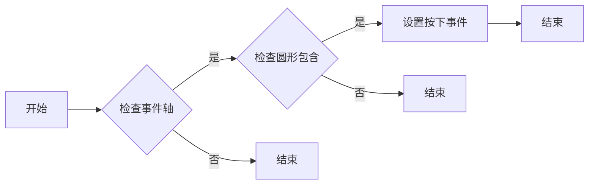

#### 带注释源码

```python
def on_press(self, event):
    if event.inaxes != ax:
        return

    if not circ.contains(event)[0]:
        return

    self.pressevent = event
```


### EventHandler.on_release

处理鼠标释放事件。

参数：

- `event`：`matplotlib.event.Event`，鼠标释放事件对象

返回值：无

#### 流程图


#### 带注释源码

```python
def on_release(self, event):
    self.pressevent = None
    self.x0, self.y0 = circ.center
```


### EventHandler.__init__

EventHandler类的构造函数，用于初始化事件处理器。

参数：

- `event`：`matplotlib.backend_bases.Event`，事件对象，用于连接matplotlib的事件。

返回值：无

#### 流程图

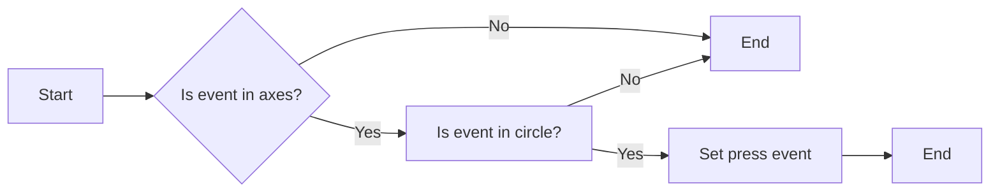

#### 带注释源码

```python
def __init__(self):
    # Connect button press, release, and motion events to the event handlers
    fig.canvas.mpl_connect('button_press_event', self.on_press)
    fig.canvas.mpl_connect('button_release_event', self.on_release)
    fig.canvas.mpl_connect('motion_notify_event', self.on_move)
    
    # Initialize the starting position of the circle
    self.x0, self.y0 = circ.center
    
    # Initialize the press event to None
    self.pressevent = None
``` 


### EventHandler.on_press

`EventHandler.on_press` is a method of the `EventHandler` class that handles the button press event on the matplotlib figure.

参数：

- `event`：`matplotlib.event.Event`，This parameter represents the event object that contains information about the mouse press event.

返回值：`None`，This method does not return any value.

#### 流程图

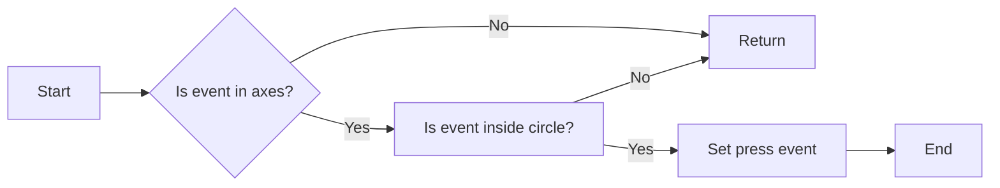

#### 带注释源码

```python
def on_press(self, event):
    # Check if the event is within the axes of the plot
    if event.inaxes != ax:
        return

    # Check if the event is inside the circle
    if not circ.contains(event)[0]:
        return

    # Set the press event
    self.pressevent = event
```


### EventHandler.on_release

`EventHandler.on_release` is a method of the `EventHandler` class that handles the release event of the mouse button when the user is interacting with the looking glass.

参数：

- `event`：`matplotlib.event.Event`，This parameter represents the mouse event that triggered the method. It contains information about the event, such as the position of the mouse cursor.

返回值：无

#### 流程图

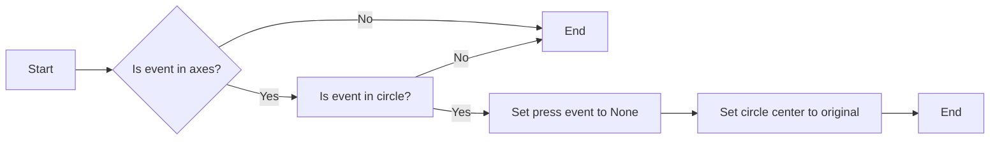

#### 带注释源码

```python
def on_release(self, event):
    self.pressevent = None  # Reset the press event
    self.x0, self.y0 = circ.center  # Set the circle center to the original position
```


### EventHandler.on_move

`EventHandler.on_move` is a method of the `EventHandler` class that handles the movement of the looking glass circle when the user drags it with the mouse.

参数：

- `event`：`matplotlib.event.Event`，The event object that contains information about the mouse movement.

返回值：无

#### 流程图

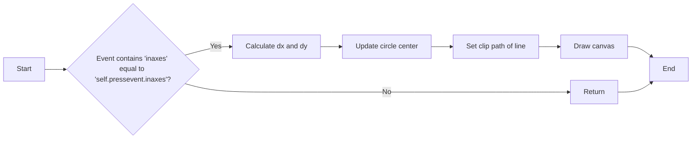

#### 带注释源码

```python
def on_move(self, event):
    # Check if the event is related to the same axes and if the press event is not None
    if self.pressevent is None or event.inaxes != self.pressevent.inaxes:
        return

    # Calculate the difference in x and y coordinates between the current event and the press event
    dx = event.xdata - self.pressevent.xdata
    dy = event.ydata - self.pressevent.ydata

    # Update the center of the circle with the calculated differences
    circ.center = self.x0 + dx, self.y0 + dy

    # Set the clip path of the line to the updated circle
    line.set_clip_path(circ)

    # Redraw the canvas to reflect the changes
    fig.canvas.draw()
```


## 关键组件


### 张量索引与惰性加载

张量索引与惰性加载允许在处理大型数据集时，只加载和处理需要的数据部分，从而提高效率。

### 反量化支持

反量化支持使得模型可以在不同的量化级别上进行训练和推理，以适应不同的硬件和性能需求。

### 量化策略

量化策略定义了如何将浮点数转换为固定点数，以减少模型大小和提高推理速度。


## 问题及建议


### 已知问题

-   **代码重复性**：`EventHandler` 类中的 `on_press`、`on_release` 和 `on_move` 方法都包含相似的逻辑，可以考虑将这些逻辑提取到单独的方法中，以减少代码重复。
-   **异常处理**：代码中没有异常处理机制，如果发生错误（例如，matplotlib 版本不兼容），程序可能会崩溃。应该添加异常处理来确保程序的健壮性。
-   **代码注释**：代码中缺少详细的注释，这可能会使得其他开发者难以理解代码的工作原理。

### 优化建议

-   **重构代码**：将 `on_press`、`on_release` 和 `on_move` 方法中的共同逻辑提取到单独的方法中，例如 `update_circle_position` 和 `update_line_clip_path`。
-   **添加异常处理**：在关键操作（如连接事件处理器）周围添加 try-except 块，以捕获并处理可能发生的异常。
-   **增加代码注释**：在代码中添加注释，解释每个方法的作用和实现细节，以提高代码的可读性和可维护性。
-   **代码测试**：编写单元测试来验证代码的功能，确保在修改代码时不会破坏现有功能。
-   **使用配置文件**：如果需要调整参数（如圆的半径或颜色），可以考虑使用配置文件而不是硬编码在代码中，以提高代码的灵活性。


## 其它


### 设计目标与约束

- 设计目标：实现一个交互式的查看器，用于在数据上模拟放大镜效果。
- 约束条件：使用Matplotlib库进行图形绘制，实现鼠标事件处理。

### 错误处理与异常设计

- 错误处理：确保在鼠标事件处理过程中，如果发生异常，程序能够优雅地处理并恢复。
- 异常设计：捕获并处理`ValueError`、`TypeError`等潜在异常。

### 数据流与状态机

- 数据流：用户通过鼠标点击和拖动操作，触发事件处理函数，更新放大镜的位置和显示区域。
- 状态机：事件处理函数根据不同的事件类型（按下、释放、移动）执行相应的操作。

### 外部依赖与接口契约

- 外部依赖：Matplotlib库用于图形绘制和事件处理。
- 接口契约：`EventHandler`类提供事件处理接口，包括鼠标按下、释放和移动事件的处理方法。

### 安全性与权限

- 安全性：确保代码不会因为外部输入而受到攻击，如SQL注入或XSS攻击。
- 权限：无特殊权限要求，代码运行在标准用户权限下。

### 性能考量

- 性能考量：优化事件处理函数，减少不必要的计算和内存占用，确保交互流畅。

### 可维护性与可扩展性

- 可维护性：代码结构清晰，易于理解和维护。
- 可扩展性：设计时考虑了未来可能的功能扩展，如支持更多图形元素或交互方式。

### 测试与验证

- 测试：编写单元测试，确保代码在各种情况下都能正常工作。
- 验证：通过实际运行和用户测试，验证代码的功能和性能。

### 文档与注释

- 文档：提供详细的设计文档和用户手册，方便用户理解和使用。
- 注释：在代码中添加必要的注释，提高代码的可读性。

### 用户界面与体验

- 用户界面：设计简洁直观的用户界面，提供良好的用户体验。
- 体验：确保用户能够轻松地理解和使用查看器功能。

### 部署与维护

- 部署：提供部署指南，确保代码能够在不同环境中顺利运行。
- 维护：定期更新代码，修复潜在的问题，并添加新功能。


    