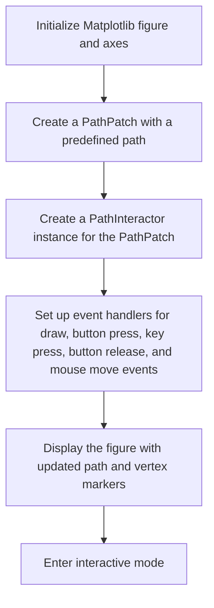
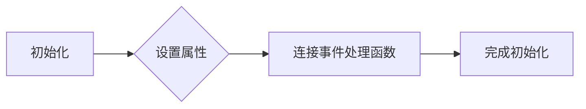
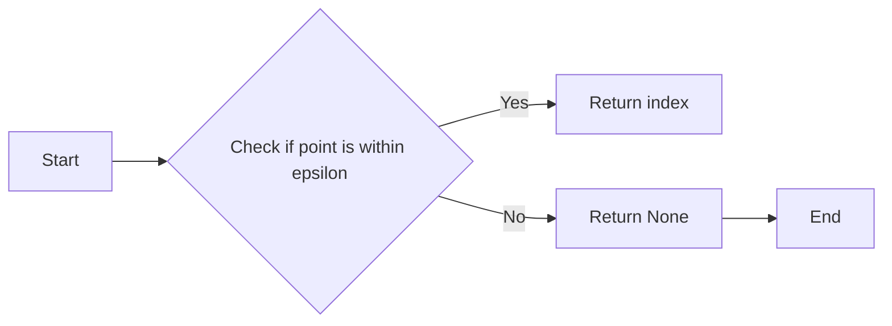
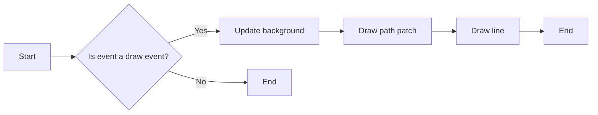
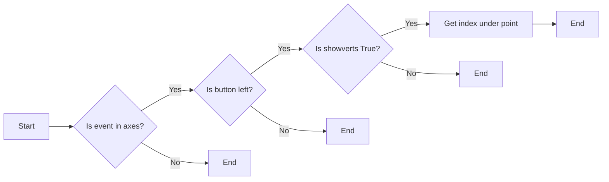
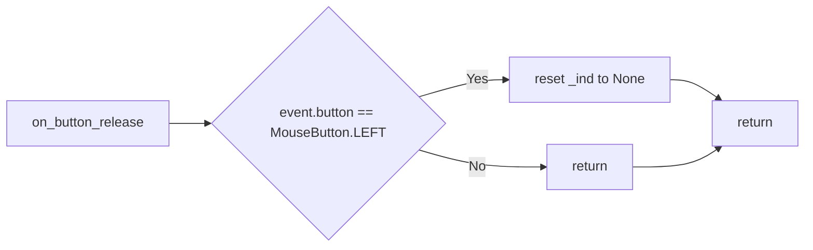
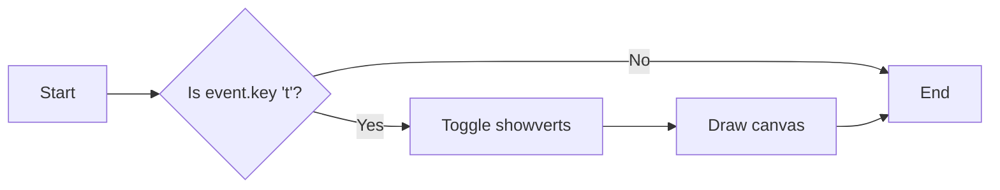
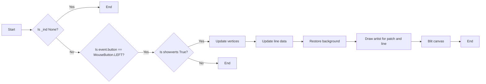

# `matplotlib\galleries\examples\event_handling\path_editor.py` 详细设计文档

This code provides a GUI-based path editor using Matplotlib, allowing users to interact with and modify objects on the canvas by toggling vertex markers, dragging vertices, and updating the path accordingly.

## 整体流程



## 类结构

```
PathInteractor (交互式路径编辑器类)
├── matplotlib.pyplot (绘图库)
│   ├── figure (创建图形窗口)
│   └── axes (创建坐标轴)
└── matplotlib.patches (绘制图形元素)
    └── PathPatch (路径补丁)
```

## 全局变量及字段


### `fig`
    
The main figure object created by plt.subplots()

类型：`matplotlib.figure.Figure`
    


### `ax`
    
The axes object where the plot is drawn

类型：`matplotlib.axes._subplots.AxesSubplot`
    


### `pathdata`
    
List of tuples defining the path data for the PathPatch

类型：`list of tuples`
    


### `codes`
    
The codes for the path data

类型：`tuple`
    


### `verts`
    
The vertices for the path data

类型：`tuple`
    


### `path`
    
The Path object representing the path data

类型：`matplotlib.path.Path`
    


### `patch`
    
The PathPatch object representing the path on the canvas

类型：`matplotlib.patches.PathPatch`
    


### `interactor`
    
The PathInteractor object for interacting with the path

类型：`PathInteractor`
    


### `PathInteractor.showverts`
    
Toggle vertex markers on and off

类型：`bool`
    


### `PathInteractor.epsilon`
    
Maximum pixel distance to count as a vertex hit

类型：`int`
    


### `PathInteractor.ax`
    
The axes object where the plot is drawn

类型：`matplotlib.axes._subplots.AxesSubplot`
    


### `PathInteractor.canvas`
    
The canvas object for the figure

类型：`matplotlib.backends.backend_agg.FigureCanvasAgg`
    


### `PathInteractor.pathpatch`
    
The PathPatch object representing the path on the canvas

类型：`matplotlib.patches.PathPatch`
    


### `PathInteractor.line`
    
The line object used to show vertices

类型：`matplotlib.lines.Line2D`
    


### `PathInteractor._ind`
    
The index of the active vertex

类型：`int`
    
    

## 全局函数及方法


### PathInteractor.__init__

初始化PathInteractor类，设置交互式路径编辑器的初始状态。

参数：

- `pathpatch`：`PathPatch`，路径补丁对象，用于编辑的路径。

返回值：无

#### 流程图



#### 带注释源码

```python
def __init__(self, pathpatch):
    # 设置属性
    self.ax = pathpatch.axes
    canvas = self.ax.figure.canvas
    self.pathpatch = pathpatch
    self.pathpatch.set_animated(True)

    x, y = zip(*self.pathpatch.get_path().vertices)

    # 创建一个动态的线对象，用于显示路径的顶点
    self.line, = ax.plot(
        x, y, marker='o', markerfacecolor='r', animated=True)

    # 初始化顶点索引
    self._ind = None  # the active vertex

    # 连接事件处理函数
    canvas.mpl_connect('draw_event', self.on_draw)
    canvas.mpl_connect('button_press_event', self.on_button_press)
    canvas.mpl_connect('key_press_event', self.on_key_press)
    canvas.mpl_connect('button_release_event', self.on_button_release)
    canvas.mpl_connect('motion_notify_event', self.on_mouse_move)
    self.canvas = canvas
```


### PathInteractor.get_ind_under_point

Return the index of the point closest to the event position or `None` if no point is within `self.epsilon` to the event position.

参数：

- `event`：`matplotlib.event.Event`，The event object that triggered the method call. It contains the position of the mouse click.

返回值：`int`，The index of the point closest to the event position or `None` if no point is within `self.epsilon` to the event position.

#### 流程图



#### 带注释源码

```python
def get_ind_under_point(self, event):
    """
    Return the index of the point closest to the event position or None
    if no point is within self.epsilon to the event position.
    """
    xy = self.pathpatch.get_path().vertices
    xyt = self.pathpatch.get_transform().transform(xy)  # to display coords
    xt, yt = xyt[:, 0], xyt[:, 1]
    d = np.sqrt((xt - event.x)**2 + (yt - event.y)**2)
    ind = d.argmin()
    return ind if d[ind] < self.epsilon else None
```


### PathInteractor.on_draw

This method is a callback function that is triggered during the drawing event of the matplotlib canvas. It is responsible for updating the canvas with the latest state of the path and vertex markers.

参数：

- `event`：`matplotlib.backend_bases.Event`，The event object that triggered the drawing event.

返回值：`None`，This method does not return any value.

#### 流程图



#### 带注释源码

```python
def on_draw(self, event):
    """Callback for draws."""
    self.background = self.canvas.copy_from_bbox(self.ax.bbox)
    self.ax.draw_artist(self.pathpatch)
    self.ax.draw_artist(self.line)
```


### PathInteractor.on_button_press

This method is a callback for mouse button presses. It is triggered when the left mouse button is pressed on the canvas. It checks if the event is within the axes, if the button pressed is the left mouse button, and if vertex markers are shown. If these conditions are met, it attempts to find the index of the vertex closest to the event position.

参数：

- `event`：`matplotlib.event.Event`，The event object containing information about the mouse press.

返回值：`None`，No return value.

#### 流程图



#### 带注释源码

```python
def on_button_press(self, event):
    """Callback for mouse button presses."""
    if (event.inaxes is None
            or event.button != MouseButton.LEFT
            or not self.showverts):
        return
    self._ind = self.get_ind_under_point(event)
``` 


### PathInteractor.on_button_release

This method is a callback for mouse button release events. It is used to reset the active vertex index when the mouse button is released.

参数：

- `event`：`matplotlib.event.Event`，The event object containing information about the mouse button release event.

返回值：`None`，No return value.

#### 流程图



#### 带注释源码

```python
def on_button_release(self, event):
    """Callback for mouse button releases."""
    if (event.button != MouseButton.LEFT
            or not self.showverts):
        return
    self._ind = None
```


### PathInteractor.on_key_press

This method handles key press events for the PathInteractor class. It toggles the visibility of vertex markers and updates the canvas accordingly.

参数：

- `event`：`matplotlib.event.Event`，The event object containing information about the key press.

返回值：`None`，This method does not return any value.

#### 流程图



#### 带注释源码

```python
def on_key_press(self, event):
    """Callback for key presses."""
    if not event.inaxes:
        return
    if event.key == 't':
        self.showverts = not self.showverts
        self.line.set_visible(self.showverts)
        if not self.showverts:
            self._ind = None
    self.canvas.draw()
```


### PathInteractor.on_mouse_move

This method handles mouse movement events when the vertex markers are visible and the left mouse button is pressed.

参数：

- `event`：`matplotlib.event.Event`，The event object containing information about the mouse movement.

返回值：`None`，This method does not return any value.

#### 流程图



#### 带注释源码

```python
def on_mouse_move(self, event):
    """Callback for mouse movements."""
    if (self._ind is None
            or event.inaxes is None
            or event.button != MouseButton.LEFT
            or not self.showverts):
        return

    vertices = self.pathpatch.get_path().vertices

    vertices[self._ind] = event.xdata, event.ydata
    self.line.set_data(zip(*vertices))

    self.canvas.restore_region(self.background)
    self.ax.draw_artist(self.pathpatch)
    self.ax.draw_artist(self.line)
    self.canvas.blit(self.ax.bbox)
```


## 关键组件


### 张量索引与惰性加载

张量索引与惰性加载是代码中用于处理和访问路径数据的关键组件。它允许在需要时才计算路径数据，从而提高性能和效率。

### 反量化支持

反量化支持是代码中用于处理和转换量化数据的关键组件。它允许将量化数据转换回原始数据，以便进行进一步的处理和分析。

### 量化策略

量化策略是代码中用于处理和量化数据的关键组件。它定义了如何将原始数据转换为量化数据，以便在有限资源上进行高效处理。


## 问题及建议


### 已知问题

-   **性能问题**：代码中使用了大量的回调函数来处理鼠标和键盘事件，这可能导致性能问题，尤其是在处理大量数据或复杂图形时。
-   **代码可读性**：代码中存在大量的魔法数字（如`self.epsilon = 5`），这降低了代码的可读性和可维护性。
-   **错误处理**：代码中没有明确的错误处理机制，如果发生异常，可能会导致程序崩溃或不可预期的行为。

### 优化建议

-   **性能优化**：考虑使用更高效的数据结构和算法来处理图形和事件，例如使用更快的查找算法来找到最近的顶点。
-   **代码重构**：将代码分解为更小的、更易于管理的函数，并使用有意义的变量和函数名来提高代码的可读性。
-   **错误处理**：添加异常处理来捕获和处理可能发生的错误，确保程序的健壮性。
-   **代码注释**：添加必要的注释来解释代码的功能和逻辑，特别是对于复杂的算法和数据处理。
-   **代码测试**：编写单元测试来验证代码的功能和性能，确保代码的正确性和稳定性。
-   **代码文档**：编写详细的代码文档，包括函数和类的说明、参数和返回值的描述，以及代码的运行流程。


## 其它


### 设计目标与约束

- 设计目标：
  - 实现一个路径编辑器，允许用户通过图形界面修改路径。
  - 提供交互式功能，如拖动顶点来更新路径。
  - 支持在多个GUI之间共享事件。
- 约束：
  - 使用Matplotlib库进行图形绘制和事件处理。
  - 保持代码简洁，易于理解和维护。

### 错误处理与异常设计

- 错误处理：
  - 在事件处理函数中捕获可能的异常，如鼠标事件和键盘事件。
  - 对于无效的操作，提供友好的错误消息。
- 异常设计：
  - 使用try-except块来处理可能发生的异常。
  - 在关键操作前进行参数检查，确保输入的有效性。

### 数据流与状态机

- 数据流：
  - 用户通过鼠标和键盘事件与图形界面交互。
  - 事件处理函数更新路径顶点的位置。
  - 更新后的路径通过Matplotlib的绘图函数重新绘制。
- 状态机：
  - 当前状态由`showverts`变量控制，表示顶点标记的显示状态。
  - 状态转换由键盘事件（如按't'键）触发。

### 外部依赖与接口契约

- 外部依赖：
  - Matplotlib库：用于图形绘制和事件处理。
  - NumPy库：用于数学计算。
- 接口契约：
  - `PathInteractor`类提供了一个接口，用于处理鼠标和键盘事件。
  - `PathPatch`类用于在图形界面中绘制路径。
  - `Path`类用于创建和操作路径数据。


    