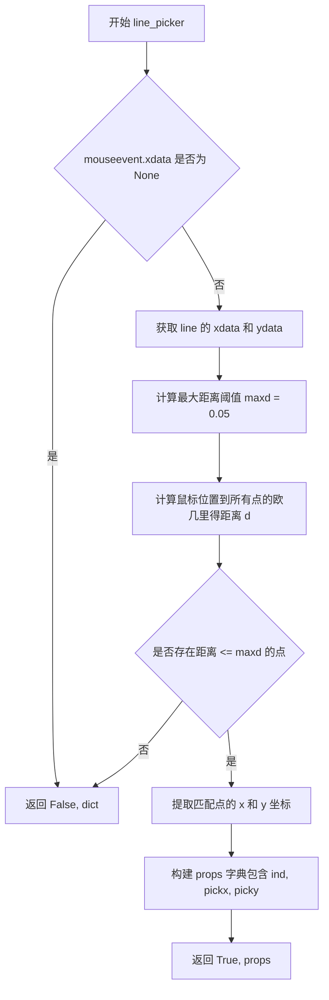
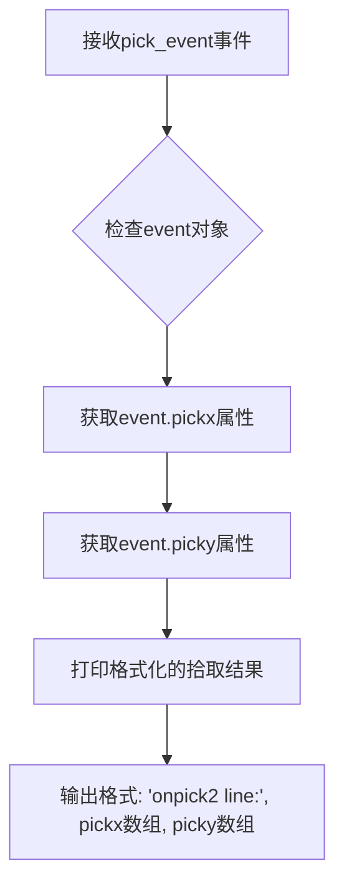
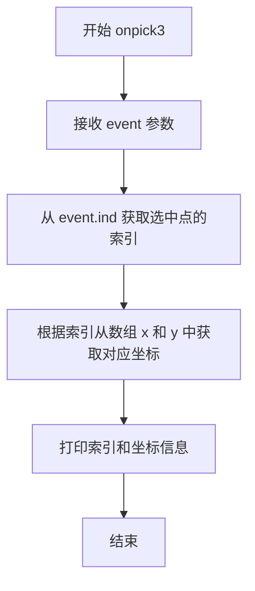
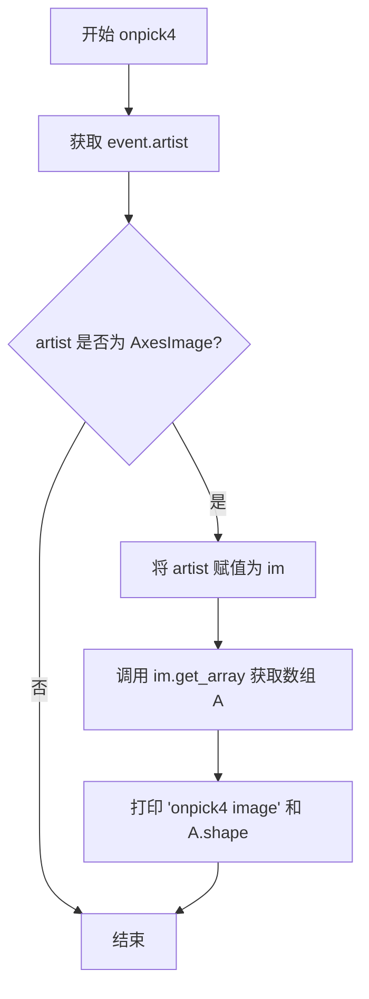
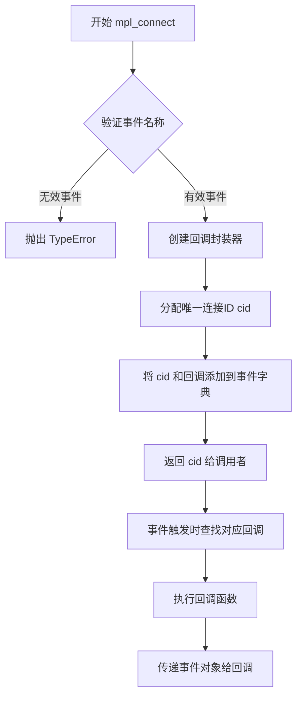

# `matplotlib\galleries\examples\event_handling\pick_event_demo.py` 详细设计文档

这是一个 Matplotlib 交互式演示代码，展示了如何通过设置artist对象（如Line2D, Rectangle, Text, Scatter, AxesImage）的picker属性来启用鼠标拾取功能，并连接回调函数处理pick_event，实现用户与图表元素的交互响应。

## 整体流程

```mermaid
graph TD
    Start[开始: 导入库] --> Init1[创建子图 ax1, ax2]
    Init1 --> Plot1[绘制线条和矩形, 设置 picker=True]
    Plot1 --> DefFunc1[定义回调 onpick1]
    DefFunc1 --> Connect1[连接 pick_event 到 onpick1]
    Connect1 --> Init2[创建子图 ax 用于自定义Picker]
    Init2 --> DefPicker[定义自定义函数 line_picker]
    DefPicker --> Plot2[绘制线条, picker=line_picker]
    Plot2 --> DefFunc2[定义回调 onpick2]
    DefFunc2 --> Connect2[连接 pick_event]
    Connect2 --> Init3[创建子图 ax 用于散点图]
    Init3 --> Plot3[绘制散点图, picker=True]
    Plot3 --> DefFunc3[定义回调 onpick3]
    DefFunc3 --> Connect3[连接 pick_event]
    Connect3 --> Init4[创建子图 ax 用于图像]
    Init4 --> Plot4[绘制图像, picker=True]
    Plot4 --> DefFunc4[定义回调 onpick4]
    DefFunc4 --> Connect4[连接 pick_event]
    Connect4 --> Show[plt.show()]
    Show --> Wait[等待用户交互]
    Wait --> Event[用户点击触发 PickEvent]
    Event --> Dispatch{分发到对应回调}
    Dispatch -->|Line2D| OnPick1[执行 onpick1]
    Dispatch -->|Custom| OnPick2[执行 onpick2]
    Dispatch -->|Scatter| OnPick3[执行 onpick3]
    Dispatch -->|Image| OnPick4[执行 onpick4]
    OnPick1 --> Print[打印数据信息]
    OnPick2 --> Print
    OnPick3 --> Print
    OnPick4 --> Print
```

## 类结构

```
Python Script (顶层脚本)
├── Imports: matplotlib.pyplot, numpy, matplotlib.image, matplotlib.lines, matplotlib.patches, matplotlib.text
├── 全局函数: onpick1, onpick2, onpick3, onpick4, line_picker
└── Matplotlib 对象层级: Figure -> Axes -> Artist (Line2D, Rectangle, Text, AxesImage)
```

## 全局变量及字段


### `fig`
    
图表容器，用于存放坐标轴和图形元素

类型：`matplotlib.figure.Figure`
    


### `ax`
    
坐标轴对象，用于绘制图形和设置坐标轴属性

类型：`matplotlib.axes.Axes`
    


### `ax1`
    
第一个子图的坐标轴对象

类型：`matplotlib.axes.Axes`
    


### `ax2`
    
第二个子图的坐标轴对象

类型：`matplotlib.axes.Axes`
    


### `line`
    
绘制的线条对象，用于显示数据点和线条

类型：`matplotlib.lines.Line2D`
    


### `x`
    
散点图的x坐标数据数组

类型：`numpy.ndarray`
    


### `y`
    
散点图的y坐标数据数组

类型：`numpy.ndarray`
    


### `c`
    
散点图的颜色数据数组

类型：`numpy.ndarray`
    


### `s`
    
散点图的大小数据数组

类型：`numpy.ndarray`
    


### `rand`
    
随机数生成函数，用于生成随机数据

类型：`numpy.random module function`
    


### `np`
    
数值计算库，提供数组和矩阵操作功能

类型：`numpy`
    


### `plt`
    
绘图库，提供绘图和可视化功能

类型：`matplotlib.pyplot`
    


    

## 全局函数及方法


### `onpick1`

该函数是Matplotlib中的通用拾取事件处理器，用于处理鼠标点击图形元素（线条、矩形、文本）时触发的pick_event，根据被点击的艺术家对象类型执行相应的数据提取和打印操作。

参数：

-  `event`：`matplotlib.backend_bases.PickEvent`，包含鼠标事件和艺术家对象的pick事件实例

返回值：`None`，该函数无返回值，仅执行打印操作

#### 流程图

```mermaid
flowchart TD
    A[开始: onpick1接收event参数] --> B{isinstance判断 event.artist 类型}
    B -->|Line2D| C[获取Line2D对象]
    C --> D[提取xdata和ydata数据]
    D --> E[获取ind索引]
    E --> F[打印线条数据: np.column_stack([xdata[ind], ydata[ind]])]
    F --> J[结束]
    B -->|Rectangle| G[获取Rectangle对象]
    G --> H[打印矩形路径: patch.get_path()]
    H --> J
    B -->|Text| I[获取Text对象]
    I --> K[打印文本内容: text.get_text()]
    K --> J
```

#### 带注释源码

```python
def onpick1(event):
    """
    处理通用的线条、矩形、文本拾取事件
    
    参数:
        event: matplotlib.backend_bases.PickEvent对象
               包含mouseevent（鼠标事件）和artist（被点击的艺术家对象）
    
    返回值:
        None: 该函数仅执行打印操作，无返回值
    """
    # 判断被点击的艺术家对象是否为Line2D（线条）类型
    if isinstance(event.artist, Line2D):
        # 获取被点击的线条对象
        thisline = event.artist
        # 获取线条的x轴数据
        xdata = thisline.get_xdata()
        # 获取线条的y轴数据
        ydata = thisline.get_ydata()
        # 获取被点击点的索引（可能是多个点）
        ind = event.ind
        # 打印线条数据：将x和y数据按列组合后输出
        print('onpick1 line:', np.column_stack([xdata[ind], ydata[ind]]))
    
    # 判断是否为Rectangle（矩形）类型
    elif isinstance(event.artist, Rectangle):
        # 获取被点击的矩形对象
        patch = event.artist
        # 打印矩形的路径信息
        print('onpick1 patch:', patch.get_path())
    
    # 判断是否为Text（文本）类型
    elif isinstance(event.artist, Text):
        # 获取被点击的文本对象
        text = event.artist
        # 打印文本的内容
        print('onpick1 text:', text.get_text())
```


### `line_picker`

自定义的距离检测函数，用于判断鼠标点击是否在线条（Line2D）附近。如果鼠标事件的数据坐标与线条上的点距离小于指定阈值（0.05），则返回命中，并将匹配点的索引和数据坐标附加到返回的属性字典中。

参数：

- `line`：`Line2D`，要检测的 matplotlib 线条对象，包含 x 和 y 数据
- `mouseevent`：`MouseEvent`，鼠标事件对象，包含 xdata 和 ydata 等数据坐标信息

返回值：`tuple[bool, dict]`，第一个元素为布尔值表示是否命中，第二个元素为字典包含额外属性（ind: 匹配的索引数组，pickx: 匹配的 x 坐标，picky: 匹配的 y 坐标）

#### 流程图



#### 带注释源码

```python
def line_picker(line, mouseevent):
    """
    Find the points within a certain distance from the mouseclick in
    data coords and attach some extra attributes, pickx and picky
    which are the data points that were picked.
    """
    # 检查鼠标事件是否在有效的数据坐标区域内
    # 如果 xdata 为 None，表示鼠标点击位置不在坐标轴内
    if mouseevent.xdata is None:
        return False, dict()
    
    # 从线条对象获取数据点坐标
    xdata = line.get_xdata()  # 获取线条的所有 x 坐标数据
    ydata = line.get_ydata()  # 获取线条的所有 y 坐标数据
    
    # 设置距离阈值（数据坐标单位）
    # 0.05 表示在数据坐标系中，允许的最大欧几里得距离
    maxd = 0.05
    
    # 计算鼠标点击位置到所有数据点的欧几里得距离
    # 使用向量运算一次性计算所有点的距离，提高效率
    d = np.sqrt(
        (xdata - mouseevent.xdata)**2 + (ydata - mouseevent.ydata)**2)

    # 找到所有距离小于等于阈值的点的索引
    # np.nonzero 返回满足条件的元素的索引数组
    ind, = np.nonzero(d <= maxd)
    
    # 判断是否有匹配的点
    if len(ind):
        # 提取匹配点的数据坐标
        pickx = xdata[ind]  # 匹配点的 x 坐标数组
        picky = ydata[ind]  # 匹配点的 y 坐标数组
        
        # 构建要附加到 PickEvent 的属性字典
        # ind: 匹配点在原始数据中的索引
        # pickx: 匹配点的 x 坐标（用于后续处理）
        # picky: 匹配点的 y 坐标（用于后续处理）
        props = dict(ind=ind, pickx=pickx, picky=picky)
        
        # 返回命中标志和属性字典
        return True, props
    else:
        # 没有匹配的点，返回未命中
        return False, dict()
```


### `onpick2`

处理自定义picker线条的拾取事件的回调函数，当用户点击图表中的线条时，该函数会被触发，用于打印通过自定义picker函数`line_picker`附加到PickEvent上的自定义属性（pickx和picky），即被拾取的数据点坐标。

参数：

-  `event`：`matplotlib.backend_bases.PickEvent`，拾取事件对象，包含鼠标事件信息、被选中的艺术家对象，以及由自定义picker函数`line_picker`添加的自定义属性（pickx和picky），分别表示被拾取点的x坐标和y坐标数组

返回值：`None`，该函数仅执行打印操作，不返回任何值

#### 流程图



#### 带注释源码

```python
def onpick2(event):
    """
    处理自定义picker线条的拾取事件回调函数
    
    该函数作为pick_event的回调被注册到figure canvas上，当用户点击
    由自定义picker函数line_picker处理的线条时，此函数会被调用。
    它从event对象中获取line_picker函数附加的自定义属性pickx和picky，
    并打印被拾取的数据点坐标。
    
    参数:
        event: PickEvent对象，包含以下属性:
            - artist: 触发事件的艺术家对象(Line2D)
            - mouseevent: 原始鼠标事件
            - pickx: 由line_picker添加的自定义属性，拾取点的x坐标数组
            - picky: 由line_picker添加的自定义属性，拾取点的y坐标数组
    
    返回值:
        None
    
    示例输出:
        onpick2 line: [0.234 0.456] [0.123 0.789]
    """
    print('onpick2 line:', event.pickx, event.picky)
```


### `onpick3`

处理散点图的拾取事件回调函数，当用户点击散点图上的数据点时，提取并打印被选中点的索引及其对应的 x、y 坐标值。

参数：

- `event`：`matplotlib.backend_bases.PickEvent`，matplotlib 的拾取事件对象，包含被点击艺术家的信息，其中 `event.ind` 属性存储了被选中数据点的索引

返回值：`None`，该函数仅执行打印操作，无返回值

#### 流程图



#### 带注释源码

```python
def onpick3(event):
    """
    处理散点图的拾取事件回调函数。
    
    当用户点击散点图中的数据点时，此函数会被调用，
    用于获取并输出被选中点的索引及其坐标信息。
    
    参数:
        event: matplotlib.backend_bases.PickEvent 对象，
               包含被点击的艺术家（这里是 PathCollection/散点）
               以及相关的元数据信息
    """
    # 从事件对象中提取被选中数据点的索引
    # event.ind 是一个 numpy 数组，包含所有在拾取范围内的点索引
    ind = event.ind
    
    # 打印被选中点的索引以及对应的 x、y 坐标值
    # x[ind] 和 y[ind] 根据索引数组从数据中取出对应的坐标
    print('onpick3 scatter:', ind, x[ind], y[ind])
```


### `onpick4`

处理图像的拾取事件，当用户点击图像时获取并打印图像的数组形状。

参数：

-  `event`：`matplotlib.backend_bases.PickEvent`，鼠标拾取事件对象，包含鼠标事件和被点击的艺术家对象信息

返回值：`None`，无返回值，仅执行打印操作

#### 流程图



#### 带注释源码

```python
def onpick4(event):
    """
    处理图像的拾取事件回调函数。
    
    当用户点击图像时，该函数被调用，打印被点击图像的数组形状。
    
    参数:
        event: matplotlib.backend_bases.PickEvent 对象，包含以下属性:
            - artist: 被点击的 matplotlib 艺术家对象 (如 AxesImage)
            - mouseevent: 原始鼠标事件
    """
    # 从事件中获取被点击的艺术家对象
    artist = event.artist
    
    # 判断被点击的对象是否为 AxesImage 类型
    if isinstance(artist, AxesImage):
        # 如果是图像对象，将其赋值给 im 变量
        im = artist
        # 获取图像的数组数据
        A = im.get_array()
        # 打印图像的形状信息
        print('onpick4 image', A.shape)
```


### `plt.subplots`

`plt.subplots` 是 Matplotlib 库中用于创建图形窗口及一个或多个坐标轴（Axes）的核心函数，它返回一个 Figure 对象和一个或多个 Axes 对象，支持灵活的子图布局配置。

参数：

- `nrows`：`int`，可选，默认值为 1。子图网格的行数。
- `ncols`：`int`，可选，默认值为 1。子图网格的列数。
- `sharex`：`bool` 或 `str`，可选，默认值为 False。如果为 True，所有子图共享 x 轴；如果设置为 'col'，则每列子图共享 x 轴。
- `sharey`：`bool` 或 `str`，可选，默认值为 False。如果为 True，所有子图共享 y 轴；如果设置为 'row'，则每行子图共享 y 轴。
- `squeeze`：`bool`，可选，默认值为 True。如果为 True，则返回的 Axes 数组维度会被压缩：对于单个子图返回单个 Axes 对象而非数组。
- `width_ratios`：`array-like`，可选。定义每列宽度相对比例，长度必须等于 ncols。
- `height_ratios`：`array-like`，可选。定义每行高度相对比例，长度必须等于 nrows。
- `gridspec_kw`：`dict`，可选。传递给 GridSpec 构造函数的额外参数，用于控制子图布局。
- `**kwargs`：其他关键字参数将传递给 `Figure.subplots` 方法。

返回值：`tuple`，返回一个元组 `(fig, ax)` 或 `(fig, axes)`。其中 `fig` 是 `matplotlib.figure.Figure` 对象，`ax` 是单个 `matplotlib.axes.Axes` 对象（当 squeeze=True 且 nrows*ncols=1 时）或 `numpy.ndarray` 类型的 Axes 数组。

#### 流程图

```mermaid
flowchart TD
    A[调用 plt.subplots] --> B{参数解析}
    B --> C[创建 Figure 对象]
    C --> D[根据 nrows, ncols 创建子图网格]
    D --> E[调用 Figure.subplots]
    E --> F[创建 Axes 数组]
    F --> G{squeeze 参数?}
    G -->|True, 单个子图| H[返回标量 Axes]
    G -->|False 或 多子图| I[返回 Axes 数组]
    H --> J[返回 tuple: (fig, ax)]
    I --> K[返回 tuple: (fig, axes)]
```

#### 带注释源码

```python
# 从示例代码中提取的 plt.subplots 调用方式

# 示例 1: 创建 2行1列 的子图布局
# fig: Figure 对象，整个图形窗口
# (ax1, ax2): 包含两个 Axes 对象的元组，分别对应上、下两个子图
fig, (ax1, ax2) = plt.subplots(2, 1)

# 为子图设置标题，picker=True 启用拾取事件
ax1.set_title('click on points, rectangles or text', picker=True)
ax1.set_ylabel('ylabel', picker=True, bbox=dict(facecolor='red'))

# 在 ax1 上绘制散点图，picker=True 使数据点可被拾取
# pickradius=5 设置拾取半径（以数据点为单位）
line, = ax1.plot(rand(100), 'o', picker=True, pickradius=5)

# 在 ax2 上绘制柱状图，picker=True 使柱状图可被拾取
ax2.bar(range(10), rand(10), picker=True)

# 为 ax2 的 x 轴刻度标签启用拾取功能
for label in ax2.get_xticklabels():
    label.set_picker(True)


# 示例 2: 创建单个子图（用于自定义 picker 演示）
fig, ax = plt.subplots()
ax.set_title('custom picker for line data')

# 绘制散点图并使用自定义 picker 函数
line, = ax.plot(rand(100), rand(100), 'o', picker=line_picker)


# 示例 3: 创建单个子图（用于散点图拾取演示）
fig, ax = plt.subplots()

# 绘制散点图，picker=True 启用拾取
# x, y: 坐标数据; c: 颜色数据; s: 大小数据
ax.scatter(x, y, 100*s, c, picker=True)


# 示例 4: 创建单个子图（用于图像拾取演示）
fig, ax = plt.subplots()

# 在子图上绘制多个图像，picker=True 使图像可被拾取
# extent 参数定义图像在数据坐标中的位置 (xmin, xmax, ymin, ymax)
ax.imshow(rand(10, 5), extent=(1, 2, 1, 2), picker=True)
ax.imshow(rand(5, 10), extent=(3, 4, 1, 2), picker=True)
ax.imshow(rand(20, 25), extent=(1, 2, 3, 4), picker=True)
ax.imshow(rand(30, 12), extent=(3, 4, 3, 4), picker=True)

# 设置坐标轴范围
ax.set(xlim=(0, 5), ylim=(0, 5))


# 共用代码: 连接 pick_event 事件处理器
# 当用户点击图形中启用了 picker 的元素时，会触发回调函数
fig.canvas.mpl_connect('pick_event', onpick1)  # 示例1用
fig.canvas.mpl_connect('pick_event', onpick2)  # 示例2用
fig.canvas.mpl_connect('pick_event', onpick3)  # 示例3用
fig.canvas.mpl_connect('pick_event', onpick4)  # 示例4用

# 显示图形
plt.show()
```


### `FigureCanvasBase.mpl_connect`

该方法是 Matplotlib 中 FigureCanvasBase 类的核心方法，用于将回调函数绑定到特定的 Matplotlib 事件（如鼠标点击、键盘事件等），实现交互式图形响应。调用时需指定事件名称（如 'pick_event'）和回调函数，方法返回连接 ID（cid）用于后续事件断开。

参数：

-  `event_name`：`str`，要连接的事件名称，例如 'pick_event'、'button_press_event'、'key_press_event' 等
-  `func`：`callable`，事件触发时执行的回调函数，函数签名取决于事件类型

返回值：`int`，连接标识符（cid），用于通过 `mpl_disconnect` 断开事件连接

#### 流程图



#### 带注释源码

```python
# 代码中的实际调用示例

# 第一次调用：连接 pick_event 事件到 onpick1 回调
cid1 = fig.canvas.mpl_connect('pick_event', onpick1)
# 参数：'pick_event' - 事件名称，当用户点击可拾取 artists 时触发
# 参数：onpick1 - 回调函数，处理 pick 事件
# 返回：cid1 - 连接 ID，用于后续断开连接

# 第二次调用：连接 pick_event 事件到 onpick2 回调（自定义 picker）
cid2 = fig.canvas.mpl_connect('pick_event', onpick2)

# 第三次调用：连接 pick_event 事件到 onpick3 回调（散点图）
cid3 = fig.canvas.mpl_connect('pick_event', onpick3)

# 第四次调用：连接 pick_event 事件到 onpick4 回调（图像）
cid4 = fig.canvas.mpl_connect('pick_event', onpick4)


# 底层实现逻辑（参考 matplotlib 源码）
# class FigureCanvasBase:
#     def mpl_connect(self, name, func):
#         """
#         连接事件名称到回调函数
#         
#         参数:
#             name: 事件名称字符串
#             func: 回调函数
#         返回:
#             cid: 唯一连接 ID
#         """
#         if name not in self.callbacks:
#             self.callbacks[name] = {}
#         
#         # 生成唯一 ID
#         cid = next(self._cid_gen)
#         
#         # 存储回调
#         self.callbacks[name][cid] = func
#         
#         return cid
```


## 关键组件


### Picker属性配置

通过设置matplotlib artist对象的"picker"属性来启用拾取功能，支持None、bool和callable三种类型，用于定义鼠标事件与艺术家的交互检测逻辑。

### PickEvent事件系统

matplotlib.backend_bases.PickEvent事件对象，包含mouseevent（鼠标事件）和artist（触发事件的艺术家电对象）两个核心属性，用于在拾取发生时传递数据给回调函数。

### Line2D线条拾取

使用plot()创建的Line2D对象支持拾取功能，通过设置picker=True和pickradius参数控制拾取灵敏度，可通过event.ind获取选中数据点的索引。

### Rectangle矩形拾取

通过ax.bar()或RectanglePatch创建的矩形对象支持拾取，event.artist获取矩形对象后可调用get_path()获取路径信息。

### Text文本拾取

坐标轴的tick标签（xticklabels/yticklabels）可设置set_picker(True)变为可拾取对象，用于响应鼠标点击事件。

### 自定义line_picker函数

实现自定义命中测试的函数，接收line和mouseevent参数，在数据坐标空间内计算鼠标位置与数据点的欧氏距离，返回是否命中及包含ind、pickx、picky的字典属性。

### onpick1回调函数

处理Line2D、Rectangle、Text三类artist的通用pick事件回调，根据artist类型分别提取xdata/ydata、get_path()、get_text()等数据。

### Scatter散点图拾取

通过ax.scatter()创建的PathCollection对象支持拾取，event.ind返回选中点的索引，可用于获取对应x、y坐标的数据。

### AxesImage图像拾取

通过ax.imshow()创建的AxesImage对象支持拾取，event.artist获取图像对象后调用get_array()获取图像数据数组。

### 事件连接机制

使用fig.canvas.mpl_connect('pick_event', callback)将pick事件连接到回调函数，建立用户交互与业务逻辑的桥梁。


## 问题及建议


### 已知问题

- **过时的随机数生成API**：使用`np.random.seed()`和`from numpy.random import rand`是过时的API，现代NumPy推荐使用`np.random.default_rng()`
- **变量命名不清晰**：`x, y, c, s = rand(4, 100)`中c和s的意义不明确（分别是颜色和大小），影响代码可读性
- **缺乏错误处理**：多个`onpick`函数中直接访问`event.artist`的属性，没有检查是否存在或类型是否匹配，可能导致运行时错误
- **代码重复**：多个`onpick`回调函数处理不同artist类型，结构相似但未封装复用
- **硬编码数值**：距离阈值`0.05`、点大小`5`和`100`等数值硬编码在各处，缺乏配置
- **单元素元组解包风险**：`line, = ax1.plot(...)`如果返回多个线条会导致ValueError
- **未使用的导入**：`Rectangle`被导入但未在代码中使用
- **缺乏类型注解**：没有使用类型注解降低代码可维护性

### 优化建议

- 升级到NumPy新随机API，使用`rng = np.random.default_rng()`生成随机数
- 使用具名变量或添加注释说明`c`（颜色）和`s`（大小）的含义
- 为`onpick`函数添加try-except异常处理，或使用类型检查确保artist属性存在
- 创建一个通用的picker基类或工厂函数，统一处理不同artist类型的pick事件
- 将阈值等配置参数提取为常量或配置文件
- 改用`lines = ax1.plot(...)`并检查返回列表长度
- 移除未使用的`Rectangle`导入，或在代码中使用它
- 添加类型注解提高代码可读性和IDE支持
- 考虑将每个示例封装为独立的类或函数，提高代码模块化程度


## 其它


### 设计目标与约束

本演示代码的设计目标是全面展示Matplotlib库中picking（拾取）功能的四种主要使用场景：1）基础的线条、矩形、文本元素的交互式拾取；2）通过自定义hit test函数实现精确数据点选择；3）散点图中的元素拾取；4）图像的拾取操作。设计约束方面，代码依赖Matplotlib 2.0+版本特性，要求运行在交互式图形环境中（非headless模式），且所有可拾取元素必须显式设置picker属性为True或可调用函数。

### 错误处理与异常设计

代码中的错误处理主要体现在line_picker函数对mouseevent.xdata为None情况的容错处理，返回(False, dict())表示未命中目标。在onpick1回调中通过isinstance检查artist类型来避免类型错误。其他回调函数（如onpick2、onpick3、onpick4）设计为仅打印信息，不涉及复杂的错误恢复机制。整体采用"快速失败"策略，异常信息通过print输出便于调试。

### 数据流与状态机

整体数据流遵循"用户交互→Matplotlib事件系统→回调函数→数据展示"的模式。状态机转换如下：初始状态（图表渲染完成）→ 用户点击事件触发 → Matplotlib.backend_bases.PickEvent生成 → 根据picker属性匹配目标artist → 调用注册的回调函数（onpick1/onpick2/onpick3/onpick4）→ 回调处理并输出结果 → 返回初始状态等待下一次交互。各回调函数之间相互独立，通过event.artist属性区分触发源。

### 外部依赖与接口契约

主要依赖包括：matplotlib.pyplot（图形创建）、numpy（数据处理）、matplotlib.image.AxesImage、matplotlib.lines.Line2D、matplotlib.patches.Rectangle、matplotlib.text.Text（各类artist）。接口契约方面，所有picking回调函数必须接受event参数，event对象包含mouseevent（原始鼠标事件）和artist（被选中的artist对象）两个核心属性。自定义picker函数必须返回(hit: bool, props: dict)元组形式。

### 性能考虑与优化空间

当前实现中，line_picker函数使用暴力遍历计算所有数据点到鼠标位置的距离，时间复杂度为O(n)。对于大数据集（n>10000），建议使用KD树或Ball Tree优化最近邻搜索。picking操作的pickradius参数直接影响检测精度与性能的平衡，值越小精度越高但计算量增大。图像picking场景下，AxesImage的get_array()调用可能涉及内存拷贝，大图像场景需注意。

### 安全性考虑

代码主要运行在客户端交互场景，安全性风险较低。但需要注意：1）rand()生成的随机数据仅用于演示，生产环境应使用可靠的随机数生成器；2）picking回调中打印的敏感数据需注意保密；3）如果将本代码嵌入Web应用，需防止通过精心构造的picking事件触发潜在的安全问题。建议对event.ind等索引数据做边界检查，防止越界访问。

### 可扩展性设计

代码采用插件化设计思路，支持多种picker类型（None、bool、callable），便于扩展新的picking策略。四个独立的回调函数展示了模块化架构，可以通过添加新的回调函数实现功能扩展而不影响现有逻辑。建议将各picking场景封装为独立的Controller类，提高代码的可维护性和可测试性。

    