# `matplotlib\galleries\examples\event_handling\pick_event_demo2.py` 详细设计文档

This code computes the mean and standard deviation of 100 data sets and plots them. It allows interactive selection of data points to display the raw data from the dataset that generated the selected point.

## 整体流程

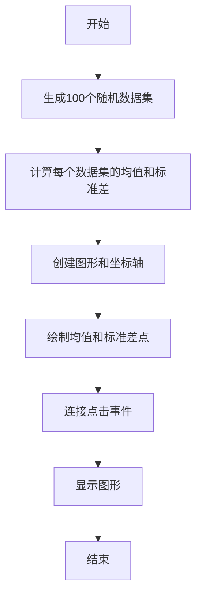

## 类结构

```
matplotlib.pyplot (matplotlib模块)
├── numpy (numpy模块)
│   ├── np.random (numpy.random模块)
│   └── np.mean, np.std (numpy函数)
└── pick_event_demo_2 (主模块)
```

## 全局变量及字段


### `X`
    
A 100x1000 array of random numbers representing the data sets.

类型：`numpy.ndarray`
    


### `xs`
    
An array containing the mean of each data set in X.

类型：`numpy.ndarray`
    


### `ys`
    
An array containing the standard deviation of each data set in X.

类型：`numpy.ndarray`
    


### `fig`
    
The main figure object created by Matplotlib for plotting.

类型：`matplotlib.figure.Figure`
    


### `ax`
    
The axes object on which the plot is drawn.

类型：`matplotlib.axes._subplots.AxesSubplot`
    


### `line`
    
The line object representing the plot of mu vs. sigma on the axes object.

类型：`matplotlib.lines.Line2D`
    


### `matplotlib.pyplot.fig`
    
The main figure object.

类型：`matplotlib.figure.Figure`
    


### `matplotlib.pyplot.ax`
    
The axes object where the plot is drawn.

类型：`matplotlib.axes._subplots.AxesSubplot`
    


### `matplotlib.pyplot.line`
    
The line object representing the plot of mu vs. sigma.

类型：`matplotlib.lines.Line2D`
    
    

## 全局函数及方法


### onpick

This function is triggered when a pick event occurs on the plot. It is responsible for creating a new figure and plotting the raw data from the dataset corresponding to the clicked point.

参数：

- `event`：`matplotlib.event.PickEvent`，The pick event object that contains information about the event, such as the artist that was picked and the indices of the data points that were picked.

返回值：`None`，This function does not return any value.

#### 流程图

```mermaid
graph LR
A[onpick] --> B{Is event.artist == line?}
B -- Yes --> C[Create new figure]
B -- No --> D[Return]
C --> E[Loop through dataind]
E --> F[Plot X[dataind]]
F --> G[Add text with mu and sigma]
G --> H[Set y-axis limit]
H --> I[Show figure]
I --> J[End]
```

#### 带注释源码

```python
def onpick(event):
    # Check if the picked artist is the line we are interested in
    if event.artist != line:
        return

    # Number of data points picked
    N = len(event.ind)
    if not N:
        return

    # Create a new figure for the raw data
    figi, axs = plt.subplots(N, squeeze=False)

    # Loop through each data index picked
    for ax, dataind in zip(axs.flat, event.ind):
        # Plot the raw data for the picked dataset
        ax.plot(X[dataind])
        # Add text with the mean (mu) and standard deviation (sigma) of the dataset
        ax.text(.05, .9, f'mu={xs[dataind]:1.3f}\nsigma={ys[dataind]:1.3f}',
                transform=ax.transAxes, va='top')
        # Set the y-axis limit for all subplots
        ax.set_ylim(-0.5, 1.5)
    # Show the new figure with the raw data
    figi.show()
```


### plt.subplots

`subplots` 是 `matplotlib.pyplot` 模块中的一个函数，用于创建一个图形和一个或多个轴。

参数：

- `figsize`：`tuple`，图形的大小（宽度和高度），默认为 `(6, 4)`。
- `dpi`：`int`，图形的分辨率，默认为 `100`。
- `facecolor`：`color`，图形的背景颜色，默认为 `'white'`。
- `edgecolor`：`color`，图形的边缘颜色，默认为 `'none'`。
- `frameon`：`bool`，是否显示图形的边框，默认为 `True`。
- `num`：`int`，要创建的轴的数量，默认为 `1`。
- `gridspec_kw`：`dict`，用于定义网格规格的字典。
- `constrained_layout`：`bool`，是否启用约束布局，默认为 `False`。
- `sharex`：`bool` 或 `str`，是否共享 x 轴，默认为 `False`。
- `sharey`：`bool` 或 `str`，是否共享 y 轴，默认为 `False`。
- `subplot_kw`：`dict`，用于定义子图规格的字典。

返回值：`Figure` 对象，包含一个或多个轴。

#### 流程图

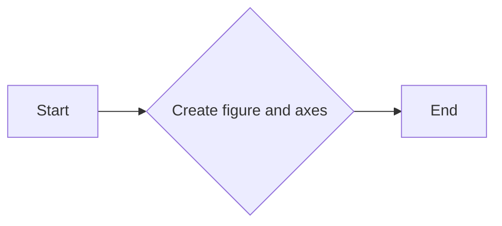

#### 带注释源码

```python
fig, ax = plt.subplots()
# fig: 创建一个图形对象
# ax: 创建一个轴对象，用于绘制图形
```


### matplotlib.pyplot.set_title

设置当前轴的标题。

参数：

- `title`：`str`，要设置的标题文本。
- `loc`：`str` 或 `int`，标题的位置，默认为 'center'。
- `pad`：`float`，标题与轴边缘的距离，默认为 5。
- `fontsize`：`float`，标题的字体大小，默认为 10。
- `fontweight`：`str` 或 `int`，标题的字体粗细，默认为 'normal'。
- `color`：`str` 或 `color`，标题的颜色，默认为 'black'。
- `verticalalignment`：`str`，垂直对齐方式，默认为 'bottom'。
- `horizontalalignment`：`str`，水平对齐方式，默认为 'center'。

返回值：`matplotlib.text.Text`，标题文本的 Text 对象。

#### 流程图

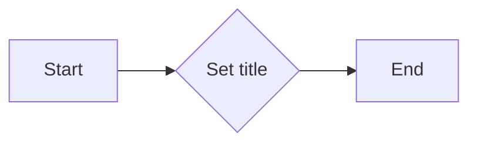

#### 带注释源码

```python
fig, ax = plt.subplots()
ax.set_title('click on point to plot time series')
```


### matplotlib.pyplot.plot

matplotlib.pyplot.plot 是一个用于绘制二维数据的函数。

参数：

- `xs`：`numpy.ndarray`，数据点的 x 坐标。
- `ys`：`numpy.ndarray`，数据点的 y 坐标。
- `'o'`：`str`，标记样式，这里使用圆圈标记。
- `picker=True`：`bool`，启用拾取功能。
- `pickradius=5`：`int`，拾取半径。

返回值：`Line2D` 对象，表示绘制的线。

#### 流程图

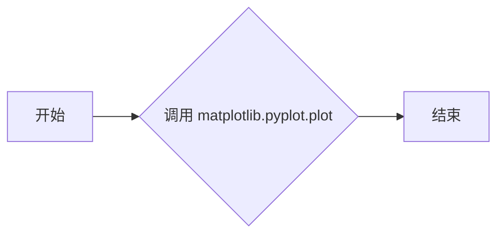

#### 带注释源码

```python
line, = ax.plot(xs, ys, 'o', picker=True, pickradius=5)
```


### onpick

onpick 是一个事件处理函数，当用户点击图上的点时被调用。

参数：

- `event`：`matplotlib.events.PickEvent` 对象，包含拾取事件的信息。

返回值：无。

#### 流程图

```mermaid
graph LR
A[开始] --> B{检查 event.artist 是否为 line}
if (B) --> C{获取点击点的索引}
if (C) --> D{创建子图}
D --> E{遍历索引}
E --> F{绘制数据点}
F --> G{显示子图}
G --> H[结束]
```

#### 带注释源码

```python
def onpick(event):
    if event.artist != line:
        return

    N = len(event.ind)
    if not N:
        return

    figi, axs = plt.subplots(N, squeeze=False)
    for ax, dataind in zip(axs.flat, event.ind):
        ax.plot(X[dataind])
        ax.text(.05, .9, f'mu={xs[dataind]:1.3f}\nsigma={ys[dataind]:1.3f}',
                transform=ax.transAxes, va='top')
        ax.set_ylim(-0.5, 1.5)
    figi.show()
```


### matplotlib.pyplot.mpl_connect

连接一个事件处理函数到matplotlib图形的画布上。

描述：

该函数用于将一个事件处理函数连接到matplotlib图形的画布上，以便在特定事件发生时执行该函数。

参数：

- `event_name`：`str`，事件名称，例如 'pick_event'。
- `func`：`callable`，事件发生时调用的函数。

返回值：`None`。

#### 流程图

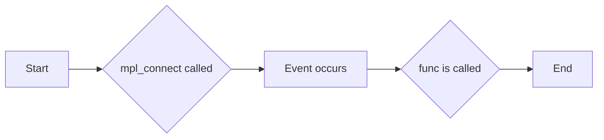

#### 带注释源码

```python
fig.canvas.mpl_connect('pick_event', onpick)
```

在这段代码中，`mpl_connect` 函数被调用来将名为 'pick_event' 的事件与 `onpick` 函数关联起来。这意味着每当用户在图形上点击时，`onpick` 函数将被调用。


### matplotlib.pyplot.show

matplotlib.pyplot.show 是一个全局函数，用于显示当前图形。

参数：

- 无

返回值：无

#### 流程图


#### 带注释源码

```python
import matplotlib.pyplot as plt
import numpy as np

# Fixing random state for reproducibility
np.random.seed(19680801)

X = np.random.rand(100, 1000)
xs = np.mean(X, axis=1)
ys = np.std(X, axis=1)

fig, ax = plt.subplots()
ax.set_title('click on point to plot time series')
line, = ax.plot(xs, ys, 'o', picker=True, pickradius=5)

def onpick(event):
    # Event handling function for picking
    pass

fig.canvas.mpl_connect('pick_event', onpick)

plt.show()
```


### numpy.random.seed

`numpy.random.seed` 是一个全局函数，用于设置随机数生成器的种子。

参数：

- `seed`：`int`，用于初始化随机数生成器的种子值。

参数描述：`seed` 参数用于设置随机数生成器的初始状态，确保每次运行代码时生成的随机数序列相同。

返回值：`None`

返回值描述：该函数没有返回值。

#### 流程图

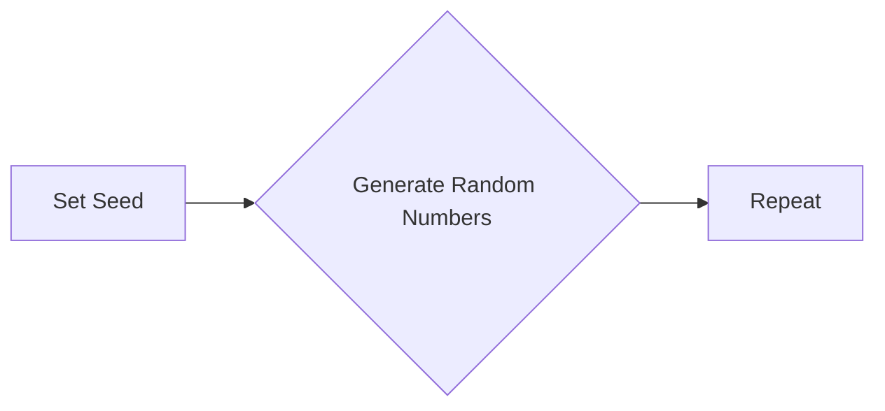

#### 带注释源码

```python
# Fixing random state for reproducibility
np.random.seed(19680801)
```


```python
"""
Fixing random state for reproducibility
"""
import numpy as np

# Fixing random state for reproducibility
np.random.seed(19680801)
```


### numpy.mean

计算输入数组的平均值。

参数：

- `a`：`numpy.ndarray`，输入数组。
- `axis`：`int`或`tuple`，沿指定轴计算平均值。默认为`None`，计算整个数组。

返回值：`numpy.ndarray`或`float`，计算得到的平均值。

#### 流程图

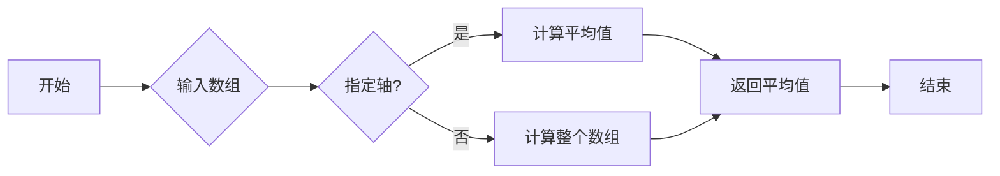

#### 带注释源码

```python
import numpy as np

# 计算平均值
mean_value = np.mean(X, axis=1)
```


### matplotlib.pyplot.plot

创建一个二维线图。

参数：

- `x`：`array_like`，x轴数据。
- `y`：`array_like`，y轴数据。
- `fmt`：`str`，用于指定线型、标记和颜色。
- `picker`：`bool`或`int`，启用或禁用拾取功能。
- `pickradius`：`float`，拾取半径。

返回值：`Line2D`对象。

#### 流程图

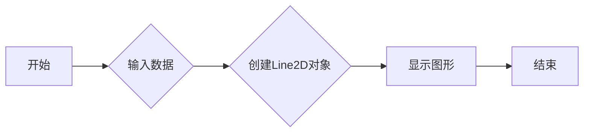

#### 带注释源码

```python
import matplotlib.pyplot as plt

# 创建线图
line, = plt.plot(xs, ys, 'o', picker=True, pickradius=5)
```


### matplotlib.pyplot.subplots

创建一个子图。

参数：

- `nrows`：`int`，子图行数。
- `ncols`：`int`，子图列数。
- `sharex`：`bool`，是否共享x轴。
- `sharey`：`bool`，是否共享y轴。
- `fig`：`Figure`对象，可选，用于指定父图。

返回值：`AxesSubplot`对象。

#### 流程图

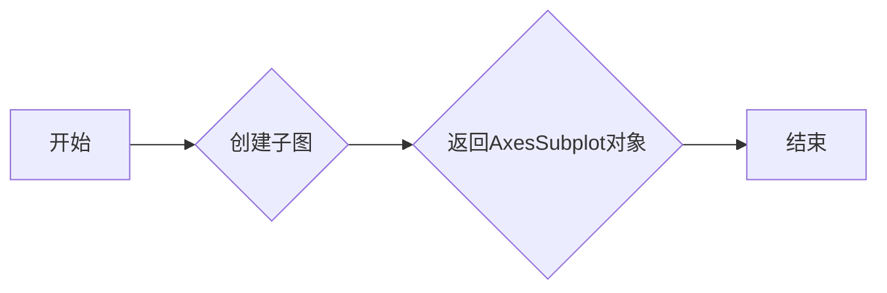

#### 带注释源码

```python
import matplotlib.pyplot as plt

# 创建子图
figi, axs = plt.subplots(N, squeeze=False)
```


### matplotlib.pyplot.text

在轴上添加文本。

参数：

- `x`：`float`，文本x坐标。
- `y`：`float`，文本y坐标。
- `s`：`str`，要添加的文本。
- `transform`：`Transform`对象，可选，用于指定文本的坐标系统。
- `va`：`str`，垂直对齐方式。

#### 流程图

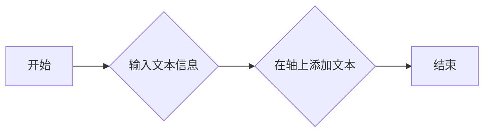

#### 带注释源码

```python
import matplotlib.pyplot as plt

# 在轴上添加文本
ax.text(.05, .9, f'mu={xs[dataind]:1.3f}\nsigma={ys[dataind]:1.3f}',
        transform=ax.transAxes, va='top')
```


### matplotlib.pyplot.show

显示所有图形。

#### 流程图

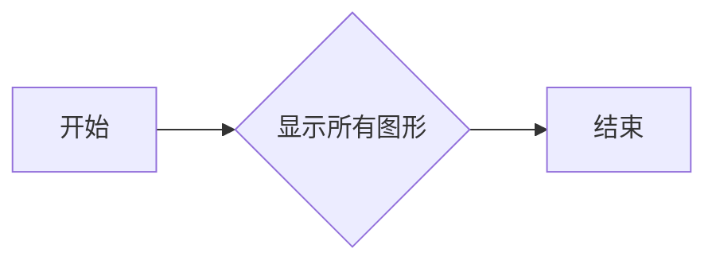

#### 带注释源码

```python
import matplotlib.pyplot as plt

# 显示所有图形
plt.show()
```


### 关键组件信息

- `numpy.mean`：计算平均值。
- `matplotlib.pyplot.plot`：创建二维线图。
- `matplotlib.pyplot.subplots`：创建子图。
- `matplotlib.pyplot.text`：在轴上添加文本。
- `matplotlib.pyplot.show`：显示所有图形。


### 潜在的技术债务或优化空间

- 代码中使用了硬编码的随机种子，这可能会影响可重复性。
- 代码中没有使用异常处理来处理潜在的运行时错误。
- 代码中没有使用日志记录来记录关键步骤或错误信息。


### 设计目标与约束

- 设计目标是创建一个交互式的图形界面，用于可视化数据集的平均值和标准差。
- 约束包括使用NumPy和Matplotlib库。


### 错误处理与异常设计

- 代码中没有显式地处理异常。
- 建议在关键操作中添加异常处理，以确保程序的健壮性。


### 数据流与状态机

- 数据流从NumPy生成的随机数组开始，然后通过Matplotlib进行可视化。
- 状态机由用户交互触发，例如点击图形上的点。


### 外部依赖与接口契约

- NumPy和Matplotlib是外部依赖。
- NumPy提供了数组操作接口，Matplotlib提供了图形绘制接口。
```


### numpy.std

计算数组中元素的标准差。

参数：

- `a`：`numpy.ndarray`，输入数组。
- `axis`：`int`或`tuple`，沿指定轴计算标准差。默认为`None`，计算整个数组的标准差。

返回值：`numpy.ndarray`，包含输入数组中每个元素的标准差。

#### 流程图

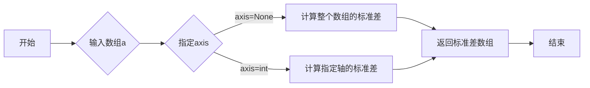

#### 带注释源码

```python
import numpy as np

def std(a, axis=None):
    """
    Compute the standard deviation along a specified axis.

    Parameters
    ----------
    a : ndarray
        Input array.
    axis : int or tuple of ints, optional
        Axis along which to compute the standard deviation. The default is None,
        which means to compute the standard deviation of the flattened array.

    Returns
    -------
    ndarray
        The standard deviation along the specified axis.

    Examples
    --------
    >>> a = np.array([[1, 2], [3, 4]])
    >>> np.std(a)
    1.4142135623730951
    >>> np.std(a, axis=0)
    array([1.41421356, 1.41421356])
    >>> np.std(a, axis=1)
    array([0.        , 0.70710678])
    """
    return np.var(a, ddof=1, axis=axis, out=None)
```


## 关键组件


### 张量索引

张量索引用于从大型数据集中提取特定数据子集，例如在计算均值和标准差时，用于从每个数据集中提取单个样本。

### 惰性加载

惰性加载是一种数据加载策略，它仅在需要时才加载数据，以减少内存消耗和提高性能。

### 反量化支持

反量化支持允许在量化过程中恢复原始数据，以便进行进一步的分析或处理。

### 量化策略

量化策略定义了如何将浮点数数据转换为固定点数表示，以减少模型大小和提高推理速度。


## 问题及建议


### 已知问题

-   **代码可重用性低**：代码片段是特定于当前示例的，缺乏通用性，难以在其他项目中重用。
-   **异常处理不足**：代码中没有明显的异常处理机制，如果发生错误（例如，matplotlib版本不兼容），可能会导致程序崩溃。
-   **交互性限制**：虽然代码提供了交互性，但仅限于点击事件，没有提供其他形式的用户交互。
-   **性能问题**：对于大型数据集，绘制和交互可能会变得缓慢。

### 优化建议

-   **模块化代码**：将代码分解成更小的、可重用的模块，以便在其他项目中重用。
-   **增加异常处理**：在关键操作中添加异常处理，确保程序在遇到错误时能够优雅地处理。
-   **提供更多交互性**：增加其他交互方式，如键盘输入、滑块等，以增强用户体验。
-   **优化性能**：考虑使用更高效的数据结构和算法来处理和显示数据，特别是在处理大型数据集时。
-   **文档和注释**：为代码添加详细的文档和注释，以提高代码的可读性和可维护性。
-   **单元测试**：编写单元测试以确保代码的稳定性和可靠性。
-   **版本控制**：使用版本控制系统（如Git）来管理代码变更，以便跟踪代码的演变和修复问题。


## 其它


### 设计目标与约束

- 设计目标：实现一个交互式的可视化工具，用于展示数据集的平均值和标准差，并允许用户通过点击特定的点来查看生成该点的原始数据。
- 约束条件：使用Matplotlib库进行数据可视化，确保代码的可重用性和可维护性。

### 错误处理与异常设计

- 错误处理：在代码中应添加异常处理机制，以捕获并处理可能出现的错误，例如文件读取错误、数据格式错误等。
- 异常设计：定义清晰的异常类型和错误消息，以便于用户和开发者能够快速定位和解决问题。

### 数据流与状态机

- 数据流：数据从随机生成的数据集开始，经过计算平均值和标准差，然后通过Matplotlib进行可视化。
- 状态机：程序在运行过程中没有明确的状态转换，但用户交互（如点击事件）可以触发特定的操作。

### 外部依赖与接口契约

- 外部依赖：代码依赖于Matplotlib和NumPy库，这些库需要正确安装和配置。
- 接口契约：Matplotlib和NumPy库提供了明确的接口和文档，开发者需要遵循这些契约来使用这些库的功能。


    