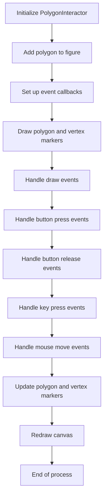
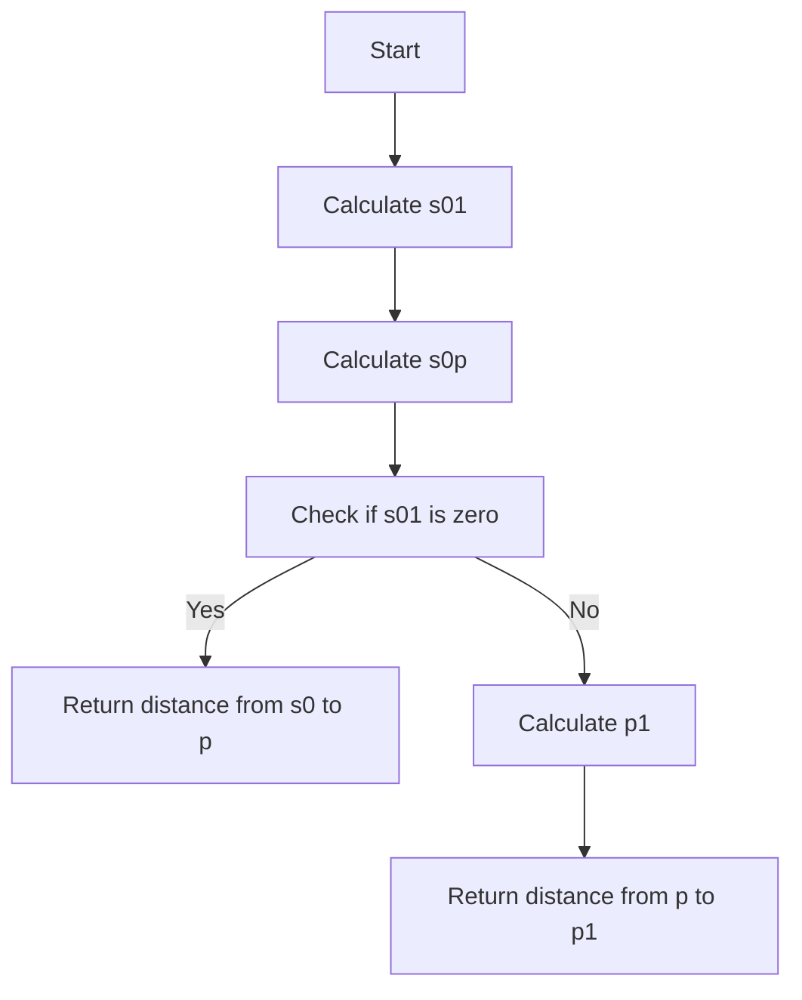
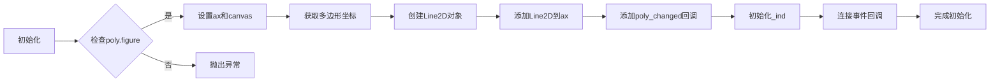
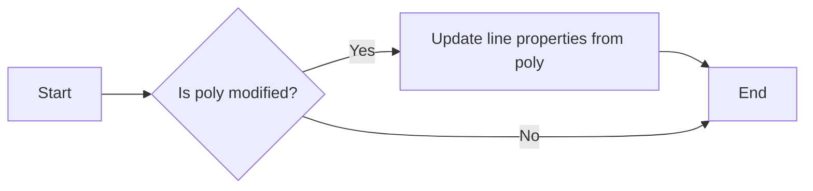
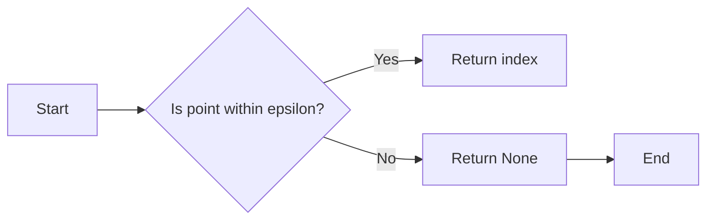
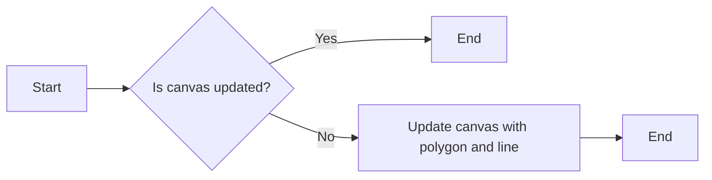
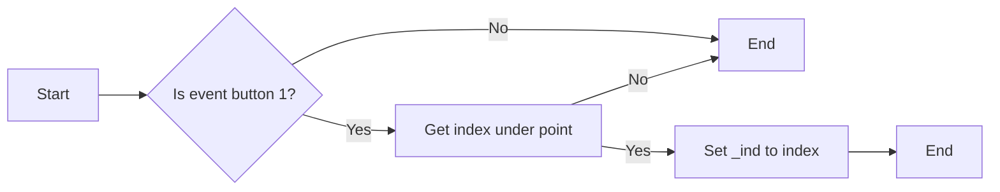
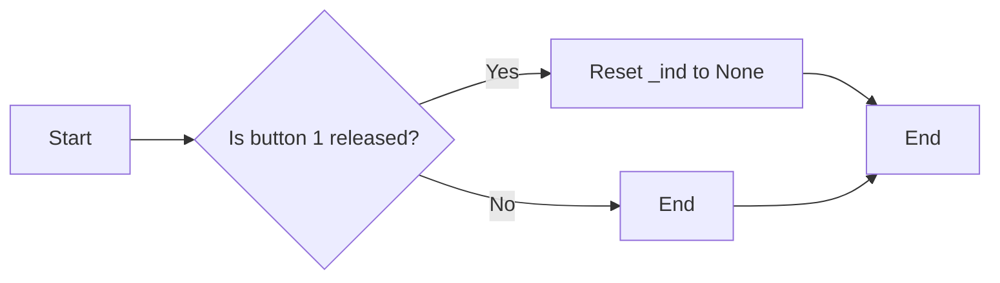
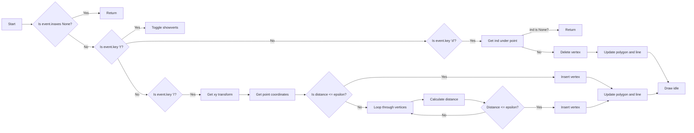
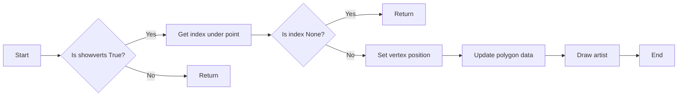

# `matplotlib\galleries\examples\event_handling\poly_editor.py` 详细设计文档

This code provides an interactive polygon editor using Matplotlib's event handling to manipulate vertices of a polygon on a canvas.

## 整体流程



## 类结构

```
PolygonInteractor (类)
├── __init__(self, ax, poly)
│   ├── ax (matplotlib.axes.Axes)
│   ├── poly (matplotlib.patches.Polygon)
│   ├── line (matplotlib.lines.Line2D)
│   ├── cid (int)
│   ├── _ind (int)
│   └── canvas (matplotlib.backends.backend_agg.FigureCanvasAgg)
├── poly_changed(self, poly)
│   └── Update line properties from polygon
├── get_ind_under_point(self, event)
│   └── Return index of vertex closest to event position
├── on_draw(self, event)
│   └── Handle draw event to redraw canvas
├── on_button_press(self, event)
│   └── Handle button press to select vertex
├── on_button_release(self, event)
│   └── Handle button release to deselect vertex
├── on_key_press(self, event)
│   └── Handle key press to toggle vertex visibility, delete vertex, or insert vertex
└── on_mouse_move(self, event)
   └── Handle mouse move to move vertex
```

## 全局变量及字段


### `showverts`
    
Toggle vertex markers on and off.

类型：`bool`
    


### `epsilon`
    
Maximum pixel distance to count as a vertex hit.

类型：`int`
    


### `PolygonInteractor.ax`
    
Axes object containing the polygon.

类型：`matplotlib.axes.Axes`
    


### `PolygonInteractor.poly`
    
Polygon object being interacted with.

类型：`matplotlib.patches.Polygon`
    


### `PolygonInteractor.line`
    
Line object representing the polygon's vertices.

类型：`matplotlib.lines.Line2D`
    


### `PolygonInteractor.cid`
    
Callback ID for the polygon's changed event.

类型：`int`
    


### `PolygonInteractor._ind`
    
Index of the active vertex.

类型：`int`
    


### `PolygonInteractor.canvas`
    
Canvas object for the figure.

类型：`matplotlib.backends.backend_agg.FigureCanvasAgg`
    
    

## 全局函数及方法


### dist_point_to_segment

Get the distance from the point to the segment.

参数：

- `p`：`[x, y]` array，The point to calculate the distance from.
- `s0`：`[x, y]` array，The starting point of the segment.
- `s1`：`[x, y]` array，The ending point of the segment.

返回值：`float`，The distance from the point to the segment.

#### 流程图



#### 带注释源码

```python
def dist_point_to_segment(p, s0, s1):
    """
    Get the distance from the point *p* to the segment (*s0*, *s1*), where
    *p*, *s0*, *s1* are ``[x, y]`` arrays.
    """
    s01 = s1 - s0
    s0p = p - s0
    if (s01 == 0).all():
        return np.hypot(*s0p)
    # Project onto segment, without going past segment ends.
    p1 = s0 + np.clip((s0p @ s01) / (s01 @ s01), 0, 1) * s01
    return np.hypot(*(p - p1))
```


### PolygonInteractor.__init__

初始化PolygonInteractor类，为多边形编辑器设置交互功能。

参数：

- `ax`：`matplotlib.axes.Axes`，用于绘制多边形的轴对象。
- `poly`：`matplotlib.patches.Polygon`，要交互的多边形对象。

返回值：无

#### 流程图



#### 带注释源码

```python
def __init__(self, ax, poly):
    if poly.figure is None:
        raise RuntimeError('You must first add the polygon to a figure '
                           'or canvas before defining the interactor')
    self.ax = ax
    canvas = poly.figure.canvas
    self.poly = poly

    x, y = zip(*self.poly.xy)
    self.line = Line2D(x, y,
                       marker='o', markerfacecolor='r',
                       animated=True)
    self.ax.add_line(self.line)

    self.cid = self.poly.add_callback(self.poly_changed)
    self._ind = None  # the active vert

    canvas.mpl_connect('draw_event', self.on_draw)
    canvas.mpl_connect('button_press_event', self.on_button_press)
    canvas.mpl_connect('key_press_event', self.on_key_press)
    canvas.mpl_connect('button_release_event', self.on_button_release)
    canvas.mpl_connect('motion_notify_event', self.on_mouse_move)
    self.canvas = canvas
```


### PolygonInteractor.poly_changed

This method is called whenever the pathpatch object of the polygon is modified, updating the associated line object to reflect the changes.

参数：

- `poly`：`matplotlib.patches.PathPatch`，The polygon object that has been modified.

返回值：`None`，This method does not return any value.

#### 流程图



#### 带注释源码

```python
def poly_changed(self, poly):
    """This method is called whenever the pathpatch object is called."""
    # only copy the artist props to the line (except visibility)
    vis = self.line.get_visible()
    Artist.update_from(self.line, poly)
    self.line.set_visible(vis)  # don't use the poly visibility state
```


### PolygonInteractor.get_ind_under_point

Return the index of the point closest to the event position or `None` if no point is within `self.epsilon` to the event position.

参数：

- `event`：`matplotlib.event.Event`，The event object that triggered the method call. It contains information about the mouse position, button state, and other event-related data.

返回值：`int` or `None`，The index of the point closest to the event position or `None` if no point is within `self.epsilon` to the event position.

#### 流程图



#### 带注释源码

```python
def get_ind_under_point(self, event):
    """
    Return the index of the point closest to the event position or None
    if no point is within self.epsilon to the event position.
    """
    # display coords
    xy = np.asarray(self.poly.xy)
    xyt = self.poly.get_transform().transform(xy)
    xt, yt = xyt[:, 0], xyt[:, 1]
    d = np.hypot(xt - event.x, yt - event.y)
    indseq, = np.nonzero(d == d.min())
    ind = indseq[0]

    if d[ind] >= self.epsilon:
        ind = None

    return ind
```


### PolygonInteractor.on_draw

This method handles the drawing event for the polygon editor. It updates the canvas with the latest state of the polygon and the line representing the vertices.

参数：

- `event`：`matplotlib.event.Event`，The drawing event object.

返回值：`None`，This method does not return any value.

#### 流程图



#### 带注释源码

```python
def on_draw(self, event):
    self.background = self.canvas.copy_from_bbox(self.ax.bbox)
    self.ax.draw_artist(self.poly)
    self.ax.draw_artist(self.line)
    # do not need to blit here, this will fire before the screen is
    # updated
```


### PolygonInteractor.on_button_press

This method is a callback for mouse button presses and is used to handle the interaction with the polygon vertices.

参数：

- `event`：`matplotlib.event.Event`，The event object containing information about the mouse press.

返回值：`None`，This method does not return any value.

#### 流程图



#### 带注释源码

```python
def on_button_press(self, event):
    """Callback for mouse button presses."""
    if not self.showverts:
        return
    if event.inaxes is None:
        return
    if event.button != 1:
        return
    self._ind = self.get_ind_under_point(event)
```


### PolygonInteractor.on_button_release

This method is a callback for mouse button release events. It is used to reset the active vertex index when the user releases the mouse button.

参数：

- `event`：`matplotlib.event.Event`，The event object containing information about the mouse button release event.

返回值：`None`，This method does not return any value.

#### 流程图



#### 带注释源码

```python
def on_button_release(self, event):
    """Callback for mouse button releases."""
    if not self.showverts:
        return
    if event.button != 1:
        return
    self._ind = None
```


### PolygonInteractor.on_key_press

This method handles key presses in the polygon editor. It toggles vertex markers, deletes vertices, or inserts new vertices based on the key pressed.

参数：

- `event`：`matplotlib.event.Event`，The event object containing information about the key press.

返回值：`None`，This method does not return a value.

#### 流程图



#### 带注释源码

```python
def on_key_press(self, event):
    """Callback for key presses."""
    if not event.inaxes:
        return
    if event.key == 't':
        self.showverts = not self.showverts
        self.line.set_visible(self.showverts)
        if not self.showverts:
            self._ind = None
    elif event.key == 'd':
        ind = self.get_ind_under_point(event)
        if ind is not None:
            self.poly.xy = np.delete(self.poly.xy,
                                     ind, axis=0)
            self.line.set_data(zip(*self.poly.xy))
    elif event.key == 'i':
        xys = self.poly.get_transform().transform(self.poly.xy)
        p = event.x, event.y  # display coords
        for i in range(len(xys) - 1):
            s0 = xys[i]
            s1 = xys[i + 1]
            d = dist_point_to_segment(p, s0, s1)
            if d <= self.epsilon:
                self.poly.xy = np.insert(
                    self.poly.xy, i+1,
                    [event.xdata, event.ydata],
                    axis=0)
                self.line.set_data(zip(*self.poly.xy))
                break
    if self.line.stale:
        self.canvas.draw_idle()
``` 


### PolygonInteractor.on_mouse_move

This method is a callback for mouse movement events. It updates the position of the vertex that is currently being interacted with by the user.

参数：

- `event`：`matplotlib.event.Event`，The event object containing information about the mouse movement.

返回值：`None`，This method does not return any value.

#### 流程图



#### 带注释源码

```python
def on_mouse_move(self, event):
    """Callback for mouse movements."""
    if not self.showverts:
        return
    if self._ind is None:
        return
    if event.inaxes is None:
        return
    if event.button != 1:
        return
    x, y = event.xdata, event.ydata

    self.poly.xy[self._ind] = x, y
    if self._ind == 0:
        self.poly.xy[-1] = x, y
    elif self._ind == len(self.poly.xy) - 1:
        self.poly.xy[0] = x, y
    self.line.set_data(zip(*self.poly.xy))

    self.canvas.restore_region(self.background)
    self.ax.draw_artist(self.poly)
    self.ax.draw_artist(self.line)
    self.canvas.blit(self.ax.bbox)
``` 


## 关键组件


### 张量索引与惰性加载

张量索引与惰性加载是代码中用于高效处理和访问大型数据集的关键组件。通过延迟计算和仅当需要时才加载数据，可以显著提高性能和内存效率。

### 反量化支持

反量化支持是代码中用于处理量化数据的关键组件。它允许在量化过程中对数据进行逆量化，以便在需要时恢复原始精度。

### 量化策略

量化策略是代码中用于优化数据表示和存储的关键组件。它通过减少数据精度来减少内存使用，同时保持足够的精度以避免性能损失。

## 问题及建议


### 已知问题

-   **全局变量和函数依赖性**：代码中使用了全局变量 `showverts` 和 `epsilon`，这些变量在类 `PolygonInteractor` 中被使用，但它们没有在类中声明，这可能导致代码的可维护性和可读性降低。
-   **错误处理**：代码中没有明确的错误处理机制，例如，当用户尝试删除最后一个顶点或插入顶点时，可能会引发错误。
-   **代码重复**：在 `on_mouse_move` 方法中，代码重复了 `self.poly.xy[self._ind] = x, y` 这一行，这可以通过使用一个循环来简化。
-   **性能问题**：在 `on_draw` 方法中，使用 `self.canvas.blit(self.ax.bbox)` 可能会导致性能问题，特别是在包含大量顶点的多边形上。

### 优化建议

-   **封装全局变量**：将全局变量 `showverts` 和 `epsilon` 移动到类 `PolygonInteractor` 中，并在类初始化时设置它们。
-   **添加错误处理**：在删除顶点或插入顶点之前，检查顶点的数量，并在必要时抛出异常。
-   **减少代码重复**：在 `on_mouse_move` 方法中，使用循环来更新顶点的位置，而不是重复相同的代码。
-   **优化绘图性能**：考虑使用更高效的绘图方法，例如，只在必要时重绘多边形的一部分，而不是整个画布。
-   **代码注释**：添加更多的代码注释，以提高代码的可读性和可维护性。
-   **单元测试**：编写单元测试来验证代码的功能，并确保在未来的修改中不会破坏现有的功能。


## 其它


### 设计目标与约束

- 设计目标：
  - 提供一个交互式的多边形编辑器，允许用户通过鼠标和键盘操作多边形的顶点。
  - 使用Matplotlib的事件处理机制来实现交互性。
  - 确保编辑器具有良好的用户体验，包括直观的界面和响应迅速的操作。

- 约束条件：
  - 必须使用Matplotlib库进行图形绘制。
  - 交互操作应限制在Matplotlib的画布内。
  - 代码应尽可能简洁，易于理解和维护。

### 错误处理与异常设计

- 错误处理：
  - 当尝试将多边形添加到未包含在图中的画布时，抛出`RuntimeError`。
  - 当用户尝试删除不存在的顶点时，不执行任何操作。
  - 当用户尝试插入顶点但不在现有顶点附近时，不执行任何操作。

- 异常设计：
  - 使用try-except块捕获可能发生的异常，并给出清晰的错误信息。

### 数据流与状态机

- 数据流：
  - 用户通过鼠标点击和键盘输入与多边形交互。
  - 事件处理函数根据用户输入更新多边形的顶点位置。

- 状态机：
  - 编辑器有两个状态：显示顶点标记和隐藏顶点标记。
  - 用户可以通过按't'键在两种状态之间切换。

### 外部依赖与接口契约

- 外部依赖：
  - Matplotlib库：用于图形绘制和事件处理。
  - NumPy库：用于数学计算。

- 接口契约：
  - `PolygonInteractor`类提供了一个接口，允许用户通过鼠标和键盘操作多边形。
  - `dist_point_to_segment`函数用于计算点与线段之间的距离。


    