# `matplotlib\galleries\examples\event_handling\pong_sgskip.py` 详细设计文档

This code implements a Pong game using Matplotlib, allowing for interactive control of the game elements and speed adjustments.

## 整体流程

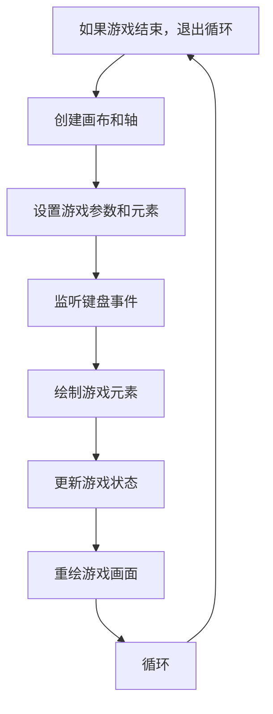

## 类结构

```
Game (游戏类)
├── Pad (挡板类)
│   ├── __init__(self, disp, x, y, type='l')
│   ├── contains(self, loc)
│   └── ...
├── Puck (乒乓球类)
│   ├── __init__(self, disp, pad, field)
│   ├── _reset(self, pad)
│   ├── update(self, pads)
│   └── ...
└── ... 
```

## 全局变量及字段


### `instructions`
    
Game instructions for players.

类型：`str`
    


### `fig`
    
The main figure object for the game.

类型：`matplotlib.figure.Figure`
    


### `ax`
    
The main axes object for the game.

类型：`matplotlib.axes._subplots.AxesSubplot`
    


### `canvas`
    
The canvas object for the game figure.

类型：`matplotlib.backends.backend_agg.FigureCanvasAgg`
    


### `animation`
    
The main game object.

类型：`Game`
    


### `tstart`
    
The start time of the game for performance measurement.

类型：`float`
    


### `Pad.disp`
    
The display object for the pad.

类型：`matplotlib.patches.Rectangle`
    


### `Pad.x`
    
The x-coordinate of the pad.

类型：`float`
    


### `Pad.y`
    
The y-coordinate of the pad.

类型：`float`
    


### `Pad.w`
    
The width of the pad.

类型：`float`
    


### `Pad.score`
    
The score of the pad.

类型：`int`
    


### `Pad.xoffset`
    
The x-offset of the pad from the center.

类型：`float`
    


### `Pad.yoffset`
    
The y-offset of the pad from the center.

类型：`float`
    


### `Pad.type`
    
The type of the pad (left or right).

类型：`str`
    


### `Pad.signx`
    
The sign of the x-coordinate for movement.

类型：`float`
    


### `Pad.signy`
    
The sign of the y-coordinate for movement.

类型：`float`
    


### `Puck.vmax`
    
The maximum velocity of the puck.

类型：`float`
    


### `Puck.disp`
    
The display object for the puck.

类型：`matplotlib.patches.Circle`
    


### `Puck.field`
    
The bounding box of the game field.

类型：`matplotlib.transforms.Bbox`
    


### `Puck.x`
    
The x-coordinate of the puck.

类型：`float`
    


### `Puck.y`
    
The y-coordinate of the puck.

类型：`float`
    


### `Puck.vx`
    
The x-velocity of the puck.

类型：`float`
    


### `Puck.vy`
    
The y-velocity of the puck.

类型：`float`
    


### `Game.ax`
    
The main axes object for the game.

类型：`matplotlib.axes._subplots.AxesSubplot`
    


### `Game.canvas`
    
The canvas object for the game figure.

类型：`matplotlib.backends.backend_agg.FigureCanvasAgg`
    


### `Game.background`
    
The background image for the game.

类型：`numpy.ndarray`
    


### `Game.cnt`
    
The count of frames drawn.

类型：`int`
    


### `Game.distract`
    
Whether to show distractors or not.

类型：`bool`
    


### `Game.res`
    
The resolution of the distractors.

类型：`float`
    


### `Game.on`
    
Whether the game is on or not.

类型：`bool`
    


### `Game.inst`
    
Whether to show instructions or not.

类型：`bool`
    


### `Game.pads`
    
The list of pad objects.

类型：`list`
    


### `Game.pucks`
    
The list of puck objects.

类型：`list`
    


### `Game.i`
    
The text object for the instructions.

类型：`matplotlib.text.Text`
    
    

## 全局函数及方法


### on_redraw

This function is triggered on the redraw event of the animation. It is responsible for resetting the background to None, which is necessary for the blitting mechanism to work correctly.

参数：

- `event`：`matplotlib.events.Event`，The redraw event object.

返回值：`None`，No return value.

#### 流程图

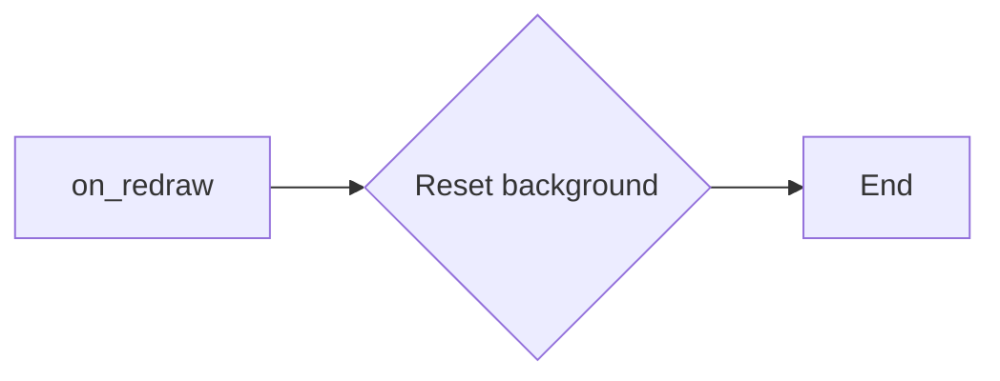

#### 带注释源码

```python
# reset the blitting background on redraw
def on_redraw(event):
    animation.background = None
```


### start_anim(event)

This function is triggered by a draw event and is responsible for starting the animation loop of the game.

参数：

- `event`：`matplotlib.backend_bases.Event`，The draw event that triggers the function.

返回值：`None`，This function does not return any value.

#### 流程图

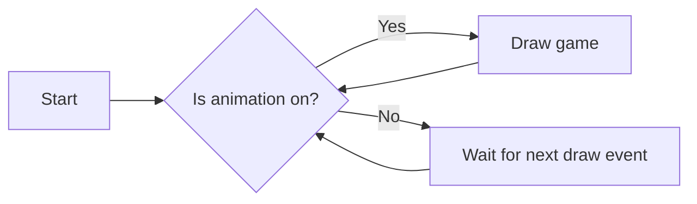

#### 带注释源码

```python
def start_anim(event):
    canvas.mpl_disconnect(start_anim.cid)

    start_anim.timer.add_callback(animation.draw)
    start_anim.timer.start()
    canvas.mpl_connect('draw_event', on_redraw)

    start_anim.cid = canvas.mpl_connect('draw_event', start_anim)
    start_anim.timer = animation.canvas.new_timer(interval=1)
```


### Pad.__init__

初始化 Pad 对象，设置其位置、大小、类型和方向。

参数：

- `disp`：`matplotlib.patches.Patch`，用于显示 Pad 的图形对象。
- `x`：`float`，Pad 的 x 坐标。
- `y`：`float`，Pad 的 y 坐标。
- `type`：`str`，Pad 的类型，'l' 表示左侧 Pad，'r' 表示右侧 Pad。

返回值：无

#### 流程图

```mermaid
classDef Pad
  Pad rect <<class>> {
    x: float
    y: float
    w: float
    score: int
    xoffset: float
    yoffset: float
    signx: float
    signy: float
  }

classDef PadType
  PadType rect <<class>> {
    type: str
  }

classDef PadTypeL
  PadTypeL rect <<PadType>> {
    type: 'l'
  }

classDef PadTypeR
  PadTypeR rect <<PadType>> {
    type: 'r'
  }

classDef PadTypeU
  PadTypeU rect <<PadType>> {
    type: 'u'
  }

Pad "Pad(disp, x, y, type='l')" {
  PadTypeL "type='l'" {
    type: 'l'
  }
  Pad "x=x, y=y, w=0.3, score=0, xoffset=0.3, yoffset=0.1, signx=-1.0, signy=1.0" {
    x: x
    y: y
    w: 0.3
    score: 0
    xoffset: 0.3
    yoffset: 0.1
    signx: -1.0
    signy: 1.0
  }
}
```

#### 带注释源码

```python
def __init__(self, disp, x, y, type='l'):
    self.disp = disp
    self.x = x
    self.y = y
    self.w = .3
    self.score = 0
    self.xoffset = 0.3
    self.yoffset = 0.1
    if type == 'r':
        self.xoffset *= -1.0

    if type == 'l' or type == 'r':
        self.signx = -1.0
        self.signy = 1.0
    else:
        self.signx = 1.0
        self.signy = -1.0
``` 


### Pad.contains

This method checks if a given location is within the bounding box of the pad.

参数：

- `loc`：`matplotlib.transforms.Bbox`，The location to check for containment.

返回值：`bool`，Returns `True` if the location is within the pad's bounding box, otherwise `False`.

#### 流程图

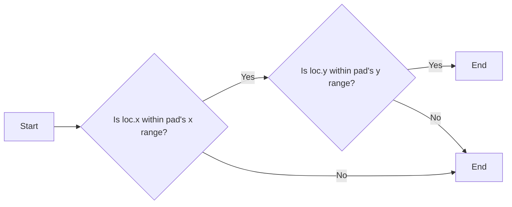

#### 带注释源码

```python
def contains(self, loc):
    return self.disp.get_bbox().contains(loc.x, loc.y)
```


### Puck.__init__

初始化Puck对象，设置其初始位置、速度和边界。

参数：

- `disp`：`matplotlib.animation.FuncAnimation`，用于显示Puck的动画。
- `pad`：`Pad`，Puck所在的板。
- `field`：`matplotlib.axes.Axes`，游戏区域。

返回值：无

#### 流程图

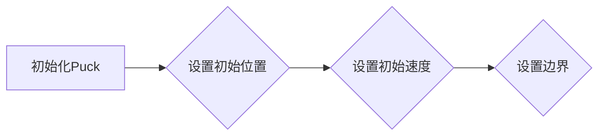

#### 带注释源码

```python
def __init__(self, disp, pad, field):
    self.vmax = .2  # Puck的最大速度
    self.disp = disp  # 用于显示Puck的动画
    self.field = field  # 游戏区域
    self._reset(pad)  # 重置Puck的位置和速度
```


### Puck._reset

重置Puck对象的位置和速度。

参数：

- pad：`Pad`，要重置的Puck对象所在的垫子。

返回值：无

#### 流程图

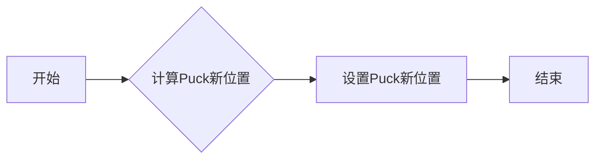

#### 带注释源码

```python
def _reset(self, pad):
    # 设置Puck的新位置
    self.x = pad.x + pad.xoffset
    if pad.y < 0:
        self.y = pad.y + pad.yoffset
    else:
        self.y = pad.y - pad.yoffset
    # 计算Puck的初始速度
    self.vx = pad.x - self.x
    self.vy = pad.y + pad.w/2 - self.y
    # 限制速度
    self._speedlimit()
    # 减慢速度
    self._slower()
    # 再次减慢速度
    self._slower()
``` 


### Puck.update

This method updates the position and velocity of the puck based on the interactions with the pads and the boundaries of the game field.

参数：

- `pads`：`Pad[]`，An array of Pad objects representing the two paddles in the game.

返回值：`bool`，Returns `True` if the puck has hit a boundary and needs to be reset, otherwise returns `False`.

#### 流程图

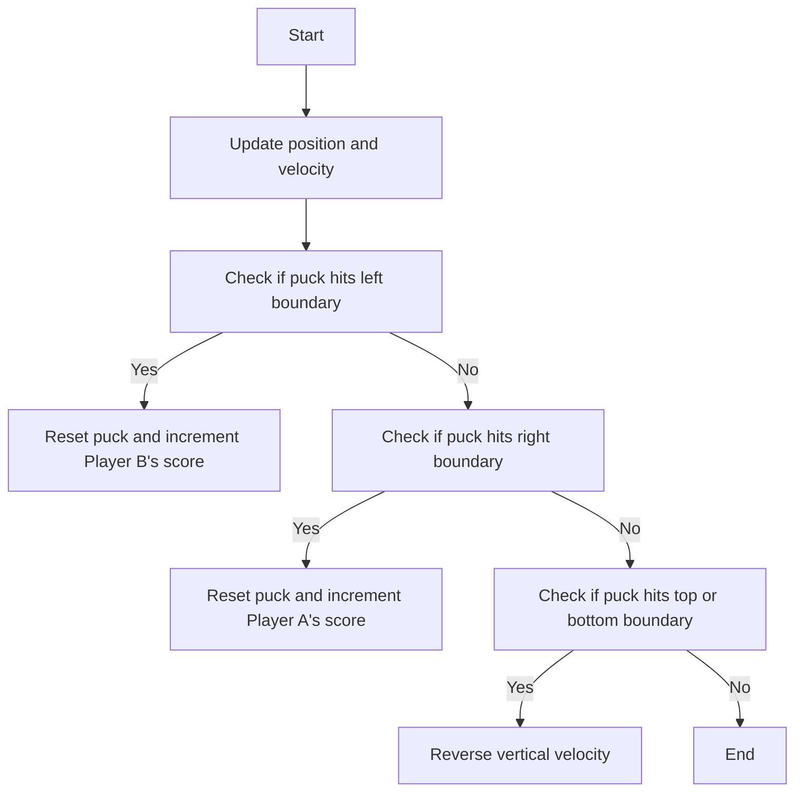

#### 带注释源码

```python
def update(self, pads):
    self.x += self.vx
    self.y += self.vy
    for pad in pads:
        if pad.contains(self):
            self.vx *= 1.2 * pad.signx
            self.vy *= 1.2 * pad.signy
    fudge = .001
    # probably cleaner with something like...
    if self.x < fudge:
        pads[1].score += 1
        self._reset(pads[0])
        return True
    if self.x > 7 - fudge:
        pads[0].score += 1
        self._reset(pads[1])
        return True
    if self.y < -1 + fudge or self.y > 1 - fudge:
        self.vy *= -1.0
        # add some randomness, just to make it interesting
        self.vy -= (randn()/300.0 + 1/300.0) * np.sign(self.vy)
    self._speedlimit()
    return False
```


### Puck._slower

`Puck._slower` 是 `Puck` 类的一个私有方法，用于减慢冰球的速度。

参数：

- 无

返回值：无

#### 流程图

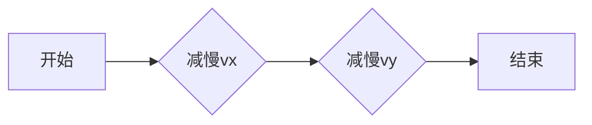

#### 带注释源码

```python
def _slower(self):
    self.vx /= 5.0
    self.vy /= 5.0
```


### Puck._faster

加速Puck对象的速度。

参数：

- 无

返回值：`None`，无返回值

#### 流程图

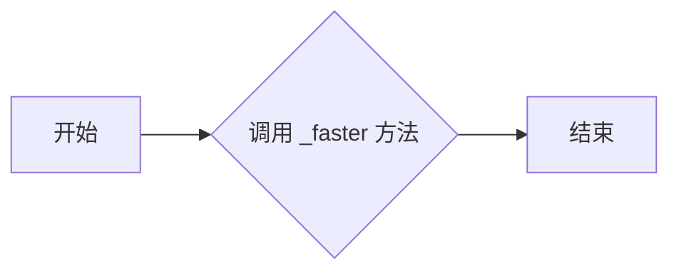

#### 带注释源码

```python
def _faster(self):
    self.vx *= 5.0
    self.vy *= 5.0
``` 


### Puck._speedlimit

限制Puck对象的水平速度。

参数：

- 无

返回值：`None`，无返回值

#### 流程图

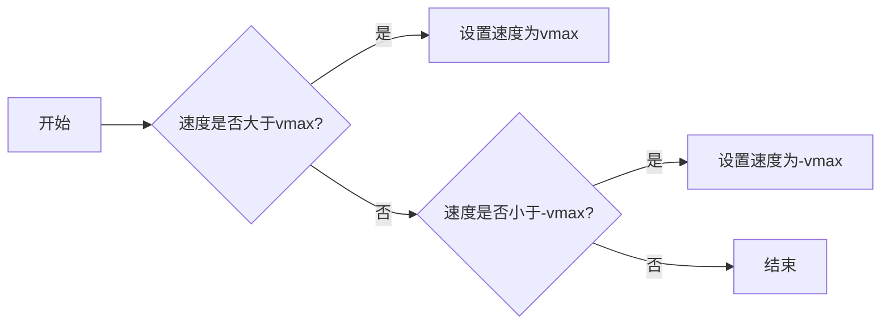

#### 带注释源码

```python
def _speedlimit(self):
    if self.vx > self.vmax:
        self.vx = self.vmax
    if self.vx < -self.vmax:
        self.vx = -self.vmax

    if self.vy > self.vmax:
        self.vy = self.vmax
    if self.vy < -self.vmax:
        self.vy = -self.vmax
```


### Game.__init__

初始化游戏对象，设置游戏环境，包括画布、球拍、障碍物、球和键盘事件处理。

参数：

- `ax`：`matplotlib.axes.Axes`，游戏画布的轴对象。

返回值：无

#### 流程图

```mermaid
classDiagram
    Game <|-- matplotlib.axes.Axes
    Game {
        ax
        canvas
        background
        cnt
        distract
        res
        on
        inst
        pads
        pucks
        i
        __init__(ax)
        draw()
        on_key_press(event)
    }
    Pad {
        disp
        x
        y
        w
        score
        xoffset
        yoffset
        signx
        signy
        contains(loc)
    }
    Puck {
        vmax
        disp
        field
        x
        y
        vx
        vy
        _reset(pad)
        update(pads)
        _slower()
        _faster()
        _speedlimit()
    }
```

#### 带注释源码

```python
def __init__(self, ax):
    # create the initial line
    self.ax = ax
    ax.xaxis.set_visible(False)
    ax.set_xlim(0, 7)
    ax.yaxis.set_visible(False)
    ax.set_ylim(-1, 1)
    pad_a_x = 0
    pad_b_x = .50
    pad_a_y = pad_b_y = .30
    pad_b_x += 6.3

    # pads
    pA, = self.ax.barh(pad_a_y, .2,
                       height=.3, color='k', alpha=.5, edgecolor='b',
                       lw=2, label="Player B",
                       animated=True)
    pB, = self.ax.barh(pad_b_y, .2,
                       height=.3, left=pad_b_x, color='k', alpha=.5,
                       edgecolor='r', lw=2, label="Player A",
                       animated=True)

    # distractors
    self.x = np.arange(0, 2.22*np.pi, 0.01)
    self.line, = self.ax.plot(self.x, np.sin(self.x), "r",
                              animated=True, lw=4)
    self.line2, = self.ax.plot(self.x, np.cos(self.x), "g",
                               animated=True, lw=4)
    self.line3, = self.ax.plot(self.x, np.cos(self.x), "g",
                               animated=True, lw=4)
    self.line4, = self.ax.plot(self.x, np.cos(self.x), "r",
                               animated=True, lw=4)

    # center line
    self.centerline, = self.ax.plot([3.5, 3.5], [1, -1], 'k',
                                     alpha=.5, animated=True, lw=8)

    # puck (s)
    self.puckdisp = self.ax.scatter([1], [1], label='_nolegend_',
                                    s=200, c='g',
                                    alpha=.9, animated=True)

    self.canvas = self.ax.figure.canvas
    self.background = None
    self.cnt = 0
    self.distract = True
    self.res = 100.0
    self.on = False
    self.inst = True    # show instructions from the beginning
    self.pads = [Pad(pA, pad_a_x, pad_a_y),
                 Pad(pB, pad_b_x, pad_b_y, 'r')]
    self.pucks = []
    self.i = self.ax.annotate(instructions, (.5, 0.5),
                              name='monospace',
                              verticalalignment='center',
                              horizontalalignment='center',
                              multialignment='left',
                              xycoords='axes fraction',
                              animated=False)
    self.canvas.mpl_connect('key_press_event', self.on_key_press)
```


### Game.draw

`Game.draw` 方法是 `Game` 类的一个实例方法，它负责绘制游戏的状态，包括球拍、球、干扰物和中心线。

参数：

- 无

返回值：无

#### 流程图

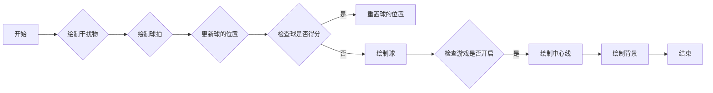

#### 带注释源码

```python
def draw(self):
    draw_artist = self.ax.draw_artist
    if self.background is None:
        self.background = self.canvas.copy_from_bbox(self.ax.bbox)

    # restore the clean slate background
    self.canvas.restore_region(self.background)

    # show the distractors
    if self.distract:
        self.line.set_ydata(np.sin(self.x + self.cnt/self.res))
        self.line2.set_ydata(np.cos(self.x - self.cnt/self.res))
        self.line3.set_ydata(np.tan(self.x + self.cnt/self.res))
        self.line4.set_ydata(np.tan(self.x - self.cnt/self.res))
        draw_artist(self.line)
        draw_artist(self.line2)
        draw_artist(self.line3)
        draw_artist(self.line4)

    # pucks and pads
    if self.on:
        self.ax.draw_artist(self.centerline)
        for pad in self.pads:
            pad.disp.set_y(pad.y)
            pad.disp.set_x(pad.x)
            self.ax.draw_artist(pad.disp)

        for puck in self.pucks:
            if puck.update(self.pads):
                # we only get here if someone scored
                self.pads[0].disp.set_label(f"   {self.pads[0].score}")
                self.pads[1].disp.set_label(f"   {self.pads[1].score}")
                self.ax.legend(loc='center', framealpha=.2,
                               facecolor='0.5',
                               prop=FontProperties(size='xx-large',
                                                       weight='bold'))

                self.background = None
                self.canvas.draw_idle()
                return
            puck.disp.set_offsets([[puck.x, puck.y]])
            self.ax.draw_artist(puck.disp)

    # just redraw the Axes rectangle
    self.canvas.blit(self.ax.bbox)
    self.canvas.flush_events()
    if self.cnt == 50000:
        # just so we don't get carried away
        print("...and you've been playing for too long!!!")
        plt.close()

    self.cnt += 1
```


### Game.on_key_press

This method handles key press events in the game. It updates the game state based on the key pressed by the user.

参数：

- `event`：`matplotlib.backend_bases.Event`，Represents the key press event.

返回值：`None`，This method does not return any value.

#### 流程图

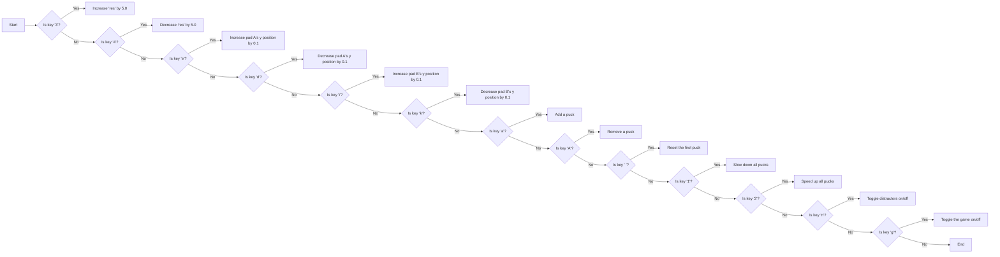

#### 带注释源码

```python
def on_key_press(self, event):
    if event.key == '3':
        self.res *= 5.0
    if event.key == '4':
        self.res /= 5.0

    if event.key == 'e':
        self.pads[0].y += .1
        if self.pads[0].y > 1 - .3:
            self.pads[0].y = 1 - .3
    if event.key == 'd':
        self.pads[0].y -= .1
        if self.pads[0].y < -1:
            self.pads[0].y = -1

    if event.key == 'i':
        self.pads[1].y += .1
        if self.pads[1].y > 1 - .3:
            self.pads[1].y = 1 - .3
    if event.key == 'k':
        self.pads[1].y -= .1
        if self.pads[1].y < -1:
            self.pads[1].y = -1

    if event.key == 'a':
        self.pucks.append(Puck(self.puckdisp,
                               self.pads[randint(2)],
                               self.ax.bbox))
    if event.key == 'A' and len(self.pucks):
        self.pucks.pop()
    if event.key == ' ' and len(self.pucks):
        self.pucks[0]._reset(self.pads[randint(2)])
    if event.key == '1':
        for p in self.pucks:
            p._slower()
    if event.key == '2':
        for p in self.pucks:
            p._faster()

    if event.key == 'n':
        self.distract = not self.distract

    if event.key == 'g':
        self.on = not self.on
    if event.key == 't':
        self.inst = not self.inst
        self.i.set_visible(not self.i.get_visible())
        self.background = None
        self.canvas.draw_idle()
    if event.key == 'q':
        plt.close()
``` 


## 关键组件


### 张量索引与惰性加载

张量索引与惰性加载是代码中处理数据的一种方式，它允许在需要时才计算或访问数据，从而提高效率。

### 反量化支持

反量化支持是代码中实现的一种功能，它允许对量化后的数据进行反量化处理，以便进行进一步的分析或操作。

### 量化策略

量化策略是代码中用于将数据转换为较低精度表示的方法，以减少内存使用和提高计算速度。它通常涉及将浮点数转换为整数，并使用固定的位数来表示数值范围。


## 问题及建议


### 已知问题

-   **全局变量和函数的可见性**：代码中存在一些全局变量和函数，如 `instructions`、`fig`、`ax` 和 `canvas`，这些在类外部定义，可能会引起命名冲突或难以追踪。
-   **代码重复**：`on_key_press` 方法中存在大量的重复代码，用于处理不同的按键事件。这可以通过将按键事件处理逻辑抽象为单独的函数来减少重复。
-   **性能问题**：`draw` 方法中存在大量的绘制操作，这可能会影响性能。可以考虑使用更高效的数据结构和算法来优化绘制过程。
-   **异常处理**：代码中没有明显的异常处理机制，这可能导致程序在遇到错误时崩溃。

### 优化建议

-   **封装全局变量**：将全局变量封装在类中，以减少命名冲突和增强代码的可维护性。
-   **抽象按键事件处理**：将 `on_key_press` 方法中的按键事件处理逻辑抽象为单独的函数，以减少代码重复并提高可读性。
-   **优化绘制过程**：考虑使用更高效的数据结构和算法来优化绘制过程，例如使用缓存或批量绘制。
-   **添加异常处理**：在代码中添加异常处理机制，以防止程序在遇到错误时崩溃，并提高程序的健壮性。
-   **代码注释**：添加必要的代码注释，以提高代码的可读性和可维护性。
-   **代码格式化**：使用代码格式化工具对代码进行格式化，以提高代码的可读性。
-   **单元测试**：编写单元测试来验证代码的正确性和稳定性。
-   **性能分析**：使用性能分析工具对代码进行性能分析，以找出性能瓶颈并进行优化。

## 其它


### 设计目标与约束

- 设计目标：
  - 创建一个基于Matplotlib的Pong游戏，展示如何编写易于移植到多个后端的自交互式动画。
  - 实现游戏的基本功能，包括得分、移动挡板、控制球的速度和方向等。
  - 提供用户交互功能，如控制挡板移动、添加/移除球、调整球的速度等。
- 约束：
  - 使用Matplotlib库进行图形绘制。
  - 保持代码简洁，易于理解和维护。
  - 确保游戏在多个后端上都能正常运行。

### 错误处理与异常设计

- 错误处理：
  - 对用户输入进行验证，防止无效输入导致的程序错误。
  - 在关键操作前进行错误检查，如检查挡板是否在有效范围内移动。
  - 使用try-except语句捕获并处理可能出现的异常。
- 异常设计：
  - 定义自定义异常类，用于处理特定错误情况。
  - 提供清晰的错误信息，帮助用户了解错误原因。

### 数据流与状态机

- 数据流：
  - 用户输入通过事件处理函数传递给游戏逻辑。
  - 游戏逻辑根据输入更新游戏状态，如挡板位置、球的位置和速度等。
  - 游戏状态通过图形界面展示给用户。
- 状态机：
  - 游戏状态包括游戏开始、游戏进行中、游戏结束等。
  - 状态转换由用户输入和游戏逻辑触发。

### 外部依赖与接口契约

- 外部依赖：
  - Matplotlib库：用于图形绘制和动画。
  - NumPy库：用于数学运算。
- 接口契约：
  - Game类：负责游戏逻辑和状态管理。
  - Pad类：表示挡板，包含挡板位置、得分等属性。
  - Puck类：表示球，包含球的位置、速度等属性。
  - on_key_press函数：处理用户输入事件。
  - draw函数：绘制游戏界面。


    