# `matplotlib\galleries\examples\event_handling\resample.py` 详细设计文档

这是一个Matplotlib交互式数据可视化示例，通过DataDisplayDownsampler类实现图表缩放时的动态数据下采样，在保持视觉效果的同时优化绘图性能。

## 整体流程

```mermaid
graph TD
    A[开始] --> B[生成信号数据]
    B --> C[创建DataDisplayDownsampler实例]
    C --> D[调用plot方法绘制初始图表]
    D --> E[设置ax.set_autoscale_on(False)]
    E --> F[连接xlim_changed事件到update方法]
    F --> G[plt.show显示图表]
    G --> H{用户缩放/拖动图表}
    H --> I[触发xlim_changed事件]
    I --> J[调用update方法]
    J --> K[_downsample下采样数据]
    K --> L[更新line和poly_collection]
    L --> M[canvas.draw_idle重绘]
    M --> H
```

## 类结构

```
DataDisplayDownsampler (主类)
```

## 全局变量及字段


### `xdata`
    
X轴数据，由linspace生成的等间距数组

类型：`numpy.ndarray`
    


### `y1data`
    
Y1轴数据，由正弦和余弦函数组合生成的波形数据

类型：`numpy.ndarray`
    


### `y2data`
    
Y2轴数据，由Y1数据加上0.2偏移量生成的波形数据

类型：`numpy.ndarray`
    


### `d`
    
数据下采样器的实例对象

类型：`DataDisplayDownsampler`
    


### `fig`
    
Matplotlib图表对象，用于显示图形

类型：`matplotlib.figure.Figure`
    


### `ax`
    
Matplotlib坐标轴对象，用于绑定数据和事件回调

类型：`matplotlib.axes.Axes`
    


### `DataDisplayDownsampler.origY1Data`
    
存储原始Y1轴数据数组

类型：`numpy.ndarray`
    


### `DataDisplayDownsampler.origY2Data`
    
存储原始Y2轴数据数组

类型：`numpy.ndarray`
    


### `DataDisplayDownsampler.origXData`
    
存储原始X轴数据数组

类型：`numpy.ndarray`
    


### `DataDisplayDownsampler.max_points`
    
下采样后保留的最大点数，默认为50

类型：`int`
    


### `DataDisplayDownsampler.delta`
    
当前X轴视图范围的宽度，用于判断视图是否变化

类型：`float`
    


### `DataDisplayDownsampler.line`
    
线条艺术家对象，用于绘制数据曲线

类型：`matplotlib.lines.Line2D`
    


### `DataDisplayDownsampler.poly_collection`
    
填充区域集合对象，用于绘制两条曲线之间的填充区域

类型：`matplotlib.collections.PolyCollection`
    
    

## 全局函数及方法


### `np.linspace`

NumPy的`linspace`函数用于生成指定范围内的等差数列，常用于创建均匀间隔的数值序列，特别是在需要生成自变量范围时。

参数：

- `start`：`array_like`，序列的起始值
- `stop`：`array_like`，序列的结束值（当endpoint=True时包含）
- `num`：`int`，可选，默认为50，生成样本的数量
- `endpoint`：`bool`，可选，默认为True，是否包含stop值
- `retstep`：`bool`，可选，默认为False，是否返回步长
- `dtype`：`dtype`，可选，输出数组的数据类型
- `axis`：`int`，可选，默认为0，样本在结果数组中的轴（当start和stop是数组时使用）

返回值：`ndarray`或tuple，如果`retstep=False`则返回样本数组，如果`retstep=True`则返回(样本数组, 步长)

#### 流程图

```mermaid
flowchart TD
    A[开始] --> B[验证start, stop, num参数]
    B --> C[计算步长step = (stop - start) / (num - 1) 或 (stop - start) / num]
    C --> D{endpoint=True?}
    D -->|Yes| E[包含stop值]
    D -->|No| F[不包含stop值]
    E --> G{retstep=True?}
    F --> G
    G -->|Yes| H[返回样本数组和步长]
    G -->|No| I[仅返回样本数组]
    H --> J[结束]
    I --> J
```

#### 带注释源码

```python
def linspace(start, stop, num=50, endpoint=True, retstep=False, dtype=None, axis=0):
    """
    返回指定间隔内的等差数列。
    
    参数:
        start: 序列的起始值
        stop: 序列的结束值
        num: 生成的样本数量，默认为50
        endpoint: 是否包含stop值，默认为True
        retstep: 是否返回步长，默认为False
        dtype: 输出数组的数据类型
        axis: 样本在结果数组中的轴
    
    返回:
        样本数组，或(样本数组, 步长)的元组
    """
    # 导入必要的模块
    import numpy as np
    from numpy.core.multiarray import _array_like
    
    # 参数验证和类型转换
    _domain = [start, stop]
    if dtype is not None:
        dtype = np.dtype(dtype)
    
    # 计算步长
    if endpoint:
        step = (stop - start) / (num - 1)
    else:
        step = (stop - start) / num
    
    # 创建结果数组
    y = _array_like(np.arange(0, num) * step + start, dtype, np.array([]))
    
    # 如果需要，返回步长
    if retstep:
        return y, step
    return y
```

#### 在项目中的使用示例

在提供的代码中，`np.linspace`的使用方式如下：

```python
xdata = np.linspace(16, 365, (365-16)*4)
```

- `start=16`：序列从16开始
- `stop=365`：序列到365结束
- `num=(365-16)*4 = 349*4 = 1396`：生成1396个样本点
- 这行代码创建了一个从16到365的等差数列，包含1396个点，用于作为图形的x轴数据


### np.sin

NumPy 库中的正弦函数，用于计算输入数组或值的正弦值（以弧度为单位）。

参数：

- `x`：`array_like`，角度值（以弧度为单位），可以是单个数值或数组

返回值：`ndarray`，输入角度的正弦值，返回与输入形状相同的数组

#### 流程图

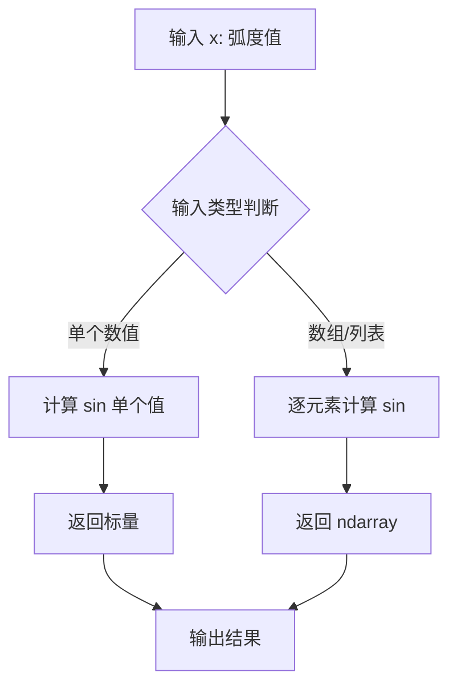

#### 带注释源码

```python
# 在代码中的实际使用:
y1data = np.sin(2*np.pi*xdata/153) + np.cos(2*np.pi*xdata/127)

# np.sin 函数调用分析:
# 1. 输入: xdata 是一个 numpy 数组，包含从 16 到 365 的线性空间值
# 2. 计算过程: 2*np.pi*xdata/153 将角度转换为弧度制
# 3. np.sin 计算每个元素的正弦值
# 4. 返回: 与 xdata 形状相同的数组，包含对应的正弦值
# 
# 完整调用形式相当于:
# result = np.sin(x)  # 其中 x = 2*np.pi*xdata/153
```


### `np.cos`

NumPy余弦函数，计算输入数组或标量中每个元素的余弦值（弧度制），返回与输入形状相同的余弦值数组。

参数：

- `x`：`array_like`，输入角度（弧度），可以是标量（float）或任意维度的数组

返回值：`ndarray` 或 scalar，返回每个元素的余弦值，类型为float64

#### 流程图

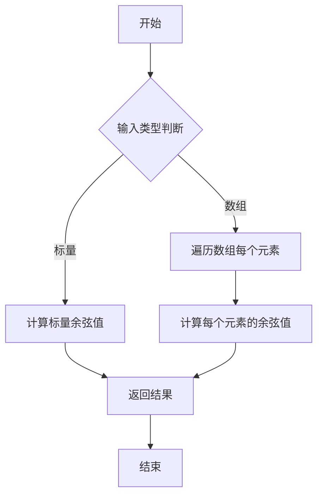

#### 带注释源码

```python
def cos(x, /, out=None, *, where=True, casting='same_kind', order='K', dtype=None, subok=True):
    """
    计算数组元素的余弦值（弧度制）
    
    参数:
        x: array_like - 输入角度，弧度制
        out: ndarray, optional - 存储结果的数组
        where: array_like, optional - 条件数组，指定哪些位置需要计算
        casting: str - 类型转换规则
        order: str - 内存布局顺序
        dtype: data-type, optional - 输出数据类型
        subok: bool - 是否允许子类
    
    返回值:
        ndarray - 余弦值数组，与输入形状相同
    """
    # 实际实现位于 _umath_modules.py 中
    # 使用C/Fortran编写的底层数学库实现
    return np.cos(x)  # 调用底层C语言实现的cos函数
```

> **注**：此函数为NumPy内置函数，上述源码为接口定义。实际计算由底层C/Fortran库完成，代码中使用方式为：
> ```python
> y1data = np.sin(2*np.pi*xdata/153) + np.cos(2*np.pi*xdata/127)
> ```
> 其中`np.cos`接收弧度制角度，返回[-1, 1]范围内的余弦值。


### `np.convolve`

NumPy 的 `convolve` 函数用于计算两个一维序列的离散卷积。在本代码中，它被用于扩展布尔掩码（mask），以确保在降采样时不截断视图范围边缘的线条。

参数：

- `a`：`array_like`，第一个一维输入数组（卷积核），在代码中为 `[1, 1, 1]`
- `v`：`array_like`，第二个一维输入数组（待卷积数据），在代码中为 `mask`（布尔掩码数组）
- `mode`：`str`，可选，默认值为 `'full'`，指定输出数组的大小模式。代码中使用 `'same'`，表示输出长度与输入 `v` 长度相同

返回值：`ndarray`，返回两个一维数组的卷积结果。在代码中为扩展后的布尔掩码数组，用于包含视图范围边界外的点。

#### 流程图

```mermaid
flowchart TD
    A[输入原始掩码 mask<br/>布尔数组] --> B[输入卷积核<br/>[1, 1, 1]]
    B --> C[调用 np.convolve<br/>mode='same']
    C --> D[卷积计算<br/>滑动窗口加权求和]
    D --> E[输出扩展后的掩码<br/>与原mask等长]
    E --> F[转换为布尔类型<br/>.astypebool]
    F --> G[用于数据筛选<br/>包含边界外点]
```

#### 带注释源码

```python
# np.convolve 在本代码中的调用及作用解析：

# 原始布尔掩码：标记在视图范围内的数据点
mask = (self.origXData > xstart) & (self.origXData < xend)

# 使用卷积核 [1, 1, 1] 对掩码进行卷积
# 这相当于对每个点及其左右邻居进行求和
# 效果：将 True 向左右各扩展一个位置
# mode='same' 保证输出长度与输入 mask 相同
mask = np.convolve([1, 1, 1], mask, mode='same').astype(bool)

# 示例说明：
# 原始 mask: [False, True, True, True, False]
# 卷积后:    [1, 2, 3, 2, 1]  (滑动求和)
# 转换为bool: [True, True, True, True, True]
# 这样可以捕获视图边界附近的点，避免线条被截断
```


### `plt.subplots`

`plt.subplots` 是 Matplotlib 库中用于创建图形窗口及一组子图的函数，它同时返回一个 Figure 对象和一个或多个 Axes 对象，支持多种布局配置（如行列网格共享等）。

参数：

-  `nrows`：`int`，默认值 1，表示子图的行数
-  `ncols`：`int`，默认值 1，表示子图的列数
-  `sharex`：`bool` 或 `str`，默认值 False，如果为 True，则所有子图共享 x 轴；如果为 'col'，则每列子图共享 x 轴
-  `sharey`：`bool` 或 `str`，默认值 False，如果为 True，则所有子图共享 y 轴；如果为 'row'，则每行子图共享 y 轴
-  `squeeze`：`bool`，默认值 True，如果为 True，则返回的 Axes 数组维度会被压缩为最小维度（1D 或 0D）
-  `width_ratios`：`array-like`，可选，定义每列的相对宽度
-  `height_ratios`：`array-like`，可选，定义每行的相对高度
-  `hspace`：`float`，可选，子图之间的垂直间距
-  `wspace`：`float`，可选，子图之间的水平间距
-  `left`、`right`、`top`、`bottom`：`float`，可选，定义子图区域在图形中的位置
-  `**kwargs`：其他关键字参数，将传递给 `Figure.subplots` 方法

返回值：`tuple`，返回 (fig, ax) 或 (fig, axs)：
-  `fig`：`matplotlib.figure.Figure`，整个图形对象
-  `ax`：`matplotlib.axes.Axes` 或 `numpy.ndarray` of Axes，单个 Axes 对象或 Axes 对象数组

#### 流程图

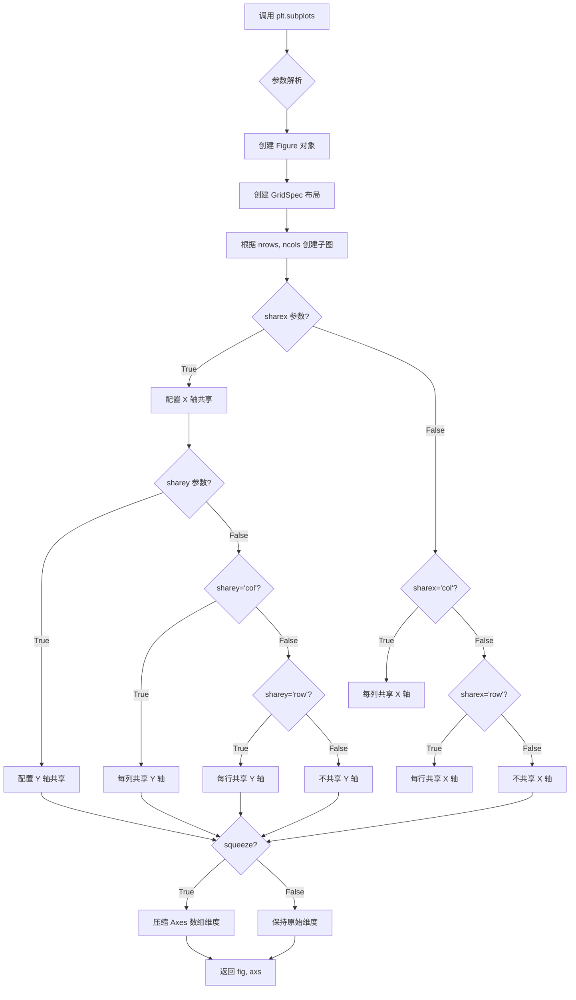

#### 带注释源码

```python
# plt.subplots 函数源码（简化版）

def subplots(nrows=1, ncols=1, sharex=False, sharey=False, squeeze=True,
             width_ratios=None, height_ratios=None,
             hspace=None, wspace=None, left=None, right=None, top=None, bottom=None,
             **kwargs):
    """
    创建图形和子图网格。
    
    参数:
        nrows: 子图行数
        ncols: 子图列数
        sharex: 控制 X 轴共享
        sharey: 控制 Y 轴共享
        squeeze: 是否压缩返回的 Axes 数组维度
        width_ratios: 每列宽度比例
        height_ratios: 每行高度比例
        hspace: 垂直子图间距
        wspace: 水平子图间距
        left, right, top, bottom: 图形边距
    
    返回:
        fig: Figure 对象
        ax: Axes 对象或 Axes 数组
    """
    # 1. 创建 Figure 对象
    fig = figure.Figure()
    
    # 2. 创建 GridSpec 布局对象
    gs = GridSpec(nrows, ncols, width_ratios=width_ratios, 
                  height_ratios=height_ratios, hspace=hspace, wspace=wspace,
                  left=left, right=right, top=top, bottom=bottom)
    
    # 3. 创建子图并添加到 Figure
    axs = np.empty((nrows, ncols), dtype=object)
    for i in range(nrows):
        for j in range(ncols):
            # 创建子图
            ax = fig.add_subplot(gs[i, j], **kwargs)
            axs[i, j] = ax
            
            # 配置 X 轴共享
            if sharex is True:
                ax.sharex(axs[0, 0])
            elif sharex == 'col' and i > 0:
                ax.sharex(axs[i, 0])
            elif sharex == 'row' and j > 0:
                ax.sharex(axs[0, j])
            
            # 配置 Y 轴共享（类似逻辑）
            if sharey is True:
                ax.sharey(axs[0, 0])
            elif sharey == 'col' and j > 0:
                ax.sharey(axs[0, j])
            elif sharey == 'row' and i > 0:
                ax.sharey(axs[0, 0])
    
    # 4. 根据 squeeze 参数处理返回值
    if squeeze:
        # 压缩维度：nrows=1 且 ncols=1 返回单个 Axes
        if nrows == 1 and ncols == 1:
            axs = axs[0, 0]
        # nrows=1 或 ncols=1 返回一维数组
        elif nrows == 1 or ncols == 1:
            axs = axs.ravel()
    
    return fig, axs
```


### DataDisplayDownsampler.plot

该方法是数据降采样显示类的核心绘图方法，负责在给定的 Matplotlib Axes 对象上绑制折线图和填充区域。它调用内部的 `_downsample` 方法获取降采样后的数据，然后使用 `ax.plot` 绑制线条，并使用 `ax.fill_between` 创建填充区域。

参数：

- `ax`：`matplotlib.axes.Axes`，Matplotlib 的坐标轴对象，用于承载绑制的图形元素

返回值：`tuple`，返回包含线条对象（`matplotlib.lines.Line2D`）的元组，但实际使用中通过实例属性 `self.line` 和 `self.poly_collection` 访问绑制的图形元素

#### 流程图

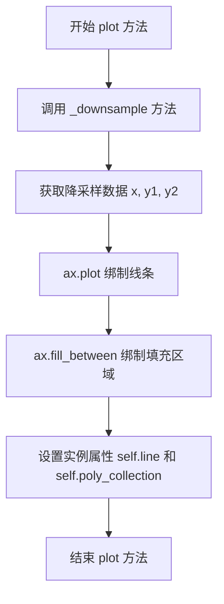

#### 带注释源码

```python
def plot(self, ax):
    """
    在给定的坐标轴上绑制降采样后的数据曲线和填充区域。
    
    参数:
        ax: matplotlib.axes.Axes 对象，用于绑制图形的坐标轴
        
    返回:
        tuple: 包含 Line2D 对象的元组
    """
    # 调用 _downsample 方法获取降采样后的数据
    # 从原始数据的最小值到最大值的范围内进行降采样
    x, y1, y2 = self._downsample(self.origXData.min(), self.origXData.max())
    
    # 使用 ax.plot 绑制线条
    # 'o-' 表示使用圆形标记和实线
    # 返回的 Line2D 对象存储在实例属性 self.line 中
    (self.line,) = ax.plot(x, y1, 'o-')
    
    # 使用 ax.fill_between 创建填充区域
    # 在 y1 和 y2 之间填充，step="pre" 表示前向阶跃，color="r" 表示红色
    # 返回的 PolyCollection 对象存储在实例属性 self.poly_collection 中
    self.poly_collection = ax.fill_between(x, y1, y2, step="pre", color="r")
```

#### 额外说明

1. **与 ax.plot 的关系**：此方法内部调用了 `ax.plot()`，这是 Matplotlib 库提供的绑制线条的函数。用户提到的 "ax.plot - 绑制线条" 实际上就是在这个方法中实现的。

2. **设计意图**：该方法是装饰器模式的具体实现，通过 DataDisplayDownsampler 类对原始的绑制行为进行了增强，添加了数据降采样的功能，以提高交互式绑制时的性能。

3. **使用场景**：当用户拖动或缩放图表时，通过 `update` 方法重新调用 `_downsample` 并更新线条数据，实现动态降采样。


### `ax.fill_between`

`ax.fill_between` 是 Matplotlib 中 Axes 类的成员方法，用于在两条曲线之间的区域填充颜色。该方法接收 x 坐标和两个 y 值序列（y1 和 y2），在 x 所定义的范围内绘制填充的多边形区域，常用于可视化数据区间、误差范围或两条曲线之间的面积。

参数：

- `x`：`array-like`，定义填充区域的 x 轴坐标点
- `y1`：`array-like`，填充区域的下边界或第一条曲线的数据点
- `y2`：`array-like`，填充区域的上边界或第二条曲线的数据点，默认为 0
- `step`：`str`，步进模式，控制填充的方式，可选值包括 `'pre'`（前向步进）、`'post'`（后向步进）、`'mid'`（中间步进），默认为空
- `color`：`str`，填充区域的颜色，支持十六进制颜色码、颜色名称或 RGB 元组
- `alpha`：`float`，可选，填充区域的透明度，范围 0-1
- `where`：`array-like`，可选，布尔数组，用于条件性填充，只填充满足条件的区域

返回值：`matplotlib.collections.PolyCollection`，返回填充区域的多边形集合对象，可用于后续的图形更新和属性修改

#### 流程图

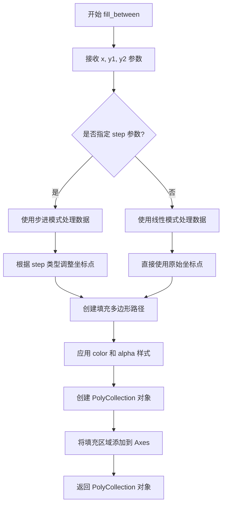

#### 带注释源码

```python
# 调用 ax.fill_between 方法的示例代码（来自 DataDisplayDownsampler 类）
self.poly_collection = ax.fill_between(
    x,          # array-like: x 坐标数组，定义填充区域的横坐标范围
    y1,         # array-like: 第一个 y 数据序列，作为填充的下边界
    y2,         # array-like: 第二个 y 数据序列，作为填充的上边界
    step="pre", # str: 步进模式为'pre'，表示在每个 x 点之前进行填充
    color="r"   # str: 填充颜色为红色（red）
)
# 返回值说明：
# self.poly_collection 将获得一个 PolyCollection 对象
# 该对象包含了所有填充多边形的信息
# 可用于后续通过 set_data() 方法更新填充区域的数据
```


### `ax.callbacks.connect`

该方法用于将回调函数连接到特定的事件上，当指定事件发生时（如坐标轴视图限制改变），注册的回调函数将被触发执行。

参数：

- `s`： `str`，事件名称，指定要监听的事件类型（如 `'xlim_changed'`、`'ylim_changed'` 等）
- `func`： `callable`，回调函数，当指定事件发生时调用的函数

返回值： `matplotlib.callbacks.ConnectEventObj`，返回连接对象，用于后续通过 `disconnect()` 方法断开连接

#### 流程图

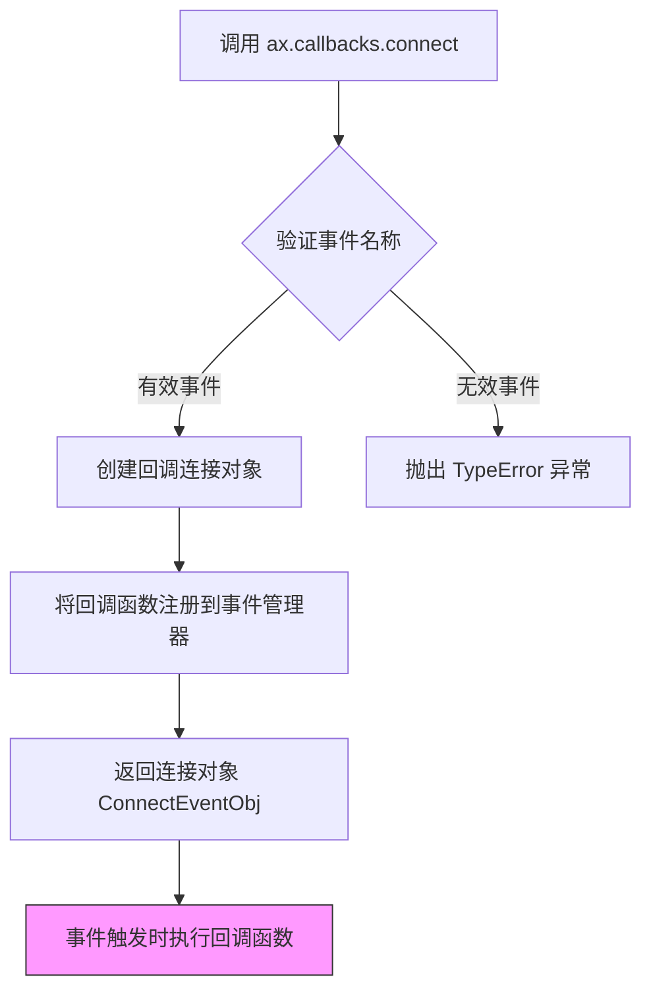

#### 带注释源码

```python
# 在 matplotlib/axes/_base.py 中的 Axes 类中
# axes.callbacks 属性是 CallbackRegistry 实例

# 实际调用示例（来自代码第91行）：
ax.callbacks.connect('xlim_changed', d.update)

# 源码实现逻辑（位于 matplotlib/callbacks.py 中的 CallbackRegistry 类）：

def connect(self, s, func):
    """
    Register a function to be called when event *s* occurs.
    
    Parameters
    ----------
    s : str
        The event name to listen to (e.g., 'xlim_changed', 'ylim_changed').
    func : callable
        The callback function to register. It will be called with
        the event instance as argument.
    
    Returns
    -------
    ConnectEventObj
        A connection object that can be used to disconnect the callback
        via disconnect() method.
    """
    # 获取或创建对应事件的回调列表
    cid = self._connect_pickler(s, func)
    # cid 是唯一的回调ID，用于后续断开连接
    return _ConnectEventObj(self, s, cid)

def _connect_pickler(self, s, func):
    """内部方法：处理回调的注册和序列化"""
    # 生成唯一的回调ID (callback id)
    cid = next(self._callback_seed)
    
    # 将回调函数存储在字典中，键为 (事件名, cid)
    self._callbacks[s, cid] = func
    self._legacy_signals[s].append(cid)
    
    return cid

# _ConnectEventObj 类的定义：
class _ConnectEventObj:
    """用于存储已注册回调连接信息的类"""
    def __init__(self, registry, s, cid):
        self.registry = registry  # 回调注册表实例
        self.s = s                # 事件名称
        self.cid = cid            # 回调ID
    
    def disconnect(self):
        """断开回调连接"""
        self.registry.disconnect(self.cid)
```


### `ax.set_autoscale_on`

设置是否在绘图时自动缩放坐标轴。当设置为 `False` 时，可以防止在动态更新图表数据时因自动缩放导致的无限循环问题。

参数：

-  `b`：`bool`，布尔值，指定是否启用自动缩放功能。`True` 启用自动缩放，`False` 禁用自动缩放。

返回值：`None`，该方法没有返回值。

#### 流程图

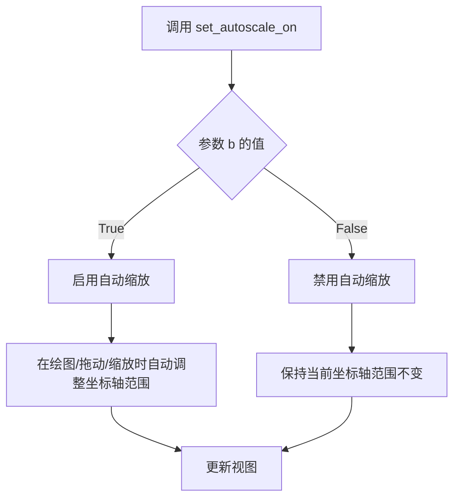

#### 带注释源码

```python
# 在代码中的调用位置：
ax.set_autoscale_on(False)  # Otherwise, infinite loop

# 解释：
# 当使用动态数据更新（如本例中的 downsampling 技术）时，
# 如果启用了自动缩放（True），每次更新数据后 Matplotlib 会
# 自动重新计算坐标轴范围，这可能触发新的更新回调，形成无限循环。
# 因此在此交互式示例中需要将其设置为 False 以避免此问题。

# 方法签名（基于 Matplotlib 官方文档）：
# Axes.set_autoscale_on(b)
# 
# 参数：
#     b : bool
#         True 表示开启自动缩放，False 表示关闭自动缩放
#
# 示例用法：
# ax.set_autoscale_on(True)   # 启用自动缩放
# ax.set_autoscale_on(False)  # 禁用自动缩放
```


### `ax.set_xlim`

设置Axes对象的X轴显示范围（X轴边界），用于控制图表在X轴方向上的可视区间。

参数：

- `xmin` / `left`：`float` 或 `int`，X轴范围的左边界（最小值），即X轴的起始值
- `xmax` / `right`：`float` 或 `int`，X轴范围的右边界（最大值），即X轴的结束值

返回值：`tuple[float, float]`，返回新的X轴范围边界值组成的元组 `(left, right)`

#### 流程图

```mermaid
flowchart TD
    A[调用 ax.set_xlim] --> B{参数数量}
    B -->|1个参数| C[参数作为元组解析]
    B -->|2个参数| D[分别作为左右边界]
    C --> E[提取 left 和 right]
    D --> E
    E --> F[验证边界有效性]
    F --> G[更新 Axes 对象的 xaxis limit]
    G --> H[触发 'xlim_changed' 事件]
    H --> I[返回新范围元组 (left, right)]
```

#### 带注释源码

```python
# 在主程序中调用 set_xlim 设置X轴范围
ax.set_xlim(16, 365)  # 设置X轴显示范围从16到365

# 内部实现逻辑（Matplotlib源码结构）
# def set_xlim(self, left=None, right=None, emit=False, auto=False, *, xmin=None, xmax=None):
#     """
#     Set the x-axis view limits.
#     
#     参数:
#         left: float, X轴左边界值
#         right: float, X轴右边界值
#         emit: bool, 是否触发 'xlim_changed' 事件通知
#         auto: bool, 是否启用自动边界调整
#     返回:
#         tuple: (left, right) 新的边界值
#     """
#     # 1. 处理参数别名（xmin=left, xmax=right）
#     # 2. 验证left < right
#     # 3. 更新self.viewLim.intervalx
#     # 4. 如果emit=True，触发回调
#     # 5. 返回(left, right)元组
```


### `plt.show`

`plt.show()` 是 Matplotlib 库中的全局函数，用于显示所有当前已创建且尚未显示的图形窗口，并进入交互式事件循环。在调用此函数之前，所有使用 `plt.subplots()` 或 `pyplot` 接口创建的图形都仅存在于内存中，不会实际显示在屏幕上。该函数会阻塞程序执行，直到用户关闭所有图形窗口或调用 `plt.close()`。

参数：

- 此函数在标准调用中不接受任何必需参数
- `block`：`bool` 类型，可选参数（默认为 `True`）。如果设置为 `True`，则函数会阻塞并等待窗口关闭；如果设置为 `False`，则立即返回并继续执行代码

返回值：`None`，该函数不返回任何值

#### 流程图

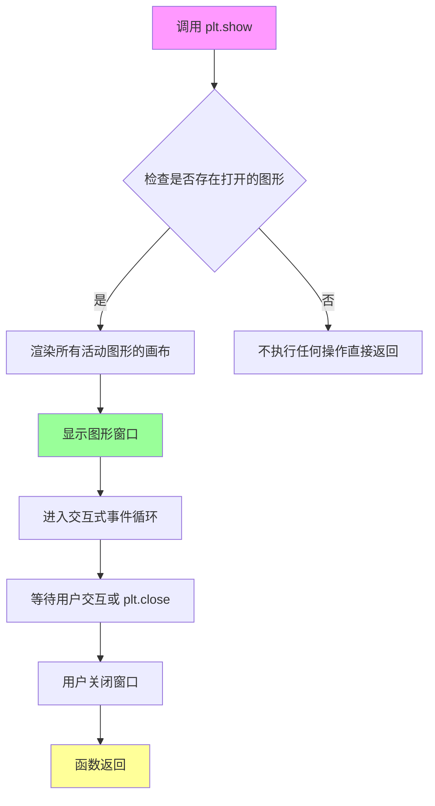

#### 带注释源码

```python
# 注意：以下为 matplotlib.pyplot 模块中 show() 函数的简化实现逻辑
# 实际源码位于 matplotlib/backend_bases.py 或类似的后端文件中

def show(block=None):
    """
    显示所有打开的图形窗口。
    
    参数:
        block: bool, 可选
            如果为 True（默认值），则阻塞程序直到所有窗口关闭。
            如果为 False，则立即返回。
    """
    
    # 获取当前活动的主窗口管理器
    global _plt_show_called
    _plt_show_called = True
    
    # 检查是否有可显示的图形
    allnums = get_fignums()  # 获取所有图形编号
    if not allnums:
        # 如果没有图形，直接返回
        return
    
    # 遍历所有图形并显示
    for fig_num in allnums:
        fig = figure(fig_num)
        # 调用后端的显示方法
        fig.canvas.show()
    
    # 根据 block 参数决定是否阻塞
    if block is None:
        # 在某些后端中默认行为可能不同
        block = True
    
    if block:
        # 进入主循环，等待用户交互
        # 这通常调用后端的 mainloop() 方法
        import matplotlib
        matplotlib.pyplot.switch_backend._do_show()
    
    return None  # 函数不返回任何值
```

#### 在项目代码中的使用上下文

```python
# ... 前面的代码创建了图形并绑定了事件 ...

# 设置图形的x轴范围
ax.set_xlim(16, 365)

# 调用 plt.show() 显示图形窗口
# 此时图形窗口出现，用户可以进行拖拽和缩放操作
# 每次视图范围改变时，会触发 xlim_changed 事件
# 从而调用 DataDisplayDownsampler.update() 方法进行数据重采样
plt.show()

# 注意：plt.show() 之后的代码只有在窗口关闭后才会执行
```

#### 关键技术细节

1. **阻塞行为**：`plt.show()` 默认会阻塞主线程，这是 Matplotlib 能够在图形窗口中处理用户交互事件（如鼠标拖拽、缩放）的原因

2. **事件循环**：在阻塞期间，Matplotlib 启动了 GUI 事件循环，监听并处理用户的所有交互操作

3. **后端依赖**：具体的行为（是否阻塞、如何显示窗口）取决于所使用的 Matplotlib 后端（如 TkAgg、Qt5Agg、MacOSX 等）

4. **与 `set_autoscale_on(False)` 的配合**：代码中设置 `ax.set_autoscale_on(False)` 是为了防止自动缩放触发无限循环，这在交互式重采样示例中至关重要


### `DataDisplayDownsampler.__init__`

初始化 `DataDisplayDownsampler` 类的实例。该方法接收原始的 X、Y1、Y2 数据，将它们存储为实例属性，并计算初始的数据范围宽度（delta）和最大采样点数（max_points），为后续的交互式下采样操作做好准备。

参数：

-  `self`：`object`，类的实例本身。
-  `xdata`：`numpy.ndarray`，原始 X 轴数据（通常为线性空间向量）。
-  `y1data`：`numpy.ndarray`，原始 Y1 轴数据（第一条曲线的数据）。
-  `y2data`：`numpy.ndarray`，原始 Y2 轴数据（第二条曲线的数据，用于绘制填充区域）。

返回值：`None`，构造函数不返回任何值。

#### 流程图

```mermaid
graph TD
    A([开始 __init__]) --> B[输入: xdata, y1data, y2data]
    B --> C[self.origY1Data = y1data]
    C --> D[self.origY2Data = y2data]
    D --> E[self.origXData = xdata]
    E --> F[self.max_points = 50]
    F --> G[self.delta = xdata[-1] - xdata[0]]
    G --> H([结束])
```

#### 带注释源码

```python
def __init__(self, xdata, y1data, y2data):
    # 存储原始的 Y1 数据，这是要绘制的主要数据序列
    self.origY1Data = y1data
    # 存储原始的 Y2 数据，用于 fill_between 填充区域
    self.origY2Data = y2data
    # 存储原始的 X 数据，用于确定视图范围和数据掩码
    self.origXData = xdata
    # 设置下采样阈值：当可视范围内的点数超过此值时触发下采样
    self.max_points = 50
    # 计算并存储 X 轴数据的初始总跨度，用于在 update 中判断视图是否发生改变
    self.delta = xdata[-1] - xdata[0]
```


### `DataDisplayDownsampler.plot`

绘制初始图表方法，该方法调用内部的下采样方法获取降采样后的数据，然后使用matplotlib在给定的坐标轴上绘制线条图和填充区域。

参数：

- `ax`：`matplotlib.axes.Axes`，用于绘制图表的Matplotlib坐标轴对象

返回值：`None`，该方法不返回任何值，仅在对象内部设置 `self.line` 和 `self.poly_collection` 属性

#### 流程图

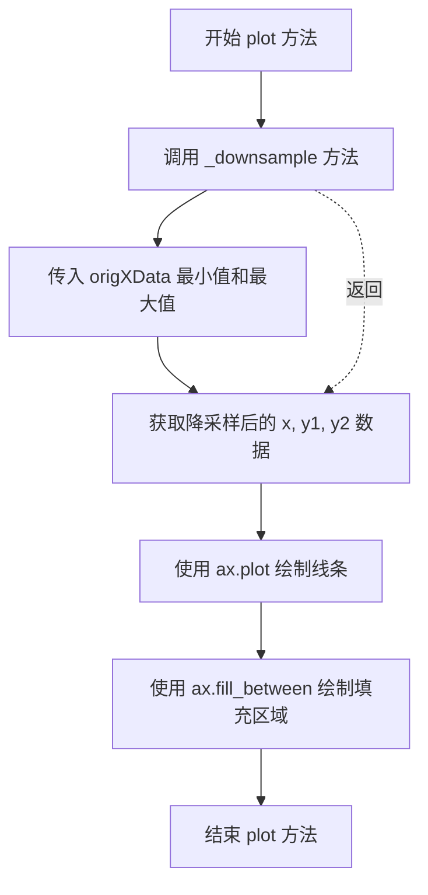

#### 带注释源码

```python
def plot(self, ax):
    """
    绘制初始图表
    
    参数:
        ax: matplotlib.axes.Axes
            用于绘制图表的Matplotlib坐标轴对象
    
    返回:
        None
    """
    # 调用下采样方法，传入X数据的完整范围
    # 这将返回降采样后的X、Y1、Y2数据
    x, y1, y2 = self._downsample(self.origXData.min(), self.origXData.max())
    
    # 使用降采样数据绘制线条图
    # 'o-' 表示使用圆形标记和实线连接
    # 结果存储在 self.line 中供后续 update 方法使用
    (self.line,) = ax.plot(x, y1, 'o-')
    
    # 在两条曲线之间填充区域
    # step="pre" 表示阶梯式填充（每步从左边缘开始）
    # color="r" 设置填充颜色为红色
    # 结果存储在 self.poly_collection 中供后续 update 方法使用
    self.poly_collection = ax.fill_between(x, y1, y2, step="pre", color="r")
```


### `DataDisplayDownsampler._downsample`

该私有方法负责对原始数据进行下采样处理，根据指定的视图范围（xstart到xend）筛选数据点，并通过计算下采样比率来减少数据量，以优化图表渲染性能。

**参数：**

- `xstart`：`float`，视图范围的起始x坐标
- `xend`：`float`，视图范围的结束x坐标

**返回值：** `tuple`，包含三个numpy数组 `(xdata, y1data, y2data)`，分别是下采样后的x轴数据、第一个y系列数据和第二个y系列数据

#### 流程图

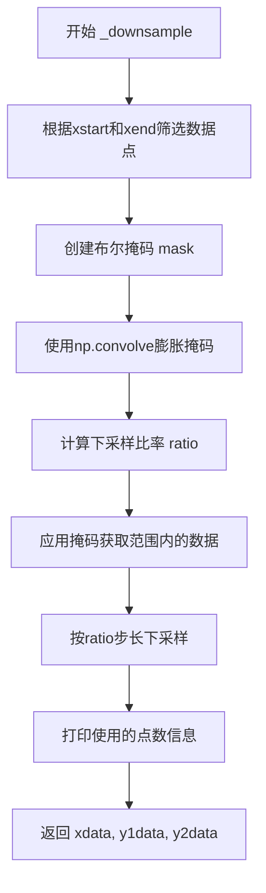

#### 带注释源码

```python
def _downsample(self, xstart, xend):
    # 根据视图范围创建布尔掩码，筛选在xstart和xend之间的数据点
    # mask标识了哪些原始数据点落在当前视图范围内
    mask = (self.origXData > xstart) & (self.origXData < xend)
    
    # 使用卷积操作膨胀掩码，在视图边界两侧各扩展一个数据点
    # 这样做是为了避免线条在视图边界处被截断，确保曲线完整显示
    # mode='same'保持输出与输入相同长度
    mask = np.convolve([1, 1, 1], mask, mode='same').astype(bool)
    
    # 计算下采样比率：将可见点数除以最大允许点数，确保数据点数量不超过max_points
    # 使用max(..., 1)确保比率至少为1，避免除零错误
    ratio = max(np.sum(mask) // self.max_points, 1)

    # 使用掩码筛选出视图范围内的原始数据
    xdata = self.origXData[mask]
    y1data = self.origY1Data[mask]
    y2data = self.origY2Data[mask]

    # 通过步长采样实现下采样，每隔ratio个点取一个数据点
    xdata = xdata[::ratio]
    y1data = y1data[::ratio]
    y2data = y2data[::ratio]

    # 打印诊断信息，用于调试和性能监控
    print(f"using {len(y1data)} of {np.sum(mask)} visible points")

    # 返回下采样后的三组数据，供绘图和更新使用
    return xdata, y1data, y2data
```


### `DataDisplayDownsampler.update`

该方法是一个事件回调函数，当图表的 x 轴视图限制发生变化时（如用户缩放或拖动图表时）被调用。它负责获取新的视图范围，执行数据降采样，并更新图表中的线条和填充区域艺术家对象。

参数：

- `ax`：`matplotlib.axes.Axes`，包含当前视图限制（viewLim）的 Axes 对象，用于获取当前的视图范围并更新图表元素

返回值：`None`，无返回值，仅通过修改传入的 Axes 对象的状态来更新图表

#### 流程图

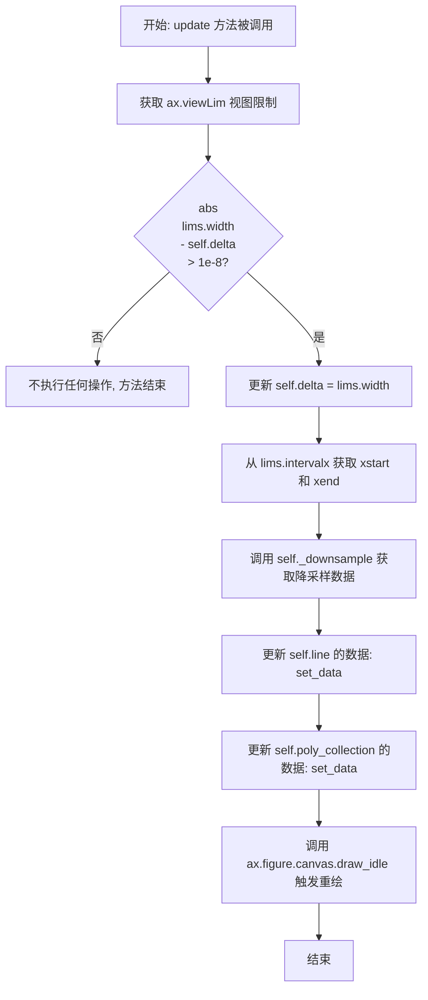

#### 带注释源码

```python
def update(self, ax):
    """
    事件回调更新方法，当图表视图限制改变时调用
    
    参数:
        ax: matplotlib.axes.Axes 对象，包含视图限制信息
    """
    
    # 获取当前Axes的视图限制（viewLim），包含x和y的范围信息
    lims = ax.viewLim
    
    # 检查视图宽度是否发生变化（与之前记录的delta比较）
    # 使用1e-8作为浮点数比较的容差，避免因精度问题导致的频繁更新
    if abs(lims.width - self.delta) > 1e-8:
        
        # 视图宽度确实发生了变化，更新保存的delta值
        self.delta = lims.width
        
        # 从视图限制中获取x轴的起始和结束位置
        xstart, xend = lims.intervalx
        
        # 调用内部_downsample方法，根据新的视图范围获取降采样后的数据
        x, y1, y2 = self._downsample(xstart, xend)
        
        # 更新线条（Line2D）对象的数据点
        # set_data方法接受x和y坐标数组来更新线条
        self.line.set_data(x, y1)
        
        # 更新填充区域（PolyCollection）对象的数据
        # 参数: x坐标, y1数据, y2数据, step参数保持'pre'（阶梯式填充）
        self.poly_collection.set_data(x, y1, y2, step="pre")
        
        # 标记画布需要重新绘制，但不会立即重绘
        # 这是一种延迟重绘机制，可以避免在快速缩放时频繁重绘
        ax.figure.canvas.draw_idle()
```

## 关键组件


### DataDisplayDownsampler 类

数据降采样控制器，负责在视口变化时动态降低数据点数以保持渲染性能，核心通过mask索引和步长采样实现数据压缩。

### 原始数据存储 (origXData, origY1Data, origY2Data)

类实例持有原始完整数据集，通过NumPy数组切片访问，不进行中间转换以保持数据完整性。

### 视图范围掩码生成 (_downsample 方法)

基于当前视图边界创建布尔掩码，使用NumPy布尔索引实现高效数据筛选，并通过np.convolve扩展边界防止线条截断。

### 降采样比率计算

根据可视区域内实际点数与max_points阈值计算采样步长ratio，确保降采样后点数不超过50个以优化渲染性能。

### 交互式更新机制 (update 方法)

通过ax.callbacks.connect绑定xlim_changed事件，当用户缩放或拖拽时触发update方法，实现惰性更新仅在视图范围显著变化时重新计算。

### 图形元素管理 (plot 方法)

创建折线图(line)和填充区域(poly_collection)两种图形对象，并存储引用以供后续update方法修改数据。

### 填充区域动态更新

通过set_data方法以(x, y1, y2, step="pre")四元组形式更新fill_between生成的PolyCollection，支持阶梯式渲染。

### 事件循环集成

通过plt.show()进入Matplotlib事件循环，结合set_autoscale_on(False)禁用自动缩放以避免无限循环。


## 问题及建议


### 已知问题

-   **PolyCollection.set_data()方法不存在**：代码中`self.poly_collection.set_data(x, y1, y2, step="pre")`调用了一个不存在的方法。`fill_between`返回的PolyCollection对象没有`set_data`方法，这会导致运行时错误或需要完全重新创建对象。
-   **硬编码配置值**：`max_points=50`、颜色`"r"`、标记`'-o'`等配置被硬编码在类内部，降低了代码的可配置性和复用性。
-   **使用内部API访问视图限制**：代码直接访问`ax.viewLim`这是Matplotlib的内部属性，可能在不同版本中不稳定。
-   **调试用的print语句**：代码中存在`print(f"using {len(y1data)} of {np.sum(mask)} visible points")`，在生产环境中应使用日志框架或移除。
-   **缺乏错误处理**：代码没有对边界条件进行处理，如空数据、视图范围无效、mask全为False等情况。
-   **职责过重**：DataDisplayDownsampler类同时负责数据存储、下采样计算和图形更新，违反了单一职责原则。

### 优化建议

-   **修复PolyCollection更新逻辑**：对于fill_between返回的PolyCollection，应该移除旧artist并创建新的，而不是尝试调用不存在的set_data方法。
-   **提取配置参数**：将max_points、颜色、标记样式等作为__init__方法的参数，提高类的可配置性。
-   **使用公共API**：通过`ax.get_xlim()`获取视图范围，而不是直接访问`ax.viewLim`。
-   **添加日志记录**：将print语句替换为logging模块的日志记录。
-   **增加边界检查**：在下采样前检查mask是否为空、xstart和xend是否有效等边界条件。
-   **拆分职责**：考虑将下采样逻辑抽取为独立的工具类或函数，类专注于协调数据更新和图形重绘。

## 其它


### 设计目标与约束

本代码的设计目标是在Matplotlib交互式图表中实现高效的数据降采样，通过在视图范围变化时动态减少数据点数量来保持绘图性能。约束条件包括：最大显示点数限制为50个采样点，降采样仅在X轴方向进行，且要求不截断线条边界。

### 错误处理与异常设计

代码中错误处理较为有限，主要依靠NumPy和Matplotlib的默认异常机制。潜在错误场景包括：空数据输入、视图范围超出数据边界、数据类型不匹配等。建议添加数据验证逻辑、范围检查和异常捕获机制。

### 数据流与状态机

数据流为：原始数据(xdata/y1data/y2data) -> 降采样处理(_downsample方法) -> 更新图表(line/poly_collection)。状态转换包括：初始化状态(创建对象) -> 渲染状态(plot方法) -> 交互更新状态(update方法触发)。

### 外部依赖与接口契约

外部依赖包括：numpy(数值计算)、matplotlib.pyplot(绘图)、matplotlib.axes(坐标轴管理)。接口契约方面：_downsample方法接收xstart/xend参数返回三元组，update方法接收ax参数无返回值，plot方法接收ax参数无返回值。

### 性能考量和优化建议

当前性能瓶颈在于每次缩放都重新计算降采样，且np.convolve在频繁调用时开销较大。优化方向包括：使用LTTB(Largest-Triangle-Three-Buckets)算法替代简单步进采样、实现数据缓存机制、考虑使用numba加速计算。

### 可扩展性设计

当前类仅支持固定50点降采样，未提供配置接口。扩展方向包括：开放max_points参数配置、支持Y轴方向降采样、添加不同降采样算法选择器、实现数据聚合函数可配置化。

### 代码质量与可维护性

存在以下可改进点：硬编码的max_points=50和颜色"r"应提取为配置常量、缺少类型注解和文档字符串、print语句应替换为日志系统、魔法数字(如1e-8, 3)应定义为具名常量。

    