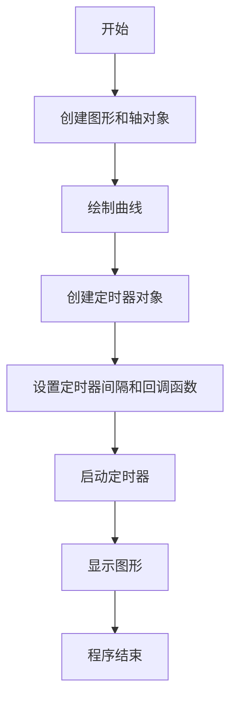
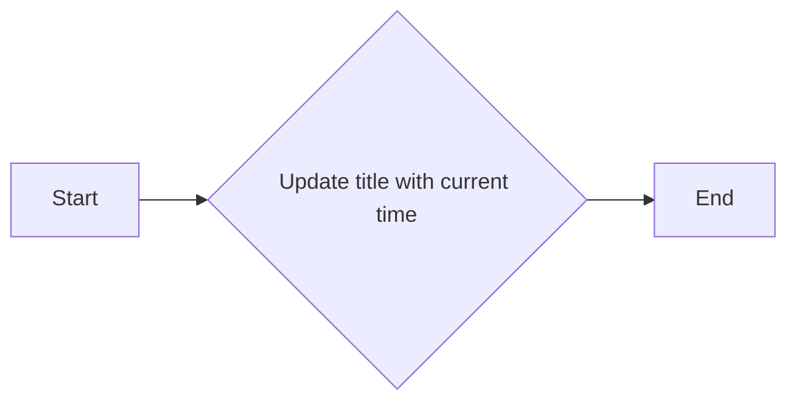
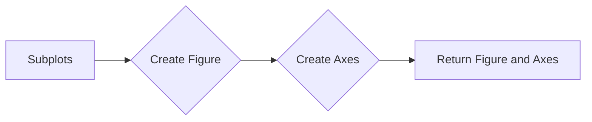
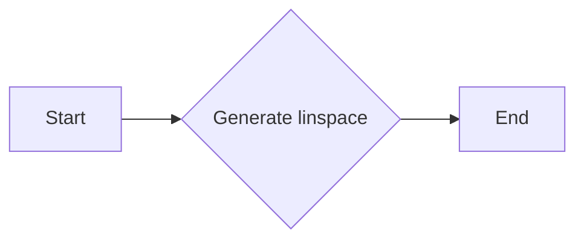

# `matplotlib\galleries\examples\event_handling\timers.py` 详细设计文档

This code demonstrates the use of timer objects in Matplotlib to update the title of a figure with the current date and time at regular intervals.

## 整体流程



## 类结构

```
matplotlib.pyplot (全局模块)
├── fig (全局变量)
│   ├── canvas (全局变量)
│   ├── new_timer (全局函数)
│   └── ...
└── ax (全局变量)
```

## 全局变量及字段


### `fig`
    
The main figure object created by matplotlib for plotting.

类型：`matplotlib.figure.Figure`
    


### `ax`
    
The axes object where the plot is drawn.

类型：`matplotlib.axes._subplots.AxesSubplot`
    


### `timer`
    
The timer object used to periodically call the update_title function.

类型：`matplotlib.backends.backend_agg.Timer`
    


### `x`
    
The x-axis values for the plot.

类型：`numpy.ndarray`
    


### `interval`
    
The interval in milliseconds for the timer to trigger the update_title function.

类型：`int`
    


### `drawid`
    
The identifier for the draw event connection, used to disconnect the event handler after starting the timer.

类型：`int`
    


### `matplotlib.pyplot.fig`
    
The main figure object created by matplotlib for plotting.

类型：`matplotlib.figure.Figure`
    


### `matplotlib.pyplot.ax`
    
The axes object where the plot is drawn.

类型：`matplotlib.axes._subplots.AxesSubplot`
    


### `matplotlib.pyplot.canvas`
    
The canvas object that handles the rendering of the figure.

类型：`matplotlib.backends.backend_agg.FigureCanvasAgg`
    


### `matplotlib.pyplot.new_timer`
    
A method to create a new timer object for the figure canvas.

类型：`matplotlib.backends.backend_agg.Timer`
    


### `matplotlib.pyplot.subplots`
    
A method to create a new figure and a set of subplots.

类型：`matplotlib.figure.Figure`
    


### `matplotlib.pyplot.plot`
    
A method to create a line plot.

类型：`matplotlib.axes._subplots.AxesSubplot`
    


### `matplotlib.axes._subplots.AxesSubplot.set_title`
    
A method to set the title of the axes object.

类型：`None`
    


### `matplotlib.backends.backend_agg.FigureCanvasAgg.draw`
    
A method to redraw the figure.

类型：`None`
    


### `matplotlib.backends.backend_agg.FigureCanvasAgg.mpl_connect`
    
A method to connect a drawing event to a callback function.

类型：`int`
    
    

## 全局函数及方法


### update_title

更新图表标题为当前时间。

参数：

- `axes`：`matplotlib.axes.Axes`，图表的轴对象，用于设置标题。

返回值：无

#### 流程图



#### 带注释源码

```python
def update_title(axes):
    # 设置图表标题为当前时间
    axes.set_title(datetime.now())
    # 重新绘制图表以应用标题更改
    axes.figure.canvas.draw()
```


### plt.subplots

`plt.subplots` 是 Matplotlib 库中用于创建一个图形和轴对象的函数。

参数：

- `figsize`：`tuple`，图形的宽度和高度（单位为英寸），默认为 (6, 4)。
- `dpi`：`int`，图形的分辨率（单位为 DPI），默认为 100。
- `facecolor`：`color`，图形的背景颜色，默认为 'white'。
- `num`：`int`，要创建的轴的数量，默认为 1。
- `gridspec_kw`：`dict`，用于定义网格规格的字典，默认为 None。
- `constrained_layout`：`bool`，是否启用约束布局，默认为 False。

返回值：`Figure` 对象和 `Axes` 对象的元组。

#### 流程图



#### 带注释源码

```python
from matplotlib.pyplot import subplots

def subplots(*args, **kwargs):
    """
    Create a figure and a set of subplots.

    Parameters
    ----------
    figsize : tuple, optional
        The size of the figure in inches. The default is (6, 4).
    dpi : int, optional
        The resolution of the figure in dots per inch. The default is 100.
    facecolor : color, optional
        The facecolor of the figure. The default is 'white'.
    num : int, optional
        The number of axes to create. The default is 1.
    gridspec_kw : dict, optional
        Additional keyword arguments to pass to GridSpec. The default is None.
    constrained_layout : bool, optional
        Whether to enable the Constrained Layout algorithm. The default is False.

    Returns
    -------
    fig : Figure
        The figure containing the axes.
    axes : Axes or list of Axes
        The axes objects.

    """
    # Implementation details...
    return fig, axes
```


### np.linspace

`np.linspace` 是 NumPy 库中的一个函数，用于生成线性间隔的数字数组。

参数：

- `start`：`float`，起始值。
- `stop`：`float`，结束值。
- `num`：`int`，生成的数组中的数字数量（不包括结束值）。
- `dtype`：`dtype`，可选，输出数组的类型。
- `endpoint`：`bool`，可选，是否包含结束值。

返回值：`numpy.ndarray`，一个包含线性间隔数字的数组。

#### 流程图



#### 带注释源码

```python
from numpy import linspace

# 生成从 -3 到 3 的 100 个线性间隔的数字
x = linspace(-3, 3, 100)
```


### plt.show()

`plt.show()` 是 Matplotlib 库中的一个全局函数，用于显示当前图形窗口。

参数：

- 无

返回值：无

#### 流程图


#### 带注释源码

```python
plt.show()  # 显示当前图形窗口
```


### update_title(axes)

`update_title` 是一个函数，用于更新图形窗口的标题。

参数：

- `axes`：`matplotlib.axes.Axes`，图形窗口的轴对象。

返回值：无

#### 流程图


#### 带注释源码

```python
def update_title(axes):
    axes.set_title(datetime.now())  # 设置标题为当前时间
    axes.figure.canvas.draw()  # 绘制图形
```


### fig.canvas.new_timer(interval)

`fig.canvas.new_timer(interval)` 是 Matplotlib 中的一个方法，用于创建一个新的计时器对象。

参数：

- `interval`：`int`，计时器间隔，以毫秒为单位。

返回值：`matplotlib.backends.backend_agg.Timer`，计时器对象。

#### 流程图


#### 带注释源码

```python
timer = fig.canvas.new_timer(interval=100)  # 创建计时器，间隔为100毫秒
```


### timer.add_callback(callback, *args, **kwargs)

`timer.add_callback(callback, *args, **kwargs)` 是 Matplotlib 中的一个方法，用于将回调函数添加到计时器对象。

参数：

- `callback`：`callable`，将被调用的回调函数。
- `*args`：可变数量的参数，将被传递给回调函数。
- `**kwargs`：关键字参数，将被传递给回调函数。

返回值：无

#### 流程图


#### 带注释源码

```python
timer.add_callback(update_title, ax)  # 将 update_title 函数添加为计时器的回调函数
```


### timer.start()

`timer.start()` 是 Matplotlib 中的一个方法，用于启动计时器。

参数：无

返回值：无

#### 流程图


#### 带注释源码

```python
timer.start()  # 启动计时器
```


### matplotlib.pyplot.subplots()

`matplotlib.pyplot.subplots()` 是 Matplotlib 中的一个函数，用于创建一个新的图形窗口和轴对象。

参数：无

返回值：`matplotlib.figure.Figure`，图形对象；`matplotlib.axes.Axes`，轴对象。

#### 流程图


#### 带注释源码

```python
fig, ax = plt.subplots()  # 创建图形窗口和轴对象
```


### numpy.linspace(start, stop, num=50, endpoint=True, dtype=None)

`numpy.linspace(start, stop, num=50, endpoint=True, dtype=None)` 是 NumPy 库中的一个函数，用于生成线性空间。

参数：

- `start`：`float`，线性空间的起始值。
- `stop`：`float`，线性空间的结束值。
- `num`：`int`，线性空间中的点数，默认为50。
- `endpoint`：`bool`，是否包含结束值，默认为True。
- `dtype`：`dtype`，数据类型，默认为None。

返回值：`numpy.ndarray`，线性空间数组。

#### 流程图


#### 带注释源码

```python
x = np.linspace(-3, 3)  # 生成线性空间，起始值为-3，结束值为3
```


### matplotlib.pyplot.plot(x, y)

`matplotlib.pyplot.plot(x, y)` 是 Matplotlib 中的一个函数，用于绘制二维线图。

参数：

- `x`：`array_like`，x轴数据。
- `y`：`array_like`，y轴数据。

返回值：`matplotlib.lines.Line2D`，线图对象。

#### 流程图


#### 带注释源码

```python
ax.plot(x, x ** 2)  # 绘制线图，x轴数据为x，y轴数据为x的平方
```


### matplotlib.pyplot.figure()

`matplotlib.pyplot.figure()` 是 Matplotlib 中的一个函数，用于创建一个新的图形窗口。

参数：无

返回值：`matplotlib.figure.Figure`，图形对象。

#### 流程图


#### 带注释源码

```python
fig = plt.figure()  # 创建图形窗口
```


### matplotlib.pyplot.subplot(nrows, ncols, index, **kwargs)

`matplotlib.pyplot.subplot(nrows, ncols, index, **kwargs)` 是 Matplotlib 中的一个函数，用于创建一个新的轴对象。

参数：

- `nrows`：`int`，行数。
- `ncols`：`int`，列数。
- `index`：`int`，轴对象的索引。
- `**kwargs`：关键字参数，用于设置轴对象的属性。

返回值：`matplotlib.axes.Axes`，轴对象。

#### 流程图


#### 带注释源码

```python
ax = fig.add_subplot(111)  # 创建一个轴对象，位于图形窗口的1行1列1号位置
```


### matplotlib.pyplot.title()

`matplotlib.pyplot.title()` 是 Matplotlib 中的一个函数，用于设置图形窗口的标题。

参数：

- `title`：`str`，图形窗口的标题。

返回值：无

#### 流程图


#### 带注释源码

```python
ax.set_title("Timers")  # 设置图形窗口的标题为 "Timers"
```


### matplotlib.pyplot.canvas.draw()

`matplotlib.pyplot.canvas.draw()` 是 Matplotlib 中的一个函数，用于重绘图形窗口。

参数：无

返回值：无

#### 流程图


#### 带注释源码

```python
axes.figure.canvas.draw()  # 重绘图形窗口
```


### matplotlib.figure.Figure

`matplotlib.figure.Figure` 是 Matplotlib 中的一个类，用于表示图形窗口。

- `fig`：`matplotlib.figure.Figure`，图形对象。
- `ax`：`matplotlib.axes.Axes`，轴对象。

#### 流程图


#### 带注释源码

```python
fig = plt.figure()  # 创建图形对象
ax = fig.add_subplot(111)  # 创建轴对象
```


### matplotlib.axes.Axes

`matplotlib.axes.Axes` 是 Matplotlib 中的一个类，用于表示图形窗口中的轴对象。

- `ax`：`matplotlib.axes.Axes`，轴对象。
- `x`：`numpy.ndarray`，x轴数据。
- `y`：`numpy.ndarray`，y轴数据。

#### 流程图


#### 带注释源码

```python
ax = fig.add_subplot(111)  # 创建轴对象
ax.plot(x, x ** 2)  # 绘制线图
```


### matplotlib.backends.backend_agg.Timer

`matplotlib.backends.backend_agg.Timer` 是 Matplotlib 中的一个类，用于表示计时器对象。

- `timer`：`matplotlib.backends.backend_agg.Timer`，计时器对象。
- `interval`：`int`，计时器间隔，以毫秒为单位。
- `callback`：`callable`，将被调用的回调函数。

#### 流程图


#### 带注释源码

```python
timer = fig.canvas.new_timer(interval=100)  # 创建计时器
timer.add_callback(update_title, ax)  # 将 update_title 函数添加为计时器的回调函数
timer.start()  # 启动计时器
```


### matplotlib.pyplot

`matplotlib.pyplot` 是 Matplotlib 中的一个模块，包含用于创建和显示图形的函数。

- `plt`：`matplotlib.pyplot`，图形模块。

#### 流程图


#### 带注释源码

```python
import matplotlib.pyplot as plt  # 导入图形模块
```


### numpy

`numpy` 是一个用于科学计算的 Python 库。

- `np`：`numpy`，NumPy 模块。

#### 流程图

```mermaid
graph LR
A[Start] --> B[Import numpy]
B --> C[Generate linear space]
C --> D[End]
```

#### 带注释源码

```python
import numpy as np  # 导入 NumPy 模块
```


### datetime

`datetime` 是 Python 标准库中的一个模块，用于处理日期和时间。

- `datetime`：`datetime`，日期和时间模块。

#### 流程图

```mermaid
graph LR
A[Start] --> B[Import datetime]
B --> C[Get current datetime]
C --> D[End]
```

#### 带注释源码

```python
from datetime import datetime  # 导入日期和时间模块
```


### 键盘快捷键

- `Ctrl+C`：终止程序。
- `Ctrl+D`：退出交互式模式。

#### 流程图

```mermaid
graph LR
A[Start] --> B[Press Ctrl+C]
B --> C[Terminate program]
C --> D[Press Ctrl+D]
D --> E[Exit interactive mode]
E --> F[End]
```

#### 带注释源码

```python
# Ctrl+C: Terminate program
# Ctrl+D: Exit interactive mode
```


### 设计目标与约束

- 设计目标：创建一个简单的计时器示例，用于更新图形窗口的标题。
- 约束：使用 Matplotlib 库和 NumPy 库。

#### 流程图

```mermaid
graph LR
A[Design goal] --> B[Create timer example]
B --> C[Update title]
C --> D[Use Matplotlib and NumPy]
D --> E[End]
```

#### 带注释源码

```python
# Design goal: Create a simple timer example to update the title of the figure window.
# Constraints: Use Matplotlib and NumPy libraries.
```


### 错误处理与异常设计

- 错误处理：程序中未包含显式的错误处理机制。
- 异常设计：程序中未包含显式的异常设计。

#### 流程图

```mermaid
graph LR
A[Error handling] --> B[No explicit error handling]
B --> C[No explicit exception design]
C --> D[End]
```

#### 带注释源码

```python
# Error handling: No explicit error handling mechanism.
# Exception design: No explicit exception design.
```


### 数据流与状态机

- 数据流：程序中的数据流包括创建图形窗口、绘制线图、设置标题和启动计时器。
- 状态机：程序中的状态机包括图形窗口的创建、绘制和显示。

#### 流程图

```mermaid
graph LR
A[Data flow] --> B[Create figure]
B --> C[Plot line]
C --> D[Set title]
D --> E[Start timer]
E --> F[Show plot]
F --> G[End]
```

#### 带注释源码

```python
# Data flow: Create figure, plot line, set title, start timer, show plot.
# State machine: Create figure, draw, and display.
```


### 外部依赖与接口契约

- 外部依赖：Matplotlib 库和 NumPy 库。
- 接口契约：Matplotlib 库和 NumPy 库的 API。

#### 流程图

```mermaid
graph LR
A[External dependencies] --> B[Matplotlib library]
B --> C[NumPy library]
C --> D[API]
D --> E[End]
```

#### 带注释源码

```python
# External dependencies: Matplotlib and NumPy libraries.
# Interface contracts: Matplotlib and NumPy library APIs.
```


### 潜在的技术债务或优化空间

- 技术债务：程序中未包含显式的错误处理和异常设计。
- 优化空间：可以考虑使用更高级的计时器机制，例如使用线程或异步编程。

#### 流程图

```mermaid
graph LR
A[Technical debt] --> B[No explicit error handling and exception design]
B --> C[Optimization space]
C --> D[Consider using advanced timer mechanisms]
D --> E[End]
```

#### 带注释源码

```python
# Technical debt: No explicit error handling and exception design.
# Optimization space: Consider using advanced timer mechanisms, such as threads or asynchronous programming.
```


### plt.subplots

`subplots` 是 `matplotlib.pyplot` 模块中的一个函数，用于创建一个图形和一个或多个轴。

参数：

- `figsize`：`tuple`，图形的大小（宽度和高度），默认为 (6, 4)。
- `dpi`：`int`，图形的分辨率，默认为 100。
- `facecolor`：`color`，图形的背景颜色，默认为 'white'。
- `num`：`int`，要创建的轴的数量，默认为 1。
- `gridspec_kw`：`dict`，用于定义网格规格的字典。
- `constrained_layout`：`bool`，是否启用约束布局，默认为 `False`。

返回值：`Figure` 对象，包含一个轴。

#### 流程图

```mermaid
graph LR
A[Start] --> B{Create Figure}
B --> C[Create Axes]
C --> D[Return Figure and Axes]
D --> E[End]
```

#### 带注释源码

```python
from matplotlib.pyplot import subplots

def subplots(*args, **kwargs):
    """
    Create a figure and a set of subplots.

    Parameters
    ----------
    figsize : tuple, optional
        Size of the figure in inches.
    dpi : int, optional
        Dots per inch.
    facecolor : color, optional
        Face color for the figure.
    num : int, optional
        Number of axes to create.
    gridspec_kw : dict, optional
        Keyword arguments to pass to GridSpec.
    constrained_layout : bool, optional
        Enable or disable Constrained Layout.

    Returns
    -------
    Figure : instance
        The figure containing the axes.
    Axes : instance
        The axes instance(s).

    """
    # Implementation details...
    return fig, ax
```


### matplotlib.pyplot.plot

matplotlib.pyplot.plot 是一个用于绘制二维曲线的函数。

参数：

- `x`：`numpy.ndarray` 或 `sequence`，x轴的数据点。
- `y`：`numpy.ndarray` 或 `sequence`，y轴的数据点。

返回值：`Line2D` 对象，表示绘制的线。

#### 流程图

```mermaid
graph LR
A[Start] --> B{Is x a sequence?}
B -- Yes --> C[Is y a sequence?]
B -- No --> D[Error: x must be a sequence]
C -- Yes --> E[Create Line2D object]
C -- No --> F[Error: y must be a sequence]
E --> G[Return Line2D object]
```

#### 带注释源码

```python
import numpy as np
from matplotlib.lines import Line2D

def plot(x, y):
    # Check if x is a sequence
    if not np.iterable(x):
        raise ValueError("x must be a sequence")
    # Check if y is a sequence
    if not np.iterable(y):
        raise ValueError("y must be a sequence")
    # Create a Line2D object
    line = Line2D(x, y)
    return line
```


### matplotlib.pyplot.set_title

`matplotlib.pyplot.set_title` 是一个用于设置图表标题的函数。

参数：

- `s`：`str`，要设置的标题文本。
- `loc`：`str` 或 `int`，标题的位置，默认为 'center'。
- `pad`：`float`，标题与图表边缘的距离，默认为 5。
- `fontsize`：`float`，标题的字体大小，默认为 12。
- `color`：`str` 或 `color`，标题的颜色，默认为 'black'。
- `fontname`：`str`，标题的字体名称，默认为 'sans-serif'。
- `fontweight`：`str`，标题的字体粗细，默认为 'normal'。
- `verticalalignment`：`str`，标题的垂直对齐方式，默认为 'bottom'。
- `horizontalalignment`：`str`，标题的水平对齐方式，默认为 'center'。

返回值：`matplotlib.text.Text`，表示标题文本的 Text 对象。

#### 流程图

```mermaid
graph LR
A[Start] --> B{Set title}
B --> C[End]
```

#### 带注释源码

```python
def set_title(self, s, loc='center', pad=5, fontsize=12, color='black', fontname='sans-serif', fontweight='normal', verticalalignment='bottom', horizontalalignment='center'):
    """
    Set the title of the axes.

    Parameters
    ----------
    s : str
        The title string.
    loc : str or int, optional
        The location of the title. The default is 'center'.
    pad : float, optional
        The padding between the title and the axes. The default is 5.
    fontsize : float, optional
        The font size of the title. The default is 12.
    color : str or color, optional
        The color of the title. The default is 'black'.
    fontname : str, optional
        The font name of the title. The default is 'sans-serif'.
    fontweight : str, optional
        The font weight of the title. The default is 'normal'.
    verticalalignment : str, optional
        The vertical alignment of the title. The default is 'bottom'.
    horizontalalignment : str, optional
        The horizontal alignment of the title. The default is 'center'.

    Returns
    -------
    matplotlib.text.Text
        The title text object.
    """
    # Implementation details...
```


### update_title

更新图表标题为当前时间。

参数：

- `axes`：`matplotlib.axes.Axes`，图表的轴对象，用于设置标题。

返回值：无

#### 流程图

```mermaid
graph LR
A[Start] --> B{Update title with current time}
B --> C[End]
```

#### 带注释源码

```python
def update_title(axes):
    # 设置图表标题为当前时间
    axes.set_title(datetime.now())
    # 绘制图表以更新显示
    axes.figure.canvas.draw()
```


### matplotlib.pyplot.mpl_connect

`mpl_connect` is a function used to connect an event to a callback function in Matplotlib.

参数：

- `event`: `str`，指定要连接的事件类型。
- `callback`: `callable`，当事件发生时将被调用的函数。

参数描述：

- `event`: 指定的事件类型，例如 'draw_event'。
- `callback`: 当指定的事件发生时，将被调用的函数。

返回值：`int`，返回连接的句柄。

返回值描述：返回的句柄可以用于后续的断开连接操作。

#### 流程图

```mermaid
graph LR
A[Start] --> B{mpl_connect(event, callback)}
B --> C[Callback Function]
C --> D[End]
```

#### 带注释源码

```python
fig.canvas.mpl_connect('draw_event', start_timer)
```

在这段代码中，`mpl_connect` 被用来将 'draw_event' 事件连接到 `start_timer` 函数。这意味着每当绘图事件发生时，`start_timer` 函数将被调用。


### update_title

更新图表标题为当前时间。

参数：

- `axes`：`matplotlib.axes.Axes`，图表的轴对象，用于设置标题。

返回值：无

#### 流程图

```mermaid
graph LR
A[Start] --> B{Update title with current time}
B --> C[End]
```

#### 带注释源码

```python
def update_title(axes):
    # 设置图表标题为当前时间
    axes.set_title(datetime.now())
    # 重新绘制图表
    axes.figure.canvas.draw()
```


## 关键组件


### 张量索引与惰性加载

张量索引与惰性加载是用于在计算过程中延迟计算，直到实际需要时才进行计算，从而提高效率。

### 反量化支持

反量化支持是指系统对量化操作的逆操作的支持，允许在量化后的模型中恢复原始的浮点精度。

### 量化策略

量化策略是指将浮点数转换为固定点数的方法，通常用于减少模型的存储和计算需求。


## 问题及建议


### 已知问题

-   {问题1}：代码中使用了 `matplotlib` 库，这是一个相对较重的库，如果代码需要在资源受限的环境中运行，可能会成为性能瓶颈。
-   {问题2}：代码中使用了 `datetime.now()` 来更新标题，这会导致每次更新时都会进行时间戳的获取，可能会对性能产生一定影响。
-   {问题3}：代码中使用了 `np.linspace` 来生成数据，如果数据量很大，这可能会消耗较多的内存和计算资源。

### 优化建议

-   {建议1}：考虑使用更轻量级的图形库，如 `tkinter` 或 `PyQt`，以减少资源消耗。
-   {建议2}：如果更新标题的频率很高，可以考虑缓存时间戳，减少对 `datetime.now()` 的调用次数。
-   {建议3}：如果数据量很大，可以考虑使用生成器或分批处理数据，以减少内存消耗。
-   {建议4}：如果不需要实时更新标题，可以考虑将 `timer` 的间隔设置得更大，以减少不必要的计算和绘图操作。
-   {建议5}：如果代码需要在多线程或多进程环境中运行，需要考虑线程安全或进程安全的问题，避免数据竞争或状态不一致。

## 其它


### 设计目标与约束

- 设计目标：实现一个简单的定时器功能，用于更新图形标题中的时间。
- 约束条件：使用Matplotlib库进行图形绘制和定时器功能实现。

### 错误处理与异常设计

- 错误处理：在代码中未明确显示错误处理机制，但应考虑在定时器回调函数中处理可能的异常，例如matplotlib的绘图异常。
- 异常设计：设计时应确保所有外部依赖和函数调用都进行了异常处理，以防止程序崩溃。

### 数据流与状态机

- 数据流：时间数据通过`datetime.now()`获取，并通过`update_title`函数更新图形标题。
- 状态机：定时器在启动后持续运行，每隔100毫秒调用一次`update_title`函数。

### 外部依赖与接口契约

- 外部依赖：Matplotlib库用于图形绘制和定时器功能。
- 接口契约：`update_title`函数负责更新图形标题，接受一个`axes`对象作为参数。

### 测试与验证

- 测试策略：编写单元测试以验证定时器功能是否按预期工作。
- 验证方法：手动运行代码并观察图形标题是否每100毫秒更新一次。

### 性能考量

- 性能指标：定时器响应时间应小于100毫秒。
- 性能优化：考虑使用更高效的定时器实现，以减少资源消耗。

### 安全性考量

- 安全风险：确保代码不会因为外部输入而受到攻击。
- 安全措施：对输入进行验证，防止注入攻击。

### 维护与扩展性

- 维护策略：代码应易于理解和修改，以便于未来的维护和功能扩展。
- 扩展性：设计时应考虑未来可能的功能扩展，例如添加更多定时器或自定义回调函数。


    