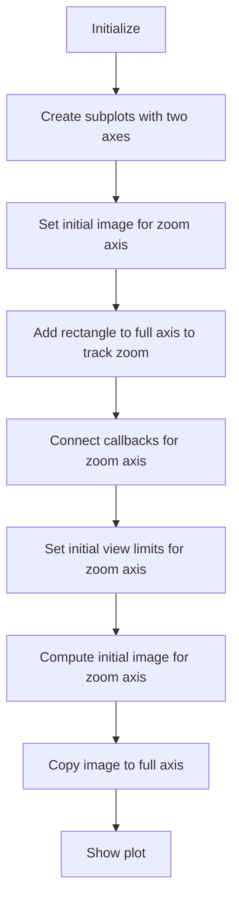
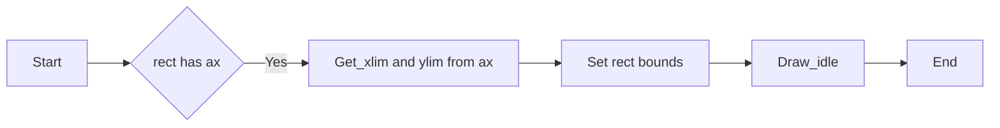
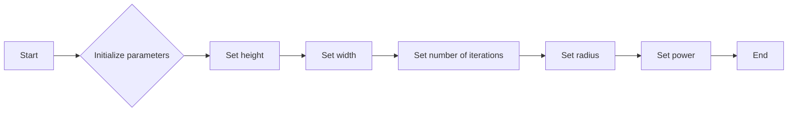

# `matplotlib\galleries\examples\event_handling\viewlims.py` 详细设计文档

The code implements a Mandelbrot set visualization using Matplotlib, allowing users to zoom in on specific regions of the fractal and see the increased detail.

## 整体流程



## 类结构

```
MandelbrotDisplay (主类)
├── matplotlib.pyplot (外部库)
├── numpy (外部库)
└── matplotlib.patches (外部库)
```

## 全局变量及字段


### `fig1`
    
The main figure object containing the two subplots.

类型：`matplotlib.figure.Figure`
    


### `ax_full`
    
The axes object for the full view of the Mandelbrot set.

类型：`matplotlib.axes.Axes`
    


### `ax_zoom`
    
The axes object for the zoomed view of the Mandelbrot set.

类型：`matplotlib.axes.Axes`
    


### `rect`
    
The rectangle that tracks the zoomed region on the full view.

类型：`matplotlib.patches.Rectangle`
    


### `md`
    
An instance of the MandelbrotDisplay class used to compute and update the Mandelbrot set image.

类型：`MandelbrotDisplay`
    


### `MandelbrotDisplay.height`
    
The height of the Mandelbrot set image.

类型：`int`
    


### `MandelbrotDisplay.width`
    
The width of the Mandelbrot set image.

类型：`int`
    


### `MandelbrotDisplay.niter`
    
The number of iterations to compute the Mandelbrot set image.

类型：`int`
    


### `MandelbrotDisplay.radius`
    
The radius of the bounding box for the Mandelbrot set computation.

类型：`float`
    


### `MandelbrotDisplay.power`
    
The power of the Mandelbrot set computation.

类型：`float`
    


### `MandelbrotDisplay.x`
    
The x-coordinates of the image grid.

类型：`numpy.ndarray`
    


### `MandelbrotDisplay.y`
    
The y-coordinates of the image grid.

类型：`numpy.ndarray`
    


### `MandelbrotDisplay.c`
    
The complex coordinates of the image grid.

类型：`numpy.ndarray`
    


### `MandelbrotDisplay.z`
    
The complex coordinates of the z-values in the Mandelbrot set computation.

类型：`numpy.ndarray`
    


### `MandelbrotDisplay.mask`
    
The mask array indicating where the Mandelbrot set is inside the radius.

类型：`numpy.ndarray`
    


### `MandelbrotDisplay.threshold_time`
    
The threshold time array used to compute the Mandelbrot set image.

类型：`numpy.ndarray`
    
    

## 全局函数及方法


### update_rect(rect, ax)

更新矩形的位置和大小以匹配当前轴的视图限制。

参数：

- rect：`Rectangle`，要更新的矩形对象。
- ax：`AxesSubplot`，包含矩形的轴对象。

返回值：无

#### 流程图



#### 带注释源码

```python
def update_rect(rect, ax):  # Let the rectangle track the bounds of the zoom axes.
    xlo, xhi = ax.get_xlim()  # 获取轴的当前x限制
    ylo, yhi = ax.get_ylim()  # 获取轴的当前y限制
    rect.set_bounds((xlo, ylo, xhi - xlo, yhi - ylo))  # 更新矩形的位置和大小
    ax.figure.canvas.draw_idle()  # 重绘轴以显示更新后的矩形
```


### functools.partial(update_rect, rect)

`functools.partial` 是一个高阶函数，它固定了一个或多个参数的值，并返回一个新的函数。在这个例子中，`functools.partial(update_rect, rect)` 创建了一个新的函数，它将 `rect` 参数固定为 `update_rect` 函数的 `rect` 参数。

#### 描述

该函数用于连接 `ax_zoom` 的 `xlim_changed` 和 `ylim_changed` 事件，以便在视图限制改变时更新矩形的位置。

#### 参数

- `rect`：`matplotlib.patches.Rectangle`，表示要更新的矩形。

#### 返回值

无返回值。

#### 流程图

```mermaid
graph LR
A[Start] --> B{Is xlim_changed or ylim_changed?}
B -- Yes --> C[Call update_rect(rect)]
B -- No --> D[End]
C --> E[End]
```

#### 带注释源码

```python
def update_rect(rect, ax):  # Let the rectangle track the bounds of the zoom axes.
    xlo, xhi = ax.get_xlim()
    ylo, yhi = ax.get_ylim()
    rect.set_bounds((xlo, ylo, xhi - xlo, yhi - ylo))
    ax.figure.canvas.draw_idle()

# Connect for changing the view limits.
ax_zoom.callbacks.connect("xlim_changed", functools.partial(update_rect, rect))
ax_zoom.callbacks.connect("ylim_changed", functools.partial(update_rect, rect))
```


### MandelbrotDisplay.__init__

This method initializes the MandelbrotDisplay class, setting up the initial parameters for the fractal image generation.

参数：

- `h`：`int`，The height of the display window.
- `w`：`int`，The width of the display window.
- `niter`：`int`，The number of iterations to perform for each pixel.
- `radius`：`float`，The radius for the escape-time algorithm.
- `power`：`float`，The power to which the complex number is raised in the escape-time algorithm.

返回值：`None`，This method does not return a value.

#### 流程图



#### 带注释源码

```python
def __init__(self, h=500, w=500, niter=50, radius=2., power=2):
    # Initialize the height of the display window
    self.height = h
    # Initialize the width of the display window
    self.width = w
    # Initialize the number of iterations to perform for each pixel
    self.niter = niter
    # Initialize the radius for the escape-time algorithm
    self.radius = radius
    # Initialize the power to which the complex number is raised in the escape-time algorithm
    self.power = power
```


### MandelbrotDisplay.compute_image

This method computes the Mandelbrot set image for a given x and y range.

参数：

- `xlim`：`tuple`，The x-axis limits of the image.
- `ylim`：`tuple`，The y-axis limits of the image.

返回值：`numpy.ndarray`，A 2D array representing the Mandelbrot set image.

#### 流程图


#### 带注释源码

```python
def compute_image(self, xlim, ylim):
    self.x = np.linspace(*xlim, self.width)
    self.y = np.linspace(*ylim, self.height).reshape(-1, 1)
    c = self.x + 1.0j * self.y
    threshold_time = np.zeros((self.height, self.width))
    z = np.zeros(threshold_time.shape, dtype=complex)
    mask = np.ones(threshold_time.shape, dtype=bool)
    for i in range(self.niter):
        z[mask] = z[mask]**self.power + c[mask]
        mask = (np.abs(z) < self.radius)
        threshold_time += mask
    return threshold_time
```


### MandelbrotDisplay.ax_update

This method updates the Mandelbrot set image displayed in the plot when the view limits are changed.

参数：

- `ax`：`matplotlib.axes.Axes`，The axes object that contains the image to be updated.

返回值：`None`，This method does not return any value.

#### 流程图


#### 带注释源码

```python
def ax_update(self, ax):
    ax.set_autoscale_on(False)  # Otherwise, infinite loop
    # Get the number of points from the number of pixels in the window
    self.width, self.height = ax.patch.get_window_extent().size.round().astype(int)
    # Update the image object with our new data and extent
    ax.images[-1].set(data=self.compute_image(ax.get_xlim(), ax.get_ylim()),
                      extent=(*ax.get_xlim(), *ax.get_ylim()))
    ax.figure.canvas.draw_idle()
```


## 关键组件


### 张量索引与惰性加载

张量索引与惰性加载是用于在MandelbrotDisplay类中计算Mandelbrot集的像素值。它通过延迟计算直到实际需要显示像素值时，从而优化性能。

### 反量化支持

反量化支持是用于将量化后的数据转换回原始数据类型的过程。在MandelbrotDisplay类中，它确保在计算过程中使用正确的数据类型。

### 量化策略

量化策略是用于将高精度数据转换为低精度数据的过程。在MandelbrotDisplay类中，它用于优化内存使用和计算速度，同时保持足够的精度来显示Mandelbrot集的细节。


## 问题及建议


### 已知问题

-   **性能问题**：`compute_image` 方法在每次视图变化时都会重新计算整个图像，即使只有一小部分区域发生变化。这可能导致性能问题，尤其是在高分辨率或大尺寸图像上。
-   **代码重复**：`update_rect` 函数和 `ax_update` 函数中存在重复的代码，用于更新图像和重绘。这可以通过提取一个共同的方法来减少。
-   **全局变量**：`md` 实例被用作全局变量，这可能导致代码难以维护和理解。

### 优化建议

-   **优化图像计算**：实现一个更高效的图像计算方法，例如仅计算视图变化区域，或者使用缓存机制来存储已计算的图像区域。
-   **减少代码重复**：提取一个共同的方法来更新图像和重绘，以减少代码重复并提高可维护性。
-   **避免全局变量**：将 `md` 实例作为参数传递给需要它的函数，而不是使用全局变量，以提高代码的可读性和可维护性。
-   **异常处理**：添加异常处理来捕获和处理可能发生的错误，例如视图限制设置错误或图像计算错误。
-   **代码注释**：添加更多的代码注释来解释代码的功能和逻辑，以提高代码的可读性。


## 其它


### 设计目标与约束

- 设计目标：
  - 实现一个交互式的曼德布罗特集显示。
  - 支持动态缩放，显示不同级别的细节。
  - 提供清晰的用户界面，允许用户通过鼠标操作进行缩放。
- 约束：
  - 使用Matplotlib库进行图形显示。
  - 限制迭代次数以避免过长的计算时间。
  - 保持代码的可读性和可维护性。

### 错误处理与异常设计

- 错误处理：
  - 捕获并处理可能的异常，如Matplotlib绘图错误。
  - 提供用户友好的错误消息。
- 异常设计：
  - 使用try-except块来捕获和处理异常。
  - 定义自定义异常类以处理特定错误情况。

### 数据流与状态机

- 数据流：
  - 用户通过鼠标操作改变视图限制。
  - 视图限制改变触发图像重新计算。
  - 计算结果更新显示在图形界面上。
- 状态机：
  - 当前状态：显示初始图像。
  - 事件：用户缩放操作。
  - 状态转换：根据缩放操作更新图像。

### 外部依赖与接口契约

- 外部依赖：
  - Matplotlib：用于图形显示。
  - NumPy：用于数值计算。
- 接口契约：
  - MandelbrotDisplay类提供初始化和更新图像的方法。
  - 使用回调函数连接视图限制变化事件与图像更新逻辑。


    