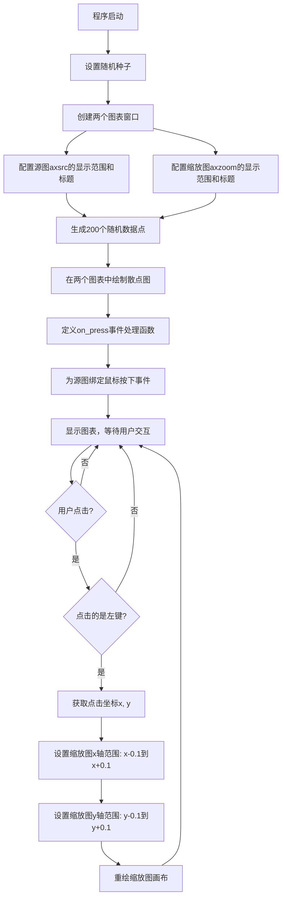
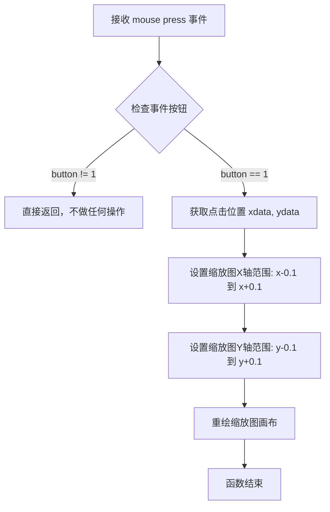

# `matplotlib\galleries\examples\event_handling\zoom_window.py` 详细设计文档

这是一个Matplotlib交互式示例，演示如何在两个图表窗口之间实现联动缩放功能：用户在源图表(axsrc)中点击任意位置时，自动调整缩放窗口(axzoom)的显示范围，使其以点击点为中心进行局部放大，从而实现跨窗口的交互式数据探索。

## 整体流程



## 类结构

```
本文件为脚本文件，无类层次结构
主要包含两个全局图表对象和事件处理函数
```

## 全局变量及字段


### `figsrc`
    
源图表的Figure对象

类型：`matplotlib.figure.Figure`
    


### `axsrc`
    
源图表的Axes对象

类型：`matplotlib.axes.Axes`
    


### `figzoom`
    
缩放窗口的Figure对象

类型：`matplotlib.figure.Figure`
    


### `axzoom`
    
缩放窗口的Axes对象

类型：`matplotlib.axes.Axes`
    


### `x`
    
200个随机生成的x坐标值(0-1之间)

类型：`numpy.ndarray`
    


### `y`
    
200个随机生成的y坐标值(0-1之间)

类型：`numpy.ndarray`
    


### `s`
    
散点图中点的尺寸数组(放大200倍)

类型：`numpy.ndarray`
    


### `c`
    
散点图中点的颜色数组

类型：`numpy.ndarray`
    


    

## 全局函数及方法


### `on_press`

这是一个鼠标按下事件回调函数，当用户点击源图时触发，根据点击位置调整缩放图的显示范围，使得缩放窗口的中心移动到点击的坐标位置。

参数：

-  `event`：`MouseEvent`，Matplotlib 的鼠标事件对象，包含点击位置的坐标信息（`xdata`、`ydata`）和点击的按钮信息（`button`）

返回值：`None`，该函数不返回任何值，仅通过修改缩放图的坐标轴范围来实现缩放效果

#### 流程图



#### 带注释源码

```python
def on_press(event):
    """
    鼠标按下事件回调函数
    
    当用户在源图上按下鼠标左键时，调整缩放图的显示范围，
    使缩放窗口以点击位置为中心显示局部区域。
    
    参数:
        event: MouseEvent 对象，包含以下关键属性:
            - button: 鼠标按钮编号 (1=左键, 2=中键, 3=右键)
            - xdata: 点击位置的 X 坐标 (数据坐标系)
            - ydata: 点击位置的 Y 坐标 (数据坐标系)
    """
    # 检查是否是鼠标左键 (button=1)
    # 如果不是左键则直接返回，不进行缩放操作
    if event.button != 1:
        return
    
    # 从事件对象中获取点击位置的数据坐标
    # xdata 和 ydata 可能是 None（如果点击在 Axes 外部）
    x, y = event.xdata, event.ydata
    
    # 设置缩放图的 X 轴范围：以点击位置为中心，宽度为 0.2
    axzoom.set_xlim(x - 0.1, x + 0.1)
    
    # 设置缩放图的 Y 轴范围：以点击位置为中心，高度为 0.2
    axzoom.set_ylim(y - 0.1, y + 0.1)
    
    # 触发缩放图画布重绘，更新显示内容
    figzoom.canvas.draw()
```


## 关键组件


### 散点图数据生成模块

使用numpy生成200个随机数据点，包括x坐标、y坐标、散点大小和颜色，用于在两个子图中绘制散点图。

### 双图表窗口创建模块

创建两个独立的matplotlib图形窗口（figsrc源图窗口和figzoom缩放窗口），分别配置不同的坐标轴范围，实现主视图和缩放视图的分离显示。

### 交互式缩放事件处理模块

监听鼠标左键点击事件，获取点击位置的(x, y)坐标，动态调整缩放窗口的坐标轴范围，实现以点击点为中心的局部放大效果。

### 事件连接与绑定模块

将button_press_event事件与on_press回调函数绑定，使源图窗口响应鼠标点击操作，触发缩放窗口的实时更新。

### 图形渲染与显示模块

调用matplotlib的canvas.draw()方法执行即时重绘，并通过plt.show()启动交互式图形界面，维持事件循环运行。


## 问题及建议


### 已知问题

-   **硬编码的魔法数字**：缩放窗口坐标范围 (0.45, 0.55), (0.4, 0.6)、缩放步长 0.1、散点大小乘数 200 等数值均为硬编码，缺乏可配置性
-   **缺少空值检查**：`on_press` 函数未检查 `event.xdata` 和 `event.ydata` 是否为 None，当用户在坐标轴区域外点击时会抛出异常
-   **无事件清理机制**：未提供断开事件连接的函数，缺少资源释放和生命周期管理
-   **函数可重用性差**：`on_press` 定义为内部函数，无法从外部调用或重置缩放状态
-   **无重置功能**：缺少恢复原始视图的机制，用户无法取消缩放操作
-   **交互方式单一**：仅支持鼠标左键点击，无键盘快捷键、双击或滚轮缩放等交互方式
-   **状态管理缺失**：未保存原始坐标轴范围，无法实现动态恢复

### 优化建议

-   将硬编码数值提取为模块级配置常量或函数参数，提升可维护性
-   在 `on_press` 函数起始处添加 `if x is None or y is None: return` 空值检查
-   封装交互逻辑为类，提供 `connect()` 和 `disconnect()` 方法管理事件生命周期
-   添加重置功能方法，例如 `reset_zoom()` 恢复原始视图范围
-   支持更多交互方式（如双击重置、滚轮缩放），丰富用户体验
-   保存原始坐标轴范围到实例变量，便于状态恢复

## 其它


### 设计目标与约束

**设计目标**：
- 实现两个matplotlib图表之间的交互式缩放联动
- 当用户在源图表点击时，缩放图表自动调整视图中心到点击坐标位置
- 提供直观的多层次数据查看体验

**设计约束**：
- 仅响应鼠标左键（button==1）的点击事件
- 缩放窗口的视图范围固定为点击点周围±0.1的区间
- 散点图的点大小使用points²单位，独立于缩放级别

### 错误处理与异常设计

- **无效点击区域处理**：当点击位置超出源图表有效数据区域（xdata或ydata为None）时，直接返回不执行任何操作
- **事件类型过滤**：仅处理button_press_event事件，其他事件（如button_release、motion_notify）被忽略
- **画布绘制异常**：使用try-except包裹绘图操作以防止意外错误导致程序崩溃

### 数据流与状态机

**数据流**：
1. 用户在figsrc上触发button_press_event
2. on_press回调函数接收Event对象
3. 提取event.xdata和event.ydata坐标
4. 更新axzoom的xlim和ylim属性
5. 调用figzoom.canvas.draw()重绘缩放窗口

**状态机**：
- 初始状态：缩放窗口显示固定范围(0.45-0.55, 0.4-0.6)
- 响应状态：用户点击后更新为以点击点为中心的±0.1范围
- 无锁定状态：每次点击都会立即更新视图，无互斥锁机制

### 外部依赖与接口契约

**外部依赖**：
- matplotlib >= 3.0：用于绘图和事件处理
- numpy：用于生成随机数据
- Python标准库：random模块（通过numpy间接使用）

**接口契约**：
- on_press(event)函数：接收matplotlib事件对象，必须包含xdata、ydata、button属性
- mpl_connect()：将事件处理器绑定到'button_press_event'事件类型
- scatter()：接收x、y、s、c四个数组参数，分别代表坐标和大小/颜色

### 性能考虑

- 使用np.random.rand(4, 200)一次性生成所有随机数据，避免循环调用
- 散点图使用相同的x、y、s、c数据对象，无需重复计算
- figzoom.canvas.draw()仅重绘缩放窗口，不重绘源窗口
- 数据量控制在200个点，保证交互响应速度

### 安全性考虑

- 无用户输入处理，无SQL注入或命令注入风险
- 无文件操作，无路径遍历风险
- 随机数种子固定(19680801)，确保结果可复现

### 可测试性

- on_press函数为纯函数，易于单元测试
- 可通过模拟Event对象测试边界条件（None值、坐标越界）
- 可测试不同button值的处理逻辑
- 建议添加：坐标有效性验证单元测试、视图范围边界测试

### 兼容性考虑

- 兼容matplotlib 3.0+版本
- 兼容Python 3.6+版本
- 跨平台支持（Windows、Linux、macOS）
- 静态文档中不显示，需在交互环境运行

### 用户交互设计

- **视觉反馈**：源图标题"Click to zoom"提示操作方式
- **缩放窗口标题**："Zoom window"表明功能
- **交互限制**：仅左键触发，避免误操作
- **无退出机制**：程序运行直到用户关闭所有窗口
- **建议改进**：添加键盘快捷键（如'r'重置视图）、滚轮缩放支持、双击复位功能

### 代码组织与模块化

- 当前为单文件脚本，耦合度较低
- 建议抽取on_press为独立函数模块
- 建议添加配置类或参数化方式定义缩放范围(0.1)
- 建议将窗口创建封装为函数，支持自定义数据源

    