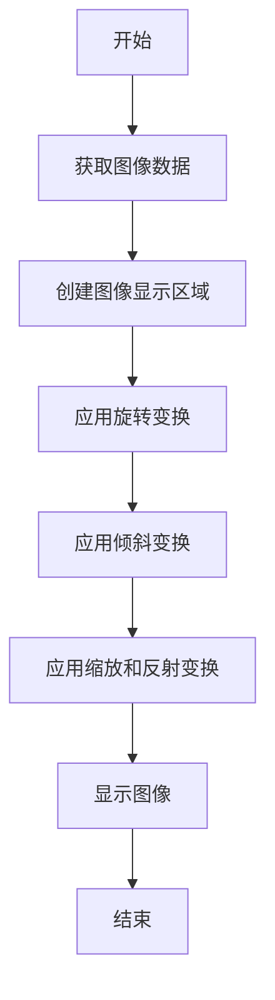
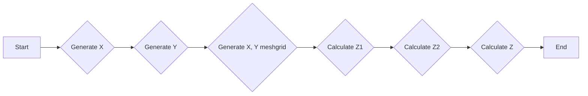
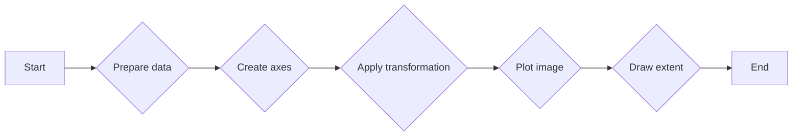
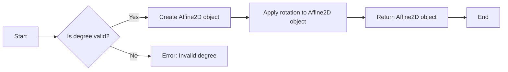
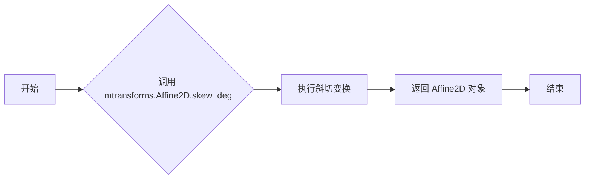
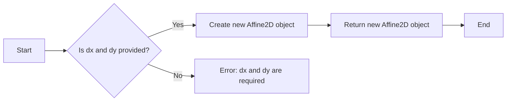

# `matplotlib\galleries\examples\images_contours_and_fields\affine_image.py` 详细设计文档

This code performs affine transformations on an image, including rotation, skewing, scaling, and reflection, using the matplotlib library.

## 整体流程



## 类结构

```
Affine2D (matplotlib.transforms.Affine2D)
```

## 全局变量及字段


### `delta`
    
The step size for the range of x and y coordinates.

类型：`float`
    


### `x`
    
The x coordinates of the mesh grid.

类型：`numpy.ndarray`
    


### `y`
    
The y coordinates of the mesh grid.

类型：`numpy.ndarray`
    


### `X`
    
The mesh grid for x coordinates.

类型：`numpy.ndarray`
    


### `Y`
    
The mesh grid for y coordinates.

类型：`numpy.ndarray`
    


### `Z1`
    
The first exponential function's result.

类型：`numpy.ndarray`
    


### `Z2`
    
The second exponential function's result.

类型：`numpy.ndarray`
    


### `Z`
    
The difference between Z1 and Z2.

类型：`numpy.ndarray`
    


### `fig`
    
The main figure object.

类型：`matplotlib.figure.Figure`
    


### `ax1`
    
The first subplot object.

类型：`matplotlib.axes._subplots.AxesSubplot`
    


### `ax2`
    
The second subplot object.

类型：`matplotlib.axes._subplots.AxesSubplot`
    


### `ax3`
    
The third subplot object.

类型：`matplotlib.axes._subplots.AxesSubplot`
    


### `ax4`
    
The fourth subplot object.

类型：`matplotlib.axes._subplots.AxesSubplot`
    


### `im`
    
The image object displayed on the subplot.

类型：`matplotlib.images.Image`
    


### `trans_data`
    
The combined transform of the image and the data coordinates.

类型：`matplotlib.transforms.Transform`
    


### `x1`
    
The x coordinate of the lower left corner of the image extent.

类型：`float`
    


### `x2`
    
The x coordinate of the upper right corner of the image extent.

类型：`float`
    


### `y1`
    
The y coordinate of the lower left corner of the image extent.

类型：`float`
    


### `y2`
    
The y coordinate of the upper right corner of the image extent.

类型：`float`
    


### `Affine2D.matrix`
    
The transformation matrix of the Affine2D object.

类型：`numpy.ndarray`
    


### `Affine2D.offset`
    
The offset vector of the Affine2D object.

类型：`numpy.ndarray`
    
    

## 全局函数及方法


### get_image()

获取一个二维图像数据。

参数：

- 无

返回值：`numpy.ndarray`，一个二维数组，表示图像数据。

#### 流程图



#### 带注释源码

```python
def get_image():
    delta = 0.25
    x = y = np.arange(-3.0, 3.0, delta)
    X, Y = np.meshgrid(x, y)
    Z1 = np.exp(-X**2 - Y**2)
    Z2 = np.exp(-(X - 1)**2 - (Y - 1)**2)
    Z = (Z1 - Z2)
    return Z
```


### do_plot

`do_plot` 函数用于在给定的轴（Axes）上绘制图像，并应用指定的变换。

参数：

- `ax`：`matplotlib.axes.Axes`，图像绘制的轴对象。
- `Z`：`numpy.ndarray`，图像数据。
- `transform`：`matplotlib.transforms.Affine2D`，应用于图像的变换。

返回值：无

#### 流程图



#### 带注释源码

```python
def do_plot(ax, Z, transform):
    im = ax.imshow(Z, interpolation='none',
                   origin='lower',
                   extent=[-2, 4, -3, 2], clip_on=True)

    trans_data = transform + ax.transData
    im.set_transform(trans_data)

    # display intended extent of the image
    x1, x2, y1, y2 = im.get_extent()
    ax.plot([x1, x2, x2, x1, x1], [y1, y1, y2, y2, y1], "y--",
            transform=trans_data)
    ax.set_xlim(-5, 5)
    ax.set_ylim(-4, 4)
```


### mtransforms.Affine2D.rotate_deg

This function rotates an image by a specified degree.

参数：

- `degree`：`int`，The degree of rotation in degrees.

返回值：`mtransforms.Affine2D`，An Affine2D transformation object representing the rotation.

#### 流程图



#### 带注释源码

```python
def rotate_deg(self, degree):
    """
    Rotate the Affine2D transformation by the given degree.

    :param degree: int, The degree of rotation in degrees.
    :return: Affine2D, The Affine2D transformation object with rotation applied.
    """
    # Validate the degree
    if not isinstance(degree, int):
        raise ValueError("Degree must be an integer.")

    # Create a rotation matrix
    theta = np.radians(degree)
    rotation_matrix = np.array([
        [np.cos(theta), -np.sin(theta)],
        [np.sin(theta), np.cos(theta)]
    ])

    # Apply the rotation matrix to the existing transformation
    self.transform = np.dot(self.transform, rotation_matrix)
    return self
```


### mtransforms.Affine2D.skew_deg

`skew_deg` 方法用于对图像进行斜切变换。

参数：

- `skew_x`：`float`，沿 x 轴的斜切角度（度）
- `skew_y`：`float`，沿 y 轴的斜切角度（度）

参数描述：

- `skew_x`：指定沿 x 轴的斜切角度，正值表示向右斜切，负值表示向左斜切。
- `skew_y`：指定沿 y 轴的斜切角度，正值表示向上斜切，负值表示向下斜切。

返回值：`mtransforms.Affine2D`，返回一个新的 Affine2D 对象，该对象包含了斜切变换。

返回值描述：返回的 Affine2D 对象可以用于后续的图像变换。

#### 流程图



#### 带注释源码

```python
def skew_deg(self, skew_x, skew_y):
    """
    Apply a skew transformation to the Affine2D object.

    Parameters:
    skew_x (float): The skew angle along the x-axis (in degrees).
    skew_y (float): The skew angle along the y-axis (in degrees).

    Returns:
    Affine2D: A new Affine2D object with the skew transformation applied.
    """
    # Create a skew matrix
    skew_matrix = np.array([
        [1, skew_x, 0],
        [skew_y, 1, 0],
        [0, 0, 1]
    ])

    # Multiply the current transformation matrix with the skew matrix
    self._matrix = np.dot(self._matrix, skew_matrix)
    return self
```


### mtransforms.Affine2D().scale(-1, .5)

该函数用于对图像进行缩放变换。

参数：

- `-1`：`int`，水平缩放因子，-1表示水平翻转。
- `.5`：`float`，垂直缩放因子。

返回值：`mtransforms.Affine2D`，返回一个包含缩放变换的Affine2D对象。

#### 流程图

```mermaid
graph LR
A[开始] --> B{调用 scale(-1, .5)}
B --> C[结束]
```

#### 带注释源码

```python
# scale and reflection
do_plot(ax3, Z, mtransforms.Affine2D().scale(-1, .5))
```


### mtransforms.Affine2D.translate

`mtransforms.Affine2D.translate` 是一个方法，用于将 Affine2D 变换对象沿 x 和 y 轴进行平移。

参数：

- `dx`：`float`，沿 x 轴的平移量。
- `dy`：`float`，沿 y 轴的平移量。

参数描述：

- `dx`：指定沿 x 轴的平移距离。
- `dy`：指定沿 y 轴的平移距离。

返回值类型：`matplotlib.transforms.Affine2D`

返回值描述：返回一个新的 Affine2D 变换对象，该对象包含了原始变换和平移变换的组合。

#### 流程图



#### 带注释源码

```python
def translate(self, dx, dy):
    """
    Translate the Affine2D transformation by dx and dy.

    Parameters
    ----------
    dx : float
        The translation along the x-axis.
    dy : float
        The translation along the y-axis.

    Returns
    -------
    Affine2D
        A new Affine2D object with the translation applied.
    """
    new_matrix = np.array([
        [1, 0, dx],
        [0, 1, dy],
        [0, 0, 1]
    ])
    return Affine2D(new_matrix)
```


## 关键组件


### 张量索引与惰性加载

张量索引与惰性加载允许在处理大型数据集时，只加载和处理需要的数据部分，从而提高效率。

### 反量化支持

反量化支持使得模型可以在量化后仍然保持其精度，这对于提高模型在资源受限设备上的性能至关重要。

### 量化策略

量化策略决定了如何将浮点数转换为固定点数，这对于减少模型大小和提高推理速度至关重要。


## 问题及建议


### 已知问题

-   **代码重复性**：`do_plot` 函数被多次调用，每次都传递不同的变换。这可能导致代码维护困难，如果变换逻辑需要修改。
-   **全局变量**：代码中使用了全局变量 `plt` 和 `np`，这可能导致命名冲突和难以追踪变量来源。
-   **硬编码值**：例如，`do_plot` 函数中的 `extent` 参数和 `ax.set_xlim`、`ax.set_ylim` 函数中的值是硬编码的，这限制了代码的灵活性和可重用性。

### 优化建议

-   **封装变换**：创建一个类或函数来封装图像变换逻辑，这样可以在不同的上下文中重用变换，并减少代码重复。
-   **使用局部变量**：将全局变量 `plt` 和 `np` 替换为局部变量，以减少命名冲突和代码复杂性。
-   **参数化配置**：将硬编码的值作为参数传递给函数，这样可以根据不同的需求调整图像的显示范围和样式。
-   **异常处理**：添加异常处理来捕获和处理可能发生的错误，例如在图像处理或绘图过程中。
-   **文档和注释**：为代码添加详细的文档和注释，以提高代码的可读性和可维护性。
-   **测试**：编写单元测试来验证代码的功能和正确性，确保在未来的修改中不会引入错误。


## 其它


### 设计目标与约束

- 设计目标：实现一个图像的仿射变换，包括旋转、倾斜、缩放和反射。
- 约束条件：使用matplotlib库进行图像显示和处理，不使用额外的图像处理库。

### 错误处理与异常设计

- 错误处理：在函数中捕获可能出现的异常，如matplotlib库的异常。
- 异常设计：定义自定义异常类，以提供更具体的错误信息。

### 数据流与状态机

- 数据流：图像数据通过函数`get_image`生成，然后通过`do_plot`函数进行变换和显示。
- 状态机：没有明确的状态机，但图像的变换可以通过链式调用`Affine2D`方法来控制。

### 外部依赖与接口契约

- 外部依赖：matplotlib库，numpy库。
- 接口契约：`get_image`函数返回图像数据，`do_plot`函数接受图像数据和变换对象。


    