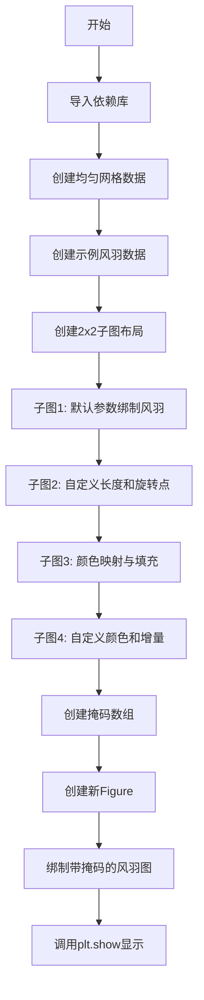
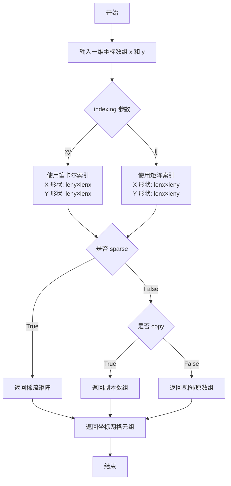
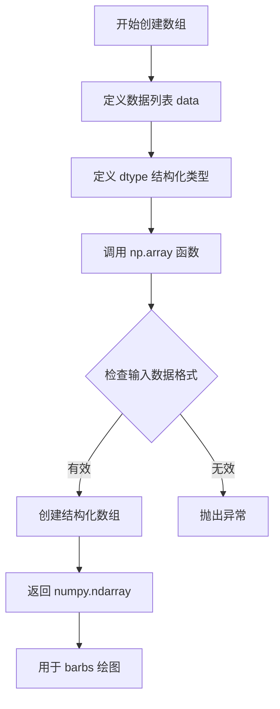
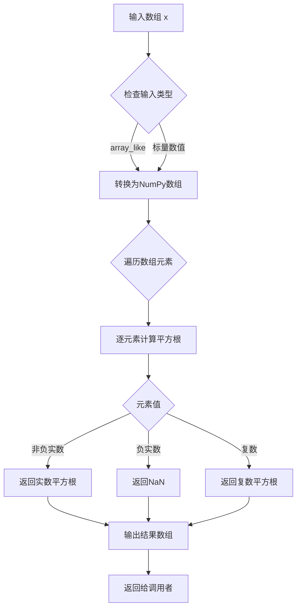
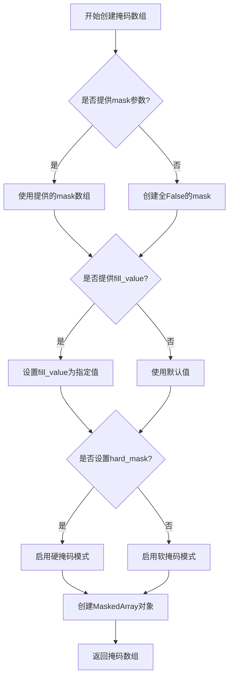
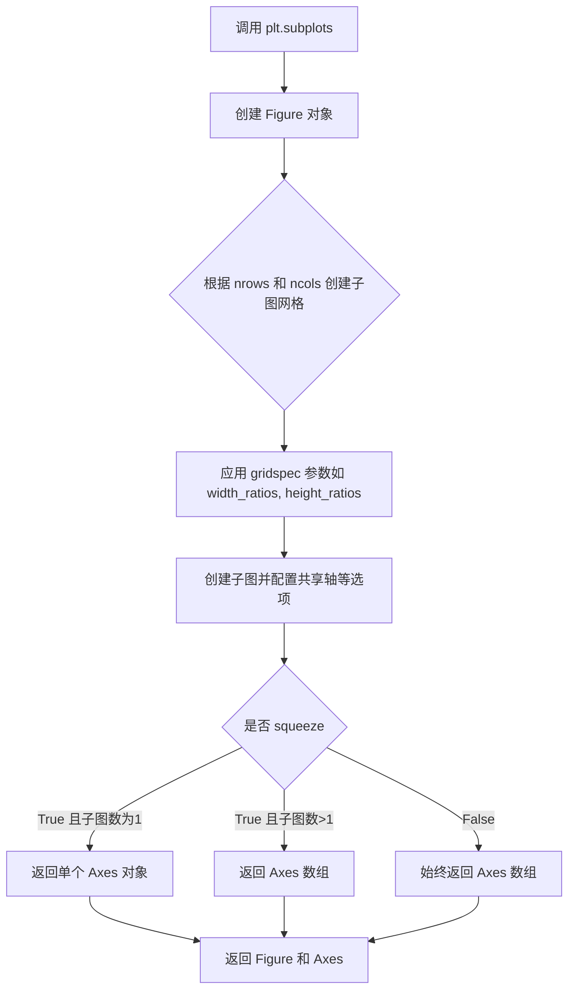
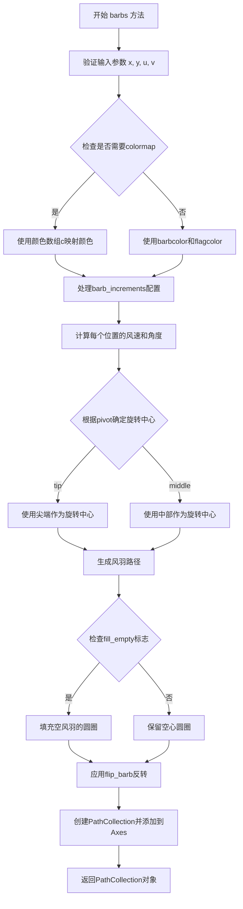
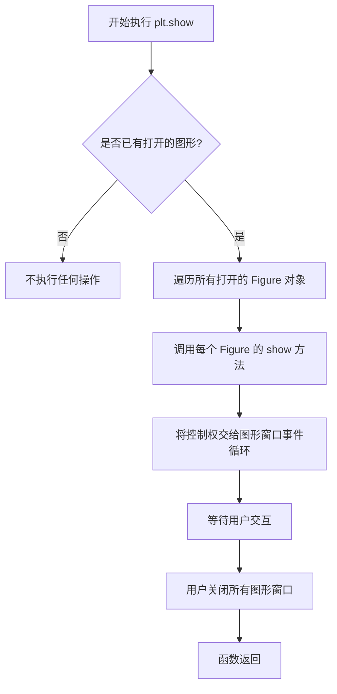

# `matplotlib\galleries\examples\images_contours_and_fields\barb_demo.py` 详细设计文档

这是一个Matplotlib风羽图（wind barbs）绑制演示代码，通过多个子图展示如何绑制不同风格的风羽图，包括默认参数设置、自定义向量长度和旋转点、颜色映射、标志颜色设置以及掩码数组支持等功能。

## 整体流程



## 类结构

```
此代码为脚本式示例代码，无面向对象类结构
主要由全局变量和函数调用序列组成
使用的matplotlib对象:
├── Figure (fig1, fig2)
└── Axes (axs1[0,0], axs1[0,1], axs1[1,0], axs1[1,1], ax2)
```

## 全局变量及字段


### `x`
    
linspace生成的均匀分布点数组

类型：`numpy.ndarray`
    


### `X`
    
meshgrid生成的X坐标网格

类型：`numpy.ndarray`
    


### `Y`
    
meshgrid生成的Y坐标网格

类型：`numpy.ndarray`
    


### `U`
    
基于X计算的U向量分量 (12*X)

类型：`numpy.ndarray`
    


### `V`
    
基于Y计算的V向量分量 (12*Y)

类型：`numpy.ndarray`
    


### `data`
    
结构化数组，包含x,y,u,v四个字段的风羽数据

类型：`numpy.ndarray`
    


### `masked_u`
    
对u分量进行掩码处理的数组

类型：`numpy.ma.MaskedArray`
    


### `fig1`
    
第一个图形对象

类型：`matplotlib.figure.Figure`
    


### `axs1`
    
2x2的axes数组

类型：`numpy.ndarray`
    


### `fig2`
    
第二个图形对象

类型：`matplotlib.figure.Figure`
    


### `ax2`
    
第二个图形的axes对象

类型：`matplotlib.axes.Axes`
    


    

## 全局函数及方法


### np.linspace

`np.linspace` 是 NumPy 库中的一个函数，用于生成均匀间隔的数值序列。在给定的代码中，它被用于创建风羽图的坐标网格。

参数：

- `start`：`float`，序列的起始值
- `stop`：`float`，序列的结束值
- `num`：`int`，要生成的样本数量，默认为 50

返回值：`ndarray`，返回指定范围内的等间距数列

#### 流程图

```mermaid
graph TD
    A[开始] --> B[输入起始值、结束值和样本数量]
    B --> C{是否指定端点}
    C -->|是| D[包含结束值]
    C -->|否| E[不包含结束值]
    D --> F[计算步长: (stop - start) / (num - 1)]
    E --> G[计算步长: (stop - start) / num]
    F --> H[生成等间距数组]
    G --> H
    H --> I[返回 NumPy 数组]
    I --> J[结束]
```

#### 带注释源码

```python
# np.linspace 的典型使用方式
# start: 起始值
# stop: 结束值  
# num: 生成的样本数量

x = np.linspace(-5, 5, 5)
# 上述代码生成了一个从 -5 到 5 的等间距数组，包含 5 个元素
# 结果: array([-5. , -2.5,  0. ,  2.5,  5. ])
```


### `np.meshgrid`

生成坐标网格矩阵。该函数从一维坐标数组创建二维（或多维）网格坐标矩阵，常用于生成笛卡尔坐标系下的网格点，以便对二维函数进行求值或可视化。

参数：

- `x`：`array_like`，第一个维度的坐标数组（如 `np.linspace(-5, 5, 5)`）
- `y`：`array_like`，第二个维度的坐标数组（与 `x` 相同的维度）
- `indexing`：`{'xy', 'ij'}`，可选，默认 `'xy'`。`'xy'` 表示笛卡尔坐标（x 是行，y 是列），`'ij'` 表示矩阵索引（i 是行，j 是列）
- `sparse`：`bool`，可选，默认 `False`。若为 `True`，返回稀疏矩阵以节省内存
- `copy`：`bool`，可选，默认 `False`。若为 `True`，返回坐标数组的副本

返回值：`tuple of ndarray`，返回由网格坐标组成的元组。对于二维网格，返回 (X, Y)，其中 X 和 Y 都是二维数组，形状为 (len(y), len(x))。

#### 流程图



#### 带注释源码

```python
import numpy as np

# 定义一维坐标向量
x = np.linspace(-5, 5, 5)  # [-5.  -2.5  0.   2.5  5.]

# 调用 np.meshgrid 生成二维网格坐标矩阵
# 参数 x, y 相同，生成正方形网格
# indexing='xy' 为默认值，表示笛卡尔坐标系
X, Y = np.meshgrid(x, x)

# 生成的 X 和 Y 为 5x5 的二维数组：
# X = [[-5.  -2.5  0.   2.5  5. ]   # 每行相同
#      [-5.  -2.5  0.   2.5  5. ]
#      ...
#      [-5.  -2.5  0.   2.5  5. ]]
# Y = [[-5.  -2.5  0.   2.5  5. ]   # 每列相同
#      [-2.5 -2.5 -2.5 -2.5 -2.5]
#      ...
#      [5.   5.   5.   5.   5. ]]

# 使用生成的网格计算向量场
U, V = 12 * X, 12 * Y  # 基于网格位置生成速度分量

# meshgrid 的核心用途：
# 1. 生成二维网格点用于函数求值
# 2. 为矢量场可视化提供坐标基础（如 barbs, quiver）
# 3. 支持广播运算，避免显式循环
```


### `np.array`

此函数用于创建numpy数组，特别用于创建具有特定数据类型（dtype）的结构化数组，以存储风速 barb 数据（包含 x, y 坐标和 u, v 风速分量）。

参数：

-  `data`：`list`，包含风速数据的元组列表，每个元组包含四个浮点数，分别表示 x 坐标、y 坐标、u 分量和 v 分量
-  `dtype`：`numpy.dtype`，结构化数据类型，定义数组中每个元素的字段名称和类型，包含 x（float32）、y（float32）、u（float32）、v（float32）四个字段

返回值：`numpy.ndarray`，返回具有指定 dtype 的结构化 numpy 数组，用于后续的 barb 风速绘图

#### 流程图



#### 带注释源码

```python
# 定义包含风速 barb 数据的列表
# 每个元组表示一个风速向量: (x坐标, y坐标, u风速, v风速)
data = [(-1.5, .5, -6, -6),
        (1, -1, -46, 46),
        (-3, -1, 11, -11),
        (1, 1.5, 80, 80),
        (0.5, 0.25, 25, 15),
        (-1.5, -0.5, -5, 40)]

# 使用 np.array 创建结构化数组
# dtype 参数指定数组元素的结构:
#   - 'x': 浮点数32位, 表示 x 坐标
#   - 'y': 浮点数32位, 表示 y 坐标
#   - 'u': 浮点数32位, 表示风速的 u 分量(东向)
#   - 'v': 浮点数32位, 表示风速的 v 分量(北向)
data = np.array(data, dtype=[('x', np.float32), ('y', np.float32),
                             ('u', np.float32), ('v', np.float32)])

# 之后可以通过 data['x'], data['y'], data['u'], data['v'] 访问各个字段
# 例如: data['x'] 返回所有 x 坐标的数组
```


### `np.sqrt`

计算输入数组元素的平方根。在本代码中用于计算风速向量的模（速度大小），即 sqrt(U² + V²)，其中 U 和 V 分别是 x 和 y 方向的风速分量。

参数：

- `x`：`array_like`，输入数组，需要计算平方根的元素，可以是单个数值、列表或 NumPy 数组
- `out`：`ndarray`，可选，存放结果的数组，必须具有与输入数组相同的形状和 dtype
- `where`：`array_like`，可选，条件数组，仅对满足条件的元素计算平方根
- `order`：`{‘C’, ‘F’, ‘A’, ‘K’}`，可选，输出数组的内存布局
- `dtype`：`data-type`，可选，返回数组的数据类型
- `subok`：`bool`，可选，是否允许返回输入类型的子类（默认为 True）
- `extobj`：`list`，可选，额外的参数列表，用于指定小数值等

返回值：``ndarray`，返回输入数组元素的平方根组成的数组。对于负实数输入返回 NaN，对于复数输入返回复数平方根。

#### 流程图



#### 带注释源码

```python
# np.sqrt 函数的简化实现逻辑（来源：NumPy库）
def sqrt(x, out=None, where=None, dtype=None, subok=True):
    """
    计算数组元素的平方根
    
    参数:
        x: 输入数组，可以是实数或复数
        out: 可选的输出数组
        where: 可选的条件数组
        dtype: 可选的数据类型
        subok: 是否允许子类
    
    返回:
        输入数组元素的平方根
    """
    
    # 在本代码中的实际调用：
    # np.sqrt(U ** 2 + V ** 2)
    # 其中 U = 12*X, V = 12*Y
    # 用于计算风速向量的模（速度大小）
    
    # 示例数据：
    # X, Y = meshgrid结果
    # U = 12 * X (x方向风速)
    # V = 12 * Y (y方向风速)
    # 计算速度大小：sqrt(U^2 + V^2)
    
    result = np.power(x, 0.5)  # 通过指数运算计算平方根
    return result

# 在本例中的具体使用：
# np.sqrt(U ** 2 + V ** 2)  # 计算风速大小
# 等价于：sqrt((12*X)^2 + (12*Y)^2)
# 结果作为颜色映射数据传递给barbs函数
```


### `np.ma.masked_array`

创建掩码数组（Masked Array），用于处理包含缺失值或无效值的数据，在保留原始数据索引的同时标记哪些元素应该被忽略或视为无效。

参数：

-  `data`：`array_like`，要掩码的输入数组或数据序列
-  `mask`：`array_like`，可选，一个布尔数组或标量，指定哪些位置应该被掩码（True 表示掩码）
-  `fill_value`：标量，可选，填充值，用于在数组被解包时替换掩码位置的值
-  `hard_mask`：`bool`，可选，如果为 True，则不允许通过赋值取消掩码
-  `soft_mask`：`bool`，可选，如果为 True，允许通过赋值取消掩码
-  `copy`：`bool`，可选，如果为 True，始终复制数据；否则只在必要时复制

返回值：`numpy.ma.MaskedArray`，返回一个掩码数组对象，包含原始数据和掩码信息

#### 流程图



#### 带注释源码

```python
# 在示例代码中的使用方式：
masked_u = np.ma.masked_array(data['u'])  # 从data['u']创建掩码数组

# 步骤1: 将data['u']转换为掩码数组
# data['u'] 是结构化数组中的'u'字段，类型为float32

# 步骤2: 设置掩码值
masked_u[4] = 1000  # 将索引4的位置临时设置为1000
masked_u[4] = np.ma.masked  # 将索引4的位置标记为掩码（无效/缺失）

# 步骤3: 使用掩码数组进行绘图
# ax2.barbs(data['x'], data['y'], masked_u, data['v'], length=8, pivot='middle')
# 绘图时，索引4的位置将被忽略，不会显示风矢

# np.ma.masked_array 的关键特性：
# 1. 保留原始数据的形状和索引
# 2. 掩码位置的值不参与计算和绘图
# 3. 可以通过 .data 属性访问原始数据，通过 .mask 属性访问掩码状态
# 4. 支持多种掩码操作：mask()、unmask()、filled() 等
```


### `np.ma.masked_array`

创建掩码数组的函数，用于标记数组中特定元素为无效或缺失值，从而在后续计算和绑图时忽略这些数据点。

参数：

-  `data`：`ndarray`，要掩码的输入数组
-  `mask`：可选参数，掩码数组或掩码值（默认为 `np.ma.nomask`）

返回值：`MaskedArray`，返回一个新的掩码数组对象，其中指定位置已被标记为掩码

#### 流程图

```mermaid
flowchart TD
    A[开始创建掩码数组] --> B[输入原始数组 data['u']]
    B --> C[调用 np.ma.masked_array 创建掩码数组]
    C --> D[返回 MaskedArray 对象]
    D --> E[访问特定索引 4]
    E --> F[赋值 np.ma.masked 标记该位置为无效]
    F --> G[在绑图时自动忽略被掩码的元素]
    G --> H[结束]
```

#### 带注释源码

```python
# 创建一个掩码数组，第一个参数是原始数据数组
masked_u = np.ma.masked_array(data['u'])

# 访问掩码数组的特定索引位置
masked_u[4] = 1000  # 先设置一个临时值（代码注释说明这是需要掩码的坏值）

# 关键操作：将索引4的位置标记为掩码/无效
# np.ma.masked 是一个特殊的常量，表示该位置的数据应该被忽略
masked_u[4] = np.ma.masked

# 后续在 ax2.barbs() 调用中，被掩码的位置将不会被绘制
# 这在处理缺失数据或异常值时非常有用
ax2.barbs(data['x'], data['y'], masked_u, data['v'], length=8, pivot='middle')
```


### `plt.subplots`

`plt.subplots` 是 `matplotlib.pyplot` 模块中的一个函数，用于创建一个包含多个子图的图形，并返回图形对象（Figure）以及对应的子图对象（Axes）或子图数组。该函数支持自定义行列数、轴共享、布局比例等，适用于需要展示多个相关图表的场景。

参数：
- `nrows`：`int`，子图的行数，默认值为 1。
- `ncols`：`int`，子图的列数，默认值为 1。

返回值：`tuple`，返回两个对象：第一个是 `Figure` 对象，表示整个图形；第二个是 `Axes` 对象（当 `squeeze=True` 且仅有一个子图时）或 `numpy.ndarray`（当有多个子图时），表示一个或多个子图。

#### 流程图



#### 带注释源码

```python
# 第一次调用：创建 2x2 的子图布局，返回图形 fig1 和子图数组 axs1
fig1, axs1 = plt.subplots(nrows=2, ncols=2)
# 默认参数，均匀网格，子图以数组形式返回，可通过索引访问每个子图

# 第二次调用：创建单个子图（1x1），返回图形 fig2 和单个子图对象 ax2
fig2, ax2 = plt.subplots()
# 不指定参数时，默认 nrows=1, ncols=1，返回单个 Axes 对象
```


```json
{
  "function_name": "Axes.barbs",
  "class_name": "Axes",
  "method_name": "barbs"
}
```


### `matplotlib.axes.Axes.barbs`

绘制风羽图（Wind Barbs），用于可视化二维向量场（如风速和风向）。该方法是Axes类的一个绘图方法，接收位置坐标和向量分量作为输入，在坐标系中绘制表示风速和风向的风羽符号，并支持丰富的自定义选项如颜色、增量、填充等。

**参数：**

-  `x`：`numpy.ndarray` 或类似数组，一维数组或与Y形状相同的二维数组，表示风羽位置的x坐标
-  `y`：`numpy.ndarray` 或类似数组，一维数组或与X形状相同的二维数组，表示风羽位置的y坐标
-  `u`：`numpy.ndarray`，与x和y形状相同的数组，表示向量的x分量（东向风速）
-  `v`：`numpy.ndarray`，与x和y形状相同的数组，表示向量的y分量（北向风速）
-  `c`（可选）：`numpy.ndarray`，可选的颜色数组，用于colormap映射
-  `length`（可选）：`float`，风羽符号的长度，默认为7
-  `pivot`（可选）：`str`，旋转锚点，可选 `'tip'`（尖端）或 `'middle'`（中部），默认为 `'tip'`
-  `barbcolor`（可选）：`str` 或 `list`，风羽线条颜色
-  `flagcolor`（可选）：`str`，旗帜（表示大风速）的颜色
-  `sizes`（可选）：`dict`，包含风羽各部分大小的字典，如 `emptybarb`、`spacing`、`height` 等键
-  `fill_empty`（可选）：`bool`，是否填充空风羽的圆圈，默认为 `False`
-  `rounding`（可选）：`bool`，是否对风速值进行四舍五入，默认为 `True`
-  `barb_increments`（可选）：`dict`，定义风羽增量值的字典，包含 `half`（半根增量）、`full`（整根增量）、`flag`（旗帜增量）
-  `flip_barb`（可选）：`bool`，是否反转风羽方向（用于表示负值），默认为 `False`

**返回值：** `matplotlib.collections.PathCollection`，返回包含风羽图形的集合对象，通常用于进一步定制或获取图形信息

#### 流程图



#### 带注释源码

```python
# 以下是从matplotlib官方文档和示例中推断的barbs方法调用方式
# 注意：这是使用示例，非实际内部实现源码

# 示例1：基本调用 - 在均匀网格上绘制风羽
axs1[0, 0].barbs(X, Y, U, V)

# 示例2：使用自定义数据和锚点 - 更长的风羽，中部旋转
axs1[0, 1].barbs(
    data['x'], data['y'], data['u'], data['v'], length=8, pivot='middle')

# 示例3：colormap映射 + 填充空心风羽 + 关闭四舍五入 + 自定义大小
axs1[1, 0].barbs(
    X, Y, U, V,                                    # 位置和向量
    np.sqrt(U ** 2 + V ** 2),                      # 颜色值（风速大小）
    fill_empty=True,                               # 填充空心圆圈
    rounding=False,                                # 不进行四舍五入
    sizes=dict(emptybarb=0.25, spacing=0.2, height=0.3))  # 尺寸参数

# 示例4：自定义颜色和增量 + 反转风羽
axs1[1, 1].barbs(data['x'], data['y'], data['u'], data['v'], 
                 flagcolor='r',                    # 旗帜颜色为红色
                 barbcolor=['b', 'g'],             # 风羽颜色为蓝绿交替
                 flip_barb=True,                   # 反转风羽方向
                 barb_increments=dict(half=10, full=20, flag=100))  # 自定义增量

# 示例5：使用masked数组处理无效数据
masked_u = np.ma.masked_array(data['u'])
masked_u[4] = np.ma.masked  # 屏蔽第5个数据点
ax2.barbs(data['x'], data['y'], masked_u, data['v'], length=8, pivot='middle')
```


### `plt.show`

`plt.show` 是 matplotlib 库中的顶层函数，用于显示所有当前打开的图形窗口，并将控制权交给图形窗口的事件循环。在调用此函数之前，图形仅在内存中创建，不会显示在屏幕上。

参数：此函数无任何参数。

返回值：`None`，该函数不返回任何值，其作用是显示图形并阻塞程序执行直到用户关闭图形窗口。

#### 流程图



#### 带注释源码

```python
# matplotlib.pyplot.show 函数的核心实现逻辑
def show(*, block=None):
    """
    显示所有打开的 Figure 图形窗口。
    
    参数:
        block: 布尔值或 None
               如果为 True，函数会阻塞并等待图形窗口关闭；
               如果为 False，在某些后端中会立即返回；
               如果为 None（默认），则在交互式后端中可能不阻塞，
               而在非交互式后端中会阻塞。
    """
    # 获取当前活动的图形管理器
    global _show
    for manager in Gcf.get_all_fig_managers():
        # 检查是否有要显示的图形
        if manager is not None:
            # 调用底层后端的 show 方法
            # 这会触发图形的实际渲染和显示
            manager.show()
    
    # 对于需要阻塞的情况（如使用 TkAgg, Qt5Agg 等后端）
    # 进入事件循环，等待用户交互
    if block:
        # 阻塞主线程，直到所有图形窗口关闭
        _show(block=True)
    else:
        # 非阻塞模式，可能立即返回
        pass
```


## 关键组件


### 数据网格生成 (X, Y, U, V)

使用np.linspace和np.meshgrid生成均匀网格，U和V为12倍网格坐标值，用于演示默认参数下的风羽图绑制。

### 结构化数据数组 (data)

包含x, y, u, v四个浮点32位字段的结构化numpy数组，用于存储任意位置的向量数据，支持灵活的风羽图绑制。

### 风羽图配置参数

length参数控制风羽长度，pivot参数设置旋转锚点，fill_empty和rounding控制空心风羽和数值舍入，sizes字典配置各元素尺寸，barb_increments定义增量值，flagcolor和barbcolor设置颜色，flip_barb控制翻转。

### 掩码数组支持 (masked_u)

使用np.ma.masked_array创建掩码数组，通过将特定索引设为np.ma.masked来排除该数据点，实现选择性绑制。

### 多子图布局 (fig1, axs1)

使用plt.subplots创建2x2子图网格，展示了四种不同的风羽图绑制方式和参数配置。

### 颜色映射支持

通过传入第五个参数(速度大小)实现颜色映射，使用np.sqrt计算合速度，可视化风速强度分布。


## 问题及建议


### 已知问题

-   **全局变量和硬编码数据**：数据直接在全局作用域中定义（x, X, Y, U, V, data），缺乏封装性和可复用性
-   **Magic Numbers 遍布**：代码中多处使用硬编码数值（如 `12`, `8`, `0.25`, `0.2`, `0.3`, `10`, `20`, `100`）而未定义常量
-   **缺乏函数封装**：所有绘图逻辑都直接执行，没有封装成可复用的函数，导致代码重复（如两次使用 `barbs` 绘制 data 数据）
-   **变量命名不一致**：子图axes变量使用 `axs1` 和 `ax2`，命名风格不统一
-   **无类型提示**：Python代码中完全没有类型注解，降低了代码的可维护性和可读性
-   **重复代码**：fig1的axs1[0,1]和fig2的ax2绘制了几乎相同的数据，违反了DRY原则
-   **缺少错误处理**：对numpy数组操作、masked array设置等没有异常捕获机制
-   **注释代码混合**：masked_u的赋值操作有注释但逻辑不够清晰（连续两次赋值给masked_u[4]）
-   **无文档字符串**：顶层代码缺少模块级和函数级文档说明

### 优化建议

-   **封装为函数**：将重复的barbs绘图逻辑封装成函数，接收数据参数以提高复用性
-   **定义配置常量**：将magic numbers提取为具名常量（如 `BARB_LENGTH`, `COLOR_MAP` 等）
-   **统一变量命名**：使用一致的命名规范（如统一使用 `axes` 或 `ax`）
-   **添加类型注解**：为函数参数和返回值添加类型提示
-   **重构数据生成**：将数据生成逻辑封装为独立函数或使用配置文件/数据类
-   **改进masked array逻辑**：将masked_u的设置逻辑简化为更清晰的单步操作
-   **添加错误处理**：为文件操作、数据转换等添加try-except块
-   **添加文档字符串**：为封装的函数和模块添加docstring说明功能和参数
-   **考虑面向对象设计**：如果项目规模扩大，可考虑将barbs绘图逻辑封装为专用类


## 其它


### 设计目标与约束

本示例代码主要目标是演示matplotlib库中barbs函数的各种用法，包括均匀网格风羽图、自定义向量风羽图、颜色映射风羽图、自定义颜色和增量风羽图以及掩码数组支持。设计约束方面，代码依赖matplotlib和numpy两个核心库，需要Python环境支持numpy的掩码数组功能，且所有绘图结果需要通过plt.show()显示。

### 错误处理与异常设计

代码中主要涉及两类错误处理：一是数据类型的错误处理，通过numpy的dtype定义确保数据类型的一致性；二是掩码数组的处理，当数据中存在无效值时使用np.ma.masked进行掩码，避免绘制无效数据点。代码未显式定义异常捕获机制，依赖于matplotlib和numpy的底层异常处理。

### 数据流与状态机

数据流主要分为三个阶段：第一阶段是数据准备阶段，包括网格生成和自定义数据数组的构造；第二阶段是数据处理阶段，对掩码数组进行处理；第三阶段是渲染阶段，通过barbs方法将数据绘制到axes对象上。状态机方面，代码没有复杂的状态转换，主要涉及fig和ax对象的创建、配置和显示三个状态。

### 外部依赖与接口契约

主要外部依赖包括matplotlib.pyplot用于绘图接口、matplotlib.axes.Axes提供barbs方法、numpy用于数值计算和数组操作。接口契约方面，barbs方法接受X、Y坐标数组和U、V向量数组作为必需参数，可选的length参数控制风羽长度，pivot参数控制旋转锚点，fill_empty参数控制是否填充空心圆，sizes参数控制各部分尺寸，barb_increments控制增量值，flagcolor和barbcolor控制颜色，flip_barb控制是否翻转风羽。

### 性能考虑

代码在性能方面没有特殊优化，meshgrid生成的网格大小为5x25个点，对于常规绘图需求性能足够。如需处理大规模风羽图数据，建议考虑数据采样或使用更高效的后端渲染方式。

### 安全性考虑

本示例代码为数据可视化代码，不涉及用户输入处理、网络通信或文件操作等安全敏感操作，安全性风险较低。

### 可测试性

代码结构为脚本形式，主要用于演示功能，未包含单元测试。测试可针对barbs方法的各个参数组合进行，验证不同参数设置下的绘图结果是否符合预期。

### 版本兼容性

代码依赖matplotlib和numpy两个库，需要确保matplotlib版本支持barbs方法的所有参数（如fill_empty、sizes等参数），numpy版本支持structured array和masked array操作。建议使用较新版本的matplotlib（3.x系列）和numpy（1.x系列）以确保兼容性。

### 配置管理

代码中没有显式的配置管理机制，所有参数均为硬编码。如需配置化，可将数据文件路径、绘图参数等提取为配置文件或命令行参数。

### 部署要求

本代码为桌面端数据可视化应用，部署环境需要安装Python运行时、matplotlib和numpy库，无需特殊的服务器端或容器化部署。


    