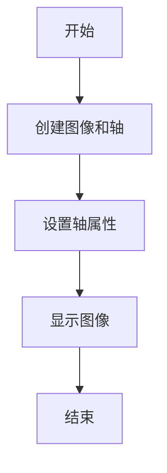
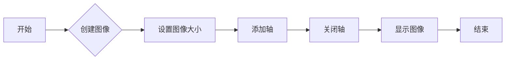
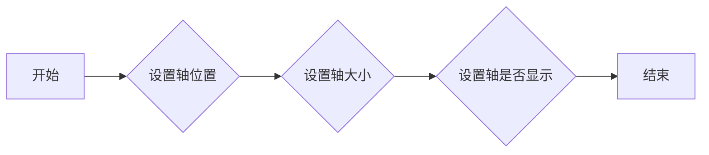
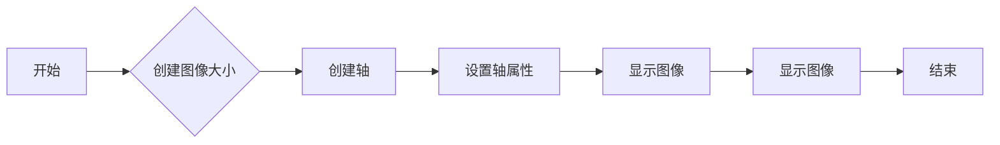

# `matplotlib\galleries\examples\images_contours_and_fields\barcode_demo.py` 详细设计文档

This code generates a barcode image from a given binary code using matplotlib and numpy libraries.

## 整体流程



## 类结构

```
Barcode (主类)
```

## 全局变量及字段


### `code`
    
An array representing the barcode data.

类型：`numpy.ndarray`
    


### `pixel_per_bar`
    
The number of pixels per barcode bar.

类型：`int`
    


### `dpi`
    
The dots per inch for the figure resolution.

类型：`int`
    


### `Barcode.code`
    
The barcode data array.

类型：`numpy.ndarray`
    


### `Barcode.pixel_per_bar`
    
The number of pixels per barcode bar.

类型：`int`
    


### `Barcode.dpi`
    
The dots per inch for the figure resolution.

类型：`int`
    
    

## 全局函数及方法


### Barcode.__init__

初始化Barcode类，设置条形码数据。

参数：

- `self`：`Barcode`对象，当前类的实例。
- `code`：`numpy.ndarray`，条形码数据，表示条形码的黑白模式。

返回值：无

#### 流程图

```mermaid
classDiagram
    Barcode <|-- self
    self: Barcode
    self: code : numpy.ndarray
    self: pixel_per_bar : int
    self: dpi : int
    self: fig : matplotlib.figure.Figure
    self: ax : matplotlib.axes.Axes
    self: code.reshape(1, -1)
    self: cmap='binary'
    self: aspect='auto'
    self: interpolation='nearest'
```

#### 带注释源码

```python
import matplotlib.pyplot as plt
import numpy as np

class Barcode:
    def __init__(self, code):
        """
        Initialize the Barcode class with the given barcode data.

        :param code: numpy.ndarray, the barcode data representing the barcode's black and white pattern.
        """
        self.code = code
        self.pixel_per_bar = 4
        self.dpi = 100
        self.fig, self.ax = plt.subplots(figsize=(len(code) * self.pixel_per_bar / self.dpi, 2), dpi=self.dpi)
        self.ax.set_axis_off()
        self.ax.imshow(self.code.reshape(1, -1), cmap='binary', aspect='auto', interpolation='nearest')
```


### Barcode.create_image

该函数用于生成条形码的图像。

参数：

- `code`：`numpy.ndarray`，表示条形码的数据，每个元素为0或1。
- `pixel_per_bar`：`int`，每个条形码单元的像素宽度。
- `dpi`：`int`，图像的每英寸点数。

返回值：`matplotlib.figure.Figure`，生成的条形码图像。

#### 流程图



#### 带注释源码

```python
import matplotlib.pyplot as plt
import numpy as np

def create_image(code, pixel_per_bar, dpi):
    """
    生成条形码的图像。

    :param code: numpy.ndarray，表示条形码的数据，每个元素为0或1。
    :param pixel_per_bar: int，每个条形码单元的像素宽度。
    :param dpi: int，图像的每英寸点数。
    :return: matplotlib.figure.Figure，生成的条形码图像。
    """
    fig = plt.figure(figsize=(len(code) * pixel_per_bar / dpi, 2), dpi=dpi)
    ax = fig.add_axes((0, 0, 1, 1))  # span the whole figure
    ax.set_axis_off()
    ax.imshow(code.reshape(1, -1), cmap='binary', aspect='auto',
              interpolation='nearest')
    plt.show()
    return fig
```


### Barcode.set_axes_properties

`Barcode.set_axes_properties` 方法用于设置轴的属性，包括轴的位置、大小和是否显示轴。

参数：

- `position`：`tuple`，轴的位置，格式为 `(left, bottom, width, height)`，其中 `left` 和 `bottom` 的值范围在 0 到 1 之间，表示相对于整个图形的位置，`width` 和 `height` 的值范围在 0 到 1 之间，表示轴的宽度和高度。
- `width`：`float`，轴的宽度。
- `height`：`float`，轴的高度。

返回值：`None`，该方法不返回任何值。

#### 流程图



#### 带注释源码

```
def set_axes_properties(self, position, width, height):
    """
    Set the properties of the axes.

    Parameters:
    - position: tuple, the position of the axes, format is (left, bottom, width, height)
    - width: float, the width of the axes
    - height: float, the height of the axes
    """
    self.ax.set_position(position)
    self.ax.set_width(width)
    self.ax.set_height(height)
```


### Barcode.display_image

该函数用于显示条形码图像。

参数：

- `code`：`numpy.ndarray`，条形码数据，表示为一系列的0和1。
- `pixel_per_bar`：`int`，每个条形码单元的像素宽度。
- `dpi`：`int`，图像的每英寸点数。

返回值：无

#### 流程图



#### 带注释源码

```python
import matplotlib.pyplot as plt
import numpy as np

def display_image(code, pixel_per_bar, dpi):
    """
    显示条形码图像。

    :param code: numpy.ndarray, 条形码数据，表示为一系列的0和1。
    :param pixel_per_bar: int, 每个条形码单元的像素宽度。
    :param dpi: int, 图像的每英寸点数。
    """
    fig = plt.figure(figsize=(len(code) * pixel_per_bar / dpi, 2), dpi=dpi)
    ax = fig.add_axes((0, 0, 1, 1))  # span the whole figure
    ax.set_axis_off()
    ax.imshow(code.reshape(1, -1), cmap='binary', aspect='auto',
              interpolation='nearest')
    plt.show()
```


## 关键组件


### 张量索引与惰性加载

张量索引与惰性加载是指在处理大型数据集时，只对需要的数据进行索引和加载，以减少内存消耗和提高处理速度。

### 反量化支持

反量化支持是指对量化后的数据进行反量化处理，以便在后续处理中恢复原始数据精度。

### 量化策略

量化策略是指在模型训练和推理过程中，对模型参数进行量化处理，以减少模型大小和提高推理速度。通常包括全精度量化、定点量化等策略。


## 问题及建议


### 已知问题

-   **代码复用性低**：代码中直接使用硬编码的 `code` 数组，没有提供接口或方法来接受不同的条形码数据，导致代码难以复用。
-   **可配置性差**：`pixel_per_bar` 和 `dpi` 的值是硬编码的，没有提供配置选项，限制了代码的灵活性和适应性。
-   **错误处理缺失**：代码中没有错误处理机制，如果输入数据不符合预期，可能会导致程序崩溃。

### 优化建议

-   **增加接口**：提供一个接口或方法来接受不同的条形码数据，提高代码的复用性。
-   **参数化配置**：允许用户通过参数来配置 `pixel_per_bar` 和 `dpi` 的值，增加代码的灵活性。
-   **添加错误处理**：在代码中添加错误处理机制，确保在输入数据不符合预期时能够优雅地处理异常情况。
-   **代码注释**：增加代码注释，解释代码的功能和逻辑，提高代码的可读性。
-   **单元测试**：编写单元测试来验证代码的功能，确保代码的稳定性和可靠性。
-   **文档化**：编写详细的文档，包括代码的用法、配置选项和错误处理机制，方便用户使用和维护。


## 其它


### 设计目标与约束

- 设计目标：实现一个能够生成条形码图像的函数，该函数接受二进制数据作为输入，并输出一个matplotlib图像。
- 约束条件：图像的宽度必须是数据点数的整数倍，以避免插值伪影。图像的尺寸和分辨率需要根据输入数据动态计算。

### 错误处理与异常设计

- 错误处理：如果输入数据不是有效的二进制数组，函数应抛出异常。
- 异常设计：定义自定义异常类，如`InvalidBarcodeDataException`，以提供更具体的错误信息。

### 数据流与状态机

- 数据流：输入数据通过函数处理，转换为图像数据，然后显示在matplotlib图像中。
- 状态机：该函数没有明确的状态机，因为它是一个简单的数据处理和显示流程。

### 外部依赖与接口契约

- 外部依赖：matplotlib和numpy库。
- 接口契约：函数接受一个numpy数组作为输入，并返回一个matplotlib图像。


    