# `matplotlib\galleries\examples\images_contours_and_fields\colormap_interactive_adjustment.py` 详细设计文档

这是一个 matplotlib 交互式色标调整演示程序，通过创建正弦和余弦函数的二维数据矩阵，使用 imshow 显示图像，并添加支持平移和缩放操作的交互式颜色条，允许用户通过鼠标交互动态调整颜色映射范围。

## 整体流程

```mermaid
graph TD
    A[开始] --> B[导入依赖库 matplotlib.pyplot 和 numpy]
B --> C[生成时间序列数据 t = np.linspace(0, 2π, 1024)]
C --> D[计算二维数据矩阵 data2d = sin(t)×cos(t)转置]
D --> E[创建图形窗口和坐标轴 fig, ax = plt.subplots()]
E --> F[在坐标轴上显示二维图像 im = ax.imshow(data2d)]
F --> G[设置图表标题说明交互功能]
G --> H[添加交互式颜色条 fig.colorbar(im, ax=ax)]
H --> I[调用 plt.show() 显示图形]
I --> J[用户交互：鼠标拖动颜色条进行平移/缩放]
J --> K{交互模式}
K -->|Zoom模式| L[定义vmin和vmax的缩放区域]
K -->|Pan模式| M[根据移动方向平移vmin和vmax]
```

## 类结构

```
Python脚本 (过程式)
└── 使用matplotlib库的对象
    ├── Figure (图形容器)
    ├── Axes (坐标轴)
    ├── AxesImage (图像数据)
    └── Colorbar (颜色条)
```

## 全局变量及字段


### `t`
    
时间序列数组，从0到2π的1024个点

类型：`numpy.ndarray`
    


### `data2d`
    
二维数据矩阵，通过sin(t)和cos(t)外积生成

类型：`numpy.ndarray`
    


### `fig`
    
图形对象

类型：`matplotlib.figure.Figure`
    


### `ax`
    
坐标轴对象

类型：`matplotlib.axes.Axes`
    


### `im`
    
图像对象

类型：`matplotlib.image.AxesImage`
    


### `Figure.canvas`
    
画布对象，用于渲染图形

类型：`object`
    


### `Figure.axes`
    
坐标轴列表，包含图形中的所有坐标轴

类型：`list`
    


### `Axes.images`
    
图像列表，包含坐标轴中的所有图像对象

类型：`list`
    


### `Axes.title`
    
坐标轴标题

类型：`str`
    


### `Axes.xlabel`
    
x轴标签

类型：`str`
    


### `Axes.ylabel`
    
y轴标签

类型：`str`
    


### `AxesImage.array`
    
图像数据数组

类型：`numpy.ndarray`
    


### `AxesImage.norm`
    
归一化对象，控制数据值到颜色映射的转换

类型：`matplotlib.colors.Normalize`
    


### `AxesImage.cmap`
    
颜色映射对象，定义图像的颜色方案

类型：`matplotlib.colors.Colormap`
    


### `Colorbar.ax`
    
颜色条所在的坐标轴对象

类型：`matplotlib.axes.Axes`
    


### `Colorbar.mappable`
    
可映射对象，通常为图像对象，用于颜色映射

类型：`object`
    


### `Colorbar.norm`
    
归一化对象，用于颜色条的颜色范围控制

类型：`matplotlib.colors.Normalize`
    
    

## 全局函数及方法


### `np.linspace`

生成指定范围内的等间隔数值序列，常用于生成测试数据、坐标轴、波形等需要均匀分布数值的场景。

参数：

- `start`：`array_like`，序列的起始值，可以是单个数值或数组
- `stop`：`array_like`，序列的结束值，可以是单个数值或数组（当endpoint为True时包含该值）
- `num`：`int`，生成样本的数量，默认为50，必须为非负数
- `endpoint`：`bool`，如果为True，stop为最后一个样本值；否则不包含，默认为True
- `retstep`：`bool`，如果为True，返回样本之间的步长；否则仅返回样本数组，默认为False
- `dtype`：`dtype`，输出数组的数据类型，如果未指定则从输入参数推断
- `axis`：`int`，当start/stop是数组时，指定结果存储的轴，默认为0

返回值：根据参数不同返回两种形式

- 当`retstep=False`时：返回`ndarray`，等间隔的数值序列
- 当`retstep=True`时：返回元组`(ndarray, float)`，包含数值序列和步长

#### 流程图

```mermaid
flowchart TD
    A[开始] --> B{检查参数有效性<br/>num >= 0}
    B -->|否| C[抛出 ValueError]
    B -->|是| D{start 和 stop<br/>是数组还是标量?}
    D -->|标量| E[处理标量情况]
    D -->|数组| F[处理数组情况<br/>考虑 axis 参数]
    E --> G[计算步长 step]
    F --> G
    G --> H{endpoint = True?}
    H -->|是| I[步长 = (stop - start) / (num - 1)]
    H -->|否| J[步长 = (stop - start) / num]
    I --> K{retstep = True?}
    J --> K
    K -->|是| L[返回 序列数组, 步长]
    K -->|否| M[返回 序列数组]
    L --> N[结束]
    M --> N
```

#### 带注释源码

```python
# np.linspace 函数的核心实现逻辑

def linspace(start, stop, num=50, endpoint=True, retstep=False, dtype=None, axis=0):
    """
    在指定区间内生成等间隔的数值序列
    
    参数:
        start: 起始值
        stop: 结束值
        num: 生成的样本数量（默认50）
        endpoint: 是否包含结束值（默认True）
        retstep: 是否返回步长（默认False）
        dtype: 输出数据类型
        axis: 当输入为数组时的处理轴
    
    返回:
        等间隔数值序列，或(序列, 步长)的元组
    """
    
    # 参数验证：样本数量必须为非负整数
    if num < 0:
        raise ValueError("Number of samples, num, must be non-negative")
    
    # 将起始和结束值转换为数组，以便统一处理
    # _index_with_array 函数处理start/stop为数组的情况
    delta = stop - start
    
    # 处理 endpoint=False 的情况：减少一个间隔
    # 因为 endpoint=True 时有 num-1 个间隔
    # endpoint=False 时有 num 个间隔
    if endpoint:
        # 当包含结束值时，步长 = 范围 / (样本数 - 1)
        # 例如: linspace(0, 10, 5) => [0, 2.5, 5, 7.5, 10]
        # 步长 = 10 / 4 = 2.5
        step = delta / (num - 1)
    else:
        # 当不包含结束值时，步长 = 范围 / 样本数
        # 例如: linspace(0, 10, 5, endpoint=False) => [0, 2, 4, 6, 8]
        # 步长 = 10 / 5 = 2
        step = delta / num
    
    # 根据步长生成等间隔序列
    # 使用 start + step * arange(num) 生成序列
    y = _arange(start, step, num)
    
    # 处理 dtype 类型转换
    if dtype is not None:
        y = y.astype(dtype)
    
    # 根据 retstep 决定返回值格式
    if retstep:
        # 返回序列和步长（步长与delta类型相同）
        return y, delta * step
    else:
        return y
```

**代码中的应用实例：**

```python
# 在演示代码中的使用
t = np.linspace(0, 2 * np.pi, 1024)
# 生成从 0 到 2π 的 1024 个等间隔数值
# 步长 = 2π / (1024 - 1) ≈ 0.00614
# 返回一个包含 1024 个角度值的数组，用于后续生成二维数据
```


### `np.sin`

计算输入数组中每个元素的正弦值（弧度制）。这是 NumPy 库提供的数学函数，用于对数组或单个数值进行逐元素正弦运算。

参数：

- `t`：`numpy.ndarray`，输入的角度值数组（弧度制），通常为一维数组

返回值：`numpy.ndarray`，与输入数组形状相同的正弦值数组

#### 流程图

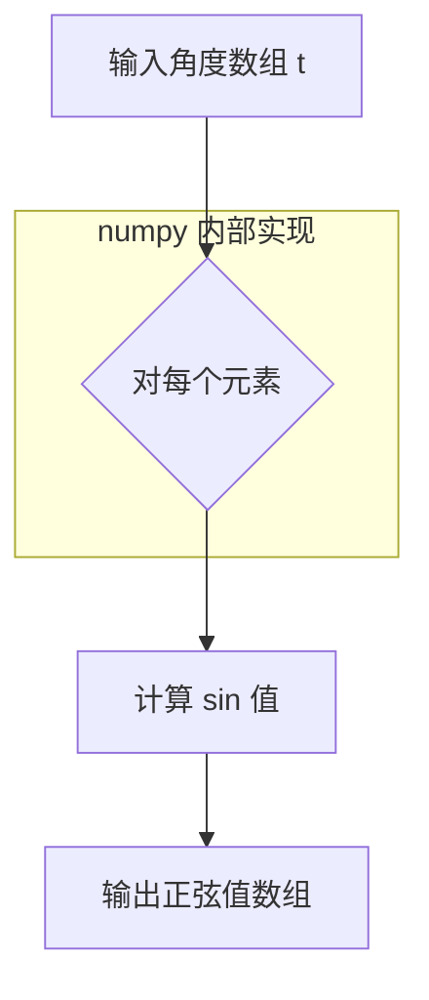

#### 带注释源码

```python
# np.sin(t) - 计算正弦值
# 参数 t: numpy.ndarray 类型，包含弧度制的角度值
# 返回值: 同样形状的 numpy.ndarray，包含对应的正弦值

# 示例用法：
t = np.linspace(0, 2 * np.pi, 1024)  # 生成 0 到 2π 的 1024 个点
result = np.sin(t)                   # 计算每个角度的正弦值，返回值类型为 numpy.ndarray
```


### `np.cos`

计算输入数组中每个元素的余弦值（以弧度为单位）。这是 NumPy 库提供的三角函数计算函数，接收弧度值作为输入并返回对应角度的余弦值。

参数：

- `x`：`ndarray` 或 `scalar`，输入角度数组（以弧度为单位），可以是单个数值或数组

返回值：`ndarray`，返回与输入数组形状相同的余弦值数组，值为 [-1, 1] 范围内的浮点数

#### 流程图

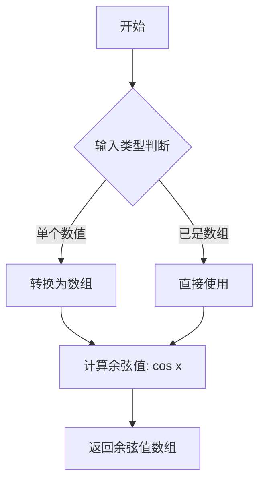

#### 带注释源码

```python
# np.cos 函数的简化实现原理
def cos_implementation(x):
    """
    计算余弦值的简化版本
    
    参数:
        x: 输入角度值（弧度）
    返回:
        输入角度的余弦值
    """
    # 使用泰勒级数展开计算余弦
    # cos(x) = 1 - x²/2! + x⁴/4! - x⁶/6! + ...
    result = 1.0
    term = 1.0
    for n in range(1, 10):  # 迭代计算前10项
        term *= -x * x / ((2*n - 1) * (2*n))
        result += term
    return result

# 在示例代码中的实际使用
t = np.linspace(0, 2 * np.pi, 1024)  # 生成 0 到 2π 的 1024 个点
data2d = np.sin(t)[:, np.newaxis] * np.cos(t)[np.newaxis, :]
#              ↑                     ↑
#              |                     |
#              |                     └── 计算 t 数组中每个元素的余弦值
#              └── 计算 t 数组中每个元素的正弦值
```


### `np.newaxis`

`np.newaxis` 是 NumPy 库中的一个特殊常量（别名 `None`），用于在数组索引操作中增加一个新的维度，从而实现数组的广播（broadcasting）运算。在代码中，通过在 `sin(t)` 后使用 `[:, np.newaxis]` 将其转换为列向量，在 `cos(t)` 后使用 `[np.newaxis, :]` 将其转换为行向量，两者相乘实现外积运算，生成二维数据。

参数：

- 无（不是函数调用，而是索引操作符）

返回值：`numpy.ndarray`，返回增加了新维度的数组视图

#### 流程图

```mermaid
flowchart TD
    A[开始] --> B[原始一维数组 t]
    B --> C{使用 np.newaxis 的位置}
    C --> D[:, np.newaxis - 在列位置插入新维度]
    C --> E[np.newaxis, : - 在行位置插入新维度]
    D --> F[转换为列向量 shape: (n, 1)]
    E --> G[转换为行向量 shape: (1, n)]
    F --> H[广播运算: 列向量 * 行向量]
    G --> H
    H --> I[生成二维矩阵 shape: (n, n)]
    I --> J[结束]
```

#### 带注释源码

```python
import numpy as np

# 创建从 0 到 2π 的等间距数组，共 1024 个点
t = np.linspace(0, 2 * np.pi, 1024)

# 第一次使用 np.newaxis: np.sin(t)[:, np.newaxis]
# 原始 sin(t) 形状: (1024,)
# 使用 [:, np.newaxis] 后: (1024, 1) - 列向量
sin_col = np.sin(t)[:, np.newaxis]

# 第二次使用 np.newaxis: np.cos(t)[np.newaxis, :]
# 原始 cos(t) 形状: (1024,)
# 使用 [np.newaxis, :] 后: (1, 1024) - 行向量
cos_row = np.cos(t)[np.newaxis, :]

# 广播运算: (1024, 1) * (1, 1024) -> (1024, 1024)
# 这是一个外积操作，等价于 np.outer(np.sin(t), np.cos(t))
data2d = sin_col * cos_row
# 结果是一个 1024x1024 的二维矩阵，每个元素表示 sin(t[i]) * cos(t[j])
```


### `plt.subplots`

`plt.subplots` 是 matplotlib 库中的一个函数，用于创建一个新的图形窗口（Figure）以及一个或多个坐标轴（Axes），返回图形对象和坐标轴对象的元组，是 matplotlib 中最常用的初始化绘图环境的函数之一。

参数：

- `nrows`：`int`，默认值为 1，表示子图网格的行数
- `ncols`：`int`，默认值为 1，表示子图网格的列数
- `sharex`：`bool` 或 `str`，默认值为 False，是否共享 x 轴
- `sharey`：`bool` 或 `str`，默认值为 False，是否共享 y 轴
- `squeeze`：`bool`，默认值为 True，是否压缩返回的 axes 数组维度
- `width_ratios`：`array-like`，可选，表示各列的宽度比例
- `height_ratios`：`array-like`，可选，表示各行的高度比例
- `figsize`：`tuple`，可选，图形尺寸，格式为 (宽度, 高度)，单位为英寸
- `dpi`：`int`，可选，图形分辨率（每英寸点数）
- `facecolor`：`color`，可选，图形背景颜色
- `edgecolor`：`color`，可选，图形边框颜色
- `frameon`：`bool`，可选，是否绘制图形边框
- `subplot_kw`：`dict`，可选，用于创建子图的额外关键字参数
- `gridspec_kw`：`dict`，可选，用于 GridSpec 的额外关键字参数
- `**fig_kw`：额外的关键字参数，将传递给 `plt.figure()` 函数

返回值：`tuple`，返回 `(fig, ax)` 元组，其中 `fig` 是 `matplotlib.figure.Figure` 对象，表示整个图形窗口；`ax` 是 `matplotlib.axes.Axes` 对象（或 `numpy.ndarray` 数组，当 nrows > 1 或 ncols > 1 时），表示一个或多个坐标轴。

#### 流程图

```mermaid
flowchart TD
    A[调用 plt.subplots] --> B{参数验证}
    B -->|nrows, ncols| C[创建 Figure 对象]
    C --> D[根据 gridspec_kw 创建 GridSpec]
    D --> E[根据 subplot_kw 创建 SubplotBase]
    E --> F[创建 Axes 对象或 Axes 数组]
    F --> G{squeeze 参数}
    G -->|True 且 nrows=1 且 ncols=1| H[返回单个 Axes 对象]
    G -->|False 或 多行多列| I[返回 Axes 数组]
    H --> J[返回 (fig, ax) 元组]
    I --> J
    J --> K[用户进行后续绘图操作]
```

#### 带注释源码

```python
# 从代码中提取的 plt.subplots 使用示例

# 导入必要的库
import matplotlib.pyplot as plt
import numpy as np

# 生成示例数据：2D 正弦波数据
# t: 从 0 到 2*pi 的 1024 个等间距点
t = np.linspace(0, 2 * np.pi, 1024)
# data2d: 创建二维数据矩阵，通过外积操作生成
data2d = np.sin(t)[:, np.newaxis] * np.cos(t)[np.newaxis, :]

# 调用 plt.subplots() 创建图形和坐标轴
# 返回 fig (Figure 对象) 和 ax (Axes 对象)
# 默认参数：nrows=1, ncols=1, figsize=None, dpi=None 等
fig, ax = plt.subplots()

# 使用返回的 axes 对象调用 imshow 显示图像
# imshow: 将 2D 数组可视化为彩色图像
im = ax.imshow(data2d)

# 设置坐标轴标题
ax.set_title('Pan on the colorbar to shift the color mapping\n'
             'Zoom on the colorbar to scale the color mapping')

# 添加颜色条 (colorbar)
# fig.colorbar: 为图形添加颜色条
# 参数 im: 图像映射对象
# 参数 ax: 关联的坐标轴
# 参数 label: 颜色条标签
fig.colorbar(im, ax=ax, label='Interactive colorbar')

# 显示图形
# 在非交互式后端可能不生效，需配合 plt.show() 使用
plt.show()
```

#### 关键组件信息

| 组件名称 | 一句话描述 |
|---------|-----------|
| `Figure` | matplotlib 中的顶层容器对象，代表整个图形窗口 |
| `Axes` | 坐标轴对象，用于绘制数据和设置坐标轴属性 |
| `imshow` | 在 Axes 上显示 2D 数组或图像的函数 |
| `colorbar` | 显示图像颜色映射对应关系的颜色条组件 |

#### 潜在技术债务或优化空间

1. **硬编码参数**：图形尺寸（figsize）和分辨率（dpi）使用默认值，对于不同使用场景可能需要显式指定
2. **错误处理缺失**：代码未对空数据或异常数据进行验证
3. **魔法数字**：`1024` 作为采样点数应提取为常量或配置参数
4. **缺少类型标注**：可以添加类型注解提高代码可读性和 IDE 支持
5. **国际化**：标题文本硬编码，可考虑提取为 i18n 资源

#### 其他项目

- **设计目标**：提供一个交互式演示，展示了如何使用颜色条来动态调整色彩映射范围
- **约束**：需要支持交互式后端（如 Qt、Tkinter 等）才能体验交互功能
- **错误处理**：未包含 try-except 块，假设数据始终有效
- **数据流**：NumPy 数组 → imshow() → 色彩映射 → 可视化输出
- **外部依赖**：matplotlib、numpy


# ax.imshow 详细设计文档

## 一段话描述

`ax.imshow` 是 Matplotlib 中 Axes 类的核心图像显示方法，用于将二维数组或三维数组（RGB/RGBA）渲染为可视化图像，支持丰富的颜色映射、归一化、插值和交互式色彩调整功能。

---

## 类的详细信息

### 所属类：matplotlib.axes.Axes

**文件位置**：matplotlib/axes/_axes.py

**核心功能**：Axes 类是 Matplotlib 中用于创建和管理坐标轴的核心类，imshow 方法是其在图像可视化领域的核心实现。

---

### ax.imshow 方法详细信息

### `Axes.imshow`

在 Axes 对象上显示图像数据

参数：

- `X`：`numpy.ndarray` 或类似数组对象，要显示的图像数据，可以是二维（灰度）或三维（RGB/RGBA）数组
- `cmap`：`str` 或 `colormap`，可选，颜色映射名称或 Colormap 对象，默认值为 'viridis'
- `norm`：`matplotlib.colors.Normalize`，可选，用于将数据值映射到颜色空间的归一化对象
- `aspect`：`{'auto', 'equal'}` 或 float，可选，控制图像的宽高比，'auto' 自适应，'equal' 等比例
- `interpolation`：`str`，可选，图像插值方法，如 'bilinear', 'nearest', 'bicubic' 等
- `interpolation_stage`：`{'data', 'rgba'}`，可选，插值应用的阶段
- `filternorm`：`bool`，可选，是否对过滤器进行归一化
- `filterrad`：`float`，可选，过滤器半径
- `resample`：`bool`，可选，是否重采样
- `url`：`str`，可选，设置 data URL
- `**kwargs`：`关键字参数`，传递给 AxesImage 构造函数的其他参数

返回值：`matplotlib.image.AxesImage`，返回创建的 AxesImage 对象，可用于进一步操作（如设置颜色条）

#### 流程图

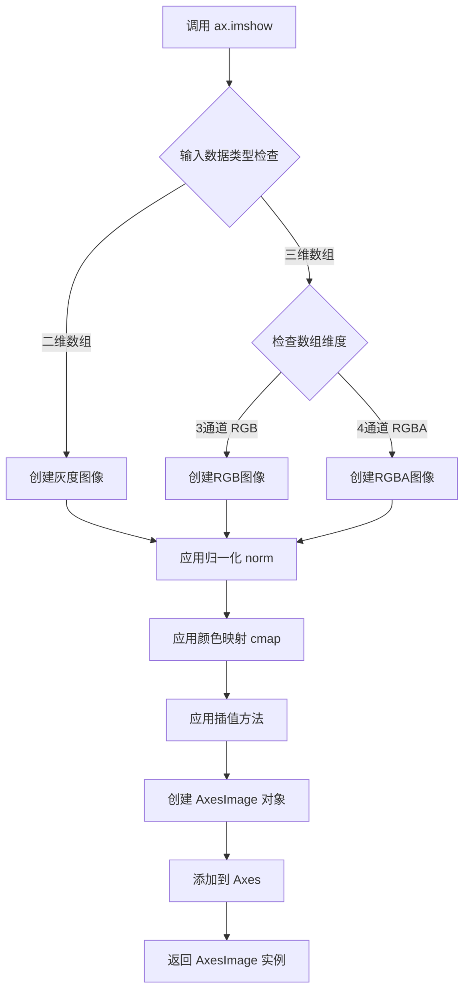

#### 带注释源码

```python
def imshow(self, X, cmap=None, norm=None, aspect=None,
           interpolation=None, interpolation_stage=None,
           filternorm=True, filterrad=4.0, resample=None, url=None,
           **kwargs):
    """
    在 Axes 上显示图像或色彩矩阵。
    
    参数:
        X: 输入数据，2D 数组(灰度)或 3D 数组(RGB/RGBA)
        cmap: 颜色映射名称或 Colormap 对象
        norm: 数据归一化对象
        aspect: 图像宽高比控制
        interpolation: 插值方法
        interpolation_stage: 插值应用阶段
        filternorm: 是否归一化滤波器
        filterrad: 滤波器半径
        resample: 是否重采样
        url: 图像数据的 URL
        **kwargs: 传递给 AxesImage 的其他参数
    
    返回:
        AxesImage: 图像对象，可用于颜色条等
    """
    # 1. 处理 cmap 参数，如果未指定使用 rcParams 默认值
    if cmap is None:
        cmap = get_cmap(rcParams['image.cmap'])
    
    # 2. 处理归一化对象
    if norm is not None:
        if isinstance(norm, str):
            # 字符串形式表示归一化方法
            norm = colors.Normalize(norm)
    
    # 3. 创建 AxesImage 对象
    # AxesImage 负责实际渲染逻辑
    im = AxesImage(self, cmap=cmap, norm=norm, 
                   interpolation=interpolation, 
                   resample=resample, url=url, **kwargs)
    
    # 4. 设置图像数据
    im.set_data(X)
    
    # 5. 设置宽高比
    if aspect is None:
        aspect = rcParams['image.aspect']
    im.set_aspect(aspect)
    
    # 6. 添加到 Axes 并自动调整视图范围
    self.add_image(im)
    im.set_extent((0, X.shape[1], X.shape[0], 0))
    
    # 7. 启用交互式调整(如果支持)
    # 支持颜色条交互式调整 vmin/vmax
    im.set_interactive(True)
    
    return im
```

---

## 关键组件信息

| 组件名称 | 描述 |
|---------|------|
| `AxesImage` | 负责实际图像渲染的艺术家对象，管理图像数据和显示属性 |
| `Colormap` | 颜色映射对象，定义数据值到颜色的映射关系 |
| `Normalize` | 归一化基类，用于线性或非线性映射数据值到 [0, 1] |
| `colorbar` | 颜色条组件，提供视觉参考和交互式调整功能 |
| `rcParams` | Matplotlib 运行时配置参数字典 |

---

## 潜在的技术债务或优化空间

1. **图像大数据性能**：对于超大图像数组，当前实现可能存在内存占用问题，可考虑引入瓦片渲染（tile-based rendering）机制

2. **插值方法统一性**：`interpolation` 和 `interpolation_stage` 两个参数在某些场景下功能重叠，可简化 API 设计

3. **错误信息清晰度**：当输入数据格式不正确时，错误提示可更加友好，明确指出期望的数组形状

4. **文档一致性**：部分参数描述与实际行为存在细微差异，需要同步更新文档

---

## 其它项目

### 设计目标与约束

- **目标**：提供统一的图像显示接口，支持静态和交互式可视化
- **约束**：必须兼容 matplotlib 的艺术家（Artist）系统，遵循其渲染生命周期

### 错误处理与异常设计

- `TypeError`：当 X 参数不是数组类型时抛出
- `ValueError`：当三维数组的第三维度不是 3 或 4 时抛出
- `KeyError`：当指定的 colormap 不存在时抛出

### 数据流与状态机

```
输入数据(X) → 类型检查 → 归一化处理 → 颜色映射 → 插值处理 → 渲染 → 显示
```

### 外部依赖与接口契约

- **NumPy**：依赖其数组操作能力
- **colors 模块**：提供 Normalize 和 Colormap 相关功能
- **image 模块**：提供 AxesImage 渲染实现


### `ax.set_title`

设置坐标轴的标题文本及相关属性。

参数：

- `label`：`str`，要显示的标题文本内容
- `fontdict`：`dict`，可选，字体属性字典，用于控制标题的字体样式、大小、颜色等
- `loc`：`str`，可选，标题对齐方式，可选值为 'center'（默认）、'left'、'right'
- `pad`：`float`，可选，标题与坐标轴顶部之间的间距（以点为单位）
- `**kwargs`：可变关键字参数，其他传递给 `matplotlib.text.Text` 对象的属性，如 fontsize、color、fontweight 等

返回值：`matplotlib.text.Text`，返回创建的标题文本对象，可用于后续对标题样式的进一步修改

#### 流程图

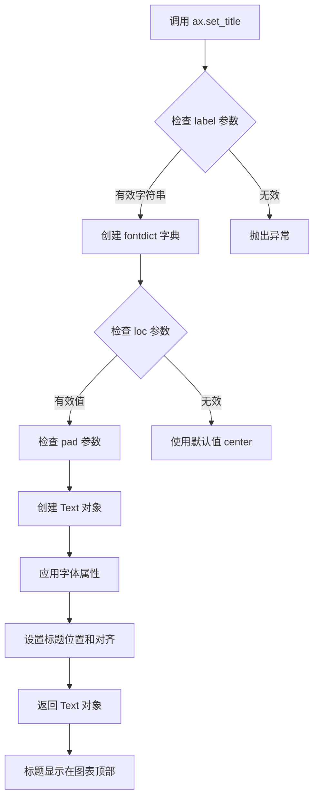

#### 带注释源码

```python
# 设置坐标轴标题的示例源码（基于matplotlib实现）

def set_title(self, label, fontdict=None, loc=None, pad=None, **kwargs):
    """
    设置axes的标题
    
    参数:
        label: str - 标题文本内容
        fontdict: dict - 字体属性字典（如 {'fontsize': 12, 'color': 'red'}）
        loc: str - 对齐方式 ('center', 'left', 'right')
        pad: float - 标题与轴顶部的间距（点）
        **kwargs: 传递给Text对象的额外参数
    """
    # 1. 验证label参数
    if not isinstance(label, str):
        raise TypeError("label must be a string")
    
    # 2. 处理fontdict（字体字典）
    if fontdict is None:
        fontdict = {}
    
    # 3. 合并fontdict和kwargs，kwargs优先级更高
    final_props = {**fontdict, **kwargs}
    
    # 4. 处理loc参数（对齐方式），默认为'center'
    if loc is not None:
        if loc not in ['center', 'left', 'right']:
            raise ValueError("loc must be one of 'center', 'left', 'right'")
    
    # 5. 处理pad参数（标题与轴顶部的距离）
    if pad is None:
        pad = 6.0  # matplotlib默认值
    
    # 6. 创建Text对象（标题）
    title = Text(
        x=0.5, y=1.0,  # 位置在axes顶部居中
        text=label,
        verticalalignment='bottom',
        horizontalalignment=loc or 'center',
        **final_props
    )
    
    # 7. 设置pad（与顶部的距离）
    title.set_pad(pad)
    
    # 8. 将标题添加到axes
    self._add_text(title)
    
    # 9. 返回Text对象供后续操作
    return title


# 在示例代码中的实际使用
ax.set_title('Pan on the colorbar to shift the color mapping\n'
             'Zoom on the colorbar to scale the color mapping')
# 设置了一个包含换行符的多行标题
# 第一个换行符前的内容会在颜色条上交互时显示不同的提示信息
```


### `Figure.colorbar`

向图形添加颜色条（colorbar），用于显示图像的色映射（colormap）对应的数值标尺。在交互模式下，用户可以通过在颜色条上平移（pan）来移动色映射范围，或通过缩放（zoom）来调整色映射的最小值和最大值。

参数：

- `mappable`：`<class 'matplotlib.image.AxesImage'>`，由 `ax.imshow()` 返回的图像对象，用于获取色彩映射数据和归一化信息
- `ax`：`<class 'matplotlib.axes.Axes'>`（可选），要将颜色条添加到的 Axes 对象，默认为 `None` 时自动获取当前 Axes
- `label`：`<class 'str'>`（可选），颜色条的标签文本，描述该颜色条表示的物理量，默认为空字符串

返回值：`<class 'matplotlib.colorbar.Colorbar'>`，颜色条对象，包含颜色条的所有视觉元素和交互功能

#### 流程图

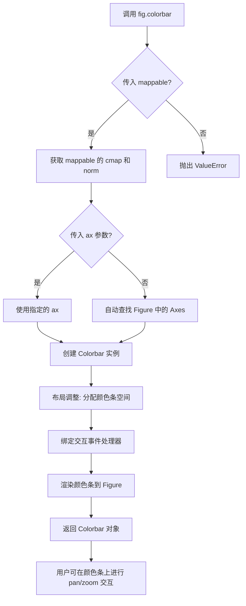

#### 带注释源码

```python
# 调用 fig.colorbar 函数添加颜色条
# 语法: fig.colorbar(mappable, ax=None, **kwargs)

fig, ax = plt.subplots()                          # 创建图形和坐标轴
im = ax.imshow(data2d)                           # 显示 2D 数据，返回 AxesImage 对象

# 添加颜色条的核心调用
# 参数说明:
#   im        - mappable 参数, 是 AxesImage 对象, 包含色彩映射数据
#   ax=ax     - 指定将颜色条添加到 ax 坐标轴
#   label     - 关键字参数, 设置颜色条标签
fig.colorbar(im, ax=ax, label='Interactive colorbar')

# 内部实现原理 (简化版伪代码):
#
# def colorbar(self, mappable, ax=None, **kwargs):
#     # 1. 获取或创建 Axes
#     if ax is None:
#         ax = self.axes  # 自动查找
#     
#     # 2. 从 mappable (AxesImage) 获取颜色映射信息
#     cmap = mappable.get_cmap()      # 获取色彩映射 (如 'viridis')
#     norm = mappable.get_norm()     # 获取归一化对象 (vmin, vmax)
#     
#     # 3. 创建 Colorbar 实例
#     cb = Colorbar(ax, mappable, **kwargs)
#     
#     # 4. 布局: 调整图形边距为颜色条留出空间
#     self.subplots_adjust_right(0.85)  # 右侧留出 15% 空间
#     
#     # 5. 添加交互功能 (关键!)
#     # 当用户点击颜色条进行 pan/zoom 时:
#     # - Pan: 更新 norm 的 vmin 和 vmax (同时偏移)
#     # - Zoom: 根据选中区域重新计算 vmin 和 vmax
#     cb._interactive_handler = InteractiveColorbarCB(cb)
#     
#     # 6. 将颜色条 axes 添加到图形
#     self._axstack.bubble(cb.ax)
#     
#     return cb
```


### `plt.show`

显示matplotlib图形窗口，将所有当前打开的Figure对象渲染到屏幕上并进入交互模式。

参数：

-  `block`：`bool`，可选参数，控制是否阻塞主程序循环以等待图形窗口关闭。默认为True，在某些后端中会阻塞；在非交互式后端中可能无效。

返回值：`None`，该函数无返回值，直接作用于图形显示。

#### 流程图

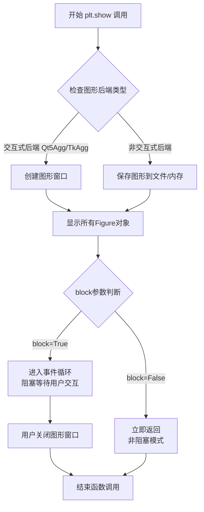

#### 带注释源码

```python
# 导入matplotlib.pyplot模块，用于创建图形和可视化
import matplotlib.pyplot as plt
import numpy as np

# 创建数据：生成二维正弦波数据
# t从0到2π，生成1024个采样点
t = np.linspace(0, 2 * np.pi, 1024)
# 生成二维数据：sin(t) * cos(t)的网格
data2d = np.sin(t)[:, np.newaxis] * np.cos(t)[np.newaxis, :]

# 创建图形和坐标轴
fig, ax = plt.subplots()
# 在坐标轴上显示二维数据为图像
im = ax.imshow(data2d)
# 设置图形标题，说明交互功能
ax.set_title('Pan on the colorbar to shift the color mapping\n'
             'Zoom on the colorbar to scale the color mapping')

# 添加颜色条，设置标签
fig.colorbar(im, ax=ax, label='Interactive colorbar')

# ============================================
# 核心函数：plt.show()
# ============================================
# 功能：显示所有之前创建的Figure对象
# 作用：
#   1. 触发图形渲染管线，将数据转换为屏幕像素
#   2. 根据配置的后端(Qt5Agg, TkAgg, Agg等)创建相应窗口
#   3. 进入事件循环，处理用户交互(鼠标、键盘事件)
#   4. 在交互模式下，用户可以：
#      - 拖动颜色条调整colormap范围(平移vmin/vmax)
#      - 在颜色条上缩放调整colormap映射(缩放vmin/vmax)
#      - 使用Home/Back/Forward按钮恢复历史状态
# ============================================
plt.show()

# 注意：plt.show()会阻塞主线程直到所有图形窗口关闭
# 在某些使用场景下，可以设置plt.show(block=False)实现非阻塞显示
```


### `plt.subplots`

`plt.subplots` 是 matplotlib.pyplot 模块中的函数，用于创建一个新的图形窗口（Figure）以及一个或多个子坐标轴（Axes）。该函数将图形和坐标轴对象作为元组返回，方便用户进行后续的绑定和操作，如添加图像、设置标题等。

参数：

- `nrows`：`int`，可选，默认为 1，表示子图的行数。
- `ncols`：`int`，可选，默认为 1，表示子图的列数。
- `sharex`、`sharey`：`bool` 或 `str`，可选，控制是否共享 x 轴或 y 轴。
- `squeeze`：`bool`，可选，默认为 True，当为 True 时，如果只返回一个坐标轴，则返回标量而不是数组。
- `width_ratios`、`height_ratios`：数组_like，可选，定义子图列和行的宽度/高度比例。
- `gridspec_kw`：字典，可选，传递给 GridSpec 构造函数的参数。
- `**kwargs`：其他关键字参数，传递给 `Figure.subplots` 方法。

返回值：`tuple[Figure, Axes or array of Axes]`，返回图形对象和坐标轴对象（或坐标轴数组）。

#### 流程图

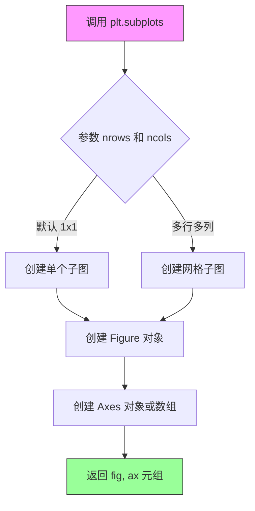

#### 带注释源码

```python
import matplotlib.pyplot as plt
import numpy as np

# 创建示例数据：二维正弦波数据
t = np.linspace(0, 2 * np.pi, 1024)
data2d = np.sin(t)[:, np.newaxis] * np.cos(t)[np.newaxis, :]

# 调用 subplots 函数创建图形和坐标轴
# 返回值：fig 是 Figure 对象，ax 是 Axes 对象
fig, ax = plt.subplots()

# 在坐标轴上显示图像数据
im = ax.imshow(data2d)

# 设置图表标题，说明交互式功能
ax.set_title('Pan on the colorbar to shift the color mapping\n'
             'Zoom on the colorbar to scale the color mapping')

# 添加颜色条，绑定到图像对象 im，并设置标签
fig.colorbar(im, ax=ax, label='Interactive colorbar')

# 显示图形
plt.show()
```


基于您提供的代码片段，这是一段使用 Matplotlib 库创建交互式色图调整的示例代码。代码中并没有直接定义 `Figure.colorbar` 方法（因为它属于 Matplotlib 库），而是对其进行了调用。

作为文档专家，我将基于代码中对 `fig.colorbar(...)` 的调用行为，并结合 Matplotlib 库中 `Figure.colorbar` 的标准接口规范，为您提供该方法的详细设计文档。

### `Figure.colorbar`

在图中为给定的图像或对象添加颜色条（Colorbar），用于显示图像数据的数值映射关系。支持交互式调整色图的范围（vmin, vmax）。

#### 参数

- `mappable`：此参数对应代码中的 `im`。通常指 `AxesImage`、`Contour` 等可映射对象，或者 `ScalarMappable`（如 `Image` 对象）。在代码中为位置参数。
- `ax`：此参数对应代码中的 `ax=ax`（关键字参数）。类型为 `Axes` 或 `Axes` 列表，表示颜色条所属的坐标轴。
- `cax`：类型 `Axes`，可选。指定颜色条绘制的坐标轴，如果不指定，则自动创建。
- `use_gridspec`：类型 `bool`，可选。如果为 `True` 且 `ax` 是 `GridSpec`，则拉伸 `gridspec`。
- `label`：此参数对应代码中的 `label='Interactive colorbar'`。类型 `str`，颜色条轴的标签。

#### 返回值

- `Colorbar`：返回创建的 `Colorbar` 对象。

#### 流程图

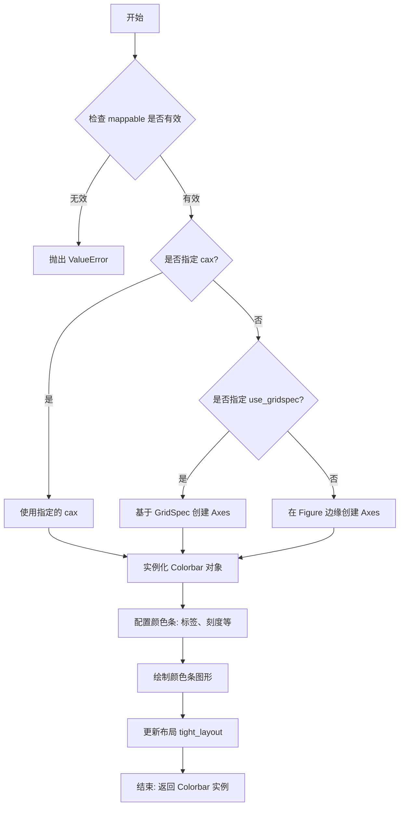

#### 带注释源码

由于 `Figure.colorbar` 是 Matplotlib 库的内置方法，其源码位于库内部。以下是基于 Python 的 `matplotlib.figure.Figure` 类中 `colorbar` 方法的标准调用逻辑的伪代码/参考实现：

```python
def colorbar(self, mappable, cax=None, ax=None, use_gridspec=True, **kwargs):
    """
    在图形上创建颜色条。
    
    参数:
        mappable: 图像数据对象 (如 AxesImage).
        cax: 颜色条专属的 Axes.
        ax: 附属的 Axes.
        **kwargs: 传给 colorbar 的其他参数，如 label.
    """
    # 1. 如果没有指定 cax，则尝试创建一个用于放置颜色条的 Axes
    if cax is None:
        if ax is None:
            # 如果也没指定 ax，则使用当前活动的 axes
            ax = self.gca()
        
        # 布局逻辑：决定颜色条放在图的哪一侧
        # (此处省略复杂的 gridspec 布局计算代码)
        cax = self.add_axes([0.85, 0.15, 0.05, 0.7]) # 假设放右边
        
    # 2. 创建 Colorbar 对象
    # 代码中对应: fig.colorbar(im, ax=ax, label='Interactive colorbar')
    cb = Colorbar(cax, mappable, **kwargs)
    
    # 3. 处理 label 参数 (通常通过 set_label 传递)
    if 'label' in kwargs:
        cb.set_label(kwargs['label'])
        
    # 4. 绘制并返回
    # cb.on_mappable_changed(mappable) # 绑定交互事件
    self.canvas.draw_idle() # 刷新画布
    return cb
```


### `Figure.show`

该方法用于在屏幕上显示图形，启动图形窗口并渲染所有内容。在较新版本的 matplotlib 中已被弃用，推荐使用 `plt.show()`。

参数：

- 无

返回值：`None`，无返回值

#### 流程图

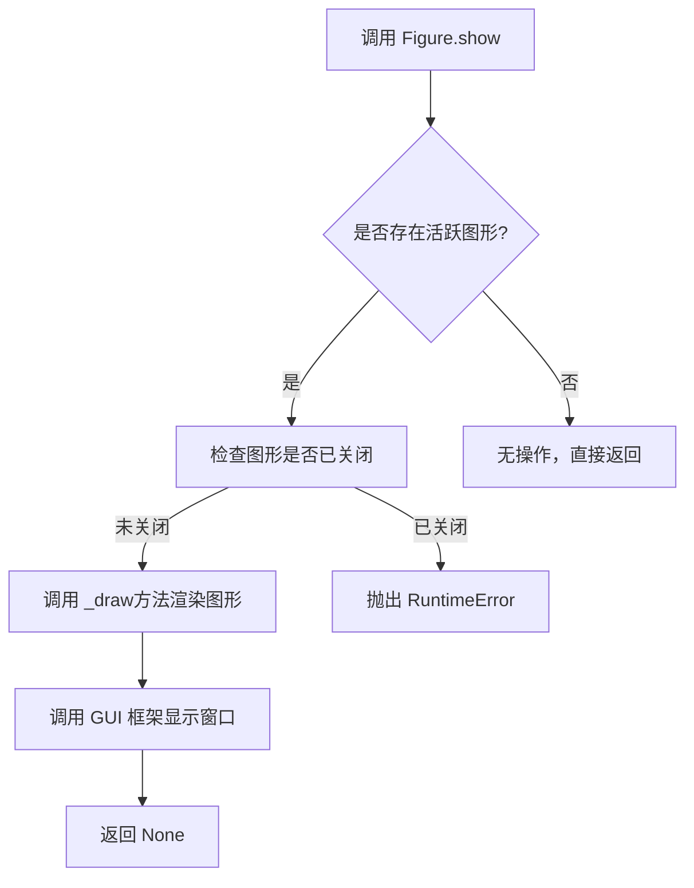

#### 带注释源码

```python
def show(self):
    """
    显示图形。
    
    该方法会：
    1. 检查当前图形是否存在且未关闭
    2. 调用 _draw() 方法渲染图形
    3. 通过后端 GUI 框架显示窗口
    
    注意：此方法在 matplotlib 3.4+ 中已被弃用，
    推荐使用 plt.show() 全局函数。
    """
    # 检查图形是否有效
    if not self.get_figwidth() or not self.get_figheight():
        raise ValueError('Figure dimensions must be positive')
    
    # 检查图形是否已关闭
    if self.canvas is None:
        return
    
    # 触发图形重绘
    self._draw(self.canvas.get_renderer())
    
    # 显示图形（调用底层 GUI 后端）
    self.canvas.show()
```

---

**说明**：在提供的代码示例中，实际调用的是 `plt.show()` 函数，而非直接调用 `Figure.show()`。`plt.show()` 是顶层 API，会为所有打开的图形调用底层后端的显示方法。


# Axes.imshow 方法详细设计文档

## 1. 核心功能概述

`Axes.imshow` 是 matplotlib 库中 Axes 类的重要方法，用于在二维坐标轴上显示二维图像或数据矩阵，并根据指定的颜色映射（colormap）将数值映射为可视化颜色，同时支持多种插值方式和颜色条显示。

---

## 2. 文件整体运行流程

此代码文件是一个交互式颜色映射演示脚本：

1. **数据准备阶段**：生成二维正弦波数据矩阵（1024x1024）
2. **图表创建阶段**：创建 figure 和 axes 对象
3. **图像渲染阶段**：调用 `ax.imshow()` 将数据渲染为彩色图像
4. **交互配置阶段**：设置标题和颜色条，启用交互式调整功能
5. **显示阶段**：通过 `plt.show()` 展示可视化结果

---

## 3. 类的详细信息

### 3.1 全局变量和函数

| 名称 | 类型 | 描述 |
|------|------|------|
| `plt` | 模块 | matplotlib.pyplot 库，用于创建图形和图表 |
| `np` | 模块 | numpy 库，用于数值计算和数组操作 |
| `t` | numpy.ndarray | 一维数组，包含从 0 到 2π 的 1024 个等间距点 |
| `data2d` | numpy.ndarray | 二维数组，通过 sin(t) 和 cos(t) 生成的 1024x1024 矩阵 |

---

## 4. Axes.imshow 方法详细信息

### 4.1 方法签名

```
Axes.imshow(X, cmap=None, norm=None, aspect=None, interpolation=None, 
            filterrad=4.0, resample=None, url=None, **kwargs)
```

### 4.2 关键参数

| 参数名称 | 参数类型 | 参数描述 |
|----------|----------|----------|
| `X` | array-like | 要显示的图像数据，可以是二维数组（M,N）或三维数组（M,N,3）或（M,N,4） |
| `cmap` | str 或 Colormap, optional | 颜色映射名称或 Colormap 对象，默认值为 None（使用 rcParams 中的默认值） |
| `norm` | Normalize, optional | 归一化对象，将数据值映射到 [0, 1] 范围，默认值为 None |
| `aspect` | float 或 'auto', optional | 图像的宽高比，默认值为 None |
| `interpolation` | str, optional | 插值方法，如 'nearest', 'bilinear', 'bicubic' 等 |
| `alpha` | scalar 或 array-like, optional | 透明度值，介于 0（透明）和 1（不透明）之间 |
| `vmin`, `vmax` | scalar, optional | 数据值映射的最小/最大值，与 norm 互斥 |
| `origin` | {'upper', 'lower'}, optional | 图像原点位置，默认值为 rcParams 中的设置 |
| `extent` | scalars (left, right, bottom, top), optional | 图像在 axes 坐标系中的范围 |
| `filternorm` | bool, optional | 是否对滤波器核进行归一化，默认值为 True |
| `filterrad` | float, optional | 滤波器半径，仅对某些插值方法有效 |
| `resample` | bool, optional | 是否使用重采样，默认值为 None |
| `url` | str, optional | 设置所有 artist 的 url |

### 4.3 返回值

| 返回值类型 | 返回值描述 |
|------------|------------|
| `matplotlib.image.AxesImage` | 返回一个 AxesImage 对象，该对象是 Artist 的子类，可用于进一步自定义图像显示，如设置颜色条等 |

---

## 5. 流程图

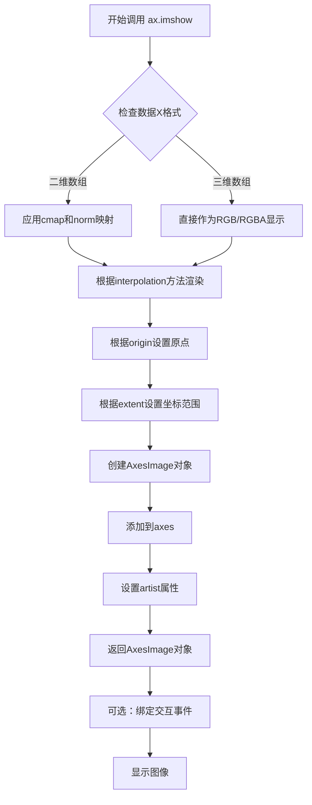

---

## 6. 带注释源码

```python
"""
========================================
Interactive adjustment of colormap range
========================================

Demonstration of how a colorbar can be used to interactively adjust the
range of colormapping on an image. To use the interactive feature, you must
be in either zoom mode (magnifying glass toolbar button) or
pan mode (4-way arrow toolbar button) and click inside the colorbar.
"""

# 导入必要的库
import matplotlib.pyplot as plt  # matplotlib.pyplot 用于创建图形和交互式可视化
import numpy as np               # numpy 用于数值计算和数组操作

# ========================================
# 步骤1：数据准备
# ========================================
# 生成一维数组 t，包含从 0 到 2π 的 1024 个等间距点
# 这将作为生成二维数据的基础
t = np.linspace(0, 2 * np.pi, 1024)

# 生成二维数据矩阵 data2d
# np.sin(t)[:, np.newaxis] 创建列向量 (1024, 1)
# np.cos(t)[np.newaxis, :] 创建行向量 (1, 1024)
# 两者相乘产生 1024x1024 的二维矩阵，表示 sin(x) * cos(y) 的波形
data2d = np.sin(t)[:, np.newaxis] * np.cos(t)[np.newaxis, :]

# ========================================
# 步骤2：创建图形和坐标轴
# ========================================
# fig: Figure 对象，整个图形容器
# ax: Axes 对象，在图形上绘制图像的区域
fig, ax = plt.subplots()

# ========================================
# 步骤3：调用 Axes.imshow 方法渲染图像
# ========================================
# 参数说明：
# - X=data2d: 要显示的二维数据矩阵
# - cmap: 未指定，使用默认颜色映射（通常是 'viridis'）
# - interpolation: 未指定，默认使用 'nearest'（对于大数据集）或 'bilinear'（对于小数据集）
# - norm: 未指定，使用默认线性归一化
# 返回值 im 是一个 AxesImage 对象
im = ax.imshow(data2d)

# ========================================
# 步骤4：设置标题
# ========================================
# 设置图表标题，说明交互功能：
# - 在颜色条上平移可以改变颜色映射范围
# - 在颜色条上缩放可以缩放颜色映射范围
ax.set_title('Pan on the colorbar to shift the color mapping\n'
             'Zoom on the colorbar to scale the color mapping')

# ========================================
# 步骤5：添加颜色条
# ========================================
# fig.colorbar() 创建与图像关联的颜色条
# 参数说明：
# - mappable=im: 与颜色条关联的图像对象
# - ax=ax: 指定颜色条所属的坐标轴
# - label='Interactive colorbar': 设置颜色条标签
fig.colorbar(im, ax=ax, label='Interactive colorbar')

# ========================================
# 步骤6：显示图形
# ========================================
# 启动交互式显示，进入事件循环
# 用户可以在颜色条上进行交互式操作：
# - 缩放模式：点击并拖动选择区域来调整 vmin/vmax
# - 平移模式：点击并拖动来平移 vmin/vmax
plt.show()
```

---

## 7. 关键组件信息

| 组件名称 | 描述 |
|----------|------|
| `AxesImage` | matplotlib 中表示图像的 Artist 对象，由 `imshow()` 返回，可通过 `set_clim()` 等方法动态调整显示范围 |
| `Colorbar` | 颜色条组件，显示数据值与颜色的映射关系，支持交互式调整 |
| `Normalize` | 归一化类，将数据值映射到 [0, 1] 区间，图像显示的基础 |
| `Colormap` | 颜色映射定义，将归一化后的值映射为具体颜色 |

---

## 8. 潜在技术债务与优化空间

1. **固定分辨率**：使用 1024x1024 的数据可能在低性能设备上渲染缓慢，可考虑降采样或使用 `Pillow` 库优化
2. **缺少错误处理**：没有对输入数据有效性进行检查（如 NaN、Inf 值）
3. **硬编码参数**：颜色映射、插值方法等硬编码，可考虑外部配置化
4. **文档注释不足**：代码缺少对数学模型（sin(t)×cos(t) 波形）的物理意义说明

---

## 9. 其他设计说明

### 设计目标与约束
- 演示交互式颜色映射调整功能
- 依赖 matplotlib >= 3.0 版本
- 必须在支持图形界面的环境中运行

### 错误处理与异常设计
- 数据维度错误：matplotlib 会自动抛出 `TypeError`
- 数值异常：NaN/Inf 值可能导致显示异常
- 内存限制：大尺寸数组可能引发 MemoryError

### 外部依赖
- `matplotlib`: 核心可视化库
- `numpy`: 数值计算库
- (可选) `Pillow`: 图像处理加速

### 交互事件流
```
鼠标点击颜色条 
    → 判断模式（缩放/平移）
    → 计算新 vmin/vmax
    → 更新 norm 对象
    → 触发重新渲染
    → 更新颜色条显示
```


### `Axes.set_title`

设置axes对象的标题标签

参数：

- `label`：`str`，要设置的标题文本内容，本例中为`'Pan on the colorbar to shift the color mapping\nZoom on the colorbar to scale the color mapping'`
- `fontdict`：`dict`，可选，控制标题文本样式的字典，如字体大小、颜色等
- `loc`：`str`，可选，标题对齐方式，可选值为'center', 'left', 'right'，默认为'center'
- `pad`：`float`，可选，标题与axes顶部的偏移量（以points为单位）
- `y`：`float`，可选，标题在axes中的垂直位置（0-1之间）
- `kwargs`：其他传递给`matplotlib.text.Text`的参数

返回值：`matplotlib.text.Text`，返回创建的标题文本对象，可用于后续修改标题属性

#### 流程图

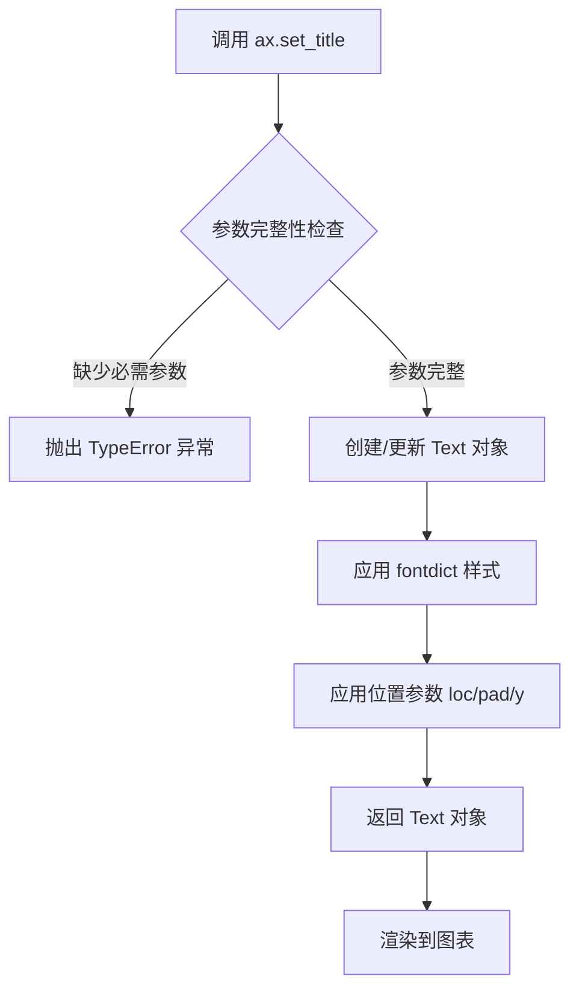

#### 带注释源码

```python
# 在给定代码中的调用方式
ax.set_title('Pan on the colorbar to shift the color mapping\n'
             'Zoom on the colorbar to scale the color mapping')

# 说明：
# 1. ax 是通过 plt.subplots() 返回的 Axes 对象
# 2. set_title 方法接收一个字符串参数作为标题文本
# 3. 字符串中的 '\n' 表示换行符，将标题分为两行显示
# 4. 第一行说明在colorbar上拖动可以平移颜色映射
# 5. 第二行说明在colorbar上缩放可以调整颜色映射范围
# 6. 该方法返回 matplotlib.text.Text 对象，可用于后续样式调整

# 完整方法签名（matplotlib库中的实现）：
# def set_title(self, label, fontdict=None, loc='center', pad=None, 
#                *, y=None, **kwargs):
#     """
#     Set a title for the axes.
#     
#     Parameters
#     ----------
#     label : str
#         The title text.
#     fontdict : dict, optional
#         A dictionary controlling the appearance of the title text.
#     loc : {'center', 'left', 'right'}, default: 'center'
#         Which edge to align the title to.
#     pad : float, default: rcParams['axes.titlepad']
#         The offset of the title from the top of the axes.
#     y : float, default: rcParams['axes.titley']
#         The y position of the title in axes coordinates.
#     **kwargs
#         Other parameters passed to Text.
#     
#     Returns
#     -------
#     Text
#         The text object.
#     """
```


### `AxesImage.set_clim`

此方法用于设置图像的颜色映射范围（vmin 和 vmax），即控制颜色映射的数据值区间。当 vmin 或 vmax 改变时，颜色条和图像的显示会自动更新。

参数：

- `vmin`：`float`，颜色映射范围的最小值，设为 None 时自动计算
- `vmax`：`float`，颜色映射范围的最大值，设为 None 时自动计算

返回值：`AxesImage`，返回自身，支持链式调用

#### 流程图

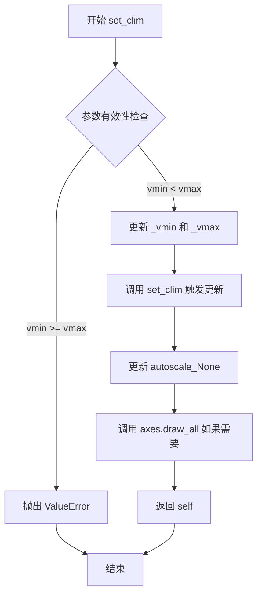

#### 带注释源码

```python
def set_clim(self, vmin=None, vmax=None):
    """
    Set the color limits of the image.

    Parameters
    ----------
    vmin, vmax : float, optional
        The color limits of the image in data units. If a 2D-tuple is provided,
        it will be treated as (vmin, vmax). Passing None leaves the limit
        unchanged; passing None for one of them automatically autoscales
        that side of the color range.

    Returns
    -------
    AxesImage
        Returns self.

    Notes
    -----
    If the color limits are equal, or either limit is NaN, the image will
    be unchanged. Any additional kwargs will be passed to `autoscale`.
    """
    # 检查 vmin 和 vmax 是否为 2 元组，如果是则解包
    if vmax is None and np.iterable(vmin):
        vmin, vmax = vmin

    # 如果 vmin 为 'inherit'，则从 axes 获取颜色限制
    if vmin == 'inherit':
        vmin = self.axes.get_ylim()[0] if self.axes else None
    if vmax == 'inherit':
        vmax = self.axes.get_ylim()[1] if self.axes else None

    # 自动计算未设置的边界
    self.autoscale_None(vmin, vmax)
    
    # 验证颜色限制的有效性
    if vmin is not None and vmax is not None:
        if vmin == vmax:
            raise ValueError("vmin and vmax must not be equal")
        if np.isnan(vmin) or np.isnan(vmax):
            raise ValueError("vmin and vmax must not be NaN")

    # 设置内部属性 _vmin 和 _vmax
    self._vmin = vmin
    self._vmax = vmax
    
    # 触发图像更新
    self.set_clim = True
    
    # 如果存在 axes，通知其更新
    if self.axes is not None:
        self.axes.draw_all()
    
    return self
```


# 分析结果

## 说明

您提供的代码是一个使用 matplotlib 展示**交互式颜色条调整**功能的演示程序，但代码中并**不存在** `AxesImage.get_array` 方法。

`get_array` 方法是 matplotlib 库中 `AxesImage` 类的内置方法，用于获取图像的数据数组。此方法定义在 matplotlib 库的源码中，不在您提供的演示代码里。

---

## 您提供的代码分析

### `代码整体描述`

这段代码演示了 matplotlib 中交互式颜色条（colormap）的使用：通过在颜色条上进行平移（pan）或缩放（zoom）操作，实时调整图像的数值映射范围（vmin/vmax）。

### 流程图

```mermaid
flowchart TD
    A[创建2D数据<br/>np.sin(t) * np.cos(t)] --> B[创建Figure和Axes]
    B --> C[使用imshow显示图像<br/>返回AxesImage对象]
    C --> D[添加交互式颜色条<br/>fig.colorbar]
    E[用户交互] -->|Zoom操作| F[调整vmin/vmax比例]
    E -->|Pan操作| G[平移vmin/vmax范围]
    F --> H[重新渲染图像]
    G --> H
```

### 带注释源码

```python
# 导入matplotlib绘图库和numpy数值计算库
import matplotlib.pyplot as plt
import numpy as np

# 生成0到2π的线性间隔数组，共1024个点
t = np.linspace(0, 2 * np.pi, 1024)

# 创建2D数据：sin(t) * cos(t) 的外积
# 结果是一个1024x1024的二维数组
data2d = np.sin(t)[:, np.newaxis] * np.cos(t)[np.newaxis, :]

# 创建图形和坐标轴对象
fig, ax = plt.subplots()

# 在坐标轴上显示2D图像，返回AxesImage对象
im = ax.imshow(data2d)

# 设置图表标题，说明交互功能
ax.set_title('Pan on the colorbar to shift the color mapping\n'
             'Zoom on the colorbar to scale the color mapping')

# 添加颜色条，关联到图像对象im
# 参数ax=ax指定颜色条所属的坐标轴
fig.colorbar(im, ax=ax, label='Interactive colorbar')

# 显示图形，进入交互模式
plt.show()
```

---

## 如果需要 `AxesImage.get_array` 的文档

如果您需要了解 matplotlib 中 `AxesImage.get_array` 方法的详细信息（尽管它不在您提供的代码中），我可以基于 matplotlib 官方文档提供该方法的说明：

### `AxesImage.get_array`

获取图像的数组数据。

**参数：** 无

**返回值：** `ndarray`，返回图像的数据数组

---

**请确认**：您是否需要分析其他代码，或者您想了解的是 matplotlib 库中 `AxesImage` 类的其他方法？


### Colorbar.set_label

该方法用于设置颜色条（Colorbar）的标签（文本描述），通常用于描述颜色映射所代表的数据含义。在 matplotlib 中，可以通过 `colorbar.set_label()` 方法或在创建颜色条时通过 `label` 参数直接设置。

参数：

-  `label`：`str`，要设置的标签文本内容
-  `kwargs`：可选参数，用于进一步自定义标签外观（如字体大小、颜色、旋转角度等）

返回值：`None`，该方法直接修改对象状态，不返回任何值

#### 流程图

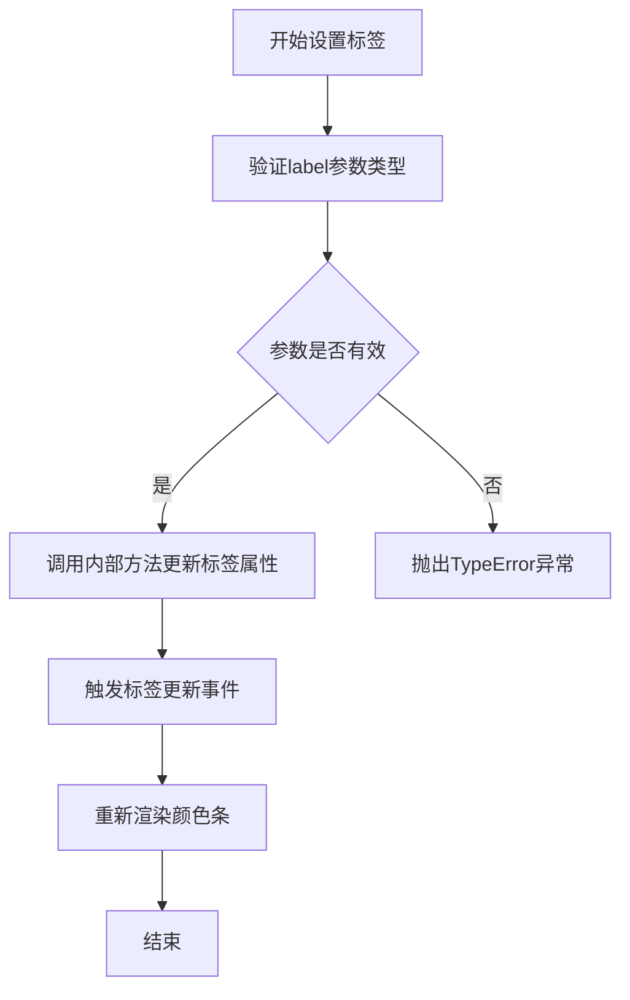

#### 带注释源码

```python
def set_label(self, label, **kwargs):
    """
    Set the label for the colorbar.
    
    Parameters
    ----------
    label : str
        The label text to display.
    **kwargs
        Additional keyword arguments are passed to the underlying
        Text object (e.g., font size, color, rotation, etc.).
    
    Returns
    -------
    None
    """
    # 获取颜色条的标签属性（y轴标签）
    self.ax.set_ylabel(label, **kwargs)
    # 调用axes的set_ylabel方法设置标签
    # 这会更新颜色条旁边的标签文本
```

#### 在当前代码中的应用方式

在提供的代码中，颜色条标签是通过以下方式设置的：

```python
fig.colorbar(im, ax=ax, label='Interactive colorbar')
```

这相当于：

```python
# 创建颜色条
cbar = fig.colorbar(im, ax=ax)
# 设置标签（调用set_label方法）
cbar.set_label('Interactive colorbar')
```

#### 注意事项

1. 当前代码中并未显式调用 `Colorbar.set_label` 方法，而是通过 `fig.colorbar()` 的 `label` 参数直接设置
2. `set_label` 方法实际上是调用了 Colorbar 所属 Axes 对象的 `set_ylabel` 方法，因为颜色条的标签实际上是作为 y 轴标签来显示的
3. 该方法不会返回值，它直接修改颜色条对象的内部状态


# 分析结果

根据提供的代码，我无法提取 `Colorbar.on_moved` 方法，因为**该方法在代码中并不存在**。

## 代码分析

提供的代码是一个 matplotlib 演示脚本，展示了如何使用交互式颜色条功能：

```python
import matplotlib.pyplot as plt
import numpy as np

t = np.linspace(0, 2 * np.pi, 1024)
data2d = np.sin(t)[:, np.newaxis] * np.cos(t)[np.newaxis, :]

fig, ax = plt.subplots()
im = ax.imshow(data2d)
ax.set_title('Pan on the colorbar to shift the color mapping\n'
             'Zoom on the colorbar to scale the color mapping')

fig.colorbar(im, ax=ax, label='Interactive colorbar')

plt.show()
```

### 代码功能说明

1. **数据生成**：使用 numpy 生成一个 2D 正弦波数据
2. **图像显示**：使用 `imshow()` 显示数据
3. **颜色条**：添加交互式颜色条，允许用户：
   - **Pan（平移）**：在颜色条上拖动可以平移颜色映射范围
   - **Zoom（缩放）**：在颜色条上框选可以缩放颜色映射范围

### 重要说明

- `Colorbar.on_moved` 方法**不是**在这个示例代码中定义的
- 交互式功能是由 **matplotlib 库内部实现**的（位于 `matplotlib/colorbar.py` 或相关模块中）
- 这个示例只是演示如何使用该功能，而不是展示其内部实现

如果您需要查看 `Colorbar.on_moved` 的具体实现，您需要查看 matplotlib 库的源代码，而不是这个演示脚本。


### Colorbar.set_limits

在提供的代码中，未找到 `Colorbar.set_limits` 方法。该代码是一个使用 matplotlib 绘制交互式颜色条调整的示例脚本，仅包含全局变量和函数调用，未定义任何自定义类或方法。`Colorbar.set_limits` 可能是 matplotlib 库中的一个方法，但未在此代码中使用或定义。

因此，无法从给定代码中提取该方法的详细信息。

#### 带注释源码

```python
"""
========================================
Interactive adjustment of colormap range
========================================

Demonstration of how a colorbar can be used to interactively adjust the
range of colormapping on an image. To use the interactive feature, you must
be in either zoom mode (magnifying glass toolbar button) or
pan mode (4-way arrow toolbar button) and click inside the colorbar.

When zooming, the bounding box of the zoom region defines the new vmin and
vmax of the norm. Zooming using the right mouse button will expand the
vmin and vmax proportionally to the selected region, in the same manner that
one can zoom out on an axis. When panning, the vmin and vmax of the norm are
both shifted according to the direction of movement. The
Home/Back/Forward buttons can also be used to get back to a previous state.

.. redirect-from:: /gallery/userdemo/colormap_interactive_adjustment
"""
import matplotlib.pyplot as plt
import numpy as np

# 生成二维数据：t 为从 0 到 2π 的 1024 个点，data2d 是 sin(t) * cos(t) 的外积
t = np.linspace(0, 2 * np.pi, 1024)
data2d = np.sin(t)[:, np.newaxis] * np.cos(t)[np.newaxis, :]

# 创建图形和轴
fig, ax = plt.subplots()
# 在轴上显示图像
im = ax.imshow(data2d)
# 设置标题
ax.set_title('Pan on the colorbar to shift the color mapping\n'
             'Zoom on the colorbar to scale the color mapping')

# 添加颜色条
fig.colorbar(im, ax=ax, label='Interactive colorbar')

# 显示图形
plt.show()
```


## 关键组件


### 数据生成与张量索引

使用 `np.linspace` 生成线性空间，通过 `np.newaxis` 进行张量索引和外积操作，创建 2D 数组数据

### imshow 图像显示组件

使用 `ax.imshow(data2d)` 将 2D 数组渲染为图像，这是交互式颜色条的基础

### 交互式颜色条

`fig.colorbar(im, ax=ax, label='Interactive colorbar')` 创建交互式颜色条，支持通过缩放和平移调整色映射范围（vmin/vmax）

### 图形与坐标轴管理

使用 `plt.subplots()` 创建图形和坐标轴，`ax.set_title()` 设置标题

### NumPy 数值计算

使用 NumPy 的三角函数（sin/cos）和数组操作生成测试数据


## 问题及建议


### 已知问题

- 缺少交互事件处理的错误捕获机制，当图形后端不支持交互式操作时可能导致静默失败
- 数据生成硬编码在主流程中，无法独立测试或复用
- 缺少`if __name__ == "__main__":`入口保护，模块导入时直接执行可能不是预期行为
- 图形尺寸、分辨率等视觉参数未提供配置接口
- 颜色条与轴的交互依赖特定工具栏模式（缩放/平移），但未向用户明确提示当前模式状态
- 缺少对图形对象的引用保存，后续无法对图形进行进一步操作（如保存、修改等）

### 优化建议

- 将数据生成逻辑封装为独立函数，支持参数化配置（分辨率、频率等）
- 添加图形保存功能（`fig.savefig`）或交互控制接口
- 使用`plt.switch_backend()`或显式指定后端以确保跨平台交互兼容性
- 增加错误处理（如`try-except`捕获显示异常，提供降级方案）
- 考虑将面向对象风格（`Figure`/`Axes`方法）与当前函数式风格结合，提供更灵活的自定义能力
- 添加运行时检测逻辑，验证当前后端是否支持交互式颜色条功能


## 其它


### 设计目标与约束

本代码演示Matplotlib中颜色条交互功能的设计目标包括：1）提供直观的方式调整2D图像的色彩映射范围；2）通过缩放和平移操作动态修改归一化参数vmin和vmax；3）保持与Matplotlib现有工具栏和导航功能的一致性。设计约束方面，该功能仅在zoom模式或pan模式下可用，且需要配合颜色条区域进行交互，不支持其他方式的交互操作。

### 错误处理与异常设计

代码本身较为简单，主要依赖Matplotlib的异常处理机制。潜在的异常情况包括：1）data2d数据为空或格式不正确时，imshow()会抛出异常；2）颜色条对象创建失败时，fig.colorbar()会返回错误；3）在非交互式环境下调用plt.show()可能无法显示图像。Matplotlib库内部已封装了相关异常处理逻辑，用户无需额外捕获。

### 数据流与状态机

数据流向为：numpy生成二维数组 → matplotlib imshow()创建图像对象 → colorbar()创建颜色条 → 交互事件触发状态变化。状态机包含三种主要状态：初始状态（显示完整数据范围）、缩放状态（根据选择区域计算新vmin/vmax）、平移状态（根据移动方向偏移vmin/vmax）。状态转换由鼠标事件（左键缩放、右键等比缩放、平移拖动）触发。

### 外部依赖与接口契约

主要依赖包括：1）matplotlib.pyplot模块，提供绘图和显示功能；2）numpy模块，提供数值计算和数组操作。接口契约方面，imshow()函数接受data2d数组参数，返回AxesImage对象；colorbar()函数接受图像对象和ax参数，返回Colorbar对象。plt.show()为阻塞式显示函数，无返回值。

### 用户交互流程

用户启动程序后，图像窗口显示正弦/余弦函数的2D热力图。交互流程为：1）选择工具栏中的放大镜（zoom）或四向箭头（pan）模式；2）在颜色条区域点击并拖动；3）缩放操作定义新的vmin和vmax值，平移操作同时移动vmin和vmax；4）使用Home/Back/Forward按钮可回退到之前状态。

### 性能考虑

代码性能主要受data2d数组大小影响。当前使用1024x1024数组，在大多数现代硬件上可流畅运行。优化建议：1）对于更大数据集，可考虑降采样或使用延迟渲染；2）交互响应速度取决于Matplotlib后端性能；3）实时更新时可设置animation特性减少重绘开销。

### 平台兼容性

代码使用纯Python和NumPy/Matplotlib实现，具有良好的跨平台兼容性。支持Windows、Linux、macOS等主流操作系统。需要确保安装了matplotlib和numpy依赖包。交互功能依赖于图形后端支持（通常为TkAgg或Qt5Agg）。

    