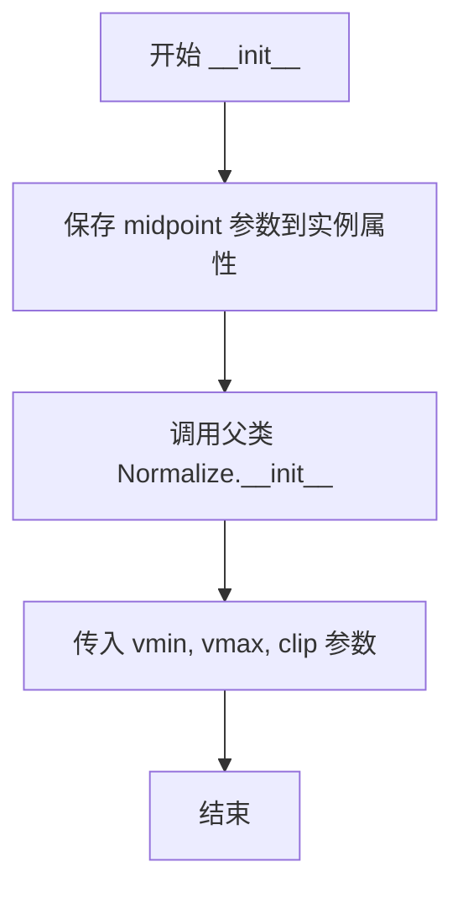

# `matplotlib\galleries\examples\images_contours_and_fields\colormap_normalizations.py` 详细设计文档

这是一个matplotlib演示脚本，展示了如何使用不同的颜色映射标准化方法（LogNorm, PowerNorm, SymLogNorm, 自定义MidpointNormalize和BoundaryNorm）来可视化数据，实现非线性的颜色映射，从而更有效地展示数据的不同特征。

## 整体流程

```mermaid
graph TD
    A[开始] --> B[导入依赖模块]
    B --> C[定义常量N=100]
    C --> D[LogNorm演示部分]
    D --> E[生成网格数据X, Y]
    E --> F[计算Z1, Z2和组合Z]
    F --> G[创建2x1子图]
    G --> H[第一子图: 线性标度pcolor]
    H --> I[第二子图: LogNorm标准化pcolor]
    I --> J[PowerNorm演示部分]
    J --> K[重新生成X, Y网格]
    K --> L[计算Z = (1+sin(Y*10))*X^2]
    L --> M[创建2x1子图]
    M --> N[第一子图: 线性标度pcolormesh]
    N --> O[第二子图: PowerNorm标准化pcolormesh]
    O --> P[SymLogNorm演示部分]
    P --> Q[重新生成X, Y网格]
    Q --> R[计算Z = (5*Z1 - Z2)*2]
    R --> S[创建2x1子图]
    S --> T[第一子图: 线性标度pcolormesh]
    T --> U[第二子图: SymLogNorm标准化pcolormesh]
    U --> V[自定义Norm演示部分]
    V --> W[定义MidpointNormalize类]
    W --> X[创建2x1子图]
    X --> Y[第一子图: 线性标度pcolormesh]
    Y --> Z[第二子图: MidpointNormalize标准化pcolormesh]
    Z --> AA[BoundaryNorm演示部分]
    AA --> AB[创建3x1子图]
    AB --> AC[第一子图: 线性标度pcolormesh]
    AC --> AD[第二子图: 均匀边界BoundaryNorm]
    AD --> AE[第三子图: 非均匀边界BoundaryNorm]
    AE --> AF[plt.show显示图形]
    AF --> AG[结束]
```

## 类结构

```
colors.Normalize (matplotlib内置基类)
└── MidpointNormalize (自定义标准化类)
```

## 全局变量及字段


### `N`
    
网格分辨率参数，定义数据点数量

类型：`int`
    


### `X`
    
通过np.mgrid生成的X坐标网格数组

类型：`numpy.ndarray`
    


### `Y`
    
通过np.mgrid生成的Y坐标网格数组

类型：`numpy.ndarray`
    


### `Z`
    
合成数据矩阵，由Z1和Z2组合计算得到

类型：`numpy.ndarray`
    


### `Z1`
    
高斯衰减数据，用于创建低幅度峰

类型：`numpy.ndarray`
    


### `Z2`
    
高斯衰减数据，用于创建高幅度峰

类型：`numpy.ndarray`
    


### `fig`
    
matplotlib图形对象，用于容纳绘图元素

类型：`matplotlib.figure.Figure`
    


### `ax`
    
matplotlib坐标轴对象或数组，用于绑定图形元素

类型：`matplotlib.axes.Axes or numpy.ndarray`
    


### `pcm`
    
伪彩色网格对象，包含颜色映射后的数据

类型：`matplotlib.collections.QuadMesh`
    


### `bounds`
    
颜色分界线数组，用于BoundaryNorm定义颜色区间

类型：`numpy.ndarray`
    


### `norm`
    
颜色归一化对象，用于数据值到颜色空间的非线性映射

类型：`matplotlib.colors.Normalize or subclass`
    


### `MidpointNormalize.midpoint`
    
自定义归一化的中间点值，用于双线性映射分段

类型：`float`
    
    

## 全局函数及方法


### `MidpointNormalize.__init__`

初始化一个自定义的颜色归一化类MidpointNormalize，该类继承自colors.Normalize，用于将数据值非线性地映射到[0,1]区间，其中指定的中点值被映射到0.5。

参数：

- `vmin`：`float` 或 `None`，数据范围的最小值，传递给父类Normalize
- `vmax`：`float` 或 `None`，数据范围的最大值，传递给父类Normalize
- `midpoint`：`float` 或 `None`，自定义归一化的中点值，该值将被映射到0.5
- `clip`：`bool`，是否将映射后的值裁剪到[0,1]区间，传递给父类Normalize

返回值：`None`，构造函数不返回任何值

#### 流程图



#### 带注释源码

```python
class MidpointNormalize(colors.Normalize):
    """
    自定义颜色归一化类
    
    该类创建一个自定义的归一化器，将数据值映射到[0,1]区间，
    其中指定的中点值被映射到0.5。这对于需要在数据中点
    处进行特殊处理的颜色映射非常有用，例如显示正负差异的数据。
    """
    
    def __init__(self, vmin=None, vmax=None, midpoint=None, clip=False):
        """
        初始化 MidpointNormalize 实例
        
        参数:
            vmin: 最小值，低于此值的数据将被映射到0以下（或裁剪）
            vmax: 最大值，高于此值的数据将被映射到1以上（或裁剪）
            midpoint: 中点值，该值将被映射到0.5
            clip: 布尔值，是否将结果裁剪到[0,1]区间
        
        返回:
            None
        """
        # 将传入的midpoint参数保存为实例属性，供__call__方法使用
        self.midpoint = midpoint
        
        # 调用父类colors.Normalize的初始化方法
        # 父类会设置vmin、vmax、clip等属性并处理验证逻辑
        super().__init__(vmin, vmax, clip)
```


### `MidpointNormalize.__call__`

该方法是 `MidpointNormalize` 类的核心实例方法，用于将输入值映射到 [0, 1] 范围内，实现基于自定义中点的非线性归一化。它通过线性插值的方式，将 `vmin` 映射到 0，`midpoint` 映射到 0.5，`vmax` 映射到 1。

参数：

- `value`：需要归一化的数值或数值数组，可以是单个值或 NumPy 数组
- `clip`：布尔值（可选），控制是否将结果裁剪到 [0, 1] 区间，默认为 None（继承自父类）

返回值：`numpy.ma.masked_array`，返回归一化后的数值数组，其中包含被掩码的值（如果有的话）

#### 流程图

```mermaid
flowchart TD
    A[__call__ 方法被调用] --> B{检查 value 是否为 None}
    B -->|是| C[返回全为 0 的数组]
    B -->|否| D[构建插值节点 x 和 y]
    D --> E[x = [vmin, midpoint, vmax]]
    D --> F[y = [0, 0.5, 1]]
    E --> G[调用 np.interp 进行线性插值]
    F --> G
    G --> H[调用 np.ma.masked_array 包装结果]
    H --> I[返回归一化后的数组]
```

#### 带注释源码

```python
def __call__(self, value, clip=None):
    """
    将输入值基于自定义中点进行归一化映射
    
    参数:
        value: 需要归一化的数值或数组
        clip: 可选的布尔值，控制是否裁剪结果到[0,1]区间
    
    返回:
        归一化后的 numpy masked array
    """
    # 构建归一化映射的锚点：
    # - vmin 映射到 0
    # - midpoint 映射到 0.5
    # - vmax 映射到 1
    x, y = [self.vmin, self.midpoint, self.vmax], [0, 0.5, 1]
    
    # 使用 numpy 的插值函数进行线性插值
    # np.interp 会自动处理超出 [vmin, vmax] 范围的输入值
    # 对于超出范围的值，会返回边界值（0 或 1）
    return np.ma.masked_array(np.interp(value, x, y))
```

## 关键组件


### LogNorm

用于将对数刻度应用于颜色映射，解决线性颜色尺度下只能看到数据峰值的问题，适用于具有低峰和尖峰的数据可视化。

### PowerNorm

通过幂函数变换颜色映射，用于去除数据中的幂律趋势，使混合在幂律趋势中的周期信号（如正弦波）更加明显。

### SymLogNorm

对称对数规范化，分别对正负数据取对数，适用于同时包含正负值且幅度差异较大的数据，保持正负区域的对称性。

### MidpointNormalize

自定义规范化类，继承自colors.Normalize，通过指定中点将颜色映射分为两个线性段，使中点两侧的数据使用不同的线性映射。

### BoundaryNorm

边界规范化，根据预设的边界值将颜色映射划分为离散区间，每个区间对应一个颜色，实现类似等高线的效果。

### matplotlib.colors 模块

提供颜色规范化功能的核心模块，包含各种Normalize类用于数据的非线性颜色映射。


## 问题及建议


```json
{
  "已知问题": [
    "对称坐标轴设置错误：使用 `vmin=-np.max(Z)` 而非 `vmin=-np.abs(Z).max()`，导致负值数据的vmin设置不正确，在第72行、108行、139行均存在此问题",
    "MidpointNormalize类缺少输入验证：未检查midpoint是否在vmin和vmax范围内，也未处理midpoint为None的情况",
    "MidpointNormalize.__call__方法忽略masked values和边界情况，代码中包含'Ignoring masked values and all kinds of edge cases'注释，存在潜在bug风险",
    "全局变量污染：X、Y、Z在多个示例中重复使用并被重新赋值，容易造成变量状态混淆",
    "MidpointNormalize类缺少文档字符串和类型注解，降低了代码可维护性",
    "硬编码magic numbers：linthresh=0.015、base=10、gamma=0.5等参数缺乏解释",
    "BoundaryNorm使用ncolors=256但大多数colormap只有有限颜色数，可能造成资源浪费"
  ],
  "优化建议": [
    "修正对称坐标轴设置：将所有`vmin=-np.max(Z)`改为`vmin=-np.abs(Z).max()`或`vmin=Z.min()`以正确处理包含正负值的数据",
    "为MidpointNormalize添加输入验证：检查midpoint参数是否在vmin和vmax之间，添加None检查和异常处理",
    "改进MidpointNormalize的__call__方法：使用np.ma.masked_array正确处理masked values，添加对clip参数的完整支持",
    "考虑将每个示例的数据生成封装为独立函数，避免全局变量污染和示例间的隐式依赖",
    "为关键类和函数添加docstring和类型注解，提升代码可读性和IDE支持",
    "将magic numbers提取为具名常量或配置参数，例如LOG_THRESHOLD = 0.015、POWER_GAMMA = 0.5等",
    "考虑为BoundaryNorm的ncolors参数使用更合理的值（如256可能过多），或根据实际colormap颜色数动态设置"
  ]
}
```

## 其它


### 设计目标与约束

本代码的核心设计目标是演示matplotlib中各种颜色映射归一化(Normalization)方法的使用场景和效果，帮助开发者理解如何在数据可视化中选择合适的颜色映射方式。约束条件包括：需要matplotlib和numpy依赖包支持；演示数据通过数学函数生成以展示不同归一化效果；所有图表使用相同的颜色映射(PuBu_r或RdBu_r)以便于对比不同归一化方式的差异。

### 错误处理与异常设计

代码中的异常处理主要体现在MidpointNormalize类的__call__方法中，通过np.ma.masked_array处理可能的无效值。对于LogNorm、PowerNorm、SymLogNorm和BoundaryNorm，matplotlib.colors模块内部已经处理了常见的边界情况(如vmin/vmax相等、负数对数等问题)。潜在的异常情况包括：当vmin >= vmax时会导致归一化计算错误；当数据包含NaN或Inf时需要使用MaskedArray处理；当midpoint不在vmin和vmax之间时MidpointNormalize会产生非预期的插值结果。

### 数据流与状态机

整体数据流为：生成网格坐标(X, Y) → 计算演示数据Z → 创建figure和axes → 使用不同归一化方式绘制pcolormesh/pcolor → 添加colorbar标注。由于是演示脚本，状态机相对简单，主要是按顺序执行四个独立的演示模块(LogNorm、PowerNorm、SymLogNorm、Custom Norm)，每个模块都经历数据准备→可视化→展示的流程。

### 外部依赖与接口契约

主要依赖包括：matplotlib.pyplot用于绘图、matplotlib.colors提供各种归一化类、numpy用于数值计算。接口契约方面，各归一化类均继承自colors.Normalize基类，需要实现__call__方法进行数据映射。LogNorm需要vmin>0；PowerNorm的gamma参数必须为正数；SymLogNorm的linthresh必须在vmin和vmax之间；BoundaryNorm需要提供有序的边界数组且边界数量应小于等于256。

### 性能考量

代码本身为演示脚本，性能不是主要关注点。但在实际应用中，BoundaryNorm使用ncolors=256可能导致大量内存占用；对于大规模数据，pcolor/pcolormesh可考虑使用rasterized=True提升渲染性能；频繁调用归一化时，可预先缓存归一化后的结果。

### 可扩展性设计

MidpointNormalize类展示了如何通过继承colors.Normalize实现自定义归一化逻辑。类似的扩展方式可以应用于其他非线性映射场景，如对数底数可调的LogNorm变体、分段线性映射等。代码结构支持轻松添加新的归一化演示模块，只需遵循相同的模式：生成数据 → 创建axes → 绑定归一化绘制 → 添加colorbar。

### 图形输出与可视化约定

所有图表使用相同的颜色映射(PuBu_r或RdBu_r)保证一致性；每个子图都配有colorbar且标注了使用的归一化方式名称；linear scaling作为对照组与各类归一化效果进行对比；图表使用extend='max'或'both'参数处理超出范围的数值显示。

### 代码质量与最佳实践

MidpointNormalize类中包含注释"I'm ignoring masked values and all kinds of edge cases to make a simple example..."表明当前实现简化了边界情况处理，生产环境使用需要加强；所有演示模块代码结构重复，可以抽象出通用函数减少代码冗余；硬编码的参数值(如gamma=0.5、linthresh=0.015)可以考虑作为可配置参数。

    