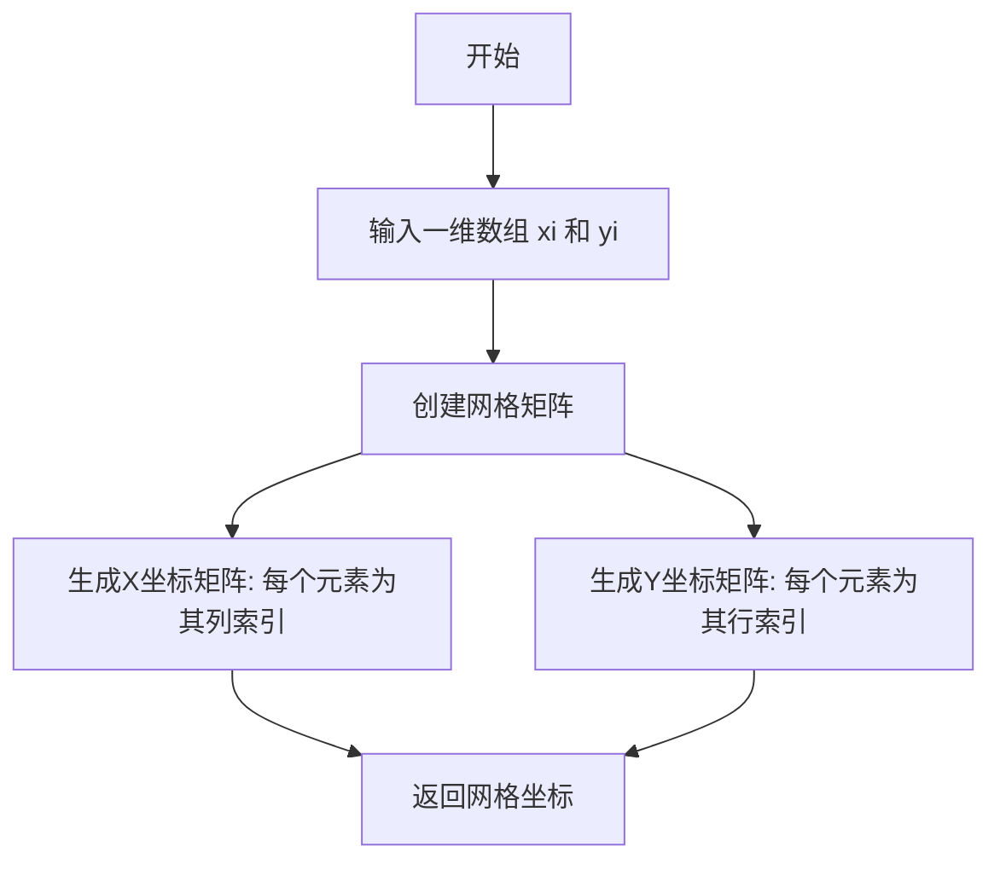
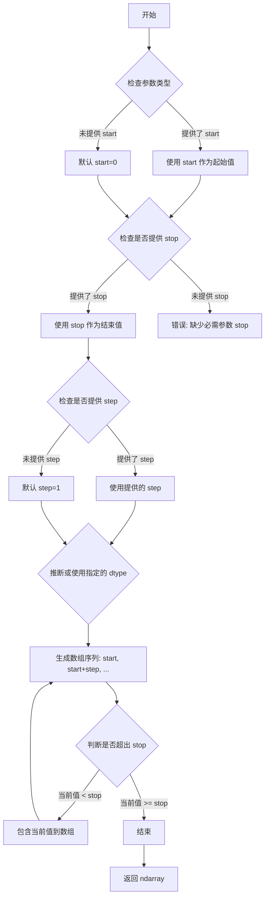
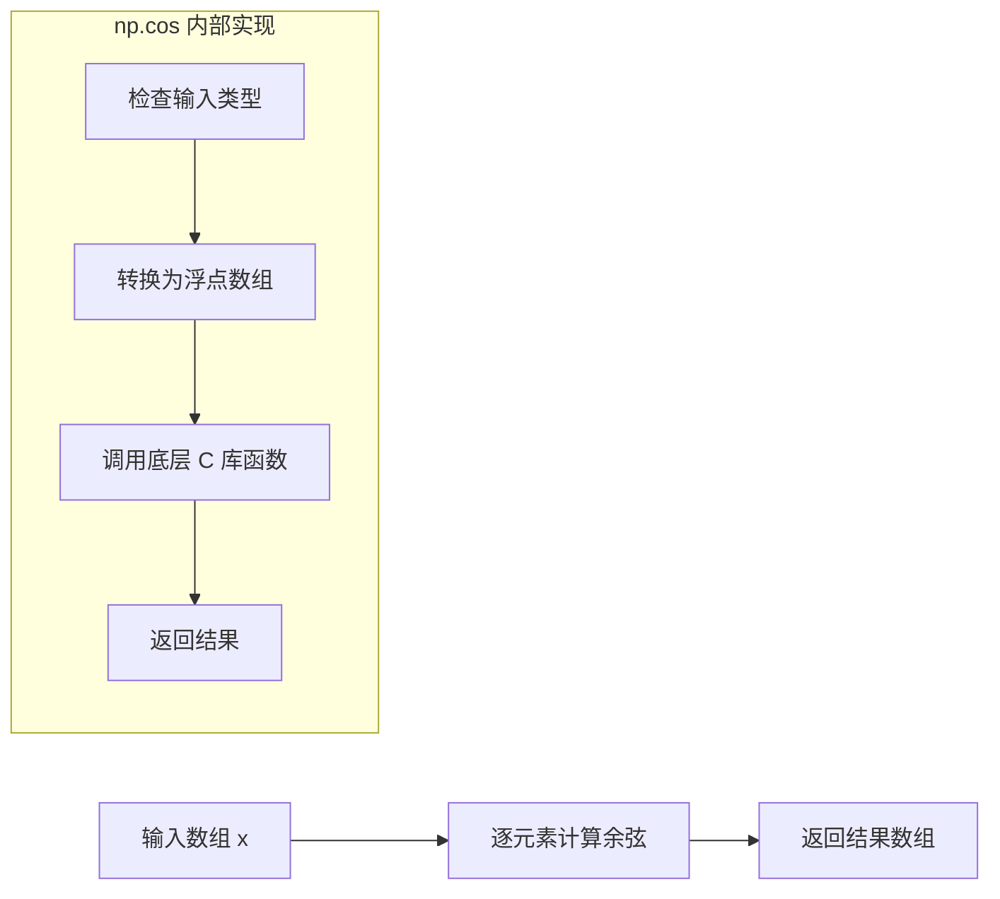
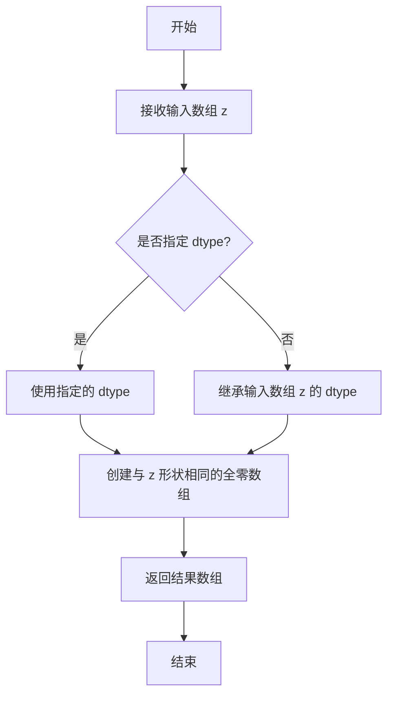
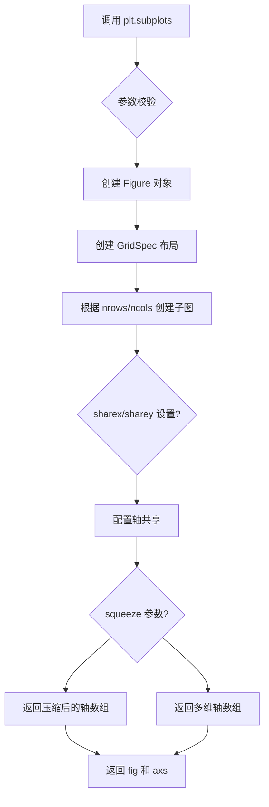
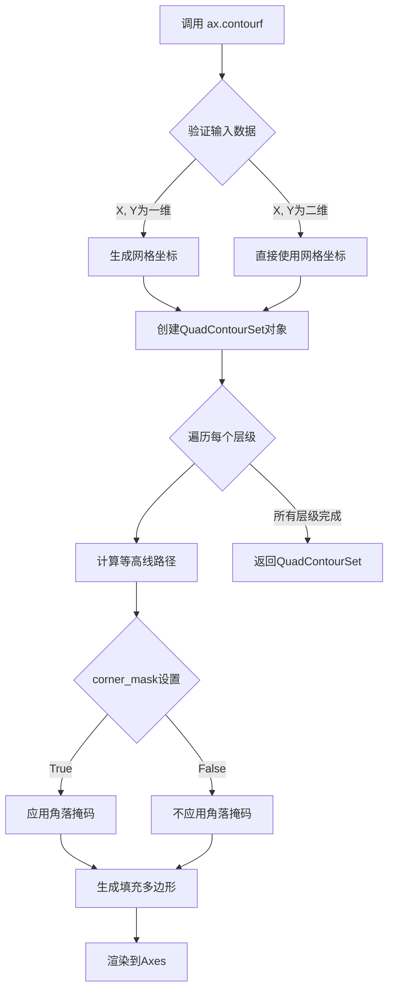
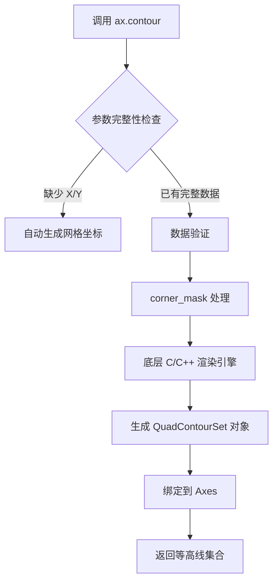
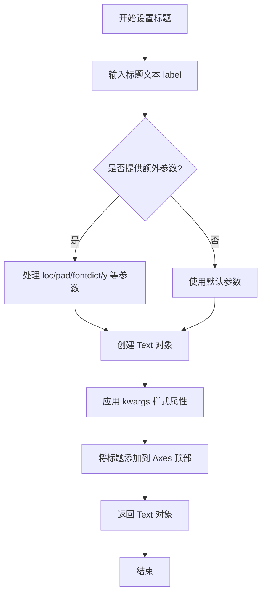
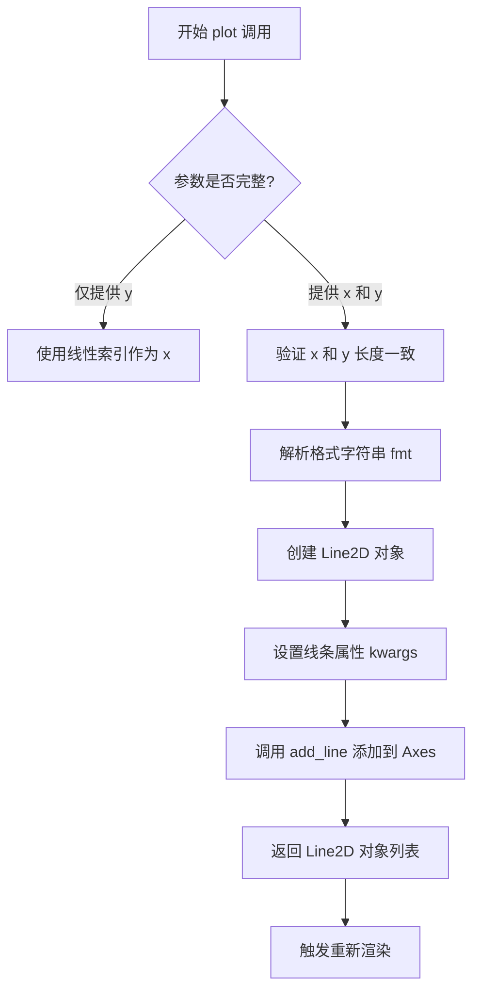
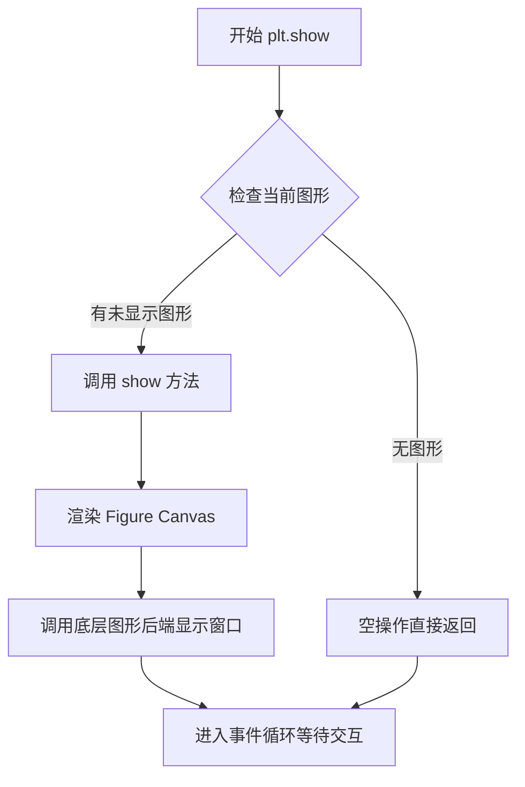

# `matplotlib\galleries\examples\images_contours_and_fields\contour_corner_mask.py` 详细设计文档

这是一个matplotlib示例脚本，用于演示contour图中corner_mask参数的区别。通过创建带掩码的网格数据，分别使用corner_mask=False和True绘制等高线图，直观展示该参数对等高线绘制的影响。

## 整体流程

```mermaid
graph TD
    A[开始] --> B[创建网格数据 x, y]
    B --> C[计算z值: sin(0.5*x) * cos(0.52*y)]
    C --> D[创建布尔掩码mask]
    D --> E[应用掩码到z数组]
    E --> F[创建子图: ncols=2]
    F --> G[遍历corner_masks列表]
    G --> H{corner_mask值}
    H --> I[调用contourf绘制填充等高线]
    I --> J[调用contour绘制等高线]
    J --> K[设置标题]
    K --> L[绘制网格]
    L --> M[绘制被掩码的点]
    M --> N[调用plt.show显示图形]
    N --> O[结束]
```

## 类结构

```
无自定义类（过程式脚本）
└── 主要依赖: matplotlib.pyplot, numpy
```

## 全局变量及字段


### `x`
    
X坐标网格数组

类型：`np.ndarray`
    


### `y`
    
Y坐标网格数组

类型：`np.ndarray`
    


### `z`
    
带掩码的Z值数组（基于sin和cos计算）

类型：`np.ma.MaskedArray`
    


### `mask`
    
布尔掩码数组，标记需要隐藏的数据点

类型：`np.ndarray`
    


### `corner_masks`
    
包含False和True的列表，用于对比测试

类型：`list`
    


### `fig`
    
图形对象

类型：`matplotlib.figure.Figure`
    


### `axs`
    
子图轴对象数组

类型：`np.ndarray`
    


    

## 全局函数及方法


### `np.meshgrid`

创建坐标网格函数，用于从两个一维坐标数组生成二维网格坐标矩阵。在绘图时，常用于生成整个数据区域的坐标点，以便对二维函数进行可视化或计算。

参数：

- `np.arange(7)`：`numpy.ndarray`，一维整型数组，表示x轴方向的坐标序列（0到6）
- `np.arange(10)`：`numpy.ndarray`，一维整型数组，表示y轴方向的坐标序列（0到9）

返回值：`tuple`，返回两个二维数组`(x, y)`：
- `x`：`numpy.ndarray`，形状为(10, 7)的二维数组，每行相同，列索引递增
- `y`：`numpy.ndarray`，形状为(10, 7)的二维数组，每列相同，行索引递增

#### 流程图



#### 带注释源码

```python
# 代码中的实际调用
x, y = np.meshgrid(np.arange(7), np.arange(10))

# np.arange(7) 生成: array([0, 1, 2, 3, 4, 5, 6])
# np.arange(10) 生成: array([0, 1, 2, 3, 4, 5, 6, 7, 8, 9])

# 返回的 x 矩阵 (10行 x 7列):
# [[0, 1, 2, 3, 4, 5, 6],
#  [0, 1, 2, 3, 4, 5, 6],
#  ...
#  [0, 1, 2, 3, 4, 5, 6]]

# 返回的 y 矩阵 (10行 x 7列):
# [[0, 0, 0, 0, 0, 0, 0],
#  [1, 1, 1, 1, 1, 1, 1],
#  ...
#  [9, 9, 9, 9, 9, 9, 9]]
```


### `np.arange`

生成均匀间隔的数组。返回一个指定范围内的连续值序列，类似于 Python 的内置 `range` 函数，但返回的是 NumPy 数组。

参数：

- `start`：`int` 或 `float`，可选，起始值，默认为 0
- `stop`：`int` 或 `float`，必需，结束值（不包含）
- `step`：`int` 或 `float`，可选，步长，默认为 1
- `dtype`：`dtype`，可选，输出数组的数据类型，如果没有指定则从输入参数推断

返回值：`ndarray`，返回均匀间隔的数值数组

#### 流程图



#### 带注释源码

```python
# np.arange 函数源码（简化版）

def arange(start=0, stop=None, step=1, dtype=None):
    """
    生成均匀间隔的数组。
    
    参数:
        start: 起始值，默认为 0
        stop: 结束值（不包含）
        step: 步长，默认为 1
        dtype: 输出数组的数据类型
    
    返回:
        ndarray: 均匀间隔的数值数组
    """
    
    # 参数处理
    if stop is None:
        # 如果只提供一个参数，它被视为 stop 值
        # 此时 start 变为 0，stop 变为提供的值
        stop = start
        start = 0
    
    # 计算数组长度
    # 使用公式: ceil((stop - start) / step)
    num = int(np.ceil((stop - start) / step))
    
    # 创建结果数组
    # 生成从 start 到 start + (num-1)*step 的序列
    result = np.empty(num, dtype=dtype)
    
    # 手动填充数组元素
    result[0] = start
    for i in range(1, num):
        result[i] = result[i-1] + step
    
    return result
```

#### 在示例代码中的使用

```python
# 代码中使用示例
x, y = np.meshgrid(np.arange(7), np.arange(10))

# np.arange(7) 生成: [0, 1, 2, 3, 4, 5, 6]
# np.arange(10) 生成: [0, 1, 2, 3, 4, 5, 6, 7, 8, 9]
# np.meshgrid 创建网格坐标矩阵
```


### np.sin

正弦函数，计算输入数组或标量中每个元素的正弦值（以弧度为单位）。

参数：

- `x`：`ndarray` 或 `float`，输入角度值（弧度制），可以是数组或标量

返回值：`ndarray` 或 `float`，输入角度对应的正弦值，范围在 [-1, 1] 之间

#### 流程图

```mermaid
flowchart TD
    A[输入: x] --> B{检查输入类型}
    B -->|数组| C[逐元素计算正弦]
    B -->|标量| D[计算单个正弦值]
    C --> E[返回结果数组]
    D --> F[返回单个数值]
    E --> G[输出: sin(x) 数组]
    F --> H[输出: sin(x) 数值]
```

#### 带注释源码

```python
# np.sin 是 NumPy 库中的正弦函数
# 在本例中用于生成周期性的波形数据

# 生成网格数据
x, y = np.meshgrid(np.arange(7), np.arange(10))

# 使用 np.sin 创建周期性图案
# 0.5 * x 缩放输入角度
# np.cos 创建另一个周期性图案
z = np.sin(0.5 * x) * np.cos(0.52 * y)

# 详细说明:
# - np.sin 接受弧度制输入
# - 输入: 0.5 * x, 其中 x 是 0-6 的网格坐标
# - 输出: [-1, 1] 范围内的正弦值数组
# - 该数组与 np.cos 的结果相乘,形成复杂的周期图案
```


### np.cos

余弦函数，计算输入数组中每个元素的余弦值（以弧度为单位）。

参数：

- `x`：`array_like`，输入角度值，单位为弧度，可以是任何形状的数组

返回值：`ndarray`，返回与 x 形状相同的数组，包含对应角度的余弦值

#### 流程图



#### 带注释源码

```python
# 在代码中的使用方式：
z = np.sin(0.5 * x) * np.cos(0.52 * y)
#               ^^^^^^^^^^
#               此处调用 np.cos 函数
#               参数：0.52 * y（弧度值）
#               返回值：y 角度对应的余弦值数组

# np.cos 函数原型：
# numpy.cos(x, /, out=None, *, where=True, casting='same_kind', order='K', dtype=None, subok=True)

# 参数说明：
# - x: 输入角度（弧度），可以是标量或数组
# - out: 可选，指定输出数组
# - where: 可选，指定计算位置的条件
# - 其他参数控制类型转换和内存布局

# 示例：
>>> import numpy as np
>>> np.cos(0)  # cos(0) = 1
array(1.)
>>> np.cos(np.pi)  # cos(π) = -1
array(-1.)
>>> np.cos([0, np.pi/2, np.pi])
array([ 1.0000000e+00,  6.1232340e-17, -1.0000000e+00])
```


# np.zeros_like 函数详细设计文档

## 1. 一段话描述

`np.zeros_like` 是 NumPy 库中的一个函数，用于创建一个与输入数组形状（shape）和数据类型（dtype）相同的全零数组，常用于初始化与现有数组结构一致的零值数组或掩码数组。

---

## 2. 文件的整体运行流程

该示例文件是一个 matplotlib 可视化教程，展示了 contour 等高线图中 `corner_mask` 参数的作用。文件执行流程如下：

1. **数据准备阶段**：使用 `np.meshgrid` 创建网格坐标，使用正弦余弦函数生成测试数据
2. **掩码创建阶段**：使用 `np.zeros_like` 创建与数据形状相同的布尔掩码数组，并设置特定位置为 True
3. **可视化阶段**：使用 `plt.subplots` 创建子图，分别使用 `corner_mask=False` 和 `corner_mask=True` 绘制等高线图
4. **渲染显示阶段**：添加网格、标题，并通过 `plt.show()` 显示结果

---

## 3. 函数详细信息

### np.zeros_like

创建与输入数组形状相同的全零数组

**参数：**

- `z`：`ndarray`，输入的参考数组，用于确定输出数组的形状和维度
- `dtype`：`dtype，可选`，指定输出数组的数据类型，默认为输入数组的 dtype

**返回值：** `ndarray`，与输入数组形状相同的全零数组

#### 流程图



#### 带注释源码

```python
# 创建与 z 形状相同的布尔类型零数组
# z 是原始数据数组，形状为 (10, 7)
# dtype=bool 指定输出为布尔类型
mask = np.zeros_like(z, dtype=bool)

# 内部实现逻辑类似于：
# def zeros_like(a, dtype=None):
#     if dtype is None:
#         dtype = a.dtype
#     # 获取输入数组的形状
#     shape = a.shape
#     # 创建并返回全零数组
#     return np.zeros(shape, dtype=dtype)
```

---

## 4. 关键组件信息

| 组件名称 | 一句话描述 |
|---------|-----------|
| `np.meshgrid` | 用于创建坐标网格的函数，生成 x 和 y 坐标矩阵 |
| `np.ma.array` | 创建掩码数组，区分有效数据和无效数据 |
| `ax.contourf` | 绘制填充等高线图 |
| `ax.contour` | 绘制等高线 |

---

## 5. 潜在的技术债务或优化空间

1. **缺少错误处理**：代码未对输入数组进行验证（如空数组检查）
2. **硬编码值**：网格范围 `np.arange(7)` 和 `np.arange(10)` 硬编码，可参数化
3. **重复计算**：`mask[2, 3:5] = True` 等多处赋值可整合为更紧凑的形式

---

## 6. 其它项目

### 设计目标与约束

- **设计目标**：清晰展示 `corner_mask` 参数对等高线图的影响
- **约束**：依赖 matplotlib 和 numpy 环境

### 错误处理与异常设计

- 当前代码未显式处理异常，主要依赖 NumPy 和 Matplotlib 的内置错误处理

### 数据流与状态机

- 数据流：原始数据 → 掩码创建 → 数组组合 → 可视化渲染
- 状态机：数据准备 → 掩码应用 → 图形绘制 → 显示

### 外部依赖与接口契约

- **numpy**：提供数组操作和数学计算
- **matplotlib**：提供可视化功能
- 两者均为 Python 科学计算的标准库


### `np.ma.array`

创建掩码数组（Masked Array），用于处理包含缺失值或需要特别标记的数据点，同时保留原始数据并支持掩码操作。

参数：

- `data`：数组_like，需要掩码的输入数据（可以是列表、元组、数组等）
- `mask`：数组_like，可选，与数据形状相同的布尔数组，True 表示对应位置被掩码（标记为无效）
- `dtype`：数据类型，可选，指定返回数组的数据类型
- `copy`：布尔值，可选，是否复制数据，默认为 False
- `subok`：布尔值，可选，是否允许子类，默认为 True
- `ndmin`：整数，可选，指定最小维度数，默认为 0
- `fill_value`：标量，可选，掩码值的填充值，默认为 None（使用默认填充值）

返回值：`numpy.ma.MaskedArray`，返回掩码数组对象

#### 流程图

```mermaid
flowchart TD
    A[开始创建掩码数组] --> B{检查 data 参数}
    B -->|有效数据| C{检查 mask 参数}
    B -->|无效数据| D[抛出异常]
    C -->|提供 mask| E[使用提供的 mask]
    C -->|未提供 mask| F[创建全 False 的 mask]
    E --> G{检查 dtype 参数}
    F --> G
    G -->|指定 dtype| H[转换为指定 dtype]
    G -->|未指定| I[保持原始 dtype]
    H --> J{检查 copy 参数}
    I --> J
    J -->|copy=True| K[复制数据]
    J -->|copy=False| L[引用原始数据]
    K --> M[创建 MaskedArray 对象]
    L --> M
    M --> N{检查 fill_value]
    N -->|提供| O[设置自定义填充值]
    N -->|未提供| P[使用默认填充值]
    O --> Q[返回掩码数组]
    P --> Q
```

#### 带注释源码

```python
# 代码示例来源：matplotlib 官方示例 "Contour corner mask"
# 展示 np.ma.array 在掩码 contour 绘图中的应用

import numpy as np

# 步骤1：创建基础数据数组
x, y = np.meshgrid(np.arange(7), np.arange(10))
z = np.sin(0.5 * x) * np.cos(0.52 * y)

# 步骤2：创建布尔掩码数组，初始全为 False
# dtype=bool 确保掩码是布尔类型
mask = np.zeros_like(z, dtype=bool)

# 步骤3：设置需要掩码的位置（True 表示该位置被掩码）
mask[2, 3:5] = True   # 掩码 z[2,3] 和 z[2,4]
mask[3:5, 4] = True   # 掩码 z[3,4], z[4,4]
mask[7, 2] = True     # 掩码 z[7,2]
mask[5, 0] = True     # 掩码 z[5,0]
mask[0, 6] = True     # 掩码 z[0,6]

# 步骤4：使用 np.ma.array 创建掩码数组
# 参数说明：
#   - 第一个参数 z：要掩码的原始数据
#   - mask=mask：布尔掩码数组，True 的位置会被标记为无效
# 返回：MaskedArray 对象，保留了原始数据但隐藏了被掩码的值
z = np.ma.array(z, mask=mask)

# 后续用途：在 matplotlib contourf 中使用掩码数组
# 被掩码的位置不会参与等高线填充计算
# cs = ax.contourf(x, y, z, corner_mask=corner_mask)

# 验证掩码数组的行为
print(f"原始数据类型: {type(z)}")  # <class 'numpy.ma.MaskedArray'>
print(f"被掩码的元素: {z[2, 3]}")  # 输出被掩码的值，会显示为 --
print(f"未掩码的元素: {z[0, 0]}")  # 输出原始数据值

# 查看掩码数组的属性
print(f"掩码数组的 mask:\n{z.mask}")  # 显示完整的掩码矩阵
print(f"数据填充值: {z.fill_value}")   # 查看默认填充值
```


### `plt.subplots`

`plt.subplots` 是 matplotlib 库中的一个函数，用于创建一个图形（Figure）及一组子图（Subplots），并返回图形对象和轴对象数组。它是创建多子图布局的标准方式，支持灵活的行列配置、轴共享和子图间距设置。

参数：

- `nrows`：`int`，默认值 1，子图的行数
- `ncols`：`int`，默认值 1，子图的列数
- `sharex`：`bool` 或 `{'row', 'col', 'all'}`，默认值 False，控制是否共享 x 轴
- `sharey`：`bool` 或 `{'row', 'col', 'all'}`，默认值 False，控制是否共享 y 轴
- `squeeze`：`bool`，默认值 True，是否压缩返回的轴数组维度
- `width_ratios`：`array-like`，子图列宽比
- `height_ratios`：`array-like`，子图行高比
- `subplot_kw`：`dict`，默认值 {}，传递给每个子图的关键字参数
- `gridspec_kw`：`dict`，默认值 {}，传递给 GridSpec 的关键字参数
- `**fig_kw`：传递给 Figure 构造函数的关键字参数

返回值：`tuple(Figure, Axes or array of Axes)`，返回图形对象和轴对象（单个轴对象或轴数组）

#### 流程图



#### 带注释源码

```python
def subplots(nrows=1, ncols=1, sharex=False, sharey=False, squeeze=True,
             width_ratios=None, height_ratios=None,
             subplot_kw=None, gridspec_kw=None, **fig_kw):
    """
    创建子图布局的便捷函数。
    
    参数:
        nrows: 子图行数，默认为1
        ncols: 子图列数，默认为1
        sharex: 是否共享x轴，可为bool或{'row', 'col', 'all'}
        sharey: 是否共享y轴，可为bool或{'row', 'col', 'all'}
        squeeze: 是否压缩返回的轴数组维度
        width_ratios: 每列的宽度比例
        height_ratios: 每行的高度比例
        subplot_kw: 传递给add_subplot的参数字典
        gridspec_kw: 传递给GridSpec的参数字典
        **fig_kw: 传递给Figure的额外参数
    
    返回:
        fig: matplotlib.figure.Figure 对象
        axs: 单个Axes对象或Axes数组
    """
    # 1. 创建图形对象
    fig = figure(**fig_kw)
    
    # 2. 创建 GridSpec 布局对象
    gs = GridSpec(nrows, nrows, 
                  width_ratios=width_ratios,
                  height_ratios=height_ratios,
                  **gridspec_kw)
    
    # 3. 创建子图数组
    axs = []
    for i in range(nrows):
        for j in range(ncols):
            # 创建子图
            ax = fig.add_subplot(gs[i, j], **subplot_kw)
            axs.append(ax)
    
    # 4. 处理轴共享逻辑
    if sharex or sharey:
        # 配置子图之间的轴共享
        ...
    
    # 5. 处理 squeeze 逻辑
    if squeeze:
        # 根据 nrows 和 ncols 压缩维度
        axs = np.squeeze(axs)
    
    return fig, axs
```


### `Axes.contourf`

绘制填充等高线（filled contour），用于在二维网格上可视化三维数据的高度值分布，支持掩码数组（masked array）来处理缺失数据，并通过 `corner_mask` 参数控制等高线在网格角落的遮挡行为。

参数：

- `X`：`array-like`，一维或二维数组，表示网格的 x 坐标。若为二维数组，则其形状应与 `Y` 匹配；若为一维数组，则表示 x 轴的采样点。
- `Y`：`array-like`，一维或二维数组，表示网格的 y 坐标。若为二维数组，则其形状应与 `X` 匹配；若为一维数组，则表示 y 轴的采样点。
- `Z`：`array-like`，二维数组，表示在每个 `(X, Y)` 位置的高度值（z 值），即等高线绘图的数据源。
- `corner_mask`：`bool`，可选，是否启用角落掩码（corner mask）。默认为 `None`（由 `rcParams["contour.corner_mask"]` 控制）。设为 `True` 时，角落处的等高线会被遮挡；设为 `False` 时，角落处的等高线完整显示。
- `levels`：`int` 或 `array-like`，可选，等高线的数量或具体的等高线级别值。
- `colors`：`str` 或 `color list`，可选，等高线填充区域的颜色。
- `cmap`：`Colormap`，可选，颜色映射表，用于根据 `Z` 值映射颜色。
- `alpha`：`float`，可选，填充区域的透明度（0 到 1 之间）。
- `extend`：`{'neither', 'both', 'min', 'max'}`，可选，指定是否在最小值和最大值范围之外延伸填充。
- 其他参数如 `locator`、`extend`、`antialiased` 等，用于控制等高线定位、延伸和抗锯齿行为。

返回值：`QuadContourSet`，返回填充等高线对象，包含等高线_patch_（多边形）、等高线层级信息等，可用于后续调用 `ax.contour` 绘制等高线轮廓。

#### 流程图



#### 带注释源码

```python
# 代码示例来源：matplotlib 官方示例 "Contour corner mask"
# 展示了 ax.contourf 的基本调用方式

import matplotlib.pyplot as plt
import numpy as np

# 步骤1：准备网格数据
# 使用 np.meshgrid 生成二维网格坐标
x, y = np.meshgrid(np.arange(7), np.arange(10))

# 步骤2：计算 z 值（高度数据）
z = np.sin(0.5 * x) * np.cos(0.52 * y)

# 步骤3：创建掩码数组
# 标记需要屏蔽的数据点（这些点在等高线图中不显示）
mask = np.zeros_like(z, dtype=bool)
mask[2, 3:5] = True   # 屏蔽 (2,3), (2,4)
mask[3:5, 4] = True   # 屏蔽 (3,4), (4,4)
mask[7, 2] = True     # 屏蔽 (7,2)
mask[5, 0] = True     # 屏蔽 (5,0)
mask[0, 6] = True     # 屏蔽 (0,6)

# 将 z 转换为掩码数组，mask=True 表示该位置数据被屏蔽
z = np.ma.array(z, mask=mask)

# 步骤4：调用 contourf 绘制填充等高线
corner_masks = [False, True]
fig, axs = plt.subplots(ncols=2)

for ax, corner_mask in zip(axs, corner_masks):
    # 核心调用：ax.contourf(x, y, z, corner_mask=corner_mask)
    # 参数说明：
    #   - x, y: 网格坐标（2D数组）
    #   - z: 高度值（掩码数组）
    #   - corner_mask: 控制角落掩码行为
    # 返回值：QuadContourSet 对象
    cs = ax.contourf(x, y, z, corner_mask=corner_mask)
    
    # 在填充等高线上叠加绘制等高线轮廓
    ax.contour(cs, colors='k')
    
    # 设置标题显示 corner_mask 的值
    ax.set_title(f'{corner_mask=}')
    
    # 绘制网格线
    ax.grid(c='k', ls='-', alpha=0.3)
    
    # 用红色圆圈标记被掩码的位置
    # ~mask 取反，标记未被掩码的点
    ax.plot(np.ma.array(x, mask=~mask), y, 'ro')

plt.show()
```

#### 关键组件信息

| 组件名称 | 一句话描述 |
|---------|-----------|
| `QuadContourSet` | 等高线集合对象，包含填充多边形和等高线层级信息 |
| `masked array` | NumPy 掩码数组，用于标记无效或缺失数据点 |
| `corner_mask` | 控制等高线在网格角落处是否被遮挡的布尔参数 |

#### 潜在技术债务或优化空间

1. **性能优化**：对于大规模网格数据，`contourf` 的计算可能较慢，可考虑降采样或使用 ` tricontourf`（三角网格）优化。
2. **API 一致性**：`contour` 和 `contourf` 的参数略有差异，可能导致混淆。
3. **文档完善**：部分高级参数（如 `locator`、`triangulation`）的说明不够直观。

#### 其他项目

**设计目标与约束**：
- 目标：提供高质量的二维等高线可视化，支持掩码和自定义层级的填充效果。
- 约束：输入 `Z` 必须为二维数组，`X` 和 `Y` 维度需与 `Z` 匹配。

**错误处理与异常设计**：
- 输入维度不匹配时抛出 `ValueError`。
- `Z` 包含 NaN 值时自动视为掩码。

**数据流与状态机**：
- 输入数据 → 网格化处理 → 等高线计算 → 多边形生成 → 渲染到 Axes。

**外部依赖与接口契约**：
- 依赖 NumPy 进行数值计算和掩码数组支持。
- 依赖 Matplotlib 核心渲染引擎进行图形绘制。


### `matplotlib.axes.Axes.contour`

在已存在的 Axes 对象上绘制等高线。该方法从二维网格数据中提取等高线，可配合 `contourf` 使用来同时绘制填充等高线和轮廓线，支持多种样式定制和坐标系统配置。

参数：

- `x`：`1D 或 2D array`，X 轴坐标数据，支持与 Z 同形数组或一维数组（将被重塑为 Z 的形状）
- `y`：`1D 或 2D array`，Y 轴坐标数据，支持与 Z 同形数组或一维数组
- `z`：`2D array`，要绘制等高线的二维高度数据矩阵，必填参数
- `levels`：`int 或 array-like`，等高线数量或具体高度值列表，控制等高线的分布
- `colors`：`color 或 color list`，等高线颜色，可为单一颜色或每条线单独指定颜色
- `alpha`：`float`，整体透明度，范围 0-1
- `linewidths`：`float 或 list`，等高线线宽，可为单一值或每条线单独指定
- `linestyles`：`{'solid', 'dashed', 'dashdot', 'dotted'} 或 list`，等高线线型
- `corner_mask`：`bool`，是否启用角点遮罩优化，设为 True 时可改善遮罩区域的渲染效果

返回值：`QuadContourSet`，包含等高线集合的对象，可用于后续查询等高线数据和样式调整

#### 流程图



#### 带注释源码

```python
# 示例代码展示 ax.contour 的典型使用模式
import matplotlib.pyplot as plt
import numpy as np

# 1. 准备数据：创建网格坐标和高度值
x, y = np.meshgrid(np.arange(7), np.arange(10))
z = np.sin(0.5 * x) * np.cos(0.52 * y)

# 2. 创建带遮罩的数据（可选）
mask = np.zeros_like(z, dtype=bool)
mask[2, 3:5] = True
z = np.ma.array(z, mask=mask)

# 3. 创建图形和子图
fig, axs = plt.subplots(ncols=2)

# 4. 绘制填充等高线（返回 QuadContourSet 对象）
for ax, corner_mask in zip(axs, [False, True]):
    cs = ax.contourf(x, y, z, corner_mask=corner_mask)
    
    # 5. 绘制轮廓线（使用已有 cs 对象简化参数）
    # 此处为核心方法调用：ax.contour(cs, colors='k')
    # 参数1: cs - 从 contourf 返回的 QuadContourSet
    # 参数2: colors='k' - 轮廓线颜色为黑色
    ax.contour(cs, colors='k')
    
    # 6. 设置标题和网格
    ax.set_title(f'{corner_mask=}')
    ax.grid(c='k', ls='-', alpha=0.3)
    
    # 7. 标记被遮罩的点（红色圆圈）
    ax.plot(np.ma.array(x, mask=~mask), y, 'ro')

plt.show()

# ax.contour 方法的关键特性：
# - 第一个参数可以是 z 数据数组，或从 contourf 返回的 QuadContourSet
# - 当传入 QuadContourSet 时，会自动复用其 levels、extent 等属性
# - 支持 corner_mask 参数控制等高线角点行为
```


### ax.set_title

设置子图（Axes）的标题，用于为 matplotlib 图表中的单个子图添加标题文本。

参数：

- `label`：`str`，要设置为标题的文本内容，在示例代码中为 `f'{corner_mask=}'`（格式化字符串，显示 corner_mask 变量的值）
- `loc`：`str`，可选，标题的水平对齐方式，可选值为 'left'、'center'、'right'，默认为 'center'
- `pad`：`float`，可选，标题与轴顶部边缘的距离（以points为单位）
- `fontdict`：`dict`，可选，用于控制标题外观的字体属性字典
- `y`：`float`，可选，标题在轴坐标系中的 y 位置（0-1之间）
- `**kwargs`：其他关键字参数，将传递给 matplotlib 的 `Text` 对象，用于控制文本的样式（如 fontsize、fontweight、color 等）

返回值：`matplotlib.text.Text`，返回创建的标题文本对象，可以进一步用于自定义样式或动画效果

#### 流程图



#### 带注释源码

```python
# 在示例代码中的调用方式：
ax.set_title(f'{corner_mask=}')

# 这里的 f'{corner_mask=}' 是 f-string 格式化字符串
# 假设 corner_mask=False，则标题显示为 "corner_mask=False"

# set_title 方法的典型实现逻辑（基于 matplotlib 源码）：
def set_title(self, label, loc=None, pad=None, fontdict=None, y=None, **kwargs):
    """
    设置 Axes 的标题。
    
    参数:
        label: 标题文本内容
        loc: 标题对齐方式 ('left', 'center', 'right')
        pad: 标题与轴顶部的距离（磅）
        fontdict: 字体属性字典
        y: 标题的 y 位置（相对于轴坐标系）
        **kwargs: 传递给 Text 的其他参数
    """
    # 1. 处理标题文本
    title = text.Text(x=0.5, y=1.0, text=label)
    
    # 2. 应用字体属性
    if fontdict:
        title.update(fontdict)
    
    # 3. 应用其他样式参数
    title.update(kwargs)
    
    # 4. 设置位置和对齐
    if loc:
        title.set_ha(loc)  # 水平对齐
    if pad:
        title.set_pad(pad)
    if y is not None:
        title.set_y(y)
    
    # 5. 将标题添加到 axes 的标题属性中
    self._ax-title = title
    
    # 6. 返回 Text 对象供后续操作
    return title
```


### `matplotlib.axes.Axes.grid`

该方法是 Matplotlib 中 Axes 类的成员函数，用于在二维坐标系中绘制网格线，以辅助视觉定位和数据读取，支持自定义颜色、线型、透明度等属性。

参数：

- `b`：`bool` 或 `None`，是否显示网格线，默认为 `None`（使用 rcParams 中的 grid 配置）
- `which`：`str`，网格线显示的维度，可选 `'major'`（主刻度线）、`'minor'`（次刻度线）或 `'both'`，默认为 `'major'`
- `axis`：`str`，控制显示哪个方向的网格，可选 `'x'`、`'y'` 或 `'both'`，默认为 `'both'`
- `color`：`str` 或 `rgba 元组`，网格线的颜色，支持颜色名称、十六进制、rgb 或 rgba 格式
- `linestyle` 或 `ls`：`str`，网格线的线型，如 `'-'`（实线）、`'--'`（虚线）、`'-.'`（点划线）、`':'`（点线）
- `linewidth` 或 `lw`：`float`，网格线的宽度
- `alpha`：`float`，网格线的透明度，范围 0-1
- `zorder`：`float`，绘制顺序，控制网格线与其他元素的层叠关系

返回值：`None`，该方法直接在 Axes 对象上绘制网格，不返回任何值

#### 流程图

```mermaid
flowchart TD
    A[调用 ax.grid 方法] --> B{参数 b 是否为 None}
    B -->|是| C[读取 rcParams['axes.grid'] 配置]
    B -->|否| D[使用传入的 b 值]
    C --> E[获取 which 和 axis 参数]
    D --> E
    E --> F[构建 Gridliner 对象]
    F --> G[设置网格线属性: 颜色/线型/线宽/透明度]
    G --> H[调用 _draw_grid 方法渲染网格]
    H --> I[返回 None]
```

#### 带注释源码

```python
def grid(self, b=None, which='major', axis='both', **kwargs):
    """
    在 Axes 上绘制网格线。
    
    参数:
        b: bool 或 None, 是否显示网格线, None 则使用 rcParams 配置
        which: str, 网格线类型 ('major', 'minor', 'both')
        axis: str, 控制轴向 ('x', 'y', 'both')
        **kwargs: 传递给 LineCollection 的关键字参数
                 如 color, linestyle, linewidth, alpha 等
    
    返回:
        None: 直接在 Axes 上绘制,无返回值
    """
    # 获取 gridlines 和 gridliners 对象
    # gridlines 用于存储主刻度网格线
    # gridliners 用于存储次刻度网格线（当 which='minor' 或 'both' 时）
    self.xaxis._gridlinesMajor = cbook.popdict(kwargs, 'gridlines*major')
    self.yaxis._gridlinesMajor = cbook.popdict(kwargs, 'gridlines*y')
    self.xaxis._gridlinesMinor = cbook.popdict(kwargs, 'gridlines*minor')
    self.yaxis._gridlinesMinor = cbook.popdict(kwargs, 'gridlines*y')
    
    # 如果 b 为 None,使用 rcParams['axes.grid'] 的默认值
    if b is None:
        b = mpl.rcParams['axes.grid']
    
    # 获取或创建 Gridliner 对象
    # Gridliner 负责管理网格线的绘制逻辑
    self.xaxis._get_grid_helper().get_gridlines = partial(
        _get_gridlines, axis='x', **kwargs)
    self.yaxis._get_grid_helper().get_gridlines = partial(
        _get_gridlines, axis='y', **kwargs)
    
    # 设置网格线的可见性
    # 根据 which 参数设置主/次刻度网格线
    # 根据 axis 参数设置 x/y 方向网格线
    for gridlines, which_val, axis_val in [
        (self.xaxis._gridlinesMajor, which, axis),
        (self.yaxis._gridlinesMajor, which, axis),
        (self.xaxis._gridlinesMinor, which, axis),
        (self.yaxis._gridlinesMinor, which, axis),
    ]:
        if gridlines is not None:
            # 根据条件判断是否显示该网格线集合
            should_show = (
                (which_val in ('both', 'major')) and 
                (axis_val in ('both', 'x')) and
                b
            )
            gridlines.set_visible(should_show and b)
    
    # 触发重新绘制
    # 设置 _grid 属性为 b,以便在 draw 时重新绘制
    self._grid = b
    # 记录 grid 的属性,用于后续 draw 调用
    self._gridkwargs = cbook.normalize_kwargs(kwargs, mlines.LineCollection)
```


### `matplotlib.axes.Axes.plot`

在 Axes 对象上绘制线条或标记，支持多种输入格式和样式选项，是 matplotlib 中最基础且最常用的绘图方法。

参数：

- `x`：`array-like`，x 轴数据，可选。如果提供，则使用线性索引作为 y 的索引
- `y`：`array-like`，y 轴数据，必需
- `fmt`：`str`，格式字符串，可选。用于设置线条颜色、标记样式和线型，如 'ro' 表示红色圆圈
- `**kwargs`：其他关键字参数，可选。传递给 `Line2D` 构造函数或 `PathCollection`，如 `color`、`linewidth`、`markersize` 等

返回值：`list of ~matplotlib.lines.Line2D`，返回创建的线条对象列表

#### 流程图



#### 带注释源码

```python
def plot(self, *args, **kwargs):
    """
    绘制线条或标记到 axes 上
    
    参数:
    -----
    *args : 混合类型
        常见调用形式:
        - plot(y) # 仅 y 数据，使用索引作为 x
        - plot(x, y) # x 和 y 数据
        - plot(x, y, format_string) # 带格式字符串
        - plot(x, y, format_string, **kwargs) # 带格式和属性
        
    **kwargs : dict
        传递给 Line2D 的关键字参数
        - color: 线条颜色
        - linewidth: 线宽
        - marker: 标记样式
        - markersize: 标记大小
        等等...
        
    返回值:
    ------
    lines : list of Line2D
        创建的线条对象列表
    """
    # 获取axes的缓存对象
    self._axlist =  # 内部维护的artist列表
    
    # 解析输入参数
    # - 处理单一y输入的情况
    # - 处理x,y输入的情况  
    # - 处理格式字符串的情况
    
    # 创建Line2D对象
    # - 使用np.asanyarray确保数组输入
    # - 验证x和y维度兼容
    
    # 设置属性
    # - 解析颜色、线型、标记等
    # - 应用kwargs中的自定义属性
    
    # 添加到axes
    # self.add_line(line)
    
    # 触发自动缩放
    # self.autoscale_view()
    
    # 返回线条对象列表
    return [line]
```


### `plt.show`

`plt.show` 是 matplotlib 库中的顶层显示函数，用于将所有当前打开的图形窗口显示到屏幕上，并进入交互式显示模式。

参数：

- 无参数（在本例中未传递任何参数）

返回值：`None`，无返回值。该函数的主要作用是将 figure 对象渲染到屏幕，不返回任何值。

#### 流程图



#### 带注释源码

```python
# plt.show() 是 matplotlib.pyplot 模块的顶层函数
# 用于显示一个或多个 figure 窗口

# 调用链解析：
# 1. plt.show() 检查当前所有的 Figure 对象
# 2. 对每个 Figure 调用其 show() 方法（如果存在）
# 3. 调用当前图形后端（backend）的 show() 函数
# 4. 进入交互式事件循环，允许用户与图形交互

# 在本例中的具体调用：
plt.show()

# 等价于底层调用：
# fig = plt.gcf()  # 获取当前 figure
# fig.canvas.draw_idle()  # 准备绘制
# plt._show()  # 调用后端显示
```

#### 相关上下文代码片段

```python
# 创建子图和 contourf 图形
fig, axs = plt.subplots(ncols=2)  # 创建包含 2 个子图的 figure
for ax, corner_mask in zip(axs, corner_masks):
    cs = ax.contourf(x, y, z, corner_mask=corner_mask)
    ax.contour(cs, colors='k')
    ax.set_title(f'{corner_mask=}')
    ax.grid(c='k', ls='-', alpha=0.3)
    ax.plot(np.ma.array(x, mask=~mask), y, 'ro')

# 显示所有图形
plt.show()  # 触发图形渲染和窗口显示
```

#### 关键组件信息

| 组件名称 | 一句话描述 |
|---------|-----------|
| `matplotlib.pyplot` | 提供 MATLAB 风格的绘图接口 |
| `Figure` | 整个图形容器，包含一个或多个 Axes |
| `Axes` | 坐标系对象，包含实际的图形元素 |
| `Canvas` | 渲染目标，负责将图形绘制到窗口 |
| `Backend` | 图形后端，处理窗口显示和事件循环 |

#### 潜在技术债务或优化空间

1. **缺少 `plt.close()` 调用**：在脚本完成后未调用 `plt.close()` 释放图形资源，可能导致内存泄漏
2. **硬编码的网格和样式**：图形参数（颜色、线型等）硬编码在代码中，缺乏可配置性
3. **无错误处理**：如果图形后端不可用，`plt.show()` 可能抛出异常，但代码中未做处理

#### 其它项目

**设计目标与约束：**
- 目标：演示 masked contour plot 中 `corner_mask` 参数的效果对比
- 约束：使用 matplotlib 内置的 contour/contourf 功能

**错误处理与异常设计：**
- 如果没有安装图形后端，`plt.show()` 可能静默失败或抛出异常
- masked array 的处理由 numpy.ma 模块自动完成

**数据流与状态机：**
1. 原始数据生成 → 2. 掩码创建与应用 → 3. 图形创建 → 4. 图形显示 → 5. 等待交互

**外部依赖与接口契约：**
- 依赖：`numpy`、`matplotlib`
- 接口：使用标准的 `plt.show()` 无参数调用


## 关键组件


### 数据网格生成

使用 `np.meshgrid` 创建二维坐标网格，为后续计算z值和可视化提供坐标基础

### 掩码数组定义

使用 `np.zeros_like` 创建布尔类型掩码数组，并通过索引赋值标记特定位置为掩码状态，用于控制等高线绘制时对特定数据点的处理

### 掩码数组创建

使用 `np.ma.array` 创建掩码数组，这是NumPy的掩码数组实现，允许区分有效数据和无效数据，Matplotlib的等高线函数能够识别并处理掩码区域

### 填充等高线绘制

使用 `ax.contourf` 绘制填充等高线，接收 `corner_mask` 参数控制角点掩码策略，该参数决定等高线如何处理网格角落的数据点

### 等高线线绘制

使用 `ax.contour` 在填充等高线基础上叠加等高线线，使用黑色线条增强可视化效果

### corner_mask 参数控制

该参数是核心配置选项，`False` 时使用传统掩码算法，`True` 时启用角点掩码优化，能够更准确地在掩码点周围生成等高线

### 网格可视化

使用 `ax.grid` 绘制辅助网格线，帮助观察数据点和掩码位置的空间分布

### 掩码点标记

通过 `ax.plot` 配合反向掩码数组，用红色圆圈标记被掩码的数据点位置，直观展示掩码效果


## 问题及建议


### 已知问题

-   **硬编码的魔法数字**：meshgrid 参数 (7, 10)、z 计算系数 (0.5, 0.52)、mask 索引位置等数值缺乏解释，可维护性差
-   **缺乏函数封装**：所有代码直接在模块级别执行，无法复用，难以进行单元测试
-   **重复绘制逻辑**：循环内 `ax.contourf` 和 `ax.contour` 的调用可合并优化
-   **缺少类型注解**：无函数参数和返回值的类型声明，降低代码可读性和 IDE 支持
-   **注释不充分**：mask 的具体意图不明确，未说明为何选择这些特定索引位置
-   **无错误处理**：缺乏输入验证和异常捕获机制
-   **阻塞式显示**：直接调用 `plt.show()` 在某些环境下可能阻塞，不适合非交互式后端

### 优化建议

-   将数据生成逻辑封装为独立函数，参数化网格大小、系数等数值
-   为函数添加类型注解和详细的 docstring
-   使用 `plt.savefig` 替代或补充 `plt.show()` 以支持自动化渲染
-   提取通用绘制逻辑为可复用函数，减少循环内重复代码
-   添加输入验证，确保 mask 维度与 z 一致
-   将配置常量提取为文件级变量或配置文件
-   考虑使用 dataclass 或 namedtuple 组织相关配置参数


## 其它


### 设计目标与约束

本示例旨在演示matplotlib中contour和contourf函数的corner_mask参数效果，帮助开发者理解不同corner_mask设置对掩码等高线图的影响。设计约束包括：使用固定尺寸的网格数据(7x10)，使用特定的正弦/余弦函数生成z值，掩码模式固定为特定的模式。

### 错误处理与异常设计

本示例代码较为简单，主要依赖numpy和matplotlib的内部错误处理。可能的异常包括：数据维度不匹配时numpy会抛出广播错误；mask类型不为bool时会导致掩码失败；负数索引访问数组时会引发IndexError。代码未实现显式的异常捕获机制，属于演示性质的简单脚本。

### 数据流与状态机

数据流如下：首先生成网格坐标(x, y)，然后计算z值，接着创建布尔掩码mask并应用到z数组形成掩码数组z_ma，最后遍历corner_masks列表分别为False和True绘制等高线填充图和等高线。状态机表现为从数据准备到掩码应用再到可视化的单向流程，无复杂状态转换。

### 外部依赖与接口契约

主要依赖包括：numpy提供数组操作和掩码功能，matplotlib提供可视化功能。具体接口契约：np.meshgrid生成网格坐标，np.ma.array创建掩码数组，ax.contourf绘制填充等高线，ax.contour绘制等高线轮廓，ax.plot绘制散点标记。

### 性能考虑

本示例数据规模较小(7x10网格)，性能不是关注点。对于大规模数据，corner_mask=False通常性能更好因为使用更简单的算法。mask数组使用np.zeros_like创建布尔数组，内存占用较小。循环绘制两个子图时每次调用contourf和contour都会重新计算等高线。

### 兼容性考虑

代码兼容matplotlib 3.x版本，numpy 1.x版本。使用了f-string格式化(要求Python 3.6+)，plt.subplots返回元组解包语法要求matplotlib 2.0+。代码在所有主流操作系统上均可运行。

### 可测试性

由于是演示代码，未包含单元测试。测试要点应包括：掩码数组形状与原始z一致；corner_mask两种取值都能正常绘图；图形对象正确创建且包含预期数量的子图；plot数据点数量与掩码点数量匹配。

### 代码风格与规范

代码遵循PEP8基本规范，使用清晰的变量命名，注释说明功能目的，符合matplotlib示例代码的文档字符串规范。代码包含docstring说明模块功能，使用# %%作为notebook分段标记，末尾包含References章节说明使用的API。

### 配置与参数说明

corner_mask参数控制等高线角点掩码算法。当corner_mask=True时，使用角点掩码技术，可以更准确地处理网格角点处的掩码区域；当corner_mask=False时，使用更简单的算法，可能在角点处产生不同的效果。默认行为由matplotlib的rc参数contour.corner_mask控制。

### 可视化输出说明

输出包含两个并排的子图，左图corner_mask=False，右图corner_mask=True。每个子图显示：填充等高线图、黑色等高线轮廓、网格线、红色圆圈标记的掩码点位置。两个子图对比展示corner_mask参数对结果的影响差异。


    