# `matplotlib\galleries\examples\images_contours_and_fields\contour_demo.py` 详细设计文档

这是一个Matplotlib等高线绘图演示脚本，通过多个示例展示如何创建和美化等高线图，包括基本等高线绘制、标签放置、颜色定制、线宽设置以及颜色条的使用。

## 整体流程

```mermaid
graph TD
    A[开始] --> B[设置网格步长 delta=0.025]
B --> C[生成坐标网格 X, Y]
C --> D[计算两个高斯分布 Z1, Z2]
D --> E[计算最终数据 Z = (Z1 - Z2) * 2]
E --> F[示例1: 基本等高线 + 自动标签]
E --> G[示例2: 手动指定标签位置]
E --> H[示例3: 单色等高线]
E --> I[示例4: 修改负等高线为实线]
E --> J[示例5: 自定义多颜色等高线]
E --> K[示例6: 图像 + 等高线 + 颜色条]
F --> L[plt.show]
G --> L
H --> L
I --> L
J --> L
K --> L
```

## 类结构

```
本脚本为脚本文件，无自定义类结构
主要使用matplotlib库中的类:
matplotlib.figure.Figure
matplotlib.axes.Axes
matplotlib.contour.ContourSet
```

## 全局变量及字段


### `delta`
    
网格步长，用于定义坐标轴的采样间隔

类型：`float`
    


### `x`
    
x坐标数组，从-3.0到3.0，步长为delta

类型：`numpy.ndarray`
    


### `y`
    
y坐标数组，从-2.0到2.0，步长为delta

类型：`numpy.ndarray`
    


### `X`
    
网格化后的X坐标，由x和y生成

类型：`numpy.ndarray`
    


### `Y`
    
网格化后的Y坐标，由x和y生成

类型：`numpy.ndarray`
    


### `Z1`
    
第一个高斯分布数据，以(0,0)为中心

类型：`numpy.ndarray`
    


### `Z2`
    
第二个高斯分布数据，以(1,1)为中心

类型：`numpy.ndarray`
    


### `Z`
    
合并后的数据，为Z1和Z2的差值乘以2

类型：`numpy.ndarray`
    


### `CS`
    
等高线容器对象，包含所有等高线对象

类型：`matplotlib.contour.ContourSet`
    


### `fig`
    
图形对象，表示整个matplotlib图形窗口

类型：`matplotlib.figure.Figure`
    


### `ax`
    
坐标轴对象，用于绑制图形元素

类型：`matplotlib.axes.Axes`
    


### `manual_locations`
    
手动标签位置列表，包含多个(x,y)坐标元组用于放置等高线标签

类型：`list`
    


### `levels`
    
等高线级别数组，定义了等高线的取值范围

类型：`numpy.ndarray`
    


### `im`
    
图像对象，表示在坐标轴上显示的图像

类型：`matplotlib.image.AxesImage`
    


### `CB`
    
颜色条对象，用于显示等高线数值的颜色映射

类型：`matplotlib.colorbar.Colorbar`
    


### `CBI`
    
第二个颜色条对象，用于显示图像的颜色映射

类型：`matplotlib.colorbar.Colorbar`
    


    

## 全局函数及方法


### `numpy.arange`

生成指定范围内的等差数组，返回一个包含从起始值到结束值（不包含）的等差数列的NumPy数组。

参数：

- `start`：`float` 或 `int`，起始值，默认为0
- `stop`：`float` 或 `int`，结束值（不包含）
- `step`：`float` 或 `int`，步长，决定相邻元素之间的差值
- `dtype`：`dtype`，可选参数，指定输出数组的数据类型，如果不指定，则根据输入参数推断

返回值：`ndarray`，返回包含等差数列的数组

#### 流程图

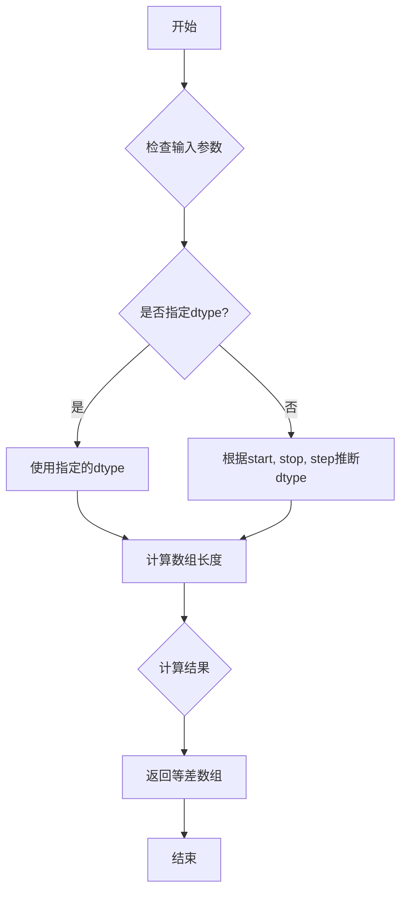

#### 带注释源码

```python
# 在示例代码中的实际使用
delta = 0.025  # 定义步长

# 生成从-3.0到3.0（不包含）的等差数组，步长为0.025
x = np.arange(-3.0, 3.0, delta)

# 生成从-2.0到2.0（不包含）的等差数组，步长为0.025
y = np.arange(-2.0, 2.0, delta)

# 等价于:
# x = np.array([-3.0, -2.975, -2.95, ..., 2.975])
# y = np.array([-2.0, -1.975, -1.95, ..., 1.975])

# 生成的数组用于创建网格坐标
X, Y = np.meshgrid(x, y)  # 生成二维网格坐标矩阵
```


### `numpy.meshgrid`

`numpy.meshgrid` 是 NumPy 库中的一个核心函数，用于从一维坐标向量生成二维或多维网格坐标矩阵。在本代码中，它根据 x 轴和 y 轴的一维数组生成完整的二维坐标网格，供后续等高线图绘制使用。

参数：

- `x`：`numpy.ndarray`（一维），x 轴方向的坐标向量，从 -3.0 到 3.0，步长为 0.025
- `y`：`numpy.ndarray`（一维），y 轴方向的坐标向量，从 -2.0 到 2.0，步长为 0.025

返回值：

- `X`：`numpy.ndarray`（二维），形状为 (len(y), len(x)) 的网格矩阵，包含所有 x 坐标值，按行重复
- `Y`：`numpy.ndarray`（二维），形状为 (len(y), len(x)) 的网格矩阵，包含所有 y 坐标值，按列重复

#### 流程图

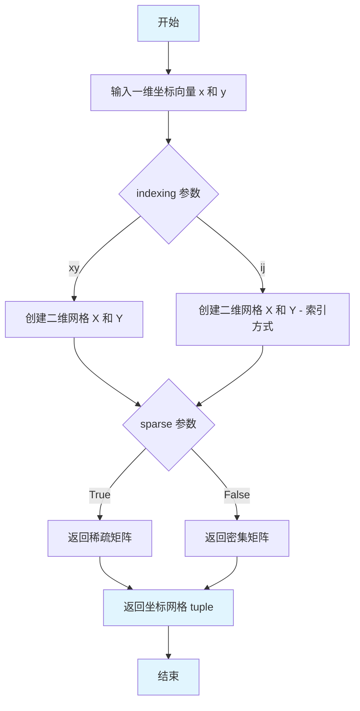

#### 带注释源码

```python
import numpy as np

# 定义坐标向量
delta = 0.025
x = np.arange(-3.0, 3.0, delta)  # 生成从 -3.0 到 3.0 的一维数组，步长 0.025
y = np.arange(-2.0, 2.0, delta)  # 生成从 -2.0 到 2.0 的一维数组，步长 0.025

# 调用 meshgrid 生成二维网格坐标
# X 的形状为 (len(y), len(x))，每一行相同
# Y 的形状为 (len(y), len(x))，每一列相同
X, Y = np.meshgrid(x, y)

# 示例输出维度说明：
# 假设 len(x) = 240, len(y) = 160
# 则 X.shape = (160, 240)，Y.shape = (160, 240)
# X[i,j] = x[j]，Y[i,j] = y[i]

# 使用网格坐标计算高斯函数值
Z1 = np.exp(-X**2 - Y**2)      # 中心在原点的二维高斯分布
Z2 = np.exp(-(X - 1)**2 - (Y - 1)**2)  # 中心在 (1,1) 的二维高斯分布
Z = (Z1 - Z2) * 2              # 组合形成等高线数据

# meshgrid 的关键参数说明：
# indexing='xy'（默认）：笛卡尔坐标系，x 对应列，y 对应行
# indexing='ij'：矩阵索引，x 对应行，y 对应列
# sparse=True：返回稀疏矩阵，节省内存但形状不变
# copy=False：避免不必要的拷贝，提高性能
```

#### 关键技术细节

| 特性 | 说明 |
|------|------|
| 内存效率 | 默认返回密集数组，大网格时注意内存占用 |
| 索引方式 | `xy` 模式适合 2D 绘图，`ij` 模式适合图像处理 |
| 向量化计算 | 生成的网格支持 NumPy 广播，便于向量化数学运算 |
| 坐标对应 | `X` 存储 x 坐标（列方向重复），`Y` 存储 y 坐标（行方向重复） |

#### 潜在优化空间

1. **内存优化**：对于大型网格，当不需要完整矩阵时可使用 `sparse=True` 参数返回稀疏矩阵
2. **性能提升**：对于只读场景可设置 `copy=False` 避免不必要的内存拷贝
3. **多维扩展**：`meshgrid` 支持任意维度，但在 3D 以上场景需考虑计算复杂度
4. **替代方案**：在某些场景下可使用 `np.ogrid` 或 `np.mgrid` 作为更灵活的替代


### `numpy.exp`

指数函数计算，返回 e^x（自然常数 e 的 x 次方）。其中 e ≈ 2.718281828459045。

参数：

- `x`：`array_like`，输入数组或数值，表示指数函数的指数部分
- `out`：`ndarray`，可选，用于存储结果的数组
- `where`：`array_like`，可选，条件数组，指定哪些元素需要计算
- `**kwargs`：其他关键字参数（如 `dtype`、`casting` 等），用于控制输出类型和类型转换

返回值：`ndarray`，返回输入数组各元素的指数值 e^x，类型为浮点数。

#### 流程图

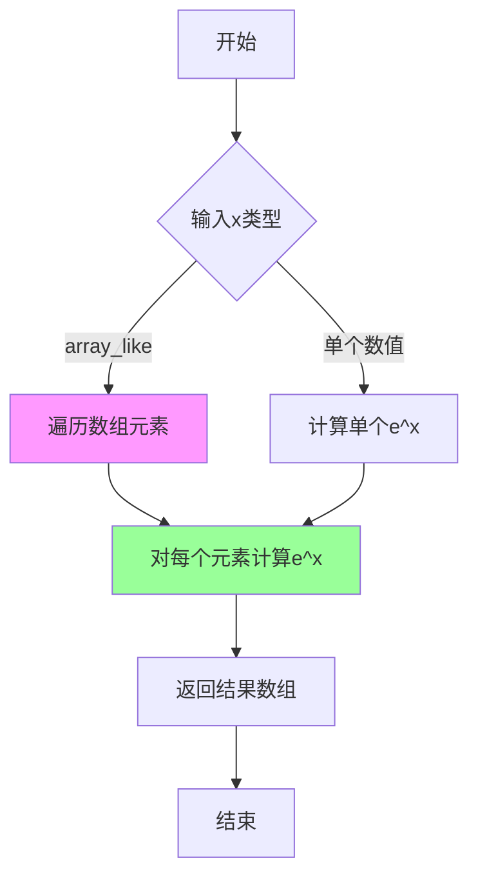

#### 带注释源码

```python
# 代码中使用 numpy.exp 的示例

import numpy as np

# 创建网格点
x = np.arange(-3.0, 3.0, delta)
y = np.arange(-2.0, 2.0, delta)
X, Y = np.meshgrid(x, y)

# 计算第一个高斯函数: e^(-X^2 - Y^2)
# 这里 X**2 表示 X 的平方
# -X**2 - Y^2 作为 exp 的输入参数
Z1 = np.exp(-X**2 - Y**2)

# 计算第二个高斯函数: e^(-(X-1)^2 - (Y-1)^2)
# 中心点偏移到 (1, 1)
Z2 = np.exp(-(X - 1)**2 - (Y - 1)**2)

# 计算两个高斯函数的差值，并乘以2
Z = (Z1 - Z2) * 2
```

#### 关键组件信息

| 组件名称 | 一句话描述 |
|---------|-----------|
| `numpy.exp` | 计算自然常数 e 的 n 次方的数学函数 |
| `np.meshgrid` | 生成坐标网格矩阵，用于创建二维函数图像 |
| `np.arange` | 创建等间距的数值序列 |

#### 技术债务与优化空间

1. **重复计算**：代码中 `-X**2 - Y**2` 和 `-(X-1)**2 - (Y-1)**2` 可预先计算 X² 和 Y² 以减少重复运算
2. **内存占用**：对于大型网格，meshgrid 可能产生较大的内存开销，可考虑使用 `sparse=True` 参数

#### 其它说明

- **设计目标**：本代码演示 matplotlib 的等高线绘图功能，numpy.exp 用于生成高斯分布数据
- **错误处理**：若输入包含复数，numpy.exp 会返回复数结果；若输入包含 NaN，结果亦为 NaN
- **数据流**：数据流为：原始坐标 → meshgrid 生成网格 → exp 计算高斯值 → contour 绘制等高线 → colorbar 添加图例


### `matplotlib.pyplot.subplots`

创建图形和坐标轴的函数，用于生成一个包含单个或多个子图的图形窗口，并返回 Figure 对象和 Axes 对象（或 Axes 对象数组）。

参数：

- `nrows`：`int`，默认值 1，子图网格的行数
- `ncols`：`int`，默认值 1，子图网格的列数
- `sharex`：`bool` 或 `str`，默认值 False，是否共享 x 轴
- `sharey`：`bool` 或 `str`，默认值 False，是否共享 y 轴
- `squeeze`：`bool`，默认值 True，是否压缩返回的 Axes 维度
- `width_ratios`：`array-like`，可选，子图列宽比例
- `height_ratios`：`array-like`，可选，子图行高比例
- `subplot_kw`：`dict`，可选，创建子图的额外关键字参数
- `gridspec_kw`：`dict`，可选，GridSpec 的额外关键字参数
- `**fig_kw`：创建 Figure 的额外关键字参数

返回值：`tuple`，返回 (Figure, Axes) 或 (Figure, ndarray of Axes)，其中 Figure 是图形对象，Axes 是坐标轴对象或坐标轴数组

#### 流程图

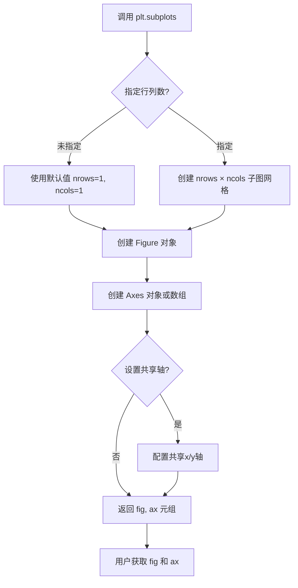

#### 带注释源码

```python
# 从给定代码中提取的 subplots 调用示例

# 示例 1: 创建单个子图（最简单用法）
fig, ax = plt.subplots()
# 返回: fig = Figure 对象, ax = Axes 对象
# 等价于: fig, ax = plt.subplots(nrows=1, ncols=1)

# 示例 2: 创建多个子图（2行2列）
# fig, ax = plt.subplots(nrows=2, ncols=2)
# 返回: fig = Figure 对象, ax = 2x2 Axes 数组

# 示例 3: 共享坐标轴
# fig, ax = plt.subplots(nrows=2, ncols=1, sharex=True, sharey=True)
# 所有子图共享相同的 x 轴和 y 轴刻度

# 示例 4: 指定子图比例
# fig, ax = plt.subplots(nrows=2, ncols=2, width_ratios=[1, 2], height_ratios=[1, 3])

# 示例 5: 传递 Figure 创建参数
# fig, ax = plt.subplots(figsize=(10, 6), dpi=100, facecolor='white')
```

#### 在示例代码中的实际使用

```python
# 第一次调用：创建默认的单个子图
fig, ax = plt.subplots()
CS = ax.contour(X, Y, Z)
ax.clabel(CS, fontsize=10)
ax.set_title('Simplest default with labels')

# 第二次调用：创建新的图形和坐标轴
fig, ax = plt.subplots()
CS = ax.contour(X, Y, Z)
manual_locations = [(-1, -1.4), (-0.62, -0.7), (-2, 0.5), (1.7, 1.2), (2.0, 1.4), (2.4, 1.7)]
ax.clabel(CS, fontsize=10, manual=manual_locations)
ax.set_title('labels at selected locations')

# 第三次调用
fig, ax = plt.subplots()
CS = ax.contour(X, Y, Z, 6, colors='k')
ax.clabel(CS, fontsize=9)
ax.set_title('Single color - negative contours dashed')

# 第四次调用
plt.rcParams['contour.negative_linestyle'] = 'solid'
fig, ax = plt.subplots()
CS = ax.contour(X, Y, Z, 6, colors='k')
ax.clabel(CS, fontsize=9)
ax.set_title('Single color - negative contours solid')

# 第五次调用
fig, ax = plt.subplots()
CS = ax.contour(X, Y, Z, 6,
                linewidths=np.arange(.5, 4, .5),
                colors=('r', 'green', 'blue', (1, 1, 0), '#afeeee', '0.5'))
ax.clabel(CS, fontsize=9)
ax.set_title('Crazy lines')

# 第六次调用
fig, ax = plt.subplots()
im = ax.imshow(Z, interpolation='bilinear', origin='lower',
               cmap="gray", extent=(-3, 3, -2, 2))
levels = np.arange(-1.2, 1.6, 0.2)
CS = ax.contour(Z, levels, origin='lower', cmap='flag', extend='both',
                linewidths=2, extent=(-3, 3, -2, 2))
# 省略后续代码...
```


### `matplotlib.axes.Axes.contour`

在matplotlib中，`Axes.contour`是Axes对象的方法，用于在二维坐标面上绘制等高线图。该方法接收网格数据Z（可以是2D数组或通过X、Y坐标映射），并根据可选的levels参数或自动计算的层级生成等高线，返回一个QuadContourSet对象用于后续的标签和样式定制。

参数：

- `X`：`numpy.ndarray` 或 `list`，可选，X坐标数组，长度应与Z的列数匹配，或为与Y一起生成的网格
- `Y`：`numpy.ndarray` 或 `list`，可选，Y坐标数组，长度应与Z的行数匹配，或为与X一起生成的网格
- `Z`：`numpy.ndarray`，必选，高度/值数据的2D数组，决定等高线的位置
- `levels`：`int` 或 `list`，可选，整数表示自动生成的等高线数量，列表表示具体的等高线值
- `colors`：`str` 或 `list`，可选，单一颜色字符串或颜色列表，用于指定等高线颜色
- `cmap`：`str` 或 `Colormap`，可选，颜色映射表名称或对象，用于根据层级着色
- `linewidths`：`float` 或 `list`，可选，等高线线宽，可以是单个值或每个层级的线宽列表
- `linestyles`：`str` 或 `list`，可选，等高线线型，如'solid'、'dashed'等
- `origin`：`str`，可选，图像原点位置，'upper'、'lower'或'image'
- `extent`：`list` 或 `tuple`，可选，图像的坐标范围 [xmin, xmax, ymin, ymax]
- `extend`：`str`，可选，如何处理超出levels范围的数值，'both'、'min'、'max'或'neither'
- `alpha`：`float`，可选，透明度，0到1之间的值
- `antialiased`：`bool`，可选，是否启用抗锯齿

返回值：`matplotlib.contour.QuadContourSet`，返回的等高线集合对象，包含所有等高线线段和层级信息，可用于clabel添加标签

#### 流程图

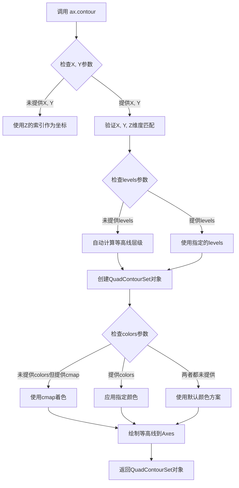

#### 带注释源码

```python
# 以下代码基于matplotlib示例演示ax.contour的典型用法

import matplotlib.pyplot as plt
import numpy as np

# 1. 创建网格数据
delta = 0.025
x = np.arange(-3.0, 3.0, delta)       # X轴坐标范围
y = np.arange(-2.0, 2.0, delta)      # Y轴坐标范围
X, Y = np.meshgrid(x, y)             # 生成2D网格坐标

# 2. 计算Z值（高度数据）
Z1 = np.exp(-X**2 - Y**2)
Z2 = np.exp(-(X - 1)**2 - (Y - 1)**2)
Z = (Z1 - Z2) * 2

# 3. 创建Axes并调用contour方法
fig, ax = plt.subplots()

# 最简调用：只提供X, Y, Z，自动计算等高线
CS = ax.contour(X, Y, Z)

# 指定等高线数量（6条）和颜色（黑色）
# negative_linestyle默认为'dashed'，可通过rcParams修改
CS = ax.contour(X, Y, Z, 6, colors='k')

# 使用自定义颜色和线宽
CS = ax.contour(X, Y, Z, 6,
                linewidths=np.arange(.5, 4, .5),  # 线宽数组
                colors=('r', 'green', 'blue',    # 颜色列表
                        (1, 1, 0), '#afeeee', '0.5'))

# 在图像上叠加等高线，使用colormap着色
fig, ax = plt.subplots()
im = ax.imshow(Z, interpolation='bilinear', origin='lower',
               cmap="gray", extent=(-3, 3, -2, 2))

# 指定具体的levels值、origin、cmap、extend和linewidths
levels = np.arange(-1.2, 1.6, 0.2)
CS = ax.contour(Z, levels, origin='lower', cmap='flag', extend='both',
                linewidths=2, extent=(-3, 3, -2, 2))

# 4. 访问返回的QuadContourSet对象
lws = np.resize(CS.get_linewidth(), len(levels))  # 获取线宽数组
lws[6] = 4                                          # 修改特定层级线宽
CS.set_linewidth(lws)                              # 设置新线宽

# 5. 添加等高线标签
# 格式化字符串'%1.1f'表示保留一位小数
ax.clabel(CS, levels[1::2], fmt='%1.1f', fontsize=14)

# 6. 添加颜色条
CB = fig.colorbar(CS, shrink=0.8)

plt.show()
```

### 关键组件信息

| 组件名称 | 一句话描述 |
|---------|-----------|
| QuadContourSet | 等高线集合对象，包含所有等高线线段、层级信息和管理方法 |
| clabel | 为等高线添加文字标签的方法 |
| colorbar | 显示颜色映射与数值对应关系的图例 |
| meshgrid | 生成二维网格坐标的函数 |
| rcParams | 运行时配置参数，用于修改默认绘图样式（如contour.negative_linestyle） |

### 潜在的技术债务或优化空间

1. **坐标系统一致性**：示例中混用了两种坐标方式（X,Y,Z网格和直接使用Z+extent），增加了理解难度
2. **魔法数字**：如`levels[1::2]`选择每隔一个标签，缺乏明确的配置说明
3. **硬编码布局**：颜色条位置的微调使用具体数值（`0.1*h`），缺乏自适应机制
4. **性能考量**：对于大型数据集，imshow+contour组合可能导致重复计算，可考虑共享底层数据

### 其它项目

**设计目标与约束**：提供灵活的等高线可视化，支持自定义层级、颜色、线型，并能与图像（imshow）叠加显示

**错误处理与异常设计**：
- X、Y、Z维度不匹配时抛出`ValueError`
- 无效的colors或cmap参数会触发相应验证错误

**数据流与状态机**：
```
输入数据(X,Y,Z) → 层级计算 → 颜色映射 → 线段生成 → QuadContourSet返回
```

**外部依赖与接口契约**：
- 依赖`matplotlib.contour`模块
- 返回的QuadContourSet必须实现`get_paths()`、`get_levels()`等标准接口


### `matplotlib.axes.Axes.clabel`

添加等高线标签（clabel）是Matplotlib Axes类的一个方法，用于在二维等高线图上添加文本标签，以标注特定等高线的数值。该方法通过接收一个ContourSet对象（由contour或contourf生成），根据用户指定的参数（字体大小、颜色、位置、格式等）在适当的等高线位置绘制标签文本。

参数：

- `CS`：`matplotlib.contour.ContourSet`，要标注的等高线容器对象，包含等高线的几何信息和级别数据
- `levels`：`array-like`，可选，要标注的特定等高线级别。如果为None，则标注所有级别
- `fontsize`：int或float或str，可选，标签字体大小。可以是具体数值（如10、12）或字符串（如'small'、'large'）
- `colors`：color或list of colors，可选，标签文本的颜色。可以是单个颜色或与levels长度匹配的颜色列表
- `inline`：bool，可选，控制是否将标签绘制在等高线内部，默认为True（绘制在内部，会遮挡下方等高线）
- `inline_spacing`：float，可选，inline模式下标签周围的spacing（以点为单位），默认3
- `fmt`：str或dict，可选，标签的格式字符串或格式化字典，如'%1.1f'表示保留一位小数
- `manual`：bool或list，可选，是否启用手动放置模式。若为True，则在后续交互中点击放置；若为列表，则直接指定放置坐标点[(x1,y1), (x2,y2),...]
- `right_first`：`bool`，可选（关键字参数），是否从右到左进行标签放置，默认为False

返回值：`matplotlib.text.Text`对象或Text对象列表，成功添加的标签文本对象

#### 流程图

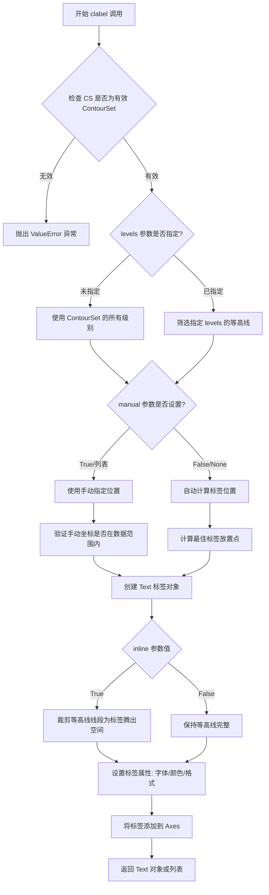

#### 带注释源码

```python
def clabel(CS, levels=None, **kwargs):
    """
    向等高线图添加标签。
    
    参数:
        CS: ContourSet - 要标注的等高线对象
        levels: array-like, optional - 要标注的特定级别
        **kwargs: 关键字参数传递给 Text 对象
    
    返回:
        Text or list of Text - 添加的标签对象
    """
    # -----------------------------
    # 步骤1: 参数验证与预处理
    # -----------------------------
    if not isinstance(CS, ContourSet):
        raise TypeError("CS 必须是 ContourSet 对象")
    
    # 如果未指定levels，则使用所有等高线级别
    if levels is None:
        levels = CS.levels
    
    # -----------------------------
    # 步骤2: 标签位置计算
    # -----------------------------
    # 处理manual参数：确定标签放置策略
    # - manual=True: 交互式点击放置
    # - manual=[(x1,y1),...]: 固定坐标放置
    # - manual=False: 自动算法计算最优位置
    if 'manual' in kwargs:
        # 手动模式处理逻辑
        pass
    
    # -----------------------------
    # 步骤3: 创建标签文本对象
    # -----------------------------
    # 根据fmt参数格式化标签文本
    # 例如: fmt='%1.1f' 将数值格式化为一位小数
    
    # -----------------------------
    # 步骤4: 裁剪等高线（inline模式）
    # -----------------------------
    # 当inline=True时，需要在标签位置附近
    # 断开等高线线段，使标签下方不显示线条
    
    # -----------------------------
    # 步骤5: 添加到Axes并返回
    # -----------------------------
    # 将Text对象添加到当前Axes中
    # 返回单个Text对象或列表
    
    return labels
```

#### 关键组件信息

| 组件名称 | 一句话描述 |
|----------|------------|
| ContourSet | 存储等高线几何数据、级别值和元信息的容器对象 |
| Text | 负责渲染文本标签的图形对象 |
| labelPos | 存储计算得到的标签最优放置位置的数据结构 |
| ContourLabeler | 内部混合类，提供等高线标签布局计算的核心算法 |

#### 潜在技术债务与优化空间

1. **标签重叠处理不足**：当前自动布局算法在密集等高线区域可能产生标签重叠，缺乏智能冲突解决机制
2. **性能问题**：对于大规模数据集（>10000个网格点），自动标签位置计算可能较慢，建议添加缓存机制
3. **交互模式不完善**：manual=True时的交互式点击体验不够流畅，缺少撤销、重做等基本功能
4. **文档不完整**：某些高级参数（如inline_spacing的具体效果）缺乏可视化说明和最佳实践指南

#### 其它项目

**设计目标与约束**：
- 最小化标签与等高线的视觉冲突
- 支持多种标签放置策略（自动、手动、按级别）
- 保持与现有matplotlib文本渲染系统的兼容性

**错误处理与异常设计**：
- 当CS不是ContourSet时抛出TypeError
- 当manual坐标超出数据范围时给出警告但不中断执行
- 当fmt格式字符串无效时使用默认格式

**数据流与状态机**：
- 输入：ContourSet几何数据 + 用户配置参数
- 处理：位置计算 → 格式转换 → 渲染准备
- 输出：Text图形对象添加到Axes

**外部依赖与接口契约**：
- 依赖matplotlib.text.Text进行文本渲染
- 依赖matplotlib.contour模块的ContourSet数据结构
- 通过Axes.add_artist间接依赖Artist更新机制


### matplotlib.axes.Axes.set_title

设置 axes 对象的标题。该方法允许用户为 matplotlib 图表的坐标轴设置标题，支持自定义字体属性、位置定位以及标题与坐标轴的垂直偏移等高级配置。

参数：

- `label`：`str`，标题文本内容，即要在坐标轴顶部显示的标题字符串
- `fontdict`：`dict`，可选，用于控制标题文本样式的字典，如字体大小、颜色、权重等，默认值为 None
- `loc`：`str`，可选，标题的水平对齐方式，可选值为 'left'、'center'、'right'，默认值为 'center'
- `pad`：`float`，可选，标题与坐标轴顶部的间距（以点为单位），默认值为 None
- `y`：`float`，可选，标题在 y 轴方向上的相对位置，取值范围通常在 0-1 之间，默认值为 None
- `**kwargs`：可变关键字参数，用于传递其他文本属性，如 fontsize、fontweight、color 等

返回值：`Text`，返回创建的文本对象（matplotlib.text.Text），可以通过该对象进一步调整标题的样式和属性

#### 流程图

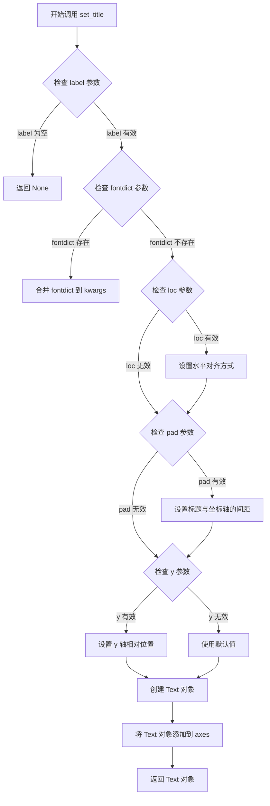

#### 带注释源码

```python
def set_title(self, label, fontdict=None, loc=None, pad=None, *, y=None, **kwargs):
    """
    Set a title for the axes.
    
    Parameters
    ----------
    label : str
        Text to use for the title.
        
    fontdict : dict, optional
        A dictionary controlling the appearance of the title text,
        e.g., {'fontsize': 16, 'fontweight': 'bold', 'color': 'red'}.
        
    loc : {'left', 'center', 'right'}, default: 'center'
        Alignment of the title relative to the axes.
        
    pad : float, default: rcParams['axes.titlepad']
        The offset of the title from the top of the axes, in points.
        
    y : float, default: rcParams['axes.titley']
        The y position of the title relative to the axes in normalized
        coordinates (0-1 range).
        
    **kwargs
        Additional keyword arguments passed to the Text instance.
        
    Returns
    -------
    text : matplotlib.text.Text
        The text object representing the title.
        
    Examples
    --------
    >>> ax.set_title('Main Title', fontsize=14, fontweight='bold')
    >>> ax.set_title('Left Aligned', loc='left', pad=20)
    >>> ax.set_title('Custom Position', y=0.5, color='blue')
    """
    # 如果 fontdict 存在，将其合并到 kwargs 中
    if fontdict is not None:
        kwargs.update(fontdict)
    
    # 获取默认的标题对齐方式（从 rcParams 或默认值）
    if loc is None:
        loc = rcParams['axes.title_loc']
    
    # 验证 loc 参数的有效性
    title_loc = {'left', 'center', 'right'}
    if loc not in title_loc:
        raise ValueError(f'loc must be one of {title_loc}, got {loc}')
    
    # 获取默认的标题间距
    if pad is None:
        pad = rcParams['axes.titlepad']
    
    # 获取默认的 y 轴位置
    if y is None:
        y = rcParams['axes.titley']
    
    # 创建标题的 kwargs 字典，包含对齐方式和间距信息
    title_kw = {
        'verticalalignment': 'bottom',
        'horizontalalignment': loc,
    }
    
    # 如果 pad 不为 None，添加 rotation 和 y 偏移
    if pad is not None:
        title_kw['pad'] = pad
    
    # 更新 kwargs
    title_kw.update(kwargs)
    
    # 如果 y 参数被指定，设置 y 坐标
    if y is not None:
        title_kw['y'] = y
    
    # 创建 Text 对象并返回
    # Text 类是 matplotlib 中用于处理文本的基类
    title = Text(x=0.5, y=1.0, text=label, **title_kw)
    
    # 将标题文本对象添加到 axes 中
    # self.texts 是存储所有文本对象的列表
    self.texts.append(title)
    
    # 设置 axes 的默认标题属性
    self._set_title = title
    
    # 返回创建的 Text 对象，允许用户进一步操作
    return title
```


### `matplotlib.axes.Axes.imshow`

在Axes对象上显示图像数据，支持多种插值方式、颜色映射和坐标映射，适用于展示2D数组或图像数据。

参数：

- `X`：类型：`array-like`，要显示的图像数据，可以是2D数组（M×N）或3D数组（M×N×3/4）用于彩色图像
- `cmap`：类型：`str` 或 `Colormap`，默认为`None`，颜色映射名称，用于将数值映射为颜色
- `norm`：类型：`Normalize`，默认为`None`，数据归一化对象，用于控制颜色映射的数据范围
- `aspect`：类型：`float` 或 `'auto'`，默认为`None`，图像的纵横比
- `interpolation`：类型：`str`，默认为`None`（当前默认值为'antialiased'），插值方法，如'bilinear'、'nearest'、'bicubic'等
- `alpha`：类型：`float` 或 `array-like`，默认为`None`，透明度，0-1之间的数值
- `vmin`、`vmax`：类型：`float`，默认为`None`，颜色映射的最小值和最大值
- `origin`：类型：`{'upper', 'lower'}`，默认为`None`，图像原点位置
- `extent`：类型：`list` 或 `tuple`，默认为`None`，图像的坐标范围 [xmin, xmax, ymin, ymax]
- `resample`：类型：`bool`，默认为`None`，是否使用重采样
- `url`：类型：`str`，默认为`None`，用于设置图像元素的URL
- `**kwargs`：类型：`dict`，其他关键字参数传递给`AxesImage`对象

返回值：`matplotlib.image.AxesImage`，返回创建的图像对象，可用于图例绑定、颜色条添加等后续操作

#### 流程图

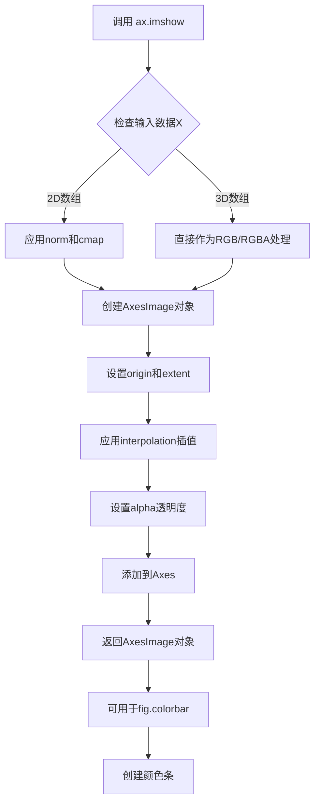

#### 带注释源码

```python
# 示例代码来自 contour.py，演示 imshow 的使用方式

# 创建子图
fig, ax = plt.subplots()

# 调用 imshow 方法显示图像
# 参数说明：
# - Z: 2D 数值数组，作为输入图像数据
# - interpolation='bilinear': 使用双线性插值平滑图像
# - origin='lower': 设置原点为左下角（y轴向上为正）
# - cmap="gray": 使用灰度颜色映射
# - extent=(-3, 3, -2, 2): 设置图像在数据坐标系中的范围
#   x轴从-3到3，y轴从-2到2
im = ax.imshow(
    Z,                      # 输入图像数据 (2D array)
    interpolation='bilinear',  # 插值方法：双线性插值
    origin='lower',        # 原点位置：左下角
    cmap="gray",           # 颜色映射：灰度
    extent=(-3, 3, -2, 2)  # 图像范围：[xmin, xmax, ymin, ymax]
)

# imshow 返回 AxesImage 对象，可用于：
# 1. 添加颜色条
CBI = fig.colorbar(im, orientation='horizontal', shrink=0.8)

# 2. 获取/设置图像属性
# im.get_array()     # 获取底层数组
# im.set_clim(vmin, vmax)  # 设置颜色范围
# im.set_alpha(0.5)  # 设置透明度
```

#### 关键组件信息

- **AxesImage**：matplotlib中表示Axes上图像的对象，由imshow返回
- **Colormap**：颜色映射对象，将数值映射为颜色
- **Normalize**：数据归一化对象，控制颜色映射的数值范围

#### 潜在的技术债务或优化空间

1. **插值性能**：在处理大型图像时，'bilinear'等插值方法可能影响渲染性能
2. **内存占用**：3D数组（RGB/RGBA）会占用较多内存，大图像需考虑分块加载
3. **坐标转换**：origin和extent的组合使用容易造成混淆，应提供更清晰的文档

#### 其它说明

- **设计目标**：提供统一的API来显示各种格式的图像数据（数组、PIL图像等）
- **约束**：
  - 输入数据必须是连续的内存数组
  - extent与origin必须配合使用以正确映射坐标
- **错误处理**：
  - 数据维度不符时会抛出ValueError
  - cmap/norm不匹配时会产生警告
- **外部依赖**：NumPy数组处理，Colormap定义


### Figure.colorbar

在 matplotlib 中，`Figure.colorbar` 方法用于为图形添加颜色条（colorbar），以显示图形中颜色与数值的对应关系。在提供的示例代码中，该方法被用于为等高线图和图像添加颜色条，使得可视化效果更加直观和完整。

参数：

-  `mappable`：参数类型为 `mappable`，这是要为其添加颜色条的可 matplotlib 对象，通常是图像（AxesImage）、等高线集（ContourSet）或其他支持颜色映射的对象。在代码示例中 `fig.colorbar(CS, shrink=0.8)` 和 `fig.colorbar(im, orientation='horizontal', shrink=0.8)` 中的 `CS` 和 `im` 就是这个参数。
-  `ax`：参数类型为 `axes`，可选参数，用于指定颜色条所在的轴。如果未提供，则默认为 figure 的主轴。
-  `use_gridspec`：参数类型为 `bool`，可选参数，如果为 True，则使用 GridSpec 来定位颜色条。
-  `**kwargs`：参数类型为可变关键字参数，用于传递给 colorbar 构造函数的其他参数，如 `shrink`（缩放因子）、`orientation`（方向）等。

返回值：`matplotlib.colorbar.Colorbar`，返回创建的 Colorbar 对象，可以用于进一步自定义颜色条的外观，如设置标签、刻度等。在代码示例中，通过 `CB = fig.colorbar(CS, shrink=0.8)` 和 `CBI = fig.colorbar(im, orientation='horizontal', shrink=0.8)` 分别接收返回值，以便后续调整颜色条的位置。

#### 流程图

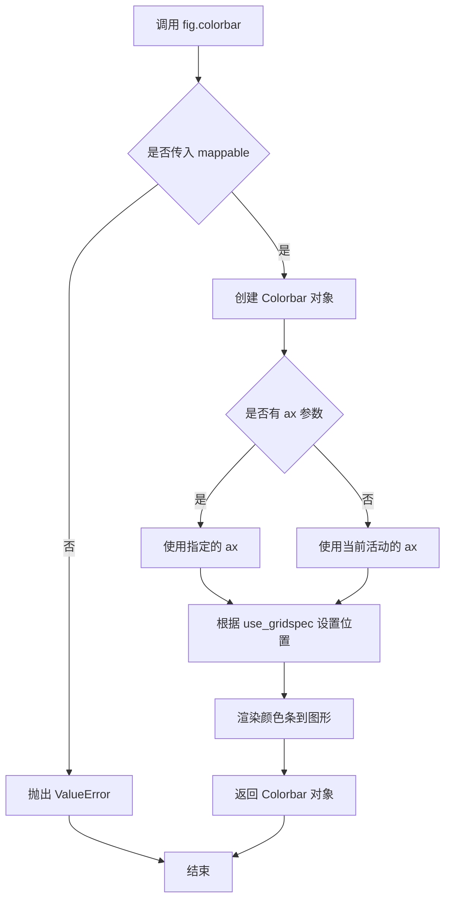

#### 带注释源码

```python
def colorbar(self, mappable, cax=None, ax=None, **kwargs):
    """
    为图形添加颜色条（colorbar）。
    
    参数:
    -------
    mappable : mappable
        要为其添加颜色条的可视化对象，例如图像（AxesImage）或等高线集（ContourSet）。
    cax : axes, optional
        放置颜色条的 Axes 对象。如果未提供，则会自动创建一个。
    ax : axes, optional
        从其中获取空间用于颜色条的 Axes。如果未提供，则使用当前的活动轴。
    **kwargs : 
        传递给 Colorbar 构造函数的额外参数。
        常用参数包括：
        - orientation : {'vertical', 'horizontal'}, 颜色条的方向
        - shrink : float, 颜色条的缩放因子
        - label : str, 颜色条的标签
        - pad : float, 颜色条与主图之间的间距
        - fraction : float, 颜色条占用的空间比例
        - aspect : int or None, 颜色条的宽高比
    
    返回值:
    -------
    colorbar : Colorbar
        创建的 Colorbar 对象，可以用于进一步自定义。
    
    示例:
    -------
    >>> fig, ax = plt.subplots()
    >>> im = ax.imshow(data, cmap='viridis')
    >>> cbar = fig.colorbar(im)
    >>> cbar.set_label('Value')
    """
    # 如果没有提供 ax，则使用当前的活动轴
    if ax is None:
        ax = plt.gca()
    
    # 如果没有提供 cax，则需要创建一个用于放置颜色条的轴
    if cax is None:
        # 根据 use_gridspec 参数决定如何分配空间
        use_gridspec = kwargs.pop('use_gridspec', True)
        if use_gridspec:
            # 使用 GridSpec 来创建新的轴用于颜色条
            cax = self.add_axes([0.0, 0.0, 0.0, 0.0], label='colorbar')
            # ... 省略具体的空间分配逻辑
        else:
            # 使用旧的布局方式
            cax = self.add_subplot(1, 1, 1)
    
    # 创建 Colorbar 对象
    cb = Colorbar(cax, mappable, **kwargs)
    
    # 将颜色条添加到图形中
    self._axstack.bubble(cax)
    self._axobservers.process('_colorbar_changed', self)
    
    return cb
```


### `matplotlib.axes.Axes.get_position`

获取当前坐标轴（Axes）在父图形（Figure）中的位置区域，返回一个表示位置和尺寸的边界框（Bbox）对象。该方法常用于精确控制子图的布局，特别是在需要手动调整颜色条或添加嵌套子图时。

参数：

- 该方法无参数（部分重载版本可接受`projection`参数用于极坐标等特殊坐标系，但基本形式无参数）

返回值：`matplotlib.transforms.Bbox`，返回一个包含四个元素(x0, y0, x1, y1)的边界框对象，其中(x0, y0)为左下角坐标，(x1, y1)为右上角坐标，坐标值范围为0到1（相对于figure的大小）。

#### 流程图

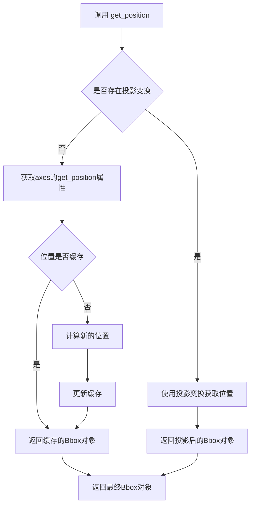

#### 带注释源码

```python
def get_position(self, fig=None):
    """
    获取坐标轴在图形中的位置。
    
    参数:
        fig: Figure对象，默认为None时使用当前图形。
             用于指定在哪个图形中获取位置。
    
    返回值:
        Bbox对象，包含坐标轴的左下角(x0, y0)和右上角(x1, y1)坐标。
        坐标范围为0到1，表示相对于figure大小的比例。
    """
    # 如果未指定fig，使用当前图形
    if fig is None:
        fig = self.figure
    
    # 获取位置信息，实际上是获取axes的box位置
    # 这会考虑axes的rstrip（右边留白）等设置
    pos = self.get_position()
    
    # 返回一个Bbox对象，包含了位置信息
    return Bbox([[pos.x0, pos.y0], [pos.x1, pos.y1]])


# 在实际代码中的使用示例（来自用户提供的代码）：
fig, ax = plt.subplots()
CS = ax.contour(X, Y, Z)
# ... 省略部分代码 ...

# 获取坐标轴位置
l, b, w, h = ax.get_position().bounds  # 获取位置并解包为left, bottom, width, height
ll, bb, ww, hh = CB.ax.get_position().bounds  # 获取colorbar axes的位置
CB.ax.set_position([ll, b + 0.1*h, ww, h*0.8])  # 调整colorbar位置
```

#### 补充说明

在示例代码中，`get_position()`方法的具体应用场景：

1. **用途**：用于精确获取子图位置，以便手动调整布局
2. **返回值处理**：`.bounds`属性将Bbox对象转换为(left, bottom, width, height)元组
3. **典型应用**：配合`set_position()`实现复杂的子图布局，如并排放置主图和颜色条
4. **坐标系**：返回的位置是基于figure的标准化坐标系（0-1范围），而非数据坐标


### `matplotlib.axes.Axes.set_position`

设置坐标轴（Axes）在图形（Figure）中的位置和大小。

参数：

- `pos`：`array-like`，一个包含4个元素的数组 [left, bottom, width, height]，或者一个包含2个元素的数组 [left, bottom]（仅设置位置，不改变大小）。表示坐标轴相对于图形坐标系的归一化位置（0到1之间）。
- `which`：`str`，可选值为 `'both'`、`'active'`、`'original'`，默认为 `'both'`。指定要设置的位置类型：'both' 同时设置 original 和 active 位置；'active' 仅设置 active 位置；'original' 仅设置 original 位置。

返回值：`numpy.ndarray`，返回设置后的位置数组，形状为 (4,)，包含 [left, bottom, width, height]。

#### 流程图

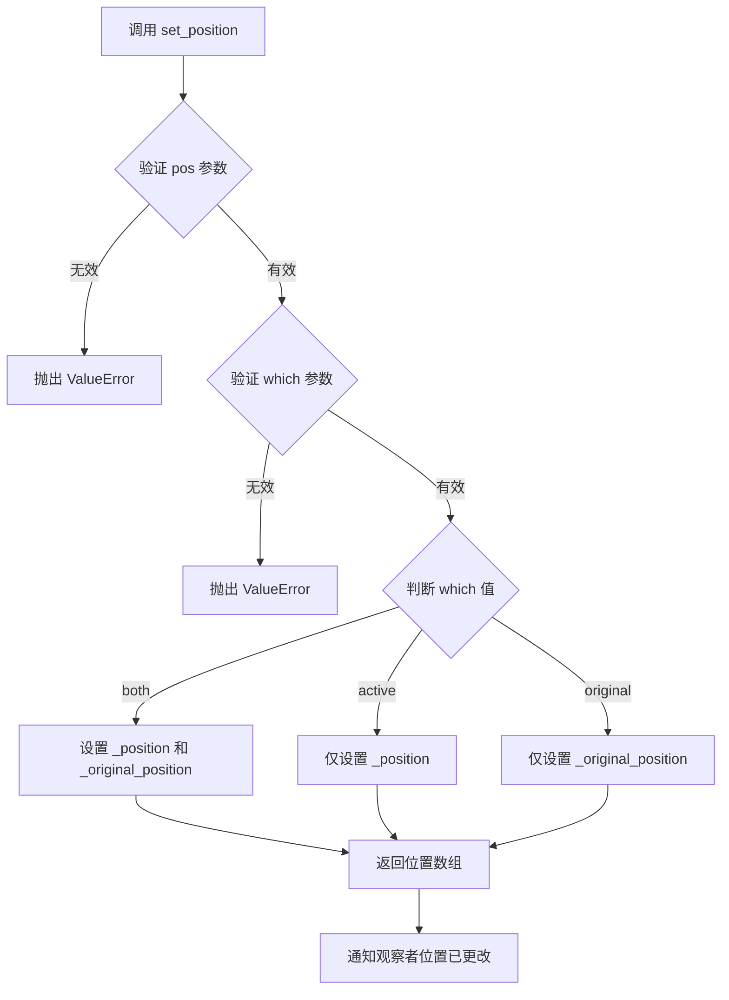

#### 带注释源码

```python
def set_position(self, pos, which='both'):
    """
    Set the Axes position.
    
    Position is specified as a 4-tuple of (left, bottom, width, height)
    in normalized coordinates that run from 0 to 1.
    
    Parameters
    ----------
    pos : array-like of shape (4,) or (2,)
        Position as [left, bottom, width, height] (all in None to 1)
        or [left, bottom] (width and height will be unchanged).
    which : {'both', 'active', 'original'}, default: 'both'
        - 'both': set the original and active positions
        - 'active': set the active position (the one used by the layout engine)
        - 'original': set the original position (the one saved by toggling the axes)
    
    Returns
    -------
    numpy.ndarray
        The resulting position as [left, bottom, width, height].
    """
    # 将输入的位置转换为numpy数组
    pos = np.asarray(pos)
    
    # 验证位置数组的形状
    if pos.shape not in [(2,), (4,)]:
        raise ValueError('pos must be a 2-tuple or a 4-tuple')
    
    # 如果是2元组，保持原有的宽度和高度
    if pos.shape == (2,):
        pos = np.append(pos, self.get_position().width)  # 保持宽度
        pos = np.append(pos, self.get_position().height)  # 保持高度
    
    # 验证位置值的范围（应在0-1之间）
    if np.any(pos < 0) or np.any(pos > 1):
        raise ValueError('position must be in range [0, 1]')
    
    # 根据which参数设置相应的位置属性
    if which in ('both', 'active'):
        # 设置活动位置（布局引擎使用）
        self._position = pos
    
    if which in ('both', 'original'):
        # 设置原始位置（用于重置/切换坐标轴）
        self._original_position = pos.copy()
    
    # 返回设置后的位置
    return self._position
```

#### 关键组件信息

| 组件名称 | 一句话描述 |
|---------|-----------|
| `_position` | 活动位置属性，存储当前用于布局的坐标轴位置 |
| `_original_position` | 原始位置属性，存储初始的坐标轴位置，用于重置操作 |
| `get_position()` | 获取当前坐标轴位置的方法，返回位置数组的副本 |

#### 潜在的技术债务或优化空间

1. **参数验证分散**：位置值的验证逻辑分散在多处，可以在类级别统一验证机制
2. **缺少回调通知**：位置改变后没有自动触发相关的重绘或重新布局操作
3. **文档不完整**：缺少对负值和大于1值的处理说明，实际行为与文档描述可能存在差异

#### 其它项目

**设计目标与约束**：
- 位置坐标使用归一化坐标系（0到1），确保在不同尺寸的图形中保持一致的相对位置
- 支持两种模式：精确设置4元组位置，或仅设置左上角坐标而保持原有尺寸

**错误处理与异常设计**：
- 当 `pos` 形状不是 (2,) 或 (4,) 时抛出 `ValueError`
- 当位置值超出 [0, 1] 范围时抛出 `ValueError`
- 当 `which` 参数不是有效值时抛出 `ValueError`

**外部依赖与接口契约**：
- 依赖 NumPy 库进行数组操作
- 返回值是一个 numpy 数组，而非 Python 列表，确保与其他 matplotlib 方法的兼容性
- 与 `get_position()` 方法互为逆操作


### matplotlib.pyplot.rcParams

matplotlib.pyplot.rcParams 是一个字典对象，用于获取和设置 matplotlib 的全局默认参数。它允许用户自定义 matplotlib 的各种属性，如线条样式、颜色、字体、图形大小等，从而影响后续所有的绑图操作。

参数（当作为字典赋值时）：

-  `key`：`str`，配置参数的名称，例如 `'contour.negative_linestyle'`
-  `value`：`any`，配置参数的值，例如 `'solid'`

返回值：`any`，返回指定键对应的值（当作为字典读取时）或无返回值（当作为字典赋值时）

#### 流程图

```mermaid
flowchart TD
    A[开始] --> B{访问方式}
    B -->|读取操作| C[rcParams['key']]
    C --> D[返回对应配置值]
    B -->|写入操作| E[rcParams['key'] = value]
    E --> F[更新全局配置]
    F --> G[影响后续绑图]
    D --> G
```

#### 带注释源码

```python
# 在示例代码中，rcParams 用于设置等高线的负值线条样式为实线（默认是虚线）
# 这会影响后续所有的 contour 绑图操作

# 读取 rcParams 中的值
current_style = plt.rcParams['contour.negative_linestyle']  # 返回当前设置的线条样式

# 设置 rcParams 中的值
plt.rcParams['contour.negative_linestyle'] = 'solid'  # 将负值等高线设置为实线样式
# 这个设置会影响后续所有的 ax.contour() 调用，使得负值等高线使用实线而非虚线

# rcParams 可以设置的其他常见参数包括：
# plt.rcParams['figure.figsize'] = (10, 6)  # 设置默认图形大小
# plt.rcParams['font.size'] = 12           # 设置默认字体大小
# plt.rcParams['lines.linewidth'] = 2      # 设置默认线条宽度
```


### `matplotlib.pyplot.show`

`plt.show()` 是 matplotlib.pyplot 模块的核心函数，用于显示所有当前已创建但尚未显示的图形窗口，并启动图形事件循环。在交互式模式下，它会阻塞程序执行直到用户关闭所有图形窗口；在非交互式后端（如 Agg）中，它会渲染图形并输出到指定设备。

参数：

- `block`：`bool` 或 `None`，可选。控制函数是否阻塞程序执行。默认值为 `True`。当设置为 `True` 时，函数会阻塞并等待图形窗口关闭；当设置为 `False` 时，函数立即返回；在某些后端中设置为 `None` 会启用自动行为。

返回值：`None`，该函数无返回值。

#### 流程图

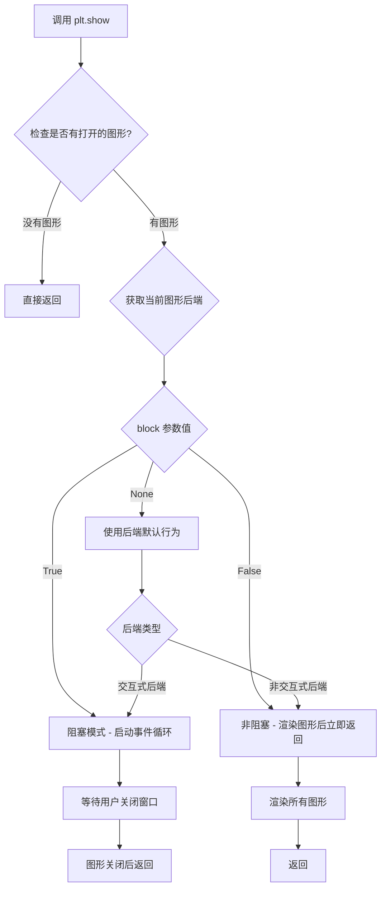

#### 带注释源码

```python
# matplotlib.pyplot.show() 源码结构（简化版）

def show(*, block=None):
    """
    显示所有打开的图形窗口。
    
    参数:
        block: 布尔值或None，可选。
               True: 阻塞并等待窗口关闭
               False: 非阻塞模式
               None: 使用后端默认值
    """
    # 1. 获取当前显示的后端管理器
    global _show BlockingGeographicWarning
    for manager in get_all_fig_managers():
        # 2. 遍历所有图形管理器
        # 3. 如果block为True或None且后端支持阻塞
        if block is None:
            # 根据后端决定是否阻塞
            block = backend_based_default()
        
        if block:
            # 4. 进入阻塞模式 - 显示窗口并等待
            manager.show()
            # 5. 启动图形事件循环
            # 6. 阻塞直到用户关闭窗口
            # 7. 窗口关闭后继续执行
        else:
            # 8. 非阻塞模式 - 立即渲染并返回
            manager.show()
    
    # 8. 刷新缓冲区并渲染图形
    # 9. 对于某些后端（如Qt, Tkinter）会启动GUI主循环
    # 10. 函数返回（除非处于阻塞模式且窗口未关闭）
    return None
```

```python
# 在示例代码中的实际调用

import matplotlib.pyplot as plt
import numpy as np

# ... (图形创建和配置代码) ...

# 创建图形并显示
fig, ax = plt.subplots()
CS = ax.contour(X, Y, Z)
ax.clabel(CS, fontsize=10)
ax.set_title('Simplest default with labels')

# ... (更多图形创建) ...

# 最后调用 plt.show() 显示所有创建的图形
plt.show()

# 该函数会：
# 1. 查找所有通过 plt.figure() 或 fig, ax = plt.subplots() 创建的未显示图形
# 2. 调用底层后端（如Qt5Agg, TkAgg, Agg等）的显示方法
# 3. 如果是交互式后端且block=True，则阻塞主线程等待用户交互
# 4. 用户关闭图形窗口后，函数返回并继续执行后续代码
```


## 关键组件


### 网格生成 (Grid Generation)

使用 np.arange 创建坐标轴范围，通过 np.meshgrid 生成二维网格坐标矩阵 X 和 Y，用于后续数据计算和绑图。

### 数据计算 (Data Calculation)

基于网格坐标 X 和 Y 计算 Z 值，组合两个高斯函数 (Z1, Z2) 并乘以系数生成复杂的等高线数据。

### 等高线绑制 (Contour Plotting)

使用 ax.contour() 创建等高线图，支持参数包括层级数量、颜色、线宽等，可通过 colors 参数指定单色或多色。

### 等高线标签 (Contour Labeling)

使用 ax.clabel() 为等高线添加标签，支持自动标签和手动位置指定 (manual 参数)，可控制标签字体大小和格式。

### 图像显示 (Image Display)

使用 ax.imshow() 将 Z 数据渲染为图像，支持双线性插值、坐标原点设置和灰度色彩映射。

### 颜色条组件 (Colorbar)

使用 fig.colorbar() 创建颜色条，可为等高线图和图像分别添加垂直或水平颜色图例，支持缩放因子调整。

### 手动标签定位 (Manual Label Placement)

通过 manual_locations 列表手动指定标签位置坐标，实现交互式或预设的标签精确放置。

### 样式配置 (Style Configuration)

使用 plt.rcParams 修改 matplotlib 全局参数，例如将负等高线样式从虚线改为实线 (contour.negative_linestyle)。

### 子图布局管理 (Subplot Layout)

使用 ax.get_position() 获取轴位置，使用 ax.set_position() 手动调整子图布局，优化颜色条与主图的相对位置。


## 问题及建议


### 已知问题

- **全局变量缺乏封装**：x、y、X、Y、Z1、Z2、Z等数据变量以全局方式定义，未进行适当的封装，降低了代码的可维护性和可测试性
- **魔法数字和硬编码值**：delta=0.025、levels数组的起始值-1.2和步长0.2、lws[6]=4等数值缺乏解释，可读性差
- **代码重复**：多次重复创建`fig, ax = plt.subplots()`和`ax.contour()`的模式，未进行函数抽象
- **全局状态修改**：使用`plt.rcParams['contour.negative_linestyle'] = 'solid'`修改全局配置，可能影响其他代码
- **布局调整使用魔法数值**：colorbar位置调整使用`0.1*h`、`0.8`等硬编码比例，缺乏解释且不易维护
- **缺乏错误处理**：代码未对输入数据的有效性、matplotlib资源创建失败等情况进行处理
- **类型提示缺失**：所有变量和函数都缺少类型注解，不利于静态分析和IDE支持

### 优化建议

- **函数封装**：将重复的子图创建、contour绘制、clabel操作提取为独立函数，参数化颜色、标签、位置等配置
- **配置对象**：创建配置类或字典管理delta、levels、colors等参数，提供默认值和文档
- **上下文管理器**：使用`plt.rc_context()`临时修改rcParams，避免全局状态污染
- **类型注解**：为函数添加参数和返回值类型提示，如`def create_contour_plot(X, Y, Z, levels: np.ndarray) -> Tuple[plt.Figure, plt.Axes]:`
- **异常处理**：添加try-except块处理numpy数组生成、matplotlib绘图可能的异常
- **布局常量命名**：将布局调整的数值提取为命名常量，如`COLORBAR_HEIGHT_RATIO = 0.8`
- **数据类封装**：使用`@dataclass`封装Z1、Z2、Z等计算结果，提供清晰的接口


## 其它


### 设计目标与约束

本示例代码的核心设计目标是演示matplotlib库中等高线（contour）绑定的多种绘图功能，包括基本绑制、标签放置、颜色定制和颜色条集成。代码作为教学演示示例，不涉及复杂的业务逻辑约束，主要约束来自matplotlib API的使用规范和numpy数值计算的精度要求。

### 错误处理与异常设计

当前代码未实现显式的错误处理机制。作为演示代码，主要依赖matplotlib和numpy的内部错误处理。在详细设计中应考虑：数据维度不匹配时抛出ValueError并提示正确的X/Y/Z维度关系；插值方法不支持时捕获AttributeError并建议有效的interpolation参数；颜色参数格式错误时给出明确的颜色格式说明。

### 数据流与状态机

代码的数据流如下：首先生成网格数据（meshgrid），然后计算Z值（通过数学函数组合），接着创建图形和坐标轴对象，最后调用contour系列函数绑制等高线并添加标签和颜色条。状态机表现为从数据准备（Data Generation）到绑制初始化（Plot Initialization）再到渲染（Rendering）的单向流程，中间可插入配置状态（Configuration State）修改颜色、线宽等参数。

### 外部依赖与接口契约

代码依赖三个核心外部库：matplotlib.pyplot提供绑图API，numpy提供数值计算和数组操作，Python标准库的math模块（隐式使用）。接口契约包括：np.meshgrid返回的X/Y数组维度必须一致；ax.contour接受的Z数组维度必须与X/Y匹配；clabel方法需要有效的CS（ContourSet）对象；colorbar需要有效的mappable对象。

### 性能考虑与优化空间

当前代码的潜在性能瓶颈：每次调用np.meshgrid都会创建完整的网格数组，可考虑使用np.ogrid或广播机制减少内存占用；多次创建fig, ax导致图形对象冗余，可合并共享同一个Figure和Axes对象；颜色条定位计算使用get_position和set_position多次，可封装为工具函数提高复用性。

### 可测试性设计

由于是演示代码，当前缺乏单元测试。详细设计应建议：为数据生成函数（网格创建、Z值计算）编写单元测试，验证输出维度正确性；为绑制函数创建回归测试，确保相同输入产生一致的图形输出；可使用matplotlib.testing.decorators进行图像比对测试，验证不同配置下的绑制效果。

### 配置与参数化设计

代码中硬编码了多个魔法数字和字符串：delta=0.025控制网格密度，levels = np.arange(-1.2, 1.6, 0.2)定义等高线级别，colors元组包含6个颜色值。详细设计应建议将这些参数提取为配置文件或类常量，支持通过参数传入实现不同场景的复用。

### 可维护性与扩展性

当前代码采用线性脚本结构，不同绑制示例顺序执行。详细设计应建议：重构为面向对象的结构，定义ContourPlotter类封装绑制逻辑；将每种绑制变体实现为独立方法，通过参数选择执行；添加文档字符串说明每个方法的职责、输入输出和副作用，提高代码可维护性。


    