# `matplotlib\galleries\examples\images_contours_and_fields\contour_image.py` 详细设计文档

这是一个Matplotlib等高线图像绑定的演示脚本，通过4个子图展示如何正确地在图像上叠加等高线，包括填充等高线、不同origin设置（upper/lower/image）以及插值方式的对比，同时说明了extent参数和颜色映射的正确使用方法。

## 整体流程

```mermaid
graph TD
    A[开始] --> B[导入必要的库: matplotlib.pyplot, numpy, matplotlib.cm]
B --> C[定义参数: delta=0.5, extent=(-3,4,-4,3)]
C --> D[生成网格数据: x, y坐标数组]
D --> E[创建meshgrid: X, Y]
E --> F[计算Z值: Z1=exp(-X²-Y²), Z2=exp(-(X-1)²-(Y-1)²), Z=(Z1-Z2)*2]
F --> G[定义等高线级别: levels = np.arange(-2.0, 1.601, 0.4)]
G --> H[创建归一化和颜色映射: norm, cmap]
H --> I[创建2x2子图: fig, axs]
I --> J[子图0: contourf填充等高线 + contour等高线 + 颜色条]
J --> K[子图1: imshow图像(origin=upper) + contour等高线]
K --> L[子图2: imshow图像(origin=lower) + contour等高线]
L --> M[子图3: imshow图像(interpolation=nearest, origin=image) + contour]
M --> N[调整布局: tight_layout]
N --> O[显示图形: plt.show]
O --> P[结束]
```

## 类结构

```
该脚本为面向过程代码，无自定义类
使用Matplotlib面向对象接口
└── fig (Figure对象)
    └── axs (4个Axes对象数组)
        ├── axs[0]: 填充等高线+等高线
        ├── axs[1]: 图像+等高线(origin=upper)
        ├── axs[2]: 图像+等高线(origin=lower)
        └── axs[3]: 图像+等高线(origin=image)
```

## 全局变量及字段


### `delta`
    
网格间距，控制数据采样密度

类型：`float`
    


### `extent`
    
图像和等高线的范围(xmin, xmax, ymin, ymax)

类型：`tuple`
    


### `x`
    
X轴坐标数组，从-3.0到4.0，步长0.5

类型：`ndarray`
    


### `y`
    
Y轴坐标数组，从-4.0到3.0，步长0.5

类型：`ndarray`
    


### `X`
    
由x和y生成的网格矩阵

类型：`ndarray`
    


### `Y`
    
由x和y生成的网格矩阵

类型：`ndarray`
    


### `Z1`
    
第一个高斯函数 exp(-X²-Y²)

类型：`ndarray`
    


### `Z2`
    
第二个高斯函数 exp(-(X-1)²-(Y-1)²)

类型：`ndarray`
    


### `Z`
    
差值结果 (Z1-Z2)*2

类型：`ndarray`
    


### `levels`
    
等高线级别数组，从-2.0到1.6，间隔0.4

类型：`ndarray`
    


### `norm`
    
颜色归一化对象，vmin和vmax对称

类型：`Normalize`
    


### `cmap`
    
PRGn颜色映射

类型：`Colormap`
    


### `fig`
    
图形对象

类型：`Figure`
    


### `axs`
    
2x2 Axes对象数组

类型：`ndarray`
    


### `cset1`
    
填充等高线对象

类型：`QuadContourSet`
    


### `cset2`
    
等高线对象(主等高线)

类型：`QuadContourSet`
    


### `cset3`
    
零值等高线对象

类型：`QuadContourSet`
    


### `im`
    
图像对象

类型：`AxesImage`
    


    

## 全局函数及方法


### `np.arange`

描述：NumPy的arange函数用于生成等差数组，创建一个均匀间隔的值序列。在本代码中用于生成坐标轴数据，创建用于meshgrid和图像绘图的x、y坐标数组。

参数：

- `start`：`float`，序列的起始值
- `stop`：`float`，序列的结束值（不包含）
- `step`：`float`，序列的步长

返回值：`numpy.ndarray`，返回一个一维的等差数组

#### 流程图

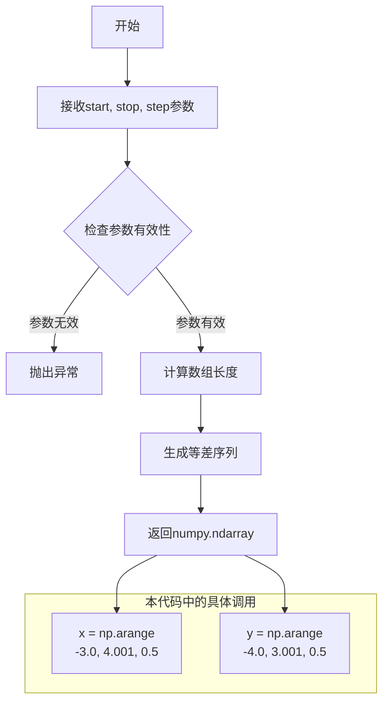

#### 带注释源码

```python
# 使用 np.arange 生成 x 轴坐标数组
# 起始值: -3.0, 结束值: 4.001, 步长: 0.5
# 生成结果: [-3.0, -2.5, -2.0, -1.5, -1.0, -0.5, 0.0, 0.5, 1.0, 1.5, 2.0, 2.5, 3.0, 3.5, 4.0]
x = np.arange(-3.0, 4.001, delta)

# 使用 np.arange 生成 y 轴坐标数组
# 起始值: -4.0, 结束值: 3.001, 步长: 0.5
# 生成结果: [-4.0, -3.5, -3.0, -2.5, -2.0, -1.5, -1.0, -0.5, 0.0, 0.5, 1.0, 1.5, 2.0, 2.5, 3.0]
y = np.arange(-4.0, 3.001, delta)

# 用途说明：
# 1. x 和 y 数组用于创建 meshgrid，生成网格化的二维坐标点
# 2. 结束值略大于目标范围（如4.001而非4.0），确保包含端点
# 3. 生成的坐标数组用于计算 Z1、Z2 和最终的 Z 矩阵
```


### `np.meshgrid`

`np.meshgrid` 是 NumPy 库中的一个核心函数，用于从一维坐标数组创建二维或三维坐标网格矩阵。该函数在科学计算和可视化中广泛应用，特别适合生成网格点坐标以支持等高线图、曲面图等二维或三维图形的绘制。

参数：

-  `xi`：`array_like`，一维数组，表示第一个维度的坐标（如 x 坐标）
-  `yi`：`array_like`，一维数组（可选），表示第二个维度的坐标（如 y 坐标）
-  `zi`：`array_like`（可选），表示第三个维度的坐标（如 z 坐标）
-  `indexing`：`{'xy', 'ij'}`，默认为 `'xy'`，指定输出数组的索引顺序；`'xy'` 表示笛卡尔坐标系（先列后行），`'ij'` 表示矩阵索引（先行后列）
-  `sparse`：`bool`，默认为 `False`，若为 `True`，则返回稀疏网格以节省内存
-  `copy`：`bool`，默认为 `False`，若为 `True`，则返回网格的副本而非视图

返回值：`tuple of ndarrays`，返回由坐标数组组成的元组。对于二维网格，返回 `(X, Y)` 两个二维数组；对于三维网格，返回 `(X, Y, Z)` 三个三维数组。每个数组的形状取决于 `indexing` 参数：使用 `'xy'` 时，形状为 `(len(y), len(x))`；使用 `'ij'` 时，形状为 `(len(x), len(y))`。

#### 流程图

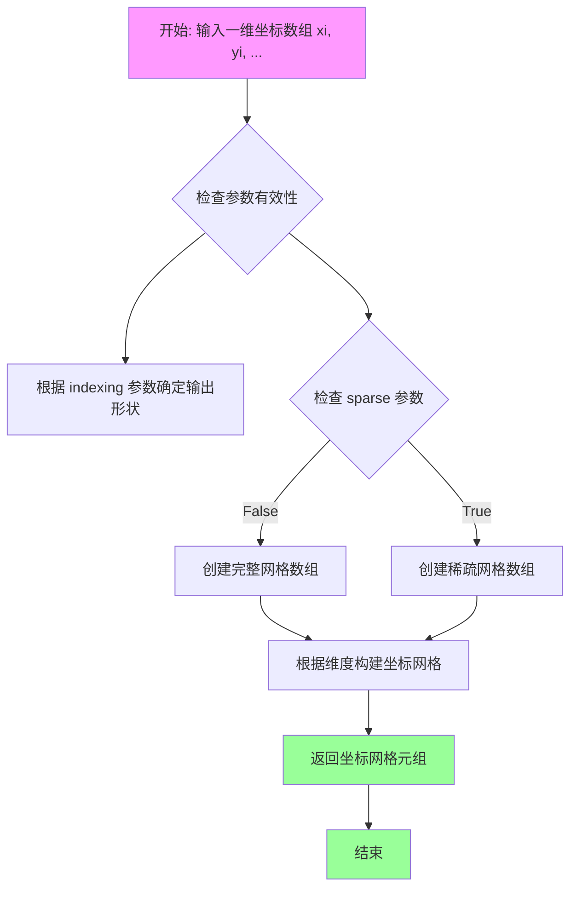

#### 带注释源码

```python
def meshgrid(xi, yi=None, zi=None, indexing='xy', sparse=False, copy=True):
    """
    从坐标数组创建网格矩阵。
    
    参数:
        xi: array_like
            第一个维度的一维坐标数组
        yi: array_like, optional
            第二个维度的一维坐标数组
        zi: array_like, optional
            第三个维度的一维坐标数组
        indexing: {'xy', 'ij'}, default 'xy'
            'xy': 笛卡尔坐标系输出，shape 为 (len(y), len(x))
            'ij': 矩阵索引输出，shape 为 (len(x), len(y))
        sparse: bool, default False
            若为 True，返回稀疏网格以节省内存
        copy: bool, default False
            若为 True，返回网格副本而非视图
    
    返回:
        tuple of ndarray
            坐标网格数组元组
    """
    # 将输入转换为 ndarray
    xi = np.asarray(xi)
    if yi is not None:
        yi = np.asarray(yi)
    if zi is not None:
        zi = np.asarray(zi)
    
    # 确定输出的索引顺序
    if indexing == 'xy':
        # 笛卡尔坐标系：第一个数组沿列方向重复，行方向扩展
        # 第二个数组沿行方向重复，列方向扩展
        for i, x in enumerate([xi, yi, zi]):
            if len(x.shape) != 1:
                raise ValueError("输入必须是1-D数组")
    elif indexing == 'ij':
        # 矩阵索引：与 xy 相反
        pass
    else:
        raise ValueError("indexing 必须是 'xy' 或 'ij'")
    
    # 构建网格坐标
    # 使用 broadcast_arrays 确保维度兼容
    if indexing == 'xy':
        # X 的 shape: (len(y), len(x), 1, ...)
        # Y 的 shape: (len(y), len(x), 1, ...)
        shape = (len(yi), len(xi))
    else:
        shape = (len(xi), len(yi))
    
    # 使用 np.ogrid 或 np.meshgrid 内部实现
    # 这里简化展示核心逻辑
    if sparse:
        # 稀疏模式：只保留必要维度
        if indexing == 'xy':
            X = xi[np.newaxis, :]
            Y = yi[:, np.newaxis]
        else:
            X = xi[:, np.newaxis]
            Y = yi[np.newaxis, :]
        return (X, Y) if yi is not None else (X,)
    
    # 完整网格模式
    if indexing == 'xy':
        # np.repeat + np.tile 或广播机制
        X = np.repeat(xi[np.newaxis, :], len(yi), axis=0)
        Y = np.repeat(yi[:, np.newaxis], len(xi), axis=1)
    else:
        X = np.repeat(xi[:, np.newaxis], len(yi), axis=1)
        Y = np.repeat(yi[np.newaxis, :], len(xi), axis=0)
    
    if copy:
        X = X.copy()
        Y = Y.copy()
    
    return (X, Y)
```


### `np.exp`

计算输入数组的指数函数（e^x），用于生成高斯（正态）分布数据。在本代码中用于创建两个高斯分布的叠加效果。

参数：

- `x`：`ndarray`，输入数组，通常为二维网格数据（如 `-X**2 - Y**2` 或 `-(X - 1)**2 - (Y - 1)**2`），表示指数的幂次

返回值：`ndarray`，返回输入数组每个元素的指数值（即 e 的 x 次方）

#### 流程图

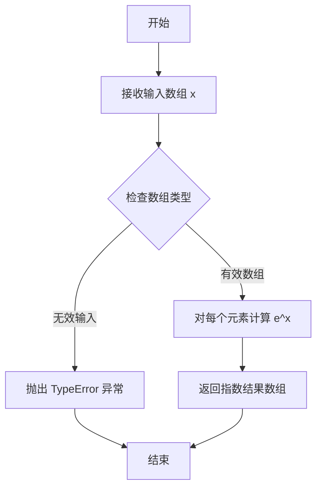

#### 带注释源码

```python
# 创建第一个高斯分布（中心在原点）
# np.exp 计算 e 的 (-X**2 - Y**2) 次方
# 这是一个二维高斯函数，中心在 (0, 0)
Z1 = np.exp(-X**2 - Y**2)

# 创建第二个高斯分布（中心在 (1, 1)）
# 通过平移变量 (X-1) 和 (Y-1) 实现中心偏移
# 同样使用 np.exp 计算指数
Z2 = np.exp(-(X - 1)**2 - (Y - 1)**2)

# 将两个高斯分布相减并乘以2
# 得到一个具有正负峰值的高斯差值图
Z = (Z1 - Z2) * 2
```

#### 详细说明

在 `matplotlib` 的等高线图像示例中，`np.exp` 的作用是生成高斯分布（正态分布）的二维数据：

1. **数学原理**：高斯函数的指数形式为 $e^{-(x^2 + y^2)}$，其值在原点最大，随距离衰减
2. **应用场景**：
   - `Z1` 创建标准高斯分布（峰值在原点）
   - `Z2` 创建偏移高斯分布（峰值在 (1,1)）
3. **数据用途**：生成的 Z 数据用于绘制等高线图和填充等高线图，展示正负区域的分布

#### 关键参数示例

| 表达式 | 描述 | 峰值位置 |
|--------|------|----------|
| `-X**2 - Y**2` | 标准二维高斯 | (0, 0) |
| `-(X-1)**2 - (Y-1)**2` | 平移二维高斯 | (1, 1) |


### `plt.subplots`

`plt.subplots` 是 matplotlib.pyplot 模块中的核心函数，用于创建一个图形（Figure）和一个包含多个子图（Axes）的数组，简化子图网格的创建过程，支持灵活的行列布局配置。

参数：

- `nrows`：`int`，默认值 1，子图网格的行数
- `ncols`：`int`，默认值 1，子图网格的列数
- `sharex`：`bool` 或 `{'none', 'all', 'row', 'col'}`，默认值 False，控制 x 轴是否在子图之间共享
- `sharey`：`bool` 或 `{'none', 'all', 'row', 'col'}`，默认值 False，控制 y 轴是否在子图之间共享
- `squeeze`：`bool`，默认值 True，如果为 True，则返回的轴数组被压缩为更少的维度
- `subplot_kw`：`dict`，默认值 None，传递给每个子图的关键字参数
- `gridspec_kw`：`dict`，默认值 None，传递给 GridSpec 的关键字参数
- `**fig_kw`：传递给 `figure()` 函数的其他关键字参数，如 `figsize`、`dpi` 等

返回值：`tuple`，包含两个元素
- `fig`：`matplotlib.figure.Figure` 对象，整个图形对象
- `axs`：`numpy.ndarray` 或 `matplotlib.axes.Axes` 对象，子图数组（单行单列时返回单个 Axes 对象）

#### 流程图

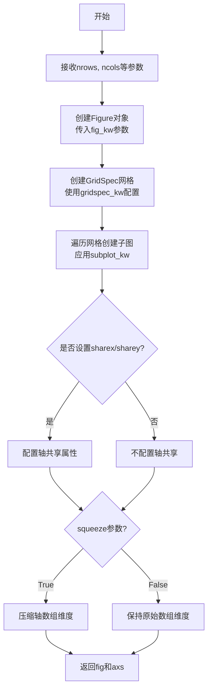

#### 带注释源码

```python
# 代码示例来源：matplotlib 官方文档
# 创建 2x2 的子图布局
fig, _axs = plt.subplots(nrows=2, ncols=2)
fig.subplots_adjust(hspace=0.3)  # 调整子图之间的垂直间距
axs = _axs.flatten()  # 将 2D 数组展平为 1D 数组便于索引

# 第一个子图：填充等高线图
cset1 = axs[0].contourf(X, Y, Z, levels, norm=norm,
                        cmap=cmap.resampled(len(levels) - 1))
cset2 = axs[0].contour(X, Y, Z, cset1.levels, colors='k')
cset2.set_linestyle('solid')  # 设置线型为实线
cset3 = axs[0].contour(X, Y, Z, (0,), colors='g', linewidths=2)
axs[0].set_title('Filled contours')
fig.colorbar(cset1, ax=axs[0])

# 第二个子图：图像 + 等高线，origin='upper'
axs[1].imshow(Z, extent=extent, cmap=cmap, norm=norm)
axs[1].contour(Z, levels, colors='k', origin='upper', extent=extent)
axs[1].set_title("Image, origin 'upper'")

# 第三个子图：图像 + 等高线，origin='lower'
axs[2].imshow(Z, origin='lower', extent=extent, cmap=cmap, norm=norm)
axs[2].contour(Z, levels, colors='k', origin='lower', extent=extent)
axs[2].set_title("Image, origin 'lower'")

# 第四个子图：使用最近邻插值显示像素
im = axs[3].imshow(Z, interpolation='nearest', extent=extent,
                   cmap=cmap, norm=norm)
axs[3].contour(Z, levels, colors='k', origin='image', extent=extent)
ylim = axs[3].get_ylim()
axs[3].set_ylim(ylim[::-1])  # 反转 y 轴
axs[3].set_title("Origin from rc, reversed y-axis")
fig.colorbar(im, ax=axs[3])

fig.tight_layout()  # 自动调整子图布局
plt.show()
```


### `matplotlib.axes.Axes.contourf`

在 matplotlib 中用于在 Axes 对象上绘制填充等高线（Filled Contours），即根据数据 Z 在坐标 (X, Y) 定义的网格上绘制不同数值区间的填充区域，常用于展示二维数据的数值分布和等值线区域。

参数：

- `X`：`numpy.ndarray` 或类似数组，二维数组，表示等高线的 X 坐标，通常通过 `np.meshgrid` 生成
- `Y`：`numpy.ndarray` 或类似数组，二维数组，表示等高线的 Y 坐标，通常通过 `np.meshgrid` 生成
- `Z`：`numpy.ndarray`，二维数组，要绘制等高线的数值数据（高度值），其形状需与 X、Y 对应
- `levels`：`array-like`，可选，用于绘制等高线的数值层级列表，决定填充区域的划分区间
- `norm`：`matplotlib.colors.Normalize`，可选，标准化对象，用于将 Z 值映射到 colormap 的范围
- `cmap`：`str` 或 `Colormap`，可选，颜色映射表，决定填充区域使用的颜色方案
- `alpha`：`float`，可选（代码中未使用），透明度，范围 0-1
- `extend`：`str`，可选（代码中未使用），控制是否在最低和最高层级之外延伸填充区域
- `origin`：`str`，可选（代码中未使用），图像原点位置，如 'upper'、'lower'、'image'
- `extent`：`tuple`，可选（代码中未使用），数据的空间范围 (xmin, xmax, ymin, ymax)

返回值：`matplotlib.contour.QuadContourSet`，返回填充等高线集合对象，包含等高线多边形数据，可用于后续添加颜色条（colorbar）或进一步处理

#### 流程图

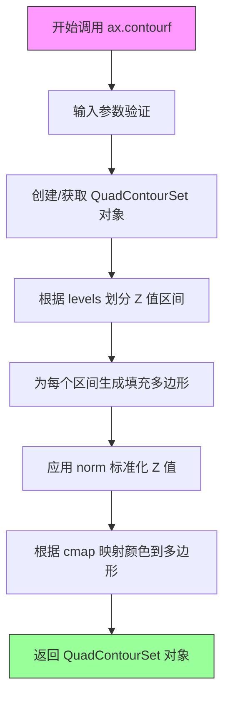

#### 带注释源码

```python
# 示例代码来自 matplotlib contour image demo
# 绘制填充等高线的完整调用示例

# 1. 准备数据：创建网格坐标和要绘制的数值
delta = 0.5  # 网格步长
extent = (-3, 4, -4, 3)  # 空间范围

x = np.arange(-3.0, 4.001, delta)  # X 坐标数组
y = np.arange(-4.0, 3.001, delta)  # Y 坐标数组
X, Y = np.meshgrid(x, y)  # 生成二维网格坐标

# 计算 Z 值（两个高斯分布的差值）
Z1 = np.exp(-X**2 - Y**2)
Z2 = np.exp(-(X - 1)**2 - (Y - 1)**2)
Z = (Z1 - Z2) * 2

# 2. 配置等高线层级和颜色映射
levels = np.arange(-2.0, 1.601, 0.4)  # 等高线层级：-2 到 1.6，步长 0.4

# 创建标准化对象：将 Z 值映射到 [vmin, vmax] 范围
norm = cm.colors.Normalize(vmax=abs(Z).max(), vmin=-abs(Z).max())

# 选择颜色映射表：PRGn（紫-绿渐变，适合正负值区分）
cmap = plt.colormaps["PRGn"]

# 3. 调用 contourf 绘制填充等高线
# 参数说明：
#   X, Y: 网格坐标
#   Z: 数值数据
#   levels: 等高线层级
#   norm: 标准化对象
#   cmap: 颜色映射（重采样以匹配层级数量）
cset1 = axs[0].contourf(
    X,                      # X 坐标（二维数组）
    Y,                      # Y 坐标（二维数组）
    Z,                      # 要等高线化的数值数据
    levels,                 # 等高线层级
    norm=norm,              # 颜色值标准化
    cmap=cmap.resampled(len(levels) - 1)  # 重采样颜色数匹配层级数
)

# 4. 可选：在同一 Axes 上叠加绘制等高线（线条）
cset2 = axs[0].contour(
    X, Y, Z, 
    cset1.levels,  # 使用与填充等高线相同的层级
    colors='k'     # 黑色线条
)

# 设置线条样式为实线（默认虚线用于负值区域）
cset2.set_linestyle('solid')

# 5. 添加颜色条（colorbar）显示数值与颜色的对应关系
fig.colorbar(cset1, ax=axs[0])

# 6. 设置标题
axs[0].set_title('Filled contours')
```


### `Axes.contour`

`Axes.contour` 是 matplotlib 中用于在 Axes 上绘制等高线的方法。该方法接受数据坐标和高度值，生成表示不同 level（高度）位置的等高线，返回一个 `QuadContourSet` 对象，可用于进一步自定义等高线外观或添加标签。

参数：

- `X`：`array-like`，X 轴坐标数据，可以是一维数组（与 Z 的列对应）或二维数组（与 Z 形状相同）。如果省略，则默认为 0 到 (N-1) 的序列，其中 N 是 Z 的列数。
- `Y`：`array-like`，Y 轴坐标数据，可以是一维数组（与 Z 的行对应）或二维数组（与 Z 形状相同）。如果省略，则默认为 0 到 (M-1) 的序列，其中 M 是 Z 的行数。
- `Z`：`array-like`，二维数组，表示每个 (X, Y) 位置的高度值或强度值，这是生成等高线的基础数据。
- `levels`：`array-like`，可选，指定等高线的高度级别列表。默认情况下会自动选择合适的 levels。
- `colors`：`color string or sequence of colors`，可选，等高线的颜色，可以是单个颜色或颜色列表。
- `origin`：`{'upper', 'lower', 'image'}`，可选，控制 Z 数据的原点位置。'upper' 表示 Y 轴向下（图像坐标系），'lower' 表示 Y 轴向上（标准数学坐标系），'image' 表示使用图像的 extent。
- `extent`：`tuple (xmin, xmax, ymin, ymax)`，可选，指定 X 和 Y 的范围，用于将数据映射到图像空间。
- `linewidths`：`float or sequence of floats`，可选，等高线的线宽。
- `linestyles`：`{'solid', 'dashed', ...}`，可选，等高线的线型。
- `alpha`：`float`，可选，透明度（0-1 之间）。

返回值：`matplotlib.contour.QuadContourSet`，包含等高线集合的对象，可用于访问等高线路径、添加标签、设置属性等。

#### 流程图

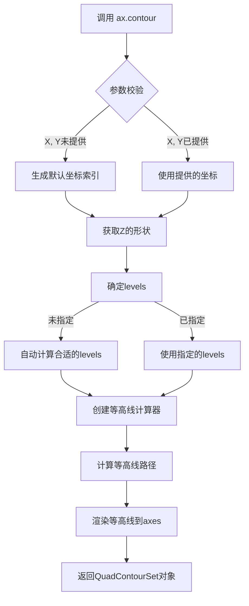

#### 带注释源码

```python
# 从给定的代码中提取的 ax.contour 使用示例

# 示例1：在 axs[0] 上绘制等高线，使用 cset1.levels 确保与填充等高线一致
cset2 = axs[0].contour(X, Y, Z, cset1.levels, colors='k')
# X, Y: meshgrid 生成的坐标数组
# Z: 计算得到的高度数据
# cset1.levels: 从 contourf 获取的 levels，确保等高线与填充区域对齐
# colors='k': 使用黑色绘制等高线
# 返回 QuadContourSet 对象 cset2

# 设置线型为实线（默认是虚线用于负值区域）
cset2.set_linestyle('solid')

# 示例2：绘制零值等高线（绿色粗线）
cset3 = axs[0].contour(X, Y, Z, (0,), colors='g', linewidths=2)
# (0,): 只绘制值为0的等高线，作为一个元组传入
# colors='g': 绿色
# linewidths=2: 线宽为2

# 示例3：在图像上方叠加等高线，origin='upper'
axs[1].contour(Z, levels, colors='k', origin='upper', extent=extent)
# Z: 直接传入二维数组
# levels: 预定义的 levels 数组
# origin='upper': 原点在上方（图像坐标系）
# extent: 指定坐标范围 (-3, 4, -4, 3)

# 示例4：origin='lower'，Y轴向上
axs[2].contour(Z, levels, colors='k', origin='lower', extent=extent)

# 示例5：origin='image'，使用图像的origin设置
axs[3].contour(Z, levels, colors='k', origin='image', extent=extent)
```


### `matplotlib.axes.Axes.imshow`

在 matplotlib 中，`imshow` 是 Axes 对象的方法，用于在坐标轴上绘制二维图像或数据矩阵。该方法支持多种参数来控制图像的显示方式，包括颜色映射、归一化、插值方法、原点位置和坐标范围等，最终返回一个 `AxesImage` 对象，可用于进一步操作（如添加颜色条）。

参数：

- `X`：array-like，要显示的图像数据，可以是二维数组（灰度）或三维数组（RGB/RGBA）
- `cmap`：str 或 `Colormap`，可选，默认值取决于参数，默认使用 `rcParams["image.cmap"]`。用于映射数据值到颜色的颜色映射
- `norm`：`Normalize`，可选，用于归一化数据值的对象。如果提供，会覆盖 `vmin` 和 `vmax`
- `aspect`：float 或 'auto'，可选，控制图像的纵横比。默认为 'equal'，即每个像素为正方形
- `interpolation`：str，可选，指定图像的插值方法。常见值包括 'nearest'（最近邻）、'bilinear'、'bicubic' 等
- `origin`：{'upper', 'lower', 'image'}，可选，控制图像的原点位置。'upper' 表示左上角为 (0,0)，'lower' 表示左下角为 (0,0)
- `extent`：tuple，可默认值 None，指定图像在数据坐标中的范围，格式为 (xmin, xmax, ymin, ymax)
- `vmin, vmax`：float，可选，当未提供 `norm` 时，用于设置颜色映射的最小值和最大值
- `alpha`：float，可选，图像的透明度，范围从 0（完全透明）到 1（完全不透明）
- `filternorm`：bool，可选，默认值为 True，用于控制滤波归一化
- `filterrad`：float，可选，滤波器半径，仅适用于 'gaussian' 和 'sinc' 等插值方法
- `resample`：bool，可选，是否使用重采样
- `url`：str，可选，设置 данной图像对应的 URL

返回值：`matplotlib.image.AxesImage`，返回表示显示图像的图像对象，可用于获取图像数据、设置属性（如颜色条）等后续操作

#### 流程图

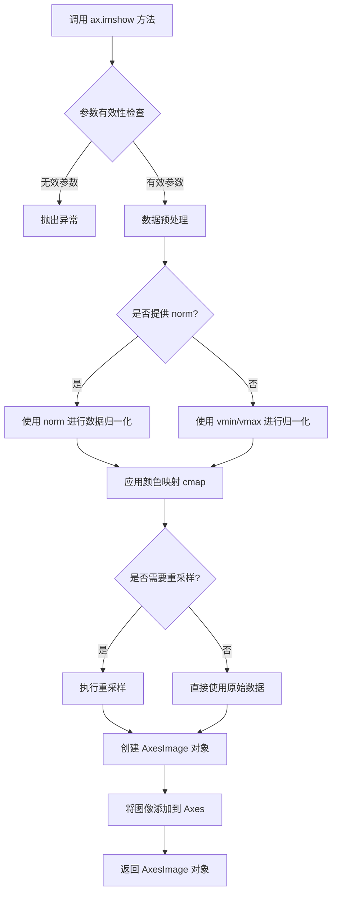

#### 带注释源码

```python
# 代码中 imshow 的实际调用示例

# 第一次调用：axs[1] 的 imshow
axs[1].imshow(Z,               # Z 是二维 numpy 数组，包含要显示的图像数据
              extent=extent,  # extent 指定图像在坐标轴上的范围 (-3, 4, -4, 3)
              cmap=cmap,      # cmap 是颜色映射对象 (PRGn 调色板)
              norm=norm)      # norm 是归一化对象，设定 vmax 和 vmin

# 第二次调用：axs[2] 的 imshow，指定 origin='lower'
axs[2].imshow(Z,               # Z 是二维 numpy 数组
              origin='lower', # 设置原点为左下角 (0,0)
              extent=extent,  # 图像范围
              cmap=cmap,      # 颜色映射
              norm=norm)      # 归一化对象

# 第三次调用：axs[3] 的 imshow，使用最近邻插值
axs[3].imshow(Z,                   # Z 是二维 numpy 数组
              interpolation='nearest',  # 使用最近邻插值，显示实际像素
              extent=extent,            # 图像范围
              cmap=cmap,                # 颜色映射
              norm=norm)                # 归一化对象
```


### `Axes.set_title`

设置子图（Axes）的标题文本，用于为图表的子图添加标题标签。

参数：

- `label`：`str`，要显示的标题文本内容
- `fontdict`：`dict`，可选，用于控制标题文本样式的字典（如字体大小、颜色、字体权重等）
- `loc`：`str`，可选，标题的对齐方式，可选值为 `'center'`（默认）、`'left'` 或 `'right'`
- `pad`：`float`，可选，标题与子图顶部的间距（以点为单位），默认为无
- `**kwargs`：其他可选参数，用于传递给 `matplotlib.text.Text` 对象的属性，如 `fontsize`、`fontweight`、`color` 等

返回值：`matplotlib.text.Text`，返回创建的标题文本对象，可用于后续进一步修改样式或获取属性

#### 流程图

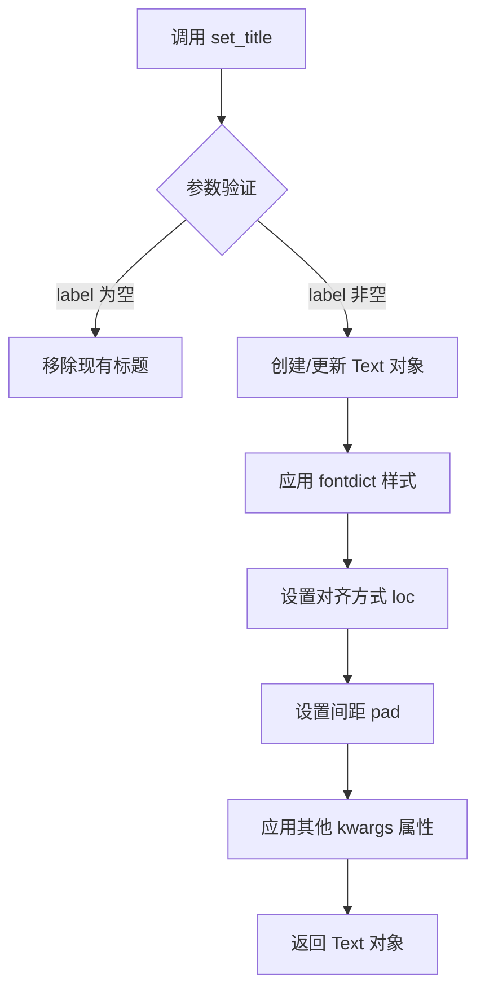

#### 带注释源码

```python
# 示例代码来自 matplotlib 官方示例
# 调用 set_title 设置子图标题

# 为第一个子图设置标题
axs[0].set_title('Filled contours')

# 为第二个子图设置标题（带位置参数）
axs[1].set_title("Image, origin 'upper'")

# 为第三个子图设置标题
axs[2].set_title("Image, origin 'lower'")

# 为第四个子图设置标题
axs[3].set_title("Origin from rc, reversed y-axis")

# 更多高级用法示例（扩展说明）:
# ax.set_title('Title', fontsize=12, fontweight='bold', color='red')
# ax.set_title('Left Aligned', loc='left', pad=20)
# ax.set_title('Custom Style', fontdict={'fontsize': 14, 'fontweight': 'bold'})
```

#### 方法详解

| 参数名 | 类型 | 说明 |
|--------|------|------|
| label | str | 标题显示的文本内容 |
| fontdict | dict | 文本样式字典，可包含 fontsize、fontweight、color、ha、va 等 |
| loc | str | 水平对齐方式：'center'、'left'、'right' |
| pad | float | 标题与子图顶部的距离（单位：点） |
| **kwargs | any | 传递给 Text 对象的任意属性 |

#### 使用场景

在给定的代码示例中，`set_title` 方法用于：
1. 为每个子图添加描述性标题，说明该子图展示的内容类型
2. 区分不同子图的功能（如"Filled contours"、"Image, origin 'upper'"等）
3. 帮助读者理解图表的各个部分表示的含义

#### 注意事项

- 如果多次调用 `set_title`，后续调用会覆盖之前的标题
- 返回的 Text 对象可以进一步自定义样式
- 标题位置可能受 `rcParams` 中相关设置的影响


### `matplotlib.axes.Axes.set_ylim`

`set_ylim` 是 matplotlib 中 Axes 类的一个方法，用于设置 Axes 对象的 Y 轴显示范围（ymin 和 ymax），可选择是否触发自动缩放和视图更新回调。

参数：

- `bottom`：`float` 或 `None`，Y 轴范围的底部边界值
- `top`：`float` 或 `None`，Y 轴范围的顶部边界值
- `emit`：`bool`，默认为 `True`，是否向观察者发送视图更改通知
- `auto`：`bool`，默认为 `False`，是否允许自动缩放
- `ymin`：`float`，已废弃参数，等同于 `bottom`
- `ymax`：`float`，已废弃参数，等同于 `top`

返回值：`tuple of Artist`，返回一个包含两个 `YLim` 对象的元组，分别表示新的 Y 轴下限和上限

#### 流程图

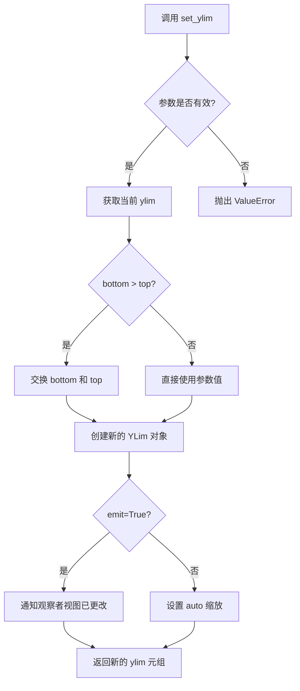

#### 带注释源码

```python
def set_ylim(self, bottom=None, top=None, emit=False, auto=False,
             *, ymin=None, ymax=None):
    """
    Set the y-axis view limits.
    
    Parameters
    ----------
    bottom : float, optional
        The bottom ylim in data coordinates. Passing *None* leaves the
        limit unchanged.
    top : float, optional
        The top ylim in data coordinates. Passing *None* leaves the
        limit unchanged.
    emit : bool, default: False
        Whether to notify observers of limit change.
    auto : bool, default: False
        Whether to turn on autoscaling after the limit is changed.
        The *bottom*, and *top* limits otherwise set the scaling.
    ymin, ymax : float, optional
        These arguments are deprecated and will be removed in a future
        version. Use *bottom* and *top* instead.
    
    Returns
    -------
    bottom, top : tuple
        The new y-axis limits in data coordinates.
    
    Notes
    -----
    The *bottom* and *top* kwargs may be passed as keywords and will
    be used to calculate the scaling.  However, the preferred way to
    specify the scaling is to pass the scaling factors explicitly as
    *bottom* and *top*.
    """
    # 兼容旧版本参数 ymin/ymax
    if ymin is not None:
        warnings.warn("The 'ymin' argument to set_ylim is deprecated "
                      "and has no effect. Use 'bottom' instead.",
                      mplDeprecation)
    if ymax is not None:
        warnings.warn("The 'ymax' argument to set_ylim is deprecated "
                      "and has no effect. Use 'top' instead.",
                      mplDeprecation)
    
    # 获取当前轴限制
    old_bottom, old_top = self.get_ylim()
    
    # 设置默认值：如果参数为 None，则使用当前值
    if bottom is None:
        bottom = old_bottom
    if top is None:
        top = old_top
    
    # 如果 bottom > top，自动交换它们（与 matplotlib 的兼容性）
    if bottom > top:
        bottom, top = top, bottom
    
    # 创建新的限制元组
    self._ylim = (bottom, top)
    
    # 如果 emit 为 True，则通知观察者（触发 'ylims_change' 事件）
    if emit:
        self._request_autoscale_view()
    
    # 如果 auto 为 True，则启用自动缩放
    if auto:
        self.set_autoscale_on(True)
    
    # 返回新的限制值（作为 Artist 对象包装）
    return self._ylim
```

#### 关键组件信息

| 组件名称 | 一句话描述 |
|---------|-----------|
| `Axes._ylim` | 存储 Y 轴上下限的内部元组属性 |
| `Axes.get_ylim()` | 获取当前 Y 轴范围的配套方法 |
| `_request_autoscale_view()` | 请求自动缩放视图的内部方法 |
| `YLim` | 表示单个轴限的 Artist 子类对象 |

#### 潜在技术债务或优化空间

1. **参数冗余**：`ymin` 和 `ymax` 参数已废弃但仍保留，造成 API 冗余
2. **隐式行为**：`bottom > top` 时自动交换可能导致用户意图不明确
3. **文档一致性**：`emit` 参数默认值在文档中不一致（代码中为 False，文档描述可能不同）
4. **错误处理**：缺少对 `bottom` 和 `top` 类型的运行时检查（非数值类型未明确处理）

#### 其它项目

**设计目标与约束**：
- 保持与 MATLAB 的兼容性（自动交换 bottom/top）
- 支持灵活的轴范围设置同时保持向后兼容

**错误处理与异常设计**：
- 当传入无效数值类型时可能抛出 TypeError
- 废弃参数会发出 DeprecationWarning 但仍执行（向后兼容）

**数据流与状态机**：
- 修改 `self._ylim` 属性会触发 Axes 对象的重绘
- `emit=True` 时会触发 `autoscale_view` 的重新计算

**外部依赖与接口契约**：
- 依赖于 `matplotlib.artist.Artist` 基类
- 与 `set_xlim` 方法有相同的接口设计模式
- 与 `autoscale_view()` 方法有状态依赖关系


### fig.colorbar

为图形添加颜色条（colorbar），用于显示颜色映射与数值之间的对应关系，常与等高线图或图像配合使用以展示数据的数值范围。

参数：

- `mappable`：<class 'matplotlib.cm.ScalarMappable'>，要添加颜色条的可映射对象，如等高线集合（contourf返回的FilledContourSet）或图像（imshow返回的AxesImage）
- `ax`：<class 'matplotlib.axes.Axes'>（可选），指定颜色条所属的坐标轴，默认为当前活跃的坐标轴
- `cax`：<class 'matplotlib.axes.Axes'>（可选），指定绘制颜色条的坐标轴
- `use_gridspec`：<class 'bool'>（可选），如果为True且未指定cax，则使用gridspec创建新的坐标轴

返回值：<class 'matplotlib.colorbar.Colorbar'>，颜色条对象，可用于进一步自定义颜色条的外观和行为

#### 流程图

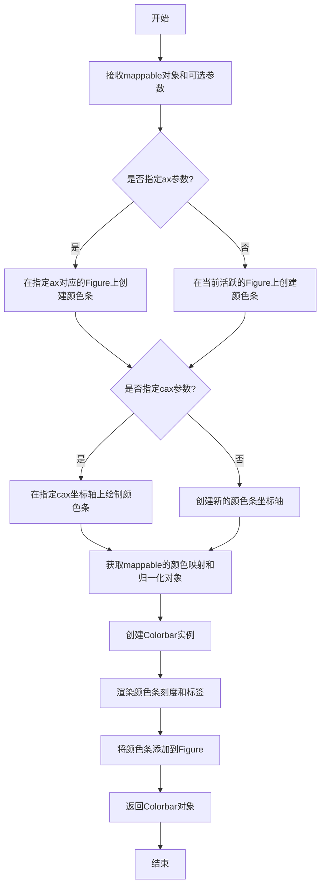

#### 带注释源码

```python
# 代码中的第一次调用：为填充等高线图添加颜色条
# cset1 是 contourf 返回的 FilledContourSet 对象
# ax=axs[0] 指定颜色条添加到第一个子图
fig.colorbar(cset1, ax=axs[0])

# 代码中的第二次调用：为图像添加颜色条
# im 是 imshow 返回的 AxesImage 对象
# ax=axs[3] 指定颜色条添加到第四个子图
fig.colorbar(im, ax=axs[3])

# 内部实现原理（简化说明）：
# 1. colorbar方法接收一个ScalarMappable对象（包含colormap和norm信息）
# 2. 根据ax参数确定在哪个子图旁边放置颜色条
# 3. 创建一个新的坐标轴用于显示颜色条
# 4. 使用mappable的cmap和norm创建Colorbar对象
# 5. 在新坐标轴上绘制颜色条，包括：
#    - 颜色梯度（根据cmap）
#    - 刻度线
#    - 刻度标签（显示数值）
#    - 颜色条标题（可选）
# 6. 返回Colorbar对象供进一步自定义
```


### `Figure.subplots_adjust`

调整matplotlib图中子图之间的间距，用于控制子图的布局和相互之间的空白区域。

参数：

- `left`：`float`，子图区域左侧边缘相对于图形宽度的位置（0.0-1.0）
- `right`：`float`，子图区域右侧边缘相对于图形宽度的位置（0.0-1.0）
- `bottom`：`float`，子图区域底部边缘相对于图形高度的位置（0.0-1.0）
- `top`：`float`，子图区域顶部边缘相对于图形高度的位置（0.0-1.0）
- `wspace`：`float`，子图之间宽度方向的间距，相对于子图平均宽度
- `hspace`：`float`，子图之间高度方向的间距，相对于子图平均高度

返回值：`None`，该方法直接修改Figure对象的布局，不返回任何值

#### 流程图

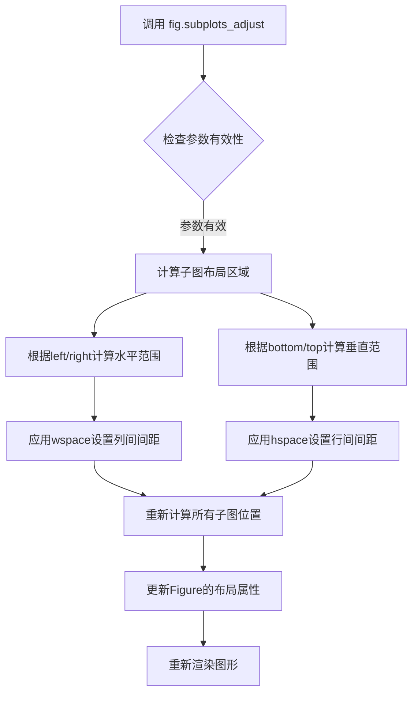

#### 带注释源码

```python
# 创建2x2的子图网格
fig, _axs = plt.subplots(nrows=2, ncols=2)

# 调整子图之间的间距
# hspace=0.3 表示子图之间的高度间距为子图平均高度的30%
fig.subplots_adjust(hspace=0.3)

# 将axs转换为flattened数组以便索引
axs = _axs.flatten()

# 后续代码使用axs[0], axs[1], axs[2], axs[3]访问各个子图
# 并在每个子图上绘制不同的可视化内容
```

#### 详细说明

在给定的代码中，`subplots_adjust`方法被调用来设置子图之间的垂直间距（hspace）。代码中只使用了`hspace`参数，将子图行之间的间距设置为0.3（即子图平均高度的30%）。这个调整是在创建子图之后、填充内容之前进行的，确保子图之间有适当的间距以便更好地展示数据。

该方法的其他参数（left、right、bottom、top、wspace）使用默认值，允许子图充分利用Figure的可用空间。


### `Figure.tight_layout`

该方法用于自动调整图形中子图的参数，使子图填充整个图形区域，并留出适当的边距空间，避免子图之间以及子图与图形边缘之间的重叠。

参数：

- `self`：`matplotlib.figure.Figure`，调用该方法的图形对象实例
- `pad`：`float`，图形边缘与子图之间的间距（相对于字体大小），默认为1.08
- `h_pad`：`float | None`，子图之间的垂直间距，默认为pad
- `w_pad`：`float | None`，子图之间的水平间距，默认为pad
- `rect`：`tuple`，指定整个子图区域的规范化坐标 (left, bottom, right, top)，默认为 (0, 0, 1, 1)

返回值：`None`，该方法直接修改图形布局，无返回值

#### 流程图

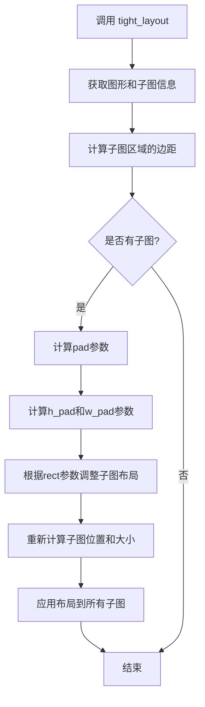

#### 带注释源码

```python
# 在代码中的调用位置：
fig.tight_layout()

# 完整方法签名（参考matplotlib官方文档）：
# fig.tight_layout(pad=1.08, h_pad=None, w_pad=None, rect=(0, 0, 1, 1))

# pad=1.08: 设置图形边缘与子图之间的间距为1.08（相对于字体大小的倍数）
# h_pad=None: 垂直间距使用默认pad值
# w_pad=None: 水平间距使用默认pad值
# rect=(0, 0, 1, 1): 子图区域覆盖整个图形区域

# 该方法的具体功能：
# 1. 获取当前图形的所有子图Axes对象
# 2. 根据pad、h_pad、w_pad参数计算子图之间的最小间距
# 3. 根据rect参数确定子图的整体区域边界
# 4. 重新计算并调整每个子图的位置和大小
# 5. 确保子图之间以及子图与图形边缘之间不发生重叠
# 6. 同时保留足够的空间用于显示轴标签、标题和色条等元素
```

#### 实际代码上下文

```python
# 创建2x2的子图布局
fig, _axs = plt.subplots(nrows=2, ncols=2)
fig.subplots_adjust(hspace=0.3)  # 手动调整子图垂直间距
axs = _axs.flatten()

# 在四个子图上分别绘制不同的等高线图像组合
# ... (绘图代码省略)

# 调用tight_layout自动调整布局
# 这会根据子图中的内容（标题、轴标签、色条等）自动计算最佳间距
fig.tight_layout()

# 显示最终图形
plt.show()
```

#### 技术说明

| 特性 | 说明 |
|------|------|
| 调用对象 | matplotlib.figure.Figure 实例 |
| 作用时机 | 在所有子图内容绘制完成后、显示前调用 |
| 与subplots_adjust的关系 | tight_layout是自动化的布局调整，subplots_adjust是手动精细控制 |
| 注意事项 | 调用后若再添加元素（如colorbar），可能需要重新调用 |

#### 潜在优化建议

1. **多次调用开销**：如果在调用tight_layout后添加colorbar，建议在colorbar添加后再次调用tight_layout以获得最佳效果
2. **复杂布局场景**：对于具有复杂嵌套子图的布局，可能需要结合GridSpec进行更精细的控制
3. **性能考虑**：对于实时动画或频繁重绘的场景，tight_layout的计算可能带来一定开销，此时可考虑预计算布局参数


### `matplotlib.pyplot.show` (plt.show)

该函数是 Matplotlib 视觉化的终端操作，用于显示通过 `Figure` 对象创建的图形。对于支持图形界面的后端（如 Tk、Qt），它会启动事件循环并通常阻塞程序执行（除非设置 `block=False`）；对于非交互式后端（如 Agg），它主要执行渲染和输出操作。

参数：
- `block`：`bool`，可选参数。默认值为 `True`。如果设置为 `False`，则不会阻塞主线程，这在交互式环境（如 Jupyter Notebook）或需要后台运行脚本时非常有用。

返回值：`None`，无返回值。

#### 流程图

```mermaid
graph TD
    A([调用 plt.show()]) --> B{当前后端是否为交互式?}
    B -- 是 (如 Tk, Qt, Gtk) --> C[启动 GUI 事件循环]
    B -- 否 (如 Agg, SVG) --> D[执行渲染/保存操作]
    
    C --> E{block=True?}
    D --> E
    
    E -- Yes --> F[阻塞主线程]
    F --> G[等待用户交互<br/>关闭图形窗口]
    G --> H[释放控制权]
    
    E -- No --> I[非阻塞<br/>立即返回控制权]
    
    H --> J([结束])
    I --> J
    D --> J
```

#### 带注释源码

```python
# ... 之前的代码构建了 2x2 的子图布局 ...
fig.tight_layout()

# 核心函数调用：
# 1. 刷新所有 Figure 的画布缓冲区。
# 2. 如果是交互式后端，弹出窗口并显示图形。
# 3. 如果是阻塞模式（默认），程序将在此行暂停，等待用户关闭窗口。
plt.show() 
```


## 关键组件


### 数据网格生成 (X, Y, Z)

使用numpy的arange和meshgrid函数生成了二维网格数据，用于后续的等高线图和图像绘制。Z值由两个高斯函数的差值乘以2得到。

### 归一化器 (Normalize)

使用matplotlib.colors.Normalize创建归一化对象，设置vmax和vmin为Z绝对值的最大和最小负值，确保色彩映射对称。

### 色彩映射 (Colormap)

使用plt.colormaps["PRGn"]获取Purple-Green配色方案，用于区分正负值区域，并通过resampled方法调整离散级别数。

### 填充等高线 (contourf)

使用contourf绘制填充等高线图，将Z值按照levels定义的区间进行颜色填充，返回Collection对象用于后续操作。

### 等高线线条 (contour)

使用contour绘制等高线线条，通过set_linestyle将负值区域的虚线改为实线，并单独绘制零值等高线为粗绿色线条。

### 图像显示 (imshow)

使用imshow在子图上显示Z数据矩阵，支持origin参数控制图像原点位置（upper/lower/image），extent参数控制坐标范围。

### 颜色条 (colorbar)

使用fig.colorbar为填充等高线和图像添加颜色条，展示数值与颜色的对应关系，便于解读数据。


## 问题及建议


### 已知问题

-   **Jupyter魔法命令兼容性**：代码中使用 `# %%` 作为单元分隔符，这是Jupyter Notebook的魔法命令，在标准Python脚本中无法执行，会导致语法错误
-   **硬编码参数缺乏灵活性**：所有关键参数（delta、extent、levels等）均采用硬编码方式，限制了代码的可重用性和可配置性
-   **未充分利用的绘图对象**：变量 `cset2` 和 `cset3` 在创建后仅用于设置线条样式（`set_linestyle`），未进行进一步的定制或利用，造成资源浪费
-   **冗余的colormap重采样**：注释承认进行colormap重采样是为了避免离散化错误，但这种做法增加了不必要的复杂度
-   **重复代码模式**：四个子图的创建过程存在大量重复代码（设置norm、cmap、extent等），违反DRY原则
-   **数值精度问题**：levels数组使用 `np.arange(-2.0, 1.601, 0.4)` 生成，注释中提到需要"Boost the upper limit to avoid truncation errors"，说明存在数值精度处理的技术细节
-   **不一致的API使用**：颜色映射使用 `plt.colormaps["PRGn"]` 语法，不如传统的 `plt.get_cmap('PRGn')` 稳定
-   **轴对象解包不规范**：使用 `_axs` 临时变量再展开的写法不够直观

### 优化建议

-   将硬编码参数提取为配置文件或函数参数，提高代码的可配置性
-   定义可复用的绘图函数（如 `create_contour_plot`、`create_image_plot`），消除重复代码
-   移除未使用的绘图对象或明确其用途（如添加到图例）
-   考虑使用 `np.linspace` 替代 `np.arange` 生成更精确的levels数组
-   统一使用 `plt.get_cmap()` API以保证兼容性
-   使用更清晰的变量命名（如直接用 `axs` 替代 `_axs`）
-   如果不需要在Jupyter环境运行，移除 `# %%` 魔法命令


## 其它


### 1. 一段话描述

该代码是matplotlib库的一个演示脚本，主要功能是展示如何在同一图像中组合使用填充等高线（contourf）、线条等高线（contour）和图像显示（imshow），并通过4个子图对比不同origin参数对图像和等高线对齐的影响，同时包含颜色条（colorbar）的配置。

### 2. 文件的整体运行流程

1. 导入必要的库：matplotlib.pyplot、numpy和matplotlib.cm
2. 设置计算参数：delta=0.5用于控制网格精度，extent定义图像范围
3. 生成网格数据：使用np.arange创建x、y坐标，np.meshgrid生成网格，np.exp计算两个高斯分布的差值得到Z数据
4. 定义等高线级别：使用np.arange生成从-2.0到1.6，步长0.4的级别
5. 创建颜色映射：使用Normalize设置归一化，colormaps获取"PRGn"颜色映射
6. 创建2x2子图布局：plt.subplots创建图形和坐标轴，flatten展平为1维数组
7. 绘制第一个子图：填充等高线+线条等高线+颜色条
8. 绘制第二个子图：图像+等高线，origin='upper'
9. 绘制第三个子图：图像+等高线，origin='lower'
10. 绘制第四个子图：使用最近邻插值显示图像像素，等高线origin='image'
11. 调用tight_layout调整布局，plt.show显示图形

### 3. 类的详细信息

本代码未定义自定义类，主要使用matplotlib和numpy的现有类：

**matplotlib.figure.Figure类**
- 用途：整个图形对象容器
- 使用方式：fig, _axs = plt.subplots(nrows=2, ncols=2)

**matplotlib.axes.Axes类**
- 用途：坐标轴对象，用于绘制图形
- 使用方式：通过axs数组访问各个子图

**matplotlib.contour.QuadContourSet类**
- 用途：等高线集合对象
- 使用方式：cset1, cset2, cset3分别为填充和线条等高线对象

**numpy.ndarray类**
- 用途：多维数组容器
- 使用方式：X, Y, Z, levels等数据数组

### 4. 全局变量和全局函数详细信息

#### 4.1 全局变量

| 变量名 | 类型 | 描述 |
|--------|------|------|
| delta | float | 网格步长，控制数据点间距，设为0.5以平衡精度和性能 |
| extent | tuple | 图像显示范围，格式为(left, right, bottom, top)=(-3, 4, -4, 3) |
| x | numpy.ndarray | x轴坐标数组，从-3.0到4.0，步长delta |
| y | numpy.ndarray | y轴坐标数组，从-4.0到3.0，步长delta |
| X | numpy.ndarray | 由x和y生成的网格矩阵，用于计算Z值 |
| Y | numpy.ndarray | 由x和y生成的网格矩阵，用于计算Z值 |
| Z1 | numpy.ndarray | 第一个高斯函数 exp(-X²-Y²) 的计算结果 |
| Z2 | numpy.ndarray | 第二个高斯函数 exp(-(X-1)²-(Y-1)²) 的计算结果 |
| Z | numpy.ndarray | 最终数据矩阵，Z1-Z2的2倍，用于绘制等高线 |
| levels | numpy.ndarray | 等高线级别数组，从-2.0到1.6，步长0.4 |
| norm | matplotlib.colors.Normalize | 颜色归一化对象，vmax为Z最大绝对值，vmin为负的最大绝对值 |
| cmap | matplotlib.colors.Colormap | 颜色映射对象，使用"PRGn"调色板（紫-绿渐变） |
| fig | matplotlib.figure.Figure | 整个图形对象，包含所有子图 |
| _axs | numpy.ndarray | 2x2的坐标轴数组 |
| axs | numpy.ndarray | 展平后的坐标轴数组，便于索引访问 |
| cset1 | matplotlib.contour.QuadContourSet | 填充等高线对象 |
| cset2 | matplotlib.contour.QuadContourSet | 线条等高线对象（负值区域） |
| cset3 | matplotlib.contour.QuadContourSet | 零值等高线（绿色粗线） |
| im | matplotlib.image.AxesImage | 图像对象，用于添加颜色条 |

#### 4.2 全局函数

本代码未定义自定义函数，主要调用以下API函数：

| 函数名 | 模块 | 描述 |
|--------|------|------|
| plt.subplots | matplotlib.pyplot | 创建图形和坐标轴数组 |
| ax.contourf | matplotlib.axes | 绘制填充等高线 |
| ax.contour | matplotlib.axes | 绘制线条等高线 |
| ax.imshow | matplotlib.axes | 显示图像 |
| fig.colorbar | matplotlib.figure | 添加颜色条 |
| ax.set_title | matplotlib.axes | 设置子图标题 |
| ax.set_ylim | matplotlib.axes | 设置y轴范围 |
| fig.tight_layout | matplotlib.figure | 自动调整子图布局 |
| np.arange | numpy | 创建等差数组 |
| np.meshgrid | numpy | 生成网格坐标 |
| np.exp | numpy | 计算指数函数 |

### 5. 关键组件信息

| 组件名称 | 描述 |
|----------|------|
| matplotlib.pyplot | Python的2D绘图库，提供类似MATLAB的绘图接口 |
| numpy | Python的数值计算库，用于生成和处理数值数组 |
| matplotlib.cm | 颜色映射模块，提供各种颜色映射和归一化工具 |
| contourf方法 | 填充等高线绘制方法，在等级之间填充颜色 |
| contour方法 | 线条等高线绘制方法，绘制等高线轮廓 |
| imshow方法 | 图像显示方法，用于显示2D数组或图像数据 |
| colorbar组件 | 颜色条组件，显示颜色与数值的对应关系 |
| Normalize类 | 颜色归一化类，将数据值映射到[0,1]范围 |

### 6. 潜在的技术债务或优化空间

1. **硬编码参数问题**：delta、extent、levels等参数直接硬编码在代码中，缺乏灵活性。建议将这些参数提取为配置常量或函数参数。

2. **魔法数字**：如len(levels)-1、0.4步长、2倍系数等数值缺乏明确含义说明，建议添加注释解释或定义为常量。

3. **代码复用不足**：四个子图的绘制逻辑有重复代码，可以抽象为通用函数以提高可维护性。

4. **错误处理缺失**：没有对输入数据进行有效性检查，如Z数组是否为空、levels是否合理等。

5. **文档注释不足**：关键计算步骤（如Z=(Z1-Z2)*2）缺乏数学原理说明。

6. **布局依赖特定值**：set_ylim(ylim[::-1])的翻转操作依赖特定场景，缺乏通用性说明。

### 7. 其它项目

#### 7.1 设计目标与约束

- **目标**：演示等高线与图像的正确对齐方式，展示不同origin参数的效果
- **约束**：使用delta=0.5保证计算速度和数据精度平衡，避免截断误差
- **设计原则**：每个子图独立展示一种配置，便于对比学习

#### 7.2 错误处理与异常设计

- **数值范围处理**：使用abs(Z).max()确保norm的vmax和vmin对称，避免颜色映射不对称
- **离散化误差避免**：colormap使用len(levels)-1个级别，与等高线级别匹配
- **坐标轴范围处理**：第四个子图使用ylim[::-1]手动翻转y轴，展示image origin的特殊处理

#### 7.3 数据流与状态机

- **数据生成流程**：delta → x/y → X/Y → Z1/Z2 → Z → levels
- **绘图流程**：创建画布 → 生成数据 → 绘制等高线 → 绘制图像 → 添加颜色条 → 调整布局
- **状态变化**：无明显状态机，静态绘图一次性完成

#### 7.4 外部依赖与接口契约

- **依赖库**：matplotlib>=3.0, numpy>=1.0
- **API接口**：
  - contourf(X, Y, Z, levels, norm, cmap)：返回QuadContourSet对象
  - contour(X, Y, Z, levels, colors, origin)：返回QuadContourSet对象
  - imshow(Z, extent, cmap, norm, origin, interpolation)：返回AxesImage对象
  - colorbar(mappable, ax)：将颜色条添加到指定坐标轴

#### 7.5 数值计算说明

- **高斯函数**：Z1=exp(-X²-Y²)表示中心在(0,0)的高斯分布
- **高斯函数**：Z2=exp(-(X-1)²-(Y-1)²)表示中心在(1,1)的高斯分布
- **数据合成**：Z=(Z1-Z2)*2产生两个峰之间的差异，零值线位于两峰之间

#### 7.6 可视化效果说明

- **PRGn调色板**：紫-绿渐变，负值显示紫色，正值显示绿色，零值附近为白色
- **origin参数**：upper使图像原点在左上角，lower使原点在左下角，image使等高线与图像坐标一致


    