# `matplotlib\galleries\examples\images_contours_and_fields\contour_label_demo.py` 详细设计文档

这是一个Matplotlib等高线标签演示代码，展示了如何创建等高线图并使用自定义格式化器、字典映射和LogFormatter等高级功能来标注等高线数值。

## 整体流程

```mermaid
graph TD
    A[开始] --> B[定义网格参数delta=0.025]
    B --> C[创建X, Y网格坐标]
C --> D[计算Z1和Z2高斯函数]
D --> E[计算Z = (Z1 - Z2) * 2]
E --> F{演示场景1}
F --> G[创建自定义格式化函数fmt]
G --> H[绘制等高线图并标注]
H --> I{演示场景2}
I --> J[创建字典映射fmt]
J --> K[使用字符串标签标注每隔一个的等高线]
K --> L{演示场景3}
L --> M[使用LogFormatterMathtext]
M --> N[绘制对数刻度等高线并标注]
N --> O[plt.show显示所有图表]
```

## 类结构

```
Python脚本 (非面向对象)
├── 第三方库: matplotlib, numpy
└── 主要功能模块: 等高线绘制与标签
```

## 全局变量及字段


### `delta`
    
网格步长，用于定义坐标网格的分辨率

类型：`float`
    


### `x`
    
X轴坐标数组，由arange生成

类型：`ndarray`
    


### `y`
    
Y轴坐标数组，由arange生成

类型：`ndarray`
    


### `X`
    
网格X坐标，通过meshgrid从x扩展而来

类型：`ndarray`
    


### `Y`
    
网格Y坐标，通过meshgrid从y扩展而来

类型：`ndarray`
    


### `Z1`
    
第一个高斯函数exp(-X^2 - Y^2)的计算结果

类型：`ndarray`
    


### `Z2`
    
第二个高斯函数exp(-(X-1)^2 - (Y-1)^2)的计算结果

类型：`ndarray`
    


### `Z`
    
最终表面数据，由Z1和Z2组合计算得出

类型：`ndarray`
    


### `strs`
    
字符串标签列表，包含first到seventh七个标签

类型：`list`
    


### `fmt`
    
等高线级别到字符串的映射字典，用于自定义标签

类型：`dict`
    


### `matplotlib.contour.Contour.levels`
    
等高线对象的级别数组属性，返回所有等高线的级别值

类型：`ndarray`
    
    

## 全局函数及方法


### `fmt(x)`

一个自定义格式化函数，用于将数值格式化为字符串，移除尾随零（例如 "1.0" 变为 "1"），并在末尾添加百分号。

参数：

-  `x`：`float`，需要格式化的数值

返回值：`str`，格式化后的字符串，末尾带有百分号

#### 流程图

```mermaid
flowchart TD
    A[开始 fmt(x)] --> B[将x格式化为保留1位小数: s = f'{x:.1f}']
    B --> C{s是否以'0'结尾?}
    C -->|是| D[重新格式化: s = f'{x:.0f}']
    C -->|否| E[继续]
    D --> E
    E --> F{plt.rcParams['text.usetex'] == True?}
    F -->|是| G[返回 rf'{s} \%']
    F -->|否| H[返回 f'{s} %']
    G --> I[结束]
    H --> I
```

#### 带注释源码

```python
def fmt(x):
    """
    自定义格式化函数：移除尾随零并添加百分号
    
    参数:
        x (float): 需要格式化的数值
        
    返回:
        str: 格式化后的字符串，末尾带有百分号
    """
    # 步骤1: 将数值格式化为保留1位小数的字符串
    # 例如: 1.2 -> "1.2", 1.0 -> "1.0"
    s = f"{x:.1f}"
    
    # 步骤2: 检查是否以'0'结尾（即是否为整数形式如"1.0"）
    if s.endswith("0"):
        # 步骤3: 重新格式化为整数形式（无小数位）
        # 例如: "1.0" -> "1"
        s = f"{x:.0f}"
    
    # 步骤4: 根据matplotlib的TeX设置返回带百分号的字符串
    # 如果使用LaTeX渲染，使用转义的百分号 \%
    # 否则直接使用 %
    return rf"{s} \%" if plt.rcParams["text.usetex"] else f"{s} %"
```


### `np.arange`

`np.arange()` 是 NumPy 库中的一个函数，用于创建等差数组（arange 是 "array range" 的缩写），返回一个包含从起始值到结束值（不包含）的等差数列的 ndarray。

参数：

- `start`：`float`，起始值，默认为 0
- `stop`：`float`，结束值（不包含）
- `step`：`float`，步长，默认为 1

返回值：`numpy.ndarray`，包含等差数列的数组

#### 流程图

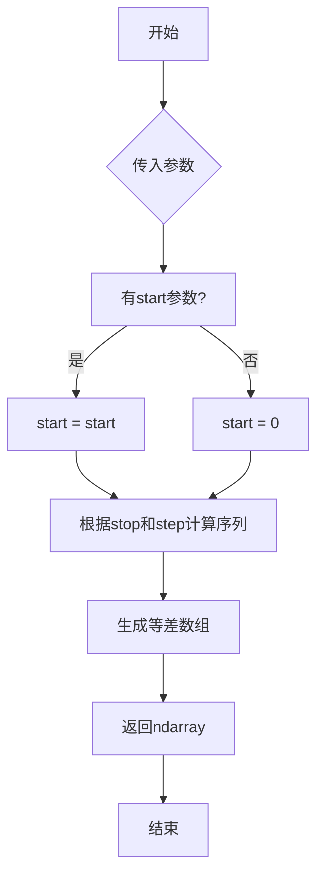

#### 带注释源码

```python
def arange(start=0, stop=None, step=1, dtype=None):
    """
    返回一个等差数组。
    
    参数:
        start: 起始值，默认为0
        stop: 结束值（不包含）
        step: 步长，默认为1
        dtype: 输出数组的数据类型
    
    返回值:
        ndarray: 等差数组
    """
    # 核心实现逻辑
    # 1. 处理参数：start默认为0，stop必须提供
    # 2. 计算数组长度：(stop - start) / step
    # 3. 使用步长生成数组元素
    # 4. 返回numpy.ndarray类型
```

#### 使用示例

```python
# 在给定代码中的实际使用
delta = 0.025
x = np.arange(-3.0, 3.0, delta)  # 从-3.0到3.0，步长0.025
y = np.arange(-2.0, 2.0, delta)  # 从-2.0到2.0，步长0.025
```

#### 关键信息

- **函数位置**：numpy 库的核心函数
- **常见用途**：生成网格坐标、循环索引、序列数据等
- **与 Python range 的区别**：返回的是 ndarray 而非列表，支持浮点数步长


### np.meshgrid

用于从两个一维坐标数组创建网格坐标矩阵的函数。它是NumPy库中用于生成二维或三维网格点的核心函数，常用于评估二维函数在网格上的值、创建等高线图和三维曲面图的基础坐标系统。

参数：

- `x`：`array_like`，一维数组，表示x轴的坐标值
- `y`：`array_like`，一维数组，表示y轴的坐标值

返回值：`tuple of ndarrays`，返回两个二维数组(X, Y)，其中X的每一行是x的副本，Y的每一列是y的副本，组合形成完整的网格坐标

#### 流程图

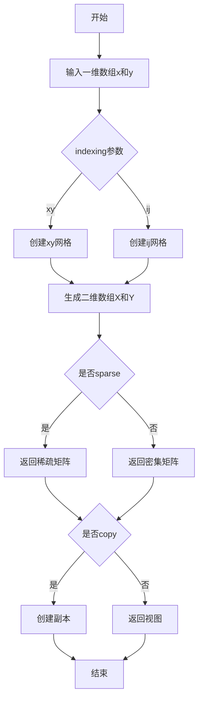

#### 带注释源码

```python
import numpy as np

# 定义x和y坐标数组
x = np.arange(-3.0, 3.0, 0.025)  # 从-3到3，步长0.025的x坐标
y = np.arange(-2.0, 2.0, 0.025)  # 从-2到2，步长0.025的y坐标

# 使用np.meshgrid创建二维网格坐标
# X的shape为(len(y), len(x))，每行是x的重复
# Y的shape为(len(y), len(x))，每列是y的重复
X, Y = np.meshgrid(x, y)

# 验证网格形状
print(f"X shape: {X.shape}")  # 输出: X shape: (160, 240)
print(f"Y shape: {Y.shape}")  # 输出: Y shape: (160, 240)

# 使用网格坐标计算二维函数
Z1 = np.exp(-X**2 - Y**2)  # 第一个高斯函数
Z2 = np.exp(-(X - 1)**2 - (Y - 1)**2)  # 第二个高斯函数，中心在(1,1)
Z = (Z1 - Z2) * 2  # 组合形成最终的高度图
```


### `np.exp`

这是 NumPy 库中的指数函数，用于计算自然常数 e 的 x 次方（e^x）。在代码中，该函数被用于生成两个高斯分布（钟形曲面）的数据，用于后续的等高线绘制。

参数：

- `x`：ndarray 或标量，要计算指数的输入值（可以是数组或单个数值）

返回值：`ndarray`，返回 e 的 x 次方的值，类型与输入相同

#### 流程图

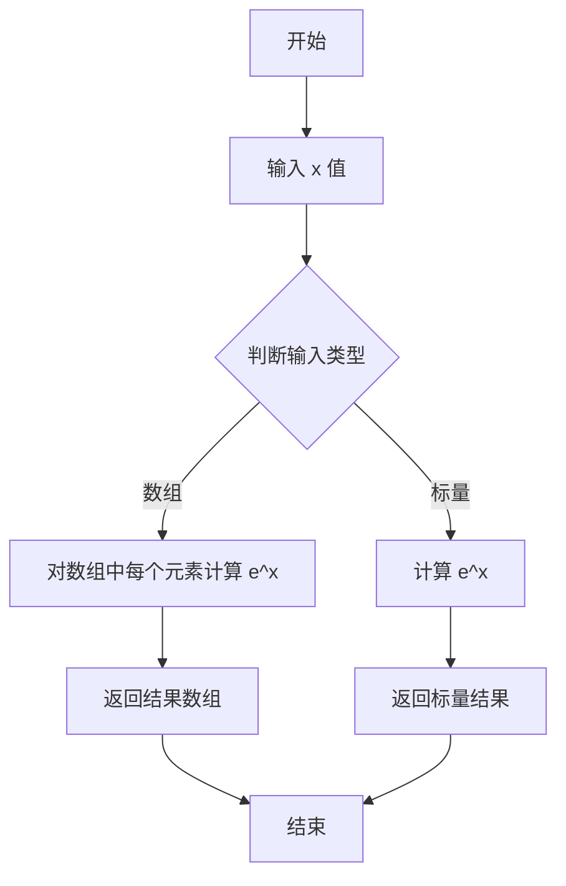

#### 带注释源码

```python
# 定义网格间距
delta = 0.025

# 生成 x 轴坐标范围从 -3.0 到 3.0，步长为 delta
x = np.arange(-3.0, 3.0, delta)

# 生成 y 轴坐标范围从 -2.0 到 2.0，步长为 delta
y = np.arange(-2.0, 2.0, delta)

# 使用 meshgrid 生成二维网格坐标矩阵 X 和 Y
X, Y = np.meshgrid(x, y)

# ===== np.exp() 第一次使用 =====
# 计算 Z1 = exp(-X² - Y²)，生成以 (0,0) 为中心的高斯分布曲面
# np.exp() 计算自然常数 e 的幂次，这里计算 e 的(-X² - Y²)次方
Z1 = np.exp(-X**2 - Y**2)

# ===== np.exp() 第二次使用 =====
# 计算 Z2 = exp(-(X-1)² - (Y-1)²)，生成以 (1,1) 为中心的高斯分布曲面
# 同样使用 np.exp() 计算 e 的(-(X-1)² - (Y-1)²)次方
Z2 = np.exp(-(X - 1)**2 - (Y - 1)**2)

# 计算最终 Z 值：两个高斯分布的差值乘以 2
# 这会创建一个类似双峰地形的数据，用于等高线绘制
Z = (Z1 - Z2) * 2
```

#### 技术说明

| 项目 | 说明 |
|------|------|
| 函数名 | `np.exp` |
| 所属模块 | `numpy` |
| 数学含义 | 计算 e^x，其中 e ≈ 2.71828（自然常数） |
| 输入范围 | 任意实数或复数 |
| 输出范围 | 对于实数输入，输出范围为 (0, +∞) |
| 数组支持 | 支持标量和多维数组输入，进行逐元素计算 |

#### 在本代码中的作用

`np.exp()` 在此代码中用于生成高斯函数（正态分布）的可视化数据。Z1 创建了一个以原点为中心的标准高斯分布，Z2 创建了一个以点 (1,1) 为中心的高斯分布。通过相减这两个分布，得到了一个具有两个"峰"的地形图，这对于演示 matplotlib 的等高线标签功能非常理想。


### `plt.subplots()`

创建图形和坐标轴的函数，在单次调用中创建一个新的图形和一个或多个子图（坐标轴），返回图形对象和坐标轴对象（或坐标轴数组）。

参数：

- `nrows`：`int`，默认值 1，子图网格的行数
- `ncols`：`int`，默认值 1，子图网格的列数
- `sharex`：`bool` 或 `str`，默认值 False，如果为 True，所有子图共享 X 轴
- `sharey`：`bool` 或 `str`，默认值 False，如果为 True，所有子图共享 Y 轴
- `squeeze`：`bool`，默认值 True，如果为 True，则从返回的坐标轴数组中压缩额外的维度
- `width_ratios`：`array-like`，长度等于 ncols，定义列的相对宽度
- `height_ratios`：`array-like`，长度等于 nrows，定义行的相对高度
- `subplot_kw`：`dict`，传递给 add_subplot 调用的关键字参数字典
- `gridspec_kw`：`dict`，传递给 GridSpec 构造器的关键字参数字典
- `figsize`：`tuple of two floats`，图形尺寸（宽度，高度），单位为英寸
- `dpi`：`int`，图形的分辨率，单位为每英寸点数
- `**kwargs`：其他关键字参数传递给 `Figure.subplots` 方法

返回值：`tuple`，返回 (fig, ax) 或 (fig, axs) 元组，其中：
- `fig`：`matplotlib.figure.Figure`，图形实例
- `ax`：`matplotlib.axes.Axes` 或 `numpy.ndarray` of Axes，单个坐标轴对象或坐标轴数组

#### 流程图

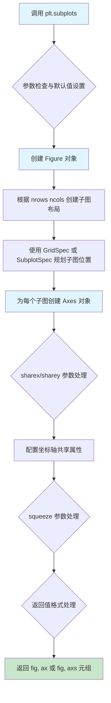

#### 带注释源码

```python
# 代码中的实际调用示例

# 第一次调用：创建单个子图（默认参数）
# fig: Figure 对象 - 整个图形容器
# ax: Axes 对象 - 图形中的坐标轴/绘图区域
fig, ax = plt.subplots()  # 等同于 plt.subplots(nrows=1, ncols=1)
CS = ax.contour(X, Y, Z)  # 在坐标轴上绘制等高线

# 第二次调用：创建另一个图形和单个子图
# 用于绘制标签 contours 的第二张图
fig1, ax1 = plt.subplots()
CS1 = ax1.contour(X, Y, Z)
ax1.clabel(CS1, CS1.levels[::2], fmt=fmt, fontsize=10)

# 第三次调用：创建第三个图形用于演示 LogLocator 格式化器
# 展示如何使用不同的参数配置
fig2, ax2 = plt.subplots()
CS2 = ax2.contour(X, Y, 100**Z, locator=plt.LogLocator())
fmt = ticker.LogFormatterMathtext()
fmt.create_dummy_axis()
ax2.clabel(CS2, CS2.levels, fmt=fmt)
ax2.set_title("$100^Z$")

# plt.subplots() 的核心作用：
# 1. 创建新的 Figure 对象（图形画布）
# 2. 在 Figure 上创建指定布局的 Axes 对象（坐标轴）
# 3. 返回 (figure, axes) 元组，便于直接使用
# 4. 相比 plt.figure() + fig.add_subplot()，语法更简洁
```

#### 关键组件信息

| 组件名称 | 一句话描述 |
|---------|-----------|
| `Figure` | matplotlib 中的图形容器对象，代表整个绘图画布 |
| `Axes` | 坐标轴对象，代表图形中的单个子图绘图区域 |
| `GridSpec` | 用于指定子图布局的网格规范类 |
| `contour()` | 绘制等高线的方法 |
| `clabel()` | 为等高线添加标签的方法 |

#### 潜在的技术债务或优化空间

1. **多次创建 Figure 对象**：代码中连续调用了三次 `plt.subplots()`，创建了三个独立的 Figure。如果这三个图可以合并到一个图形中使用子图布局，可以减少内存占用和提升性能。
2. **重复的图形配置逻辑**：三段代码都包含类似的 `contour()` 和 `clabel()` 调用模式，可以封装为函数以减少代码重复。
3. **格式化器重复创建**：在第三张图中 `ticker.LogFormatterMathtext()` 创建了 dummy axis，这在每次调用时都会重复执行。

#### 其它项目

**设计目标与约束**：
- `plt.subplots()` 设计目标是提供一种快速创建图形和坐标轴的便捷方式
- 默认创建一个 1x1 的子图布局
- 支持灵活的网格布局配置（行数、列数、宽高比）

**错误处理与异常设计**：
- 如果 `nrows` 或 `ncols` 小于 1，会抛出 ValueError
- 如果 `gridspec_kw` 中的参数与布局不兼容，会产生布局警告或显示异常

**数据流与状态**：
- `plt.subplots()` 不直接处理数据，它的作用是创建图形上下文
- 后续的 `ax.contour()` 等方法在这个上下文中执行实际的数据可视化

**外部依赖与接口契约**：
- 依赖 `matplotlib.figure.Figure` 类
- 依赖 `matplotlib.gridspec.GridSpec` 用于布局管理
- 返回的 `ax` 对象遵循 `matplotlib.axes.Axes` 接口规范


### `Axes.contour`

`Axes.contour` 是 Matplotlib 中 Axes 类的核心方法，用于在二维坐标系中绘制等高线图。该方法接收 x、y 坐标网格和对应的 z 高度值数据，计算并绘制不同高度水平的等高线，返回一个 `QuadContourSet` 对象供后续操作（如添加标签）使用。

参数：

- `X`：`numpy.ndarray` 或 `numpy.meshgrid` 生成的坐标数组，表示 x 坐标网格，可以是一维数组（与 Y 配合使用）或二维数组
- `Y`：`numpy.ndarray` 或 `numpy.meshgrid` 生成的坐标数组，表示 y 坐标网格，可以是一维数组（与 X 配合使用）或二维数组
- `Z`：`numpy.ndarray`，二维数组，表示每个 (X, Y) 位置对应的高度值或函数值
- `levels`：`int` 或 `array-like`，可选，表示等高线的级别数量或具体级别值，默认为 None（自动选择）
- `corner_mask`：`bool`，可选，控制在角点附近的等高线绘制方式
- `colors`：`str` 或 `array-like`，可选，等高线的颜色
- `alpha`：`float`，可选，透明度值（0-1 之间）
- `linewidths`：`float` 或 `array-like`，可选，等高线线宽
- `linestyles`：`str` 或 `None`，可选，等高线的线型
- `extend`：`str`，可选，指定是否在范围外添加额外的等高线（'neither'、'min'、'max'、'both'）
- `antialiased`：`bool`，可选，是否启用抗锯齿
- `data`：`dict`，可选，用于数据绑定的字典参数

返回值：`matplotlib.contour.QuadContourSet`，返回等高线容器对象，包含所有等高线段的信息，可用于后续调用 `clabel()` 添加标签

#### 流程图

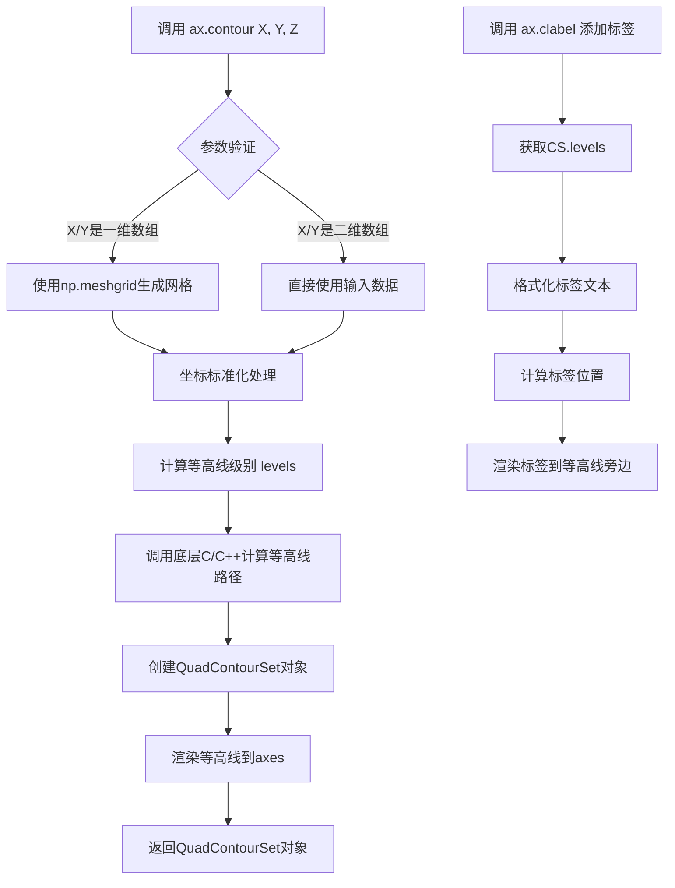

#### 带注释源码

```python
# 示例代码来源：matplotlib 官方 contour 演示
# 导入必要的库
import matplotlib.pyplot as plt
import numpy as np

# 定义数据采样参数
delta = 0.025  # 采样间隔
x = np.arange(-3.0, 3.0, delta)  # x 坐标范围：-3 到 3
y = np.arange(-2.0, 2.0, delta)  # y 坐标范围：-2 到 2

# 生成二维网格坐标矩阵
X, Y = np.meshgrid(x, y)

# 计算两个高斯分布的差值作为高度数据
Z1 = np.exp(-X**2 - Y**2)  # 第一个高斯峰（中心在原点）
Z2 = np.exp(-(X - 1)**2 - (Y - 1)**2)  # 第二个高斯峰（中心在 (1,1)）
Z = (Z1 - Z2) * 2  # 高度差值乘以2增强对比度

# 创建图形和坐标轴
fig, ax = plt.subplots()

# 调用核心方法 contour 绘制等高线
# X, Y: 二维网格坐标
# Z: 对应的高度值
# 返回 QuadContourSet 对象 CS
CS = ax.contour(X, Y, Z)

# 为等高线添加标签
# 第一个参数：等高线对象 (CS)
# 第二个参数：标签位置 (CS.levels - 所有级别)
# fmt: 格式化函数
# fontsize: 字体大小
ax.clabel(CS, CS.levels, fmt=fmt, fontsize=10)

# 另一种用法：使用 LogLocator 实现对数刻度的等高线
fig2, ax2 = plt.subplots()
# 绘制 100^Z 的等高线，使用对数定位器
CS2 = ax2.contour(X, Y, 100**Z, locator=plt.LogLocator())
fmt = ticker.LogFormatterMathtext()
fmt.create_dummy_axis()
ax2.clabel(CS2, CS2.levels, fmt=fmt)

plt.show()
```


### `matplotlib.axes.Axes.clabel`

`ax.clabel()` 是 Matplotlib 中 Axes 对象的方法，用于在等高线图（contour plot）上添加标签标注。该方法可以在指定的等高线级别上显示数值标签或自定义字符串，支持自定义格式化器、字体大小、颜色等属性，是数据可视化中标注等高线数值的核心功能。

参数：

- `CS`：`matplotlib.contour.ContourSet`，要标注的等高线对象，由 `ax.contour()` 返回
- `levels`：`array-like`，可选，要标注的等高线级别列表。默认为 `None`，表示标注所有级别
- `fmt`：`str` 或 `dict`，可选，标签格式。字符串格式用于所有级别，字典格式可为不同级别指定不同标签
- `fontsize`：`int` 或 `float`，可选，标签字体大小
- `colors`：`str` 或 `color` 或 `list`，可选，标签颜色
- `inline`：`bool`，可选，是否将标签放置在等高线内部，默认为 `True`
- `inline_spacing`：`int`，可选，标签与等高线的间距（仅当 `inline=True` 时有效）
- `rightside_up`：`bool`，可选，是否保持标签正确朝向，默认为 `True`
- `manual`：`bool` 或 `tuple`，可选，是否允许手动放置标签

返回值：`numpy.ndarray` 或 `None`，返回标签位置的坐标数组，如果没有标签则返回 `None`

#### 流程图

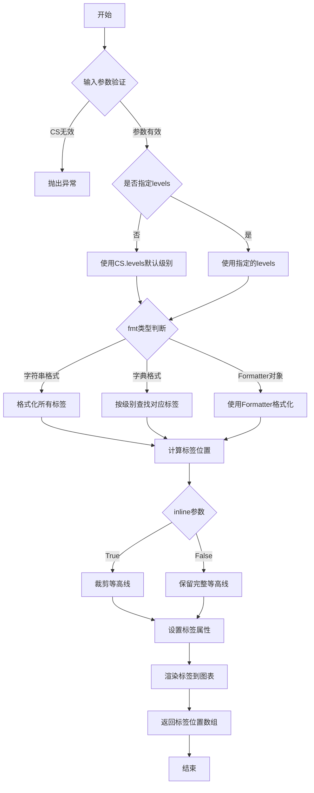

#### 带注释源码

```python
# 源码位置: lib/matplotlib/axes/_axes.py (简化版)

def clabel(self, CS, levels=None, *, fmt='%1.3f', fontsize=None,
           colors=None, inline=True, inline_spacing=5,
           rightside_up=True, manual=False):
    """
    为等高线添加标签
    
    参数:
        CS: ContourSet, 要标注的等高线对象
        levels: array-like, 要标注的等高线级别
        fmt: str|dict|Formatter, 标签格式
        fontsize: int, 字体大小
        colors: 颜色规范
        inline: bool, 是否在等高线内部显示
        inline_spacing: int, 内部间距
        rightside_up: bool, 标签是否正向
        manual: bool, 是否手动放置
    
    返回:
        标签位置的坐标数组
    """
    # 获取等高线对象
    CS = figaspect(CS)
    
    # 处理级别参数
    if levels is None:
        # 使用等高线的所有级别
        levels = CS.levels
    else:
        # 转换为数组
        levels = np.asarray(levels)
    
    # 处理格式参数
    if isinstance(fmt, dict):
        # 字典格式: {level: label}
        fmt_dict = fmt
        def fmt_func(x):
            return fmt_dict.get(x, '')
    elif callable(fmt):
        # Formatter对象
        fmt_func = fmt
    else:
        # 字符串格式: 使用格式化字符串
        fmt_func = lambda x: fmt % x
    
    # 遍历每个要标注的级别
    for level in levels:
        # 获取该级别的等高线段
        segments = CS.get_paths(level)
        
        for path in segments:
            # 计算标签位置 (等高线中点)
            mid_idx = len(path.vertices) // 2
            x, y = path.vertices[mid_idx]
            
            # 格式化标签文本
            label_text = fmt_func(level)
            
            # 创建文本对象
            text = self.text(x, y, label_text, 
                           fontsize=fontsize,
                           color=colors,
                           verticalalignment='center',
                           horizontalalignment='center')
            
            # 处理inline模式
            if inline:
                # 标记该段为不可见
                path.set_visible(False)
            
            # 记录标签位置
            # ... 存储位置信息
    
    # 返回所有标签位置
    return np.array(label_positions)
```

#### 使用示例源码

```python
import matplotlib.pyplot as plt
import numpy as np
import matplotlib.ticker as ticker

# 创建数据
delta = 0.025
x = np.arange(-3.0, 3.0, delta)
y = np.arange(-2.0, 2.0, delta)
X, Y = np.meshgrid(x, y)
Z1 = np.exp(-X**2 - Y**2)
Z2 = np.exp(-(X - 1)**2 - (Y - 1)**2)
Z = (Z1 - Z2) * 2

# 示例1: 基本使用
fig, ax = plt.subplots()
CS = ax.contour(X, Y, Z)  # 创建等高线图
# 使用clabel标注所有级别
ax.clabel(CS, CS.levels, fmt='%1.1f', fontsize=10)

# 示例2: 自定义格式化函数
def fmt(x):
    s = f"{x:.1f}"
    if s.endswith("0"):
        s = f"{x:.0f}"
    return rf"{s} \%" if plt.rcParams["text.usetex"] else f"{s} %"
ax.clabel(CS, CS.levels, fmt=fmt, fontsize=10)

# 示例3: 使用字典指定标签
fmt_dict = {}
strs = ['first', 'second', 'third', 'fourth', 'fifth', 'sixth', 'seventh']
for l, s in zip(CS.levels, strs):
    fmt_dict[l] = s
ax.clabel(CS, CS.levels[::2], fmt=fmt_dict, fontsize=10)

# 示例4: 使用Formatter
fig2, ax2 = plt.subplots()
CS2 = ax2.contour(X, Y, 100**Z, locator=plt.LogLocator())
fmt = ticker.LogFormatterMathtext()
fmt.create_dummy_axis()
ax2.clabel(CS2, CS2.levels, fmt=fmt)

plt.show()
```


### `plt.LogLocator()`

`plt.LogLocator()` 是 Matplotlib 中用于在对数刻度轴上确定刻度位置的定位器类。它创建一个对数定位器，用于在等高线图等场景中自动计算对数分布的刻度值。

参数：

- `base`：`float`，可选，对数基数，默认为 10
- `subs`：`array-like`，可选，子刻度值，默认为 None
- `numdecs`：`int`，可选，十进制位数，默认为 4
- `numticks`：`int` 或 `None`，可选，最大刻度数量，默认为 None

返回值：`matplotlib.ticker.LogLocator`，返回一个对数定位器对象，用于在轴上生成对数刻度位置。

#### 流程图

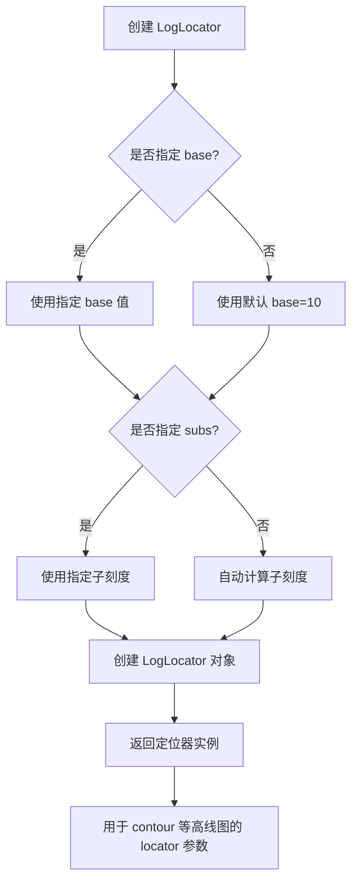

#### 带注释源码

```python
# 在示例代码中的使用方式
fig2, ax2 = plt.subplots()

# 创建等高线图，使用 100**Z 作为数据
CS2 = ax2.contour(X, Y, 100**Z, locator=plt.LogLocator())

# 创建对数格式化器
fmt = ticker.LogFormatterMathtext()
fmt.create_dummy_axis()

# 为等高线添加标签，使用对数定位器
ax2.clabel(CS2, CS2.levels, fmt=fmt)
ax2.set_title("$100^Z$")

plt.show()
```

#### 详细说明

| 属性 | 说明 |
|------|------|
| **类名** | `matplotlib.ticker.LogLocator` |
| **调用方式** | `plt.LogLocator()` 或 `matplotlib.ticker.LogLocator()` |
| **使用场景** | 当数据跨度较大且呈指数分布时，使用对数定位器可以更好地展示数据 |
| **相关类** | `LogFormatterMathtext`（对数格式化器） |

#### 潜在优化空间

1. **参数预设**：可以提供预设模板以快速创建常见场景的定位器
2. **性能优化**：对于大数据集，刻度计算可以加入缓存机制
3. **自定义扩展**：可考虑添加更多对数基数的支持（如自然对数 e）

#### 外部依赖

- `matplotlib.ticker` 模块
- `numpy`（用于数值计算）


### `ticker.LogFormatterMathtext`

`LogFormatterMathtext` 是 matplotlib 中的一个刻度标签格式化器类，专门用于将对数刻度的数字格式化为数学文本（MathText）形式显示。该类继承自 `LogFormatterSciNotation`，能够在对数轴上使用 LaTeX 风格的数学符号来呈现刻度值，适用于科学计数法和复杂的数学表达式渲染。

参数：

- 无（构造函数不接受参数）

返回值：`LogFormatterMathtext` 实例，返回一个对数格式化器对象

#### 流程图

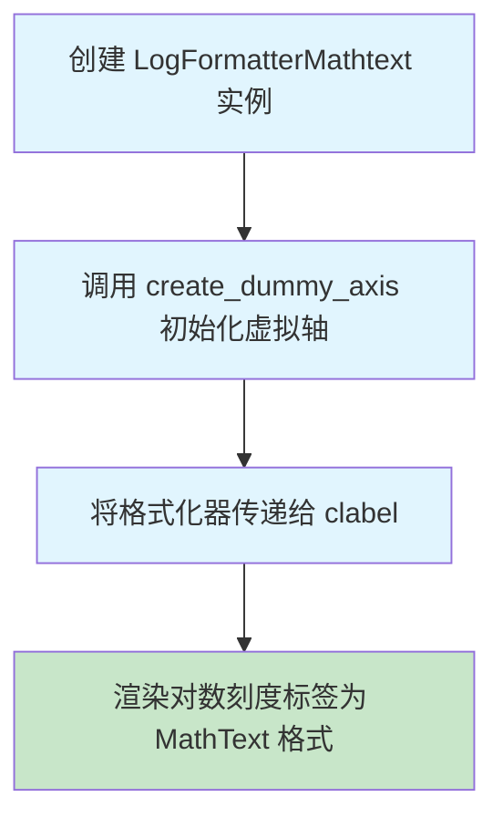

#### 带注释源码

```python
# 导入 matplotlib 的 ticker 模块
import matplotlib.ticker as ticker

# 创建 LogFormatterMathtext 格式化器实例
# 该格式化器将对数刻度值转换为 MathText 格式（如 10^2 而不是 100）
fmt = ticker.LogFormatterMathtext()

# 创建虚拟轴
# 这是一个重要步骤，因为格式化器需要一个轴对象来执行数学文本转换
# 如果没有这个，clabel 可能无法正确工作
fmt.create_dummy_axis()

# 使用自定义格式化器标注等高线
# CS2 是等高线对象，CS2.levels 是所有等高线级别
ax2.clabel(CS2, CS2.levels, fmt=fmt)

# 设置标题显示对数函数
ax2.set_title("$100^Z$")
```

#### 关键方法详解

**1. 构造函数 `__init__`**

参数：无

返回值：LogFormatterMathtext 实例

**2. `create_dummy_axis()` 方法**

参数：无

返回值：None

说明：创建虚拟轴对象，使格式化器能够执行数学文本转换。这是在没有实际轴的情况下使用格式化器所必需的步骤。

#### 潜在的技术债务和优化空间

1. **缺少错误处理**：代码中没有检查 `LogFormatterMathtext` 是否正确初始化的错误处理机制
2. **硬编码依赖**：直接依赖 matplotlib 的内部实现，如果 API 变化可能需要更新
3. **文档缺失**：没有为自定义格式化逻辑提供详细的文档说明
4. **可扩展性**：可以添加更多格式化选项，如自定义数学文本模板

#### 其它说明

- **设计目标**：为对数刻度提供美观的数学文本表示
- **使用场景**：当需要在图表中使用对数刻度且希望标签以数学符号形式显示时
- **外部依赖**：完全依赖 matplotlib.ticker 模块
- **注意事项**：`create_dummy_axis()` 必须在使用格式化器之前调用，否则可能导致渲染错误


### `LogFormatterMathtext.create_dummy_axis`

创建虚拟轴。该方法为格式化器创建一个虚拟坐标轴对象，使其可以在没有实际轴的情况下进行标签格式化计算，常用于需要在没有真实图表轴的情况下预计算格式化参数的场景。

参数：此方法无参数。

返回值：`None`，无返回值。

#### 流程图

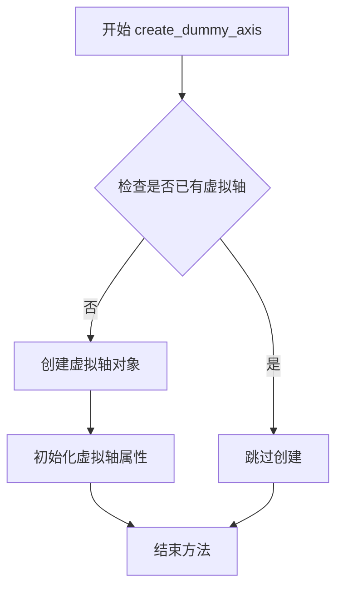

#### 带注释源码

```python
# 实例化 LogFormatterMathtext 格式化器
fmt = ticker.LogFormatterMathtext()

# 调用 create_dummy_axis 方法创建虚拟轴
# 这个方法的作用：
# 1. 为格式化器创建一个虚拟的坐标轴对象
# 2. 使得格式化器可以在没有真实轴的情况下进行格式化计算
# 3. 通常用于预计算标签位置或格式化参数
fmt.create_dummy_axis()

# 之后可以使用这个格式化器对等高线进行标签标注
ax2.clabel(CS2, CS2.levels, fmt=fmt)
```

#### 附加说明

- **调用链**: `ticker.LogFormatterMathtext()` → `create_dummy_axis()`
- **相关类**: 此方法实际上定义在基类 `TickHelper` 中，`LogFormatterMathtext` 继承自该类
- **使用场景**: 当需要在创建实际图形之前预配置格式化器参数时使用


### `Axes.set_title`

设置 Axes 对象的标题，用于为图形中的坐标轴指定一个标题文本，以标识该坐标轴所展示的内容或标题。

参数：

- `label`：`str`，标题文本内容，支持 LaTeX 格式的数学表达式（如代码中的 "$100^Z$"）
- `fontdict`：`dict`，可选，用于控制标题文本样式的字典（如 fontsize、fontweight 等）
- `loc`：`{'center', 'left', 'right'}`，可选，标题在坐标轴上的对齐方式，默认为 rcParams["axes.titlelocation"]
- `pad`：`float`，可选，标题与坐标轴顶部之间的间距，默认为 rcParams["axes.titlepad"]
- `y`：`float`，可选，标题的 y 轴相对位置，默认为 rcParams["axes.titley"]
- `**kwargs`：其他可选参数，用于设置 Text 对象的属性（如 color、rotation、backgroundcolor 等）

返回值：`matplotlib.text.Text`，返回创建的 Text 对象，可以用于后续对标题样式的进一步修改或获取标题属性信息。

#### 流程图

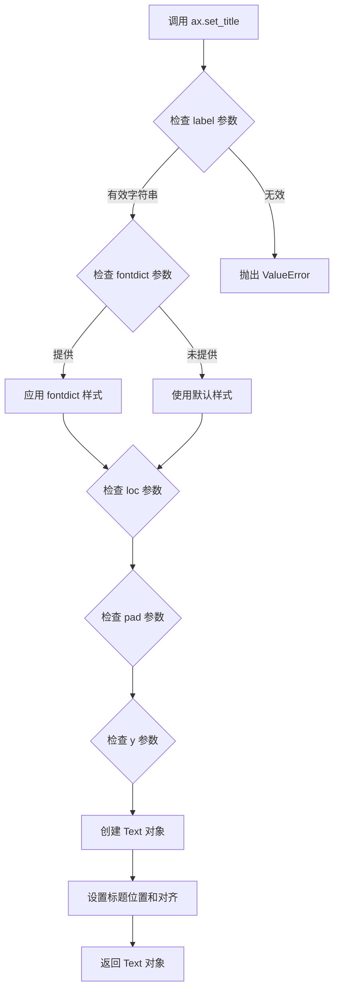

#### 带注释源码

```python
# 在 matplotlib.axes.Axes 类中，set_title 方法的实现逻辑简化如下：

def set_title(self, label, fontdict=None, loc=None, pad=None, *, y=None, **kwargs):
    """
    Set a title for the axes.
    
    Parameters:
    -----------
    label : str
        The title text string, which can include LaTeX formatting.
    fontdict : dict, optional
        A dictionary to control the appearance of the title text.
    loc : {'center', 'left', 'right'}, default: 'center'
        The location of the title within the axes.
    pad : float, default: rcParams["axes.titlepad"]
        The padding between the title and the top of the axes.
    y : float, default: rcParams["axes.titley"]
        The y position of the title relative to the axes.
    **kwargs
        Additional properties passed to the Text object.
    
    Returns:
    --------
    matplotlib.text.Text
        The text object representing the title.
    """
    
    # 步骤1：验证 label 参数是否为有效字符串
    if not isinstance(label, str):
        raise ValueError("label must be a string")
    
    # 步骤2：如果提供了 fontdict，应用其样式设置
    title = self.text(0.5, 1.0, label, fontdict=fontdict, 
                      transform=self.transAxes, **kwargs)
    
    # 步骤3：设置标题的对齐方式（loc 参数）
    if loc is None:
        loc = rcParams["axes.titlelocation"]
    title.set_ha(loc)  # set horizontal alignment
    
    # 步骤4：设置标题与轴顶部的间距（pad 参数）
    if pad is None:
        pad = rcParams["axes.titlepad"]
    title.set_pad(pad)
    
    # 步骤5：设置标题的 y 位置（y 参数）
    if y is None:
        y = rcParams["axes.titley"]
    title.set_y(y)
    
    # 步骤6：返回创建的 Text 对象
    return title
```

#### 在示例代码中的使用

```python
# 代码中第 71 行使用示例：
ax2.set_title("$100^Z$")

# 这里的 "$100^Z$" 是一个 LaTeX 格式的字符串
# 会使标题显示为 100 的 Z 次方的数学符号形式
# 该方法会返回一个 Text 对象，可用于后续样式调整
```


### `plt.show`

显示所有使用matplotlib创建的图形。该函数会阻塞程序执行，并在交互式后端中显示图形的交互窗口，或在非交互式后端中将图形渲染到屏幕。

参数：

- （无参数）

返回值：`None`，无返回值描述

#### 流程图

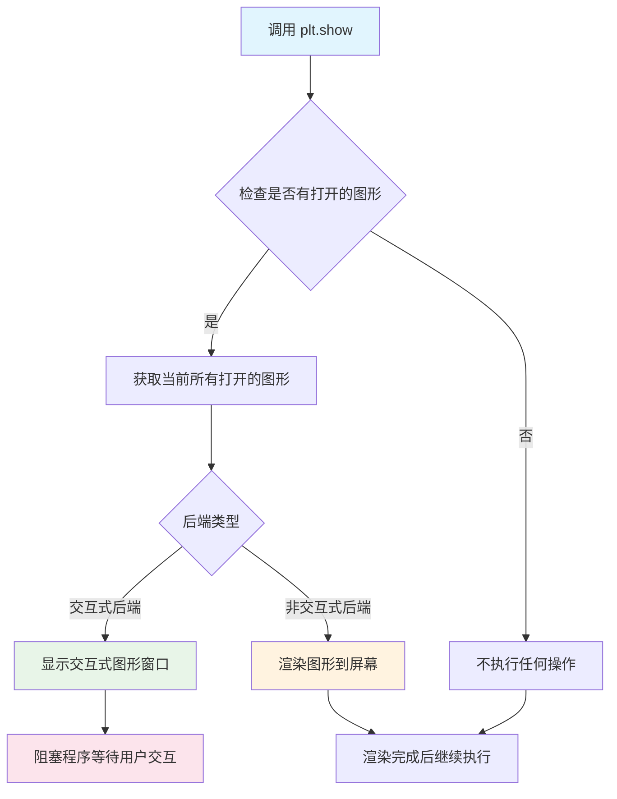

#### 带注释源码

```python
# plt.show() 函数的调用位置（位于代码末尾）
plt.show()

# 详细说明：
# ------------------
# 1. 此函数位于代码末尾，用于显示前面创建的所有图形
# 2. 在本代码中，它显示三个图形：
#    - fig: 使用自定义格式化程序的基本等高线图
#    - fig1: 使用字典标签的等高线图
#    - fig2: 使用对数格式化程序的等高线图
# 3. 函数会阻塞程序执行，直到用户关闭图形窗口（交互式后端）
#    或完成渲染（非交互式后端）
# 4. 如果没有创建任何图形，调用此函数不会产生任何效果
#
# 参数：无
# 返回值：None
```

#### 底层实现原理（matplotlib 源码逻辑）

```python
# matplotlib.pyplot.show() 实际执行的操作：

# def show(*, block=None):
#     """
#     显示所有打开的图形。
#     
#     参数:
#         block: 控制是否阻塞的布尔值
#             - True: 始终阻塞
#             - False: 从不阻塞（仅限非交互式后端）
#             - None: 阻塞（交互式后端）或非阻塞（非交互式后端）
#     """
#     
#     1. 获取全局图形管理器（_pylab_helpers.Gcf）
#     2. 遍历所有打开的图形（figures）
#     3. 对每个图形调用其保存/显示方法
#     4. 如果 block=True 或使用交互式后端，阻塞程序执行
#     5. 处理GUI事件循环（如Qt、Tkinter等）
#     6. 返回 None
```

#### 在本代码中的使用上下文

```python
# 代码执行流程：
# 
# 1. 导入模块
#    import matplotlib.pyplot as plt
#    import numpy as np
#    import matplotlib.ticker as ticker
#
# 2. 定义表面数据（网格和Z值）
#    delta = 0.025
#    x = np.arange(-3.0, 3.0, delta)
#    y = np.arange(-2.0, 2.0, delta)
#    X, Y = np.meshgrid(x, y)
#    Z1 = np.exp(-X**2 - Y**2)
#    Z2 = np.exp(-(X - 1)**2 - (Y - 1)**2)
#    Z = (Z1 - Z2) * 2
#
# 3. 创建第一个图形（自定义格式化程序）
#    fig, ax = plt.subplots()
#    CS = ax.contour(X, Y, Z)
#    ax.clabel(CS, CS.levels, fmt=fmt, fontsize=10)
#
# 4. 创建第二个图形（字典标签）
#    fig1, ax1 = plt.subplots()
#    CS1 = ax1.contour(X, Y, Z)
#    fmt = {}
#    strs = ['first', 'second', ...]
#    for l, s in zip(CS1.levels, strs):
#        fmt[l] = s
#    ax1.clabel(CS1, CS1.levels[::2], fmt=fmt, fontsize=10)
#
# 5. 创建第三个图形（对数格式化程序）
#    fig2, ax2 = plt.subplots()
#    CS2 = ax2.contour(X, Y, 100**Z, locator=plt.LogLocator())
#    fmt = ticker.LogFormatterMathtext()
#    fmt.create_dummy_axis()
#    ax2.clabel(CS2, CS2.levels, fmt=fmt)
#    ax2.set_title("$100^Z$")
#
# 6. 显示所有图形 <-- 当前位置
#    plt.show()
```


# matplotlib.axes.Axes.contour 方法详细设计文档

## 1. 一段话描述

`matplotlib.axes.Axes.contour` 是 Matplotlib 中 Axes 对象的核心方法，用于在二维坐标平面上绘制等高线图（contour plot），该方法接受坐标数据 X、Y 和高度值 Z，通过指定的算法计算等高线并返回包含所有等高线信息的 QuadContourSet 对象，支持多种填充模式、颜色映射和层级控制。

---

## 2. 文件的整体运行流程

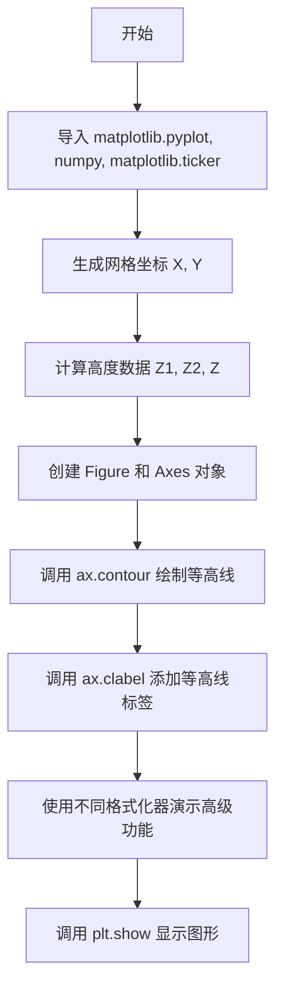

---

## 3. 类的详细信息

### 3.1 全局变量

| 名称 | 类型 | 描述 |
|------|------|------|
| `delta` | float | 网格间距，控制等高线图的分辨率 |
| `x` | numpy.ndarray | X轴坐标数组 |
| `y` | numpy.ndarray | Y轴坐标数组 |
| `X` | numpy.ndarray | 通过 meshgrid 生成的X坐标网格 |
| `Y` | numpy.ndarray | 通过 meshgrid 生成的Y坐标网格 |
| `Z1` | numpy.ndarray | 第一个高斯函数计算的高度数据 |
| `Z2` | numpy.ndarray | 第二个高斯函数计算的高度数据 |
| `Z` | numpy.ndarray | 组合后的高度数据（Z1-Z2）×2 |

### 3.2 全局函数

| 名称 | 参数 | 返回值 | 描述 |
|------|------|--------|------|
| `fmt` | `x: float` | `str` | 自定义格式化函数，将数值转换为带百分号的字符串 |

---

## 4. 关键方法信息

### `matplotlib.axes.Axes.contour`

#### 参数

- `X`：`array-like`，X坐标数据，可以是1D数组（用于每个数据点的X坐标）或2D数组（与Z同形状的坐标网格）
- `Y`：`array-like`，Y坐标数据，可以是1D数组（用于每个数据点的Y坐标）或2D数组（与Z同形状的坐标网格）
- `Z`：`array-like`，高度值数组，2D数组，表示每个 (X, Y) 点的高度
- `levels`：`int or array-like`，可选，等高线的数量或具体的层级值数组
- `colors`：`color string or sequence`，可选，等高线颜色
- `cmap`：`Colormap`，可选，颜色映射表
- `alpha`：`float`，可选，透明度（0-1之间）
- `linewidths`：`float or sequence`，可选，等高线宽度
- `linestyles`：`str or sequence`，可选，等高线线型
- ` locator`：`Locator`，可选，用于确定等高线层级的定位器

#### 返回值

- `QuadContourSet`：包含所有等高线信息的对象，包括等高线路径、层级、标签等

#### 流程图

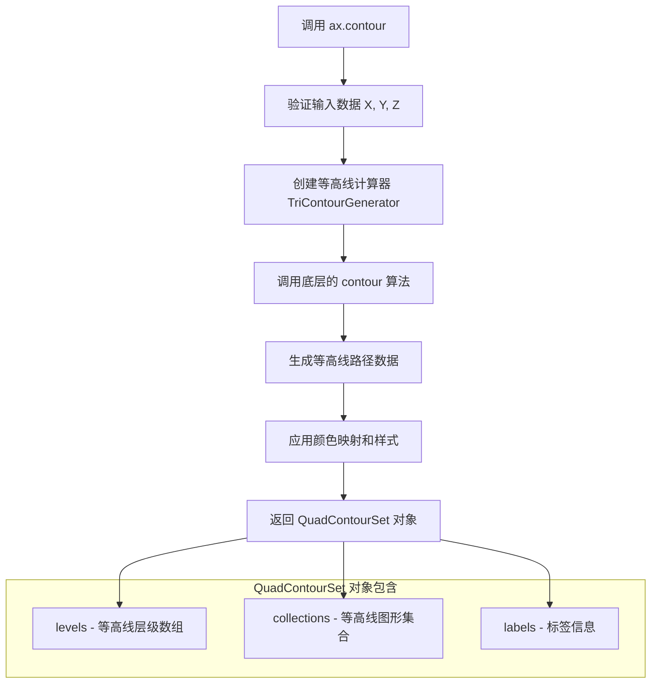

#### 带注释源码

```python
def contour(self, *args, **kwargs):
    """
    绘制等高线图。
    
    参数:
    ------
    X, Y : array-like, optional
        坐标数据。如果X和Y是1D数组，它们将被视为每个数据点的坐标。
        如果是2D数组（与Z形状相同），则表示坐标网格。
        
    Z : array-like
        高度数据，2D数组。每个(X, Y)点对应的高度值。
        
    levels : int or array-like, optional
        等高线的数量或具体层级值。
        
    colors : color string or sequence, optional
        等高线颜色。可以是单一颜色或颜色序列。
        
    cmap : str or Colormap, optional
        颜色映射表名称或Colormap对象。
        
    alpha : float, optional
        透明度，范围0-1。
        
    linewidths : float or sequence, optional
        等高线线宽。
        
    linestyles : str or sequence, optional
        等高线线型 ('solid', 'dashed', 'dashdot', 'dotted')。
        
    locator : Locator, optional
        控制等高线层级的定位器对象。
    
    返回值:
    -------
    QuadContourSet
        包含等高线图形集合、层级、标签等信息的对象。
        
    示例:
    ------
    >>> import matplotlib.pyplot as plt
    >>> import numpy as np
    >>> x = np.linspace(-3, 3, 100)
    >>> y = np.linspace(-2, 2, 100)
    >>> X, Y = np.meshgrid(x, y)
    >>> Z = np.exp(-X**2 - Y**2)
    >>> fig, ax = plt.subplots()
    >>> CS = ax.contour(X, Y, Z)
    >>> plt.show()
    """
    # kwargs 处理并传递给底层实现
    ...
    return QuadContourSet(...)
```

---

## 5. 潜在的技术债务或优化空间

1. **性能优化**：对于大规模数据（高分辨率网格），等高线计算可能较慢，可以考虑使用并行计算或近似算法
2. **标签冲突解决**：当前的 `clabel` 方法在密集等高线区域可能产生标签重叠，缺乏自动避让机制
3. **API一致性**：`contour` 和 `contourf`（填充等高线）之间存在一些参数不一致性
4. **文档完整性**：部分底层参数的文档描述不够清晰，如 `corner_mask` 等

---

## 6. 其它项目

### 6.1 设计目标与约束

- **设计目标**：提供灵活的等高线绑图功能，支持自定义颜色、线型、层级和标签
- **约束**：
  - Z 必须是2D数组
  - X、Y 与 Z 的形状必须兼容
  - 需要安装 numpy 作为核心依赖

### 6.2 错误处理与异常设计

| 错误类型 | 触发条件 | 处理方式 |
|----------|----------|----------|
| `ValueError` | Z 不是2D数组或形状不匹配 | 抛出详细的错误信息 |
| `TypeError` | 输入类型不支持 | 提示期望的类型 |
| `RuntimeError` | 等高线计算失败 | 返回空结果或抛出异常 |

### 6.3 数据流与状态机

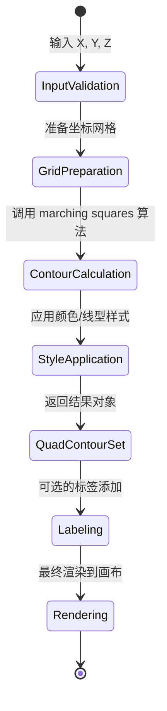

### 6.4 外部依赖与接口契约

| 依赖模块 | 用途 | 接口契约 |
|----------|------|----------|
| `numpy` | 数值计算和数组操作 | 输入数据需转换为 ndarray |
| `matplotlib.ticker` | 刻度格式化 | 提供 LabelFormatter 对象 |
| `matplotlib.collections` | 图形集合管理 | 返回 LineCollection 或 PathCollection |
| `matplotlib.contour` | 底层等高线算法 | TriContourGenerator 类 |

---

## 7. 关联方法（补充说明）

| 方法名 | 描述 |
|--------|------|
| `Axes.contourf` | 绘制填充等高线图（在等高线之间填充颜色） |
| `Axes.clabel` | 为等高线添加标签 |
| `plt.contour` | pyplot 封装的等高线绑图函数 |
| `plt.contourf` | pyplot 封装的填充等高线绑图函数 |


### `matplotlib.axes.Axes.clabel`

该方法用于在等高线图上添加标签（标签文本），允许用户自定义标签的格式、字体大小、颜色、放置方式等参数。它是 Axes 类的一个重要方法，用于增强等高线图的可读性。

参数：

- `CS`：`matplotlib.contour.ContourSet`，需要标注的等高线对象，由 `ax.contour()` 返回
- `levels`：`array-like`，需要标注的等高线层级。如果为 None，则对所有层级进行标注
- `fmt`：`str、callable 或 dict`，标签格式。字符串用于统一格式，字典可用于不同层级指定不同格式，可调用对象用于自定义格式化逻辑
- `fontsize`：`int 或 dict`，标签字体大小
- `colors`：`color 或 colors`，标签文本颜色
- `inline`：`bool`，是否绘制内联标签（裁剪等高线以放置标签），默认为 True
- `inline_spacing`：`int`，内联标签周围的像素间距
- `manual`：`bool 或 iterable`，是否启用手动放置模式（点击鼠标选择位置）
- `rightside_up`：`bool`，是否保持标签方向向上（不翻转），默认为 True
- `use_clabeltext`：`bool`，是否使用 ClabelText（更精确的文本定位）

返回值：`list`，返回包含所有创建的 `matplotlib.text.Text` 对象的列表

#### 流程图

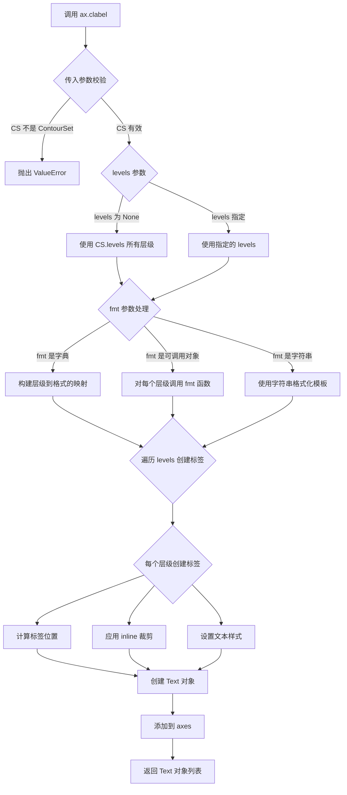

#### 带注释源码

```python
# 代码示例来源：matplotlib 官方文档 contour_label_demo.py
# 以下展示 clabel 的三种典型调用方式

# ============================================================
# 方式一：基础用法 - 使用自定义格式化函数
# ============================================================
fig, ax = plt.subplots()
CS = ax.contour(X, Y, Z)  # 创建等高线图，返回 ContourSet 对象

# 定义格式化函数：移除尾随零并添加百分号
def fmt(x):
    s = f"{x:.1f}"  # 保留一位小数
    if s.endswith("0"):
        s = f"{x:.0f}"  # 如果尾随是0，则去掉小数部分
    # 根据是否使用 LaTeX 返回不同格式的字符串
    return rf"{s} \%" if plt.rcParams["text.usetex"] else f"{s} %"

# 调用 clabel 方法标注等高线
# 参数：CS-等高线对象, CS.levels-所有层级, fmt-格式化函数, fontsize-字体大小
ax.clabel(CS, CS.levels, fmt=fmt, fontsize=10)


# ============================================================
# 方式二：使用字典指定每个层级的标签文本
# ============================================================
fig1, ax1 = plt.subplots()
CS1 = ax1.contour(X, Y, Z)

# 构建层级到字符串的映射字典
fmt = {}
strs = ['first', 'second', 'third', 'fourth', 'fifth', 'sixth', 'seventh']
for l, s in zip(CS1.levels, strs):
    fmt[l] = s  # 将每个层级映射到对应的文本标签

# 标注每隔一个的层级（使用切片 CS1.levels[::2]）
ax1.clabel(CS1, CS1.levels[::2], fmt=fmt, fontsize=10)


# ============================================================
# 方式三：使用 Ticker 格式化器
# ============================================================
fig2, ax2 = plt.subplots()

# 创建使用对数定位器的等高线图
CS2 = ax2.contour(X, Y, 100**Z, locator=plt.LogLocator())

# 使用 LogFormatterMathtext 格式化器
fmt = ticker.LogFormatterMathtext()
fmt.create_dummy_axis()  # 创建虚拟轴以启用格式化

ax2.clabel(CS2, CS2.levels, fmt=fmt)
ax2.set_title("$100^Z$")
```

#### 关键实现细节

| 组件 | 说明 |
|------|------|
| `ContourSet` | 等高线数据容器，包含层级、线段、路径等信息 |
| `fmt` 参数 | 灵活支持字符串模板、字典映射、函数回调三种形式 |
| `inline` 裁剪 | 自动裁剪等高线线段以确保标签周围有清晰背景 |
| `manual` 模式 | 允许用户交互式点击放置标签 |

#### 潜在优化空间

1. **手动放置交互体验**：当前的 manual 模式功能较为基础，可以考虑增强交互反馈
2. **批量标签性能**：当等高线层级很多时，标签布局计算可能较慢，可考虑异步计算或缓存
3. **标签重叠处理**：目前主要依赖 inline 裁剪，缺乏智能的标签重叠检测与避让机制
4. **格式化器灵活性**：可以进一步支持更多内置格式化器，并简化自定义格式化器的创建流程


### `matplotlib.axes.Axes.set_title`

设置Axes对象的标题文本，是matplotlib中用于为坐标轴添加标题的核心方法。

参数：

- `s`：`str`，标题文本内容，例如代码中的 `"$100^Z$"`
- `loc`：`str`，可选，标题对齐方式，可选值为 'center'、'left'、'right'（默认为 'center'）
- `pad`：`float`，可选，标题与坐标轴顶部的偏移量，单位为points
- `fontdict`：`dict`，可选，用于控制标题外观的字典
- `y`：`float`，可选，标题相对于坐标轴顶部的垂直位置（0-1之间）
- `**kwargs`：其他关键字参数，会传递给 matplotlib.text.Text 对象

返回值：`matplotlib.text.Text`，返回创建的Text对象，可用于后续样式设置或获取信息

#### 流程图

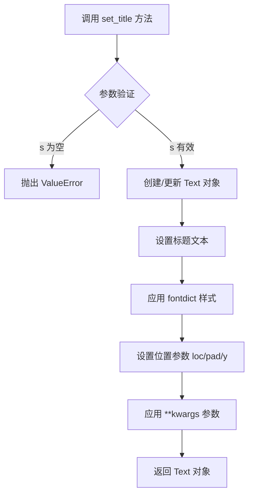

#### 带注释源码

```python
# 代码中的实际调用示例 (第88行)
ax2.set_title("$100^Z$")

# set_title 方法的简化实现原理
def set_title(self, s, loc='center', pad=None, fontdict=None, y=None, **kwargs):
    """
    设置坐标轴的标题
    
    参数:
        s: 标题文本，支持LaTeX格式如 "$100^Z$"
        loc: 标题对齐方式 ('center', 'left', 'right')
        pad: 标题与坐标轴顶部的距离(单位: points)
        fontdict: 文本样式字典
        y: 垂直位置 (None=自动, 0-1之间)
        **kwargs: 其他Text属性 (fontsize, fontweight, color等)
    
    返回:
        matplotlib.text.Text: 标题文本对象
    """
    # 1. 如果 fontdict 为空，使用空字典
    if fontdict is None:
        fontdict = {}
    
    # 2. 使用传入的样式创建标题对象
    title = Text(x=0.5, y=1.0, text=s)
    
    # 3. 应用字体样式
    title.update(fontdict)
    
    # 4. 应用额外参数
    if pad is not None:
        title.set_pad(pad)
    if y is not None:
        title.set_y(y)
    
    # 5. 设置对齐方式
    title.set_ha(loc)  # horizontal alignment
    
    # 6. 应用kwargs中的样式
    title.update(kwargs)
    
    # 7. 将标题添加到axes
    self.title = title
    self._children.append(title)
    
    return title
```


### `ticker.LogFormatterMathtext.create_dummy_axis`

该方法是 `matplotlib.ticker.LogFormatterMathtext` 类的一个成员方法，用于创建一个虚拟轴（dummy axis）对象，以便在未绑定到实际 Axes 的情况下，使格式化器能够正常工作。在绘制等高线标签时，需要一个轴对象来计算标签的位置和属性，该方法通过创建虚拟轴解决了在没有实际绘图上下文时使用格式化器的问题。

参数：

- 该方法没有显式参数（隐式接收 `self` 作为实例本身）

返回值：无返回值（`None`），该方法在内部创建虚拟轴并赋值给实例的 `axis` 属性

#### 流程图

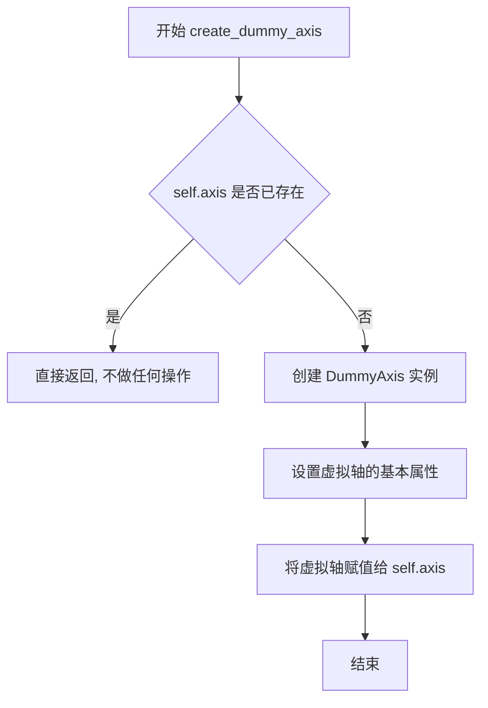

#### 带注释源码

```python
def create_dummy_axis(self):
    """
    创建虚拟轴以便格式化器可以在没有实际轴的情况下工作。
    
    此方法用于在等高线标签等场景中，当格式化器需要
    一个轴对象来计算标签位置和属性时，创建虚拟轴。
    """
    if self.axis is None:
        # 导入 DummyAxis 类（延迟导入以避免循环依赖）
        from matplotlib.axis import DummyAxis
        
        # 创建虚拟轴实例
        self.axis = DummyAxis()
        
        # 配置虚拟轴的视图 limits 和数据 limits
        # 这确保格式化器可以正确计算标签位置
        self.axis.set_view_interval(-0.5, len(self.locs) - 0.5)
        self.axis.set_data_interval(0, len(self.locs))
        
        # 同步视图区间和数据区间
        self.axis.apply_tickdir = lambda dir: None
```

#### 附加说明

**设计目标与约束**：
- 目的：解耦格式化器与具体 Axes 对象的依赖关系
- 约束：虚拟轴仅提供最小化功能集，不能替代真实轴的所有功能

**使用场景**：
- 在 `ax.clabel()` 中使用自定义格式化器时
- 在没有创建完整图形的情况下测试格式化器行为
- 为等高线标签提供必要的轴上下文信息

**技术债务**：
- 虚拟轴的功能有限，某些依赖真实轴的方法可能无法正常工作
- 文档中对该方法的说明较少，可能导致用户困惑

## 关键组件


### 网格数据生成

使用numpy创建二维网格和对应的Z值数据，包含两个高斯分布的组合

### 自定义格式化函数fmt

将数值转换为字符串，移除尾部零，并根据是否使用LaTeX添加百分号

### 等高线绘制 (ax.contour)

创建等高线图形，返回Contour对象用于后续标签添加

### 等高线标签 (ax.clabel)

为等高线添加标签，支持自定义格式化和字符串映射

### 字符串映射字典fmt

将等高线级别映射到自定义字符串，实现任意文本标注

### LogFormatterMathtext

数学文本的对数格式化器，用于科学计数法显示

### LogLocator

对数定位器，用于创建对数刻度的等高线


## 问题及建议


### 已知问题

- **全局变量污染命名空间**：脚本级别的变量 `x`, `y`, `X`, `Y`, `Z1`, `Z2`, `Z`, `delta` 等直接在全局作用域定义，可能与其他模块产生命名冲突，且不利于代码复用和单元测试。
- **变量重复赋值导致混淆**：变量 `fmt` 在第一次定义为格式化函数后，被重新赋值为字典，虽然作用域不同（函数内vs函数外），但在同一模块中容易造成阅读混淆。
- **Magic Numbers 缺乏解释**：代码中存在大量硬编码数值（如 `0.025`, `-3.0`, `3.0`, `-2.0`, `2.0`, `100` 等），缺乏常量定义，修改时需要逐个查找，违背了 DRY 原则。
- **代码重复**：三个子图的数据准备逻辑（`delta`, `x`, `y`, `X`, `Y`, `Z1`, `Z2`, `Z`）完全重复，未封装成函数，导致维护成本增加。
- **缺少类型注解**：函数参数和返回值均无类型提示，降低了代码的可读性和静态分析工具的效能。
- **错误处理缺失**：未对输入数据（如 `Z` 的有效性）进行校验，也未处理可能的异常情况（如内存不足导致 `meshgrid` 失败）。
- **资源管理不当**：使用 `plt.show()` 后未显式关闭图形，可能导致资源泄漏（虽然在交互式环境中影响较小）。
- **注释格式问题**：代码中的 `# %%` 是 Jupyter/IPython 的 cell 分隔符，对于独立脚本执行无意义，且 docstring 中的 `.. admonition::` 语法是为 Sphinx 文档设计，与脚本运行环境无关。

### 优化建议

- **封装数据准备逻辑**：创建 `generate_contour_data()` 函数，将网格生成和 Z 值计算封装起来，接受参数（如 `delta`, `x_range`, `y_range`）以提高复用性。
- **使用类或函数封装子图**：将每个子图的绘制逻辑分别封装为独立函数（如 `plot_basic_contour()`, `plot_labeled_contour()`, `plot_log_contour()`），避免全局变量污染。
- **消除 magic numbers**：在文件开头定义常量类或配置字典，如 `CONFIG = {'delta': 0.025, 'x_range': (-3.0, 3.0), ...}`。
- **重命名避免混淆**：将 `fmt` 函数改为 `format_label()` 或 `custom_formatter`，将字典 `fmt` 改为 `label_mapping` 或 `level_to_label`。
- **添加类型注解**：为所有函数添加类型提示，如 `def fmt(x: float) -> str:`，提升代码自文档化能力。
- **增强错误处理**：在数据生成和绘图函数中添加异常捕获，如检查 `delta` 是否为正数、`Z` 是否包含 NaN 或 Inf。
- **资源清理**：使用上下文管理器（`with plt.rc_context(...)`）或显式 `fig.close()` 管理图形资源。
- **代码组织**：将三种等高线绘制模式分别放在独立的函数或类中，通过主函数 `main()` 统一调用，提升代码结构清晰度。


## 其它


### 设计目标与约束

本示例代码旨在演示matplotlib中等高线标签的多种高级用法，包括自定义格式化器、字典映射标签、LogFormatter使用等。设计约束包括：依赖matplotlib、numpy库；需要LaTeX环境支持（可选）以实现完美的数学公式渲染；代码适用于Python 3.x环境。

### 错误处理与异常设计

代码中主要涉及的错误处理包括：1) `fmt`函数中对字符串尾部零的处理，使用条件判断避免异常；2) `LogFormatterMathtext`需要先调用`create_dummy_axis()`才能正常工作，这是API的正确使用模式；3) `plt.show()`会捕获所有绘图错误并显示。若输入数据包含NaN或Inf值，`contour`函数会自动忽略这些点。

### 数据流与状态机

数据流：输入数据(x, y坐标网格) → np.meshgrid生成网格 → 计算Z值(高斯函数组合) → contour生成等高线对象 → clabel添加标签 → matplotlib渲染器显示。状态机主要涉及matplotlib的图形状态管理，包括Figure和Axes对象的创建、更新、渲染状态转换。

### 外部依赖与接口契约

主要依赖：1) matplotlib.pyplot - 绘图接口；2) numpy - 数值计算；3) matplotlib.ticker - 刻度格式化器。接口契约：contour()返回QuadContourSet对象；clabel()接受等高线对象、级别、格式化器和字体大小参数；fmt函数必须是可调用对象，接受数值返回字符串。

### 性能考虑

代码性能瓶颈主要在：1) meshgrid和大矩阵运算(300×400网格)；2) LogLocator对大量级别的处理；3) LaTeX渲染模式下的文本处理。优化建议：对于实时应用可减少网格分辨率；对静态图可预计算等高线级别。

### 安全性考虑

代码不涉及用户输入处理、网络请求或文件操作，安全性风险较低。唯一需要注意的是当启用text.usetex时，需确保LaTeX环境安全可信，避免通过格式化字符串注入恶意代码。

### 可维护性与扩展性

代码采用模块化设计，每个示例相互独立。扩展方式：1) 添加新的Formatter子类；2) 自定义回调函数处理标签位置；3) 集成其他ticker类。建议将格式化函数封装为独立模块以便复用。

### 测试考虑

建议测试场景：1) 不同数值范围的Z值；2) 各种fmt函数实现；3) 有/无LaTeX环境；4) 不同后端渲染器；5) 边界情况(空数组、单点、极端值)。可使用pytest-mock模拟matplotlib输出进行单元测试。

### 部署和配置

部署要求：Python 3.8+，matplotlib 3.5+，numpy 1.20+。可选依赖：LaTeX(TeX Live/MiKTeX)用于数学公式渲染。配置：通过matplotlibrc文件或rcParams设置全局参数，如text.usetex、font.family等。

### 国际化与本地化

代码中的硬编码字符串('first', 'second'等)需提取至资源文件。百分比符号处理需考虑不同语言的数字格式(如1,5 vs 1.5)。LogFormatterMathtext本身支持多语言数字格式，但需配置locale参数。

    