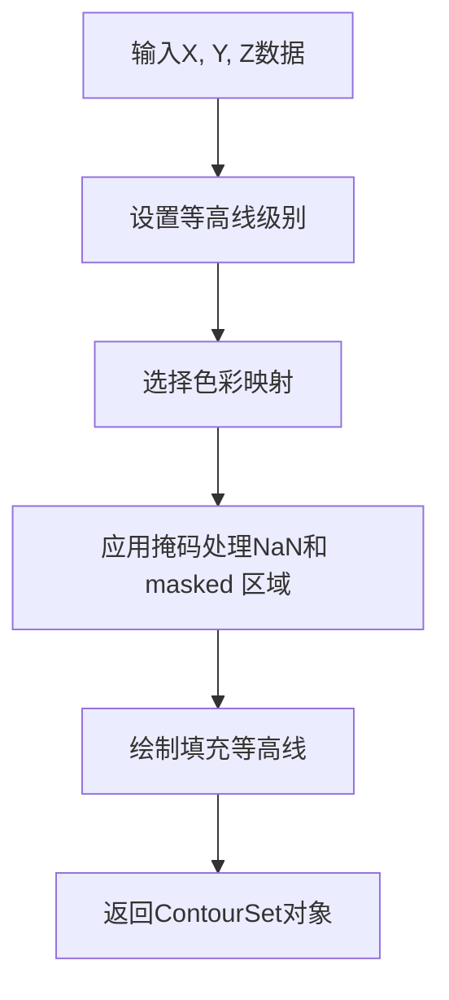

# `matplotlib\galleries\examples\images_contours_and_fields\contourf_demo.py` 详细设计文档

这是一个matplotlib等高线图（contour plot）演示脚本，展示了如何使用Axes.contourf方法创建填充等高线图，包括自动和手动选择等高线级别、不同的extend设置、origin参数定向、以及颜色条和标签的使用。

## 整体流程

```mermaid
graph TD
    A[开始] --> B[导入matplotlib.pyplot和numpy]
    B --> C[创建网格数据X, Y]
    C --> D[计算Z1和Z2作为高斯函数]
    D --> E[计算Z = (Z1 - Z2) * 2]
    E --> F[在数据中创建NaN和masked区域]
    F --> G[创建图1: 自动等高线级别]
    G --> H[创建图2: 手动指定等高线级别和颜色]
    H --> I[创建图3: 展示4种extend设置]
    I --> J[创建图4: 展示origin参数]
    J --> K[调用plt.show显示所有图形]
```

## 类结构

```
该脚本为面向过程式代码，无类定义
主要使用matplotlib.pyplot和numpy库
核心对象为matplotlib.axes.Axes和matplotlib.figure.Figure
```

## 全局变量及字段


### `delta`
    
网格间距0.025，用于创建等间距的坐标网格

类型：`float`
    


### `x`
    
从-3.0到3.0的等间距数组，用于生成X坐标轴

类型：`ndarray`
    


### `y`
    
与x相同的数组，用于生成Y坐标轴

类型：`ndarray`
    


### `X`
    
由x和y通过meshgrid生成的网格矩阵，包含X坐标

类型：`ndarray`
    


### `Y`
    
由x和y通过meshgrid生成的网格矩阵，包含Y坐标

类型：`ndarray`
    


### `Z1`
    
第一个高斯函数 exp(-X² - Y²)，创建以原点为中心的峰

类型：`ndarray`
    


### `Z2`
    
第二个高斯函数 exp(-(X-1)² - (Y-1)²)，创建以(1,1)为中心的峰

类型：`ndarray`
    


### `Z`
    
组合后的数据 (Z1 - Z2) * 2，用于绘制等高线

类型：`ndarray`
    


### `nr`
    
Z数组的行数，用于确定数据维度

类型：`int`
    


### `nc`
    
Z数组的列数，用于确定数据维度

类型：`int`
    


### `interior`
    
布尔数组，表示原点周围半径0.5内的点，用于创建圆形遮罩

类型：`ndarray`
    


### `fig1`
    
第一个图形对象，用于展示自动 contourf 效果

类型：`Figure`
    


### `ax2`
    
第一个子图坐标轴，用于绘制等高线图

类型：`Axes`
    


### `CS`
    
填充等高线集合对象，包含10个自动级别的填充等高线

类型：`ContourSet`
    


### `CS2`
    
线条等高线集合对象，用于在填充等高线上叠加轮廓线

类型：`ContourSet`
    


### `cbar`
    
颜色条对象，用于显示数值的颜色映射

类型：`Colorbar`
    


### `fig2`
    
第二个图形对象，用于展示指定颜色的 contourf 效果

类型：`Figure`
    


### `levels`
    
手动指定的等高线级别列表 [-1.5, -1, -0.5, 0, 0.5, 1]

类型：`list`
    


### `CS3`
    
填充等高线集合对象，使用指定级别和自定义颜色

类型：`ContourSet`
    


### `CS4`
    
线条等高线集合对象，使用指定级别绘制轮廓线

类型：`ContourSet`
    


### `extends`
    
extend设置列表 ['neither', 'both', 'min', 'max']，用于演示不同延伸模式

类型：`list`
    


### `cmap`
    
使用winter基础colormap并设置under和over颜色

类型：`Colormap`
    


### `fig`
    
第三个和第四个图形对象，用于展示extend效果和origin设置

类型：`Figure`
    


### `axs`
    
子图坐标轴数组 (2x2)，包含四个子图

类型：`ndarray`
    


### `ax`
    
循环中的单个坐标轴，用于绘制不同extend设置的等高线

类型：`Axes`
    


### `extend`
    
当前的extend设置字符串，用于控制颜色映射的延伸方式

类型：`str`
    


### `cs`
    
循环中的等高线集合对象，对应每个子图的填充等高线

类型：`ContourSet`
    


### `h`
    
x和y的外积 x * y，用于创建简单的等高线数据

类型：`ndarray`
    


### `ax1`
    
第四个图形的第一个子图，设置origin='upper'

类型：`Axes`
    


### `ax2`
    
第四个图形的第二个子图，设置origin='lower'

类型：`Axes`
    


### `ContourSet.CS.levels`
    
填充等高线的级别数组，用于获取等高线值

类型：`ndarray`
    


### `ContourSet.CS3.cmap`
    
填充等高线使用的颜色映射

类型：`Colormap`
    


### `Colormap.CS3.cmap.set_under`
    
设置低于最低级别的颜色为黄色

类型：`method`
    


### `Colormap.CS3.cmap.set_over`
    
设置高于最高级别的颜色为青色

类型：`method`
    
    

## 全局函数及方法


### np.arange

用于创建等差数组

参数：
- `start`：float，开始值
- `stop`：float，结束值（不包含）
- `step`：float，步长

返回值：`ndarray`，等差数组

#### 带注释源码

```python
x = y = np.arange(-3.0, 3.01, delta)  # 从-3.0到3.01，步长0.025的数组
x = np.arange(1, 10)  # 从1到9的数组
```

---
### np.meshgrid

创建坐标矩阵

参数：
- `x`：array_like，x坐标数组
- `y`：array_like，y坐标数组

返回值：`tuple of ndarrays`，(X, Y)坐标网格

#### 带注释源码

```python
X, Y = np.meshgrid(x, y)  # 生成2D网格坐标
```

---
### np.exp

计算指数函数

参数：
- `x`：array_like，输入数组

返回值：`ndarray`，指数值

#### 带注释源码

```python
Z1 = np.exp(-X**2 - Y**2)  # 计算 e^(-x^2-y^2)
Z2 = np.exp(-(X - 1)**2 - (Y - 1)**2)  # 计算 e^(-(x-1)^2-(y-1)^2)
```

---
### np.sqrt

计算平方根

参数：
- `x`：array_like，输入数组

返回值：`ndarray`，平方根

#### 带注释源码

```python
interior = np.sqrt(X**2 + Y**2) < 0.5  # 计算到原点的距离
```

---
### np.ma.array

创建掩码数组

参数：
- `data`：array_like，输入数据
- `mask`：array_like，可选的掩码

返回值：`MaskedArray`，掩码数组

#### 带注释源码

```python
Z = np.ma.array(Z)  # 将Z转换为掩码数组
```

---
### np.ma.masked

表示被掩码（无效）的值

参数：无

返回值：MaskedConstant，掩码常量

#### 带注释源码

```python
Z[:nr // 6, :nc // 6] = np.ma.masked  # 掩码左上角区域
Z[interior] = np.ma.masked  # 掩码圆形区域
```

---
### plt.subplots

创建图形和子图

参数：
- `nrows`：int，行数（默认1）
- `ncols`：int，列数（默认1）
- `figsize`：tuple，图形尺寸
- `layout`：str，布局约束方式

返回值：`tuple of (Figure, Axes)`，图形和坐标轴对象

#### 带注释源码

```python
fig1, ax2 = plt.subplots(layout='constrained')  # 创建单个子图
fig2, ax2 = plt.subplots(layout='constrained')  # 创建单个子图
fig, axs = plt.subplots(2, 2, layout="constrained")  # 创建2x2子图
fig, (ax1, ax2) = plt.subplots(ncols=2)  # 创建2列子图
```

---
### matplotlib.axes.Axes.contourf

创建填充等高线图

参数：
- `X`：array_like，X坐标
- `Y`：array_like，Y坐标
- `Z`：array_like，Z值
- `levels`：int or array，等高线级别
- `cmap`：str or Colormap，色彩映射
- `colors`：sequence，颜色列表
- `extend`：str，扩展方式('neither', 'both', 'min', 'max')
- `origin`：str，原点位置

返回值：`ContourSet`，等高线集合

#### 流程图



#### 带注释源码

```python
CS = ax2.contourf(X, Y, Z, 10, cmap="bone")  # 10级自动等高线，bone色彩
CS3 = ax2.contourf(X, Y, Z, levels, colors=('r', 'g', 'b'), extend='both')  # 指定级别和颜色
cs = ax.contourf(X, Y, Z, levels, cmap=cmap, extend=extend)  # 循环绘制不同extend设置
ax1.contourf(h, levels=np.arange(5, 70, 5), extend='both', origin="upper")  # 指定origin
ax2.contourf(h, levels=np.arange(5, 70, 5), extend='both', origin="lower")  # lower origin
```

---
### matplotlib.axes.Axes.contour

创建等高线图（线条）

参数：
- `X`：array_like，X坐标
- `Y`：array_like，Y坐标
- `Z`：array_like，Z值
- `levels`：int or array，等高线级别
- `colors`：sequence，颜色
- `linewidths`：tuple，线宽

返回值：`ContourSet`，等高线集合

#### 带注释源码

```python
CS2 = ax2.contour(CS, levels=CS.levels[::2], colors='r')  # 使用填充等高线的偶数级别
CS4 = ax2.contour(X, Y, Z, levels, colors=('k',), linewidths=(3,))  # 黑色粗线
```

---
### matplotlib.axes.Axes.set_title

设置子图标题

参数：
- `label`：str，标题文本
- `fontdict`：dict，字体属性
- `loc`：str，对齐方式

返回值：`Text`，标题对象

#### 带注释源码

```python
ax2.set_title('Nonsense (3 masked regions)')  # 设置标题
ax2.set_title('Listed colors (3 masked regions)')  # 设置标题
ax.set_title("extend = %s" % extend)  # 动态标题
ax1.set_title("origin='upper'")  # upper origin标题
ax2.set_title("origin='lower'")  # lower origin标题
```

---
### matplotlib.axes.Axes.set_xlabel

设置X轴标签

参数：
- `xlabel`：str，标签文本
- `fontdict`：dict，字体属性

返回值：`Text`，标签对象

#### 带注释源码

```python
ax2.set_xlabel('word length anomaly')  # X轴标签
```

---
### matplotlib.axes.Axes.set_ylabel

设置Y轴标签

参数：
- `ylabel`：str，标签文本
- `fontdict`：dict，字体属性

返回值：`Text`，标签对象

#### 带注释源码

```python
ax2.set_ylabel('sentence length anomaly')  # Y轴标签
```

---
### matplotlib.axes.Axes.clabel

为等高线添加标签

参数：
- `contours`：ContourSet，等高线对象
- `fmt`：str，标签格式
- `colors`：str or sequence，颜色
- `fontsize`：int，字体大小

返回值：`list`，标签对象列表

#### 带注释源码

```python
ax2.clabel(CS4, fmt='%2.1f', colors='w', fontsize=14)  # 白色标签，2位小数
```

---
### matplotlib.figure.Figure.colorbar

添加颜色条

参数：
- `mappable`：ScalarMappable，可映射对象
- `ax`：Axes，坐标轴
- `shrink`：float，缩放比例

返回值：`Colorbar`，颜色条对象

#### 带注释源码

```python
cbar = fig1.colorbar(CS)  # 为第一个图添加颜色条
fig2.colorbar(CS3)  # 为第二个图添加颜色条
fig.colorbar(cs, ax=ax, shrink=0.9)  # 带缩放的子图颜色条
```

---
### matplotlib.colorbar.Colorbar.add_lines

向颜色条添加等高线

参数：
- `contourset`：ContourSet，等高线集合
- `erase`：bool，是否擦除

返回值：无

#### 带注释源码

```python
cbar.add_lines(CS2)  # 将等高线添加到颜色条
```

---
### matplotlib.colors.Colormap.set_under

设置低于最低值的颜色

参数：
- `color`：color，颜色值

返回值：无

#### 带注释源码

```python
CS3.cmap.set_under('yellow')  # 低于最低等高线显示黄色
```

---
### matplotlib.colors.Colormap.set_over

设置高于最高值的颜色

参数：
- `color`：color，颜色值

返回值：无

#### 带注释源码

```python
CS3.cmap.set_over('cyan')  # 高于最高等高线显示青色
```

---
### plt.colormaps

获取色彩映射表

参数：
- `name`：str，色彩映射名称

返回值：`Colormap`，色彩映射对象

#### 带注释源码

```python
cmap = plt.colormaps["winter"].with_extremes(under="magenta", over="yellow")
```

---
### matplotlib.axes.Axes.locator_params

设置坐标轴定位器参数

参数：
- `axis`：str，轴名称
- `nbins`：int，刻度数量

返回值：无

#### 带注释源码

```python
ax.locator_params(nbins=4)  # 设置x和y轴刻度数量为4
```

---
### plt.show

显示所有图形

参数：无

返回值：无

#### 带注释源码

```python
plt.show()  # 显示图形
```

---
### np.arange (重载用于整数)

创建整数等差数组

参数：
- `start`：int，开始值
- `stop`：int，结束值
- `step`：int，步长

返回值：`ndarray`，整数数组

#### 带注释源码

```python
levels = np.arange(5, 70, 5)  # 从5到65，步长5的数组
```

---
### numpy.ndarray.shape

数组维度

参数：无（属性）

返回值：`tuple`，维度元组

#### 带注释源码

```python
nr, nc = Z.shape  # 获取Z的行数和列数
```

---
### matplotlib.colors.Colormap.with_extremes

创建带有极端值颜色的色彩映射副本

参数：
- `under`：color，低于最低值的颜色
- `over`：color，高于最高值的颜色

返回值：`Colormap`，新的色彩映射

#### 带注释源码

```python
cmap = plt.colormaps["winter"].with_extremes(under="magenta", over="yellow")
```

---
### matplotlib.axes.Axes.contourf (origin参数)

设置等高线图原点位置

参数：
- `origin`：str，'upper', 'lower', 或 'image'

返回值：`ContourSet`

#### 带注释源码

```python
ax1.contourf(h, levels=np.arange(5, 70, 5), extend='both', origin="upper")  # 原点在左上
ax2.contourf(h, levels=np.arange(5, 70, 5), extend='both', origin="lower")  # 原点在左下
```

---
### numpy.ndarray.__getitem__

数组索引访问

参数：
- `indices`：索引

返回值：数组元素或子数组

#### 带注释源码

```python
Z[-nr // 6:, -nc // 6:] = np.nan  # 修改右下角区域为NaN
Z[:nr // 6, :nc // 6] = np.ma.masked  # 掩码左上角区域
Z[interior] = np.ma.masked  # 掩码圆形内部
```

---
### numpy.ndarray.__setitem__

数组索引赋值

参数：
- `indices`：索引
- `value`：值

返回值：无

#### 带注释源码

```python
Z[-nr // 6:, -nc // 6:] = np.nan  # 赋值NaN到右下角
Z[:nr // 6, :nc // 6] = np.ma.masked  # 赋值masked到左上角
Z[interior] = np.ma.masked  # 赋值masked到圆形内部
```

---
### numpy.ndarray.reshape

数组重塑

参数：
- `newshape`：tuple，新形状

返回值：`ndarray`，重塑后的数组

#### 带注释源码

```python
y = x.reshape(-1, 1)  # 将x转换为列向量
```

---
### zip

将多个可迭代对象打包成元组列表

参数：
- `iterables`：可迭代对象

返回值：`iterator`，迭代器

#### 带注释源码

```python
for ax, extend in zip(axs.flat, extends):  # 配对遍历子图和extend设置
```

---
### matplotlib.figure.Figure.subplots

创建子图（面向对象方式）

参数：
- `nrows`：int，行数
- `ncols`：int，列数
- `sharex`：bool or str，共享x轴
- `sharey`：bool or str，共享y轴
- `squeeze`：bool，是否压缩维度

返回值：`Axes` or `ndarray of Axes`

#### 带注释源码

```python
fig, (ax1, ax2) = plt.subplots(ncols=2)  # 创建2列子图
```


## 关键组件


### 数据生成与网格构建

使用numpy的arange和meshgrid函数生成二维网格数据，通过数学公式计算Z值（两个高斯分布的差），为后续等高线图提供数据基础。

### 掩码数组处理

利用numpy.ma模块创建掩码数组，将数据中特定区域（角落、圆形内部）标记为缺失值，contourf在绘制时会自动跳过这些掩码区域。

### 填充等高线图 (contourf)

使用Axes.contourf方法绘制填充等高线图，支持自动选择等高线级别或手动指定级别列表，是核心可视化组件。

### 线条等高线 (contour)

使用Axes.contour方法在填充等高线基础上叠加线条等高线，通过levels参数引用填充等高线的级别子集。

### 等高线标签 (clabel)

为线条等高线添加文本标签，支持格式字符串（fmt）和自定义颜色、字体大小。

### 颜色条管理 (colorbar)

通过Figure.colorbar创建颜色条，从ContourSet对象获取全部渲染信息，支持使用add_lines方法将等高线级别添加到颜色条。

### 颜色映射配置 (Colormap)

配置colormap的极端值处理，使用with_extremes方法设置超出数据范围的显示颜色（under/over），使用set_under和set_over方法为特定ContourSet设置极限颜色。

### 扩展模式设置 (extend)

演示四种扩展模式："neither"（不扩展）、"both"（两端扩展）、"min"（下限扩展）、"max"（上限扩展），控制颜色映射在数据范围外的映射行为。

### 原点定位 (origin)

通过origin参数控制等高线图的数据原点位置，支持"upper"和"lower"两种模式，影响坐标轴方向的解释。


## 问题及建议


### 已知问题

- **全局变量混乱**：所有变量（x, y, X, Y, Z, Z1, Z2, delta, nr, nc等）都作为全局变量定义，缺乏适当的封装和作用域管理
- **魔法数字和硬编码**：多处使用硬编码数值（如0.025, 3.0, 10, -nr//6, 0.5等），这些参数应该提取为可配置的常量
- **重复代码模式**：plt.subplots(layout='constrained')和ax2.set_title()等代码在多个位置重复出现，未进行函数封装
- **变量名复用问题**：变量ax2在不同代码块中被重复使用来表示不同的Axes对象，虽然在局部作用域内，但容易造成混淆
- **缺乏错误处理**：数据生成和遮罩操作没有任何异常处理机制，如果数据形状不匹配或类型错误会导致运行时错误
- **注释与代码不一致**：代码注释提到"Alternatively, we could pass in additional levels to provide extra resolution"但未实际实现此逻辑
- **注释中包含死代码**：注释中提到"cmap.set_bad('red')"被注释掉，但相关解释仍然存在，容易引起误解
- **数据准备逻辑复杂**：数据遮罩部分（Z[-nr // 6:, -nc // 6:] = np.nan, Z[:nr // 6, :nc // 6] = np.ma.masked等）的逻辑难以理解和维护

### 优化建议

- **提取配置参数**：将delta、range范围、遮罩比例等硬编码值提取为模块级常量或配置文件
- **封装绘图函数**：将重复的subplot创建、contourf调用、colorbar添加等操作封装为可重用的函数
- **重构数据准备逻辑**：将数据生成和遮罩操作封装为独立函数，如create_meshgrid_data()、apply_masks()等
- **统一变量命名**：为不同图表使用更明确的变量名（如ax_auto, ax_explicit, ax_origin等），避免重复使用ax2
- **添加类型注解和文档**：为数据处理函数添加类型提示和详细的文档字符串
- **合并plt.show()调用**：多个独立的plt.show()可以整合，或者在文档示例中说明这是多个独立示例
- **增强注释质量**：更新注释使其准确反映代码意图，移除死代码或添加TODO说明
- **考虑模块化设计**：将不同类型的示例（自动级别、手动级别、extend设置、origin设置）分离为独立的函数或模块


## 其它


### 设计目标与约束

**设计目标**：
本示例代码旨在演示matplotlib库中`contourf`（填充等高线图）方法的多种用法，包括自动选择等高线级别、指定自定义等高线级别、不同的颜色映射扩展设置、以及使用origin参数控制坐标轴方向。通过4个子图展示不同的可视化效果，帮助用户理解如何创建和美化填充等高线图。

**约束**：
- 代码依赖matplotlib和numpy库，需确保环境已安装
- 数据范围和等高线级别需合理设置，避免可视化效果不佳
- 颜色映射需与数据范围匹配，确保颜色条正确显示

### 错误处理与异常设计

- **NaN值处理**：代码中故意在数据一角放置NaN值，`contourf`会自动将其视为 masked 区域，不进行绘制
- **Masked数组**：使用`np.ma.array`和`np.ma.masked`遮罩特定区域（如左下角矩形和中间圆形），这些区域不会显示在等高线图中
- **颜色映射超出范围**：通过`set_under`和`set_over`方法处理超出等高线范围的数据值（如低于最低级别的数据显示为黄色，高于最高级别的数据显示为青色）

### 数据流与状态机

**数据准备阶段**：
1. 使用`np.arange`生成坐标范围
2. 使用`np.meshgrid`创建网格
3. 计算Z值（两个高斯分布的差值）
4. 对数据进行遮罩处理（NaN和masked）

**可视化渲染阶段**：
1. 创建Figure和Axes对象
2. 调用`contourf`生成填充等高线
3. 可选调用`contour`生成普通等高线
4. 添加颜色条（colorbar）
5. 设置标题和标签

### 外部依赖与接口契约

**主要依赖**：
- `matplotlib.pyplot`：绘图库，提供`plt.subplots`、`plt.contourf`等函数
- `numpy`：数值计算库，提供数组操作和数学函数
- `matplotlib.colors.Colormap`：颜色映射类，用于处理颜色渐变

**关键接口**：
- `Axes.contourf(X, Y, Z, levels, cmap, extend)`：填充等高线图主方法
- `Axes.contour(X, Y, Z, levels)`：普通等高线图方法
- `Figure.colorbar(CS, ax)`：添加颜色条方法
- `Colormap.set_under(color)`：设置低于最小值的颜色
- `Colormap.set_over(color)`：设置高于最大值的颜色

### 性能考量

- 网格分辨率由`delta = 0.025`控制，步长越小数据点越多，渲染越慢
- 使用`layout='constrained'`自动调整布局，减少手动调整开销
- 颜色条使用`shrink`参数适当缩小，避免占用过多空间

### 配置与参数说明

| 参数 | 说明 |
|------|------|
| delta | 网格步长，控制数据分辨率 |
| levels | 等高线级别列表或数量 |
| cmap | 颜色映射名称或Colormap对象 |
| extend | 扩展选项：'neither', 'both', 'min', 'max' |
| origin | 坐标原点位置：'upper', 'lower' |
| colors | 自定义颜色列表（用于contourf的colors参数） |

### 使用示例与注释

代码中包含大量注释和文档字符串，解释每个部分的功能：
- 使用`# %%%`分隔符划分不同的示例部分
- 每个部分标题说明该部分展示的功能
- 代码中的注释解释关键参数的作用

### 版本与兼容性

- 代码使用现代matplotlib API（如`layout='constrained'`参数）
- 颜色映射使用`plt.colormaps["winter"].with_extremes()`方法（matplotlib 3.7+）
- 建议使用matplotlib 3.5及以上版本运行

### 测试与验证

- 代码本身为示例脚本，包含4个独立的可视化结果
- 可通过运行脚本验证各子图是否正确渲染
- 颜色条和等高线标签应与数据对应


    