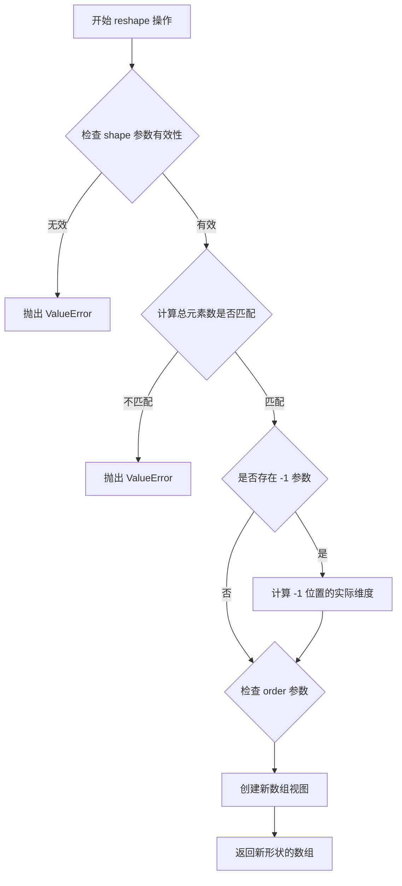
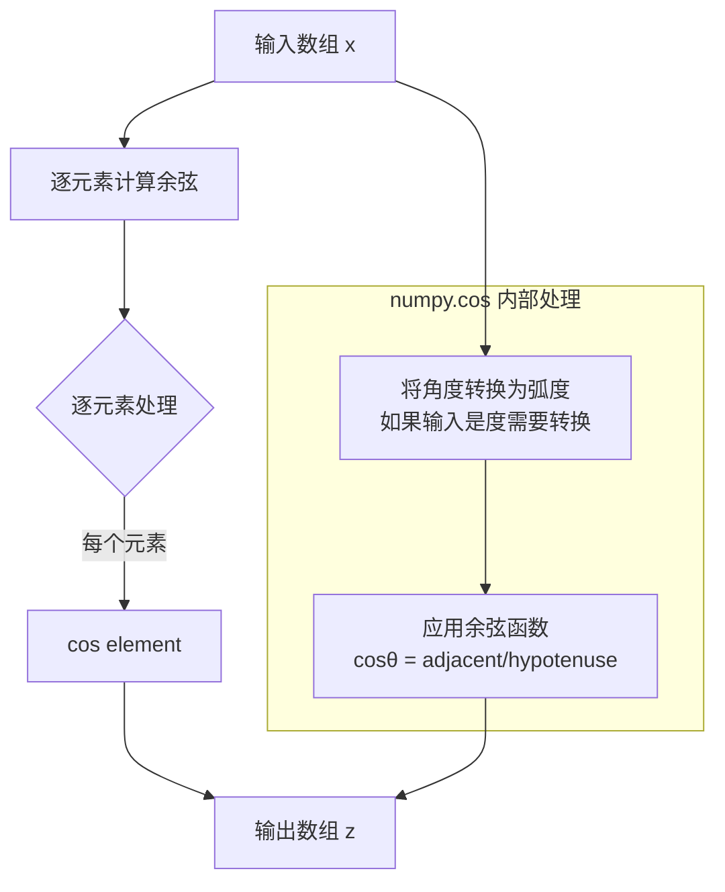
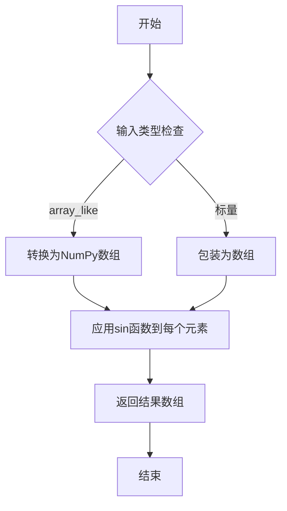
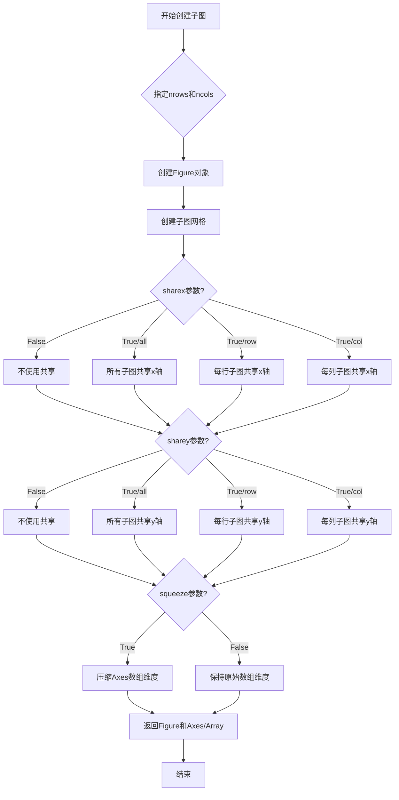
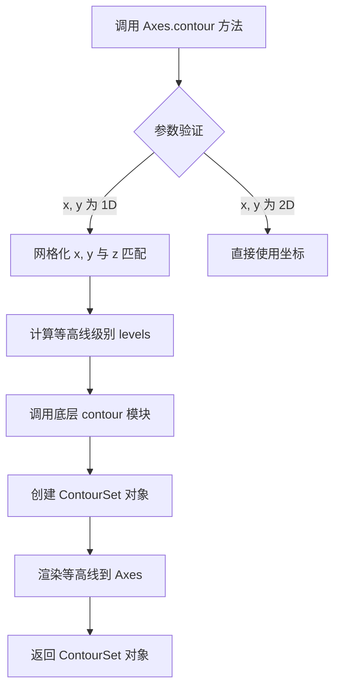
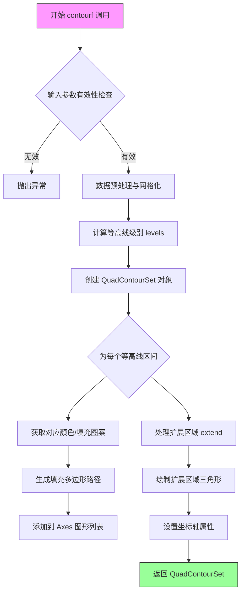
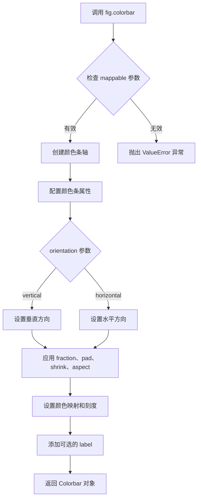
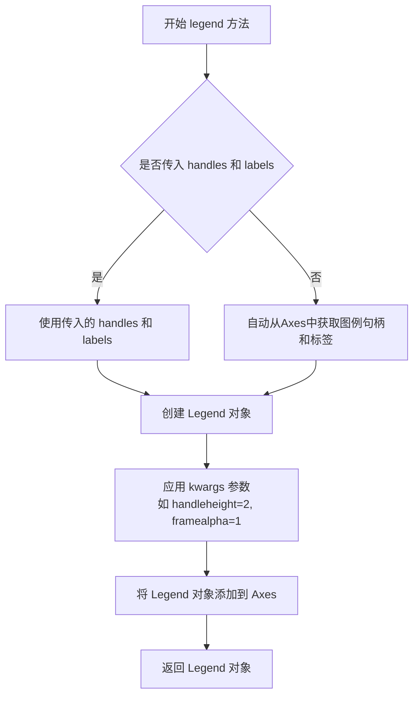
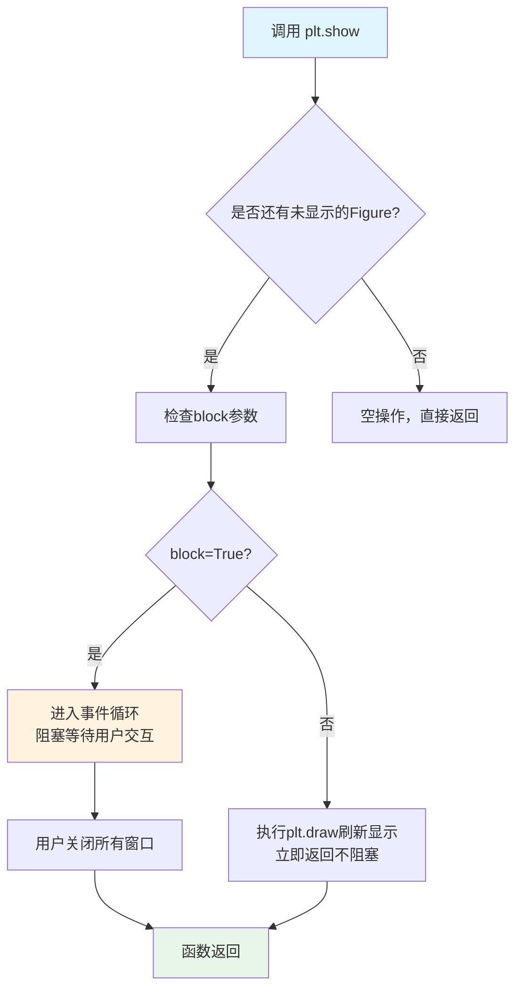

# `matplotlib\galleries\examples\images_contours_and_fields\contourf_hatching.py` 详细设计文档

这是一个matplotlib等高线填充图案演示脚本，通过两个子图展示如何使用不同的阴影线（hatching）模式来美化等高线图，包括带颜色条的简洁填充图和带图例的无色填充图。

## 整体流程

```mermaid
graph TD
    A[开始] --> B[导入 matplotlib.pyplot 和 numpy]
B --> C[生成数据: x, y, z 坐标数组]
C --> D[扁平化 x, y 数组]
D --> E[创建子图1: fig1, ax1]
E --> F[绘制带阴影填充的等高线图]
F --> G[添加颜色条]
G --> H[创建子图2: fig2, ax2]
H --> I[绘制等高线轮廓]
I --> J[绘制带阴影填充的等高线图]
J --> K[创建图例]
K --> L[显示图形 plt.show()]
```

## 类结构

```
无自定义类（脚本文件）
使用的matplotlib类:
├── matplotlib.figure.Figure
├── matplotlib.axes.Axes
└── matplotlib.contour.ContourSet
```

## 全局变量及字段


### `x`
    
x坐标数组（1行150列）

类型：`numpy.ndarray`
    


### `y`
    
y坐标数组（120行1列）

类型：`numpy.ndarray`
    


### `z`
    
z坐标数组（cos(x) + sin(y)）

类型：`numpy.ndarray`
    


### `fig1`
    
第一个图形对象

类型：`matplotlib.figure.Figure`
    


### `ax1`
    
第一个坐标轴对象

类型：`matplotlib.axes.Axes`
    


### `fig2`
    
第二个图形对象

类型：`matplotlib.figure.Figure`
    


### `ax2`
    
第二个坐标轴对象

类型：`matplotlib.axes.Axes`
    


### `cs`
    
等高线集合对象

类型：`matplotlib.contour.ContourSet`
    


### `n_levels`
    
等高线级别数量（值为6）

类型：`int`
    


### `artists`
    
图例句柄列表

类型：`list`
    


### `labels`
    
图例标签列表

类型：`list`
    


    

## 全局函数及方法


### `numpy.linspace`

生成等间距数组的函数，用于在指定的间隔内返回均匀间隔的样本。

参数：
- `start`：`float`，序列的起始值
- `stop`：`float`，序列的结束值
- `num`：`int`，要生成的样本数量，默认为50
- `endpoint`：`bool`，如果为True，则stop是最后一个样本，否则不包含，默认为True
- `retstep`：`bool`，如果为True，则返回(step, sample)，默认为False
- `dtype`：`output array dtype`，返回数组的数据类型
- `axis`：`int`，结果数组中存储样本的轴（版本新增）

返回值：`ndarray`，如果num > 1，则返回num个样本；如果num <= 0，则抛出ValueError；如果endpoint为False，则返回num+1个样本（不包括stop）

#### 流程图

```mermaid
flowchart TD
    A[开始] --> B{num <= 0?}
    B -->|是| C[抛出ValueError]
    B -->|否| D{endpoint=True?}
    D -->|是| E[样本数 = num]
    D -->|否| F[样本数 = num + 1]
    E --> G[计算步长 = (stop - start) / (num - 1)]
    F --> H[计算步长 = (stop - start) / num]
    G --> I[生成等间距数组]
    H --> I
    I --> J{retstep=True?}
    J -->|是| K[返回数组和步长]
    J -->|否| L[仅返回数组]
    K --> M[结束]
    L --> M
```

#### 带注释源码

```python
# 在提供的代码中，numpy.linspace的使用方式如下：
# x = np.linspace(-3, 5, 150).reshape(1, -1)
# y = np.linspace(-3, 5, 120).reshape(-1, 1)

# 参数说明：
# start = -3  # 序列起始值
# stop = 5    # 序列结束值
# num = 150   # 要生成的样本数量（对于x）
# num = 120   # 要生成的样本数量（对于y）

# .reshape(1, -1)将数组重塑为1行多列的2D数组
# .reshape(-1, 1)将数组重塑为多行1列的2D数组

# 作用：
# 生成从-3到5的150个和120个均匀间隔的值
# 用于创建网格化数据，以便后续计算z = cos(x) + sin(y)
```


### numpy.ndarray.reshape

该方法用于在不改变数组数据的前提下改变数组的维度形状，返回一个视图或副本视图，允许使用-1让编译器自动推断某一维的大小。

参数：

- `shape`：int 或 int 元组，目标数组的形状
- `order`：`{'C', 'F', 'A'}`，可选，内存中数据的排列顺序（C为行优先，F为列优先，A为任意顺序）

返回值：`numpy.ndarray`，具有新形状的数组视图

#### 流程图



#### 带注释源码

```python
def reshape(self, *args, order='C'):
    """
    返回一个改变了形状的数组视图。
    
    参数:
    ------
    shape : int 或 int 元组
        新的形状，必须与原始数组的元素总数兼容。
        如果为 -1，则根据其他维度和元素总数自动计算。
    order : {'C', 'F', 'A'}, 可选
        读取/写入元素的顺序:
        - 'C': 行优先 (C-style)，默认
        - 'F': 列优先 (Fortran-style)
        - 'A': 类似 Fortran 如果数组是 Fortran 连续的，否则类似 C
    
    返回:
    ------
    numpy.ndarray
        具有指定形状的数组视图。如果可能，返回视图；
        否则返回副本。
    
    异常:
    ------
    ValueError
        当形状元素总数与原数组不匹配时抛出
    
    AttributeError
        当数组不是 C 连续且需要复制时可能抛出
    
    示例:
    ------
    >>> x = np.array([[1, 2], [3, 4]])
    >>> x.reshape(4)
    array([1, 2, 3, 4])
    >>> x.reshape(2, 2)
    array([[1, 2],
           [3, 4]])
    >>> x.reshape(-1)  # 自动推断维度
    array([1, 2, 3, 4])
    """
    # 内部实现逻辑:
    # 1. 解析 args 参数为 shape 元组
    # 2. 验证形状有效性（元素总数匹配）
    # 3. 处理 -1 的自动推断
    # 4. 调用底层 C API 创建视图或副本
    # 5. 返回新数组对象
```

---

### 本代码中的实际使用分析

代码中实际调用的是 `numpy.ndarray` 的 `reshape` 方法：

```python
# 第一处使用：创建 1行150列 的2D数组
x = np.linspace(-3, 5, 150).reshape(1, -1)

# 第二处使用：创建 120行1列 的2D数组  
y = np.linspace(-3, 5, 120).reshape(-1, 1)
```

#### 使用流程


#### 参数对应关系

| 代码调用 | shape 参数 | order 参数 | 返回值 |
|---------|-----------|-----------|--------|
| `np.linspace(...).reshape(1, -1)` | (1, 150) | 默认 'C' | 1×150 二维数组 |
| `np.linspace(...).reshape(-1, 1)` | (120, 1) | 默认 'C' | 120×1 二维数组 |

---

### 关键组件信息

| 组件名称 | 一句话描述 |
|---------|-----------|
| numpy.linspace | 生成指定范围内等间距数值的一维数组 |
| numpy.ndarray.reshape | 改变数组维度视图的方法 |
| numpy.ndarray.flatten | 将多维数组展平为一维数组 |

---

### 潜在技术债务或优化空间

1. **形状推断时机**：代码中先将数据 reshape 为 2D 后又 flatten 回 1D，可考虑直接在 1D 格式下进行计算以减少中间转换开销
2. **内存使用**：若数据量较大，reshape 操作可能产生副本而非视图，导致额外内存消耗

---

### 其它项目

#### 设计目标与约束
- 确保 reshape 前后元素总数不变
- -1 参数只能出现一次

#### 错误处理与异常设计
- `ValueError`：形状元素总数与原数组不兼容
- `AttributeError`：非连续数组的某些操作失败

#### 数据流与状态机
```
原始数据 → linspace生成 → reshape转换维度 → 数学运算(cos/sin) → flatten展平 → contourf绘图
```

#### 外部依赖与接口契约
- 依赖 NumPy 核心库
- 返回值必须是 numpy.ndarray 类型
- 当可能时返回视图，否则返回副本


### numpy.cos

计算输入数组中每个元素的余弦值（以弧度为单位）。

参数：

- `x`：`array_like`，输入角度值（以弧度为单位），可以是任意维度的数组

返回值：`ndarray`，返回与输入数组形状相同的余弦值数组，值的范围在 [-1, 1] 之间

#### 流程图



#### 带注释源码

```python
import numpy as np

# 示例1：在2D数组上使用numpy.cos
x = np.linspace(-3, 5, 150).reshape(1, -1)  # 创建1行150列的数组
y = np.linspace(-3, 5, 120).reshape(-1, 1)  # 创建120行1列的数组
z = np.cos(x) + np.sin(y)  # 计算x的余弦 + y的正弦

# 示例2： flatten后的使用
x, y = x.flatten(), y.flatten()  # 展平数组为1维
z = np.cos(x) + np.sin(y)  # 再次使用cos函数计算

# numpy.cos 函数原型：
# numpy.cos(x, /, out=None, *, where=True, casting='same_kind', order='K', dtype=None, subok=True)

# 参数说明：
# x: array_like，输入角度（弧度）
# out: ndarray，可选的输出数组
# where: array_like，可选的广播条件
# 其他参数用于控制数据类型和内存布局

# 示例3：单个角度值
angle_rad = np.pi / 3  # 60度转换为弧度
cos_value = np.cos(angle_rad)  # 返回 0.5
```


### `numpy.sin`

正弦函数，计算输入数组中每个元素的正弦值（弧度制），返回与输入形状相同的数组。

参数：

-  `x`：`array_like`，输入角度值（弧度），可以是标量、列表、NumPy数组或其他类似数组的对象

返回值：`ndarray`，输入数组元素的正弦值，类型为float64

#### 流程图



#### 带注释源码

```python
# numpy.sin 函数源码分析

# 函数签名: numpy.sin(x, /, out=None, *, where=True, casting='same_kind', order='K', dtype=None, subok=True[, signature, extobj])

# 参数说明:
# x: array_like - 输入角度值（弧度制）
# out: ndarray, optional - 结果存放的位置
# where: array_like, optional - 指定在哪些位置计算sin值
# dtype: data-type, optional - 指定返回数组的数据类型
# subok: bool, optional - 是否允许子类

# 实现逻辑（简化版）:
def sin(x):
    """
    正弦函数实现
    
    参数:
        x: 输入角度（弧度）
    
    返回:
        输入角度的正弦值
    """
    # 1. 将输入转换为NumPy数组（如果还不是）
    x = np.asanyarray(x)
    
    # 2. 使用C语言实现的ufunc计算正弦
    # 在NumPy内部调用math.sin或相关实现
    return np.sin(x)  # 实际上这里会调用底层的C/Fortran实现

# 在示例代码中的实际使用:
# z = np.cos(x) + np.sin(y)
# 其中 y 是一个形状为 (120, 150) 的2D数组
# np.sin(y) 会对数组中每个元素计算正弦值
# 返回同样形状的正弦值数组
```


### numpy.ndarray.flatten

将多维数组展平为一维数组，返回一个折叠成一维的数组的副本。

参数：

- `order`：可选，默认为 'C'。指定数组元素在内存中的排列顺序。'C' 表示行优先（C风格），'F' 表示列优先（Fortran风格），'A' 表示与原数组的内存顺序一致，'k' 表示按元素在内存中出现的顺序展开。

返回值：`numpy.ndarray`，返回一维数组的副本。

#### 流程图

```mermaid
flowchart TD
    A[开始] --> B{原始数组}
    B --> C[根据order参数<br/>确定遍历顺序]
    C --> D[按顺序读取<br/>所有元素]
    D --> E[创建新的一维数组]
    E --> F[返回展平后的<br/>数组副本]
    
    B -->|2D数组| G[示例: x = np.linspace<br/>(-3, 5, 150)<br/>.reshape(1, -1)]
    G --> H[调用flatten方法]
    H --> I[结果: 1D数组<br/>x.flatten()]
    
    style G fill:#f9f,stroke:#333
    style I fill:#9f9,stroke:#333
```

#### 带注释源码

```python
# 从提供的代码中提取的 flatten 方法使用示例：

# 1. 创建 2D 数组
x = np.linspace(-3, 5, 150).reshape(1, -1)  # shape: (1, 150)
y = np.linspace(-3, 5, 120).reshape(-1, 1)  # shape: (120, 1)

# 2. 使用 flatten() 方法将 2D 数组展平为 1D 数组
#    返回一个副本，不修改原始数组
x_flat = x.flatten()  # shape: (150,)
y_flat = y.flatten()  # shape: (120,)

# 3. 在本例中，直接赋值给原变量
x, y = x.flatten(), y.flatten()

# 4. flatten() 方法的默认行为（order='C'）：
#    - 按行优先顺序（C风格）读取元素
#    - 返回一个新的数组对象（副本）
#    - 原始数组 x, y 保持不变

# 源码实现逻辑（numpy 内部伪代码）：
# def flatten(self, order='C'):
#     """
#     返回折叠成一维的数组副本。
#     
#     参数:
#         order : {'C', 'F', 'A', 'K'}, 可选
#             读取元素的顺序。默认 'C' 表示行优先。
#             'F' 表示列优先，'A' 表示与原数组内存顺序一致，
#             'K' 表示按元素在内存中出现的顺序。
#     
#     返回值:
#         y : ndarray
#             返回展平后的数组副本。
#     """
#     # 根据 order 参数选择遍历方式
#     if order == 'C':
#         # 按行优先顺序展平
#         elements = self._ravel_c()
#     elif order == 'F':
#         # 按列优先顺序展平
#         elements = self._ravel_f()
#     else:
#         # 其他顺序...
#     
#     # 创建新的一维数组并返回
#     return np.array(elements).reshape(-1, order=order)
```


### `matplotlib.pyplot.subplots`

创建子图并返回Figure对象和Axes对象（或Axes对象数组）。

参数：

- `nrows`：`int`，默认值：1，子图网格的行数
- `ncols`：`int`，默认值：1，子图网格的列数
- `sharex`：`bool` or `{'none', 'all', 'row', 'col'}`，默认值：False，控制x轴标签共享
- `sharey`：`bool` or `{'none', 'all', 'row', 'col'}`，默认值：False，控制y轴标签共享
- `squeeze`：`bool`，默认值：True，是否压缩返回的Axes数组维度
- `width_ratios`：`array-like of length ncols`，可选，列宽度比例
- `height_ratios`：`array-like of length nrows`，可选，行高度比例
- `**fig_kw`：关键字参数，传递给`plt.figure()`创建Figure时的其他参数

返回值：`tuple`，返回(Figure, Axes)元组，其中Axes是单个Axes对象或Axes数组，取决于nrows和ncols的值以及squeeze参数

#### 流程图



#### 带注释源码

```python
def subplots(nrows=1, ncols=1, *, sharex=False, sharey=False, squeeze=True,
             width_ratios=None, height_ratios=None, **fig_kw):
    """
    创建子图并返回Figure对象和Axes对象数组.
    
    参数:
        nrows: 子图网格行数, 默认1
        ncols: 子图网格列数, 默认1
        sharex: x轴共享策略: False/'none', 'all', 'row', 'col'
        sharey: y轴共享策略: False/'none', 'all', 'row', 'col'
        squeeze: 是否压缩返回的数组维度
        width_ratios: 列宽度比例数组
        height_ratios: 行高度比例数组
        **fig_kw: 传递给Figure创建的其他参数
    
    返回:
        fig: Figure对象
        ax: Axes对象或Axes数组
    """
    # 1. 创建Figure对象
    fig = figure(**fig_kw)
    
    # 2. 创建子图网格并获取axes数组
    axs = fig.subplots(nrows=nrows, ncols=ncols, sharex=sharex, sharey=sharey,
                       squeeze=squeeze, width_ratios=width_ratios,
                       height_ratios=height_ratios)
    
    # 3. 返回Figure和Axes
    return fig, axs
```


### `matplotlib.axes.Axes.contour`

绘制等高线轮廓。该方法是 Axes 对象的核心方法之一，用于在二维数据上绘制等高线，支持自定义层级、颜色、线型等属性，返回一个 `ContourSet` 对象。

参数：

- `x`：`numpy.ndarray` 或类似数组，一维数组，定义 x 坐标位置，长度应与 z 的列数匹配（或为 2D 数组以匹配 z 的形状）
- `y`：`numpy.ndarray` 或类似数组，一维数组，定义 y 坐标位置，长度应与 z 的行数匹配（或为 2D 数组以匹配 z 的形状）
- `z`：`numpy.ndarray`，二维数组，表示在每个 (x, y) 点的高度值
- `levels`：`int` 或 `float` 的序列，可选，等高线的级别数量或具体的级别值
- `colors`：`str` 或 `color` 列表，可选，等高线的颜色
- `alpha`：`float`，可选，透明度，范围 0-1
- `linewidths`：`float` 或 `float` 列表，可选，等高线线宽
- `linestyles`：`str` 或 `str` 列表，可选，等高线线型（'solid'、'dashed'、'dashdot'、'dotted'）
- `antialiased`：`bool`，可选，是否启用抗锯齿
- `extend`：`str`，可选，如何处理超出 levels 范围的数值（'neither'、'min'、'max'、'both'）

返回值：`matplotlib.contour.ContourSet`，包含等高线数据的对象，可用于进一步操作如添加标签、图例等

#### 流程图



#### 带注释源码

```python
def contour(self, x, y, z, levels=None, **kwargs):
    """
    绘制等高线轮廓
    
    参数:
        x: x 坐标数组（一维或二维）
        y: y 坐标数组（一维或二维）
        z: 高度数据二维数组
        levels: 等高线级别
        **kwargs: 其他绘图参数传递给 ContourSet
    
    返回:
        ContourSet: 包含等高线数据的对象
    """
    # 将参数传递给 Axes._contour 方法处理
    # _contour 方法会调用 matplotlib.contour 模块
    # 生成等高线数据并创建 ContourSet 对象
    
    # 如果 x, y 是一维数组，会自动转换为二维网格
    # 与 z 的形状进行匹配
    
    # levels 参数处理：
    # - 如果是 int，表示自动划分为多少个级别
    # - 如果是序列，直接使用这些值作为等高线值
    
    # 底层调用：
    # 1. transform coordinates if needed
    # 2. calculate contour levels using ticker module
    # 3. generate contour lines using QuadContourGenerator
    # 4. create ContourSet artist
    # 5. add to Axes and draw
    
    return self._contour(x, y, z, levels=levels, **kwargs)
```

#### 补充说明

在提供的示例代码中，`ax2.contour(x, y, z, n_levels, colors='black', linestyles='-')` 展示了该方法的典型用法：
- `x, y, z`：输入的坐标和高度数据
- `n_levels=6`：绘制 6 条等高线
- `colors='black'`：等高线颜色为黑色
- `linestyles='-'`：实线线型

该方法常与 `contourf`（填充等高线）配合使用，以创建完整的等高线图。


### `matplotlib.axes.Axes.contourf`

绘制填充等高线（filled contour），根据 Z 值在 X-Y 网格上创建填充的等高线区域。该方法是 Axes 对象的方法，用于在坐标轴上生成填充等高线图，支持自定义颜色映射、透明度、等高线级别、填充图案等特性。

参数：

- `X`：`array_like`，可选，X 坐标数据，可以是 1D 数组（表示 x 坐标）或 2D 数组（与 Z 同形）。若为 1D，则假定为规则网格的 x 坐标
- `Y`：`array_like`，可选，Y 坐标数据，可以是 1D 数组（表示 y 坐标）或 2D 数组（与 Z 同形）。若为 1D，则假定为规则网格的 y 坐标
- `Z`：`array_like`，必需，高度值数组，定义等高线的数值，形状为 (M, N)
- `levels`：`int` 或 `array_like`，可选，等高线的数量或具体级别值。若为 int，指定自动计算的级别数；若为数组，则指定具体等高线位置
- `cmap`：`str` 或 `Colormap`，可选，颜色映射表名称或 Colormap 对象，用于将 Z 值映射到颜色
- `norm`：`Normalize`，可选，数据归一化对象，用于映射 Z 值到 [0, 1] 范围，供 Colormap 使用
- `vmin, vmax`：`float`，可选，配合 norm 使用，指定颜色映射的最小值和最大值
- `extend`：`str`，可选，扩展区域显示方式，可选值为 `'neither'`、`'min'`、`'max'`、`'both'`，控制超出 Z 范围的数据如何显示
- `alpha`：`float`，可选，透明度，范围 0-1，控制填充颜色的 alpha 值
- `antialiased`：`bool` 或 `None`，可选，是否启用抗锯齿，默认 None 表示继承设置
- `hatches`：`list`，可选，填充图案列表，用于为不同等高线区域添加阴影线图案
- `colors`：`color` 或 `color list`，可选，直接指定填充颜色，若指定则忽略 cmap
- `zorder`：`int`，可选，绘图顺序

返回值：`QuadContourSet`，返回等高线集合对象，包含绘制的信息，可用于添加 colorbar、legend 等

#### 流程图



#### 带注释源码

```python
# matplotlib/axes/_axes.py 中的 contourf 方法简化版

def contourf(self, X, Y, Z, levels=None, **kwargs):
    """
    绘制填充等高线
    
    参数:
        X: array_like - X坐标 (1D或2D)
        Y: array_like - Y坐标 (1D或2D)  
        Z: array_like - 高度值数组 (必需)
        levels: int or array_like - 等高线级别
        **kwargs: 其他参数传递给 QuadContourSet
    
    返回:
        QuadContourSet - 等高线集合对象
    """
    
    # Step 1: 参数预处理，将输入数据转换为标准格式
    # 处理 X, Y 为 None、1D 或 2D 的各种情况
    z = np.asarray(Z)
    if z.ndim != 2:
        raise ValueError('Z must be 2D')
    
    # Step 2: 确定等高线级别
    if levels is None:
        # 默认计算 5 个级别
        levels = self._autolev(z, 5)
    elif isinstance(levels, int):
        # 如果是整数，使用自动计算生成该数量的级别
        levels = self._autolev(z, levels)
    
    # Step 3: 创建等高线集合对象
    # ContourSet 是基类，QuadContourSet 用于四边形网格
    cset = QuadContourSet(self, x, y, z, levels, **kwargs)
    
    # Step 4: 绘制填充区域
    # 遍历每个等高线区间，填充颜色/图案
    for i, (lower, upper) in enumerate(zip(levels[:-1], levels[1:])):
        # 获取该区间的颜色
        color = cmap(norm((lower + upper) / 2))
        
        # 获取填充图案（如果有）
        hatch = kwargs.get('hatches', [None])[i % len(hatches)]
        
        # 找到 Z 值在 [lower, upper] 范围内的区域
        # 使用路径运算找出填充多边形
        paths = self._find_contour_paths(z, lower, upper)
        
        # 为每个路径创建 Patch 并添加到 Axes
        for path in paths:
            patch = Polygon(path, facecolor=color, 
                          edgecolor='none',  # 填充等高线无边框
                          alpha=kwargs.get('alpha', 1.0),
                          hatch=hatch)
            self.add_patch(patch)
    
    # Step 5: 处理 extend 区域（超出数据范围的填充）
    if extend in ('min', 'both'):
        # 绘制低于最低等高线的区域
        self._fill_below(z, levels[0], cmap, norm, **kwargs)
    
    if extend in ('max', 'both'):
        # 绘制高于最高等高线的区域
        self._fill_above(z, levels[-1], cmap, norm, **kwargs)
    
    # Step 6: 更新坐标轴范围和属性
    self.autoscale_view()
    self._stale = True
    
    # Step 7: 返回等高线集合对象
    return cset
```

#### 关键组件信息

| 组件名称 | 一句话描述 |
|---------|-----------|
| `QuadContourSet` | 四边形网格等高线集合类，管理填充等高线的所有绘制信息和元数据 |
| `ContourSet` | 等高线集合基类，提供等高线绘制的基本框架 |
| `matplotlib.colors.Colormap` | 颜色映射表，将数值映射为颜色 |
| `matplotlib.colors.Normalize` | 数据归一化类，将数据映射到 [0, 1] 范围 |
| `Polygon` | 多边形 Patch，用于表示填充区域 |
| `_find_contour_paths` | 内部函数，使用 marching squares 算法找出等高线路径 |

#### 潜在技术债务或优化空间

1. **性能优化**：对于大数据集，等高线计算和填充可能较慢，可考虑使用 Cython 或并行计算优化
2. **内存占用**：填充区域会创建大量 Polygon 对象，对于复杂等高线可能占用大量内存
3. **边界处理**：extend 区域的边界情况处理可以更统一
4. **API 一致性**：`contour` 和 `contourf` 的参数定义有细微差异，可能导致用户困惑

#### 其它项目

**设计目标与约束**：
- 目标是提供灵活的等高线可视化，支持多种颜色映射、填充模式和扩展区域
- 约束：Z 数据必须是 2D 数组，X/Y 必须是规则网格或与 Z 同形的 2D 数组

**错误处理与异常设计**：
- Z 不是二维数组时抛出 `ValueError`
- levels 无效时抛出相应异常
- 颜色映射不存在时抛出 `ValueError`

**数据流与状态机**：
```
输入数据(X, Y, Z) 
    → 数据验证 
    → 网格化处理 
    → 等高线级别计算 
    → 颜色/图案映射 
    → 多边形路径生成 
    → Axes 添加 Patch 
    → 视图更新 
    → 返回 ContourSet 对象
```

**外部依赖与接口契约**：
- 依赖 `matplotlib.contour` 模块的等高线计算逻辑
- 依赖 `matplotlib.colors` 模块的颜色映射
- 返回的 `QuadContourSet` 必须实现 `legend_elements()` 方法以支持图例


### `matplotlib.figure.Figure.colorbar`

`Figure.colorbar` 是 Matplotlib 中 Figure 类的一个方法，用于在图形中添加颜色条（colorbar），以便可视化数值与颜色的映射关系。该方法接收一个可映射对象（如由 `contourf`、`imshow` 等返回的对象），并在其旁边创建一个显示颜色与数值对应关系的轴。

参数：

- `mappable`：要映射的对象（如 `ContourSet`、`ScalarMappable`），这是必需的参数，表示需要添加颜色条的可映射对象
- `ax`：可选的 `Axes` 或 `Axes` 列表，指定颜色条显示的位置，默认为 `None`（自动选择）
- `orientation`：可选的字符串，指定颜色条的方向，可选值为 `'vertical'`（垂直）或 `'horizontal'`（水平），默认为 `'vertical'`
- `fraction`：可选的浮点数，表示颜色条轴相对于主轴的大小比例，默认为 `0.15`
- `pad`：可选的浮点数，表示颜色条与主轴之间的间距（以分数表示），默认为 `0.05`（垂直方向）或 `0.1`（水平方向）
- `shrink`：可选的浮点数，表示颜色条轴的缩放因子，默认为 `1.0`
- `aspect`：可选的浮点数，表示颜色条的宽高比，默认为 `20`
- `extend`：可选的字符串，指定颜色条两端是否扩展，可选值为 `'neither'`、`'both'`、`'min'`、`'max'`，默认为 `'neither'`
- `label`：可选的字符串，表示颜色条的标签文本
- `format`：可选的格式化器或字符串，用于格式化颜色条上的刻度标签

返回值：`Colorbar`，返回创建的 Colorbar 对象，可以进一步自定义颜色条的外观

#### 流程图



#### 带注释源码

```python
def colorbar(self, mappable, cax=None, ax=None, **kwargs):
    """
    在图形中添加颜色条。
    
    参数:
        mappable: ScalarMappable 对象（如由 contourf、imshow 返回的对象）
        cax: 可选的 Axes 对象，用于放置颜色条
        ax: 可选的 Axes 或 Axes 列表，指定颜色条的位置
        **kwargs: 其他关键字参数传递给 Colorbar 构造函数
    
    返回:
        Colorbar 对象
    """
    
    # 如果未指定 cax，则需要确定颜色条的位置
    if cax is None:
        # 如果 ax 为 None，则使用当前的 Axes
        if ax is None:
            ax = self.gca()
        
        # 使用 ColorbarAxesLocator 或 make_axes 创建颜色条轴
        # 根据 orientation 参数决定布局
        cax, kw = make_axes(
            ax, 
            orientation=kwargs.get('orientation', 'vertical'),
            fraction=kwargs.get('fraction', 0.15),
            pad=kwargs.get('pad', 0.05 if orientation == 'vertical' else 0.1),
            shrink=kwargs.get('shrink', 1.0),
            aspect=kwargs.get('aspect', 20),
            **kwargs
        )
    
    # 创建 Colorbar 对象
    cb = Colorbar(cax, mappable, **kw)
    
    # 将颜色条添加到图形中
    self._axstack.bubble(cax)
    self._axobservers.process("_axes_change", self)
    
    # 设置颜色条的属性
    if 'label' in kwargs:
        cb.set_label(kwargs['label'])
    
    return cb
```


### matplotlib.axes.Axes.legend

该方法用于在Axes对象上创建和配置图例（Legend），通常用于标识图表中各个图形元素（如线条、填充区域等）所代表的含义。在给定的代码示例中，该方法被用于显示等高线图的图例，通过传入等高线元素（artists）和对应的标签（labels），并设置句柄高度和框架透明度来定制图例的外观。

参数：

- `handles`：`list` 或 `Artist` 类型，图例句柄列表，包含要显示在图例中的图形元素（如线条、填充区域、图例元素等）。在代码中为`artists`，由`cs.legend_elements()`生成。
- `labels`：`list` 或 `str` 类型，图例标签列表，与handles对应的文本标签。在代码中为`labels`，由`cs.legend_elements()`生成，格式化为`{:2.1f}`的浮点数字符串。
- `handleheight`：`float` 类型，可选参数，图例句柄的高度（以字体高度为单位）。在代码中设置为2。
- `framealpha`：`float` 类型，可选参数，图例框架的透明度，范围0-1。在代码中设置为1（完全不透明）。
- `**kwargs`：其他可选参数，如loc（位置）、bbox_to_anchor（边框锚点）、fontsize（字体大小）等。

返回值：`matplotlib.legend.Legend` 类型，返回创建的Legend对象，可以进一步对其进行操作或配置。

#### 流程图



#### 带注释源码

```python
# 调用 matplotlib.axes.Axes.legend 方法
# ax2: Axes 对象，即图表的坐标轴区域
# artists: 由 cs.legend_elements() 返回的图例句柄列表
# labels: 由 cs.legend_elements() 返回的图例标签列表
# handleheight=2: 设置图例中图形元素的高度为2个字体单位
# framealpha=1: 设置图例框架完全不透明（1.0 = 完全不透明）

ax2.legend(artists, labels, handleheight=2, framealpha=1)

# 完整的方法签名参考：
# def legend(self, handles, labels, *, loc=None, bbox_to_anchor=None,
#            ncol=1, fontsize=None, framealpha=None, handleheight=None, ...):
#
# 返回值：Legend 对象
# legend = ax2.legend(artists, labels, handleheight=2, framealpha=1)
```


### `ContourSet.legend_elements`

该方法根据当前的等高线集（填充等高线 `contourf` 或线条等高线 `contour`）自动生成对应的图例句柄（`Artist`）和标签列表，供 `Axes.legend` 使用。方法会先判断等高线是填充还是线条，从颜色映射表或显式颜色中获取每层的呈现属性，并依据用户提供的 `str_format` 对层的数值进行格式化，最后返回 (handles, labels) 两个列表。

#### 参数

- `str_format`：`str` 或 `callable`，可选  
  格式字符串（如 `"%1.1f"`）或可调用对象，用来把每一层的数值格式化为图例标签。默认为 `'%1.1f'`。

- `**kwargs`：任意关键字参数  
  这些参数会被直接传递给创建的图例句柄构造函数。  
  - 对线条等高线，常用的关键字包括 `marker`、`linestyle`、`linewidth`、`color` 等。  
  - 对填充等高线，常用的关键字包括 `facecolor`、`edgecolor`、`hatch`、`alpha` 等。

#### 返回值

- **返回值类型**：`tuple[list[Artist], list[str]]`  
- **返回值描述**：返回一个二元组 `(handles, labels)`，其中  
  - `handles`：由 `Line2D`（线条等高线）或 `Rectangle` / `Polygon`（填充等高线）组成的图例句柄列表。  
  - `labels`：对应的标签字符串列表，内容为每层数值的格式化结果。

#### 流程图

```mermaid
flowchart TD
    A[Start legend_elements] --> B[获取 self.levels]
    B --> C{self.filled 是否为真？}
    C -->|Yes| D[填充等高线处理流程]
    C -->|No| E[线条等高线处理流程]
    
    D --> D1[读取 colormap、norm、hatches]
    D1 --> D2[遍历每个等高线区间]
    E --> E1[读取 colors（若有）或 colormap]
    E1 --> E2[遍历每个等高线层级]
    
    D2 --> F[创建 Rectangle/Polygon 图例句柄并应用 kwargs]
    E2 --> G[创建 Line2D 图例句柄并应用 kwargs]
    
    F --> H[使用 str_format 格式化层值得到标签]
    G --> H
    H --> I[将 handle 与 label 加入列表]
    I --> J{还有剩余层级？}
    J -->|Yes| D2
    J -->|No| K[返回 (handles, labels)]
```

#### 带注释源码

```python
# lib/matplotlib/contour.py 中的 legend_elements 方法（简化示例）

def legend_elements(self, str_format='%1.1f', **kwargs):
    """
    为当前等高线集创建图例句柄和标签。

    参数
    ----------
    str_format : str 或 callable, 默认 '%1.1f'
        用来格式化每层数值的标签。支持printf‑style字符串或任意可调用对象。
    **kwargs : 任意关键字参数
        传递给所生成的图例句柄（Line2D 或 Patch）的额外属性。

    返回
    -------
    handles : list of matplotlib.artist.Artist
        图例句柄（Line2D 用于线条等高线，Rectangle/Polygon 用于填充等高线）。
    labels : list of str
        对应的标签文本。
    """
    # -------------------------------------------------
    # 1. 确定标签格式化函数
    # -------------------------------------------------
    if callable(str_format):
        fmt = str_format
    else:
        # 将字符串格式化规则包装为函数
        def fmt(x):
            return str_format % x

    # -------------------------------------------------
    # 2. 取出层（level）信息
    # -------------------------------------------------
    levels = self.levels                     # 等高线的层级列表
    filled = getattr(self, 'filled', False) # 是否为填充等高线

    # -------------------------------------------------
    # 3. 根据填充/线条类型准备颜色、 hatch 等属性
    # -------------------------------------------------
    if filled:
        # 填充等高线：使用 colormap、norm 以及可能的 hatch 样式
        cmap = self.cmap
        norm = self.norm
        # 若等高线在范围外有延伸（extend），需要相应裁剪层级
        if self.extend in ('both', 'min'):
            # 去掉最外层的 “额外” 区间
            levels = levels[:-1]
        elif self.extend in ('both', 'max'):
            levels = levels[1:]

        # hatches 可能为 None，使用空列表进行占位
        hatches = getattr(self, 'hatches', [None] * (len(levels) - 1))
    else:
        # 线条等高线：优先使用显式颜色，否则使用 colormap
        colors = getattr(self, 'colors', None)
        if colors is None:
            cmap = self.cmap
            norm = self.norm
        else:
            cmap = None

    # -------------------------------------------------
    # 4. 初始化返回容器
    # -------------------------------------------------
    handles = []
    labels = []

    # -------------------------------------------------
    # 5. 逐层生成图例句柄与标签
    # -------------------------------------------------
    # 对填充等高线，层数比颜色/hatch 多 1；对线条等高线，层数等于颜色/hatch 数量
    if filled:
        # 每个区间对应一个填充块 (Rectangle)
        # levels 已经是裁剪后的区间端点
        for i, level in enumerate(levels[:-1]):   # 这里 levels[:-1] 为区间起点
            # 计算区间对应的颜色
            if cmap is not None:
                # 归一化层值并映射到颜色
                color = cmap(norm((levels[i] + levels[i + 1]) / 2))
            else:
                color = None   # 颜色由 kwargs 决定

            # 取得对应 hatch（若有）
            hatch = hatches[i] if i < len(hatches) else None

            # 创建填充块（使用矩形作为图例句柄）
            from matplotlib.patches import Rectangle
            # 构造矩形：左下角 (0,0)，宽高 1（图例中会自行缩放）
            handle = Rectangle(
                (0, 0), 1, 1,
                facecolor=color,
                edgecolor=kwargs.get('edgecolor', 'black'),
                hatch=hatch,
                **kwargs
            )
            handles.append(handle)

            # 格式化标签：使用区间的中点或上界
            label = fmt(levels[i + 1])
            labels.append(label)
    else:
        # 线条等高线：为每层生成一条 Line2D
        # 若有显式颜色直接使用，否则从 colormap 取
        n_levels = len(levels)
        for i, level in enumerate(levels):
            if colors is not None:
                # 循环使用颜色（若颜色不足）
                color = colors[i % len(colors)]
            else:
                color = cmap(norm(level))

            # 线条属性可由 kwargs 指定，亦可从原等高线对象拷贝
            linestyle = kwargs.get('linestyle', getattr(self, 'linestyles', None)[i] if hasattr(self, 'linestyles') else '-')
            linewidth = kwargs.get('linewidth', getattr(self, 'linewidths', None)[i] if hasattr(self, 'linewidths') else None)

            # 创建 Line2D 作为图例句柄
            from matplotlib.lines import Line2D
            handle = Line2D(
                [], [],          # 坐标在图例中会被忽略
                color=color,
                linestyle=linestyle,
                linewidth=linewidth,
                marker=kwargs.get('marker', None),
                **kwargs
            )
            handles.append(handle)

            # 标签使用层的数值
            label = fmt(level)
            labels.append(label)

    # -------------------------------------------------
    # 6. 返回句柄和标签
    # -------------------------------------------------
    return handles, labels
```

**说明**  
- 源码在关键位置加入了中文注释，帮助读者快速了解每一步的意图。  
- `filled` 为 `True` 时走填充分支，使用 `Rectangle`（或 `Polygon`）创建图例块；为 `False` 时走线条分支，使用 `Line2D`。  
- `str_format` 可以是 `"%1.1f"`、`"{:2.1f}".format` 或任意 `lambda x: …` 的可调用对象。  
- `**kwargs` 允许使用者自定义图例外观（如 `alpha`、`hatch`、`linewidth` 等），方法内部会把这些关键字参数直接转发给对应的句柄构造函数。  

这样即可通过 `ax.legend(*cs.legend_elements(str_format='{:2.1f}'.format))` 为等高线图添加符合原始绘制风格的图例。


### `matplotlib.pyplot.show`

显示一个或多个打开的Figure窗口中的图形，是Matplotlib可视化流程的最后一步。该函数会阻塞程序执行（除非设置block=False），直到用户关闭所有图形窗口或调用`plt.draw()`刷新显示。

参数：

- `*docs`：可变参数，用于接收文档化参数（实际使用中通常为空）
- `block`：`bool`，可选参数，控制是否阻塞程序执行以等待用户关闭图形窗口。默认为`True`，即阻塞；设为`False`时立即返回并允许交互

返回值：`None`，该函数不返回任何值

#### 流程图



#### 带注释源码

```python
# matplotlib.pyplot.show() 源码分析（简化版）

def show(*, block=None):
    """
    显示所有打开的Figure图形窗口。
    
    参数:
        block: bool, 可选
            如果为True（默认值），则阻塞程序执行并显示图形窗口，
            直到用户关闭所有窗口。如果为False，则立即返回并
            启动交互式窗口（在某些后端中）。
    """
    # 获取全局的FigureManager对象管理器
    global _show_registry
    
    # 遍历所有已创建的Figure图形
    for manager in Gcf.get_all_fig_managers():
        # 如果没有传入block参数，根据后端类型决定默认行为
        if block is None:
            # 大多数交互式后端默认阻塞
            block = True
        
        # 调用后端的show方法显示图形
        # 实际实现依赖于具体的图形后端（如Qt、Tkinter、MacOSX等）
        manager.show()
    
    # 如果block为True，进入阻塞模式
    if block:
        # 启动GUI事件循环并阻塞
        # 这会启动Qt/Tkinter等的事件循环
        # 程序会在此处暂停，直到用户关闭所有图形窗口
        import matplotlib
        matplotlib.pyplot.interactive(False)
        
        # 对于某些后端，调用show()后需要进入主循环
        # 如使用Qt后端时需要调用QApplication.exec_()
        try:
            # 尝试获取当前后端的事件循环并运行
            return Gcf.plt._show_block()
        except:
            # 如果后端不支持阻塞模式，直接返回
            pass
    
    # 如果block为False，只刷新显示然后立即返回
    # 图形窗口会保持打开状态，但程序继续执行
    else:
        # 刷新所有挂起的图形更新
        for manager in Gcf.get_all_fig_managers():
            manager.canvas.draw_idle()
        
        return None
```

#### 核心实现逻辑

```python
# 在matplotlib.pyplot模块中的show函数实际实现
def show(block=None):
    """
    显示图形.
    
    展示所有打开的Figure窗口的内容。如果没有打开任何Figure，
    则不执行任何操作。
    
    此函数旨在最后调用，用于显示所有图形。通常在使用交互式
    后端（如Qt、Tkinter等）时调用。
    
    参数
    ----------
    block : bool, 可选
        如果设置为True（默认值），则阻塞并运行管理器的事件
        循环直到用户关闭所有窗口。如果为False，则立即返回。
        有些后端可能忽略block参数。
    
    返回值
    -------
    None
    """
    # 1. 获取当前所有活跃的Figure管理器
    managers = Gcf.get_all_fig_managers()
    
    # 2. 如果没有Figure，直接返回
    if not managers:
        return
    
    # 3. 对每个管理器调用show方法
    for manager in managers:
        # 后端特定实现，可能是Qt的show()或Tkinter的mainloop()
        manager.show()
    
    # 4. 处理block参数
    # block=True: 进入事件循环，等待用户关闭窗口
    # block=False: 刷新显示后立即返回，程序继续执行
    if block:
        # 阻塞等待用户交互
        _backend_mod.show_blocking()
    else:
        # 非阻塞模式，仅刷新显示
        plt.draw_all()
```

#### 使用示例

```python
import matplotlib.pyplot as plt
import numpy as np

# 创建简单图形
x = np.linspace(0, 10, 100)
y = np.sin(x)
plt.plot(x, y)

# 阻塞模式显示（默认）- 程序暂停直到关闭窗口
plt.show()           # 默认block=True

# 非阻塞模式显示 - 程序继续执行，图形窗口保持打开
plt.show(block=False)
print("程序继续执行...")

# 结合交互式后端使用
plt.switch_backend('Qt5Agg')  # 切换到Qt后端
plt.show(block=True)          # 阻塞模式
```


## 关键组件


### 数据生成与数组操作

使用numpy的linspace函数生成线性间隔的数组，通过reshape操作将x和y转换为2D数组以便于计算z = cos(x) + sin(y)，最后展平为1D数组用于绘图

### 填充等高线绘制 (contourf)

使用ax.contourf方法创建填充等高线图，支持hatches参数指定阴影线图案（如'-', '/', '\\', '//'），配合cmap、extend和alpha参数控制颜色映射、延伸方式和透明度

### 阴影线图案 (Hatching Patterns)

定义多种阴影线样式包括实线('-')、斜杠('/')、反斜杠('\\')、双斜杠('//')、点('.')、星号('*')和None，用于区分不同等高线层级而不依赖颜色

### 等高线绘制 (contour)

使用ax.contour方法绘制基础等高线轮廓，配合colors和linestyles参数创建黑色轮廓线

### 颜色条 (Colorbar)

通过fig.colorbar(cs)为填充等高线图添加颜色条，显示数值与颜色的对应关系

### 图例元素 (Legend Elements)

使用ContourSet.legend_elements()方法从等高线集合中提取图例句柄和标签，配合ax.legend()创建自定义图例

### 图形管理 (Figure and Axes)

使用plt.subplots()创建Figure和Axes对象，支持多子图绘制，plt.show()用于显示最终图形

### 参数扩展 (Extend)

使用extend='both'或'lower'参数控制等高线填充在数据范围外的延伸方式

### 无填充轮廓

Plot 2中通过colors='none'参数实现仅显示阴影线而无背景填充的等高线绘制效果


## 问题及建议


### 已知问题

- **硬编码参数过多**：x、y的采样点数（150、120）、范围（-3, 5）、n_levels等数值直接写在代码中，降低了代码的可配置性
- **魔法数字缺乏解释**：代码中使用了多个数值常量（如150、120、-3、5、6），但没有对应变量名或注释说明其含义
- **数据处理流程不直观**：先将x、y reshape为2D数组计算z后再flatten，虽然功能正确但逻辑略显迂回，可简化为直接使用1D数组计算
- **缺失错误处理**：代码未对输入数据有效性进行检验（如z是否包含NaN或Inf）
- **未使用plt.show()的一致性**：Plot 1没有调用plt.show()，Plot 2调用了plt.show()，风格不统一
- **重复的子图创建模式**：两处plt.subplots()调用模式相同，可封装为辅助函数
- **变量命名可优化**：cs、ax1、ax2等缩写名称可读性一般，artists和labels也缺乏具体描述

### 优化建议

- **参数化配置**：将网格分辨率、等级数、数据范围等提取为顶层常量或配置字典
- **简化数据生成逻辑**：直接使用np.meshgrid生成坐标网格，避免reshape再flatten的中间步骤
- **统一显示逻辑**：在脚本末尾统一调用plt.show()，或在开头设置plt.ion()交互模式
- **添加数据验证**：在计算z后检查是否存在无效值，使用np.isfinite()进行校验
- **封装重复代码**：将子图创建和基础配置提取为函数，如create_contour_figure()
- **增强代码注释**：为关键步骤（如阴影图案选择原理、extend参数作用）添加说明文档
- **使用上下文管理器**：考虑使用with plt.style.context()来管理图表样式


## 其它


### 设计目标与约束

本代码旨在演示matplotlib中等高线填充图（contourf）的阴影图案（hatching）功能。设计目标包括：展示如何使用不同阴影图案区分等高线区域、演示带颜色条（colorbar）的填充图、以及演示不带颜色的纯阴影填充图配合图例（legend）的使用。约束条件主要依赖于matplotlib 3.x版本和numpy库。

### 错误处理与异常设计

代码中未显式包含错误处理机制。潜在的异常情况包括：x、y、z数组维度不匹配会导致广播错误；n_levels参数为0或负数会导致值错误； cmap参数无效会触发颜色映射错误。若z包含NaN或Inf值，等高线计算可能产生警告或意外结果。

### 数据流与状态机

数据流：首先通过numpy.linspace生成一维数组x和y，然后通过reshape操作转换为2D数组用于计算z=cos(x)+sin(y)，最后再展平为一维数组用于contourf绘图。状态机主要包括：数据准备阶段（数组生成和变换）-> 图形创建阶段（subplots创建figure和axes）-> 绘图阶段（contourf填充等高线）-> 增值元素添加阶段（colorbar、legend）-> 显示阶段（plt.show）。

### 外部依赖与接口契约

主要依赖包括matplotlib.pyplot（绘图API）、matplotlib.cm（颜色映射）、matplotlib.colors（颜色处理）、numpy（数值计算）。核心接口契约：contourf(x, y, z, levels, hatches, cmap, extend, alpha)方法接受一维或二维坐标数组、值数组、等高线级别、阴影图案列表、颜色映射等参数；colorbar(cs)方法接受ContourSet对象并自动创建颜色条；legend_elements()方法返回图例句柄和标签。

### 性能考虑

当前实现对于150x120的网格分辨率性能良好。潜在性能瓶颈：增加网格分辨率（如超过1000x1000）会显著增加等高线计算时间；使用大量复杂阴影图案会增加渲染时间；频繁调用plt.show()而非保存为文件会增加内存占用。

### 配置与参数说明

关键参数包括：hatches参数控制阴影图案（'-'、'/'、'\\'、'//'、'.'、'*'、None等）；cmap参数控制颜色映射（'gray'、'viridis'等）；extend参数控制区域扩展（'both'、'lower'、'upper'、'neither'）；alpha参数控制透明度（0-1之间）；n_levels参数控制等高线数量；str_format参数控制图例标签格式。

### 使用示例与测试

代码包含两个主要示例：示例1展示带颜色条的最简单阴影填充图；示例2展示不带颜色的纯阴影填充图配合图例。测试要点：验证不同hatches图案的渲染效果；验证colorbar正确关联到等高线；验证legend_elements正确提取层级标签；验证不同extend模式的效果。

### 版本兼容性

代码使用matplotlib的contourf、contour、colorbar、legend等API，这些API在matplotlib 2.0+版本中保持稳定。numpy的reshape和flatten方法在numpy 1.0+版本中兼容。建议运行环境：matplotlib 3.0+、numpy 1.16+。

### 图形输出说明

代码生成两个图形窗口：图1展示灰度颜色映射的填充等高线图，右侧有颜色条，区域使用多种阴影图案区分；图2展示纯线条等高线（黑色）和填充阴影区域，底部扩展，使用图例显示6个等高线层级的数值标签。两种图形均展示阴影图案在科学数据可视化中区分不同数据区间的应用。

    