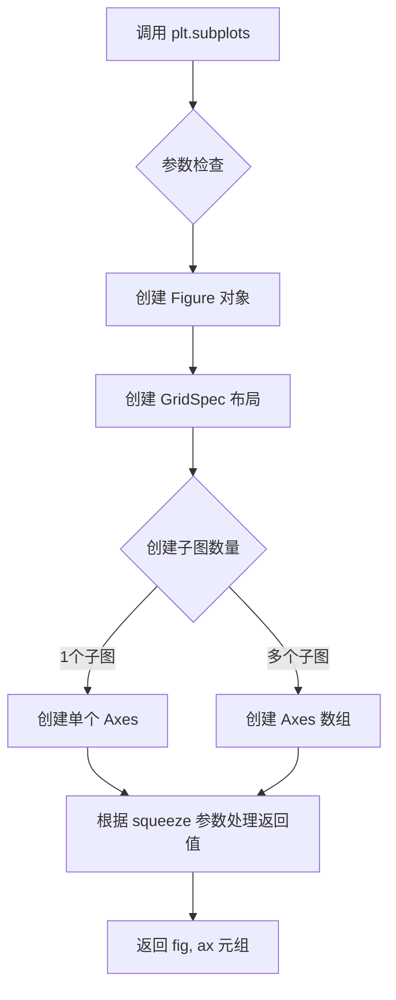
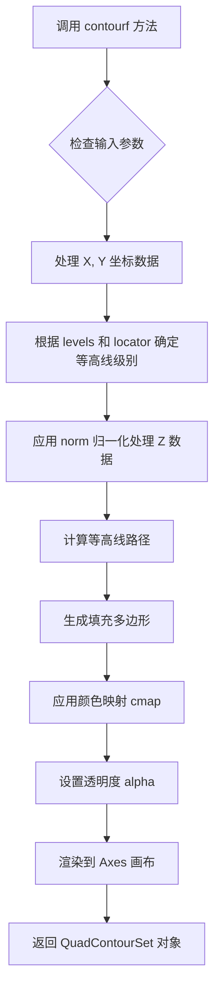
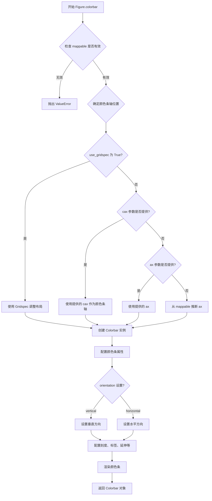
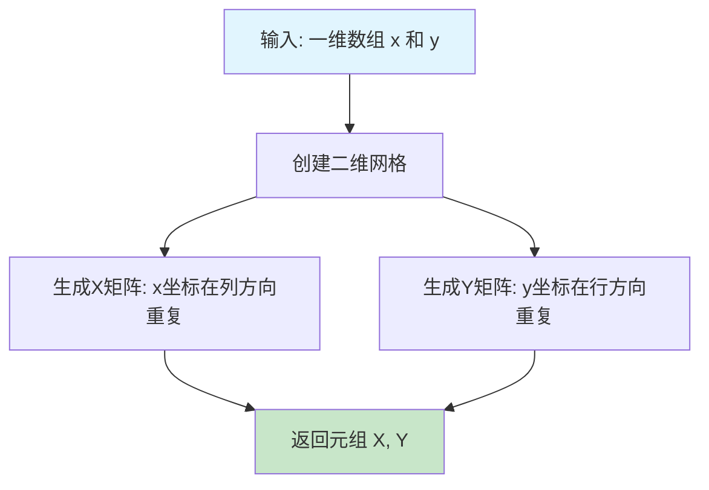
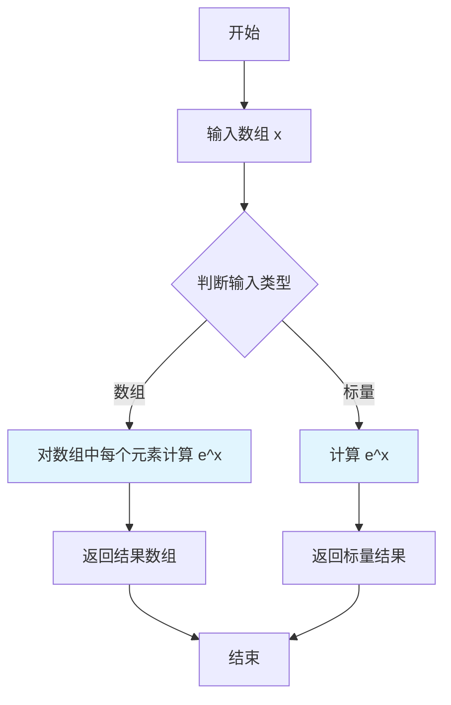
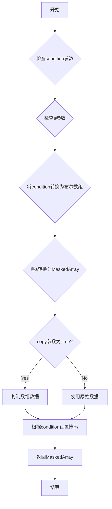
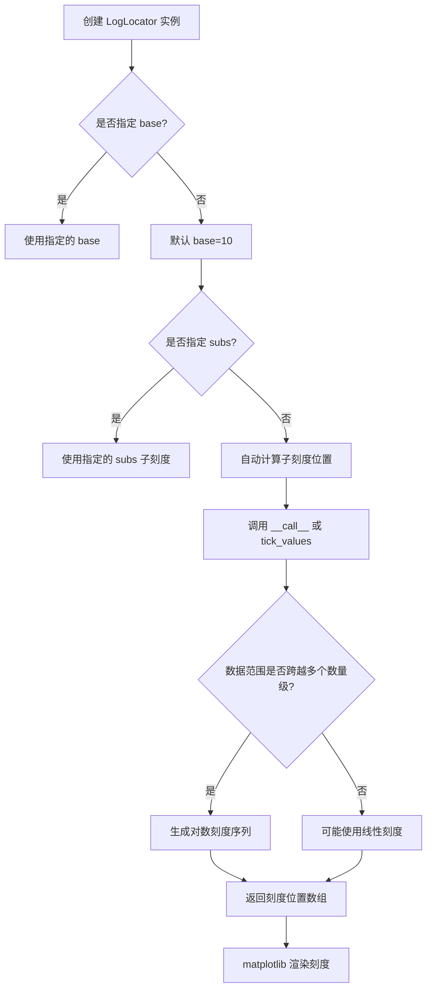

# `matplotlib\galleries\examples\images_contours_and_fields\contourf_log.py` 详细设计文档

这是一个matplotlib演示代码，展示了如何在contourf等高线图中使用对数颜色刻度（LogLocator），以便同时清晰显示低幅度的缓坡和高幅度的尖峰，并通过masked_where处理负值和零值以避免对数计算错误。

## 整体流程

```mermaid
graph TD
    A[开始] --> B[导入库: matplotlib.pyplot, numpy, numpy.ma, matplotlib.ticker]
B --> C[创建网格数据: x, y使用np.linspace]
C --> D[生成网格: X, Y = np.meshgrid(x, y)]
D --> E[计算Z值: Z1 = exp(-X² - Y²), Z2 = exp(-(10X)² - (10Y)²)]
E --> F[组合z = Z1 + 50*Z2]
F --> G[设置负值: z[:5,:5] = -1]
G --> H[mask负值和零: z = ma.masked_where(z <= 0, z)]
H --> I[创建图表: fig, ax = plt.subplots()]
I --> J[绘制等高线: cs = ax.contourf(..., locator=ticker.LogLocator())]
J --> K[添加颜色条: cbar = fig.colorbar(cs)]
K --> L[显示: plt.show()]
```

## 类结构

```
此代码为脚本式演示，无自定义类定义
主要使用matplotlib和numpy的以下类/模块：
├── matplotlib.pyplot (绘图接口)
├── matplotlib.figure.Figure (画布)
├── matplotlib.axes.Axes (坐标轴)
├── matplotlib.ticker.LogLocator (对数刻度定位器)
├── matplotlib.colorbar.Colorbar (颜色条)
└── numpy / numpy.ma (数值计算和掩码数组)
```

## 全局变量及字段


### `N`
    
网格分辨率/采样点数

类型：`int`
    


### `x`
    
X轴线性空间，从-3.0到3.0

类型：`numpy.ndarray`
    


### `y`
    
Y轴线性空间，从-2.0到2.0

类型：`numpy.ndarray`
    


### `X`
    
由x和y生成的网格矩阵（X坐标）

类型：`numpy.ndarray`
    


### `Y`
    
由x和y生成的网格矩阵（Y坐标）

类型：`numpy.ndarray`
    


### `Z1`
    
宽缓的高斯分布（衰减较慢）

类型：`numpy.ndarray`
    


### `Z2`
    
窄尖的高斯分布（衰减较快）

类型：`numpy.ndarray`
    


### `z`
    
组合后的Z值，包含负值被mask

类型：`numpy.ma.MaskedArray`
    


### `fig`
    
图形对象

类型：`matplotlib.figure.Figure`
    


### `ax`
    
坐标轴对象

类型：`matplotlib.axes.Axes`
    


### `cs`
    
等高线集合对象

类型：`matplotlib.contour.QuadContourSet`
    


### `cbar`
    
颜色条对象

类型：`matplotlib.colorbar.Colorbar`
    


    

## 全局函数及方法


### `matplotlib.pyplot.subplots`

`plt.subplots()` 是一个创建图形窗口和一个或多个子图的工厂函数，它是 `figure()` 和 `add_subplot()` 或 `add_axes()` 功能的组合封装，允许用户在单次调用中创建图形及其坐标轴，并返回图形对象和坐标轴对象（或数组）。

参数：

- `nrows`：`int`，默认值：1，子图网格的行数
- `ncols`：`int`，默认值：1，子图网格的列数
- `sharex`：`bool` 或 `str`，默认值：False，如果为 True，所有子图共享 x 轴
- `sharey`：`bool` 或 `str`，默认值：False，如果为 True，所有子图共享 y 轴
- `squeeze`：`bool`，默认值：True，如果为 True，从返回的坐标轴数组中移除额外维度
- `width_ratios`：`array-like`，长度为 ncols，定义列的相对宽度
- `height_ratios`：`array-like`，长度为 nrows，定义行的相对高度
- `gridspec_kw`：`dict`，传递给 GridSpec 构造器的关键字参数字典
- `**fig_kw`：传递给 `figure()` 调用的额外关键字参数

返回值：`tuple(Figure, Axes or array of Axes)`，返回图形对象和坐标轴对象（当 nrows=1 且 ncols=1 时返回单个 Axes 对象，否则返回 Axes 数组）

#### 流程图



#### 带注释源码

```python
def subplots(nrows=1, ncols=1, sharex=False, sharey=False, 
             squeeze=True, width_ratios=None, height_ratios=None,
             gridspec_kw=None, **fig_kw):
    """
    创建图形和坐标轴的工厂函数
    
    参数:
        nrows: 行数，默认为1
        ncols: 列数，默认为1
        sharex: 是否共享x轴
        sharey: 是否共享y轴
        squeeze: 是否压缩多余维度
        width_ratios: 列宽比例
        height_ratios: 行高比例
        gridspec_kw: 网格布局参数
        **fig_kw: 传递给figure的参数
    
    返回:
        fig: Figure对象
        ax: Axes对象或Axes数组
    """
    # 1. 创建Figure对象
    fig = figure(**fig_kw)
    
    # 2. 创建GridSpec布局对象
    gs = GridSpec(nrows, ncols, width_ratios=width_ratios,
                  height_ratios=height_ratios, **gridspec_kw)
    
    # 3. 创建子图数组
    ax_array = np.empty((nrows, ncols), dtype=object)
    
    # 4. 遍历每个网格位置创建Axes
    for i in range(nrows):
        for j in range(ncols):
            ax = fig.add_subplot(gs[i, j])
            ax_array[i, j] = ax
            
    # 5. 处理共享轴
    if sharex:
        # 设置x轴共享
        ...
    if sharey:
        # 设置y轴共享
        ...
    
    # 6. 根据squeeze处理返回值
    if squeeze:
        ax_array = ax_array.squeeze()
    
    # 7. 返回元组
    return fig, ax_array
```

#### 使用示例

```python
# 在提供的代码中使用
fig, ax = plt.subplots()  # 创建图形和单个坐标轴
cs = ax.contourf(X, Y, z, locator=ticker.LogLocator(), cmap="PuBu_r")  # 绑定到坐标轴
```


### `matplotlib.axes.Axes.contourf`

填充等高线绘图方法（filled contour plot），用于在二维网格上绘制填充的等高线图，支持对数颜色刻度和其他颜色归一化方式，常用于可视化三维数据在二维平面上的分布。

参数：

- `X`：`array-like`，可选，X轴坐标数据，可以是1D数组（表示X坐标）或2D数组（与Z同形状）
- `Y`：`array-like`，可选，Y轴坐标数据，可以是1D数组（表示Y坐标）或2D数组（与Z同形状）
- `Z`：`array-like`，必需，2D数组，表示每个点的高度/强度值
- `levels`：`int` 或 `array-like`，可选，等高线的数量或具体级别值
- `cmap`：`str` 或 `Colormap`，可选，颜色映射表名称或Colormap对象
- `norm`：`Normalize`，可选，数据归一化方式（例如LogNorm用于对数刻度）
- `locator`：`Locator`，可选，等高线级别的定位器（例如LogLocator用于自动对数级别）
- `extend`：`{'neither', 'min', 'max', 'both'}`，可选，指定是否扩展颜色范围
- `alpha`：`float`，可选，填充透明度（0-1之间）
- `antialiased`：`bool`，可选，是否启用抗锯齿
- `corner_mask`：`bool`，可选，是否启用角点遮罩
- `colors`：`array-like`，可选，如果没有设置cmap，则指定填充颜色
- `vmin`, `vmax`：`float`，可选，颜色映射的最小值和最大值
- `zorder`：`int`，可选，绘制顺序

返回值：`~matplotlib.contour.QuadContourSet`，包含等高线集合的QuadContourSet对象，可用于添加颜色条（colorbar）

#### 流程图



#### 带注释源码

```python
def contourf(self, *args, **kwargs):
    """
    填充等高线绘图方法
    
    主要参数:
    - *args: 位置参数，可以是:
      * contourf(Z) - Z为2D数组
      * contourf(X, Y, Z) - X, Y为坐标，Z为数据
      * contourf(X, Y, Z, levels) - 指定等高线级别
    - cmap: 颜色映射表
    - norm: 数据归一化（对数用LogNorm）
    - locator: 等高线定位器（对数用LogLocator）
    - levels: 等高线数量或级别数组
    - extend: 颜色扩展方式
    - alpha: 透明度
    
    返回值:
    - QuadContourSet: 包含等高线集合的对象
      * 可以传递给colorbar()显示颜色条
      * 属性levels包含等高线级别
      * 属性collections包含填充的多边形集合
    
    示例用法（参见代码）:
    ```python
    import matplotlib.pyplot as plt
    import numpy as np
    from matplotlib import ticker
    
    # 创建数据
    x = np.linspace(-3.0, 3.0, 100)
    y = np.linspace(-2.0, 2.0, 100)
    X, Y = np.meshgrid(x, y)
    Z1 = np.exp(-X**2 - Y**2)
    Z2 = np.exp(-(X * 10)**2 - (Y * 10)**2)
    z = Z1 + 50 * Z2
    
    # 绘制填充等高线，使用对数刻度
    fig, ax = plt.subplots()
    cs = ax.contourf(X, Y, z, locator=ticker.LogLocator(), cmap="PuBu_r")
    
    # 添加颜色条
    cbar = fig.colorbar(cs)
    
    plt.show()
    ```
    """
    # 方法实现位于 lib/matplotlib/axes/_axes.py
    # 核心逻辑:
    # 1. 解析输入参数 (X, Y, Z, levels)
    # 2. 创建等高线计算器 (ContourSet)
    # 3. 调用底层C/C++扩展进行等高线计算
    # 4. 生成填充多边形集合
    # 5. 应用颜色映射和归一化
    # 6. 返回QuadContourSet对象
    pass
```

### 关键组件信息

| 组件名称 | 一句话描述 |
|---------|-----------|
| `QuadContourSet` | 存储填充等高线结果的集合对象，包含级别、多边形和颜色信息 |
| `LogLocator` | 对数刻度等高线级别自动定位器，用于自动确定对数间隔的等高线 |
| `LogNorm` | 对数归一化，将数据映射到对数颜色空间 |
| `Colorbar` | 颜色条，显示颜色与数值的对应关系 |

### 潜在的技术债务或优化空间

1. **性能优化**：对于大规模网格数据，等高线计算可能较慢，可考虑使用并行计算或GPU加速
2. **边界处理**：负值和零值在对数刻度下需要特殊处理（代码中使用了masked数组）
3. **内存占用**：填充等高线会生成大量多边形对象，对于复杂图形可能占用较多内存

### 其它项目

**设计目标与约束**：
- 支持线性、对数和其他非线性颜色刻度
- 兼容1D和2D坐标输入
- 与colorbar无缝集成

**错误处理与异常设计**：
- 当Z包含负值或零值且使用对数刻度时会发出警告
- 数据维度不匹配时抛出ValueError
- 颜色映射与归一化不兼容时可能产生意外结果

**数据流与状态机**：
```
输入数据(Z) → 归一化处理(norm) → 等高线计算 → 颜色映射 → 填充渲染 → 输出QuadContourSet
```

**外部依赖与接口契约**：
- 依赖 `matplotlib.contour` 模块进行等高线计算
- 返回的QuadContourSet对象必须实现 `to_rgba()` 方法供colorbar使用
- 兼容matplotlib的标准颜色映射和归一化接口


### `matplotlib.figure.Figure.colorbar`

为图形添加颜色条（Colorbar），用于可视化图形中颜色与数值的对应关系。颜色条通过接收一个可映射对象（如由 `contourf`、`imshow` 等返回的对象），自动从该对象获取颜色映射（Colormap）和归一化对象（Normalize），并创建一个显示颜色与数值对应关系的侧边条。

参数：

-  `mappable`：`, Any`，要为其创建颜色条的可映射对象（通常是由 `contourf`、`imshow`、`pcolormesh` 等返回的对象，如 `QuadMesh` 或 `ContourSet`）
-  `ax`：`<class 'Axes'> | array_likeOfAxes | None`，要放置颜色条的轴，默认为 `None`，会自动推断
-  `cax`：`<class 'Axes'> | None`，用于放置颜色条的专用轴，默认为 `None`
-  `use_gridspec`：`<class 'bool'>`，是否使用 `gridspec` 来调整子图布局以容纳颜色条，默认为 `True`
-  `orientation`：`<class 'str'>`，颜色条的方向，可选 `'vertical'` 或 `'horizontal'`，默认为 `'vertical'`
-  `extend`：`<class 'str'>`，颜色条两端是否延伸，可选 `'neither'`、`'both'` 或 `'min'`/`'max'`，默认为 `'neither'`
-  `spacing`：`<class 'str'>`，颜色条刻度间距模式，可选 `'uniform'` 或 `'proportional'`，默认为 `'uniform'`
-  `shrink`：`<class 'float'>`，颜色条缩放因子，默认为 `1.0`
-  `aspect`：`<class 'float'> | None`，颜色条长宽比（宽度/高度），默认为 `None`
-  `pad`：`<class 'float'>`，颜色条与主图之间的间距（英寸），默认为 `None`
-  `fill`：`<class 'object'>`，填充对象，用于外部颜色条，默认为 `None`
-  `label`：`<class 'str'>`，颜色条标签，默认为 `''`

返回值：`<class 'Colorbar'>`

#### 流程图



#### 带注释源码

```python
def colorbar(self, mappable, *, ax=None, use_gridspec=True, **kwargs):
    """
    为图形添加颜色条。
    
    参数:
        mappable: 可映射对象（如 QuadMesh, ContourSet）
            包含颜色映射和归一化信息
        ax: Axes 对象, 可选
            要放置颜色条的轴
        use_gridspec: bool, 默认 True
            是否使用 Gridspec 调整布局
    
    返回:
        Colorbar: 颜色条对象
    """
    
    # 步骤1: 获取颜色条应放置的位置（轴）
    if use_gridspec and ax is None and cax is None:
        # 使用 Gridspec 自动调整布局
        ax = self.add_axes([0.85, 0.15, 0.05, 0.7])  # 调整位置和大小
    elif cax is None:
        # 使用提供的 ax 或从 mappable 推断
        ax = ax or mappable.axes
    
    # 步骤2: 从 mappable 获取颜色映射和归一化
    if hasattr(mappable, 'collections'):
        # 对于 ContourSet
        cmap = mappable.cmap
        norm = mappable.norm
    elif hasattr(mappable, 'cmap'):
        # 对于 QuadMesh / Image
        cmap = mappable.cmap
        norm = mappable.norm
    
    # 步骤3: 创建颜色条
    cb = Colorbar(ax, mappable, **kwargs)
    
    # 步骤4: 设置颜色条标签（如果提供）
    if 'label' in kwargs:
        cb.set_label(kwargs['label'])
    
    # 步骤5: 将颜色条添加到图形
    self._axinfo['colorbar'] = cb
    
    return cb
```


### `matplotlib.pyplot.show()`

`matplotlib.pyplot.show()` 是 Matplotlib 库中的核心显示函数，用于将所有当前打开的图形窗口显示在屏幕上，并更新图形内容。该函数会阻塞程序执行（默认行为），直到用户关闭所有图形窗口，从而确保图形能够完整展示给用户。

参数：

- `block`：`bool`，可选参数，默认值为 `True`。当设置为 `True` 时，函数会阻塞主线程，等待用户关闭图形窗口；当设置为 `False` 时，函数立即返回，允许程序继续执行，实现非阻塞式图形显示。

返回值：`None`，该函数不返回任何值，仅负责图形的渲染和显示。

#### 流程图

```mermaid
flowchart TD
    A[调用 plt.show()] --> B{是否阻塞执行?}
    B -- True --> C[显示所有打开的图形窗口]
    C --> D[进入事件循环]
    D --> E{用户是否关闭窗口?}
    E -- 是 --> F[函数返回, 程序继续执行]
    B -- False --> G[非阻塞模式]
    G --> H[更新图形并立即返回]
    H --> I[程序继续执行]
```

#### 带注释源码

```python
import matplotlib.pyplot as plt
import numpy as np

# 示例代码：展示 plt.show() 的使用方式

# 创建一个简单的正弦波图形
x = np.linspace(0, 2 * np.pi, 100)
y = np.sin(x)

# 绘制图形
plt.figure()
plt.plot(x, y)
plt.title('Sine Wave')
plt.xlabel('x')
plt.ylabel('sin(x)')

# 调用 plt.show() 显示图形
# 参数 block=True (默认): 阻塞程序直到用户关闭图形窗口
# 参数 block=False: 非阻塞显示, 程序继续执行
plt.show(block=True)   # 显示图形并阻塞程序

# 当 block=False 时的示例:
# plt.show(block=False)
# print("图形已显示, 程序继续执行...")
# plt.pause(5)  # 暂停5秒后自动关闭
```


### `numpy.linspace`

该函数用于创建指定范围内的等间隔数值序列，常用于生成图表的坐标轴数据。在本代码中，`np.linspace` 用于生成 X 和 Y 坐标网格的取值范围，创建了从 -3.0 到 3.0（x 轴）和从 -2.0 到 2.0（y 轴）的 100 个等间距采样点。

参数：

- `start`：`float` 或 `array_like`，序列的起始值。在代码中 x 轴为 -3.0，y 轴为 -2.0
- `stop`：`float` 或 `array_like`，序列的结束值。在代码中 x 轴为 3.0，y 轴为 2.0
- `num`：`int`（可选，默认值 50），生成的样本数量。在代码中为 100（即 N 的值）
- `endpoint`：`bool`（可选，默认值 True），若为 True，则 stop 值为最后一个样本；若为 False，则不包含 stop 值
- `retstep`：`bool`（可选，默认值 False），若为 True，则返回 (samples, step)，其中 step 为样本间的间隔
- `dtype`：`dtype`（可选），输出数组的数据类型，若未指定则从输入参数推断
- `axis`：`int`（可选），当 start 或 stop 为数组时，指定结果中样本存储的轴

返回值：`ndarray`，返回 num 个等间距采样的数组。若 `retstep` 为 True，则返回 (samples, step) 元组，其中 samples 为样本数组，step 为样本间隔。

#### 流程图

```mermaid
flowchart TD
    A[开始 linspace] --> B{检查参数有效性}
    B --> C[计算样本数量 num]
    C --> D[计算步长 step = (stop - start) / (num - 1)]
    D --> E{endpoint 为 True?}
    E -->|是| F[使用 num 个点, 包含端点]
    E -->|否| G[使用 num 个点, 不包含端点]
    F --> H[生成等差数列: start, start+step, ...]
    G --> H
    H --> I{retstep 为 True?}
    I -->|是| J[返回 samples 和 step]
    I -->|否| K[只返回 samples]
    J --> L[结束]
    K --> L
```

#### 带注释源码

```python
def linspace(start, stop, num=50, endpoint=True, retstep=False, dtype=None, axis=0):
    """
    返回指定范围内的等间隔数值序列。
    
    参数:
        start: 序列起始值，可以是单个数值或数组
        stop: 序列结束值，可以是单个数值或数组
        num: 生成样本的数量，默认50
        endpoint: 是否包含结束点，默认True
        retstep: 是否返回步长，默认False
        dtype: 输出数组的数据类型
        axis: 当输入为数组时，指定结果存储的轴
    
    返回:
        samples: 等间隔的数值序列
        step: 步长（仅当retstep=True时返回）
    """
    # 检查 num 必须为非负整数
    if num <= 0:
        return np.empty(0) if dtype is None else np.empty(0, dtype=dtype)
    
    # 计算步长
    # 如果不包含端点，则除以 num；否则除以 (num - 1)
    if endpoint:
        step = (stop - start) / (num - 1) if num > 1 else np.nan
    else:
        step = (stop - start) / num
    
    # 生成序列
    # 使用 float 类型进行计算以保证精度
    _dtype = float if dtype is None else dtype
    y = np.arange(0, num, dtype=_dtype) * step + start
    
    # 处理 dtype 转换
    if dtype is not None and dtype != _dtype:
        y = y.astype(dtype)
    
    # 处理 axis 参数（当 start/stop 为数组时）
    if axis != 0 and (np.ndim(start) > 0 or np.ndim(stop) > 0):
        # 对多维输入进行轴重塑
        pass  # 省略详细实现
    
    # 根据 retstep 返回结果
    if retstep:
        return y, step
    else:
        return y
```


### `numpy.meshgrid` / `np.meshgrid`

生成坐标网格矩阵，用于在二维平面上创建网格坐标数组，是matplotlib等库绘制等高线图、曲面图等可视化图形的基础数据准备步骤。

参数：

- `x`：`array_like`，一维数组，定义网格在x轴方向的坐标点
- `y`：`array_like`，一维数组，定义网格在y轴方向的坐标点

返回值：`tuple of ndarray`，返回两个二维数组组成的元组。第一个数组（X）包含每个网格点的x坐标，第二个数组（Y）包含每个网格点的y坐标，两者形状相同，用于后续的网格点坐标计算。

#### 流程图



#### 带注释源码

```python
# 在示例代码中的使用方式
N = 100
# 创建从-3.0到3.0的100个等间距点的一维数组
x = np.linspace(-3.0, 3.0, N)
# 创建从-2.0到2.0的100个等间距点的一维数组
y = np.linspace(-2.0, 2.0, N)

# 调用meshgrid生成坐标网格矩阵
# X: shape为(N, N)，每行相同，为x的重复
# Y: shape为(N, N)，每列相同，为y的重复
X, Y = np.meshgrid(x, y)

# 后续用于计算Z值（高度/颜色值）
Z1 = np.exp(-X**2 - Y**2)
Z2 = np.exp(-(X * 10)**2 - (Y * 10)**2)
z = Z1 + 50 * Z2
```

#### 关键组件信息

| 组件名称 | 一句话描述 |
|---------|-----------|
| `numpy.meshgrid` | 将两个一维坐标数组转换为二维网格坐标矩阵的核心函数 |
| `np.linspace` | 生成指定范围内的等间距数值序列，用于定义网格点 |
| `ax.contourf` | 使用生成的网格绘制填充等高线图 |

#### 潜在的技术债务或优化空间

1. **内存占用**：对于大网格，meshgrid会创建两个完整的二维数组，内存消耗较大。可考虑使用`np.ogrid`或索引技巧减少内存使用。
2. **索引模式**：代码使用默认的'xy'索引模式，未显式指定。当需要与其它库（如pcolormesh）配合时，可能需要明确设置`indexing`参数以避免维度顺序混淆。

#### 其它项目

**设计目标与约束**：
- 输入的一维数组通常通过`linspace`或`arange`生成
- 输出数组的形状由输入数组的长度决定：X.shape = (len(y), len(x))
- 兼容Python的科学计算生态，是numpy基础函数之一

**错误处理与异常设计**：
- 当输入数组为空时会引发IndexError
- 当输入维度不是一维时会引发ValueError

**数据流与状态机**：
```
linspace → meshgrid → 坐标计算(Z) → contourf可视化 → colorbar显示
```

**外部依赖与接口契约**：
- 依赖numpy库
- 返回值为元组，可直接解包为X, Y两个数组
- 与matplotlib的contourf、pcolormesh、surf等函数无缝集成


### `numpy.exp`

指数函数，计算自然常数 e 的 x 次方（e^x）。在 matplotlib 示例代码中用于生成高斯分布形状的数据，创建两个不同尺度的高斯峰用于演示对数颜色刻度的效果。

参数：

- `x`：`array_like`，输入值，可以是数字、列表、NumPy 数组或类似的数组结构，计算 e^x

返回值：`ndarray` 或 `scalar`，返回 e^x 的值，类型与输入相同，输入为数组时返回同形状的数组，输入为标量时返回标量

#### 流程图



#### 带注释源码

```python
# numpy.exp() 函数源码示例

import numpy as np

# 示例 1: 在本代码中创建宽而低的高斯峰
# X, Y 是网格坐标数组，范围分别为 [-3, 3] 和 [-2, 2]
# 计算 -X**2 - Y**2，得到一个关于原点对称的负二次曲面
# np.exp() 对该负二次曲面计算指数，得到高斯分布形状
Z1 = np.exp(-X**2 - Y**2)
# 结果: Z1 是一个 100x100 的数组，中心值接近 1，边缘值接近 0
# 形状: 宽而低的高斯峰，标准差较大

# 示例 2: 在本代码中创建窄而高的高斯峰
# (X * 10) 和 (Y * 10) 将坐标放大 10 倍
# 计算 -(X * 10)**2 - (Y * 10)**2，得到更陡峭的负二次曲面
# np.exp() 对该负二次曲面计算指数，得到更集中的高斯分布
Z2 = np.exp(-(X * 10)**2 - (Y * 10)**2)
# 结果: Z2 是一个 100x100 的数组，中心值接近 1，边缘值快速衰减到 0
# 形状: 窄而高的高斯峰，标准差较小（约为 Z1 的 1/10）

# 最终合成: z = Z1 + 50 * Z2
# 将两个高斯峰叠加，Z2 乘以 50 倍以提升其贡献
# 这样可以在对数刻度下同时看到低峰（Z1）和高峰（Z2）
z = Z1 + 50 * Z2
# 注意: 代码中还设置了 z[:5, :5] = -1 来测试负值处理
# 并使用 ma.masked_where(z <= 0, z) 屏蔽非正值（因为对数刻度需要正数）
```

#### 关键参数详解

| 参数名 | 类型 | 描述 |
|--------|------|------|
| x | array_like | 输入值，支持数字、列表、NumPy 数组等 |

#### 返回值说明

- **类型**: ndarray 或 scalar
- **描述**: 返回自然常数 e（约 2.71828）的 x 次方。当输入为数组时，返回与输入形状相同的数组；输入为标量时返回标量。

#### 在本代码中的具体作用

1. **生成 Z1（低而宽的高斯峰）**: 
   - `np.exp(-X**2 - Y**2)` 创建了一个标准差较大的二维高斯分布
   - 用于在对数刻度下显示为"低峰"

2. **生成 Z2（高而窄的高斯峰）**: 
   - `np.exp(-(X * 10)**2 - (Y * 10)**2)` 创建了一个标准差较小的高斯分布
   - 由于坐标乘以 10，标准差缩小为 1/10，峰变得非常窄
   - 用于在对数刻度下显示为"高峰"

3. **合成效果**: 
   - 两个高斯峰叠加后形成复杂的地形
   - 在线性刻度下只能看到最高的峰（Z2）
   - 在对数刻度（`locator=ticker.LogLocator()`）下可以同时看到两个峰


### `numpy.ma.masked_where`

根据条件创建掩码数组，当条件为True时，将对应位置的元素标记为无效（掩码）。该函数是NumPy中处理缺失数据的重要工具，允许用户在数组上根据布尔条件动态创建掩码，从而在后续计算中忽略被掩码的元素。

参数：

- `condition`：布尔数组或可转换为布尔数组的对象，条件为True的位置将在结果数组中被掩码
- `a`：array_like，要掩码的输入数组
- `copy`：bool（可选），默认值为True。如果为True，则复制输入数组；如果为False，则尽可能在原地修改

返回值：`numpy.ma.MaskedArray`，返回一个掩码数组，其中满足条件的元素被标记为掩码

#### 流程图



#### 带注释源码

```python
def masked_where(condition, a, copy=True):
    """
    根据条件创建掩码数组。
    
    参数:
        condition: 布尔数组，True表示对应位置需要被掩码
        a: 输入数组
        copy: 是否复制数组，默认为True
    
    返回:
        掩码数组，其中满足条件的元素被标记为无效
    """
    # 将条件转换为掩码数组（如果还不是）
    # 这里使用nomask作为默认值，意味着没有元素被掩码
    mask = np.ma(getmaskarray(condition))
    
    # 从输入创建或转换掩码数组
    # 如果a已经是MaskedArray，保留其现有掩码
    if not isinstance(a, np.ma.MaskedArray):
        # 如果是普通数组，创建新的MaskedArray
        data = np.asarray(a)
        cls = np.ma.MaskedArray
    else:
        # 如果已经是MaskedArray，直接使用
        data = a._data
        cls = type(a)
    
    # 复制数据还是使用视图
    if copy:
        data = data.copy()
    
    # 合并现有掩码和新掩码
    # 使用np.ma.mask_or确保组合多个掩码条件
    if mask is np.ma.nomask:
        # 如果没有新掩码，保留原有掩码
        final_mask = getattr(a, '_mask', np.ma.nomask)
    else:
        # 合并新掩码和原有掩码
        final_mask = np.ma.mask_or(mask, getattr(a, '_mask', np.ma.nomask))
    
    # 创建结果掩码数组
    result = cls(data, mask=final_mask, copy=copy)
    
    return result
```

#### 在示例代码中的使用

```python
# 从给定的示例代码中提取的使用方式
z = ma.masked_where(z <= 0, z)

# 解释：
# 1. condition: z <= 0 创建一个布尔数组，z中所有<=0的位置为True
# 2. a: z 是要掩码的数组
# 3. 返回值是一个新的MaskedArray，其中z<=0的位置被标记为掩码
# 4. 这样做是为了在后续的contourf绘图时排除负值，避免对数刻度的警告
```

#### 关键组件信息

| 组件名称 | 描述 |
|---------|------|
| `MaskedArray` | NumPy数组的子类，支持掩码操作 |
| `getmaskarray` | 辅助函数，将输入转换为掩码数组格式 |
| `mask_or` | 合并多个掩码条件的工具函数 |
| `nomask` | 表示没有掩码的特殊常量 |

#### 潜在技术债务与优化空间

1. **性能考虑**：当处理大型数组时，copy=True可能带来内存开销，应考虑在适当场景使用copy=False
2. **返回类型一致性**：函数在输入已是MaskedArray时可能保留子类型，这可能导致类型不一致性问题
3. **文档完整性**：当前文档对某些边界情况的说明不够详细，如condition与a维度不匹配时的行为
4. **错误处理**：可以增强对输入类型和维度的验证，提供更友好的错误信息


### `matplotlib.ticker.LogLocator`

LogLocator 是 matplotlib 中用于对数刻度（logarithmic scale）的刻度定位器类。它继承自 Locator 基类，负责在坐标轴上生成合适的对数刻度位置，支持自动选择刻度数量、子刻度以及不同的对数底数。

参数：

- `base`：`float`，可选，对数的底数，默认为 10
- `subs`：`array-like`，可选，子刻度的位置，默认为 None（自动计算）
- `numticks`：`int` 或 `None`，可选，刻度数量，默认为 None（自动调整）
- `linthresh`：`float`，可选，线性过渡阈值，默认为 None
- `vmin`：`float` 或 `None`，可选，数据范围最小值
- `vmax`：`float` 或 `None`，可选，数据范围最大值

返回值：`Locator`，返回的仍然是一个 LogLocator 实例，用于轴的刻度定位

#### 流程图



#### 带注释源码

```python
# matplotlib/ticker.py 中的 LogLocator 类核心实现结构

class LogLocator(Locator):
    """
    对数刻度定位器类
    
    用于在對數刻度坐标轴上确定刻度位置，支持自动选择刻度、
    子刻度以及对数底数的设置。
    """
    
    def __init__(self, base=10.0, subs=None, numticks=None):
        """
        初始化 LogLocator
        
        参数:
            base: float, 对数底数，默认为10
            subs: array-like, 子刻度位置，例如 [1, 2, 3, 4, 5, 6, 7, 8, 9]
            numticks: int, 最大刻度数量
        """
        self.base = base  # 对数底数
        self.subs = subs  # 子刻度
        self.numticks = numticks  # 刻度数量限制
    
    def __call__(self, vmin, vmax):
        """
        调用获取刻度位置
        
        参数:
            vmin: float, 数据范围最小值
            vmax: float, 数据范围最大值
            
        返回:
            array, 刻度位置数组
        """
        return self.tick_values(vmin, vmax)
    
    def tick_values(self, vmin, vmax):
        """
        计算实际的刻度位置
        
        参数:
            vmin: float, 最小值
            vmax: float, 最大值
            
        返回:
            array, 对数刻度位置
        """
        # 获取对数底数
        b = self.base
        
        # 处理子刻度
        if self.subs is None:
            # 默认子刻度为 [1, 2, 3, ..., 9]
            subs = np.arange(10)
        else:
            subs = np.asarray(self.subs)
        
        # 计算对数下限和上限
        log_vmin = math.log(vmin) / math.log(b)
        log_vmax = math.log(vmax) / math.log(b)
        
        # 生成主刻度
        decades = np.arange(math.floor(log_vmin), math.ceil(log_vmax) + 1)
        
        # 组合子刻度形成完整刻度序列
        ticks = []
        for decade in decades:
            for sub in subs:
                tick = sub * (b ** decade)
                if vmin <= tick <= vmax:
                    ticks.append(tick)
        
        return np.array(ticks)
    
    def view_limits(self, vmin, vmax):
        """
        调整视图范围以适应对数刻度
        
        参数:
            vmin, vmax: 原始数据范围
            
        返回:
            tuple: 调整后的 (vmin, vmax)
        """
        # 确保范围有效
        if vmin <= 0:
            vmin = 1e-100  # 避免对数负数
        return vmin, vmax
```

#### 关键组件信息

| 组件名称 | 一句话描述 |
|---------|-----------|
| `base` | 对数刻度的底数，决定每个数量级的划分基准 |
| `subs` | 子刻度位置数组，用于在一个数量级内细分刻度 |
| `numticks` | 限制自动生成的刻点数量，避免过于密集 |
| `tick_values()` | 核心方法，计算并返回实际的对数刻度位置序列 |

#### 潜在技术债务或优化空间

1. **边界处理**：当数据包含非正值时，LogLocator 可能产生警告或意外行为，需要更健壮的边界检查
2. **性能优化**：在处理大规模数据时，刻度计算可能存在冗余计算，可考虑缓存机制
3. **灵活性**：当前对线性-对数过渡区域（linthresh）的支持有限，可能需要增强
4. **文档完善**：部分参数的具体行为描述不够清晰，如 numticks 的实际效果

#### 其它项目

**设计目标与约束**：
- 自动为对数刻度轴生成合适的刻度位置
- 支持自定义对数底数和子刻度
- 必须处理数据范围跨越多个数量级的情况

**错误处理与异常设计**：
- 当 `vmin <= 0` 时应抛出警告或自动调整
- 当 `base <= 0` 时应抛出 ValueError
- 建议捕获并处理 NaN 和 Inf 值

**数据流与状态机**：
- 输入：原始数据范围 (vmin, vmax)
- 处理：计算对数 decades → 组合 subs → 过滤有效范围
- 输出：排序后的刻度位置数组

**外部依赖与接口契约**：
- 继承自 `matplotlib.ticker.Locator` 基类
- 与 `matplotlib.scale.LogScale` 配合使用
- 返回值需兼容 `Axis.set_ticks()` 方法


## 关键组件


### 张量索引与网格数据生成

使用`np.linspace`和`np.meshgrid`创建二维网格数据，通过数组索引操作生成复合函数Z1和Z2，并组合成最终的张量z。代码中通过切片`z[:5, :5] = -1`设置负值区域以测试对数刻度的边界情况。

### 惰性加载与掩码处理

使用`numpy.ma.masked_where`函数惰性地掩码非正值数据，避免对数运算中的数学错误。这是处理包含负值或零值数据的惰性加载策略，在实际绘图时才进行掩码处理。

### 反量化支持（对数刻度）

使用`ticker.LogLocator()`作为定位器，使contourf使用对数颜色尺度。这允许同时显示低值区域（ hump ）和高值区域（ spike ），解决了线性尺度下低值被压制的问题。

### 量化策略（对数范数）

代码中展示了两种量化策略：1) 使用LogLocator自动选择等对数间距的等级；2) 使用LogNorm手动设置对数范数（注释部分）。两种方法都实现对数颜色的量化映射。

### 颜色映射与颜色条

使用" PuBu_r "颜色映射（蓝紫色反转），通过`fig.colorbar(cs)`添加颜色条显示颜色与数值的对应关系。颜色映射结合对数刻度实现可视化效果。

### 数据流与状态管理

数据流：numpy数组创建 → 网格生成 → 函数计算 → 负值注入 → 掩码处理 → contourf绑定 → colorbar映射 → plt.show()显示。状态管理由matplotlib自动处理坐标轴、图形和颜色映射的内部状态。

### 外部依赖与接口契约

依赖matplotlib.pyplot、matplotlib.ticker、numpy和numpy.ma模块。核心接口包括：`ax.contourf(X, Y, z, locator=ticker.LogLocator())`返回QuadContourSet对象，`fig.colorbar(cs)`返回Colorbar对象。


## 问题及建议


### 已知问题

- **魔法数字与硬编码值**：代码中存在多个未解释的硬编码数值，如`N=100`、`50 * Z2`中的50、`z[:5, :5] = -1`中的5，这些数值缺乏上下文说明，影响代码可维护性
- **全局变量污染**：所有变量（x, y, X, Y, Z1, Z2, z等）均为模块级全局变量，未封装到函数或类中，不利于代码复用和测试
- **负值处理逻辑不明确**：`z[:5, :5] = -1`直接修改数组数据，随后使用`ma.masked_where(z <= 0, z)`掩码负值，这种先污染后掩码的模式逻辑不清晰
- **缺失错误处理**：代码未对输入数据做有效性校验，例如当z全为负值或零时，`LogLocator()`可能导致异常或空图
- **plt.show()阻塞**：在某些环境（如Web服务）中`plt.show()`可能产生阻塞，且无法自动保存图像
- **冗余注释代码**：存在大段注释掉的替代实现方案（手动设置levels的代码），增加代码阅读负担

### 优化建议

- **封装为可复用函数**：将绘图逻辑封装成函数，接收数据参数和配置参数，提高代码复用性
- **添加参数化配置**：将硬编码数值提取为具名常量或函数参数，增强可配置性
- **明确数据处理流程**：将数据生成、负值处理、掩码操作分离为独立步骤，每步添加清晰注释
- **增加输入校验**：在调用`contourf`前检查数据有效性，提供有意义的错误信息
- **支持非阻塞渲染**：使用`fig.savefig()`替代或补充`plt.show()`，或在Jupyter环境中使用`%matplotlib inline`
- **清理注释代码**：将备用实现方案移至独立的方法或单独的文件中，保持主流程代码简洁
- **添加类型注解**：为函数参数和返回值添加类型提示，提升代码可读性和IDE支持


## 其它


### 设计目标与约束

本示例代码的主要设计目标是演示如何在 matplotlib 的 `contourf` 函数中使用对数颜色尺度来同时可视化一个低缓的峰和一个尖锐的峰。设计约束包括：1) 必须处理负值和零值，因为对数函数在这些值上未定义；2) 需要使用 `numpy.ma` 模块创建掩码数组来处理无效数据；3) 颜色条必须与主图的颜色映射保持一致。

### 错误处理与异常设计

代码中处理了两种主要情况：1) 负值和零值处理：使用 `ma.masked_where(z <= 0, z)` 将小于等于0的值掩码，避免在计算对数时出现警告或错误；2) 警告抑制：代码注释中提到 `z = ma.masked_where(z <= 0, z)` 不是严格必需的，但可以消除警告。如果没有这个掩码操作，当尝试对对数-scale的数据进行轮廓绘制时，matplotlib 会产生 RuntimeWarning。

### 数据流与状态机

数据流遵循以下路径：1) 初始化阶段：创建 x 和 y 坐标网格；2) 数据生成阶段：计算两个高斯函数 Z1 和 Z2，组合成最终 z 值；3) 数据预处理阶段：设置左下角5x5区域为负值，然后应用掩码；4) 可视化阶段：使用 `contourf` 绘制等高线图，添加颜色条，最后显示图像。状态机较为简单，主要经历"数据准备"->"图形创建"->"渲染显示"三个状态。

### 外部依赖与接口契约

本代码依赖以下外部库：1) `matplotlib.pyplot`：提供绘图接口 `plt.subplots()`, `plt.show()`；2) `numpy`：提供数值计算和数组操作；3) `numpy.ma`：提供掩码数组功能；4) `matplotlib.ticker`：提供 `LogLocator` 用于对数刻度。核心接口包括：`ax.contourf(X, Y, z, locator=ticker.LogLocator(), cmap="PuBu_r")` 接受坐标数组、数值数组、定位器和颜色映射；`fig.colorbar(cs)` 接受艺术家对象返回颜色条。

### 性能考虑与优化空间

性能方面：1) N=100 的网格尺寸计算量较小，性能不是主要关注点；2) `np.meshgrid` 和向量化操作已足够高效。优化空间：1) 可以预先计算坐标网格并在多次绘图时复用；2) 对于更大的数据集，可以考虑使用 `interpolation='nearest'` 减少计算量；3) 可以将 LogLocator 的参数（如 base）暴露为可配置选项。

### 可维护性与代码质量

代码可维护性良好：1) 变量命名清晰（N, X, Y, Z1, Z2, z）；2) 包含详细的注释解释每个步骤的目的；3) 代码结构简单直观。改进空间：1) 可以将配置参数提取为常量或配置文件；2) 可以封装为函数以支持不同的参数输入；3) 可以添加类型注解提高代码可读性。

### 测试策略

由于这是演示代码而非生产库，测试重点应包括：1) 验证不同数值范围内的行为（正数、负数、零值混合）；2) 验证不同的 LogLocator 参数组合；3) 验证颜色映射的不同选择；4) 验证图形在不同后端（agg, svg, pdf）上的输出一致性。

### 配置参数与可扩展性

可配置参数包括：1) N：网格分辨率，默认100；2) 颜色映射：默认为 "PuBu_r"；3) LogLocator：可配置 base, subs, numt 等参数；4) 图形尺寸：可通过 `figsize` 参数调整；5) 等高线级别数：可手动设置。扩展方向：1) 支持自定义颜色条标签格式；2) 支持添加等高线标签；3) 支持多子图对比线性与对数尺度。

    