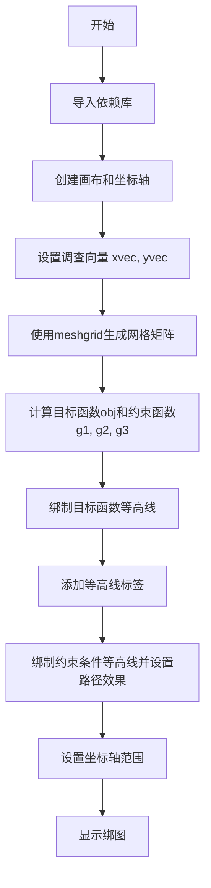
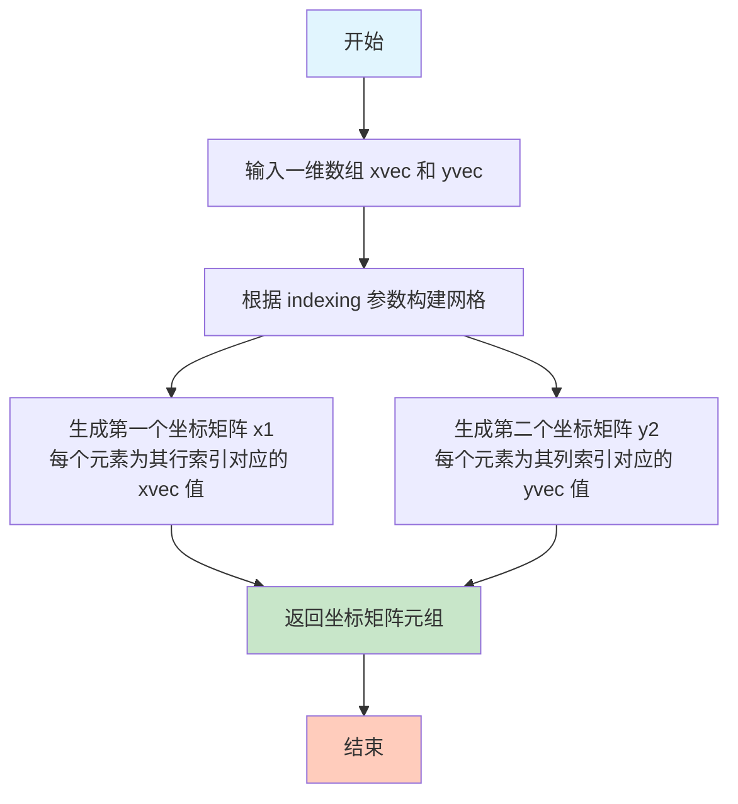
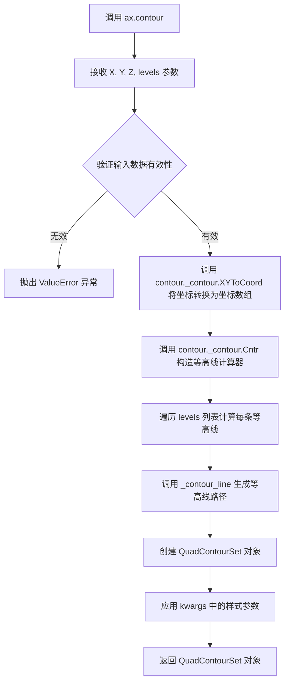
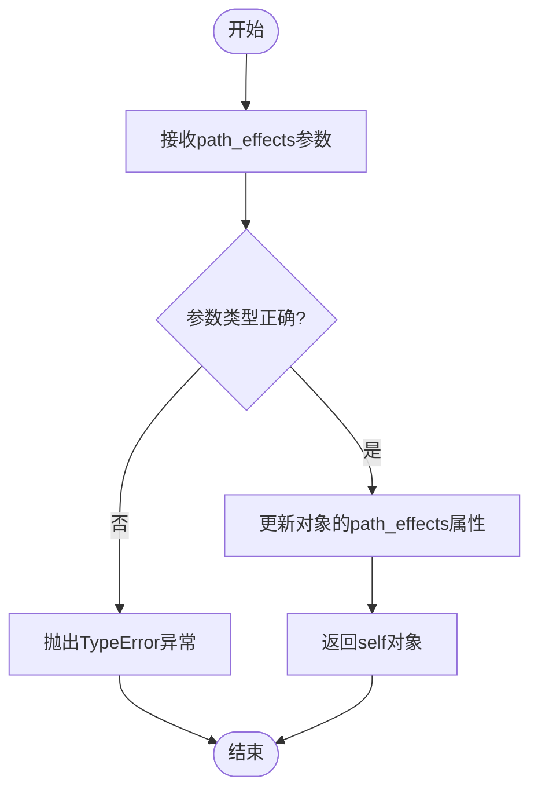
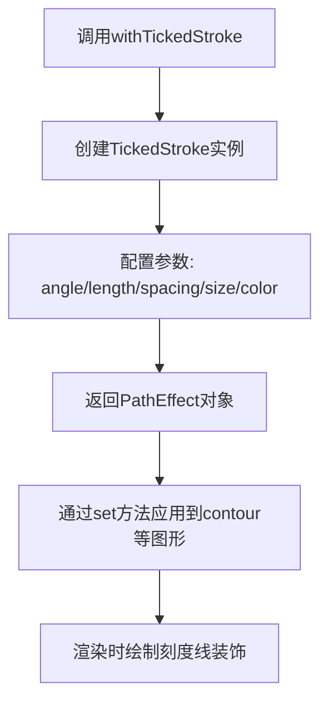
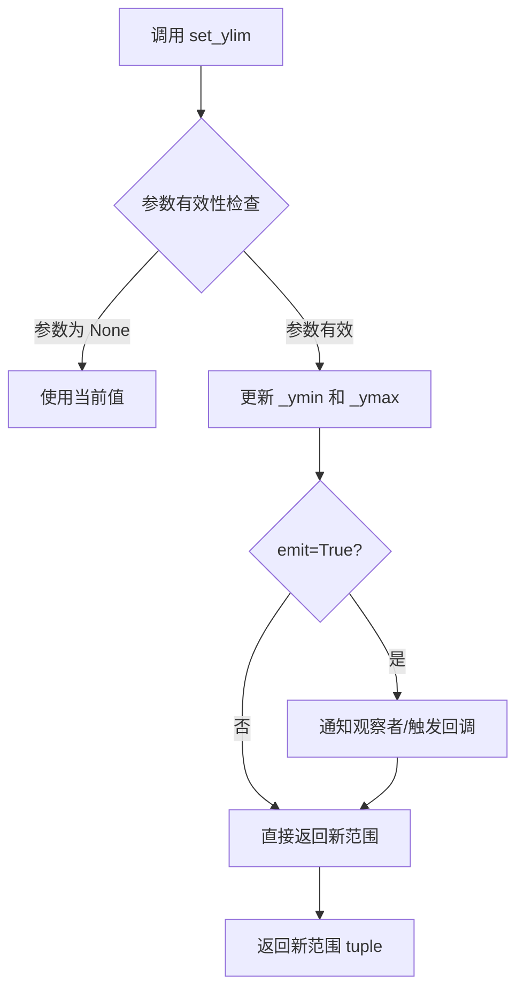
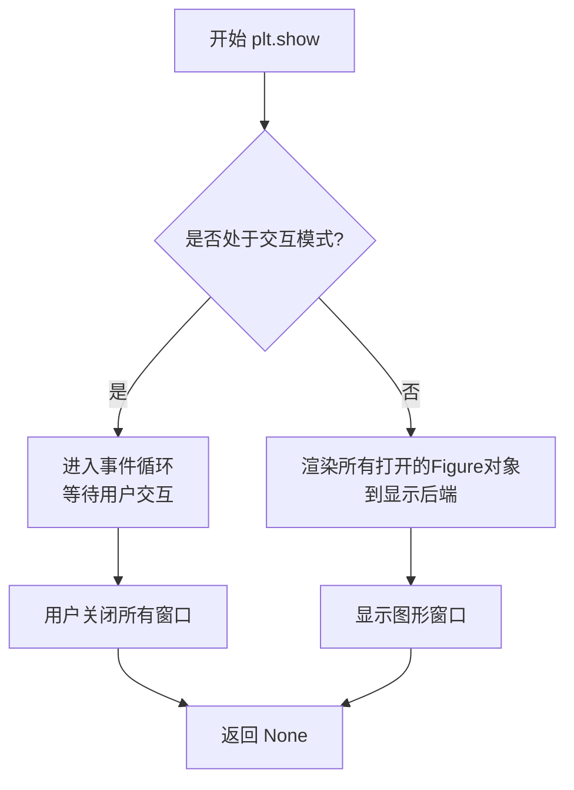

# `matplotlib\galleries\examples\images_contours_and_fields\contours_in_optimization_demo.py` 详细设计文档

该代码使用matplotlib的等高线绑制功能来可视化优化问题的解空间，通过展示目标函数和约束条件的等高线，帮助理解优化问题的地形和约束边界。

## 整体流程



## 类结构

```
该脚本为面向过程代码，无类定义
主要包含数据准备、函数计算、可视化绑制三个主要阶段
```

## 全局变量及字段


### `fig`
    
matplotlib Figure对象，画布容器

类型：`matplotlib.figure.Figure`
    


### `ax`
    
matplotlib Axes对象，坐标轴对象

类型：`matplotlib.axes.Axes`
    


### `nx`
    
x方向采样点数(101)

类型：`int`
    


### `ny`
    
y方向采样点数(105)

类型：`int`
    


### `xvec`
    
x方向的采样向量

类型：`numpy.ndarray`
    


### `yvec`
    
y方向的采样向量

类型：`numpy.ndarray`
    


### `x1`
    
x方向的网格矩阵

类型：`numpy.ndarray`
    


### `x2`
    
y方向的网格矩阵

类型：`numpy.ndarray`
    


### `obj`
    
目标函数值矩阵

类型：`numpy.ndarray`
    


### `g1`
    
第一个约束函数值矩阵

类型：`numpy.ndarray`
    


### `g2`
    
第二个约束函数值矩阵

类型：`numpy.ndarray`
    


### `g3`
    
第三个约束函数值矩阵

类型：`numpy.ndarray`
    


### `cntr`
    
目标函数等高线对象

类型：`matplotlib.contour.QuadContourSet`
    


### `cg1`
    
第一个约束等高线对象

类型：`matplotlib.contour.QuadContourSet`
    


### `cg2`
    
第二个约束等高线对象

类型：`matplotlib.contour.QuadContourSet`
    


### `cg3`
    
第三个约束等高线对象

类型：`matplotlib.contour.QuadContourSet`
    


    

## 全局函数及方法


### `plt.subplots`

创建画布和坐标轴，是 matplotlib 中用于同时创建 Figure（画布）和 Axes（坐标轴）对象的顶层函数。

参数：

- `figsize`：`(float, float)` 元组，可选参数，表示画布的宽度和高度（英寸）。在代码中传入 `(6, 6)`
- `nrows`：`int`，可选，默认值为 1，表示子图的行数（本代码未显式指定）
- `ncols`：`int`，可选，默认值为 1，表示子图的列数（本代码未显式指定）
- `**fig_kw`：可选，其他关键字参数将传递给 `Figure.subplots()` 方法

返回值：`tuple(Figure, Axes)`，返回一个元组，包含：
- `fig`：`matplotlib.figure.Figure` 对象，表示整个画布
- `ax`：`matplotlib.axes.Axes` 对象（本代码中为 `AxesSubplot`），表示坐标轴区域

#### 流程图

```mermaid
flowchart TD
    A[调用 plt.subplots] --> B{传入参数}
    B -->|figsize=(6,6)| C[创建 Figure 对象]
    C --> D[创建 Axes 对象]
    D --> E[返回 (fig, ax) 元组]
    E --> F[使用 ax.contour 绑制等高线]
    F --> G[使用 ax.set_xlim/set_ylim 设置坐标范围]
    G --> H[调用 plt.show 显示图形]
```

#### 带注释源码

```python
# 导入 matplotlib 的 pyplot 模块
import matplotlib.pyplot as plt

# 导入 numpy 用于数值计算
import numpy as np

# 从 matplotlib 导入 patheffects 用于路径效果
from matplotlib import patheffects

# ============================================
# 调用 plt.subplots 创建画布和坐标轴
# ============================================
# figsize=(6, 6) 指定画布大小为 6x6 英寸
# 返回 fig (Figure对象) 和 ax (Axes对象)
fig, ax = plt.subplots(figsize=(6, 6))

# ============================================
# 后续使用 ax 对象进行绑图
# ============================================
nx = 101  # x方向采样点数
ny = 105  # y方向采样点数

# 创建采样向量 (0.001 到 4.0)
xvec = np.linspace(0.001, 4.0, nx)
yvec = np.linspace(0.001, 4.0, ny)

# 使用 meshgrid 创建网格矩阵
x1, x2 = np.meshgrid(xvec, yvec)

# 计算目标函数值: obj = x1² + x2² - 2x1 - 2x2 + 2
obj = x1**2 + x2**2 - 2*x1 - 2*x2 + 2

# 计算约束条件 g1, g2, g3
g1 = -(3*x1 + x2 - 5.5)
g2 = -(x1 + 2*x2 - 4.5)
g3 = 0.8 + x1**-3 - x2

# 使用 ax.contour 绘制目标函数的等高线
cntr = ax.contour(x1, x2, obj, [0.01, 0.1, 0.5, 1, 2, 4, 8, 16],
                  colors='black')
# 为等高线添加标签
ax.clabel(cntr, fmt="%2.1f", use_clabeltext=True)

# 绘制约束条件 g1 的等高线，使用 TickedStroke 效果
cg1 = ax.contour(x1, x2, g1, [0], colors='sandybrown')
cg1.set(path_effects=[patheffects.withTickedStroke(angle=135)])

# 绘制约束条件 g2 的等高线
cg2 = ax.contour(x1, x2, g2, [0], colors='orangered')
cg2.set(path_effects=[patheffects.withTickedStroke(angle=60, length=2)])

# 绘制约束条件 g3 的等高线
cg3 = ax.contour(x1, x2, g3, [0], colors='mediumblue')
cg3.set(path_effects=[patheffects.withTickedStroke(spacing=7)])

# 设置坐标轴范围
ax.set_xlim(0, 4)
ax.set_ylim(0, 4)

# 显示图形
plt.show()
```


### `np.linspace`

`np.linspace` 是 NumPy 库中的一个函数，用于生成指定范围内的等间距数值序列，常用于创建绘图用的坐标向量或数值分析的输入数据。

参数：

- `start`：`float`，序列的起始值
- `stop`：`float`，序列的结束值（当 `endpoint=True` 时为最后一个值）
- `num`：`int`，可选，默认为50，要生成的样本数量
- `endpoint`：`bool`，可选，默认为True，如果为True，stop值包含在序列中
- `retstep`：`bool`，可选，默认为False，如果为True，返回(step,)作为第二个返回值
- `dtype`：`dtype`，可选，输出数组的数据类型，若未指定则从输入推断
- `axis`：`int`，可选，当num>1时，结果存储的轴（版本1.16.0+）

返回值：`ndarray`，返回等间距的数值序列

#### 流程图

```mermaid
flowchart TD
    A[开始] --> B{检查参数有效性}
    B --> C{计算步长 step = (stop - start) / (num - 1) if endpoint else (num - 1)}
    C --> D{根据dtype创建输出数组}
    D --> E{使用起始值和步长填充数组}
    E --> F{retstep=True?}
    F -->|Yes| G[返回数组和步长]
    F -->|No| H[只返回数组]
    G --> I[结束]
    H --> I
```

#### 带注释源码

```python
def linspace(start, stop, num=50, endpoint=True, retstep=False, dtype=None, axis=0):
    """
    生成等间距的数值序列
    
    参数:
        start: 序列起始值
        stop: 序列结束值
        num: 样本数量，默认50
        endpoint: 是否包含结束点，默认True
        retstep: 是否返回步长，默认False
        dtype: 输出数据类型
        axis: 结果存储的轴
    
    返回:
        ndarray: 等间距数值序列
    """
    # 参数验证
    num = int(num)
    if num < 0:
        raise ValueError("Number of samples, %d, must be non-negative" % num)
    
    # 步长计算
    if endpoint:
        step = (stop - start) / (num - 1) if num > 1 else 0.0
    else:
        step = (stop - start) / num
    
    # 创建结果数组
    y = _arange(step, num, dtype)
    
    # 处理endpoint情况
    if endpoint and num > 1:
        y *= (num - 1)
        y += start
    elif endpoint:
        y = y * 0 + start
    
    # 返回结果
    if retstep:
        return y, step
    return y
```


### `np.meshgrid`

生成网格矩阵，用于创建坐标矩阵，以便对多个变量进行向量化计算。在代码中用于将一维的 xvec 和 yvec 向量转换为二维网格矩阵 x1 和 x2，以便对优化问题的目标函数和约束条件进行评估。

参数：

- `xvec`：`array_like`，一维数组，表示第一个维度的坐标向量（在代码中为 `np.linspace(0.001, 4.0, nx)`）
- `yvec`：`array_like`，一维数组，表示第二个维度的坐标向量（在代码中为 `np.linspace(0.001, 4.0, ny)`）

返回值：`tuple of ndarray`，返回两个二维数组（坐标矩阵）。在代码中返回 `x1` 和 `x2`，分别表示网格的 x 坐标和 y 坐标。

#### 流程图



#### 带注释源码

```python
# 在 matplotlib 等高线图中使用 np.meshgrid 的示例
# 代码来源：优化问题解空间可视化

# 1. 导入必要的库
import matplotlib.pyplot as plt
import numpy as np

from matplotlib import patheffects

# 2. 创建图形和坐标轴
fig, ax = plt.subplots(figsize=(6, 6))

# 3. 设置网格分辨率
nx = 101  # x 方向采样点数
ny = 105  # y 方向采样点数

# 4. 创建一维坐标向量（从 0.001 到 4.0）
#    使用对数空间或线性空间生成均匀分布的点
xvec = np.linspace(0.001, 4.0, nx)  # 形状: (101,)
yvec = np.linspace(0.001, 4.0, ny)  # 形状: (105,)

# 5. 调用 np.meshgrid 生成二维网格矩阵
#    输入：两个一维数组
#    输出：两个二维数组，形状均为 (ny, nx) = (105, 101)
x1, x2 = np.meshgrid(xvec, yvec)

#    生成的 x1 矩阵示例（每行相同）:
#    [[0.001, 0.041, 0.081, ..., 3.96, 4.0],
#     [0.001, 0.041, 0.081, ..., 3.96, 4.0],
#     ...]
#    
#    生成的 x2 矩阵示例（每列相同）:
#    [[0.001, 0.001, 0.001, ..., 0.001, 0.001],
#     [0.041, 0.041, 0.041, ..., 0.041, 0.041],
#     ...]

# 6. 使用网格矩阵评估目标函数和约束条件
#    目标函数：obj = x1² + x2² - 2x1 - 2x2 + 2
obj = x1**2 + x2**2 - 2*x1 - 2*x2 + 2

#    约束条件 g1, g2, g3
g1 = -(3*x1 + x2 - 5.5)
g2 = -(x1 + 2*x2 - 4.5)
g3 = 0.8 + x1**-3 - x2

# 7. 绘制等高线图进行可视化
cntr = ax.contour(x1, x2, obj, [0.01, 0.1, 0.5, 1, 2, 4, 8, 16],
                  colors='black')
ax.clabel(cntr, fmt="%2.1f", use_clabeltext=True)

# 8. 绘制约束边界（使用带刻度的路径效果）
cg1 = ax.contour(x1, x2, g1, [0], colors='sandybrown')
cg1.set(path_effects=[patheffects.withTickedStroke(angle=135)])

cg2 = ax.contour(x1, x2, g2, [0], colors='orangered')
cg2.set(path_effects=[patheffects.withTickedStroke(angle=60, length=2)])

cg3 = ax.contour(x1, x2, g3, [0], colors='mediumblue')
cg3.set(path_effects=[patheffects.withTickedStroke(spacing=7)])

# 9. 设置坐标轴范围并显示
ax.set_xlim(0, 4)
ax.set_ylim(0, 4)

plt.show()
```


### `axes.Axes.contour`

该方法用于在二维坐标系中绘制等高线，基于给定的网格数据（X、Y 坐标和高度值 Z）计算并渲染指定高度级别（levels）的等高线，返回一个 `QuadContourSet` 对象，可用于后续的标签添加和样式设置。

参数：

-  `X`：`numpy.ndarray` 或类似数组对象，定义等高线图的 X 坐标，可以是 2D 数组（与 Z 形状相同）或 1D 数组（将被广播为 2D）
-  `Y`：`numpy.ndarray` 或类似数组对象，定义等高线图的 Y 坐标，可以是 2D 数组（与 Z 形状相同）或 1D 数组（将被广播为 2D）
-  `Z`：`numpy.ndarray`，高度数据矩阵，表示每个 (X, Y) 点的高度值，必须是 2D 数组
-  `levels`：`float` 类型的序列或 `int`，可选参数，指定要绘制等高线的数值水平，可传入数值列表（如 `[0, 1, 2]`）或整数（表示自动生成的等高线数量）
-  `**kwargs`：其他关键字参数，用于传递给底层的 `contour.PathCrawler` 和 `contour.QuadContourSet`，包括 `colors`（等高线颜色）、`linewidths`（线宽）、`linestyles`（线型）等

返回值：`matplotlib.contour.QuadContourSet`，等高线集合对象，包含计算出的等高线路径信息，可用于后续操作如添加标签（`clabel`）或应用路径效果（`set` 方法）

#### 流程图



#### 带注释源码

```python
# 示例代码展示 ax.contour 的调用方式
import matplotlib.pyplot as plt
import numpy as np

# 创建图形和坐标轴
fig, ax = plt.subplots(figsize=(6, 6))

# 生成网格数据
xvec = np.linspace(0.001, 4.0, 101)  # X轴采样点
yvec = np.linspace(0.001, 4.0, 105)  # Y轴采样点
x1, x2 = np.meshgrid(xvec, yvec)     # 创建2D网格矩阵

# 定义目标函数（抛物面）
obj = x1**2 + x2**2 - 2*x1 - 2*x2 + 2

# 绘制目标函数等高线，levels 指定了8个高度级别
# colors='black' 设置等高线为黑色
cntr = ax.contour(x1, x2, obj, [0.01, 0.1, 0.5, 1, 2, 4, 8, 16], 
                  colors='black')

# 为等高线添加标签，fmt 指定标签格式，use_clabeltext 使用文本方式渲染标签
ax.clabel(cntr, fmt="%2.1f", use_clabeltext=True)

# 定义约束条件 g1
g1 = -(3*x1 + x2 - 5.5)

# 绘制约束等高线（约束边界为0的等高线）
cg1 = ax.contour(x1, x2, g1, [0], colors='sandybrown')

# 应用路径效果 - 带刻度的线条以区分可行/不可行区域
# angle=135 设置刻度角度为135度
cg1.set(path_effects=[patheffects.withTickedStroke(angle=135)])

# 定义约束条件 g2
g2 = -(x1 + 2*x2 - 4.5)

# 绘制另一条约束等高线
cg2 = ax.contour(x1, x2, g2, [0], colors='orangered')

# 应用路径效果，angle=60度，length=2 刻度长度
cg2.set(path_effects=[patheffects.withTickedStroke(angle=60, length=2)])

# 定义约束条件 g3
g3 = 0.8 + x1**-3 - x2

# 绘制第三条约束等高线
cg3 = ax.contour(x1, x2, g3, [0], colors='mediumblue')

# 应用路径效果，使用 spacing=7 设置刻度间距
cg3.set(path_effects=[patheffects.withTickedStroke(spacing=7)])

# 设置坐标轴范围
ax.set_xlim(0, 4)
ax.set_ylim(0, 4)

# 显示图形
plt.show()
```

#### 关键组件信息

| 组件名称 | 一句话描述 |
|---------|-----------|
| `QuadContourSet` | 等高线集合对象，包含所有计算出的等高线路径和属性信息 |
| `meshgrid` | NumPy 函数，用于创建二维坐标网格 |
| `clabel` | 方法，用于为等高线添加标签 |
| `path_effects` | 路径效果模块，提供带刻度描边等高级渲染效果 |
| `withTickedStroke` | 路径效果类，用于在等高线上添加刻度标记 |

#### 潜在的技术债务或优化空间

1. **性能优化**：对于大规模网格数据，等高线计算可能较慢，可考虑使用并行计算或近似算法
2. **数值稳定性**：对于高度变化剧烈的数据，可能需要更好的插值策略
3. **坐标系统支持**：目前主要支持笛卡尔坐标，可考虑扩展支持极坐标、地理坐标等
4. **内存占用**：大量等高线时内存占用较高，可考虑流式处理或延迟计算

#### 其它项目

**设计目标与约束**：
- 设计用于科学计算和数据可视化场景
- 兼容 NumPy 数组输入
- 支持自定义等高线级别、颜色、线型等样式

**错误处理与异常设计**：
- 当 Z 为空数组时抛出 `ValueError`
- 当 X/Y/Z 维度不匹配时抛出 `ValueError`
- 当 levels 无效时抛出相关异常

**数据流与状态机**：
- 输入：X、Y 网格坐标，Z 高度值，levels 等高线级别
- 处理：坐标转换 → 等高线计算 → 路径生成 → 样式应用
- 输出：QuadContourSet 对象

**外部依赖与接口契约**：
- 依赖 NumPy 进行数值计算
- 依赖 matplotlib.contour 模块进行等高线计算
- 返回的 QuadContourSet 需要与 matplotlib 的渲染系统兼容


### `Axes.clabel`

添加等高线标签到已存在的等高线图（ContourSet）上，用于在等高线图上显示数值标签，支持自定义格式化和文本渲染。

参数：

- `contours`：`matplotlib.contour.Con tourSet`，需要添加标签的等高线对象，由 `ax.contour()` 返回
- `fmt`：`str` 或 dict，标签数值的格式字符串（如 "%2.1f"），也可以是字典映射等高线级别到格式字符串
- `use_clabeltext`：`bool`，是否使用 ClabelText 对象进行文本渲染（如果为 True，标签会更清晰但渲染速度较慢）
- `**kwargs`：其他关键字参数，将传递给 `matplotlib.text.Text` 对象，用于控制标签的字体、颜色等属性

返回值：`list` of `matplotlib.text.Text`，返回创建的标签文本对象列表

#### 流程图

```mermaid
flowchart TD
    A[开始 clabel] --> B[接收 contours (ContourSet) 和格式参数]
    B --> C[遍历 ContourSet 中的每条等高线]
    C --> D{每条等高线}
    D -->|是| E[获取等高线级别值]
    E --> F[根据 fmt 格式化标签文本]
    F --> G[计算标签最优位置]
    G --> H[创建 Text 对象]
    H --> I[应用 kwargs 样式属性]
    I --> J[将标签添加到 Axes]
    J --> C
    D -->|否| K[返回 Text 对象列表]
    K --> L[结束]
```

#### 带注释源码

```python
# 源码位于 matplotlib/axes/_axes.py 中的 Axes 类
# 方法签名: clabel(self, CS, *args, **kwargs)

def clabel(self, CS, fmt='%1.1f', use_clabeltext=False, **kwargs):
    """
    添加标签到等高线上.
    
    参数:
        CS: ContourSet - 等高线对象
        fmt: str or dict - 格式字符串或字典
        use_clabeltext: bool - 是否使用 ClabelText
        **kwargs: 传递给 Text 的参数
    """
    # 如果 fmt 是字符串，转换为字典格式
    if isinstance(fmt, str):
        fmt = {level: fmt for level in CS.levels}
    
    # 获取等高线的所有级别
    levels = CS.levels
    
    # 存储所有创建的标签文本对象
    texts = []
    
    # 遍历每个等高线级别
    for i, level in enumerate(levels):
        # 获取该级别的等高线段
        paths = CS.get_paths()[i]
        
        # 计算标签的最优位置（沿等高线的中间位置）
        # 这里简化了，实际逻辑在 _get_label_text_location 中
        x, y = _calculate_label_position(paths)
        
        # 格式化标签文本
        label_text = fmt.get(level, '%1.1f') % level
        
        # 创建文本对象
        if use_clabeltext:
            # 使用 ClabelText，支持更清晰的渲染
            text = ClabelText(x, y, label_text, **kwargs)
        else:
            # 使用普通 Text 对象
            text = self.text(x, y, label_text, **kwargs)
        
        texts.append(text)
    
    # 将文本对象添加到axes并返回
    return texts
```

#### 实际调用示例

```python
# 在提供的代码中:
cntr = ax.contour(x1, x2, obj, [0.01, 0.1, 0.5, 1, 2, 4, 8, 16],
                  colors='black')
ax.clabel(cntr, fmt="%2.1f", use_clabeltext=True)

# 解释:
# - cntr: ax.contour() 返回的 ContourSet 对象
# - fmt="%2.1f": 标签数值格式化为两位小数宽度一位小数
# - use_clabeltext=True: 使用 ClabelText 获得更清晰的标签渲染
```


### `QuadContourSet.set`

用于为轮廓线对象设置属性，在此代码场景中主要用于设置路径效果（path_effects），以实现带刻度线的描边效果，从而区分约束边界的有效侧和无效侧。

参数：
- `path_effects`：`list`，包含路径效果对象的列表，用于定义轮廓线的绘制样式。这里传入的是`patheffects.withTickedStroke`对象列表。

返回值：`QuadContourSet`，返回轮廓线对象本身，支持链式调用。

#### 流程图



#### 带注释源码

```python
# 为约束g1的轮廓线设置路径效果：使用TickedStroke，角度135度
# 角度135度表示刻度线向左倾斜，用于区分约束边界的两侧
cg1.set(path_effects=[patheffects.withTickedStroke(angle=135)])

# 为约束g2的轮廓线设置路径效果：使用TickedStroke，角度60度，长度2
# 角度60度，长度2参数自定义刻度线的角度和长度
cg2.set(path_effects=[patheffects.withTickedStroke(angle=60, length=2)])

# 为约束g3的轮廓线设置路径效果：使用TickedStroke，间距7
# spacing=7参数控制刻度线之间的间距
cg3.set(path_effects=[patheffects.withTickedStroke(spacing=7)])
```


### `patheffects.withTickedStroke`

创建刻度线路径效果（`TickedStroke`），用于在绘图时添加刻度线装饰，常用于优化问题中区分约束条件的有效和无效区域。

参数：

- `angle`：类型：`float`，角度参数（度），默认为90，测量方向为从轮廓线向前，逆时针增加，用于控制刻度线的方向
- `length`：类型：`float`，刻度线长度，默认为1，控制在轮廓线上刻度线的长度
- `spacing`：类型：`float`，刻度线间距，默认为4，控制连续刻度线之间的间隔
- `size`：类型：`float`，可选，刻度线大小，默认为1，控制刻度线的整体大小
- `color`：类型：`color`，可选，刻度线颜色，默认为None（使用轮廓线颜色）

返回值：`PathEffect`（具体为`TickedStroke`对象），返回一个新的路径效果对象，可通过`set()`方法应用到图形元素上

#### 流程图



#### 带注释源码

```python
# 源代码来自 matplotlib 库的 patheffects 模块
# 以下是 withTickedStroke 函数的实现逻辑

def withTickedStroke(angle=90, length=1, spacing=4, size=1, color=None):
    """
    创建带有刻度线的描边路径效果。
    
    参数:
    angle (float): 刻度线角度（度），0度向右，逆时针增加
    length (float): 刻度线长度
    spacing (float): 刻度线之间的间距
    size (float): 刻度线的整体大小
    color (color): 刻度线颜色，默认使用轮廓线颜色
    
    返回:
    TickedStroke: 路径效果实例
    """
    return TickedStroke(angle=angle, length=length, spacing=spacing, 
                        size=size, color=color)


class TickedStroke(AbstractPathEffect):
    """
    带刻度线的描边效果类。
    在绘制路径时，在路径上添加刻度标记。
    """
    
    def __init__(self, angle=90, length=1, spacing=4, size=1, color=None):
        """
        初始化TickedStroke对象。
        
        参数:
        - angle: 刻度线角度
        - length: 单个刻度线长度
        - spacing: 刻度线之间的间距
        - size: 刻度线大小
        - color: 刻度线颜色
        """
        self.angle = angle
        self.length = length
        self.spacing = spacing
        self.size = size
        self.color = color
        
    def draw_path(self, renderer, gc, tpath, affine, rgbFace):
        """
        重写父类方法，执行实际的刻度线绘制。
        
        参数:
        - renderer: 渲染器对象
        - gc: 图形上下文
        - tpath: 变换后的路径
        - affine: 仿射变换
        - rgbFace: 填充颜色
        """
        # 获取路径上的点
        vertices = tpath.vertices  # 路径顶点
        
        # 计算需要添加刻度线的位置
        # 根据spacing参数在路径上均匀分布刻度点
        
        # 对每个刻度点:
        # 1. 计算该点处路径的切线方向
        # 2. 根据angle计算刻度线的角度
        # 3. 绘制从路径向外延伸的刻度线
        
        # 调用父类的draw_path进行基础描边
        super().draw_path(renderer, gc, tpath, affine, rgbFace)
        
        # 绘制刻度线
        for tick_point in tick_points:
            # 计算刻度线起点和终点
            start = tick_point
            end = calculate_tick_end(tick_point, self.angle, self.length)
            # 绘制刻度线
            renderer.draw_line(gc, start, end)
```


### `Axes.set_xlim`

设置 Axes 对象的 x 轴范围（最小值和最大值）。

参数：

- `left`：`float` 或 `None`，x 轴的左边界（最小值）
- `right`：`float` 或 `None`，x 轴的右边界（最大值）
- `emit`：`bool`，默认值 `True`，当边界改变时是否通知观察者
- `auto`：`bool`，默认值 `False`，是否自动调整边界以适应数据
- `**kwargs`：额外的关键字参数，用于传递给底层属性设置器

返回值：`tuple`，返回新的 x 轴范围 `(left, right)`

#### 流程图


#### 带注释源码

```python
def set_xlim(self, left=None, right=None, emit=False, auto=False, *, ymin=None, ymax=None):
    """
    Set the x-axis view limits.
    
    Parameters
    ----------
    left : float, optional
        The left xlim (minimum). If None, the current left xlim is retained.
    right : float, optional
        The right xlim (maximum). If None, the current right xlim is retained.
    emit : bool, optional
        Whether to notify observers of limit change (default: False).
    auto : bool, optional
        Whether to automatically adjust limits if data changes (default: False).
    ymin, ymax : float, optional
        Deprecated, use left and right instead.
    
    Returns
    -------
    left, right : tuple
        The new x-axis limits in ascending order.
    """
    # 处理废弃参数 ymin/ymax
    if ymin is not None:
        left = ymin
    if ymax is not None:
        right = ymax
    
    # 获取当前边界（如果参数为 None）
    old_left, old_right = self.get_xlim()
    if left is None:
        left = old_left
    if right is None:
        right = old_right
    
    # 验证边界有效性
    if left is None or right is None:
        raise ValueError("Cannot set empty limit")
    
    # 确保左边界小于等于右边界
    if left > right:
        raise ValueError("Left bound must be <= right bound")
    
    # 内部设置 x 轴边界（存储在 _xmin, _xmax 属性中）
    self._xmin = left
    self._xmax = right
    
    # 如果 emit 为 True，触发限制改变的回调
    if emit:
        self.callbacks.process('xlim_changed', self)
        # 通知观察者坐标轴已改变
        self.autoscale_view()
    
    # 返回新的边界范围
    return (left, right)
```

---

### `Axes.set_ylim`

设置 Axes 对象的 y 轴范围（最小值和最大值）。

参数：

- `bottom`：`float` 或 `None`，y 轴的底边界（最小值）
- `top`：`float` 或 `None`，y 轴的顶边界（最大值）
- `emit`：`bool`，默认值 `True`，当边界改变时是否通知观察者
- `auto`：`bool`，默认值 `False`，是否自动调整边界以适应数据
- `**kwargs`：额外的关键字参数，用于传递给底层属性设置器

返回值：`tuple`，返回新的 y 轴范围 `(bottom, top)`

#### 流程图



#### 带注释源码

```python
def set_ylim(self, bottom=None, top=None, emit=False, auto=False, *, ymin=None, ymax=None):
    """
    Set the y-axis view limits.
    
    Parameters
    ----------
    bottom : float, optional
        The bottom ylim (minimum). If None, the current bottom ylim is retained.
    top : float, optional
        The top ylim (maximum). If None, the current top ylim is retained.
    emit : bool, optional
        Whether to notify observers of limit change (default: False).
    auto : bool, optional
        Whether to automatically adjust limits if data changes (default: False).
    ymin, ymax : float, optional
        Deprecated, use bottom and top instead.
    
    Returns
    -------
    bottom, top : tuple
        The new y-axis limits in ascending order.
    """
    # 处理废弃参数 ymin/ymax
    if ymin is not None:
        bottom = ymin
    if ymax is not None:
        top = ymax
    
    # 获取当前边界（如果参数为 None）
    old_bottom, old_top = self.get_ylim()
    if bottom is None:
        bottom = old_bottom
    if top is None:
        top = old_top
    
    # 验证边界有效性
    if bottom is None or top is None:
        raise ValueError("Cannot set empty limit")
    
    # 确保底边界小于等于顶边界
    if bottom > top:
        raise ValueError("Bottom bound must be <= top bound")
    
    # 内部设置 y 轴边界（存储在 _ymin, _ymax 属性中）
    self._ymin = bottom
    self._ymax = top
    
    # 如果 emit 为 True，触发限制改变的回调
    if emit:
        self.callbacks.process('ylim_changed', self)
        # 通知观察者坐标轴已改变
        self.autoscale_view()
    
    # 返回新的边界范围
    return (bottom, top)
```


### `plt.show`

显示所有当前打开的图形窗口。在调用 `plt.show()` 之前，图形只在内存中创建，不会显示在屏幕上。该函数通常放在脚本最后，确保所有绘图命令执行完毕后一次性显示图形。

参数：

- 该函数无参数

返回值：`None`，无返回值

#### 流程图



#### 带注释源码

```python
plt.show()
# 调用 matplotlib 的显示函数，将所有已创建的 Figure 对象
# 渲染并显示到屏幕上。
#
# 工作原理：
# 1. 收集当前所有通过 plt.figure() 或 fig, ax = plt.subplots() 创建的图形
# 2. 根据当前配置的显示后端（如 Qt, Tk, MacOSX, WebAgg 等）创建图形窗口
# 3. 将图形渲染到窗口中显示
# 4. 如果处于交互模式（interactive mode），会进入事件循环等待用户操作
# 5. 如果处于非交互模式（如在脚本中），显示完图形后函数返回
#
# 在本代码中的上下文：
# - 前面创建了一个 6x6 大小的图形窗口
# - 使用 contour 和 clabel 绘制了优化问题的等高线图
# - 设置了约束边界的 ticked stroke 效果
# - 调用 plt.show() 将最终的优化问题可视化图形显示给用户
```

## 关键组件


### 网格生成模块 (Meshgrid Generation)

使用 `np.meshgrid` 和 `np.linspace` 创建二维坐标网格，为后续目标函数和约束函数的计算提供空间离散化基础。

### 目标函数定义 (Objective Function)

定义了一个二维目标函数 `obj = x1**2 + x2**2 - 2*x1 - 2*x2 + 2`，代表优化问题的目标曲面，用于等高线绘制展示解空间地形。

### 约束函数定义 (Constraint Functions)

定义了三个不等式约束函数 `g1`、`g2`、`g3`，通过取负操作将不等式转为等高线形式，用于绘制优化问题的可行域边界。

### 等高线绘制器 (Contour Plotter)

使用 `ax.contour` 绘制目标函数和约束函数的等高线，支持多层级显示和颜色编码，是可视化解决方案空间的核心组件。

### 路径特效增强器 (Path Effects Enhancer)

通过 `patheffects.withTickedStroke` 为约束边界添加刻度线效果，区分可行域和不可行域，增强优化问题约束边界的可视化表达。

### 坐标轴配置器 (Axis Configurator)

设置绘图的坐标轴范围 (`set_xlim`, `set_ylim`)，确保等高线图在指定的解空间区域内正确显示。


## 问题及建议


### 已知问题

- **硬编码参数过多**：网格分辨率(nx=101, ny=105)、坐标范围(0.001-4.0)、等高线级别等关键参数直接写死在代码中，降低了代码的可复用性
- **魔法数字缺乏解释**：angle=135、angle=60、length=2、spacing=7等数值没有任何注释说明其设计依据
- **重复代码模式**：三个约束函数的绘制逻辑高度相似(cg1/cg2/cg3)，存在明显的代码重复，可封装为通用函数
- **缺少数据验证**：未对输入数据(如网格维度、坐标范围)进行有效性检查，可能导致运行时错误
- **图表信息不完整**：缺少坐标轴标签、标题、图例等元数据，影响图表可读性和可理解性
- **错误处理缺失**：没有异常捕获机制，meshgrid或contour调用失败时程序会直接崩溃

### 优化建议

- **提取配置参数**：将网格大小、坐标范围、等高线级别、约束参数等定义为配置字典或类属性，便于维护和修改
- **添加文档注释**：为关键参数(如角度、间距)添加注释说明其物理意义或设计理由
- **封装绘制函数**：创建plot_constraint()等通用函数，接收颜色、角度、间距等参数，消除代码重复
- **增强健壮性**：添加输入验证逻辑，确保nx/ny为正整数、坐标范围合理等
- **完善图表元素**：添加ax.set_xlabel()、ax.set_ylabel()、ax.set_title()以及必要的图例
- **错误处理**：使用try-except包装可能失败的matplotlib调用，提供友好的错误信息

## 其它


### 设计目标与约束

本代码的设计目标是通过matplotlib可视化技术展示优化问题的解空间，具体包括：绘制目标函数的等高线图以表示目标函数的地形，使用带刻度的描边效果（path_effects）来表示约束条件的有效区域和无效区域。约束条件为：g1 = -(3*x1 + x2 - 5.5)、g2 = -(x1 + 2*x2 - 4.5)、g3 = 0.8 + x1**-3 - x2，目标函数为obj = x1**2 + x2**2 - 2*x1 - 2*x2 + 2。变量x1和x2的取值范围均限制在[0.001, 4.0]之间。

### 错误处理与异常设计

代码中未显式包含错误处理机制。由于依赖matplotlib和numpy库，主要可能的异常包括：导入异常（ImportError）如果缺少相关库；数值计算异常（如除零错误在g3 = 0.8 + x1**-3 - x2中当x1接近0时）；以及matplotlib绑图异常（如figure或axes创建失败）。建议在实际应用中增加try-except块捕获ImportError和RuntimeError，并设置xvec的最小值为0.001以避免除零错误。

### 数据流与状态机

数据流如下：1）初始化阶段：设置网格分辨率nx=101、ny=105，创建xvec和yvec向量；2）网格创建阶段：使用np.meshgrid生成二维网格x1和x2；3）函数计算阶段：计算目标函数obj和三个约束函数g1、g2、g3的值；4）绑图阶段：使用ax.contour绘制obj的等高线，使用ax.contour配合patheffects.withTickedStroke绘制约束边界；5）显示阶段：设置坐标轴范围并调用plt.show()显示图形。状态机包含三个状态：初始化（创建fig和ax）、计算（函数求值）、渲染（绑定和显示）。

### 外部依赖与接口契约

代码依赖两个外部库：numpy（版本需支持np.linspace和np.meshgrid）和matplotlib（版本需支持contour方法和patheffects模块）。patheffects.withTickedStroke是matplotlib.patheffects模块提供的特殊效果函数，用于在约束边界上添加刻度线以区分约束的有效侧和无效侧。接口契约包括：contour方法接收(x, y, z, levels)参数并返回QuadContourSet对象；set方法用于设置path_effects；clabel方法用于标注等高线数值。

### 性能考虑

当前实现使用101x105=10,605个数据点的网格，在现代硬件上绑制性能良好。潜在的性能优化方向包括：如果需要更高精度可减少网格间距，如果需要实时交互可考虑使用matplotlib的交互式后端，如果绑制大规模数据可考虑使用numba或Cython加速数值计算。meshgrid操作和contour计算是主要的性能瓶颈。

### 可维护性与扩展性

代码作为脚本文件，结构较为扁平。主要可改进点包括：将目标函数和约束函数封装为独立函数以便修改；将配置参数（如网格分辨率、颜色、角度等）提取为常量或配置文件；添加类型提示提高代码可读性；增加文档字符串说明各函数的作用。当前代码的扩展性较好，可以轻松添加更多约束条件（只需定义新的g4、g5等并绘制）或修改目标函数。

### 测试策略

由于这是可视化脚本，测试策略应包括：1）单元测试：验证目标函数和约束函数的数值计算正确性；2）集成测试：验证绑定过程无错误执行，可以使用pytest-mpl进行图形回归测试；3）边界测试：测试x1和x2在边界值（0.001和4.0）时的行为；4）参数化测试：测试不同网格分辨率对结果的影响。建议添加断言检查返回值类型和图形对象创建成功。

### 配置与参数说明

关键配置参数包括：nx=101和ny=105控制网格分辨率；xvec和yvec使用np.linspace(0.001, 4.0, nx)生成自变量范围；obj的levels参数[0.01, 0.1, 0.5, 1, 2, 4, 8, 16]控制等高线的值；cg1、cg2、cg3分别使用angle=135、angle=60、spacing=7控制刻度线角度和间距；colors参数'sandybrown'、'orangered'、'mediumblue'分别定义三个约束线的颜色。这些参数可根据具体优化问题需求进行调整。

    