# `matplotlib\galleries\examples\images_contours_and_fields\demo_bboximage.py` 详细设计文档

This code demonstrates the usage of `matplotlib.image.BboxImage` to position images within text bounding boxes and to create bounding boxes manually for images. It also showcases the application of different colormaps on images.

## 整体流程

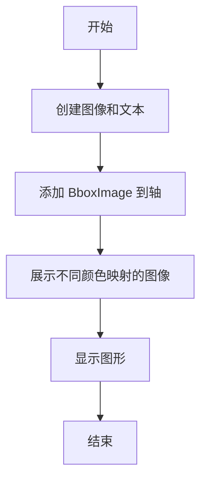

## 类结构

```
matplotlib.pyplot (主模块)
├── matplotlib.image (图像处理模块)
│   ├── BboxImage (类)
│   └── ...
├── matplotlib.transforms (变换模块)
│   ├── Bbox (类)
│   └── TransformedBbox (类)
└── numpy (数值计算模块)
```

## 全局变量及字段


### `fig`
    
The main figure object containing all the axes and elements of the plot.

类型：`matplotlib.figure.Figure`
    


### `ax1`
    
The first axes object where the text and BboxImage are added.

类型：`matplotlib.axes.Axes`
    


### `ax2`
    
The second axes object where the BboxImages for different colormaps are added.

类型：`matplotlib.axes.Axes`
    


### `txt`
    
The text object that is used to create a bounding box for the BboxImage.

类型：`matplotlib.text.Text`
    


### `cmap_names`
    
List of all colormap names that are not reversed.

类型：`list of str`
    


### `ncol`
    
Number of columns for the colormap BboxImages.

类型：`int`
    


### `nrow`
    
Number of rows for the colormap BboxImages.

类型：`int`
    


### `xpad_fraction`
    
Fraction of padding on the x-axis for the colormap BboxImages.

类型：`float`
    


### `dx`
    
Width of each cell in the colormap BboxImages grid on the x-axis.

类型：`float`
    


### `ypad_fraction`
    
Fraction of padding on the y-axis for the colormap BboxImages.

类型：`float`
    


### `dy`
    
Height of each cell in the colormap BboxImages grid on the y-axis.

类型：`float`
    


### `BboxImage.data`
    
The data array for the BboxImage.

类型：`numpy.ndarray`
    


### `BboxImage.cmap`
    
The colormap name for the BboxImage.

类型：`str`
    


### `BboxImage.interpolation`
    
The interpolation method for the BboxImage.

类型：`str`
    


### `BboxImage.origin`
    
The origin of the BboxImage data.

类型：`str`
    


### `BboxImage.transform`
    
The transform applied to the BboxImage.

类型：`matplotlib.transforms.Transform`
    


### `Bbox.x0`
    
The x-coordinate of the lower left corner of the Bbox.

类型：`float`
    


### `Bbox.y0`
    
The y-coordinate of the lower left corner of the Bbox.

类型：`float`
    


### `Bbox.x1`
    
The x-coordinate of the upper right corner of the Bbox.

类型：`float`
    


### `Bbox.y1`
    
The y-coordinate of the upper right corner of the Bbox.

类型：`float`
    


### `TransformedBbox.bbox`
    
The Bbox of the TransformedBbox.

类型：`matplotlib.transforms.Bbox`
    


### `TransformedBbox.transform`
    
The transform applied to the TransformedBbox.

类型：`matplotlib.transforms.Transform`
    
    

## 全局函数及方法


### plt.subplots

`plt.subplots` 是一个用于创建子图（subplot）的函数，它允许用户在一个图形窗口中创建多个子图，每个子图可以独立于其他子图进行操作。

参数：

- `ncols`：`int`，指定子图的列数。
- `nrows`：`int`，指定子图的行数。
- `sharex`：`bool`，指定子图是否共享X轴。
- `sharey`：`bool`，指定子图是否共享Y轴。
- `fig`：`matplotlib.figure.Figure`，可选，指定要创建子图的图形对象。
- `gridspec_kw`：`dict`，可选，用于指定GridSpec的参数。
- `constrained_layout`：`bool`，可选，指定是否启用约束布局。

返回值：`matplotlib.figure.Figure`，包含子图的图形对象。

#### 流程图

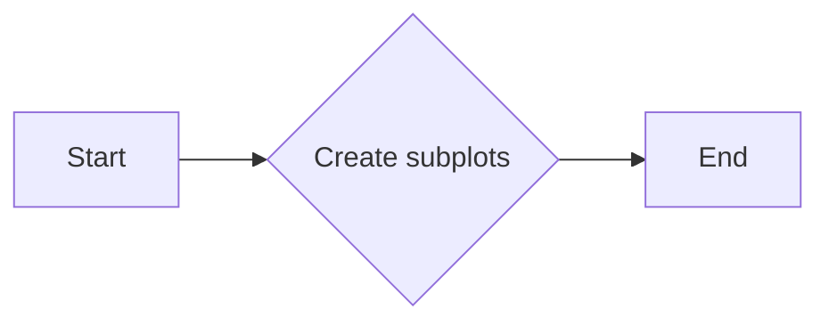

#### 带注释源码

```python
fig, (ax1, ax2) = plt.subplots(ncols=2)
```


### BboxImage

`BboxImage` 是一个用于在图形中插入图像的类，它允许用户根据边界框（bbox）来定位图像。

参数：

- `bbox`：`matplotlib.transforms.Bbox`，指定图像的边界框。
- `data`：`numpy.ndarray`，指定图像数据。
- `cmap`：`str`，可选，指定颜色映射。
- `interpolation`：`str`，可选，指定插值方法。
- `origin`：`str`，可选，指定图像的起始点。

返回值：`matplotlib.patches.Patch`，包含图像的补丁对象。

#### 流程图

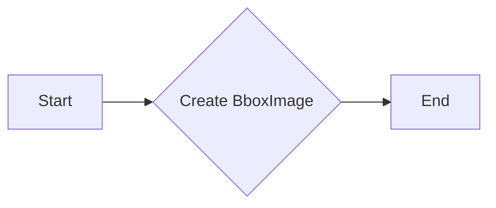

#### 带注释源码

```python
ax1.add_artist(
    BboxImage(txt.get_window_extent, data=np.arange(256).reshape((1, -1))))
```


### Bbox.from_bounds

`Bbox.from_bounds` 是一个用于创建边界框（bbox）的函数，它根据指定的边界框参数来创建一个边界框对象。

参数：

- `xmin`：`float`，指定边界框的最小X坐标。
- `ymin`：`float`，指定边界框的最小Y坐标。
- `xmax`：`float`，指定边界框的最大X坐标。
- `ymax`：`float`，指定边界框的最大Y坐标。

返回值：`matplotlib.transforms.Bbox`，包含边界框的对象。

#### 流程图

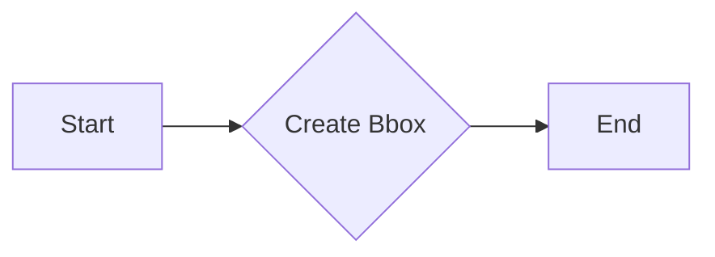

#### 带注释源码

```python
bbox0 = Bbox.from_bounds(ix*dx*(1+xpad_fraction),
                         1 - iy*dy*(1+ypad_fraction) - dy,
                         dx, dy)
```


### TransformedBbox

`TransformedBbox` 是一个用于创建变换后的边界框（bbox）的类，它允许用户将边界框从一个坐标系转换到另一个坐标系。

参数：

- `bbox`：`matplotlib.transforms.Bbox`，指定原始边界框。
- `transform`：`matplotlib.transforms.Transform`，指定变换。

返回值：`matplotlib.transforms.TransformedBbox`，包含变换后的边界框的对象。

#### 流程图

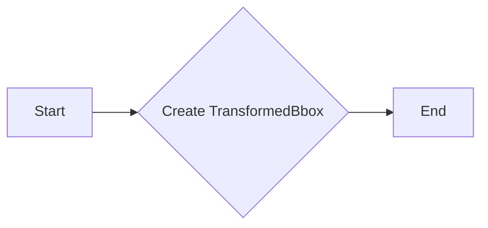

#### 带注释源码

```python
bbox = TransformedBbox(bbox0, ax2.transAxes)
```


### plt.show

`plt.show` 是一个用于显示图形的函数，它将图形窗口显示在屏幕上。

参数：无。

返回值：无。

#### 流程图

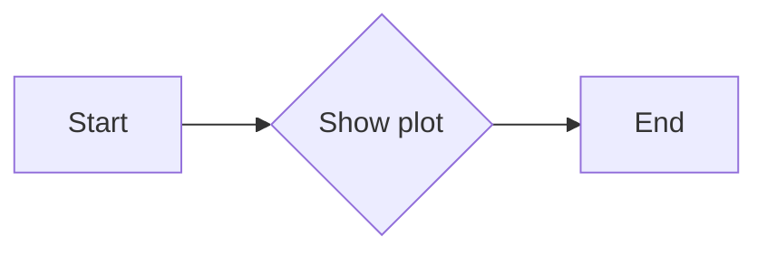

#### 带注释源码

```python
plt.show()
```


### ax1.text

`ax1.text` 是一个方法，用于在matplotlib的轴对象 `ax1` 上创建一个文本对象。

参数：

- `0.5`：`float`，文本的x坐标，相对于轴的宽度。
- `0.5`：`float`，文本的y坐标，相对于轴的高度。
- `"test"`：`str`，要显示的文本内容。
- `size=30`：`int`，文本的大小。
- `ha="center"`：`str`，水平对齐方式，"center" 表示居中对齐。
- `color="w"`：`str`，文本的颜色，"w" 表示白色。

返回值：`Text` 对象，表示创建的文本。

#### 流程图

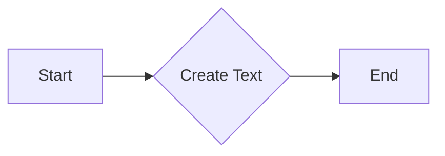

#### 带注释源码

```python
txt = ax1.text(0.5, 0.5, "test", size=30, ha="center", color="w")
```


### ax1.add_artist

`ax1.add_artist` 是一个方法，用于向matplotlib的Axes对象 `ax1` 中添加一个艺术家（artist）。

参数：

- `artist`：`BboxImage`，表示要添加到Axes对象中的图像。

返回值：无

#### 流程图

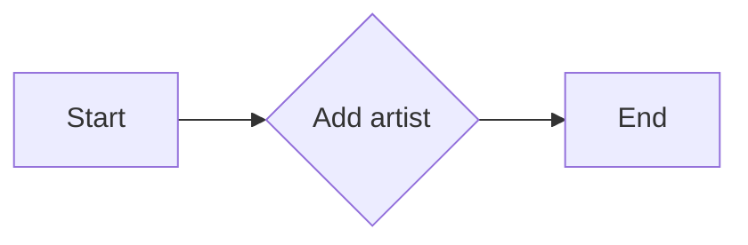

#### 带注释源码

```python
# ----------------------------
# Create a BboxImage with Text
# ----------------------------
txt = ax1.text(0.5, 0.5, "test", size=30, ha="center", color="w")
ax1.add_artist(
    BboxImage(txt.get_window_extent, data=np.arange(256).reshape((1, -1))))
```


### sorted(m for m in plt.colormaps if not m.endswith("_r"))

该函数用于获取matplotlib中所有非反转的colormap名称列表。

参数：

- `m`：`str`，matplotlib中的colormap名称。

返回值：`list`，包含所有非反转colormap名称的列表。

#### 流程图

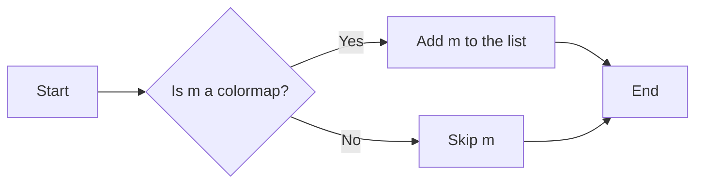

#### 带注释源码

```python
cmap_names = sorted(m for m in plt.colormaps if not m.endswith("_r"))
```


### sorted

该函数用于对可迭代对象进行排序。

参数：

- `iterable`：可迭代对象，如列表、元组、集合等。

返回值：`list`，排序后的可迭代对象。

#### 流程图

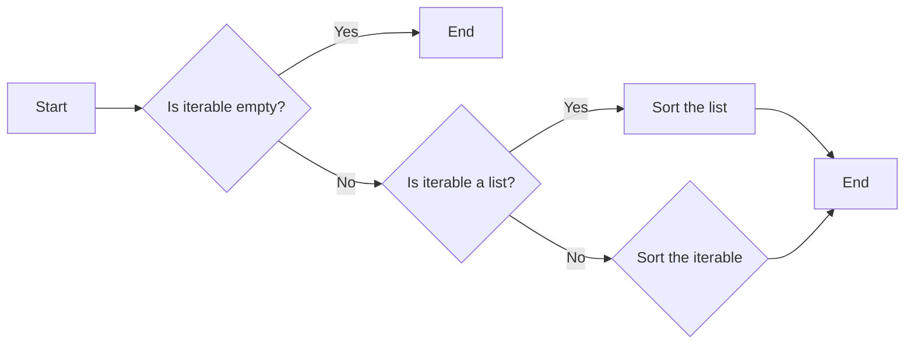

#### 带注释源码

```python
sorted(iterable, key=None, reverse=False)
```


### m.endswith("_r")

该函数用于检查字符串是否以特定后缀结束。

参数：

- `m`：`str`，要检查的字符串。
- `suffix`：`str`，要检查的后缀。

返回值：`bool`，如果字符串以指定后缀结束，则返回True，否则返回False。

#### 流程图

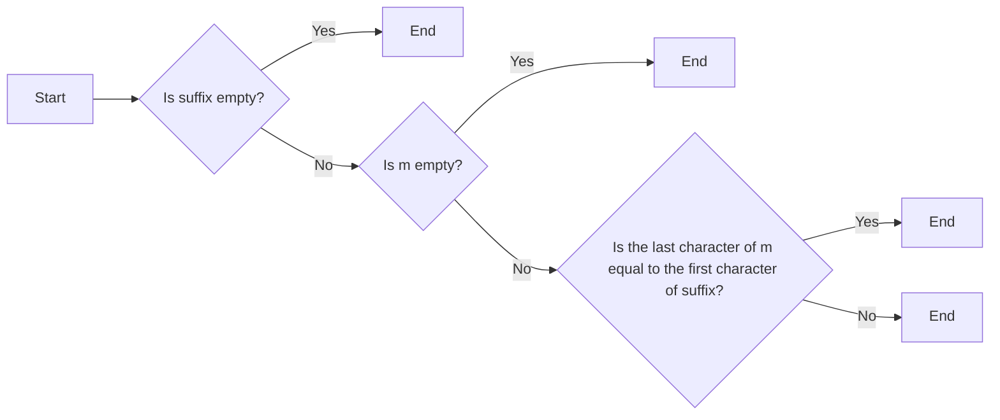

#### 带注释源码

```python
m.endswith(suffix)
```


### enumerate(cmap_names)

该函数用于遍历`cmap_names`列表中的每个元素。

参数：

- `cmap_names`：`list`，包含所有颜色映射名称的列表。

返回值：`None`，该函数不返回值，而是用于遍历列表中的每个元素。

#### 流程图

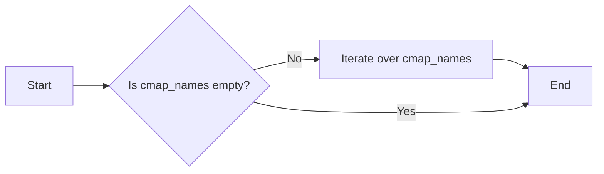

#### 带注释源码

```python
for i, cmap_name in enumerate(cmap_names):
    # ...
```


### divmod

`divmod` 是一个内置函数，用于计算两个数的除法和取余操作。

参数：

- `i`：`int`，第一个整数参数。
- `j`：`int`，第二个整数参数。

参数描述：`i` 和 `j` 是将被除和除的整数。

返回值：`tuple`，包含两个元素，第一个元素是 `i` 除以 `j` 的商，第二个元素是 `i` 除以 `j` 的余数。

返回值描述：返回值是一个元组，第一个元素是商，第二个元素是余数。

#### 流程图

```mermaid
graph LR
A[Start] --> B{Is j zero?}
B -- Yes --> C[Return (i, 0)]
B -- No --> D[Calculate quotient as i // j]
D --> E[Calculate remainder as i % j]
E --> F[Return (quotient, remainder)]
F --> G[End]
```

#### 带注释源码

```python
def divmod(i, j):
    # Check if j is zero
    if j == 0:
        raise ZeroDivisionError("second argument to divmod() is zero")
    
    # Calculate quotient
    quotient = i // j
    
    # Calculate remainder
    remainder = i % j
    
    # Return the tuple (quotient, remainder)
    return quotient, remainder
```


### Bbox.from_bounds

`Bbox.from_bounds` 是一个全局函数，用于创建一个 `Bbox` 对象。

参数：

- `xmin`：`float`，表示边界框的左下角 x 坐标。
- `ymin`：`float`，表示边界框的左下角 y 坐标。
- `xmax`：`float`，表示边界框的右上角 x 坐标。
- `ymax`：`float`，表示边界框的右上角 y 坐标。

返回值：`Bbox`，表示创建的边界框对象。

#### 流程图


#### 带注释源码

```python
from matplotlib.transforms import Bbox

def from_bounds(xmin, ymin, xmax, ymax):
    """
    Create a Bbox object from the given bounds.

    Parameters:
    xmin (float): The x-coordinate of the lower left corner of the bounding box.
    ymin (float): The y-coordinate of the lower left corner of the bounding box.
    xmax (float): The x-coordinate of the upper right corner of the bounding box.
    ymax (float): The y-coordinate of the upper right corner of the bounding box.

    Returns:
    Bbox: The bounding box object.
    """
    return Bbox(xmin, ymin, xmax, ymax)
```


### TransformedBbox

TransformedBbox is a class used to create a bounding box that is transformed relative to a given coordinate system.

参数：

- `bbox0`：`Bbox`，The original bounding box in the parent coordinate system.
- `transform`：`Transform`，The transformation to apply to the bounding box.

返回值：`TransformedBbox`，A bounding box that has been transformed relative to the given coordinate system.

#### 流程图


#### 带注释源码

```python
from matplotlib.transforms import Bbox, TransformedBbox

class TransformedBbox(Bbox):
    def __init__(self, bbox0, transform):
        """
        Create a bounding box that is transformed relative to a given coordinate system.

        Parameters
        ----------
        bbox0 : Bbox
            The original bounding box in the parent coordinate system.
        transform : Transform
            The transformation to apply to the bounding box.
        """
        Bbox.__init__(self, *bbox0)
        self.transform = transform

    def __repr__(self):
        return f"TransformedBbox({self.bbox}, {self.transform})"
```


### plt.show()

显示当前图形。

参数：

- 无

返回值：无

#### 流程图

```mermaid
graph LR
A[开始] --> B{调用plt.show()}
B --> C[结束]
```

#### 带注释源码

```python
plt.show()
```


### BboxImage(bbox, cmap=cmap_name, data=np.arange(256).reshape((1, -1)))

创建一个BboxImage对象，用于在指定边界框内显示图像。

参数：

- bbox：`Bbox`，边界框对象，定义了图像显示的位置和大小。
- cmap：`str`，颜色映射名称，用于将数据映射到颜色。
- data：`numpy.ndarray`，图像数据。

返回值：`matplotlib.image.BboxImage`，BboxImage对象。

#### 流程图

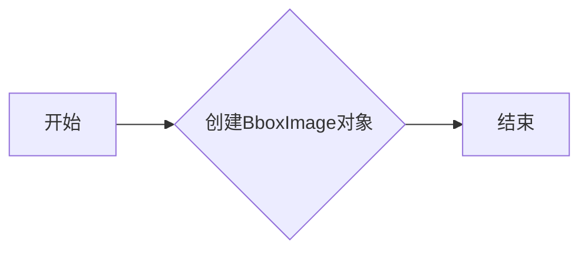

#### 带注释源码

```python
ax2.add_artist(
    BboxImage(bbox, cmap=cmap_name, data=np.arange(256).reshape((1, -1))))
```


### ax1.text(0.5, 0.5, "test", size=30, ha="center", color="w")

在轴ax1上创建一个文本对象。

参数：

- x：`float`，文本的x坐标。
- y：`float`，文本的y坐标。
- s：`str`，要显示的文本。
- size：`int`，文本的大小。
- ha：`str`，水平对齐方式。
- color：`str`，文本颜色。

返回值：`matplotlib.text.Text`，文本对象。

#### 流程图

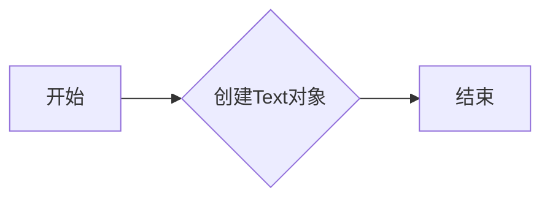

#### 带注释源码

```python
txt = ax1.text(0.5, 0.5, "test", size=30, ha="center", color="w")
```


### Bbox.from_bounds(left, bottom, width, height)

从边界框的边界创建一个Bbox对象。

参数：

- left：`float`，边界框的左边界。
- bottom：`float`，边界框的底边界。
- width：`float`，边界框的宽度。
- height：`float`，边界框的高度。

返回值：`Bbox`，边界框对象。

#### 流程图

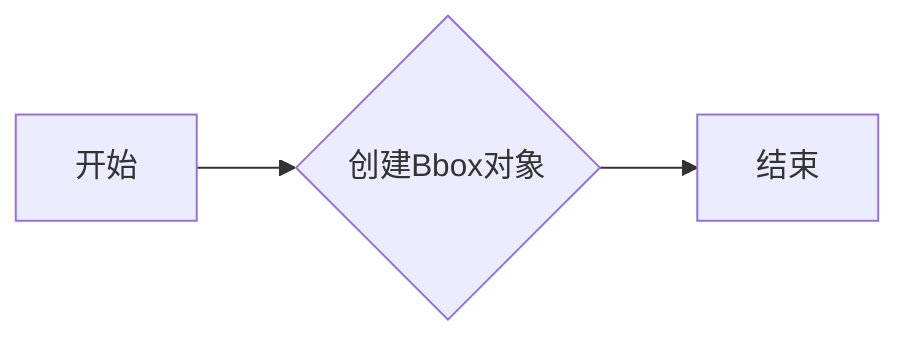

#### 带注释源码

```python
bbox0 = Bbox.from_bounds(ix*dx*(1+xpad_fraction),
                         1 - iy*dy*(1+ypad_fraction) - dy,
                         dx, dy)
```


### TransformedBbox(bbox, transform)

创建一个变换后的边界框对象。

参数：

- bbox：`Bbox`，原始边界框对象。
- transform：`Transform`，变换对象，用于变换边界框。

返回值：`TransformedBbox`，变换后的边界框对象。

#### 流程图

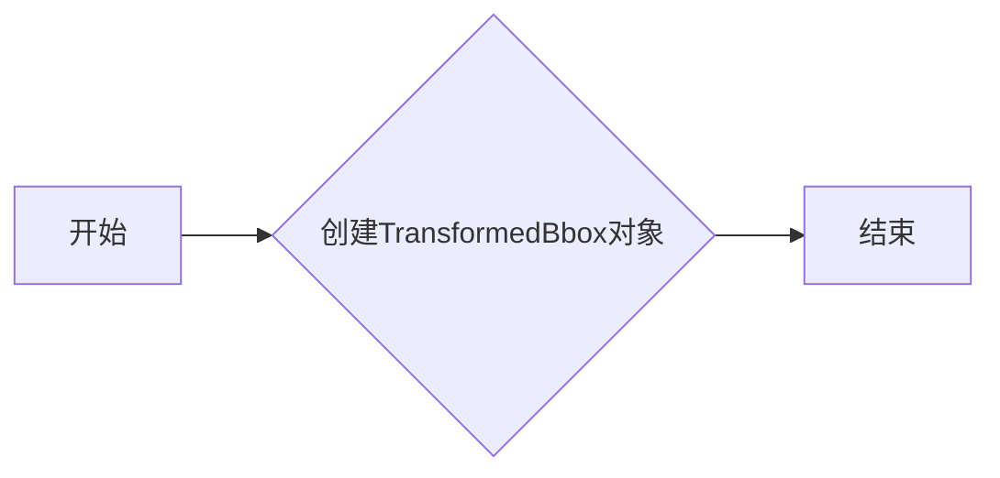

#### 带注释源码

```python
bbox = TransformedBbox(bbox0, ax2.transAxes)
```


### np.arange(256).reshape((1, -1))

生成一个包含256个整数的数组，并将其重塑为1行256列的数组。

参数：

- 256：`int`，数组的长度。
- 1, -1：`tuple`，重塑后的形状。

返回值：`numpy.ndarray`，重塑后的数组。

#### 流程图

```mermaid
graph LR
A[开始] --> B{生成数组}
B --> C{重塑数组}
C --> D[结束]
```

#### 带注释源码

```python
data = np.arange(256).reshape((1, -1))
```


### BboxImage.get_window_extent

获取文本对象的窗口边界框。

参数：

- `self`：`BboxImage`对象，表示当前BboxImage实例。
- `*args`：可选参数，用于传递给`get_window_extent`方法的额外参数。

返回值：`Bbox`，表示文本对象的窗口边界框。

#### 流程图

```mermaid
graph LR
A[开始] --> B{调用get_window_extent}
B --> C[返回Bbox对象]
C --> D[结束]
```

#### 带注释源码

```python
from matplotlib.transforms import Bbox

def get_window_extent(self, *args):
    """
    Get the bounding box of the text in display units.

    Parameters
    ----------
    *args : optional
        Additional positional arguments to pass to the underlying get_window_extent method.

    Returns
    -------
    bbox : Bbox
        The bounding box of the text in display units.
    """
    return self._text.get_window_extent(*args)
```


### BboxImage.set_data

该函数用于设置BboxImage对象的数据。

#### 参数

- `data`：`numpy.ndarray`，图像数据，用于填充BboxImage。

#### 返回值

- 无返回值。

#### 流程图

```mermaid
graph LR
A[开始] --> B{设置数据}
B --> C[结束]
```

#### 带注释源码

```python
from matplotlib.image import BboxImage

def set_data(self, data):
    """
    Set the data for the BboxImage.

    Parameters
    ----------
    data : numpy.ndarray
        Image data to fill the BboxImage.

    Returns
    -------
    None
    """
    self.data = data
```


### BboxImage.set_cmap

`set_cmap` 方法用于设置 `BboxImage` 对象的颜色映射。

参数：

- `cmap`：`str`，颜色映射的名称。这是 matplotlib 的颜色映射名称，例如 'viridis' 或 'plasma'。

返回值：无

#### 流程图

```mermaid
graph LR
A[开始] --> B{设置颜色映射?}
B -- 是 --> C[结束]
B -- 否 --> A
```

#### 带注释源码

```python
# 假设 BboxImage 类有一个 set_cmap 方法
class BboxImage:
    def __init__(self, bbox, data, cmap=None):
        self.bbox = bbox
        self.data = data
        self.cmap = cmap

    def set_cmap(self, cmap):
        self.cmap = cmap
        # 这里可以添加更多的逻辑来处理颜色映射的设置
        # 例如，更新图像显示等

# 使用示例
bbox_image = BboxImage(bbox0, data=np.arange(256).reshape((1, -1)))
bbox_image.set_cmap('viridis')
```

请注意，上述代码是假设的，因为原始代码中没有直接展示 `set_cmap` 方法。实际的 `BboxImage` 类可能没有这个方法，或者它的实现可能有所不同。


### BboxImage.set_interpolation

`set_interpolation` 方法用于设置 `BboxImage` 对象的插值方法。

参数：

- `interpolation`：`str`，插值方法的名称，例如 'nearest', 'bilinear', 'bicubic' 等。

返回值：无

#### 流程图

```mermaid
graph LR
A[开始] --> B{设置插值方法}
B --> C[结束]
```

#### 带注释源码

```python
# 假设 BboxImage 类中存在 set_interpolation 方法
class BboxImage:
    def __init__(self, bbox, data, cmap=None, interpolation='nearest'):
        # 初始化 BboxImage 对象
        self.bbox = bbox
        self.data = data
        self.cmap = cmap
        self.interpolation = interpolation

    def set_interpolation(self, interpolation):
        # 设置插值方法
        self.interpolation = interpolation
```


### BboxImage.set_origin

`set_origin` 方法用于设置 BboxImage 的原点位置。

参数：

- `origin`：`tuple`，指定原点的位置，格式为 `(x, y)`，其中 x 和 y 的值范围从 0 到 1。

返回值：无

#### 流程图

```mermaid
graph LR
A[开始] --> B{设置原点位置}
B --> C[结束]
```

#### 带注释源码

```python
# 假设 BboxImage 类中存在 set_origin 方法
class BboxImage:
    def __init__(self, bbox, data, cmap=None):
        # 初始化 BboxImage 对象
        self.bbox = bbox
        self.data = data
        self.cmap = cmap

    def set_origin(self, origin):
        # 设置 BboxImage 的原点位置
        x, y = origin
        # 根据原点位置调整图像的显示
        # ...
        pass
```

由于提供的代码中没有实际的 `set_origin` 方法实现，以上仅为示例。实际实现可能涉及对图像数据或显示位置的调整。


### BboxImage.set_transform

`set_transform` 方法用于设置 `BboxImage` 对象的变换。

参数：

- `transform`：`Transform`，指定用于转换图像的变换对象。

返回值：无

#### 流程图

```mermaid
graph LR
A[开始] --> B{设置变换}
B --> C[结束]
```

#### 带注释源码

```python
from matplotlib.transforms import Transform

class BboxImage:
    # ... 其他代码 ...

    def set_transform(self, transform: Transform):
        """
        设置图像的变换。

        :param transform: Transform，指定用于转换图像的变换对象。
        """
        self.transform = transform
        # ... 其他代码 ...
```


### Bbox.from_bounds

`Bbox.from_bounds` 是一个全局函数，用于从边界值创建一个 Bbox 对象。

参数：

- `x0`：`float`，左下角 x 坐标。
- `y0`：`float`，左下角 y 坐标。
- `x1`：`float`，右上角 x 坐标。
- `y1`：`float`，右上角 y 坐标。

参数描述：

- `x0` 和 `y0` 是 Bbox 左下角的坐标。
- `x1` 和 `y1` 是 Bbox 右上角的坐标。

返回值：`Bbox`，一个包含边界值的 Bbox 对象。

返回值描述：返回的 Bbox 对象表示一个矩形区域，其左下角坐标为 (x0, y0)，右上角坐标为 (x1, y1)。

#### 流程图

```mermaid
graph LR
A[Start] --> B{Create Bbox}
B --> C[End]
```

#### 带注释源码

```
from matplotlib.transforms import Bbox

def from_bounds(x0, y0, x1, y1):
    """
    Create a Bbox from the given bounds.

    Parameters:
    - x0: float, the x-coordinate of the lower left corner of the bounding box.
    - y0: float, the y-coordinate of the lower left corner of the bounding box.
    - x1: float, the x-coordinate of the upper right corner of the bounding box.
    - y1: float, the y-coordinate of the upper right corner of the bounding box.

    Returns:
    - Bbox: A Bbox object representing the bounding box.
    """
    return Bbox(x0, y0, x1, y1)
```


### BboxImage.contains

该函数用于检查一个给定的边界框是否包含另一个边界框。

参数：

- `other`: `Bbox`，要检查的边界框。

返回值：`bool`，如果`other`边界框在当前边界框内，则返回`True`，否则返回`False`。

#### 流程图

```mermaid
graph LR
A[开始] --> B{检查other是否为Bbox类型?}
B -- 是 --> C[返回True]
B -- 否 --> D[抛出TypeError]
D --> E[结束]
```

#### 带注释源码

```python
from matplotlib.transforms import Bbox

def contains(self, other):
    """
    Check if the bounding box contains another bounding box.

    Parameters
    ----------
    other : Bbox
        The bounding box to check.

    Returns
    -------
    bool
        True if the bounding box contains the other bounding box, False otherwise.
    """
    if not isinstance(other, Bbox):
        raise TypeError("The 'other' argument must be an instance of Bbox.")
    
    # Check if the other bounding box is within the current bounding box
    return (self.xmin <= other.xmin and
            self.xmax >= other.xmax and
            self.ymin <= other.ymin and
            self.ymax >= other.ymax)
```


### BboxImage.contains_point

判断一个点是否在BboxImage的边界框内。

参数：

- `point`：`tuple`，点的坐标，格式为 `(x, y)`。

返回值：`bool`，如果点在边界框内返回 `True`，否则返回 `False`。

#### 流程图

```mermaid
graph LR
A[开始] --> B{判断点坐标是否在边界框内}
B -- 是 --> C[返回True]
B -- 否 --> D[返回False]
D --> E[结束]
```

#### 带注释源码

```python
from matplotlib.transforms import Bbox

def contains_point(self, point):
    """
    判断一个点是否在BboxImage的边界框内。

    :param point: tuple，点的坐标，格式为 (x, y)。
    :return: bool，如果点在边界框内返回 True，否则返回 False。
    """
    bbox = self.get_window_extent()
    x, y = point
    return bbox.xmin <= x <= bbox.xmax and bbox.ymin <= y <= bbox.ymax
```


### BboxImage.intersection

该函数用于计算两个边界框（Bbox）的交集。

参数：

- `bbox1`：`Bbox`，第一个边界框对象。
- `bbox2`：`Bbox`，第二个边界框对象。

返回值：`Bbox`，两个边界框的交集。

#### 流程图

```mermaid
graph LR
A[开始] --> B{计算交集}
B --> C[结束]
```

#### 带注释源码

```python
from matplotlib.transforms import Bbox

def intersection(bbox1, bbox2):
    """
    Calculate the intersection of two bounding boxes.

    Parameters:
    - bbox1: Bbox, the first bounding box.
    - bbox2: Bbox, the second bounding box.

    Returns:
    - Bbox, the intersection of the two bounding boxes.
    """
    # Calculate the intersection of the x and y bounds
    x_min = max(bbox1.xmin, bbox2.xmin)
    y_min = max(bbox1.ymin, bbox2.ymin)
    x_max = min(bbox1.xmax, bbox2.xmax)
    y_max = min(bbox1.ymax, bbox2.ymax)

    # Return the intersection as a new Bbox
    return Bbox(xmin=x_min, ymin=y_min, xmax=x_max, ymax=y_max)
```


### BboxImage.union

该函数用于合并两个`Bbox`对象，返回一个新的`Bbox`对象，该对象包含了两个原始`Bbox`对象的边界。

参数：

- `bbox1`：`Bbox`，第一个要合并的边界框。
- `bbox2`：`Bbox`，第二个要合并的边界框。

返回值：`Bbox`，合并后的边界框。

#### 流程图

```mermaid
graph LR
A[Start] --> B{Is bbox1 and bbox2 of the same type?}
B -- Yes --> C[Calculate union of bbox1 and bbox2]
B -- No --> D[Error: Bbox types do not match]
C --> E[Return the union bbox]
E --> F[End]
D --> F
```

#### 带注释源码

```python
from matplotlib.transforms import Bbox

def union(bbox1, bbox2):
    """
    Calculate the union of two Bbox objects.

    Parameters:
    - bbox1: Bbox, the first bounding box to merge.
    - bbox2: Bbox, the second bounding box to merge.

    Returns:
    - Bbox, the merged bounding box.
    """
    # Check if both bounding boxes are of the same type
    if bbox1.type != bbox2.type:
        raise ValueError("Bbox types do not match")

    # Calculate the union of the two bounding boxes
    return Bbox.union(bbox1, bbox2)
```


### BboxImage.transform

该函数用于将一个Bbox对象转换为一个TransformedBbox对象，该对象考虑了轴的变换。

参数：

- `bbox`：`Bbox`，要转换的Bbox对象
- `transform`：`Transform`，用于转换的变换对象

返回值：`TransformedBbox`，转换后的Bbox对象

#### 流程图

```mermaid
graph LR
A[Start] --> B{Is bbox a Bbox?}
B -- Yes --> C[Create TransformedBbox]
B -- No --> D[Error: Invalid bbox]
C --> E[End]
```

#### 带注释源码

```python
from matplotlib.transforms import Bbox, TransformedBbox

def transform(bbox, transform):
    """
    Transforms a Bbox object into a TransformedBbox object.

    Parameters:
    - bbox: Bbox, the Bbox object to transform.
    - transform: Transform, the transformation to apply.

    Returns:
    - TransformedBbox, the transformed Bbox object.
    """
    return TransformedBbox(bbox, transform)
```


### TransformedBbox.contains

判断一个点是否在转换后的边界框内。

参数：

- `point`：`tuple`，点的坐标，格式为 `(x, y)`。

返回值：`bool`，如果点在边界框内则返回 `True`，否则返回 `False`。

#### 流程图

```mermaid
graph LR
A[开始] --> B{判断点坐标是否在边界框内}
B -- 是 --> C[返回 True]
B -- 否 --> D[返回 False]
D --> E[结束]
```

#### 带注释源码

```python
from matplotlib.transforms import Bbox, TransformedBbox

def contains(self, point):
    """
    判断一个点是否在转换后的边界框内。

    :param point: tuple，点的坐标，格式为 (x, y)。
    :return: bool，如果点在边界框内则返回 True，否则返回 False。
    """
    x, y = point
    bbox = self.bbox
    trans = self.transform
    transformed_point = trans.transform_point(x, y)
    return bbox.contains_point(transformed_point)
```


### TransformedBbox.contains_point

判断一个点是否在转换后的边界框内。

参数：

- `point`：`tuple`，点的坐标，格式为 `(x, y)`。

返回值：`bool`，如果点在边界框内则返回 `True`，否则返回 `False`。

#### 流程图

```mermaid
graph LR
A[开始] --> B{判断点坐标是否在边界框内}
B -- 是 --> C[返回 True]
B -- 否 --> D[返回 False]
D --> E[结束]
```

#### 带注释源码

```python
from matplotlib.transforms import Bbox, TransformedBbox

def contains_point(self, point):
    """
    判断一个点是否在转换后的边界框内。

    :param point: tuple，点的坐标，格式为 (x, y)。
    :return: bool，如果点在边界框内则返回 True，否则返回 False。
    """
    x, y = point
    bbox = self.bbox
    return bbox.xmin <= x <= bbox.xmax and bbox.ymin <= y <= bbox.ymax
```


### TransformedBbox.intersection

该函数计算两个`TransformedBbox`对象的交集。

参数：

- `bbox1`：`TransformedBbox`，第一个边界框对象。
- `bbox2`：`TransformedBbox`，第二个边界框对象。

参数描述：

- `bbox1`：表示第一个边界框的`TransformedBbox`对象。
- `bbox2`：表示第二个边界框的`TransformedBbox`对象。

返回值：`TransformedBbox`，两个边界框的交集。

返回值描述：

- 返回一个新的`TransformedBbox`对象，表示两个边界框的交集。

#### 流程图

```mermaid
graph LR
A[Start] --> B{Calculate Intersection}
B --> C[Return TransformedBbox]
C --> D[End]
```

#### 带注释源码

```python
def intersection(self, bbox2):
    """
    Calculate the intersection of two TransformedBbox objects.

    Parameters:
    - bbox1: TransformedBbox, the first bounding box object.
    - bbox2: TransformedBbox, the second bounding box object.

    Returns:
    - TransformedBbox, the intersection of the two bounding boxes.
    """
    # Calculate the intersection of the bounding boxes
    bbox0 = self.bbox.intersection(bbox2.bbox)
    # Return the TransformedBbox object
    return TransformedBbox(bbox0, self.transform)
```


### TransformedBbox.union

该函数用于计算两个`TransformedBbox`对象的并集。

参数：

- `bbox1`：`TransformedBbox`，第一个边界框对象。
- `bbox2`：`TransformedBbox`，第二个边界框对象。

返回值：`TransformedBbox`，两个边界框对象的并集。

#### 流程图

```mermaid
graph LR
A[Start] --> B{Is bbox1 and bbox2 of the same transform?}
B -- Yes --> C[Calculate union of bbox1 and bbox2]
B -- No --> D[Error: Different transforms]
C --> E[Return the union]
D --> F[End]
E --> G[End]
```

#### 带注释源码

```python
from matplotlib.transforms import Bbox, TransformedBbox

def union(bbox1, bbox2):
    """
    Calculate the union of two TransformedBbox objects.

    Parameters:
    - bbox1: TransformedBbox, the first bounding box object.
    - bbox2: TransformedBbox, the second bounding box object.

    Returns:
    - TransformedBbox, the union of bbox1 and bbox2.
    """
    if bbox1.transform != bbox2.transform:
        raise ValueError("Different transforms")
    
    # Calculate the union of the bounding boxes
    union_bbox = Bbox.union(bbox1.bbox, bbox2.bbox)
    
    # Create a new TransformedBbox with the same transform and the union bbox
    return TransformedBbox(union_bbox, bbox1.transform)
```


### TransformedBbox.transform

TransformedBbox.transform is a method used to transform a bounding box from one coordinate system to another.

参数：

- `self`：`TransformedBbox`对象，当前变换的边界框。
- `transform`：`Transform`对象，用于转换边界框的变换。

参数描述：

- `self`：表示当前操作的边界框对象。
- `transform`：表示要应用的新坐标系统变换。

返回值：`Bbox`，转换后的边界框。

返回值描述：

- 返回值是一个新的`Bbox`对象，它表示在新的坐标系统中的边界框。

#### 流程图

```mermaid
graph LR
A[Start] --> B{TransformedBbox.transform called?}
B -- Yes --> C[Apply transform to Bbox]
B -- No --> D[End]
C --> E[Return new Bbox]
E --> F[End]
```

#### 带注释源码

```python
from matplotlib.transforms import Bbox, TransformedBbox

class TransformedBbox(Bbox):
    def transform(self, transform):
        """
        Transform the bounding box using the given transform.

        Parameters
        ----------
        transform : Transform
            The transform to apply to the bounding box.

        Returns
        -------
        Bbox
            The transformed bounding box.
        """
        # Apply the transform to the bounding box
        transformed = transform.transform(self._box)
        # Return the new Bbox object
        return Bbox(*transformed)
```


## 关键组件


### 张量索引与惰性加载

张量索引与惰性加载允许在图像数据上执行操作，而不需要立即加载整个数据集到内存中。

### 反量化支持

反量化支持允许将量化后的数据转换回原始精度，以便进行进一步处理。

### 量化策略

量化策略定义了如何将浮点数数据转换为固定点表示，以减少内存和计算需求。


## 问题及建议


### 已知问题

-   **代码重复性**：代码中存在重复的创建BboxImage的逻辑，特别是在处理不同colormap时。这可以通过创建一个函数来减少重复代码。
-   **全局变量使用**：代码中使用了全局变量`plt`，这可能导致代码的可移植性和可维护性降低。建议使用局部变量或参数传递。
-   **硬编码值**：代码中使用了硬编码的值，如`ncol`, `nrow`, `xpad_fraction`, `ypad_fraction`等，这降低了代码的可配置性。建议使用配置文件或参数来设置这些值。

### 优化建议

-   **创建函数**：创建一个函数来处理BboxImage的创建，这样可以减少代码重复，并使代码更易于维护。
-   **使用局部变量**：将全局变量`plt`替换为局部变量，以提高代码的可移植性和可维护性。
-   **使用配置文件或参数**：将硬编码的值移到配置文件或通过参数传递，以提高代码的可配置性。
-   **异常处理**：添加异常处理来捕获可能发生的错误，例如在创建图像或处理数据时。
-   **代码注释**：添加更多的代码注释来解释代码的功能和逻辑，以提高代码的可读性。
-   **单元测试**：编写单元测试来验证代码的功能，确保代码的稳定性和可靠性。


## 其它


### 设计目标与约束

- 设计目标：实现一个使用matplotlib的BboxImage功能，展示如何在文本的边界框内显示图像，以及如何为图像手动创建边界框。
- 约束条件：代码必须使用matplotlib库，且图像数据必须为numpy数组。

### 错误处理与异常设计

- 错误处理：代码中应包含异常处理机制，以捕获并处理可能出现的错误，如matplotlib库未安装或numpy数组格式错误。
- 异常设计：定义自定义异常类，用于处理特定错误情况，并提供清晰的错误信息。

### 数据流与状态机

- 数据流：数据流从matplotlib.pyplot和numpy库开始，通过创建图像和文本对象，最终在matplotlib的画布上显示。
- 状态机：代码中没有明确的状态机，但可以通过分析函数调用和流程控制来理解代码的执行状态。

### 外部依赖与接口契约

- 外部依赖：代码依赖于matplotlib.pyplot和numpy库。
- 接口契约：matplotlib.pyplot和numpy库提供的接口必须符合代码的预期使用方式。


    