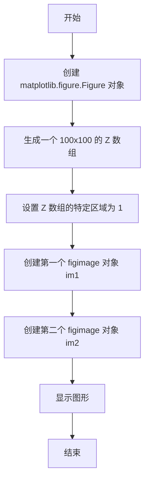

# `matplotlib\galleries\examples\images_contours_and_fields\figimage_demo.py` 详细设计文档

This code demonstrates how to place images directly in a figure using matplotlib, without the need for Axes objects.

## 整体流程



## 类结构

```
matplotlib.figure.Figure (matplotlib.figure.Figure)
├── figimage (matplotlib.figure.Figure.figimage)
```

## 全局变量及字段


### `fig`
    
A matplotlib figure object used to contain the image plots.

类型：`matplotlib.figure.Figure`
    


### `Z`
    
A 2D numpy array representing the data to be plotted.

类型：`numpy.ndarray`
    


### `im1`
    
A figure image object representing the first image plot.

类型：`matplotlib.figure.FigureImage`
    


### `im2`
    
A figure image object representing the second image plot.

类型：`matplotlib.figure.FigureImage`
    


### `matplotlib.figure.Figure.figimage`
    
A method of the Figure class to add an image to the figure.

类型：`matplotlib.figure.FigureImage`
    


### `matplotlib.figure.Figure.figimage`
    
A method of the Figure class to add an image to the figure.

类型：`matplotlib.figure.FigureImage`
    
    

## 全局函数及方法


### Figure.figimage

`Figure.figimage` 是 `matplotlib.figure.Figure` 类的一个方法，用于在图中直接放置图像，而不需要使用 `Axes` 对象。

参数：

- `Z`：`numpy.ndarray`，表示图像数据。
- `xo`：`int`，图像在水平方向上的偏移量。
- `yo`：`int`，图像在垂直方向上的偏移量。
- `alpha`：`float`，图像的透明度，默认为 1.0。
- `origin`：`str`，图像的起始位置，可以是 'upper'、'lower' 或 'center'。

返回值：`matplotlib.image.AxesImage`，表示图像对象。

#### 流程图

```mermaid
graph LR
A[开始] --> B{调用figimage()}
B --> C[结束]
```

#### 带注释源码

```python
import matplotlib.pyplot as plt
import numpy as np

fig = plt.figure()
Z = np.arange(10000).reshape((100, 100))
Z[:, 50:] = 1

# 创建图像对象
im1 = fig.figimage(Z, xo=50, yo=0, origin='lower')
im2 = fig.figimage(Z, xo=100, yo=100, alpha=.8, origin='lower')

plt.show()
```


## 关键组件


### 张量索引

张量索引用于访问和操作NumPy数组中的元素。

### 惰性加载

惰性加载是一种延迟计算的技术，用于在需要时才计算数据，从而提高性能。

### 反量化支持

反量化支持允许在量化过程中对数据进行逆量化，以便在量化后能够恢复原始数据。

### 量化策略

量化策略定义了如何将浮点数数据转换为固定点数表示，以减少计算资源的使用。


## 问题及建议


### 已知问题

-   **代码复用性低**：代码中直接使用 `figimage` 方法两次，没有封装成函数或类，导致代码复用性低。
-   **可配置性差**：代码中使用的参数如 `xo`, `yo`, `alpha` 等是硬编码的，缺乏灵活性，难以适应不同的图像和显示需求。
-   **注释不足**：代码块中虽然有文档字符串，但对于 `figimage` 方法的具体使用和参数的意义没有详细说明。

### 优化建议

-   **封装成函数或类**：将图像绘制逻辑封装成函数或类，提高代码复用性，并允许参数化配置。
-   **增加参数配置**：为函数或类提供参数配置选项，允许用户自定义图像的位置、透明度等属性。
-   **完善注释**：在代码中添加详细的注释，解释每个参数的作用和函数或类的功能。
-   **异常处理**：增加异常处理机制，确保在图像数据或参数错误时能够给出清晰的错误信息。
-   **测试**：编写单元测试，确保代码在各种配置下都能正常工作，并覆盖所有可能的错误情况。
-   **文档**：编写详细的文档，包括如何使用函数或类、参数说明、示例代码等，方便用户理解和使用。


## 其它


### 设计目标与约束

- 设计目标：实现一个简单的图像展示功能，将图像直接放置在matplotlib的figure中，不使用Axes对象。
- 约束条件：代码应简洁，易于理解，且不依赖于额外的库。

### 错误处理与异常设计

- 错误处理：代码中未包含显式的错误处理机制，但应确保所有外部库调用都在try-except块中，以捕获并处理可能发生的异常。
- 异常设计：对于matplotlib库的调用，应捕获并处理`ValueError`、`TypeError`等可能的异常。

### 数据流与状态机

- 数据流：代码中数据流简单，从numpy生成一个二维数组Z，然后通过figimage方法将其添加到figure中。
- 状态机：代码中没有状态机，整个过程是线性的，没有状态转换。

### 外部依赖与接口契约

- 外部依赖：代码依赖于matplotlib和numpy库。
- 接口契约：matplotlib的Figure和figimage方法提供了接口契约，用于在figure中添加图像。


    