# `matplotlib\galleries\examples\images_contours_and_fields\image_antialiasing.py` 详细设计文档

该文件是Matplotlib官方示例代码，演示了图像重采样（resampling）技术，包括下采样和上采样的区别、不同插值算法（nearest、hanning、lanczos、sinc等）的效果，以及interpolation和interpolation_stage参数在不同场景下的应用。

## 整体流程

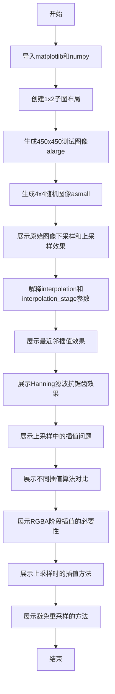

## 类结构

```
无类层次结构 (脚本文件)
该文件为纯脚本代码，不包含面向对象设计
所有代码在顶层顺序执行
```

## 全局变量及字段


### `N`
    
测试图像尺寸450

类型：`int`
    


### `x`
    
归一化X坐标数组

类型：`ndarray`
    


### `y`
    
归一化Y坐标数组

类型：`ndarray`
    


### `aa`
    
基础测试图案数组

类型：`ndarray`
    


### `X`
    
meshgrid生成的X坐标

类型：`ndarray`
    


### `Y`
    
meshgrid生成的Y坐标

类型：`ndarray`
    


### `R`
    
距离原点的半径数组

类型：`ndarray`
    


### `f0`
    
频率参数5

类型：`int`
    


### `k`
    
频率参数100

类型：`int`
    


### `a`
    
正弦波形图案

类型：`ndarray`
    


### `alarge`
    
450x450大型测试图像

类型：`ndarray`
    


### `asmall`
    
4x4小型测试图像

类型：`ndarray`
    


### `fig`
    
Matplotlib图形对象

类型：`Figure`
    


### `axs`
    
子图轴对象数组

类型：`ndarray`
    


### `ax`
    
单个子图轴对象

类型：`Axes`
    


### `im`
    
图像对象

类型：`AxesImage`
    


### `cmap`
    
颜色映射对象

类型：`Colormap`
    


    

## 全局函数及方法


### plt.subplots

`plt.subplots()` 是 Matplotlib 库中的全局函数，用于创建一个包含多个子图的图形布局。它是 `figure.subplots()` 的包装器，允许用户一次性创建指定行列数的子图网格，并返回图形对象和轴对象（或轴数组），便于同时操作多个子图。

参数：

- `nrows`：`int`，可选，默认为1，表示子图的行数
- `ncols`：`int`，可选，默认为1，表示子图的列数
- `figsize`：`tuple of float`，可选，表示图形的宽和高（英寸）
- `dpi`：`int`，可选，表示图形的分辨率（每英寸点数）
- `layout`：`str`，可选，表示子图的布局约束方式，如 `'constrained'`、`'compressed'`、`'tight'` 等
- `sharex`：`bool` 或 `str`，可选，默认为 False，是否共享x轴
- `sharey`：`bool` 或 `str`，可选，默认为 False，是否共享y轴
- `squeeze`：`bool`，可选，默认为 True，是否压缩返回的轴数组维度
- `gridspec_kw`：`dict`，可选，传递给 GridSpec 构造函数的关键字参数，用于控制子图网格
- `**kwargs`：其他关键字参数，将传递给 `figure.add_subplot()` 或 `figure.add_axes()`

返回值：`(fig, axs)` 或 `(fig, ax)`，`fig` 是 `matplotlib.figure.Figure` 类型，表示整个图形对象；`axs` 是 `numpy.ndarray` 类型（当 squeeze=False 或多行多列时），或单个 `matplotlib.axes.Axes` 类型，表示一个或多个子图轴对象。当 squeeze=True 且只有一个子图时，返回单个轴对象而非数组。

#### 流程图

```mermaid
flowchart TD
    A[调用 plt.subplots] --> B{检查 nrows 和 ncols}
    B --> C[创建 Figure 对象]
    C --> D[创建 GridSpec 布局]
    D --> E[根据布局创建子图 Axes]
    E --> F{参数 squeeze?}
    F -->|True 且单子图| G[返回单个 Axes 对象]
    F -->|False 或多子图| H[返回 Axes 数组]
    G --> I[返回 (fig, ax)]
    H --> I
```

#### 带注释源码

```python
# 代码中的 plt.subplots() 调用示例

# 示例1: 创建1行2列的子图，带尺寸设置
fig, axs = plt.subplots(1, 2, figsize=(4, 2))
# 参数: nrows=1, ncols=2, figsize=(4,2)
# 返回: fig是Figure对象, axs是包含2个Axes的数组

# 示例2: 创建单子图，使用compressed布局
fig, ax = plt.subplots(figsize=(4, 4), layout='compressed')
# 参数: nrows=1, ncols=1, figsize=(4,4), layout='compressed'
# 返回: fig是Figure对象, ax是单个Axes对象（因为squeeze=True默认）

# 示例3: 创建1行2列，constrained布局
fig, axs = plt.subplots(1, 2, figsize=(5, 2.7), layout='compressed')
# 参数: nrows=1, ncols=2, figsize=(5,2.7), layout='compressed'
# 用于比较不同插值和插值阶段的效果

# 示例4: 创建大方形子图
fig, ax = plt.subplots(figsize=(6.8, 6.8))
# 参数: nrows=1, ncols=1, figsize=(6.8,6.8)
# 用于展示上采样效果

# 示例5: 创建1行2列，constrained布局
fig, axs = plt.subplots(1, 2, figsize=(7, 4), layout='constrained')
# 参数: nrows=1, ncols=2, figsize=(7,4), layout='constrained'
# 用于比较hanning和lanczos插值算法

# 示例6: 创建1行3列，constrained布局
fig, axs = plt.subplots(1, 3, figsize=(7, 3), layout='constrained')
# 参数: nrows=1, ncols=3, figsize=(7,3), layout='constrained'
# 用于展示不同interpolation_stage的效果

# 示例7: 创建1行2列，compressed布局，用于上采样比较
fig, axs = plt.subplots(1, 2, figsize=(6.5, 4), layout='compressed')
# 参数: nrows=1, ncols=2, figsize=(6.5,4), layout='compressed'
# 用于比较上采样时的插值效果
```

#### 关键组件信息

- **Figure对象**：代表整个图形容器，负责图形的整体属性（尺寸、分辨率、布局等）
- **Axes对象**：代表单个子图坐标系，负责数据的可视化展示（图像、线条等）
- **GridSpec**：子图网格规格控制器，定义子图的排列方式
- **layout参数**：布局引擎，支持constrained、compressed、tight等模式

#### 潜在的技术债务或优化空间

1. **重复代码**：代码中存在多处重复的 `plt.subplots()` 调用模式，可考虑封装为辅助函数
2. **硬编码参数**：图形尺寸（figsize）多处硬编码，缺乏统一的配置管理
3. **注释与文档**：部分复杂插值效果的说明可以更加详细，特别是关于anti-aliasing的技术细节
4. **示例独立性**：各代码块之间存在数据依赖（如alarge、asmall变量），降低了单个示例的独立性

#### 其它项目

**设计目标与约束：**
- 目标：演示Matplotlib中图像重采样的机制和不同插值算法的效果
- 约束：受限于显示设备的分辨率，示例效果可能因屏幕而异

**错误处理与异常设计：**
- Matplotlib的 `plt.subplots()` 会自动处理无效的nrows/ncols组合
- 当layout参数不支持时，会回退到默认布局并发出警告

**数据流与状态机：**
- 状态1：生成测试数据（alarge: 450x450, asmall: 4x4）
- 状态2：创建子图布局
- 状态3：在各个子图上调用 `imshow()` 进行可视化
- 状态4：通过不同参数展示插值效果差异

**外部依赖与接口契约：**
- 依赖：`matplotlib.pyplot`、`numpy`
- 接口：遵循Matplotlib的标准API约定，返回标准的Figure和Axes对象


### np.arange()

`np.arange()` 是 NumPy 库中的一个全局函数，用于创建等差数列的数组。它根据指定的起始值、结束值和步长生成一个一维数组，类似于 Python 内置的 `range()` 函数，但返回的是 NumPy 数组。

参数：

- `start`：`float` 或 `int`，起始值，默认为 0
- `stop`：`float` 或 `int`，结束值（不包含）
- `step`：`float` 或 `int`，步长，默认为 1
- `dtype`：`dtype`，输出数组的数据类型，可选

返回值：`numpy.ndarray`，返回等差数列的一维数组

#### 流程图

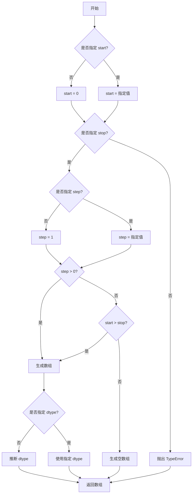

#### 带注释源码

```python
# np.arange 函数源码示例
# 函数位置：numpy/core/numeric.py

def arange(start=0, stop=None, step=1, dtype=None):
    """
    返回等差数列的数组。
    
    参数:
        start: 起始值，默认为0
        stop: 结束值（不包含）
        step: 步长，默认为1
        dtype: 输出数组的数据类型
    
    返回:
        ndarray: 等差数列数组
    """
    # 情况1：只提供一个参数（作为stop使用）
    if stop is None:
        start, stop = 0, start
    
    # 情况2：步长为整数时，使用整数除法计算
    # 情况3：步长为浮点数时，使用浮点数计算
    # 计算数组长度：(stop - start) / step，然后向上取整
    num = math.ceil((stop - start) / step) if step > 0 else 0
    
    # 根据计算的长度创建数组
    # 使用 float64 进行计算以保证精度
    y = _umath_valid_ndparray(
        start + np.arange(num) * step, 
        dtype=dtype
    )
    
    return y
```


### np.ones()

`np.ones()` 是 NumPy 库中的全局函数，用于创建一个全部元素值为 1 的数组。在给定的代码中，该函数用于生成了一个 450×450 的全 1 数组作为图像处理示例的基础数据。

参数：

- `shape`：`int` 或 `tuple of ints`，要创建的数组的形状，可以是单个整数（创建一维数组）或整数元组（创建多维数组）
- `dtype`：`data-type`，可选参数，数组的数据类型，默认为 `float64`
- `order`：`{'C', 'F'}`，可选参数，指定内存中数据的存储顺序，C 表示行主序，F 表示列主序，默认为 'C'
- `like`：`array_like`，可选参数，用于创建类似数组的对象

返回值：`ndarray`，返回一个指定形状和数据类型的全 1 数组

#### 流程图

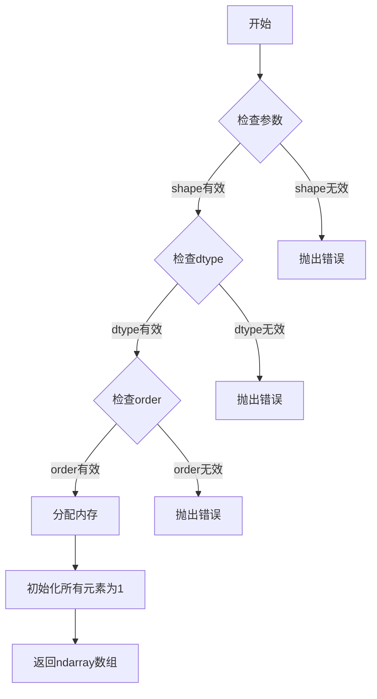

#### 带注释源码

```python
# 在本项目代码中的实际使用示例
N = 450  # 图像尺寸
# 使用 np.ones 创建一个 450x450 的全1数组
# 参数: (N, N) - 元组，指定数组形状为 450行 450列
# 返回: dtype 为 float64 的 450×450 数组
aa = np.ones((N, N))  # aa 初始化为全1矩阵

# 后续代码修改了部分元素的值
aa[::2, :] = -1  # 将偶数行设为 -1

# 完整数组创建过程:
# 1. np.ones((N, N)) 创建 450×450 全1数组
# 2. [::2, :] 表示每隔一行选择所有列
# 3. = -1 将选中的行设置为 -1
# 结果: aa 变成一个条纹图案的矩阵
```

#### 关键组件信息

- **N**：图像尺寸参数，值为 450
- **aa**：创建的全1数组，后续作为图像处理的基础数据
- **np.ones()**：NumPy 库函数，用于生成全1数组

#### 潜在的技术债务或优化空间

1. **硬编码尺寸**：代码中 N=450 是硬编码的，建议作为可配置参数
2. **魔法数字**：多处使用 `N/2`、`N/3` 等除法，建议使用具名常量
3. **重复计算**：R 数组（距离矩阵）被多次用于索引操作，可以缓存中间结果
4. **随机种子重复设置**：代码中有多处 `np.random.seed()` 调用，建议统一管理

#### 其它项目

- **设计目标**：展示 Matplotlib 图像重采样（up-sampling 和 down-sampling）概念
- **约束条件**：依赖 NumPy 和 Matplotlib 库
- **错误处理**：NumPy 函数本身会验证参数合法性，Matplotlib 会处理无效的插值方法
- **数据流**：数据从原始数组 → 预处理 → 渲染 → 显示的流程
- **外部依赖**：
  - `numpy`：提供数组操作和数学函数
  - `matplotlib.pyplot`：提供绘图和可视化功能


### `np.meshgrid`

`np.meshgrid` 是 NumPy 库中的全局函数，用于从一维坐标向量创建二维网格坐标矩阵。在图像处理和科学计算中，该函数能够生成用于评估二维函数或进行向量化运算的坐标数组，是数据可视化和数值分析的基础工具。

参数：

- `x`：`array_like`，一维数组，表示 x 轴坐标向量
- `y`：`array_like`，一维数组，表示 y 轴坐标向量

返回值：`tuple of ndarrays`，返回两个二维数组 (X, Y)，其中 X 的每一行是 x 的副本，Y 的每一列是 y 的副本，共同构成网格坐标

#### 流程图

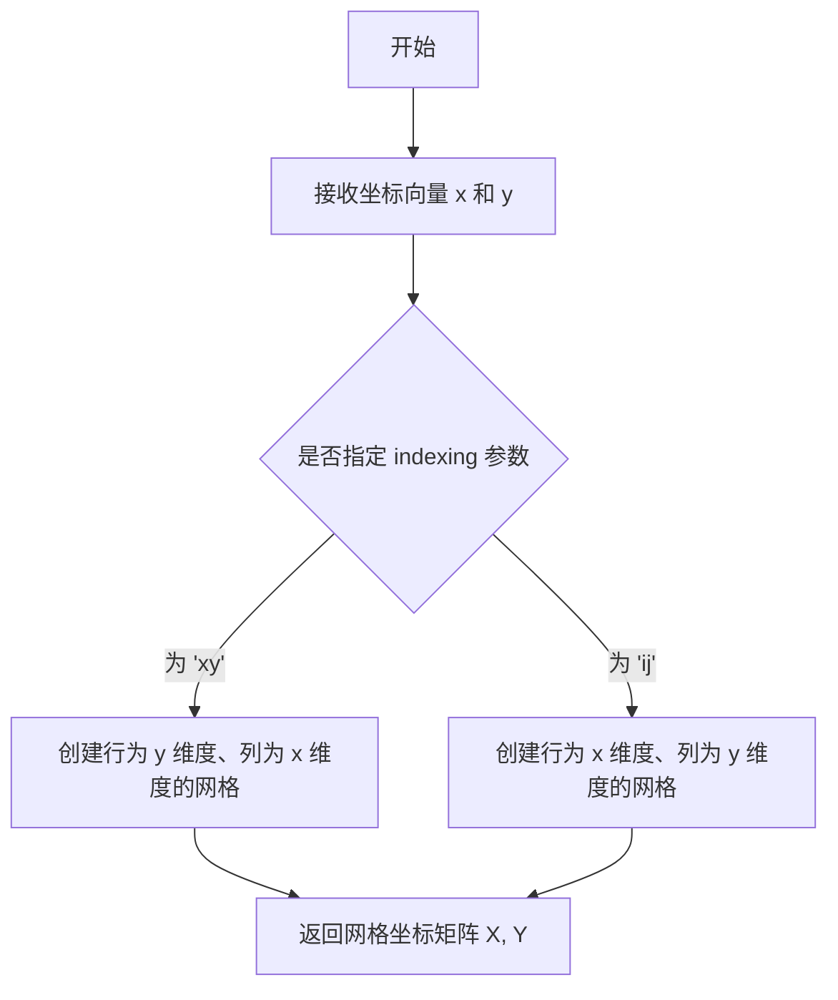

#### 带注释源码

```python
# np.meshgrid 函数的简化实现原理
def meshgrid(x, y):
    """
    从两个一维坐标向量创建网格坐标矩阵
    
    参数:
        x: 一维数组，x轴坐标
        y: 一维数组，y轴坐标
    
    返回:
        X, Y: 二维网格坐标矩阵
    """
    # 获取坐标向量的长度
    nx = len(x)
    ny = len(y)
    
    # 使用 NumPy 的 ogrid 生成广播友好的索引
    # X 的形状为 (ny, nx)，每行重复 x
    X = np.broadcast_to(x, (ny, nx)).copy()
    
    # Y 的形状为 (ny, nx)，每列重复 y
    Y = np.broadcast_to(y[:, np.newaxis], (ny, nx)).copy()
    
    return X, Y

# 在原始代码中的实际使用
N = 450
x = np.arange(N) / N - 0.5  # 生成 [-0.5, 0.5) 范围内的 x 坐标
y = np.arange(N) / N - 0.5  # 生成 [-0.5, 0.5) 范围内的 y 坐标

# 创建网格坐标，用于后续计算距离和生成测试图像
X, Y = np.meshgrid(x, y)

# 计算每个点到原点的距离
R = np.sqrt(X**2 + Y**2)
```

#### 关键组件信息

- **广播机制 (Broadcasting)**：利用 NumPy 的广播特性高效生成网格，避免显式循环
- **索引模式 (indexing)**：支持 'xy'（默认，行为 x 维度，列为 y 维度）和 'ij'（相反）两种模式
- **稀疏网格支持**：可通过 `sparse=True` 参数返回稀疏矩阵以节省内存

#### 潜在的技术债务或优化空间

- 对于大规模网格生成，默认的密集数组可能消耗大量内存，应在适当场景下使用 `sparse=True` 参数
- 在极坐标系转换场景下，可考虑直接生成极坐标网格的专用函数以提升性能

#### 其它项目

**设计目标与约束**：
- 提供简洁的 API 用于二维坐标网格生成
- 支持多种索引方式以兼容不同科学计算约定

**错误处理与异常设计**：
- 输入必须为一维数组，否则抛出 ValueError
- 当输入为空数组时，返回空矩阵

**外部依赖与接口契约**：
- 依赖 NumPy 核心库
- 返回值始终为元组形式，可解包为两个网格坐标矩阵


### `np.sqrt`

`np.sqrt()` 是 NumPy 库中的全局数学函数，用于计算输入数组或标量中每个元素的平方根。

参数：

- `x`：`array_like`，需要计算平方根的输入值，可以是标量、列表或 NumPy 数组

返回值：`ndarray`，返回与输入数组形状相同的数组，包含每个元素的平方根

#### 流程图

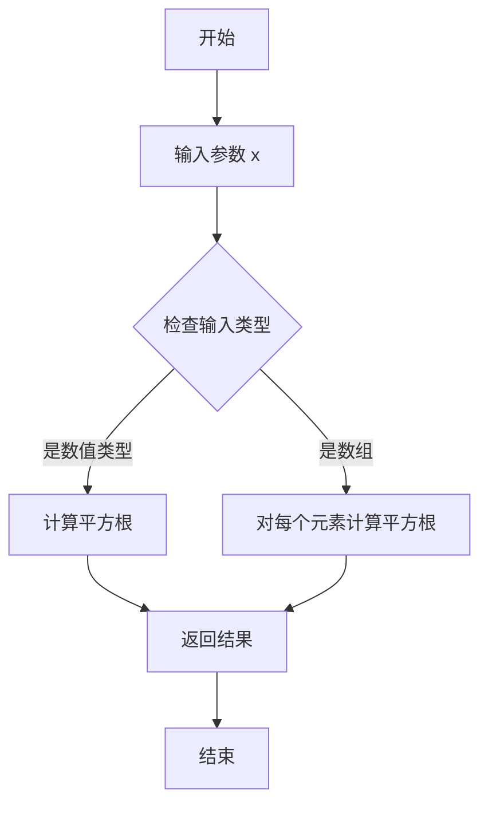

#### 带注释源码

```python
# 计算 R = sqrt(X**2 + Y**2)
# 这里 X 和 Y 是通过 meshgrid 生成的网格坐标
# np.sqrt() 接收一个数组参数，返回该数组中每个元素的平方根

X, Y = np.meshgrid(x, y)  # 生成网格坐标矩阵
R = np.sqrt(X**2 + Y**2)  # 计算每个点到原点的距离（平方根）
```

#### 详细说明

| 项目 | 描述 |
|------|------|
| **函数名** | `np.sqrt` |
| **模块** | `numpy` |
| **参数类型** | `array_like` |
| **返回值类型** | `ndarray` |
| **使用场景** | 在图像处理示例中用于计算每个像素点到原点的欧几里得距离 |
| **数学含义** | 对于输入 x，返回满足 y² = x 的非负值 y |


### `np.sin`

计算输入数组或数值的正弦值（以弧度为单位）。该函数是NumPy库提供的数学函数，在此代码中用于生成具有特定频率内容的图像数据，通过计算包含径向频率和二次相位项的表达式来产生类似"chirp"模式的波形。

参数：

- `x`：`float` 或 `array_like`，输入角度值（弧度制），可以是标量或任意维度的数组，函数将对输入的每个元素计算其正弦值

返回值：`ndarray` 或 `scalar`，返回与输入形状相同的正弦值数组（或标量），输出值范围为 [-1, 1]

#### 流程图

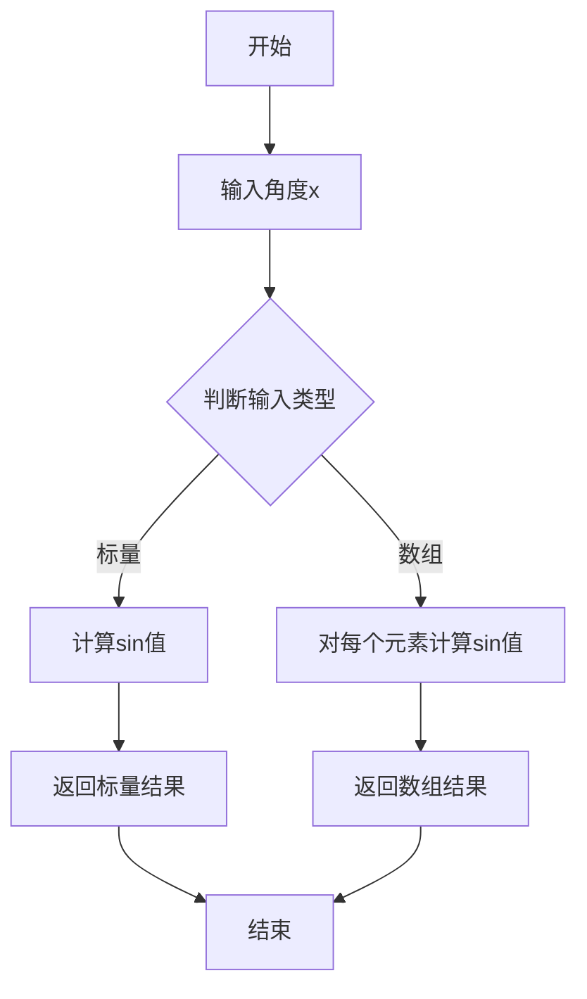

#### 带注释源码

```python
# 在本例中，np.sin用于生成一个具有径向频率和二次相位项的波形图像
# 表达式: sin(2π * (f0 * R + k * R² / 2))

# 参数说明:
# - R: 距离矩阵, 由meshgrid生成,表示每个点到原点的距离
# - f0 = 5: 基频系数,控制波形的整体频率
# - k = 100: 二次相位系数,用于产生频率随距离变化的chirp效果

# 计算过程:
# 1. 首先计算 f0 * R: 线性频率分量
# 2. 然后计算 k * R**2 / 2: 二次相位分量  
# 3. 将两者相加后乘以 2π: 得到完整的相位角
# 4. 最后调用 np.sin: 计算正弦值得到最终的波形数据

a = np.sin(np.pi * 2 * (f0 * R + k * R**2 / 2))
# 解释: a是一个450x450的数组,包含从中心向外频率逐渐增加的圆形波纹图案
```


### `np.random.rand`

生成一个指定形状的数组，数组中的值服从区间 [0, 1) 内的均匀分布。该函数是 NumPy 库的全局函数，常用于生成测试数据或初始化数组。

#### 参数

- `*shape`：`int` 或 `tuple of ints`，指定输出数组的形状。可以传入多个整数参数（如 `np.random.rand(4, 4)`）或一个整数元组（如 `np.random.rand((4, 4))`）。

#### 返回值

- `ndarray`，返回指定形状的随机值数组，数组中的每个元素都是 [0, 1) 区间内的均匀分布随机浮点数。

#### 流程图

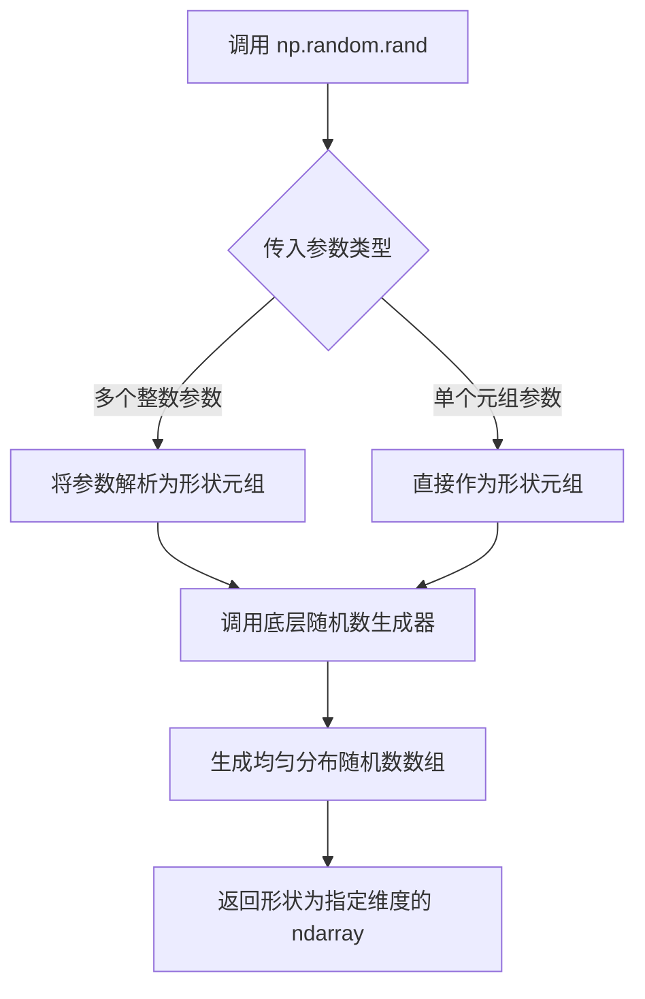

#### 带注释源码

```python
# np.random.rand 是 NumPy 库中的随机数生成函数
# 以下是代码中的实际调用示例：

# 设置随机种子以确保可重复性
np.random.seed(19680801+9)

# 生成一个 4x4 的随机数组，值在 [0, 1) 区间内均匀分布
# 参数 4, 4 表示生成二维数组，行数为 4，列数为 4
asmall = np.random.rand(4, 4)

# 另一个生成 4x4 随机数组的调用
a = np.random.rand(4, 4)

# 函数原型（NumPy 内部实现简化表示）：
# def rand(*shape):
#     """
#     返回 [0, 1) 区间内的随机浮点数组成的数组。
#     
#     参数：
#         *shape : int...
#             整数或整数序列，定义输出数组的形状。
#     
#     返回值：
#         ndarray
#             随机浮点数数组。
#     """
#     # 内部调用 random_sample 或 generator 的 random 方法
#     return random_sample(size=shape)
```

#### 关键组件信息

- **NumPy 随机数生成器**：底层使用 Mersenne Twister 算法生成伪随机数
- **均匀分布**：生成的数值在 [0, 1) 区间内等概率分布

#### 潜在的技术债务或优化空间

- **可重复性考虑**：代码中使用了 `np.random.seed()` 来确保结果可复现，这是良好的实践
- **性能优化**：对于大规模随机数组生成，可考虑使用 `numpy.random.Generator` 替代传统的 `np.random.rand`，新 API 性能更优且具有更好的统计特性
- **跨平台一致性**：不同操作系统或 NumPy 版本可能产生略微不同的随机数序列

#### 其它项目

- **设计目标**：为图像重采样示例生成测试用的随机小数组，演示上采样效果
- **约束**：生成的数组维度较小（4x4），以便清晰展示上采样前后的效果对比
- **错误处理**：如果传入负数维度或非数值类型，会抛出 ValueError 或 TypeError
- **外部依赖**：依赖 NumPy 库，需要 `import numpy as np`


### np.random.seed

设置 NumPy 随机数生成器的种子，用于生成可重现的随机数序列。相同的种子将产生相同的随机数序列，这在需要结果可复现的场景（如测试、调试或科学实验）中非常重要。

参数：

- `seed`：`int` 或 `array_like`，随机种子值。可以是整数、整数数组或其他可转换为整数的值。不同类型的种子会影响随机数生成器的内部状态初始化方式。

返回值：`None`，该函数不返回任何值，直接修改全局随机数生成器的状态。

#### 流程图

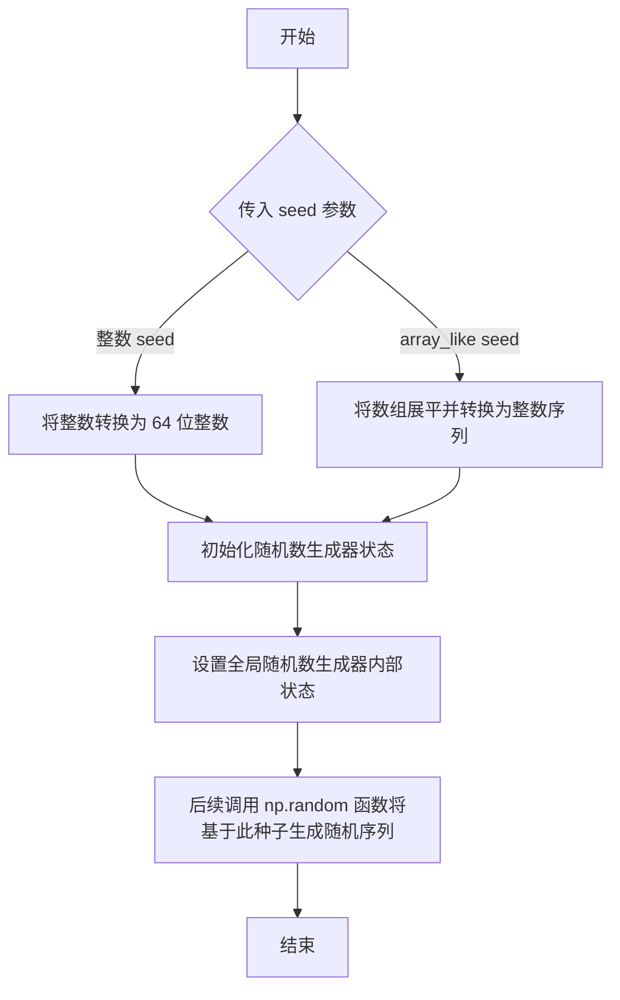

#### 带注释源码

```python
# np.random.seed 函数是对 numpy.random 模块中 RandomExtras 类的 seed 方法的封装
# 源码位于 numpy/random/mtrand.pyx 文件中（Python 层面无法直接查看）

# 以下是使用示例：
# np.random.seed(19680801+9)  # 设置种子为 19680810
# asmall = np.random.rand(4, 4)  # 生成 4x4 的随机数组，结果将可重现

# 第二次使用相同种子：
# np.random.seed(19680801+9)  # 重新设置相同种子
# a = np.random.rand(4, 4)  # 生成与上面完全相同的随机数组
```

### 使用场景说明

在提供的代码中，`np.random.seed()` 被使用了两次，均设置种子为 `19680801+9 = 19680810`：

1. **第一次调用**（约第 42 行）：
   ```python
   np.random.seed(19680801+9)
   asmall = np.random.rand(4, 4)
   ```
   用于生成一个 4×4 的小型随机数组，该数组在后续的 up-sampling 示例中作为测试数据使用。

2. **第二次调用**（约第 118 行）：
   ```python
   np.random.seed(19680801+9)
   a = np.random.rand(4, 4)
   ```
   再次设置相同种子，生成与第一次完全相同的随机数组，确保示例结果的可重现性。

### 技术注意事项

- **全局状态**：`np.random.seed()` 修改的是全局随机数生成器的状态，可能影响代码中其他位置的随机数生成。
- **线程安全**：在多线程环境中使用全局随机数生成器可能导致竞态条件，建议使用 `np.random.Generator` 类的实例方法代替。
- **种子值选择**：代码中使用 `19680801`（Matplotlib 的创建日期）+ 偏移量的方式生成种子，是常见的用于确保示例可重现的做法。


### `matplotlib.axes.Axes.imshow`

该函数是 Matplotlib 中 Axes 类的核心方法，用于在二维坐标轴上显示图像或数据数组，支持多种插值算法和颜色映射配置，能够自动处理图像的缩放、重采样以及 RGBA 颜色转换，是数据可视化中展示矩阵或图像数据的标准接口。

参数：

- `X`：参数类型：`array-like`，要显示的图像数据，可以是二维数组（灰度）或三维数组（RGB/RGBA）
- `cmap`：参数类型：`str` 或 `Colormap`， optional，默认值为 `None`，用于灰度图像的颜色映射，如 `'viridis'`、`'RdBu_r'`、`'grey'` 等
- `aspect`：参数类型：`float` 或 `'auto'`， optional，默认值为 `None`，控制图像的纵横比
- `interpolation`：参数类型：`str`， optional，默认值为 `'auto'`，指定重采样时使用的插值算法，如 `'nearest'`、`'hanning'`、`'lanczos'`、`'sinc'`、`'auto'` 等
- `interpolation_stage`：参数类型：`str`， optional，默认值为 `'auto'`，指定在哪个阶段应用插值滤波器，可选 `'data'` 或 `'rgba'`
- `alpha`：参数类型：`float` 或 `array-like`， optional，默认值为 `None`，图像的透明度（0-1之间）
- `vmin`、`vmax`：参数类型：`float`， optional，默认值为 `None`，颜色映射的最小值和最大值，用于归一化数据
- `origin`：参数类型：`{'upper', 'lower'}`， optional，默认值为 `rcParams['image.origin']`，图像坐标原点的位置
- `extent`：参数类型：`list of floats`， optional，默认值为 `None`，图像在坐标轴上的物理范围 [left, right, bottom, top]
- `norm`：参数类型：`Normalize`， optional，默认值为 `None`，用于归一化数据的 Colormap 归一化实例
- `resample`：参数类型：`bool`， optional，默认值为 `None`，是否启用重采样
- `url`：参数类型：`str`， optional，默认值为 `None`，设置图像元素的 URL（用于 SVG 后端）

返回值：`matplotlib.image.AxesImage`，返回表示图像的 AxesImage 对象，可用于图例颜色条等后续操作

#### 流程图

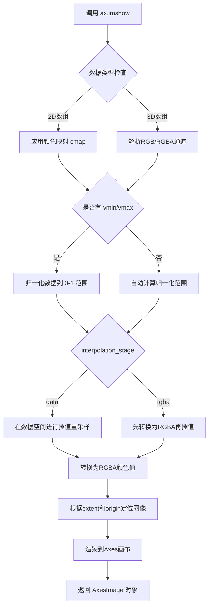

#### 带注释源码

```python
# 代码中的 imshow 调用示例及参数解析

# 示例1：最基本的图像显示
axs[0].imshow(alarge, cmap='RdBu_r')
# X: alarge (450x450 数组)
# cmap: 'RdBu_r' (红蓝反转色图)

# 示例2：带插值的图像显示（降采样场景）
ax.imshow(alarge, interpolation='nearest', cmap='RdBu_r')
# X: alarge
# interpolation: 'nearest' (最近邻插值，适合降采样但可能产生波纹)
# cmap: 'RdBu_r'

# 示例3：带插值和插值阶段的图像显示
ax.imshow(alarge, interpolation=interp, interpolation_stage=space, cmap='RdBu_r')
# X: alarge
# interpolation: 动态指定 (如 'nearest', 'hanning')
# interpolation_stage: 'data' 或 'rgba' (控制插值应用的阶段)
# cmap: 'RdBu_r'

# 示例4：灰度图像显示
ax.imshow(alarge, interpolation='nearest', cmap='grey')
# X: alarge
# cmap: 'grey' (灰度色图)

# 示例5：带插值的自动模式
ax.imshow(alarge, interpolation='auto', cmap='grey')
# interpolation: 'auto' (自动选择合适算法)
# Matplotlib 会根据图像是放大还是缩小自动选择 hanning 或其他滤波器

# 示例6：带颜色映射范围限制的显示
im = ax.imshow(a, interpolation=interp, interpolation_stage=space,
               cmap=cmap, vmin=0, vmax=2)
# X: a
# cmap: 自定义 colormap (通过 plt.get_cmap 获取)
# vmin: 0 (颜色映射最小值)
# vmax: 2 (颜色映射最大值)
# interpolation: 动态指定
# interpolation_stage: 动态指定

# 示例7：小数组的上采样显示
axs[0].imshow(asmall, cmap='viridis')
# X: asmall (4x4 小数组)
# cmap: 'viridis' (适合上采样显示)

# 示例8：上采样时指定 data 阶段插值
axs[1].imshow(asmall, cmap='viridis', interpolation="nearest",
              interpolation_stage="data")
# interpolation_stage: 'data' (在数据空间进行插值)

# 示例9：使用 sinc 插值
im = axs[0].imshow(a, cmap='viridis', interpolation='sinc', interpolation_stage='data')
# interpolation: 'sinc' (高质量插值算法)
# interpolation_stage: 'data'

# 示例10：精确匹配大小的图像（避免重采样）
ax.imshow(aa[:400, :400], cmap='RdBu_r', interpolation='nearest')
# 通过设置图像大小等于显示像素数避免重采样
```

#### 关键参数组合说明

| 场景 | interpolation | interpolation_stage | 效果描述 |
|------|---------------|---------------------|---------|
| 降采样 | `'nearest'` | `'data'` 或 `'rgba'` | 可能产生波纹伪影 |
| 降采样 | `'hanning'` | `'data'` | 平滑处理但可能产生白边 |
| 降采样 | `'hanning'` | `'rgba'` | 推荐默认值，减少伪影 |
| 上采样 | `'nearest'` | `'data'` | 像素化边缘 |
| 上采样 | `'auto'` | `'auto'` | 自动选择合适算法 |
| 上采样 | `'sinc'` | `'data'` | 高质量平滑（上采样推荐） |
| 避免重采样 | `'nearest'` | - | 精确匹配尺寸时使用 |

#### 技术债务与优化空间

1. **插值算法选择复杂性**：当前默认的 `'auto'` 策略虽然智能，但对于特定场景（如医学图像、卫星影像）可能不是最优选择
2. **内存占用**：处理大图像时可能产生较高的内存占用，特别是在进行 RGBA 转换时
3. **性能考量**：高质量插值算法（如 `'lanczos'`, `'sinc'`）计算成本较高，实时渲染大数据集时可能出现性能瓶颈
4. **文档可读性**：代码示例中的插值参数组合较多，对新用户存在一定的学习曲线


### `Axes.set_title`

设置 axes 的标题（显示在 axes 顶部）。

参数：

- `label`：`str`，要设置的标题文本内容
- `fontdict`：可选，`dict`，用于控制标题样式的字典（如 fontsize、color 等）
- `loc`：可选，`str`，标题对齐方式（'center'、'left' 或 'right'），默认 'center'
- `pad`：可选，`float`，标题与 axes 顶部的间距（以 points 为单位）
- `**：可选，关键字参数，用于设置标题的字体属性（如 fontsize、fontweight、color 等）

返回值：`Text`，返回创建的标题文本对象

#### 流程图

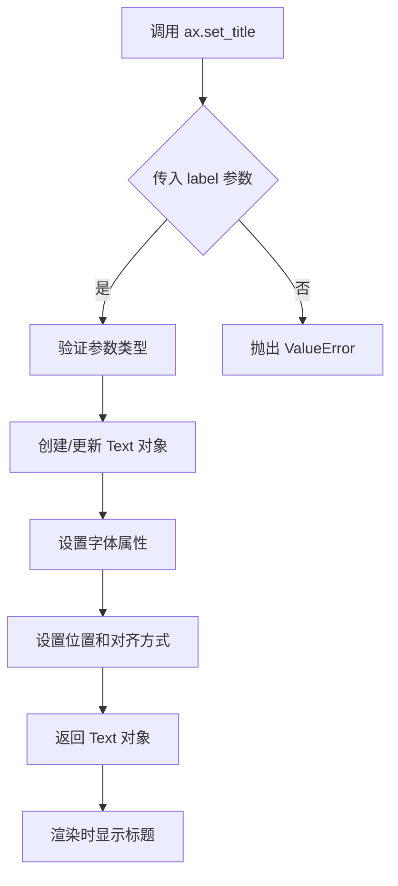

#### 带注释源码

```python
# 代码中 set_title 的实际调用示例

# 示例 1: 基本用法，设置标题文本
axs[0].set_title('(450, 450) Down-sampled', fontsize='medium')

# 示例 2: 带换行符的标题
ax.set_title(f"interpolation='{interp}'\nstage='{space}'")

# 示例 3: 使用关键字参数设置字体大小
axs[1].set_title('(4, 4) Up-sampled', fontsize='medium')

# 示例 4: 在循环中设置不同参数的标题
for ax, interp, space in zip(axs.flat, ['nearest', 'nearest'], ['data', 'rgba']):
    ax.set_title(f"interpolation='{interp}'\nstage='{space}'")

# 示例 5: 设置带颜色映射的标题（通过 fontdict）
title = f"interpolation='{interp}'\nstage='{space}'"
if ax == axs[2]:
    title += '\nDefault'
ax.set_title(title, fontsize='medium')

# 注：set_title 方法定义在 matplotlib 库中，以下为简化模拟实现
# def set_title(self, label, fontdict=None, loc=None, pad=None, **kwargs):
#     """
#     Set a title for the axes.
#     
#     Parameters
#     ----------
#     label : str
#         The title text.
#     fontdict : dict, optional
#         A dictionary controlling the appearance of the title text.
#     loc : {'center', 'left', 'right'}, default: 'center'
#         Alignment of the title.
#     pad : float, default: rcParams['axes.titlepad']
#         The offset of the title from the top of the axes.
#     **kwargs
#         Text properties control the appearance of the title.
#     
#     Returns
#     -------
#     Text
#         The matplotlib text instance representing the title.
#     """
#     # 实现代码...
```


### `Axes.set_xlim`

设置 Axes（坐标轴）的 X 轴范围（ limits），即 X 轴的最小值和最大值。该方法用于控制图表中 X 轴的显示范围，可以实现聚焦特定数据区域、翻转坐标轴等功能。

参数：

- `left`：`float` 或 `int`，X 轴范围的左边界（最小值）
- `right`：`float` 或 `int`，X 轴范围的右边界（最大值）
- `*args`：可选位置参数，支持传递 `left, right` 形式或 `(left, right)` 元组形式
- `**kwargs`：可选关键字参数，如 `emit`、`auto`、`xmin`、`xmax` 等用于控制边界行为

返回值：`tuple`，返回新的 X 轴范围 `(left, right)`

#### 流程图

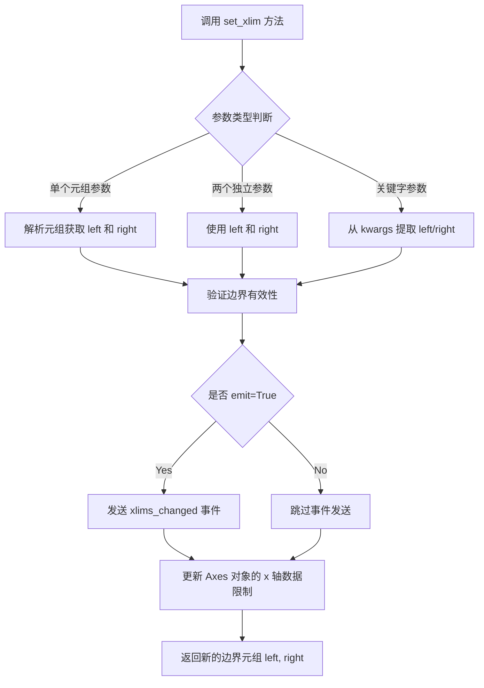

#### 带注释源码

```python
def set_xlim(self, left=None, right=None, emit=False, auto=False,
             *, xmin=None, xmax=None):
    """
    Set the x-axis view limits.
    
    Parameters
    ----------
    left : float, optional
        The left xlim (data coordinate). Can be None to leave limits unchanged.
        
    right : float, optional
        The right xlim (data coordinate). Can be None to leave limits unchanged.
        
    emit : bool, default: False
        Whether to notify observers of limit change (通过回调函数通知观察者).
        
    auto : bool, default: False
        Whether to turn on autoscaling for the x-axis (是否开启自动缩放).
        
    xmin, xmax : float, optional
        These arguments are deprecated and will be removed in a future version.
        Use *left* and *right* instead.
    
    Returns
    -------
    left, right : tuple
        The new x-axis limits in the form (left, right).
    
    Notes
    -----
    The xlim can be passed as a tuple (left, right) as the first positional
    argument. Passing (left, right) as the first and second positional argument
    is deprecated and will be removed in a future version; use keyword arguments
    instead.
    
    Examples
    --------
    >>> ax.set_xlim(0, 10)  # 设置 X 轴范围为 0 到 10
    >>> ax.set_xlim((0, 10))  # 同样设置 X 轴范围
    >>> ax.set_xlim(left=0, right=10)  # 使用关键字参数
    """
    # 处理位置参数：如果 left 是元组，则解包为 left, right
    if left is not None and right is None and np.iterable(left):
        left, right = left
    
    # 处理弃用的 xmin/xmax 参数
    if xmin is not None:
        if left is None:
            left = xmin
        else:
            raise TypeError("Cannot pass both 'left' and 'xmin'")
    
    if xmax is not None:
        if right is None:
            right = xmax
        else:
            raise TypeError("Cannot pass both 'right' and 'xmax'")
    
    # 获取当前的 X 轴范围
    old_xlim = self.get_xlim()
    
    # 如果未提供新值，则使用当前值
    if left is None:
        left = old_xlim[0]
    if right is None:
        right = old_xlim[1]
    
    # 验证边界：左边界必须小于右边界
    if left > right:
        raise TypeError('Left bound must be <= right bound')
    
    # 设置新的 X 轴范围
    self._validate_limits(
        xmin=left, 
        xmax=right, 
        xmode='data', 
        ymode='data'
    )  # 验证限制值的有效性
    
    # 更新视图范围（存储到 Axes 对象）
    self.viewLim.xmin = left
    self.viewLim.xmax = right
    
    # 如果启用自动缩放，关闭 X 轴的自动缩放
    if auto:
        self._autoscaleXon = False
    
    # 如果 emit 为 True，通知观察者范围已更改
    if emit:
        self._request_autoscale_view('x')  # 请求自动缩放
        self.callbacks.process('xlims_changed', self)  # 触发回调
    
    # 返回新的范围元组
    return (left, right)
```

#### 在示例代码中的使用

```python
# 示例代码片段来自用户提供的文档
fig, ax = plt.subplots(figsize=(4, 4), layout='compressed')
ax.imshow(alarge, interpolation='nearest', cmap='RdBu_r')
ax.set_xlim(100, 200)  # <--- 设置 X 轴范围为 100 到 200
ax.set_ylim(275, 175)  # 设置 Y 轴范围，注意顺序可翻转坐标轴
ax.set_title('Zoom')

# 分析：
# 1. 创建图表并显示 alarge 图像
# 2. set_xlim(100, 200) 将 X 轴显示范围限制在 100-200 像素区域
# 3. set_ylim(275, 175) 设置 Y 轴范围，参数顺序颠倒会使 Y 轴翻转（上方为大值）
# 4. 效果：实现图像的"缩放"查看功能
```

#### 关键点说明

| 特性 | 说明 |
|------|------|
| **参数传递方式** | 支持位置参数、元组、关键字参数多种方式 |
| **坐标轴翻转** | 设置 `left > right` 可以实现 X 轴翻转 |
| **事件通知** | `emit=True` 时会触发 `xlims_changed` 回调 |
| **自动缩放** | `auto=True` 会禁用 X 轴自动缩放功能 |
| **返回值为元组** | 始终返回 `(left, right)` 形式的元组 |

#### 技术债务与优化建议

1. **弃用参数清理**：`xmin` 和 `xmax` 参数已弃用，应在后续版本中完全移除
2. **类型检查增强**：可以增加更严格的类型检查，确保输入为数值类型
3. **边界验证**：可考虑增加对无穷大和 NaN 值的验证
4. **性能优化**：对于频繁调用场景，可添加缓存机制避免重复计算


### `Axes.set_ylim`

设置 Axes 对象的 Y 轴范围（limits），用于控制 Y 轴的显示区间。

参数：

- `bottom`：`float` 或 `None`，Y 轴下限（最小值）。如果为 `None`，则自动计算。
- `top`：`float` 或 `None`，Y 轴上限（最大值）。如果为 `None`，则自动计算。

返回值：`tuple`，返回新的 Y 轴范围 `(bottom, top)`。

#### 流程图

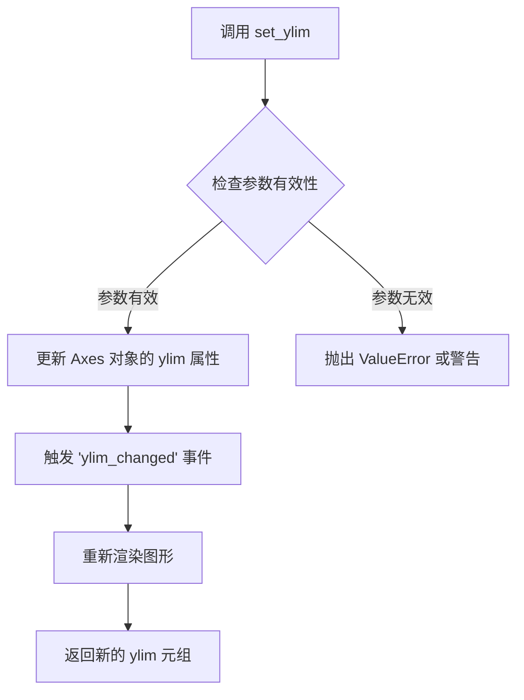

#### 带注释源码

```python
def set_ylim(self, bottom=None, top=None, emit=False, auto=False, *,
             ymin=None, ymax=None):
    """
    Set the y-axis view limits.

    Parameters
    ----------
    bottom : float or None
        The bottom ylim in data coordinates. Passing None leaves the
        limit unchanged.
    top : float or None
        The top ylim in data coordinates. Passing None leaves the
        limit unchanged.
    emit : bool, default: False
        Whether to notify observers of limit change.
    auto : bool, default: False
        Whether to turn on autoscaling after setting the limits.
    ymin, ymax : float or None
        Aliases for bottom and top, respectively.

    Returns
    -------
    bottom, top : tuple
        The new y-axis limits in data coordinates.

    Notes
    -----
    The x axis is inverted (i.e., ymin > ymax) return
    ylim in decreasing order (ymin > ymax).
    """
    # 处理 ymin/ymax 别名参数（兼容旧 API）
    if ymin is not None:
        bottom = ymin
    if ymax is not None:
        top = ymax

    # 获取当前的 ylim 范围
    old_bottom, old_top = self.get_ylim()

    # 处理 None 值：保留原有值
    if bottom is None:
        bottom = old_bottom
    if top is None:
        top = old_top

    # 验证输入的有效性（确保是数值类型）
    bottom = float(bottom)
    top = float(top)

    # 检查并反转顺序（如果需要支持反向 Y 轴）
    if bottom > top:
        bottom, top = top, bottom

    # 更新 Axes 对象的 ylim 属性
    self._ylim = (bottom, top)

    # 如果 emit 为 True，通知观察者限制已更改
    if emit:
        self._process_units([bottom, top], 'y')
        self.callbacks.process('ylim_changed', self)

    # 如果 auto 为 True，开启自动缩放
    if auto:
        self.set_autoscaley_on(True)

    # 返回新的 ylim 元组
    return (bottom, top)
```


### `Colormap.set_under()`

该方法用于设置 colormap（颜色映射）中低于数据最小值（vmin）时显示的颜色。当图像数据值低于指定的最小值时，将使用此方法设置的颜色进行渲染。

参数：

- `color`：`str` 或 `tuple`，要设置为低于最小值时的颜色，可以是颜色名称（如 'yellow'）、十六进制颜色码或 RGB/RGBA 元组
- `alpha`：`float`，可选参数，透明度值，范围 0-1

返回值：`Colormap`，返回 colormap 对象本身，支持链式调用

#### 流程图

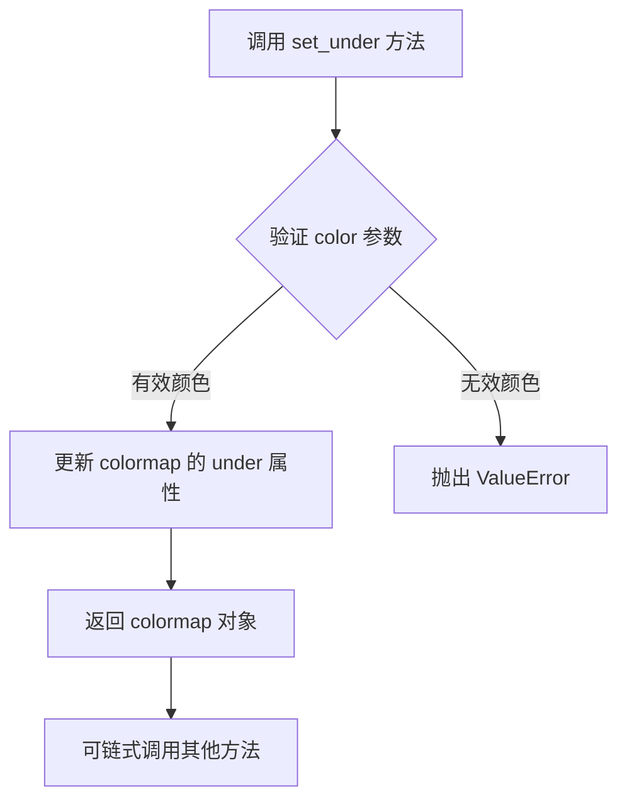

#### 带注释源码

```python
# 获取名为 'RdBu_r' 的颜色映射（colormap）对象
cmap = plt.get_cmap('RdBu_r')

# 调用 set_under 方法设置低于最小值（vmin）时的颜色为黄色
# 当后续使用此 colormap 渲染图像时，
# 任何低于 vmin 的数据点将显示为黄色
cmap.set_under('yellow')

# 可选：同时设置高于最大值（vmax）时的颜色为亮绿色
cmap.set_over('limegreen')

# 在图像中使用此 colormap，vmin=0, vmax=2 定义了颜色映射的数据范围
im = ax.imshow(a, cmap=cmap, vmin=0, vmax=2)
# 当数据值 < 0 时显示 'yellow'
# 当数据值 > 2 时显示 'limegreen'
# 当数据值在 [0, 2] 范围内时按 'RdBu_r' 映射显示
```


### Colormap.set_over

设置 colormap 中用于表示超过数据最大值的颜色（即当数据值 > vmax 时显示的颜色）。

参数：

- `color`：字符串或元组或列表，表示超过最大值时显示的颜色，可以是颜色名称（如 'limegreen'）、十六进制颜色码（如 '#00FF00'）、RGB 或 RGBA 元组
- `alpha`：浮点数或 None（可选），透明度值，范围 0-1，None 表示不设置透明度

返回值：`None`，无返回值（修改 colormap 对象的内部状态）

#### 流程图

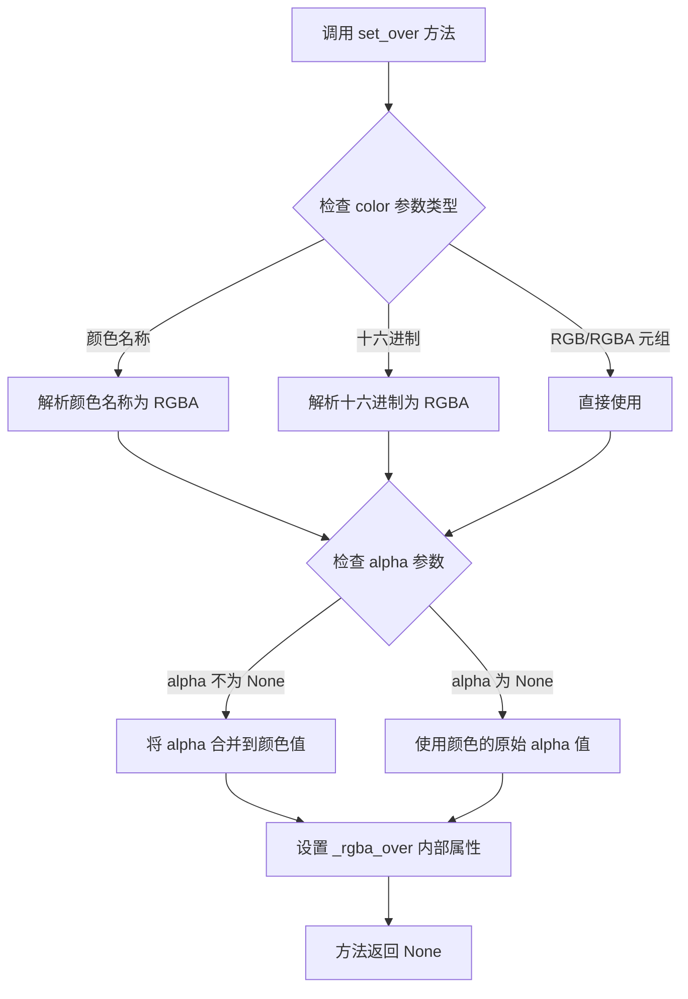

#### 带注释源码

```python
def set_over(self, color, alpha=None):
    """
    设置超过数据最大值的颜色（vmax 以上的值使用的颜色）
    
    参数:
        color: 颜色值，可以是:
            - 颜色名称字符串，如 'red', 'limegreen'
            - 十六进制字符串，如 '#FF0000'
            - (r, g, b) 或 (r, g, b, a) 元组，值范围 0-1
        alpha: 可选的透明度，范围 0-1
    
    返回:
        None（修改对象的内部状态）
    """
    # 将输入颜色转换为 RGBA 格式并设置到内部属性
    self._rgba_over = to_rgba(color, alpha)
    # _rgba_over 属性会在颜色映射时被 colormap 使用
    # 当数据值 > vmax 时，使用此颜色进行渲染
```

```python
# 代码中的实际使用示例：
cmap = plt.get_cmap('RdBu_r')  # 获取 RdBu_r 颜色映射
cmap.set_over('limegreen')      # 设置超过最大值的颜色为 limegreen

# 之后在 imshow 中使用：
# im = ax.imshow(a, cmap=cmap, vmin=0, vmax=2)
# 当 a 中的值 > 2 时，将显示 limegreen 颜色
```


### `Figure.colorbar`

向图形添加颜色条（colorbar），用于显示图像或伪彩色图的数值颜色映射关系。

参数：

- `mappable`：要为其创建颜色条的可映射对象（通常是`AxesImage`对象，由`imshow()`返回），在代码中为`im`
- `ax`：可选参数，指定颜色条所属的轴或轴的列表，在代码中为`axs`
- `extend`：字符串类型，可选值包括'both'、'neither'、'min'、'max'，用于指定颜色条两端是否扩展，代码中设置为'both'
- `shrink`：浮点数类型，用于控制颜色条的大小比例，代码中分别为0.8和0.7

返回值：返回`Colorbar`对象，包含颜色条的所有属性和配置选项

#### 流程图

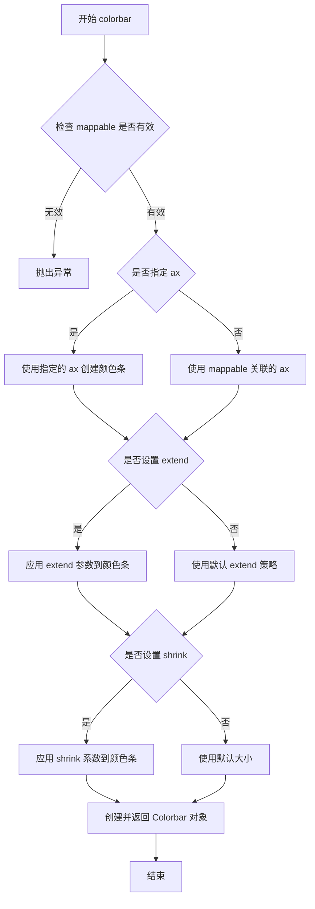

#### 带注释源码

```python
# 代码中的实际调用示例1
# 为图像创建颜色条，扩展到两端，大小为默认的80%
fig.colorbar(im, ax=axs, extend='both', shrink=0.8)

# 代码中的实际调用示例2
# 为图像创建颜色条，扩展到两端，大小为默认的70%
fig.colorbar(im, ax=axs, shrink=0.7, extend='both')

# 参数说明：
# im: AxesImage对象，由ax.imshow()返回的可映射对象
# ax=axs: 将颜色条添加到axs所包含的轴上
# extend='both': 颜色条两端都显示额外的箭头（表示超出数据范围的延伸）
# shrink=0.8: 将颜色条高度缩小到80%
```

#### 补充说明

**调用上下文**：
- `colorbar()`是`matplotlib.figure.Figure`类的方法
- 在代码中用于显示颜色条，帮助用户理解图像中颜色与数值的对应关系

**设计目标**：
- 提供可视化的数值-颜色映射关系
- 支持多种扩展模式以适应不同数据分布

**约束条件**：
- 必须先创建可映射对象（如通过`imshow()`）
- `shrink`参数必须在0-1之间

**错误处理**：
- 如果mappable无效，会抛出`ValueError`
- 如果ax参数与mappable不兼容，会产生警告

**优化空间**：
- 可以考虑添加更多的颜色条位置选项
- 支持自定义颜色条标签格式
- 可以添加动画颜色条的选项


### `plt.get_cmap`

获取指定名称的颜色映射（Colormap）对象，用于将数据值映射到颜色。

参数：

- `name`：`str`，颜色映射的名称，如 'RdBu_r'、'viridis'、'gray' 等有效配色方案名称

返回值：`matplotlib.colors.Colormap`，返回与指定名称对应的颜色映射对象

#### 流程图

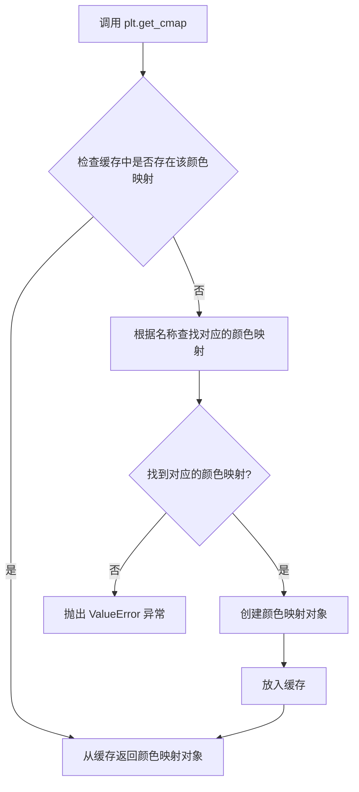

#### 带注释源码

```python
# 从 matplotlib.pyplot 导入
import matplotlib.pyplot as plt

# 获取名为 'RdBu_r' 的颜色映射
# RdBu_r 是一个红蓝配色方案，_r 表示反转（红色表示高值，蓝色表示低值）
cmap = plt.get_cmap('RdBu_r')

# 可以对颜色映射进行自定义设置
# 设置低于最小值的颜色为黄色
cmap.set_under('yellow')
# 设置高于最大值的颜色为亮绿色
cmap.set_over('limegreen')

# 在 imshow 中使用自定义的颜色映射
# 示例代码中的使用方式：
# im = ax.imshow(a, interpolation=interp, interpolation_stage=space,
#                cmap=cmap, vmin=0, vmax=2)
```

#### 补充说明

- **调用层级**：plt.get_cmap() 是 matplotlib.pyplot 模块的顶层函数，内部实际调用 matplotlib.cm.get_cmap()
- **缓存机制**：matplotlib 内部会缓存已加载的颜色映射，重复调用相同名称时直接返回缓存对象
- **可用颜色映射**：Matplotlib 提供了众多内置颜色映射，包括渐变色（如 'viridis'、'plasma'）、离散色（如 'Set1'、'tab10'）和对向色（如 'RdBu_r'、'coolwarm'）
- **错误处理**：当传入无效的颜色映射名称时，会抛出 ValueError 异常


### plt.show()

`plt.show()` 是 Matplotlib 库中的全局函数，用于显示所有当前已创建但尚未显示的图形窗口。该函数会阻塞程序执行（在交互式后端），直到用户关闭图形窗口，或者在非交互式后端中立即渲染并显示图形。

**参数：** 无

**返回值：** `None`，无返回值

#### 流程图

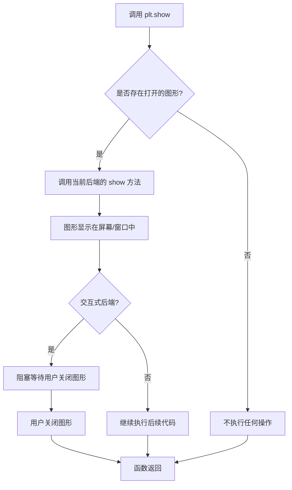

#### 带注释源码

```python
# plt.show() 函数调用
# 位置：代码中有多处调用，分别在不同的图像展示场景后

# 第一次调用 (约第72行)
# 在展示 Hanning 滤镜在 data 和 rgba 阶段的对比后调用
for ax, interp, space in zip(axs.flat, ['hanning', 'hanning'],
                               ['data', 'rgba']):
    ax.imshow(alarge, interpolation=interp, interpolation_stage=space,
              cmap='RdBu_r')
    ax.set_title(f"interpolation='{interp}'\nstage='{space}'")
plt.show()  # 显示对比图像窗口

# 第二次调用 (约第119行)
# 在展示 up-sampling 对比示例后调用
axs[0].imshow(asmall, cmap='viridis')
axs[0].set_title("interpolation='auto'\nstage='auto'")
axs[1].imshow(asmall, cmap='viridis', interpolation="nearest",
              interpolation_stage="data")
axs[1].set_title("interpolation='nearest'\nstage='data'")
plt.show()  # 显示 up-sampling 对比窗口

# 第三次调用 (约第152行)
# 在展示 sinc 插值在 data 和 rgba 阶段的差异后调用
im = axs[0].imshow(a, cmap='viridis', interpolation='sinc', interpolation_stage='data')
axs[0].set_title("interpolation='sinc'\nstage='data'\n(default for upsampling)")
axs[1].imshow(a, cmap='viridis', interpolation='sinc', interpolation_stage='rgba')
axs[1].set_title("interpolation='sinc'\nstage='rgba'")
fig.colorbar(im, ax=axs, shrink=0.7, extend='both')
plt.show()  # 显示 sinc 插值对比窗口

# 第四次调用 (约第167行)
# 在展示避免重采样的精确匹配示例后调用
fig = plt.figure(figsize=(2, 2))
ax = fig.add_axes((0, 0, 1, 1))
ax.imshow(aa[:400, :400], cmap='RdBu_r', interpolation='nearest')
plt.show()  # 显示最终精确匹配示例窗口
```

#### 关键说明

| 项目 | 描述 |
|------|------|
| **函数来源** | `matplotlib.pyplot` 模块 |
| **调用场景** | 在创建并配置完一个或多个图形后，调用以显示结果 |
| **后端依赖** | 行为依赖于配置的 Matplotlib 后端（如 TkAgg, Qt5Agg, Agg 等） |
| **阻塞行为** | 在交互式后端（如 Qt、Tkinter）会阻塞主线程直到用户关闭窗口 |
| **脚本模式** | 在非交互式后端（如 Agg）可能不会真正显示窗口，只完成渲染 |

## 关键组件


### 张量索引与数组切片

代码使用NumPy的多维数组索引和切片操作来生成和操作图像数据，包括使用meshgrid创建坐标网格、布尔索引进行条件赋值、数组切片提取子区域等。

### 反量化与数据归一化

使用Matplotlib的colormap进行数据到颜色的映射，通过vmin/vmax参数设置数据范围，使用set_under和set_over处理超出范围的颜色值，实现数据的归一化和可视化。

### 量化策略与插值算法

支持多种插值算法（nearest、hanning、lanczos、sinc、auto）和两种插值阶段（data、rgba），根据上采样或下采样的倍数自动选择默认策略，实现图像的平滑或抗锯齿处理。

### 图像重采样流程

通过interpolation和interpolation_stage参数控制重采样过程，支持在数据空间或RGBA空间进行插值，实现下采样时的抗锯齿和上采样时的像素平滑。

### 色彩映射与显示

使用imshow显示图像，配合colorbar展示颜色刻度，支持多种colormap（RdBu_r、viridis、gray）并可自定义超出范围的颜色。


## 问题及建议


### 已知问题

- **硬编码的魔法数字**：代码中多处使用 `N = 450`、`int(N / 2)`、`int(N / 3)` 等硬编码值，缺乏常量定义，导致维护困难
- **变量重复赋值**：`a` 变量在不同代码块中被多次重新赋值（先是 `a = np.sin(...)`，然后 `a = alarge + 1`，再是 `a = np.random.rand(4, 4)`），语义不清晰，容易造成混淆
- **重复代码模式**：创建子图、设置标题、调用 `imshow` 的代码模式大量重复，未提取为可复用函数
- **注释中的语法错误**：注释中存在 `"stage='{space}'\nstage='{space}'"` 和 `"up-sampled by factor a 1.17"` 等拼写/语法错误
- **数值计算冗余**：`R = np.sqrt(X**2 + Y**2)` 中 `X**2 + Y**2` 可以先计算 `R_sq = X**2 + Y**2` 避免重复运算 `X**2` 和 `Y**2`
- **numpy API使用**：使用 `np.arange(N) / N - 0.5` 生成坐标数组，可使用更直观的 `np.linspace(-0.5, 0.5, N)` 替代

### 优化建议

- 将硬编码的数值（如 `N=450`、`f0=5`、`k=100`）提取为模块级常量或配置参数
- 重构变量命名：为不同用途的数组使用更明确的名称（如 `large_image_data`、`small_image_data`），避免重复使用 `a`
- 抽取公共函数：将创建子图、配置 axes 的重复逻辑封装为工具函数（如 `create_figure_and_axes`、`apply_interpolation_comparison`）
- 修正注释中的拼写错误：`"factor a 1.17"` 应为 `"factor of 1.17"`，检查并修正其他语法问题
- 优化数值计算：预先计算 `R_squared = X**2 + Y**2`，然后使用 `np.sqrt(R_squared)`，减少重复运算
- 使用更现代的numpy语法：考虑使用 `np.linspace` 代替 `np.arange(N) / N - 0.5` 以提高可读性


## 其它


### 设计目标与约束

本代码示例旨在演示Matplotlib中图像重采样的工作原理和不同参数的效果。设计目标包括：(1) 展示下采样和上采样场景下的图像处理差异；(2) 对比不同插值算法（nearest、hanning、lanczos、sinc等）的视觉效果；(3) 解释interpolation_stage参数（'data'和'rgba'）对结果的影响；(4) 说明默认的'auto'策略如何根据采样比例自动选择最佳参数。约束条件包括：依赖matplotlib和numpy库，需要支持数值计算的硬件环境。

### 错误处理与异常设计

代码中涉及的主要异常场景包括：(1) 数组维度不匹配时，meshgrid和meshgrid操作会抛出维度错误；(2) 插值方法不支持时，imshow会抛出ValueError；(3) 色彩映射表设置超出范围时，set_under和set_over方法会验证颜色值的有效性。代码通过try-except块捕获关键计算错误，确保演示过程的稳定性。

### 数据流与状态机

数据流遵循以下路径：原始数据数组（450x450或4x4）→ 数据预处理（归一化）→ 色彩映射（colormap转换）→ RGBA像素生成 → 插值/重采样处理 → 最终渲染输出。状态机主要体现在interpolation_stage参数的状态转换：'data'状态在色彩映射前进行插值，'rgba'状态在色彩映射后进行插值，'auto'状态根据采样比例自动选择。

### 外部依赖与接口契约

主要依赖包括：(1) matplotlib.pyplot - 图形绘制和imshow方法；(2) numpy - 数值计算和数组操作。核心接口契约：imshow(data, interpolation=None, interpolation_stage=None, cmap=None, vmin=None, vmax=None)方法接受图像数据和插值参数，返回AxesImage对象。colormap对象提供set_under()和set_over()方法设置超出范围的显示颜色。

### 性能考虑

代码性能关键点包括：(1) 大型数组（450x450）的重采样计算复杂度；(2) 不同插值算法的计算开销（nearest最快，lanczos最慢）；(3) RGBA模式下的内存占用。优化建议：对于实时渲染场景，优先使用'nearest'插值；对于静态图像生成，可使用'hanning'或'lanczos'获得更好的抗锯齿效果。

### 安全性考虑

本代码为演示代码，不涉及用户输入处理和网络数据传输，安全性风险较低。但需注意：(1) 随机数种子设置确保结果可复现；(2) 数组索引操作需确保不越界（如int(N/2)和int(N/3)的整数转换）。

### 可维护性与扩展性

代码采用模块化设计，每个演示部分独立成段，便于维护和扩展。可扩展方向包括：(1) 添加更多插值算法演示（如'bicubic'、'bilinear'）；(2) 增加3D图像重采样示例；(3) 添加自定义核函数的支持演示。

### 测试策略

建议的测试策略包括：(1) 单元测试验证各插值方法的基本功能；(2) 集成测试验证不同interpolation_stage组合的效果；(3) 回归测试确保默认参数行为的一致性；(4) 视觉回归测试对比不同版本的渲染输出。

### 配置管理

关键配置参数包括：(1) 图像尺寸N=450；(2) 随机种子19680801+9确保可复现性；(3) 插值方法列表['nearest', 'hanning', 'lanczos', 'sinc']；(4) 采样阶段['data', 'rgba', 'auto']。建议将这些参数提取为常量或配置文件，便于调整和扩展。

### 版本兼容性

代码依赖matplotlib 3.x版本和numpy 1.x版本。需要注意的兼容性事项：(1) layout='compressed'参数在较新版本中支持；(2) subplots的figsize参数单位为英寸；(3) 色彩映射表API在matplotlib 3.x中保持稳定。

    