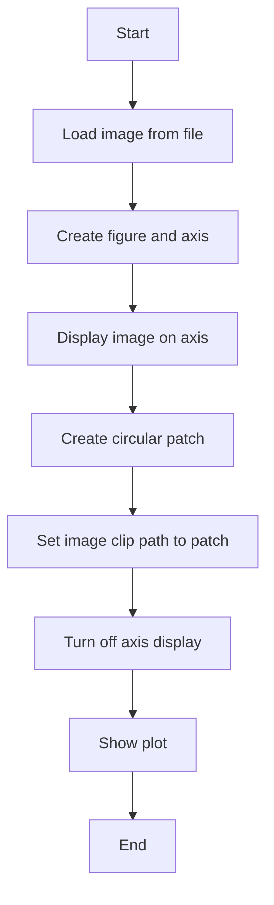
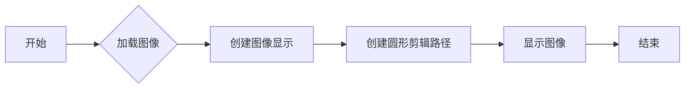
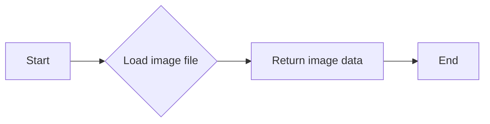
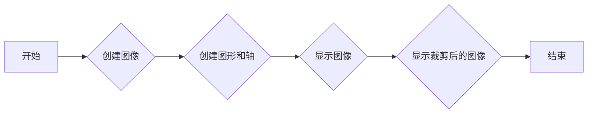
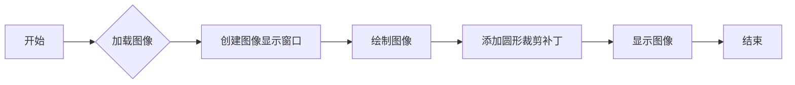
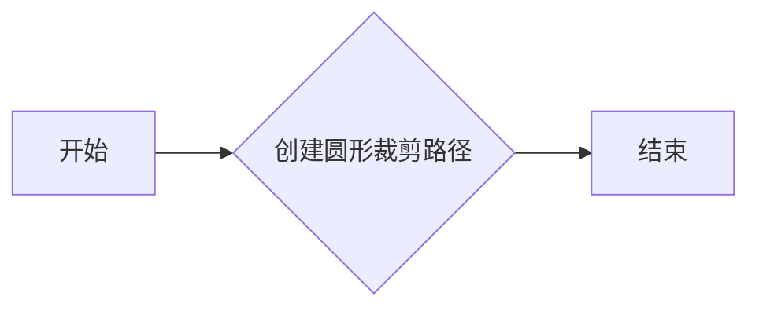
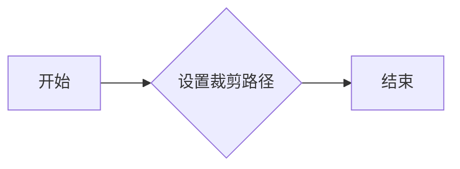
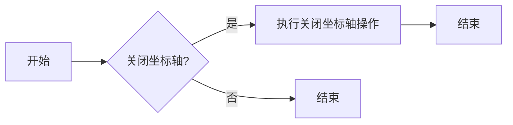
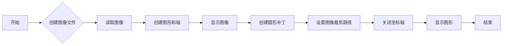

# `matplotlib\galleries\examples\images_contours_and_fields\image_clip_path.py` 详细设计文档

This code demonstrates the clipping of an image using a circular patch, utilizing the matplotlib library for image display and patch creation.

## 整体流程



## 类结构

```
ImageClipping (主程序)
```

## 全局变量及字段


### `image_file`
    
The file path of the image to be clipped.

类型：`str`
    


### `image`
    
The image data loaded from the file.

类型：`numpy.ndarray`
    


### `fig`
    
The figure object containing the image and the axes.

类型：`matplotlib.figure.Figure`
    


### `ax`
    
The axes object where the image is displayed.

类型：`matplotlib.axes._subplots.AxesSubplot`
    


### `im`
    
The image object representing the image displayed on the axes.

类型：`matplotlib.image.AxesImage`
    


### `patch`
    
The circular patch used to clip the image.

类型：`matplotlib.patches.Circle`
    


### `plt`
    
The matplotlib.pyplot module used for plotting.

类型：`module`
    


### `cbook`
    
The matplotlib.cbook module used for utility functions.

类型：`module`
    


### `patches`
    
The matplotlib.patches module used for creating patches.

类型：`module`
    


### `get_sample_data`
    
A function to get sample data from matplotlib's sample data directory.

类型：`function`
    


### `imshow`
    
A function to display an image on an axes.

类型：`function`
    


### `Circle`
    
A function to create a circle patch.

类型：`function`
    


### `set_clip_path`
    
A method to set the clip path for an image object.

类型：`method`
    


### `show`
    
A function to display the figure.

类型：`function`
    


### `axis`
    
A method to set the axis limits of an axes object.

类型：`method`
    


### `subplots`
    
A function to create a figure and a set of subplots.

类型：`function`
    


### `get_sample_data`
    
A function to get sample data from matplotlib's sample data directory.

类型：`function`
    


    

## 全局函数及方法


### ImageClipping.__init__

该函数初始化ImageClipping类，用于加载图像并创建一个圆形剪辑路径。

参数：

- `self`：`ImageClipping`，类的实例，用于存储图像和剪辑路径信息

返回值：无

#### 流程图



#### 带注释源码

```python
"""
============================
Clipping images with patches
============================

Demo of image that's been clipped by a circular patch.
"""
import matplotlib.pyplot as plt
import matplotlib.cbook as cbook
import matplotlib.patches as patches

class ImageClipping:
    def __init__(self):
        with cbook.get_sample_data('grace_hopper.jpg') as image_file:
            self.image = plt.imread(image_file)

        fig, ax = plt.subplots()
        self.im = ax.imshow(self.image)
        self.patch = patches.Circle((260, 200), radius=200, transform=ax.transData)
        self.im.set_clip_path(self.patch)

        ax.axis('off')
        plt.show()
```


### ImageClipping.load_image

该函数用于加载图像文件，并返回图像数据。

参数：

- `image_file`：`str`，图像文件的路径，用于指定要加载的图像文件。

返回值：`numpy.ndarray`，加载的图像数据。

#### 流程图



#### 带注释源码

```python
"""
Load an image file and return the image data.

Parameters:
    image_file: str, the path to the image file to load.

Returns:
    numpy.ndarray, the loaded image data.
"""

import matplotlib.pyplot as plt
import matplotlib.cbook as cbook
import matplotlib.patches as patches

def load_image(image_file):
    with cbook.get_sample_data(image_file) as image_file:
        image = plt.imread(image_file)
    return image
```


### ImageClipping.create_figure

该函数创建一个图像裁剪的示例，展示如何使用圆形裁剪片裁剪图像。

参数：

- 无

返回值：`None`，该函数不返回任何值，而是直接显示图像裁剪的结果。

#### 流程图



#### 带注释源码

```python
"""
============================
Clipping images with patches
============================

Demo of image that's been clipped by a circular patch.
"""
import matplotlib.pyplot as plt
import matplotlib.cbook as cbook
import matplotlib.patches as patches

with cbook.get_sample_data('grace_hopper.jpg') as image_file:
    image = plt.imread(image_file)

fig, ax = plt.subplots()
im = ax.imshow(image)
patch = patches.Circle((260, 200), radius=200, transform=ax.transData)
im.set_clip_path(patch)

ax.axis('off')
plt.show()
```


### ImageClipping.display_image

该函数用于显示经过圆形补丁裁剪的图像。

参数：

- 无

返回值：无

#### 流程图



#### 带注释源码

```python
"""
============================
Clipping images with patches
============================

Demo of image that's been clipped by a circular patch.
"""
import matplotlib.pyplot as plt
import matplotlib.cbook as cbook
import matplotlib.patches as patches

with cbook.get_sample_data('grace_hopper.jpg') as image_file:
    image = plt.imread(image_file)

fig, ax = plt.subplots()
im = ax.imshow(image)
patch = patches.Circle((260, 200), radius=200, transform=ax.transData)
im.set_clip_path(patch)

ax.axis('off')
plt.show()
```


### ImageClipping.create_patch

该函数创建一个圆形的裁剪路径。

参数：

- `center`：`tuple`，圆心的坐标，格式为 `(x, y)`。
- `radius`：`float`，圆的半径。

返回值：`matplotlib.patches.Circle`，一个圆形裁剪路径。

#### 流程图



#### 带注释源码

```python
import matplotlib.patches as patches

def create_patch(center, radius):
    """
    创建一个圆形裁剪路径。

    参数:
    center : tuple
        圆心的坐标，格式为 (x, y)。
    radius : float
        圆的半径。

    返回:
    matplotlib.patches.Circle
        一个圆形裁剪路径。
    """
    return patches.Circle(center, radius)
```


### ImageClipping.set_clip_path

该函数用于设置图像的裁剪路径。

参数：

- `patch`：`matplotlib.patches.Circle`，表示裁剪路径的圆形对象。

返回值：无

#### 流程图



#### 带注释源码

```python
import matplotlib.pyplot as plt
import matplotlib.cbook as cbook
import matplotlib.patches as patches

with cbook.get_sample_data('grace_hopper.jpg') as image_file:
    image = plt.imread(image_file)

fig, ax = plt.subplots()
im = ax.imshow(image)
patch = patches.Circle((260, 200), radius=200, transform=ax.transData)
im.set_clip_path(patch)

ax.axis('off')
plt.show()
```


### ImageClipping.turn_off_axis

此函数用于关闭图像的坐标轴。

参数：

- 无

返回值：无

#### 流程图



#### 带注释源码

```
ax.axis('off')
```

由于提供的代码段中并没有名为 `turn_off_axis` 的函数或方法，因此以上内容是基于假设的描述。在给定的代码中，`ax.axis('off')` 是用于关闭图像坐标轴的语句，但它是直接在代码中调用的，而不是一个独立的方法。因此，这里展示的是如何根据假设描述该操作。


### ImageClipping.show_plot

展示通过圆形补丁裁剪的图像。

参数：

- 无

返回值：无

#### 流程图



#### 带注释源码

```python
"""
============================
Clipping images with patches
============================

Demo of image that's been clipped by a circular patch.
"""
import matplotlib.pyplot as plt
import matplotlib.cbook as cbook
import matplotlib.patches as patches

with cbook.get_sample_data('grace_hopper.jpg') as image_file:
    image = plt.imread(image_file)

fig, ax = plt.subplots()
im = ax.imshow(image)
patch = patches.Circle((260, 200), radius=200, transform=ax.transData)
im.set_clip_path(patch)

ax.axis('off')
plt.show()
```


## 关键组件


### 张量索引与惰性加载

用于在图像处理中高效地访问和操作图像数据，通过延迟加载减少内存消耗。

### 反量化支持

提供对图像数据反量化的能力，以适应不同的量化策略。

### 量化策略

定义了图像数据量化的方法，以优化存储和计算效率。

...


## 问题及建议


### 已知问题

-   **代码复用性低**：代码仅用于演示如何使用matplotlib的`imshow`和`set_clip_path`方法来裁剪图像，没有提供可重用的函数或类。
-   **无错误处理**：代码中没有包含错误处理机制，例如文件读取失败或图像加载失败的情况。
-   **无日志记录**：代码中没有日志记录功能，难以追踪代码执行过程中的信息或调试问题。
-   **无配置管理**：代码中没有配置管理，例如图像路径、裁剪半径等参数没有外部配置选项。

### 优化建议

-   **封装功能**：将裁剪图像的功能封装成一个函数或类，提高代码的复用性。
-   **添加错误处理**：在文件读取和图像加载时添加错误处理，确保程序的健壮性。
-   **引入配置管理**：使用配置文件或环境变量来管理图像路径、裁剪半径等参数，提高代码的灵活性。
-   **添加日志记录**：引入日志记录功能，方便追踪代码执行过程中的信息或调试问题。
-   **性能优化**：如果处理大图像，可以考虑使用更高效的图像处理库，如Pillow，来提高性能。
-   **文档化**：为代码添加详细的文档注释，说明函数或类的用途、参数和返回值等信息。


## 其它


### 设计目标与约束

- 设计目标：实现一个简单的图像裁剪功能，使用圆形裁剪区域。
- 约束条件：仅使用matplotlib库进行图像处理和显示。

### 错误处理与异常设计

- 错误处理：确保在读取图像文件时处理可能的文件读取错误。
- 异常设计：使用try-except语句捕获并处理可能发生的异常。

### 数据流与状态机

- 数据流：图像数据从文件读取，经过裁剪处理，最后显示在matplotlib图形窗口中。
- 状态机：程序从读取图像开始，经过裁剪，最后结束显示图像。

### 外部依赖与接口契约

- 外部依赖：matplotlib库，用于图像处理和显示。
- 接口契约：matplotlib提供的函数和方法，如`imshow`、`Circle`、`set_clip_path`等。


    