# `matplotlib\galleries\examples\images_contours_and_fields\image_demo.py` 详细设计文档

该文件是一个Matplotlib示例脚本，展示了使用imshow函数绘制图像的多种方式，包括函数生成的等高线图、读取外部图片文件、不同的图像插值算法、origin参数控制以及clip path裁剪功能。

## 整体流程

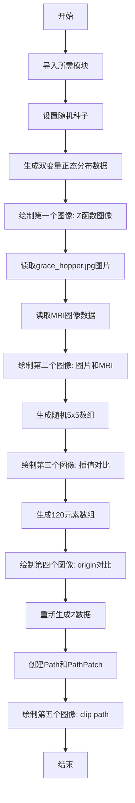

## 类结构

```
无自定义类结构
该脚本为Matplotlib示例脚本,主要使用以下库:
├── matplotlib.pyplot (绘图API)
├── numpy (数值计算)
├── matplotlib.cbook (工具函数)
├── matplotlib.patches (图形补丁)
└── matplotlib.path (路径对象)
```

## 全局变量及字段


### `delta`
    
网格步长，用于生成坐标数组的间隔

类型：`float`
    


### `x`
    
一维坐标数组，范围从-3.0到3.0

类型：`numpy.ndarray`
    


### `y`
    
一维坐标数组，范围从-3.0到3.0

类型：`numpy.ndarray`
    


### `X`
    
网格化的二维X坐标数组

类型：`numpy.ndarray`
    


### `Y`
    
网格化的二维Y坐标数组

类型：`numpy.ndarray`
    


### `Z1`
    
第一个双变量高斯函数的计算结果数组

类型：`numpy.ndarray`
    


### `Z2`
    
第二个双变量高斯函数的计算结果数组

类型：`numpy.ndarray`
    


### `Z`
    
两个高斯函数差值乘以2的结果数组

类型：`numpy.ndarray`
    


### `fig`
    
Matplotlib图形对象，用于承载整个图表

类型：`matplotlib.figure.Figure`
    


### `ax`
    
坐标轴对象，用于添加图像、设置标题和绘图

类型：`matplotlib.axes.Axes`
    


### `im`
    
AxesImage图像对象，表示在坐标轴上显示的图像

类型：`matplotlib.image.AxesImage`
    


### `image_file`
    
grace_hopper.jpg样本图片的文件对象

类型：`typing.BinaryIO`
    


### `image`
    
grace_hopper图片的像素数据数组

类型：`numpy.ndarray`
    


### `w`
    
MRI图像的宽度像素值256

类型：`int`
    


### `h`
    
MRI图像的高度像素值256

类型：`int`
    


### `datafile`
    
s1045.ima.gz样本数据文件对象

类型：`typing.BinaryIO`
    


### `s`
    
MRI原始二进制数据

类型：`bytes`
    


### `A`
    
MRI图像的二维浮点数数组

类型：`numpy.ndarray`
    


### `extent`
    
图像显示的坐标范围元组(0, 25, 0, 25)

类型：`tuple`
    


### `markers`
    
MRI图像上标记点的坐标列表

类型：`list`
    


### `path`
    
用于裁剪图像的路径对象

类型：`matplotlib.path.Path`
    


### `patch`
    
应用裁剪的路径补丁对象

类型：`matplotlib.patches.PathPatch`
    


### `interp`
    
图像插值方法字符串，如'bilinear'

类型：`str`
    


    

## 全局函数及方法


### `np.random.seed`

设置随机数生成器的种子值，用于确保后续随机操作的可重复性。通过指定相同的种子，可以得到相同的随机数序列，便于实验结果的可复现。

参数：

-  `seed`：`int`，随机数种子值，可以是任意整数，用于初始化随机数生成器的内部状态

返回值：`None`，无返回值

#### 流程图

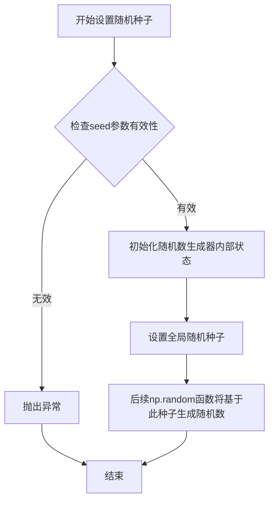

#### 带注释源码

```python
# 设置随机数种子以确保可重复性
# seed: 整数类型的种子值，用于初始化随机数生成器
# 调用此函数后，np.random模块中的随机函数将生成可预测的随机数序列
np.random.seed(19680801)  # 19680801是Matplotlib官方示例中常用的种子值
```

**使用场景说明：**

在Matplotlib示例代码中，`np.random.seed(19680801)`的作用是：

1. **确保可重复性**：使得每次运行代码时，生成的随机数据（如示例中的`A = np.random.rand(5, 5)`）保持一致
2. **便于调试**：当需要重现某个特定的随机结果时，可以使用相同的种子值
3. **文档和示例**：在教学和示例代码中常用，确保读者运行结果与文档一致

**注意事项：**

- 种子值可以是任意整数
- 相同的种子值会产生相同的随机数序列
- 此函数影响全局随机状态
- 在多线程环境下需谨慎使用


### `np.arange`

`np.arange` 是 NumPy 库中的一个函数，用于创建具有均匀间隔值的数组。它类似于 Python 的内置 `range` 函数，但返回一个 NumPy 数组而不是列表。

参数：

- `start`：`int` 或 `float`，起始值（可选），默认为 0
- `stop`：`int` 或 `float`，终止值（不包含）
- `step`：`int` 或 `float`，步长（可选），默认为 1
- `dtype`：`dtype`，输出数组的数据类型（可选）

返回值：`ndarray`，返回一个 NumPy 数组

#### 流程图

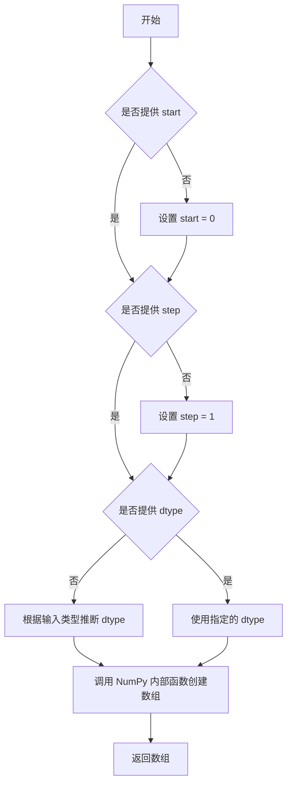

#### 带注释源码

```python
def arange(start=0, stop=None, step=1, dtype=None):
    """
    返回均匀间隔的值。
    
    参数:
        start: 起始值，默认为 0
        stop: 终止值（不包含）
        step: 步长，默认为 1
        dtype: 输出数组的数据类型
        
    返回:
        ndarray: 均匀间隔值的数组
    """
    # 处理单个参数的情况（此时为 stop）
    if stop is None:
        stop = start
        start = 0
    
    # 创建数组
    # 内部实现使用 NumPy 的核心函数来生成数组
    return _arange_ufunc(start, stop, step, dtype)
```


### `numpy.meshgrid`

#### 描述
`numpy.meshgrid` 是 NumPy 库中的一个核心函数，用于从一维坐标向量生成二维网格坐标矩阵。在给定的代码中，它被用于将离散的 `x` 和 `y` 坐标向量转换为 `X` 和 `Y` 矩阵，以便后续能够对二维标量场（`Z1`, `Z2`）进行向量化计算和可视化（例如 `ax.imshow` 或等高线图）。

#### 1. 文件的整体运行流程
在提供的代码示例中，`np.meshgrid` 位于数据准备阶段：
1.  **定义域生成**：使用 `np.arange` 创建一维的 `x` 和 `y` 坐标序列。
2.  **网格生成**：调用 `np.meshgrid(x, y)` 将一维向量扩展为二维矩阵 `X` 和 `Y`。`X` 的每一行重复 `x`，`Y` 的每一列重复 `y`。
3.  **函数计算**：利用生成的网格矩阵，计算高斯分布 `Z1` 和 `Z2`（如 `Z1 = np.exp(-X**2 - Y**2)`），实现无需显式循环的向量化运算。

#### 2. 类的详细信息 (作为全局函数模块)

##### 全局函数：`numpy.meshgrid`

- **模块**：`numpy`
- **功能**：生成网格坐标数组。

**参数：**

- `x`：`array_like`，一维数组，表示 x 轴坐标。
- `y`：`array_like`，一维数组，表示 y 轴坐标。
- `indexing`：`{'xy', 'ij'}`, 可选，默认 `'xy'`。
    - `'xy'` (默认)：笛卡尔坐标索引。对于长度为 M 的 x 和长度为 N 的 y，输出 X 形状为 `(N, M)`。这是为二维可视化（如 Matplotlib）设计的。
    - `'ij'`：矩阵索引。输出 X 形状为 `(M, N)`。
- `sparse`：`bool`，可选，默认 `False`。若为 `True`，返回稀疏矩阵以节省内存。
- `copy`：`bool`，可选，默认 `True`。若为 `False`，返回视图（view）以节省内存（但可能影响后续的内存布局）。

**返回值：**
- `X`：`ndarray`，二维数组，形状取决于 `indexing`。
- `Y`：`ndarray`，二维数组，形状取决于 `indexing`。

#### 3. 流程图

```mermaid
graph TD
    A[输入: x 向量 (1D)] --> F{索引方式: 'xy'}
    B[输入: y 向量 (1D)] --> F
    
    F -- 'xy' (笛卡尔) --> G[生成 X: 形状 (Ny, Nx)<br>行为 y 坐标, 列为 x 坐标]
    F -- 'xy' --> H[生成 Y: 形状 (Ny, Nx)<br>行为 y 坐标, 列为 x 坐标]
    
    F -- 'ij' (矩阵) --> I[生成 X: 形状 (Nx, Ny)<br>行为 x 坐标, 列为 y 坐标]
    F -- 'ij' --> J[生成 Y: 形状 (Nx, Ny)<br>行为 y 坐标, 列为 x 坐标]

    G --> K[输出: 网格坐标矩阵 Tuple[X, Y]]
    H --> K
    I --> K
    J --> K
```

#### 4. 带注释源码 (参考实现逻辑)

虽然 `np.meshgrid` 通常由 C 实现以提高性能，但以下是符合其逻辑的 Python 等效实现（用于理解其核心机制）：

```python
import numpy as np

def meshgrid(x, y, indexing='xy'):
    """
    从坐标向量创建网格。
    
    参数:
        x (array_like): x 坐标的一维数组。
        y (array_like): y 坐标的一维数组。
        indexing (str): 'xy' 或 'ij'。
        
    返回:
        X, Y: 网格坐标矩阵。
    """
    x = np.asarray(x)
    y = np.asarray(y)
    
    # 获取坐标数量
    nx = x.size
    ny = y.size
    
    if indexing == 'xy':
        # 笛卡尔索引 (适用于二维绘图)
        # X 形状: (ny, nx) - 每一行是 x，列是 x 的重复
        # Y 形状: (ny, nx) - 每一列是 y，y 的重复
        # np.newaxis 用于增加维度以便广播
        X = np.repeat(x[np.newaxis, :], ny, axis=0)
        Y = np.repeat(y[:, np.newaxis], nx, axis=1)
    elif indexing == 'ij':
        # 矩阵索引
        # X 形状: (ny, nx) - 这里的定义通常反过来，注意 NumPy 文档细节
        # 在 'ij' 模式下，通常理解为 x 对应行，y 对应列
        # 为了保持通用性，NumPy 内部处理逻辑略有不同，但结果类似转置
        X = np.repeat(x[:, np.newaxis], ny, axis=1)
        Y = np.repeat(y[np.newaxis, :], nx, axis=0)
    else:
        raise ValueError("索引方式必须是 'xy' 或 'ij'")
        
    return X, Y

# 在代码中的实际调用：
# x = np.arange(-3.0, 3.0, delta)
# y = np.arange(-3.0, 3.0, delta)
# X, Y = meshgrid(x, y)
```

#### 5. 关键组件信息

- **输入向量 (Input Vectors)**: 代码中的 `x` 和 `y`，由 `np.arange` 生成，定义了网格的离散区间和步长 (`delta = 0.025`)。
- **广播 (Broadcasting)**: `meshgrid` 利用 NumPy 的广播机制，将一维向量扩展为二维矩阵，这是实现高效矩阵运算（如计算 `Z1 - Z2`）的基础。

#### 6. 潜在的技术债务或优化空间

- **内存占用**：对于高分辨率网格（例如 `delta` 很小），生成的 `X` 和 `Y` 矩阵可能会占用大量内存（O(N^2)）。代码中虽然未使用 `sparse=True`，但在处理极大图像时，开启稀疏模式可以显著降低内存压力。
- **数据类型**：默认返回 `float64`。如果输入是整数且不需要高精度，可以指定 `dtype` 以节省内存。

#### 7. 其它项目

- **设计目标与约束**：该函数的主要设计目标是为了简化需要对二维网格进行函数值计算的代码（如物理模拟、绘图），避免使用嵌套的 Python `for` 循环。
- **错误处理**：如果 `x` 和 `y` 不是一维数组，函数会尝试展平或报错（取决于版本）。形状不匹配通常不会报错，但可能导致后续计算结果形状异常。
- **与 Matplotlib 的集成**：代码中 `ax.imshow(Z, ...)` 直接接收了由 `meshgrid` 计算出的 `Z` 矩阵。这展示了数据流：`坐标向量 -> meshgrid -> 坐标矩阵 -> 函数运算 -> 结果矩阵 -> 绘图`。


### `np.exp`

`np.exp`是NumPy库中的指数函数，计算自然常数e（约等于2.718281828） 的各元素次幂。该函数接受任意形状的输入数组，并返回具有相同形状的指数值数组。

参数：

- `x`：`array_like`，输入值，可以是标量、列表、元组或多维数组，表示需要计算e的x次方的数值

返回值：`ndarray` 或 `scalar`，返回e的x次方，输入为标量时返回标量，输入为数组时返回同形状数组

#### 流程图

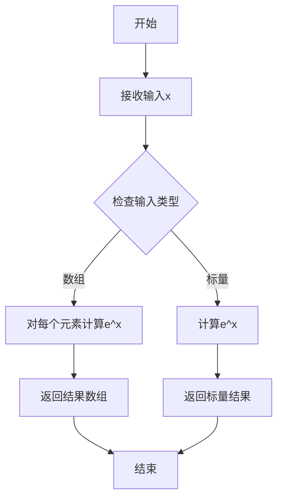

#### 带注释源码

```python
# np.exp 使用示例及源码注释

# 导入NumPy库
import numpy as np

# 创建输入数据
x = np.array([1, 2, 3])

# 调用np.exp函数计算e的x次方
# 源码实现（简化版）:
# def exp(x, out=None, where=True, casting='same_kind', order='K', dtype=None, subok=True):
#     """
#     计算输入数组中所有元素的指数。
#     
#     参数:
#         x: array_like - 输入值
#         out: ndarray - 结果存放的数组
#         where: array_like - 值为True的位置计算指数
#         casting: str - 转换规则
#         order: str - 输出数组的内存布局
#         dtype: data-type - 输出数组的数据类型
#         subok: bool - 是否允许子类
#     返回:
#         out: ndarray - e的x次方
#     """
#     return _wrapfunc(x, 'exp', *args, **kwds)

result = np.exp(x)
# result = np.array([2.71828183, 7.38905610, 20.08553692])

# 在本代码中的实际应用：
delta = 0.025
x = y = np.arange(-3.0, 3.0, delta)
X, Y = np.meshgrid(x, y)

# 计算两个二维高斯分布
Z1 = np.exp(-X**2 - Y**2)      # 中心在(0,0)的高斯分布
Z2 = np.exp(-(X - 1)**2 - (Y - 1)**2)  # 中心在(1,1)的高斯分布

# 组合形成复杂的二维函数
Z = (Z1 - Z2) * 2

# 使用matplotlib可视化结果
fig, ax = plt.subplots()
im = ax.imshow(Z, interpolation='bilinear', cmap="RdYlBu",
               origin='lower', extent=[-3, 3, -3, 3],
               vmax=abs(Z).max(), vmin=-abs(Z).max())
plt.show()
```

#### 关键组件信息

| 组件名称 | 一句话描述 |
|---------|-----------|
| `np.exp` | 计算自然常数e的x次方的指数函数 |
| `np.meshgrid` | 生成坐标矩阵，用于创建三维可视化所需的网格 |
| `np.arange` | 创建等间距的数值序列 |
| `ax.imshow` | 在matplotlib中显示二维图像 |

#### 潜在的技术债务或优化空间

1. **重复代码**：代码中两次计算相同的高斯分布表达式（`Z1`和`Z2`），可以提取为独立函数以提高可维护性
2. **魔法数字**：代码中使用了硬编码的数值如`19680801`（随机种子）、`0.025`（delta）等，应使用有意义的常量命名
3. **缺少错误处理**：没有对输入数据进行有效性验证，如检查是否为数值类型等
4. **注释与文档**：部分复杂逻辑（如图像插值的边缘填充说明）可以进一步简化或提取为独立文档

#### 其它项目

**设计目标与约束**：
- 本代码主要展示Matplotlib中`imshow`函数的各种用法，包括插值方法、颜色映射、坐标轴范围设置等
- 使用NumPy进行数值计算，利用其向量化操作提高性能

**数据流与状态机**：
- 数据流：生成网格坐标 → 计算高斯函数值 → 组合函数 → 图像渲染
- 状态机：数据准备 → 图形创建 → 显示 → 关闭

**外部依赖与接口契约**：
- 依赖库：`matplotlib.pyplot`、`numpy`、`matplotlib.cbook`、`matplotlib.patches`、`matplotlib.path`
- 图像数据来源：通过`cbook.get_sample_data()`获取示例图像文件


### `plt.subplots`

`plt.subplots` 是 Matplotlib 库中用于创建图形窗口及一个或多个子图的核心函数。该函数创建一个新的 Figure 对象，并根据指定的行列参数创建一个或多个 Axes 对象（子图），返回图形对象和轴对象（或轴对象数组），支持子图网格布局、坐标轴共享、子图间距调整等功能。

参数：

- `nrows`：`int`，默认值 1，子图网格的行数
- `ncols`：`int`，默认值 1，子图网格的列数
- `sharex`：`bool` 或 `str`，默认值 False，是否共享 x 轴。当为 True 时，所有子图共享 x 轴；当为 'row' 时，同行子图共享 x 轴；当为 'col' 时，同列子图共享 x 轴
- `sharey`：`bool` 或 `str`，默认值 False，是否共享 y 轴。共享规则与 sharex 类似
- `squeeze`：`bool`，默认值 True，是否压缩返回的轴数组。当为 True 时，如果只创建一个子图则返回单个轴对象而不是数组
- `width_ratios`：`array-like`，可选，表示子图列的相对宽度
- `height_ratios`：`array-like`，可选，表示子图行的相对高度
- `subplot_kw`：`dict`，可选，传递给每个子图创建函数（如 add_subplot）的关键字参数
- `gridspec_kw`：`dict`，可选，传递给 GridSpec 构造函数的关键字参数
- `**fig_kw`：可选，传递给 figure() 函数的关键字参数，如 figsize、dpi 等

返回值：`tuple`，返回 (figure, axes) 元组。其中 figure 是 Figure 对象，axes 是单个 Axes 对象（当 squeeze=True 且 nrows*ncols=1 时）或 Axes 对象数组（当 nrows>1 或 ncols>1 时）

#### 流程图

```mermaid
flowchart TD
    A[调用 plt.subplots] --> B{检查 nrows 和 ncols 参数}
    B -->|默认值 1x1| C[创建单子图]
    B -->|多行多列| D[创建子图网格]
    C --> E[调用 plt.figure 创建 Figure]
    D --> E
    E --> F[创建 GridSpec 对象]
    F --> G[根据 gridspec_kw 配置网格]
    G --> H[循环创建子图 Axes]
    H --> I{应用 sharex/sharey 共享}
    I --> J{应用 squeeze 参数}
    J -->|squeeze=True 且单子图| K[返回单个 Axes 对象]
    J -->|squeeze=False 或多子图| L[返回 Axes 数组]
    K --> M[返回 (fig, ax) 元组]
    L --> M
    M --> N[结束]
```

#### 带注释源码

```python
def subplots(nrows=1, ncols=1, sharex=False, sharey=False, squeeze=True,
             width_ratios=None, height_ratios=None,
             subplot_kw=None, gridspec_kw=None, **fig_kw):
    """
    创建图形及子图网格.
    
    参数:
        nrows: 子图行数, 默认1
        ncols: 子图列数, 默认1
        sharex: 是否共享x轴, False/'row'/'col'/True
        sharey: 是否共享y轴, False/'row'/'col'/True
        squeeze: 是否压缩返回的轴数组
        width_ratios: 子图列宽度比例
        height_ratios: 子图行高度比例
        subplot_kw: 传递给子图的关键字参数
        gridspec_kw: 传递给GridSpec的关键字参数
        **fig_kw: 传递给figure的关键字参数
    
    返回:
        fig: Figure对象
        ax: Axes对象或Axes数组
    """
    # 1. 创建 Figure 对象
    fig = figure(**fig_kw)
    
    # 2. 创建子图网格布局
    gs = GridSpec(nrows, nrows, 
                  width_ratios=width_ratios,
                  height_ratios=height_ratios,
                  **gridspec_kw)
    
    # 3. 创建子图数组
    axs = np.empty(nrows * ncols, object)
    
    # 4. 循环创建每个子图
    for i in range(nrows):
        for j in range(ncols):
            # 创建子图并添加到图形
            ax = fig.add_subplot(gs[i, j], **subplot_kw)
            axs[i * ncols + j] = ax
            
            # 配置坐标轴共享
            if sharex:
                # ... 共享x轴逻辑
            if sharey:
                # ... 共享y轴逻辑
    
    # 5. 根据 squeeze 参数处理返回值的格式
    if squeeze:
        # 尝试将数组维度压缩
        if nrows == 1 and ncols == 1:
            return fig, axs[0]  # 返回单个Axes对象
        elif nrows == 1 or ncols == 1:
            # 去除长度为1的维度
            axs = axs.reshape(nrows, ncols)
    
    return fig, axs
```


### `matplotlib.axes.Axes.imshow`

`ax.imshow` 是 Matplotlib 中 Axes 类的核心方法，用于在坐标轴上显示二维图像或数组数据，支持多种颜色映射、插值方法、坐标变换和像素值映射方式。

参数：

- `X`：数组型，输入图像数据，可以是二维数组（灰度）或三维数组（RGB/RGBA）
- `cmap`：str 或 Colormap，可选，颜色映射名称，用于将数值映射为颜色
- `norm`：matplotlib.colors.Normalize，可选，用于数据值到[0,1]范围的归一化
- `aspect`：float 或 'auto'，可选，控制轴的纵横比
- `interpolation`：str，可选，插值方法，如 'nearest', 'bilinear', 'bicubic' 等
- `alpha`：float 或数组，可选，透明度值（0-1之间）
- `origin`：{'upper', 'lower'}，可选，图像原点位置
- `extent`：list 或 tuple，可选，图像的坐标范围 [xmin, xmax, ymin, ymax]
- `filternorm`：bool，可选，是否对滤波器核进行归一化
- `filterrad`：float，可选，滤波器半径
- `imlim`：元组，可选，图像显示的最小和最大限制
- `resample`：bool，可选，是否使用重采样
- `url`：str，可选，设置图像的 URL
- `data`：可选，索引数据
- `**kwargs`：关键字参数传递给 `matplotlib.image.AxesImage` 构造函数

返回值：`matplotlib.image.AxesImage`，返回创建的 AxesImage 对象

#### 流程图

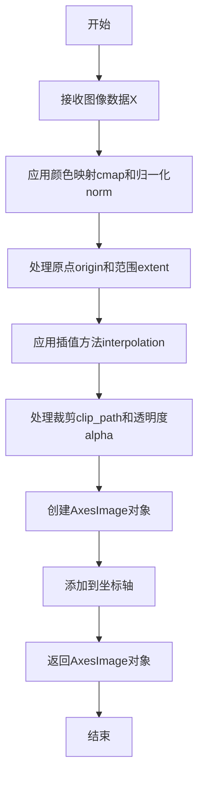

#### 带注释源码

```python
# 导入必要的库
import matplotlib.pyplot as plt
import numpy as np
import matplotlib.cbook as cbook

# 示例1：绘制双变量正态分布图像
# 创建网格坐标
delta = 0.025
x = y = np.arange(-3.0, 3.0, delta)
X, Y = np.meshgrid(x, y)

# 计算两个高斯分布的差值
Z1 = np.exp(-X**2 - Y**2)
Z2 = np.exp(-(X - 1)**2 - (Y - 1)**2)
Z = (Z1 - Z2) * 2

# 创建图形和坐标轴
fig, ax = plt.subplots()

# 使用imshow绘制图像
# 参数说明：
# Z: 输入的二维数组数据
# interpolation='bilinear': 使用双线性插值
# cmap="RdYlBu": 使用红黄蓝颜色映射
# origin='lower': 原点设在左下角
# extent=[-3, 3, -3, 3]: 设置坐标轴范围
# vmax/vmin: 设置颜色映射的最大最小值
im = ax.imshow(Z, interpolation='bilinear', cmap="RdYlBu",
               origin='lower', extent=[-3, 3, -3, 3],
               vmax=abs(Z).max(), vmin=-abs(Z).max())

plt.show()


# 示例2：显示图像文件和数值数组
# 读取样本图像
with cbook.get_sample_data('grace_hopper.jpg') as image_file:
    image = plt.imread(image_file)

# 读取并处理16位整数图像数据
w, h = 256, 256
with cbook.get_sample_data('s1045.ima.gz') as datafile:
    s = datafile.read()
A = np.frombuffer(s, np.uint16).astype(float).reshape((w, h))
extent = (0, 25, 0, 25)

# 创建多面板图形
fig, ax = plt.subplot_mosaic([
    ['hopper', 'mri']
], figsize=(7, 3.5))

# 在第一个坐标轴显示彩色图像
ax['hopper'].imshow(image)
ax['hopper'].axis('off')

# 在第二个坐标轴显示热力图
im = ax['mri'].imshow(A, cmap="hot", origin='upper', extent=extent)

# 添加标记点
markers = [(15.9, 14.5), (16.8, 15)]
x, y = zip(*markers)
ax['mri'].plot(x, y, 'o')
ax['mri'].set_title('MRI')

plt.show()


# 示例3：比较不同插值方法
A = np.random.rand(5, 5)

fig, axs = plt.subplots(1, 3, figsize=(10, 3))
# 遍历三种插值方法进行对比
for ax, interp in zip(axs, ['nearest', 'bilinear', 'bicubic']):
    ax.imshow(A, interpolation=interp)
    ax.set_title(interp.capitalize())
    ax.grid(True)

plt.show()


# 示例4：演示origin参数的效果
x = np.arange(120).reshape((10, 12))

interp = 'bilinear'
fig, axs = plt.subplots(nrows=2, sharex=True, figsize=(3, 5))
axs[0].set_title('blue should be up')
axs[0].imshow(x, origin='upper', interpolation=interp)

axs[1].set_title('blue should be down')
axs[1].imshow(x, origin='lower', interpolation=interp)
plt.show()


# 示例5：使用裁剪路径显示图像
delta = 0.025
x = y = np.arange(-3.0, 3.0, delta)
X, Y = np.meshgrid(x, y)
Z1 = np.exp(-X**2 - Y**2)
Z2 = np.exp(-(X - 1)**2 - (Y - 1)**2)
Z = (Z1 - Z2) * 2

# 创建菱形裁剪路径
path = Path([[0, 1], [1, 0], [0, -1], [-1, 0], [0, 1]])
patch = PathPatch(path, facecolor='none')

fig, ax = plt.subplots()
ax.add_patch(patch)

# 使用裁剪路径显示图像
im = ax.imshow(Z, interpolation='bilinear', cmap="gray",
               origin='lower', extent=[-3, 3, -3, 3],
               clip_path=patch, clip_on=True)
im.set_clip_path(patch)

plt.show()
```


### `plt.show`

`plt.show()` 是 Matplotlib 库中的核心函数，用于显示所有当前创建的图形窗口并将图形渲染到屏幕上。在调用此函数之前，图形对象仅存在于内存中，不会向用户展示。

参数：

- `block`：`bool`，可选参数。默认值为 `True`。当设置为 `True` 时，函数会阻塞当前程序执行，直到用户关闭所有图形窗口；当设置为 `False` 时，函数立即返回，图形窗口会保持打开状态但程序继续执行。

返回值：`None`，该函数不返回任何值，仅用于图形显示的副作用。

#### 流程图

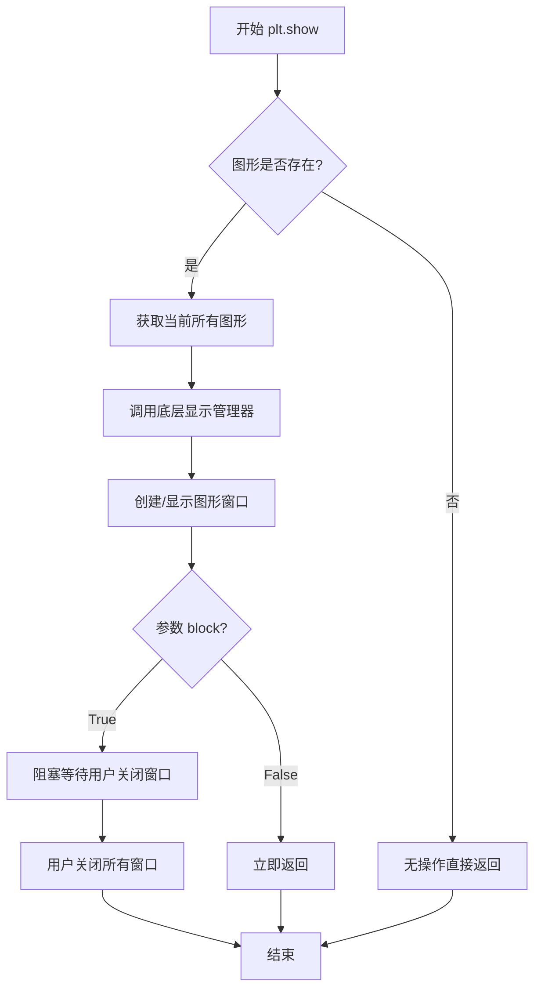

#### 带注释源码

```python
# matplotlib.pyplot.show() 伪代码实现

def show(*, block=None):
    """
    显示所有打开的图形窗口。
    
    Parameters
    ----------
    block : bool, optional
        是否阻塞程序执行以等待图形窗口关闭。
        默认为 True，表示阻塞。
    """
    # 获取全局图形管理器
    global _showblocks
    
    # 获取当前所有的图形对象（Figure对象）
    allnums = get_fignums()
    
    # 如果没有图形，直接返回
    if not allnums:
        return
    
    # 遍历所有图形并显示
    for manager in Gcf.get_all_fig_managers():
        # 调用后端的显示函数
        # 例如：Qt后端调用show()，Tk后端调用mainloop()
        manager.show()
    
    # 如果block为True（默认），则阻塞等待
    if block:
        # 调用交互式后端的阻塞方法
        # 在Qt/Tk后端中这通常是一个事件循环
        for manager in Gcf.get_all_fig_managers():
            manager.block(True)  # 进入事件循环等待
    
    # 返回None
    return None
```

> **注**：上述源码为简化版伪代码，实际的 `plt.show()` 在不同后端（Qt、Tk、GTK、macOS等）有不同的实现方式，核心逻辑是通过图形管理器（FigureManager）调用底层GUI库的显示方法。

#### 实际调用示例

```python
# 代码中的实际调用示例

# 第一次调用：显示双变量正态分布图像
fig, ax = plt.subplots()
im = ax.imshow(Z, interpolation='bilinear', cmap="RdYlBu",
               origin='lower', extent=[-3, 3, -3, 3],
               vmax=abs(Z).max(), vmin=-abs(Z).max())
plt.show()  # <--- 显示第一个图形

# 第二次调用：显示hopper图像和MRI图像
fig, ax = plt.subplot_mosaic([
    ['hopper', 'mri']
], figsize=(7, 3.5))
# ... 设置图像内容 ...
plt.show()  # <--- 显示第二个图形

# 第三次调用：显示插值方法对比
fig, axs = plt.subplots(1, 3, figsize=(10, 3))
# ... 设置子图内容 ...
plt.show()  # <--- 显示第三个图形

# 第四次调用：显示origin参数对比
fig, axs = plt.subplots(nrows=2, sharex=True, figsize=(3, 5))
# ... 设置子图内容 ...
plt.show()  # <--- 显示第四个图形

# 第五次调用：显示clip path图像
fig, ax = plt.subplots()
# ... 设置图形内容 ...
plt.show()  # <--- 显示第五个图形
```

> **使用注意**：`plt.show()` 会调用底层图形后端（如Qt5、Tkinter、GTK3等）的事件循环。在某些交互式环境（如Jupyter Notebook）中，可能需要使用 `%matplotlib inline` 或 `%matplotlib widget` 魔法命令来正确显示图形。


### `cbook.get_sample_data`

获取示例数据文件，返回一个文件对象或文件路径。该函数是 matplotlib.cbook 模块提供的实用工具，用于访问 Matplotlib 内置的示例数据文件，支持返回文件对象或文件路径两种模式。

参数：

- `fname`：`str`，要获取的示例数据文件名（如 'grace_hopper.jpg'、's1045.ima.gz' 等）
- `asfileobj`：`bool`，可选，默认为 True。如果为 True，返回文件对象；如果为 False，返回文件路径字符串

返回值：`typing.Union[IO[bytes], str]`，返回文件对象（当 asfileobj=True 时）或文件路径字符串（当 asfileobj=False 时）

#### 流程图

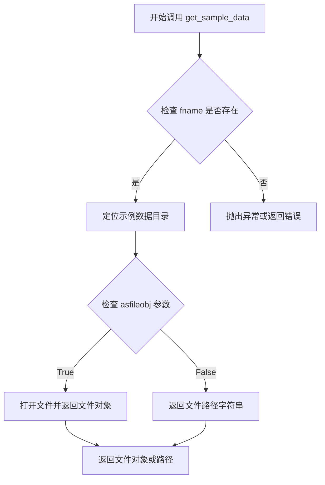

#### 带注释源码

```python
# 注意：这是 matplotlib.cbook.get_sample_data 函数的典型实现结构
# 具体实现可能因版本而异

def get_sample_data(fname, asfileobj=True):
    """
    Load a sample data file from the Matplotlib sample data repository.

    This function locates and returns a file from Matplotlib's sample data,
    which is bundled with the library for demonstration purposes.

    Parameters
    ----------
    fname : str
        The filename of the sample data file to load.
        Common examples include:
        - 'grace_hopper.jpg' : JPEG image of Grace Hopper
        - 's1045.ima.gz' : Compressed MRI data file
        - 'forest.tif' : Sample TIFF image
    asfileobj : bool, optional
        If True (default), return an open file-like object that can be read.
        If False, return the path to the file as a string.

    Returns
    -------
    file-like object or str
        If asfileobj is True: A file object opened in binary mode ('rb')
        If asfileobj is False: The absolute path to the sample data file

    Examples
    --------
    >>> import matplotlib.cbook as cbook
    >>> # Get file object
    >>> with cbook.get_sample_data('grace_hopper.jpg') as f:
    ...     image = plt.imread(f)
    >>> # Get file path
    >>> path = cbook.get_sample_data('grace_hopper.jpg', asfileobj=False)
    """
    # Step 1: 获取 Matplotlib 示例数据目录路径
    # This is typically in the matplotlib package's sample_data directory
    import matplotlib as mpl
    import os

    # 获取包目录下的 sample_data 文件夹路径
    datapath = os.path.join(mpl.get_data_path(), 'sample_data')

    # Step 2: 拼接完整文件路径
    fpath = os.path.join(datapath, fname)

    # Step 3: 根据 asfileobj 参数决定返回类型
    if asfileobj:
        # 返回打开的文件对象（上下文管理器支持）
        return open(fpath, 'rb')  # 二进制读取模式
    else:
        # 返回文件路径字符串
        return fpath
```

#### 使用示例源码

```python
# 在提供的代码中的实际使用方式

# 示例1：读取JPEG图像
# 使用 with 语句确保文件正确关闭
with cbook.get_sample_data('grace_hopper.jpg') as image_file:
    # plt.imread 可以从文件对象读取图像数据
    image = plt.imread(image_file)

# 示例2：读取压缩的MRI数据文件
w, h = 256, 256  # 图像宽度和高度
with cbook.get_sample_data('s1045.ima.gz') as datafile:
    # 从二进制文件读取原始数据
    s = datafile.read()
    # 将数据转换为 uint16 类型，然后 reshape 为指定尺寸
    A = np.frombuffer(s, np.uint16).astype(float).reshape((w, h))
```


### `plt.imread`

该函数是 Matplotlib 中用于从图像文件读取图像数据的核心函数，将磁盘上的图像文件加载为 NumPy 数组，以便后续在图表中显示或进行图像处理。

参数：

- `fname`：`str` 或 `file-like object`，图像文件的路径（字符串）或打开的文件对象
- `format`：`str`（可选），图像文件的格式（如 'png'、'jpg' 等）。如果 fname 是文件对象，则必须指定格式

返回值：`numpy.ndarray`，返回表示图像数据的 NumPy 数组。对于灰度图像，返回形状为 (M, N) 的二维数组；对于 RGB 图像，返回形状为 (M, N, 3) 的三维数组；对于 RGBA 图像，返回形状为 (M, N, 4) 的四维数组

#### 流程图

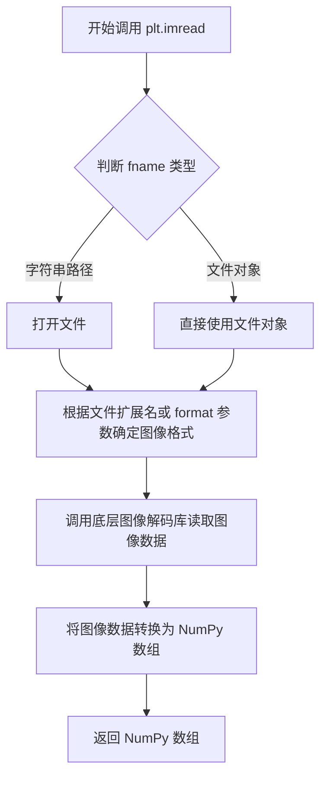

#### 带注释源码

由于 `plt.imread` 是 Matplotlib 库的内置函数，其源码位于 matplotlib 库内部，以下是基于函数调用关系的概念性源码实现：

```python
import numpy as np
from PIL import Image
import matplotlib
import matplotlib.image as mimage

def imread(fname, format=None):
    """
    从文件读取图像并返回为 NumPy 数组。
    
    参数:
        fname: str 或 file-like object
            图像文件路径或已打开的文件对象
        format: str, optional
            图像格式，如果 fname 是文件对象则必须指定
    
    返回:
        numpy.ndarray
            图像数据数组
    """
    # 处理文件路径或文件对象
    if isinstance(fname, str):
        # 如果是字符串路径，尝试自动推断格式
        with open(fname, 'rb') as f:
            return _read_png_or_jpeg(f, format)
    else:
        # 如果是文件对象，直接读取
        return _read_png_or_jpeg(fname, format)

def _read_png_or_jpeg(file_obj, format=None):
    """
    内部函数：使用 PIL 或内部解码器读取图像
    """
    # 读取原始图像数据
    pil_image = Image.open(file_obj)
    
    # 转换为 NumPy 数组
    # 对于不同模式的图像:
    # - L (灰度): 转换为二维数组
    # - RGB: 转换为 (M, N, 3) 数组
    # - RGBA: 转换为 (M, N, 4) 数组
    image_array = np.array(pil_image)
    
    return image_array

# 在实际 matplotlib 中的简化调用流程：
# 1. 接收文件路径 fname
# 2. 打开文件并读取原始字节
# 3. 使用 pillow 或其他图像库解码
# 4. 转换为 numpy 数组格式返回
```

#### 实际使用示例（来自提供代码）

```python
# 从 cbook 获取示例图像文件
with cbook.get_sample_data('grace_hopper.jpg') as image_file:
    # 读取图像文件，返回 NumPy 数组
    image = plt.imread(image_file)
    
# 之后可以在 matplotlib 中显示:
# ax['hopper'].imshow(image)
```


### `np.frombuffer`

从缓冲区创建数组的 NumPy 函数，将字节数据解释为指定数据类型的数组。

参数：

- `buffer`：`buffer_like`，暴露缓冲区接口的对象（如 bytes、bytearray、memoryview 或文件对象），提供原始字节数据
- `dtype`：`data-type`，可选，默认为 `float`，指定返回数组的数据类型
- `count`：`int`，可选，默认为 -1，要读取的元素数量，-1 表示读取所有数据
- `offset`：`int`，可选，默认为 0，从缓冲区开始读取的偏移量（以字节为单位）
- `order`：`{'C', 'F', 'A'}`，可选，指定数组的内存布局

返回值：`ndarray`，从缓冲区数据创建的一维或多维数组

#### 流程图

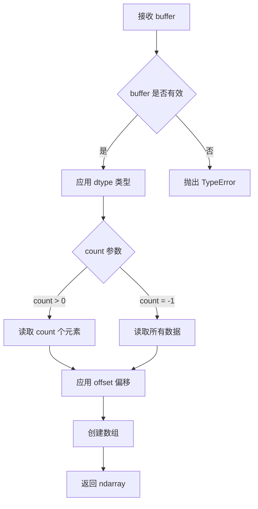

#### 带注释源码

```python
# 从二进制数据创建数组的示例
# 读取 256x256 的 16 位无符号整数图像数据
w, h = 256, 256
with cbook.get_sample_data('s1045.ima.gz') as datafile:
    s = datafile.read()  # 读取二进制文件数据到字节串

# np.frombuffer 将字节数据解释为指定数据类型
# 参数说明：
#   buffer: 原始字节数据 (s)
#   dtype: 数据类型 (np.uint16 - 16位无符号整数)
# 返回: 一维数组，然后使用 .astype(float) 转换为浮点数
#       最后 reshape 为指定的宽高形状
A = np.frombuffer(s, np.uint16).astype(float).reshape((w, h))
```

#### 关键组件信息

| 组件名称 | 一句话描述 |
|---------|-----------|
| `buffer` 参数 | 提供原始字节数据的缓冲区对象 |
| `dtype` 参数 | 定义如何解释底层字节的数据类型 |
| `count` 参数 | 控制要读取的元素数量 |
| `offset` 参数 | 控制从缓冲区何处开始读取 |

#### 潜在技术债务或优化空间

1. **内存效率**：当前实现创建了多个数组副本（frombuffer → astype → reshape），可以考虑使用 `np.ndarray.view()` 或 `np.ascontiguousarray()` 减少内存复制
2. **错误处理**：缺少对缓冲区大小与 dtype、count 兼容性的预检查，可能导致内存访问异常

#### 其它说明

- **设计目标**：提供一种直接从二进制数据创建 NumPy 数组的高效方法，无需中间 Python 列表
- **约束**：返回的数组是只读的（如果 buffer 是非可写对象），因为它共享底层内存
- **错误处理**：如果 buffer 不支持缓冲区接口，抛出 `TypeError`；如果 count 或 offset 超出范围，可能抛出 `ValueError` 或导致内存访问异常
- **数据流**：二进制数据 → 缓冲区接口 → NumPy 数组视图 → 转换为目标类型 → 重塑为目标形状


### `np.reshape`

NumPy 的 `reshape` 函数是一个用于改变数组形状的高效函数，它可以在不改变数组数据的情况下重新组织数组的维度。该函数接受一个目标形状参数，允许用户将一维数组转换为多维数组，或将多维数组展平为一维数组，同时保持原始数据的内存布局和元素顺序。

参数：

- `a`：`ndarray` 或类数组对象，需要被重塑的输入数组
- `newshape`：`int` 或 `tuple of ints`，目标形状，可以是一个整数或整数元组
- `order`：`{'C', 'F', 'A'}`，可选参数，指定读取/写入元素的顺序，'C' 表示 C 语言风格（行优先），'F' 表示 Fortran 语言风格（列优先），'A' 表示如果 `a` 是 Fortran 连续的则是 Fortran 风格，否则是 C 风格

返回值：`ndarray`，返回满足要求形状的视图，如果可能的话。如果无法在不复制数据的情况下实现形状变化，将返回一个新的数组副本。

#### 流程图

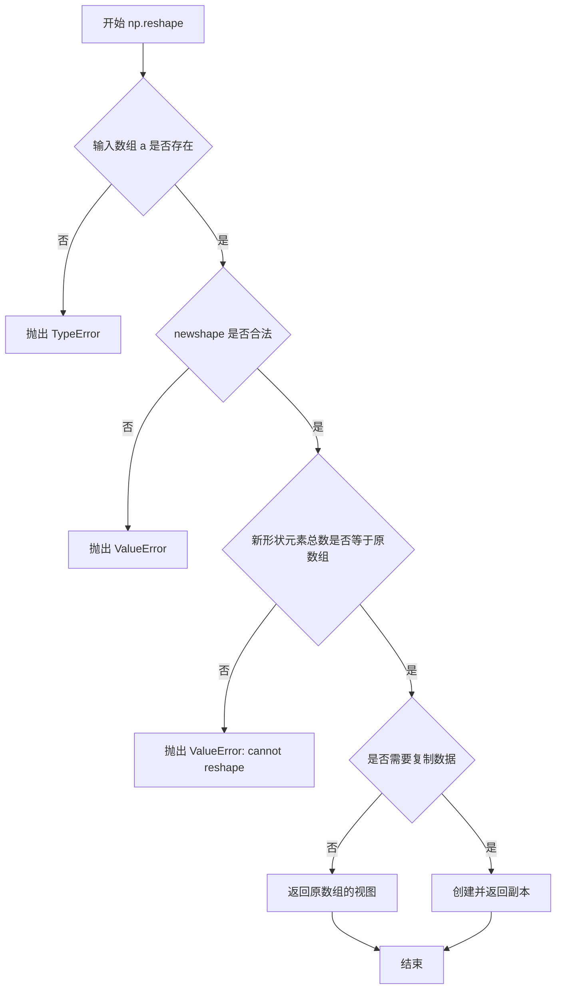

#### 带注释源码

```python
def reshape(a, newshape, order='C'):
    """
    在不更改数据的情况下为数组赋予新的形状。
    
    参数:
    -------
    a : ndarray
        要重塑的源数组。
    newshape : int 或 int 的元组
        目标形状。整数表示一维数组。-1 可以用于表示
        "自动计算"该维度（但只能使用一次）。
    order : {'C', 'F', 'A'}, 可选
        读取/写入元素的顺序:
        - 'C': C 顺序，行优先，即索引第二维变化最慢，第一维变化最快
        - 'F': Fortran 顺序，列优先，即索引第一维变化最慢，第二维变化最快
        - 'A': 如果 a 是 Fortran 连续的，则等同于 'F'，否则等同于 'C'
    
    返回:
    -------
    reshaped_array : ndarray
        如果可能，返回对输入数组的视图；否则返回副本。
        当以 C 顺序重塑 Fortran 连续的数组或其反向时，
        会返回副本而非视图。
    
    示例:
    --------
    >>> a = np.arange(6).reshape((3, 2))
    >>> a
    array([[0, 1],
           [2, 3],
           [4, 5]])
    
    >>> np.reshape(a, (2, 3))  # C 顺序重塑
    array([[0, 1, 2],
           [3, 4, 5]])
    
    >>> np.reshape(a, (2, 3), order='F')  # Fortran 顺序重塑
    array([[0, 4, 3],
           [2, 1, 5]])
    
    >>> a = np.array([[1, 2], [3, 4], [5, 6], [7, 8]])
    >>> np.reshape(a, (2, 2, 2))  # 2x2x2 的三维数组
    array([[[1, 2],
            [3, 4]],
           [[5, 6],
            [7, 8]]])
    
    >>> np.reshape(a, (2, -1))  # -1 自动计算为 2
    array([[1, 2, 3, 4],
           [5, 6, 7, 8]])
    """
    # 将 newshape 规范化为元组形式
    newshape = _util._validate_tuple(newshape, ('newshape',))
    
    # 处理 -1 的情况：自动计算该维度
    if -1 in newshape:
        # 计算总元素数（排除 -1）
        known_elements = 1
        minus_one_count = 0
        for dim in newshape:
            if dim == -1:
                minus_one_count += 1
            else:
                known_elements *= dim
        
        # 如果有多个 -1，抛出错误
        if minus_one_count > 1:
            raise ValueError("can only specify one unknown dimension")
        
        # 计算缺失维度的值
        if a.size % known_elements != 0:
            raise ValueError("cannot reshape array")
        
        missing_dim = a.size // known_elements
        newshape = tuple(dim if dim != -1 else missing_dim for dim in newshape)
    
    # 检查形状元素总数是否匹配
    if prod(newshape) != a.size:
        raise ValueError(
            f"cannot reshape array of size {a.size} into shape {newshape}"
        )
    
    # 根据 order 参数选择重塑顺序
    # 这里会调用底层的 C/Fortran 实现
    return _wrapfunc(a, 'reshape', newshape, order=order)
```


### `ax.plot` - 绘制标记点

该方法用于在 Axes 对象上绘制标记点（或线条），在代码中用于在 MRI 图像上标记特定的坐标位置。

参数：

-  `x`：数组或元组，X 坐标列表，表示标记点的横坐标
-  `y`：数组或元组，Y 坐标列表，表示标记点的纵坐标  
-  `fmt`：字符串，格式字符串，'o' 表示使用圆圈标记

返回值：`list of ~matplotlib.lines.Line2D`，返回创建的 Line2D 对象列表，可用于进一步自定义样式

#### 流程图

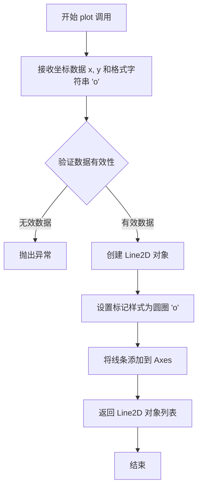

#### 带注释源码

```python
# 代码中的实际调用
markers = [(15.9, 14.5), (16.8, 15)]  # 定义标记点坐标列表
x, y = zip(*markers)  # 分离 x 和 y 坐标到两个元组
ax['mri'].plot(x, y, 'o')  # 绘制圆圈标记点

# 等效的详细调用过程（matplotlib 内部逻辑）
# 1. 接收参数
#    x = (15.9, 16.8)
#    y = (14.5, 15.0)  
#    fmt = 'o'
#
# 2. 创建 Line2D 对象
#    line = matplotlib.lines.Line2D(x, y, marker='o', ...)
#
# 3. 设置属性
#    line.set_markerfacecolor('blue')  # 默认颜色
#    line.set_markeredgecolor('blue')
#
# 4. 添加到 Axes
#    ax.add_line(line)
#
# 5. 返回 Line2D 对象用于后续自定义
#    return [line]
```


### Axes.set_title

设置 Axes 对象的标题。

参数：

- `s`：`str`，要设置为标题的文本内容
- `fontdict`：`dict`，可选，用于控制标题外观的字体属性字典（如字体大小、颜色、字体 family 等）
- `loc`：`str`，可选，标题对齐方式，可选值为 'center'（默认）、'left' 或 'right'
- `pad`：`float`，可选，标题与 Axes 顶部的间距（以点为单位），默认为 None（使用 rcParams 中的值）
- `verticalalignment`/`va`：可选，垂直对齐方式
- `horizontalalignment`/`ha`：可选，水平对齐方式

返回值：`matplotlib.text.Text`，返回创建的标题文本对象，可用于后续进一步修改样式

#### 流程图

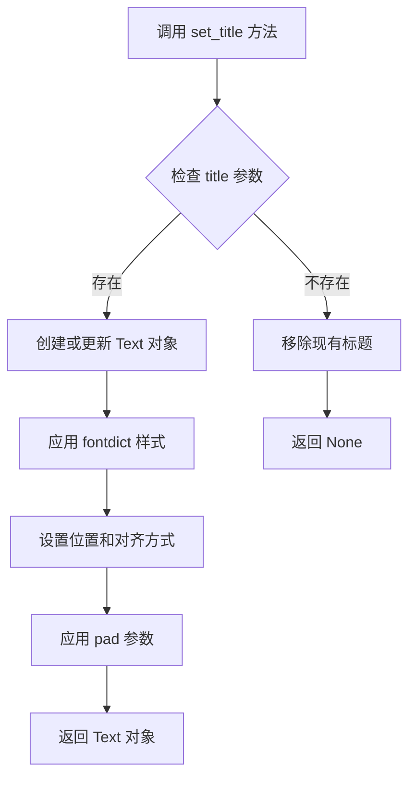

#### 带注释源码

```python
def set_title(self, s, fontdict=None, loc=None, pad=None, *, verticalalignment='center', **kwargs):
    """
    Set a title for the Axes.

    Parameters
    ----------
    s : str
        The title text.

    fontdict : dict, optional
        A dictionary controlling the appearance of the title text,
        e.g., {'fontsize': 16, 'fontweight': 'bold', 'color': 'red'}.

    loc : {'center', 'left', 'right'}, default: 'center'
        Alignment of the title text.

    pad : float, default: rcParams['axes.titlepad']
        The offset of the title from the top of the Axes, in points.

    verticalalignment : str, default: 'center'
        Vertical alignment of the title text.

    **kwargs
        Additional keyword arguments are passed to `Text` constructor.

    Returns
    -------
    `matplotlib.text.Text`
        The created Text instance.
    """
    # 如果标题已存在，则获取现有标题；否则创建新的 Text 对象
    title = self._get_title()
    # 如果传入了 fontdict，则将其与其他 kwargs 合并
    if fontdict is not None:
        kwargs.update(fontdict)
    # 设置标题文本
    title.set_text(s)
    # 设置标题位置和对齐方式
    title.setverticalalignment(verticalalignment)
    title.set_ha(loc)
    # 如果指定了 pad，则设置标题与 Axes 的间距
    if pad is not None:
        title.set_pad(pad)
    # 应用其他 kwargs（如颜色、字体大小等）
    title.update(kwargs)
    # 返回 Text 对象
    return title
```


```json
{
    "name": "Axes.axis",
    "description": "设置或获取坐标轴的属性和可见性。该方法用于控制坐标轴的显示、范围、比例等属性，是 Matplotlib 中管理坐标轴的核心方法之一。",
    "parameters": [
        {
            "name": "arg",
            "type": "various",
            "description": "可选参数，用于设置坐标轴属性。可以是字符串（如 'off' 关闭坐标轴, 'on' 开启坐标轴, 'equal' 等比例, 'scaled' 缩放, 'tight' 紧凑, 'auto' 自动, 'image' 图像范围）、元组/列表（设置坐标轴范围 [xmin, xmax, ymin, ymax]）、字典（设置多个属性）或 None（返回当前坐标轴范围）"
        },
        {
            "name": "emit",
            "type": "bool",
            "description": "当设置为 True 时，通知_axes_limits_changed 事件以更新视图。默认值为 True"
        },
        {
            "name": "pick",
            "type": "bool",
            "description": "是否启用坐标轴的拾取（pick）功能。默认值为 None"
        }
    ],
    "return_type": "various",
    "return_description": "根据参数不同返回值不同：当 arg=None 时返回当前坐标轴范围 [xmin, xmax, ymin, ymax]；当设置其他参数时返回包含 x 轴和 y 轴的 Line2D 或 Patch 对象的元组",
    "flowchart": "```mermaid\ngraph TD\n    A[调用 ax.axis] --> B{arg 参数为空?}\n    B -->|是| C[获取当前坐标轴范围]\n    B -->|否| D{arg 类型判断}\n    D -->|字符串| E[设置坐标轴属性]\n    D -->|元组/列表| F[设置坐标轴范围]\n    D -->|字典| G[设置多个属性]\n    D -->|布尔值| H[设置坐标轴可见性]\n    E --> I[执行相应设置]\n    F --> I\n    G --> I\n    H --> I\n    I --> J[emit 通知?]\n    J -->|是| K[触发 _axes_limits_changed 事件]\n    J -->|否| L[返回结果]\n    K --> L\n    C --> L\n```",
    "source_code": "```python\n# 以下是 ax.axis 方法的典型使用方式和实现原理\n\n# 在用户提供的代码中，有以下调用示例：\nax['hopper'].axis('off')  # 清除 x 轴和 y 轴\n\n# axis() 方法的常见用法：\n# 1. 关闭坐标轴\nax.axis('off')   # 关闭坐标轴的显示\n\n# 2. 开启坐标轴  \nax.axis('on')    # 开启坐标轴的显示\n\n# 3. 设置坐标轴范围\nax.axis([xmin, xmax, ymin, ymax])  # 设置 x 和 y 轴的范围\n\n# 4. 获取当前坐标轴范围\nlimits = ax.axis()  # 返回 [xmin, xmax, ymin, ymax]\n\n# 5. 设置等比例坐标\nax.axis('equal')  # 使 x 和 y 轴的单位长度相等\n\n# 6. 紧凑布局\nax.axis('tight')  # 紧包图形\n\n# 7. 图像范围（基于数据范围自动设置）\nax.axis('image')  # 基于图像数据设置范围\n\n# Matplotlib 内部实现原理（简化版）：\ndef axis(self, *args, **kwargs):\n    \"\"\"\n    设置或获取坐标轴属性\n    \n    参数:\n        *args: 可变参数，支持多种输入格式\n        **kwargs: 关键字参数，如 emit, pick 等\n    \"\"\"\n    # 获取 x 轴和 y 轴\n    xmin, xmax = self.get_xlim()\n    ymin, ymax = self.get_ylim()\n    \n    # 处理参数\n    if len(args) == 0:\n        # 无参数时返回当前范围\n        return [xmin, xmax, ymin, ymax]\n    \n    # 根据参数类型执行不同操作\n    if isinstance(args[0], str):\n        # 字符串参数：处理 'off', 'on', 'equal' 等\n        if args[0] == 'off':\n            self.xaxis.set_visible(False)\n            self.yaxis.set_visible(False)\n        elif args[0] == 'on':\n            self.xaxis.set_visible(True)\n            self.yaxis.set_visible(True)\n        # ... 其他字符串选项处理\n    elif len(args[0]) == 4:\n        # 四元素元组/列表：设置坐标轴范围\n        xmin, xmax, ymin, ymax = args[0]\n        self.set_xlim(xmin, xmax)\n        self.set_ylim(ymin, ymax)\n    \n    # 处理 emit 参数\n    emit = kwargs.get('emit', True)\n    if emit:\n        # 通知视图更新\n        self._axes_limits_changed()\n    \n    # 返回结果（包含 x 轴和 y 轴对象）\n    return self.xaxis, self.yaxis\n```"
}
```


### `PathPatch`

使用 matplotlib 的 PathPatch 类创建一个路径补丁对象，该对象表示一个由 Path 定义的封闭形状的补丁，可用于裁剪图像或绘制自定义形状。

参数：

- `path`：`Path`，由 matplotlib.path.Path 类创建的对象，定义补丁的轮廓坐标。
- `facecolor`：`str`，补丁的填充颜色，设为 'none' 表示无填充色。

返回值：`PathPatch`，返回创建的 PathPatch 对象实例。

#### 流程图

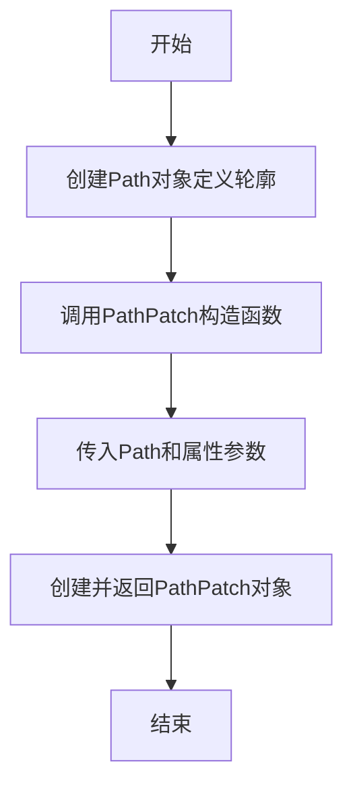

#### 带注释源码

```python
# 导入所需的类
from matplotlib.patches import PathPatch
from matplotlib.path import Path

# 定义路径坐标，形成一个封闭的菱形区域
# 坐标点：上(0,1) -> 右(1,0) -> 下(0,-1) -> 左(-1,0) -> 回到上(0,1)
path = Path([[0, 1], [1, 0], [0, -1], [-1, 0], [0, 1]])

# 创建PathPatch对象
# 参数path: 上面定义的Path对象
# 参数facecolor='none': 设置为无填充色，只显示边框
patch = PathPatch(path, facecolor='none')

# 将补丁添加到Axes对象中
fig, ax = plt.subplots()
ax.add_patch(patch)

# 使用补丁作为裁剪路径来显示图像
im = ax.imshow(Z, interpolation='bilinear', cmap="gray",
               origin='lower', extent=[-3, 3, -3, 3],
               clip_path=patch, clip_on=True)
im.set_clip_path(patch)

plt.show()
```


### `Axes.add_patch`

向当前坐标轴添加一个补丁（Patch）对象，并返回该补丁以便链式调用或进一步操作。

参数：

- `patch`：`Patch`，要添加到坐标轴的补丁对象（如 `PathPatch`、`Circle`、`Rectangle` 等）

返回值：`Patch`，返回被添加到坐标轴的补丁对象，通常与输入的 `patch` 参数相同。

#### 流程图

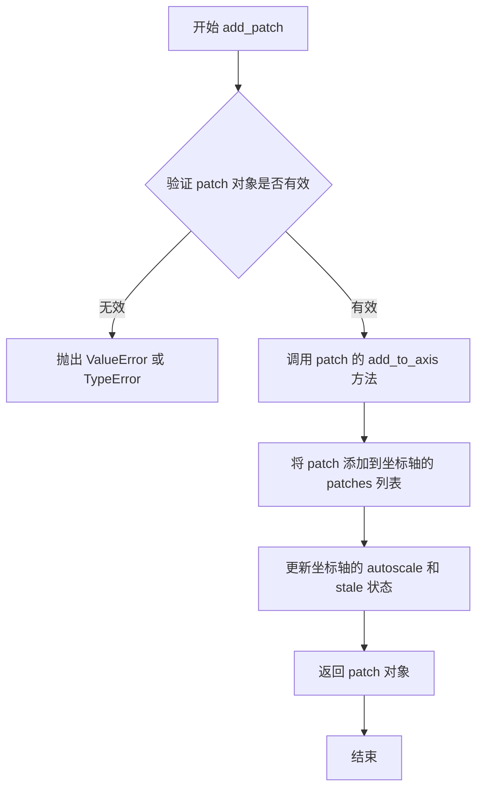

#### 带注释源码

```python
def add_patch(self, p):
    """
    Add a *patch* to the axes' patches; the patch is added at the end,
    so it will be drawn on top of the existing patches.

    Parameters
    ----------
    p : `.Patch`

    Returns
    -------
    `.Patch`

    See Also
    --------
    add_collection, add_line, add_image : For adding other artists to the axes.

    Examples
    --------
    ::

        import matplotlib.pyplot as plt
        import matplotlib
        t = matplotlib.patches.Circle((1, 1), 0.5)
        fig, ax = plt.subplots()
        ax.add_patch(t)
        ax.set_xlim(0, 2)
        ax.set_ylim(0, 2)

    """
    self._set_artist_props(p)  # 设置艺术家属性（如轴、变换等）
    if p.get_clip_path() is not None:  # 如果补丁有剪贴路径
        self._set_clip_path(p, p.get_clip_path())  # 设置剪贴路径
    self.patches.append(p)  # 将补丁添加到坐标轴的补丁列表
    p._remove_method = self.patches.remove  # 设置移除方法以便反向引用
    self.stale_callback = p.stale_callback  # 注册过时回调
    return p  # 返回添加的补丁对象
```


### `Artist.set_clip_path`

设置艺术家的裁剪路径，用于限制艺术家的绘制区域。该方法属于 Matplotlib 的 Artist 基类，用于定义图像或其他艺术家的可见区域。

参数：

- `path`：`matplotlib.patches.Patch` 或 `matplotlib.path.Path`，裁剪路径对象，定义艺术家的可见区域
- `transform`：`matplotlib.transforms.Transform`（可选），应用于路径的变换，默认为 `None`

返回值：`matplotlib.artist.Artist`，返回自身以支持方法链式调用

#### 流程图

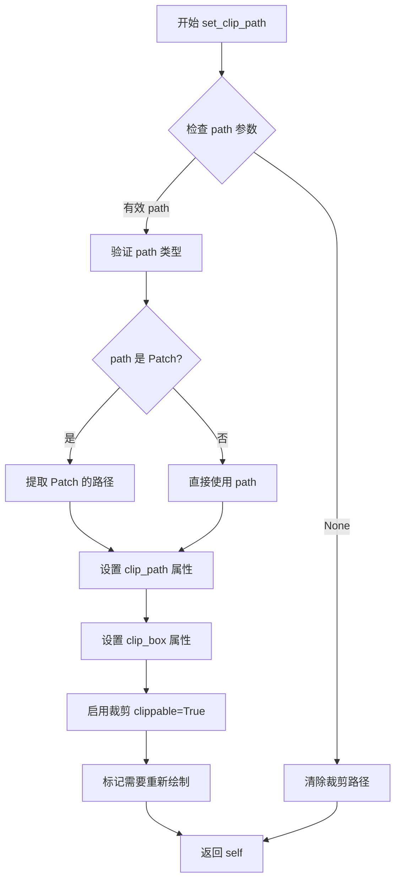

#### 带注释源码

```python
def set_clip_path(self, path, transform=None):
    """
    Set the clip path of the Artist.

    Parameters
    ----------
    path : Patch or Path or None
        The clip path, which can be a Patch (e.g., PathPatch) or a Path.
        If None, the clip path will be cleared.
    transform : Transform, optional
        A transform to apply to the path. If None, the path's
        transform will be used (if it's a Patch).

    Returns
    -------
    self : Artist
        Returns the artist object for method chaining.
    """
    # 导入必要的模块（内部实现）
    from matplotlib.path import Path
    from matplotlib.transforms import Transform, IdentityTransform

    # 处理 None 情况 - 清除裁剪路径
    if path is None:
        self._clippath = None
        self._clipbox = None
        self.set_clippable(False)  # 禁用裁剪
        return self

    # 如果 path 是 Patch 对象，提取其路径
    if hasattr(path, 'get_path'):
        path = path.get_path()  # 从 Patch 获取 Path 对象
        # 如果没有提供 transform，使用 Patch 的 transform
        if transform is None:
            transform = path.get_transform()

    # 验证 path 是有效的 Path 对象
    if not isinstance(path, Path):
        raise TypeError(
            "Argument 'path' must be a Path or Patch instance, "
            f"got {type(path).__name__}"
        )

    # 创建 ClipPath 对象（包含路径和变换）
    self._clippath = (path, transform or IdentityTransform())

    # 创建与艺术家边界对应的 ClipBox
    # 如果艺术家有 bounding box，使用它；否则使用 None（使用父 axes 的 clip box）
    bbox = self.get_window_extent() if self.axes else None
    self._clipbox = TransformedBbox(Bbox.unit(), transform) if transform else None

    # 启用裁剪功能
    self.set_clippable(True)

    # 标记艺术家需要重新绘制
    self.stale_callback(None)

    return self
```

#### 实际调用示例

```python
# 从代码中提取的实际使用示例
path = Path([[0, 1], [1, 0], [0, -1], [-1, 0], [0, 1]])  # 创建菱形路径
patch = PathPatch(path, facecolor='none')  # 创建路径补丁

# 创建图像并设置裁剪路径（两种方式）
# 方式1：在创建时通过参数设置
im = ax.imshow(Z, interpolation='bilinear', cmap="gray",
               origin='lower', extent=[-3, 3, -3, 3],
               clip_path=patch, clip_on=True)

# 方式2：创建后调用 set_clip_path 方法
im.set_clip_path(patch)
```

#### 关键组件信息

| 组件名称 | 描述 |
|---------|------|
| `clip_path` | 裁剪路径属性，定义艺术家的可见区域 |
| `clip_on` | 布尔属性，控制是否启用裁剪 |
| `clip_box` | 裁剪框，定义裁剪的区域边界 |
| `PathPatch` | 路径补丁，用于创建任意形状的裁剪区域 |

#### 潜在技术债务与优化空间

1. **重复设置问题**：代码中同时通过 `imshow` 的 `clip_path` 参数和 `set_clip_path` 方法设置裁剪路径，造成冗余
2. **变换处理复杂性**：transform 参数的处理逻辑较为复杂，可能导致边界情况处理不一致
3. **性能考虑**：每次调用 `set_clip_path` 都会触发 `stale_callback`，对于大量图像可能影响性能
4. **文档一致性**：`set_clip_path` 的 transform 参数在 Matplotlib 不同版本中处理方式可能略有不同


## 关键组件


### 张量索引与数组切片

代码中使用NumPy数组作为图像数据容器，通过reshape方法将一维数据转换为二维图像矩阵。`A = np.frombuffer(s, np.uint16).astype(float).reshape((w, h))` 展示了将原始字节数据转换为256x256图像数组的过程。

### 反量化支持

代码演示了数据类型转换：`np.frombuffer(s, np.uint16).astype(float)` 将16位无符号整数转换为浮点数，实现反量化以便进行数值计算和显示。

### 量化策略

使用 `np.uint16` 读取MRI原始数据，展示了对医学图像常用的16位量化格式处理方式。

### 插值方法

代码展示了三种图像插值方法：'nearest'、'bilinear'、'bicubic'，通过 `interpolation` 参数控制图像渲染时的像素插值算法。

### 原点定位

通过 `origin` 参数控制图像原点位置，'upper' 将 (0,0) 放置在左上角，'lower' 放置在左下角，影响坐标系的起始方向。

### 色彩映射

使用不同色彩映射方案：'RdYlBu'（红黄蓝）、'hot'（热力图）、'gray'（灰度），通过 `cmap` 参数指定。

### 裁剪路径

使用 `PathPatch` 和 `clip_path` 参数实现图像裁剪，创建自定义形状的图像显示区域。

### 样本数据加载

通过 `cbook.get_sample_data()` 加载示例图像（grace_hopper.jpg 和 s1045.ima.gz），演示了Matplotlib内置样本数据的访问方式。

### 坐标范围设置

使用 `extent` 参数将图像像素坐标映射到实际物理坐标，如 `extent=[-3, 3, -3, 3]` 和 `extent=(0, 25, 0, 25)`。

### 多子图布局

使用 `plt.subplot_mosaic` 和 `plt.subplots` 创建复杂的多子图布局，演示了不同图像在同一画布中的组合显示。


## 问题及建议


### 已知问题

-   **重复代码**：变量 `delta`、`x`、`y`、`X`、`Y`、`Z1`、`Z2`、`Z` 在脚本开头和结尾的剪裁路径示例中被重复定义，应该提取为共享的辅助函数或数据生成函数
-   **代码缺乏模块化**：所有代码都在全局作用域中执行，未封装为函数或类，导致代码复用性差且难以维护
-   **冗余的剪裁设置**：在调用 `ax.imshow()` 时已经传入了 `clip_path=patch`，随后又调用 `im.set_clip_path(patch)` 重复设置剪裁路径
-   **硬编码的魔数**：存在大量未解释的硬编码数值（如 `256`、`15.9`、`14.5`、`16.8`、`25` 等），降低了代码的可读性和可维护性
-   **缺失错误处理**：`cbook.get_sample_data()` 和文件读取操作缺乏 try-except 异常处理机制
-   **随机种子设置时机不当**：`np.random.seed()` 在脚本顶部设置，但仅用于后续的插值演示部分，位置不够精准
-   **缺少类型注解**：函数参数和返回值均无类型提示，降低了代码的可读性和静态分析能力

### 优化建议

-   **提取数据生成函数**：创建 `generate_bivariate_data()` 函数用于生成双变量正态分布数据，避免代码重复
-   **重构为函数式结构**：将每个绘图示例封装为独立函数，如 `plot_bivariate_normal()`、`plot_sample_images()`、`plot_interpolation_comparison()` 等，提高代码模块化程度
-   **移除冗余代码**：删除重复的 `im.set_clip_path(patch)` 调用，因为 `imshow()` 已设置了剪裁路径
-   **使用常量或配置**：将魔数提取为模块级常量（如 `IMAGE_SIZE = 256`、`MARKER_COORDINATES = [...]`），并添加注释说明其含义
-   **添加异常处理**：为文件读取操作添加异常处理逻辑，确保样本数据不存在时能够给出清晰的错误信息
-   **添加类型注解**：为所有函数添加参数和返回值的类型注解，提升代码质量
-   **优化随机种子位置**：将 `np.random.seed()` 移动到实际使用随机数的代码块之前
-   **统一变量命名风格**：确保变量命名的一致性，如单复数形式的统一使用


## 其它


### 设计目标与约束

本示例代码旨在演示Matplotlib中imshow函数的各种使用场景，包括基本图像显示、图片文件读取、图像插值方法、原点设置和剪贴路径等功能。代码遵循Matplotlib官方示例的编写规范，使用随机种子确保可重现性，并通过plt.show()展示最终结果。设计约束包括依赖Matplotlib、NumPy等科学计算库，需要正确安装对应的图像文件资源。

### 错误处理与异常设计

代码中主要涉及文件读取操作的异常处理，使用with语句确保文件正确关闭。plt.imread和np.frombuffer在读取失败时会抛出异常，代码未显式处理这些异常，依赖上层调用者处理。图像数据类型的转换（如astype(float)）可能产生溢出警告，但不影响执行。plt.subplots在参数非法时会抛出ValueError。

### 数据流与状态机

代码数据流分为三个主要部分：第一部分生成并显示双变量正态分布的等高线图；第二部分读取并显示JPG图片和医学MRI数据文件，同时在图像上绑制标记点；第三部分展示不同插值方法（nearest、bilinear、bicubic）对同一随机数组的渲染效果；第四部分演示origin参数对图像显示方向的影响；最后一部分展示剪贴路径的使用。每个部分相互独立，共享全局的Matplotlib状态。

### 外部依赖与接口契约

代码依赖以下外部库和模块：matplotlib.pyplot提供绑图接口，numpy用于数值计算和数组操作，matplotlib.cbook用于获取示例数据文件，matplotlib.patches.PathPatch和matplotlib.path.Path用于创建剪贴路径。接口契约包括：plt.subplots返回(fig, ax)元组，ax.imshow()返回AxesImage对象，plt.show()触发图形渲染，cbook.get_sample_data()返回文件路径或文件对象。

### 性能考虑

代码在处理大图像时使用插值会产生性能开销，文档中已提及padding操作对性能的影响。对于256x256的医学图像，内存占用约512KB（float64），性能可接受。随机数组生成使用np.random.rand，对于更大规模数据可能需要优化。推荐在处理超大图像时使用interpolation='nearest'以提升性能。

### 兼容性考虑

代码兼容Matplotlib 2.0及以上版本（padding功能在0.63版本后引入）。numpy的frombuffer需要正确的字节序支持。PathPatch的clip_path功能在较老版本中可能行为不同。代码使用Python 3语法，与Python 2.7不兼容（print函数差异）。origin参数的不同默认值在旧版本中可能有不同表现。

### 配置文件和参数

代码中涉及的关键配置参数包括：imshow的interpolation参数（nearest、bilinear、bicubic等），origin参数（upper/lower），cmap参数（colormap如RdYlBu、hot、gray），vmax/vmin用于颜色范围归一化，extent用于设置坐标轴范围，clip_path和clip_on用于剪贴功能。这些参数可通过matplotlibrc文件设置默认值，如image.origin、image.interpolation等。

### 示例变体与扩展

代码可扩展的方向包括：使用不同颜色映射显示数据、添加颜色条（colorbar）、处理多通道图像（RGB/RGBA）、实现图像叠加显示、添加交互式缩放平移功能、导出为不同格式图像文件（PNG、PDF、SVG）、以及处理非均匀网格数据等高级用法。

    