# `matplotlib\galleries\examples\images_contours_and_fields\image_masked.py` 详细设计文档

这是一个matplotlib示例代码，展示了如何使用imshow函数显示带有掩码值的图像数据，并演示了两种不同的颜色归一化方式（Normalize和BoundaryNorm）来处理超出范围的值和掩码值，同时通过colormap的极端值设置来可视化低值、高值和被掩码的区域。

## 整体流程

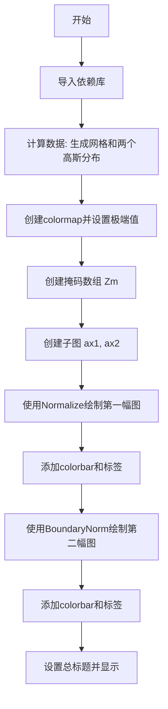

## 类结构

```
无类定义
该文件为脚本文件，未定义任何类
```

## 全局变量及字段


### `x0`
    
x轴起始坐标(-5)

类型：`float`
    


### `x1`
    
x轴结束坐标(5)

类型：`float`
    


### `y0`
    
y轴起始坐标(-3)

类型：`float`
    


### `y1`
    
y轴结束坐标(3)

类型：`float`
    


### `x`
    
x轴坐标数组

类型：`numpy.ndarray`
    


### `y`
    
y轴坐标数组

类型：`numpy.ndarray`
    


### `X`
    
meshgrid生成的X坐标网格

类型：`numpy.ndarray`
    


### `Y`
    
meshgrid生成的Y坐标网格

类型：`numpy.ndarray`
    


### `Z1`
    
第一个高斯分布数据

类型：`numpy.ndarray`
    


### `Z2`
    
第二个高斯分布数据

类型：`numpy.ndarray`
    


### `Z`
    
组合后的数据(Z1-Z2)*2

类型：`numpy.ndarray`
    


### `palette`
    
颜色映射对象

类型：`matplotlib.colors.Colormap`
    


### `Zm`
    
带掩码的数组

类型：`numpy.ma.masked_array`
    


### `fig`
    
图形对象

类型：`matplotlib.figure.Figure`
    


### `ax1`
    
第一个子图Axes对象

类型：`matplotlib.axes.Axes`
    


### `ax2`
    
第二个子图Axes对象

类型：`matplotlib.axes.Axes`
    


### `im`
    
图像对象

类型：`matplotlib.image.AxesImage`
    


### `cbar`
    
颜色条对象

类型：`matplotlib.colorbar.Colorbar`
    


    

## 全局函数及方法


### `np.linspace`

`np.linspace` 是 NumPy 库中的一个函数，用于生成指定范围内等间距的数值数组。该函数在数值计算、数据可视化等领域广泛应用，特别是在需要创建均匀分布的坐标轴或采样点时非常有用。

参数：

- `start`：`array_like`，序列的起始值
- `stop`：`array_like`，序列的结束值。当 `endpoint` 为 `True` 时，包含该值
- `num`：`int`，要生成的样本数量，默认为 `50`，必须为非负数
- `endpoint`：`bool`，如果为 `True`，则包含结束值；否则不包含，默认为 `True`
- `retstep`：`bool`，如果为 `True`，则返回步长；否则返回样本数组，默认为 `False`
- `dtype`：`dtype`，输出数组的数据类型。如果未指定，则从输入参数推断
- `axis`：`int`，仅当 `start` 和 `stop` 是数组_like 时使用，指定结果数组中坐标轴的索引

返回值：根据 `retstep` 参数：
- 当 `retstep=False`（默认）：返回 `ndarray`，包含 `num` 个等间距的样本
- 当 `retstep=True`：返回 `(ndarray, step)` 元组，其中 `step` 是样本之间的步长

#### 流程图

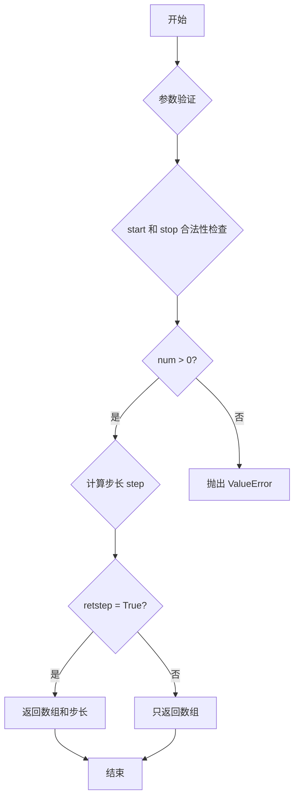

#### 带注释源码

```python
# np.linspace 函数的核心实现逻辑
def linspace(start, stop, num=50, endpoint=True, retstep=False, dtype=None, axis=0):
    """
    生成等间距的数组
    
    参数:
        start: 序列起始值
        stop: 序列结束值
        num: 样本数量（默认50）
        endpoint: 是否包含结束值（默认True）
        retstep: 是否返回步长（默认False）
        dtype: 输出数据类型
        axis: 坐标轴索引
    
    返回:
        等间距的数组，或(数组, 步长)元组
    """
    
    # 将输入转换为 ndarray（如果还不是）
    # 确保 start 和 stop 是数组形式，便于后续计算
    _domain = [start, stop]
    
    # 步长计算逻辑
    # 如果 num = 0，返回空数组
    # 如果 endpoint = True，步长 = (stop - start) / (num - 1)
    # 如果 endpoint = False，步长 = (stop - start) / num
    step = (stop - start) / (num - 1) if endpoint else (stop - start) / num
    
    # 生成数组
    # 使用 start + step * i (i from 0 to num-1) 生成等间距点
    y = start + step * np.arange(num)
    
    # 处理 endpoint=False 的情况
    # 如果不包含结束点，需要调整数组确保不包含 stop
    if not endpoint:
        y = y[:-1]  # 移除最后一个元素
    
    return y
```

#### 代码中的实际使用示例

```python
# 在示例代码中，np.linspace 的使用方式：
x0, x1 = -5, 5
y0, y1 = -3, 3

# 生成从 -5 到 5 的 500 个等间距点
x = np.linspace(x0, x1, 500)

# 生成从 -3 到 3 的 500 个等间距点
y = np.linspace(y0, y1, 500)

# 后续用于创建网格坐标
X, Y = np.meshgrid(x, y)
```

### 其他项目

**设计目标与约束**：
- `np.linspace` 的主要设计目标是生成数值精度均匀的采样点
- 浮点数精度可能在大范围数值计算时引入累积误差

**错误处理**：
- 当 `num` 为负数时抛出 `ValueError`
- 当 `num` 为 0 时返回空数组
- `start` 和 `stop` 必须可转换为数值类型

**数据流**：
- 输入：起始值、结束值、样本数量
- 输出：等间距的 numpy 数组

**外部依赖**：
- 依赖 NumPy 库的核心功能

**优化空间**：
- 对于极大 num 值的场景，可考虑使用生成器模式减少内存占用
- 可增加对复数范围的支持


### `np.meshgrid`

生成坐标网格矩阵，用于在二维或三维空间中创建坐标网格。该函数接受一个或多个一维数组作为坐标向量，输出对应的二维或三维坐标矩阵，便于对网格上的点进行向量化计算。

参数：

- `x`：`array_like`，一维数组，表示网格第一维的坐标向量
- `y`：`array_like`，一维数组，表示网格第二维的坐标向量

返回值：

- `X`：`ndarray`，二维数组，表示网格上所有点的第一维坐标（x坐标），形状为 (len(y), len(x))
- `Y`：`ndarray`，二维数组，表示网格上所有点的第二维坐标（y坐标），形状为 (len(y), len(x))

#### 流程图

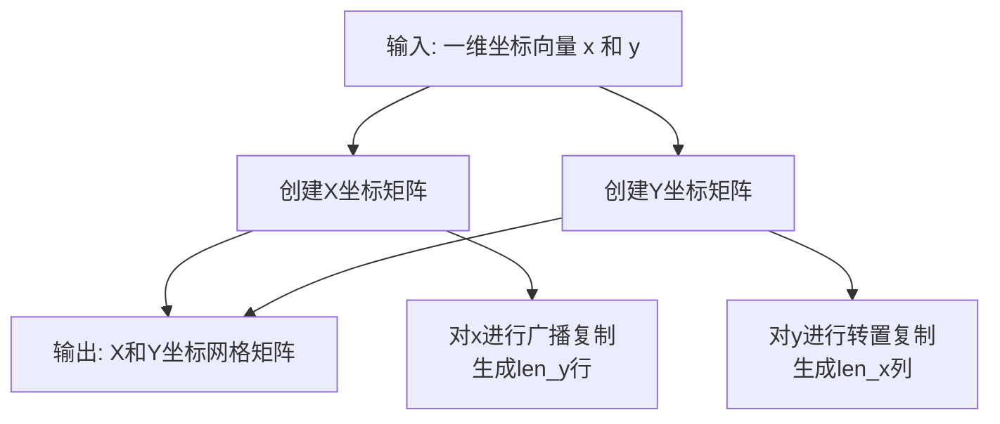

#### 带注释源码

```python
# 在给定代码中的实际使用方式:
x = np.linspace(x0, x1, 500)  # 生成从-5到5的500个等间距点的一维数组
y = np.linspace(y0, y1, 500)  # 生成从-3到3的500个等间距点的一维数组

# 调用meshgrid生成二维坐标网格
# X: 形状为 (500, 500)，每行是相同的x坐标序列
# Y: 形状为 (500, 500)，每列是相同的y坐标序列
X, Y = np.meshgrid(x, y)

# 用途: 结合Z1和Z2的计算，创建二维高斯函数
Z1 = np.exp(-X**2 - Y**2)      # 以(0,0)为中心的高斯分布
Z2 = np.exp(-(X - 1)**2 - (Y - 1)**2)  # 以(1,1)为中心的高斯分布
Z = (Z1 - Z2) * 2              # 组合两个高斯函数得到最终数据
```


### `np.exp`

计算输入数组或数值的指数函数（e 的 x 次方），其中 e 是自然对数的底数（约等于 2.71828）。

参数：

-  `x`：`array_like`，输入值，可以是标量、列表或 NumPy 数组，计算 e 的 x 次方

返回值：`ndarray 或 scalar`，返回输入值的指数函数结果，类型与输入相同

#### 流程图

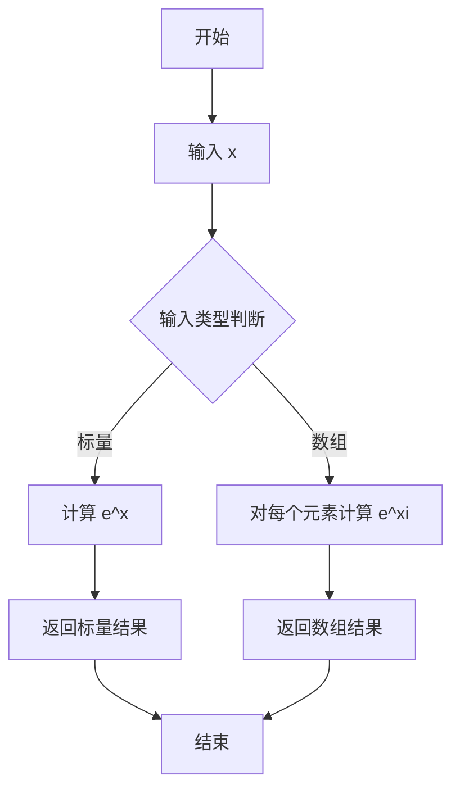

#### 带注释源码

```python
# 第一次使用：计算二维高斯分布的中心部分
# X, Y 是 meshgrid 生成的二维网格坐标
# 计算 -X**2 - Y**2，即 -(X² + Y²)
Z1 = np.exp(-X**2 - Y**2)
# 结果：创建一个以 (0,0) 为中心的高斯分布二维数组
# 值为 e^(-(x²+y²))，范围 [0, 1]

# 第二次使用：计算偏移后的二维高斯分布
# (X-1) 和 (Y-1) 将中心从 (0,0) 移动到 (1,1)
Z2 = np.exp(-(X - 1)**2 - (Y - 1)**2)
# 结果：创建一个以 (1,1) 为中心的高斯分布二维数组
# 值为 e^(-((x-1)²+(y-1)²))

# Z 是两个高斯分布的差值乘以 2
Z = (Z1 - Z2) * 2
# 这个 Z 值被用于后续的 imshow 绑图显示
```


### `np.ma.masked_where`

创建掩码数组（Masked Array），根据条件将数组中满足条件的元素标记为掩码（无效值），常用于图像处理中隐藏不需要显示的区域（如超出阈值的像素）。

参数：

- `condition`：布尔数组或可转换为布尔数组的对象，条件表达式，用于确定哪些位置的值需要被掩码（这里是 `Z > 1.2`）
- `a`：`ndarray`，需要掩码的输入数组（这里是 `Z`）

返回值：`MaskedArray`，返回一个新的掩码数组，其中满足条件的元素被标记为掩码，其他元素保持原始值

#### 流程图

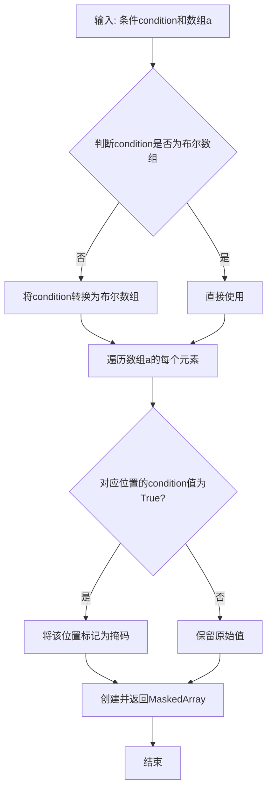

#### 带注释源码

```python
# Z 是一个二维numpy数组，包含基于高斯函数计算的值
Z1 = np.exp(-X**2 - Y**2)
Z2 = np.exp(-(X - 1)**2 - (Y - 1)**2)
Z = (Z1 - Z2) * 2

# 使用 np.ma.masked_where 创建掩码数组
# 语法: np.ma.masked_where(condition, a)
#   - condition: Z > 1.2 创建布尔数组，标记Z中大于1.2的位置
#   - a: Z 是原始数据数组
# 结果: Zm 是一个MaskedArray，Z中大于1.2的元素被标记为无效（掩码）
Zm = np.ma.masked_where(Z > 1.2, Z)

# 后续用途：
# 在imshow绘制时，掩码区域会使用colormap的'bad'颜色（蓝色）显示
# 通过 palette = plt.colormaps["gray"].with_extremes(over='r', under='g', bad='b') 设置
im = ax1.imshow(Zm, interpolation='bilinear',
                cmap=palette,
                norm=colors.Normalize(vmin=-1.0, vmax=1.0),
                aspect='auto',
                origin='lower',
                extent=[x0, x1, y0, y1])
```


### `plt.colormaps`

获取matplotlib中可用的颜色映射集合，返回一个可以按名称索引获取Colormap对象的映射容器。

参数：

- `name`：`str`，颜色映射的名称（如"gray"、"viridis"等），用于从colormaps集合中获取对应的颜色映射对象

返回值：`matplotlib.colors.Colormap`，返回指定名称的颜色映射对象

#### 流程图

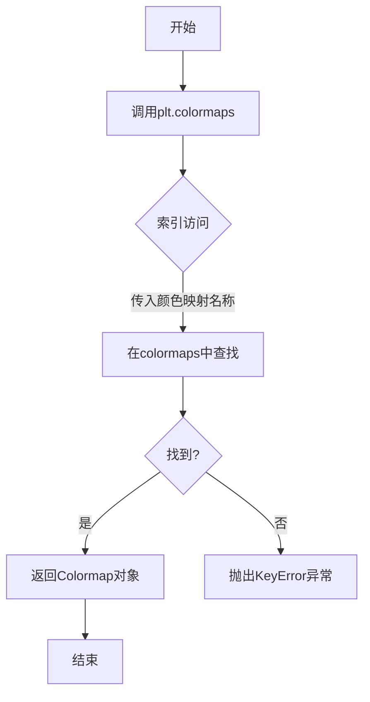

#### 带注释源码

```python
# plt.colormaps 是 matplotlib.pyplot 模块中的一个属性
# 它返回一个 ColormapRegistry 对象，该对象是一个类似字典的容器
# 可以通过颜色映射名称字符串来获取对应的 Colormap 对象

# 代码中的使用示例：
palette = plt.colormaps["gray"]  # 获取名为'gray'的灰度颜色映射
# 等价于旧版本的 plt.cm.get_cmap("gray")

# plt.colormaps 对象支持以下操作：
# 1. 按名称索引获取：plt.colormaps["gray"]
# 2. 迭代所有可用名称：for name in plt.colormaps
# 3. 检查是否包含："gray" in plt.colormaps
# 4. 获取注册的颜色映射数量：len(plt.colormaps)
```

---

### `Colormap.with_extremes`

为颜色映射设置超出正常范围值和无效值的显示颜色，返回一个新的配置后的颜色映射对象。

参数：

- `over`：`str` 或 `tuple`，可选，用于显示超出vmax范围的数据点的颜色，默认为None（使用颜色映射的末端颜色）
- `under`：`str` 或 `tuple`，可选，用于显示低于vmin范围的数据点的颜色，默认为None（使用颜色映射的起始颜色）
- `bad`：`str` 或 `tuple`，可选，用于显示无效值（NaN、Inf等）的颜色，默认为None

返回值：`matplotlib.colors.Colormap`，返回一个新的Colormap对象，配置了极端值颜色，原对象保持不变

#### 流程图

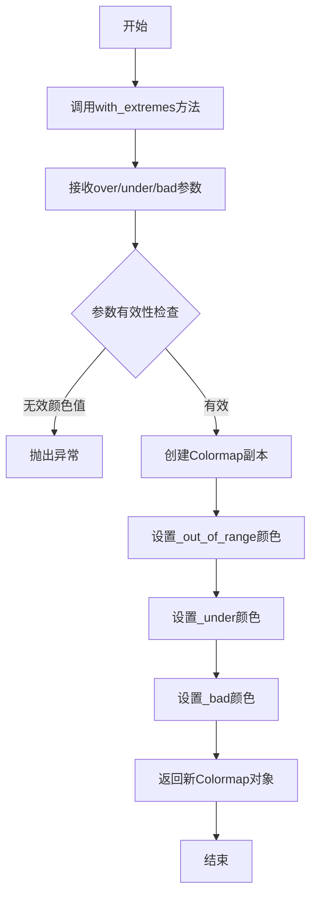

#### 带注释源码

```python
# with_extremes 方法是 Colormap 类的方法
# 用于配置颜色映射在处理超出范围数据时的显示颜色

# 方法签名（简化版）：
# def with_extremes(self, over=None, under=None, bad=None):

# 代码中的使用示例：
palette = plt.colormaps["gray"].with_extremes(over='r', under='g', bad='b')

# 参数说明：
# - over='r': 超出vmax的数据点显示为红色
# - under='g': 低于vmin的数据点显示为绿色
# - bad='b': 无效值（NaN）显示为蓝色

# 工作原理：
# 1. 该方法创建一个新的Colormap副本，保留原始颜色映射的所有属性
# 2. 设置新对象的 _rgba_bad（无效值颜色）
# 3. 设置新对象的 _rgba_under（低于范围颜色）
# 4. 设置新对象的 _rgba_over（超出范围颜色）
# 5. 返回配置后的新Colormap对象

# 底层实现逻辑（伪代码）：
# class Colormap:
#     def with_extremes(self, over=None, under=None, bad=None):
#         # 创建副本
#         new_cmap = copy.copy(self)
#         
#         # 设置无效值颜色
#         if bad is not None:
#             new_cmap.set_bad(bad)
#         
#         # 设置低于范围颜色
#         if under is not None:
#             new_cmap.set_under(under)
#         
#         # 设置超出范围颜色
#         if over is not None:
#             new_cmap.set_over(over)
#         
#         return new_cmap

# 使用场景：
# - 在imshow中显示masked数组时，bad区域显示特殊颜色
# - 使用Normalize设置vmin/vmax时，超出范围的数据显示特殊颜色
# - 数据可视化中突出显示异常值
```


### `plt.subplots`

`plt.subplots` 是 matplotlib.pyplot 模块中的函数，用于创建一个新的图形窗口和一个或多个子图axes对象，并返回它们以便后续操作。

参数：

- `nrows`：`int`，默认值：1，子图网格的行数
- `ncols`：`int`，默认值：1，子图网格的列数
- `sharex`：`bool` 或 `{'none', 'all', 'row', 'col'}`，默认值：False，是否共享x轴
- `sharey`：`bool` 或 `{'none', 'all', 'row', 'col'}`，默认值：False，是否共享y轴
- `squeeze`：`bool`，默认值：True，是否压缩返回的axes数组维度
- `width_ratios`：`array-like`，可选，列的宽度比例
- `height_ratios`：`array-like`，可选，行的高度比例
- `gridspec_kw`：`dict`，可选，传递给GridSpec的关键字参数
- `**fig_kw`：关键字参数，传递给 `figure()` 函数

返回值：`tuple`，返回 (Figure, axes) 元组。当 `squeeze=False` 时，axes 是一个 numpy 数组；当 `squeeze=True` 时，如果只创建一个子图则返回单个Axes对象，否则返回一维数组。

#### 流程图

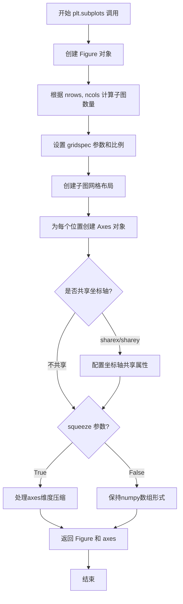

#### 带注释源码

```python
# plt.subplots 函数使用示例 (基于代码中的实际调用)
# 创建2行1列的子图布局，返回fig对象和axes数组

fig, (ax1, ax2) = plt.subplots(
    nrows=2,        # 2行子图
    figsize=(6, 5.4)  # 图形尺寸：宽6英寸，高5.4英寸
)

# 上述调用的内部逻辑等价于：
# 1. 调用 plt.figure(figsize=(6, 5.4)) 创建 Figure 对象
# 2. 使用 GridSpec 创建 2x1 的网格布局
# 3. 在每个网格位置创建 Axes 对象
# 4. 将两个 Axes 对象打包成元组返回

# 由于使用了元组解包 (ax1, ax2)：
# - fig 是 Figure 对象
# - ax1 是第一个子图（上方）
# - ax2 是第二个子图（下方）

# 后续可直接对 ax1, ax2 进行操作：
# im = ax1.imshow(...)  # 在第一个子图绘制图像
# im = ax2.imshow(...)  # 在第二个子图绘制图像
```


### `ax1.imshow`

在matplotlib中，ax1.imshow是Axes对象的imshow方法，用于在Axes上绘制二维图像或数据数组，支持掩码数组处理颜色映射和归一化

参数：

- `X`：array-like，要显示的数据，支持二维数组或带掩码的数组（这里是Zm，是经过np.ma.masked_where处理后的掩码数组）
- `cmap`：str或Colormap，颜色映射表对象（这里是palette，包含自定义的over/under/bad颜色）
- `norm`：Normalize，可选的归一化对象，用于将数据值映射到颜色空间（这里是colors.Normalize(vmin=-1.0, vmax=1.0)）
- `aspect`：str或float，图像的纵横比控制（'auto'表示自动调整）
- `origin`：str，图像的原点位置（'lower'表示原点在下左角）
- `extent`：list，数据坐标范围[x0, x1, y0, y1]（这里是[-5, 5, -3, 3]）
- `interpolation`：str，插值方法（'bilinear'表示双线性插值）
- `interpolation_stage`：str，可选的插值阶段控制
- `data`：可选的DataContainer参数
- `alpha`：float或array，可选的透明度

返回值：`matplotlib.image.AxesImage`，返回的AxesImage对象可用于后续添加颜色条等操作

#### 流程图

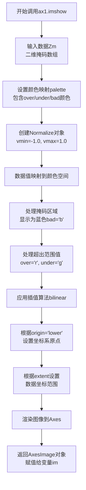

#### 带注释源码

```python
# 在Axes对象ax1上调用imshow方法绘制图像
im = ax1.imshow(
    Zm,                          # 输入数据：二维掩码数组（Z > 1.2的位置被掩码）
    interpolation='bilinear',   # 插值方法：双线性插值，使图像更平滑
    cmap=palette,               # 颜色映射：使用gray colormap并设置极值颜色
                                # over='r' 表示超出vmax的值显示为红色
                                # under='g' 表示低于vmin的值显示为绿色
                                # bad='b' 表示掩码区域显示为蓝色
    norm=colors.Normalize(      # 归一化：将数据值映射到[0,1]颜色范围
        vmin=-1.0,              # 数据最小值对应颜色映射下界
        vmax=1.0                # 数据最大值对应颜色映射上界
    ),
    aspect='auto',              # 纵横比：自动调整以适应 Axes 大小
    origin='lower',             # 原点位置：图像原点在下左角（y轴向上为正）
    extent=[x0, x1, y0, y1]     # 数据范围：x从-5到5，y从-3到3
)

# 返回的im是AxesImage对象
# 后续用于：
# 1. 创建颜色条 fig.colorbar(im, ...)
# 2. 获取或修改图像属性
```


### `ax2.imshow`

绘制第二子图的图像，使用 `BoundaryNorm` 实现分段填充效果，处理掩码值和超出范围的颜色

参数：

- `X`：`numpy.ndarray`（被掩码的数组），需要绑定的数据数组，支持掩码数组（MaskedArray）以处理无效值
- `cmap`：`matplotlib.colors.Colormap`，颜色映射对象，定义数据值到颜色的映射方式
- `norm`：`matplotlib.colors.Normalize`，规范化对象，将数据值映射到 [0, 1] 区间，此处使用 BoundaryNorm 实现分段映射
- `interpolation`：`str`，插值方法，此处为 `'nearest'` 表示最近邻插值，不进行平滑
- `aspect`：`str` 或 `float`，宽高比控制，`'auto'` 表示自动调整以适应数据
- `origin`：`str`，图像原点位置，`'lower'` 表示原点位于左下角
- `extent`：`list[float]`，数据坐标范围，格式为 `[xmin, xmax, ymin, ymax]`，此处为 `[-5, 5, -3, 3]`

返回值：`matplotlib.image.AxesImage`，返回绑定的图像对象，可用于添加颜色条或进一步操作

#### 流程图

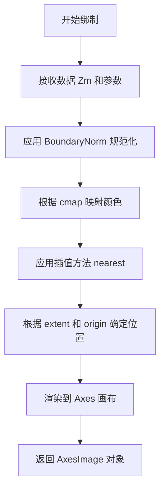

#### 带注释源码

```python
# 绘制第二子图，使用 BoundaryNorm 实现分段颜色效果
im = ax2.imshow(
    Zm,                          # 输入数据：掩码数组，超出阈值的点被标记为掩码
    interpolation='nearest',    # 插值方式：最近邻，不进行平滑处理
    cmap=palette,               # 颜色映射：灰度色阶，配置了 over/under/bad 颜色
    norm=colors.BoundaryNorm(   # 规范化：分段线性映射
        [-1, -0.5, -0.2, 0, 0.2, 0.5, 1],  # 边界值：定义7个区间
        ncolors=palette.N       # 颜色数量：使用调色板的所有颜色数
    ),
    aspect='auto',              # 宽高比：自动适应Axes尺寸
    origin='lower',            # 原点：左下角为原点
    extent=[x0, x1, y0, y1]    # 坐标范围：x[-5,5], y[-3,3]
)
```


### `Figure.colorbar`

向图形添加颜色条（Colorbar），用于显示图像或伪彩色图的数值映射关系。颜色条通常与 `imshow`、`pcolormesh` 等绘图函数配合使用，展示数值与颜色的对应关系。

参数：

- `mappable`：要为其添加颜色条的映射对象（如 `AxesImage`、`QuadMesh`、`ContourImage` 等），通常是 `imshow()` 或 `pcolormesh()` 的返回值
- `ax`：`Axes`，可选参数，指定颜色条所在的 Axes 对象，默认为 `None` 时自动创建
- `extend`：`str`，可选参数，指定颜色条两端是否扩展以表示超出数据范围的区域，可选值包括 `'neither'`、`'both'`、`'min'`、`'max'`，默认为 `'neither'`
- `shrink`：`float`，可选参数，指定颜色条的收缩比例（0 到 1 之间的数值），用于调整颜色条的大小
- `spacing`：`str`，可选参数，指定刻度间距模式，可选值包括 `'uniform'`（均匀分布）和 `'proportional'`（与数据值成比例），默认为 `'uniform'`
- `orientation`：`str`，可选参数，指定颜色条方向，可选值包括 `'vertical'`（垂直）和 `'horizontal'`（水平），默认为 `'vertical'`
- `fraction`：颜色条在 Axes 中所占的空间比例
- `pad`：颜色条与主图之间的间距
- `aspect`：颜色条的宽高比

返回值：`matplotlib.colorbar.Colorbar`，返回创建的 Colorbar 对象，用于进一步自定义颜色条（如设置标签、刻度等）

#### 流程图

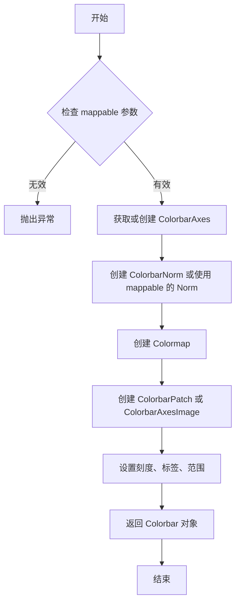

#### 带注释源码

```python
# 在代码中的实际调用示例：

# 第一次调用：创建垂直颜色条
cbar = fig.colorbar(
    im,                      # mappable: AxesImage 对象，由 imshow 返回
    extend='both',           # 两端都扩展（显示超出范围的区域）
    shrink=0.9,              # 收缩为原来的 90%
    ax=ax1                   # 将颜色条添加到 ax1 所在的 Axes
)
cbar.set_label('uniform')   # 设置颜色条标签

# 第二次调用：创建带有比例刻度的颜色条
cbar = fig.colorbar(
    im,                      # mappable: AxesImage 对象
    extend='both',           # 两端扩展
    spacing='proportional', # 刻度与数据值成比例分布
    shrink=0.9,              # 收缩为原来的 90%
    ax=ax2                   # 将颜色条添加到 ax2
)
cbar.set_label('proportional')  # 设置颜色条标签
```


### `Axes.set_title`

设置第一子图（ax1）的标题，用于在axes对象上显示文本标题。

参数：

- `label`：`str`，要设置的标题文本内容
- `loc`：`str`（可选），标题对齐方式，可选值为'center'、'left'、'right'，默认值为'center'
- `pad`：`float`（可选），标题与axes顶部的偏移量（以磅为单位），默认根据rcParams设置
- `y`：`float`（可选），标题在axes中的y轴相对坐标（0-1之间），默认根据rcParams设置
- `**kwargs`：其他关键字参数，用于控制文本样式（如字体大小、颜色、字体粗细等）

返回值：`matplotlib.text.Text`，返回创建的标题文本对象，可用于后续修改标题样式

#### 流程图

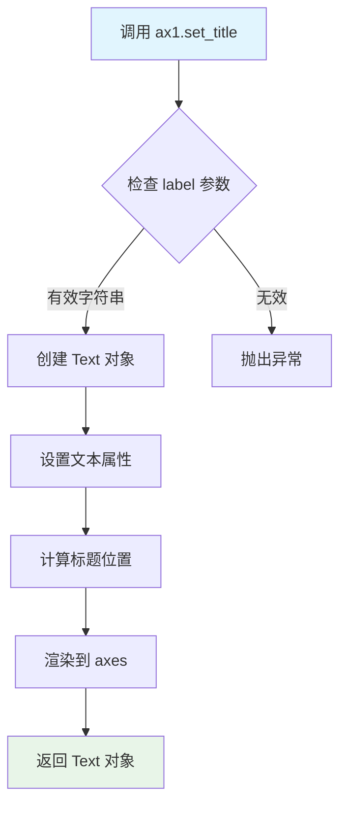

#### 带注释源码

```python
# 在代码中的实际调用
ax1.set_title('Green=low, Red=high, Blue=masked')

# 等效的完整调用形式（包含所有可选参数）
ax1.set_title(
    label='Green=low, Red=high, Blue=masked',  # 标题文本内容
    loc='center',    # 标题对齐方式：居中
    pad=6.0,         # 标题与axes顶部的偏移量（磅）
    y=None,          # y轴相对坐标（None表示使用默认值）
    fontsize=10,     # 可选：字体大小
    fontweight='normal',  # 可选：字体粗细
    color=None,      # 可选：文本颜色（None表示使用默认颜色）
)
```

**说明**：该方法属于matplotlib库的`Axes`类，在本代码中用于为第一个子图（ax1）设置标题"Green=low, Red=high, Blue=masked"，用于说明图中颜色所代表的含义——绿色表示低值，红色表示高值，蓝色表示被掩码（masked）的数据区域。


### `ax2.set_title`

设置第二子图的标题文本为 "With BoundaryNorm"，该方法是 matplotlib.axes.Axes 类用于设置子图标题的方法，返回一个 Text 对象，可用于进一步自定义标题样式。

参数：

- `label`：`str`，要显示的标题文本内容，此处为 `'With BoundaryNorm'`
- `loc`：`str`，可选，标题的水平对齐方式，默认为 `'center'`
- `pad`：`float`，可选，标题与 Axes 顶部的距离，默认为 `6.0`
- `fontdict`：可选，用于控制标题文本外观的字典
- `**kwargs`：可选，传递给 Text 对象的额外关键字参数（如 fontsize、fontweight、color 等）

返回值：`matplotlib.text.Text`，返回创建的标题 Text 对象，可以进一步设置其属性

#### 流程图

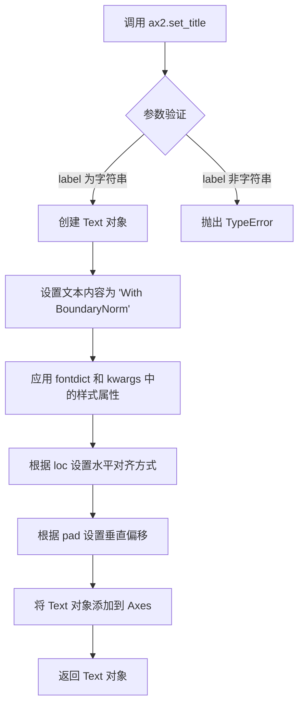

#### 带注释源码

```python
# 代码中的实际调用
ax2.set_title('With BoundaryNorm')

# 等效的完整调用形式（省略了使用默认值的参数）
ax2.set_title(
    label='With BoundaryNorm',  # 标题文本内容
    loc='center',               # 标题水平对齐方式（默认居中）
    pad=None,                  # 标题与轴顶部的距离（使用默认值）
    fontdict=None,             # 自定义字体字典（默认无）
    **kwargs                   # 其他文本属性（使用默认样式）
)
# 返回值示例：
# <matplotlib.text.Text object at 0x7f...>
# 可以通过返回值进一步自定义：
# title_obj = ax2.set_title('With BoundaryNorm')
# title_obj.set_fontsize(12)
# title_obj.set_fontweight('bold')
```


### `Colorbar.set_label`

设置颜色条（Colorbar）的标签文本，用于描述颜色条所表示的数据含义。

参数：

- `label`：`str`，要设置的标签文本内容（如 'uniform'、'proportional' 等）
- `fontsize`：`int` 或 `float`，可选，标签文本的字体大小
- `**kwargs`：其他关键字参数，将传递给底层的 `matplotlib.text.Text` 对象

返回值：`None`，该方法无返回值

#### 流程图

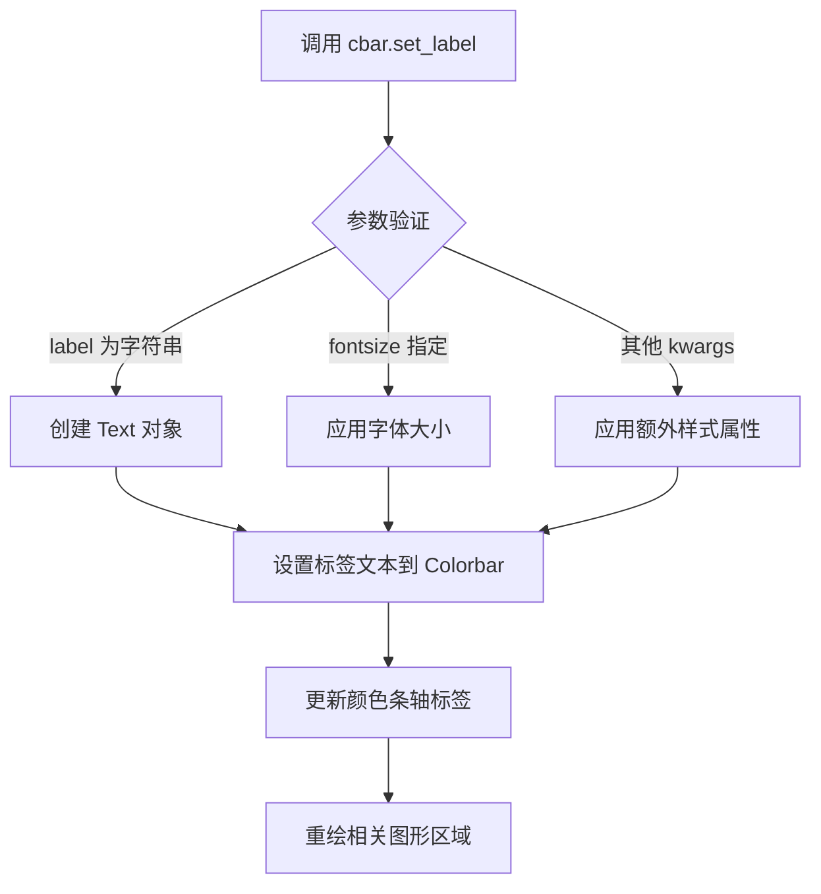

#### 带注释源码

```python
# 在代码中的使用示例：

# 第一个子图的颜色条设置
cbar = fig.colorbar(im, extend='both', shrink=0.9, ax=ax1)
# 设置颜色条标签为 'uniform'，表示使用均匀刻度
cbar.set_label('uniform')

# 第二个子图的颜色条设置
cbar = fig.colorbar(im, extend='both', spacing='proportional',
                    shrink=0.9, ax=ax2)
# 设置颜色条标签为 'proportional'，表示使用比例刻度
cbar.set_label('proportional')

# Colorbar.set_label 方法的典型实现逻辑（简化版）：
def set_label(self, label, fontsize=None, **kwargs):
    """
    Set the label on the colorbar.
    
    参数:
        label: str - 标签文本
        fontsize: int/float, optional - 字体大小
        **kwargs: 传递给 Text 对象的样式参数
    """
    # 获取颜色条的轴对象（通常是 colorbar.ax）
    self.ax.set_ylabel(label, fontsize=fontsize, **kwargs)
    # 或者在某些版本中使用 set_label 方法
    # self.ax.set_label(label, fontsize=fontsize, **kwargs)
    
    # 标记需要重绘
    self.ax.stale_callback = None  # 触发重绘回调
    return None
```

#### 详细说明

`cbar.set_label` 是 matplotlib 库中 `matplotlib.colorbar.Colorbar` 类的方法。在代码中的具体作用：

1. **第一个子图** (`ax1`)：使用 `colors.Normalize(vmin=-1.0, vmax=1.0)` 进行连续归一化，标签设置为 `'uniform'`，表示颜色条使用均匀分布的刻度。

2. **第二个子图** (`ax2`)：使用 `colors.BoundaryNorm` 进行边界归一化，标签设置为 `'proportional'`，表示颜色条使用与数据区间成比例的刻度。

该方法通常调用底层 Axes 对象的 `set_ylabel` 或 `set_label` 方法来设置标签，并支持通过 `fontsize` 参数调整字体大小，以及其他样式参数如颜色、对齐方式等。


### `matplotlib.axes.Axes.tick_params`

设置刻度参数，用于控制刻度标签、刻度线、刻度长度、刻度宽度等外观属性。

参数：

- `axis`：`str`，可选参数，指定应用参数的坐标轴，默认为 `'both'`，可选值包括 `'x'`、`'y'`、`'both'`
- `labelbottom`：`bool` 或 `str`，可选参数，控制是否显示刻度标签。`False` 隐藏标签，`True` 显示标签，也可设为 `'off'`、`'on'`
- `**kwargs`：其他可选关键字参数，用于设置刻度线的其他属性

返回值：`None`，该方法直接修改 Axes 对象，不返回任何值

#### 流程图

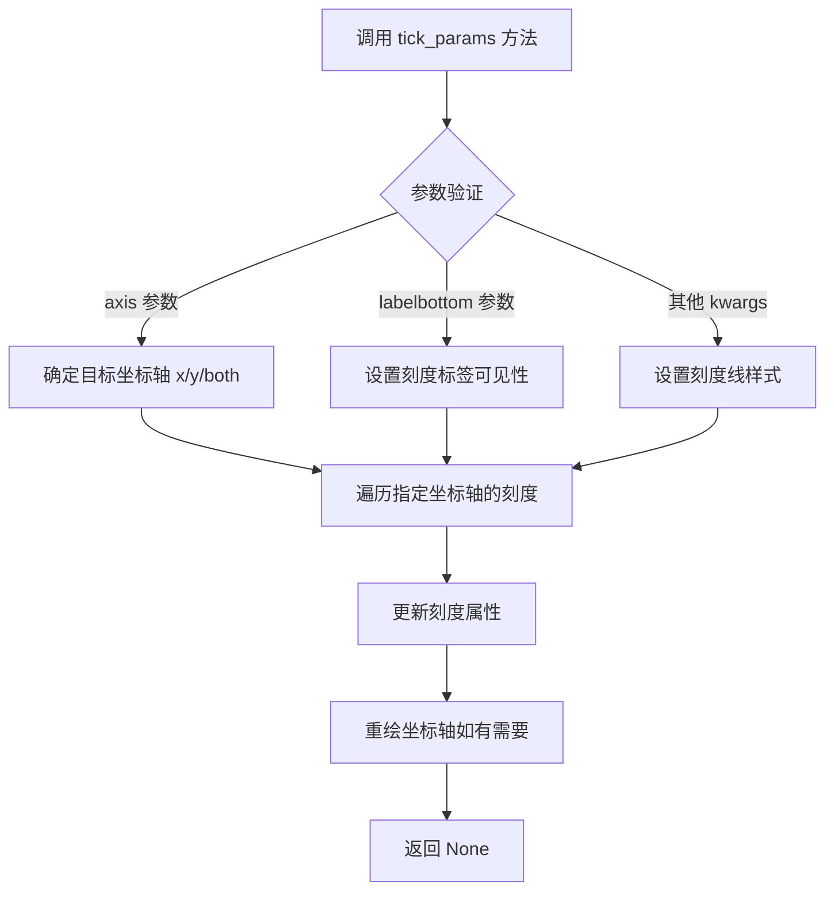

#### 带注释源码

```python
# 代码中的实际调用示例
ax1.tick_params(axis='x', labelbottom=False)

"""
参数说明：
- axis='x': 指定只对 x 轴进行操作
- labelbottom=False: 隐藏 x 轴的刻度标签（底部标签）

此调用实现的功能：
1. 选择 x 轴作为操作目标
2. 将 x 轴的 labelbottom 属性设置为 False
3. 效果：隐藏 x 轴的刻度标签，但保留刻度线

tick_params 的完整参数体系（部分）：
- axis: {'x', 'y', 'both'} - 选择坐标轴
- reset: bool - 是否重置为默认参数
- direction: {'in', 'out', 'inout'} - 刻度方向
- length: float - 刻度长度（磅）
- width: float - 刻度宽度（磅）
- pad: float - 标签与刻度之间的间距
- labelsize: float - 标签字体大小
- labelcolor: color - 标签颜色
- color: color - 刻度颜色
- which: {'major', 'minor', 'both'} - 选择主刻度/副刻度/两者
"""
```


### Figure.suptitle

为 matplotlib 的 Figure 对象设置一个居中的总标题，通常显示在图形的顶部中央位置。

参数：

- `s`：`str`，标题文本内容
- `*args`：可选，位置参数列表，传递给底层 `matplotlib.text.Text` 对象，用于指定字体大小、样式等
- `**kwargs`：可选，关键字参数，传递给底层 `matplotlib.text.Text` 对象，常见参数包括 `fontsize`（字体大小）、`fontweight`（字体粗细）、`color`（颜色）、`ha`（水平对齐方式）、`va`（垂直对齐方式）等

返回值：`matplotlib.text.Text`，返回创建的 Text 文本对象，可用于后续修改标题样式（如颜色、字体等）

#### 流程图

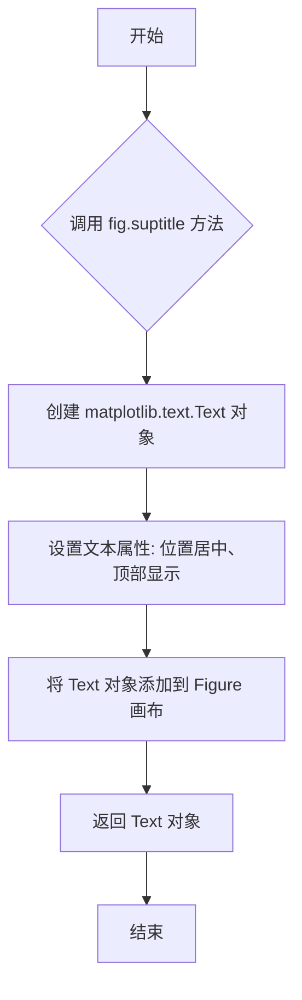

#### 带注释源码

```python
# 代码中调用方式
fig.suptitle('imshow, with out-of-range and masked data')

# 详细说明：
# fig: matplotlib.figure.Figure 实例对象
# .suptitle(): Figure 类的方法，用于设置总标题
# 'imshow, with out-of-range and masked data': str类型，标题文本内容
# 
# 此方法调用后会在 figure 窗口的顶部中央显示标题文本
# 返回一个 matplotlib.text.Text 对象，可用于进一步自定义：
# 例如：text_obj = fig.suptitle('新标题'); text_obj.set_color('red')
```


### `plt.show`

显示一个或多个打开的Figure对象的图形。在交互式模式下，plt.show()会弹出图形窗口并阻塞程序执行，直到用户关闭所有窗口或调用plt.close()。

参数：

- `block`：`bool`，可选参数。控制是否阻塞程序执行以等待图形窗口关闭。默认为True（在大多数后端中会阻塞）。

返回值：`None`，该函数不返回任何值。

#### 流程图

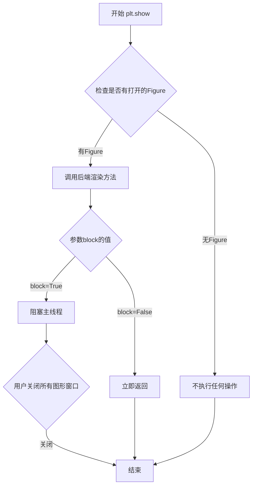

#### 带注释源码

```python
# 在本示例代码中，plt.show()的使用位置及上下文：

# ... 前面的代码创建了两个子图并绑制了图像 ...

# 设置整个图形的标题
fig.suptitle('imshow, with out-of-range and masked data')

# 调用plt.show()显示图形
# 这会显示包含两个子图的Figure对象
# 由于未传递block参数，默认block=True
# 程序会在这里暂停，等待用户关闭图形窗口
plt.show()

# 注意：在某些Jupyter notebook环境中
# 可能需要使用 %matplotlib inline 或 %matplotlib widget
# 来控制图形显示方式
```


## 关键组件


### 掩码数组 (Masked Array)

使用 `np.ma.masked_where(Z > 1.2, Z)` 创建掩码数组，将Z中大于1.2的值标记为掩码，实现对异常值的透明处理。

### 色彩映射与反量化支持 (Colormap with Out-of-Range Colors)

通过 `palette.with_extremes(over='r', under='g', bad='b')` 设置超出范围和掩码值的颜色，实现对数据不同区间的颜色映射。

### 标准化器与量化策略 (Normalization and Quantization)

使用 `colors.Normalize` 进行连续标准化，使用 `colors.BoundaryNorm` 进行离散量化，将连续数据映射到不均匀的离散颜色区间。

### 网格数据生成 (Meshgrid Data Generation)

使用 `np.meshgrid` 和 `np.linspace` 生成二维网格数据，并计算两个高斯分布的差值作为演示数据。

### 颜色条管理 (Colorbar Management)

通过 `fig.colorbar` 创建颜色条，支持 `extend='both'` 和 `spacing='proportional'` 参数，实现颜色与数据值的映射。


## 问题及建议


### 已知问题

- **硬编码的魔法数字**：代码中包含大量未命名的硬编码数值（如`500`、`2`、`6`、`5.4`、`0.9`、`1.2`等），缺乏可读性和可维护性。
- **重复的绘图设置代码**：两个子图的`imshow`调用有大量重复的配置参数（`interpolation`、`aspect`、`origin`、`extent`等），可以通过函数封装减少冗余。
- **色彩映射配置不一致**：代码同时展示了两种设置极端值的方式（`with_extremes`方法 vs 注释掉的`set_bad`方法），可能导致初学者困惑，且注释掉的代码降低了代码整洁度。
- **缺乏输入验证**：未对计算生成的`Z`、`Zm`等数据进行维度或有效性检查，可能在数据异常时产生难以追踪的错误。
- **缺少类型注解**：所有变量和函数均无类型注解，不利于静态分析和IDE辅助功能。
- **文档不完善**：模块级文档字符串过于简单，未说明函数参数、返回值及可能抛出的异常。
- **未封装为可复用模块**：所有代码平铺在模块级别，若要在其他项目中使用相关绘图逻辑，需要大量重构。

### 优化建议

- **提取配置常量**：将魔法数字定义为模块级常量或配置类，如`GRID_SIZE = 500`、`Z_THRESHOLD = 1.2`等。
- **封装绘图函数**：创建`plot_imshow`函数，接收数据和配置参数，消除子图间的重复代码。
- **统一色彩映射设置方式**：移除注释掉的备用代码，选择一种推荐的方式并在注释中简要说明原理。
- **添加数据验证**：在计算数据后添加基本的形状检查和有效性验证，提供有意义的错误信息。
- **补充类型注解**：为关键函数添加`typing`模块的类型注解，提升代码可读性和可维护性。
- **完善文档字符串**：为函数和复杂逻辑添加NumPy风格的文档，说明参数、返回值和示例。

## 其它


### 设计目标与约束

本代码示例旨在演示matplotlib中imshow函数处理掩码数组(masked array)以及超出范围颜色的能力。设计目标包括：展示如何使用Normalize和BoundaryNorm进行颜色映射配置，演示colormap的extremes设置（over/under/bad颜色），以及说明colorbar的不同配置选项（extend、spacing、shrink等）。约束条件主要依赖于matplotlib、numpy等外部库的具体实现细节。

### 错误处理与异常设计

代码主要涉及以下潜在错误点：np.linspace参数无效可能导致空数组或异常；np.meshgrid输入维度不匹配会产生广播错误；np.ma.masked_where条件数组维度与Z不匹配会引发广播异常；colormap的N属性访问失败可能导致属性错误；BoundaryNorm的ncolors参数设置不当可能产生警告或错误。当前代码未显式实现异常捕获机制，属于演示性质代码，生产环境需增加参数校验和异常处理。

### 数据流与状态机

数据流主要经历以下阶段：首先通过np.linspace生成一维坐标数组，然后通过np.meshgrid生成二维网格坐标，接着计算两个高斯分布的差值得到Z数组，然后通过np.ma.masked_where创建掩码数组Zm，最后将处理后的数据传递给ax.imshow进行渲染。状态机主要体现在imshow的渲染状态：初始态→数据加载态→颜色映射态→渲染完成态，颜色映射涉及under→normal→over三个区间的状态转换。

### 外部依赖与接口契约

主要依赖包括：matplotlib.pyplot（绘图API）、matplotlib.colors（颜色映射与标准化）、matplotlib.figure（图形对象）、numpy（数值计算）。关键接口契约包括：imshow函数接受data、interpolation、cmap、norm、aspect、origin、extent等参数并返回AxesImage对象；Figure.colorbar接受im对象并返回Colorbar对象；colormap的with_extremes方法返回配置后的colormap对象；Normalize和BoundaryNorm的norm参数用于定义数据值到颜色空间的映射。

### 性能考虑与优化空间

当前代码性能瓶颈主要集中在：np.meshgrid在500x500网格上会创建大型数组；imshow的interpolation='bilinear'相比'nearest'计算开销更大；两次imshow调用存在重复数据处理。优化方向包括：对于大规模数据可考虑下采样处理；静态图像展示可用'nearest' interpolation；可预先计算Z1、Z2等中间结果并缓存；多个子图共享相同数据时可考虑数据复用。

### 配置与参数说明

关键配置参数包括：x0, x1, y0, y1定义坐标范围；np.linspace的500个采样点影响分辨率；vmin=-1.0, vmax=1.0定义颜色映射的归一化范围；BoundaryNorm的边界数组[-1, -0.5, -0.2, 0, 0.2, 0.5, 1]定义7个区间；ncolors=palette.N获取colormap的总颜色数；interpolation参数控制插值方法；aspect='auto'允许自动调整纵横比；extend='both'使colorbar两端显示超出范围的三角形标记。

### 使用场景与用例

典型使用场景包括：科学数据可视化中需要标记无效或缺失数据；热图绘制中需要突出显示超出阈值的数据点；地形图或气象图需要用特殊颜色表示极端值；图像处理中需要区分背景和有效数据区域；任何需要自定义颜色映射范围的数据可视化任务。

### 版本兼容性说明

代码使用了plt.colormaps["gray"].with_extremes()语法，这是matplotlib 3.7+的新API。旧版本中需使用plt.cm.get_cmap("gray").with_extremes()。np.ma.masked_where在所有numpy版本中兼容。BoundaryNorm的ncolors参数行为在不同matplotlib版本中可能略有差异。建议在requirements.txt或环境配置中明确matplotlib>=3.7, numpy>=1.20的版本要求。

### 与其他模块的关系

本示例涉及matplotlib多个核心模块的交互：axes.Axes.imshow负责图像渲染；figure.Figure.colorbar负责颜色条管理；colors模块提供Normalize、BoundaryNorm等数据标准化类；colormaps模块管理颜色映射表；artist模块的AxesImage类处理具体的图像绘制；ticker模块处理colorbar的刻度显示。示例代码是matplotlib官方文档的一部分，展示了这些组件协同工作的完整流程。

    