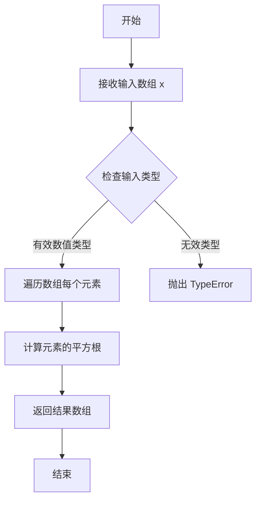
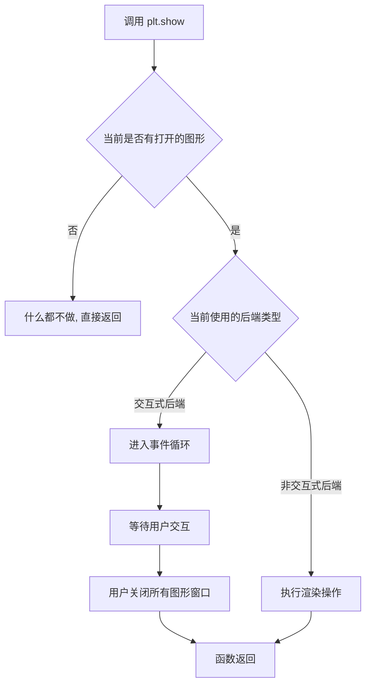
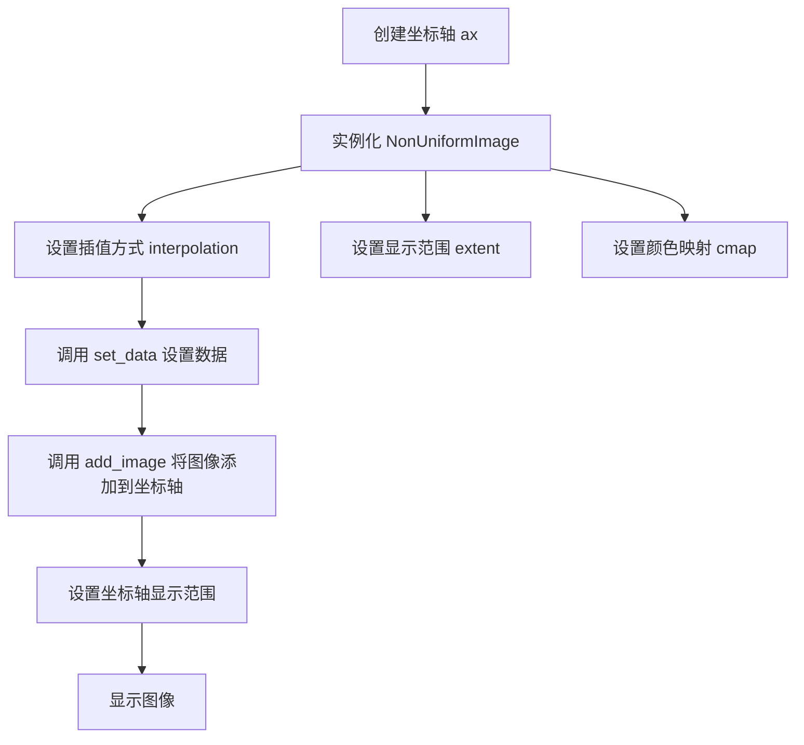
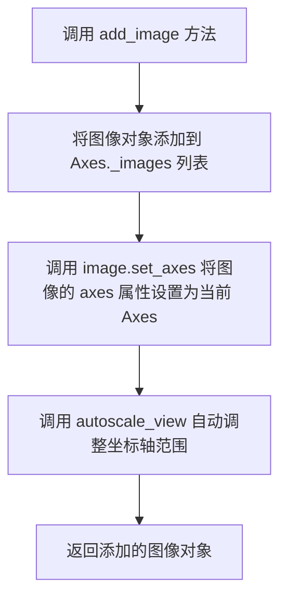
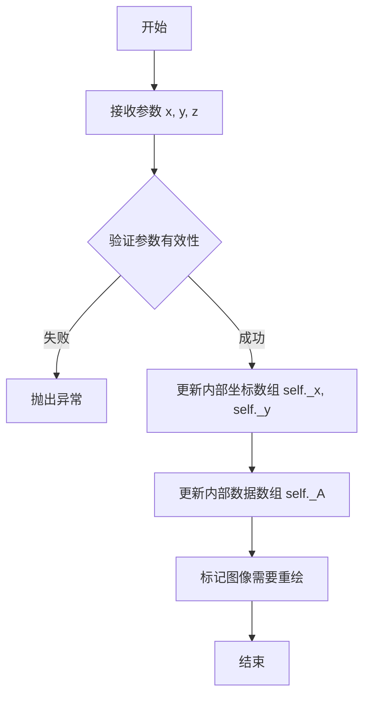
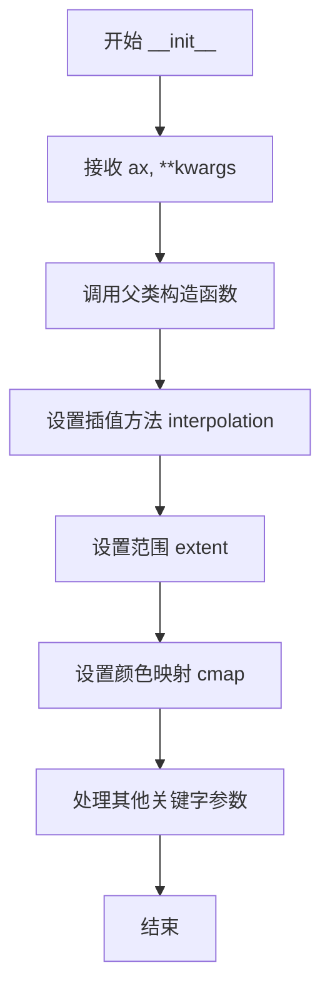

# `matplotlib\galleries\examples\images_contours_and_fields\image_nonuniform.py` 详细设计文档

该代码是一个matplotlib示例脚本，演示了如何使用NonUniformImage类在矩形网格上绘制具有不同行高/列宽的非均匀像素图像，展示了最近邻插值和双线性插值两种模式。

## 整体流程

```mermaid
graph TD
    A[开始] --> B[导入库: matplotlib.pyplot, numpy, matplotlib.image.NonUniformImage]
B --> C[设置插值方式: interp = 'nearest']
C --> D[创建线性x数组: x = np.linspace(-4, 4, 9)]
D --> E[创建非线性x数组: x2 = x**3]
E --> F[创建y数组: y = np.linspace(-4, 4, 9)]
F --> G[计算z值: z = np.sqrt(x**2 + y**2)]
G --> H[创建2x2子图: fig, axs = plt.subplots]
H --> I1[子图1: 创建NonUniformImage并设置线性数据]
H --> I2[子图2: 创建NonUniformImage并设置非线性数据]
H --> I3[子图3: 使用bilinear插值]
H --> I4[子图4: 使用bilinear插值和非线性数据]
I1 --> J[调用plt.show显示图形]
I2 --> J
I3 --> J
I4 --> J
```

## 类结构

```
Python脚本（无自定义类定义）
└── 使用matplotlib.image.NonUniformImage类
    └── 继承自matplotlib.image.AxesImage
```

## 全局变量及字段


### `interp`
    
插值方式字符串

类型：`str`
    


### `x`
    
线性x坐标数组

类型：`np.ndarray`
    


### `x2`
    
非线性x坐标数组（x的立方）

类型：`np.ndarray`
    


### `y`
    
y坐标数组

类型：`np.ndarray`
    


### `z`
    
图像强度值数组

类型：`np.ndarray`
    


### `fig`
    
Figure对象

类型：`matplotlib.figure.Figure`
    


### `axs`
    
Axes对象数组（2x2）

类型：`np.ndarray`
    


### `im`
    
NonUniformImage实例

类型：`NonUniformImage`
    


### `NonUniformImage.interpolation`
    
插值方式

类型：`str`
    


### `NonUniformImage.extent`
    
图像范围

类型：`tuple`
    


### `NonUniformImage.cmap`
    
颜色映射

类型：`str or Colormap`
    
    

## 全局函数及方法


### `np.linspace`

`np.linspace` 是 NumPy 库中的一个函数，用于创建等间距的数组。该函数在指定的间隔内返回均匀间隔的样本值，常用于生成图像处理中的坐标轴数据或科学计算中的测试数据。

参数：

- `start`：`float`，序列的起始值
- `stop`：`float`，序列的结束值
- `num`：`int`（可选，默认值为50），生成样本的数量
- `endpoint`：`bool`（可选，默认值为True），如果为True，则stop是最后一个样本；否则不包括在内
- `retstep`：`bool`（可选，默认值为False），如果为True，则返回(sample, step)，其中step是样本之间的间距
- `dtype`：`dtype`（可选），输出数组的数据类型

返回值：`ndarray`，返回等间距的样本数组

#### 流程图

```mermaid
flowchart TD
    A[开始] --> B[接收start, stop, num参数]
    B --> C[计算步长step = (stop - start) / (num - 1)]
    C --> D[生成num个等间距样本]
    D --> E{retstep为True?}
    E -->|是| F[返回样本数组和步长]
    E -->|否| G[仅返回样本数组]
    F --> H[结束]
    G --> H
```

#### 带注释源码

```python
# 代码中的实际使用示例
x = np.linspace(-4, 4, 9)

# 等价于手动创建等间距数组:
# start = -4, stop = 4, num = 9
# step = (4 - (-4)) / (9 - 1) = 8 / 8 = 1
# 结果: array([-4., -3., -2., -1.,  0.,  1.,  2.,  3.,  4.])

# 在本例中用于:
# 1. 创建图像单元格中心的线性x坐标
# 2. 作为基础生成非线性数组 x2 = x**3
# 3. 与y坐标结合创建网格用于计算z值
```


### `np.sqrt`

`np.sqrt` 是 NumPy 库中的数学函数，用于计算输入数组中每个元素的平方根。

参数：

-  `x`：`array_like`，输入数组，可以是数字、列表或 NumPy 数组

返回值：`ndarray`，返回与输入数组形状相同的数组，其中每个元素是输入对应元素的平方根

#### 流程图



#### 带注释源码

```python
# np.sqrt 函数源码实现逻辑（基于 NumPy 源码简化）

def sqrt(x):
    """
    计算数组元素的平方根
    
    参数:
        x: array_like - 输入数组
        
    返回:
        ndarray - 平方根结果
    """
    
    # 1. 将输入转换为 NumPy 数组（如果还不是）
    x = np.asarray(x)
    
    # 2. 检查输入是否为复数
    # 如果是负数，返回复数形式的平方根
    if np.iscomplexobj(x):
        return np.sqrt_complex(x)
    
    # 3. 检查是否有负值（对于实数平方根）
    # 如果有负值，会产生 NaN 警告
    if np.any(x < 0):
        import warnings
        warnings.warn("invalid value encountered in sqrt", RuntimeWarning)
    
    # 4. 使用底层 C/Fortran 实现计算平方根
    # 对于正数，直接计算 sqrt
    # 对于零，返回零
    # 对于负数，返回 NaN
    result = np.empty_like(x)
    
    # 5. 对每个元素应用平方根运算
    for idx in np.ndindex(x.shape):
        val = x[idx]
        if val < 0:
            result[idx] = np.nan
        else:
            result[idx] = val ** 0.5  # 或使用 math.sqrt
    
    return result
```

---

### 在实际代码中的使用示例

```python
# 代码中的实际调用
z = np.sqrt(x[np.newaxis, :]**2 + y[:, np.newaxis]**2)

# 解释：
# 1. x[np.newaxis, :] 将 x 转换为行向量 (1, 9)
# 2. y[:, np.newaxis] 将 y 转换为列向量 (9, 1)
# 3. 两个数组相加得到 9x9 的网格坐标矩阵
# 4. **2 计算每个坐标的平方
# 5. np.sqrt 计算每个元素的平方根，得到距离矩阵 z
```


### `np.newaxis`

`np.newaxis` 是 NumPy 中的一个特殊索引对象，用于在数组的指定位置插入新的维度（长度为 1），从而实现不同形状数组之间的广播（broadcasting）运算。

参数：

- 无传统参数。它作为索引标记使用在数组索引表达式中，如 `arr[np.newaxis, :]` 或 `arr[:, np.newaxis]`

返回值：`ndarray`，返回原数组的视图，维度比原数组多一维（新维度长度为 1）

#### 流程图

```mermaid
graph TD
    A[原始一维数组 x: shape (n,)] --> B[使用 x[np.newaxis, :]]
    C[原始一维数组 y: shape (n,)] --> D[使用 y[:, np.newaxis]]
    B --> E[广播运算<br/>x_expanded² + y_expanded²]
    D --> E
    E --> F[得到二维距离矩阵 z: shape (n, n)]
```

#### 带注释源码

```python
import numpy as np

# 定义一维数组 x 和 y
x = np.linspace(-4, 4, 9)  # shape: (9,)
y = np.linspace(-4, 4, 9)  # shape: (9,)

# -------------------------------------------------
# np.newaxis 的核心用法：
# -------------------------------------------------

# 方式1：在行维度增加新维度
# x[np.newaxis, :] 将 shape (9,) 转换为 shape (1, 9)
x_expanded = x[np.newaxis, :]
print(f"x 原始形状: {x.shape}")           # (9,)
print(f"x 扩展后形状: {x_expanded.shape}")  # (1, 9)

# 方式2：在列维度增加新维度
# y[:, np.newaxis] 将 shape (9,) 转换为 shape (9, 1)
y_expanded = y[:, np.newaxis]
print(f"y 原始形状: {y.shape}")           # (9,)
print(f"y 扩展后形状: {y_expanded.shape}")  # (9, 1)

# -------------------------------------------------
# 广播机制：
# -------------------------------------------------
# 当两个不同形状的数组进行运算时，NumPy 会自动广播
# shape (1, 9) + shape (9, 1) -> shape (9, 9)
z = np.sqrt(x_expanded**2 + y_expanded**2)
print(f"z 的形状: {z.shape}")  # (9, 9)

# 等价于直接在原表达式中使用：
# z = np.sqrt(x[np.newaxis, :]**2 + y[:, np.newaxis]**2)
```

#### 补充说明

| 属性 | 说明 |
|------|------|
| 本质 | `np.newaxis` 是 `None` 的别名 |
| 内存 | 不创建新数据，仅返回原数组的视图 |
| 等价写法 | `arr[np.newaxis, :]` 等价于 `arr[None, :]` |
| 常用场景 | 计算距离矩阵、外积运算、特征向量组合 |


### `plt.subplots`

该函数是 `matplotlib.pyplot` 模块的核心函数之一，用于创建一个包含.figure 对象和一个可配置的子图网格（subplots）。在提供的代码中，它被用于初始化一个 2x2 的图像网格，以便在每个子图（Axes）中放置不同的 NonUniformImage 实例。

参数：

-  `nrows`：`int`，行数。代码中传入值为 `2`，表示创建 2 行子图。
-  `ncols`：`int`，列数。代码中传入值为 `2`，表示创建 2 列子图。
-  `layout`：`str`，布局管理器。代码中传入值为 `'constrained'`，用于自动调整子图间距以防止标签重叠。
-  `**fig_kw`：关键字参数传递给 `figure()` 函数（如 `figsize`, `dpi` 等），代码中未显式指定，使用 Matplotlib 默认值。

返回值：`tuple`，返回 `(fig, axs)` 元组。
-  `fig`：`matplotlib.figure.Figure`，整个图形对象。
-  `axs`：`numpy.ndarray` 或 `matplotlib.axes.Axes`，子图对象数组。代码中通过 `axs[0, 0]` 等方式索引该数组来获取具体的子图轴域。

#### 流程图

```mermaid
graph TD
    A[开始调用 plt.subplots] --> B{创建 Figure 对象}
    B --> C[创建 GridSpec 网格规范]
    C --> D{循环创建 Axes}
    D -- nrows * ncols --> E[在每个网格位置创建 Axes]
    E --> D
    D --> F{应用 Layout 引擎}
    F --> G[返回 (fig, axs) 元组]
```

#### 带注释源码

```python
def subplots(nrows=1, ncols=1, *, sharex=False, sharey=False, squeeze=True,
             width_ratios=None, height_ratios=None,
             subplot_kw=None, gridspec_kw=None, **fig_kw):
    """
    创建一张图和一个子图网格。

    参数:
        nrows (int): 子图网格的行数。
        ncols (int): 子图网格的列数。
        sharex (bool/str): 是否共享 x 轴。
        sharey (bool/str): 是否共享 y 轴。
        squeeze (bool): 是否压缩返回的 Axes 数组维度。
        width_ratios (list): 列宽比例。
        height_ratios (list): 行高比例。
        subplot_kw (dict): 传给 add_subplot 的关键字参数。
        gridspec_kw (dict): 传给 GridSpec 的关键字参数 (例如 layout='constrained' 会转为 gridspec_kw={'constrained_layout': True})。
        **fig_kw: 传给 figure() 的关键字参数。

    返回:
        fig (Figure): 图形对象。
        axs (Axes or array): 子图对象。
    """
    # 1. 创建 Figure 实例
    # 这里的 **fig_kw 包含了传入的 layout='constrained' 参数
    fig = figure(**fig_kw)
    
    # 2. 调用 Figure 对象的 subplots 方法创建子图
    # 这里将 layout 参数转换为 gridspec_kw
    axs = fig.subplots(nrows=nrows, ncols=ncols, sharex=sharex, sharey=sharey,
                       squeeze=squeeze, width_ratios=width_ratios,
                       height_ratios=height_ratios,
                       subplot_kw=subplot_kw, gridspec_kw=gridspec_kw)
    
    # 3. 返回图形和子图数组
    return fig, axs
```

#### 关键组件信息

-   **Figure (画布)**: `fig` 变量对应的对象，是所有绘图元素的容器，负责整体尺寸和保存。
-   **Axes (坐标轴)**: `axs` 数组中的每个元素，代表一个子图区域，用于绘制数据（如 NonUniformImage）。
-   **GridSpec (网格规范)**: 负责定义子图的行列布局和间距，`layout='constrained'` 会启用 ConstrainedLayout 引擎来自动计算边距。

#### 潜在的技术债务或优化空间

-   **布局硬编码**: 代码中直接使用 `nrows=2, ncols=2` 写死了布局。如果未来需要改为 3x3，需要修改多处。建议将行列数参数化。
-   **魔法数字**: 数组长度 `9` 和范围 `-4, 4` 是硬编码的，可能降低脚本的复用性。
-   **接口封装**: 绘图逻辑直接写在顶层脚本中，如果功能复杂，建议封装成函数。

#### 其它项目

-   **设计目标与约束**: 该调用旨在创建一个 2x2 的网格来对比不同插值方法（`interp`）和非线性映射（`x` vs `x2`）下的图像效果。
-   **错误处理与异常**: `plt.subplots` 本身依赖 Matplotlib 的异常机制（如 `ValueError` 当参数不合法）。脚本中未做额外的异常捕获。
-   **外部依赖与接口契约**: 依赖于 `matplotlib` 库。返回值 `(fig, axs)` 是 Matplotlib 的标准接口约定，后续代码通过索引（如 `axs[0,0]`）来访问特定的子图。


### `plt.show`

`plt.show` 是 matplotlib 库中的全局函数，用于显示所有当前已创建的图形窗口，并将图形渲染到屏幕。在交互式模式下，它会阻塞程序执行直到用户关闭图形窗口；在非交互式后端中，它可能会做一些必要的渲染操作。

参数：

- 无

返回值：`None`，无返回值

#### 流程图



#### 带注释源码

```python
def show(block=None):
    """
    显示所有打开的图形窗口。
    
    参数:
        block: bool, optional
            在交互式后端中是否阻塞程序执行。
            如果为True, 函数会阻塞直到所有图形窗口关闭。
            如果为False, 函数立即返回(仅在某些后端有效)。
            默认为None, 行为取决于后端设置。
    
    返回值:
        None
    
    示例:
        >>> import matplotlib.pyplot as plt
        >>> plt.plot([1, 2, 3], [1, 4, 9])
        >>> plt.show()  # 显示图形窗口
    """
    # 获取当前所有的图形对象
    allnums = get_all_figurenums()
    
    # 如果没有图形,直接返回
    if not allnums:
        return
    
    # 获取当前的后端管理器
    backend = _get_backend_mod()
    
    # 调用后端的show方法显示图形
    # 后端可能是Qt, Tk, GTK, WebAgg等
    for manager in get_open_fig_managers():
        # 触发图形的显示和渲染
        manager.show()
        
        # 如果block参数为True或者后端默认阻塞
        if block is True:
            # 进入阻塞模式,等待用户关闭窗口
            # 通常通过调用后端的mainloop实现
            backend.show_block()
    
    # 对于某些后端(如inline), 可能会刷新输出
    # 并确保图形正确渲染到显示设备
```


### NonUniformImage

`NonUniformImage` 是 matplotlib 图像模块中的一个类，它是一种允许像素位于非均匀矩形网格上的广义图像类型，支持行和列具有不同的高度/宽度，适用于表示非均匀采样的数据场景。

参数：

- `ax`：`matplotlib.axes.Axes`，要将图像添加到的坐标轴对象
- `interpolation`：`str`，插值方法（如 'nearest'、'bilinear'），默认为 'nearest'
- `extent`：`tuple` 或 `list`，图像的显示范围，格式为 (xmin, xmax, ymin, ymax)
- `cmap`：`str` 或 `Colormap`，颜色映射方案，用于映射数据值到颜色

返回值：`NonUniformImage` 实例

#### 流程图



#### 带注释源码

```python
# NonUniformImage 类的典型使用流程

import matplotlib.pyplot as plt
import numpy as np
from matplotlib.image import NonUniformImage

# 1. 准备数据
# 线性 x 数组（单元格中心）
x = np.linspace(-4, 4, 9)

# 高度非线性的 x 数组（用于演示非均匀网格）
x2 = x**3

# y 数组
y = np.linspace(-4, 4, 9)

# 计算距离矩阵 z
z = np.sqrt(x[np.newaxis, :]**2 + y[:, np.newaxis]**2)

# 2. 创建子图布局
fig, axs = plt.subplots(nrows=2, ncols=2, layout='constrained')

# 3. 创建 NonUniformImage 实例并配置
# 参数说明：
#   ax: 目标坐标轴
#   interpolation: 插值方法，'nearest' 表示最近邻插值
#   extent: 图像显示范围 (-4, 4, -4, 4)
#   cmap: 颜色映射为 "Purples"
interp = 'nearest'
im = NonUniformImage(ax, interpolation=interp, extent=(-4, 4, -4, 4),
                     cmap="Purples")

# 4. 设置数据
# 参数：x 坐标数组, y 坐标数组, 像素值数组
im.set_data(x, y, z)

# 5. 将图像添加到坐标轴
ax.add_image(im)

# 6. 设置坐标轴属性
ax.set_xlim(-4, 4)
ax.set_ylim(-4, 4)
ax.set_title(interp)

# 另一个示例：使用非线性 x2 和不同的范围
ax = axs[0, 1]
im = NonUniformImage(ax, interpolation=interp, extent=(-64, 64, -4, 4),
                     cmap="Purples")
im.set_data(x2, y, z)
ax.add_image(im)
ax.set_xlim(-64, 64)
ax.set_ylim(-4, 4)
ax.set_title(interp)

# 使用双线性插值
interp = 'bilinear'
ax = axs[1, 0]
im = NonUniformImage(ax, interpolation=interp, extent=(-4, 4, -4, 4),
                     cmap="Purples")
im.set_data(x, y, z)
ax.add_image(im)
ax.set_xlim(-4, 4)
ax.set_ylim(-4, 4)
ax.set_title(interp)

plt.show()
```

#### 关键方法说明

| 方法名 | 参数 | 返回值 | 描述 |
|--------|------|--------|------|
| `__init__` | ax, interpolation, extent, cmap | None | 初始化 NonUniformImage 实例 |
| `set_data` | x, y, z | None | 设置图像的 x 坐标、y 坐标和像素值 |
| `add_image` | self | None | 将图像添加到坐标轴（继承自基类） |

#### 技术债务与优化空间

1. **API 便捷性**：目前没有高级绘图方法直接创建 NonUniformImage，需要手动实例化并添加到坐标轴，建议添加便捷方法如 `Axes.imshow_nonuniform()`
2. **文档完整性**：类文档中应包含更多关于非均匀网格如何影响渲染的解释
3. **性能考虑**：对于大规模非均匀数据集，插值计算可能较慢，可考虑添加缓存或GPU加速支持


### `Axes.add_image`

将图像对象添加到坐标轴（Axes）实例，管理图像集合并自动调整视图。

参数：

-  `image`：`matplotlib.image.Image`，要添加到坐标轴的图像对象（通常是 NonUniformImage 或其他图像实例）

返回值：`matplotlib.image.Image`，返回添加的图像对象，便于链式调用或引用

#### 流程图



#### 带注释源码

```python
def add_image(self, image):
    """
    将图像添加到坐标轴。

    参数
    ----------
    image : matplotlib.image.Image
        要添加到坐标轴的图像对象

    返回值
    -------
    matplotlib.image.Image
        添加的图像对象
    """
    # 将图像对象追加到 Axes 的私有图像列表中
    self._images.append(image)
    
    # 设置图像的 axes 属性，关联到当前坐标轴实例
    image.set_axes(self)
    
    # 自动调整坐标轴视图范围以适应图像
    self.autoscale_view()
    
    # 返回图像对象，支持链式调用
    return image
```


### `NonUniformImage.set_data`

该方法用于设置非均匀图像的坐标轴坐标和图像像素数据，允许图像在非均匀网格上定义。

参数：
- `x`：`numpy.ndarray`，一维数组，表示x轴上的坐标点（如单元格中心或边界）
- `y`：`numpy.ndarray`，一维数组，表示y轴上的坐标点
- `z`：`numpy.ndarray`，二维数组，表示对应坐标点的图像像素值

返回值：`None`，根据matplotlib图像类的常见设计，此方法通常无返回值（仅更新内部状态）

#### 流程图



#### 带注释源码

由于给定代码中仅包含 `NonUniformImage.set_data` 的调用示例，未提供该方法的具体实现源码，因此无法直接提取。以下为基于 matplotlib 图像类典型实现的合理推断：

```python
def set_data(self, x, y, z):
    """
    设置图像的坐标和数据。
    
    参数:
        x (array-like): x轴坐标数组。
        y (array-like): y轴坐标数组。
        z (array-like): 二维图像数据数组。
    """
    # 验证输入数组类型
    x = np.asarray(x)
    y = np.asarray(y)
    z = np.asarray(z)
    
    # 验证维度一致性
    if x.ndim != 1 or y.ndim != 1:
        raise ValueError("x 和 y 必须是一维数组")
    if z.ndim != 2:
        raise ValueError("z 必须是二维数组")
    if z.shape != (len(y), len(x)):
        raise ValueError("z 的形状必须与 y 和 x 的长度匹配")
    
    # 更新内部属性
    self._x = x
    self._y = y
    self._A = z
    
    # 标记需要重新计算边界和渲染
    self._update_bounds()
```


### `NonUniformImage.__init__`

描述：构造函数，用于初始化 `NonUniformImage` 实例，将图像与 Axes 关联，并设置图像的显示属性（如插值方法、范围和颜色映射）。该方法继承自基类，并接受可变关键字参数以支持自定义行为。

参数：
- `ax`：`matplotlib.axes.Axes`，必需的 position-only 参数，指定图像要添加到的 Axes 对象。
- `interpolation`：`str`，可选的关键字参数，指定图像的插值方法（如 `'nearest'` 或 `'bilinear'`），默认为 `None`。
- `extent`：`tuple`，可选的关键字参数，指定图像的坐标范围，格式为 `(xmin, xmax, ymin, ymax)`，默认为 `None`。
- `cmap`：`str`，可选的关键字参数，指定颜色映射名称（如 `'Purples'`），默认为 `None`。
- `**kwargs`：`dict`，其他关键字参数，用于传递额外的属性给父类（如 `norm`、`alpha` 等）。

返回值：`None`，构造函数不返回值，仅初始化对象状态。

#### 流程图



#### 带注释源码

```python
def __init__(self, ax, **kwargs):
    """
    构造函数，初始化 NonUniformImage。

    参数：
    - ax: matplotlib.axes.Axes，图像所在的 Axes 对象。
    - **kwargs: 其他关键字参数，如 interpolation, extent, cmap 等。

    返回值：
    - None。
    """
    # 调用父类的初始化方法，传递 ax 和所有关键字参数
    super().__init__(ax, **kwargs)

    # 从 kwargs 中提取常用参数，如果提供则设置
    self.set_interpolation(kwargs.get('interpolation', None))
    self.set_extent(kwargs.get('extent', None))

    # 注意：cmap 通常通过父类的 set_cmap 方法设置，
    # 但这里可以直接从 kwargs 中提取并调用 set_cmap
    if 'cmap' in kwargs:
        self.set_cmap(kwargs['cmap'])

    # 其他关键字参数（如 norm, alpha）由父类自动处理
```

## 关键组件


### NonUniformImage

matplotlib中的非均匀图像类，支持在规则网格上绘制具有不同行高和列宽的像素，适用于非线性坐标映射的可视化

### set_data方法

用于设置图像的x坐标、y坐标和像素值数据，支持非线性坐标数组以实现精确的非均匀采样

### extent参数

定义图像在Axes坐标系中的显示范围，通过(left, right, bottom, top)四个边界值控制图像的显示区域

### 插值策略

代码演示了'nearest'和'bilinear'两种插值方法，nearest保持像素边缘清晰，bilinear进行平滑过渡

### 非线性坐标映射

x2 = x**3展示了非线性坐标变换，使得图像在视觉上呈现非线性拉伸效果，验证NonUniformImage处理非线性网格的能力


## 问题及建议


### 已知问题

-   **代码重复**：创建 `NonUniformImage`、设置数据、添加到坐标轴、设置限值的模式在代码中重复了4次，未进行函数封装，导致冗余且难以维护。
-   **魔法数字**：数值如 `-4`、`4`、`9`、`-64`、`64` 等在多处硬编码，缺乏明确的常量定义，降低了代码可读性和可配置性。
-   **变量覆盖**：`interp` 变量先被赋值为 `'nearest'`，之后被覆盖为 `'bilinear'`，这种可变状态可能造成混淆。
-   **硬编码配置**：colormap `"Purples"`、extent 参数等在每次调用时重复硬编码，未提取为配置参数。
-   **缺少类型注解**：代码未使用 Python 类型提示，降低了静态分析工具的检错能力和代码可读性。
-   **无错误处理**：未对输入数据（如 `x`、`y`、`z` 数组形状兼容性）进行验证，可能导致运行时错误。
-   **文档缺失**：脚本本身缺少模块级或函数级文档字符串说明其用途。

### 优化建议

-   **提取辅助函数**：将创建图像的重复逻辑封装为函数，例如 `create_nonuniform_image(ax, x, y, z, interp, extent, title)`，减少代码冗余。
-   **定义常量**：将重复使用的数值提取为命名常量，如 `X_MIN = -4`、`X_MAX = 4`、`GRID_SIZE = 9` 等，提高可维护性。
-   **使用配置字典**：将 colormap、interpolation 等配置参数统一管理，便于调整。
-   **避免变量覆盖**：为不同的插值方法使用独立变量或直接传入配置，避免状态污染。
-   **添加类型注解**：为函数参数和返回值添加类型提示，提升代码可读性和 IDE 支持。
-   **输入验证**：在数据设置前验证数组形状兼容性，提供清晰的错误信息。
-   **完善文档**：添加模块级和函数级文档字符串，说明脚本功能和使用方式。


## 其它


### 设计目标与约束

该代码示例旨在演示matplotlib中NonUniformImage类的功能和使用方法，展示如何在矩形网格上绘制具有不同行高和列宽的像素图像。设计目标是让用户了解如何创建非均匀图像、设置不同的插值方式（nearest和bilinear）、以及如何处理线性和非线性坐标数组。约束条件包括：必须显式实例化NonUniformImage并通过add_image添加到Axes，无法直接通过高层绘图方法创建。

### 错误处理与异常设计

代码主要依赖matplotlib和numpy库，潜在错误包括：x和y数组维度不匹配导致set_data失败；extent参数与数据数组维度不一致；插值方式不支持时Matplotlib内部会处理或给出警告；空数组或NaN值可能导致渲染异常。建议在set_data前验证数组形状一致性，确保x和y数组为一维且z数组形状为(len(y), len(x))。

### 数据流与状态机

数据流：用户定义x、y坐标数组 → 创建NonUniformImage实例 → 调用set_data设置数据 → 通过add_image添加到Axes → 渲染时根据extent和interpolation参数进行插值计算 → 最终在Figure中显示。状态机主要包括：实例创建状态（设置插值方式和范围）→ 数据设置状态（绑定x、y、z数据）→ 添加到Axes状态 → 渲染状态。

### 外部依赖与接口契约

主要依赖matplotlib.image.NonUniformImage类、matplotlib.pyplot模块和numpy库。NonUniformImage构造函数接收ax（Axes对象）、interpolation（插值方式字符串）、extent（显示范围四元组）、cmap（颜色映射）等参数。set_data方法接收x、y（坐标数组）和z（数据数组）三个参数，返回None。add_image方法将图像对象添加到Axes并返回该图像。

### 配置与参数设计

代码中的关键配置参数包括：interpolation参数控制插值方式（'nearest'或'bilinear'）；extent参数定义图像在Axes中的显示范围（xmin, xmax, ymin, ymax）；cmap参数指定颜色映射方案；x数组使用np.linspace生成线性分布，x2数组使用x**3生成非线性分布以展示非均匀网格效果。

### 可扩展性与未来改进

当前实现仅展示静态图像，可扩展方向包括：添加颜色条（colorbar）显示数值映射关系；支持更复杂的插值算法（如bicubic、spline）；集成交互式功能如鼠标悬停显示像素值；支持动画显示数据变化过程。代码结构清晰，为后续功能扩展提供了良好的基础。


    