# `matplotlib\galleries\examples\images_contours_and_fields\image_transparency_blend.py` 详细设计文档

这是一个matplotlib示例代码，展示了如何在2D图像中混合透明度和颜色来突出显示数据。该示例通过imshow函数可视化2D矩阵，并根据数据的权重值或位置设置像素的透明度，常用于突出显示统计图中的显著区域（如p值较小的数据点）。

## 整体流程

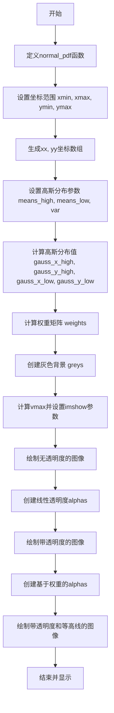

## 类结构

```
此代码为脚本式代码，无类定义
主要模块：
├── 数据生成模块
│   ├── normal_pdf 函数
│   └── 权重计算逻辑
├── 可视化模块
│   ├── 基础imshow绘制
│   ├── 透明度混合绘制
│   └── 等高线绘制
```

## 全局变量及字段


### `xmin`
    
图像x轴最小边界坐标

类型：`int`
    


### `xmax`
    
图像x轴最大边界坐标

类型：`int`
    


### `ymin`
    
图像y轴最小边界坐标

类型：`int`
    


### `ymax`
    
图像y轴最大边界坐标

类型：`int`
    


### `n_bins`
    
网格划分的车比数量，决定数据采样密度

类型：`int`
    


### `xx`
    
x轴方向的线性空间数组，用于生成水平坐标网格

类型：`numpy.ndarray`
    


### `yy`
    
y轴方向的线性空间数组，用于生成垂直坐标网格

类型：`numpy.ndarray`
    


### `means_high`
    
高值高斯分布的中心点坐标列表[x,y]，用于创建正向 blob

类型：`list`
    


### `means_low`
    
低值高斯分布的中心点坐标列表[x,y]，用于创建负向 blob

类型：`list`
    


### `var`
    
高斯分布的方差列表，控制 blob 的扩散范围和形状

类型：`list`
    


### `gauss_x_high`
    
高值高斯分布在x方向上的概率密度值数组

类型：`numpy.ndarray`
    


### `gauss_y_high`
    
高值高斯分布在y方向上的概率密度值数组

类型：`numpy.ndarray`
    


### `gauss_x_low`
    
低值高斯分布在x方向上的概率密度值数组

类型：`numpy.ndarray`
    


### `gauss_y_low`
    
低值高斯分布在y方向上的概率密度值数组

类型：`numpy.ndarray`
    


### `weights`
    
最终的2D权重矩阵，通过高斯外积差值生成正负 blob

类型：`numpy.ndarray`
    


### `greys`
    
灰色背景RGB数组，用于作为底层图像显示

类型：`numpy.ndarray`
    


### `vmax`
    
权重矩阵的最大绝对值，用于设置色彩映射的上下界

类型：`numpy.float64`
    


### `imshow_kwargs`
    
imshow函数的关键参数字典，包含vmax、vmin、cmap和extent等配置

类型：`dict`
    


### `alphas`
    
透明度通道数组，用于控制图像各像素的透明程度

类型：`numpy.ndarray`
    


    

## 全局函数及方法


### `normal_pdf`

正态分布概率密度函数，计算给定x值在指定均值(mean)和方差(var)下的概率密度值，基于高斯公式简化为指数形式。

参数：

- `x`：`float` 或 `np.ndarray`，输入值，可以是单个数值或数组
- `mean`：`float`，正态分布的均值（期望值）
- `var`：`float`，正态分布的方差（标准差的平方）

返回值：`float` 或 `np.ndarray`，返回x在指定均值和方差下的正态分布概率密度值

#### 流程图

```mermaid
graph TD
    A[开始] --> B[输入参数 x, mean, var]
    B --> C[计算差值: x - mean]
    C --> D[计算平方: (x - mean)²]
    D --> E[计算分母: 2 * var]
    E --> F[计算指数幂: -(x - mean)² / (2*var)]
    F --> G[计算exp: np.exp(指数幂)]
    G --> H[返回概率密度值]
```

#### 带注释源码

```python
def normal_pdf(x, mean, var):
    """
    计算正态分布的概率密度函数值
    
    参数:
        x: 输入值，可以是标量或数组
        mean: 正态分布的均值
        var: 正态分布的方差
    
    返回:
        概率密度值
    """
    # 使用正态分布概率密度函数的简化形式
    # 完整的正态分布PDF: (1 / sqrt(2*pi*var)) * exp(-(x-mean)² / (2*var))
    # 这里省略了前面的归一化常数(1 / sqrt(2*pi*var))，只保留指数部分
    # 这种形式在可视化中常用于生成高斯形状的权重分布
    return np.exp(-(x - mean)**2 / (2*var))
```


### `normal_pdf` (使用 `np.exp`)

此函数计算正态分布的概率密度函数值，使用 `np.exp` 计算指数部分，生成高斯分布曲线。

参数：

- `x`：`numpy.ndarray` 或 `float`，要计算概率密度的点
- `mean`：`float`，正态分布的均值（中心位置）
- `var`：`float`，正态分布的方差（控制分布的宽度）

返回值：`numpy.ndarray` 或 `float`，输入点处的正态分布概率密度值

#### 流程图

```mermaid
flowchart TD
    A[开始 normal_pdf] --> B[计算差值: x - mean]
    --> C[计算平方: (x - mean)²]
    --> D[计算分母: 2 * var]
    --> E[计算指数幂: -(x - mean)² / (2*var)]
    --> F[调用np.exp计算指数: exp(幂值)]
    --> G[返回结果]
```

#### 带注释源码

```python
def normal_pdf(x, mean, var):
    """
    计算正态分布的概率密度函数
    
    参数:
        x: 输入值，可以是单个值或数组
        mean: 正态分布的均值
        var: 正态分布的方差
    
    返回:
        正态分布的概率密度值
    """
    # 使用np.exp计算高斯函数的指数部分
    # 公式: exp(-(x - mean)² / (2*var))
    return np.exp(-(x - mean)**2 / (2*var))
```

---

### `np.exp` (NumPy 指数函数)

`np.exp` 是 NumPy 库提供的指数函数，计算自然常数 e 的 x 次方。在本代码中用于计算正态分布的概率密度值。

参数：

- `x`：`numpy.ndarray` 或 `float`，指数函数的输入值

返回值：`numpy.ndarray` 或 `float`，e 的 x 次方

#### 流程图

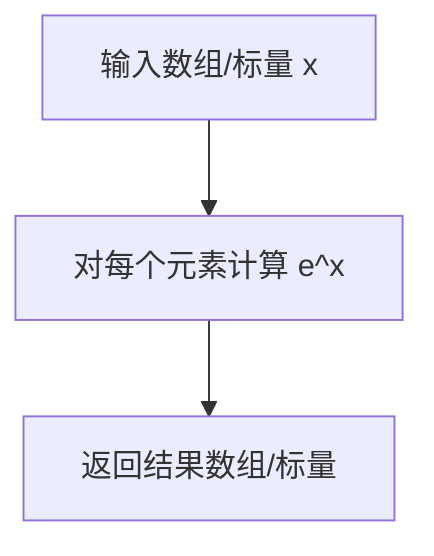

#### 使用示例源码

```python
# 在normal_pdf中的实际调用
gauss_x_high = normal_pdf(xx, means_high[0], var[0])
# 内部实现: np.exp(-(xx - 20)² / (2*150))
# 这会返回每个xx值对应的高斯概率密度
```


### `np.linspace`

生成指定间隔内等间距的数字序列，常用于创建线性空间数组。

参数：

- `start`：`float`，序列的起始值
- `stop`：`float`，序列的结束值（当endpoint=False时不包含）
- `num`：`int`，可选，默认值为50，生成样本数量
- `endpoint`：`bool`，可选，默认值为True，是否包含终点
- `retstep`：`bool`，可选，默认值为False，如果为True，返回(step,)
- `dtype`：`dtype`，可选，输出数组的数据类型

返回值：`ndarray`，返回num个等间距的样本

#### 流程图

```mermaid
flowchart TD
    A[开始 np.linspace] --> B{检查参数有效性}
    B -->|参数合法| C[计算步长 step = (stop - start) / (num - 1)]
    B -->|endpoint=False| D[计算步长 step = (stop - start) / num]
    C --> E[生成等间距数组]
    D --> E
    E --> F{retstep=True?}
    F -->|是| G[返回数组和步长]
    F -->|否| H[仅返回数组]
    G --> I[结束]
    H --> I
```

#### 带注释源码

```python
# 代码中的实际使用示例

# 示例1：创建x轴坐标空间
# 从0到100生成100个等间距的点，用于后续高斯分布计算
xx = np.linspace(xmin, xmax, n_bins)
# 参数: start=0, stop=100, num=100
# 返回: array([0., 1., 2., ..., 98., 99., 100.])

# 示例2：创建y轴坐标空间
# 从0到100生成100个等间距的点，用于后续高斯分布计算
yy = np.linspace(ymin, ymax, n_bins)
# 参数: start=0, stop=100, num=100
# 返回: array([0., 1., 2., ..., 98., 99., 100.])

# 示例3：创建线性递减的透明度渐变
# 从1到0生成70个等间距的点，用于右侧30%区域的透明度渐变
alphas[:, 30:] = np.linspace(1, 0, 70)
# 参数: start=1, stop=0, num=70
# 返回: array([1.0, 0.9855, 0.9710, ..., 0.0290, 0.0145, 0.0])
```


### `np.outer`

NumPy的外积函数，用于计算两个一维数组的外积（叉积），返回一个二维数组，其中每个元素是输入数组对应元素的乘积。

参数：

-  `a`：第一个输入数组（一维数组），用于外积计算的第一个向量
-  `b`：第二个输入数组（一维数组），用于外积计算的第二个向量

返回值：`ndarray`，二维数组，表示输入两个向量的外积结果

#### 流程图

```mermaid
flowchart TD
    A[开始 np.outer] --> B[输入数组 a 和 b]
    B --> C{检查数组维度}
    C -->|一维数组| D[创建与a.len × b.len大小的二维数组]
    C -->|多维数组| E[将数组展平为一维]
    D --> F[遍历数组元素]
    F --> G[计算外积: result[i,j] = a[i] × b[j]]
    G --> H[返回二维数组结果]
    H --> I[结束]
```

#### 带注释源码

```python
# np.outer 函数使用示例（在给定代码中）

# 第一次使用：计算高斯分布在y方向和x方向的外积
# gauss_y_high: 100个元素的一维数组（y方向的高斯分布）
# gauss_x_high: 100个元素的一维数组（x方向的高斯分布）
# 结果是一个 100×100 的二维数组
gauss_x_high = normal_pdf(xx, means_high[0], var[0])
gauss_y_high = normal_pdf(yy, means_high[1], var[0])
weights_high = np.outer(gauss_y_high, gauss_x_high)

# 第二次使用：计算负高斯分布的外积
# gauss_y_low: 100个元素的一维数组
# gauss_x_low: 100个元素的一维数组
gauss_x_low = normal_pdf(xx, means_low[0], var[1])
gauss_y_low = normal_pdf(yy, means_low[1], var[1])
weights_low = np.outer(gauss_y_low, gauss_x_low)

# 最终权重：通过外积相减得到混合权重矩阵
# weights_high 和 weights_low 都是 100×100 的二维数组
weights = (np.outer(gauss_y_high, gauss_x_high)
           - np.outer(gauss_y_low, gauss_x_low))
```

#### 详细说明

在给定代码中，`np.outer` 的具体作用是将两个一维高斯分布曲线组合成一个二维高斯"斑点"（blob）图像：

1. **数学原理**：`np.outer(a, b)` 计算向量外积，结果矩阵的元素满足 `result[i,j] = a[i] × b[j]`
2. **代码上下文**：用于生成可视化数据中的" blobs "（斑点），通过将y方向和x方向的高斯分布进行外积运算，得到二维高斯分布
3. **数据形状**：
   - 输入：`gauss_y_high` (100,) 和 `gauss_x_high` (100,) - 两个一维数组
   - 输出：`weights_high` (100, 100) - 二维数组


### `np.full`

`np.full` 是 NumPy 库中的一个函数，用于创建一个给定形状的数组，并用指定的填充值填充。该函数是数组创建函数的一种，常用于初始化数组或创建具有特定值的数组。

参数：

- `shape`：`tuple` 或 `int`，输出数组的形状。在代码中为 `(*weights.shape, 3)`，即 `(100, 100, 3)`，表示创建一个三维数组，前两维与 weights 相同，第三维为 3（用于 RGB 颜色通道）
- `fill_value`：`scalar` 或 `类似数组的值`，用于填充数组的值。在代码中为 `70`，表示用灰度值 70 填充数组
- `dtype`：`data-type`，可选参数，表示数组的数据类型。在代码中为 `np.uint8`，表示无符号 8 位整数，范围为 0-255

返回值：`ndarray`，返回指定形状和类型的数组，其中所有元素都被填充为 fill_value

#### 流程图

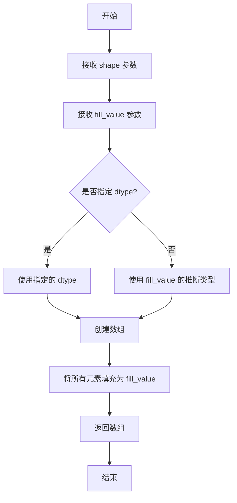

#### 带注释源码

```python
# 使用 np.full 创建一个灰度背景图像数组
# 参数说明：
#   (*weights.shape, 3): 使用解包操作，将 weights 的形状 (100, 100) 与 3 组合成 (100, 100, 3)
#   70: 填充值，表示灰度值 70（接近黑色的灰色）
#   dtype=np.uint8: 指定数组数据类型为无符号 8 位整数，范围 0-255
greys = np.full((*weights.shape, 3), 70, dtype=np.uint8)
```


### `np.abs`

`np.abs` 是 NumPy 库中的绝对值函数，用于计算输入数组中每个元素的绝对值。该函数接受一个数组或类数组对象作为输入，并返回一个新的数组，其中每个元素都是原始数组对应元素的绝对值形式。对于复数，返回其模（magnitude）。

参数：

-  `x`：`array_like`，输入数组或类数组对象，可以是整数、浮点数或复数
-  `out`：`ndarray, optional`，可选的输出数组，用于存储结果
-  `**kwargs`：其他关键字参数，用于传递给底层函数

返回值：`ndarray`，返回输入数组元素的绝对值，类型与输入类型相关（实数返回对应类型，复数返回浮点型）

#### 流程图

```mermaid
graph TD
    A[开始] --> B[接收输入数组 x]
    B --> C{检查输入类型}
    C -->|复数| D[计算复数的模<br/>√real² + imag²]
    C -->|实数| E[取绝对值<br/>|x|]
    D --> F[返回结果数组]
    E --> F
    F --> G[结束]
```

#### 带注释源码

```python
# np.abs 的函数签名（概念性表示）
def abs(x, out=None, **kwargs):
    """
    计算数组元素的绝对值。
    
    参数:
        x: array_like
            输入数组，可以包含整数、浮点数或复数
            
        out: ndarray, optional
            存储结果的数组，必须具有相同的形状
            
        **kwargs:
            其他关键字参数
    
    返回:
        ndarray
            绝对值数组
    """
    # 对于实数数组，直接取绝对值
    # np.abs(-5) -> 5
    # np.abs([1, -2, 3]) -> [1, 2, 3]
    
    # 对于复数数组，计算模
    # np.abs(3+4j) -> 5.0
    
    # 内部实现使用:
    # - 整数/浮点数: 使用 fabs 或 absolute
    # - 复数: 使用 absolute
    pass
```

在代码中的实际使用示例：

```python
# 第一次使用：计算权重数组的最大绝对值
vmax = np.abs(weights).max()  # 将 weights 中所有值转为绝对值，然后取最大值

# 第二次使用：创建基于绝对值的透明度通道
alphas = Normalize(0, .3, clip=True)(np.abs(weights))
# 1. np.abs(weights) 将权重数组转为绝对值
# 2. Normalize(0, .3, clip=True) 创建归一化器，将值映射到 [0, 0.3] 范围
# 3. 结果用于控制图像的透明度
```


### `np.ones`

`np.ones` 是 NumPy 库中的一个函数，用于创建一个指定形状的数组，数组中所有元素的值都填充为 1。

参数：

-  `shape`：`int` 或 `tuple of ints`，数组的维度大小
-  `dtype`：`data-type, optional`，可选参数，用于指定返回数组的数据类型，默认为 `float64`
-  `order`：`{'C', 'F', 'A', 'K'}, optional`，可选参数，指定内存布局，C 表示行主序，F 表示列主序，默认为 'C'
-  `like`：`array-like, optional`，可选参数，legacy 参数，用于创建类似数组的对象

返回值：`ndarray`，返回一个指定形状的数组，其中所有元素的值都为 1

#### 流程图

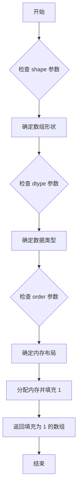

#### 带注释源码

```python
# 使用 np.ones 创建与 weights 形状相同的数组，所有元素初始化为 1
# weights.shape 是一个元组，表示数据的维度 (100, 100)
# 这样创建的 alphas 数组可以用于后续设置透明度通道
alphas = np.ones(weights.shape)

# 等效于:
# alphas = np.ones(shape=(100, 100), dtype=float64)

# 完整函数签名:
# numpy.ones(shape, dtype=None, order='C', *, like=None)
```


### `np.linspace`

`np.linspace` 是 NumPy 库中的一个函数，用于生成指定范围内的等间距数值序列。该函数在数值计算、数据可视化和科学计算中广泛应用，特别适合创建均匀分布的坐标轴、采样点或线性插值数据。

参数：

- `start`：`float`，序列的起始值，定义数值范围的左边界
- `stop`：`float`，序列的结束值，定义数值范围的右边界；当 `endpoint` 为 True 时，该值包含在序列中
- `num`：`int`，可选参数，生成样本的数量，默认为 50，必须为非负数
- `endpoint`：`bool`，可选参数，默认为 True；若为 True，则 `stop` 值包含在序列中；否则不包含
- `retstep`：`bool`，可选参数，默认为 False；若为 True，则返回 (samples, step) 元组，其中 step 为相邻样本之间的步长
- `dtype`：`dtype`，可选参数，输出数组的数据类型；若未指定，则从输入的 start 和 stop 推断
- `axis`：`int`，可选参数，默认值为 0；当 stop 和 start 为数组时，该参数指定结果数组中样本的存储轴

返回值：`ndarray`，返回一个 NumPy 数组，包含 `num` 个在闭区间 `[start, stop]`（或半开区间取决于 `endpoint`）内等间距分布的样本。当 `retstep=True` 时，返回值为元组 `(samples, step)`，其中 step 是样本之间的步长。

#### 流程图

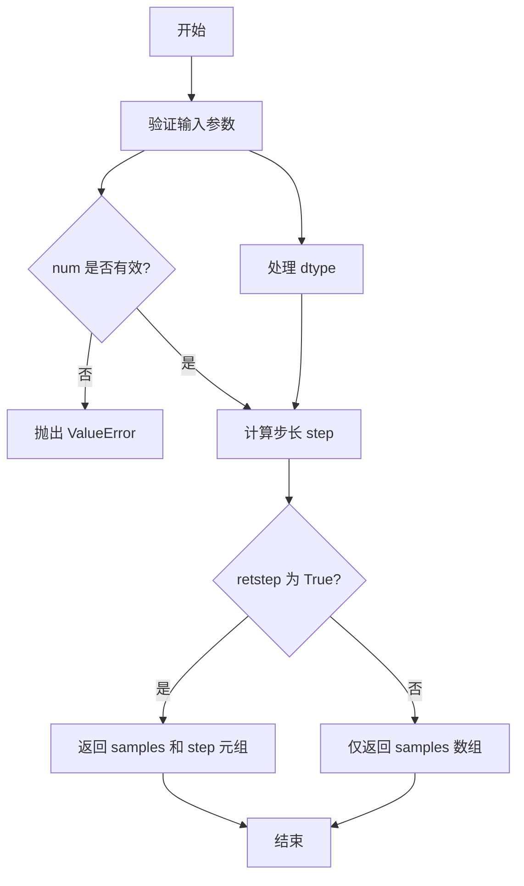

#### 带注释源码

```python
# 示例代码中 np.linspace 的使用
# 用于生成 x 和 y 坐标轴的取值范围

# 参数定义
xmin, xmax, ymin, ymax = (0, 100, 0, 100)  # 定义坐标范围
n_bins = 100  # 定义采样点数量

# 调用 np.linspace 生成等间距坐标序列
# start=0, stop=100, num=100
# 返回一个包含100个元素的 numpy 数组
# 数组元素从 0 到 100 均匀分布，步长约为 1.01
xx = np.linspace(xmin, xmax, n_bins)
yy = np.linspace(ymin, ymax, n_bins)

# 生成的 xx 大致为: [0, 1.0101, 2.0202, ..., 100]
# 生成的 yy 大致为: [0, 1.0101, 2.0202, ..., 100]
# 这些坐标用于后续计算高斯分布和绘制图像
```


### `np.clip`

numpy的数值裁剪函数，将数组中的元素限制在指定的最小值和最大值范围内。

参数：

- `a`：`array_like`，输入数组或标量，要进行裁剪的数组或数值
- `a_min`：`scalar` 或 `array_like` 或 `None`，下界，低于该值的元素将被设置为该值，None表示无下界
- `a_max`：`scalar` 或 `array_like` 或 `None`，上界，高于该值的元素将被设置为该值，None表示无上界
- `out`：`ndarray`，可选，输出数组，用于存放结果的数组
- `**kwargs`：其他关键字参数，用于兼容性

返回值：`ndarray` 或 `scalar`，裁剪后的数组或标量，输入数组中所有元素被限制在[min, max]范围内

#### 流程图

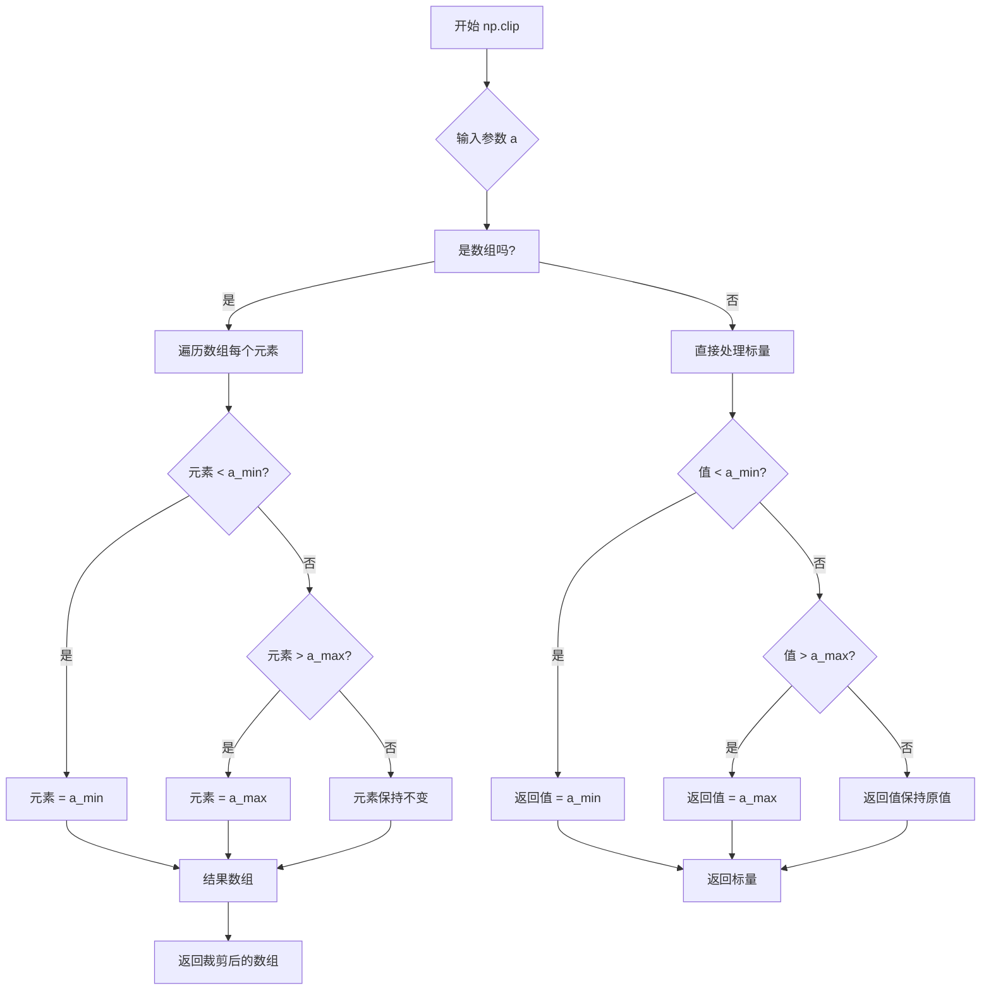

#### 带注释源码

```python
# numpy.core.numeric.py 中的实现简化版

def clip(a, a_min, a_max, out=None, **kwargs):
    """
    裁剪（限制）数组中的值在指定范围内
    
    参数:
        a: array_like
            要裁剪的数组或数值
        a_min: scalar 或 array_like 或 None
            最小值，低于此值的元素将被替换为此值
        a_max: scalar 或 array_like 或 None
            最大值，高于此值的元素将被替换为此值
        out: ndarray, optional
            存储结果的数组
    
    返回:
        ndarray 或 scalar
            裁剪后的数组
    """
    # 处理 None 情况，将其转换为 nan 或保持 None
    if a_min is None:
        a_min = float('-inf')  # 无下界
    if a_max is None:
        a_max = float('inf')   # 无上界
    
    # 使用 numpy 的 minimum 和 maximum 进行裁剪
    # 先用 a_min 与数组比较，取较大值（确保不低于最小值）
    # 再用 a_max 与结果比较，取较小值（确保不超过最大值）
    result = np.minimum(np.maximum(a, a_min), a_max)
    
    return result

# 示例调用：
# alphas = np.clip(alphas, .4, 1)  # alpha 值最低限制为 0.4，最高限制为 1.0
# 这行代码将 alphas 数组中的所有值限制在 [.4, 1] 范围内
# 小于 0.4 的值变为 0.4，大于 1 的值变为 1
```


### `matplotlib.colors.Normalize`

`Normalize` 是 matplotlib 颜色映射模块中的核心类，用于将数据值归一化到 [0, 1] 范围内，以便映射到颜色图（colormap）。在代码中，我们使用 `Normalize(0, 0.3, clip=True)` 创建了一个归一化对象，并将权重数据的绝对值传递给它进行归一化处理。

参数：

-  `vmin`：`float`，数据范围的最小值，低于此值的数据将映射到 0
-  `vmax`：`float`，数据范围的最大值，高于此值的数据将映射到 1
-  `clip`：`bool`，是否将归一化后的值裁剪到 [0, 1] 区间，默认为 False

返回值：`numpy.ndarray`，归一化后的数组，值在 [0, 1] 范围内

#### 流程图

```mermaid
flowchart TD
    A[创建 Normalize 对象] --> B{调用 __call__ 方法}
    B --> C[输入原始数据数组]
    C --> D{每个数据点 x}
    D --> E{x < vmin?}
    E -->|是| F[返回 0 或 vmin]
    E -->|否| G{x > vmax?}
    G -->|是| H[返回 1 或 vmax]
    G -->|否| I[计算归一化值: (x - vmin) / (vmax - vmin)]
    I --> J{clip=True?}
    J -->|是| K[裁剪到 [0, 1] 范围]
    J -->|否| L[直接返回]
    F --> M[输出归一化数组]
    H --> M
    K --> M
    L --> M
```

#### 带注释源码

```python
# 从 matplotlib.colors 模块导入 Normalize 类
from matplotlib.colors import Normalize

# 创建 Normalize 对象
# 参数说明：
#   0: vmin，数据范围的最小值
#   .3: vmax，数据范围的最大值
#   clip=True: 将归一化后的值裁剪到 [0, 1] 范围
normalizer = Normalize(0, .3, clip=True)

# 调用 Normalize 对象（实际上调用 __call__ 方法）
# 对权重数据的绝对值进行归一化处理
# 输入：np.abs(weights) - 权重数组的绝对值
# 输出：归一化后的数组，值在 [0, 1] 范围内
alphas = normalizer(np.abs(weights))

# 进一步的 alpha 值处理
# 将 alpha 值裁剪到 [.4, 1] 范围，最小值不低于 0.4
alphas = np.clip(alphas, .4, 1)
```

#### 关键方法说明

| 方法名 | 参数 | 返回值 | 描述 |
|--------|------|--------|------|
| `__call__` | `A`：数组或标量 | 归一化后的数组 | 对输入数据进行归一化处理 |
| `autoscale` | `A`：数组 | None | 根据输入数据自动设置 vmin 和 vmax |
| `autoscale_None` | `A`：数组 | None | 仅在 vmin/vmax 未设置时自动计算 |
| `inverse` | 无 | 反归一化值 | 将 [0, 1] 范围内的值转换回原始范围 |


### `plt.subplots`

`plt.subplots` 是 matplotlib.pyplot 模块中的函数，用于创建一个新的图形窗口和一个或多个子图Axes对象。该函数是创建子图布局的便捷方式，支持自定义行数和列数、共享坐标轴、调整子图大小比例等高级配置。

#### 参数

- `nrows`：`int`，默认值=1，表示子图的行数
- `ncols`：`int`，默认值=1，表示子图的列数
- `sharex`：`bool` 或 `str`，默认值=False，如果为True则所有子图共享x轴；如果为'row'则每行共享；如果为'col'则每列共享
- `sharey`：`bool` 或 `str`，默认值=False，如果为True则所有子图共享y轴；如果为'row'则每行共享；如果为'col'则每列共享
- `squeeze`：`bool`，默认值=True，如果为True，则返回的axes数组维度会被压缩（单子图返回单个Axes对象而非数组）
- `width_ratios`：`array-like`，可选，表示每列的相对宽度
- `height_ratios`：`array-like`，可选，表示每行的相对高度
- `subplot_kw`：`dict`，可选，传递给add_subplot的字典参数，用于创建每个子图
- `gridspec_kw`：`dict`，可选，传递给GridSpec构造函数参数字典
- `**fig_kw`：可选，关键字参数传递给figure()函数，如figsize、dpi等

#### 返回值

- `fig`：`matplotlib.figure.Figure`，创建的图形对象
- `ax`：`matplotlib.axes.Axes` 或 `numpy.ndarray` of `matplotlib.axes.Axes`，创建的子图Axes对象数组（当squeeze=False或nrows>1或ncols>1时返回数组）

#### 流程图

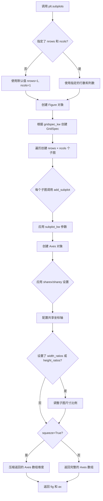

#### 带注释源码

```python
# 代码中的实际调用示例

# 第一次调用：创建单个子图
# fig: Figure对象 - 图形容器
# ax: Axes对象 - 单个子图的坐标轴
fig, ax = plt.subplots()

# 底层等价操作（简化理解）：
# 1. plt.figure() - 创建图形窗口
# 2. fig.add_subplot(1, 1, 1) - 添加1行1列的第1个子图
# 3. 返回(fig, ax)元组

# 第二次调用：创建另一个子图用于显示透明混合效果
fig, ax = plt.subplots()

# 第三次调用：创建第三个子图用于高亮显示
fig, ax = plt.subplots()

# 参数详细说明：
# fig, ax = plt.subplots(
#     nrows=1,          # 1行子图
#     ncols=1,          # 1列子图  
#     figsize=None,     # 图形尺寸，如(8, 6)
#     dpi=None,         # 分辨率
#     sharex=False,     # 不共享x轴
#     sharey=False,     # 不共享y轴
#     squeeze=True,     # 压缩单子图维度
#     subplot_kw=None,  # 子图创建参数
#     gridspec_kw=None, # 网格参数
#     **fig_kw          # 传递给figure的参数
# )
```


### `ax.imshow`

该方法用于在matplotlib的Axes对象上显示图像，支持多种参数配置以实现不同的可视化效果，包括颜色映射、数据范围设置和透明度控制。

参数：

- `X`：输入图像数据，可以是数组形式（2D或3D）
- `cmap`：str类型，颜色映射名称，用于将数据值映射到颜色
- `norm`：matplotlib.colors.Normalize实例，可选，用于数据归一化
- `aspect`：可选，图像长宽比
- `interpolation`：可选，插值方法
- `interpolation_stage`：可选，插值阶段
- `alpha`：可选，透明度值或数组，控制图像透明度
- `vmin`：可选，数据最小值，用于颜色映射
- `vmax`：可选，数据最大值，用于颜色映射
- `origin`：可选，图像原点位置
- `extent`：可选，图像的坐标范围（xmin, xmax, ymin, ymax）
- `filternorm`：可选，滤波器归一化参数
- `filterrad`：可选，滤波器半径参数
- `resample`：可选，是否重采样
- `url`：可选，设置data URL
- `data`：可选，数据坐标

返回值：`matplotlib.image.AxesImage`，返回创建的图像对象

#### 流程图

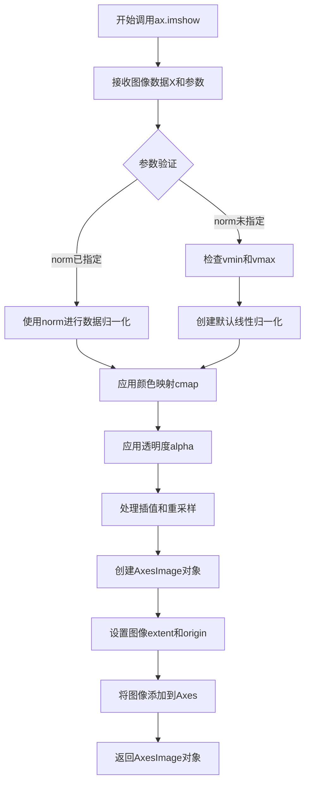

#### 带注释源码

```python
# 示例代码展示ax.imshow的多种使用场景

# 场景1: 基本图像显示
fig, ax = plt.subplots()
ax.imshow(greys)  # 显示灰色背景图像，greys为形状为(100, 100, 3)的uint8数组

# 场景2: 带颜色映射的图像显示
imshow_kwargs = {
    'vmax': vmax,          # 设置颜色映射的最大值
    'vmin': -vmax,         # 设置颜色映射的最小值
    'cmap': 'RdYlBu',      # 使用红黄蓝颜色映射
    'extent': (xmin, xmax, ymin, ymax),  # 设置图像的地理坐标范围
}
ax.imshow(weights, **imshow_kwargs)  # 显示权重数据，使用指定参数

# 场景3: 带透明度的图像显示
alphas = np.ones(weights.shape)  # 创建与权重形状相同的透明度数组
alphas[:, 30:] = np.linspace(1, 0, 70)  # 从第30列开始，透明度从1渐变到0
fig, ax = plt.subplots()
ax.imshow(greys)  # 先显示灰色背景
ax.imshow(weights, alpha=alphas, **imshow_kwargs)  # 再显示带透明度的权重数据

# 场景4: 基于数据值的透明度控制
alphas = Normalize(0, .3, clip=True)(np.abs(weights))  # 使用Normalize创建透明度映射
alphas = np.clip(alphas, .4, 1)  # 限制透明度最小值为0.4
fig, ax = plt.subplots()
ax.imshow(greys)
ax.imshow(weights, alpha=alphas, **imshow_kwargs)  # 极端值更不透明，低值更透明

# 添加等值线增强效果
ax.contour(weights[::-1], levels=[-.1, .1], colors='k', linestyles='-')
ax.set_axis_off()
plt.show()
```


### Axes.contour

绘制等高线图，用于在2D图像中突出显示不同数值水平的区域，是数据可视化的重要工具，常用于展示数据的等值线分布。

参数：

- `Z`：`array_like`，高度值数组，定义等高线的数据点，通常为2D数组
- `X`, `Y`：`array_like`，可选参数，Z的坐标。如果未提供，将使用数组索引作为坐标
- `levels`：`array_like`，可选参数，指定绘制等高线的数值水平列表，如`[-.1, .1]`表示在-0.1和0.1处绘制等高线
- `colors`：`str or array_like`，可选参数，等高线的颜色，如`'k'`表示黑色
- `linestyles`：`str or list`，可选参数，等高线的线型，如`'-'`表示实线
- `alpha`：`float`，可选参数，透明度值（0-1之间）
- `linewidths`：`float or array_like`，可选参数，等高线的线宽
- `cmap`：`str or Colormap`，可选参数，颜色映射表

返回值：`QuadContourSet`，等高线容器对象，包含所有绘制的等高线对象，可用于进一步自定义或获取等高线数据

#### 流程图

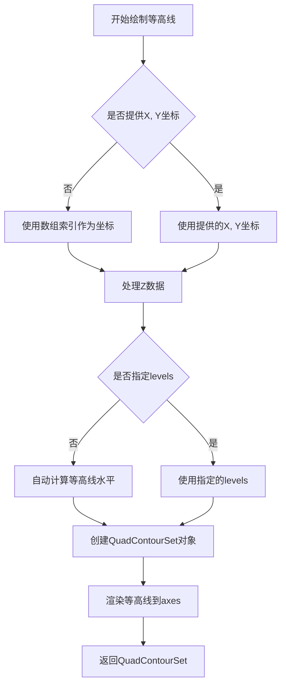

#### 带注释源码

```python
# 在代码中的实际使用示例 1：
# 创建等高线，levels=[-.1, .1]表示在-0.1和0.1处绘制两条等高线
# weights[::-1]将数组反转（Y轴方向翻转）
# colors='k'设置等高线为黑色
# linestyles='-'设置线型为实线
ax.contour(weights[::-1], levels=[-.1, .1], colors='k', linestyles='-')

# 在代码中的实际使用示例 2：
# 绘制更精细的等高线，levels=[-.0001, .0001]
# 用于突出显示更接近零值的区域
ax.contour(weights[::-1], levels=[-.0001, .0001], colors='k', linestyles='-')

# 完整的方法签名参考（来自matplotlib库）：
# Axes.contour(self, X, Y, Z, levels=None, colors=None, 
#              alpha=None, linewidths=None, linestyles=None, 
#              cmap=None, **kwargs)
#
# X: array_like, 可选, X坐标
# Y: array_like, 可选, Y坐标  
# Z: array_like, 必需, 高度数据
# levels: array_like, 可选, 等高线阈值
# colors: color or sequence, 可选, 颜色
# alpha: float, 可选, 透明度
# linewidths: float or sequence, 可选, 线宽
# linestyles: str or sequence, 可选, 线型
```


### `ax.set_axis_off` / `matplotlib.axes.Axes.set_axis_off`

该方法用于隐藏 matplotlib 图像中的坐标轴（x 轴和 y 轴），使得图像显示更加简洁，常用于绘制热图、图像或不需要坐标轴信息的可视化场景。

参数：此方法无参数。

返回值：`None`，该方法直接修改 Axes 对象的状态，不返回任何值。

#### 流程图

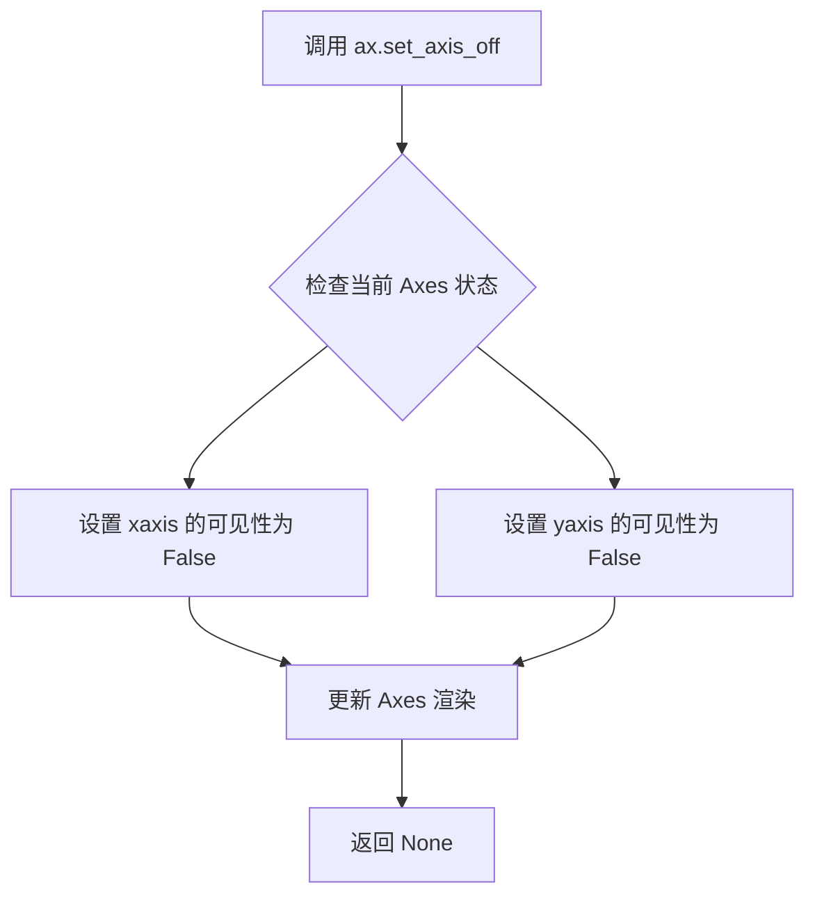

#### 带注释源码

```python
# 创建子图，返回 fig（图形对象）和 ax（坐标轴对象）
fig, ax = plt.subplots()

# 绘制灰色背景图像
ax.imshow(greys)

# 绘制权重数据的彩色图像
# 参数说明：
# - weights: 2D 数据数组
# - alpha: 透明度通道，可选
# - **imshow_kwargs: 包含 vmax, vmin, cmap, extent 的字典
ax.imshow(weights, **imshow_kwargs)

# 调用 set_axis_off() 方法隐藏坐标轴
# 该方法会设置 Axes 的 xaxis 和 yaxis 属性的 visible 属性为 False
# 从而在显示图像时不绘制坐标轴刻度、刻度标签和轴线
ax.set_axis_off()

# 再次绘制另一个权重数据的等高线图
ax.contour(weights[::-1], levels=[-.1, .1], colors='k', linestyles='-')

# 再次隐藏坐标轴（针对等高线图）
ax.set_axis_off()

# 显示最终图像
plt.show()
```


### `plt.show`

`plt.show` 是 matplotlib.pyplot 模块中的显示函数，用于将所有当前打开的图形窗口显示给用户，并阻止程序执行直到用户关闭图形（在大多数后端中）。它是可视化流程的最后一步，确保之前通过 `imshow`、`contour` 等绘图函数生成的图形能够被渲染并呈现在屏幕上。

参数：

-  `block`：`bool`，可选参数。控制是否阻塞程序执行以等待图形窗口关闭。默认为 `None`，在交互式后端中通常为 `True`，在某些后端中为 `False`。

返回值：`None`，该函数无返回值，直接作用于图形渲染。

#### 流程图

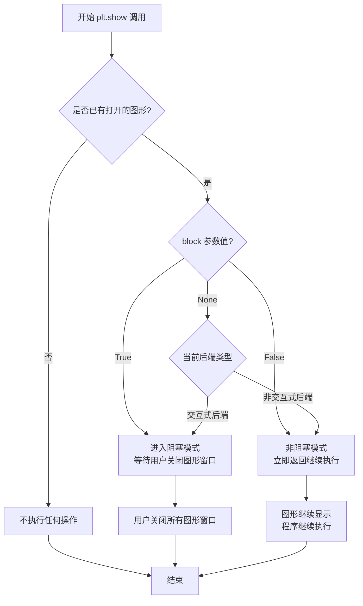

#### 带注释源码

```python
# plt.show() 函数位于 matplotlib.pyplot 模块中
# 以下是其在 matplotlib 库中的典型实现逻辑：

def show(*, block=None):
    """
    显示所有打开的图形窗口。
    
    参数:
        block: bool, optional
            如果为 True，阻塞程序执行直到用户关闭图形窗口。
            如果为 False，立即返回。
            默认为 None，根据后端类型决定行为。
    """
    
    # 获取当前所有的图形对象
    # _pylab_helpers.Gcf 是图形管理器，负责管理所有打开的图形
    allnums = get_all_figurenums()
    
    # 如果没有打开的图形，直接返回
    if not allnums:
        return
    
    # 遍历所有图形并显示
    for manager in Gcf.get_all_fig_managers():
        # 调用后端的 show 方法
        # 不同后端（Qt, Tk, matplotlib inline 等）有不同的实现
        manager.show()
    
    # 如果 block 为 True 或未指定且处于交互模式
    if block:
        # 阻止程序退出，等待用户交互
        # 在某些后端中会调用 mainloop
        import io 
        # 实际实现依赖具体后端...
    
    # 对于 inline 后端（如 Jupyter Notebook）
    # 会在单元格输出中自动渲染图形
```

在提供的代码中的实际使用：

```python
# 第一次调用 plt.show()
# 显示包含 alpha 通道渐变效果的 blobs 图像
fig, ax = plt.subplots()
ax.imshow(greys)
ax.imshow(weights, alpha=alphas, **imshow_kwargs)
ax.set_axis_off()
plt.show()  # 渲染并显示第一个图形

# 第二次调用 plt.show()
# 显示添加等高线后的图形
ax.contour(weights[::-1], levels=[-.0001, .0001], colors='k', linestyles='-')
ax.set_axis_off()
plt.show()  # 渲染并显示第二个图形
```


## 关键组件


### 数据生成模块

使用 normal_pdf 函数生成正态分布概率密度值，并通过 np.outer 计算两个高斯 blob 的权重矩阵，形成正负对比的 2D 数据场。

### 灰度背景组件

创建与权重矩阵形状相同的灰色背景图像，使用 np.full 生成 RGB 三通道灰度值（70），为后续叠加透明数据提供底层显示。

### 权重可视化组件

使用 imshow 函数将权重矩阵渲染为 RdYlBu 色谱的热力图，通过 vmax/vmin 参数设置颜色映射范围，实现正负值的蓝红对比显示。

### 透明度渐变组件

创建从左到右线性递减的 alpha 通道数组，前 30 列保持完全不透明，后 70 列从 1 线性衰减到 0，实现渐变透明效果。

### 数值归一化透明度组件

使用 matplotlib.colors.Normalize 将权重绝对值归一化到 [0, 0.3] 区间，再通过 np.clip 限制到 [.4, 1] 范围，使极端值更不透明，突出显示高幅度数据区域。

### 等高线绘制组件

在反转的权重矩阵上绘制 levels=[-.1, .1] 和 [-.0001, .0001] 的等高线，通过颜色 'k' 和实线样式 '- ' 标注数据边界和阈值区域。


## 问题及建议


### 已知问题

-   **逻辑错误**：代码中存在两个连续的 `plt.show()` 调用，在第一次 `plt.show()` 之后又对同一个 `ax` 对象执行 `ax.contour()` 操作，此时图形已关闭或刷新，后续的等高线绘制不会显示在图形上
-   **数据不一致**：第一次调用 `ax.contour(weights[::-1], ...)` 时使用了 `weights[::-1]` 翻转数据，但前面的 `ax.imshow()` 调用没有翻转，可能导致等高线与图像位置不匹配
-   **Magic Numbers**：代码中存在多个硬编码的数值（如 `30:`、`70`、`.0001`、`.0002`、`.4`、`.3` 等），缺乏解释，可读性和可维护性差
-   **缺乏类型注解**：所有函数和变量都没有类型注解，不利于代码理解和静态分析
-   **无错误处理**：代码没有对输入参数（如 `n_bins`、`xmin`、`xmax` 等）进行校验，可能在边界情况下崩溃
-   **重复代码**：多次创建 `fig, ax = plt.subplots()` 且绘图逻辑重复，未封装成可复用的函数

### 优化建议

-   移除第一个 `plt.show()`，或将两次 `contour` 绘制合并到同一个图形中，在最后统一调用 `plt.show()`
-   统一数据处理方式，确保 `imshow` 和 `contour` 使用一致的坐标方向，或在注释中明确说明翻转的原因
-   将硬编码的数值提取为具名常量（如 `ALPHA_MIN = 0.4`、`THRESHOLD = 0.0001` 等），并添加注释说明其含义
-   为函数添加类型注解，例如 `def normal_pdf(x: np.ndarray, mean: float, var: float) -> np.ndarray:`
-   在数据生成函数中添加参数校验，确保 `n_bins > 0`、`xmin < xmax` 等前置条件
-   将重复的绘图逻辑封装为函数，例如 `def create_figure_with_blobs(weights, greys, alphas=None):`，提高代码复用性


## 其它


### 设计目标与约束

本代码旨在演示如何在matplotlib中使用imshow函数将透明度与颜色混合，以突出显示2D统计数据中的特定区域（如高振幅区域）。设计约束包括：必须使用matplotlib和numpy库；数据通过模拟生成（两个二维高斯分布）；可视化需支持颜色映射和透明度渐变。

### 错误处理与异常设计

代码中未显式实现错误处理机制，主要依赖底层库（numpy、matplotlib）的异常抛出。潜在的运行时错误包括：数据形状不匹配（如alphas与weights形状不一致）导致imshow报错；无效的颜色映射参数；数值范围溢出。建议在实际应用中增加参数校验和数据验证。

### 数据流与状态机

数据流处理过程如下：输入参数（均值、方差、网格数）经过正态分布计算生成权重矩阵，然后与灰色背景图像叠加，最后通过imshow和contour进行可视化渲染。本代码不涉及状态机设计，属于线性脚本执行流程。

### 外部依赖与接口契约

核心依赖库包括：matplotlib.pyplot（用于绘图）、numpy（用于数值计算）、matplotlib.colors.Normalize（用于数据归一化）。主要接口函数为matplotlib.axes.Axes.imshow和matplotlib.axes.Axes.contour，需遵循其参数规范（如extent、cmap、alpha等）。

### 性能考虑

当前数据规模为100x100网格，计算和渲染性能良好。对于更大规模数据（如1000x1000以上），建议采用数据下采样、使用缓存机制或启用matplotlib的并行渲染，以避免性能瓶颈。

### 配置与参数

关键配置参数包括：imshow参数（vmax、vmin、cmap、extent、alpha）、contour参数（levels、colors、linestyles）、网格生成参数（xmin、xmax、ymin、ymax、n_bins）。颜色映射固定为'RdYlBu'，透明度范围为0到1。

### 安全性

代码仅包含本地数据生成和可视化，无用户输入处理，无敏感数据访问，符合安全规范。

### 可扩展性

代码设计为可复用的示例，可扩展应用于其他统计映射（如z分数、p值）的可视化。增加新功能，只需修改权重计算逻辑或透明度映射规则即可。

### 测试

当前为示例脚本，未包含自动化测试。建议在生产环境中补充单元测试，验证权重计算、透明度映射、图像渲染的正确性。

### 部署

本代码作为独立脚本运行，部署环境需安装matplotlib和numpy库。建议使用虚拟环境管理依赖，确保版本兼容性（matplotlib>=3.0, numpy>=1.0）。

    