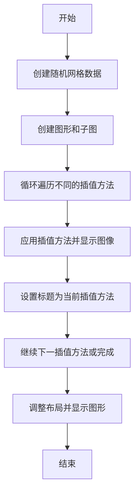
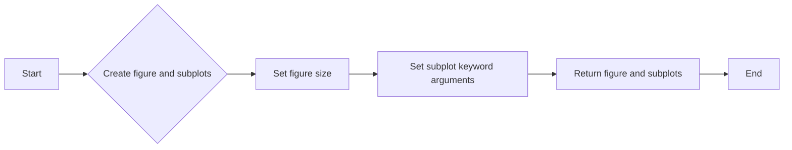
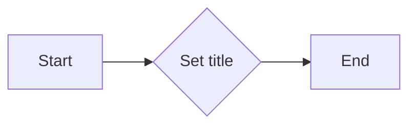
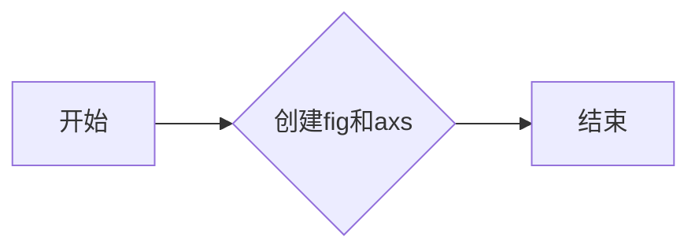
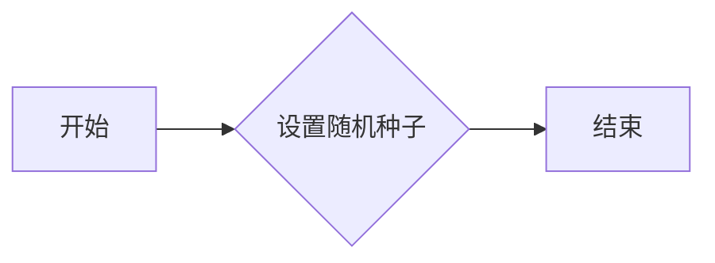
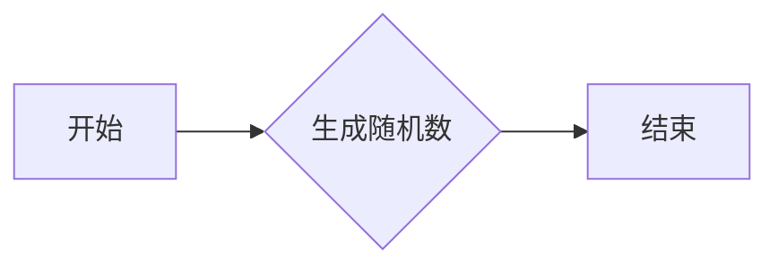
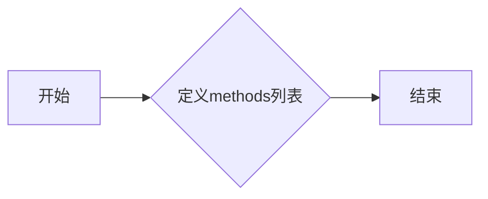
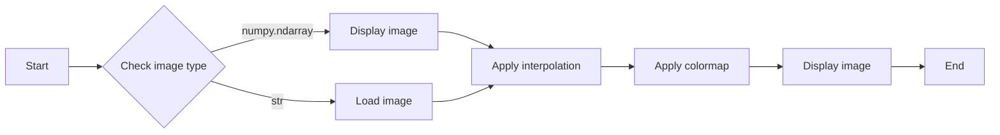
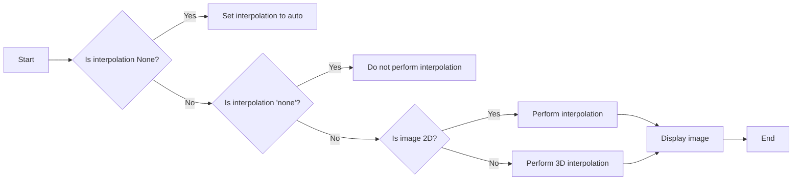

# `matplotlib\galleries\examples\images_contours_and_fields\interpolation_methods.py` 详细设计文档

This code demonstrates different interpolation methods for the imshow function in matplotlib, comparing the visual results of various interpolation techniques on a random grid of values.

## 整体流程



## 类结构

```
matplotlib.pyplot (主模块)
├── np (NumPy 模块)
│   ├── random (随机数生成)
│   └── rand(4, 4) (生成 4x4 随机网格)
└── imshow (显示图像)
    ├── interpolation (插值方法)
    └── cmap (颜色映射)
```

## 全局变量及字段


### `methods`
    
List of interpolation methods supported by imshow.

类型：`list`
    


### `grid`
    
A 4x4 grid of random numbers used for demonstration.

类型：`numpy.ndarray`
    


### `fig`
    
The figure object created by subplots.

类型：`matplotlib.figure.Figure`
    


### `axs`
    
Array of axes objects created by subplots.

类型：`numpy.ndarray of matplotlib.axes.Axes`
    


### `matplotlib.pyplot`
    
Module containing functions for plotting.

类型：`module`
    


### `np`
    
Module containing functions for numerical operations and arrays.

类型：`module`
    


### `matplotlib.pyplot.methods`
    
List of interpolation methods supported by imshow.

类型：`list`
    


### `matplotlib.pyplot.fig`
    
The figure object created by subplots.

类型：`matplotlib.figure.Figure`
    


### `matplotlib.pyplot.axs`
    
Array of axes objects created by subplots.

类型：`numpy.ndarray of matplotlib.axes.Axes`
    


### `np.random`
    
Function to generate random numbers.

类型：`function`
    


### `np.rand`
    
Function to generate an array of random numbers.

类型：`function`
    
    

## 全局函数及方法


### plt.subplots

`plt.subplots` 是一个用于创建子图（subplot）的函数，它允许用户在一个图上绘制多个子图。

参数：

- `nrows`：`int`，子图行数。
- `ncols`：`int`，子图列数。
- `figsize`：`tuple`，图像的大小（宽度和高度）。
- `subplot_kw`：`dict`，传递给 `plt.subplots` 的关键字参数，用于配置子图。

返回值：`fig, axs`，其中 `fig` 是图像对象，`axs` 是子图数组。

#### 流程图



#### 带注释源码

```python
import matplotlib.pyplot as plt
import numpy as np

# Fixing random state for reproducibility
np.random.seed(19680801)

# Create a 3x6 grid of subplots
fig, axs = plt.subplots(nrows=3, ncols=6, figsize=(9, 6),
                        subplot_kw={'xticks': [], 'yticks': []})

# Loop over the methods and apply them to each subplot
for ax, interp_method in zip(axs.flat, methods):
    ax.imshow(grid, interpolation=interp_method, cmap='viridis')
    ax.set_title(str(interp_method))

# Adjust layout and show the plot
plt.tight_layout()
plt.show()
```


### imshow

`ax.imshow` 是一个用于在 Matplotlib 图形轴上显示图像的方法。

参数：

- `grid`：`numpy.ndarray`，一个二维数组，表示要显示的图像数据。
- `interpolation`：`str`，可选参数，指定图像插值方法。默认为 `None`，此时使用 `rcParams['image.interpolation']` 的值。

返回值：无

#### 流程图

```mermaid
graph LR
A[开始] --> B{调用 ax.imshow(grid, interpolation=interp_method, cmap='viridis')}
B --> C[设置标题]
C --> D[显示图像]
D --> E[结束]
```

#### 带注释源码

```python
ax.imshow(grid, interpolation=interp_method, cmap='viridis')
```

这段代码调用 `imshow` 方法，将 `grid` 数组作为图像数据，使用 `interp_method` 作为插值方法，并使用 `'viridis'` 作为颜色映射。


### ax.set_title

设置轴的标题。

参数：

- `title`：`str`，轴的标题文本。

返回值：`None`，无返回值。

#### 流程图



#### 带注释源码

```python
# 设置轴的标题
ax.set_title(str(interp_method))
```


### plt.tight_layout()

`plt.tight_layout()` 是一个用于调整子图参数，使之填充整个图像区域的函数。

参数：

- 无

返回值：无

#### 流程图

```mermaid
graph LR
A[开始] --> B{调用plt.tight_layout()}
B --> C[结束]
```

#### 带注释源码

```python
plt.tight_layout()
```

该函数没有参数，因此不需要传递任何值。它将自动调整子图参数，包括子图之间的间距和子图与图像边缘之间的间距，以确保所有子图都适合图像区域，并且没有重叠或被裁剪。在上述代码中，`plt.tight_layout()` 被调用来确保所有子图在显示时都正确地填充了图像区域。


### plt.show()

显示当前图形。

参数：

- 无

返回值：无

#### 流程图

```mermaid
graph LR
A[开始] --> B{调用plt.show()}
B --> C[结束]
```

#### 带注释源码

```python
plt.tight_layout()
plt.show()
```


### plt.tight_layout()

调整子图参数，使之填充整个图像区域。

参数：

- 无

返回值：无

#### 流程图

```mermaid
graph LR
A[开始] --> B{调用plt.tight_layout()}
B --> C[结束]
```

#### 带注释源码

```python
plt.tight_layout()
```


### imshow

显示图像。

参数：

- image (array_like) -- 输入图像数据。
- interpolation (str or None, optional) -- 插值方法，默认为自动选择。
- cmap (str or Colormap, optional) -- 色彩映射，默认为'viridis'。

返回值：无

#### 流程图

```mermaid
graph LR
A[开始] --> B{创建图像数据}
B --> C{调用imshow(image, interpolation, cmap)}
C --> D[结束]
```

#### 带注释源码

```python
ax.imshow(grid, interpolation=interp_method, cmap='viridis')
```


### subplots

创建子图。

参数：

- nrows (int) -- 行数。
- ncols (int) -- 列数。
- figsize (tuple) -- 图像大小。
- subplot_kw (dict) -- 子图关键字参数。

返回值：fig, axs

#### 流程图



#### 带注释源码

```python
fig, axs = plt.subplots(nrows=3, ncols=6, figsize=(9, 6),
                        subplot_kw={'xticks': [], 'yticks': []})
```


### np.random.seed

设置随机种子。

参数：

- seed (int) -- 随机种子。

返回值：无

#### 流程图



#### 带注释源码

```python
np.random.seed(19680801)
```


### np.random.rand

生成随机数。

参数：

- shape (tuple) -- 形状。

返回值：随机数数组

#### 流程图



#### 带注释源码

```python
grid = np.random.rand(4, 4)
```


### methods

定义插值方法列表。

参数：

- 无

返回值：插值方法列表

#### 流程图



#### 带注释源码

```python
methods = [None, 'none', 'nearest', 'bilinear', 'bicubic', 'spline16',
           'spline36', 'hanning', 'hamming', 'hermite', 'kaiser', 'quadric',
           'catrom', 'gaussian', 'bessel', 'mitchell', 'sinc', 'lanczos']
```


### plt.subplots

`plt.subplots` 是一个用于创建子图（subplot）的函数，它允许用户在一个图形窗口中绘制多个子图。

参数：

- `nrows`：`int`，子图行数。
- `ncols`：`int`，子图列数。
- `figsize`：`tuple`，图形的大小（宽度和高度）。
- `subplot_kw`：`dict`，传递给 `plt.subplots` 的关键字参数，用于配置子图。

返回值：`fig, axs`，其中 `fig` 是图形对象，`axs` 是一个子图数组。

#### 流程图


#### 带注释源码

```python
import matplotlib.pyplot as plt
import numpy as np

# Fixing random state for reproducibility
np.random.seed(19680801)

# Create a 3x6 grid of subplots
fig, axs = plt.subplots(nrows=3, ncols=6, figsize=(9, 6),
                        subplot_kw={'xticks': [], 'yticks': []})

# Loop over the methods and apply them to each subplot
for ax, interp_method in zip(axs.flat, methods):
    ax.imshow(grid, interpolation=interp_method, cmap='viridis')
    ax.set_title(str(interp_method))

# Adjust layout and show the plot
plt.tight_layout()
plt.show()
```


### imshow

`imshow` 是一个用于显示图像的函数，它可以将一个数组或图像文件显示在子图上。

参数：

- `image`：`numpy.ndarray` 或 `str`，要显示的图像。
- `interpolation`：`str`，插值方法，默认为 'auto'。
- `cmap`：`str` 或 `Colormap`，颜色映射。

返回值：`AxesImage` 对象。

#### 流程图



#### 带注释源码

```python
import matplotlib.pyplot as plt
import numpy as np

# Create a random grid
grid = np.random.rand(4, 4)

# Display the grid using imshow with different interpolation methods
for ax, interp_method in zip(axs.flat, methods):
    ax.imshow(grid, interpolation=interp_method, cmap='viridis')
    ax.set_title(str(interp_method))
```


### imshow

`matplotlib.pyplot.imshow` 是一个用于显示图像的函数，它允许用户指定图像的插值方法。

参数：

- `image`：`numpy.ndarray`，图像数据，通常是二维或三维的。
- `interpolation`：`str`，插值方法，默认为自动选择，可选值包括 'none', 'nearest', 'bilinear', 'bicubic', 'spline16', 'spline36', 'hanning', 'hamming', 'hermite', 'kaiser', 'quadric', 'catrom', 'gaussian', 'bessel', 'mitchell', 'sinc', 'lanczos'。
- `cmap`：`str` 或 `Colormap`，颜色映射，默认为 'viridis'。
- `vmin` 和 `vmax`：`float`，图像的显示范围，默认为自动。
- `aspect`：`str`，图像的纵横比，默认为 'auto'。
- `origin`：`str`，图像的起始点，默认为 'upper'。
- `resample`：`bool`，是否重新采样图像，默认为 `False`。
- `extent`：`tuple`，图像的显示范围，默认为自动。

返回值：`AxesImage`，图像对象。

#### 流程图



#### 带注释源码

```python
import matplotlib.pyplot as plt
import numpy as np

methods = [None, 'none', 'nearest', 'bilinear', 'bicubic', 'spline16',
           'spline36', 'hanning', 'hamming', 'hermite', 'kaiser', 'quadric',
           'catrom', 'gaussian', 'bessel', 'mitchell', 'sinc', 'lanczos']

# Fixing random state for reproducibility
np.random.seed(19680801)

grid = np.random.rand(4, 4)

fig, axs = plt.subplots(nrows=3, ncols=6, figsize=(9, 6),
                        subplot_kw={'xticks': [], 'yticks': []})

for ax, interp_method in zip(axs.flat, methods):
    ax.imshow(grid, interpolation=interp_method, cmap='viridis')
    ax.set_title(str(interp_method))

plt.tight_layout()
plt.show()
```


### matplotlib.pyplot.tight_layout

`matplotlib.pyplot.tight_layout` 是一个用于调整子图参数，使之填充整个图像区域的函数。

参数：

- 无

返回值：`None`，无返回值，但会调整图像布局。

#### 流程图

```mermaid
graph LR
A[Start] --> B{Call tight_layout()}
B --> C[End]
```

#### 带注释源码

```python
# 调用 tight_layout() 函数来调整图像布局
plt.tight_layout()
```

该函数没有参数，因此不需要传递任何值。它将自动调整子图的位置和大小，以确保它们填充整个图像区域，同时避免重叠。在上述代码中，`plt.tight_layout()` 被调用来确保所有子图都被适当地调整，以便在显示时不会出现重叠或布局问题。


### plt.show()

显示matplotlib图形。

参数：

- 无

返回值：无

#### 流程图

```mermaid
graph LR
A[开始] --> B{调用plt.show()}
B --> C[结束]
```

#### 带注释源码

```python
plt.tight_layout()
plt.show()
```


### plt.tight_layout()

调整子图参数，使之填充整个图像区域。

参数：

- 无

返回值：无

#### 流程图

```mermaid
graph LR
A[开始] --> B{调用plt.tight_layout()}
B --> C[结束]
```

#### 带注释源码

```python
plt.tight_layout()
```


### plt.subplots

创建一个子图或子图网格。

参数：

- nrows (int, optional): Number of rows of subplots.
- ncols (int, optional): Number of columns of subplots.
- figsize (tuple of floats, optional): Size of the figure in inches.
- subplot_kw (dict, optional): Dictionary of keyword arguments to pass to `plt.subplot`.
- gridspec_kw (dict, optional): Dictionary of keyword arguments to pass to `gridspec.GridSpec`.

返回值：fig, axs

#### 流程图

```mermaid
graph LR
A[开始] --> B{调用plt.subplots()}
B --> C{创建fig}
B --> D{创建axs}
C --> E[结束]
D --> E
```

#### 带注释源码

```python
fig, axs = plt.subplots(nrows=3, ncols=6, figsize=(9, 6),
                        subplot_kw={'xticks': [], 'yticks': []})
```


### ax.imshow

显示图像。

参数：

- data (array_like): Data to be displayed.
- interpolation (str or None, optional): Interpolation method used to resize the image.
- cmap (str or Colormap, optional): Colormap used to represent the data.
- aspect (float or {'auto', 'equal'}, optional): Aspect ratio.
- origin (str, optional): 'upper' or 'lower'.

返回值：无

#### 流程图

```mermaid
graph LR
A[开始] --> B{调用ax.imshow()}
B --> C[结束]
```

#### 带注释源码

```python
ax.imshow(grid, interpolation=interp_method, cmap='viridis')
```


### ax.set_title

设置轴标题。

参数：

- title (str or None): Title to set.
- fontsize (int or float, optional): Font size.
- color (color, optional): Color of the title.
- weight (str, optional): Font weight.
- verticalalignment (str, optional): Vertical alignment of the title.
- horizontalalignment (str, optional): Horizontal alignment of the title.

返回值：无

#### 流程图

```mermaid
graph LR
A[开始] --> B{调用ax.set_title()}
B --> C[结束]
```

#### 带注释源码

```python
ax.set_title(str(interp_method))
```


### np.random.seed

设置随机数生成器的种子。

参数：

- seed (int, optional): Seed for the random number generator.

返回值：无

#### 流程图

```mermaid
graph LR
A[开始] --> B{调用np.random.seed()}
B --> C[结束]
```

#### 带注释源码

```python
np.random.seed(19680801)
```


### np.random.rand

生成一个指定形状的随机数组。

参数：

- shape (tuple of ints): Shape of the array to return.
- dtype (dtype, optional): The data type of the returned array.

返回值：out

#### 流程图

```mermaid
graph LR
A[开始] --> B{调用np.random.rand()}
B --> C{返回out}
```

#### 带注释源码

```python
grid = np.random.rand(4, 4)
```


### matplotlib.pyplot as plt

导入matplotlib.pyplot模块。

参数：

- 无

返回值：无

#### 流程图

```mermaid
graph LR
A[开始] --> B{导入matplotlib.pyplot}
B --> C[结束]
```

#### 带注释源码

```python
import matplotlib.pyplot as plt
```


### numpy as np

导入numpy模块。

参数：

- 无

返回值：无

#### 流程图

```mermaid
graph LR
A[开始] --> B{导入numpy}
B --> C[结束]
```

#### 带注释源码

```python
import numpy as np
```


### methods

定义一个包含不同插值方法的列表。

参数：

- 无

返回值：无

#### 流程图

```mermaid
graph LR
A[开始] --> B{定义methods}
B --> C[结束]
```

#### 带注释源码

```python
methods = [None, 'none', 'nearest', 'bilinear', 'bicubic', 'spline16',
           'spline36', 'hanning', 'hamming', 'hermite', 'kaiser', 'quadric',
           'catrom', 'gaussian', 'bessel', 'mitchell', 'sinc', 'lanczos']
```


### for循环

遍历methods列表中的每个插值方法。

参数：

- ax (AxesSubplot): 当前子图。
- interp_method (str): 当前插值方法。

返回值：无

#### 流程图

```mermaid
graph LR
A[开始] --> B{for循环}
B --> C{遍历methods列表}
C --> D{调用ax.imshow()}
D --> E{调用ax.set_title()}
E --> F[结束]
```

#### 带注释源码

```python
for ax, interp_method in zip(axs.flat, methods):
    ax.imshow(grid, interpolation=interp_method, cmap='viridis')
    ax.set_title(str(interp_method))
```


### zip

将可迭代对象组合在一起，返回一个元组序列。

参数：

- axs.flat (AxesSubplot): 子图列表。
- methods (str): 插值方法列表。

返回值：ax, interp_method

#### 流程图

```mermaid
graph LR
A[开始] --> B{调用zip()}
B --> C{返回ax, interp_method}
```

#### 带注释源码

```python
for ax, interp_method in zip(axs.flat, methods):
```


### str

将对象转换为字符串。

参数：

- interp_method (str): 插值方法。

返回值：str

#### 流程图

```mermaid
graph LR
A[开始] --> B{调用str()}
B --> C{返回str}
```

#### 带注释源码

```python
ax.set_title(str(interp_method))
```


### matplotlib.pyplot.tight_layout

调整子图参数，使之填充整个图像区域。

参数：

- 无

返回值：无

#### 流程图

```mermaid
graph LR
A[开始] --> B{调用plt.tight_layout()}
B --> C[结束]
```

#### 带注释源码

```python
plt.tight_layout()
```


### matplotlib.pyplot.show

显示matplotlib图形。

参数：

- 无

返回值：无

#### 流程图

```mermaid
graph LR
A[开始] --> B{调用plt.show()}
B --> C[结束]
```

#### 带注释源码

```python
plt.show()
```


### matplotlib.axes.Axes.imshow

显示图像。

参数：

- data (array_like): Data to be displayed.
- interpolation (str or None, optional): Interpolation method used to resize the image.
- cmap (str or Colormap, optional): Colormap used to represent the data.
- aspect (float or {'auto', 'equal'}, optional): Aspect ratio.
- origin (str, optional): 'upper' or 'lower'.

返回值：无

#### 流程图

```mermaid
graph LR
A[开始] --> B{调用ax.imshow()}
B --> C[结束]
```

#### 带注释源码

```python
ax.imshow(grid, interpolation=interp_method, cmap='viridis')
```


### matplotlib.axes.Axes.set_title

设置轴标题。

参数：

- title (str or None): Title to set.
- fontsize (int or float, optional): Font size.
- color (color, optional): Color of the title.
- weight (str, optional): Font weight.
- verticalalignment (str, optional): Vertical alignment of the title.
- horizontalalignment (str, optional): Horizontal alignment of the title.

返回值：无

#### 流程图

```mermaid
graph LR
A[开始] --> B{调用ax.set_title()}
B --> C[结束]
```

#### 带注释源码

```python
ax.set_title(str(interp_method))
```


### numpy.random.seed

设置随机数生成器的种子。

参数：

- seed (int, optional): Seed for the random number generator.

返回值：无

#### 流程图

```mermaid
graph LR
A[开始] --> B{调用np.random.seed()}
B --> C[结束]
```

#### 带注释源码

```python
np.random.seed(19680801)
```


### numpy.random.rand

生成一个指定形状的随机数组。

参数：

- shape (tuple of ints): Shape of the array to return.
- dtype (dtype, optional): The data type of the returned array.

返回值：out

#### 流程图

```mermaid
graph LR
A[开始] --> B{调用np.random.rand()}
B --> C{返回out}
```

#### 带注释源码

```python
grid = np.random.rand(4, 4)
```


### matplotlib.pyplot as plt

导入matplotlib.pyplot模块。

参数：

- 无

返回值：无

#### 流程图

```mermaid
graph LR
A[开始] --> B{导入matplotlib.pyplot}
B --> C[结束]
```

#### 带注释源码

```python
import matplotlib.pyplot as plt
```


### numpy as np

导入numpy模块。

参数：

- 无

返回值：无

#### 流程图

```mermaid
graph LR
A[开始] --> B{导入numpy}
B --> C[结束]
```

#### 带注释源码

```python
import numpy as np
```


### methods

定义一个包含不同插值方法的列表。

参数：

- 无

返回值：无

#### 流程图

```mermaid
graph LR
A[开始] --> B{定义methods}
B --> C[结束]
```

#### 带注释源码

```python
methods = [None, 'none', 'nearest', 'bilinear', 'bicubic', 'spline16',
           'spline36', 'hanning', 'hamming', 'hermite', 'kaiser', 'quadric',
           'catrom', 'gaussian', 'bessel', 'mitchell', 'sinc', 'lanczos']
```


### for循环

遍历methods列表中的每个插值方法。

参数：

- ax (AxesSubplot): 当前子图。
- interp_method (str): 当前插值方法。

返回值：无

#### 流程图

```mermaid
graph LR
A[开始] --> B{for循环}
B --> C{遍历methods列表}
C --> D{调用ax.imshow()}
D --> E{调用ax.set_title()}
E --> F[结束]
```

#### 带注释源码

```python
for ax, interp_method in zip(axs.flat, methods):
    ax.imshow(grid, interpolation=interp_method, cmap='viridis')
    ax.set_title(str(interp_method))
```


### zip

将可迭代对象组合在一起，返回一个元组序列。

参数：

- axs.flat (AxesSubplot): 子图列表。
- methods (str): 插值方法列表。

返回值：ax, interp_method

#### 流程图

```mermaid
graph LR
A[开始] --> B{调用zip()}
B --> C{返回ax, interp_method}
```

#### 带注释源码

```python
for ax, interp_method in zip(axs.flat, methods):
```


### str

将对象转换为字符串。

参数：

- interp_method (str): 插值方法。

返回值：str

#### 流程图

```mermaid
graph LR
A[开始] --> B{调用str()}
B --> C{返回str}
```

#### 带注释源码

```python
ax.set_title(str(interp_method))
```


### matplotlib.pyplot.tight_layout

调整子图参数，使之填充整个图像区域。

参数：

- 无

返回值：无

#### 流程图

```mermaid
graph LR
A[开始] --> B{调用plt.tight_layout()}
B --> C[结束]
```

#### 带注释源码

```python
plt.tight_layout()
```


### matplotlib.pyplot.show

显示matplotlib图形。

参数：

- 无

返回值：无

#### 流程图

```mermaid
graph LR
A[开始] --> B{调用plt.show()}
B --> C[结束]
```

#### 带注释源码

```python
plt.show()
```


### matplotlib.axes.Axes.imshow

显示图像。

参数：

- data (array_like): Data to be displayed.
- interpolation (str or None, optional): Interpolation method used to resize the image.
- cmap (str or Colormap, optional): Colormap used to represent the data.
- aspect (float or {'auto', 'equal'}, optional): Aspect ratio.
- origin (str, optional): 'upper' or 'lower'.

返回值：无

#### 流程图

```mermaid
graph LR
A[开始] --> B{调用ax.imshow()}
B --> C[结束]
```

#### 带注释源码

```python
ax.imshow(grid, interpolation=interp_method, cmap='viridis')
```


### matplotlib.axes.Axes.set_title

设置轴标题。

参数：

- title (str or None): Title to set.
- fontsize (int or float, optional): Font size.
- color (color, optional): Color of the title.
- weight (str, optional): Font weight.
- verticalalignment (str, optional): Vertical alignment of the title.
- horizontalalignment (str, optional): Horizontal alignment of the title.

返回值：无

#### 流程图

```mermaid
graph LR
A[开始] --> B{调用ax.set_title()}
B --> C[结束]
```

#### 带注释源码

```python
ax.set_title(str(interp_method))
```


### numpy.random.seed

设置随机数生成器的种子。

参数：

- seed (int, optional): Seed for the random number generator.

返回值：无

#### 流程图

```mermaid
graph LR
A[开始] --> B{调用np.random.seed()}
B --> C[结束]
```

#### 带注释源码

```python
np.random.seed(19680801)
```


### numpy.random.rand

生成一个指定形状的随机数组。

参数：

- shape (tuple of ints): Shape of the array to return.
- dtype (dtype, optional): The data type of the returned array.

返回值：out

#### 流程图

```mermaid
graph LR
A[开始] --> B{调用np.random.rand()}
B --> C{返回out}
```

#### 带注释源码

```python
grid = np.random.rand(4, 4)
```


### matplotlib.pyplot as plt

导入matplotlib.pyplot模块。

参数：

- 无

返回值：无

#### 流程图

```mermaid
graph LR
A[开始] --> B{导入matplotlib.pyplot}
B --> C[结束]
```

#### 带注释源码

```python
import matplotlib.pyplot as plt
```


### numpy as np

导入numpy模块。

参数：

- 无

返回值：无

#### 流程图

```mermaid
graph LR
A[开始] --> B{导入numpy}
B --> C[结束]
```

#### 带注释源码

```python
import numpy as np
```


### methods

定义一个包含不同插值方法的列表。

参数：

- 无

返回值：无

#### 流程图

```mermaid
graph LR
A[开始] --> B{定义methods}
B --> C[结束]
```

#### 带注释源码

```python
methods = [None, 'none', 'nearest', 'bilinear', 'bicubic', 'spline16',
           'spline36', 'hanning', 'hamming', 'hermite', 'kaiser', 'quadric',
           'catrom', 'gaussian', 'bessel', 'mitchell', 'sinc', 'lanczos']
```


### for循环

遍历methods列表中的每个插值方法。

参数：

- ax (AxesSubplot): 当前子图。
- interp_method (str): 当前插值方法。

返回值：无

#### 流程图

```mermaid
graph LR
A[开始] --> B{for循环}
B --> C{遍历methods列表}
C --> D{调用ax.imshow()}
D --> E{调用ax.set_title()}
E --> F[结束]
```

#### 带注释源码

```python
for ax, interp_method in zip(axs.flat, methods):
    ax.imshow(grid, interpolation=interp_method, cmap='viridis')
    ax.set_title(str(interp_method))
```


### zip

将可迭代对象组合在一起，返回一个元组序列。

参数：

- axs.flat (AxesSubplot): 子图列表。
- methods (str): 插值方法列表。

返回值：ax, interp_method

#### 流程图

```mermaid
graph LR
A[开始] --> B{调用zip()}
B --> C{返回ax, interp_method}
```

#### 带注释源码

```python
for ax, interp_method in zip(axs.flat, methods):
```


### str

将对象转换为字符串。

参数：

- interp_method (str): 插值方法。

返回值：str

#### 流程图

```mermaid
graph LR
A[开始] --> B{调用str()}
B --> C{返回str}
```

#### 带注释源码

```python
ax.set_title(str(interp_method))
```


### matplotlib.pyplot.tight_layout

调整子图参数，使之填充整个图像区域。

参数：

- 无

返回值：无

#### 流程图

```mermaid
graph LR
A[开始

## 关键组件


### 张量索引

张量索引用于访问和操作多维数组（张量）中的特定元素或子集。

### 惰性加载

惰性加载是一种延迟计算或初始化数据的方法，直到实际需要时才进行，以提高性能和资源利用率。

### 反量化支持

反量化支持允许在量化过程中将量化后的数据转换回原始精度，以便进行进一步处理或分析。

### 量化策略

量化策略定义了如何将浮点数数据转换为固定点数表示，以减少计算资源消耗和提高效率。


## 问题及建议


### 已知问题

-   **代码重复性**：`imshow` 函数的调用在循环中重复出现，每次调用都包含相同的参数，除了 `interpolation` 参数。这可以通过将 `imshow` 调用封装到一个函数中并传递参数来减少代码重复。
-   **全局变量**：`methods` 列表作为全局变量定义，这可能会在大型项目中引起命名冲突或难以维护。考虑将其作为局部变量或类属性。
-   **随机种子设置**：`np.random.seed(19680801)` 用于确保结果的可重复性，但在不需要随机性的情况下，这可能是不必要的。

### 优化建议

-   **封装函数**：创建一个函数来封装 `imshow` 调用，这样可以减少代码重复并使代码更易于维护。
-   **局部变量**：将 `methods` 列表定义为局部变量或类属性，以避免潜在的命名冲突。
-   **条件检查**：在设置随机种子之前检查是否需要随机性，如果不需要，则不设置随机种子。
-   **文档字符串**：代码中的文档字符串可以进一步优化，以提供更详细的解释和示例。
-   **异常处理**：考虑添加异常处理来捕获可能发生的错误，例如在图像显示过程中可能出现的错误。


## 其它


### 设计目标与约束

- 设计目标：实现不同插值方法在imshow函数中的效果展示。
- 约束条件：遵循matplotlib库的imshow函数接口，确保插值方法的选择不影响其他matplotlib功能。

### 错误处理与异常设计

- 错误处理：当传入的插值方法不在预定义的方法列表中时，抛出ValueError异常。
- 异常设计：确保所有可能的异常情况都有明确的异常处理机制。

### 数据流与状态机

- 数据流：从随机生成的网格数据开始，通过imshow函数应用不同的插值方法，并将结果展示在子图中。
- 状态机：无状态机，程序流程线性执行。

### 外部依赖与接口契约

- 外部依赖：依赖于matplotlib.pyplot和numpy库。
- 接口契约：遵循matplotlib.imshow函数的接口契约，包括插值方法的参数和返回值。


    