# `matplotlib\galleries\examples\images_contours_and_fields\irregulardatagrid.py` 详细设计文档

这是一个matplotlib演示脚本，展示如何绘制不规则间距数据的等高线图。代码通过两种方法对比：一是先将数据插值到规则网格再用contour绘制，二是直接使用tricontour处理不规则三角网格。

## 整体流程

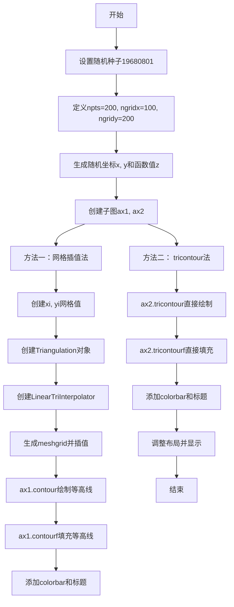

## 类结构

```
Python脚本 (非面向对象)
├── 导入模块
│   ├── matplotlib.pyplot (plt)
│   ├── numpy (np)
│   └── matplotlib.tri (tri)
└── 主要操作
    ├── 数据生成 (x, y, z)
    ├── 网格插值方法 (Triangulation + LinearTriInterpolator)
    └── tricontour方法 (直接三角剖分)
```

## 全局变量及字段


### `npts`
    
随机数据点数量，用于生成不规则分布的采样点

类型：`int`
    


### `ngridx`
    
网格x方向点数，定义插值网格在x方向的分辨率

类型：`int`
    


### `ngridy`
    
网格y方向点数，定义插值网格在y方向的分辨率

类型：`int`
    


### `x`
    
随机生成的x坐标，在[-2, 2]区间内均匀分布

类型：`ndarray`
    


### `y`
    
随机生成的y坐标，在[-2, 2]区间内均匀分布

类型：`ndarray`
    


### `z`
    
基于函数计算的z值，使用表达式 x*exp(-x^2-y^2) 计算

类型：`ndarray`
    


### `xi`
    
网格x坐标向量，从-2.1到2.1的线性间隔数组

类型：`ndarray`
    


### `yi`
    
网格y坐标向量，从-2.1到2.1的线性间隔数组

类型：`ndarray`
    


### `triang`
    
三角剖分对象，包含不规则数据点的三角网格划分

类型：`Triangulation`
    


### `interpolator`
    
线性插值器，用于在三角网上进行线性插值计算

类型：`LinearTriInterpolator`
    


### `Xi`
    
网格x坐标矩阵，由meshgrid生成的二维数组

类型：`ndarray`
    


### `Yi`
    
网格y坐标矩阵，由meshgrid生成的二维数组

类型：`ndarray`
    


### `zi`
    
插值后的z值矩阵，在规则网格上的插值结果

类型：`ndarray`
    


### `fig`
    
图形对象，包含整个matplotlib.figure.Figure实例

类型：`Figure`
    


### `ax1`
    
第一个子图坐标轴，用于绘制网格插值后的等高线图

类型：`Axes`
    


### `ax2`
    
第二个子图坐标轴，用于绘制tricontour等高线图

类型：`Axes`
    


### `cntr1`
    
等高线集合对象，包含网格插值方法的等高线数据

类型：`QuadContourSet`
    


### `cntr2`
    
等高线集合对象，包含tricontour方法的等高线数据

类型：`QuadContourSet`
    


### `Triangulation.x`
    
三角剖分中所有采样点的x坐标数组

类型：`ndarray`
    


### `Triangulation.y`
    
三角剖分中所有采样点的y坐标数组

类型：`ndarray`
    


### `Triangulation.triangles`
    
三角网格的顶点索引数组，定义每个三角形的三个顶点

类型：`ndarray`
    


### `Triangulation.mask`
    
三角形掩码数组，用于标记需要排除的三角形

类型：`ndarray`
    


### `LinearTriInterpolator.triangulation`
    
线性插值器使用的三角剖分对象

类型：`Triangulation`
    


### `LinearTriInterpolator.z`
    
与三角剖分节点对应的函数值数组，用于插值计算

类型：`ndarray`
    
    

## 全局函数及方法


### `np.random.uniform`

该函数是NumPy库中的随机数生成函数，用于从均匀分布的连续随机变量中生成随机数。在本代码中用于生成200个x和y坐标的随机值，范围在[-2, 2]之间，以模拟不规则分布的散点数据点。

参数：

- `low`：`float`（或类似数值类型），均匀分布的下界（包含），本例中为-2
- `high`：`float`（或类似数值类型），均匀分布的上界（不包含），本例中为2
- `size`：`int` 或 `tuple of ints`，输出数组的形状，本例中为npts（200）

返回值：`numpy.ndarray`，包含指定数量的均匀分布随机数的NumPy数组，数组元素类型为float64

#### 流程图

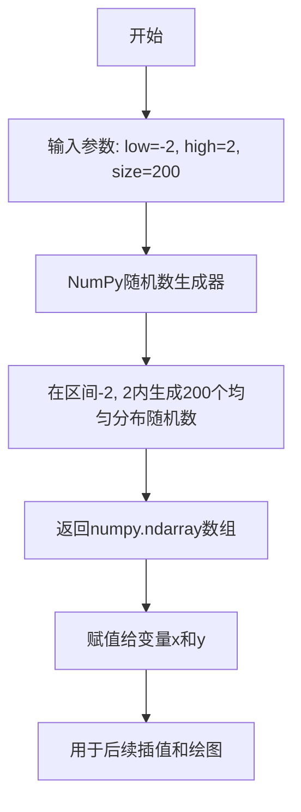

#### 带注释源码

```python
# 设置随机种子以确保结果可复现
np.random.seed(19680801)

# 定义随机点的数量
npts = 200

# 使用np.random.uniform生成在[-2, 2)范围内的200个随机x坐标
# 参数说明：
#   low=-2: 均匀分布下界
#   high=2: 均匀分布上界
#   size=npts: 输出数组大小为200个元素
x = np.random.uniform(-2, 2, npts)

# 使用np.random.uniform生成在[-2, 2)范围内的200个随机y坐标
# y坐标与x坐标生成方式相同，用于创建二维散点分布
y = np.random.uniform(-2, 2, npts)

# 生成对应的函数值z = x * exp(-x² - y²)
# 这是一个典型的二维测试函数，用于演示等高线绘制
z = x * np.exp(-x**2 - y**2)
```

#### 关键组件信息

- `np.random.RandomState.uniform`：底层实现函数，基于 Mersenne Twister 算法生成伪随机数
- `npts`：全局变量，控制随机点数量（本例中为200）

#### 潜在的技术债务或优化空间

1. **随机数生成方式**：使用`np.random.uniform`是传统方式，在NumPy 1.17+中推荐使用`np.random.Generator`配合`Generator.uniform`方法，可提供更好的统计性能和随机性
2. **硬编码参数**：随机范围(-2, 2)和点数量(npts=200)硬编码在代码中，缺乏灵活性
3. **可复现性依赖**：依赖全局随机种子设置，若seed设置位置变化可能影响结果

#### 其它项目

**设计目标与约束**：
- 目标：生成不规则分布的测试数据点，用于演示matplotlib的等高线绘制功能
- 约束：数据需要覆盖[-2, 2]×[-2, 2]的矩形区域

**错误处理与异常设计**：
- 当high <= low时会触发ValueError
- size为负数或非整数时会触发TypeError
- NumPy会自动处理数组越界情况

**数据流与状态机**：
1. 初始化随机种子 → 2. 生成随机坐标 → 3. 计算函数值 → 4. 传递给绘图函数

**外部依赖与接口契约**：
- 依赖NumPy库，需要确保NumPy已正确安装
- 返回值类型固定为numpy.ndarray，调用方需兼容此接口


### `np.random.seed`

设置随机数生成器的种子，以确保后续生成的随机数序列可重复。

参数：

-  `seed`：`int` 或 `None`，随机数种子值。传入整数时，会将该值作为种子初始化随机数生成器；传入`None`时，会从操作系统获取随机种子（每次运行生成的随机序列不同）。

返回值：`None`，该函数无返回值，直接修改随机数生成器的内部状态。

#### 流程图

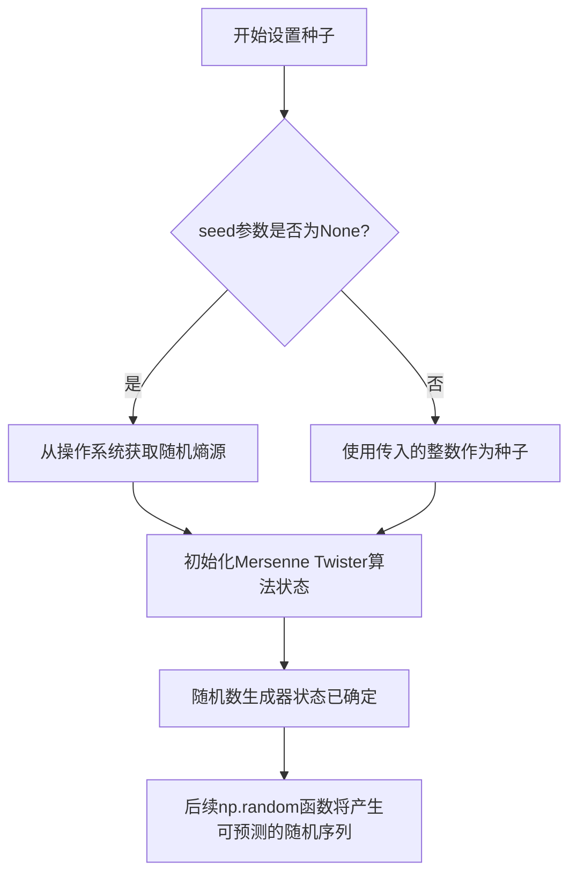

#### 带注释源码

```python
# 在NumPy中，np.random.seed()的典型调用方式如下：
# 这行代码设置了随机数生成器的种子值为19680801
# 作用：确保后续使用np.random生成的随机数序列在每次运行程序时都相同
# 这对于代码调试、结果复现以及科学实验的可重复性非常重要

np.random.seed(19680801)

# 设置种子后，后续的随机数生成操作将产生确定的序列
# 例如：np.random.uniform(-2, 2, npts) 每次运行都会生成相同的随机数序列

npts = 200
ngridx = 100
ngridy = 200
x = np.random.uniform(-2, 2, npts)  # 生成200个在[-2, 2]范围内的随机数
y = np.random.uniform(-2, 2, npts)  # 同样，由于种子已固定，y的值也固定
z = x * np.exp(-x**2 - y**2)        # 基于固定的x, y计算z
```


### `np.linspace`

生成等间距的数字序列，并返回等间距的样本数组。

参数：

- `start`：`array_like`，序列的起始值
- `stop`：`array_like`，序列的结束值（除非 `endpoint` 为 `False`）
- `num`：`int`，生成的样本数量，默认为 50
- `endpoint`：`bool`，如果为 `True`，停止值包含在序列中，默认为 `True`
- `retstep`：`bool`，如果为 `True`，返回 `(samples, step)`，其中 `step` 是样本之间的间距，默认为 `False`
- `dtype`：`dtype`，输出数组的类型，如果未指定，则从输入推断
- `axis`：`int`，结果中样本存储的轴（当 `start` 或 `stop` 不是标量时使用）

返回值：`ndarray` 或 `ndarrays` 的元组，当 `retstep` 为 `True` 时返回 `(samples, step)`，否则返回 `samples`

#### 流程图

```mermaid
flowchart TD
    A[开始] --> B[验证参数]
    B --> C{endpoint是否为True?}
    C -->|Yes| D[计算样本数 = num - 1]
    C -->|No| E[计算样本数 = num]
    D --> F[计算步长 = (stop - start) / 样本数]
    E --> F
    F --> G[生成等间距数组]
    G --> H{retstep是否为True?}
    H -->|Yes| I[返回数组和步长]
    H -->|No| J[仅返回数组]
    I --> K[结束]
    J --> K
```

#### 带注释源码

```python
# 在代码中使用 np.linspace 生成网格坐标
# 用于在二维平面上创建等间距的采样点

# 创建 x 方向的网格值
# 从 -2.1 到 2.1，生成 100 个等间距的点
xi = np.linspace(-2.1, 2.1, ngridx)

# 创建 y 方向的网格值  
# 从 -2.1 到 2.1，生成 200 个等间距的点
yi = np.linspace(-2.1, 2.1, ngridy)

# 参数说明：
# -2.1: start 参数，网格的起始坐标
# 2.1: stop 参数，网格的结束坐标
# ngridx/ngridy: num 参数，分别生成 100 和 200 个采样点

# 返回值：
# xi: 包含 100 个从 -2.1 到 2.1 等间距分布的浮点数数组
# yi: 包含 200 个从 -2.1 到 2.1 等间距分布的浮点数数组
# 这些数组将用于后续的网格插值和等高线绘制
```


### `np.meshgrid`

生成网格坐标，用于在二维空间中创建矩形网格。

参数：

- `xi`：`array_like`，一维数组，表示 x 轴上的坐标点（例如通过 `np.linspace` 生成）
- `yi`：`array_like`，一维数组，表示 y 轴上的坐标点（例如通过 `np.linspace` 生成）

返回值：`tuple of ndarrays`，返回两个二维数组 `(Xi, Yi)`。其中：
- `Xi`：形状为 `(len(yi), len(xi))` 的二维数组，每行相同，表示 x 坐标的网格
- `Yi`：形状为 `(len(yi), len(xi))` 的二维数组，每列相同，表示 y 坐标的网格

#### 流程图

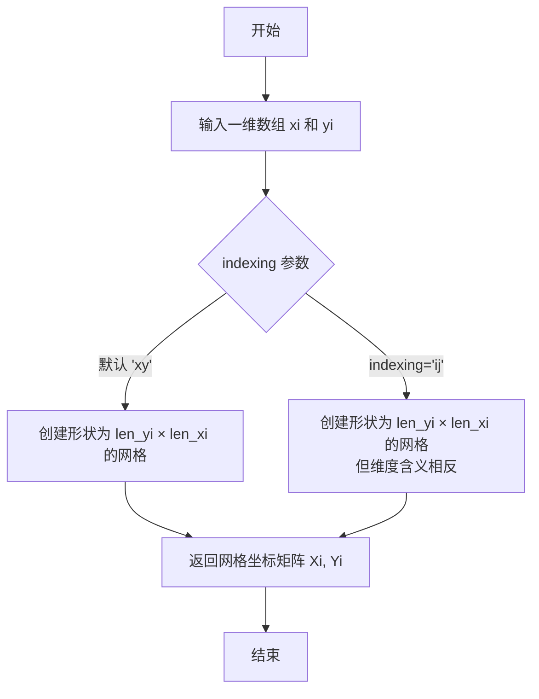

#### 带注释源码

```python
# 示例代码片段
import numpy as np

# 创建一维坐标数组
xi = np.linspace(-2.1, 2.1, 100)  # x 轴上 100 个等间距点
yi = np.linspace(-2.1, 2.1, 200)  # y 轴上 200 个等间距点

# 使用 np.meshgrid 生成二维网格坐标
# Xi: shape (200, 100) - 每行是相同的 x 坐标
# Yi: shape (200, 100) - 每列是相同的 y 坐标
Xi, Yi = np.meshgrid(xi, yi)

# 生成的网格可用于评估二维函数
zi = Xi * np.exp(-Xi**2 - Yi**2)
```


### plt.subplots

创建包含多个子图的Figure图形，并返回Figure对象和Axes对象（或数组）。

参数：

- `nrows`：`int`，默认值为1，子图的行数
- `ncols`：`int`，默认值为1，子图的列数
- `sharex`：`bool or {'none', 'all', 'row', 'col'}`，默认值为False，控制子图之间是否共享x轴
- `sharey`：`bool or {'none', 'all', 'row', 'col'}`，默认值为False，控制子图之间是否共享y轴
- `squeeze`：`bool`，默认值为True，若为True，则返回的axes数组维度会被压缩（对于单行或单列情况）
- `width_ratios`：`array-like`，可选参数，定义每列的相对宽度比例
- `height_ratios`：`array-like`，可选参数，定义每行的相对高度比例
- `subplot_kw`：`dict`，可选参数，传递给`add_subplot`的关键字参数，用于创建每个子图
- `gridspec_kw`：`dict`，可选参数，传递给GridSpec构造函数的关键字参数，用于控制子图布局

返回值：`tuple(Figure, Axes or array of Axes)`，返回一个元组，包含创建的Figure对象和Axes对象（或Axes对象数组）

#### 流程图

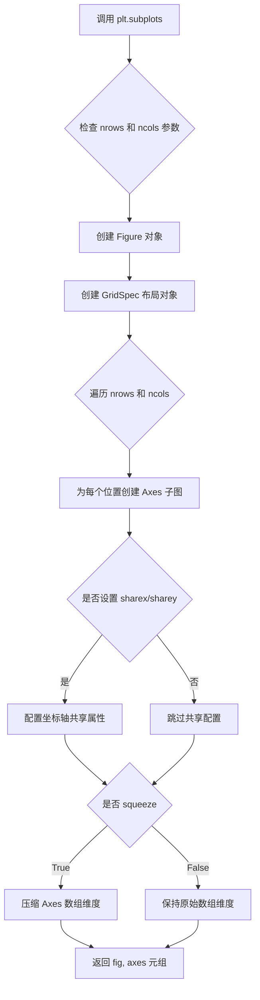

#### 带注释源码

```python
# 创建包含2行子图的图形，返回Figure对象和Axes数组
# nrows=2 表示创建2行1列的子图布局
fig, (ax1, ax2) = plt.subplots(nrows=2)

# 上述调用等价于以下步骤的组合：
# 1. fig = plt.figure()  # 创建Figure对象
# 2. gs = gridspec.GridSpec(2, 1)  # 创建2行1列的网格布局
# 3. ax1 = fig.add_subplot(gs[0, 0])  # 创建第一个子图
# 4. ax2 = fig.add_subplot(gs[1, 0])  # 创建第二个子图
# 返回 (fig, [ax1, ax2]) 元组

# 使用示例：创建2x2的子图网格
# fig, axes = plt.subplots(nrows=2, ncols=2, squeeze=False)
# axes[0, 0].plot([1,2,3], [1,2,3])  # 访问第一个子图
# axes[0, 1].plot([1,2,3], [3,2,1])  # 访问第二个子图
```


### `plt.show`

`plt.show` 是 matplotlib.pyplot 模块中的函数，用于显示当前所有已创建的图形窗口。在本代码中，它位于脚本末尾，用于展示通过 `fig, (ax1, ax2) = plt.subplots(nrows=2)` 创建的双子图可视化结果。

参数：

- 该函数无参数

返回值：`None`，无返回值

#### 流程图

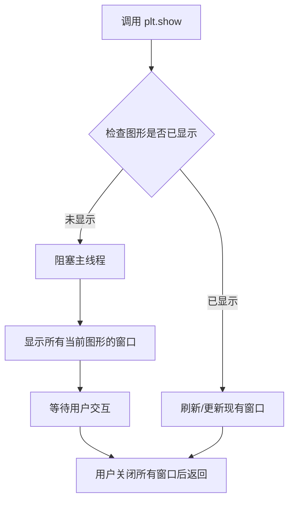

#### 带注释源码

```python
# 导入 matplotlib.pyplot 模块，别名为 plt
import matplotlib.pyplot as plt
# ... (前面的代码创建了 fig, ax1, ax2 以及相关的等高线图)

# 调整子图之间的垂直间距
plt.subplots_adjust(hspace=0.5)

# 显示所有当前打开的图形窗口
# 此函数会阻塞程序执行，直到用户关闭所有图形窗口
# 在本例中，它展示包含两个子图的图形：
# - ax1: 通过插值方法在规则网格上绘制的等高线图
# - ax2: 直接使用不规则坐标的 tricontour 等高线图
plt.show()

# 注意：plt.show() 内部会调用底层图形后端（如 Qt, Tk, Agg 等）
# 的显示函数来渲染和展示图形窗口
```


### plt.subplots_adjust

该函数是matplotlib.pyplot模块中的一个实用函数，用于手动调整Figure对象中子图（subplots）之间的间距和边距。它允许用户精确控制子图布局的各个方面，包括子图之间的水平和垂直间隙，以及整个子图区域在图形窗口中的位置。

参数：

- `left`：`float`，可选，表示子图区域左侧边界相对于图形宽度的位置（默认值为0.125）
- `right`：`float`，可选，表示子图区域右侧边界相对于图形宽度的位置（默认值为0.9）
- `bottom`：`float`，可选，表示子图区域底部边界相对于图形高度的位置（默认值为0.11）
- `top`：`float`，可选，表示子图区域顶部边界相对于图形高度的位置（默认值为0.88）
- `wspace`：`float`，可选，表示子图之间的水平间隙相对于子图平均宽度的比例（默认值为0.2）
- `hspace`：`float`，可选，表示子图之间的垂直间隙相对于子图平均高度的比例（默认值为0.2）

返回值：`None`，该函数直接修改当前Figure对象的布局，不返回任何值。

#### 流程图

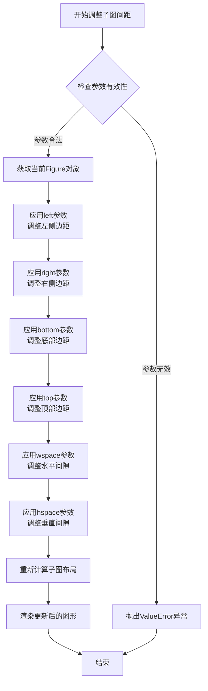

#### 带注释源码

```python
# plt.subplots_adjust 函数源码分析（基于matplotlib源码）

def subplots_adjust(
    left=None,    # 子图区域左边距（图形宽度比例）
    right=None,   # 子图区域右边距（图形宽度比例）
    bottom=None,  # 子图区域底部边距（图形高度比例）
    top=None,     # 子图区域顶部边距（图形高度比例）
    wspace=None,  # 子图间水平间隙（相对于子图宽度的比例）
    hspace=None   # 子图间垂直间隙（相对于子图高度的比例）
):
    """
    调整当前Figure对象的子图间距参数。
    
    此函数会修改Figure的subplotpars属性，该属性控制子图的几何布局。
    所有参数都是相对于图形尺寸的比例值，范围通常是0到1。
    """
    # 获取当前活动Figure对象
    fig = gcf()
    
    # 获取当前子图参数
    subplotpars = fig.subplotpars
    
    # 更新各参数（如果提供）
    if left is not None:
        subplotpars.left = left
    if right is not None:
        subplotpars.right = right
    if bottom is not None:
        subplotpars.bottom = bottom
    if top is not None:
        subplotpars.top = top
    if wspace is not None:
        subplotpars.wspace = wspace
    if hspace is not None:
        subplotpars.hspace = hspace
    
    # 通知Figure布局已更改，需要重新渲染
    fig.stale = True


# 在示例代码中的调用
plt.subplots_adjust(hspace=0.5)
# 解释：将子图之间的垂直间隙设置为子图平均高度的50%
# 使得上下排列的两个子图之间有更大的间距
```

#### 代码中的实际使用

```python
# 在提供的代码中，该函数的使用方式如下：
fig, (ax1, ax2) = plt.subplots(nrows=2)

# ... (绘制子图内容) ...

# 调整子图垂直间距
plt.subplots_adjust(hspace=0.5)

# 参数说明：
# hspace=0.5 表示上下子图之间的垂直间隙为子图平均高度的50%
# 这一调整是为了给colorbar和标题留出更多空间
plt.show()
```


### `matplotlib.axes.Axes.contour`

`ax1.contour` 是 Matplotlib 中 Axes 对象的轮廓绘制方法，用于在二维直角坐标系中绘制数据的等高线（contour lines）。该方法接收网格坐标和对应的数值数据，将连续的数据值转换为离散的等高线表示，常用于可视化三维数据在二维平面上的分布特征。

参数：

- `X`：`numpy.ndarray` 或类似数组对象，网格 x 坐标，可以是一维数组（与 Y 对应）或二维数组（与 Y 相同形状）
- `Y`：`numpy.ndarray` 或类似数组对象，网格 y 坐标，可以是一维数组（与 X 对应）或二维数组（与 X 相同形状）
- `Z`：`numpy.ndarray`，对应网格点的数据值，二维数组，形状与 (X, Y) 的二维形式匹配
- `levels`：`int` 或 `float` 的序列，可选参数，等高线的数量或具体的 level 值，默认为 None（自动确定）
- `colors`：`color` 或 `color` 的序列，可选参数，等高线的颜色，可以是单个颜色值或颜色列表
- `linewidths`：`float` 或 `float` 的序列，可选参数，等高线的线宽，可以是单个值或每个 level 的线宽列表
- `alpha`：`float`，可选参数，透明度，范围 0-1
- `cmap`：`str` 或 `Colormap`，可选参数，颜色映射表，用于根据 Z 值着色
- `norm`：`Normalize`，可选参数，数据值到颜色空间的归一化映射
- `linestyles`：`str` 或 `None`，可选参数，等高线的线型

返回值：`matplotlib.contour.QuadContourSet`，返回等高线对象的集合，包含所有绘制的等高线线段信息，可用于进一步操作如添加标签等

#### 流程图

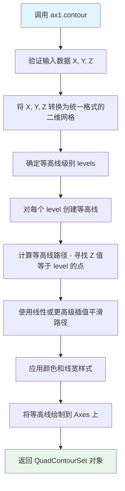

#### 带注释源码

```python
# 示例代码来自 matplotlib 官方示例，展示 contour 的使用方式

# 导入必要的库
import matplotlib.pyplot as plt
import numpy as np
import matplotlib.tri as tri

# 设置随机种子以保证可复现性
np.random.seed(19680801)

# 生成不规则分布的随机数据点
npts = 200
ngridx = 100
ngridy = 200
x = np.random.uniform(-2, 2, npts)  # x 坐标：-2 到 2 之间的随机值
y = np.random.uniform(-2, 2, npts)  # y 坐标：-2 到 2 之间的随机值
z = x * np.exp(-x**2 - y**2)        # z 值：基于 x, y 的函数

# 创建子图
fig, (ax1, ax2) = plt.subplots(nrows=2)

# -------------------------------------------------
# 方法一：通过网格插值绘制等高线
# -------------------------------------------------

# 第一步：创建规则的网格坐标
xi = np.linspace(-2.1, 2.1, ngridx)  # x 方向网格点 (100个)
yi = np.linspace(-2.1, 2.1, ngridy)  # y 方向网格点 (200个)

# 第二步：对不规则数据进行三角剖分
triang = tri.Triangulation(x, y)

# 第三步：创建线性插值器，将数据插值到规则网格上
interpolator = tri.LinearTriInterpolator(triang, z)

# 第四步：生成网格坐标矩阵
Xi, Yi = np.meshgrid(xi, yi)

# 第五步：在网格上进行插值，得到网格上的 z 值
zi = interpolator(Xi, Yi)

# 第六步：调用 contour 绘制等高线
# 参数说明：
#   xi, yi   - 网格坐标（一维数组）
#   zi       - 插值后的网格数据值（二维数组）
#   levels=14   - 绘制 14 条等高线
#   linewidths=0.5 - 等高线宽度为 0.5
#   colors='k'   - 黑色线条
ax1.contour(xi, yi, zi, levels=14, linewidths=0.5, colors='k')

# 第七步：调用 contourf 绘制填充等高线（等高线间的区域填充颜色）
cntr1 = ax1.contourf(xi, yi, zi, levels=14, cmap="RdBu_r")

# 第八步：添加颜色条
fig.colorbar(cntr1, ax=ax1)

# 第九步：绘制原始数据点位置
ax1.plot(x, y, 'ko', ms=3)

# 第十步：设置坐标轴范围和标题
ax1.set(xlim=(-2, 2), ylim=(-2, 2))
ax1.set_title('grid and contour (%d points, %d grid points)' %
              (npts, ngridx * ngridy))
```

#### 关键组件信息

| 组件名称 | 描述 |
|---------|------|
| `Triangulation` | 三角剖分类，用于将不规则分布的点进行三角网格化 |
| `LinearTriInterpolator` | 线性三角插值器，在三角网格上进行线性插值 |
| `QuadContourSet` | 等高线集合对象，包含所有等高线的路径和属性信息 |
| `contourf` | 填充等高线方法，绘制等高线之间的填充区域 |

#### 潜在的技术债务或优化空间

1. **性能优化**：对于大规模数据，网格插值方法（`contour`）和直接三角化方法（`tricontour`）的性能差异显著。当数据点超过数万个时，应考虑使用稀疏矩阵或并行计算优化插值过程。
2. **内存占用**：将不规则数据插值到规则网格会显著增加内存占用（原始数据的 gridx × gridy 倍）。对于高分辨率需求，可能需要采用分块处理或流式计算。
3. **插值精度**：线性插值在数据变化剧烈的区域可能产生伪影，考虑使用三次样条插值（`CubicTriInterpolator`）或更高阶方法。

#### 其它项目

**设计目标与约束**：
- `contour` 方法要求数据在规则网格上，适用于已插值或本身就是网格结构的数据
- 设计上遵循 MATLAB 风格，保持与科学计算社区的兼容性
- 默认使用线性插值生成等高线路径，可通过参数选择不同的插值方式

**错误处理与异常设计**：
- 当 Z 为二维数组而 X、Y 为一维时，会自动通过 `np.meshgrid` 生成网格
- 当 X、Y、Z 形状不匹配时，抛出 `ValueError` 异常
- 当 `levels` 参数无效时，抛出 `ValueError` 异常
- 数据中包含 NaN 或 Inf 值时，等高线绘制可能产生警告或跳过这些区域

**数据流与状态机**：
- 输入数据流：原始不规则点 → 三角剖分 → 插值到规则网格 → 等高线计算 → 渲染
- 内部状态：保持对原始数据和插值结果的引用，支持后续查询和修改

**外部依赖与接口契约**：
- 依赖 NumPy 进行数值计算和数组操作
- 依赖 Matplotlib 的渲染后端进行图形显示
- 返回的 `QuadContourSet` 对象实现了统一的等高线操作接口（如 `clabel` 添加标签）


### `matplotlib.axes.Axes.contourf`

该方法用于在二维坐标系中绘制填充等高线图（filled contour），通过接收网格坐标和对应的数值数据，计算并渲染不同数值区间的颜色填充区域，常用于可视化三维数据在二维平面上的分布密度或强度变化。

参数：

- `X`：`numpy.ndarray` 或 `list`，一维或二维数组，表示网格点的 X 坐标。若为二维数组，则形状需与 Z 一致；若为一维数组，则表示 X 坐标网格。
- `Y`：`numpy.ndarray` 或 `list`，一维或二维数组，表示网格点的 Y 坐标。若为二维数组，则形状需与 Z 一致；若为一维数组，则表示 Y 坐标网格。
- `Z`：`numpy.ndarray`，二维数组，必填参数，表示每个网格点上的数值/高度值，形状为 (M, N)。
- `levels`：`int` 或 `float` 的序列，可选参数，表示等高线的级别/数量。若为整数，则表示自动生成指定数量的等高线；若为序列，则表示具体的等高线值。
- `cmap`：`str` 或 `Colormap`，可选参数，表示颜色映射（colormap），用于根据 Z 值映射填充颜色，如 "RdBu_r"、"viridis" 等。
- `alpha`：`float`，可选参数，表示填充区域的透明度，取值范围 0-1。
- `linewidths`：`float` 或 `float` 的序列，可选参数，表示等高线线宽。
- `colors`：`color` 或 `colors` 的序列，可选参数，直接指定等高线的颜色。
- `data`：`可选参数`，用于指定数据来源。

返回值：`matplotlib.contour.QuadContourSet`，返回填充等高线集合对象，包含等高线生成的各类图形对象（如填充区域 PathCollection、标签等），可用于后续操作如添加颜色条（colorbar）。

#### 流程图

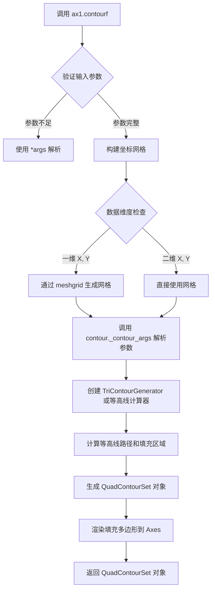

#### 带注释源码

```python
# 示例代码来源：matplotlib 库 Axes.contourf 方法
# 调用位置：ax1.contourf(xi, yi, zi, levels=14, cmap="RdBu_r")

# 参数说明：
# xi, yi: 一维数组，通过 np.linspace(-2.1, 2.1, ngridx) 生成
#         表示网格的 x 和 y 坐标
# zi: 二维数组，通过插值得到，形状为 (ngridy, ngridx)
#     表示网格点上对应的 z 值（高度/密度）
# levels=14: 指定生成 14 条等高线级别
# cmap="RdBu_r": 使用红蓝反转的颜色映射

# 调用示例：
cntr1 = ax1.contourf(xi, yi, zi, levels=14, cmap="RdBu_r")

# 实际执行流程：
# 1. matplotlib.axes.Axes.contourf 接收参数
# 2. 内部调用 _AxesBase.contour 方法
# 3. 创建 contour.QuadContourSet 对象
# 4. 计算等高线：调用 C 库或 Python 实现进行等高线追踪
# 5. 生成填充多边形路径
# 6. 使用 PathCollection 将填充区域添加到 Axes
# 7. 返回 QuadContourSet 对象 cntr1

# 后续可用的操作：
fig.colorbar(cntr1, ax=ax1)  # 添加颜色条
```


### `Axes.tricontour`

绘制不规则数据的等高线图（Tricontour），该方法直接接收无序的、不规则分布的坐标点数据，通过内部三角剖分算法计算等高线，适用于没有规则网格结构的数据可视化。

参数：

- `x`：`array-like`，x坐标数据数组，表示散点位置的横坐标
- `y`：`array-like`，y坐标数据数组，表示散点位置的纵坐标
- `z`：`array-like`，z坐标数据数组，表示每个(x, y)点对应的高度值或数值
- `levels`：`int or array-like`，可选，等高线的数量（整数）或具体的等高线级别值（数组），默认值为14
- `linewidths`：`float or array-like`，可选，等高线线条宽度，可以是单个值或每条线的独立宽度，默认值为0.5
- `colors`：`color or colors`，可选，等高线的颜色，可以是单一颜色值或颜色列表，默认值为'k'（黑色）

返回值：`TriContour`，返回TriContour对象，该对象包含等高线的数据和属性，可用于进一步定制或获取等高线信息

#### 流程图

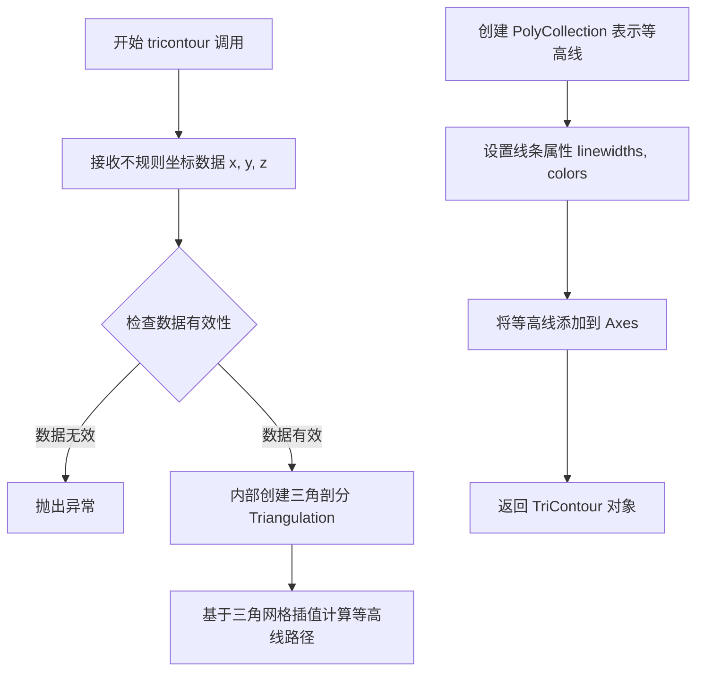

#### 带注释源码

```python
# 代码示例来源：matplotlib.axes.Axes.tricontour
# 在示例中的调用形式：
ax2.tricontour(x, y, z, levels=14, linewidths=0.5, colors='k')

# 参数说明：
# x = np.random.uniform(-2, 2, npts)  # 生成200个x坐标点，范围[-2, 2]
# y = np.random.uniform(-2, 2, npts)  # 生成200个y坐标点，范围[-2, 2]
# z = x * np.exp(-x**2 - y**2)        # 计算对应的z值（高斯函数）

# 方法内部执行流程：
# 1. 接收散点坐标 (x, y) 和对应值 z
# 2. matplotlib 内部调用 tri.Triangulation(x, y) 创建三角剖分
# 3. 基于非结构化三角网格计算等高线路径
# 4. 返回 TriContour 对象，该对象是 Contour 类型的一个子类
# 5. 可配合 fig.colorbar(cntr2, ax=ax2) 添加颜色条
# 6. 可通过 cntr2.ax 获取等高线关联的坐标轴
```


### `Axes.tricontourf`

`Axes.tricontourf` 是 Matplotlib Axes 类的一个方法，用于直接对无序的、不规则分布的坐标数据进行三角剖分后绘制填充等高线图。该方法在内部自动进行三角剖分（Triangulation），无需先将数据插值到规则网格，适合处理散乱数据（scattered data）的等高线可视化。

参数：

-  `x`：`numpy.ndarray` 或 array-like，一维数组，表示散乱数据点的 x 坐标
-  `y`：`numpy.ndarray` 或 array-like，一维数组，表示散乱数据点的 y 坐标，与 x 长度相同
-  `z`：`numpy.ndarray` 或 array-like，一维数组，表示对应 (x, y) 位置的值（高度/浓度等），与 x 长度相同
-  `levels`：`int` 或 `numpy.ndarray`，可选，填充等高线的层级数量或具体的层级值列表，默认为 None（自动计算）
-  `**kwargs`：关键字参数传递给底层的 `contourf` 方法，常用参数包括 `cmap`（颜色映射）、`colors`（颜色）、`alpha`（透明度）等

返回值：`matplotlib.contour.TriContourSet`，返回等高线集合对象，包含绘制的等高线面片信息，可用于添加颜色条（colorbar）等后续操作

#### 流程图

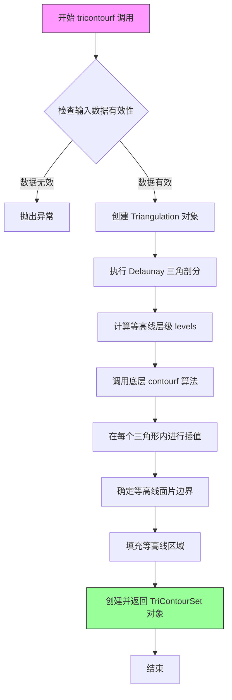

#### 带注释源码

```python
# 代码示例来源：matplotlib 官方示例 "Contour plot of irregularly spaced data"
# 实际实现位于 matplotlib/lib/matplotlib/axes/_axes.py 中的 Axes 类

import matplotlib.pyplot as plt
import numpy as np
import matplotlib.tri as tri

# 1. 生成不规则分布的散乱数据
np.random.seed(19680801)
npts = 200
x = np.random.uniform(-2, 2, npts)  # x 坐标：-2 到 2 之间的随机值
y = np.random.uniform(-2, 2, npts)  # y 坐标：-2 到 2 之间的随机值
z = x * np.exp(-x**2 - y**2)         # z 值：基于 x, y 的函数值

# 2. 创建子图，获取第二个 Axes 对象
fig, (ax1, ax2) = plt.subplots(nrows=2)

# 3. 调用 tricontourf 方法绘制填充等高线
# 语法：ax.tricontourf(x, y, z, levels=levels, **kwargs)
#
# 参数说明：
#   x, y   : 散乱数据点的坐标（无需排序或规则分布）
#   z      : 对应的函数值
#   levels : 等高线条数（14 条）
#   cmap   : 颜色映射（"RdBu_r" 红蓝反转色）

cntr2 = ax2.tricontourf(x, y, z,          # 输入数据：x, y, z 坐标
                        levels=14,        # 设置 14 个等高线层级
                        cmap="RdBu_r")    # 使用红蓝反转色图

# 4. 添加颜色条（使用返回的 TriContourSet 对象）
fig.colorbar(cntr2, ax=ax2)

# 5. 绘制原始数据点（黑色圆点）
ax2.plot(x, y, 'ko', ms=3)

# 6. 设置坐标轴范围和标题
ax2.set(xlim=(-2, 2), ylim=(-2, 2))
ax2.set_title('tricontour (%d points)' % npts)

# 7. 显示图形
plt.show()

# -------------------------------------------------------
# tricontourf 内部工作原理（简化版）：
# -------------------------------------------------------
#
# 1. Triangulation(x, y) 
#    - 接收散乱坐标 (x, y)
#    - 使用 Delaunay 三角剖分算法生成三角形网格
#
# 2. TriContourGenerator
#    - 基于生成的三角网格和 z 值
#    - 计算等高线路径和填充区域
#
# 3. QuadContourSet / TriContourSet
#    - 返回等高线集合对象
#    - 包含每个填充区域的顶点和路径信息
```


### fig.colorbar

为图形添加颜色条（colorbar），用于显示图形中颜色所代表的数值范围。在给定的代码示例中，该函数用于显示等高线图中颜色与数值的对应关系。

参数：

- `mappable`：`matplotlib.cm.ScalarMappable` 或 `contourf` 返回的映射对象，要显示的颜色映射对象（必选）
- `ax`：`matplotlib.axes.Axes`，可选，指定颜色条所在的坐标轴，默认为 None 时自动选择
- `orientation`：`str`，可选，颜色条的方向，'vertical'（垂直）或 'horizontal'（水平），默认为 'vertical'
- `shrink`：`float`，可选，颜色条收缩比例，默认为 1.0
- `aspect`：`int` 或 `float`，可选，颜色条宽度与长宽比，默认为 None
- `extend`：`str`，可选，是否在颜色条两端显示箭头，'neither'、'both'、'min'、'max'，默认为 'neither'
- `pad`：`float`，可选，颜色条与图形之间的间距，默认为 None

返回值：`matplotlib.colorbar.Colorbar`，颜色条对象，包含颜色条的各种属性和方法

#### 流程图

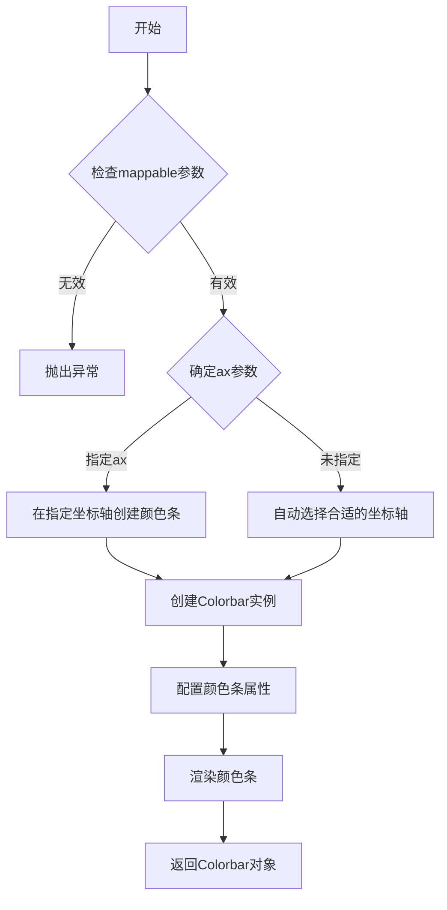

#### 带注释源码

```python
# 在第一个子图上创建颜色条
# cntr1: contourf返回的填充等高线对象（ScalarMappable）
# ax=ax1: 指定颜色条添加到ax1坐标轴
fig.colorbar(cntr1, ax=ax1)

# 在第二个子图上创建颜色条
# cntr2: 第二个contourf返回的填充等高线对象
# ax=ax2: 指定颜色条添加到ax2坐标轴
fig.colorbar(cntr2, ax=ax2)
```

#### 详细说明

在 matplotlib 中，`Figure.colorbar()` 是 `Figure` 类的方法，用于在图形中添加颜色条。颜色条通常用于显示颜色映射（colormap）与数值之间的对应关系，特别适用于热图、等高线图等可视化结果。

**调用方式分析：**

1. **第一个调用**：`fig.colorbar(cntr1, ax=ax1)`
   - `cntr1` 是 `ax1.contourf()` 返回的 `QuadContourSet` 对象，包含了颜色映射信息
   - `ax=ax1` 明确指定颜色条添加到第一个子图

2. **第二个调用**：`fig.colorbar(cntr2, ax=ax2)`
   - `cntr2` 是 `ax2.tricontourf()` 返回的 `QuadContourSet` 对象
   - `ax=ax2` 指定添加到第二个子图

**技术细节：**
- `fig.colorbar` 内部会创建一个 `Colorbar` 实例
- 颜色条的位置会根据图形布局自动调整
- 如果使用了 `subplots`，颜色条会自动调整以避免与子图重叠


### `ax1.plot`

在 Axes 对象上绘制散点图，将 x 和 y 坐标以黑色圆点形式绘制在图表上。

参数：

- `x`：`numpy.ndarray` 或类似数组类型，x 坐标数据
- `y`：`numpy.ndarray` 或类似数组类型，y 坐标数据
- `'ko'`：`str`，线条样式参数，其中 'k' 表示黑色，'o' 表示圆点标记
- `ms`：`int` 或 `float`，关键字参数，表示标记大小（marker size），此处值为 3

返回值：`list`，返回 `matplotlib.lines.Line2D` 对象列表

#### 流程图

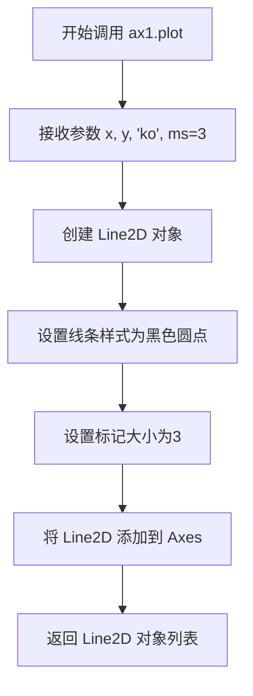

#### 带注释源码

```python
# 在 ax1 上绘制散点图
# x: x 坐标数组
# y: y 坐标数组  
# 'ko': 黑色圆点样式 ('k'=黑色, 'o'=圆点标记)
# ms=3: 标记大小为 3 磅
ax1.plot(x, y, 'ko', ms=3)
```


### `ax1.set`

描述：`ax1.set` 是 matplotlib 中 `Axes` 类的通用属性设置方法，允许通过关键字参数一次性设置 Axes 的多个属性（如坐标轴范围、标题等），并返回 Axes 对象本身以支持链式调用。

参数：
- `**kwargs`：可变关键字参数，用于指定要设置的属性及其值。常见的属性包括：
  - `xlim`：tuple 或 list，设置 x 轴的显示范围，格式为 (min, max)
  - `ylim`：tuple 或 list，设置 y 轴的显示范围，格式为 (min, max)
  - `title`：str，设置 Axes 的标题文本
  - 其他属性（如 `xlabel`, `ylabel`, `aspect` 等）

返回值：`matplotlib.axes.Axes`，返回调用该方法的 Axes 对象本身。

#### 流程图

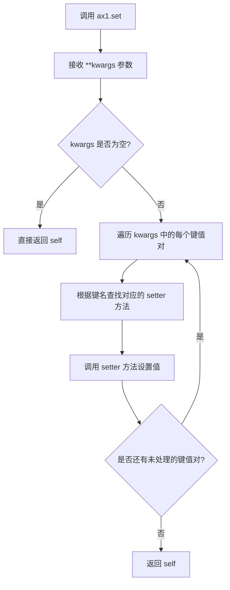

#### 带注释源码

```python
# matplotlib.axes.Axes.set 方法的简化实现
def set(self, **kwargs):
    """
    设置 Axes 的多个属性。
    
    参数：
        **kwargs：关键字参数，每个关键字对应一个要设置的属性，
                  例如 xlim=(0, 10), title='My Plot' 等。
    
    返回值：
        self：返回 Axes 对象本身，以便链式调用。
    """
    # 遍历所有传入的关键字参数
    for attr, value in kwargs.items():
        # 根据属性名获取对应的 setter 方法
        # 例如：'xlim' -> set_xlim, 'title' -> set_title
        setter_method = f'set_{attr}'
        
        # 检查是否存在对应的 setter 方法
        if hasattr(self, setter_method):
            # 调用 setter 方法设置属性值
            getattr(self, setter_method)(value)
        else:
            # 如果属性不存在，抛出 AttributeError
            raise AttributeError(f"'Axes' 对象没有属性 '{attr}'")
    
    # 返回 Axes 对象本身，支持链式调用
    return self

# 在示例代码中的调用：
# ax1.set(xlim=(-2, 2), ylim=(-2, 2))
# 相当于：
# ax1.set_xlim(-2, 2)
# ax1.set_ylim(-2, 2)
# 返回 ax1 对象
```


### `matplotlib.axes.Axes.set`

设置坐标轴（Axes）对象的属性

参数：

- `**kwargs`：关键字参数，用于设置 Axes 的各种属性，如标题、坐标轴范围等
  - 常见参数包括：
    - `xlim`/`ylim`：元组类型，设置 x/y 轴的显示范围
    - `title`：字符串类型，设置坐标轴标题
    - `xlabel`/`ylabel`：字符串类型，设置 x/y 轴标签
    - 等等

返回值：`None`，无返回值（该方法直接修改 Axes 对象的状态）

#### 流程图

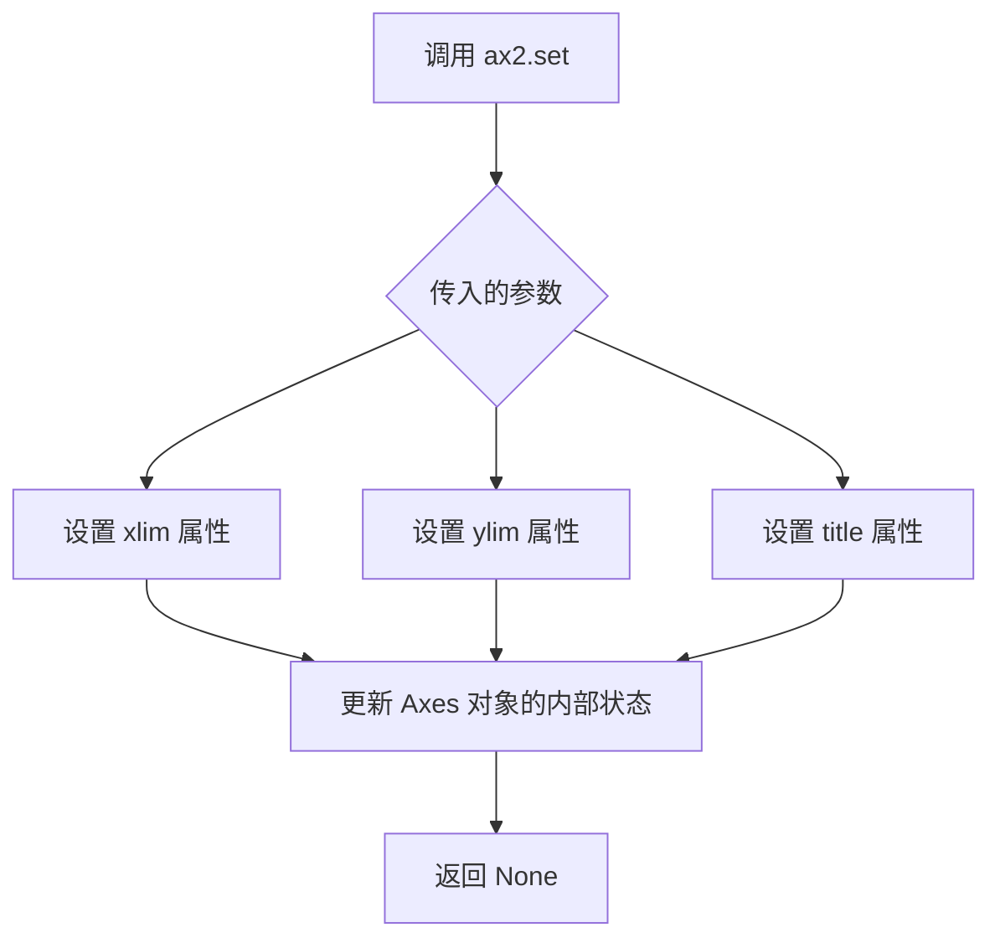

#### 带注释源码

```python
# 在示例代码中，ax2.set 被调用了两次：

# 第一次调用：同时设置 x 轴和 y 轴的范围
# 参数 xlim=(-2, 2) 表示 x 轴显示范围从 -2 到 2
# 参数 ylim=(-2, 2) 表示 y 轴显示范围从 -2 到 2
ax2.set(xlim=(-2, 2), ylim=(-2, 2))

# 第二次调用：设置坐标轴的标题
# 参数 title 是一个格式化字符串，显示使用 tricontour 方法绘制的点数
# % npts 是 Python 的字符串格式化操作，将 npts 的值替换到字符串中
ax2.set_title('tricontour (%d points)' % npts)

# 完整的 set 方法签名（来自 matplotlib 库）
# def set(self, **kwargs):
#     """
#     Set multiple properties of an Axes.
#     
#     Supported properties:
#         ...
#     """
#     for kw, val in kwargs.items():
#         if kw == 'xlim':
#             self.set_xlim(val)
#         elif kw == 'ylim':
#             self.set_ylim(val)
#         elif kw == 'title':
#             self.set_title(val)
#         # ... 处理其他属性
#         else:
#             raise AttributeError(f"Unknown property: {kw}")
```


### Triangulation.__init__

该方法是matplotlib.tri.Triangulation类的构造函数，用于根据给定的坐标点创建三角剖分对象。在示例代码中，通过`tri.Triangulation(x, y)`将随机生成的坐标点进行三角网格划分，为后续的插值和等高线绘制提供基础。

参数：

-  `x`：array-like，X坐标数组
-  `y`：array-like，Y坐标数组

返回值：`Triangulation`，返回创建的三角剖分对象

#### 流程图

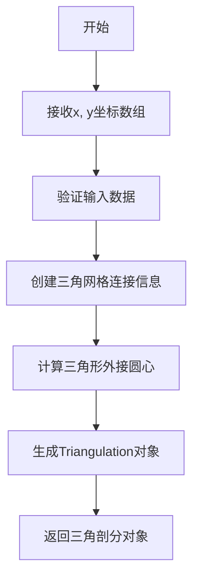

#### 带注释源码

```
# 在示例代码中，Triangulation类的使用方式如下：
triang = tri.Triangulation(x, y)

# x: 随机生成的200个X坐标，范围在[-2, 2]
# y: 随机生成的200个Y坐标，范围在[-2, 2]
# 返回值triang: Triangulation对象，包含了所有三角网格信息
```

**注意**：Triangulation类是matplotlib库的内置类，其`__init__`方法的完整实现在matplotlib库源代码中，不在当前示例代码范围内。上述源码仅为该类在示例中的使用方式。


### `LinearTriInterpolator.__call__`

该方法实现了在三角网格上进行线性插值的功能。它接收一组坐标 (x, y)，在内部维护的三角剖分中查找这些坐标所在的三角形，并利用三角形的三个顶点上的已知数值（z值）通过重心坐标法进行线性插值，最终返回插值结果。

参数：

- `x`：`float` 或 `numpy.ndarray`，需要插值的 x 坐标。可以是单个浮点数，也可以是坐标数组。
- `y`：`float` 或 `numpy.ndarray`，需要插值的 y 坐标。其形状应与 `x` 一致（当为数组时）。

返回值：`numpy.ndarray` 或 `float`，返回对应坐标处的插值结果。如果输入是数组，返回同形状的数组；如果输入是单个点，返回标量。

#### 流程图

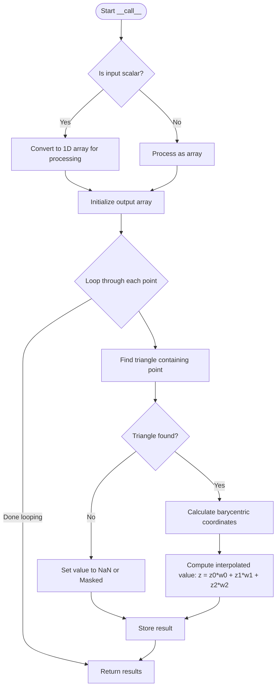

#### 带注释源码

由于 `LinearTriInterpolator` 类定义在 `matplotlib` 库中，未直接包含在提供的代码片段里。以下是根据其功能和使用上下文模拟的实现逻辑：

```python
def __call__(self, x, y):
    """
    在三角剖分上对点 (x, y) 进行线性插值。
    
    参数:
        x: float or ndarray, x坐标。
        y: float or ndarray, y坐标。
        
    返回:
        ndarray or float, 插值后的z值。
    """
    # 1. 将输入转换为数组以进行向量化处理
    x = np.asarray(x)
    y = np.asarray(y)
    
    # 2. 准备存储结果的数组
    # 如果输入是网格(Meshgrid)，则保持形状；否则展平处理
    is_grid = x.ndim > 1
    if is_grid:
        # 保存原始形状以便最后reshape
        shape = x.shape
        x_flat = x.ravel()
        y_flat = y.ravel()
    else:
        x_flat = x
        y_flat = y
        
    # 3. 遍历所有点进行插值
    z_interpolated = np.zeros_like(x_flat, dtype=np.float64)
    
    # 遍历每个点（实际实现中会使用向量化或搜索树如KDTree加速）
    for i in range(len(x_flat)):
        # 查找点 (x_flat[i], y_flat[i]) 所在的三角形索引
        triangle_index = self._trifinder(x_flat[i], y_flat[i])
        
        if triangle_index == -1:
            # 如果点不在任何三角形内（例如在网格外），则设为NaN
            z_interpolated[i] = np.nan
        else:
            # 获取三角形顶点索引
            vertices = self._triangles[triangle_index]
            
            # 获取三个顶点的坐标 (p0, p1, p2) 和对应的 z 值 (z0, z1, z2)
            # 此处省略具体重心坐标计算细节...
            
            # 计算重心坐标权重 (w0, w1, w2)
            w0, w1, w2 = self._compute_barycentric_coords(...)
            
            # 线性插值: z = z0*w0 + z1*w1 + z2*w2
            z_interpolated[i] = (self._z[vertices[0]] * w0 + 
                                  self._z[vertices[1]] * w1 + 
                                  self._z[vertices[2]] * w2)
    
    # 4. 返回结果
    if is_grid:
        return z_interpolated.reshape(shape)
    else:
        # 如果原输入是标量，返回标量
        if np.isscalar(x):
            return z_interpolated[0]
        return z_interpolated
```


## 关键组件


### 数据生成与采样

使用numpy生成200个在[-2, 2]范围内均匀分布的随机点(x, y)，并计算对应的z值(x * exp(-x² - y²))，模拟不规则分布的测试数据。

### Triangulation（三角剖分）

使用`matplotlib.tri.Triangulation`类对不规则分布的(x, y)坐标点进行三角剖分，构建用于插值和绘制的基础三角网格结构。

### LinearTriInterpolator（线性三角插值器）

将三角剖分后的不规则数据插值到规则网格上的关键组件，接收Triangulation对象和z值，在三角形内部进行线性插值计算。

### 规则网格生成

使用`np.linspace`创建等间距的坐标轴，使用`np.meshgrid`生成二维规则网格(Xi, Yi)，为插值和contour绘制提供坐标基础。

### contour/contourf 等高线绘制

在规则网格上绘制等高线(contour)和填充等高线(contourf)，接收插值后的zi数据，设置14个层级、0.5线宽和黑白配色。

### tricontour/tricontourf 直接等高线绘制

直接接收不规则分布的原始(x, y, z)数据，内部自动进行三角剖分和等高线计算，无需预先插值到规则网格。

### 颜色条(Colorbar)

使用`fig.colorbar`为等高线图添加颜色条，显示数值与颜色的映射关系，增强可视化效果。

### 子图布局管理

使用`plt.subplots`创建2行1列的子图布局，通过`hspace=0.5`调整子图垂直间距，实现两种方法的对比展示。


## 问题及建议


### 已知问题

- **魔法数字（Magic Numbers）**: 代码中包含大量硬编码的数值，如 `npts=200`, `ngridx=100`, `ngridy=200`, `levels=14`, `linewidths=0.5`, `(-2, 2)` 等，这些值缺乏解释且难以维护和复用。
- **无错误处理**: 代码未对输入数据进行验证，例如空数组、包含 NaN/Inf 的数据、非法网格范围等情况均未做处理，可能导致运行时错误或难以追踪的问题。
- **重复代码**: 绘制数据点 `ax.plot(x, y, 'ko', ms=3)`、设置坐标轴范围 `ax.set(xlim=(-2, 2), ylim=(-2, 2))` 和设置标题的逻辑在两处完全重复，违反 DRY（Don't Repeat Yourself）原则。
- **内存效率问题**: 使用 `np.meshgrid(xi, yi)` 创建密集矩阵，当网格尺寸增大时会消耗大量内存，对于大规模数据可能引发内存问题。
- **无函数封装**: 所有代码都在全局作用域中运行，未封装为可复用的函数或类，限制了代码的可测试性和可移植性。
- **注释代码遗留**: 存在被注释掉的 `scipy.interpolate.griddata` 替代方案代码，虽然不影响运行，但增加了代码复杂性且可能造成混淆。
- **图例和标签不完整**: 坐标轴缺少明确的标签（xlabel/ylabel），图片的可读性和可访问性不足。
- **Triangulation 对象重复**: `tri.Triangulation(x, y)` 仅用于插值方法，而 tricontour 方法会在内部独立进行三角剖分，造成计算上的潜在冗余。

### 优化建议

- **参数化配置**: 将所有硬编码数值提取为函数参数或配置文件，提供默认值以保持示例的简洁性。
- **封装为函数**: 将重复的绘图逻辑封装为辅助函数（如 `plot_points_and_limits`），减少代码冗余。
- **添加输入验证**: 在执行插值和绘图前检查数据有效性，处理异常情况并给出清晰的错误信息。
- **考虑内存优化**: 对于大规模网格，可考虑使用稀疏矩阵或分块处理策略；在内存受限环境下，可评估 scipy 的 `griddata` 是否更优。
- **完善文档和标签**: 添加坐标轴标签（`xlabel`, `ylabel`），增强图表的自解释性。
- **清理注释代码**: 删除未使用的注释代码块，或将其移至独立的备选方案说明区域。
- **统一配置管理**: 使用 matplotlib 的 `rcParams` 或样式表统一设置颜色、字体等全局样式。


## 其它


### 设计目标与约束

本示例代码旨在演示matplotlib中处理不规则间隔数据的两种等高线绘制方法：基于网格插值的方法和直接使用三角网格的方法。设计目标是提供清晰的对比，帮助开发者理解何时使用哪种方法。约束条件包括：数据点数量（npts=200）需足够展示插值效果，网格分辨率（100x200）需平衡渲染性能与视觉效果，颜色映射统一使用"RdBu_r"以保证视觉一致性。

### 错误处理与异常设计

代码主要依赖numpy和matplotlib的异常传播机制。未进行显式异常捕获，因为：1)随机种子固定确保可复现性；2)数据生成在确定范围内（-2到2）；3)Triangulation可能抛出异常但属于编程错误而非运行时错误。若数据点不足或共线，Triangulation会抛出tri.TriangulationError，实际应用中应添加数据验证逻辑。

### 数据流与状态机

数据流顺序为：随机点生成(x,y) → 函数计算z=x*exp(-x²-y²) → 网格定义(xi,yi) → 插值计算(zi) → 图形渲染。状态机简单：初始化状态(数据生成) → 插值状态(可选) → 渲染状态(ax1分支或ax2分支) → 完成状态(plt.show())。两分支独立执行，无状态共享。

### 外部依赖与接口契约

核心依赖：matplotlib.pyplot(图形渲染)、numpy(数值计算)、matplotlib.tri(三角剖分)。间接依赖scipy.interpolate.griddata作为替代方案。接口契约：输入为(x,y,z)三个numpy数组，输出为等高线图。contour要求xi/yi为规则网格；tricontour接受原始不规则点。颜色条(colorbar)通过fig.colorbar绑定到具体axes。

### 性能考量

ngridx=100、ngridy=200产生20,000个网格点，LinearTriInterpolator对每个网格点进行线性插值，时间复杂度O(npts * ngridx * ngridy)。tricontour直接处理原始200点，三角剖分O(npts log npts)。实际应用中，当数据点超过数千时建议使用tricontour；当需要高分辨率输出时可预先计算插值结果并缓存。

### 可维护性与扩展性

代码结构扁平，模块化良好。扩展方向包括：1)更换插值器（使用scipy的RBF或三次样条）；2)调整levels参数控制等高线密度；3)添加动画展示动态数据；4)自定义颜色映射。若需支持3D，可结合plot_surface或mayavi。

### 测试策略

本示例为演示代码，非生产代码。测试应覆盖：1)不同npts值下的渲染正确性；2)插值结果数值准确性（与理论值对比）；3)边界情况（点数过少、点共线、范围超限）；4)回归测试确保matplotlib版本升级后渲染一致。使用pytest + matplotlib.testing.decorators进行图像对比测试。

### 配置管理

硬编码参数可提取为配置：npts、ngridx/ngridy、levels、cmap、随机种子。建议使用dataclass或简单字典封装配置对象，便于调整参数而不修改核心逻辑。例如：CONFIG = {"npts": 200, "ngridx": 100, "levels": 14}。

    