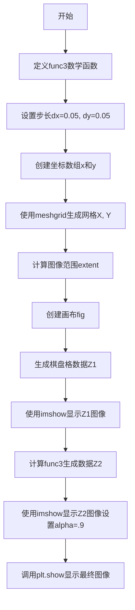

# `matplotlib\galleries\examples\images_contours_and_fields\layer_images.py` 详细设计文档

该代码演示如何使用matplotlib的alpha混合技术将多个图像叠加在一起显示，包括一个棋盘格图像和一个基于数学函数的可视化图像。

## 整体流程



## 类结构

```
无类层次结构（脚本文件）
```

## 全局变量及字段


### `dx`
    
x方向的步长，用于控制x坐标的采样间隔

类型：`float`
    


### `dy`
    
y方向的步长，用于控制y坐标的采样间隔

类型：`float`
    


### `x`
    
x坐标数组，从-3.0到3.0的等间距采样

类型：`numpy.ndarray`
    


### `y`
    
y坐标数组，从-3.0到3.0的等间距采样

类型：`numpy.ndarray`
    


### `X`
    
meshgrid生成的X坐标网格，用于二维函数计算

类型：`numpy.ndarray`
    


### `Y`
    
meshgrid生成的Y坐标网格，用于二维函数计算

类型：`numpy.ndarray`
    


### `extent`
    
图像显示范围，格式为(xmin, xmax, ymin, ymax)

类型：`tuple`
    


### `fig`
    
matplotlib图形对象，用于承载图像

类型：`matplotlib.figure.Figure`
    


### `Z1`
    
棋盘格模式数据，通过模2运算生成的8x8黑白棋盘

类型：`numpy.ndarray`
    


### `Z2`
    
func3函数在网格上的计算结果，用于生成彩色等高线图

类型：`numpy.ndarray`
    


### `im1`
    
第一个图像对象，显示灰度棋盘格图案

类型：`matplotlib.image.AxesImage`
    


### `im2`
    
第二个图像对象，显示func3函数的彩色热力图

类型：`matplotlib.image.AxesImage`
    


    

## 全局函数及方法


### `func3`

该函数是一个数学函数，接收x和y两个数值参数，计算并返回表达式`(1 - x/2 + x^5 + y^3) * e^(-(x^2 + y^2))`的结果。该函数通常用于生成演示用的数学曲面数据。

参数：

- `x`：`float` 或 `numpy.ndarray`，x坐标值，可以是单个数值或数组
- `y`：`float` 或 `numpy.ndarray`，y坐标值，可以是单个数值或数组

返回值：`float` 或 `numpy.ndarray`，数学表达式的计算结果

#### 流程图

```mermaid
graph TD
    A[开始] --> B[接收参数 x 和 y]
    B --> C[计算 x/2]
    C --> D[计算 x⁵]
    D --> E[计算 y³]
    E --> F[计算 1 - x/2 + x⁵ + y³]
    F --> G[计算 x² + y²]
    G --> H[计算 e^-(x² + y²)]
    H --> I[计算 F × H]
    I --> J[返回结果]
```

#### 带注释源码

```python
def func3(x, y):
    """
    数学函数，计算 (1 - x/2 + x^5 + y^3) * exp(-(x^2 + y^2))
    
    该函数是一个二维数学函数，常用于生成测试数据或演示图形。
    函数的输出形状取决于输入参数的形状，支持标量、向量和矩阵输入。
    
    参数:
        x: 数值或数组，x坐标值
        y: 数值或数组，y坐标值
    
    返回:
        计算结果，与输入形状相同的数值或数组
    """
    # 计算第一部分: 1 - x/2 + x^5 + y^3
    # 1: 常数项
    # - x / 2: 线性衰减项
    # x**5: 五次多项式项（产生局部峰值）
    # y**3: 三次多项式项
    part1 = (1 - x / 2 + x**5 + y**3)
    
    # 计算第二部分: exp(-(x^2 + y^2))
    # x**2 + y**2: 距离原点的平方距离
    # exp(-distance): 高斯衰减函数，使函数值在远离原点时趋近于0
    part2 = np.exp(-(x**2 + y**2))
    
    # 两部分相乘得到最终结果
    return part1 * part2
```

## 关键组件


### 网格生成与坐标系统

使用np.arange和np.meshgrid生成二维网格坐标，用于后续函数计算和图像渲染。extent定义了图像的坐标范围，确保多层图像对齐。

### 棋盘格图案生成

利用np.add.outer和模运算生成8x8的棋盘格图案Z1，用于演示底层图像。

### 数学函数func3

定义了一个二维高斯衰减函数，用于生成测试数据Z2，展示了复杂的数学表达式作为图像数据源。

### Alpha混合与图像叠加

使用plt.imshow的alpha参数实现两层图像的透明混合，底层为棋盘格，上层为函数曲面，通过interpolation参数控制渲染质量。

### 坐标范围对齐

extent变量确保多层图像具有相同的坐标系统，这是多层图像正确叠加的关键约束条件。


## 问题及建议


### 已知问题

- **硬编码的配置值**：范围(-3.0, 3.0)、步长(0.05)、透明度(0.9)等数值直接写在代码中，缺乏配置常量或参数化，降低了代码的可维护性和可复用性
- **全局函数定义**：`func3`函数定义在全局作用域，未封装到类或模块中，降低了代码的组织性和可测试性
- **缺乏文档字符串**：`func3`函数没有任何文档说明，参数和返回值含义不明确
- **命名不够描述性**：变量名如`Z1`、`Z2`、`im1`、`im2`、`x`、`y`等缺乏描述性，难以理解其具体用途
- **坐标范围不匹配风险**：棋盘格Z1是8x8数组，但映射到-3到3的坐标范围，注释中提到需要注意extent一致性问题，但代码未做验证
- **缺乏错误处理**：没有对输入参数、数组形状、extent匹配等进行验证
- **资源管理问题**：`plt.figure()`创建的fig对象未显式保存或关闭，可能导致资源泄露
- **混合的数据准备和可视化代码**：数据生成和绘图逻辑混在一起，降低了代码的内聚性
- **缺少类型注解**：Python代码中没有任何类型提示，降低了代码的可读性和静态分析能力

### 优化建议

- 将配置参数抽取为模块级常量或配置类
- 为`func3`函数添加完整的文档字符串和类型注解
- 使用更描述性的变量命名，如`chessboard_pattern`、`function_surface`、`chessboard_image`等
- 添加输入验证函数，确保多层图像的extent一致
- 考虑将数据准备和可视化逻辑分离到不同函数或类中
- 使用`with`语句或显式调用`fig.savefig()`和`plt.close()`管理图形资源
- 考虑将`func3`作为可配置的函数参数，增加灵活性
- 添加对数据范围、数组形状等的验证
</think>

## 其它


### 设计目标与约束

本示例旨在演示如何使用matplotlib的alpha混合技术将多张图像叠加在一起显示。约束条件：所有叠加的图像必须具有相同的坐标范围(extent)，但形状可以不同；不同的插值方法可能导致图像的视觉范围略有差异。

### 错误处理与异常设计

代码中未包含显式的错误处理机制。潜在异常包括：数据维度不匹配导致meshgrid生成失败；extent参数与数据维度不一致导致图像对齐错误；内存不足导致大型数组分配失败。建议添加数据验证和异常捕获。

### 数据流与状态机

数据流：func3数学函数 → 生成X,Y网格坐标 → 计算Z2数值 → 创建棋盘格Z1 → 通过plt.imshow渲染到画布 → alpha混合显示。状态机主要涉及matplotlib的图形状态管理（figure、axes、image layers）。

### 外部依赖与接口契约

主要依赖：matplotlib.pyplot（图像展示）、numpy（数值计算）。关键接口：plt.imshow()的extent参数定义坐标范围，alpha参数控制透明度，cmap定义颜色映射，interpolation定义插值方式。

### 性能考虑

dx, dy = 0.05的分辨率设置直接影响计算量和渲染性能。网格分辨率越高，func3计算和图像渲染耗时越长。interpolation='bilinear'比'nearest'计算成本更高。对于大规模数据可考虑降低分辨率或使用稀疏网格。

### 兼容性考虑

代码兼容Python 3.x和matplotlib 3.x系列。np.arange在不同版本中行为一致。plt.show()在不同操作系统（Windows/Linux/macOS）上表现一致。需注意某些后端不支持某些交互功能。

### 安全性考虑

代码不涉及用户输入、网络请求或文件操作，安全性风险较低。唯一风险是如果func3的输入值超出合理范围，可能导致数值溢出或内存问题。

### 测试考量

建议测试场景：不同extent值对图像对齐的影响；不同alpha值的混合效果；不同插值方法的视觉差异；不同cmap色彩映射的兼容性；大规模数据下的性能和内存使用。

### 配置参数说明

关键配置参数：dx, dy控制网格分辨率；extent定义坐标范围[xmin, xmax, ymin, ymax]；alpha透明度值（0-1）；interpolation插值方法（'nearest', 'bilinear', 'bicubic'等）；cmap颜色映射方案。

### 使用示例和变体

可扩展方向：添加更多图层（3层及以上）；使用不同透明度组合；尝试其他数学函数生成图像；结合3D绘图；使用自定义颜色映射；添加颜色条(colorbar)；保存为不同格式图像文件。

    