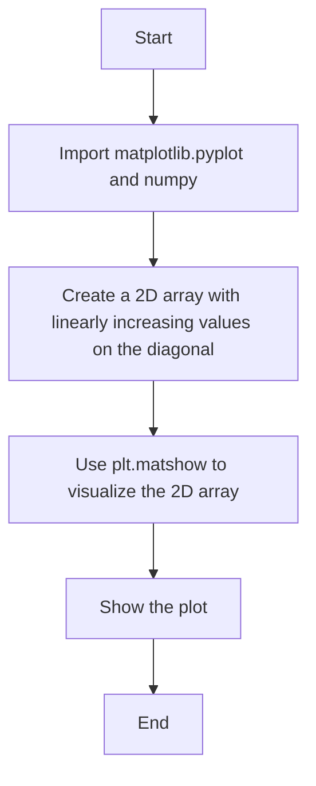
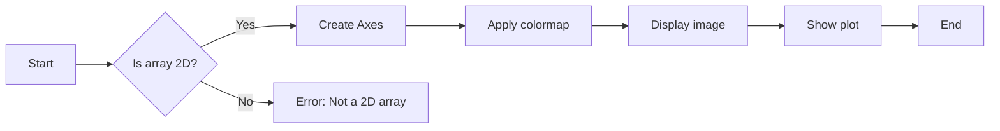
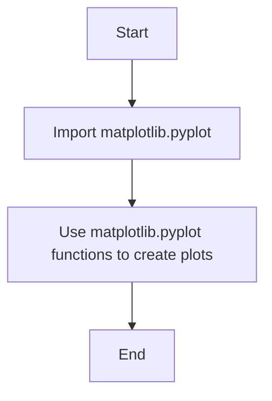
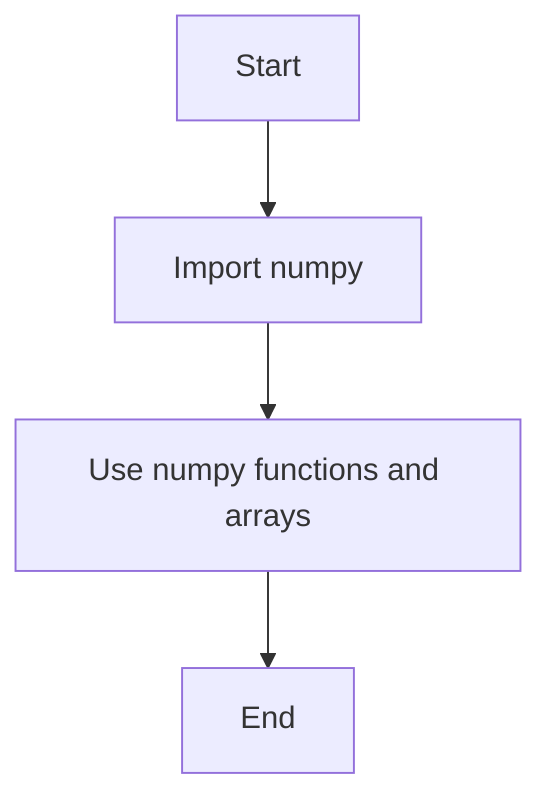

# `matplotlib\galleries\examples\images_contours_and_fields\matshow.py` 详细设计文档

This code generates a color-coded image visualization of a 2D matrix using matplotlib's matshow function.

## 整体流程



## 类结构

```
matplotlib.pyplot
├── plt
│   ├── matshow
│   └── show
└── numpy
    └── np
```

## 全局变量及字段


### `a`
    
A 2D array with linearly increasing values on the diagonal

类型：`numpy.ndarray`
    


    

## 全局函数及方法


### plt.matshow

`plt.matshow` 是一个用于可视化 2D 矩阵或数组的函数，将其作为颜色编码的图像显示。

参数：

- `array`：`numpy.ndarray`，要可视化的 2D 数组或矩阵。

返回值：`matplotlib.axes.Axes`，返回一个包含图像的轴对象。

#### 流程图



#### 带注释源码

```python
import matplotlib.pyplot as plt
import numpy as np

def plt_matshow(array):
    """
    Visualizes a 2D matrix or array as color-coded image.

    Parameters:
    - array: numpy.ndarray, the 2D array or matrix to visualize.

    Returns:
    - matplotlib.axes.Axes, an axis object containing the image.
    """
    fig, ax = plt.subplots()
    ax.matshow(array)
    return ax

# Example usage
a = np.diag(range(15))
ax = plt_matshow(a)
plt.show()
```


### plt.show()

`plt.show()` 是一个全局函数，用于显示当前图形。

参数：

- 无

返回值：`None`，该函数不返回任何值，其作用是显示当前图形。

#### 流程图

```mermaid
graph TD
    A[Start] --> B[Call plt.show()]
    B --> C[Display the current figure]
    C --> D[End]
```

#### 带注释源码

```
plt.show()  # 显示当前图形
```


### matplotlib.pyplot

`matplotlib.pyplot` 是一个模块，提供了用于创建图形和图表的函数。

参数：

- 无

返回值：`None`，该模块不返回任何值，其作用是提供绘图功能。

#### 流程图



#### 带注释源码

```
import matplotlib.pyplot as plt  # 导入matplotlib.pyplot模块
```


### numpy

`numpy` 是一个模块，提供了高性能的多维数组对象和一系列的数学函数。

参数：

- 无

返回值：`None`，该模块不返回任何值，其作用是提供数值计算功能。

#### 流程图



#### 带注释源码

```
import numpy as np  # 导入numpy模块
```


### matplotlib.axes.Axes.matshow

`matplotlib.axes.Axes.matshow` 是一个类方法，用于将2D矩阵或数组可视化。

参数：

- `matrix`：`numpy.ndarray`，要可视化的2D矩阵或数组。

返回值：`matplotlib.image.AxesImage`，返回一个图像对象，该对象包含可视化后的矩阵。

#### 流程图

```mermaid
graph TD
    A[Start] --> B[Create a 2D matrix or array]
    B --> C[Call .axes.Axes.matshow(matrix)]
    C --> D[Return an AxesImage object]
    D --> E[End]
```

#### 带注释源码

```
plt.matshow(a)  # 将2D矩阵a可视化
```

## 关键组件


### 张量索引与惰性加载

张量索引与惰性加载允许对大型数据集进行高效处理，通过仅在需要时计算和访问数据，减少内存消耗和提高性能。

### 反量化支持

反量化支持使得模型可以在量化后仍然保持较高的精度，通过在量化过程中保留部分精度信息。

### 量化策略

量化策略定义了如何将浮点数转换为固定点数，包括选择量化位宽和量化范围等，以优化模型性能和存储空间。


## 问题及建议


### 已知问题

-   {问题1} 缺乏代码重用性：当前代码仅用于可视化一个特定的矩阵，没有提供通用接口来处理不同类型的矩阵或数组。
-   {问题2} 缺乏错误处理：代码没有对输入矩阵进行验证，例如检查是否为二维数组或是否包含有效数据。
-   {问题3} 缺乏配置选项：没有提供用户自定义显示选项，如颜色映射、标题、标签等。

### 优化建议

-   {建议1} 提供一个类或函数，允许用户传入不同的矩阵和配置选项，以提高代码的通用性和可重用性。
-   {建议2} 在函数中添加输入验证，确保传入的矩阵是有效的，并处理可能的异常情况。
-   {建议3} 添加配置选项，允许用户自定义显示设置，如颜色映射、标题、标签等，以提供更丰富的可视化效果。
-   {建议4} 考虑使用面向对象编程来封装矩阵可视化逻辑，以便更好地管理状态和配置。
-   {建议5} 考虑使用日志记录来记录函数的执行过程和潜在的错误，以便于调试和监控。


## 其它


### 设计目标与约束

- 设计目标：实现一个简单的矩阵可视化工具，能够将2D矩阵以颜色编码的形式展示出来。
- 约束条件：使用Python标准库和matplotlib库进行绘图，不使用额外的第三方库。

### 错误处理与异常设计

- 错误处理：在代码中没有明显的错误处理机制，因为代码非常简单，且没有用户输入。
- 异常设计：由于代码中没有用户输入，因此不需要设计复杂的异常处理机制。

### 数据流与状态机

- 数据流：代码中只有一个数据流，即从numpy创建的2D数组a，然后通过matplotlib的matshow函数进行可视化。
- 状态机：代码中没有状态机，因为没有状态变化的过程。

### 外部依赖与接口契约

- 外部依赖：代码依赖于matplotlib.pyplot和numpy库。
- 接口契约：matplotlib.pyplot库提供了matshow函数，用于将2D数组可视化。


    