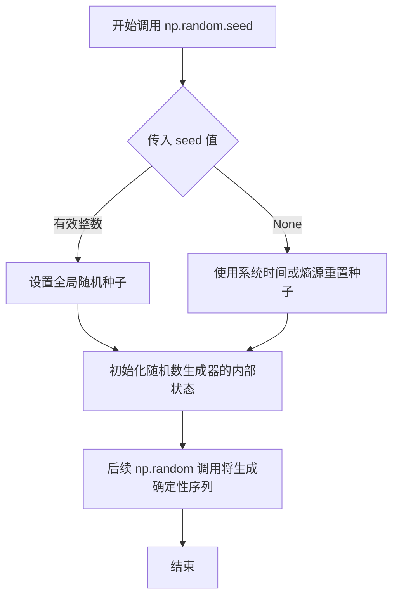
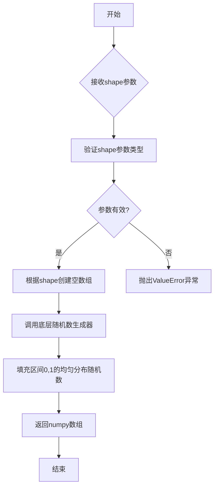
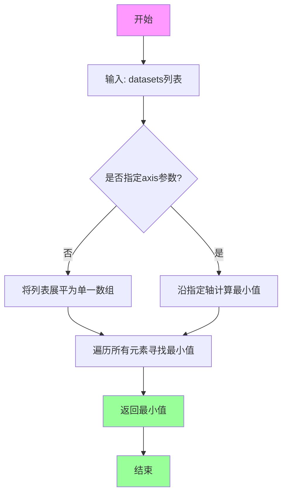
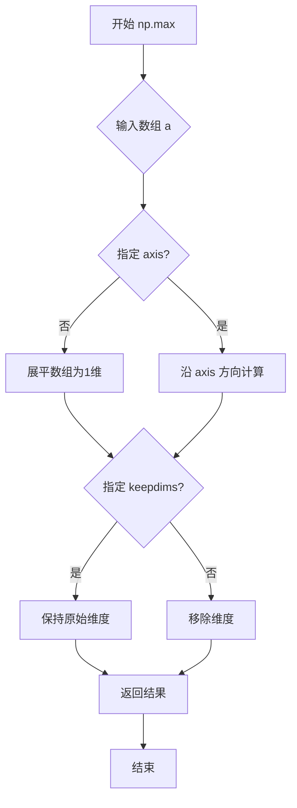
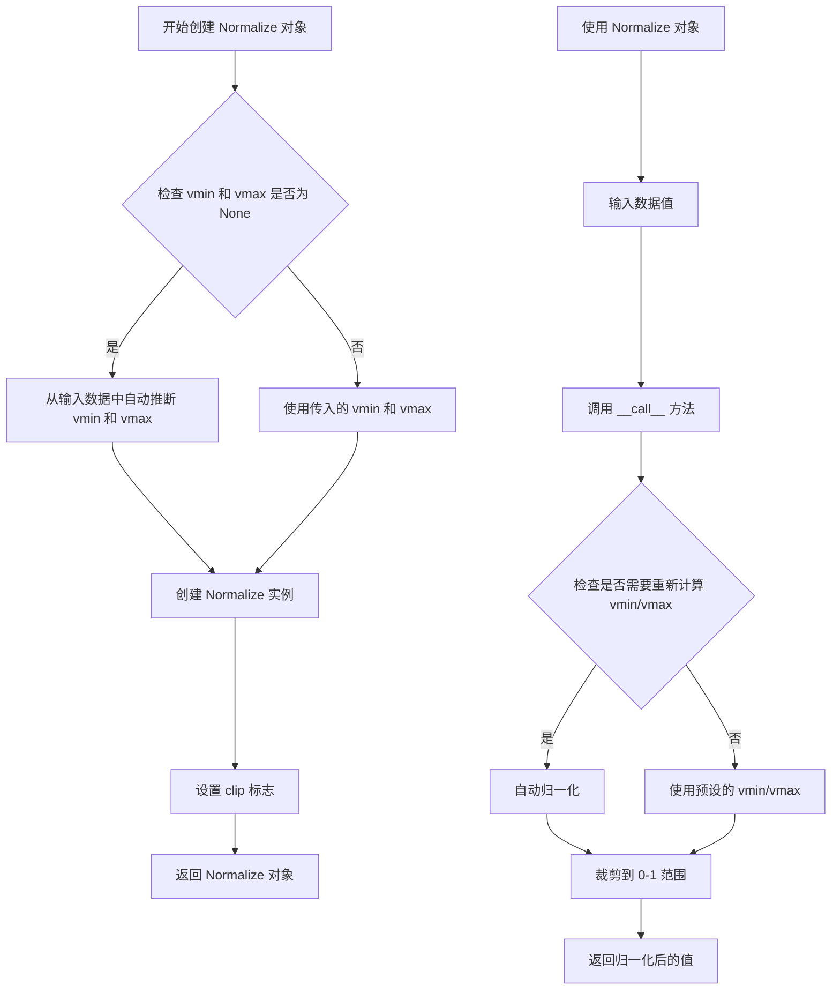
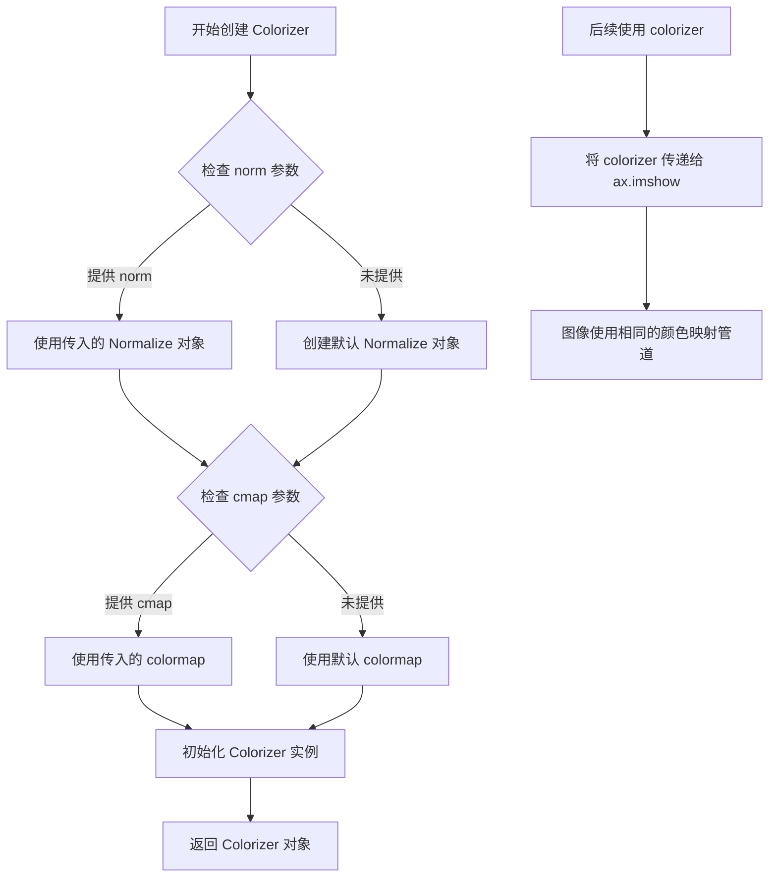
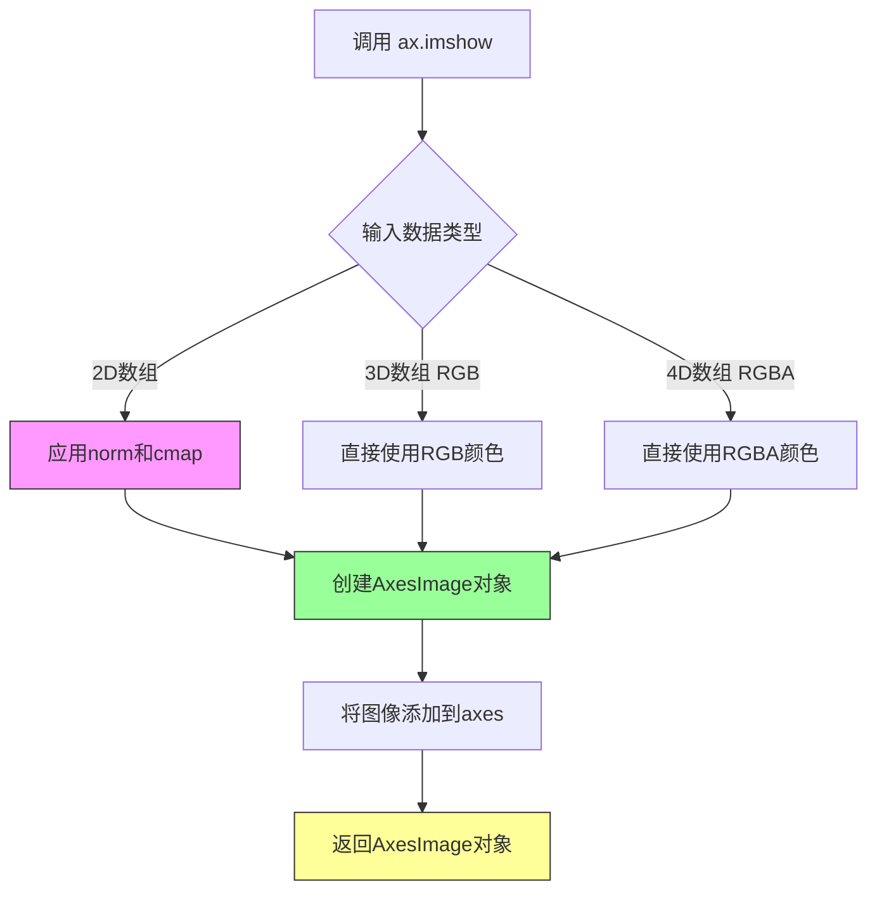
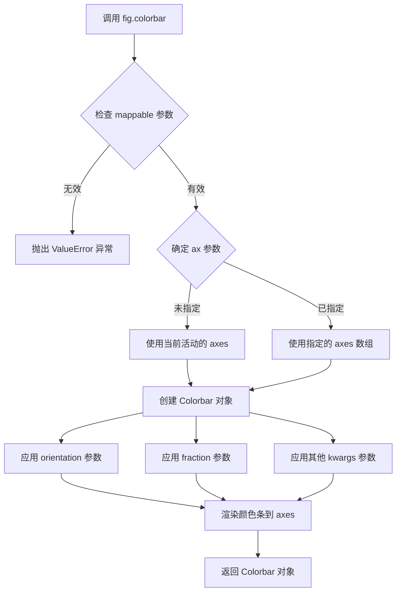
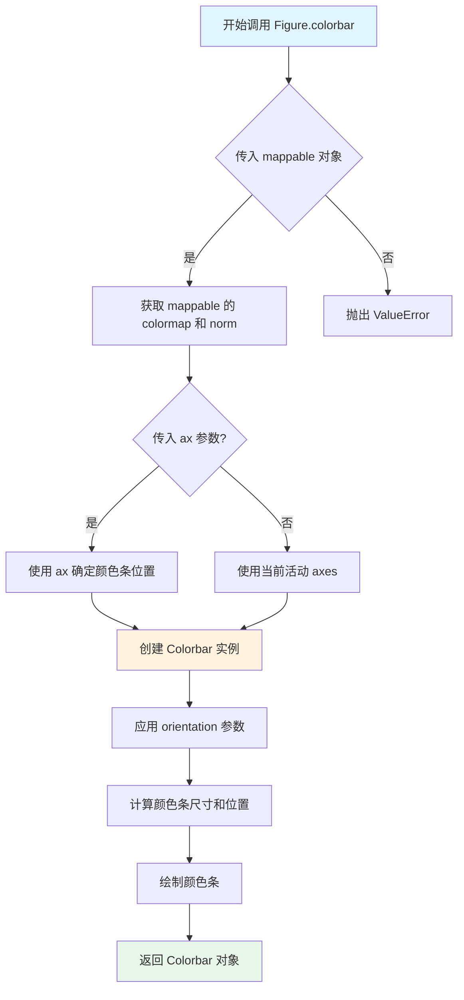
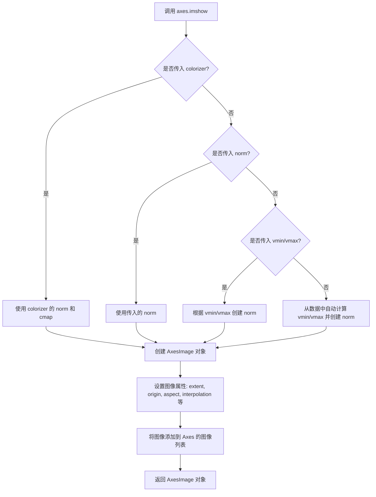

# `matplotlib\galleries\examples\images_contours_and_fields\multi_image.py` 详细设计文档

这是一个matplotlib示例代码，演示如何使用单个colorbar为多个图像保持一致的颜色映射。代码通过创建共享的Normalize和Colorizer对象，确保所有图像使用相同的数据到颜色映射管道，从而在缩放或更改colormap时保持颜色一致性。

## 整体流程

```mermaid
graph TD
    A[开始] --> B[设置随机种子 np.random.seed(19680801)]
    B --> C[创建4个随机数据集 datasets]
    C --> D[创建2x2子图 fig, axs = plt.subplots(2, 2)]
    D --> E[计算全局最小最大值并创建共享Normalize对象]
    E --> F[使用norm创建Colorizer对象]
    F --> G[遍历子图和数据创建图像列表]
    G --> H[使用第一个图像创建水平colorbar]
    H --> I[调用plt.show()显示图形]
    I --> J[结束 - 用户交互:缩放/修改colormap]
    J --> G
```

## 类结构

```
matplotlib.pyplot (绘图库)
├── Figure (fig)
└── Axes (axs数组)

matplotlib.colors
└── Normalize (norm - 颜色映射归一化)

matplotlib.colorizer
└── Colorizer (colorizer - 颜色生成器)
```

## 全局变量及字段


### `datasets`
    
存储4个随机生成的10x20数值数组

类型：`list[ndarray]`
    


### `fig`
    
matplotlib Figure对象

类型：`matplotlib.figure.Figure`
    


### `axs`
    
2x2的Axes对象数组

类型：`numpy.ndarray`
    


### `norm`
    
共享的归一化对象，定义颜色映射范围

类型：`matplotlib.colors.Normalize`
    


### `colorizer`
    
颜色生成器，确保所有图像颜色一致

类型：`matplotlib.colorizer.Colorizer`
    


### `images`
    
存储4个AxesImage对象

类型：`list`
    


### `Normalize.vmin`
    
归一化的最小值

类型：`float`
    


### `Normalize.vmax`
    
归一化的最大值

类型：`float`
    


### `Colorizer.norm`
    
颜色生成器使用的归一化对象

类型：`matplotlib.colors.Normalize`
    
    

## 全局函数及方法


### `np.random.seed`

设置 NumPy 随机数生成器的种子，以确保后续生成的随机数序列是可重复的。这对于调试和结果复现非常重要。

参数：

- `seed`：`int` 或 `None`，要设置的种子值。本例中传入 `19680801` 是一个常用的固定值，用于生成可复现的随机数据。

返回值：`None`，该函数无返回值，仅修改随机数生成器的内部状态。

#### 流程图



#### 带注释源码

```python
# 设置随机种子为 19680801，确保后续生成的随机数序列可复现
# 这个特定的种子值来自 matplotlib 官方示例的创建日期 (1968-08-01)
# 使得每次运行脚本时，np.random.rand() 生成的随机数组完全相同
np.random.seed(19680801)

# 后续的随机数生成都将基于这个种子，产生确定性的随机数据
datasets = [
    (i+1)/10 * np.random.rand(10, 20)
    for i in range(4)
]
```


### `np.random.rand`

生成指定形状的随机数组，返回值为 `[0, 1)` 区间内均匀分布的随机数组成的 numpy 数组。

参数：

-  `shape`：`int` 或 `tuple of ints`，要生成的数组的形状。例如 `np.random.rand(10, 20)` 生成 10 行 20 列的二维数组。

返回值：`numpy.ndarray`，指定形状的随机值数组，值为 `[0, 1)` 区间内的均匀分布随机浮点数。

#### 流程图



#### 带注释源码

```python
# np.random.rand 函数源码示例

# 在给定代码中的调用方式：
datasets = [
    (i+1)/10 * np.random.rand(10, 20)  # 生成4个10x20的随机数组
    for i in range(4)
]

# 函数原型：numpy.random.rand(d0, d1, ..., dn)
# - d0, d1, ..., dn: int, 可选的多个整数参数，定义输出数组的维度
# - 返回值: ndarray, 形状为 (d0, d1, ..., dn) 的随机值数组

# 内部实现逻辑（简化版）：
def rand(*shape):
    """
    生成指定形状的随机数组
    
    参数:
        *shape: int, 定义输出数组的形状
        
    返回:
        numpy.ndarray: [0, 1) 区间的均匀分布随机数
    """
    # 1. 将shape转换为整数元组
    # 2. 使用全局Random实例生成随机数
    # 3. 返回填充了随机数的数组
    pass
```

### 关键组件信息

| 名称 | 一句话描述 |
|------|-----------|
| `np.random.rand` | NumPy 随机数模块的核心函数，用于生成指定形状的均匀分布随机数组 |
| `datasets` | 存储4个经过缩放的随机数组的列表 |
| `norm` | Matplotlib 归一化对象，用于统一多个图像的颜色映射范围 |
| `colorizer` | Matplotlib 颜色器对象，确保所有图像使用一致的数据到颜色映射 |

### 潜在技术债务与优化空间

1. **随机种子硬编码**：`np.random.seed(19680801)` 直接修改全局随机状态，可能影响代码其他地方对随机性的预期
2. **数组生成效率**：使用列表推导式生成4个独立数组，可考虑预分配内存
3. **硬编码形状参数**：`10, 20` 和 `4` 应提取为常量或配置参数，提高代码可维护性
4. **错误处理缺失**：未对空数据集、NaN值等情况进行检验
5. **matplotlib版本依赖**：使用 `colorizer` 参数需要较新版本的 matplotlib（3.6+），缺少版本检查

### 其它项目说明

**设计目标与约束**：
- 目标：展示如何使用单个颜色条同步多个图像的颜色映射
- 约束：需要 matplotlib 3.6+ 版本支持 Colorizer API

**错误处理与异常设计**：
- 若 datasets 为空，`np.min(datasets)` 和 `np.max(datasets)` 会抛出 ValueError
- 若传入 invalid shape 给 `rand()`，NumPy 会抛出相应的异常

**数据流与状态机**：
```
seed(19680801) --> 生成随机数组 --> 数据归一化 --> 颜色映射 --> 图像渲染 --> 颜色条关联
```

**外部依赖与接口契约**：
- `numpy`：提供随机数生成和数值计算
- `matplotlib.pyplot`：提供绘图接口
- `matplotlib.colorizer.Colorizer`：自定义颜色映射器（3.6+）
- `matplotlib.colors.Normalize`：数据归一化类


### `np.min`

计算数组中的最小值。该函数返回数组元素中的最小值，可用于多维数组并支持沿指定轴计算。

参数：

-  `a`：`array_like`，输入数组或可以转换为数组的对象，这里是 `datasets`（包含4个 (10, 20) 随机数数组的列表）
-  `axis`：`int, optional`，沿指定轴计算最小值，未指定时返回所有元素的最小值
-  `out`：`ndarray, optional`，放置结果的替代输出数组
-  `keepdims`：`bool, optional`，是否保持原数组维度
-  `initial`：`scalar, optional`，用于比较的初始值
-  `where`：`array_like, optional`，用于元素比较的条件数组

返回值：`numpy scalar` 或 `ndarray`，输入数组的最小值。这里返回所有数据集中的最小标量值。

#### 流程图



#### 带注释源码

```python
# 从datasets列表中提取所有数组元素的最小值
# datasets是一个包含4个(10, 20)形状随机数数组的列表
# np.min会遍历所有数组，找出全局最小值用于归一化

norm = mcolors.Normalize(
    vmin=np.min(datasets),  # 计算所有数据集中的最小值作为颜色映射下限
    vmax=np.max(datasets)   # 计算所有数据集中的最大值作为颜色映射上限
)

# 等价于手动实现:
# min_val = np.min(datasets[0])
# for arr in datasets[1:]:
#     min_val = min(min_val, np.min(arr))
# 返回全局最小标量值
```

**代码上下文说明：**
在 `datasets` 列表中，每个元素是一个形状为 (10, 20) 的二维数组，共4个。`np.min(datasets)` 会自动将列表中的所有数组展平后计算全局最小值，确保所有子图使用统一的颜色映射范围，实现多图共享单一颜色条时的一致性着色。


### `np.max`

计算数组中的最大值，可沿指定轴计算，也可展平后计算全局最大值。

参数：

- `a`：`array_like`，输入数组，要计算最大值的数组
- `axis`：`int`，可选，沿哪个轴计算最大值，默认为 None（展平数组）
- `out`：`ndarray`，可选，用于存放结果的输出数组
- `keepdims`：`bool`，可选，若为 True，则输出的维度与输入相同
- `initial`：`scalar`，可选，初始值，用于比较
- `where`：`array_like`，可选，元素条件，只有满足条件的元素参与计算

返回值：``scalar` 或 `ndarray``，返回数组中的最大值，如果 `axis` 为 None，则返回标量；否则返回沿指定轴的最大值数组

#### 流程图



#### 带注释源码

```python
# np.max() 源码示例
# np.max(a, axis=None, out=None, keepdims=False, initial=<no value>, where=True)

# 示例用法
datasets = [
    (i+1)/10 * np.random.rand(10, 20)
    for i in range(4)
]

# 计算所有数据的最大值，用于设置 colorbar 的 vmax
norm = mcolors.Normalize(vmin=np.min(datasets), vmax=np.max(datasets))
# np.max(datasets) 返回一个标量值，表示所有数据元素中的最大值
# 参数说明：
#   - datasets: 三维列表结构，np.max 会将其转换为数组并展平计算
#   - axis 默认为 None，即展平后找最大值
# 返回值：float 类型，最大值
```


### `plt.subplots`

`plt.subplots` 是 matplotlib.pyplot 模块中的函数，用于创建一个包含多个子图的 Figure 对象以及对应的 Axes 对象数组。该函数简化了创建子图网格的过程，允许用户同时管理多个子图并可选地共享坐标轴。

参数：

- `nrows`：`int`，默认值：1，子图的行数
- `ncols`：`int`，默认值：1，子图的列数
- `sharex`：`bool` 或 `str`，默认值：False，如果为 True，所有子图共享 x 轴；如果为 'row'，每行子图共享 x 轴
- `sharey`：`bool` 或 `str`，默认值：False，如果为 True，所有子图共享 y 轴；如果为 'row'，每行子图共享 y 轴
- `squeeze`：`bool`，默认值：True，如果为 True，则压缩返回的 Axes 数组维度（单行或单列时返回 1 维数组）
- `width_ratios`：`array-like`，可选，用于指定各列的宽度比例
- `height_ratios`：`array-like`，可选，用于指定各行的宽度比例
- `gridspec_kw`：`dict`，可选，传递给 GridSpec 的额外关键字参数
- `figsize`：`tuple`，可选，Figure 的尺寸，格式为 (宽度, 高度)
- `dpi`：`int`，可选，Figure 的分辨率（每英寸点数）
- `facecolor`：`color`，可选，Figure 的背景色
- `edgecolor`：`color`，可选，Figure 的边框颜色
- `frameon`：`bool`，可选，是否绘制 Frame

返回值：`tuple(Figure, Axes or array of Axes)`，返回一个元组，包含一个 Figure 对象和一个 Axes 对象（或 Axes 对象数组）。当 `squeeze=False` 或指定 `nrows` 和 `ncols` 时，返回二维数组；当 `squeeze=True` 且只有一行或一列时，可能返回一维数组或单个 Axes 对象。

#### 流程图

```mermaid
flowchart TD
    A[调用 plt.subplots] --> B{传入参数验证}
    B -->|参数有效| C[创建 Figure 对象]
    C --> D[根据 nrows 和 ncols 创建 GridSpec]
    D --> E[遍历创建 Axes 对象]
    E --> F{sharex 参数设置}
    F -->|True| G[所有子图共享 X 轴]
    F -->|row| H[每行子图共享 X 轴]
    F -->|False| I[不共享 X 轴]
    I --> J{sharey 参数设置}
    J -->|True| K[所有子图共享 Y 轴]
    J -->|row| L[每行子图共享 Y 轴]
    J -->|False| M[不共享 Y 轴]
    M --> N[根据 squeeze 参数处理返回数组]
    N --> O[返回 (fig, axs) 元组]
    B -->|参数无效| P[抛出异常]
```

#### 带注释源码

```python
# 导入必要的库
import matplotlib.pyplot as plt
import numpy as np

# 设置随机种子以确保可重复性
np.random.seed(19680801)

# 生成4个随机数据集（10x20 的矩阵）
datasets = [
    (i+1)/10 * np.random.rand(10, 20)
    for i in range(4)
]

# 创建包含 2x2 子图的 Figure 和 Axes 数组
# 参数 (2, 2) 表示创建 2 行 2 列共 4 个子图
# fig: Figure 对象，代表整个图形窗口
# axs: Axes 对象数组，形状为 (2, 2)，可以通过 axs[row, col] 访问每个子图
fig, axs = plt.subplots(2, 2)

# 设置 Figure 的总标题
fig.suptitle('Multiple images')

# 导入颜色映射相关模块
import matplotlib.colorizer as mcolorizer
import matplotlib.colors as mcolors

# 创建 Normalize 对象，定义数据的归一化范围
# vmin: 数据最小值，用于映射到颜色映射表的起始端
# vmax: 数据最大值，用于映射到颜色映射表的结束端
norm = mcolors.Normalize(vmin=np.min(datasets), vmax=np.max(datasets))

# 创建 Colorizer 对象，用于统一所有图像的颜色映射
# 传入 norm 参数确保所有图像使用相同的数据到颜色映射规则
colorizer = mcolorizer.Colorizer(norm=norm)

# 初始化图像列表
images = []

# 遍历每个子图轴和对应的数据集
# axs.flat 将二维数组展平为一维迭代器，方便遍历
for ax, data in zip(axs.flat, datasets):
    # 使用 imshow 显示图像，并应用统一的 colorizer
    # 这确保所有图像使用相同的颜色映射规则
    images.append(ax.imshow(data, colorizer=colorizer))

# 为第一个图像添加颜色条
# ax=axs 参数指定颜色条关联到所有子图
# orientation='horizontal' 设置颜色条水平显示
# fraction=.1 设置颜色条占用的空间比例
fig.colorbar(images[0], ax=axs, orientation='horizontal', fraction=.1)

# 显示图形
plt.show()
```


### `mcolors.Normalize`

创建归一化对象，用于将数据值映射到颜色映射范围，确保多个图像使用一致的色彩映射。

参数：

- `vmin`：浮点数或 `None`，数据范围的最小值。如果为 `None`，则从数据中自动推断
- `vmax`：浮点数或 `None`，数据范围的最大值。如果为 `None`，则从数据中自动推断
- `clip`：布尔值，默认为 `False`，是否将值裁剪到 [0, 1] 范围

返回值：`matplotlib.colors.Normalize`，归一化对象，用于将数据值映射到颜色映射范围

#### 流程图



#### 带注释源码

```python
# matplotlib.colors.Normalize 类的构造函数
# 用于创建归一化对象，将数据值映射到 [0, 1] 范围

norm = mcolors.Normalize(
    vmin=np.min(datasets),  # 数据集的最小值，作为颜色映射的下界
    vmax=np.max(datasets)   # 数据集的最大值，作为颜色映射的上界
)

# 源码逻辑说明：
# 1. Normalize 类初始化时接收 vmin, vmax 参数
# 2. vmin 和 vmax 定义了数据值到颜色的映射范围
# 3. 当调用归一化对象时 (norm(value))，会将 value 映射到 [0, 1] 范围
# 4. 映射公式: normalized_value = (value - vmin) / (vmax - vmin)
# 5. 如果 value 超出 [vmin, vmax] 范围，会被裁剪到边界值

# 示例：
# vmin = 0.0, vmax = 10.0
# norm(5.0) -> 0.5
# norm(0.0) -> 0.0
# norm(10.0) -> 1.0
# norm(15.0) -> 1.0 (如果 clip=True) 或 1.5 (如果 clip=False)
```


### `mcolorizer.Colorizer`

创建颜色生成器对象，用于在多个图像之间保持一致的配色。该对象封装了数据到颜色的映射管道（归一化和色彩映射），确保所有使用该 colorizer 的图像具有相同的颜色缩放。

参数：

- `norm`：`matplotlib.colors.Normalize`，归一化对象，定义数据值如何映射到色彩映射范围，默认为 `None`（使用线性归一化）
- `cmap`：`str` 或 `matplotlib.colors.Colormap`，可选，色彩映射名称或对象，默认为 `None`
- `alpha`：`float`，可选，透明度值，范围 0-1，默认为 `None`

返回值：`matplotlib.colorizer.Colorizer`，返回新创建的颜色生成器实例

#### 流程图



#### 带注释源码

```python
# 从示例代码中提取的关键调用
import matplotlib.colorizer as mcolorizer
import matplotlib.colors as mcolors
import numpy as np

# 步骤1: 创建归一化对象，定义数据值范围
# vmin: 数据最小值, vmax: 数据最大值
norm = mcolors.Normalize(vmin=np.min(datasets), vmax=np.max(datasets))

# 步骤2: 创建 Colorizer 对象
# 参数:
#   - norm: 归一化对象，确保所有图像使用相同的数据到颜色映射
# 返回: Colorizer 实例，用于颜色生成
colorizer = mcolorizer.Colorizer(norm=norm)

# 步骤3: 在多个图像中使用同一个 colorizer
# 这样可以确保所有图像使用相同的颜色缩放
images = []
for ax, data in zip(axs.flat, datasets):
    # 将 colorizer 传递给 imshow，图像将使用统一的颜色映射
    images.append(ax.imshow(data, colorizer=colorizer))

# 步骤4: 创建颜色条，使用第一个图像的颜色映射
# 由于所有图像使用同一个 colorizer，颜色条可以代表所有图像
fig.colorbar(images[0], ax=axs, orientation='horizontal', fraction=.1)
```

#### 关键组件信息

| 组件名称 | 一句话描述 |
|---------|-----------|
| `Colorizer` | 封装数据到颜色映射逻辑的对象，确保多图像配色一致性 |
| `Normalize` | 将任意数据值范围映射到 [0, 1] 区间的类 |
| `ax.imshow` | 显示图像的 matplotlib 方法，支持 colorizer 参数 |

#### 潜在技术债务与优化空间

1. **参数验证缺失**：未对传入的 `norm` 和 `cmap` 参数进行类型验证
2. **错误处理不足**：未提供详细的错误信息，当参数不合法时用户难以定位问题
3. **文档示例不完整**：官方示例中未展示如何动态修改 colorizer 的属性
4. **性能优化空间**：对于大型数据集，可以考虑缓存计算结果

#### 其它项目说明

- **设计目标**：解决 matplotlib 中单一颜色条无法关联多个图像的问题
- **约束条件**：所有共享 colorizer 的图像必须具有可比较的数据范围
- **错误处理**：当传入无效的 norm 或 cmap 时，可能抛出 `TypeError` 或 `ValueError`
- **数据流**：数据集 → Normalize 归一化 → Colormap 映射颜色 → 图像显示
- **外部依赖**：依赖 `matplotlib.colors` 模块中的 `Normalize` 和 `Colormap` 类


### `matplotlib.axes.Axes.imshow`

在Axes上显示图像数据的方法，支持多种数据输入格式（如二维数组、三维RGB或RGBA数组），并通过colormap和normalization进行数据到颜色的映射，返回一个AxesImage对象用于后续的图像操作和颜色条配置。

参数：

- `X`：array-like，要显示的图像数据，可以是M×N（亮度）、M×N×3（RGB）或M×N×4（RGBA）格式
- `cmap`：str or Colormap, optional，用于映射数据的colormap名称或Colormap对象，默认为None
- `norm`：Normalize, optional，数据值到colormap的归一化对象，默认为None
- `aspect`：float or 'auto', optional，控制轴的纵横比，默认为None
- `interpolation`：str, optional，图像插值方法，如'bilinear'、'nearest'等，默认为None
- `alpha`：scalar or array-like, optional，透明度值，默认为None
- `vmin`, `vmax`：float, optional，设置颜色映射的范围，默认为None
- `origin`：{'upper', 'lower'}, optional，图像原点位置，默认为None
- `extent`：floats (left, right, bottom, top), optional，数据坐标的扩展范围，默认为None
- `filternorm`：float, optional，滤波器归一化参数，默认为1
- `filterrad`：float, optional，滤波器半径，默认为4.0
- `resample`：bool, optional，是否重采样，默认为None
- `url`：str, optional，设置axes图像的URL，默认为None
- `**kwargs`：dict，其他传递给AxesImage的关键字参数

返回值：`matplotlib.image.AxesImage`，返回的图像对象，可用于后续配置颜色条、获取数据等操作

#### 流程图



#### 带注释源码

```python
# 示例代码来自matplotlib官方示例
# 演示如何使用Colorizer实现多图像共享颜色映射

# 导入必要的库
import matplotlib.pyplot as plt
import numpy as np
import matplotlib.colorizer as mcolorizer
import matplotlib.colors as mcolors

# 设置随机种子以确保可重复性
np.random.seed(19680801)

# 生成4个随机数据集（10x20的二维数组）
datasets = [
    (i+1)/10 * np.random.rand(10, 20)
    for i in range(4)
]

# 创建2x2的子图
fig, axs = plt.subplots(2, 2)
fig.suptitle('Multiple images')

# ============================================
# 关键代码：创建共享的Colorizer对象
# ============================================

# 1. 创建归一化对象，确定数据的颜色映射范围
# 使用所有数据集的最小值和最大值，确保颜色范围一致
norm = mcolors.Normalize(vmin=np.min(datasets), vmax=np.max(datasets))

# 2. 创建Colorizer对象，传入norm实现共享归一化
# 这样所有图像将使用相同的颜色映射规则
colorizer = mcolorizer.Colorizer(norm=norm)

# ============================================
# 关键代码：调用ax.imshow()方法
# ============================================

images = []
# 遍历每个axes和对应的数据
for ax, data in zip(axs.flat, datasets):
    # 调用imshow显示图像
    # 参数1: data - 要显示的二维数组
    # 参数2: colorizer - 共享的Colorizer对象，确保颜色一致性
    # 返回值: AxesImage对象
    images.append(ax.imshow(data, colorizer=colorizer))

# 为第一个图像创建水平方向的颜色条
# fraction=.1表示颜色条高度占axes区域的10%
fig.colorbar(images[0], ax=axs, orientation='horizontal', fraction=.1)

# 显示图形
plt.show()

# ============================================
# ax.imshow() 工作原理详解：
# ============================================
#
# 1. 数据输入: 接收numpy数组X
#    - 如果X是M×N: 使用cmap和norm映射到颜色
#    - 如果X是M×N×3: 直接作为RGB值
#    - 如果X是M×N×4: 直接作为RGBA值
#
# 2. 颜色映射:
#    - 如果传入了colorizer参数，使用colorizer进行映射
#    - 否则使用cmap和norm参数
#    - colorizer本质上封装了colormap和normalization逻辑
#
# 3. 返回值:
#    - 返回AxesImage对象
#    - 该对象可被fig.colorbar()使用
#    - 可通过set_clim()动态修改颜色范围
#    - 可通过set_cmap()修改colormap
#
# 4. 交互特性:
#    - 支持缩放和平移
#    - 通过colorbar可以交互修改vmin/vmax
#    - colormap修改会自动传播到所有使用相同colorizer的图像
```


### `Figure.colorbar`

为图像添加颜色条（Colorbar），用于显示图像数据值与颜色映射的对应关系，使得可视化结果更具可读性。该方法创建一个与图像关联的颜色条，通过共享的Normalize对象确保多图像的颜色一致性。

参数：

- `mappable`：`matplotlib.cm.ScalarMappable`，要为其添加颜色条的可映射对象，通常是`AxesImage`对象（如`ax.imshow()`的返回值）
- `ax`：`matplotlib.axes.Axes` 或 array-like，可选，指定颜色条所属的axes，默认为None时使用figure的当前axes
- `orientation`：`str`，可选，默认为`'vertical'`，指定颜色条的方向，可选值为`'vertical'`（垂直）或`'horizontal'`（水平）
- `fraction`：`float`，可选，默认为`0.15`，颜色条在axes中占据的空间比例
- `pad`：`float`，可选，颜色条与主axes之间的间距
- `shrink`：`float`，可选，颜色条的缩放因子
- `aspect`：`int` 或 `float`，可选，颜色条的宽高比
- `**kwargs`：其他关键字参数，将传递给`Colorbar`构造函数

返回值：`matplotlib.colorbar.Colorbar`，颜色条对象，包含颜色条的所有属性和方法，可用于进一步自定义颜色条外观

#### 流程图



#### 带注释源码

```python
# 代码示例来源：matplotlib官方示例
# 演示如何使用 fig.colorbar 为图像添加颜色条

# 导入必要的库
import matplotlib.pyplot as plt
import numpy as np

import matplotlib.colorizer as mcolorizer
import matplotlib.colors as mcolors

# 设置随机种子以保证结果可复现
np.random.seed(19680801)

# 创建4个随机数据集（10x20的矩阵）
datasets = [
    (i+1)/10 * np.random.rand(10, 20)
    for i in range(4)
]

# 创建2x2的子图布局
fig, axs = plt.subplots(2, 2)
fig.suptitle('Multiple images')

# -------------------------------------------------------------
# 关键步骤：创建共享的 Normalize 对象
# -------------------------------------------------------------
# vmin 和 vmax 确保所有图像使用相同的数据范围
norm = mcolors.Normalize(vmin=np.min(datasets), vmax=np.max(datasets))

# 创建 Colorizer 对象并传入共享的 norm
# 这样所有图像将使用相同的颜色映射规则
colorizer = mcolorizer.Colorizer(norm=norm)

# -------------------------------------------------------------
# 核心调用：fig.colorbar()
# -------------------------------------------------------------
# 语法：fig.colorbar(mappable, ax, orientation, fraction, **kwargs)
#
# 参数说明：
# - images[0]: 第一个AxesImage对象，作为颜色条的基础
# - ax=axs: 将颜色条与所有子图关联
# - orientation='horizontal': 水平方向的颜色条
# - fraction=.1: 颜色条占据10%的空间
# -------------------------------------------------------------

images = []
for ax, data in zip(axs.flat, datasets):
    # 为每个子图添加图像，使用共享的colorizer
    images.append(ax.imshow(data, colorizer=colorizer))

# 为图像添加颜色条
# 这是题目要求的核心函数调用
fig.colorbar(images[0], ax=axs, orientation='horizontal', fraction=.1)

# 显示图像
plt.show()

# -------------------------------------------------------------
# 补充说明：fig.colorbar() 的返回值
# -------------------------------------------------------------
# colorbar = fig.colorbar(images[0], ax=axs)
# 返回的 colorbar 是 Colorbar 实例，可用于：
# - colorbar.set_label('Value')  # 设置标签
# - colorbar.set_ticks([0, 0.5, 1])  # 设置刻度
# - colorbar.ax.tick_params()  # 自定义刻度样式
```

#### 关键技术细节

| 特性 | 说明 |
|------|------|
| 数据一致性 | 通过共享`Colorizer`或`Normalize`对象，确保多图像颜色映射一致 |
| 方向控制 | `orientation`参数控制颜色条是垂直还是水平 |
| 空间占用 | `fraction`参数控制颜色条在axes中的空间比例 |
| 多axes关联 | `ax`参数可以接收axes数组，使单个颜色条控制多个子图 |


### `plt.show()`

显示所有打开的图形窗口。在阻塞模式下，会暂停程序执行直到用户关闭所有图形窗口；在非阻塞模式下，则启动图形事件循环并立即返回。

参数：

- `block`：`bool | None`，可选参数。默认为 `None`。如果设置为 `True`，则阻塞主线程并运行 GUI 事件循环，直到用户关闭所有窗口；如果设置为 `False`，则确保 GUI 事件循环运行但不阻塞主线程；如果为 `None`，则使用当前的交互设置（`plt.isinteractive()` 的返回值）。

返回值：`None`，该函数无返回值，仅用于显示图形。

#### 流程图

```mermaid
flowchart TD
    A[调用 plt.show()] --> B{检查 block 参数}
    B -->|block=True| C[阻塞模式: 运行 GUI 主循环<br/>等待用户关闭窗口]
    B -->|block=False| D[非阻塞模式: 启动 GUI 事件循环<br/>立即返回]
    B -->|block=None| E{当前是否为交互模式?}
    E -->|是| D
    E -->|否| C
    C --> F[函数返回]
    D --> F
```

#### 带注释源码

```python
# matplotlib.pyplot.show() 核心实现逻辑
def show(*, block=None):
    """
    显示所有打开的图形窗口。
    
    Parameters
    ----------
    block : bool, optional
        如果为 True，阻塞并运行 GUI 主循环直到用户关闭窗口。
        如果为 False，确保 GUI 主循环运行但不阻塞。
        如果为 None，使用当前的交互设置。
    """
    # 获取当前所有打开的图形管理器
    global _bool
    
    # 获取所有打开的 figure 管理器
    figures = [manager.canvas.figure for manager in Gcf.get_all_fig_managers()]
    
    if not figures:
        # 如果没有打开的图形，直接返回
        return
    
    # 如果 block 为 None，根据交互设置决定
    if block is None:
        block = rcParams['interactive']
    
    # 显示所有图形
    for figure in figures:
        # 调用每个 figure 的 show 方法
        figure.show()
    
    # 根据 block 参数决定是否阻塞
    if block:
        # 阻塞模式：启动 GUI 主循环
        # 这会暂停程序执行，直到用户关闭所有图形窗口
        import matplotlib._pylab_helpers as _pylab_helpers
        _pylab_helpers.Gcf.destroy_all()
    else:
        # 非阻塞模式：只启动事件循环，立即返回
        # 图形窗口保持响应，但不阻塞主程序
        pass
    
    # 强制刷新所有待处理的图形事件
    for manager in Gcf.get_all_fig_managers():
        manager.canvas.flush_events()
    
    return None
```

#### 在示例代码中的使用

```python
# 示例代码中 plt.show() 的调用位置
# ... (前续代码创建图形和颜色条) ...

# 显示所有图形窗口
# 此时会弹出包含 2x2 子图的窗口，每个子图共享同一个颜色条
plt.show()  # <--- 这里是函数调用位置

# 用户关闭图形窗口后，程序继续执行
```


### Figure.colorbar

向图形添加颜色条（colorbar），用于显示图像或图形内容的颜色映射标尺。在本示例中，颜色条连接到第一个图像，并通过共享的Colorizer对象确保多个图像的颜色一致性。

参数：

- `mappable`：任意 matplotlib .cm.ScalarMappable，通常是 `AxesImage` 对象，要添加颜色条的可映射对象（必选）
- `ax`：Axes 或 array_like，可选，关联的 Axes 对象或 Axes 数组，用于确定颜色条的位置
- `orientation`：str，可选，颜色条的朝向，可为 'vertical' 或 'horizontal'，默认 'vertical'
- `fraction`：float，可选，颜色条相对于子图区域的比例，默认 0.15
- `pad`：float，可选，颜色条与子图之间的间距
- `shrink`：float，可选，颜色条的收缩系数
- `aspect`：int 或 float，可选，颜色条的宽高比
- `**kwargs`：关键字参数，传递给 colorbar 构造器的其他参数

返回值：`matplotlib.colorbar.Colorbar`，颜色条对象

#### 流程图



#### 带注释源码

```python
# 示例代码展示 Figure.colorbar 的使用方式
fig, axs = plt.subplots(2, 2)  # 创建 2x2 的子图布局
fig.suptitle('Multiple images')  # 设置总标题

# 创建共享的 Normalize 对象，确保所有图像使用相同的数据到颜色映射
norm = mcolors.Normalize(vmin=np.min(datasets), vmax=np.max(datasets))
# 创建 Colorizer 对象，封装 norm 和 colormap 信息
colorizer = mcolorizer.Colorizer(norm=norm)

images = []  # 存储所有图像对象
# 遍历每个子图和数据，绘制图像
for ax, data in zip(axs.flat, datasets):
    # 使用共享的 colorizer 确保颜色一致性
    images.append(ax.imshow(data, colorizer=colorizer))

# 调用 Figure.colorbar 添加颜色条
# 参数说明：
# - images[0]: 第一个图像对象，作为颜色条的数据源
# - ax=axs: 指定颜色条作用于所有子图
# - orientation='horizontal': 水平方向
# - fraction=.1: 颜色条宽度占比 10%
fig.colorbar(images[0], ax=axs, orientation='horizontal', fraction=.1)

plt.show()  # 显示图形
```


### `matplotlib.axes.Axes.imshow`

该方法用于在 Axes 上显示图像数据，支持传入 `Colorizer` 对象以实现多图像共享同一颜色映射和归一化配置，从而保证颜色显示的一致性。

参数：

- `X`：`<class 'array-like'>`，图像数据，可以是 2D 数组（灰度）或 3D 数组（RGB/RGBA）
- `colorizer`：`<class 'matplotlib.colorizer.Colorizer'>`，可选，色彩化器对象，用于统一管理颜色映射和归一化；若不指定，则根据 `cmap`、`norm`、`vmin`、`vmax` 等参数自动创建
- `cmap`：`<class 'str'>` 或 `<class 'Colormap'>`，可选，颜色映射表，默认为 `rcParams["image.cmap"]`
- `norm`：`<class 'Normalize'`>，可选，数据归一化实例，与 `colorizer` 二选一使用
- `aspect`：`<class 'str'>` 或 `<class 'float'>`，可选，控制图像纵横比，可为 `'auto'`、`'equal'` 或具体数值
- `interpolation`：`<class 'str'>`，可选，插值方法，如 `'bilinear'`、`'nearest'` 等
- `alpha`：`<class 'float'`> 或 `<class 'array-like'>`，可选，透明度，范围 0-1
- `vmin`、`vmax`：`<class 'float'>`，可选，配合 `norm` 使用，定义颜色映射的最小/最大值
- `origin`：`<class 'str'>`，可选，坐标原点位置，`'upper'`（默认）或 `'lower'`
- `extent`：`<class 'tuple'>`，可选，数据范围 `[left, right, bottom, top]`
- `**kwargs`：`<class 'dict'>`，其他关键字参数传递给底层 `AxesImage` 对象

返回值：`<class 'matplotlib.image.AxesImage'>`，返回创建的 AxesImage 对象，可用于后续颜色条绑定等操作

#### 流程图



#### 带注释源码

```python
# 代码来源: matplotlib/lib/matplotlib/axes/_axes.py (简化版核心逻辑)

def imshow(self, X, cmap=None, norm=None, aspect=None,
           interpolation=None, alpha=None, vmin=None, vmax=None,
           origin=None, extent=None, *, colorizer=None, **kwargs):
    """
    在 Axes 上显示图像或数据矩阵。
    
    参数:
        X: array-like, 图像数据
        cmap: str 或 Colormap, 颜色映射
        norm: Normalize, 数据归一化
        aspect: str 或 float, 纵横比
        interpolation: str, 插值方法
        alpha: float, 透明度
        vmin, vmax: float, 颜色映射范围
        origin: str, 原点位置
        extent: tuple, 数据范围
        colorizer: Colorizer, 色彩化器(本例新增参数)
        **kwargs: 其他参数传递给 AxesImage
    
    返回:
        AxesImage: 图像对象
    """
    
    # 1. 处理 colorizer 参数 - 核心功能: 支持共享色彩配置
    if colorizer is not None:
        # 如果传入了 colorizer，从中提取 norm 和 cmap
        # 这确保了多个图像使用相同的颜色映射配置
        if norm is None:
            norm = colorizer.norm
        if cmap is None:
            cmap = colorizer.cmap
    
    # 2. 如果没有传入 norm，根据 vmin/vmax 创建
    if norm is None:
        if vmin is not None or vmax is not None:
            # 根据传入的 vmin/vmax 创建归一化对象
            norm = mcolors.Normalize(vmin=vmin, vmax=vmax)
        else:
            # 从数据中自动计算 vmin/vmax
            # np.nanmin/nanmax 处理含 NaN 的数据
            vmin = np.nanmin(X)
            vmax = np.nanmax(X)
            norm = mcolors.Normalize(vmin=vmin, vmax=vmax)
    
    # 3. 处理 cmap 参数
    if cmap is None:
        # 从 matplotlib 配置中获取默认 cmap
        cmap = plt.rcParams['image.cmap']
    
    # 4. 创建 AxesImage 对象
    # AxesImage 负责渲染图像数据到 Axes 坐标系
    im = AxesImage(self, cmap, norm, extent=extent, origin=origin,
                   **kwargs)
    
    # 5. 设置图像的其他属性
    if aspect is not None:
        im.set_aspect(aspect)
    if interpolation is not None:
        im.set_interpolation(interpolation)
    
    # 6. 设置图像数据
    # _set_scale 关联 norm，_set_cmap 关联 cmap
    im.set_data(X)
    im.set_alpha(alpha)
    
    # 7. 将图像添加到 Axes 的图像列表中
    self.images.append(im)
    
    # 8. 更新轴范围以适应图像
    im.stale_callback = self._stale_figure_callback
    self.autoscale_view()
    
    # 9. 返回 AxesImage 对象
    # 该对象可传递给 fig.colorbar() 创建颜色条
    return im
```

## 关键组件


### Colorizer (matplotlib.colorizer.Colorizer)

核心的颜色映射对象，用于确保多个图像使用统一的数据到颜色转换管道。通过共享Colorizer实例，保证所有图像在缩放、缩放操作和Colormap变更时保持颜色一致性。

### Normalize (matplotlib.colors.Normalize)

数据归一化工具，定义数据的显示范围（vmin和vmax）。在此示例中，基于所有数据集的全局最小值和最大值创建，确保不同图像使用相同的数值到颜色的映射区间。

### datasets (数据集列表)

存储4个随机生成的10×20 NumPy数组，作为图像显示的源数据。每个数据集通过(i+1)/10因子进行缩放，产生不同的数值范围。

### plt.subplots (子图布局)

创建2×2的子图网格布局，返回Figure对象和Axes数组。通过axs.flat展平axes数组，便于后续迭代处理。

### ax.imshow (图像渲染)

Matplotlib的图像显示方法，在此接收colorizer参数以应用统一的颜色映射策略。每个子轴调用一次，共享同一个Colorizer实例。

### fig.colorbar (颜色条)

为第一个图像创建颜色条，通过ax=axs参数使其与所有子图关联。orientation='horizontal'设置水平方向，fraction=.1控制颜色条占比。

### 数据流与状态机

数据流：datasets → Normalize(计算全局vmin/vmax) → Colorizer(应用norm) → imshow(渲染) → colorbar(显示图例)

状态机：初始化 → 数据准备 → 颜色映射创建 → 图像渲染 → 颜色条关联 → 显示完成

### 潜在技术债务

1. Colorizer API相对较新，文档和示例较少，可能存在向后兼容性问题
2. 当前仅支持通过代码修改colormap，GUI交互修改需要特定后端支持
3. 缺少对非数值类型数据（如分类数据）的颜色映射支持

### 错误处理与异常设计

- 数据为空时Normalize会抛出ValueError
- datasets中的数据维度不一致时可能导致显示错误
- 建议添加数据验证逻辑，确保所有数据集具有相同形状或兼容的维度

### 外部依赖与接口契约

- 依赖matplotlib.colorizer模块（3.7+版本）
- 依赖matplotlib.colors模块的Normalize类
- 依赖numpy.random生成测试数据
- Colorizer必须接收norm参数以实现跨图像一致性


## 问题及建议


### 已知问题

-   **硬编码的配置参数**：图像尺寸(10x20)、子图布局(2x2)、颜色条方向(horizontal)等参数均为硬编码，缺乏灵活性，难以适应不同场景
-   **错误处理缺失**：未对空数据集、None值、NaN值或无效数据进行检查，可能导致运行时错误
-   **类型注解缺失**：代码未使用Python类型注解，降低了代码的可读性和静态分析能力
-   **全局状态依赖**：直接调用`np.random.seed()`设置全局随机种子，可能影响其他代码的随机行为
-   **魔法数字分散**：(i+1)/10、10、20、2、2、0.1等数值散落在代码中，缺乏命名常量，未来的维护和修改困难
-   **资源管理不完善**：`plt.show()`会阻塞，且未提供图形对象的清理机制，可能导致资源泄漏
-   **复用性受限**：所有逻辑直接写在顶层脚本中，未封装为可重用的函数或类，限制了代码的复用性
-   **边界情况未处理**：未处理datasets数量与axs数量不匹配的情况

### 优化建议

-   **提取配置参数**：将硬编码值提取为模块级常量或配置文件，如IMAGE_HEIGHT=20, IMAGE_WIDTH=10, ROWS=2, COLS=2
-   **添加类型注解**：为函数参数和返回值添加类型注解，如def create_datasets(n: int = 4, ...) -> list[np.ndarray]
-   **封装为函数**：将数据生成、图像创建、颜色条设置等逻辑封装为独立函数，提高代码复用性
-   **增加错误处理**：添加数据验证逻辑，检查datasets是否为空、是否包含有效数值等
-   **使用上下文管理器**：考虑使用with语句或确保图形对象在使用后被正确关闭
-   **文档字符串**：为新增函数添加详细的docstring，说明参数、返回值和异常情况
-   **参数化设计**：将布局方式、颜色条方向等设计为可选参数，提供默认值的同时允许自定义
-   **移除全局状态影响**：使用局部随机生成器(np.random.RandomState)代替全局随机种子设置


## 其它


### 设计目标与约束

本示例的设计目标是解决matplotlib中一个colorbar只能绑定一个image的限制，通过共享Colorizer对象实现多图像颜色一致性。约束条件包括：所有图像必须使用相同的归一化对象(vmin/vmax)，colorizer必须提前创建并传递给所有imshow调用。

### 错误处理与异常设计

本代码主要依赖matplotlib内部错误处理。当datasets为空时会触发numpy和matplotlib的异常；norm参数vmin>=vmax时会触发Normalize错误；colorizer为None时imshow会抛出TypeError。代码本身未进行显式参数校验，属于调用方责任。

### 数据流与状态机

数据流：datasets列表 -> np.random.rand生成随机数组 -> Normalize对象计算全局vmin/vmax -> Colorizer对象封装norm -> imshow方法接收colorizer -> Figure.colorbar绑定首个image对象并关联axs子图。

状态机：本示例为一次性静态绘图，无复杂状态变化。交互状态（如缩放、colormap变更）由matplotlib内部状态机管理。

### 外部依赖与接口契约

主要依赖：matplotlib.pyplot(plt)、numpy(np)、matplotlib.colorizer(mcolorizer)、matplotlib.colors(mcolors)。接口契约：imshow的colorizer参数接受Colorizer实例；Figure.colorbar的ax参数接受Axes数组或列表；Normalize的vmin/vmax须为数值类型且vmin<vmax。

### 性能考虑

本示例数据量较小(10x20x4)，性能无明显影响。潜在优化点：datasets较大会导致np.min/np.max遍历多次，可使用np.concatenate一次遍历；多个imshow调用可考虑批量处理。

### 安全性考虑

代码无用户输入、无网络交互、无敏感数据处理，安全性风险较低。np.random.seed使用固定种子确保可复现性。

### 可测试性

代码可直接运行验证。测试要点：验证所有图像使用相同colormap映射、检查colorbar范围与图像数据范围一致、验证多个图像缩放时颜色同步更新。

### 兼容性考虑

本代码兼容matplotlib 3.6+版本（Colorizer类引入版本）。numpy版本需支持np.random.rand和np.min/np.max函数。代码可在任何支持matplotlib的backend上运行。

### 配置文件和参数说明

关键参数：np.random.seed(19680801)控制随机种子确保可复现；norm的vmin/vmax基于全局最值计算；fig.colorbar的fraction=.1控制colorbar占图比例。

### 使用示例和边界情况

边界情况：空datasets会导致错误；单张图像无需共享colorizer；不同尺寸数据可共存但需统一norm。扩展用法可考虑：动态更新colorizer的colormap、通过滑动条动态调整vmin/vmax、结合animation实时更新多图像。

    