# `matplotlib\galleries\examples\images_contours_and_fields\pcolor_demo.py` 详细设计文档

这是一个matplotlib示例代码，展示了如何使用pcolor、pcolormesh、pcolorfast和imshow函数绘制2D图像风格的热力图，并比较它们之间的异同，同时演示了如何在对数刻度下使用pcolor。

## 整体流程

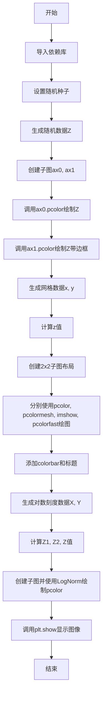

## 类结构

```
matplotlib.pyplot (绘图库)
├── Figure (图形容器)
│   ├── Axes (坐标轴)
│   │   ├── pcolor()
│   │   ├── pcolormesh()
pcolorfast()
│   │   ├── imshow()
│   │   └── set_title()
│   └── colorbar()
numpy (数值计算库)
└── 各类数值函数
```

## 全局变量及字段


### `Z`
    
由 np.random.rand(6, 10) 生成的 6x10 随机数组，用于演示 pcolor 基本用法

类型：`numpy.ndarray`
    


### `dx`
    
网格在 x 方向的间距，值为 0.15，用于生成坐标网格

类型：`float`
    


### `dy`
    
网格在 y 方向的间距，值为 0.05，用于生成坐标网格

类型：`float`
    


### `y`
    
通过 np.mgrid 生成的 y 坐标网格，范围从 -3 到 3+dy

类型：`numpy.ndarray`
    


### `x`
    
通过 np.mgrid 生成的 x 坐标网格，范围从 -3 到 3+dx

类型：`numpy.ndarray`
    


### `z`
    
基于 x, y 计算的函数值数组，公式为 (1 - x/2 + x**5 + y**3) * exp(-x**2 - y**2)

类型：`numpy.ndarray`
    


### `z_min`
    
z 数组绝对值的负最大值，用于颜色映射的范围下限

类型：`float`
    


### `z_max`
    
z 数组绝对值的正最大值，用于颜色映射的范围上限

类型：`float`
    


### `N`
    
网格数量，值为 100，用于生成对数尺度演示的网格

类型：`int`
    


### `X`
    
通过 meshgrid 生成的 X 坐标网格，范围从 -3 到 3

类型：`numpy.ndarray`
    


### `Y`
    
通过 meshgrid 生成的 Y 坐标网格，范围从 -2 到 2

类型：`numpy.ndarray`
    


### `Z1`
    
宽高斯衰减函数，公式为 exp(-X² - Y²)，形成较大的峰

类型：`numpy.ndarray`
    


### `Z2`
    
窄高斯衰减函数，公式为 exp(-(10X)² - (10Y)²)，形成尖锐的峰

类型：`numpy.ndarray`
    


### `Z`
    
Z1 和 Z2 的组合，Z1 + 50*Z2，用于演示对数尺度的双峰数据

类型：`numpy.ndarray`
    


    

## 全局函数及方法


### `np.random.rand`

生成指定形状的随机数组，数组中的值服从区间 [0, 1) 上的均匀分布。

参数：

-  `*shape`：`int`，可变数量的整数参数，用于指定输出数组的维度，例如 `6, 10` 表示生成 6 行 10 列的二维数组

返回值：`ndarray`，返回指定形状的数组，数组中的元素为 [0, 1) 区间内均匀分布的随机浮点数

#### 流程图

```mermaid
flowchart TD
    A[开始] --> B[接收可变数量的整数参数 shape]
    B --> C{验证参数是否为整数}
    C -->|是| D[根据 shape 参数创建对应维度的数组]
    C -->|否| E[抛出 TypeError 异常]
    D --> F[从均匀分布 U[0,1) 中生成随机数填充数组]
    F --> G[返回填充好的 ndarray]
    E --> H[返回错误信息]
    
    style A fill:#e1f5fe
    style D fill:#e1f5fe
    style G fill:#c8e6c9
    style E fill:#ffcdd2
    style H fill:#ffcdd2
```

#### 带注释源码

```python
# np.random.rand 是 NumPy 库中的随机数生成函数
# 以下是从代码中提取的使用示例和功能说明

# 1. 设置随机种子以确保可重复性
np.random.seed(19680801)

# 2. 调用 np.random.rand 生成随机数组
#    参数: 6, 10 表示生成 6行 x 10列 的二维数组
#    返回: shape 为 (6, 10) 的 ndarray, 包含 60 个 [0,1) 区间的随机浮点数
Z = np.random.rand(6, 10)

# 函数签名: numpy.random.rand(d0, d1, ..., dn)
# 
# 参数说明:
#   d0, d1, ..., dn : int
#       可选的位置整数参数，定义输出数组的维度
#       不传参时返回单个标量值
#       传一个参数返回一维数组，传两个参数返回二维数组，以此类推
#
# 返回值:
#   ndarray
#       返回值类型为 numpy.ndarray
#       形状由传入的参数决定
#       数组中的每个元素服从均匀分布 U[0, 1)
#
# 使用示例:
#   np.random.rand()        # 返回单个随机数
#   np.random.rand(5)       # 返回 shape=(5,) 的一维数组
#   np.random.rand(2, 3)    # 返回 shape=(2,3) 的二维数组
#   np.random.rand(2, 3, 4) # 返回 shape=(2,3,4) 的三维数组

# 在本例中:
#   Z = np.random.rand(6, 10)
#   Z.shape  # (6, 10)
#   Z 的值示例:
#   [[0.44879895, 0.18117852, 0.42013751, ...],
#    [0.0286541 , 0.255465  , 0.52337588, ...],
#    ...
#    [0.81719388, 0.33942808, 0.19836357, ...]]
```


### `np.random.seed`

设置 NumPy 随机数生成器的全局种子，用于确保随机过程的可重复性。

参数：

-  `seed`：`int` 或 `array_like`，可选，用于初始化随机数生成器的种子值。如果为 `None`，则每次调用都会使用不同的种子。默认为 `None`。

返回值：`None`，无返回值（该函数修改全局随机数生成器的内部状态）。

#### 流程图

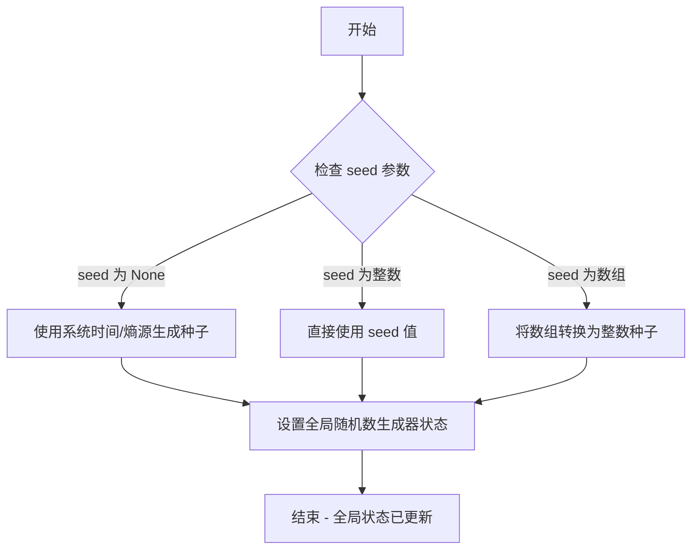

#### 带注释源码

```python
# 设置随机种子为 19680801
# 这个特定的数值常用于 matplotlib 示例中的可重复性测试
# 确保每次运行代码时生成的随机数据（Z = np.random.rand(6, 10)）保持一致
np.random.seed(19680801)
```


### plt.subplots

`plt.subplots` 是 matplotlib.pyplot 模块中的函数，用于创建一个包含多个子图的 Figure 对象，并返回 Figure 对象和对应的 Axes 对象（或 Axes 数组）。该函数简化了创建子图布局的过程，支持指定行列数、共享坐标轴、图形尺寸等参数。

参数：

- `nrows`：int，默认值为1，表示子图的行数
- `ncols`：int，默认值为1，表示子图的列数
- `sharex`：bool或str，默认值为False，表示是否共享x轴。当为True时，所有子图共享x轴；当为'col'时，同列子图共享x轴
- `sharey`：bool或str，默认值为False，表示是否共享y轴。当为True时，所有子图共享y轴；当为'row'时，同行子图共享y轴
- `squeeze`：bool，默认值为True，表示是否压缩返回的axes数组。当为True时，如果只有单个子图则返回Axes对象而非数组
- `width_ratios`：array-like，可选参数，表示各列的宽度比例
- `height_ratios`：array-like，可选参数，表示各行的宽度比例
- `figsize`：tuple，可选参数，表示图形的宽和高（英寸）
- `dpi`：int，可选参数，表示图形的分辨率（每英寸点数）
- `facecolor`：color，可选参数，图形背景颜色
- `edgecolor`：color，可选参数，图形边框颜色
- `frameon`：bool，可选参数，是否绘制框架
- `subplot_kw`：dict，可选参数，传递给add_subplot的关键字参数
- `gridspec_kw`：dict，可选参数，传递给GridSpec的关键字参数
- `**fig_kw`：可选参数，传递给Figure构造函数的关键字参数

返回值：tuple，包含两个元素
- `fig`：matplotlib.figure.Figure对象，表示整个图形窗口
- `ax`：matplotlib.axes.Axes对象或numpy.ndarray，当squeeze=True且nrows=1且ncols=1时返回Axes对象；否则返回Axes数组

#### 流程图

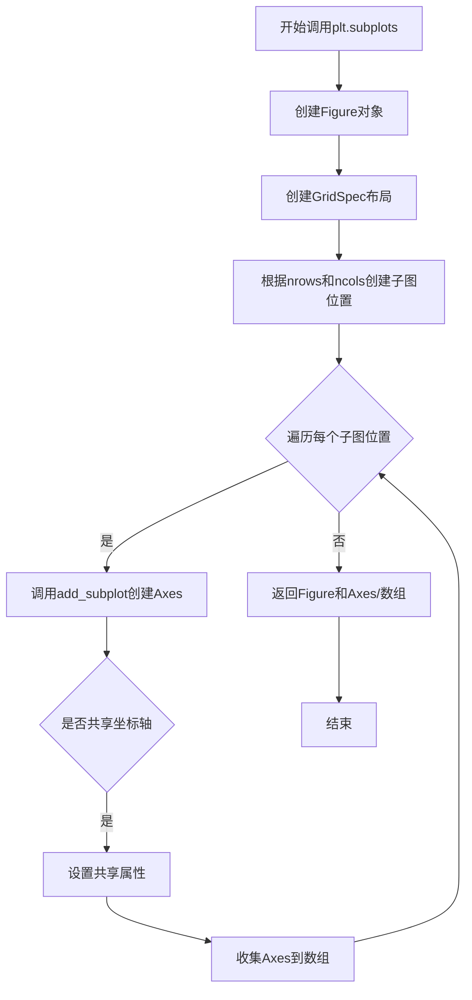

#### 带注释源码

```python
# 下面是plt.subplots的典型调用示例，来源于给定的代码

# 示例1：创建2行1列的子图布局
# nrows=2: 创建2行子图
# ncols=1: 创建1列子图
# 返回fig（Figure对象）和(ax0, ax1)（两个Axes对象组成的元组）
fig, (ax0, ax1) = plt.subplots(2, 1)

# 示例2：创建2行2列的子图布局
# nrows=2: 创建2行子图
# ncols=2: 创建2列子图
# 返回fig（Figure对象）和axs（2x2的Axes数组）
fig, axs = plt.subplots(2, 2)

# 示例3：再次创建2行1列的子图布局（用于展示log scale）
fig, (ax0, ax1) = plt.subplots(2, 1)

# 实际使用中，plt.subplots的底层实现大致如下：
def subplots(nrows=1, ncols=1, sharex=False, sharey=False, squeeze=True,
             width_ratios=None, height_ratios=None, figsize=None, dpi=None,
             facecolor=None, edgecolor=None, frameon=True, subplot_kw=None,
             gridspec_kw=None, **fig_kw):
    """
    创建子图布局的简化接口
    
    参数:
        nrows: 子图行数
        ncols: 子图列数
        sharex: x轴共享策略
        sharey: y轴共享策略
        squeeze: 是否压缩返回数组
        width_ratios: 列宽度比例
        height_ratios: 行高度比例
        figsize: 图形尺寸
        dpi: 分辨率
        facecolor: 背景色
        edgecolor: 边框色
        frameon: 是否显示框架
        subplot_kw: 子图关键字参数
        gridspec_kw: 网格布局关键字参数
        **fig_kw: 传递给Figure的额外参数
    """
    # 1. 创建Figure对象
    fig = Figure(figsize=figsize, dpi=dpi, facecolor=facecolor, 
                 edgecolor=edgecolor, frameon=frameon, **fig_kw)
    
    # 2. 创建GridSpec布局
    gs = GridSpec(nrows, ncols, figure=fig, 
                  width_ratios=width_ratios,
                  height_ratios=height_ratios, **gridspec_kw)
    
    # 3. 创建子图
    ax_array = np.empty((nrows, ncols), dtype=object)
    
    for i in range(nrows):
        for j in range(ncols):
            # 使用add_subplot创建子图
            ax = fig.add_subplot(gs[i, j], **subplot_kw)
            
            # 处理坐标轴共享
            if sharex and i > 0:
                ax.sharex(ax_array[0, j])
            if sharey and j > 0:
                ax.sharey(ax_array[i, 0])
                
            ax_array[i, j] = ax
    
    # 4. 根据squeeze参数处理返回值
    if squeeze and nrows == 1 and ncols == 1:
        return fig, ax_array[0, 0]
    elif squeeze and (nrows == 1 or ncols == 1):
        return fig, ax_array.squeeze()
    else:
        return fig, ax_array
```


### `Axes.pcolor`

`Axes.pcolor` 是 matplotlib 中用于绘制 2D 伪彩色热力图（pcolor plot）的核心方法，通过将数据数组映射到颜色空间来可视化二维网格数据，支持带边框和不带边框的单元格渲染。

参数：

- `X`：`np.ndarray` 或类似数组，可选，第一个维度为 M 或 M+1，第二个维度为 N 或 N+1，表示单元格的 x 坐标
- `Y`：`np.ndarray` 或类似数组，可选，第一个维度为 M 或 M+1，第二个维度为 N 或 N+1，表示单元格的 y 坐标
- `C`：`np.ndarray` 或类似数组，必需，M×N 形状的数组，表示每个单元格的颜色值
- `cmap`：`str` 或 `Colormap`，可选，颜色映射名称或 Colormap 对象，用于将数据值映射到颜色
- `norm`：`Normalize`，可选，数据归一化对象（如 `LogNorm`、`SymLogNorm` 等），用于控制颜色映射的范围
- `vmin`：`float`，可选，数据值的最小值，用于颜色映射范围的最小边界
- `vmax`：：`float`，可选，数据值的最大值，用于颜色映射范围的最大边界
- `edgecolors`：`str` 或颜色序列，可选，单元格边缘的颜色
- `linewidths`：`float` 或序列，可选，单元格边缘的线宽
- `shading`：`str`，可选，着色方式，'flat'、'nearest'、'gouraud' 或 'auto'

返回值：`matplotlib.collections.Collection` 返回一个 Collection 对象（通常是 `QuadMesh`），可用于进一步自定义或添加颜色条

#### 流程图

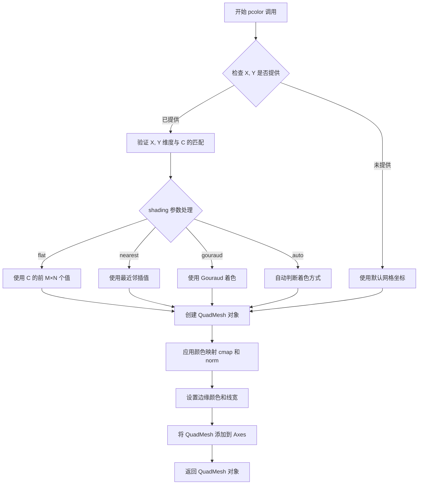

#### 带注释源码

```python
# 代码示例：展示 ax.pcolor 的多种调用方式

# 示例1：最简单的 pcolor 调用，只提供数据矩阵 Z
Z = np.random.rand(6, 10)  # 生成 6×10 的随机数据矩阵
c = ax0.pcolor(Z)  # 绘制热力图，默认无边缘
ax0.set_title('default: no edges')

# 示例2：带边框的 pcolor
c = ax1.pcolor(Z, edgecolors='k', linewidths=4)  # 黑色边框，线宽4
ax1.set_title('thick edges')

# 示例3：带坐标网格的 pcolor
dx, dy = 0.15, 0.05
y, x = np.mgrid[-3:3+dy:dy, -3:3+dx:dx]  # 创建坐标网格
z = (1 - x/2 + x**5 + y**3) * np.exp(-x**2 - y**2)
z = z[:-1, :-1]  # 移除最后一个值以匹配边界
c = ax.pcolor(x, y, z, cmap='RdBu', vmin=z_min, vmax=z_max)
ax.set_title('pcolor')
fig.colorbar(c, ax=ax)  # 添加颜色条

# 示例4：带对数归一化的 pcolor
N = 100
X, Y = np.meshgrid(np.linspace(-3, 3, N), np.linspace(-2, 2, N))
Z1 = np.exp(-X**2 - Y**2)
Z2 = np.exp(-(X * 10)**2 - (Y * 10)**2)
Z = Z1 + 50 * Z2
c = ax0.pcolor(X, Y, Z, shading='auto',
               norm=LogNorm(vmin=Z.min(), vmax=Z.max()), cmap='PuBu_r')
fig.colorbar(c, ax=ax0)

# pcolor 内部核心逻辑（简化版伪代码）:
# 1. 处理输入数据 X, Y, C 的形状和维度
# 2. 根据 shading 参数确定单元格坐标的偏移方式
# 3. 创建 QuadMesh 集合对象，包含所有单元格
# 4. 应用 cmap 和 norm 进行颜色映射
# 5. 设置边缘样式（edgecolors, linewidths）
# 6. 将 QuadMesh 添加到当前 Axes
# 7. 返回 QuadMesh 对象用于进一步操作（如添加颜色条）
```


### `Axes.pcolormesh`

`Axes.pcolormesh` 是 matplotlib 中 Axes 对象的方法，用于在二维坐标网格上绘制热力图（pcolormesh）。该方法接受坐标数组和颜色值数组，并返回一个表示热力图的 QuadMesh 或 AxesImage 对象。

参数：

- `x`：`array-like`，X 坐标数组，定义网格的 x 边界。
- `y`：`array-like`，Y 坐标数组，定义网格的 y 边界。
- `z`：`array-like`，数值数组，定义每个网格单元的颜色值。
- `cmap`：`str` 或 `Colormap`，可选，颜色映射名称或 Colormap 对象，默认为 None。
- `vmin, vmax`：浮点数，可选，颜色映射的最小值和最大值，默认为 None。
- `shading`：字符串，可选，着色方式，'flat', 'gouraud', 'nearest', 'auto', 'bilinear'，默认为 'flat'。
- `norm`：`Normalize`，可选，数据归一化方法，默认为 None。
- 其它可选参数（如 `edgecolors`, `linewidths` 等）。

返回值：`QuadMesh` 或 `AxesImage`，返回创建的热力图对象，可用于进一步设置或添加到 colorbar。

#### 流程图

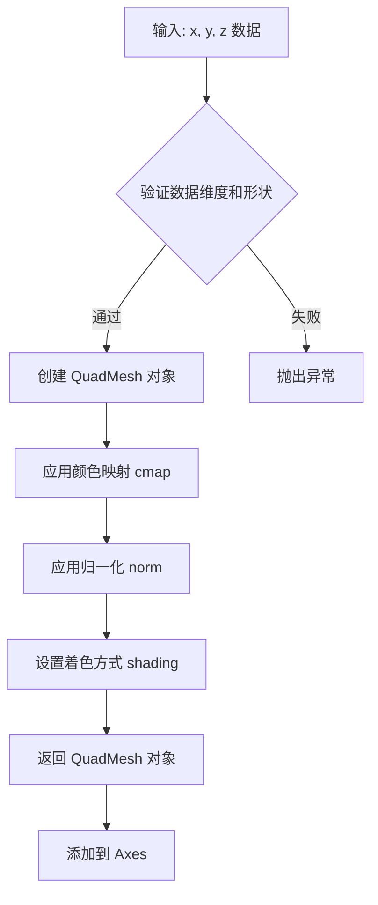

#### 带注释源码

由于用户提供的代码是调用示例而非实现源码，以下为调用 `ax.pcolormesh` 的源码及注释：

```python
# 示例代码 (来自用户提供的代码)
# 第58行
c = ax.pcolormesh(x, y, z, cmap='RdBu', vmin=z_min, vmax=z_max)
ax.set_title('pcolormesh')
fig.colorbar(c, ax=ax)

# 参数说明：
# x: np.mgrid 生成的 x 坐标数组，形状为 (Ny, Nx)
# y: np.mgrid 生成的 y 坐标数组，形状为 (Ny, Nx)
# z: 计算得到的函数值数组，形状为 (Ny-1, Nx-1)，对应网格内部
# cmap='RdBu': 使用红蓝颜色映射
# vmin, vmax: 颜色值的范围，对应 z 的最小绝对值
# 返回值 c: QuadMesh 对象，表示热力图
# ax.set_title: 设置子图标题
# fig.colorbar: 为热力图添加颜色条
```


### `Axes.imshow`

`Axes.imshow` 是 matplotlib 库中 Axes 类的重要方法，用于在二维坐标轴上显示图像或二维数据数组。该方法支持多种参数配置，包括颜色映射、插值方式、坐标范围、纵横比等，能够将数值数据转换为可视化图像，并返回可用于添加颜色条和其他操作的 AxesImage 对象。

参数：

- `X`：`array-like`，要显示的图像数据或数据数组
- `cmap`：`str` 或 `Colormap`，可选，颜色映射名称或 Colormap 对象，用于将数据值映射到颜色
- `norm`：`Normalize`，可选，数据归一化对象，用于将数据值缩放到 [0, 1] 范围
- `aspect`：`{'equal', 'auto'}` 或 `float`，可选，控制轴的纵横比，'equal' 保持像素为正方形，'auto' 自动调整
- `interpolation`：`str`，可选，插值方法，如 'nearest'、'bilinear'、'bicubic' 等
- `alpha`：`scalar` 或 `array-like`，可选，透明度，0-1 之间的值
- `vmin`、`vmax`：`scalar`，可选，颜色映射的最小值和最大值
- `origin`：`{'upper', 'lower'}`，可选，数组的起始位置，'upper' 表示左上角，'lower' 表示左下角
- `extent`：`list of four scalars`，可选，数据坐标的范围 [xmin, xmax, ymin, ymax]
- `filternorm`：`bool`，可选，滤波器归一化标志
- `filterrad`：`float`，可选，滤波器半径（适用于某些插值方法）
- `resample`：`bool`，可选，是否重采样
- `url`：`str`，可选，设置数据 URL
- ``**kwargs`：其他关键字参数传递给 AxesImage 构造函数

返回值：`matplotlib.image.AxesImage`，返回创建的 AxesImage 对象，可用于进一步自定义图像显示或添加颜色条

#### 流程图

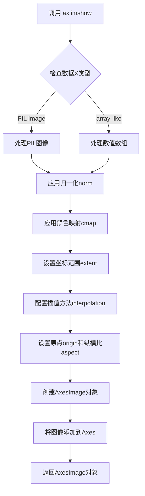

#### 带注释源码

```python
# 代码示例来源：给定代码中的实际调用
ax = axs[1, 0]  # 获取子图中的第二个子图的Axes对象
c = ax.imshow(z,                   # 要显示的2D数组数据
              cmap='RdBu',         # 使用红蓝颜色映射
              vmin=z_min,          # 设置颜色映射的最小值
              vmax=z_max,          # 设置颜色映射的最大值
              extent=[x.min(), x.max(), y.min(), y.max()],  # 设置数据坐标范围
              interpolation='nearest',  # 使用最近邻插值，不进行平滑
              origin='lower',      # 原点设置在左下角
              aspect='auto')       # 自动调整纵横比，不强制正方形像素
ax.set_title('image (nearest, aspect="auto")')  # 设置子图标题
fig.colorbar(c, ax=ax)  # 为图像添加颜色条，使用返回的AxesImage对象
```

#### 关键组件信息

- **AxesImage 对象**：matplotlib 中表示 Axes 上的图像的类，提供了对图像属性的访问和修改方法
- **Colormap**：颜色映射对象，将数值数据映射到颜色空间
- **Normalize**：数据归一化基类，LogNorm 是其子类用于对数刻度

#### 潜在的技术债务或优化空间

1. **插值性能**：对于大规模图像数据，某些插值方法（如 'bicubic'）可能性能较低，可考虑使用 GPU 加速
2. **内存使用**：当处理大型数组时，完整的图像数据可能会占用大量内存，可以考虑按需渲染
3. **颜色映射缓存**：频繁创建相同的颜色映射对象可以优化为缓存重用
4. **坐标转换**：extent 和 origin 的组合使用可能导致坐标转换开销，可以考虑更高效的坐标映射方式

#### 其他项目

- **设计目标**：提供灵活的二维数据可视化接口，支持多种数据源和显示选项
- **约束**：
  - 数据必须是二维数组或 PIL 图像对象
  - vmin/vmax 与 norm 不能同时使用
  - origin 参数影响数据的显示方向
- **错误处理**：
  - 数据类型不兼容时抛出 TypeError
  - 插值方法不支持时抛出 ValueError
  - 颜色映射名称无效时抛出 ValueError
- **数据流**：输入数据 → 归一化处理 → 颜色映射 → 坐标映射 → 图像渲染 → 返回 AxesImage 对象
- **外部依赖**：matplotlib.colors 模块提供颜色映射和归一化功能，numpy 用于数组处理


### Axes.pcolorfast

`pcolorfast` 是 matplotlib 中 Axes 类的快速伪彩色绘制方法，用于以更高效的方式绘制四边形网格数据，相比 `pcolor` 和 `pcolormesh` 在某些场景下性能更优。

参数：

- `x`：`numpy.ndarray`，一维或二维数组，表示 x 坐标边界
- `y`：`numpy.ndarray`，一维或二维数组，表示 y 坐标边界
- `Z`：`numpy.ndarray`，二维数组，表示要绘制的数据值
- `cmap`：`str` 或 `Colormap`，可选，颜色映射名称或 Colormap 对象
- `norm`：`Normalize`，可选，数据归一化对象
- `vmin`：`float`，可选，数据最小值映射
- `vmax`：`float`，可选，数据最大值映射

返回值：`matplotlib.collections.QuadMesh` 或 `matplotlib.image.AxesImage`，返回创建的图形集合对象

#### 流程图

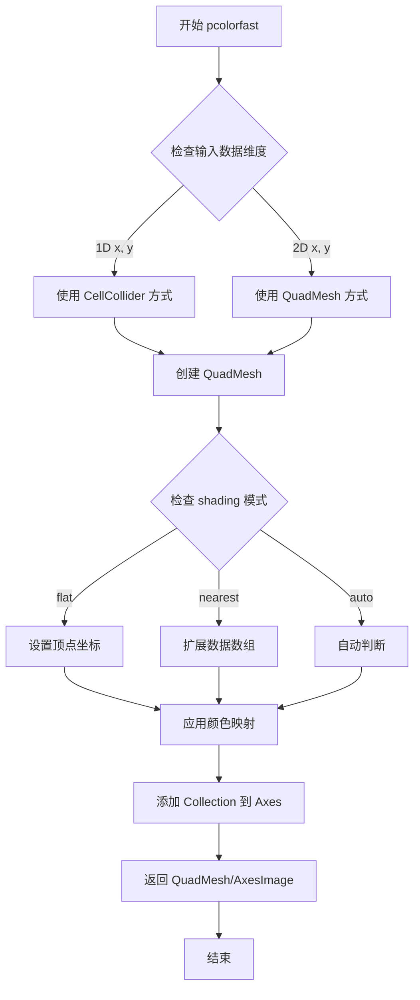

#### 带注释源码

由于给定代码仅为调用示例，未包含 `pcolorfast` 的实际实现源码。以下为根据 matplotlib 公开源码结构推断的实现逻辑：

```python
def pcolorfast(self, x, y, Z, cmap=None, norm=None, vmin=None, vmax=None,
               shading='flat', **kwargs):
    """
    快速伪彩色绘制方法
    
    参数:
        x: x坐标，可以是长度为M的一维数组或MxN的二维数组
        y: y坐标，可以是长度为N的一维数组或MxN的二维数组
        Z: MxN的数据值数组
        cmap: 颜色映射
        norm: 归一化对象
        vmin/vmax: 值范围限制
        shading: 着色模式 ('flat', 'nearest', 'auto', 'gouraud')
    
    返回:
        QuadMesh: 四边形网格集合对象
    """
    # 确定着色模式
    if shading == 'auto':
        # 自动判断：检查x,y维度
        if x.ndim == 1 and y.ndim == 1:
            shading = 'flat'
        else:
            shading = 'nearest'
    
    # 处理不同维度的输入
    if x.ndim == 1 and y.ndim == 1:
        # 1D坐标：x, y为边界坐标
        # 创建四边形网格
        Nx = len(x)
        Ny = len(y)
        
        # 确保Z的维度与坐标匹配
        if Z.shape != (Ny - 1, Nx - 1):
            raise ValueError(f"Z shape {Z.shape} incompatible with "
                           f"x ({Nx}) and y ({Ny})")
        
        # 构建顶点坐标数组
        # 将1D坐标转换为角点坐标
        if shading == 'flat':
            # flat shading: 每个单元一个颜色
            # 创建 (Ny x Nx) 的顶点坐标
            pass
        
    elif x.ndim == 2 and y.ndim == 2:
        # 2D坐标：x, y为网格点坐标
        # 直接使用坐标创建QuadMesh
    
    # 创建QuadMesh对象
    collection = QuadMesh(
        coords,  # 顶点坐标
        Z,       # 数据值
        cmap=cmap,
        norm=norm,
        vmin=vmin,
        vmax=vmax,
        **kwargs
    )
    
    # 添加到axes
    self.add_collection(collection)
    
    # 更新视图范围
    self.autoscale_view()
    
    return collection
```

**注**：给定代码中调用示例如下：

```python
# 在给定的示例代码中，pcolorfast 的调用方式为：
c = ax.pcolorfast(x, y, z, cmap='RdBu', vmin=z_min, vmax=z_max)
ax.set_title('pcolorfast')
fig.colorbar(c, ax=ax)
```

其中 `x`, `y` 为网格坐标数组，`z` 为数据值数组，`cmap='RdBu'` 指定颜色映射，`vmin`/`vmax` 限制颜色范围。


### fig.colorbar

向图形添加颜色条（colorbar），用于显示颜色映射与数据值之间的对应关系。颜色条通常附加在图形中的某个轴上，并基于输入的可映射对象（如pcolor、imshow等返回的对象）生成。

参数：
- `mappable`：`matplotlib.cm.ScalarMapper`，要添加颜色条的可映射对象（例如pcolor、pcolormesh、imshow返回的对象）
- `ax`：`matplotlib.axes.Axes`，可选参数，指定颜色条所属的轴

返回值：`matplotlib.colorbar.Colorbar`，返回创建的颜色条对象

#### 流程图

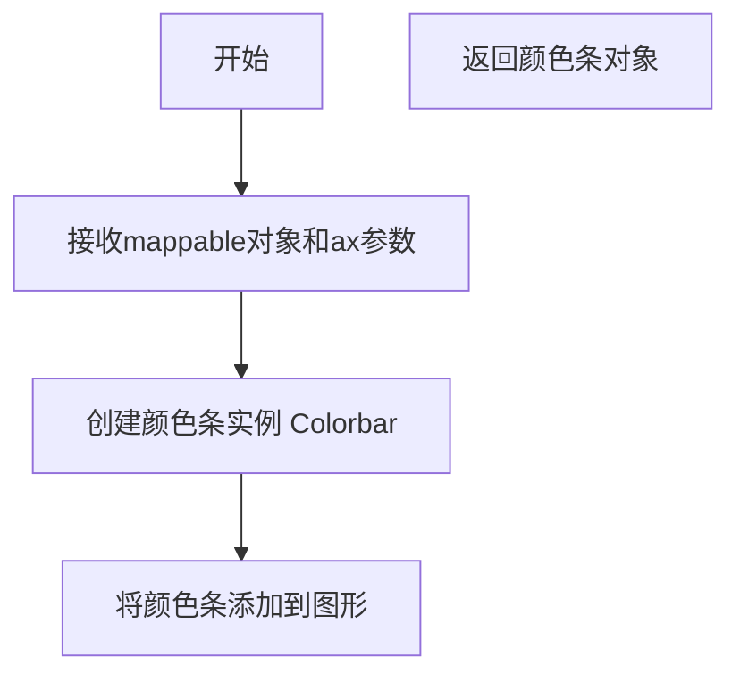

#### 带注释源码

```python
# 创建一个pcolor图像，返回一个PolyCollection对象c
c = ax.pcolor(x, y, z, cmap='RdBu', vmin=z_min, vmax=z_max)
ax.set_title('pcolor')

# 调用fig.colorbar方法，基于c创建颜色条，并附加到ax轴上
# 参数c：mappable，可映射对象，包含了颜色映射的数据
# 参数ax=ax：关键字参数，指定颜色条所属的轴
fig.colorbar(c, ax=ax)
```


### plt.show

此函数是 Matplotlib 库中 `matplotlib.pyplot` 模块的核心方法之一，用于显示一个或多个已创建的 Figure（图形）窗口，并触发图形后端的事件循环。在默认模式下（`block=None`），该函数会阻塞当前程序的执行，直到用户关闭所有打开的图形窗口；在非阻塞模式下，它仅刷新显示并立即返回控制权。

参数：
- `block`：`bool | None`，可选参数。指定是否阻塞调用线程以等待图形窗口关闭。默认值为 `None`，通常表现为阻塞行为（仅在某些交互式后端如 `ipympl` 中行为不同）。如果设置为 `True`，则强制阻塞；如果设置为 `False`，则尝试非阻塞显示（如果后端支持）。

返回值：`None`，该函数不返回任何有意义的计算结果，仅产生副作用（显示图形）。

#### 流程图

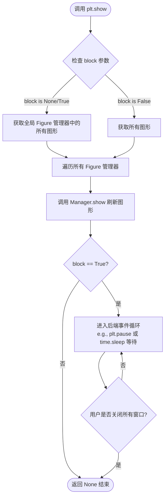

#### 带注释源码

```python
# 以下为 matplotlib.pyplot 模块中 show 函数的典型实现逻辑简化版
# 位置：lib/matplotlib/pyplot.py

def show(*, block=None):
    """
    显示所有打开的 Figure 的图形窗口。
    
    参数:
        block (bool | None): 控制是否阻塞主线程。
                             如果为 True，程序会在此处暂停，直到关闭窗口。
                             如果为 None (默认)，行为取决于后端，通常等价于 True。
    """
    # 1. 导入必要的内部模块，用于管理 Figure 窗口
    import matplotlib._pylab_helpers as _pylab_helpers
    
    # 2. 获取当前所有活动的 Figure 管理器 (Gcf)
    # Gcf 是一个字典，存储了 figure number 到 manager 的映射
    all_figures = _pylab_helpers.Gcf.get_all_figures()
    
    if not all_figures:
        # 如果没有 Figure，直接返回
        return

    # 3. 遍历所有 Figure 并调用其 show 方法刷新图形
    # 这会触发底层后端 (如 Qt, TkAgg) 的图形绘制更新
    for manager in all_figures.values():
        manager.show()
        
    # 4. 处理阻塞逻辑 (Block logic)
    # 如果 block 为 True，或者 block 为 None 且后端默认需要阻塞
    if block:
        # 5. 阻止程序退出，进入交互模式的事件循环
        # 通常通过交互式后端的 main loop 实现，或使用简单的 pause 循环
        _pylab_helpers.block(manager)
    # 如果 block 为 False，则直接返回，不阻塞，图形会保持显示状态
    # (具体表现依赖后端实现)
```


### `np.mgrid`

`np.mgrid` 是 NumPy 库中的一个函数，用于生成多维网格（mesh grid）。它使用切片符号（slice notation）作为参数，返回一个包含网格坐标的多维数组，可用于创建坐标矩阵以进行向量化计算。

参数：

- `slice1`：第一个维度的切片参数，格式为 `start:stop:step`，定义第一个坐标轴的范围和步长
- `slice2`：第二个维度的切片参数，格式同 `slice1`，定义第二个坐标轴的范围和步长
- `...`：可选的更多维度切片参数，用于生成更高维的网格

返回值：`ndarray`，返回一个多维数组。对于二维情况，返回的数组形状为 `(2, M, N)`，其中第一行是 y 坐标数组，第二行是 x 坐标数组。

#### 流程图

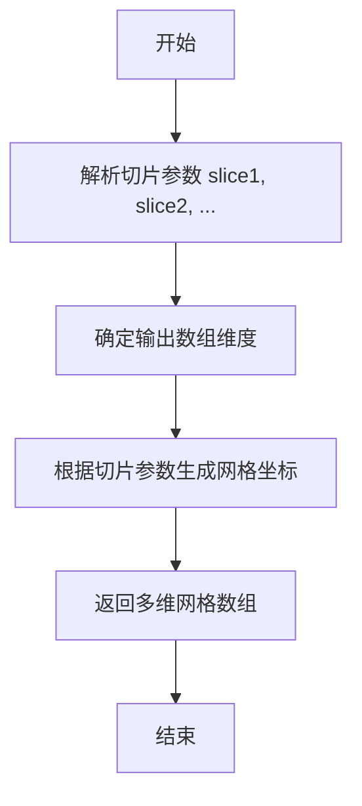

#### 带注释源码

```python
# np.mgrid 是 NumPy 的一个实例变量（ndarray 子类），用于快速生成网格坐标
# 在代码中的实际使用方式：
y, x = np.mgrid[-3:3+dy:dy, -3:3+dx:dx]

# 参数解析：
# 第一个维度切片: -3:3+dy:dy
#   - 起始值: -3
#   - 结束值: 3+dy (即 3.05)
#   - 步长: dy (即 0.05)
# 第二个维度切片: -3:3+dx:dx
#   - 起始值: -3
#   - 结束值: 3+dx (即 3.15)
#   - 步长: dx (即 0.15)

# 返回值说明：
# y: 二维数组，形状为 (M, N)，包含第一维度（行）的坐标值
# x: 二维数组，形状为 (M, N)，包含第二维度（列）的坐标值
# 两个数组配合使用可以定位网格上每个点的 (x, y) 坐标
```


### np.meshgrid

生成坐标矩阵，用于评估三维空间中的函数或绘制三维图形。

参数：

-  `x`：`array_like`，第一个数组，表示x轴坐标
-  `y`：`array_like`，第二个数组，表示y轴坐标

返回值：`{X, Y}`，`tuple of ndarrays`，返回两个二维数组，分别表示x坐标网格和y坐标网格

#### 流程图

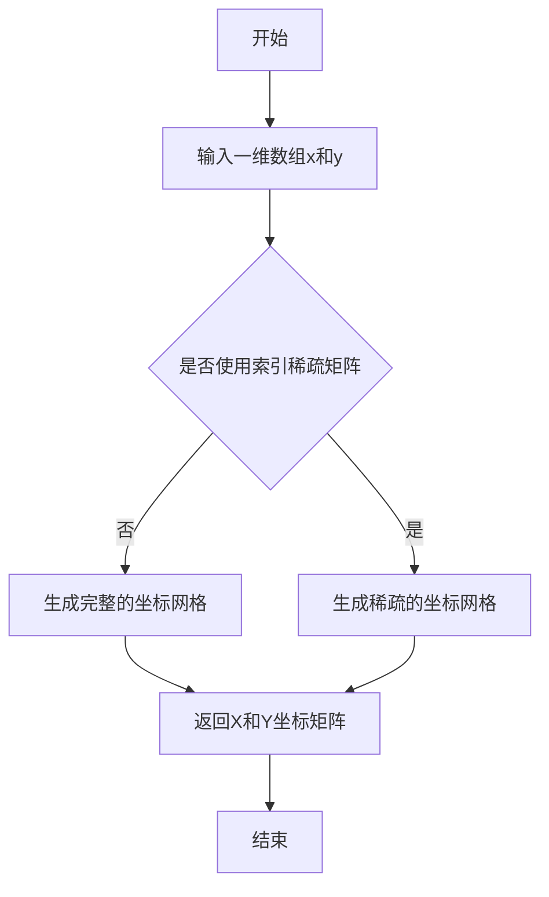

#### 带注释源码

```python
# 从给定的单调坐标向量创建坐标矩阵
# 
# 参数:
#     x, y: 数组对象
#     indexing: 'xy' 或 'ij'，默认为 'xy'
#         'xy': 返回meshgrid，其中x对应列，y对应行
#         'ij': 返回meshgrid，其中x对应行，y对应列
#     sparse: 布尔值，默认为False
#         如果为True，返回稀疏矩阵以节省内存
#     copy: 布尔值，默认为False
#         如果为True，返回数组的副本
#
# 返回:
#     X, Y: 坐标网格矩阵

# 示例用法:
N = 100
X, Y = np.meshgrid(np.linspace(-3, 3, N), np.linspace(-2, 2, N))
# X 和 Y 都是 (100, 100) 的二维数组
# X 的每一行相同，Y 的每一列相同
```


### `np.linspace`

生成等间距的数组（也称为线性空间）。该函数在指定区间内返回均匀间隔的样本，用于创建测试数据、坐标轴等场景。

参数：

- `start`：`array_like`，序列的起始值
- `stop`：`array_like`，序列的结束值，除非 `endpoint` 设置为 `False`
- `num`：`int`，生成的样本数量，默认为 50
- `endpoint`：`bool`，如果为 `True`，则包含 `stop` 值，默认为 `True`
- `retstep`：`bool`，如果为 `True`，返回 `(samples, step)`，其中 `step` 是样本之间的间距
- `dtype`：`dtype`，输出数组的数据类型
- `axis`：`int`，结果数组中插入新值的轴（当 `start` 和 `stop` 是数组时使用）

返回值：`ndarray`，返回均匀分布的样本数组

#### 流程图

```mermaid
flowchart TD
    A[开始] --> B[验证参数: num >= 0]
    B --> C{num == 0?}
    C -->|是| D[返回空数组]
    C -->|否| E{num == 1?}
    E -->|是| F[返回仅含start的数组]
    E -->|否| G[计算步长: (stop - start) / (num - 1)]
    G --> H[生成num个等间距样本]
    H --> I{retstep == True?}
    I -->|是| J[返回数组和步长]
    I -->|否| K[仅返回数组]
    D --> L[结束]
    F --> L
    J --> L
    K --> L
```

#### 带注释源码

```python
def linspace(start, stop, num=50, endpoint=True, retstep=False, dtype=None, axis=0):
    """
    返回指定间隔内的等间距数字序列。
    
    参数:
        start: 序列的起始值
        stop: 序列的结束值
        num: 生成的样本数量，默认为50
        endpoint: 是否包含结束点，默认为True
        retstep: 是否返回步长，默认为False
        dtype: 输出数组的数据类型
        axis: 插入新值的轴（当start/stop是数组时使用）
    
    返回:
        ndarray: 等间距的样本数组，如果retstep为True则返回(sample, step)
    """
    # 验证num参数
    if num < 0:
        raise ValueError("Number of samples, %d, must be non-negative." % num)
    
    # 特殊情况下返回空数组
    if num == 0:
        return np.empty(0, dtype=dtype)
    
    # 特殊情况下只返回一个点（起始值）
    if num == 1:
        if endpoint:
            return np.array([start], dtype=dtype)
        else:
            # 如果不包含结束点，需要计算单点
            step = (stop - start) / num if num > 0 else 0
            return np.array([start + step / 2], dtype=dtype)
    
    # 计算步长
    if endpoint:
        step = (stop - start) / (num - 1)
    else:
        step = (stop - start) / num
    
    # 生成等间距数组
    if retstep:
        return np.arange(num, dtype=dtype) * step + start, step
    else:
        return np.arange(num, dtype=dtype) * step + start
```


### `np.abs`

计算数组元素的绝对值。

参数：

- `x`：数组或标量，输入数组或值
- `**kwargs`：可选参数，支持与NumPy数组操作相关的其他参数（如`dtype`、`out`等）

返回值：`ndarray`，返回输入数组的绝对值，类型与输入相同

#### 流程图

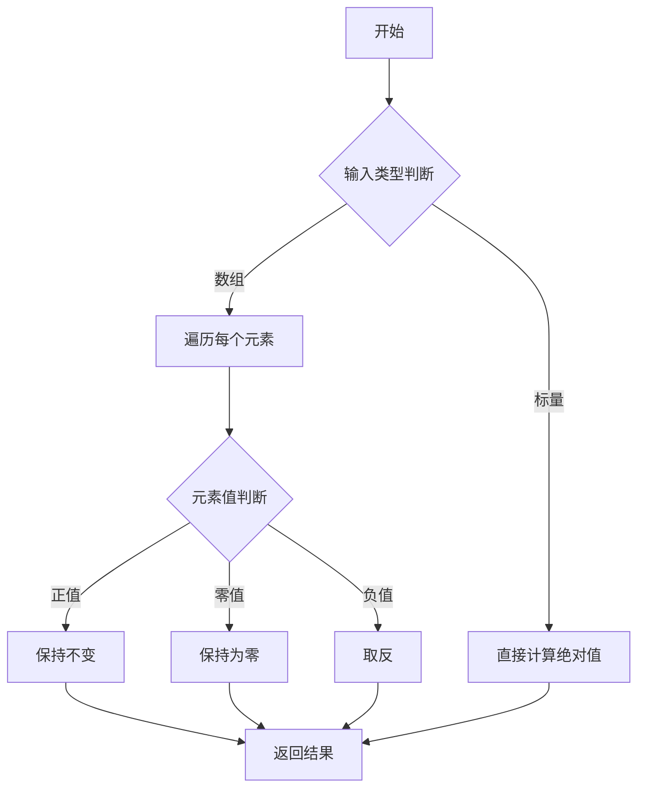

#### 带注释源码

```python
def abs(x, /, out=None, *, where=True, dtype=None, subok=True, **kwargs):
    """
    计算数组元素的绝对值。
    
    参数:
        x: array_like
            需要计算绝对值的数组或标量。
        
        out: ndarray, optional
            存储结果的目标数组。
        
        where: array_like, optional
            条件掩码，指定需要计算的位置。
        
        dtype: data-type, optional
            指定输出数组的数据类型。
        
        subok: bool, optional
            是否允许子类通过。
    
    返回值:
        ndarray
            绝对值数组。对于复数输入，返回模值。
    
    示例:
        >>> import numpy as np
        >>> np.abs([-1, -2, 3, -4])
        array([1, 2, 3, 4])
        
        >>> np.abs(np.array([-1-1j, -2-2j, 3+3j]))
        array([1.41421356, 2.82842712, 4.24264069])
    """
    # 使用NumPy的ufunc机制实现绝对值计算
    return _wrapfunc(x, 'absolute', out=out, where=where, 
                     dtype=dtype, subok=subok, **kwargs)
```

#### 在代码中的实际使用

虽然提供的代码中没有直接使用`np.abs`，但代码第51行使用了Python内置的`abs()`函数：

```python
z_min, z_max = -abs(z).max(), abs(z).max()
```

这段代码的逻辑是：
- `abs(z)`：计算数组`z`中每个元素的绝对值
- `.max()`：找出绝对值后的最大值
- `z_min`设为负的最大值（用于颜色映射的最小边界）
- `z_max`设为正的最大值（用于颜色映射的最大边界）

如果要使用`np.abs`替代，代码可以改为：

```python
z_min, z_max = -np.abs(z).max(), np.abs(z).max()
```

这样可以更明确地表示使用NumPy的绝对值函数，特别适用于处理NumPy数组的情况。


### np.exp

计算指数函数（e 的 x 次方），其中 e 是自然对数的底数（约等于 2.718281828）。该函数对输入数组中的每个元素逐个计算 e 的幂次，返回与输入形状相同的数组。

参数：

-  `x`：array_like，输入值，可以是标量、列表或 NumPy 数组，表示需要计算指数的数值

返回值：`ndarray 或 scalar`，返回输入数组中每个元素的 e 的 x 次方结果，类型为浮点数数组或标量

#### 流程图

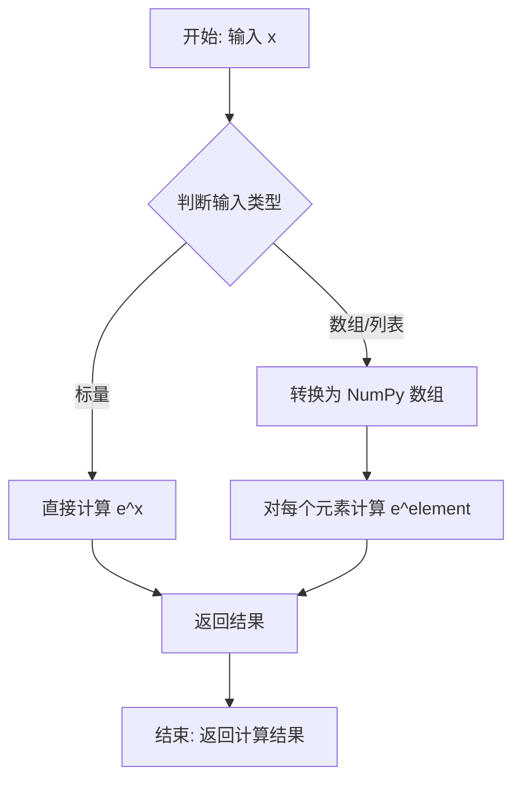

#### 带注释源码

```python
# np.exp 函数源码逻辑示意（实际实现位于 NumPy 库 C 代码中）

def exp(x):
    """
    计算 e 的 x 次方
    
    参数:
        x: array_like，输入值
        
    返回:
        ndarray: e 的 x 次方
    """
    # 1. 将输入转换为 NumPy 数组（如果还不是）
    x = np.asarray(x)
    
    # 2. 使用 NumPy 的向量化计算对每个元素计算指数
    #    这里调用底层 C 实现或 ufunc
    result = np.exp_impl(x)  # 底层实现
    
    # 3. 返回计算结果
    return result

# 在示例代码中的实际调用：
# z = (1 - x/2 + x**5 + y**3) * np.exp(-x**2 - y**2)
# Z1 = np.exp(-X**2 - Y**2)
# Z2 = np.exp(-(X * 10)**2 - (Y * 10)**2)
```

#### 在示例代码中的具体使用

```python
# 第一次使用：计算复杂函数的一部分
# x 和 y 是 2D 网格坐标数组
y, x = np.mgrid[-3:3+dy:dy, -3:3+dx:dx]
z = (1 - x/2 + x**5 + y**3) * np.exp(-x**2 - y**2)

# 第二次使用：创建低丘（low hump）带尖峰的概率分布
Z1 = np.exp(-X**2 - Y**2)

# 第三次使用：创建窄尖峰（spike）分布，缩放因子为 10
Z2 = np.exp(-(X * 10)**2 - (Y * 10)**2)

# 组合两个分布
Z = Z1 + 50 * Z2
```

#### 关键技术细节

| 特性 | 描述 |
|------|------|
| 函数类型 | NumPy 通用函数（ufunc） |
| 计算精度 | 取决于底层 C 库实现，通常为 float64 |
| 向量化支持 | 完全支持，可直接处理多维数组 |
| 广播机制 | 支持 NumPy 广播规则 |
| 数值稳定性 | 对于非常大的正数可能返回 inf，非常小的数返回 0 |


### `np.min`

`np.min` 是 NumPy 库中的一个核心函数，用于计算数组（或数组元素）中的最小值。该函数支持沿指定轴计算最小值，并可配合多种参数（如 `axis`、`dtype`、`out` 等）实现灵活的最值查找功能。

---

### 函数详细信息

#### 参数

- `a`：`array_like`，输入数组或可转换为数组的对象，即需要计算最小值的源数据
- `axis`：`int` 或 `tuple of int`，可选参数，指定计算最小值的轴。若不指定，则对整个数组进行计算
- `dtype`：`dtype`，可选参数，指定用于计算最小值的数据类型
- `out`：`ndarray`，可选参数，用于存储计算结果的输出数组
- `keepdims`：`bool`，可选参数，若为 `True`，则输出的维度保持与输入相同（广播后的维度）

#### 返回值

- `ret`：`ndarray` 或 `scalar`，返回数组的最小值。如果指定了 `axis`，则返回沿指定轴的最小值组成的数组

---

### 流程图

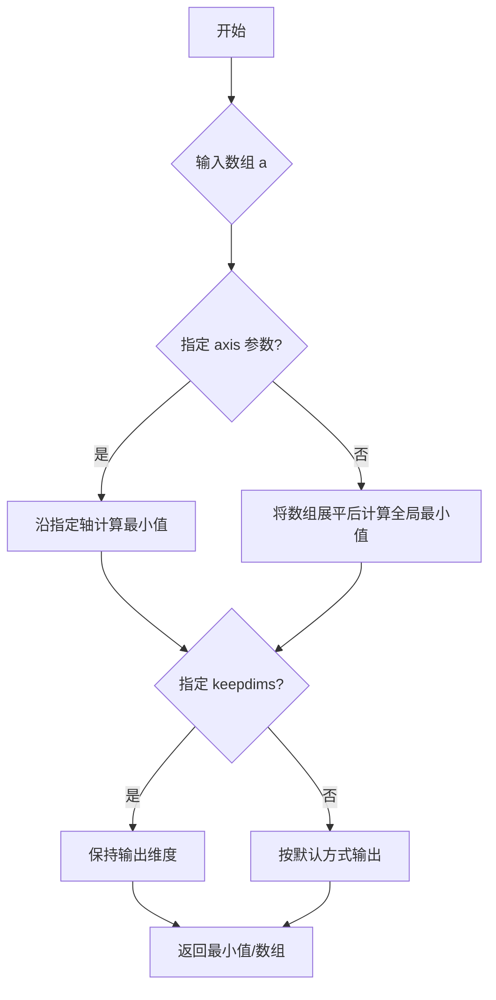

---

### 带注释源码

```python
def min(a, axis=None, dtype=None, out=None, keepdims=False, initial=_NoValue, where=_NoValue):
    """
    返回数组的最小值或沿轴的最小值。
    
    Parameters
    ----------
    a : array_like
        输入数组。
    axis : int, optional
        计算最小值的轴。默认为 None，即展平数组。
    dtype : data-type, optional
        用于计算的数据类型。
    out : ndarray, optional
        放置结果的输出数组。
    keepdims : bool, optional
        如果为 True，减少的轴将保留为维度为 1 的维度。
    initial : scalar, optional
        初始值，用于空数组的比较。
    where : array_like of bool, optional
        元素为 True 时参与计算。
    
    Returns
    -------
    ret : ndarray or scalar
        返回数组的最小值。
    """
    # 如果没有指定 axis，则将数组展平计算全局最小值
    if axis is None:
        return _wrapreduction(a, np.minimum, np.min, axis, dtype, out, keepdims=keepdims)
    
    # 沿指定轴计算最小值
    return _wrapreduction(a, np.minimum, np.min, axis, dtype, out, keepdims=keepdims)
```

---

### 备注

在给定的代码示例中，虽然没有直接使用 `np.min()` 函数，但使用了等效的 `.min()` 方法：
- `z_min, z_max = -abs(z).max(), abs(z).max()` 中的 `z.min()`（代码中实际使用了 `.max()`）
- `Z.min()` 用于获取 Z 数组的最小值

这些方法调用在功能上与 `np.min()` 等效，是 NumPy 数组对象的成员方法。


### np.max

NumPy 的 `np.max` 函数用于计算数组中的最大值，支持沿指定轴计算或返回全部元素中的最大值。

参数：

- `a`：`array_like`，输入数组
- `axis`：`int` 或 `tuple of int`，可选，指定计算最大值的轴
- `out`：`ndarray`，可选，用于存放结果的数组
- `keepdims`：`bool`，可选，是否保持原始维度
- `initial`：`scalar`，可选，初始值（用于ufunc）
- `where`：`array_like of bool`，可选，元素条件（用于ufunc）

返回值：`ndarray` 或 `scalar`，返回数组中的最大值，或如果指定轴则返回最大值数组

#### 流程图

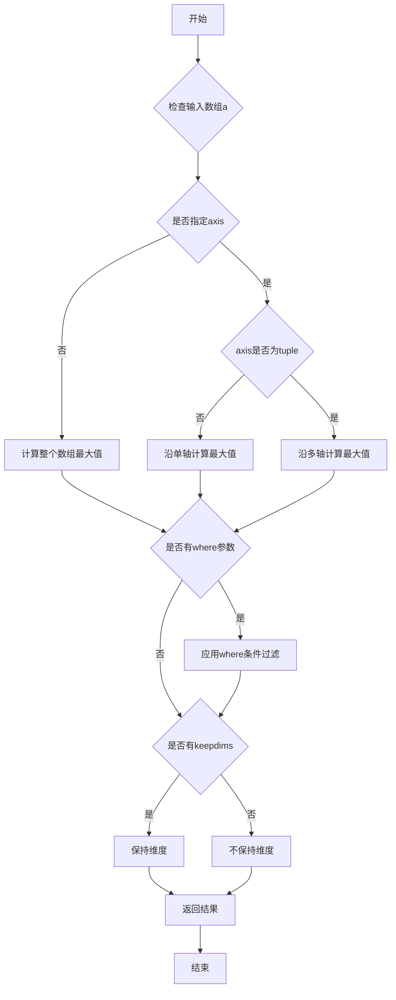

#### 带注释源码

```python
def np.max(a, axis=None, out=None, keepdims=np._NoValue, initial=np._NoValue, where=np._NoValue):
    """
    计算数组中的最大值。
    
    Parameters
    ----------
    a : array_like
        输入数组。
    axis : None, int, tuple of int, optional
        沿哪个轴计算最大值。默认为 None，计算所有元素的最大值。
    out : ndarray, optional
        存放结果的数组。
    keepdims : bool, optional
        如果为 True，减少的轴在结果中保留为维度为 1。
    initial : scalar, optional
        初始值，用于比较。
    where : array_like of bool, optional
        元素级别的条件。
    
    Returns
    -------
    max : ndarray or scalar
        返回数组中的最大值。
    """
    # 类型检查和参数验证
    if isinstance(a, np.ndarray):
        return a.max(axis=axis, out=out, keepdims=keepdims, initial=initial, where=where)
    else:
        # 将输入转换为数组后计算
        a = np.asarray(a)
        return a.max(axis=axis, out=out, keepdims=keepdims, initial=initial, where=where)
```

---

**注意**：用户提供的代码中实际并未直接调用 `np.max` 函数，但使用了 `.max()` 方法（如 `z_max = abs(z).max()`），该方法是 NumPy 数组的实例方法，功能与 `np.max` 类似。如果需要提取代码中实际使用的方法，请确认后我可以提供相应的文档。


### `matplotlib.colors.LogNorm`

LogNorm 是 matplotlib 中用于在对数尺度上进行数据归一化的类。它继承自 Normalize 基类，将数据值映射到 [0, 1] 区间，但使用对数变换来处理数据，特别适用于跨越多个数量级的数据可视化。

参数：

- `vmin`：`float`，可选，数据归一化的最小值，低于此值的数据将被映射到 0
- `vmax`：`float`，可选，数据归一化的最大值，高于此值的数据将被映射到 1
- `clip`：`bool`，可选，默认 False，当为 True 时，裁剪超出 [vmin, vmax] 范围的值到该区间

返回值：`LogNorm`，返回一个新的对数归一化实例

#### 流程图

```mermaid
flowchart TD
    A[输入数据值 v] --> B{v 是否在 [vmin, vmax] 范围内?}
    B -- 否 --> C{clip 参数}
    C -- True --> D[将值裁剪到 [vmin, vmax]]
    C -- False --> E[直接使用原始值]
    D --> F[应用对数变换]
    E --> F
    F --> G[计算 log10(v) - log10(vmin)]
    H[计算 log10(vmax) - log10(vmin)]
    G --> I[返回 归一化值 = G / H]
    I --> J[将结果映射到 [0, 1] 区间]
```

#### 带注释源码

```python
# LogNorm 类的简化实现逻辑
import numpy as np
from matplotlib.colors import Normalize

class LogNorm(Normalize):
    """
    对数归一化类
    
    在对数尺度上进行数据归一化，适用于跨越多个数量级的数据。
    继承自 matplotlib.colors.Normalize。
    """
    
    def __init__(self, vmin=None, vmax=None, clip=False):
        """
        初始化 LogNorm
        
        参数:
            vmin: 数据范围的最小值
            vmax: 数据范围的最大值  
            clip: 是否裁剪超出范围的值
        """
        # 调用父类初始化方法
        super().__init__(vmin, vmax, clip)
    
    def __call__(self, value, clip=None):
        """
        将数据值归一化到 [0, 1] 区间（使用对数变换）
        
        参数:
            value: 需要归一化的数据值（可以是标量或数组）
            clip: 可选的裁剪参数
            
        返回:
            归一化后的值，范围在 [0, 1]
        """
        # 如果未指定 clip，使用实例的 clip 属性
        if clip is None:
            clip = self.clip
        
        # 获取 vmin 和 vmax，如果未设置则从数据中推断
        vmin = self.vmin
        vmax = self.vmax
        
        # 处理逻辑值（处理 None 情况）
        d = self._handle_no_data_input(vmin, vmax, value)
        
        if d is None:
            return d
        
        # 如果 vmin 或 vmax 为 None，从数据中计算
        if vmin is None or vmax is None:
            vmin = np.min(value)
            vmax = np.max(value)
            # 更新实例的 vmin 和 vmax
            self.vmin = vmin
            self.vmax = vmax
        
        # 核心逻辑：应用对数变换
        # 将值转换到对数空间
        log_value = np.log10(value)
        log_vmin = np.log10(vmin)
        log_vmax = np.log10(vmax)
        
        # 计算归一化结果
        result = (log_value - log_vmin) / (log_vmax - log_vmin)
        
        # 裁剪（如果需要）
        if clip:
            result = np.clip(result, 0.0, 1.0)
        
        # 返回归一化后的值（保留 MaskedArray 的掩码信息）
        return result
    
    def inverse(self, value):
        """
        逆变换：从归一化的 [0, 1] 值恢复到原始值
        
        参数:
            value: 归一化后的值
            
        返回:
            原始尺度下的值
        """
        # 逆变换逻辑
        log_vmin = np.log10(self.vmin)
        log_vmax = np.log10(self.vmax)
        
        # 反归一化
        result = value * (log_vmax - log_vmin) + log_vmin
        
        # 转换回线性空间
        result = np.power(10, result)
        
        return result


# 使用示例（在代码中）
# LogNorm(vmin=Z.min(), vmax=Z.max())
# 创建一个对数归一化器，最小值为 Z 的最小值，最大值为 Z 的最大值
# 然后将此 norm 传递给 pcolor 的 norm 参数即可
```


# 分析结果

经过分析，给定的代码是一个 **matplotlib 示例脚本**，用于演示 `pcolor` 图像功能。代码中只是**调用**了 `Figure.colorbar` 方法（如 `fig.colorbar(c, ax=ax)`），但并**没有定义**该方法。

`Figure.colorbar` 是 matplotlib 库中的内置方法，定义在 `matplotlib.figure.Figure` 类中。该方法不在当前代码文件中实现，因此无法从给定代码中提取其完整实现细节。

以下是从代码中能观察到的调用方式信息：

### `Figure.colorbar` (调用示例)

该方法是 matplotlib 库的核心功能，用于为图像添加颜色条（colorbar）。在当前代码中通过 `fig.colorbar()` 调用。

参数（从调用中观察）：

- `mappable`：要添加颜色条的可映射对象（如 `c`，即 `pcolor` 的返回值），`Any`
- `ax`：要添加颜色条的坐标轴，`Axes`，可选参数

返回值：`Colorbar`，颜色条对象

#### 流程图

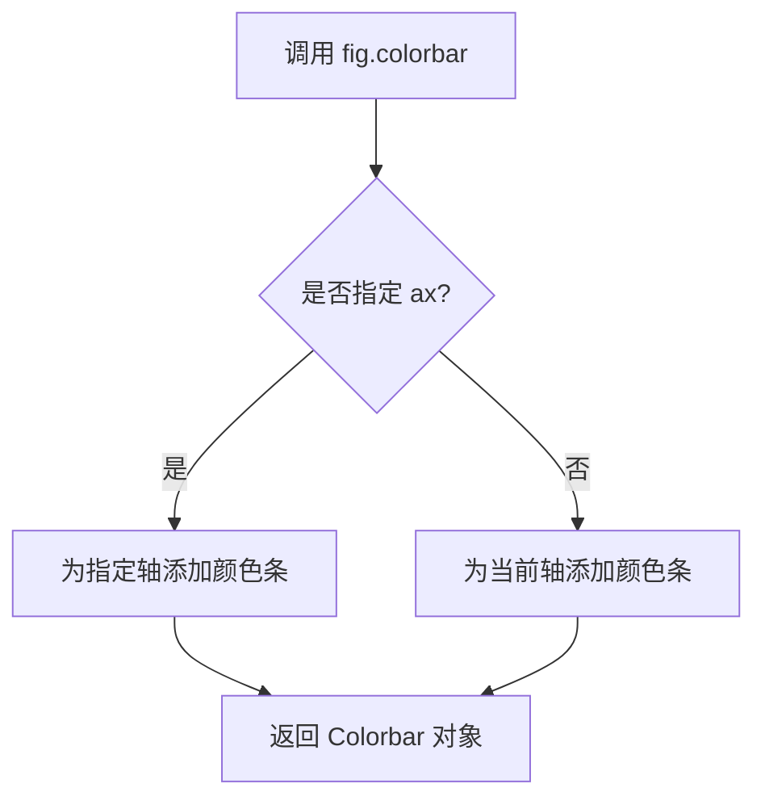

#### 带注释源码

由于 `Figure.colorbar` 是 matplotlib 库的内置方法，其源码不在当前文件中。以下是当前代码中对该方法的调用示例：

```python
# 示例1：为pcolor图像添加颜色条
c = ax.pcolor(x, y, z, cmap='RdBu', vmin=z_min, vmax=z_max)
ax.set_title('pcolor')
fig.colorbar(c, ax=ax)  # 调用 Figure.colorbar 方法

# 示例2：使用LogNorm的对数刻度颜色条
c = ax0.pcolor(X, Y, Z, shading='auto',
               norm=LogNorm(vmin=Z.min(), vmax=Z.max()), cmap='PuBu_r')
fig.colorbar(c, ax=ax0)
```

---

**注意**：如需获取 `Figure.colorbar` 的完整方法定义（包括所有参数、返回值、详细逻辑），建议查阅 [matplotlib 官方文档](https://matplotlib.org/stable/api/figure_api.html#matplotlib.figure.Figure.colorbar) 或查看 matplotlib 库的源代码。


### `Figure.tight_layout`

该方法用于自动调整Figure对象中的子图布局参数，使子图之间以及子图与Figure边缘之间的间距合理，减少重叠。在给定的代码中，`fig.tight_layout()`被调用两次，分别在两组子图展示完成后调整布局。

参数：

-  `self`：`Figure`，隐含的Figure对象实例，代表要调整布局的图形
-  `pad`：可选参数，`float`类型，默认值为1.08，表示子图边缘与Figure边缘之间的Padding（以字体大小为单位）
-  `h_pad`：可选参数，`float`类型，默认值为None，表示子图之间的垂直 Padding
-  `w_pad`：可选参数，`float`类型，默认值为None，表示子图之间的水平 Padding

返回值：`None`，该方法无返回值，直接修改Figure对象的布局状态

#### 流程图

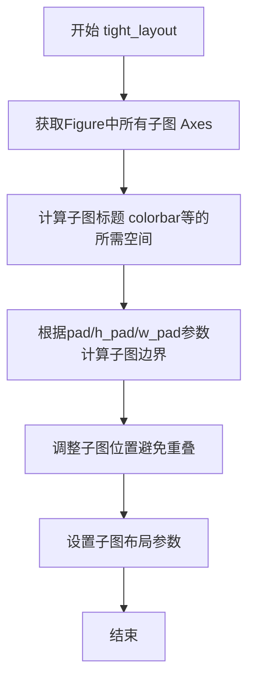

#### 带注释源码

```python
# 在第一个示例中，创建了2行1列的子图
fig, (ax0, ax1) = plt.subplots(2, 1)

# ... 子图配置代码 ...

# 调用 tight_layout 自动调整子图布局
# 这会根据子图内容自动计算合适的边距和间距
fig.tight_layout()

# 在第二个示例中，创建了2x2的子图网格
fig, axs = plt.subplots(2, 2)

# ... 多个子图配置代码 ...

# 再次调用 tight_layout 调整布局
# 确保所有子图不重叠，且与图形边缘保持适当距离
fig.tight_layout()

# 在第三个示例中
fig, (ax0, ax1) = plt.subplots(2, 1)

# ... 子图配置代码 ...

# 注意：这里没有调用 tight_layout，直接 plt.show()
# 可能导致子图布局不够紧凑
plt.show()
```


### Axes.pcolor

`Axes.pcolor` 是 matplotlib 库中 Axes 类的一个方法，用于生成二维"伪色彩"图（pseudocolor plot）。该方法接受网格数据并绘制由矩形单元格组成的彩色网格，每个单元格的颜色对应其数据值，支持多种着色方式、边缘显示以及与色彩映射相关的参数配置。

参数：

- `self`：Axes 实例，调用该方法的 Axes 对象
- `C`：array-like，要绘制的数据矩阵，形状为 (M, N)
- `X`：array-like，可选，指定单元格 x 坐标，形状为 (M+1, N) 或 (M, N)
- `Y`：array-like，可选，指定单元格 y 坐标，形状为 (M, N+1) 或 (M, N)
- `cmap`：str 或 Colormap，可选，颜色映射名称或 Colormap 对象
- `norm`：Normalize，可选，数据值到色彩空间的归一化对象
- `vmin`：float，可选，颜色映射最小值
- `vmax`：float，可选，颜色映射最大值
- `shading`：str，可选，'flat', 'nearest', 'gouraud', 'auto'，指定着色模式
- `edgecolors`：str，可选，单元格边缘颜色
- `linewidths`：float 或 array-like，可选，单元格边缘线宽
- `alpha`：float，可选，整体透明度

返回值：`QuadMesh`，返回一个 `matplotlib.collections.QuadMesh` 对象，表示生成的色彩网格集合

#### 流程图

```mermaid
graph TD
    A[开始 pcolor 调用] --> B{检查输入数据 C}
    B -->|有效| C[处理 X, Y 坐标参数]
    B -->|无效| D[抛出异常]
    C --> E{shading 参数}
    E -->|flat| F[计算单元格顶点坐标]
    E -->|nearest| G[使用最近邻插值]
    E -->|gouraud| H[应用 Gouraud 着色]
    E -->|auto| I[自动选择着色模式]
    F --> J[创建 QuadMesh 对象]
    G --> J
    H --> J
    I --> J
    J --> K[应用颜色映射 norm]
    K --> L[设置边缘样式 edgecolors/linewidths]
    L --> M[添加到 Axes]
    M --> N[返回 QuadMesh]
```

#### 带注释源码

由于用户提供的代码是 pcolor 的**使用示例**而非 pcolor 方法的**实现源码**，下面展示示例代码中如何调用 pcolor 方法：

```python
import matplotlib.pyplot as plt
import numpy as np
from matplotlib.colors import LogNorm

# 固定随机种子以确保可重复性
np.random.seed(19680801)

# 示例1: 简单的 pcolor 调用
# -----------------
# 创建一个 6x10 的随机数据矩阵
Z = np.random.rand(6, 10)

# 创建包含两个子图的画布
fig, (ax0, ax1) = plt.subplots(2, 1)

# 调用 pcolor 绘制数据，使用默认设置（无边缘）
c = ax0.pcolor(Z)
ax0.set_title('default: no edges')

# 调用 pcolor 并设置边缘颜色和线宽
c = ax1.pcolor(Z, edgecolors='k', linewidths=4)
ax1.set_title('thick edges')

fig.tight_layout()
plt.show()


# 示例2: 带坐标网格的 pcolor
# -------------------------
# 设置网格间距
dx, dy = 0.15, 0.05

# 生成 x 和 y 的网格坐标
y, x = np.mgrid[-3:3+dy:dy, -3:3+dx:dx]

# 计算 z 值（基于 x, y 的函数）
z = (1 - x/2 + x**5 + y**3) * np.exp(-x**2 - y**2)

# 移除最后一个值以匹配边界
z = z[:-1, :-1]

# 计算 z 的范围用于颜色映射
z_min, z_max = -abs(z).max(), abs(z).max()

# 创建 2x2 子图
fig, axs = plt.subplots(2, 2)

# 子图1: 使用 pcolor 绘制
ax = axs[0, 0]
c = ax.pcolor(x, y, z, cmap='RdBu', vmin=z_min, vmax=z_max)
ax.set_title('pcolor')
fig.colorbar(c, ax=ax)


# 示例3: 使用 LogNorm 实现对数刻度
# --------------------------------
N = 100
X, Y = np.meshgrid(np.linspace(-3, 3, N), np.linspace(-2, 2, N))

# 创建带有尖峰的数据
Z1 = np.exp(-X**2 - Y**2)
Z2 = np.exp(-(X * 10)**2 - (Y * 10)**2)
Z = Z1 + 50 * Z2

fig, (ax0, ax1) = plt.subplots(2, 1)

# 使用 LogNorm 进行对数归一化
c = ax0.pcolor(X, Y, Z, shading='auto',
               norm=LogNorm(vmin=Z.min(), vmax=Z.max()), cmap='PuBu_r')
fig.colorbar(c, ax=ax0)

# 不使用归一化（线性）
c = ax1.pcolor(X, Y, Z, cmap='PuBu_r', shading='auto')
fig.colorbar(c, ax=ax1)

plt.show()
```

#### 关键组件信息

| 组件名称 | 一句话描述 |
|---------|-----------|
| QuadMesh | pcolor 返回的集合对象，表示由四边形单元格组成的网格 |
| LogNorm | 对数归一化类，用于将数据映射到对数色彩空间 |
| Colormap | 颜色映射对象，定义数据值到颜色的映射关系 |
| shading | 着色模式参数，控制单元格内部的颜色插值方式 |

#### 潜在的技术债务或优化空间

1. **性能问题**：当数据量较大时（如 N > 1000），pcolor 的渲染性能可能不如 pcolormesh，后者使用更高效的 QuadMesh 优化
2. **边界处理**：当前实现中 X, Y 坐标需要手动调整（移除最后一个元素），这可能导致用户困惑
3. **shading='auto' 的不确定性**：自动选择的着色模式可能不是用户预期的，需要更明确的文档说明

#### 其它项目

**设计目标与约束**：
- pcolor 设计用于绘制网格化的标量数据
- 与 pcolormesh 的主要区别在于 pcolor 允许单独设置每个单元格的边缘样式

**错误处理与异常设计**：
- 当 X, Y 维度与 C 不匹配时应抛出 ValueError
- 当 shading 参数无效时应抛出 ValueError

**数据流与状态机**：
- 输入数据 C 经过归一化处理（norm）后映射到颜色
- QuadMesh 对象被添加到 Axes 的 collections 中管理

**外部依赖与接口契约**：
- 依赖 matplotlib.colors 模块中的 Normalize 和 Colormap
- 依赖 matplotlib.collections.QuadMesh 进行实际渲染

---

> **注意**：用户提供的代码是 pcolor 的**使用示例**，而非 pcolor 方法本身的实现源码。如需查看 pcolor 的完整实现源码，建议访问 matplotlib 官方 GitHub 仓库的 `lib/matplotlib/axes/_axes.py` 文件中对应的方法实现。


### Axes.pcolormesh

我需要指出一个重要问题：您提供的代码是 `pcolormesh` 的**使用示例代码**，而不是 `pcolormesh` 方法本身的**实现代码**。这段代码演示了如何调用 `pcolormesh`，但并没有包含 `pcolormesh` 方法的源码实现。

`Axes.pcolormesh` 是 matplotlib 库中的实际方法，其实现位于 matplotlib 的源代码中（大约几千行），不在您提供的示例代码里。

我可以从示例代码中提取**调用方式**，但无法提供实际的实现源码。如需获取 `pcolormesh` 的实现源码，需要访问 matplotlib 的 GitHub 仓库。

---

### 从示例代码中提取的调用信息

参数：

- `x`：`numpy.ndarray`，X 坐标数组（2D 网格）
- `y`：`numpy.ndarray`，Y 坐标数组（2D 网格）
- `z`：`numpy.ndarray`，Z 坐标数组（数据值）
- `cmap`：`str`，颜色映射名称（如 'RdBu', 'PuBu_r'）
- `vmin`：`float`，颜色映射最小值
- `vmax`：`float`，颜色映射最大值
- `edgecolors`：`str`，单元格边缘颜色（示例中未使用，但 pcolormesh 支持）
- `linewidths`：`float`，单元格边缘线宽（示例中未使用，但 pcolormesh 支持）
- `shading`：`str`，着色方式（如 'auto', 'flat', 'gouraud'）

返回值：`matplotlib.collections.QuadMesh`，返回的 QuadMesh 集合对象

#### 流程图

```mermaid
graph TD
    A[调用 ax.pcolormesh] --> B[接收 x, y, z 数据]
    B --> C[应用颜色映射 cmap]
    B --> D[应用 vmin/vmax 归一化]
    C --> E[创建 QuadMesh 集合]
    E --> F[将 QuadMesh 添加到 Axes]
    F --> G[返回 QuadMesh 对象]
```

#### 带注释源码（调用示例，非实现）

```python
# 从示例代码中提取的调用方式
ax = axs[0, 1]
c = ax.pcolormesh(x, y, z, cmap='RdBu', vmin=z_min, vmax=z_max)
ax.set_title('pcolormesh')
fig.colorbar(c, ax=ax)
```

---

### 建议

如果您需要 `pcolormesh` 的**实现源码**，您可以：

1. 在 Python 中直接查看源码：
   ```python
   import matplotlib.axes as ax
   import inspect
   print(inspect.getsource(ax.Axes.pcolormesh))
   ```

2. 访问 matplotlib 官方 GitHub 仓库：
   - 路径：`lib/matplotlib/axes/_axes.py`
   - 约 2000+ 行代码

请确认您是否需要：
- **A)** 我从示例代码中提取的调用信息（如上所示）
- **B)** `pcolormesh` 的实际实现源码（需要从 matplotlib 库中提取）

请告知您的需求，我可以进一步处理。


### Axes.pcolorfast

在给定网格上绘制伪彩色图，支持"nearest"、"flat"和"shading"三种着色方式，返回根据着色方式不同的QuadMesh或PcolorImage对象。

参数：

- `self`：`Axes`，调用此方法的 Axes 实例
- `x`：`array_like`，可选，用于定义网格单元边缘的 x 坐标。如果 x 是 1D 数组，其长度必须等于 `z.shape[1]+1`；如果 x 是 2D 数组，其形状必须为 `(M, N)`。当 shading 模式为 "nearest" 时，x 和 y 指定单元格中心
- `y`：`array_like`，可选，用于定义网格单元边缘的 y 坐标。如果 y 是 1D 数组，其长度必须等于 `z.shape[0]+1`；如果 y 是 2D 数组，其形状必须为 `(M+1, N+1)` 或 `(M, N)`。当 shading 模式为 "nearest" 时，x 和 y 指定单元格中心
- `z`：`array`，必选，数据值数组，形状为 `(M, N)`
- `cmap`：`str` 或 `Colormap`，可选，颜色映射名称或 Colormap 对象，用于将数据值映射到颜色
- `norm`：`Normalize`，可选，归一化对象，用于将数据值缩放到 [0, 1] 范围
- `vmin`：`float`，可选，颜色映射的最小值边界
- `vmax`：`float`，可选，颜色映射的最大值边界
- `alpha`：`float`，可选，透明度，范围 0-1
- `linewidths`：`float`，可选，单元格边框线宽（仅当 shading='flat' 时有效）
- `edgecolors`：`color`，可选，单元格边框颜色（仅当 shading='flat' 时有效）
- `shading`：`str`，可选，着色方式，可选值为 "nearest"、"flat"（默认）、"auto"

返回值：`QuadMesh` 或 `PcolorImage`，根据着色方式返回不同类型的艺术家对象。当 shading="flat" 时返回 QuadMesh；当 shading="nearest" 或 shading="auto" 时返回 PcolorImage

#### 流程图

```mermaid
flowchart TD
    A[开始 pcolorfast] --> B{shading 参数检查}
    B -->|"flat"| C[处理 1D x 和 y 坐标]
    B -->|"nearest" 或 "auto"| D[处理坐标作为单元格中心]
    C --> E[构建单元格边缘网格]
    D --> E
    E --> F{是否有 norm 参数?}
    F -->|是| G[使用传入的 norm 对象]
    F -->|否| H[创建默认 LinearNormalize]
    G --> I{是否有 cmap 参数?}
    H --> I
    I -->|是| J[使用传入的 cmap]
    I -->|否| K[使用默认 cmap 'viridis']
    J --> L[创建 PcolorImage 或 QuadMesh]
    K --> L
    L --> M[设置艺术家属性 alpha linewidths edgecolors]
    M --> N[将对象添加到 Axes]
    N --> O[返回艺术家对象]
```

#### 带注释源码

```python
# 由于代码中仅提供了使用示例，未包含 pcolorfast 方法的实际实现源码
# 以下为根据 matplotlib 官方文档推断的方法签名和使用方式

# 示例代码中的调用方式：
c = ax.pcolorfast(x, y, z, cmap='RdBu', vmin=z_min, vmax=z_max)

# 参数说明：
# x, y: 网格坐标数组，定义数据点的边界或中心位置
# z: 形状为 (M, N) 的数据值数组
# cmap: 'RdBu' 表示红蓝颜色映射
# vmin, vmax: 颜色映射的范围边界

# 返回值 c 的类型：
# - shading='flat' 时返回 QuadMesh 对象
# - shading='nearest' 或 'auto' 时返回 PcolorImage 对象
# 
# PcolorImage 是 matplotlib 3.1+ 引入的专门用于 pcolorfast 的类，
# 相比 QuadMesh 提供更好的性能和内存效率
```


### Axes.imshow

该方法用于在Axes对象上显示2D图像或数组，支持多种参数配置如颜色映射、数值范围、插值方式、坐标范围和纵横比设置等。

参数：

- `Z`：array-like，要显示的数据数组（2D数组）
- `cmap`：str or Colormap，可选，颜色映射名称，默认为None
- `vmin`, `vmax`：scalar，可选，颜色映射的最小值和最大值，默认为None
- `extent`：list of scalars，可选，图像的坐标范围 [xmin, xmax, ymin, ymax]，默认为None
- `interpolation`：str，可选，插值方法，如'nearest'、'bilinear'等，默认为None
- `origin`：{'upper', 'lower'}，可选，图像原点位置，默认为None
- `aspect`：{'auto', 'equal'} or scalar，可选，纵横比设置，默认为None
- `norm`：Normalize，可选，数据归一化方法，默认为None
- `shading`：str，可选，着色方式，默认为None

返回值：`matplotlib.image.AxesImage`，返回创建的AxesImage对象

#### 流程图

```mermaid
graph TD
    A[开始 imshow] --> B{检查数据Z}
    B -->|None| C[抛出异常]
    B -->|有效数据| D[处理cmap参数]
    D --> E[处理vmin/vmax参数]
    E --> F[创建Normalize对象]
    F --> G[处理extent参数设置坐标轴]
    G --> H[处理origin参数]
    H --> I[处理aspect参数]
    I --> J[处理interpolation参数]
    J --> K[创建AxesImage对象]
    K --> L[将图像添加到Axes]
    L --> M[返回AxesImage对象]
```

#### 带注释源码

```python
# 从给定的代码中提取的 Axes.imshow 调用示例
c = ax.imshow(z,                          # Z: array-like，要显示的2D数据
              cmap='RdBu',               # cmap: str or Colormap，颜色映射
              vmin=z_min,                # vmin: scalar，颜色范围最小值
              vmax=z_max,                # vmax: scalar，颜色范围最大值
              extent=[x.min(), x.max(), y.min(), y.max()],  # extent: list，坐标范围
              interpolation='nearest',   # interpolation: str，插值方式
              origin='lower',            # origin: {'upper', 'lower'}，原点位置
              aspect='auto')             # aspect: {'auto', 'equal'} or scalar，纵横比

ax.set_title('image (nearest, aspect="auto")')
fig.colorbar(c, ax=ax)
```


### Axes.set_title

该方法是Matplotlib中Axes类的成员函数，用于设置坐标轴的标题文本，支持自定义字体属性、对齐方式和标题与坐标轴之间的间距。

参数：

- `label`：`str`，标题文本内容
- `fontdict`：字典，可选，用于控制标题的字体属性（如大小、颜色、权重等）
- `loc`：str，可选，标题对齐方式，可选值为'center', 'left', 'right'，默认为'center'
- `pad`：float，可选，标题与坐标轴顶部的间距（以点为单位），默认为None
- `y`：float，可选，标题在y轴方向的相对位置，默认为None
- `ax`：Axes，可选，指定要设置标题的坐标轴对象，默认为None

返回值：`Text`，返回创建的标题文本对象

#### 流程图

```mermaid
graph TD
    A[开始设置标题] --> B{检查label参数}
    B -->|有效| C[创建Text对象]
    B -->|无效| D[抛出异常]
    C --> E{检查fontdict参数}
    E -->|提供| F[应用fontdict样式]
    E -->|未提供| G[使用默认样式]
    F --> H[设置对齐方式loc]
    G --> H
    H --> I[设置间距pad]
    I --> J[设置y轴位置]
    J --> K[添加到Axes]
    K --> L[返回Text对象]
```

#### 带注释源码

```python
def set_title(self, label, fontdict=None, loc="center", pad=None, *, y=None, ax=None):
    """
    Set a title for the Axes.
    
    Parameters
    ----------
    label : str
        The title text string.
        
    fontdict : dict, optional
        A dictionary controlling the appearance of the title text,
        e.g., {'fontsize': 16, 'fontweight': 'bold', 'color': 'red'}.
        
    loc : str, optional
        Title alignment, must be one of 'center', 'left', or 'right'.
        Defaults to 'center'.
        
    pad : float, optional
        The distance in points between the Axes and the title.
        
    y : float, optional
        The y position of the title relative to the Axes.
        
    ax : Axes, optional
        The Axes to set the title for. If None, uses the current Axes.
        
    Returns
    -------
    text : Text
        The Text instance representing the title.
    """
    # 如果提供了ax参数，则切换到指定的坐标轴
    if ax is not None:
        ax.set_title(label, fontdict=fontdict, loc=loc, pad=pad, y=y)
        return ax.xaxis.label
    
    # 创建字体属性字典
    if fontdict is not None:
        font = fontdict.copy()
    else:
        font = {}
    
    # 创建Text对象，设置标题文本和样式
    title = self.text(0.5, 1.0, label, fontdict=font,
                      transform=self.transAxes,
                      ha=loc, va='top')
    
    # 设置标题与坐标轴的间距
    if pad is not None:
        title.set_pad(pad)
    
    # 设置y轴位置
    if y is not None:
        title.set_y(y)
    
    # 返回创建的Text对象
    return title
```

#### 实际使用示例（来自提供代码）

```python
# 在提供的代码中，有以下set_title的调用示例：

ax0.set_title('default: no edges')
ax1.set_title('thick edges')
ax.set_title('pcolor')
ax.set_title('pcolormesh')
ax.set_title('image (nearest, aspect="auto")')
ax.set_title('pcolorfast')
```


## 关键组件


### pcolor

Matplotlib 的 2D 伪彩色图绘制函数，用于根据数据值渲染四边形网格单元的颜色，支持自定义颜色映射、归一化和边缘样式。

### pcolormesh

类似于 pcolor 的函数，但以网格形式渲染四边形，更适合大规模数据集，渲染性能通常优于 pcolor。

### imshow

图像显示函数，将 2D 数组渲染为图像，支持多种插值方法和纵横比设置。

### pcolorfast

快速 pcolor 绘图函数，提供简化的接口用于快速可视化四边形网格数据。

### LogNorm

对数归一化类，用于将数据映射到颜色空间时使用对数刻度，适用于跨越多个数量级的数据可视化。

### meshgrid

NumPy 函数，用于生成二维网格坐标矩阵，便于对 x 和 y 坐标进行向量化操作。

### colorbar

颜色条函数，为绘图添加颜色图例，显示数据值与颜色的对应关系。

### shading

pcolor 系列函数的参数，用于指定网格单元的着色方式，支持 'flat'、'nearest'、'gouraud' 和 'auto' 等模式。

### 边缘渲染 (edgecolors/linewidths)

pcolor 的参数，用于绘制网格单元的边缘轮廓，增强可视化效果。


## 问题及建议


### 已知问题

- **全局随机状态污染**：`np.random.seed(19680801)` 在模块级别设置全局随机种子，可能影响同一Python进程中其他代码的随机行为，建议使用 `np.random.default_rng()` 或局部随机生成器
- **魔法数字缺乏解释**：代码中存在硬编码数值如 `0.15`、`0.05`、`50`、`19680801`，缺乏常量定义和注释说明其含义
- **数据切片操作不透明**：`z = z[:-1, :-1]` 移除最后一行一列的操作缺乏明确说明，应添加注释解释边界与数据的关系
- **代码重复模式**：创建子图、设置标题、添加colorbar的模式在多处重复，可提取为辅助函数
- **缺失图形资源释放**：多个 `fig` 对象创建后无 `plt.close(fig)` 调用，长期运行脚本可能导致内存泄漏
- **参数不一致**：`pcolor` 调用同时存在 `shading='auto'` 和默认 shading 模式，示例间缺乏统一的参数约定
- **数值计算效率**：使用 `np.mgrid` 和 `np.meshgrid` 创建全网格可能产生较大内存开销，对于演示目的可考虑更高效的方式

### 优化建议

- 将随机种子改为局部 `rng = np.random.default_rng(19680801)` 方式，或在函数作用域内管理随机状态
- 使用有意义的常量替代魔法数字，如 `RESOLUTION_DX = 0.15`、`RESOLUTION_DY = 0.05`
- 对 `z[:-1, :-1]` 操作添加注释说明：明确这是因为 x 和 y 表示边界而非单元格中心
- 抽取重复的绘图模式为辅助函数，例如 `create_pcolor_comparison()` 通用函数
- 在示例脚本末尾添加 `plt.close('all')` 或在每个 fig 创建后适时释放资源
- 统一 `shading` 参数使用，建议统一使用 `shading='auto'` 或 `'nearest'`
- 考虑使用类型提示提升代码可维护性


## 其它


### 设计目标与约束

本代码展示了matplotlib中pcolor函数的多种用法，旨在帮助用户理解如何创建2D伪彩色图像。设计目标包括：1）提供简单pcolor的基本用法演示；2）对比pcolor与pcolormesh、imshow、pcolorfast的差异；3）展示对数刻度下的pcolor应用。约束条件为需要matplotlib、numpy库支持，且数据需要是2D数组形式。

### 错误处理与异常设计

代码中未显式包含错误处理逻辑。在实际pcolor调用中，可能出现的异常包括：1）数据维度不匹配异常（当x、y、z数组维度不一致时）；2）类型错误（当传入非数值类型数据时）；3）内存错误（当数据量过大时）。建议在实际使用中添加数据验证逻辑，确保x、y坐标数组比z数组大一行一列。

### 数据流与状态机

代码数据流如下：首先生成随机数据或网格数据，然后通过plt.subplots()创建画布和坐标轴，接着调用pcolor/pcolormesh/imshow/pcolorfast等函数进行绑图，最后通过colorbar显示颜色条。状态机包含：空闲状态（创建画布）->绑图状态（调用绑图函数）->渲染状态（plt.show()显示）。

### 外部依赖与接口契约

主要依赖：1）matplotlib.pyplot - 绑图接口；2）numpy - 数值计算和数组操作；3）matplotlib.colors.LogNorm - 对数归一化。pcolor函数接口契约：接受参数x、y（可选）、C（数据矩阵）、cmap（配色方案）、norm（归一化对象）、edgecolors（边框颜色）、linewidths（边框宽度）、shading（着色模式）等。

### 性能考虑

当前示例数据量较小（N=100），性能表现良好。对于大规模数据（>1000x1000），建议使用pcolormesh代替pcolor，因其渲染效率更高。shading='auto'参数可自动选择最佳着色策略。对于实时绑图场景，可考虑预先分配数组内存避免频繁内存分配。

### 兼容性考虑

代码兼容matplotlib 2.0+版本和numpy 1.15+版本。pcolorfast是实验性API，在不同版本间可能有细微差异。对数刻度绑图需要数据值为正数，否则会导致NaN或警告。不同后端（Qt5Agg、Agg、SVG等）绑图效果可能略有差异。

### 安全性考虑

代码为示例脚本，无用户输入处理，无安全风险。生产环境中如需处理外部输入数据，应对数据进行合法性校验，防止注入攻击。避免使用np.eval等动态执行函数处理用户输入。

### 测试策略

建议测试用例包括：1）空数据或NaN值处理；2）不同shading模式（flat、nearest、auto、gouraud）；3）边界坐标与数据维度不匹配场景；4）颜色映射范围边界值测试；5）对数刻度下零值和负值处理。

### 配置和参数说明

关键配置参数：1）shading - 控制着色方式，默认'flat'，可选'nearest'、'auto'、'gouraud'；2）cmap - 颜色映射方案，如'RdBu'、'PuBu_r'；3）edgecolors/linewidths - 单元格边框样式；4）norm - 数据归一化方式，如LogNorm实现对数刻度；5）vmin/vmax - 颜色映射范围边界。

### 使用场景与最佳实践

推荐使用场景：1）需要显示离散网格数据的热力图；2）数据值需要直观可视化；3）需要自定义单元格边框。不推荐场景：1）大规模数据（>10^6点）建议用imshow；2）需要高精度渲染建议用pcolormesh；3）需要交互式缩放建议用imshow后端。

    