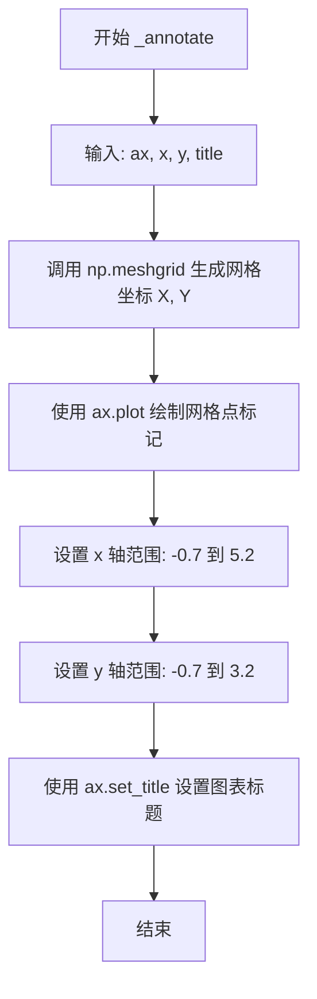

# `matplotlib\galleries\examples\images_contours_and_fields\pcolormesh_grids.py` 详细设计文档

这是一个matplotlib示例文档，展示了pcolormesh函数在不同着色模式下的网格布局和行为，包括flat、nearest、auto和gouraud四种着色方式，并通过实际演示说明了X、Y坐标数组与Z数据数组在不同形状组合下的处理方式。

## 整体流程

```mermaid
graph TD
    A[开始] --> B[导入matplotlib.pyplot和numpy]
    B --> C[定义nrows=3, ncols=5]
    C --> D[创建Z数组shape=(3,5)]
    D --> E[Flat Shading演示]
    E --> F[创建x=arange(6), y=arange(4)]
    F --> G[调用pcolormesh with shading='flat']
    G --> H[Flat Shading同形状演示]
    H --> I[创建x=arange(5), y=arange(3)]
    I --> J[调用pcolormesh with shading='flat' on Z[:-1,:-1]]
    J --> K[Nearest Shading演示]
    K --> L[调用pcolormesh with shading='nearest']
    L --> M[Auto Shading演示]
    M --> N[创建同形状坐标调用auto]
    N --> O[创建大1的坐标调用auto]
    O --> P[Gouraud Shading演示]
    P --> Q[调用pcolormesh with shading='gouraud']
    Q --> R[plt.show显示所有图表]
```

## 类结构

```
无类定义 - 这是一个脚本式示例文件
主要包含全局变量、辅助函数和主执行流程
```

## 全局变量及字段


### `nrows`
    
行数，值为3

类型：`int`
    


### `ncols`
    
列数，值为5

类型：`int`
    


### `Z`
    
形状为(3,5)的二维数组，存储颜色数据

类型：`ndarray`
    


### `x`
    
X坐标向量，长度为N或N+1

类型：`ndarray`
    


### `y`
    
Y坐标向量，长度为M或M+1

类型：`ndarray`
    


### `fig`
    
matplotlib图形对象

类型：`Figure`
    


### `ax`
    
matplotlib坐标轴对象

类型：`Axes`
    


### `axs`
    
Axes数组，用于subplots

类型：`ndarray`
    


    

## 全局函数及方法


### `_annotate`

辅助函数，用于在给定的 Axes 对象上绘制网格点标记（使用 meshgrid 生成坐标点），并设置坐标轴范围和图表标题，以便可视化不同 shading 方式的网格布局。

参数：

- `ax`：`matplotlib.axes.Axes`，Matplotlib 的 Axes 对象，用于绘制图表和图形
- `x`：`numpy.ndarray`，一维数组，表示 x 轴坐标向量
- `y`：`numpy.ndarray`，一维数组，表示 y 轴坐标向量
- `title`：`str`，字符串，用于设置图表的标题文本

返回值：`None`，该函数无返回值，直接修改传入的 Axes 对象的状态

#### 流程图



#### 带注释源码

```python
def _annotate(ax, x, y, title):
    # this all gets repeated below:  # 注释：此函数在代码中被多次重复调用
    X, Y = np.meshgrid(x, y)  # 使用 meshgrid 将一维 x, y 数组转换为二维网格坐标矩阵
    ax.plot(X.flat, Y.flat, 'o', color='m')  # 将网格坐标展平后绘制为圆点标记，颜色为洋红色
    ax.set_xlim(-0.7, 5.2)  # 设置 x 轴显示范围，确保网格点清晰可见
    ax.set_ylim(-0.7, 3.2)  # 设置 y 轴显示范围，确保网格点清晰可见
    ax.set_title(title)  # 设置图表的标题为传入的 title 参数
```

## 关键组件


### pcolormesh 网格渲染函数

Matplotlib 中用于绘制伪彩色二维数组的核心函数，支持通过 shading 参数控制网格布局和单元格着色方式，可处理张量 Z 与网格 X、Y 的多种形状组合。

### flat shading（平坦着色）

当网格 X、Y 形状为 (M+1, N+1) 时，Z 形状为 (M, N)，X 和 Y 指定四边形的角点，Z 值填充对应四边形。若 X、Y 与 Z 形状相同，则丢弃 Z 的最后一行一列以保持兼容性。

### nearest shading（最近邻着色）

当 X、Y、Z 形状均为 (M, N) 时使用，将彩色四边形的中心对齐到网格点，提供离散的颜色映射效果。

### auto shading（自动着色）

根据 X、Y、Z 的相对形状自动选择 flat 或 nearest 着色：当网格比数据大时使用 flat，形状相同时使用 nearest。

### gouraud shading（Gouraud 着色）

在四边形内部对顶点颜色进行线性插值，实现平滑的颜色渐变效果，要求 X、Y、Z 形状完全一致。

### 网格向量与网格矩阵转换

输入的一维向量 x（长度 N 或 N+1）和 y（长度 M 或 M+1）通过 np.meshgrid 转换为网格矩阵 X 和 Y，用于 pcolormesh 的坐标参数。

### vmin/vmax 参数

控制颜色映射的范围，对 Z 值进行归一化限制，确保不同子图使用一致的颜色标尺。

### _annotate 辅助函数

演示函数，用于在图表上标记网格点位置并设置坐标轴范围，帮助可视化不同 shading 模式下的网格布局差异。


## 问题及建议


### 已知问题

-   `_annotate` 函数定义在全局作用域中，多次重复调用，造成代码冗余，可将其封装为可复用的工具模块或使用装饰器模式
-   多个子图创建和设置代码重复（`fig, ax = plt.subplots()`, `vmin`, `vmax` 参数等），违反 DRY 原则
-   `Z` 数组的计算和 `vmin`/`vmax` 参数在多处重复使用，可以统一管理
-   全局变量 `nrows` 和 `ncols` 未使用类或模块级封装，缺乏作用域控制
-   `_annotate` 函数内部创建了 `meshgrid` 但实际未在注释标注逻辑中使用，造成不必要的计算开销

### 优化建议

-   将重复的绘图初始化代码抽象为工厂函数或使用 `functools.partial` 预配置 `pcolormesh` 调用
-   将 `Z`、`vmin`、`vmax` 等数据封装为配置字典或数据类，统一管理数据源
-   使用循环结构替代重复的子图创建逻辑，例如遍历不同的着色类型列表
-   考虑将 `_annotate` 函数作为内部函数或使用闭包，以减少全局作用域污染
-   对于 `meshgrid` 的创建，可以添加条件判断，仅在需要时计算
-   添加类型注解（type hints）以提升代码可维护性和 IDE 支持


## 其它


### 设计目标与约束

本代码示例主要演示matplotlib中pcolormesh函数的四种着色方式（flat、nearest、auto、gouraud）的使用方式和行为差异。设计目标是为用户提供清晰的可视化示例，展示不同shading参数对网格渲染的影响。约束条件包括：flat着色要求X、Y比Z大一圈；nearest和gouraud着色要求X、Y、Z形状一致；auto着色自动根据输入形状判断使用flat还是nearest。

### 错误处理与异常设计

代码中通过numpy数组的shape属性进行维度验证。当shading='flat'时如果X、Y与Z形状相同，会自动丢弃Z的最后一行一列（历史兼容性行为）；当shading='nearest'时如果形状不匹配会抛出错误。pcolormesh内部会对无效的网格输入进行异常抛出，确保数据一致性。

### 数据流与状态机

数据流路径为：用户输入x、y坐标向量和Z值数据 → 根据shading参数选择处理逻辑 → numpy.meshgrid生成网格坐标 → pcolormesh内部转换为QuadMesh对象 → 渲染到Axes上。状态机包含：flat模式（检查x、y比Z大1）、nearest模式（检查形状完全匹配）、auto模式（自动推断）、gouraud模式（形状需一致）。

### 外部依赖与接口契约

主要依赖matplotlib.pyplot（绘图接口）、matplotlib.axes.Axes（坐标轴对象）、numpy（数值计算）。接口契约包括：pcolormesh(x, y, Z, shading, vmin, vmax)函数签名，其中x、y为坐标向量或矩阵，Z为颜色值数组，shading为字符串参数，vmin/vmax为颜色映射范围。

### 配置参数与常量定义

代码中定义的常量包括：nrows=3, ncols=5（测试用网格尺寸），Z通过np.arange生成形状为(3,5)的测试数据，x和y通过np.arange生成坐标向量。vmin和vmax均采用Z.min()和Z.max()以确保颜色映射覆盖全部数据范围。

### 性能考量与优化空间

对于大型网格（高分辨率数据），建议预先计算meshgrid以避免重复调用。Gouraud着色涉及逐顶点插值，计算开销高于flat/nearest着色。示例代码中重复调用_annotate函数，可考虑重构为可复用工具函数。当前代码无缓存机制，大数据集渲染时可考虑QuadMesh对象的复用。

### 兼容性考虑

代码兼容Matplotlib 3.x系列版本。flat着色时保留Matlab兼容行为（自动丢弃最后行列），auto模式设计为向前兼容未来可能的着色算法扩展。示例使用layout='constrained'（Matplotlib 3.1+），需注意版本兼容性。

### 可扩展性设计

_annotate函数可作为通用注释工具提取到工具模块。着色算法可通过注册机制扩展新类型。当前硬编码的坐标范围设置（set_xlim/set_ylim）可考虑动态计算以适应不同输入数据。

### 代码组织与模块化

当前代码为单个脚本文件，适合演示但不利于大型项目组织。建议将着色示例封装为独立示例类，_annotate辅助函数可移至utils模块，不同着色类型的验证逻辑可抽离为独立函数以提高可测试性。

### 使用场景与最佳实践

flat着色适用于单元边界已知的离散数据；nearest适用于点源数据；auto适用于交互式探索；gouraud适用于需要平滑过渡的连续场数据。最佳实践：始终显式指定shading参数；使用vmin/vmax保证多图颜色一致；坐标轴范围应根据实际数据动态调整。

### 可视化效果说明

flat着色在每个四边形内显示均匀颜色，四边形边界由X、Y定义；nearest着色将颜色中心对齐到网格点；gouraud通过顶点颜色线性插值实现平滑渐变；auto根据输入自动选择，优先使用nearest（形状相同）或flat（形状匹配）。


    