# `matplotlib\galleries\examples\images_contours_and_fields\pcolormesh_levels.py` 详细设计文档

This code generates 2D image-style plots using the `pcolormesh` function from the `matplotlib` library, which is an alternative to `pcolor`. It demonstrates basic usage, non-rectilinear quadrilaterals, centered coordinates, and the use of norms for making levels.

## 整体流程

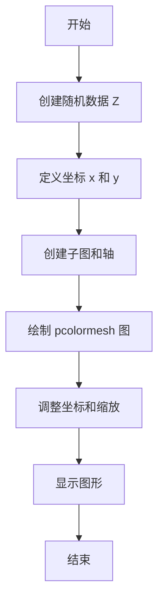

## 类结构

```
matplotlib.pyplot (主模块)
├── pcolormesh (绘制 2D 图像样式图)
│   ├── x (x 坐标)
│   ├── y (y 坐标)
│   ├── Z (值)
│   └── shading (阴影样式)
└── contourf (绘制等高线图)
```

## 全局变量及字段


### `fig`
    
The main figure object where all plots are drawn.

类型：`matplotlib.figure.Figure`
    


### `ax`
    
The axes object where the pcolormesh plot is drawn.

类型：`matplotlib.axes._subplots.AxesSubplot`
    


### `x`
    
The x-coordinates for the pcolormesh plot.

类型：`numpy.ndarray`
    


### `y`
    
The y-coordinates for the pcolormesh plot.

类型：`numpy.ndarray`
    


### `Z`
    
The data values for the pcolormesh plot.

类型：`numpy.ndarray`
    


### `X`
    
The x-coordinates for the non-rectilinear pcolormesh plot.

类型：`numpy.ndarray`
    


### `Y`
    
The y-coordinates for the non-rectilinear pcolormesh plot.

类型：`numpy.ndarray`
    


### `dx`
    
The x-axis spacing for the grid.

类型：`float`
    


### `dy`
    
The y-axis spacing for the grid.

类型：`float`
    


### `z`
    
The data values for the contour plot.

类型：`numpy.ndarray`
    


### `levels`
    
The levels for the contour plot.

类型：`numpy.ndarray`
    


### `cmap`
    
The colormap for the pcolormesh plot.

类型：`str`
    


### `norm`
    
The normalization for the pcolormesh plot.

类型：`matplotlib.colors.BoundaryNorm`
    


### `matplotlib.pyplot.x`
    
The x-coordinates for the pcolormesh plot.

类型：`numpy.ndarray`
    


### `matplotlib.pyplot.y`
    
The y-coordinates for the pcolormesh plot.

类型：`numpy.ndarray`
    


### `matplotlib.pyplot.Z`
    
The data values for the pcolormesh plot.

类型：`numpy.ndarray`
    


### `matplotlib.pyplot.shading`
    
The shading method for the pcolormesh plot.

类型：`str`
    
    

## 全局函数及方法


### np.random.seed

设置随机数生成器的种子。

参数：

- `seed`：`int`，用于初始化随机数生成器的种子值。

返回值：无

#### 流程图

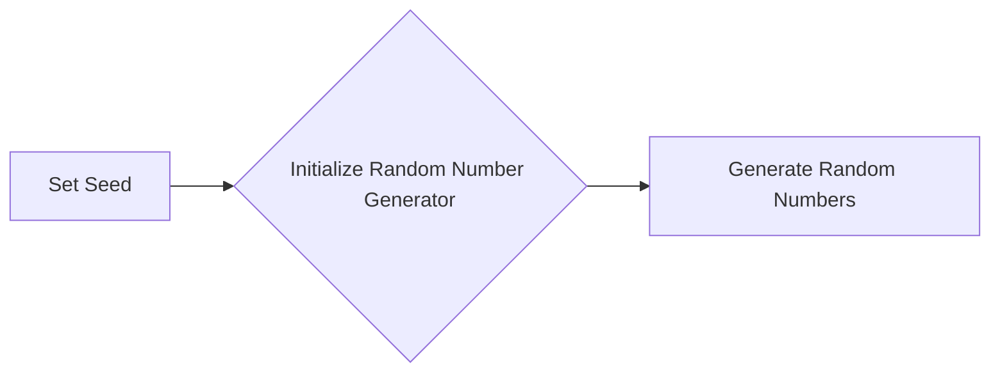

#### 带注释源码

```python
np.random.seed(19680801)
```

该行代码设置了NumPy随机数生成器的种子为19680801。这意味着每次运行代码时，生成的随机数序列将是相同的，这对于调试和重现结果非常有用。


### np.arange

`np.arange` 是 NumPy 库中的一个函数，用于生成一个沿指定间隔的数字序列。

参数：

- `start`：`int`，序列的起始值。
- `stop`：`int`，序列的结束值（不包括此值）。
- `step`：`int`，序列中相邻元素之间的间隔，默认为 1。

返回值：`ndarray`，一个包含指定间隔数字序列的 NumPy 数组。

#### 流程图

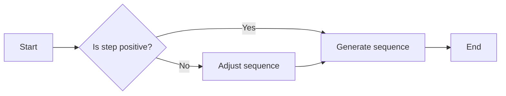

#### 带注释源码

```python
import numpy as np

def np_arange(start, stop=None, step=1):
    """
    Generate an array of numbers with a specified step size.
    
    Parameters:
    - start: The starting value of the sequence.
    - stop: The ending value of the sequence (exclusive).
    - step: The step size between elements in the sequence.
    
    Returns:
    - ndarray: An array of numbers with the specified step size.
    """
    return np.arange(start, stop, step)
```


### np.meshgrid

`np.meshgrid` 是 NumPy 库中的一个函数，用于生成网格数据，这些数据可以用于创建二维图像或进行数值计算。

参数：

- `x`：一维数组，表示 x 轴的坐标。
- `y`：一维数组，表示 y 轴的坐标。

参数描述：

- `x` 和 `y` 是定义网格的坐标轴的值。它们可以是相同长度的数组，也可以是不同长度的数组。

返回值类型：元组，包含两个二维数组。

返回值描述：返回的两个二维数组分别对应于 x 和 y 轴的网格值。

#### 流程图

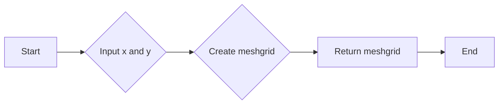

#### 带注释源码

```python
import numpy as np

def np_meshgrid(x, y):
    """
    Generate a meshgrid from input arrays x and y.

    Parameters:
    - x: 1D array, values for the x-axis.
    - y: 1D array, values for the y-axis.

    Returns:
    - Tuple of 2D arrays, representing the meshgrid for x and y.
    """
    return np.meshgrid(x, y)
```


### np.sin

计算输入数值的正弦值。

参数：

- `x`：`numpy.ndarray`，输入数值数组。

返回值：`numpy.ndarray`，输入数值数组对应点的正弦值。

#### 流程图

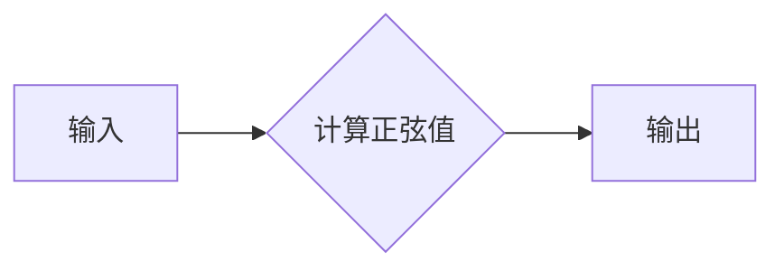

#### 带注释源码

```python
import numpy as np

def np_sin(x):
    """
    计算输入数值的正弦值。

    参数：
    - x：numpy.ndarray，输入数值数组。

    返回值：numpy.ndarray，输入数值数组对应点的正弦值。
    """
    return np.sin(x)
```


### np.cos

计算余弦值。

参数：

- `x`：`float` 或 `array_like`，输入值，可以是单个数值或数组。

返回值：`float` 或 `ndarray`，余弦值。

#### 流程图


#### 带注释源码

```python
import numpy as np

def np_cos(x):
    """
    计算余弦值。

    参数：
    - x：float 或 array_like，输入值，可以是单个数值或数组。

    返回值：float 或 ndarray，余弦值。
    """
    return np.cos(x)
```


### plt.subplots

`plt.subplots` 是 Matplotlib 库中的一个函数，用于创建一个图形和一个轴（Axes）对象。

参数：

- `figsize`：`tuple`，图形的大小（宽度和高度），默认为 (6, 4)。
- `dpi`：`int`，图形的分辨率，默认为 100。
- `facecolor`：`color`，图形的背景颜色，默认为 'white'。
- `edgecolor`：`color`，图形的边缘颜色，默认为 'none'。
- `frameon`：`bool`，是否显示图形的边框，默认为 True。
- `num`：`int`，要创建的轴的数量，默认为 1。
- `gridspec_kw`：`dict`，用于定义网格规格的字典。
- `constrained_layout`：`bool`，是否启用约束布局，默认为 False。

返回值：`Figure`，图形对象；`Axes`，轴对象。

#### 流程图

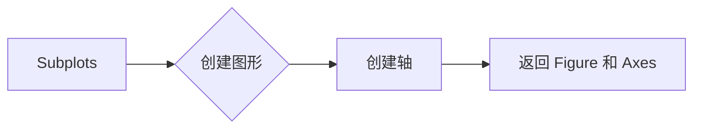

#### 带注释源码

```python
fig, ax = plt.subplots()
```


### plt.colorbar

`plt.colorbar` 是一个用于在 Matplotlib 图形中添加颜色条的全局函数。

参数：

- `cmap`：`Colormap` 对象，指定颜色映射。
- `norm`：`Normalize` 对象，指定归一化方法。
- `orientation`：`str`，指定颜色条的方向，可以是 'horizontal' 或 'vertical'。
- `shrink`：`float`，指定颜色条缩放比例。
- `pad`：`float`，指定颜色条与图形边缘的距离。
- `aspect`：`float`，指定颜色条的高度与宽度比例。
- `ax`：`Axes` 对象，指定颜色条所在的轴。

返回值：`Colorbar` 对象，表示颜色条。

#### 流程图

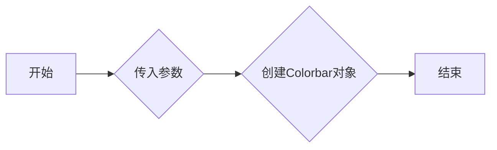

#### 带注释源码

```python
from matplotlib.figure import Figure
from matplotlib.axes import Axes
from matplotlib.colors import Colormap, Normalize
from matplotlib.colorbar import Colorbar

def plt.colorbar(cmap=None, norm=None, orientation='horizontal', shrink=0.9, pad=0.05, aspect=50, ax=None):
    # 创建颜色条对象
    colorbar = Colorbar(cmap=cmap, norm=norm, orientation=orientation, shrink=shrink, pad=pad, aspect=aspect, ax=ax)
    return colorbar
```


### plt.show()

显示所有当前活动图形。

参数：

- 无

返回值：无

#### 流程图

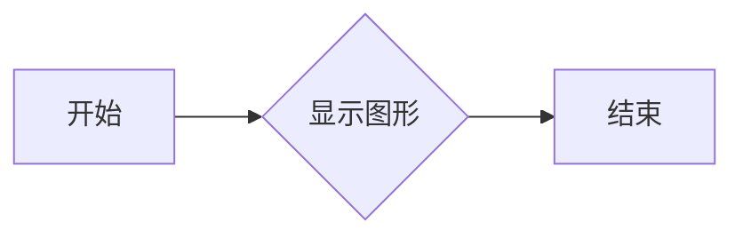

#### 带注释源码

```python
plt.show()
```


### MaxNLocator.tick_values

MaxNLocator.tick_values is a method of the MaxNLocator class.

参数：

- `z_min`：`float`，指定最小值。
- `z_max`：`float`，指定最大值。

参数描述：

- `z_min`：指定数据的最小值。
- `z_max`：指定数据的最大值。

返回值：`list`，返回一个包含指定范围内的等间隔值的列表。

返回值描述：返回的列表包含了从 `z_min` 到 `z_max` 的等间隔值。

#### 流程图

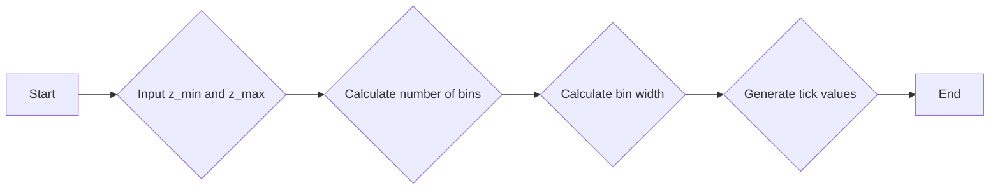

#### 带注释源码

```python
def tick_values(self, z_min, z_max):
    """
    Generate tick values for the given range.

    Parameters
    ----------
    z_min : float
        The minimum value of the range.
    z_max : float
        The maximum value of the range.

    Returns
    -------
    list
        A list of tick values.
    """
    # Calculate the number of bins
    nbins = self.nbins

    # Calculate the bin width
    bin_width = (z_max - z_min) / nbins

    # Generate tick values
    tick_values = [z_min + i * bin_width for i in range(nbins + 1)]

    return tick_values
```


### BoundaryNorm

BoundaryNorm is a class in the matplotlib.colors module that is used to map data values to levels for contour plots, pcolormesh, and imshow. It is a normalization instance that takes data values and translates those into levels.

参数：

- `levels`：`array_like`，指定数据值的边界级别。这些级别用于将数据值映射到颜色映射中。
- `ncolors`：`int`，颜色映射中的颜色数量。
- `clip`：`bool`，如果为True，则将数据值限制在指定的级别范围内。

返回值：`BoundaryNorm`对象，用于将数据值映射到颜色映射中的级别。

#### 流程图

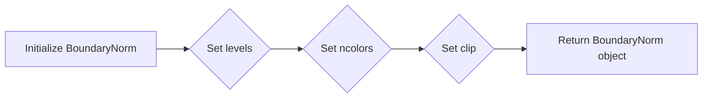

#### 带注释源码

```python
from matplotlib.colors import BoundaryNorm

# Initialize BoundaryNorm with levels, ncolors, and clip
norm = BoundaryNorm(levels, ncolors=cmap.N, clip=True)
```


### matplotlib.pyplot.pcolormesh

matplotlib.pyplot.pcolormesh is a function used to generate 2D image-style plots by specifying the edges of quadrilaterals and their corresponding values.

参数：

- `X`：`numpy.ndarray`，网格X的坐标，用于定义网格的X轴。
- `Y`：`numpy.ndarray`，网格Y的坐标，用于定义网格的Y轴。
- `Z`：`numpy.ndarray`，网格Z的值，用于定义网格的颜色。
- `cmap`：`str` 或 `Colormap`，可选，用于定义颜色映射。
- `norm`：`Normalize`，可选，用于定义归一化方法。
- `shading`：`str`，可选，用于定义着色方法。
- `vmin`：`float`，可选，用于定义最小值。
- `vmax`：`float`，可选，用于定义最大值。
- `levels`：`array`，可选，用于定义等值线级别。
- `cmin`：`float`，可选，用于定义最小颜色值。
- `cmax`：`float`，可选，用于定义最大颜色值。
- `extend`：`str`，可选，用于定义扩展颜色映射。
- `alpha`：`float`，可选，用于定义透明度。
- `antialiased`：`bool`，可选，用于定义抗锯齿。

返回值：`AxesImage`，返回图像对象。

#### 流程图

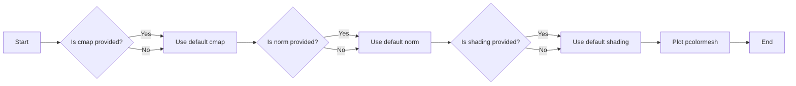

#### 带注释源码

```python
import matplotlib.pyplot as plt
import numpy as np

def pcolormesh(X, Y, Z, cmap=None, norm=None, shading='auto', vmin=None, vmax=None, levels=None, cmin=None, cmax=None, extend=None, alpha=None, antialiased=None):
    # ... (source code implementation)
```


### matplotlib.pyplot.contourf

`matplotlib.pyplot.contourf` 函数用于绘制二维数据集的等高线填充图。

参数：

- `x`：`numpy.ndarray`，x轴的边界值。
- `y`：`numpy.ndarray`，y轴的边界值。
- `Z`：`numpy.ndarray`，要绘制的数据。
- `levels`：`int` 或 `sequence`，等高线的数量或等高线值。
- `cmap`：`Colormap`，颜色映射。
- `norm`：`Normalize`，归一化实例。
- `extend`：`str`，扩展颜色映射的选项。
- `origin`：`str`，坐标原点。
- `fill`：`bool`，是否填充等高线。
- `alpha`：`float`，透明度。

返回值：`ContourSet`，等高线集合。

#### 流程图

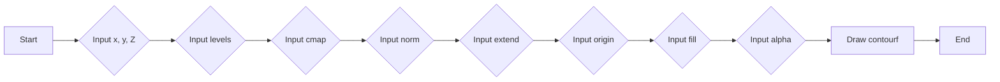

#### 带注释源码

```python
import matplotlib.pyplot as plt
import numpy as np
from matplotlib.colors import BoundaryNorm
from matplotlib.ticker import MaxNLocator

# Generate data
x = np.linspace(-3.0, 3.0, 100)
y = np.linspace(-3.0, 3.0, 100)
X, Y = np.meshgrid(x, y)
Z = np.sin(X) ** 10 + np.cos(10 + Y * X) * np.cos(X)

# Create figure and axis
fig, ax = plt.subplots()

# Create contourf plot
levels = MaxNLocator(nbins=15).tick_values(Z.min(), Z.max())
cmap = plt.cm.viridis
norm = BoundaryNorm(levels, cmap.N, clip=True)
contourf = ax.contourf(X, Y, Z, levels=levels, cmap=cmap, norm=norm)

# Add colorbar
fig.colorbar(contourf, ax=ax)

# Show plot
plt.show()
```


## 关键组件


### 张量索引与惰性加载

张量索引与惰性加载是用于处理和操作多维数据结构的组件，它允许在数据未完全加载到内存中时进行索引和访问，从而提高内存使用效率和处理速度。

### 反量化支持

反量化支持是用于将量化后的数据转换回原始数据类型的组件，它允许在量化过程中保持数据的精度和准确性。

### 量化策略

量化策略是用于确定数据量化方法和参数的组件，它可以根据不同的应用场景和需求选择合适的量化方法，以优化性能和资源使用。

## 问题及建议


### 已知问题

-   **代码重复性**：在多个示例中，`x` 和 `y` 的生成和调整是重复的，可以考虑将这些操作封装成函数以减少代码重复。
-   **注释不足**：虽然代码中包含了一些注释，但某些关键部分，如 `Z` 数组的生成和 `shading` 参数的解释，可能需要更详细的说明。
-   **错误处理**：代码示例中没有显示错误处理机制，对于可能出现的异常情况（如数组尺寸不匹配）没有提供处理策略。

### 优化建议

-   **封装重复代码**：将生成 `x` 和 `y` 数组的代码封装成函数，以便在需要时重用。
-   **增强注释**：在代码中添加更多注释，特别是对于复杂逻辑和参数设置的解释。
-   **添加错误处理**：在关键操作中添加错误检查和异常处理，确保代码的健壮性。
-   **代码结构**：考虑将代码分割成更小的模块或函数，以提高代码的可读性和可维护性。
-   **性能优化**：对于大型数据集，考虑使用更高效的数据结构和算法来提高性能。
-   **文档化**：为代码编写更详细的文档，包括如何使用代码、参数说明和示例。


## 其它


### 设计目标与约束

- 设计目标：
  - 提供一个高效且灵活的二维图像样式绘图工具。
  - 支持不同类型的网格和坐标系统。
  - 允许用户自定义颜色映射和级别。
  - 与Matplotlib库集成，提供一致的API。

- 约束条件：
  - 必须使用Matplotlib库进行绘图。
  - 需要支持NumPy数组操作。
  - 应尽可能减少内存使用和提高绘图速度。

### 错误处理与异常设计

- 错误处理：
  - 对于无效的输入参数，应抛出异常。
  - 对于不支持的参数组合，应提供明确的错误信息。

- 异常设计：
  - 使用try-except块捕获和处理可能发生的异常。
  - 定义自定义异常类，以便更精确地描述错误情况。

### 数据流与状态机

- 数据流：
  - 输入数据：二维数组Z，可选的X和Y数组。
  - 处理数据：根据输入数据生成网格和颜色映射。
  - 输出数据：绘制二维图像。

- 状态机：
  - 初始状态：接收输入数据。
  - 处理状态：计算网格和颜色映射。
  - 输出状态：绘制图像并显示。

### 外部依赖与接口契约

- 外部依赖：
  - Matplotlib库：用于绘图和颜色映射。
  - NumPy库：用于数组操作。

- 接口契约：
  - `pcolormesh`函数接受二维数组Z和可选的X和Y数组。
  - `pcolormesh`函数返回绘制的图像。
  - `pcolormesh`函数的参数应遵循Matplotlib的API规范。


    