# `matplotlib\galleries\examples\images_contours_and_fields\plot_streamplot.py` 详细设计文档

这是一个Matplotlib的streamplot函数演示脚本，用于展示二维向量场的可视化功能，包括流线密度变化、颜色变化、线宽变化、起点控制、遮罩处理和连续流线等特性。

## 整体流程

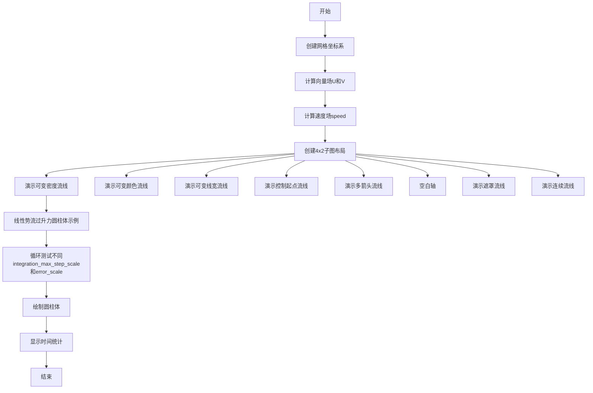

## 类结构

```
Python脚本 (无类定义)
└── 主要模块: matplotlib.pyplot, numpy
    ├── 子图管理: axs (4x2 网格)
    ├── 核心功能: streamplot()
    └── 辅助功能: meshgrid, mgrid, np函数
```

## 全局变量及字段


### `w`
    
网格范围参数，用于定义坐标轴的上下限

类型：`int`
    


### `Y`
    
Y轴网格坐标，通过mgrid生成

类型：`numpy.ndarray`
    


### `X`
    
X轴网格坐标，通过mgrid生成

类型：`numpy.ndarray`
    


### `U`
    
X方向向量场，由表达式计算得出

类型：`numpy.ndarray`
    


### `V`
    
Y方向向量场，由表达式计算得出

类型：`numpy.ndarray`
    


### `speed`
    
向量场速度大小，通过U和V的平方和开根号计算

类型：`numpy.ndarray`
    


### `fig`
    
图形对象，用于容纳所有子图

类型：`matplotlib.figure.Figure`
    


### `axs`
    
子图数组，存储多个Axes对象

类型：`numpy.ndarray`
    


### `strm`
    
流线对象，包含streamplot返回的线集合和颜色条

类型：`StreamplotSet`
    


### `lw`
    
线宽数组，用于控制流线线条宽度

类型：`numpy.ndarray`
    


### `seed_points`
    
流线起点坐标，手动指定的流线起始点

类型：`numpy.ndarray`
    


### `mask`
    
遮罩数组，用于隐藏或排除特定区域

类型：`numpy.ndarray`
    


### `n`
    
网格点数，定义网格的分辨率

类型：`int`
    


### `x`
    
X坐标网格，通过linspace生成

类型：`numpy.ndarray`
    


### `y`
    
Y坐标网格，通过linspace生成

类型：`numpy.ndarray`
    


### `th`
    
角度数组，通过arctan2计算得到

类型：`numpy.ndarray`
    


### `r`
    
半径数组，通过坐标计算得到

类型：`numpy.ndarray`
    


### `vr`
    
径向速度分量

类型：`numpy.ndarray`
    


### `vt`
    
切向速度分量

类型：`numpy.ndarray`
    


### `vx`
    
X方向速度，由径向和切向速度转换而来

类型：`numpy.ndarray`
    


### `vy`
    
Y方向速度，由径向和切向速度转换而来

类型：`numpy.ndarray`
    


### `n_seed`
    
种子点数量，指定流线起点数量

类型：`int`
    


### `seed_pts`
    
种子点坐标，指定流线的起始位置

类型：`numpy.ndarray`
    


### `th_circ`
    
圆柱角度，用于绘制圆柱轮廓

类型：`numpy.ndarray`
    


### `max_val`
    
积分参数列表，包含不同的积分最大步长和误差缩放值

类型：`list`
    


### `ax`
    
当前轴对象，用于绘制主图或子图

类型：`matplotlib.axes.Axes`
    


### `ax_ins`
    
插图轴对象，用于绘制放大区域

类型：`matplotlib.axes.Axes`
    


### `t_start`
    
开始时间，记录streamplot计算开始时刻

类型：`float`
    


### `t_total`
    
总耗时，记录streamplot计算所花时间

类型：`float`
    


### `text`
    
标签文本，用于显示积分参数和计算时间信息

类型：`str`
    


### `is_inset`
    
是否为插图，标志位用于区分主图和插图

类型：`bool`
    


    

## 全局函数及方法


### `np.mgrid`

`np.mgrid`是NumPy的网格坐标生成函数，用于在指定范围内创建多维网格矩阵，常用于生成二维或三维空间的坐标点，以便进行向量化计算和可视化。

参数：

- `slice1`：字符串或切片对象，第一个维度的范围描述，格式为`start:stop:step`或`start:stop:numberj`（其中`j`表示生成固定数量的点）
- `slice2`：字符串或切片对象，第二个维度的范围描述，格式同`slice1`
- `...`：可选，更多维度切片，用于生成更高维度的网格

返回值：`ndarray`或`tuple of ndarray`，返回网格坐标数组。如果是单一切片则返回数组，多个切片时返回由各维度坐标数组组成的元组。

#### 流程图

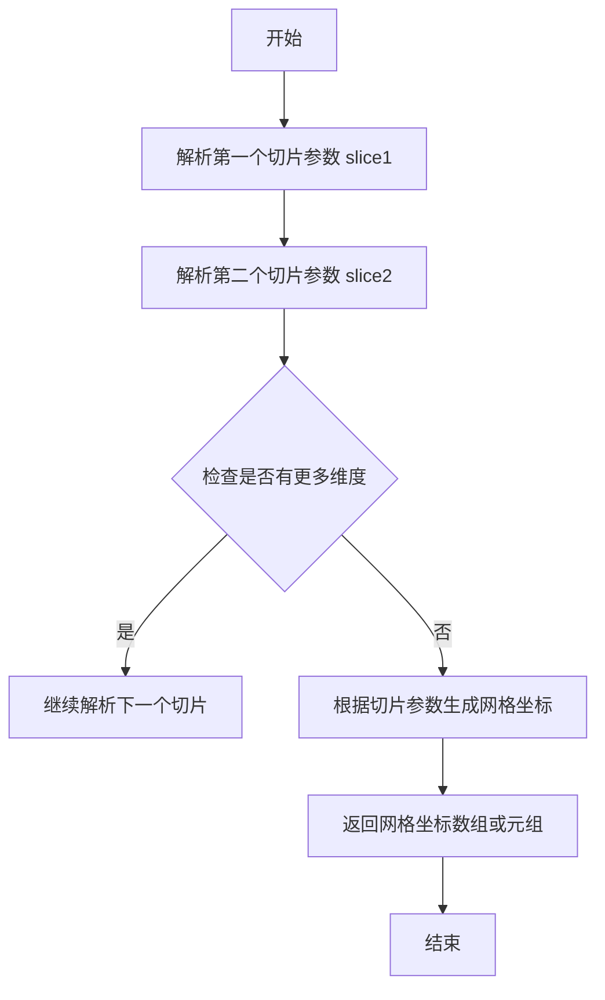

#### 带注释源码

```python
# np.mgrid 使用示例
import numpy as np

w = 3
# 使用 np.mgrid 创建网格坐标
# 语法: start:stop:numberj 表示生成固定数量的点
# -w:w:100j 表示从 -3 到 3，生成 100 个点
Y, X = np.mgrid[-w:w:100j, -w:w:100j]

# 解释：
# 第一个切片 -w:w:100j 控制 Y 坐标（行）
# 第二个切片 -w:w:100j 控制 X 坐标（列）
# 结果：
# X 形状: (100, 100)，每行相同，从 -3 到 3
# Y 形状: (100, 100)，每列相同，从 -3 到 3（垂直方向）
# 这创建了一个 100x100 的网格，覆盖范围 [-3, 3] x [-3, 3]

# 验证网格形状
print(f"X shape: {X.shape}")  # (100, 100)
print(f"Y shape: {Y.shape}")  # (100, 100)

# 网格坐标的典型用途：
U = -1 - X**2 + Y
V = 1 + X - Y**2
# 这样可以对整个网格同时进行向量化计算，而不需要循环
```


### `np.meshgrid`

`np.meshgrid` 是 NumPy 库中的一个函数，用于从一维坐标数组创建二维或三维网格坐标矩阵。在本代码中，它用于生成流线图（streamplot）所需的坐标网格，使 vector field 的每个点都有对应的 (x, y) 坐标。

参数：

- `xi`：`array_like`，一维数组，表示第一个维度的坐标
- `yi`：`array_like`，一维数组，表示第二个维度的坐标
- `indexing`：`{'xy', 'ij'}`，可选，默认 'xy'，指定输出矩阵的索引方式（'xy' 为 Cartesian，'ij' 为 matrix）
- `sparse`：`bool`，可选，默认 False，是否返回稀疏矩阵
- `copy`：`bool`，可选，默认 False，是否返回副本

返回值：

- `X, Y`：ndarray，第一个维度从 xi 扩展，第二个维度从 yi 扩展的二维坐标网格

#### 流程图

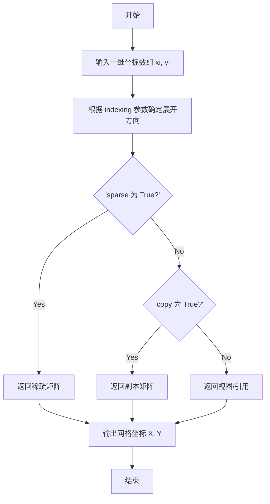

#### 带注释源码

```python
# 从代码中提取的 np.meshgrid 使用示例
# 用于创建流线图的坐标网格

# 第一处：使用 np.mgrid（另一种网格生成方式）
w = 3
Y, X = np.mgrid[-w:w:100j, -w:w:100j]  # 创建 -3 到 3 的 100x100 网格

# 第二处：使用 np.meshgrid（标准方式）
n = 50
# 从 -2 到 2 生成 n 个点的线性空间
# 从 -3 到 3 生成 n 个点的线性空间
x, y = np.meshgrid(
    np.linspace(-2, 2, n),  # xi: 第一个维度的坐标
    np.linspace(-3, 3, n)   # yi: 第二个维度的坐标
)
# 结果：
# x.shape = (50, 50), y.shape = (50, 50)
# x 的每一行相同，y 的每一列相同
# 用于后续计算 vector field (vx, vy)
```

#### 关键组件信息

- `np.linspace`：生成指定范围内的等间距数列
- `np.mgrid`：NumPy 的 mgrid 网格生成器，返回密集网格
- `streamplot`：Matplotlib 的流线图绘制函数

#### 潜在的技术债务或优化空间

1. **重复网格生成**：代码中存在两种网格生成方式（mgrid 和 meshgrid），可以统一
2. **固定参数**：许多参数（如 density、linewidth）使用硬编码值，缺乏灵活性
3. **缺少错误处理**：没有对输入数组形状的验证

#### 其它项目

- **设计目标**：展示 Matplotlib streamplot 的多种功能特性
- **约束**：依赖 NumPy 和 Matplotlib 库
- **数据流**：坐标网格 → 向量场计算 → 流线图渲染
- **外部依赖**：numpy, matplotlib.pyplot


### np.sqrt

`np.sqrt` 是 NumPy 库中的数学函数，用于计算数组（或单个数值）中每个元素的平方根。

参数：

- `x`：`array_like`，输入数组或数值，待计算平方根的元素

返回值：`ndarray`，返回输入数组每个元素的平方根组成的新数组

#### 流程图


#### 带注释源码

```python
# 计算向量场 U, V 的速度大小（模）
# 这里使用 np.sqrt 对每个像素点计算 sqrt(U^2 + V^2)
speed = np.sqrt(U**2 + V**2)

# 计算每个点到原点的距离 r
# 这里使用 np.sqrt 计算 sqrt(x^2 + y^2)
r = np.sqrt(x**2 + y**2)
```

---

**使用示例说明：**

在代码中，`np.sqrt` 被调用了两次：

1. **第一次调用**：计算速度场的大小
   - 输入：`U**2 + V**2`，即两个方向分量的平方和
   - 输出：`speed` 数组，表示每个位置上向量的大小

2. **第二次调用**：计算极坐标中的径向距离
   - 输入：`x**2 + y**2`，即坐标的平方和
   - 输出：`r` 数组，表示每个点到原点的距离


### `np.arctan2`

反正切函数，用于计算 y/x 的反正切值，返回值范围为 (-π, π]。该函数能够正确处理所有四个象限的坐标，并区分 x 和 y 都是 0 的情况。

参数：

- `y`：`array_like`，y 坐标值或分子值
- `x`：`array_like`，x 坐标值或分母值

返回值：`ndarray 或 scalar`，返回与 (x, y) 坐标对应的角度（弧度），范围是 (-π, π]

#### 流程图

```mermaid
flowchart TD
    A[开始] --> B{输入 y, x}
    B --> C{判断 x 和 y 的值}
    C --> D{x > 0}
    C --> E{x == 0 且 y > 0}
    C --> F{x == 0 且 y < 0}
    C --> G{x < 0 且 y == 0}
    C --> H{x == 0 且 y == 0}
    
    D --> I[计算 atan2 = arctan/y/x]
    E --> J[返回 π/2]
    F --> K[返回 -π/2]
    G --> L{判断 y 的符号}
    G --> M[返回 π]
    L --> N{y > 0?]
    N --> O[返回 π]
    N --> P[返回 -π]
    H --> Q[返回 0 或 undefined]
    
    I --> R[结束]
    J --> R
    K --> R
    M --> R
    O --> R
    P --> R
    Q --> R
```

#### 带注释源码

```python
# np.arctan2(y, x) 使用示例
# 在给定代码中的实际使用：
th = np.arctan2(y, x)  # 计算每个点 (x, y) 对应的角度 th

# 参数说明：
# y: array_like, y 坐标数组
# x: array_like, x 坐标数组

# 返回值：
# th: ndarray, 对应每个 (x, y) 点的极角（弧度），范围 (-π, π]

# 举例：
# np.arctan2(1, 1)    # 返回 0.785398... (π/4)
# np.arctan2(-1, 1)  # 返回 -0.785398... (-π/4)
# np.arctan2(1, -1)  # 返回 2.35619... (3π/4)
# np.arctan2(-1, -1) # 返回 -2.35619... (-3π/4)
# np.arctan2(0, 1)   # 返回 0.0
# np.arctan2(1, 0)   # 返回 1.570796... (π/2)
# np.arctan2(0, 0)   # 返回 0.0（但根据具体实现可能不同）

# 该函数与 np.arctan(y/x) 的区别：
# - arctan(y/x) 返回值范围是 (-π/2, π/2)，无法区分第一象限和第二象限
# - arctan2(y, x) 通过同时接收 x 和 y，能够确定完整的四个象限
```


### `np.full`

`np.full` 是 NumPy 库中的一个函数，用于创建一个填充了指定值的数组。在给定的代码中，它用于创建一组具有相同值（-1.75）的种子点。

参数：

- `shape`：`int` 或 `tuple of ints`，输出数组的形状
- `fill_value`：`scalar`，填充数组的标量值
- `dtype`：`data-type`，可选，数组的数据类型
- `order`：`{'C', 'F'}`，可选，内存布局（C 按行，F 按列）
- `like`：`array_like`，可选，类似数组

返回值：`ndarray`，填充了 `fill_value` 的数组

#### 流程图

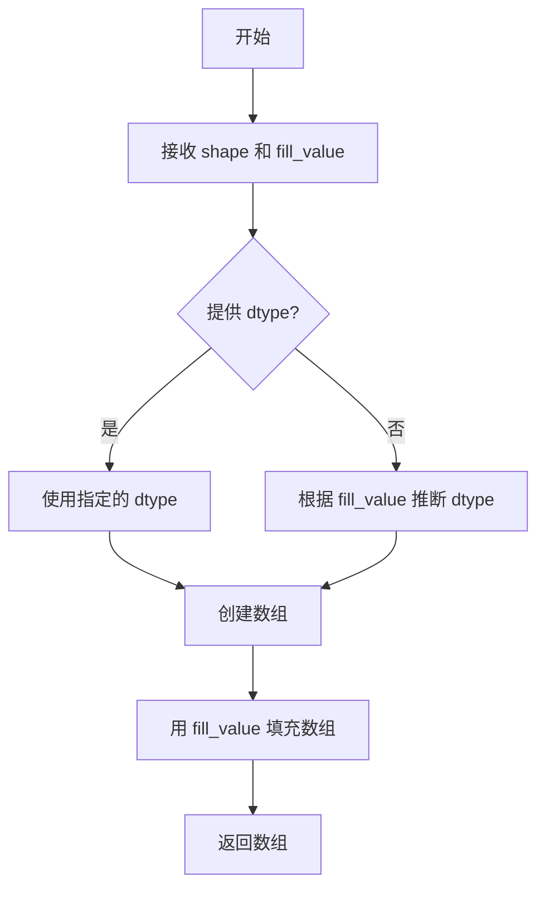

#### 带注释源码

```python
# np.full 函数源码示例
# 创建形状为 (n_seed,) 的数组，填充值为 -1.75
seed_pts_x = np.full(n_seed, -1.75)

# 参数说明：
# n_seed: 整数，表示要创建的数组的长度（这里是50）
# -1.75: 浮点数，填充值

# 在代码中的实际使用：
# np.column_stack((np.full(n_seed, -1.75), np.linspace(-2, 2, n_seed)))
# 这里 np.full 创建了一个全是 -1.75 的数组，与 linspace 创建的数组进行列拼接
```


### `np.linspace`

NumPy 的 `linspace` 函数用于创建等差数列，生成指定范围内均匀分布的数值序列，常用于创建测试数据、坐标轴和数值序列。

参数：

- `start`：`float`，序列的起始值
- `stop`：`float`，序列的结束值（当 `endpoint` 为 True 时包含）
- `num`：`int`，生成的样本数量，默认为 50
- `endpoint`：`bool`，可选，是否包含结束点，默认为 True
- `retstep`：`bool`，可选，是否返回步长，默认为 False
- `dtype`：`dtype`，可选，输出数组的数据类型
- `axis`：`int`，可选，保存结果中轴的维度（仅当 stop 或 start 是数组时使用）

返回值：`ndarray`，返回指定范围内的等差数列

#### 流程图

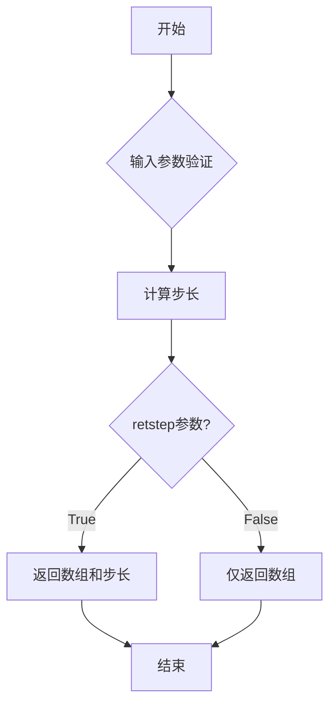

#### 带注释源码

```python
# 代码中的实际使用示例

# 示例1：创建用于meshgrid的x坐标数组
# 从-2到2，生成50个均匀分布的点
x = np.linspace(-2, 2, n)

# 示例2：创建用于meshgrid的y坐标数组
# 从-3到3，生成50个均匀分布的点  
y = np.linspace(-3, 3, n)

# 示例3：创建角度数组
# 从0到2π，生成100个点，用于绘制圆柱轮廓
th_circ = np.linspace(0, 2 * np.pi, 100)

# 示例4：创建种子点数组
# 从-2到2，生成50个均匀分布的点
np.linspace(-2, 2, n_seed)
```


### `np.column_stack`

将一维数组序列按列拼接成二维数组。这是 NumPy 库中的数组操作函数，常用于将多个一维特征向量组合成二维特征矩阵。

参数：

-  `tup`：元组或列表，包含一个或多个一维 array_like 对象（如列表、numpy 数组），需要具有相同的长度

返回值：`ndarray`，返回一个二维数组，形状为 (n, m)，其中 n 是输入数组的长度，m 是输入数组的数量（列数）。如果输入的是 1D 数组，结果将是一个 2D 数组；如果输入已经是 2D 数组，则按列堆叠。

#### 流程图

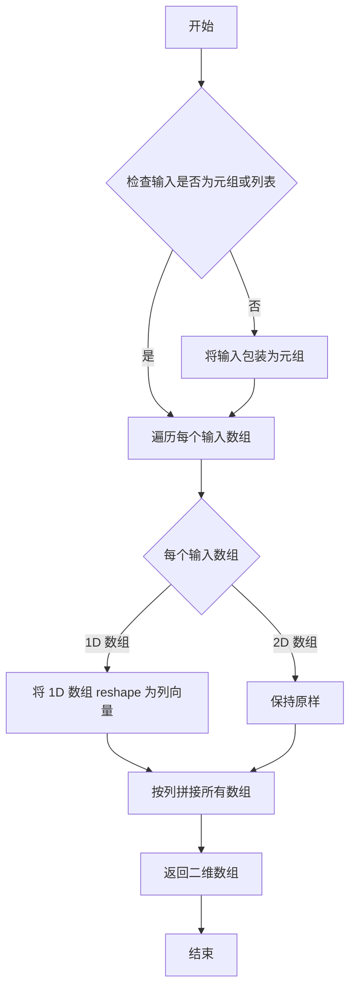

#### 带注释源码

```python
# 在示例代码中的实际使用：
seed_pts = np.column_stack((np.full(n_seed, -1.75), np.linspace(-2, 2, n_seed)))

# np.column_stack 函数原型（简化版）：
def column_stack(tup):
    """
    将一维数组序列按列拼接成二维数组。
    
    参数:
        tup: 包含多个一维数组的元组或列表
        
    返回:
        二维数组，每列对应输入的一个数组
    """
    # 示例：np.full(n_seed, -1.75) 创建 n_seed 个 -1.75 的数组
    # 示例：np.linspace(-2, 2, n_seed) 创建 n_seed 个 -2 到 2 线性分布的数组
    # column_stack 将这两个一维数组合并成形状为 (n_seed, 2) 的二维数组
    # 结果类似：
    # [[-1.75, -2.00],
    #  [-1.75, -1.92],
    #  [-1.75, -1.84],
    #  ...,
    #  [-1.75,  2.00]]
    
    arrays = []
    for arr in tup:
        arr = np.asarray(arr)  # 转换为 numpy 数组
        if arr.ndim == 1:      # 如果是一维数组
            arrays.append(arr[:, np.newaxis])  # 转换为列向量
        else:
            arrays.append(arr)
    
    # 使用 hstack 按列水平堆叠
    return np.hstack(arrays)
```


### `plt.subplots`

`plt.subplots` 是 matplotlib.pyplot 模块中的函数，用于创建一个包含多个子图的图形窗口。它能够一次性生成指定行列数量的子图布局，并返回 Figure 对象和 Axes 对象（或数组），是实现多子图可视化的基础函数。

参数：

- `nrows`：`int`，行数，表示子图网格的行数，默认为1
- `ncols`：`int`，列数，表示子图网格的列数，默认为1
- `sharex`：`bool` 或 `str`，是否共享x轴坐标，默认为False；若为True或'all'，所有子图共享x轴；若为'row'，每行子图共享x轴
- `sharey`：`bool` 或 `str`，是否共享y轴坐标，默认为False；若为True或'all'，所有子图共享y轴；若为'row'，每行子图共享y轴
- `squeeze`：`bool`，是否压缩返回的Axes数组维度，默认为True；当为True时，如果只有单个子图则返回单个Axes对象而非数组
- `width_ratios`：`array-like`，列宽比例数组，长度等于ncols，用于指定各列的相对宽度
- `height_ratios`：`array-like`，行高比例数组，长度等于nrows，用于指定各行的相对高度
- `gridspec_kw`：`dict`，传递给GridSpec构造函数的额外参数，用于更细粒度地控制网格布局
- `**fig_kw`：关键字参数，这些参数将传递给Figure构造函数，如`figsize`、`dpi`、`facecolor`等

返回值：`tuple(Figure, Axes or array of Axes)`，返回两个元素：第一个是Figure图形对象，第二个是Axes对象（当nrows>1或ncols>1时为numpy数组，当squeeze=False时始终为数组）

#### 流程图

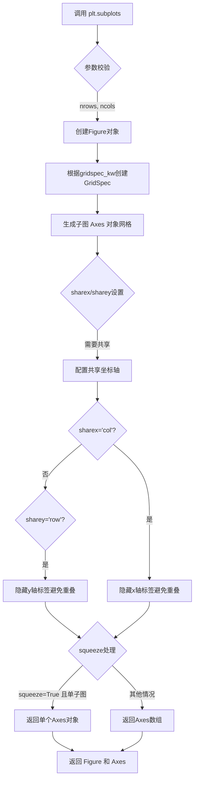

#### 带注释源码

```python
def subplots(nrows=1, ncols=1, *, sharex=False, sharey=False,
             squeeze=True, width_ratios=None, height_ratios=None,
             gridspec_kw=None, **fig_kw):
    """
    创建包含多个子图的图形窗口。
    
    参数:
        nrows: int, 子图行数 (默认 1)
        ncols: int, 子图列数 (默认 1)
        sharex: bool or str, x轴共享策略 (默认 False)
        sharey: bool or str, y轴共享策略 (默认 False)
        squeeze: bool, 是否压缩维度 (默认 True)
        width_ratios: array-like, 列宽比例
        height_ratios: array-like, 行高比例
        gridspec_kw: dict, GridSpec额外参数
        **fig_kw: 传递给Figure的关键字参数
    
    返回:
        fig: Figure 对象
        axs: Axes 对象或数组
    """
    # 1. 创建Figure对象，figsize等参数通过**fig_kw传递
    fig = figure(**fig_kw)
    
    # 2. 创建GridSpec对象用于布局管理
    gs = GridSpec(nrows, ncols, width_ratios=width_ratios,
                  height_ratios=height_ratios, **(gridspec_kw or {}))
    
    # 3. 创建子图数组
    axs = np.empty((nrows, ncols), dtype=object)
    
    # 4. 遍历每个网格位置创建Axes
    for i in range(nrows):
        for j in range(ncols):
            # 使用add_subplot添加子图
            axs[i, j] = fig.add_subplot(gs[i, j])
    
    # 5. 配置共享坐标轴
    if sharex or sharey:
        # 根据sharex/sharey策略设置共享关系
        ...
    
    # 6. 根据squeeze参数处理返回值
    if squeeze:
        # 压缩维度：单行/单列时返回一维数组，单个子图时返回单个对象
        axs = axs.squeeze()
    
    return fig, axs
```


### `ax.streamplot`

`ax.streamplot` 是 Matplotlib 中 Axes 类的成员方法，用于在二维坐标平面上绘制流线图（Streamplot），该方法通过接收网格坐标和向量场数据，计算并可视化二维向量场的流动路径，支持自定义流线密度、颜色映射、线宽、起始点、箭头样式等丰富参数，以展示向量场的方向和强度分布。

参数：

- `x`：`numpy.ndarray`（1D 或 2D），定义网格的 x 坐标数组，如果是 2D 数组则表示完整的网格
- `y`：`numpy.ndarray`（1D 或 2D），定义网格的 y 坐标数组，如果是 2D 数组则表示完整的网格
- `u`：`numpy.ndarray`（2D），定义向量场在 x 方向的分量
- `v`：`numpy.ndarray`（2D），定义向量场在 y 方向的分量
- `density`：`float` 或 `tuple of float`，控制流线的密度，可以是单个值（均匀密度）或两个值的元组（x 和 y 方向的密度比）
- `linewidth`：`float` 或 `numpy.ndarray`（2D），控制流线的线宽，可以是常数或与向量场形状相同的数组以实现沿流线变化
- `color`：`color` 或 `numpy.ndarray`（2D），控制流线的颜色，可以是 matplotlib 支持的颜色值或与向量场形状相同的数组以实现沿流线变化
- `cmap`：`Colormap`，颜色映射表，当 color 为数组时使用，用于将数值映射为颜色
- `norm`：`Normalize`，归一化对象，用于将数据值映射到颜色映射表的范围
- `shading`：`str`，着色方案，可选 'flat', 'gouraud'，默认为 'flat'
- `arrowstyle`：`str` 或 `ArrowStyle`，箭头样式，定义箭头的形状，默认为 '-|>'
- `arrowsize`：`float`，箭头大小系数，控制流线上箭头的大小，默认为 1
- `transform`：`Transform`，坐标变换对象，用于指定 x 和 y 坐标的坐标系，默认为 ax.transData
- `start_points`：`numpy.ndarray`（2D，shape 为 (N, 2)），流线的起始点坐标，每行是一个 (x, y) 坐标
- `maxlength`：`float`，流线的最大长度，控制每条流线的最大积分步数，默认为 4
- `integration_direction`：`str`，积分方向，可选 'forward', 'backward', 'both'，默认为 'both'
- `broken_streamlines`：`bool`，是否允许流线在网格单元内断开以保持流线数量限制，默认为 True
- `integration_max_step_scale`：`float`，积分最大步长的缩放因子，控制积分器单步最大距离，默认为 100
- `integration_max_error_scale`：`float`，积分最大误差的缩放因子，控制积分器的误差容忍度，默认为 100

返回值：`StreamplotSet`，包含流线绘制结果的集合对象

- `lines`：`LineCollection`，流线本身的 LineCollection 对象，可用于进一步定制颜色、线宽等属性
- `arrows`：`PatchCollection`，流线上箭头的 PatchCollection 对象

#### 流程图

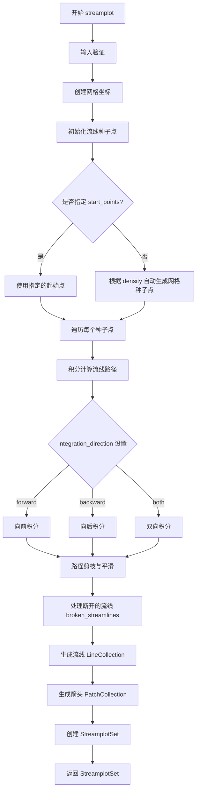

#### 带注释源码

```python
# 示例代码展示 ax.streamplot 的典型用法
# 导入必要的库
import numpy as np
import matplotlib.pyplot as plt

# 定义向量场参数
w = 3
# 创建网格坐标 - 使用 mgrid 生成 -w 到 w 范围内的 100 个点
Y, X = np.mgrid[-w:w:100j, -w:w:100j]

# 定义二维向量场 U 和 V
# U = -1 - X**2 + Y （x 方向分量）
# V = 1 + X - Y**2 （y 方向分量）
U = -1 - X**2 + Y
V = 1 + X - Y**2

# 计算向量场速度大小（用于线宽和颜色映射）
speed = np.sqrt(U**2 + V**2)

# 创建图形和子图
fig, axs = plt.subplots(4, 2, figsize=(7, 12), height_ratios=[1, 1, 1, 2])
axs = axs.flat

# 示例1: 沿流线变化密度
# density=[0.5, 1] 表示 x 方向密度为 0.5，y 方向密度为 1
axs[0].streamplot(X, Y, U, V, density=[0.5, 1])
axs[0].set_title('Varying Density')

# 示例2: 沿流线变化颜色
# color=U 表示颜色沿流线变化，使用 U 的值作为颜色映射依据
# cmap='autumn' 使用 autumn 颜色映射
# linewidth=2 设置流线宽度
strm = axs[1].streamplot(X, Y, U, V, color=U, linewidth=2, cmap='autumn')
fig.colorbar(strm.lines)  # 添加颜色条
axs[1].set_title('Varying Color')

# 示例3: 沿流线变化线宽
# 根据速度归一化后乘以 5 作为线宽
lw = 5*speed / speed.max()
axs[2].streamplot(X, Y, U, V, density=0.6, color='k', linewidth=lw, num_arrows=5)
axs[2].set_title('Varying Line Width')

# 示例4: 控制流线起始点
# 定义种子点坐标数组，shape 为 (2, N) 或 (N, 2)
seed_points = np.array([[-2, -1, 0, 1, 2, -1], [-2, -1, 0, 1, 2, 2]])
# 使用 start_points 参数指定起始位置
strm = axs[3].streamplot(X, Y, U, V, color=U, linewidth=2,
                         cmap='autumn', start_points=seed_points.T)
fig.colorbar(strm.lines)
axs[3].set_title('Controlling Starting Points')
# 标记起始点位置
axs[3].plot(seed_points[0], seed_points[1], 'bo')
axs[3].set(xlim=(-w, w), ylim=(-w, w))

# 示例5: 在每个流线上添加多个箭头
axs[4].streamplot(X, Y, U, V, num_arrows=3)
axs[4].set_title('Multiple arrows')

# 示例6: 处理 masked 区域和 NaN 值
# 创建掩码数组
mask = np.zeros(U.shape, dtype=bool)
mask[40:60, 40:60] = True  # 标记中间区域为掩码
U[:20, :20] = np.nan  # 设置部分数据为 NaN
# 使用 masked array 处理掩码
U = np.ma.array(U, mask=mask)
axs[6].streamplot(X, Y, U, V, color='r')
axs[6].set_title('Streamplot with Masking')
# 显示掩码区域
axs[6].imshow(~mask, extent=(-w, w, -w, w), alpha=0.5, cmap='gray',
              aspect='auto')
axs[6].set_aspect('equal')

# 示例7: 使用 unbroken_streamlines 保持流线连续
# broken_streamlines=False 强制流线连续，即使超出网格单元限制
axs[7].streamplot(X, Y, U, V, broken_streamlines=False)
axs[7].set_title('Streamplot with unbroken streamlines')

plt.tight_layout()
plt.show()

# 示例8: 调整积分参数影响流线精度
# integration_max_step_scale 控制最大步长
# integration_max_error_scale 控制误差容忍度
# 值越小，流线越精确但计算越慢
for max_val in [0.05, 1, 5]:
    ax_curr.streamplot(
        x, y, vx, vy,
        start_points=seed_pts,
        broken_streamlines=False,
        arrowsize=1e-10,
        linewidth=2,
        color="k",
        integration_max_step_scale=max_val,
        integration_max_error_scale=max_val,
    )
```


### Axes.set_title

设置坐标轴的标题，用于为图表添加描述性标题。

参数：

- `s`：`str`，要设置的标题文本内容
- `loc`：`{'center', 'left', 'right'}`，标题的水平对齐方式，默认为'center'
- `pad`：`float`，标题与坐标轴顶部的距离（以points为单位），默认为None
- `fontsize`：`int` 或 `str`，标题字体大小，默认为rcParams中的fontsize
- `fontweight`：`str`，标题字体粗细程度，默认为'normal'
- `fontfamily`：`str`，标题字体系列，默认为None
- `fontstyle`：`str`，标题字体样式，默认为'normal'
- `color`：`str` 或 `tuple`，标题文字颜色
- `verticalalignment`：`str`，标题垂直对齐方式

返回值：`matplotlib.text.Text`，返回创建的Text对象，可以用于后续的样式修改

#### 流程图

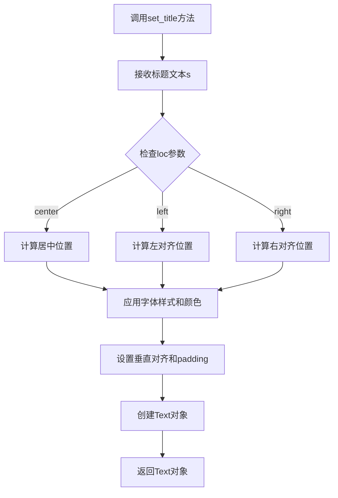

#### 带注释源码

```python
# 示例代码来自matplotlib库
def set_title(self, s, loc='center', pad=None, fontsize=None, 
              fontweight=None, fontfamily=None, fontstyle=None,
              color=None, verticalalignment='normal', **kwargs):
    """
    设置axes的标题
    
    参数:
    s: str - 标题文本
    loc: str - 标题位置 ('center', 'left', 'right')
    pad: float - 标题与顶部的距离
    fontsize: int - 字体大小
    fontweight: str - 字体粗细
    fontfamily: str - 字体系列
    fontstyle: str - 字体样式
    color: str - 文字颜色
    verticalalignment: str - 垂直对齐方式
    
    返回:
    Text - 返回创建的Text对象
    """
    # 获取默认的标题位置偏移
    if pad is None:
        pad = self._fontsize_padding  # 默认padding
    
    # 根据loc参数确定水平对齐方式
    if loc == 'left':
        ha = 'left'
        x = 0
    elif loc == 'right':
        ha = 'right'
        x = 1
    else:  # center
        ha = 'center'
        x = 0.5
    
    # 创建Text对象，设置标题文本和位置
    title = Text(
        x=x, y=1.0, text=s,
        fontsize=fontsize, fontweight=fontweight,
        fontfamily=fontfamily, fontstyle=fontstyle,
        color=color, verticalalignment=verticalalignment,
        horizontalalignment=ha,
        transform=self.transAxes,  # 使用axes坐标系统
        pad=pad  # 设置padding
    )
    
    # 将标题添加到axes中
    self._add_text(author=self, text_obj=title)
    
    return title
```

#### 在示例代码中的使用

```python
# 代码中的实际调用示例
axs[0].set_title('Varying Density')  # 设置第一个子图的标题
axs[1].set_title('Varying Color')    # 设置第二个子图的标题
axs[2].set_title('Varying Line Width')  # 设置第三个子图的标题
axs[3].set_title('Controlling Starting Points')  # 设置第四个子图的标题
axs[4].set_title('Multiple arrows')  # 设置第五个子图的标题
axs[6].set_title('Streamplot with Masking')  # 设置第七个子图的标题
axs[7].set_title('Streamplot with unbroken streamlines')  # 设置第八个子图的标题
```


### `ax.set`

设置轴的属性，如轴范围、标签、标题等。该方法是Matplotlib中Axes对象的通用属性设置方法，支持同时设置多个属性。

参数：

- `**kwargs`：关键字参数，用于设置Axes的多个属性，如`xlim`、`ylim`、`title`、`xlabel`、`ylabel`等。

返回值：`matplotlib.artist.Artist`，返回self，支持链式调用。

#### 流程图

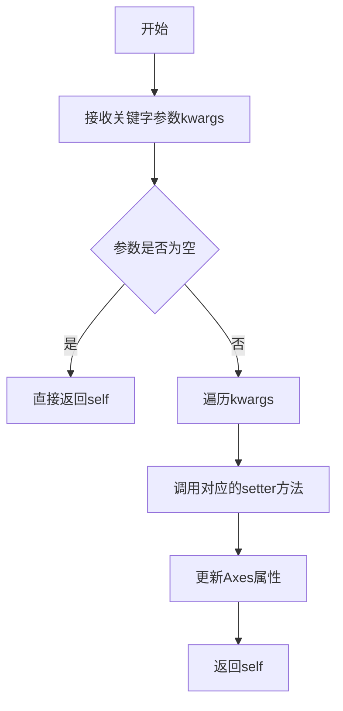

#### 带注释源码

```python
# 在示例代码中的使用方式：
axs[3].set(xlim=(-w, w), ylim=(-w, w))

# 参数说明：
# xlim: tuple, 设置x轴的范围，格式为(xmin, xmax)
# ylim: tuple, 设置y轴的范围，格式为(ymin, ymax)
# w: 变量，在示例中w=3，所以实际设置为xlim=(-3, 3), ylim=(-3, 3)

# 其他常见的set方法调用示例：
axs[0].set_title('Varying Density')  # 设置子图标题
ax_curr.set_aspect("equal")           # 设置坐标轴纵横比
ax_ins.set_xlim(-1.2, -0.7)           # 设置x轴范围
ax_ins.set_ylim(-0.8, -0.4)           # 设置y轴范围
ax_ins.set_yticks(())                 # 设置y轴刻度为空
ax_ins.set_xticks(())                 # 设置x轴刻度为空
```


### `matplotlib.axes.Axes.streamplot`

在二维坐标系中绘制流线图（streamplot），用于可视化二维向量场。该函数通过从种子点沿给定向量场进行积分来计算流线，并支持多种自定义选项，如流线密度、颜色、线宽、箭头数量等。

参数：

-   `X`：`np.ndarray` 或 `np.mgrid`，网格的 x 坐标
-   `Y`：`np.ndarray` 或 `np.mgrid`，网格的 y 坐标
-   `U`：`np.ndarray`，向量场的 x 分量
-   `V`：`np.ndarray`，向量场的 y 分量
-   `density`：`float` 或 `list`，流线密度，控制线条的疏密程度
-   `linewidth`：`float` 或 `np.ndarray`，流线宽度
-   `color`：`str` 或 `np.ndarray`，流线颜色
-   `cmap`：`str`，颜色映射名称
-   `arrowsize`：`float`，箭头大小
-   `start_points`：`np.ndarray`，流线起始点坐标
-   `num_arrows`：`int`，每条流线上的箭头数量
-   `broken_streamlines`：`bool`，是否允许流线断开
-   `integration_max_step_scale`：`float`，积分最大步长缩放因子
-   `integration_max_error_scale`：`float`，积分最大误差缩放因子

返回值：`matplotlib.collections.PolyCollection`，包含流线（lines）和箭头（arrows）的集合对象

#### 流程图

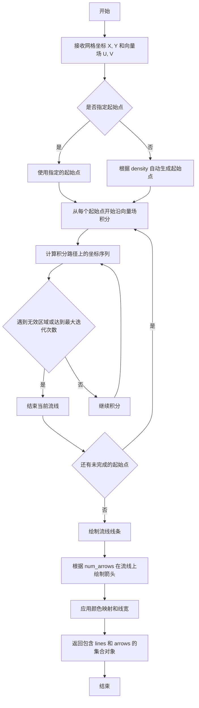

#### 带注释源码

```python
# 调用示例（来自代码中的实际使用）
# 示例1：变化的密度
axs[0].streamplot(X, Y, U, V, density=[0.5, 1])

# 示例2：沿流线变化颜色
strm = axs[1].streamplot(X, Y, U, V, color=U, linewidth=2, cmap='autumn')

# 示例3：沿流线变化线宽
lw = 5*speed / speed.max()
axs[2].streamplot(X, Y, U, V, density=0.6, color='k', linewidth=lw, num_arrows=5)

# 示例4：控制流线起始点
seed_points = np.array([[-2, -1, 0, 1, 2, -1], [-2, -1, 0, 1, 2, 2]])
strm = axs[3].streamplot(X, Y, U, V, color=U, linewidth=2,
                         cmap='autumn', start_points=seed_points.T)

# 示例5：带掩码的流线图
mask = np.zeros(U.shape, dtype=bool)
mask[40:60, 40:60] = True
U = np.ma.array(U, mask=mask)
axs[6].streamplot(X, Y, U, V, color='r')

# 示例6：连续不断的流线
axs[7].streamplot(X, Y, U, V, broken_streamlines=False)

# 示例7：控制积分精度
ax_curr.streamplot(
    x, y, vx, vy,
    start_points=seed_pts,
    broken_streamlines=False,
    arrowsize=1e-10,
    linewidth=2 if is_inset else 0.6,
    color="k",
    integration_max_step_scale=max_val,  # 控制积分最大步长
    integration_max_error_scale=max_val,  # 控制积分最大误差
)
```


### `Axes.imshow`

显示图像到当前的Axes对象中。该方法将2D数组或图像数据渲染为彩色网格图，支持多种参数来控制显示效果，如颜色映射、透明度、坐标范围等。

参数：

- `X`：参数类型：array-like or PIL image，要显示的数据或图像
- `cmap`：参数类型：str or Colormap, optional，颜色映射名称或Colormap对象
- `norm`：参数类型：Normalize, optional，数据归一化方法
- `aspect`：参数类型：{'auto', 'equal'} or float, optional，控制轴的纵横比
- `interpolation`：参数类型：str, optional，插值方法（如'bilinear', 'nearest'等）
- `alpha`：参数类型：float, optional，透明度（0-1之间）
- `vmin, vmax`：参数类型：float, optional，颜色映射的最小/最大值
- `origin`：参数类型：{'upper', 'lower'}, optional，图像原点位置
- `extent`：参数类型：tuple, optional，数据坐标范围(left, right, bottom, top)
- `filternorm`：参数类型：bool, optional，是否归一化滤波器
- `resample`：参数类型：bool, optional，是否重采样
- `url`：参数类型：str, optional，为图像设置URL
- `data`：参数类型：indexed, optional，数据索引

返回值：`matplotlib.image.AxesImage`，返回创建的AxesImage对象，可用于颜色条(colorbar)等后续操作

#### 流程图

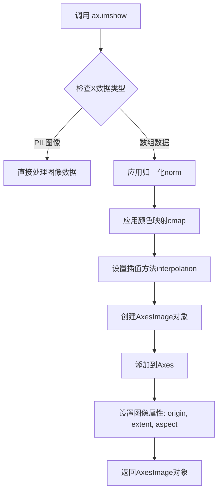

#### 带注释源码

```python
# 在提供的代码中的实际调用示例:
# axs[6] 是子图中的第7个Axes对象

# 显示掩码的反转(~mask)作为灰度图像
axs[6].imshow(
    ~mask,              # 要显示的数据: 布尔数组的反转 (True->False, False->True)
    extent=(-w, w, -w, w),  # 数据坐标范围: x从-3到3, y从-3到3
    alpha=0.5,          # 透明度: 50% (使背景部分透明以便看到下方的streamplot)
    cmap='gray',       # 颜色映射: 灰度色图 (True=白色, False=黑色)
    aspect='auto'     # 纵横比: 自动调整 (不强制正方形像素)
)

# 完整的方法签名 (参考matplotlib官方文档):
# Axes.imshow(X, cmap=None, norm=None, aspect=None, interpolation=None,
#             alpha=None, vmin=None, vmax=None, origin=None, extent=None,
#             filternorm=True, resample=None, url=None, *, data=None, **kwargs)
#
# 常用参数说明:
# - X: 2D数组(灰度)或3D数组(RGB/RGBA)
# - cmap: 颜色映射, 如'viridis', 'plasma', 'gray', 'jet'等
# - norm: matplotlib.colors.Normalize实例, 控制数据到colormap的映射
# - aspect: 'equal'保持像素比例, 'auto'自动调整
# - interpolation: 'nearest', 'bilinear', 'bicubic'等
# - alpha: 透明度, 0-1之间的浮点数
# - vmin/vmax: 配合norm使用, 指定colormap的数据范围
# - extent: (left, right, bottom, top) 定义数据坐标
#
# 返回值: AxesImage对象
# - 可用于 fig.colorbar() 添加颜色条
# - 可通过 get_array() 获取图像数据
# - 可通过 set_clim() 设置颜色范围
```


### `Axes.fill`

填充由x和y坐标数组定义的多边形区域。该方法是matplotlib中Axes类的方法，用于在Axes对象上绘制填充的多边形或多个多边形。

参数：

- `*args`：可变长度参数，支持多种输入格式，如 `(x, y)` 或 `(x, y, color)` 或 `(x1, y1, c1, x2, y2, c2, ...)`
  - 类型：数组或颜色字符串
  - 描述：多边形的顶点坐标或坐标与颜色的组合
- `color`：填充颜色
  - 类型：颜色字符串或颜色码（如"w"表示白色）
  - 描述：多边形的填充颜色
- `alpha`：透明度
  - 类型：浮点数（0-1之间）
  - 描述：填充颜色的透明度
- `ec`：轮廓颜色（edgecolor的简写）
  - 类型：颜色字符串或颜色码（如"k"表示黑色）
  - 描述：多边形边框的颜色
- `lw`：线宽（linewidth的简写）
  - 类型：数值
  - 描述：多边形边框的线条宽度
- `**kwargs`：其他关键字参数
  - 类型：字典
  - 描述：传递给matplotlib.patches.Polygon的其他属性

返回值：`matplotlib.collections.PolyCollection`
  - 返回填充的多边形集合对象，可用于进一步操作（如设置颜色映射等）

#### 流程图

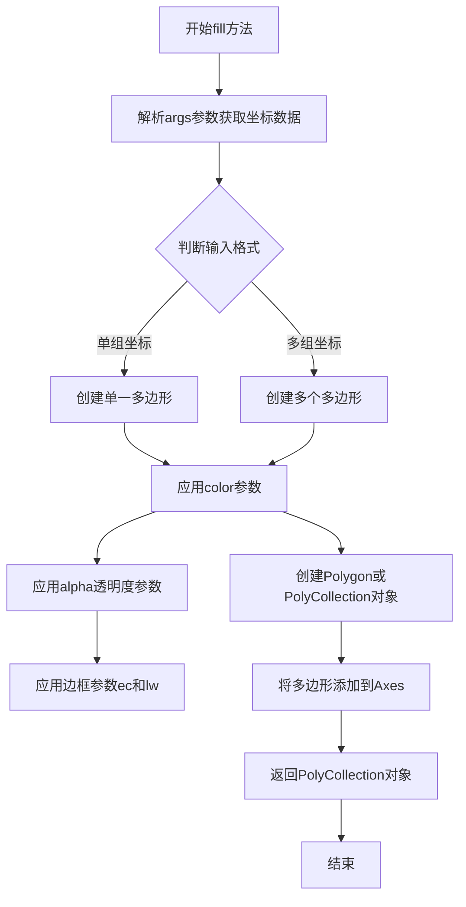

#### 带注释源码

```python
# 代码中ax_curr.fill的实际调用示例
ax_curr.fill(
    np.cos(th_circ),    # x坐标：圆周上各点的余弦值，生成圆形轮廓的x坐标
    np.sin(th_circ),    # y坐标：圆周上各点的正弦值，生成圆形轮廓的y坐标
    color="w",          # 填充颜色：白色（white的简写）
    ec="k",             # 边框颜色：黑色（edgecolor='black'的简写）
    lw=6 if is_inset else 2  # 边框线宽：如果是插入图则6，否则为2
)

# fill方法的典型签名和参数说明（来源：matplotlib文档）
# def fill(self, *args, color=None, alpha=None, **kwargs):
#     
#     参数说明：
#     - *args: 可变参数，支持以下格式：
#       * fill(x, y) - 单个多边形
#       * fill(x, y, color) - 带颜色的单多边形
#       * fill(x1, y1, x2, y2, ...) - 多个多边形
#       * fill(x1, y1, c1, x2, y2, c2, ...) - 多个带颜色的多边形
#     
#     - color: 多边形的填充颜色
#     - alpha: 透明度（0完全透明，1完全不透明）
#     - **kwargs: 传递给Polygon的属性，如：
#       * edgecolor/ec: 边框颜色
#       * linewidth/lw: 边框线宽
#       * facecolor/fc: 填充颜色（同color）
#       * hatch: 阴影图案
#       * zorder: 绘制顺序
#     
#     返回值：
#     - PolyCollection: 包含所有填充多边形的集合对象
#
# 工作原理：
# 1. 解析输入的坐标数据，创建Polygon对象
# 2. 应用颜色、透明度等样式属性
# 3. 将多边形添加到当前Axes的artists列表中
# 4. 返回PolyCollection对象用于后续操作
```


### `ax.inset_axes`

创建插图轴（Inset Axes），用于在主图表中嵌入一个较小的子图表区域，以便展示细节或局部放大图。

参数：

- `rect`：`list` 或 `tuple`，指定插图在父轴中的位置和大小，格式为 `[left, bottom, width, height]`，所有值均为相对于父轴尺寸的比例（0到1之间）
- `projection`：`str`，可选参数，指定投影类型，默认为父轴的投影类型
- `polar`：`bool`，可选参数，是否使用极坐标投影
- `axes_class`：可选参数，指定使用的 Axes 类

返回值：`matplotlib.axes.Axes`，返回新创建的插图轴对象

#### 流程图

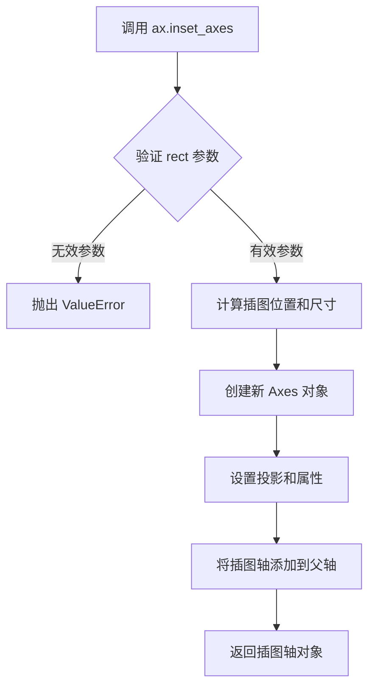

#### 带注释源码

```python
# 在代码中的调用示例
ax_ins = ax.inset_axes([0.0, 0.7, 0.3, 0.35])
# 参数说明：
# [0.0, 0.7, 0.3, 0.35] 分别表示：
# - left: 0.0   (从父轴左侧开始)
# - bottom: 0.7 (从父轴底部向上70%处开始)
# - width: 0.3  (宽度为父轴宽度的30%)
# - height: 0.35 (高度为父轴高度的35%)
# 返回的 ax_ins 是一个新的 Axes 对象，可以在其上绘制图表
```


### `Axes.text`

在 matplotlib 中，`Axes.text` 是 Axes 类的一个方法，用于在 Axes 坐标系中的指定位置添加文本标签。该方法创建并返回一个 `matplotlib.text.Text` 对象，允许用户自定义文本的字体、大小、颜色、对齐方式等属性。

参数：

- `x`：`float`，文本在 Axes 坐标系中的 x 坐标位置
- `y`：`float`，文本在 Axes 坐标系中的 y 坐标位置
- `s`：`str`，要显示的文本内容
- `fontdict`：`dict`，可选，用于统一设置文本属性的字典，默认值为 None
- `**kwargs`：可变关键字参数，接受 `matplotlib.text.Text` 的所有属性，如 `fontsize`、`color`、`ha`（水平对齐）、`va`（垂直对齐）、`rotation` 等

返回值：`matplotlib.text.Text`，返回创建的 Text 对象，可用于后续进一步自定义或获取文本位置信息

#### 流程图

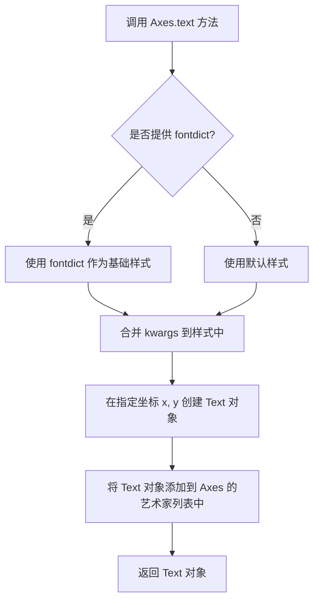

#### 带注释源码

```python
# 代码中的实际调用示例
ax.text(0.0, 0.0, text, ha="center", va="center")

# 参数说明：
# 0.0      -> x: 文本的 x 坐标（相对于 Axes 坐标系）
# 0.0      -> y: 文本的 y 坐标（相对于 Axes 坐标系）
# text     -> s: 要显示的文本内容（这里是一个格式化的字符串）
# ha="center" -> kwargs: 水平对齐方式为居中
# va="center" -> kwargs: 垂直对齐方式为居中

# 上述调用等同于使用以下完整的参数形式：
# ax.text(x=0.0, y=0.0, s=text, fontdict=None, ha="center", va="center")
```


### Axes.set_xlim / Axes.set_ylim

设置 Axes 对象的 x 轴或 y 轴显示范围，用于控制坐标轴的最小值和最大值。

参数：

- `left` / `bottom`：`float` 或 `int`，x 轴左边界 / y 轴下边界
- `right` / `top`：`float` 或 `int`，x 轴右边界 / y 轴上边界
- `emit`：`bool`，默认 `True`，是否通知观察者范围已更改
- `auto`：`bool`，默认 `False`，是否启用自动缩放
- `xmin` / `ymin`：`float`（已弃用），x 轴 / y 轴最小值
- `xmax` / `ymax`：`float`（已弃用），x 轴 / y 轴最大值

返回值：`list`，返回 `[left, right]` 或 `[bottom, top]`

#### 流程图

```mermaid
flowchart TD
    A[调用 set_xlim/set_ylim] --> B{参数验证}
    B -->|left/right 或 bottom/top| C[确保 left < right / bottom < top]
    B -->|xmin/xmax 已弃用| D[发出弃用警告]
    C --> E[更新 _xlim/_ylim 私有属性]
    E --> F{emit == True?}
    F -->|是| G[通知观察者/触发回调]
    F -->|否| H[直接返回新范围]
    G --> H
    H --> I[返回 [min, max] 列表]
```

#### 带注释源码

```python
def set_xlim(self, left=None, right=None, emit=False, auto=False, *, xmin=None, xmax=None):
    """
    设置 axes 的 x 范围.
    
    Parameters
    ----------
    left : float, optional
        x 轴左边界.
    right : float, optional
        x 轴右边界.
    emit : bool, default: False
        是否通知观察者范围已更改.
    auto : bool, default: False
        是否允许自动调整.
    xmin, xmax : float, optional
        已弃用, 使用 left 和 right 代替.
    
    Returns
    -------
    left, right : tuple
        新的 x 轴范围.
    """
    if xmin is not None:
        warnings.warn("Use 'left' instead of 'xmin'.", DeprecationWarning,
                      stacklevel=2)
        if left is None:
            left = xmin
    if xmax is not None:
        warnings.warn("Use 'right' instead of 'xmax'.", DeprecationWarning,
                      stacklevel=2)
        if right is None:
            right = xmax
    
    # 确保 left < right
    if left is not None and right is not None:
        if left > right:
            raise ValueError(
                f'xmin must be less than or equal to xmax, but got '
                f'left={left} > right={right}')
    
    # 获取当前范围
    old = self.get_xlim()
    
    # 设置新范围
    if left is None:
        left = old[0]
    if right is None:
        right = old[1]
    
    # 更新私有属性
    self._xlim = (left, right)
    
    # 通知观察者
    if emit:
        self._axview.callbacks.process('xlim_changed', self._axview)
    
    return self._xlim


def set_ylim(self, bottom=None, top=None, emit=False, auto=False, *, ymin=None, ymax=None):
    """
    设置 axes 的 y 范围.
    
    Parameters
    ----------
    bottom : float, optional
        y 轴下边界.
    top : float, optional
        y 轴上边界.
    emit : bool, default: False
        是否通知观察者范围已更改.
    auto : bool, default: False
        是否允许自动调整.
    ymin, ymax : float, optional
        已弃用, 使用 bottom 和 top 代替.
    
    Returns
    -------
    bottom, top : tuple
        新的 y 轴范围.
    """
    if ymin is not None:
        warnings.warn("Use 'bottom' instead of 'ymin'.", DeprecationWarning,
                      stacklevel=2)
        if bottom is None:
            bottom = ymin
    if ymax is not None:
        warnings.warn("Use 'top' instead of 'ymax'.", DeprecationWarning,
                      stacklevel=2)
        if top is None:
            top = ymax
    
    # 确保 bottom < top
    if bottom is not None and top is not None:
        if bottom > top:
            raise ValueError(
                f'ymin must be less than or equal to ymax, but got '
                f'bottom={bottom} > top={top}')
    
    # 获取当前范围
    old = self.get_ylim()
    
    # 设置新范围
    if bottom is None:
        bottom = old[0]
    if top is None:
        top = old[1]
    
    # 更新私有属性
    self._ylim = (bottom, top)
    
    # 通知观察者
    if emit:
        self._axview.callbacks.process('ylim_changed', self._axview)
    
    return self._ylim
```


### `Axes.set_xticks` / `Axes.set_yticks`

设置x轴或y轴的刻度位置。这是matplotlib中用于控制坐标轴刻度的核心方法，在提供的streamplot示例中用于设置刻度线。

参数：

- `ticks`：`array_like`，刻度位置的数组，指定刻度应该出现的位置
- `labels`：`array_like`，可选参数，刻度标签文本，默认为None使用数值作为标签
- `**kwargs`：其他关键字参数，传递给`Tick`对象的属性设置（如`fontsize`、`rotation`等）

返回值：`list`，返回创建的`Tick`对象列表

#### 流程图

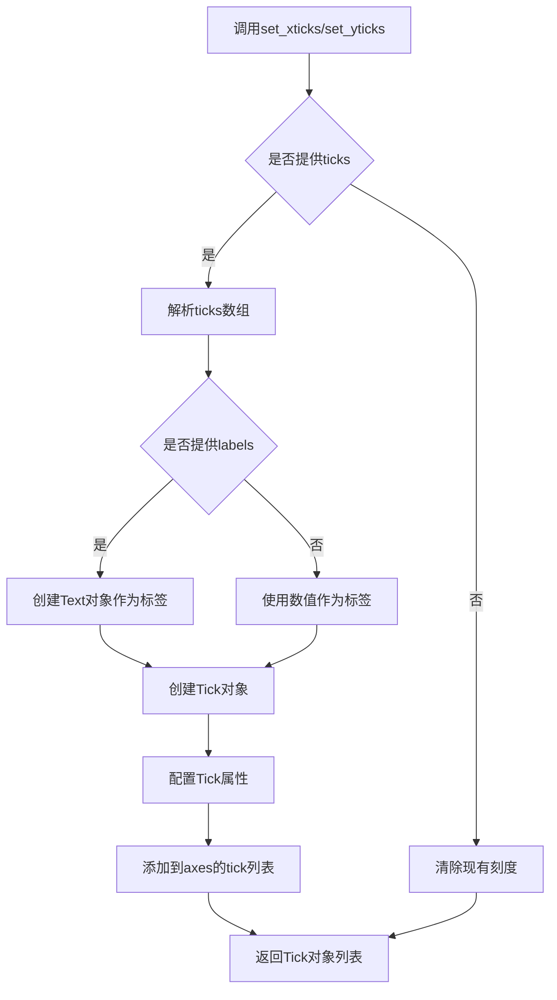

#### 带注释源码

```python
def set_xticks(self, ticks, labels=None, **kwargs):
    """
    设置x轴的刻度位置和可选的刻度标签。
    
    参数:
        ticks: 刻度位置的数组
        labels: 可选的刻度标签
        **kwargs: 传递给Tick的属性
    
    返回:
        刻度对象列表
    """
    # 获取x轴
    xaxis = self.xaxis
    # 设置刻度位置
    xaxis.set_ticks(ticks, labels=labels, **kwargs)
    # 返回创建的刻度对象
    return xaxis.get_major_ticks()


def set_yticks(self, ticks, labels=None, **kwargs):
    """
    设置y轴的刻度位置和可选的刻度标签。
    
    参数:
        ticks: 刻度位置的数组
        labels: 可选的刻度标签
        **kwargs: 传递给Tick的属性
    
    返回:
        刻度对象列表
    """
    # 获取y轴
    yaxis = self.yaxis
    # 设置刻度位置
    yaxis.set_ticks(ticks, labels=labels, **kwargs)
    # 返回创建的刻度对象
    return yaxis.get_major_ticks()
```

在提供的代码中的实际使用示例：

```python
# 示例1：设置x轴和y轴的显示范围，同时清除刻度标签
ax_ins.set_xticks(())
ax_ins.set_yticks(())

# 示例2：设置刻度范围
ax.set_ylim(-1.5, 1.5)
```

这些调用分别位于代码的第163-164行和第193行，用于在嵌入图中隐藏刻度标签或设置坐标轴范围。


### `ax.indicate_inset_zoom`

该方法用于在父 Axes 上标记一个缩放区域，通常与插入的缩放 Axes（inset axes）配合使用，以可视化地指示主图中被放大的区域。在代码中，它被用于展示流线图的不同积分参数效果，通过矩形边框和连接线突出缩放区域。

参数：

- `ax_ins`：`matplotlib.axes.Axes`，表示插入的缩放区域轴对象，即主轴中被放大的子区域。
- `ec`：`str`，边框颜色（edge color），在代码中设置为 `"k"`（黑色），用于增强可视性。
- `**kwargs`：可选参数，如 `linewidth`、`linestyle` 等，用于定制边框样式，代码中未显式指定，使用默认值。

返回值：元组 `(zoomed_axis_inset_patch, zoomed_axis_inset_line)`，包含两个 Patch 对象：矩形边框和连接线，用于在主 Axes 上绘制缩放指示。

#### 流程图

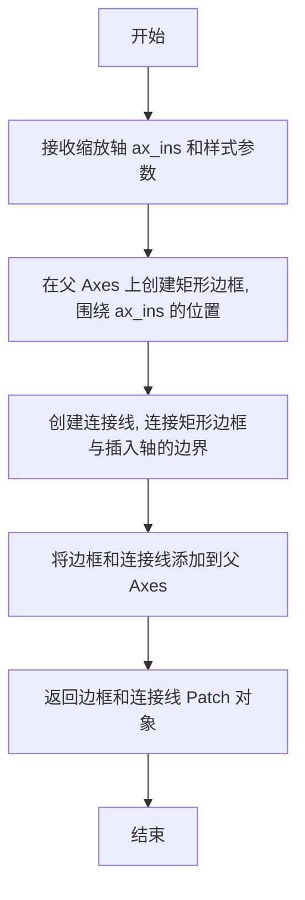

#### 带注释源码

```python
# 在主轴 ax 上标记插入轴 ax_ins 的缩放区域
# ax: 主 Axes 对象, 包含流线图
# ax_ins: 插入的 Axes 对象, 显示放大的区域
# ec='k': 设置边框颜色为黑色 (edge color)
ax.indicate_inset_zoom(ax_ins, ec="k")
```


### `fig.colorbar`

为图形添加颜色条（colorbar），用于显示流线图中颜色所代表的数值映射关系。

参数：

- `mappable`：`matplotlib.cm.ScalarMappable`，需要添加颜色条的可映射对象（如 `streamplot` 返回的 `LineCollection`）
- `cax`：`matplotlib.axes.Axes`，可选，自定义放置颜色条的 Axes
- `ax`：`matplotlib.axes.Axes` 或 `array` of Axes，可选，从指定的 Axes 推断颜色条位置
- `use_gridspec`：`bool`，可选，是否使用 GridSpec 布局（默认 True）
- `**kwargs`：其他关键字参数，传递给 `Colorbar` 构造函数（如 `orientation`、`shrink`、`aspect` 等）

返回值：`matplotlib.colorbar.Colorbar`，返回创建的 Colorbar 对象

#### 流程图

```mermaid
flowchart TD
    A[调用 fig.colorbar] --> B{指定 cax?}
    B -->|是| C[使用指定的 cax]
    B -->|否| D{指定 ax?}
    D -->|是| E[从 ax 推断位置]
    D -->|否| F[使用当前活动的 axes]
    C --> G[创建 ScalarMappable 如果未提供]
    G --> H[创建 Colorbar 实例]
    H --> I[渲染颜色条]
    I --> J[返回 Colorbar 对象]
```

#### 带注释源码

```python
# 在示例代码中的实际使用：
# 第一次使用 - 为第一条流线图添加颜色条
strm = axs[1].streamplot(X, Y, U, V, color=U, linewidth=2, cmap='autumn')
# strm.lines 是 LineCollection 对象，实现了 ScalarMappable 接口
fig.colorbar(strm.lines)
axs[1].set_title('Varying Color')

# 第二次使用 - 为第二条流线图添加颜色条
strm = axs[3].streamplot(X, Y, U, V, color=U, linewidth=2,
                         cmap='autumn', start_points=seed_points.T)
fig.colorbar(strm.lines)
axs[3].set_title('Controlling Starting Points')

# fig.colorbar 的底层调用逻辑简化版：
def colorbar(self, mappable, cax=None, ax=None, use_gridspec=True, **kwargs):
    """
    为图形添加颜色条
    
    Parameters:
        mappable: ScalarMappable 对象（如 contour、image、streamplot lines 等）
        cax: 指定的颜色条 axes
        ax: 源 axes，用于确定颜色条位置
        use_gridspec: 是否使用 gridspec 布局
    """
    # 如果没有指定 cax，则从 ax 或当前 axes 推断布局
    if cax is None:
        if ax is None:
            ax = self.gca()
        # 使用 GridSpec 或 divider 计算颜色条位置
        if use_gridspec:
            # ... 使用 GridSpec 布局逻辑
            cax = self.add_subplot(gs[-1, -1])  # 示例
        else:
            # ... 使用 make_axes 布局逻辑
    
    # 创建 Colorbar 对象
    cb = Colorbar(cax, mappable, **kwargs)
    
    # 将颜色条添加到图形
    self._axstack.bubble(cax)
    
    return cb
```


### plt.tight_layout

调整子图布局参数，使子图之间没有重叠，并自动处理图形边缘的间距。

参数：
- **pad**：`float`，可选参数，子图边缘与图形边缘之间的间距（以英寸为单位），默认值为 1.08。
- **h_pad**：`float`，可选参数，子图之间的垂直间距，默认值为 `pad`。
- **w_pad**：`float`，可选参数，子图之间的水平间距，默认值为 `pad`。

返回值：`None`，该函数直接修改图形布局，不返回任何值。

#### 流程图

```mermaid
flowchart TD
    A[调用 plt.tight_layout] --> B[获取当前图形和子图]
    B --> C{是否存在子图?}
    C -->|是| D[计算子图间距]
    C -->|否| E[不进行任何操作]
    D --> F[应用间距到子图]
    F --> G[调整子图大小避免重叠]
    G --> H[设置子图与图形边缘的间距]
    H --> I[重新渲染图形]
    E --> I
```

#### 带注释源码

```python
# tight_layout 函数源码分析（matplotlib/figure.py）

def tight_layout(self, pad=1.08, h_pad=None, w_pad=None):
    """
    自动调整子图布局参数，使子图之间没有重叠。
    
    参数:
        pad (float): 子图边缘与图形边缘之间的间距（英寸）
        h_pad (float): 子图之间的垂直间距（英寸）
        w_pad (float): 子图之间的水平间距（英寸）
    
    返回值:
        None
    """
    
    # 1. 获取当前图形对象
    current_figure = plt.gcf()
    
    # 2. 获取所有子图
    subplots = current_figure.get_axes()
    
    # 3. 如果没有子图，直接返回
    if not subplots:
        return
    
    # 4. 计算子图之间的间距
    # 根据 pad、h_pad、w_pad 参数计算合适的间距
    
    # 5. 调整每个子图的位置和大小
    # 确保子图之间不会重叠
    
    # 6. 应用新的布局参数
    # 调用底层的布局引擎进行实际调整
    
    # 7. 标记图形需要重新渲染
    current_figure.stale = True
```

#### 详细说明

`plt.tight_layout()` 是 matplotlib 中用于优化子图布局的重要函数，其主要功能包括：

1. **自动计算间距**：根据用户提供的 `pad`、`h_pad`、`w_pad` 参数自动计算子图之间的最小间距。

2. **避免重叠**：确保各个子图之间不会发生重叠现象。

3. **边缘处理**：自动处理子图与图形边缘之间的距离，使整体布局更加美观。

4. **响应式调整**：当图形大小改变时，需要重新调用此函数以保持良好的布局效果。

#### 潜在的技术债务和优化空间

1. **手动调用需求**：用户需要在每次修改子图后手动调用此函数，可以考虑添加自动布局模式。

2. **固定间距**：当前的间距计算是固定的，无法根据子图内容的复杂程度动态调整。

3. **性能考虑**：在大型图形和大量子图时，布局计算可能较慢，可以考虑缓存优化。

#### 使用示例中的上下文

在给定的代码中，`plt.tight_layout()` 被调用了两次：

1. 第一次在创建 4x2 子图网格后，用于调整流线图示例的布局。
2. 第二次在创建 3x1 子图网格后，用于调整圆柱绕流示例的布局。

这表明该函数是 matplotlib 图形布局管理的标准工具，确保子图元素不会相互遮挡，并保持适当的视觉间距。


### `plt.show`

`plt.show` 是 Matplotlib 库中的核心显示函数，负责将所有当前已创建的图形窗口呈现给用户，并进入交互式显示模式（具体行为取决于所使用的后端，如 TkAgg、Qt5Agg 等）。

参数：此函数无任何参数。

返回值：`None`，该函数不返回任何值。

#### 流程图

```mermaid
flowchart TD
    A[开始 plt.show] --> B{是否有打开的图形?}
    B -->|否| C[不进行任何操作]
    B -->|是| D[调用后端的显示方法]
    D --> E{后端类型}
    E -->|交互式后端| F[显示图形窗口并进入事件循环]
    E -->|非交互式后端| G[渲染图形到输出设备]
    F --> H[等待用户交互]
    G --> I[关闭或保持图形状态]
    H --> J[用户关闭图形窗口]
    I --> K[结束]
    J --> K
```

#### 带注释源码

```python
# plt.show() 源代码位于 matplotlib/pyplot.py 中，简化表示如下：

def show():
    """
    显示所有打开的图形窗口。
    
    对于交互式后端（如 Qt、Tkinter），此函数会阻塞程序执行，
    直至用户关闭所有图形窗口。
    对于非交互式后端（如 Agg），会将图形写入指定的输出目标。
    """
    for manager in Gcf.get_all_figManagers():
        # 获取所有图形管理器
        manager.show()
        
        # 对于交互式后端，会进入事件循环
        # manager.canvas.draw()  # 强制重绘
        # manager.canvas.flush_events()  # 处理待处理事件
```

#### 关键组件信息

| 组件名称 | 一句话描述 |
|---------|-----------|
| `matplotlib.pyplot` | Matplotlib 的 MATLAB 风格绘图接口模块 |
| `FigureManager` | 图形窗口管理器，负责窗口的创建、显示和销毁 |
| `Canvas` | 绘图画布，承载实际的图形渲染 |
| `Backend` | 渲染后端，不同后端决定图形的显示方式（如 Qt、Tk、Agg） |

#### 潜在的技术债务或优化空间

1. **阻塞行为不一致**：不同后端对 `plt.show()` 的阻塞行为不同（有些立即返回，有些阻塞），可能导致跨平台代码行为不一致。
2. **缺乏超时机制**：无法设置显示图形的超时时间，不适合在无头环境（headless server）中使用。
3. **状态管理隐式**：依赖全局状态（Gcf 管理器），不易进行单元测试。

#### 其它项目

- **设计目标与约束**：提供统一的图形显示接口，屏蔽不同后端的差异。
- **错误处理与异常**：如果在无图形存在时调用，通常不会报错，只是空操作。
- **数据流与状态机**：与全局图形管理器（Gcf）紧密关联，管理图形的生命周期。
- **外部依赖与接口契约**：依赖具体的后端实现（如 Qt5、Tkinter、Agg 等），不同的后端需要单独安装对应的 GUI 库。


### `time.time`

获取当前时间戳的计时函数，返回自1970年1月1日以来经过的秒数。

参数： 无

返回值：`float`，返回自Unix纪元（1970年1月1日 00:00:00 UTC）以来的秒数（浮点数表示）。

#### 流程图

```mermaid
flowchart TD
    A[开始] --> B[调用time.time]
    B --> C[获取当前系统时间戳]
    C --> D[返回浮点数秒数]
    D --> E[结束]
```

#### 带注释源码

```python
# time.time() 是Python标准库time模块中的函数
# 用于返回当前时间的时间戳（以秒为单位）
# 
# 在本代码中的使用场景：
# 
# 1. 记录流线计算开始时间：
t_start = time.time()  # 获取streamplot计算开始时的时间戳
# 
# 2. 计算流线计算总耗时：
t_total = time.time() - t_start  # 计算从t_start到当前时间的差值（秒）
# 
# 完整示例：
# t_start = time.time()
# ax_curr.streamplot(
#     x, y, vx, vy,
#     start_points=seed_pts,
#     broken_streamlines=False,
#     arrowsize=1e-10,
#     linewidth=2 if is_inset else 0.6,
#     color="k",
#     integration_max_step_scale=max_val,
#     integration_max_error_scale=max_val,
# )
# if is_inset:
#     t_total = time.time() - t_start  # 计算耗时

# 注意事项：
# - 返回的是Wall Clock Time（墙上时钟时间），不是CPU时间
# - 受到系统时间调整的影响
# - 精度取决于操作系统，通常为微秒级别
```

#### 代码中使用示例解析

```python
# 在Streamplot示例中用于性能测试
for ax, max_val in zip(axs, [0.05, 1, 5]):
    ax_ins = ax.inset_axes([0.0, 0.7, 0.3, 0.35])
    for ax_curr, is_inset in zip([ax, ax_ins], [False, True]):
        t_start = time.time()  # 记录开始时间
        ax_curr.streamplot(
            x, y, vx, vy,
            start_points=seed_pts,
            broken_streamlines=False,
            arrowsize=1e-10,
            linewidth=2 if is_inset else 0.6,
            color="k",
            integration_max_step_scale=max_val,
            integration_max_error_scale=max_val,
        )
        if is_inset:
            t_total = time.time() - t_start  # 计算耗时并保存

    # 在图表上显示计算时间
    text = f"integration_max_step_scale: {max_val}\n" \
        f"integration_max_error_scale: {max_val}\n" \
        f"streamplot time: {t_total:.2f} sec"
```


## 关键组件


### Streamplot（流线图绘制函数）

matplotlib.axes.Axes.streamplot方法，用于在2D坐标系中绘制向量场的流线图，支持沿流线变化颜色、线宽，控制起点和密度等功能。

### 密度参数（density）

控制流线密度的参数，可接受单个浮点数或两个值的列表[x_density, y_density]，用于调整流线的分布密度。

### 颜色映射（color/cmap）

沿流线长度变化颜色的功能，通过将数据数组映射到colormap实现，可视化向量场某一分量（如U分量）的分布。

### 线宽控制（linewidth）

沿流线变化线宽的功能，通过传入与速度相关的数组实现，常用于表现向量场强度变化。

### 起点控制（start_points）

指定流线起始位置的参数，接受N×2的坐标数组，允许用户精确控制流线的生成起点。

### 遮罩处理（mask/nan处理）

处理缺失值和遮罩区域的机制，streamplot会自动跳过NaN值和被mask标记的区域，确保流线连续性。

### 连续流线控制（broken_streamlines）

控制流线是否在网格单元边界中断的参数，设置为False可生成穿过整个域的连续流线。

### 积分参数（integration_max_step_scale/integration_max_error_scale）

控制流线积分精度的参数，影响流线的平滑度和计算速度，可调整最大步长和误差阈值。

### 网格生成（np.mgrid/np.meshgrid）

生成2D网格坐标的函数，用于创建向量场的空间离散化表示。

### 向量场计算

基于数学公式计算速度分量U和V，示例中展示了势流绕流圆柱的速度场计算（vr, vt, vx, vy）。


## 问题及建议


### 已知问题

- **魔法数字和硬编码值过多**：代码中包含大量硬编码数值（如`100j`、`5`、`40:60`、`1e-10`等），缺乏解释性注释，导致维护困难
- **重复代码块**：多次重复创建streamplot、设置颜色条、配置坐标轴等操作，未进行函数封装
- **变量命名不够描述性**：使用`w`、`U`、`V`、`speed`、`lw`等简短变量名，缺乏业务语义
- **缺乏错误处理**：没有对输入数据有效性、数组形状匹配、NaN值等进行验证
- **代码可测试性差**：所有代码集中在单一脚本中，逻辑未封装成可独立测试的函数
- **状态管理依赖matplotlib全局状态**：使用`plt.subplots()`和`axs[index]`索引访问，隐式依赖执行顺序
- **性能计算可优化**：`np.sqrt(U**2 + V**2)`可替换为`np.hypot(U, V)`，避免中间数组创建

### 优化建议

- 将重复的streamplot调用和subplot配置封装为辅助函数
- 将硬编码参数提取为常量或配置文件
- 使用更描述性的变量命名（如`velocity_magnitude`代替`speed`）
- 添加输入验证函数检查数据有效性
- 将计算逻辑与绘图逻辑分离，提高可测试性
- 使用面向对象方式封装Axes操作，减少全局状态依赖
- 考虑使用`np.hypot()`替代手动平方求和开方
- 添加类型注解提高代码可读性和IDE支持
</think>

## 其它


### 设计目标与约束

本示例代码的设计目标是展示matplotlib中streamplot函数的多种用法，包括：1) 实现2D向量场的可视化；2) 支持沿streamline动态变化颜色、线宽；3) 支持密度控制和起始点指定；4) 支持masking和NaN值处理；5) 支持 unbroken streamlines模式。约束方面，代码依赖matplotlib、numpy库，需在Python 3环境下运行，向量场计算涉及数值积分需注意精度与性能平衡。

### 错误处理与异常设计

代码中涉及的主要错误处理包括：1) numpy数组维度不匹配时会产生广播错误；2) seed_points维度错误时streamplot会抛出异常；3) NaN值传播可能导致积分失败，代码通过np.ma.array和mask机制处理；4) integration_max_step_scale和integration_max_error_scale参数需为正值，否则可能导致不可预测行为。当前示例代码未显式包含try-except块，属于演示性质代码，生产环境需补充参数校验和异常捕获。

### 数据流与状态机

数据流主要分为三部分：1) 初始向量场构建(X, Y网格及U, V分量计算)；2) streamplot计算(从seed points出发沿向量场积分生成streamline路径)；3) 可视化渲染(绘制streamlines、colorbar、辅助图形)。状态机方面主要涉及streamplot内部状态转换：初始化→积分计算→路径平滑→渲染，其中broken_streamlines参数控制是否允许流线中断。

### 外部依赖与接口契约

主要依赖：1) matplotlib.pyplot - 绘图框架；2) numpy - 数值计算；3) time - 性能计时。核心接口为axes.Axes.streamplot方法，关键参数包括：X, Y(网格坐标)、U, V(向量场分量)、density(密度)、color(颜色映射)、linewidth(线宽)、start_points(起始点)、broken_streamlines(连续流线)、integration_max_step_scale和integration_max_error_scale(积分控制参数)。返回值包含lines(LineCollection)和arrows(ArrowCollection)对象。

### 性能考虑与优化空间

代码中包含性能测试逻辑(time.time()计时)，主要性能瓶颈在于：1) 大网格积分计算量大(100j网格)；2) integration_max_step_scale值越小计算越精确但耗时越长；3) unbroken_streamlines模式需更多计算。优化方向：1) 对静态场景可缓存结果；2) 根据需求选择合适的积分精度参数；3) 使用numba等JIT编译加速数值计算；4) 考虑降采样或分块计算策略。

### 安全性考虑

当前示例代码安全性风险较低，主要关注点：1) 未对用户输入进行严格校验(如start_points超出网格范围)；2) 未处理极端值导致的数值溢出；3) 依赖外部库版本兼容性。生产部署时需添加输入验证和边界检查。

### 可维护性与可扩展性

代码采用subplots网格布局，结构清晰但硬编码较多。扩展方向：1) 将重复模式抽象为函数(如创建streamplot的通用模板)；2) 参数化配置外置；3) 增加命令行参数支持自定义向量场和显示选项；4) 模块化拆分示例代码与核心逻辑。

### 测试策略

建议测试覆盖：1) 单元测试验证向量场计算正确性；2) 集成测试验证streamplot渲染输出；3) 参数边界测试(integration参数极限值)；4) 性能基准测试(不同密度和网格规模)；5) 回归测试确保各参数组合正常工作。matplotlib自身已有streamplot测试套件，可参考其测试用例设计。

### 配置文件与参数说明

关键配置参数：1) density - 控制streamline密度，可为标量或二元组[0.5, 1]分别控制x/y方向；2) integration_max_step_scale - 积分最大步长缩放因子，默认1，值越小步长越短；3) integration_max_error_scale - 积分误差容忍度缩放，默认1；4) broken_streamlines - 布尔值，控制是否允许流线中断；5) num_arrows - 每条流线上的箭头数量；6) arrowsize - 箭头大小缩放。

### 版本兼容性与迁移考虑

代码使用较新的matplotlib API(如inset_axes、indicate_inset_zoom)，需matplotlib 3.3+版本。numpy API保持向后兼容。如需迁移到更早版本：1) inset_axes可用axes.set_position替代；2) np.mgrid语法保持稳定；3) streamplot核心参数在各版本间保持一致。建议在requirements.txt中声明最低版本依赖。

    