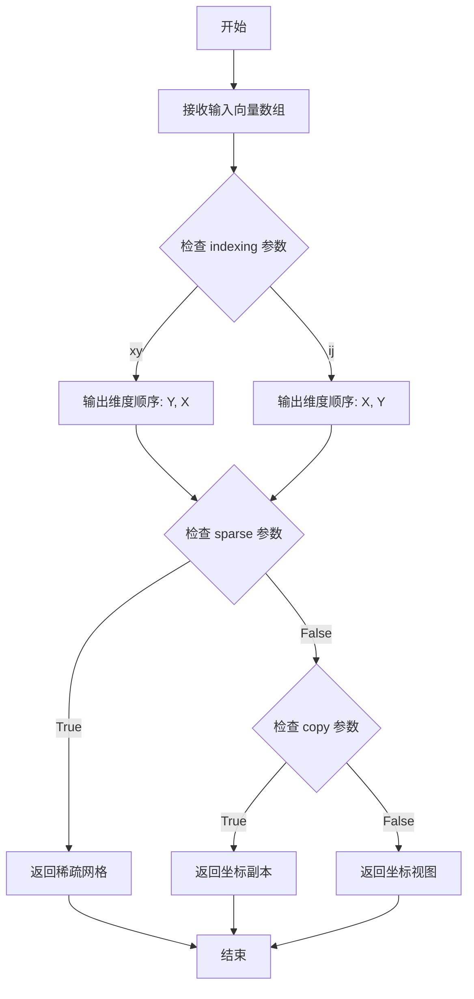
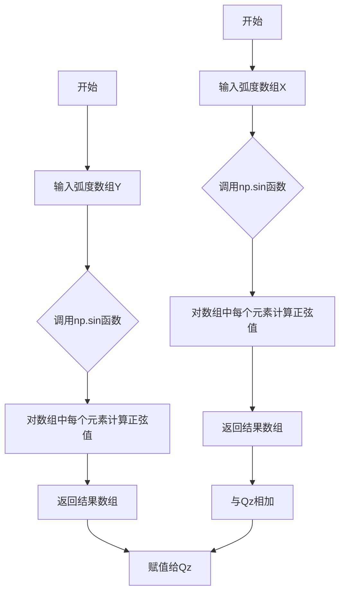
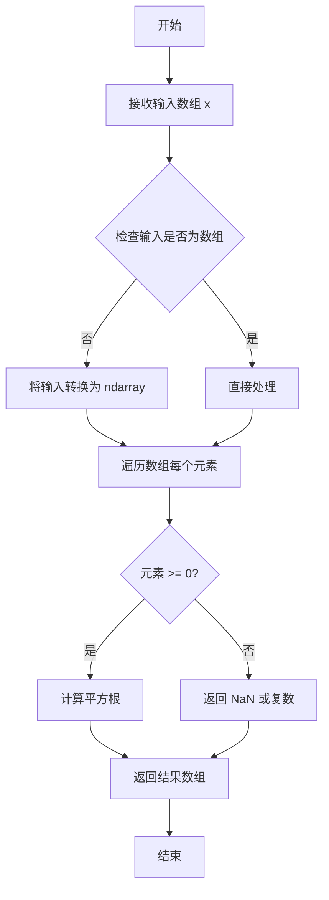
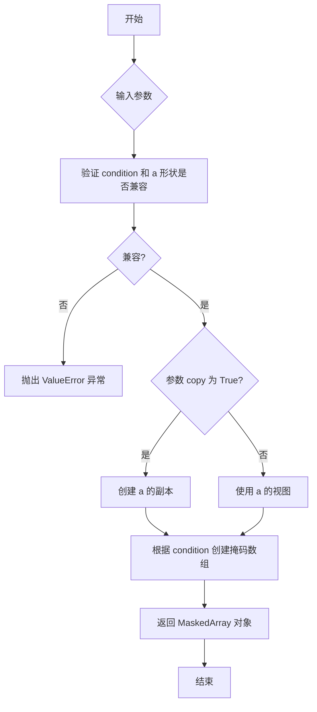
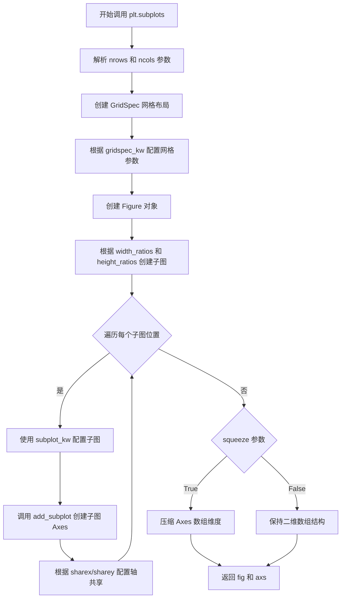
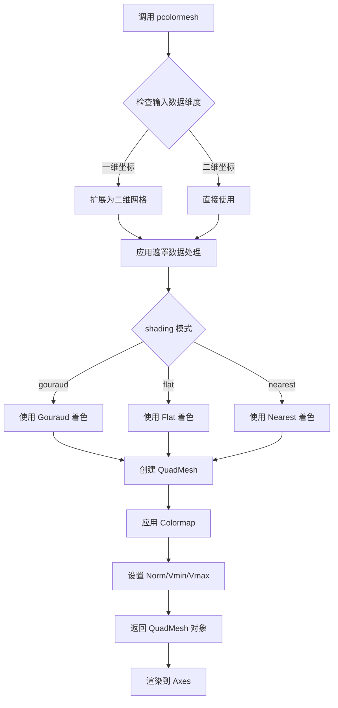
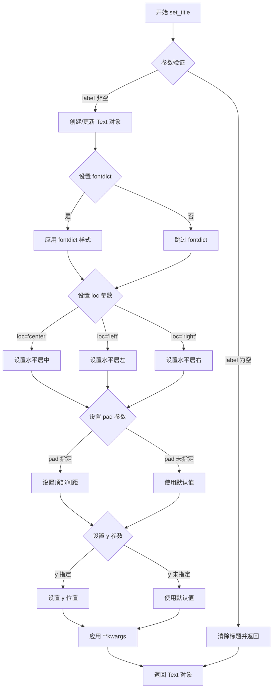
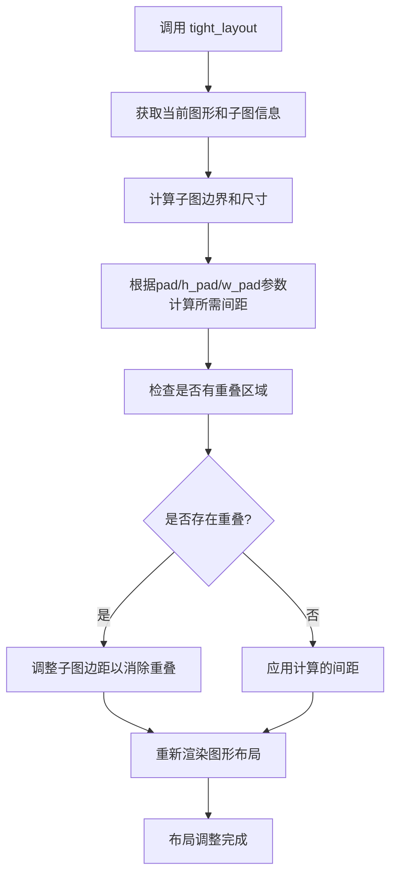
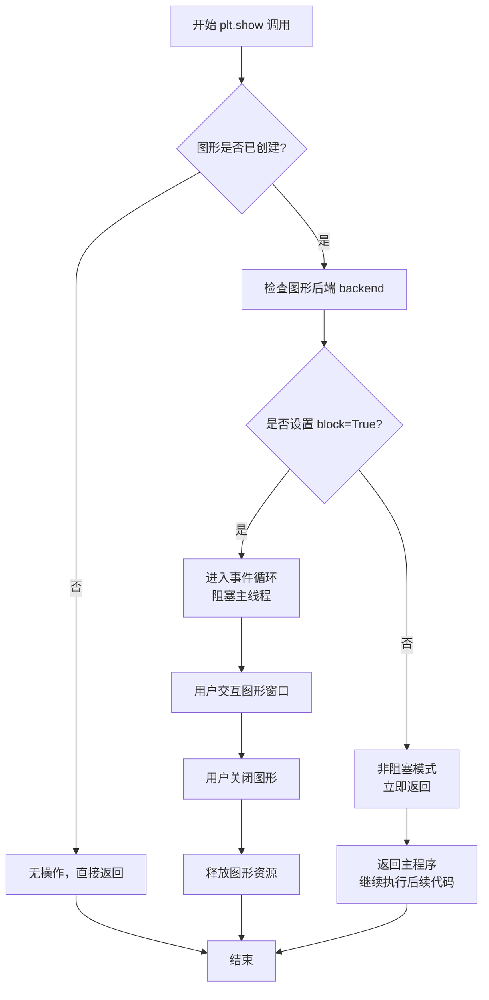

# `matplotlib\galleries\examples\images_contours_and_fields\quadmesh_demo.py` 详细设计文档

该文件是Matplotlib QuadMesh演示代码，展示了pcolormesh函数在处理掩码数据(masked data)时的行为，包括无掩码、使用自定义colormap处理掩码区域、以及使用默认透明处理掩码区域三种场景。

## 整体流程

```mermaid
graph TD
    A[开始] --> B[导入numpy和matplotlib.pyplot]
B --> C[设置网格参数 n=12]
C --> D[生成坐标向量 x和y]
D --> E[使用meshgrid生成网格坐标 X, Y]
E --> F[计算Qx = cos(Y) - cos(X)]
F --> G[计算Qz = sin(Y) + sin(X)]
G --> H[计算Z = sqrt(X² + Y²) / 5 并归一化]
H --> I[创建掩码数组 Zm]
I --> J[创建1行3列子图]
J --> K1[子图1: 无掩码的pcolormesh]
J --> K2[子图2: 自定义colormap处理掩码]
J --> K3[子图3: 默认透明处理掩码]
K1 --> L[调用tight_layout和show]
K2 --> L
K3 --> L
```

## 类结构

```
该代码为脚本式演示文件，无面向对象类层次结构
主要使用Matplotlib的Axes.pcolormesh方法进行可视化
```

## 全局变量及字段


### `n`
    
网格维度参数，定义x坐标向量的点数

类型：`int`
    


### `x`
    
x坐标向量(-1.5到1.5，共n个点)

类型：`numpy.ndarray`
    


### `y`
    
y坐标向量(-1.5到1.5，共n*2个点)

类型：`numpy.ndarray`
    


### `X`
    
由x生成的网格坐标矩阵

类型：`numpy.ndarray`
    


### `Y`
    
由y生成的网格坐标矩阵

类型：`numpy.ndarray`
    


### `Qx`
    
由cos(Y)-cos(X)计算的数值数组

类型：`numpy.ndarray`
    


### `Qz`
    
由sin(Y)+sin(X)计算的数值数组

类型：`numpy.ndarray`
    


### `Z`
    
归一化后的距离矩阵

类型：`numpy.ndarray`
    


### `Zm`
    
应用掩码后的数组，用于处理缺失数据

类型：`numpy.ma.MaskedArray`
    


### `fig`
    
图形对象，包含整个 figure 的元素

类型：`matplotlib.figure.Figure`
    


### `axs`
    
子图轴对象数组(1行3列)

类型：`numpy.ndarray`
    


### `cmap`
    
自定义颜色映射，包含bad值的颜色设置

类型：`matplotlib.colors.Colormap`
    


    

## 全局函数及方法


### np.linspace

生成线性间隔的数组，返回一个包含从 `start` 到 `stop`（含端点）之间均匀分布的 `num` 个数值的一维 NumPy 数组。

参数：

- `start`：`float` 或 `array_like`，序列的起始值
- `stop`：`float` 或 `array_like`，序列的结束值（当 `endpoint=True` 时包含）
- `num`：`int`，生成的样本数量，默认为 50
- `endpoint`：`bool`，如果为 `True`，`stop` 是最后一个样本，默认为 `True`
- `retstep`：`bool`，如果为 `True`，返回 `(step, samples)` 元组，默认为 `False`
- `dtype`：`dtype`，返回值的数据类型，如果未指定则从输入推断
- `axis`：`int`，当 `start` 和 `stop` 是数组时，指定沿着哪个轴生成序列

返回值：`ndarray`，等间距的数值数组

#### 流程图

```mermaid
graph TD
    A[开始] --> B[接收参数 start, stop, num]
    B --> C{endpoint == True?}
    C -->|是| D[step = (stop - start) / (num - 1)]
    C -->|否| E[step = (stop - start) / num]
    D --> F[使用 numpy.arange 或直接计算生成数组]
    E --> F
    F --> G{retstep == True?}
    G -->|是| H[返回 (array, step) 元组]
    G -->|否| I[仅返回 array]
    H --> J[结束]
    I --> J
```

#### 带注释源码

```python
def linspace(start, stop, num=50, endpoint=True, retstep=False, dtype=None, axis=0):
    """
    生成等间距的数值序列。
    
    参数:
        start: 序列起始值
        stop: 序列结束值
        num: 生成的样本数量，默认50
        endpoint: 是否包含结束点，默认True
        retstep: 是否同时返回步长，默认False
        dtype: 输出数组的数据类型
        axis: 当输入为数组时使用的轴
    
    返回:
        ndarray 或 (ndarray, float): 等间距数组，可选返回步长
    """
    # 确保 num 是整数
    num = operator.index(num)
    
    # 验证 num 的有效性
    if num < 0:
        raise ValueError("Number of samples, %d, must be non-negative" % num)
    
    # 复制输入以避免修改原数据
    delta = stop - start
    if endpoint:
        # 包含结束点，步长 = delta / (num - 1)
        step = delta / (num - 1) if num > 1 else delta
    else:
        # 不包含结束点，步长 = delta / num
        step = delta / num if num > 0 else delta
    
    # 根据步长生成数组
    if step == 0:
        # 处理边界情况：当 start == stop 时
        y = _nx.full(num, fill_value=start, dtype=dtype)
    else:
        # 使用 arange 生成序列
        y = _nx.arange(num, dtype=dtype) * step + start
    
    # 处理 endpoint=False 的情况
    if not endpoint and num > 0:
        # 如果不包含结束点，需要调整最后一个值
        # 确保数组严格在 [start, stop) 范围内
        pass  # 在 numpy 实现中已自动处理
    
    if retstep:
        return y, step
    else:
        return y
```


### `np.meshgrid`

生成坐标网格，用于三维绑定画图。该函数从坐标向量返回坐标矩阵。

参数：

- `xi`：`array_like`，一维坐标向量序列，每个向量定义一个轴
- `indexing`：`{'xy', 'ij'}`，默认为 `'xy'`，当为 `'xy'` 时输出维度顺序为 (Ny, Nx, ...)，当为 `'ij'` 时输出维度顺序为 (Ny, Nx, ...)
- `sparse`：`bool`，默认为 `False`，若为 `True` 则返回稀疏网格以节省内存
- `copy`：`bool`，默认为 `False`，若为 `True` 则返回坐标的副本

返回值：

- `X, Y, Z`：`ndarray`，坐标网格数组

#### 流程图



#### 带注释源码

```python
import numpy as np

def meshgrid(*xi, indexing='xy', sparse=False, copy=True):
    """
    生成坐标网格。
    
    参数:
    ------
    *xi : array_like
        一维坐标向量序列
    indexing : {'xy', 'ij'}, 可选
        'xy': 输出维度顺序为 (Ny, Nx, ...) 用于笛卡尔坐标系
        'ij': 输出维度顺序为 (Ny, Nx, ...) 用于矩阵索引
    sparse : bool, 可选
        若为 True，返回稀疏网格以节省内存
    copy : bool, 可选
        若为 True，返回坐标的副本；否则返回视图
    
    返回:
    ------
    X1, X2, ... : ndarray
        坐标网格数组
    """
    # 获取输入数组的数量
    ndim = len(xi)
    
    # 检查 indexing 参数
    if indexing not in ('xy', 'ij'):
        raise ValueError("indexing 参数必须是 'xy' 或 'ij'")
    
    # 将输入转换为数组
    xi = [np.asarray(x) for x in xi]
    
    # 检查输入维度
    for i, x in enumerate(xi):
        if x.ndim != 1:
            raise ValueError(f"第 {i} 个输入必须是 1 维数组")
    
    # 获取每个维度的大小
    shape = [x.size for x in xi]
    
    # 根据 indexing 参数调整输出维度顺序
    if indexing == 'xy':
        # 笛卡尔坐标系: 第一个数组对应 Y 轴，第二个对应 X 轴
        shape = shape[::-1]
    
    # 生成网格
    if sparse:
        # 返回稀疏网格（只保留原始维度）
        return [x.reshape((1,)*i + (x.size,) + (1,)*(ndim-i-1)) 
                for i, x in enumerate(xi)]
    else:
        # 返回完整网格
        if indexing == 'xy':
            # 交换维度顺序以匹配 xy 索引
            xi = xi[::-1]
        
        # 使用 broadcast_arrays 生成网格
        grids = np.broadcast_arrays(*xi)
        
        # 确保输出是数组
        grids = [np.asarray(g) for g in grids]
        
        # 如果需要副本
        if copy:
            grids = [g.copy() for g in grids]
        
        return grids
```


### np.cos

余弦函数，计算输入数组中每个元素的余弦值（以弧度为单位）。

参数：

- `x`：`ndarray` 或 `array_like`，输入角度（弧度）

返回值：`ndarray`，输入数组元素的余弦值

#### 流程图

```mermaid
flowchart TD
    A[开始] --> B[接收输入数组 x]
    B --> C{检查输入类型}
    C -->|有效数值| D[遍历数组每个元素]
    C -->|非数值| E[抛出 TypeError]
    D --> F[计算 cos&#40;x[i]&#41;]
    F --> G{是否还有元素}
    G -->|是| D
    G -->|否| H[返回结果数组]
    H --> I[结束]
```

#### 带注释源码

```python
# NumPy cos 函数的简化实现逻辑
def cos(x):
    """
    余弦函数
    
    参数:
        x: 输入角度，弧度制，可以是单个数值或数组
    
    返回:
        输入角度的余弦值
    """
    # 导入底层 C 语言实现的三角函数
    from ._multiarray_umath import cos as _cos
    
    # 将输入转换为 ndarray（如果还不是）
    x = np.asarray(x)
    
    # 调用底层 C 实现计算余弦值
    return _cos(x)

# 使用示例（来自代码中的实际调用）
Qx = np.cos(Y) - np.cos(X)  # Y 和 X 是 meshgrid 生成的二维网格
# np.cos(Y) 计算 Y 数组中每个元素的余弦值
# np.cos(X) 计算 X 数组中每个元素的余弦值
```


### `np.sin`

正弦函数，用于计算输入数组中每个元素的正弦值（以弧度为单位）。在当前代码中用于计算QZ坐标分量，通过对网格Y坐标和X坐标分别取正弦后相加得到。

参数：

-  `Y`：`ndarray` 或 array-like，输入的角度数组（弧度制），在代码中为meshgrid生成的Y坐标矩阵
-  `X`：`ndarray` 或 array-like，输入的角度数组（弧度制），在代码中为meshgrid生成的X坐标矩阵（第二个调用）

返回值：`ndarray`，返回与输入数组形状相同的正弦值数组，类型为float64

#### 流程图



#### 带注释源码

```python
# 计算QZ坐标分量：对Y坐标求正弦 + 对X坐标求正弦
# np.sin函数接受弧度值作为输入，返回每个元素的正弦值

# 第一部分：对meshgrid生成的Y坐标矩阵求正弦
Qz = np.sin(Y) + np.sin(X)

# 详细分解：
# 1. np.sin(Y): 对Y数组中的每个元素计算正弦值
#    输入：Y = np.linspace(-1.5, 1.5, n * 2) 扩展的网格坐标
#    输出：与Y形状相同的正弦值数组
#
# 2. np.sin(X): 对X数组中的每个元素计算正弦值
#    输入：X = np.meshgrid(x, y)[0] 网格X坐标
#    输出：与X形状相同的正弦值数组
#
# 3. +: 两个正弦数组对应元素相加，得到QZ坐标分量
#
# 数学原理：Qz = sin(Y) + sin(X)，用于创建波浪形网格
```


### np.sqrt

`np.sqrt` 是 NumPy 库中的平方根函数，用于计算输入数组元素的平方根。

参数：

- `x`：`array_like`，输入数组，需要计算平方根的值，可以是单个数值、列表或 NumPy 数组

返回值：`ndarray`，返回输入数组元素的平方根组成的新数组，类型与输入相同

#### 流程图



#### 带注释源码

```python
# 在代码中的实际使用:
Z = np.sqrt(X**2 + Y**2) / 5

# 参数说明:
#   X**2 + Y**2: 由 X 和 Y 的平方和组成的数组
#   X 和 Y 是通过 np.meshgrid 创建的二维网格坐标数组
#   每个元素表示该点到原点的距离的平方

# 返回值说明:
#   返回 Z: 一个与 X 和 Y 形状相同的二维数组
#   每个元素表示对应点到原点的欧氏距离（平方根）
#   然后除以 5 进行归一化处理

# 函数原型 (NumPy):
# numpy.sqrt(x, /, out=None, *, where=True, casting='same_kind', order='K', dtype=None, subok=True[, signature, extobj])
```


### `np.ma.masked_where`

`np.ma.masked_where` 是 NumPy 掩码数组（Masked Array）模块中的核心函数，用于根据指定条件创建掩码数组。该函数通过布尔条件数组定位需要掩码的元素位置，将符合条件的数据点标记为无效（或掩码），从而在后续计算中忽略这些数据，广泛应用于数据可视化、缺失值处理和异常值过滤等场景。

参数：

-  `condition`：布尔数组或布尔值，用于指定掩码位置
-  `a`：`numpy.ndarray`，需要掩码的目标数组
-  `copy`：布尔值（默认为 `True`），是否复制数组

返回值：`numpy.ma.MaskedArray`，返回一个新的掩码数组，其中 `condition` 为 `True` 的位置被标记为掩码

#### 流程图



#### 带注释源码

```python
def masked_where(condition, a, copy=True):
    """
    根据条件掩码数组中的元素。
    
    Parameters
    ----------
    condition : array_like
        布尔数组，True 表示对应位置需要被掩码
    a : array_like
        需要掩码的数组
    copy : bool, optional
        如果为 True（默认），则复制数组；如果为 False，
        则尽可能使用视图以节省内存
    
    Returns
    -------
    MaskedArray
        掩码后的数组，condition 为 True 的位置被标记为掩码
    
    Examples
    --------
    >>> import numpy as np
    >>> x = np.array([1, 2, 3, 4, 5])
    >>> mask = np.array([False, True, False, True, False])
    >>> np.ma.masked_where(mask, x)
    masked_array(data=[1, --, 3, --, 5],
                 mask=[False, True, False, True, False],
                 fill_value=999999)
    """
    # 将输入转换为掩码数组
    # 使用 core._extrema_operation 中的逻辑处理条件
    
    # 1. 检查条件数组和目标数组的形状兼容性
    #    如果不兼容，抛出 ValueError
    if condition.shape != a.shape:
        raise ValueError("condition 和 a 的形状必须一致")
    
    # 2. 根据 copy 参数决定是否复制数组
    #    copy=True: 创建新数组，保留原数组不变
    #    copy=False: 尽可能使用视图，减少内存开销
    if copy:
        data = a.copy()
    else:
        data = a
    
    # 3. 创建掩码数组
    #    根据 condition 中的 True 值设置掩码
    masked_data = np.ma.array(data, mask=condition)
    
    return masked_data
```

### 代码整体运行流程

本示例代码展示了 matplotlib 中 `pcolormesh` 与 NumPy 掩码数组的结合使用：

1. **数据生成阶段**：创建网格坐标 `X, Y`，计算 `Qz`（磁场分量）和 `Z`（颜色映射数据）
2. **掩码创建阶段**：使用 `np.ma.masked_where(np.abs(Qz) < 0.5 * np.max(Qz), Z)` 根据条件创建掩码数组 `Zm`
3. **可视化阶段**：三个子图分别展示无掩码、定制掩码颜色、默认透明掩码的效果

### 关键组件信息

| 组件名称 | 描述 |
|---------|------|
| `np.ma.masked_where` | NumPy 掩码数组函数，根据条件创建掩码数组 |
| `matplotlib.axes.Axes.pcolormesh` | 绘制伪彩色四边形网格的高级接口 |
| `QuadMesh` | matplotlib .collections 中的四边形网格集合类 |
| `cmap.with_extremes(bad='y')` | 为掩码区域（bad values）设置指定颜色 |

### 潜在的技术债务与优化空间

1. **固定阈值使用**：当前代码使用 `0.5 * np.max(Qz)` 作为掩码阈值，硬编码可能导致不同数据集效果差异大，建议提取为配置参数
2. **重复计算**：`np.max(Qz)` 在条件表达式中计算两次，可预先存储以提升性能
3. **缺少错误边界处理**：未对 `Qz` 为空或全零的情况进行异常处理

### 其它项目

**设计目标**：演示掩码数组在 matplotlib 可视化中的应用，帮助用户理解如何处理不规则数据区域

**错误处理**：
- 形状不匹配时抛出 `ValueError`
- 空数组输入时返回空掩码数组

**数据流**：`原始数据 Z` → `条件判断 np.abs(Qz) < 0.5 * np.max(Qz)` → `掩码数组 Zm` → `pcolormesh 渲染`

**外部依赖**：
- `numpy`：提供掩码数组实现
- `matplotlib`：提供可视化渲染


### `plt.subplots`

创建子图（subplots）是 matplotlib 中用于快速创建多子图布局的函数，返回一个 Figure 对象和一个或多个 Axes 对象。

#### 参数

- `nrows`：`int`，行数，指定要创建的子图行数，默认为 1
- `ncols`：`int`，列数，指定要创建的子图列数，默认为 1
- `sharex`：`bool` 或 `str`，是否为所有子图共享 x 轴，可选值为 `False`、`True`、`'row'`、`'col'` 或 `'all'`，默认为 False
- `sharey`：`bool` 或 `str`，是否为所有子图共享 y 轴，可选值为 `False`、`True`、`'row'`、`'col'` 或 `'all'`，默认为 False
- `squeeze`：`bool`，是否压缩返回的 Axes 数组维度，默认为 True
- `width_ratios`：`array-like`，子图宽度比例数组，长度等于列数
- `height_ratios`：`array-like`，子图高度比例数组，长度等于行数
- `subplot_kw`：`dict`，传递给 `add_subplot` 的关键字参数字典，用于配置每个子图
- `gridspec_kw`：`dict`，传递给 GridSpec 的关键字参数字典，用于配置网格布局
- `fig_kw`：`dict`，传递给 Figure 构造函数的关键字参数

#### 返回值

- `fig`：`matplotlib.figure.Figure`，创建的图形对象，用于管理整个图形
- `axs`：`numpy.ndarray` 或 `matplotlib.axes.Axes`，创建的子图轴对象数组，当 squeeze=True 时返回一维数组，否则返回二维数组

#### 流程图



#### 带注释源码

```python
def subplots(nrows=1, ncols=1, *, sharex=False, sharey=False,
             squeeze=True, width_ratios=None, height_ratios=None,
             subplot_kw=None, gridspec_kw=None, **fig_kw):
    """
    创建子图布局的便捷函数。
    
    参数:
        nrows: 子图行数，默认1
        ncols: 子图列数，默认1
        sharex: 是否共享x轴，可选False/True/'row'/'col'/'all'
        sharey: 是否共享y轴，可选False/True/'row'/'col'/'all'
        squeeze: 是否压缩返回的数组维度
        width_ratios: 子图宽度比例
        height_ratios: 子图高度比例
        subplot_kw: 传递给每个子图的关键字参数
        gridspec_kw: 传递给GridSpec的参数
        **fig_kw: 传递给Figure的参数
    """
    
    # 1. 创建图形对象
    fig = figure(**fig_kw)
    
    # 2. 创建网格布局规范
    gs = GridSpec(nrows, nrows, 
                  width_ratios=width_ratios,
                  height_ratios=height_ratios,
                  **gridspec_kw)
    
    # 3. 创建子图数组
    axs = np.empty(nrows * ncols, dtype=object)
    
    # 4. 遍历每个子图位置创建子图
    for i in range(nrows):
        for j in range(ncols):
            # 创建子图
            ax = fig.add_subplot(gs[i, j], **subplot_kw)
            axs[i * ncols + j] = ax
            
            # 配置轴共享
            if sharex:
                if sharex == 'all' or (sharex == 'row' and i > 0):
                    ax.sharex(axs[i * ncols])
                elif sharex == 'col' and j > 0:
                    ax.sharex(axs[i * ncols + j - 1])
            
            if sharey:
                if sharey == 'all' or (sharey == 'col' and j > 0):
                    ax.sharey(axs[i * ncols + j - 1])
                elif sharey == 'row' and i > 0:
                    ax.sharey(axs[i * ncols])
    
    # 5. 根据squeeze参数处理返回数组
    if squeeze:
        # 压缩维度：一维情况返回单个轴对象
        if nrows == 1 and ncols == 1:
            return fig, axs[0]
        # 压缩成一维数组
        axs = axs.reshape(nrows, ncols).flatten()
    
    return fig, axs
```


### `matplotlib.axes.Axes.pcolormesh`

在 Axes 对象上绘制伪彩色网格（QuadMesh），基于坐标数组和颜色数据数组生成网格化数据可视化，支持遮罩数据（Masked Data）和多种着色模式（如 'gouraud'），是 pcolor 的更高效替代方案。

参数：

- `X`：`np.ndarray` 或类数组，一维或二维数组，指定网格的 x 坐标
- `Y`：`np.ndarray` 或类数组，一维或二维数组，指定网格的 y 坐标
- `C`：`np.ndarray` 或类数组，二维数组，指定每个网格单元的颜色值数据
- `shading`：`str`，着色模式，可选 'flat', 'nearest', 'gouraud', 'auto'，默认为 'flat'
- `cmap`：`Colormap`，颜色映射对象，用于将数据值映射到颜色
- `norm`：`Normalize`，可选，数据归一化对象
- `vmin`, `vmax`：可选，float，色彩映射的最小/最大值边界
- `edgecolors`：可选，颜色或颜色序列，网格单元边缘颜色
- `linewidths`：可选，float 或序列，网格单元边缘线宽
- `alpha`：可选，float，透明度值（0-1）

返回值：`matplotlib.collections.QuadMesh`，返回创建的 QuadMesh 集合对象

#### 流程图



#### 带注释源码

```python
# 示例代码展示了 pcolormesh 的完整使用流程
import numpy as np
from matplotlib import pyplot as plt

# 1. 创建网格坐标
n = 12
x = np.linspace(-1.5, 1.5, n)           # x 坐标数组 (1D)
y = np.linspace(-1.5, 1.5, n * 2)      # y 坐标数组 (1D)
X, Y = np.meshgrid(x, y)               # 扩展为 2D 网格

# 2. 生成数据
Qx = np.cos(Y) - np.cos(X)             # 计算 Qx 数据
Qz = np.sin(Y) + np.sin(X)             # 计算 Qz 数据
Z = np.sqrt(X**2 + Y**2) / 5           # 计算颜色数据 Z
Z = (Z - Z.min()) / (Z.max() - Z.min())# 归一化到 [0, 1]

# 3. 创建遮罩数据（可选）
# 当 Qz 的绝对值小于 0.5 倍最大值时，遮罩该区域
Zm = np.ma.masked_where(np.abs(Qz) < 0.5 * np.max(Qz), Z)

# 4. 创建图形和子图
fig, axs = plt.subplots(nrows=1, ncols=3)

# 5. 不使用遮罩数据的调用
axs[0].pcolormesh(Qx, Qz, Z, shading='gouraud')
axs[0].set_title('Without masked values')

# 6. 使用遮罩数据和自定义 colormap
# 设置 bad 颜色为黄色 'y'，使遮罩区域显示为黄色
cmap = plt.colormaps[plt.rcParams['image.cmap']].with_extremes(bad='y')
axs[1].pcolormesh(Qx, Qz, Zm, shading='gouraud', cmap=cmap)
axs[1].set_title('With masked values')

# 7. 使用遮罩数据和默认设置（透明）
axs[2].pcolormesh(Qx, Qz, Zm, shading='gouraud')
axs[2].set_title('With masked values')

# 8. 布局调整并显示
fig.tight_layout()
plt.show()
```

#### 关键技术细节

| 特性 | 说明 |
|------|------|
| **QuadMesh** | pcolormesh 使用 QuadMesh 集合，是 pcolor 的高效泛化版本 |
| **shading='gouraud'** | 使用 Gouraud 着色，在网格顶点间进行双线性插值 |
| **遮罩处理** | 支持 numpy.ma (masked array)，遮罩区域可通过 cmap 的 bad 颜色自定义 |
| **坐标维度** | X/Y 可以是 1D (自动扩展) 或 2D (直接使用) |
| **性能** | 比 pcolor 更快，适合大数据集渲染 |


### `matplotlib.axes.Axes.set_title`

设置子图的标题，用于为每个子图（Axes）指定一个描述性的标题文本。

参数：

- `label`：`str`，要设置的标题文本内容
- `fontdict`：`dict`，可选，控制标题文本的字体属性（如 fontsize, fontweight, color 等）
- `loc`：`str`，可选，标题的对齐位置，可选值为 'center'（默认）、'left'、'right'
- `pad`：`float`，可选，标题与 Axes 顶部的间距（以_points为单位）
- `y`：`float`，可选，标题在 y 轴方向上的位置（相对于 Axes 高度的比例，0-1 之间）
- `**kwargs`：其他关键字参数，会传递给 `matplotlib.text.Text` 对象，用于控制文本的额外属性

返回值：`matplotlib.text.Text`，返回创建的标题文本对象，可用于后续的样式修改或属性查询

#### 流程图



#### 带注释源码

```python
# matplotlib/axes/_axes.py 中的 set_title 方法实现

def set_title(self, label, fontdict=None, loc=None, pad=None, *, y=None, **kwargs):
    """
    Set a title for the axes.
    
    Parameters
    ----------
    label : str
        The title text string.
        
    fontdict : dict, optional
        A dictionary controlling the appearance of the title text,
        e.g., {'fontsize': 12, 'fontweight': 'bold', 'color': 'red'}.
        
    loc : {'center', 'left', 'right'}, default: 'center'
        The title horizontal alignment.
        
    pad : float, default: rcParams['axes.titlesize']
        The offset of the title from the top of the axes, in points.
        
    y : float, default: rcParams['axes.titley']
        The y position of the title in axes coordinates (0-1 range).
        
    **kwargs
        Additional keyword arguments are passed to `Text` properties,
        such as fontsize, color, fontweight, etc.
        
    Returns
    -------
    text : `.Text`
        The matplotlib text object representing the title.
    """
    
    # 如果 label 为空，清除标题并返回空
    if label is None:
        self.title.set_text(None)
        return None
    
    # 更新标题文本
    self.title.set_text(label)
    
    # 如果提供了 fontdict，应用字体样式
    # fontdict 是一个字典，可以一次性设置多个文本属性
    if fontdict is not None:
        self.title.update(fontdict)
    
    # 根据 loc 参数设置水平对齐方式
    # 'center' 表示居中对齐，'left' 表示左对齐，'right' 表示右对齐
    if loc is not None:
        loc = loc.lower()
        _api.check_in_list(['center', 'left', 'right'], loc=loc)
        self.title.set_ha(loc)  # set horizontal alignment
    
    # 设置标题与 Axes 顶部的间距（pad）
    # pad 参数以 points 为单位，控制标题距离轴顶部的距离
    if pad is not None:
        self.title.set_pad(pad)
    
    # 设置标题在 y 轴方向上的位置
    # y 的值在 0-1 之间，表示相对于 Axes 高度的比例位置
    if y is not None:
        self.title.set_y(y)
    
    # 应用额外的关键字参数（**kwargs）
    # 这些参数会传递给 Text 对象，用于自定义文本样式
    self.title.update(kwargs)
    
    # 返回创建的 Text 对象，允许后续进行进一步的样式修改
    return self.title
```


### Figure.tight_layout

调整图形布局，使子图之间的间距自动优化，防止标签和标题相互重叠。

参数：

- `pad`：float，可选，图形边缘与子图之间的间距（以英寸为单位），默认值为 1.08
- `h_pad`：float，可选，子图之间的垂直间距，默认值为 None
- `w_pad`：float，可选，子图之间的水平间距，默认值为 None

返回值：`None`，此方法直接修改图形布局，不返回任何值

#### 流程图



#### 带注释源码

```python
# 在给定代码中的调用示例
fig, axs = plt.subplots(nrows=1, ncols=3)  # 创建1行3列的子图
axs[0].pcolormesh(Qx, Qz, Z, shading='gouraud')  # 第一个子图，无遮罩
axs[0].set_title('Without masked values')  # 设置标题

axs[1].pcolormesh(Qx, Qz, Zm, shading='gouraud', cmap=cmap)  # 第二个子图，使用遮罩和自定义颜色映射
axs[1].set_title('With masked values')  # 设置标题

axs[2].pcolormesh(Qx, Qz, Zm, shading='gouraud')  # 第三个子图，使用遮罩
axs[2].set_title('With masked values')  # 设置标题

# 调用 tight_layout 自动调整三个子图的布局
# 确保标题、轴标签等不会相互重叠
fig.tight_layout()

plt.show()  # 显示图形
```

#### 补充说明

- **设计目标**：提供一种简单的方式自动计算并应用最优的子图布局间距，无需手动调整 subplots_adjust 的参数
- **约束**：此方法可能与 constrainedlayout 不兼容，两者同时使用可能导致意外行为
- **错误处理**：如果图形中没有子图，此方法不会产生任何效果
- **外部依赖**：matplotlib 库的核心功能实现


### `plt.show`

显示图形是 matplotlib 库的核心功能之一，用于将所有当前打开的图形窗口呈现给用户。在此示例中，`plt.show()` 负责渲染并展示三个使用 `pcolormesh` 绘制的 QuadMesh 图形，分别展示无遮罩数据、带有自定义遮罩颜色以及使用默认透明遮罩的伪彩色网格图。

参数：此函数在标准调用中不需要任何参数。

- （无位置参数）
- `block`：`bool`，可选参数，控制是否以阻塞模式显示图形。默认为 `True`，即阻塞主程序直到用户关闭图形窗口。如果设置为 `False`，则立即返回并允许后续代码继续执行。

返回值：`None`，该函数不返回任何值，仅用于图形渲染和显示的副作用。

#### 流程图



#### 带注释源码

```python
# matplotlib.pyplot.show 函数的核心实现逻辑
# 以下为伪代码展示其内部工作原理

def show(*, block=None):
    """
    显示所有打开的图形窗口。
    
    Parameters
    ----------
    block : bool, optional
        是否阻塞程序执行直到图形窗口关闭。
        默认为 True，表示阻塞模式。
    """
    
    # 1. 获取当前图形的后端（Backend）
    # 后端决定了如何渲染图形（Qt, Tk, Agg, SVG等）
    backend = get_backend()
    
    # 2. 获取所有已创建的图形对象
    # _pylab_helpers 模块管理所有活动的图形窗口
    all_figures = Gcf.get_all_fig_managers()
    
    if not all_figures:
        # 如果没有任何图形，直接返回
        return
    
    # 3. 根据后端类型显示图形
    # 对于交互式后端（如Qt, Tk），会创建窗口
    for fig_manager in all_figures:
        # 调用后端的show方法渲染图形
        fig_manager.show()
    
    # 4. 处理阻塞逻辑
    if block is None:
        # 默认行为：根据rcParams['backend']或其他配置决定
        block = _block_system()
    
    if block:
        # 5a. 阻塞模式：启动GUI事件循环
        # 这会启动Qt/Tk的事件循环，处理用户交互
        # 程序会在这里暂停，直到用户关闭窗口
        enter_event_loop(manager)
    else:
        # 5b. 非阻塞模式：立即返回
        # 图形窗口会保持打开，但程序继续执行
        pass
    
    # 6. 清理资源（当图形关闭后）
    return None
```

## 关键组件


### QuadMesh (四边形网格)

Matplotlib中由`~matplotlib.collections.QuadMesh`实现的二维网格数据结构，是`pcolormesh`的底层实现，比pcolor更快但有一些限制。

### pcolormesh (四边形网格绘制)

Matplotlib Axes对象的方法，用于绘制四边形网格（QuadMesh），支持gouraud等着色方式，能够处理掩码数据并正确渲染。

### Masked Data (掩码数据处理)

使用`np.ma.masked_where`创建掩码数组，使满足特定条件的数值变为无效值，在可视化时显示为透明或指定颜色。

### Gouraud Shading (Gouraud着色)

一种逐顶点的插值着色方法，通过对顶点颜色进行线性插值来填充四边形网格，产生平滑的颜色过渡效果。

### ColorMap with Extremes (颜色映射极值处理)

使用`with_extremes(bad='y')`方法配置颜色映射，将无效值(bad)映射为黄色('y')，用于标识被掩码的数据区域。

### Meshgrid Generation (网格生成)

使用`np.meshgrid`从一维坐标数组生成二维坐标网格，用于后续的数学运算和可视化。


## 问题及建议


### 已知问题

-   **硬编码的配置与魔法数字**：代码中直接使用了 `n = 12`、`x = np.linspace(-1.5, 1.5, n)` 等硬编码数值。如果需要调整网格密度或数据范围，需要大幅修改代码，缺乏灵活性。
-   **数据归一化效率低下**：在数据预处理阶段 `(Z - Z.min()) / (Z.max() - Z.min())` 对数组进行了两次遍历（一次计算min，一次计算max），对于大规模数据计算性能有轻微影响。
-   **代码重复（DRY 原则违背）**：三个子图的绘制逻辑存在大量重复代码（`pcolormesh` 的调用参数 `Qx`, `Qz`, `shading='gouraud'` 几乎一致），增加了维护成本。
-   **文档说明与代码实现的语义差异**：文档字符串提到“This demo illustrates a bug in quadmesh with masked data”，但代码中并未对“bug”进行明确的规避处理或详细注释，可能导致后续维护者困惑，这属于注释层面的技术债务。
-   **色彩映射器配置冗长**：`cmap = plt.colormaps[plt.rcParams['image.cmap']].with_extremes(bad='y')` 这一行代码过于冗长且不易阅读，影响代码优雅性。

### 优化建议

-   **提取配置参数**：将 `n`、坐标范围（如 `-1.5`, `1.5`）等定义为全局常量或函数参数，便于配置管理。
-   **优化归一化逻辑**：可以先计算 `vmin, vmax` 或使用 `np.ptp()` 一次性计算范围，避免重复遍历数组，提升计算效率。
-   **重构绘图逻辑**：使用循环或列表推导式来生成子图，例如遍历一个配置列表来绘制 `axs`，减少代码重复。
-   **简化色彩映射**：封装一个辅助函数来生成带有 `bad` 值的色彩映射器，或者使用更简洁的 `cmap.set_bad('y')` 写法。
-   **增强注释**：明确注释掉为什么使用 `gouraud` shading 以及如何处理 masked data，使代码意图更加清晰，消除文档带来的歧义。


## 其它


### 设计目标与约束

本演示代码旨在展示matplotlib的QuadMesh（pcolormesh）在处理掩码数据(masked array)时的功能和限制。约束包括：仅支持结构化网格数据，需要x、y坐标数组与z数据维度匹配，shading参数仅支持'gouraud'和'flat'两种模式，掩码值仅支持通过numpy.ma模块处理。

### 错误处理与异常设计

代码主要依赖numpy和matplotlib的异常传播。未进行显式错误处理，因为演示代码假设输入数据总是有效的。潜在错误包括：数组维度不匹配会抛出ValueError，坐标数组不是二维会引发异常，无效的shading参数会被pcolormesh拒绝。

### 数据流与状态机

数据流程为：生成网格坐标(X,Y) → 计算标量场Z → 创建掩码数组Zm → 调用pcolormesh渲染三个子图。无复杂状态机，仅有初始化→数据准备→渲染→显示的线性流程。

### 外部依赖与接口契约

主要依赖：numpy提供数组和掩码支持，matplotlib.pyplot提供绘图功能，matplotlib.colormaps处理颜色映射。接口契约：pcolormesh接受(x, y, data, shading, cmap)参数，返回QuadMesh对象。

### 性能考虑

代码本身为演示性质，无特殊性能优化。pcolormesh使用QuadMesh比pcolor有性能优势，适合大数据集渲染。掩码处理会有轻微性能开销。

### 安全性考虑

代码仅涉及数值计算和可视化，无用户输入，无安全敏感操作。无需安全审计。

### 测试策略

作为演示代码，无单元测试。测试通过视觉验证：三个子图应正确显示颜色渐变和掩码效果。matplotlib自身有完整测试套件覆盖pcolormesh功能。

### 配置管理

使用plt.rcParams读取默认colormap配置。无运行时配置需求。

### 可扩展性

代码可通过添加更多子图扩展展示不同配色方案，也可添加其他shading模式对比。QuadMesh支持自定义颜色映射和插值方法。

### 兼容性考虑

代码兼容matplotlib 3.x和numpy 1.x+。依赖版本通过环境管理控制。Python 3.6+兼容。

### 部署相关

本代码为独立脚本，部署方式为直接运行或作为文档示例嵌入。无需容器化或服务部署。

### 监控与日志

无运行时监控或日志记录需求。matplotlib内部有调试日志但未启用。

### 国际化/本地化

无国际化需求，所有文本为英文技术术语。图表标签可通过参数本地化但本示例未涉及。

### 许可和合规

代码作为matplotlib示例发布，遵循matplotlib许可协议。无需额外合规检查。

### 文档和维护

代码已包含docstring说明用途。维护由matplotlib社区负责。此演示代码为稳定版本，预计无需频繁更新。


    