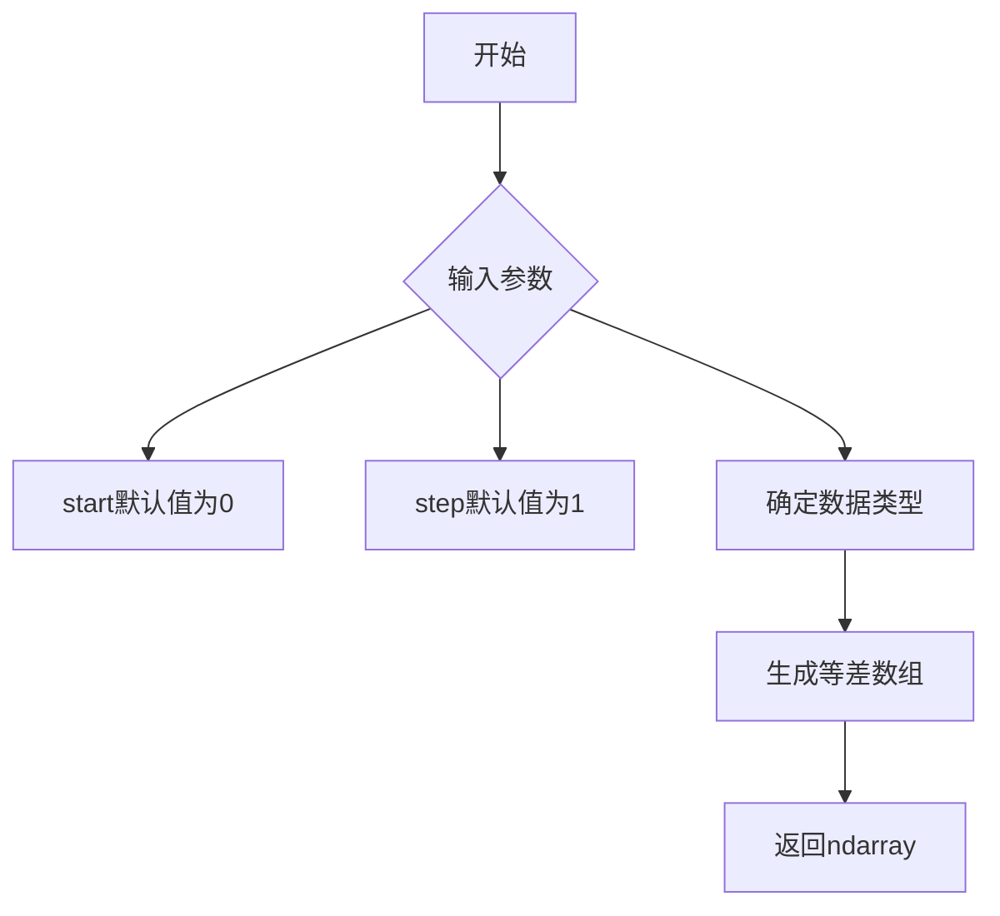
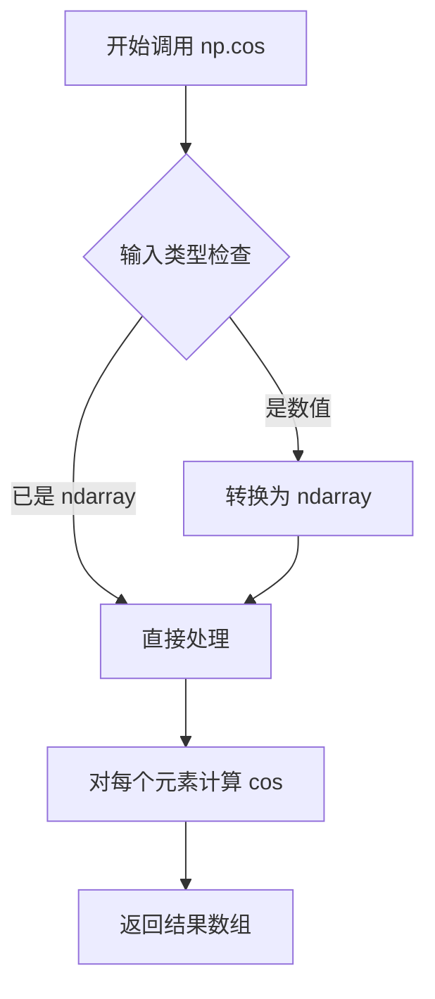
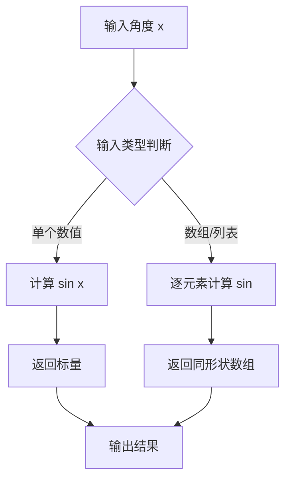
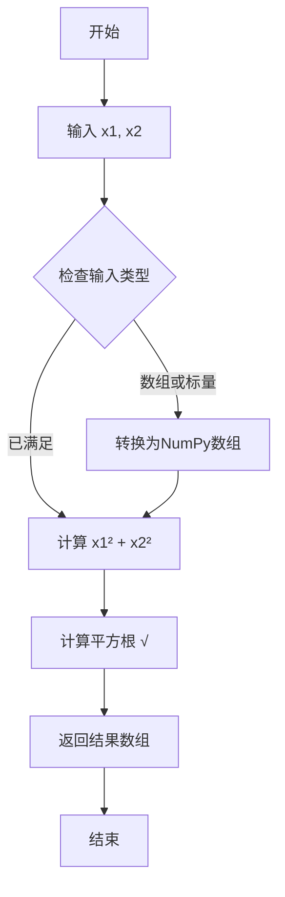
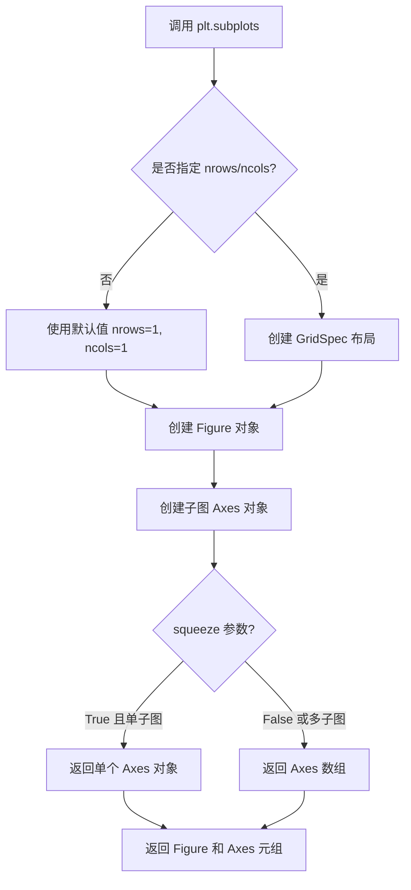
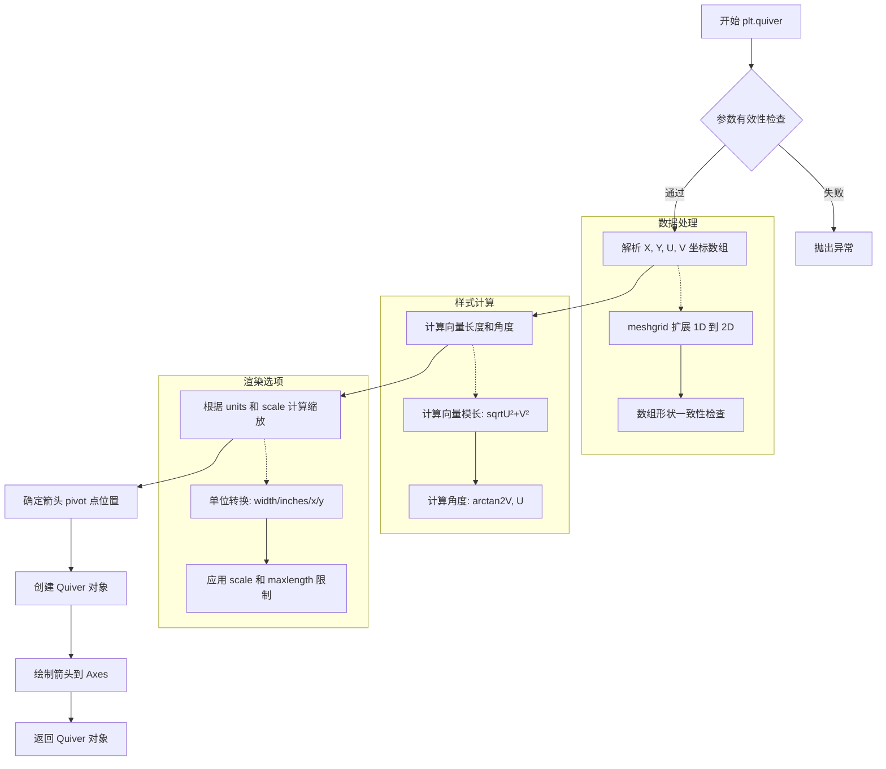
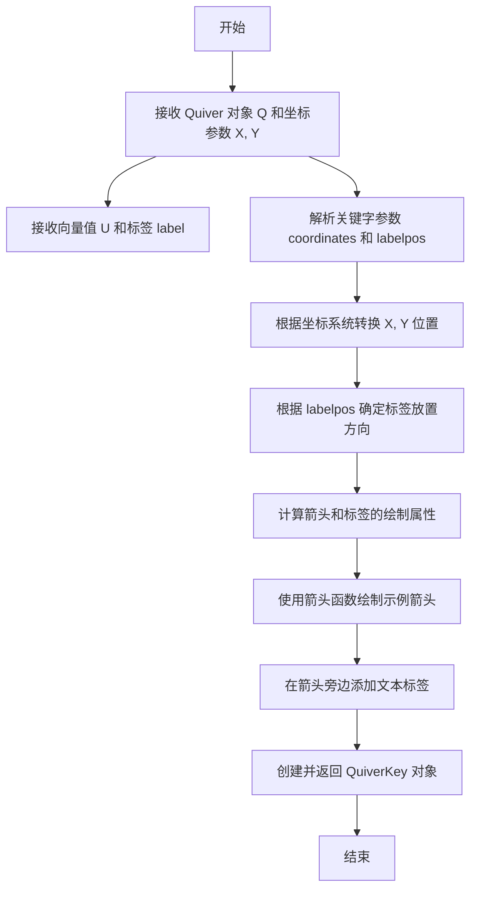
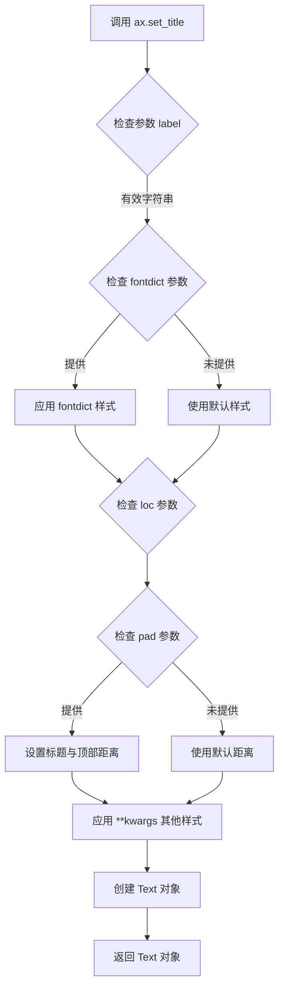
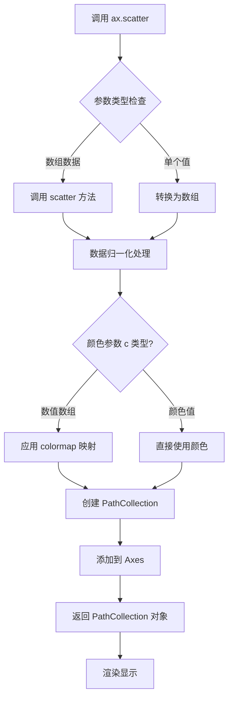

# `matplotlib\galleries\examples\images_contours_and_fields\quiver_demo.py` 详细设计文档

这是一个matplotlib库的示例脚本，演示了quiver（箭头/向量场绘制）和quiverkey（箭头图例）函数的高级用法，展示了不同units参数（width、inches、x）、pivot参数（mid、tip）以及缩放选项的实际效果。

## 整体流程

```mermaid
graph TD
    A[开始] --> B[导入依赖库]
    B --> C[创建网格坐标X, Y]
    C --> D[计算向量分量U=cos(X), V=sin(Y)]
    D --> E[创建图1: units='width']]
    E --> F[创建图2: units='inches', pivot='mid', 每隔3个点]
    F --> G[创建图3: units='x', pivot='tip', 计算幅值M]
    G --> H[调用plt.show()显示图形]
    H --> I[结束]
```

## 类结构

```
该脚本为面向过程风格，无自定义类定义
主要使用matplotlib.pyplot和numpy库的函数
```

## 全局变量及字段


### `X`
    
网格 x 坐标，通过 np.meshgrid 创建

类型：`np.ndarray`
    


### `Y`
    
网格 y 坐标，通过 np.meshgrid 创建

类型：`np.ndarray`
    


### `U`
    
向量场的 x 分量（余弦值）

类型：`np.ndarray`
    


### `V`
    
向量场的 y 分量（正弦值）

类型：`np.ndarray`
    


### `fig1`
    
第一个子图窗口

类型：`matplotlib.figure.Figure`
    


### `fig2`
    
第二个子图窗口

类型：`matplotlib.figure.Figure`
    


### `fig3`
    
第三个子图窗口

类型：`matplotlib.figure.Figure`
    


### `ax1`
    
第一个子图的坐标轴对象

类型：`matplotlib.axes.Axes`
    


### `ax2`
    
第二个子图的对象

类型：`matplotlib.axes.Axes`
    


### `ax3`
    
第三个子图的对象

类型：`matplotlib.axes.Axes`
    


### `Q`
    
quiver返回的Quiver对象

类型：`matplotlib.quiver.Quiver`
    


### `qk`
    
quiverkey返回的图例对象

类型：`matplotlib.quiver.QuiverKey`
    


### `M`
    
向量幅值，通过 np.hypot(U, V) 计算

类型：`np.ndarray`
    


    

## 全局函数及方法


### `np.meshgrid`

创建坐标网格矩阵，用于在二维或三维空间中生成坐标向量组成的网格。该函数是 NumPy 库中的核心函数，在本代码中用于生成绘制箭头场所需的 X 和 Y 坐标网格。

#### 参数

- `x`：`array_like`，一维数组，表示 x 坐标轴的坐标向量
- `y`：`array_like`，一维数组，表示 y 坐标轴的坐标向量

#### 返回值

- `X`：`ndarray`，二维数组，形状为 (len(y), len(x))，包含每个网格点的 x 坐标
- `Y`：`ndarray`，二维数组，形状为 (len(y), len(x))，包含每个网格点的 y 坐标

#### 流程图

```mermaid
flowchart TD
    A[输入: x坐标向量<br/>如: np.arange(0, 2π, 0.2)] --> D
    B[输入: y坐标向量<br/>如: np.arange(0, 2π, 0.2)] --> D
    D{调用 np.meshgrid} --> E[生成X网格矩阵<br/>行复制x向量]
    D --> F[生成Y网格矩阵<br/>列复制y向量]
    E --> G[返回坐标网格<br/>X, Y]
    F --> G
```

#### 带注释源码

```python
# 代码中的实际调用方式
X, Y = np.meshgrid(np.arange(0, 2 * np.pi, .2), np.arange(0, 2 * np.pi, .2))

# np.arange(0, 2 * np.pi, .2) 生成:
# [0.0, 0.2, 0.4, 0.6, ..., 6.2] (约31个元素)
# 
# np.meshgrid 返回:
# X - 形状为 (31, 31) 的二维数组，每行相同，为x坐标序列
# Y - 形状为 (31, 31) 的二维数组，每列相同，为y坐标序列
# 
# 结果示例 (简化):
# X = [[0.0, 0.2, 0.4, ...],
#      [0.0, 0.2, 0.4, ...],
#      ...]
# Y = [[0.0, 0.0, 0.0, ...],
#      [0.2, 0.2, 0.2, ...],
#      ...]
```

#### 关键用途说明

在本代码中，`np.meshgrid` 生成的两个网格矩阵 `X` 和 `Y` 作为 `ax.quiver()` 函数的输入，用于在每个网格点处绘制向量箭头。`U = np.cos(X)` 和 `V = np.sin(Y)` 计算出每个点上的向量分量。


### `np.arange`

numpy 的 `arange` 函数是用于创建等差数组的函数，它返回指定范围内的均匀间隔值组成的数组。在本代码中用于生成 quiver 图的网格坐标。

参数：

- `start`：`float`（或 `int`），起始值，默认为 0
- `stop`：`float`（或 `int`），结束值（不包含）
- `step`：`float`（或 `int`，可选），步长，默认为 1
- `dtype`：`dtype`（可选），输出数组的数据类型

返回值：`ndarray`，返回给定范围内的等差数组

#### 流程图



#### 带注释源码

```python
# 在本代码中的实际使用示例：
# 用于生成 X, Y 网格坐标
X, Y = np.meshgrid(
    np.arange(0, 2 * np.pi, .2),  # 从0到2π，步长0.2
    np.arange(0, 2 * np.pi, .2)   # 从0到2π，步长0.2
)

# 等价于：
# start = 0
# stop = 2 * np.pi  # 约等于 6.283...
# step = 0.2
# 结果生成一个包含31个元素的数组: [0, 0.2, 0.4, ..., 6.2]
```

**注意**：该函数并非在本代码文件中定义，而是调用 numpy 库函数。本代码文件是一个 matplotlib 示例，演示如何使用 `quiver` 和 `quiverkey` 绘制矢量场图，np.arange 仅用于生成网格数据。


### np.cos

`np.cos` 是 NumPy 库提供的余弦函数，用于计算输入数组中每个元素的余弦值（弧度制）。该函数是向量化的，能够对整个数组进行 element-wise 计算，返回与输入形状相同的余弦值数组。

参数：

- `x`：`ndarray` 或类似数组对象，输入的角度值（以弧度为单位）

返回值：`ndarray`，返回对应输入角度的余弦值，形状与输入相同，值域为 [-1, 1]

#### 流程图



#### 带注释源码

```python
# np.cos 函数的实现位于 NumPy 库中，以下是调用示例

# 在本项目中，np.cos 的使用方式：
U = np.cos(X)  # X 是通过 np.meshgrid 生成的网格数组，代表角度（弧度）
# 解释：对网格 X 中的每个元素计算余弦值，结果存储在 U 中
# U 将作为 quiver 函数的 X 方向分量

# 等效的数学表示：
# U[i,j] = cos(X[i,j])，对所有索引 i,j 成立

# 参数说明：
# - X: ndarray shape=(n,m)，输入的角度数组（弧度）
# 返回值：
# - U: ndarray shape=(n,m)，对应位置的余弦值数组
```


### `np.sin`

NumPy 库中的正弦函数，用于计算输入数组或数值的正弦值（以弧度为单位）。

参数：

-  `x`：`array_like`，角度值，单位为弧度，可以是单个数值、列表或 NumPy 数组

返回值：`ndarray`，输入角度的正弦值，返回与输入形状相同的数组

#### 流程图



#### 带注释源码

```python
# 在代码中的使用方式
V = np.sin(Y)

# 完整函数签名参考（基于 NumPy 官方文档）
# np.sin(x, /, out=None, *, where=True, casting='same_kind', order='K', dtype=None, subok=True[, signature, extobj])

# x: array_like，输入的角度值（弧度）
# 返回: ndarray，正弦值
# 示例:
# >>> np.sin(np.array([0, np.pi/2, np.pi]))
# array([0., 1., 0.])
```


### `np.hypot`

该函数用于计算两个输入数组对应元素的平方和平方根（即欧几里得范数/幅值），常用于计算二维向量的长度或在图形学中计算箭头的幅值。

参数：

-  `x1`：`array_like`，第一个输入数组，包含直角三角形的第一个直角边
-  `x2`：`array_like`，第二个输入数组，包含直角三角形的第二个直角边

返回值：`ndarray`，返回两个输入数组对应元素的平方和平方根，即 √(x1² + x2²)

#### 流程图



#### 带注释源码

```python
# np.hypot 函数源码分析
# 计算 sqrt(x1² + x2²) 的欧几里得距离

# 在示例代码中的调用方式:
# M = np.hypot(U, V)
# 其中 U = np.cos(X), V = np.sin(X)
# M 将包含每个位置的 √(U² + V²) 值

# 函数核心实现逻辑:
# 1. 接收两个输入数组/标量 x1, x2
# 2. 对应位置计算: result = sqrt(x1^2 + x2^2)
# 3. 返回计算结果数组

# 使用场景:
# - 在matplotlib quiver图中计算向量幅值
# - 用于设置颜色映射的颜色数据 M
# - 在本例中: M = np.hypot(U, V) 计算向量(U,V)的长度

# 示例:
# >>> np.hypot([3, 4], [4, 3])
# array([5., 5.])  # 3²+4²=25, √25=5
```

#### 在项目中的实际应用

```python
# 在 matplotlib quiver 示例中的具体使用
X, Y = np.meshgrid(np.arange(0, 2 * np.pi, .2), np.arange(0, 2 * np.pi, .2))
U = np.cos(X)
V = np.sin(Y)

# 计算向量 (U, V) 的幅值/长度
M = np.hypot(U, V)

# M 用于:
# 1. 设置 quiver 颜色 - 传递 M 作为第四个参数
# 2. 可视化向量场中每个箭头的大小和颜色
Q = ax3.quiver(X, Y, U, V, M, units='x', pivot='tip', width=0.022,
               scale=1 / 0.15)
```


### plt.subplots

创建图形和子图（Axes）的函数，是 `matplotlib.pyplot` 模块中的核心函数之一。该函数创建一个新的 Figure 对象，并返回一个 Figure 对象和一个 Axes 对象（或 Axes 数组），用于后续的绘图操作。

参数：

- `nrows`：`int`，默认值 1，表示子图的行数。
- `ncols`：`int`，默认值 1，表示子图的列数。
- `sharex`：`bool` 或 `str`，默认值 False，如果为 True，则所有子图共享 x 轴。
- `sharey`：`bool` 或 `str`，默认值 False，如果为 True，则所有子图共享 y 轴。
- `squeeze`：`bool`，默认值 True，如果为 True，则返回的 Axes 对象维度会被简化（单子图时返回 Axes 对象，多子图时返回 Axes 数组）。
- `width_ratios`：`array-like`，可选，表示每列的宽度比例。
- `height_ratios`：`array-like`，可选，表示每行的高度比例。
- `subplot_kw`：字典，可选，用于传递给 `add_subplot` 的关键字参数。
- `gridspec_kw`：字典，可选，用于传递给 `GridSpec` 的关键字参数。
- `**fig_kw`：可选，用于传递给 `Figure.subplots` 的关键字参数（如 `figsize`、`dpi` 等）。

返回值：`tuple(Figure, Axes or ndarray)`，返回创建的 Figure 对象和 Axes 对象（或 Axes 对象数组）。在代码中：
- `fig1, ax1 = plt.subplots()` 返回 `(Figure, Axes)`
- `fig2, ax2 = plt.subplots()` 返回 `(Figure, Axes)`
- `fig3, ax3 = plt.subplots()` 返回 `(Figure, Axes)`

#### 流程图



#### 带注释源码

```python
# 代码中的三次调用示例：

# 第一次调用：创建第一个图形和子图
fig1, ax1 = plt.subplots()  # 创建 1x1 子图，返回 Figure 对象 fig1 和 Axes 对象 ax1
ax1.set_title('Arrows scale with plot width, not view')  # 设置子图标题
Q = ax1.quiver(X, Y, U, V, units='width')  # 在 ax1 上绘制矢量场

# 第二次调用：创建第二个图形和子图
fig2, ax2 = plt.subplots()  # 再次创建新的 Figure 和 Axes
ax2.set_title("pivot='mid'; every third arrow; units='inches'")  # 设置标题
Q = ax2.quiver(X[::3, ::3], Y[::3, ::3], U[::3, ::3], V[::3, ::3],
               pivot='mid', units='inches')  # 绘制矢量场

# 第三次调用：创建第三个图形和子图
fig3, ax3 = plt.subplots()  # 第三次创建新的 Figure 和 Axes
ax3.set_title("pivot='tip'; scales with x view")  # 设置标题
M = np.hypot(U, V)  # 计算速度大小
Q = ax3.quiver(X, Y, U, V, M, units='x', pivot='tip', width=0.022,
               scale=1 / 0.15)  # 绘制带颜色的矢量场

plt.show()  # 显示所有图形
```


### `plt.quiver`

`plt.quiver` 是 matplotlib 库中用于绘制二维向量场箭头的核心函数。它接受位置坐标 (X, Y) 和向量分量 (U, V)，可以在坐标系中可视化矢量场，支持多种单位系统、箭头旋转点和缩放选项，常用于科学计算和工程可视化中展示速度场、力场等方向性数据。

参数：

- `X`：`ndarray` 或类似数组对象，X 坐标位置，定义箭头起始点的 x 坐标，可以是 2D 数组（与 U, V 形状匹配）或 1D 数组
- `Y`：`ndarray` 或类似数组对象，Y 坐标位置，定义箭头起始点的 y 坐标，可以是 2D 数组（与 U, V 形状匹配）或 1D 数组
- `U`：`ndarray` 或类似数组对象，X 方向向量分量，表示每个位置向量在 x 方向的强度，与 X, Y 形状相同
- `V`：`ndarray` 或类似数组对象，Y 方向向量分量，表示每个位置向量在 y 方向的强度，与 X, Y 形状相同
- `C`：`ndarray` 或类似数组对象，可选，颜色数组，用于根据数值映射箭头颜色，与 X, Y 形状相同
- `units`：`str`，可选，指定向量的单位系统，可选值为 `'width'`（画布宽度）、`'height'`（画布高度）、`'dots'`（像素）、`'inches`**（英寸）、`'x'`（x 轴单位）、`'y`**（y 轴单位），默认为 `'width'`
- `pivot`：`str`，可选，指定箭头围绕哪一点旋转，可选值为 `'tail'`（尾部）、`'mid'`（中部）、`'tip'`（尖端），默认为 `'tail'`
- `width`：`float`，可选，箭头杆的宽度，以指定单位系统为基准，仅当 units 不是 `'x'` 或 `'y'` 时有效
- `scale`：`float` 或 `None`，可选，向量长度的缩放因子，值越小箭头越长，None 表示自动缩放
- `scale_units`：`str`，可选，指定 scale 参数的单位系统，可选值同 units 参数
- `angles`：`str` 或 `'xy'`，可选，指定向量角度的计算方式，`'xy'` 表示从 x 轴到 y 轴的角度，其他值使用 UV 分量计算
- `minlength`：`float`，可选，箭头的最小长度，以指定单位系统为基准
- `maxlength`：`float`，可选，箭头的最大长度，以指定单位系统为基准
- `headwidth`：`float`，可选，箭头头部宽度相对于杆宽度的比例，默认为 3
- `headlength`：`float`，可选，箭头头部的长度，默认为 1.5 倍杆宽度
- `headaxislength`：`float`，可选，箭头头部轴的长度，默认为 4
- `color`：`color` 或颜色数组，可选，指定箭头颜色，可以是单一颜色或与数组长度匹配的的颜色数组
- `**kwargs`：其他关键字参数传递给 `Quiver` 对象，用于进一步自定义外观

返回值：`Quiver`，返回一个 `matplotlib.quiver.Quiver` 对象，该对象包含绘制的箭头集合，可用于后续添加图例（通过 `quiverkey`）或更新箭头属性

#### 流程图



#### 带注释源码

```python
# 代码来源: matplotlib.pyplot.quiver
# 位置: lib/matplotlib/pyplot.py

def quiver(
    X=None, Y=None, U=None, V=None,
    C=None,
    *,
    units="width",
    angles="uv",
    scale=None,
    scale_units=None,
    width=None,
    pivot="tail",
    minlength=1,
    maxlength=10,
    headwidth=3,
    headlength=1.5,
    headaxislength=4,
    color=None,
    **kwargs
):
    """
    绘制二维向量场箭头
    
    参数:
        X: 位置 x 坐标
        Y: 位置 y 坐标  
        U: 向量 x 分量
        V: 向量 y 分量
        C: 颜色数组(可选)
        units: 向量单位系统
        angles: 角度计算方式
        scale: 缩放因子
        scale_units: 缩放单位
        width: 箭头宽度
        pivot: 箭头旋转点
        minlength: 最小长度
        maxlength: 最大长度
        headwidth: 头部宽度
        headlength: 头部长度
        headaxislength: 头部轴长度
        color: 箭头颜色
    """
    # 获取当前Axes对象,如果不存在则创建
    ax = gca()
    
    # 委托给 Axes 类的 quiver 方法执行实际绘制
    # Quiver 类负责处理向量场箭头的具体渲染逻辑
    return ax.quiver(
        X, Y, U, V, C,
        units=units,
        angles=angles,
        scale=scale,
        scale_units=scale_units,
        width=width,
        pivot=pivot,
        minlength=minlength,
        maxlength=maxlength,
        headwidth=headwidth,
        headlength=headlength,
        headaxislength=headaxislength,
        color=color,
        **kwargs
    )


# 实际实现位于 Axes.quiver 方法中
# 示例代码中的典型调用方式:

# 示例1: 使用 width 单位系统
Q = ax1.quiver(X, Y, U, V, units='width')

# 示例2: 使用 inches 单位, 中部旋转点, 并对数组进行切片(每第三个箭头)
Q = ax2.quiver(X[::3, ::3], Y[::3, ::3], U[::3, ::3], V[::3, ::3],
               pivot='mid', units='inches')

# 示例3: 使用 x 轴单位, 尖端旋转点, 自定义宽度和缩放
M = np.hypot(U, V)  # 计算向量模长用于颜色映射
Q = ax3.quiver(X, Y, U, V, M, units='x', pivot='tip', width=0.022,
               scale=1 / 0.15)
```


### `plt.quiverkey`

在 matplotlib 中，`quiverkey` 函数用于为向量图（quiver plot）添加带有标签的图例箭头，以说明向量的实际大小。

参数：

- `Q`：`matplotlib.quiver.Quiver`，从 `ax.quiver()` 返回的 Quiver 对象，包含向量场的数据
- `X`：`float`，图例箭头在 Axes 中的 X 坐标位置
- `Y`：`float`，图例箭头在 Axes 中的 Y 坐标位置
- `U`：`float`，图例箭头表示的向量长度值（即物理量的大小）
- `label`：`str`，与向量值关联的标签文本，通常使用 LaTeX 格式表示物理单位（如 `r'$2 \frac{m}{s}$'`）
- `labelpos`：`str`，标签相对于箭头的位置，可选值包括 `'N'`（上）、`'S'`（下）、`'E'`（右，默认）、`'W'`（左）
- `coordinates`：`str`，坐标系统，可选值包括 `'data'`（数据坐标）、`'axes'`（轴坐标，0-1）、`'figure'`（图形坐标，0-1）、`'inch'`（英寸）
- `color`：`str` 或 `tuple`，（可选）覆盖箭头颜色
- `labelsep`：`float`，（可选）标签与箭头之间的距离，默认值为 0.1
- `labeloffset`：`float`，（可选）标签偏移量
- `angle`：`float`，（可选）箭头的旋转角度
- `Pivot`：`str`，（可选）箭头旋转的支点，可选 `'tail'`、`'mid'`、`'tip'`

返回值：`matplotlib.quiver.QuiverKey`，返回创建的 QuiverKey 对象，用于后续自定义修改

#### 流程图



#### 带注释源码

```python
# matplotlib/axes/_axes.py 中的 quiverkey 方法核心逻辑

def quiverkey(self, Q, X, Y, U, label, **kw):
    """
    在 Axes 上添加一个图例箭头来指示向量的实际大小
    
    参数:
        Q: Quiver 对象 - 从 ax.quiver() 返回的向量图对象
        X, Y: float - 图例箭头在 Axes 中的位置坐标
        U: float - 图例箭头表示的向量长度（物理量大小）
        label: str - 显示在箭头旁边的文本标签（通常包含单位）
        
    关键字参数:
        labelpos: str - 标签位置 ('N', 'S', 'E', 'W')
        coordinates: str - 坐标系统 ('data', 'axes', 'figure', 'inch')
        color: 颜色覆盖
        labelsep: float - 标签与箭头间距
        angle: float - 箭头旋转角度
        pivot: str - 箭头支点位置
    
    返回:
        QuiverKey: 图例箭头对象
    """
    # 解析坐标系统参数
    coords = kw.pop('coordinates', 'axes')
    
    # 解析标签位置参数
    labelpos = kw.pop('labelpos', 'E')
    
    # 解析标签与箭头的间距
    labelsep = kw.pop('labelsep', 0.1)
    
    # 将输入坐标转换为数据坐标
    # 根据 coordinates 参数决定转换方式
    if coords == 'data':
        X, Y = self.transData.transform([(X, Y)])[0]
    elif coords == 'figure':
        fig_w, fig_h = self.get_figure().get_size_inches()
        X, Y = X * fig_w, Y * fig_h
    elif coords == 'axes':
        # axes 坐标 (0-1 范围)
        ax_w, ax_h = self.get_position().size
        X, Y = self.get_position().x0 + X * ax_w, self.get_position().y0 + Y * ax_h
    
    # 根据 labelpos 确定标签的水平和垂直对齐方式
    if labelpos == 'E':
        ha, va = 'left', 'center'
    elif labelpos == 'W':
        ha, va = 'right', 'center'
    elif labelpos == 'N':
        ha, va = 'center', 'bottom'
    elif labelpos == 'S':
        ha, va = 'center', 'top'
    
    # 计算箭头的绘制属性
    # 从 Quiver 对象获取箭头的样式属性
    U = np.asarray(U, dtype=float)
    # 获取箭头长度（根据 units 和 scale 调整）
    length = Q._length * U / Q.U  # U 是实际物理量，Q.U 是用于绘制的量
    
    # 绘制箭头（使用 arrow 函数或 annotate）
    self.annotate(label, 
                  xy=(X, Y),           # 箭头位置
                  xytext=(X, Y),       # 文本位置
                  ha=ha, va=va,        # 对齐方式
                  **kw)
    
    # 返回 QuiverKey 对象（包含箭头和标签的所有信息）
    return QuiverKey(Q, X, Y, U, label, ...)
```

#### 实际使用示例

```python
import matplotlib.pyplot as plt
import numpy as np

# 创建网格数据
X, Y = np.meshgrid(np.arange(0, 2 * np.pi, .2), np.arange(0, 2 * np.pi, .2))
U = np.cos(X)
V = np.sin(Y)

# 创建图形和坐标轴
fig, ax = plt.subplots()

# 绘制向量场
Q = ax.quiver(X, Y, U, V, units='width')

# 添加向量图例
# 参数说明：
# Q: quiver 返回的 Quiver 对象
# 0.9, 0.9: 位置坐标（figure 坐标系中）
# 2: 向量值 2
# r'$2 \frac{m}{s}$': 标签文本（LaTeX 格式）
# labelpos='E': 标签放在箭头右侧 (East)
# coordinates='figure': 使用图形坐标系 (0-1)
qk = ax.quiverkey(Q, 0.9, 0.9, 2, r'$2 \frac{m}{s}$', 
                  labelpos='E', coordinates='figure')

plt.show()
```


### ax.set_title

设置子图（Axes）的标题文本和样式。该方法用于为 matplotlib 子图添加标题，可以自定义标题的字体属性、对齐方式和位置。

参数：

- `label`：`str`，标题文本内容，要显示的标题字符串
- `fontdict`：`dict`，可选，标题的字体属性字典，用于统一设置字体大小、颜色、粗细等
- `loc`：`str`，可选，标题对齐方式，默认为 'center'，可选值包括 'left'、'center'、'right'
- `pad`：`float`，可选，标题与图表顶部的距离，单位为点（points），默认为 None
- `**kwargs`：其他关键字参数，传递给 matplotlib.text.Text 对象的属性，如 fontsize、fontweight、color、rotation 等

返回值：`matplotlib.text.Text`，返回设置后的标题文本对象，可以用于后续进一步修改标题样式

#### 流程图



#### 带注释源码

```python
# 在用户提供的代码中，ax.set_title 的使用示例：

# 示例1：设置基础标题
ax1.set_title('Arrows scale with plot width, not view')
# 参数 label: str = 'Arrows scale with plot width, not view'
# 返回值: matplotlib.text.Text 对象

# 示例2：设置带有描述性文本的标题
ax2.set_title("pivot='mid'; every third arrow; units='inches'")
# 参数 label: str = "pivot='mid'; every third arrow; units='inches'"
# 返回值: matplotlib.text.Text 对象

# 示例3：设置描述性标题
ax3.set_title("pivot='tip'; scales with x view")
# 参数 label: str = "pivot='tip'; scales with x view"
# 返回值: matplotlib.text.Text 对象

# set_title 方法的完整签名（参考 matplotlib 源码）
# def set_title(self, label, fontdict=None, loc=None, pad=None, **kwargs):
#     """
#     Set a title for the axes.
#     
#     Parameters
#     ----------
#     label : str
#         Title text string
#     fontdict : dict, optional
#         A dictionary controlling the appearance of the title text
#     loc : {'left', 'center', 'right'}, default: 'center'
#         How to align the title
#     pad : float
#         The distance (in points) from the axes top edge to the title
#     **kwargs : Text properties
#         Other keyword arguments controlling text appearance
#     
#     Returns
#     -------
#     text : Text
#         The matplotlib text object representing the title
#     """
```


### `matplotlib.axes.Axes.scatter`

绘制散点图（scatter plot），用于展示二维数据点位置关系，支持自定义点的大小、颜色、形状等属性。

参数：

- `x`：`array_like`，X轴坐标数据
- `y`：`array_like`，Y轴坐标数据
- `s`：`float` 或 `array_like`，可选，点的大小（默认 rcParams['lines.markersize'] ** 2）
- `c`：`color` 或 `sequence of color`，可选，点 的颜色
- `marker`：`MarkerStyle`，可选，散点形状（默认 'o' 圆形）
- `cmap`：`Colormap`，可选，当 c 是数值数组时的色彩映射
- `norm`：`Normalize`，可选，用于归一化 c 数组的 Normalize 实例
- `vmin, vmax`：`float`，可选，色彩映射的最小/最大值
- `alpha`：`float`，可选，透明度，0-1之间
- `linewidths`：`float` 或 `array_like`，可选，标记边缘线宽
- `edgecolors`：`color` 或 `sequence of color`，可选，标记边缘颜色
- `plotnonfinite`：`bool`，可选，是否绘制非有限值（inf, -inf, nan）
- `data`：`indexable`，可选，数据源（用于参数绑定）
- `**kwargs`：`PathCollection` 属性，可选，其他matplotlib Text属性

返回值：`PathCollection`，返回创建的 PathCollection 对象，包含所有散点图形元素

#### 流程图



#### 带注释源码

```python
# matplotlib/axes/_axes.py 中的 scatter 方法核心实现

def scatter(self, x, y, s=None, c=None, marker=None, cmap=None, norm=None,
            vmin=None, vmax=None, alpha=None, linewidths=None,
            edgecolors=None, plotnonfinite=False, data=None, **kwargs):
    """
    绘制散点图
    
    参数:
        x, y: 数组_like - X和Y坐标
        s: 点大小
        c: 颜色或颜色数组
        marker: 标记样式
        cmap: 色彩映射
        norm: 归一化对象
        vmin, vmax: 色彩映射范围
        alpha: 透明度
        linewidths: 线宽
        edgecolors: 边缘颜色
        plotnonfinite: 是否绘制非有限值
        data: 数据源
        **kwargs: 其他PathCollection属性
    """
    # 处理 data 参数绑定（允许通过 data 参数指定数据源）
    if data is not None:
        x = _check_1d_arg_dispatcher("x", x, data)
        y = _check_1d_arg_dispatcher("y", y, data)
    
    # 合并颜色参数 c 和 edgecolors
    # 结果存储在 color 参数中
    color = np.concatenate((np.atleast_1d(c), np.atleast_1d(edgecolors)))
    # 初始化大小数组
    sizes = np.atleast_1d(s)
    
    # 确认 2D 坐标数组形状一致
    x, y = np.broadcast_arrays(x, y, subok=True)
    
    # 创建 Path 对象（描述标记形状）
    path = Path(marker)
    
    # 创建 PathCollection 对象
    # 包含所有散点的路径、大小、变换矩阵等信息
    sc = PathCollection(
        paths=[path],  # 标记路径
        sizes=sizes,   # 点大小数组
        offsets=np.column_stack([x, y]),  # 位置偏移
        styles=Style,  # 样式
        transOffset=trans_data,  # 数据坐标变换
        **kwargs
    )
    
    # 处理颜色映射
    if c is not None:
        # 如果 c 是数值数组，应用 cmap
        if np.issubdtype(c.dtype, np.number):
            # 设置归一化
            if norm is None:
                norm = Normalize(vmin=vmin, vmax=vmax)
            # 应用色彩映射
            sc.set_array(c)
            sc.set_cmap(cmap)
            sc.set_norm(norm)
        else:
            # 直接使用颜色值
            sc.set_color(c)
    
    # 设置透明度
    if alpha is not None:
        sc.set_alpha(alpha)
    
    # 设置边缘颜色和线宽
    if edgecolors is not None:
        sc.set_edgecolor(edgecolors)
    if linewidths is not None:
        sc.set_linewidths(linewidths)
    
    # 添加到 Axes 并返回
    self.add_collection(sc)
    self._request_autoscale_view()
    
    return sc
```

---

### 代码中实际调用示例

#### 调用1：`ax2.scatter(X[::3, ::3], Y[::3, ::3], color='r', s=5)`

```python
ax2.scatter(X[::3, ::3],   # X坐标：每3个取1个
            Y[::3, ::3],   # Y坐标：每3个取1个
            color='r',     # 颜色：红色
            s=5)           # 大小：5
```

#### 调用2：`ax3.scatter(X, Y, color='0.5', s=1)`

```python
ax3.scatter(X,             # X坐标：全部数据
            Y,             # Y坐标：全部数据
            color='0.5',   # 颜色：50%灰色
            s=1)           # 大小：1
```


## 关键组件


### 张量网格生成 (np.meshgrid)

使用np.meshgrid生成二维坐标网格，创建X和Y坐标矩阵，为向量场提供位置坐标基础。

### 向量场计算 (U = np.cos(X), V = np.sin(Y))

基于网格坐标计算向量分量，U为余弦值，V为正弦值，形成旋转向量场。

### quiver函数调用

Matplotlib的核心绘图函数，用于在二维坐标场上绘制箭头向量。参数包括坐标(X,Y)、向量分量(U,V)、颜色映射(M)、单位(units)、支点位置(pivot)、箭头宽度(width)和缩放比例(scale)。

### quiverkey函数调用

为quiver图添加箭头图例的函数，包含箭头参考(Q)、位置(0.9, 0.9)、数值(2)、标签(r'$2 \frac{m}{s}$')、标签位置(labelpos)和坐标系(coordinates)参数。

### 图形布局配置

使用subplots创建多个子图(ax1, ax2, ax3)，每个子图配置不同的标题、箭头样式和散点装饰。

### 数据切片与降采样

通过X[::3, ::3]等切片操作实现每隔三个点取一个数据，演示如何减少箭头密度以提高可视化清晰度。

### 颜色映射与归一化 (np.hypot)

使用np.hypot计算向量模长M，用于颜色映射显示向量强度。


## 问题及建议


### 已知问题

-   **硬编码的魔法数字**：代码中存在多个未解释的数值，如网格间距`.2`、箭头宽度`0.022`、缩放因子`1/0.15`等，这些数值缺乏注释说明，影响可维护性
-   **代码重复**：三处创建图形窗口（`plt.subplots()`）、设置标题、调用`quiver`和`quiverkey`的代码模式高度相似，未进行函数封装导致冗余
-   **缺乏输入验证**：没有对网格数据维度、`units`参数合法值、`pivot`选项等进行校验，可能导致运行时错误
-   **模块文档不完整**：文件头部仅有标题引用说明，缺少对示例功能、依赖环境、使用限制的实际描述
-   **注释不充分**：关键参数如`units='width'`、`units='inches'`、`units='x'`的区别未说明，`pivot='mid'`与`pivot='tip'`的效果差异也未解释
-   **颜色格式不一致**：混用了命名颜色`'r'`、`'0.5'`与字符串`s='5'`、`s=1`等不同风格的参数指定
-   **潜在的显示问题**：代码注释已指出箭头可能超出绘图边界，但未提供自动化解决方案

### 优化建议

-   将重复的绘图逻辑提取为函数，接收参数如`units`、`pivot`、`scale`等以提高代码复用性
-   在模块开头定义常量或配置字典，集中管理魔法数字并添加解释性注释
-   添加输入验证逻辑，确保`X`、`Y`、`U`、`V`数组维度匹配，`units`参数在允许值范围内
-   完善模块和函数的文档字符串，说明各参数的作用和取值范围
-   考虑将颜色配置统一为一种风格，如全部使用字符串或全部使用RGB元组
-   建议在文档中补充手动设置轴限制的示例代码，解决箭头超出边界的问题
-   可以将共享的配置（如`quiverkey`的位置`0.9, 0.9`、坐标系统`'figure'`）提取为默认参数


## 其它


### 设计目标与约束

本代码旨在演示matplotlib中quiver（向量场箭头绘制）和quiverkey（向量图例）的高级功能特性，包括不同的units设置（width、inches、x）、不同的pivot模式（mid、tip）以及与scatter图的配合使用。约束条件主要依赖于matplotlib 2.0+版本和numpy支持，代码兼容Python 3.6+环境。

### 错误处理与异常设计

本示例代码未包含显式的错误处理机制。在实际生产环境中，应考虑添加：数据验证（检查X、Y、U、V数组维度一致性）、NaN/Inf值检测与过滤、matplotlib渲染异常捕获、以及空数据输入的边界处理。matplotlib的quiver和quiverkey函数本身会抛出ValueError当参数不合法时。

### 数据流与状态机

数据流：np.meshgrid生成二维网格坐标 → cos/sin计算生成向量场(U,V) → 可选M=np.hypot(U,V)计算向量模长 → plt.subplots()创建Figure和Axes对象 → ax.quiver()绘制向量场 → ax.quiverkey()添加图例 → plt.show()渲染显示。状态机转换：空状态 → 数据初始化 → 图形构建 → 渲染完成。

### 外部依赖与接口契约

核心依赖：matplotlib.pyplot（图形创建与渲染）、numpy（数值计算）。接口契约：quiver函数签名quiver(X, Y, U, V, C=None, units='width', angles='uv', scale=None, scale_units='width', pivot='tail', width=None, color=None, **kwargs)，quiverkey函数签名quiverkey(Q, X, Y, U, label, coordinates='axes', **kwargs)。返回值Q为Quiver对象，qk为QuiverKey对象。

### 性能考虑与优化空间

当前代码对全量数据(20x31网格)进行绘制，对于大规模数据可考虑：降采样处理（如::3切片）、使用blitting技术优化动态更新、设置antialiased=False减少渲染开销。units='width'和scale参数的正确设置对渲染性能和视觉效果有显著影响。

### 安全性考虑

本示例代码无用户输入、无网络交互、无敏感数据处理，安全性风险较低。潜在风险：matplotlib的savefig需注意文件写入路径安全，避免任意文件写入漏洞。

### 版本兼容性说明

代码使用Python 3语法（np.meshgrid、np.arange），兼容matplotlib 2.0+版本。numpy建议1.16+版本以支持np.hypot的广播特性。代码不涉及已废弃的API使用。


    