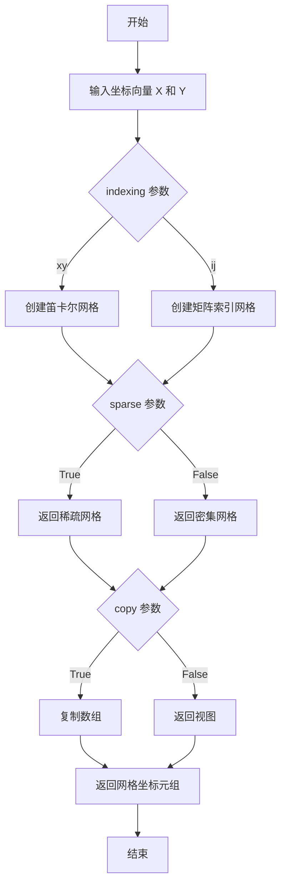
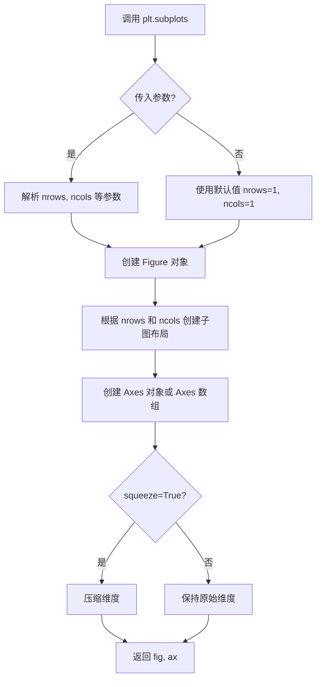
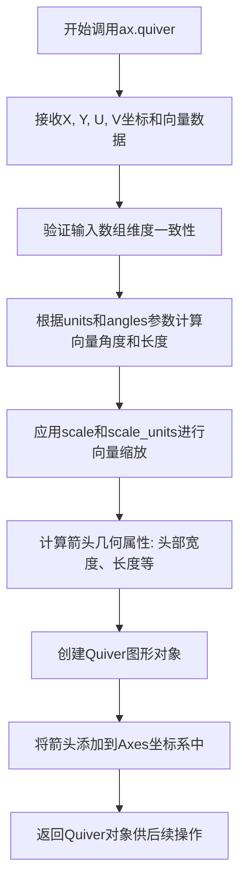
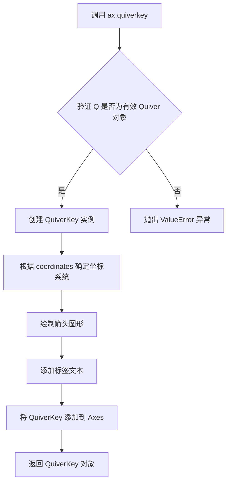
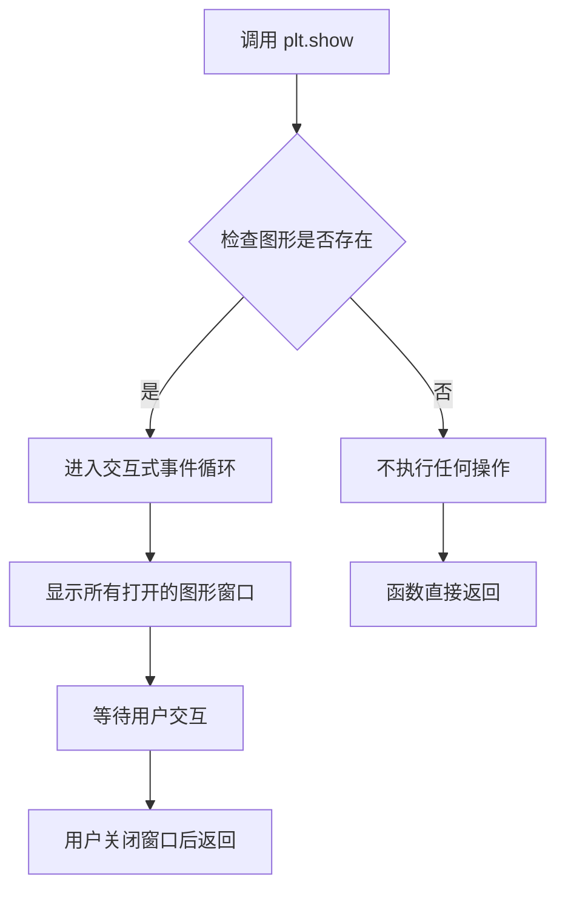

# `matplotlib\galleries\examples\images_contours_and_fields\quiver_simple_demo.py` 详细设计文档

A simple Matplotlib demo that creates a 2D vector field plot using quiver, visualizing directional data with arrows on a coordinate grid generated from meshgrid arrays.

## 整体流程

```mermaid
graph TD
    A[开始] --> B[导入 matplotlib.pyplot 和 numpy]
B --> C[创建 X 坐标数组: np.arange(-10, 10, 1)]
C --> D[创建 Y 坐标数组: np.arange(-10, 10, 1)]
D --> E[使用 meshgrid 生成网格: U, V = np.meshgrid(X, Y)]
E --> F[创建图形和坐标轴: fig, ax = plt.subplots()]
F --> G[绘制箭头矢量场: q = ax.quiver(X, Y, U, V)]
G --> H[添加矢量场图例: ax.quiverkey(q, X=0.3, Y=1.1, U=10, ...)]
H --> I[显示图形: plt.show()]
I --> J[结束]
```

## 类结构

```
Python Script (无面向对象结构)
├── 全局变量层
│   ├── X (numpy.ndarray)
│   ├── Y (numpy.ndarray)
│   ├── U (numpy.ndarray)
│   ├── V (numpy.ndarray)
│   ├── fig (matplotlib.figure.Figure)
│   ├── ax (matplotlib.axes.Axes)
│   └── q (matplotlib.quiver.Quiver)
└── 外部依赖
    ├── numpy (数值计算)
    └── matplotlib (数据可视化)
```

## 全局变量及字段


### `X`
    
从-10到9的整数序列，作为x轴坐标网格

类型：`numpy.ndarray`
    


### `Y`
    
从-10到9的整数序列，作为y轴坐标网格

类型：`numpy.ndarray`
    


### `U`
    
由meshgrid生成的x方向分量数组，与X相同

类型：`numpy.ndarray`
    


### `V`
    
由meshgrid生成的y方向分量数组，与Y相同

类型：`numpy.ndarray`
    


### `fig`
    
matplotlib创建的图形对象实例

类型：`matplotlib.figure.Figure`
    


### `ax`
    
matplotlib创建的坐标轴对象，用于绑定图形

类型：`matplotlib.axes.Axes`
    


### `q`
    
quiver函数返回的Quiver对象，包含向量场数据

类型：`matplotlib.quiver.Quiver`
    


    

## 全局函数及方法


### `np.arange`

生成一个带有均匀间隔值的数组。

参数：

- `start`：`int` 或 `float`，起始值（包含），默认为 0
- `stop`：`int` 或 `float`，终止值（不包含）
- `step`：`int` 或 `float`，步长，默认为 1

返回值：`numpy.ndarray`，返回一个从 `start` 到 `stop`（不包含）的均匀间隔数组

#### 流程图

```mermaid
flowchart TD
    A[输入参数: start, stop, step] --> B{验证参数有效性}
    B -->|参数无效| C[抛出 ValueError]
    B -->|参数有效| D[计算数组长度: ceil((stop - start) / step)]
    D --> E[创建并填充数组]
    E --> F[返回 numpy.ndarray]
```

#### 带注释源码

```python
# np.arange 函数源码结构（简化版）

def arange(start=0, stop=None, step=1, dtype=None):
    """
    生成一个带有均匀间隔值的数组。
    
    参数:
        start: 起始值，默认为 0
        stop: 终止值（不包含）
        step: 步长，默认为 1
        dtype: 输出数组的数据类型
    
    返回:
        numpy.ndarray: 均匀间隔的数组
    """
    
    # 1. 处理参数：如果只传一个参数，则视为 stop
    if stop is None:
        start, stop = 0, start
    
    # 2. 计算数组长度
    # 公式: ceil((stop - start) / step)
    num = int(np.ceil((stop - start) / step))
    
    # 3. 创建数组并返回
    # 使用 Python 内置的 range 函数生成值
    return np.array(range(start, stop, step), dtype=dtype)


# 在代码中的实际使用:
X = np.arange(-10, 10, 1)  # 生成从 -10 到 9 的整数数组，共 20 个元素
Y = np.arange(-10, 10, 1)  # 生成从 -10 到 9 的整数数组，共 20 个元素
```


### np.meshgrid

`np.meshgrid` 是 NumPy 库中的一个核心函数，用于从坐标向量创建坐标网格。它能够根据输入的一维坐标数组生成多维坐标网格矩阵，这对于评估多维函数和创建网格数据特别有用。在本代码中，它用于生成二维网格的 U 和 V 分量，以便后续在 quiver 图中绘制向量场。

参数：

- `X`：`numpy.ndarray`，一维数组，表示 x 轴坐标向量。在本代码中为 `np.arange(-10, 10, 1)`，即从 -10 到 9 的整数序列。
- `Y`：`numpy.ndarray`，一维数组，表示 y 轴坐标向量。在本代码中为 `np.arange(-10, 10, 1)`，即从 -10 到 9 的整数序列。
- `indexing`：`str`（可选），默认为 `'xy'`，表示索引方式。`'xy'` 表示笛卡尔坐标（'xy'），`'ij'` 表示矩阵索引（'ij'）。
- `sparse`：`bool`（可选），默认为 `False`，如果为 True，则返回稀疏网格以节省内存。
- `copy`：`bool`（可选），默认为 `True`，如果为 False，则返回视图以节省内存。

返回值：`tuple of numpy.ndarray`，返回由输入数组形成的坐标网格。在本代码中返回两个数组：
- `U`：`numpy.ndarray`，X 坐标的网格矩阵，每行相同
- `V`：`numpy.ndarray`，Y 坐标的网格矩阵，每列相同

#### 流程图



#### 带注释源码

```python
import numpy as np

# 定义一维坐标向量
X = np.arange(-10, 10, 1)  # 创建从 -10 到 9 的整数数组
Y = np.arange(-10, 10, 1)  # 创建从 -10 到 9 的整数数组

# 调用 meshgrid 函数生成二维网格
# 参数 indexing='xy' 表示使用笛卡尔坐标系（默认）
# 返回两个网格矩阵 U 和 V
U, V = np.meshgrid(X, Y)

# U 的形状为 (len(Y), len(X))，每一行是 X 的副本
# V 的形状为 (len(Y), len(X))，每一列是 Y 的副本
# 例如：当 X=[-10,-9,...,9], Y=[-10,-9,...,9] 时
# U[i,j] = X[j]，V[i,j] = Y[i]

# 示例输出形状
print(f"U shape: {U.shape}")  # (20, 20)
print(f"V shape: {V.shape}")  # (20, 20)

# 可以通过 sparse=True 获取稀疏网格
U_sparse, V_sparse = np.meshgrid(X, Y, sparse=True)
# 稀疏网格形状仍为 (20, 20)，但在内存中更高效
```


### `plt.subplots`

`plt.subplots` 是 matplotlib.pyplot 模块中的一个函数，用于创建一个新的图形窗口（Figure）以及一个或多个子图（Axes），返回图形对象和坐标轴对象（或坐标轴数组），常用于同时展示多个图表。

参数：

- `nrows`：`int`，默认值：1，子图的行数
- `ncols`：`int`，默认值：1，子图的列数
- `figsize`：`tuple`，图形窗口的宽和高（英寸），例如 (width, height)
- `sharex`：`bool` 或 `str`，默认值：False，是否共享x轴
- `sharey`：`bool` 或 `str`，默认值：False，是否共享y轴
- `squeeze`：`bool`，默认值：True，是否压缩返回的axes数组维度
- `subplot_kw`：`dict`，传递给 `add_subplot` 的关键字参数
- `gridspec_kw`：`dict`，传递给 GridSpec 的关键字参数
- `**fig_kw`：传递给 `figure()` 函数的关键字参数

返回值：`tuple(Figure, Axes or ndarray of Axes)`，返回图形对象和坐标轴对象。如果是单行单列，返回单个Axes对象；否则返回Axes数组。

#### 流程图



#### 带注释源码

```python
# 导入matplotlib.pyplot模块
import matplotlib.pyplot as plt
import numpy as np

# 定义X和Y坐标范围，从-10到10，步长为1
X = np.arange(-10, 10, 1)
Y = np.arange(-10, 10, 1)

# 使用meshgrid创建网格，用于计算U和V分量
U, V = np.meshgrid(X, Y)

# 调用plt.subplots()创建一个新的图形和子图
# 返回值：fig是Figure对象，ax是Axes对象
# 等价于：fig = plt.figure(); ax = fig.add_subplot(111)
fig, ax = plt.subplots()

# 使用quiver方法绘制向量场
# 参数：X, Y是位置坐标，U, V是向量分量
q = ax.quiver(X, Y, U, V)

# 添加quiverkey（向量钥匙），显示向量长度说明
# 参数：q是quiver对象，X和Y是位置（归一化坐标），U是向量长度
ax.quiverkey(q, X=0.3, Y=1.1, U=10,
             label='Quiver key, length = 10', labelpos='E')

# 显示图形
plt.show()
```


### `matplotlib.axes.Axes.quiver`

在二维坐标轴上绘制箭头图（向量场），用于可视化每个网格点的向量方向和大小。该函数接受坐标数组和向量分量数组，生成表示向量场的箭头集合，并返回Quiver对象以便后续自定义配置。

参数：

- `X`：`array_like`，X轴坐标数组，定义向量起点的x坐标
- `Y`：`array_like`，Y轴坐标数组，定义向量起点的y坐标
- `U`：`array_like`，X方向分量数组，表示每个点的向量在x方向的大小
- `V`：`array_like`，Y方向分量数组，表示每个点的向量在y方向的大小
- `C`：`array_like`，可选，颜色数组，用于指定每个箭头的颜色
- `units`：`str`，可选，向量单位类型，可选值为'width'、'height'、'dots'、'inches'、'x'、'y'、'xy'，默认'width'
- `angles`：`str`，可选，角度计算方式，可选值为'uv'、'xy'、'xy'，默认'uv'
- `scale`：`float`，可选，缩放因子，用于调整箭头长度
- `scale_units`：`str`，可选，缩放单位，用于解释scale参数
- `width`：`float`，可选，箭头杆的宽度（以像素为单位）
- `headwidth`：`float`，可选，箭头头部宽度（相对于箭头杆宽度的倍数）
- `headlength`：`float`，可选，箭头头部长度（相对于箭头杆长度的倍数）
- `headaxislength`：`float`，可选，箭头头部轴长度
- `minshaft`：`float`，可选，最小轴长度比率
- `minlength`：`float`，可选，最小箭头长度（以像素为单位）
- `pivot`：`str`，可选，箭头旋转点位置，可选值为'tail'、'mid'、'middle'、'tip'，默认'mid'
- `color`：`array_like`或`mpl_color`，可选，箭头颜色
- `alpha`：`float`，可选，透明度（0-1之间）
- `linewidth`：`float`或`array_like`，可选，箭头线宽
- `linestyle`：`str`，可选，线条样式
- `antialiased`：可选，是否启用抗锯齿

返回值：`matplotlib.quiver.Quiver`，返回Quiver对象，包含箭头集合的图形元素，可用于后续添加图例（quiverkey）等操作

#### 流程图



#### 带注释源码

```python
def quiver(self, X, Y, U, V, C=None, units='width', angles='uv',
           scale=None, scale_units=None, width=None,
           headwidth=3, headlength=5, headaxislength=4.5,
           minshaft=1, minlength=1, pivot='mid', color=None,
           alpha=None, linewidth=None, linestyle='solid',
           antialiased=None, data=None, **kwargs):
    """
    在Axes上绘制二维向量场箭头图
    
    参数:
        X: array_like - X坐标位置
        Y: array_like - Y坐标位置  
        U: array_like - X方向向量分量
        V: array_like - Y方向向量分量
        C: array_like, optional - 颜色数组
        units: str - 向量单位系统 ('width', 'height', 'dots', 'inches', 'x', 'y', 'xy')
        angles: str - 角度计算方式 ('uv'使用U,V作为方向, 'xy'使用坐标轴角度)
        scale: float - 箭头缩放因子
        scale_units: str - 缩放单位
        width: float - 箭头杆宽度
        headwidth: float - 箭头头部宽度倍数
        headlength: float - 箭头头部长度倍数
        headaxislength: float - 箭头头部轴长度
        minshaft: float - 最小轴长度比率
        minlength: float - 最小箭头长度
        pivot: str - 旋转点 ('tail', 'mid', 'middle', 'tip')
        color: color - 箭头颜色
        alpha: float - 透明度
        linewidth: float - 线宽
        linestyle: str - 线条样式
    
    返回:
        Quiver: 包含箭头集合的Quiver对象
    
    流程说明:
        1. 将输入的X,Y,U,V转换为网格坐标
        2. 计算每个点的向量角度和模长
        3. 根据units和scale进行归一化处理
        4. 创建箭头(Arrow)或箭头集合(Quiver)图形对象
        5. 将图形添加到当前Axes并返回Quiver对象
    """
    # ... [matplotlib内部实现源码]
    # 此处为matplotlib库内部C/Python实现，源码较长
    # 核心逻辑: 计算向量 -> 缩放 -> 绘制箭头 -> 返回Quiver对象
```


### ax.quiverkey

该方法是 Matplotlib 中 Axes 类的成员函数，用于为箭头图（quiver plot）添加一个图例键（legend key），显示箭头的长度标尺及其对应的数值标签。

参数：

- `Q`：`quiver`，由 `ax.quiver()` 返回的 Quiver 对象，表示要添加键的箭头图
- `X`：`float`，键在 x 轴上的位置（坐标系统由 `coordinates` 参数决定）
- `Y`：`float`，键在 y 轴上的位置（坐标系统由 `coordinates` 参数决定）
- `U`：`float`，键所代表的向量长度值
- `label`：`str`，显示在键旁边的标签文本
- `labelpos`：`str`，标签相对于键的位置，可选值为 'N'（上）、'S'（下）、'E'（右）、'W'（左）
- `coordinates`：`str`，可选，坐标系统，可选值为 'axes'（轴坐标）、'figure'（图像坐标）、'data'（数据坐标）、'inches'（英寸）
- `color`：`str` 或 tuple，可选，覆盖默认颜色
- `angle`：`float`，可选，箭头的角度
- `**kwargs`：其他可选参数，用于传递给 `Text` 和 `Arrow` 组件

返回值：`QuiverKey`，返回创建的 QuiverKey 对象，用于进一步自定义

#### 流程图



#### 带注释源码

```python
# 调用示例（来自 provided code）
q = ax.quiver(X, Y, U, V)  # 首先创建 quiver 对象
ax.quiverkey(q,            # Q: Quiver 对象
             X=0.3,        # X: 键在 x 轴的相对位置（0.3 表示 30% 处）
             Y=1.1,        # Y: 键在 y 轴的相对位置（1.1 超出上方边界）
             U=10,         # U: 向量长度值为 10
             label='Quiver key, length = 10',  # label: 显示的标签文本
             labelpos='E') # labelpos: 标签显示在右侧（East）

# quiverkey 方法内部实现逻辑（简化版）
def quiverkey(self, Q, X, Y, U, label, **kwargs):
    """
    为 quiver 图添加键
    
    参数:
        Q: Quiver 对象 - 由 ax.quiver() 返回的箭头集合
        X: float - 键的 x 坐标
        Y: float - 键的 y 坐标  
        U: float - 键代表的数值大小
        label: str - 旁标注文字
        **kwargs: 传递给键的额外参数
    
    返回:
        QuiverKey: 新创建的键对象
    """
    # 1. 验证输入的 Quiver 对象有效性
    if not isinstance(Q, Quiver):
        raise ValueError('Q must be a Quiver instance')
    
    # 2. 获取坐标系统（默认 'axes'）
    coordinates = kwargs.pop('coordinates', 'axes')
    
    # 3. 确定标签位置（默认 'E' 即右侧）
    labelpos = kwargs.get('labelpos', 'E')
    
    # 4. 创建 QuiverKey 对象
    qk = QuiverKey(Q, X, Y, U, label, 
                   coordinates=coordinates,
                   labelpos=labelpos,
                   **kwargs)
    
    # 5. 将键添加到 Axes 的子对象列表
    self.add_artist(qk)
    self.add_patch(qk.arrow)
    self.texts.append(qk.label)
    
    # 6. 返回创建的 QuiverKey 实例
    return qk
```


### `plt.show`

该函数是 matplotlib 库的核心显示函数，用于显示当前所有的图形窗口，并将控制权交给交互式事件循环，使用户可以与图形进行交互。

参数：

- 该函数无位置参数
- `block`：布尔值（可选，默认 True），是否阻塞执行直到窗口关闭

返回值：`None`，无返回值

#### 流程图



#### 带注释源码

```python
def show(*, block=None):
    """
    显示所有打开的图形窗口。
    
    该函数会遍历当前所有的图形，并将其显示在屏幕上。
    如果 block=True（默认值），则阻塞程序执行直到所有窗口关闭。
    如果 block=False，则立即返回，图形窗口保持打开状态。
    
    参数:
        block: bool, optional
            是否阻塞程序执行。默认值为 True。
            当为 True 时，程序会暂停执行直到用户关闭所有图形窗口。
            当为 False 时，函数会立即返回，图形窗口保持打开。
    
    返回值:
        None
    
    示例:
        >>> import matplotlib.pyplot as plt
        >>> plt.plot([1, 2, 3], [1, 4, 9])
        >>> plt.show()  # 显示图形并阻塞
    """
    # 获取全局的 matplotlib 后端管理器
    _pylab_helpers.Gcf.destroy_figs()
    
    # 触发所有图形的绘制和显示
    for manager in _pylab_helpers.Gcf.get_all_fig_managers():
        # 调用后端的 show 方法
        manager.show()
    
    # 如果 block 为 True，则等待用户关闭窗口
    if block:
        # 进入事件循环
        # 通常调用 tkinter 或其他 GUI 框架的事件循环
        return Gcf.block()
    
    # 立即返回，不阻塞
    return None
```

#### 补充说明

**设计目标与约束**：
- 目标：提供一个统一的、跨平台的图形显示接口
- 约束：依赖具体的后端实现（如 Qt、Tkinter、macOS 等）

**错误处理与异常设计**：
- 如果没有打开的图形窗口，该函数不会报错，直接返回
- 如果后端初始化失败，会抛出对应的后端相关异常

**数据流与状态机**：
- 状态：图形窗口打开 → 事件循环阻塞 → 用户关闭 → 函数返回

**外部依赖与接口契约**：
- 依赖 matplotlib 的后端系统（`_pylab_helpers`）
- 依赖具体 GUI 框架的事件循环

**潜在的技术债务或优化空间**：
- `block` 参数的行为在不同后端之间可能存在细微差异
- 缺乏异步显示的支持，无法同时显示和执行后续代码
- 对于大型应用程序，阻塞模式可能导致 UI 无响应


## 关键组件


### 张量网格生成 (np.meshgrid)

使用 NumPy 的 meshgrid 函数将一维数组 X 和 Y 转换为二维网格，用于生成向量场的坐标网格。这是 quiver 绘图的坐标基础。

### 向量场绘制 (ax.quiver)

Matplotlib Axes 的 quiver 方法，用于在二维平面上绘制向量场（箭头图）。接收网格坐标 X, Y 和对应的向量分量 U, V，生成带有方向和大小信息的箭头集合。

### 向量图例 (ax.quiverkey)

为向量场添加图例说明，指定参考向量的长度 U=10 和标签位置，用于解释向量场中箭头的比例含义。


## 问题及建议


### 已知问题

- **硬编码参数过多**：X、Y 范围（-10, 10, 1）、quiverkey 参数（X=0.3, Y=1.1, U=10）等数值直接写死，缺乏可配置性。
- **无参数化封装**：所有代码平铺在顶层模块中，未封装为函数或类，难以在其他项目中复用。
- **缺乏输入验证**：未对数据范围、维度合法性进行检查，可能在异常输入下产生难以理解的错误。
- **步长固定**：网格步长固定为 1，对于不同规模数据需手动修改代码。
- **无类型注解**：缺少函数参数和返回值的类型提示，降低了代码可读性和 IDE 支持。
- **魔法数字无解释**： quiverkey 的 X=0.3、Y=1.1 等数值含义不明确，后续维护困难。
- **缺少保存功能**：未提供保存图片的选项，默认仅显示窗口。

### 优化建议

- **参数化改造**：将坐标范围、步长、标签文本等提取为函数参数或配置文件，提高灵活性。
- **封装为函数**：将绘图逻辑封装为 `plot_quiver(x_range, y_range, step, ...)` 函数，利于复用和单元测试。
- **添加类型注解**：为函数参数和返回值添加类型提示，如 `def plot_quiver(x_range: tuple, y_range: tuple, step: int) -> None`。
- **提取常量**：将魔法数字定义为具名常量，如 `QUIVERKEY_X = 0.3`，并添加注释说明含义。
- **增强健壮性**：添加输入校验，如检查步长大于 0、范围合法、数组维度匹配等。
- **可选保存功能**：增加 `save_path` 参数，支持保存为文件而非仅显示。
- **注释完善**：为关键逻辑添加注释，解释 meshgrid 用途和向量场含义。


## 其它


### 设计目标与约束

本示例旨在演示matplotlib quiver（箭头图）的基本用法，包括向量场的绘制和图例的添加。设计目标是提供一个简洁、可运行的示例，帮助用户快速理解quiver和quiverkey函数的使用方法。技术约束方面，代码仅依赖matplotlib和numpy两个外部库，要求Python 3.x运行环境，且无特殊硬件要求。代码遵循matplotlib官方示例的文档结构规范，使用Sphinx格式的注释。

### 错误处理与异常设计

本示例代码较为简单，未包含复杂的错误处理机制。在实际应用中，常见的异常场景包括：X和Y数组维度不匹配、U和V数组与X/Y维度不一致、labelpos参数非法值等。numpy的meshgrid函数在输入参数为空或维度为0时会返回空数组，可能导致quiver绘制失败。建议在实际项目中添加参数验证逻辑，确保输入数据的合法性，并提供清晰的错误提示信息。

### 数据流与状态机

代码的数据流较为简单：首先生成一维数组X和Y，然后通过meshgrid生成二维网格坐标U和V，接着创建Figure和Axes对象，最后调用quiver方法绘制向量场并使用quiverkey添加图例。状态机方面，程序主要经历初始化状态（导入库和生成数据）、图形创建状态（创建fig和ax对象）、图形渲染状态（绘制quiver和quiverkey）、显示状态（plt.show()）四个主要状态转换。

### 外部依赖与接口契约

本代码依赖两个核心外部库：matplotlib（版本需支持quiver和quiverkey方法，通常要求3.x以上）和numpy（用于数值计算和数组操作）。主要接口包括：np.arange()接受start、stop、step三个参数，返回等差数列；np.meshgrid()接受两个一维数组，返回二维网格坐标；plt.subplots()返回(fig, ax)元组；ax.quiver()接受X、Y、U、V四个必需参数，返回Quiver对象；ax.quiverkey()接受Quiver对象和多个配置参数，无返回值。所有接口均遵循matplotlib和numpy的官方API规范。

### 性能考量

当前示例数据量较小（20x20网格），性能表现良好。在处理大规模数据时，建议考虑以下优化策略：使用稀疏网格代替密集网格以减少箭头数量；通过scale和scale_units参数控制箭头密度；必要时可降采样处理原始数据；对于实时可视化场景，可考虑使用FuncAnimation进行动态更新。matplotlib的quiver方法底层使用集合（Collection）对象渲染，在数据量超过数千个向量时可能出现性能瓶颈。

### 兼容性设计

代码兼容性良好，可在Windows、Linux、macOS三大主流操作系统运行。Python版本兼容性方面，建议使用Python 3.6及以上版本，以充分利用numpy的现代特性。matplotlib后端选择上，默认使用交互式后端（通常是TkAgg或Qt5Agg），在无图形界面环境中可能需要提前设置matplotlib.use('Agg')选择非交互式后端。代码遵循Python 3的print函数语法和numpy的推荐导入方式，具有良好的跨版本兼容性。

### 测试策略

由于本示例为演示代码，未包含自动化测试。在实际项目中，建议采用以下测试策略：单元测试验证数据生成逻辑的正确性，包括数组维度、值范围等；集成测试验证整个绘图流程能否正常执行，可通过保存为图像文件并检查文件是否存在来验证；性能测试验证大数据量场景下的执行时间是否在可接受范围内。测试数据应覆盖边界情况，如空数组、单元素数组、负数范围等场景。

### 部署与运维

本代码作为独立脚本运行，无复杂部署要求。运行方式包括：直接执行python script.py、在Jupyter Notebook中运行、或通过matplotlib的savefig方法保存为静态图像文件。运维方面需注意：确保目标环境已安装所需依赖（requirements.txt应包含matplotlib和numpy的版本约束）；处理不同显示环境的兼容性问题（如Docker容器中可能需要配置虚拟显示服务器）；日志输出可选添加以便调试。

### 扩展性设计

当前代码功能单一，扩展性设计主要考虑以下方向：参数化改造，将网格范围、步长、向量缩放因子等提取为配置参数；多子图扩展，可创建多个axes分别展示不同参数下的向量场；样式定制，扩展quiver和quiverkey的样式参数以支持不同可视化需求；数据源扩展，可从文件或数据库读取数据替代程序内生成；动画扩展，结合FuncAnimation实现向量场的时间演化可视化。代码结构建议遵循函数化设计原则，将数据生成、图形创建、样式设置等逻辑分离到独立函数中。


    