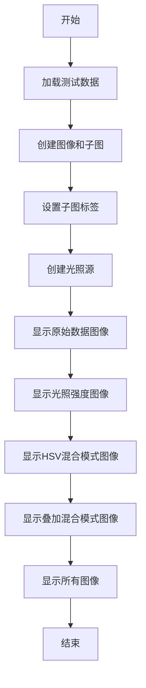
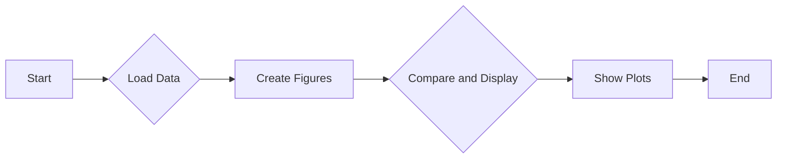
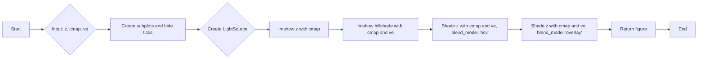
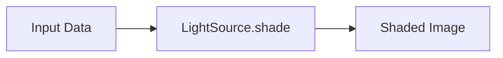

# `matplotlib\galleries\examples\images_contours_and_fields\shading_example.py` 详细设计文档

This code generates shaded relief plots using matplotlib and numpy, comparing different blending modes for visualizing elevation data.

## 整体流程



## 类结构

```
main
compare
```

## 全局变量及字段


### `x`
    
2D grid of x coordinates for the plot.

类型：`numpy.ndarray`
    


### `y`
    
2D grid of y coordinates for the plot.

类型：`numpy.ndarray`
    


### `z`
    
3D grid of z values for the plot, calculated based on x and y coordinates.

类型：`numpy.ndarray`
    


### `dem`
    
Digital elevation model data loaded from a file.

类型：`numpy.ndarray`
    


### `elev`
    
Elevation data extracted from the digital elevation model.

类型：`numpy.ndarray`
    


### `fig`
    
Figure object containing the plot.

类型：`matplotlib.figure.Figure`
    


### `axs`
    
Array of axes objects for the subplots.

类型：`numpy.ndarray of matplotlib.axes.Axes`
    


### `ls`
    
Light source object for illuminating the plot.

类型：`matplotlib.colors.LightSource`
    


### `cmap`
    
Colormap name to be used for the plot.

类型：`str`
    


### `ve`
    
Vertical exaggeration factor for the hillshade calculation.

类型：`float`
    


### `LightSource.LightSource.azdeg`
    
Azimuth angle of the light source in degrees.

类型：`int`
    


### `LightSource.LightSource.altdeg`
    
Altitude angle of the light source in degrees.

类型：`int`
    
    

## 全局函数及方法


### main()

该函数是程序的入口点，负责生成并显示两个比较图，一个是使用HSV混合模式的图，另一个是使用overlay混合模式的图。

参数：

- 无

返回值：无

#### 流程图



#### 带注释源码

```python
def main():
    # Test data
    x, y = np.mgrid[-5:5:0.05, -5:5:0.05]
    z = 5 * (np.sqrt(x**2 + y**2) + np.sin(x**2 + y**2))

    dem = cbook.get_sample_data('jacksboro_fault_dem.npz')
    elev = dem['elevation']

    fig = compare(z, plt.colormaps["copper"])
    fig.suptitle('HSV Blending Looks Best with Smooth Surfaces', y=0.95)

    fig = compare(elev, plt.colormaps["gist_earth"], ve=0.05)
    fig.suptitle('Overlay Blending Looks Best with Rough Surfaces', y=0.95)

    plt.show()
```


### compare

The `compare` function generates a comparison of different visualizations of a given data set using colormaps and lighting effects.

参数：

- `z`：`numpy.ndarray`，The data set to be visualized.
- `cmap`：`str` or `Colormap`，The colormap to use for the visualization.
- `ve`：`float`，The vertical exaggeration for the hillshade visualization. Default is 1.

返回值：`matplotlib.figure.Figure`，The generated figure containing the visualizations.

#### 流程图



#### 带注释源码

```python
def compare(z, cmap, ve=1):
    # Create subplots and hide ticks
    fig, axs = plt.subplots(ncols=2, nrows=2)
    for ax in axs.flat:
        ax.set(xticks=[], yticks=[])

    # Illuminate the scene from the northwest
    ls = LightSource(azdeg=315, altdeg=45)

    axs[0, 0].imshow(z, cmap=cmap)
    axs[0, 0].set(xlabel='Colormapped Data')

    axs[0, 1].imshow(ls.hillshade(z, vert_exag=ve), cmap='gray')
    axs[0, 1].set(xlabel='Illumination Intensity')

    rgb = ls.shade(z, cmap=cmap, vert_exag=ve, blend_mode='hsv')
    axs[1, 0].imshow(rgb)
    axs[1, 0].set(xlabel='Blend Mode: "hsv" (default)')

    rgb = ls.shade(z, cmap=cmap, vert_exag=ve, blend_mode='overlay')
    axs[1, 1].imshow(rgb)
    axs[1, 1].set(xlabel='Blend Mode: "overlay"')

    return fig
```


### LightSource.hillshade

This function calculates the hillshade of a given elevation data, simulating the effect of light on a surface to create a shaded relief plot.

参数：

- `z`：`numpy.ndarray`，The elevation data to be shaded. It should be a 2D array representing the surface elevation.
- `vert_exag`：`float`，The vertical exaggeration factor. This controls the intensity of the shading effect. Default is 1.

返回值：`numpy.ndarray`，The hillshade image, which is a 2D array with the same shape as `z`.

#### 流程图

```mermaid
graph LR
A[Input: z (numpy.ndarray)] --> B{Is z 2D?}
B -- Yes --> C[Calculate hillshade]
B -- No --> D[Error: z must be 2D]
C --> E[Return hillshade (numpy.ndarray)]
```

#### 带注释源码

```python
def hillshade(self, z, vert_exag=1):
    """
    Calculate the hillshade of the elevation data.

    Parameters
    ----------
    z : numpy.ndarray
        The elevation data to be shaded. It should be a 2D array representing the surface elevation.
    vert_exag : float, optional
        The vertical exaggeration factor. This controls the intensity of the shading effect. Default is 1.

    Returns
    -------
    numpy.ndarray
        The hillshade image, which is a 2D array with the same shape as `z`.
    """
    # Calculate the gradient of the elevation data
    grad = np.gradient(z)

    # Calculate the azimuth and altitude of the light source
    azdeg = self.azdeg
    altdeg = self.altdeg

    # Convert degrees to radians
    az = np.radians(azdeg)
    alt = np.radians(altdeg)

    # Calculate the hillshade
    hillshade = np.sin(alt) * grad[0] + np.cos(alt) * grad[1]

    # Apply vertical exaggeration
    hillshade *= vert_exag

    return hillshade
```


### LightSource.shade

`LightSource.shade` 方法用于根据给定的颜色映射和光照模型对数据集进行着色。

参数：

- `z`：`numpy.ndarray`，表示高度数据。
- `cmap`：`str` 或 `Colormap`，颜色映射。
- `vert_exag`：`float`，垂直 exaggeration，用于调整高度数据的垂直拉伸。
- `blend_mode`：`str`，混合模式，可以是 'hsv' 或 'overlay'。

返回值：`numpy.ndarray`，着色后的图像数据。

#### 流程图



#### 带注释源码

```python
rgb = ls.shade(z, cmap=cmap, vert_exag=ve, blend_mode='hsv')
```

在这行代码中，`ls` 是 `LightSource` 对象的实例，`z` 是高度数据，`cmap` 是颜色映射，`vert_exag` 是垂直 exaggeration，`blend_mode` 是混合模式。`shade` 方法返回着色后的图像数据，该数据被赋值给变量 `rgb`。

## 关键组件


### 张量索引与惰性加载

张量索引与惰性加载允许在处理大型数据集时，只加载和处理所需的数据部分，从而提高内存使用效率和计算速度。

### 反量化支持

反量化支持使得模型能够在量化过程中保持精度，通过将量化后的数据转换回原始数据类型，以便进行后续处理。

### 量化策略

量化策略定义了如何将浮点数转换为固定点数，包括量化位宽、精度等参数，以优化模型的计算效率和存储空间。

## 问题及建议


### 已知问题

-   {问题1}：代码中使用了硬编码的文件名 'jacksboro_fault_dem.npz'，这可能导致在非标准安装环境中找不到该文件。
-   {问题2}：`compare` 函数中的 `vert_exag` 参数默认值为 1，这可能不是所有情况下最佳的照明强度，需要根据具体数据进行调整。
-   {问题3}：代码中没有提供任何错误处理机制，如果输入数据格式不正确或文件读取失败，程序可能会崩溃。

### 优化建议

-   {建议1}：将文件名 'jacksboro_fault_dem.npz' 替换为相对路径或使用配置文件来指定文件路径，以便在不同环境中都能正确加载。
-   {建议2}：为 `compare` 函数中的 `vert_exag` 参数提供默认值，并允许用户通过参数调整照明强度，以适应不同的场景。
-   {建议3}：在代码中添加异常处理，确保在遇到错误时程序能够优雅地处理异常，并提供有用的错误信息。
-   {建议4}：考虑添加参数来允许用户选择不同的颜色映射，而不是硬编码为 "copper" 和 "gist_earth"。
-   {建议5}：在文档中添加对函数和参数的详细说明，以便其他开发者或用户能够更好地理解和使用代码。


## 其它


### 设计目标与约束

- 设计目标：
  - 实现一个能够生成类似 Mathematica 或 Generic Mapping Tools 的着色高程图。
  - 提供两种着色模式：HSV 混合和叠加混合。
  - 支持平滑和粗糙表面的着色效果。

- 约束条件：
  - 使用 Matplotlib 库进行图形绘制。
  - 使用 NumPy 库进行数据处理。
  - 代码应具有良好的可读性和可维护性。

### 错误处理与异常设计

- 错误处理：
  - 捕获并处理文件读取错误，如文件不存在或损坏。
  - 捕获并处理绘图错误，如坐标轴设置错误。

- 异常设计：
  - 使用 try-except 块来捕获和处理可能发生的异常。
  - 提供清晰的错误信息，帮助用户定位问题。

### 数据流与状态机

- 数据流：
  - 输入：高度数据（z）和颜色映射（cmap）。
  - 处理：使用 LightSource 类进行光照处理和着色。
  - 输出：着色后的图像。

- 状态机：
  - 无状态机，程序按顺序执行。

### 外部依赖与接口契约

- 外部依赖：
  - Matplotlib：用于图形绘制。
  - NumPy：用于数据处理。

- 接口契约：
  - `main()` 函数是程序的入口点。
  - `compare()` 函数接受高度数据和颜色映射，返回着色后的图像。
  - `LightSource` 类用于模拟光照效果。


    