# `matplotlib\galleries\examples\images_contours_and_fields\specgram_demo.py` 详细设计文档

该代码是一个使用matplotlib绘制信号频谱图的示例程序。它生成包含两个不同频率正弦波（100Hz和400Hz）的合成信号，添加高斯噪声，然后使用specgram方法绘制信号的时域波形和频域频谱图，展示信号在时间-频率域的分布特性。

## 整体流程

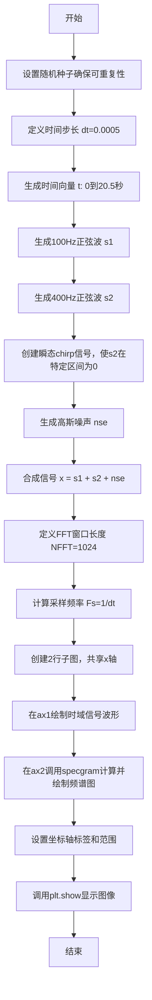

## 类结构

```
该脚本为面向过程式代码，无类定义
所有操作在顶层执行
主要使用matplotlib.axes.Axes和numpy.ndarray对象
```

## 全局变量及字段


### `dt`
    
时间步长（采样间隔）

类型：`float`
    


### `t`
    
时间向量，从0到20.5秒

类型：`numpy.ndarray`
    


### `s1`
    
100Hz正弦波信号

类型：`numpy.ndarray`
    


### `s2`
    
400Hz正弦波信号（含瞬态chirp）

类型：`numpy.ndarray`
    


### `nse`
    
随机高斯噪声

类型：`numpy.ndarray`
    


### `x`
    
合成后的完整信号

类型：`numpy.ndarray`
    


### `NFFT`
    
FFT窗口长度（1024）

类型：`int`
    


### `Fs`
    
采样频率（2000Hz）

类型：`float`
    


### `fig`
    
图形对象

类型：`matplotlib.figure.Figure`
    


### `ax1`
    
第一个子图（时域信号）

类型：`matplotlib.axes.Axes`
    


### `ax2`
    
第二个子图（频谱图）

类型：`matplotlib.axes.Axes`
    


### `Pxx`
    
功率谱密度

类型：`numpy.ndarray`
    


### `freqs`
    
频率向量

类型：`numpy.ndarray`
    


### `bins`
    
时间窗中心点

类型：`numpy.ndarray`
    


### `im`
    
频谱图像对象

类型：`matplotlib.image.AxesImage`
    


    

## 全局函数及方法


### `np.random.seed`

设置随机数生成器的种子，确保后续生成的随机数序列可重复，用于实现结果的可复现性（reproducibility）。

参数：

- `seed`：`int` 或 `None`，随机数种子值。当传入相同的种子时，后续生成的随机数序列将完全相同；传入 `None` 则每次随机选择种子。

返回值：`None`，该函数无返回值，仅修改随机数生成器的内部状态。

#### 流程图

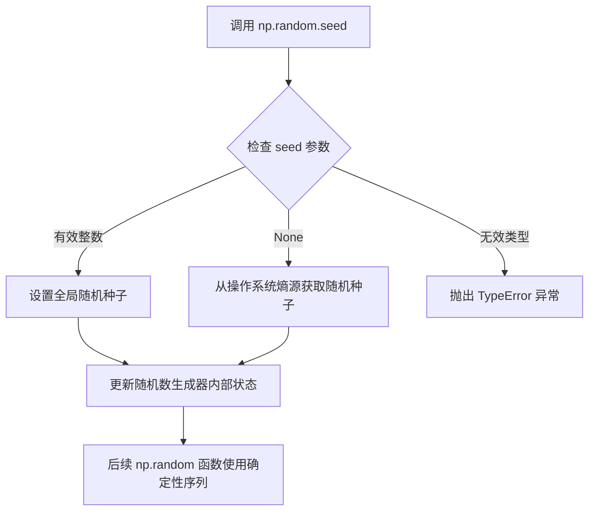

#### 带注释源码

```python
# 设置随机数种子为 19680801，确保后续随机数操作可复现
# 这个特定的值是 matplotlib 示例中的经典默认值
np.random.seed(19680801)

# 示例说明：
# 1. seed 参数类型：int（整数）
# 2. 调用后，np.random.random() 等函数将生成确定性的随机数序列
# 3. 当需要调试或复现结果时，使用此函数锁定随机性
# 4. 相同的种子值会产生完全相同的随机数序列
```


### `np.arange`

生成等间隔时间向量，用于创建均匀间隔的数值序列，常用于生成时间轴、频率轴等需要等间隔采样的场景。

参数：

- `start`：`float`，起始值，默认为0.0
- `stop`：`float`，结束值（不包含）
- `step`：`float`，步长，默认为1
- `dtype`：`dtype`，输出数组的数据类型，如果未指定则从输入参数推断

返回值：`ndarray`，返回均匀间隔的数值序列

#### 流程图

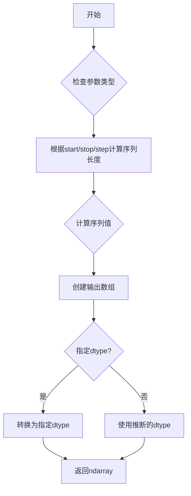

#### 带注释源码

```python
def arange(start=0.0, stop=None, step=1.0, dtype=None):
    """
    生成等间隔数值序列的函数
    
    参数:
        start: 序列起始值，默认为0.0
        stop: 序列结束值（不包含），当stop为None时，start作为stop使用
        step: 相邻值之间的间隔，可以为正数或负数
        dtype: 输出数组的数据类型
    
    返回值:
        ndarray: 包含等间隔数值的数组
    
    示例:
        >>> np.arange(0.0, 20.5, 0.0005)
        array([0.0000e+00, 5.0000e-04, 1.0000e-03, ..., 2.0495e+01, 2.0500e+01])
    """
    # 处理单个参数情况：arange(stop)
    if stop is None:
        start, stop = 0, start
    
    # 计算序列长度：(stop - start) / step
    # 使用浮点数计算以保证精度
    num = int(np.ceil((stop - start) / step)) if step != 0 else 0
    
    # 创建输出数组
    if num <= 0:
        return np.array([], dtype=dtype)
    
    # 使用步长生成数组
    # 这里实际调用的是C实现
    y = np.empty(num, dtype=dtype)
    if num > 0:
        y[0] = start
        for i in range(1, num):
            y[i] = y[i-1] + step
    
    return y
```


### `np.sin`

计算输入数组或标量的正弦值，返回对应的正弦结果（弧度制输入）。

参数：

- `x`：`array_like`，输入角度，单位为弧度，可以是标量或数组
- `out`：`ndarray, optional`，用于存放结果的数组，如果提供则结果将写入此数组
- `where`：`array_like, optional`，条件数组，条件为 True 的位置计算正弦值
- `order`：`int, optional`，计算精度顺序（已废弃）
- `dtype`：`data-type, optional`，指定返回数组的数据类型
- `subok`：`bool, optional`，是否保留子类（默认为 True）
- `signature`：`string, optional`，用于 ufunc 兼容性（已废弃）

返回值：`ndarray`，正弦值，范围在 [-1, 1] 之间，与输入数组形状相同

#### 流程图

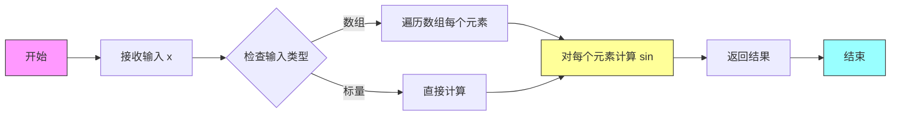

#### 带注释源码

```python
# np.sin 源码分析
# 位于 numpy/core/src/umath/ufunc_object.c 或 numpy/core/src/umath/sin.c

# 在 Python 层面的调用过程：
import numpy as np

# 示例代码中的实际使用：
t = np.arange(0.0, 20.5, dt)  # 时间数组
s1 = np.sin(2 * np.pi * 100 * t)  # 计算 100Hz 正弦波
s2 = np.sin(2 * np.pi * 400 * t)  # 计算 400Hz 正弦波

# 内部实现流程：
# 1. 将输入转换为弧度制（假设输入已是弧度）
# 2. 调用底层 C 函数计算正弦值
# 3. 返回 [-1, 1] 范围内的结果数组
# 
# 数学原理：sin(x) = (e^(ix) - e^(-ix)) / (2i)
# 
# 参数说明：
#   - 输入：弧度制的角度值
#   - 输出：对应角度的正弦值
```


### `np.random.random`

生成指定形状的随机浮点数数组，范围在[0, 1)之间。该函数是NumPy库提供的核心随机数生成函数，常用于生成噪声信号、初始化数据、蒙特卡洛模拟等场景。

#### 参数

- `size`：`int` 或 `tuple of ints` 或 `None`，可选。输出数组的形状。如果为`None`（默认值），则返回一个单一的随机浮点数。

#### 返回值

- `ndarray` 或 `float`，返回随机浮点数数组或单个随机浮点数。

#### 流程图

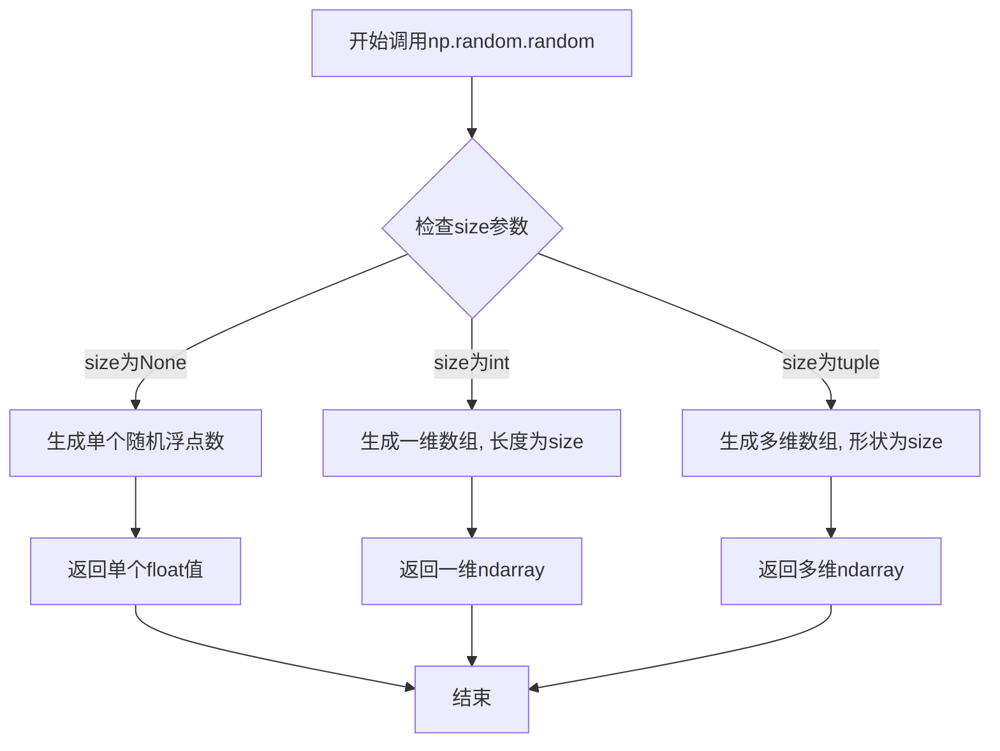

#### 带注释源码

```python
# 示例代码中的实际使用
nse = 0.01 * np.random.random(size=len(t))

# 详细解释：
# np.random.random(size=len(t)) 
#   - 参数size: len(t) 即时间数组t的长度
#   - 返回值: 一个包含len(t)个随机浮点数的numpy数组
#   - 每个值范围: [0.0, 1.0)
# 
# 0.01 * nse 的作用:
#   - 将随机数缩放至 [0, 0.01) 范围
#   - 作为噪声信号叠加到主信号上
#   - 模拟真实世界中的随机噪声干扰
```

#### 代码上下文分析

在给定的matplotlib spectrogram示例中，`np.random.random`的具体作用：

```python
# 生成与时间数组t长度相同的随机噪声数组
# len(t) = 20.5 / 0.0005 = 41000 个采样点
nse = 0.01 * np.random.random(size=len(t))

# 噪声数组的形状: (41000,)
# 噪声值范围: [0.0, 0.01)
# 最终噪声标准差约为 0.003 左右

# 将噪声叠加到纯净信号上
x = s1 + s2 + nse  # 最终观测信号 = 正弦波1 + 正弦波2 + 噪声
```

#### 技术细节

| 属性 | 值 |
|------|-----|
| 函数路径 | `numpy.random.random` |
| 随机数生成器 | Mersenne Twister (MT19937) |
| 输出范围 | [0.0, 1.0) |
| 数据类型 | float64 |

#### 潜在优化点

1. **性能优化**：对于大规模随机数生成，可考虑使用`numpy.random.Generator`（新API）获得更好的性能
2. **精度控制**：当前使用默认float64，如需节省内存可指定dtype
3. **可复现性**：建议使用`np.random.default_rng()`配合Generator以获得更清晰的随机状态管理


### `plt.subplots`

创建包含多个子图的图形界面，返回一个Figure对象和一个Axes对象（或Axes数组），用于在同一窗口中组织多个子图。

参数：

- `nrows`：`int`，行数，指定要创建的子图行数（此处为2）
- `ncols`：`int`，列数（未在此代码中使用，默认值为1）
- `sharex`：`bool`，是否共享x轴坐标轴（此处为True，表示子图共享x轴）
- `sharey`：`bool`，是否共享y轴坐标轴（未在此代码中使用）
- `squeeze`：`bool`，是否压缩返回的axes数组维度（未在此代码中使用）
- `subplot_kw`：`dict`，传递给add_subplot的关键字参数（未在此代码中使用）
- `gridspec_kw`：`dict`，传递给GridSpec的关键字参数（未在此代码中使用）
- `**fig_kw`：传递给figure函数的关键字参数（未在此代码中使用）

返回值：`tuple`，返回一个元组，包含(fig, axes)
- `fig`：`matplotlib.figure.Figure`，整个图形对象
- `axes`：`matplotlib.axes.Axes` or `numpy.ndarray`，子图轴对象数组

#### 流程图

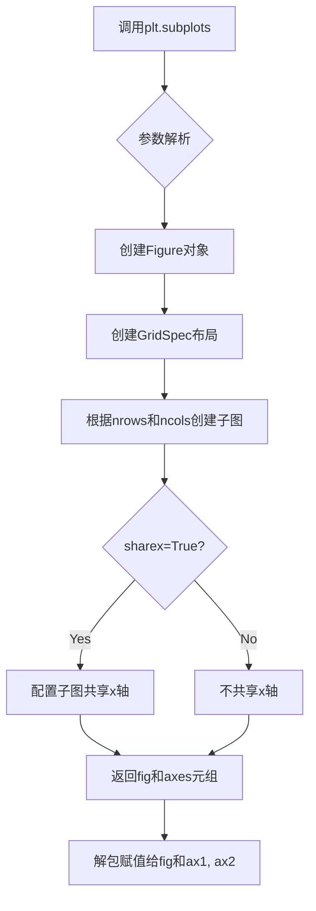

#### 带注释源码

```python
fig, (ax1, ax2) = plt.subplots(nrows=2, sharex=True)
# fig: matplotlib.figure.Figure - 整个图形窗口对象
# (ax1, ax2): tuple of matplotlib.axes.Axes - 包含2个子图轴对象的元组
# nrows=2: int - 创建2行子图
# sharex=True: bool - 让所有子图共享x轴,当缩放一个子图时其他子图同步调整

# 完整函数签名参考:
# matplotlib.pyplot.subplots(nrows=1, ncols=1, sharex=False, sharey=False, 
#                            squeeze=True, subplot_kw=None, gridspec_kw=None, **fig_kw)
```

---

### 关键组件信息

| 组件名称 | 一句话描述 |
|---------|-----------|
| Figure | 整个matplotlib图形容器对象，包含所有子图 |
| Axes | 坐标轴对象，代表单个子图区域 |
| GridSpec | 网格布局规范，定义子图的排列方式 |

---

### 潜在技术债务或优化空间

1. **缺少错误处理**：代码未对无效参数（如nrows<0）进行验证
2. **硬编码参数**：子图数量和共享属性直接写在代码中，缺乏灵活性
3. **文档注释**：缺少对返回axes对象的详细说明

---

### 其他项目

**设计目标与约束**：
- 目标是创建2行1列的子图布局
- 约束：sharex=True确保子图共享x轴刻度

**错误处理与异常设计**：
- 若nrows或ncols为0或负数，matplotlib会抛出ValueError
- 若sharex/sharey与布局冲突，可能产生意外行为

**数据流与状态机**：
- 初始状态：创建空Figure
- 中间状态：配置GridSpec和子图参数
- 最终状态：返回可用的Figure和Axes对象

**外部依赖与接口契约**：
- 依赖：matplotlib库
- 接口：返回标准matplotlib Figure和Axes对象，可直接用于后续绘图操作


### `ax1.plot`

在第一个子图（ax1）上绘制时域信号曲线，将时间序列数据可视化为折线图，以展示信号随时间变化的波形特征。

参数：

- `t`：`numpy.ndarray`，时间数组，自变量，表示采样时间点
- `x`：`numpy.ndarray`，信号数组，因变量，表示对应的信号幅值
- `format_string`：`str`（可选），格式字符串，用于指定线条颜色、标记和样式，如 'r-' 表示红色实线

返回值：`matplotlib.lines.Line2D`，返回绘制的线条对象，可用于进一步自定义线条属性（如颜色、线宽等）

#### 流程图

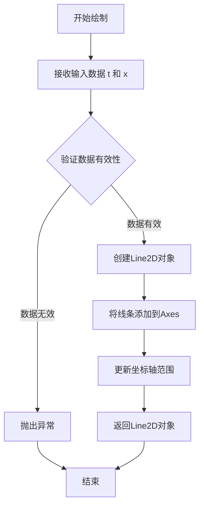

#### 带注释源码

```python
# ax1.plot(t, x) 源代码流程分析

# 1. 参数准备阶段
#    t: 时间数组，类型为 numpy.ndarray，形状为 (N,)
#    x: 信号数组，类型为 numpy.ndarray，形状为 (N,)

# 2. 方法调用流程（简化版）
line, = ax1.plot(t, x)  
# 等价于 ax1.plot(t, x) 返回 Line2D 对象列表，取第一个元素

# 内部实现逻辑：
# - Axes.plot 方法接收 (x, y) 参数对
# - 创建 matplotlib.lines.Line2D 实例
# - 设置数据：line.set_data(t, x)
# - 将线条添加到Axes：ax1.add_line(line)
# - 自动调整坐标轴 limits：ax1.autoscale_view()
# - 触发重绘：ax1.stale_callback (必要时)

# 3. 返回值说明
#    返回 matplotlib.lines.Line2D 对象
#    该对象包含线条的所有属性：
#    - line.get_color()     # 获取线条颜色
#    - line.get_linewidth() # 获取线条宽度
#    - line.get_xdata()     # 获取x数据
#    - line.get_ydata()     # 获取y数据
```


### `ax1.set_ylabel`

设置第一个子图（ax1）的y轴标签，用于在图表中标识y轴的含义。

参数：

- `ylabel`：`str`，要设置的y轴标签文本（例如 'Signal'）。

返回值：`matplotlib.axes.Axes`，返回axes对象本身，以支持链式调用。

#### 流程图


#### 带注释源码

```python
def set_ylabel(self, ylabel, fontdict=None, labelpad=None, **kwargs):
    """
    设置 y 轴标签。

    参数
    ----------
    ylabel : str
        标签文本内容。
    fontdict : dict, 可选
        控制标签外观的字典（如字体大小、颜色等）。
    labelpad : float, 可选
        标签与坐标轴之间的间距。
    **kwargs
        传递给文本对象的额外关键字参数（如 fontsize、color 等）。

    返回值
    -------
    self : matplotlib.axes.Axes
        返回 axes 对象本身，支持链式调用。
    """
    # 调用 yaxis 对象的 set_label_text 方法设置标签
    self.yaxis.set_label_text(ylabel, fontdict, labelpad, **kwargs)
    # 返回 axes 对象以支持链式调用
    return self
```


### Axes.specgram

该方法用于计算并绘制信号的频谱图（Spectrogram），通过短时傅里叶变换将信号分解到时频域，返回功率谱密度矩阵、频率向量、时间窗中心以及图像对象，适用于分析信号频率成分随时间的演变。

参数：
- `x`：`numpy.ndarray`，输入的一维信号数组，包含时域信号数据。
- `NFFT`：`int`，每个窗口的采样点数，决定频率分辨率，值越大频率分辨率越高但时间分辨率降低。
- `Fs`：`float`，采样频率，单位为Hz，用于将频率索引转换为实际频率值。
- `noverlap`：`int`（可选），相邻窗口之间的重叠采样点数，默认为0，增加重叠可提高时间分辨率。
- `mode`：`str`（可选），频谱类型，默认为'psd'，可选'complex'、'magnitude'、'angle'、'phase'。
- `scale`：`str`（可选），缩放类型，默认为'default'，可选'linear'、'dB'等。
- `sides`：`str`（可选），频谱边带，默认为'onesided'，可选'twosided'。
- `scale_by_freq`：`bool`（可选），是否按频率缩放，默认为True。
- `pad_to`：`int`（可选），填充后的FFT长度，默认为NFFT。
- `norm`：`str`（可选），归一化方式，默认为None。
- `interpolation`：`str`（可选），插值方法，默认为'bilinear'。

返回值：`tuple`，包含四个元素：
- `Pxx`：`numpy.ndarray`，功率谱密度矩阵，形状为 (NFFT/2+1, bins)，表示频率-时间的能量分布。
- `freqs`：`numpy.ndarray`，频率向量，长度为NFFT/2+1，对应Pxx的行索引。
- `bins`：`numpy.ndarray`，时间窗的中心时间点数组，长度为时间窗数量，对应Pxx的列索引。
- `im`：`matplotlib.image.AxesImage`，图像对象，表示频谱图，可用于调整颜色条、显示设置等。

#### 流程图

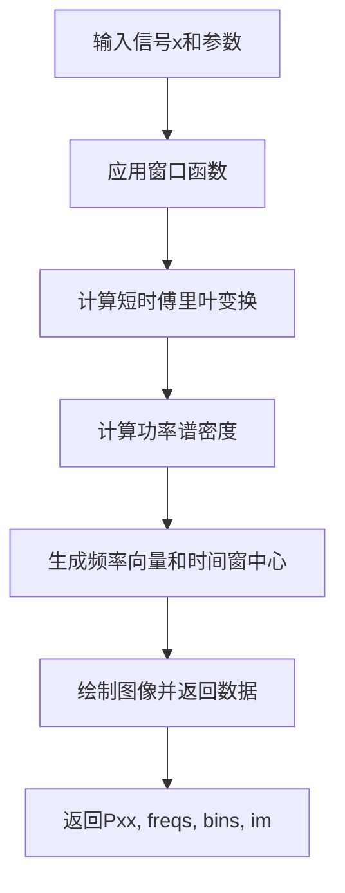

#### 带注释源码

```python
# 调用specgram方法绘制频谱图
# 参数：x为输入信号，NFFT为FFT窗口长度，Fs为采样频率
Pxx, freqs, bins, im = ax2.specgram(x, NFFT=NFFT, Fs=Fs)

# Pxx: 功率谱密度矩阵，形状为 (NFFT//2+1, 时间窗数量)
# freqs: 频率向量，对应Pxx的行索引，单位为Hz
# bins: 时间窗中心点，对应Pxx的列索引，单位为秒
# im: AxesImage对象，表示频谱图图像，可用于colorbar等操作
```


### `Axes.set_xlabel`

设置 Axes 对象的 x 轴标签（xlabel），用于指定坐标轴的含义和单位。该方法通过参数接收标签文本和样式控制选项，创建一个 Text 对象并将其添加到图表中，同时返回该 Text 对象以便进一步自定义。

参数：

- `x`：`str`，要显示的 x 轴标签文本内容
- `fontdict`：`dict`，可选，用于控制标签外观的字典（如字体大小、颜色、字体权重等）
- `labelpad`：`float`，可选，标签与坐标轴之间的间距（以点为单位），默认值为 None
- `loc`：`str`，可选，标签相对于轴的位置，可选值为 'left'、'center'（默认）、'right'

返回值：`matplotlib.text.Text`，返回创建的文本标签对象，可用于后续的样式修改或属性设置

#### 流程图

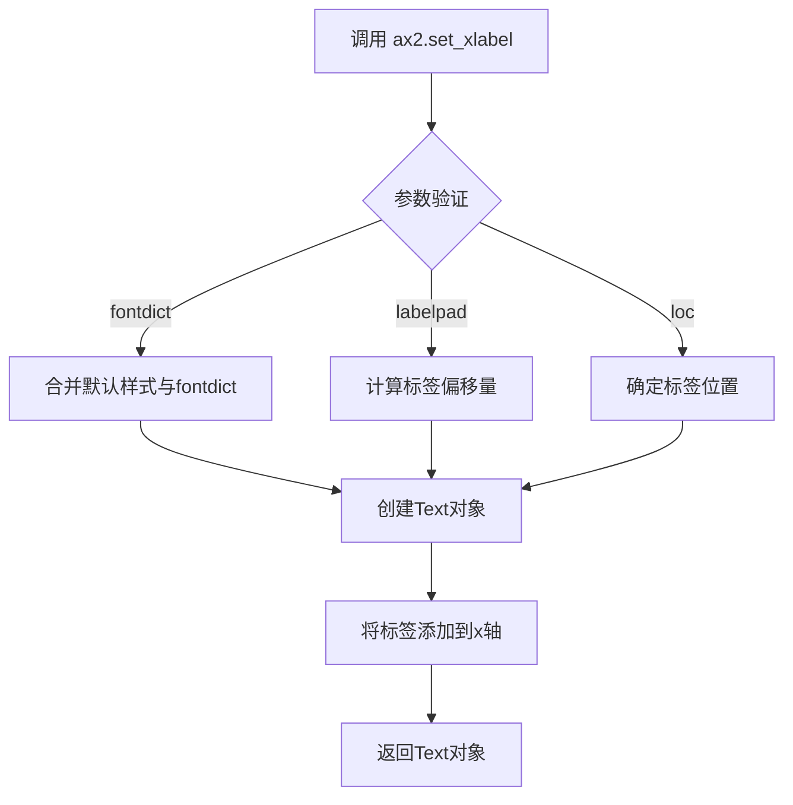

#### 带注释源码

```python
def set_xlabel(self, x, fontdict=None, labelpad=None, loc=None, **kwargs):
    """
    Set the label for the x-axis.
    
    Parameters
    ----------
    x : str
        The label text.
    fontdict : dict, optional
        A dictionary to control the appearance of the label.
    labelpad : float, optional
        Spacing in points from the axes bounding box including ticks
        and tick labels.
    loc : str, optional
        The label position relative to the axis. Possible values:
        'left', 'center' (default), 'right'.
    **kwargs
        Text properties.
    
    Returns
    -------
    text : matplotlib.text.Text
        The created text object.
    """
    # 如果传入了fontdict，将其合并到kwargs中
    if fontdict is not None:
        kwargs.update(fontdict)
    
    # 获取默认的x轴标签位置（通常在中间）
    default_loc = 'center'
    if loc is None:
        loc = default_loc
    
    # 处理labelpad参数，默认为0
    if labelpad is None:
        labelpad = 0
    
    # 创建Text对象并设置对齐方式
    # x轴标签通常左对齐('left')、居中('center')或右对齐('right')
    return self.xaxis.set_label_text(x, **kwargs)
```


### `Axes.set_ylabel`

设置第二个子图（ax2）的 y 轴标签为 "Frequency (Hz)"，用于表示频谱图的频率轴。

参数：

- `ylabel`：字符串，要设置的 y 轴标签文本（例如 'Frequency (Hz)'）
- `fontdict`：字典，可选，用于控制标签的字体属性（如 fontsize、fontweight 等）
- `labelpad`：浮点数，可选，标签与 y 轴之间的间距（磅值）
- `loc`：字符串，可选，标签的位置（'left'、'center'、'right'），默认为 'center'
- `**kwargs`：关键字参数传递给 Text 对象，支持颜色、旋转、背景色等样式属性

返回值：`Text`，返回创建的 Label 文本对象，可用于后续修改标签属性（如颜色、字体大小等）。

#### 流程图

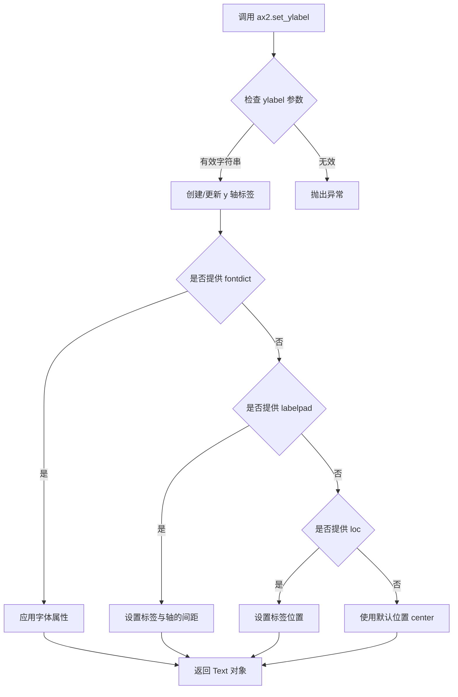

#### 带注释源码

```python
# 在代码中的调用方式：
ax2.set_ylabel('Frequency (Hz)')

# 完整方法签名（参考 matplotlib 官方文档）：
# Axes.set_ylabel(ylabel, fontdict=None, labelpad=None, *, loc=None, **kwargs)

# 参数说明：
# - ylabel: str, 要设置的 y 轴标签文本
# - fontdict: dict, 可选，字体属性字典，例如 {'fontsize': 12, 'fontweight': 'bold'}
# - labelpad: float, 可选，标签与坐标轴之间的间距（磅值）
# - loc: str, 可选，标签位置 ('left', 'center', 'right')
# - **kwargs: 其他关键字参数传递给 matplotlib.text.Text 对象

# 返回值：
# 返回一个 matplotlib.text.Text 对象，代表创建的 y 轴标签
# 该对象可以用于后续自定义修改，例如：
# label = ax2.set_ylabel('Frequency (Hz)')
# label.set_color('red')
# label.set_fontsize(14)

# 示例：带更多参数的调用
# ax2.set_ylabel('Frequency (Hz)', fontsize=12, fontweight='bold', labelpad=10, loc='center')
```


### `Axes.set_xlim`

设置 Axes 对象的 x 轴显示范围（ limits），用于控制 x 轴的最小值（左边界）和最大值（右边界），同时支持自动边界调整和边界变化事件通知。

参数：

- `self`：`matplotlib.axes.Axes`，matplotlib 的 Axes 对象实例（隐式参数，无需显式传递）
- `left`：`float`，x 轴的左边界值，即 x 轴显示范围的最小值
- `right`：`float`，x 轴的右边界值，即 x 轴显示范围的最大值（可选，若为 `None` 则保持当前值）
- `emit`：`bool`，边界改变时是否触发 `AxesChangeEvent` 事件（默认 `False`）
- `auto`：`bool`，是否启用自动边界调整（默认 `False`，即允许自动缩放）
- `xmin`：`float`，已弃用参数，功能等同于 `left`
- `xmax`：`float`，已弃用参数，功能等同于 `right`

返回值：`tuple[float, float]`，返回新的 x 轴范围元组 `(left, right)`

#### 流程图

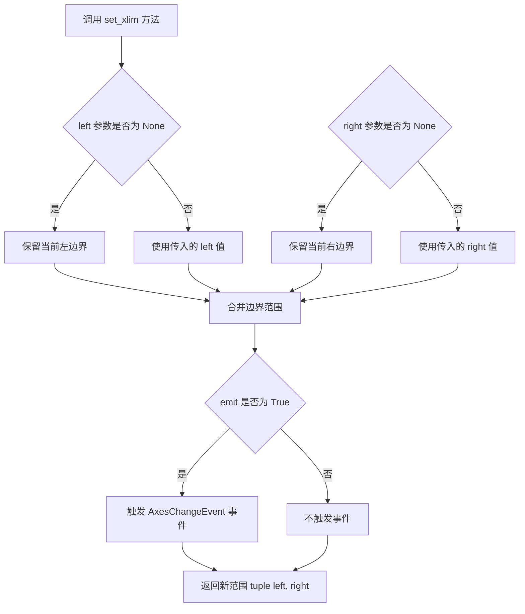

#### 带注释源码

```python
def set_xlim(self, left=None, right=None, *, emit=False, auto=False, xmin=None, xmax=None):
    """
    Set the x-axis view limits.
    
    Parameters
    ----------
    left : float, optional
        The left xlim (data coordinates).  May be None to leave the limit
        unchanged.
    right : float, optional
        The right xlim (data coordinates).  May be None to leave the limit
        unchanged.
    emit : bool, optional
        Whether to notify observers of limit change (default: False).
    auto : bool, optional
        Whether to turn on autoscaling after the limit is printed.
        The default of False leaves the autoscaling setting (and the
        autorange settings) unchanged.
    xmin, xmax : float, optional
        Aliases for left and right, respectively. Deprecated.
    
    Returns
    -------
    left, right : tuple[float, float]
        The new x-axis limits in data coordinates.
    
    Notes
    -----
    The x-axis limits are stored in the `xaxis` and `viewLim`
    Bbox attributes of the Axes object.
    """
    # 处理已弃用的 xmin/xmax 参数
    if xmin is not None:
        if left is not None:
            raise TypeError("Cannot pass both 'xmin' and 'left'")
        left = xmin
    if xmax is not None:
        if right is not None:
            raise TypeError("Cannot pass both 'xmax' and 'right'")
        right = xmax
    
    # 获取当前的边界值（用于处理 None 的情况）
    old_left, old_right = self.get_xlim()
    
    # 如果 left 为 None，保留原来的左边界
    if left is None:
        left = old_left
    # 如果 right 为 None，保留原来的右边界
    if right is None:
        right = old_right
    
    # 验证边界值的有效性（左边界必须小于右边界）
    if left > right:
        raise ValueError(f"left must be <= right, but {left} > {right}")
    
    # 更新 Axes 对象的 x 轴视图边界（Bbox）
    self.viewLim.x0 = left
    self.viewLim.x1 = right
    
    # 如果 emit 为 True，通知观察者（如图形）边界已改变
    if emit:
        self._send_change()
    
    # 如果 auto 为 True，启用自动缩放功能
    if auto:
        self.set_autoscalex_on(True)
    
    # 返回新的边界范围元组
    return (left, right)
```


### `plt.show`

`plt.show` 是 matplotlib 库中的顶层函数，用于显示所有当前打开的图形窗口。在调用此函数之前，所有创建的图形都存储在内存中，只有调用 `plt.show()` 才会将图形渲染并显示在屏幕上。

参数：此函数没有参数。

返回值：`None`，该函数不返回任何值，仅用于图形显示。

#### 流程图

```mermaid
flowchart TD
    A[开始 plt.show] --> B{是否在交互式后端}
    B -->|是| C[调用 show() 渲染图形]
    B -->|否| D[阻塞主线程等待用户关闭]
    C --> E[图形显示在屏幕上]
    D --> E
    E --> F[结束]
```

#### 带注释源码

```python
plt.show()
# 展示当前所有已创建的图形窗口
# - 此函数会调用当前图形后端的 show() 方法
# - 在非交互式后端（如 Agg, PDF 等）中会阻塞程序执行
# - 在交互式后端（如 TkAgg, Qt5Agg 等）中会立即返回并显示图形
# - 调用后图形窗口会被阻塞，等待用户交互关闭
# - 在某些后端中，关闭图形窗口后会继续执行后续代码
```

## 关键组件


### 信号生成模块

负责生成测试用的合成信号，包括两个不同频率的正弦波（100Hz和400Hz）、瞬态"chirp"信号以及随机噪声的叠加。

### 频谱图计算模块

调用matplotlibAxes.specgram方法进行短时傅里叶变换（STFT），将时域信号转换为时频表示，返回功率谱密度（Pxx）、频率向量、时域 bins 和图像对象。

### 采样参数配置模块

定义关键采样参数：NFFT=1024（窗口长度）、Fs=1/dt（采样频率，2000Hz）、dt=0.0005（采样间隔），确保满足奈奎斯特采样定理。

### 双子图可视化模块

创建共享x轴的两个子图，上方(ax1)显示原始信号波形，下方(ax2)显示频谱图热力图，实现信号时域和频域的联合可视化。

### 随机状态复现模块

使用np.random.seed(19680801)固定随机数种子，确保每次运行生成相同的噪声模式，保证结果可复现性。


## 问题及建议


### 已知问题

-   **信号生成逻辑错误**：`s2[t <= 10] = s2[12 <= t] = 0` 这行代码存在逻辑缺陷。`s2[12 <= t]` 返回一个布尔数组，将其赋值给 `s2[t <= 10]` 会导致意外行为，无法正确创建"chirp"瞬态信号
-   **随机状态设置方式过时**：使用 `np.random.seed(19680801)` 是旧版写法，新版本推荐使用 `np.random.default_rng()` 以获得更好的随机性和可重复性
-   **硬编码的魔法数字**：代码中存在多个未解释的硬编码数值（如 `20.5`、`0.0005`、`1024`、`0.01`），缺乏可配置性，降低了代码的可维护性
-   **缺少错误处理**：没有对输入参数（如 NFFT、Fs）进行有效性验证，可能导致运行时错误
-   **阻塞式显示**：`plt.show()` 在某些环境下会阻塞，且没有提供保存图像的选项，限制了脚本的自动化使用
-   **重复计算**：`len(t)` 在噪声生成和信号组合中被调用两次，可以缓存结果

### 优化建议

-   **修复信号生成逻辑**：将 `s2[t <= 10] = s2[12 <= t] = 0` 改为 `s2[(t <= 10) | (t >= 12)] = 0` 以正确创建瞬态信号
-   **升级随机数生成器**：使用 `rng = np.random.default_rng(19680801)` 和 `rng.random(size=len(t))` 替代旧版 API
-   **提取配置参数**：将魔法数字提取为具名常量或配置变量，提高可读性和可维护性
-   **添加参数验证**：在生成信号前验证 `NFFT`、`Fs` 等参数的合理性
-   **支持图像保存**：添加 `fig.savefig('spectrogram.png', dpi=150)` 或提供保存选项，方便非交互环境使用
-   **缓存计算结果**：将 `len(t)` 的计算结果存储到变量中，避免重复计算
-   **增加文档注释**：为信号参数、采样频率、窗口大小等添加解释性注释，帮助理解代码意图


## 其它


### 设计目标与约束

本代码旨在演示如何使用matplotlib的specgram方法绘制信号的频谱图。主要设计目标包括：生成包含多个频率分量的测试信号、添加随机噪声模拟真实场景、并通过频谱分析可视化信号的频率特性。约束条件包括：依赖matplotlib和numpy库、需要在图形界面环境下运行、采样频率与信号长度需匹配以避免频谱泄露。

### 错误处理与异常设计

代码中未包含显式的错误处理机制。主要潜在错误包括：采样频率Fs计算错误导致时间轴不准确、NFFT参数设置不当影响频率分辨率、信号长度不足导致频谱统计特性差。当specgram方法参数异常时（如NFFT大于信号长度），matplotlib会抛出ValueError并给出默认错误信息。建议在实际应用中添加参数有效性校验。

### 数据流与状态机

数据流如下：1)通过numpy生成时间轴t；2)生成100Hz和400Hz两个正弦信号s1和s2；3)在t≤10和12≤t区间将s2置零制造瞬态"chirp"信号；4)添加高斯噪声nse；5)合成最终信号x；6)调用ax2.specgram计算并绘制频谱图。状态机较为简单，主要经历信号生成、噪声叠加、频谱计算、图形渲染四个状态。

### 外部依赖与接口契约

主要外部依赖包括：matplotlib.pyplot库用于绘图、numpy库用于数值计算。specgram方法的核心接口契约：输入参数x为原始信号序列、NFFT为FFT窗口长度、Fs为采样频率；返回值包括Pxx（功率谱密度矩阵）、freqs（频率向量）、bins（时间 bins 向量）、im（AxesImage对象）。调用方需确保输入信号为数值型数组且Fs>0。

### 性能考虑

当前示例代码在个人电脑上运行性能良好。但在大规模数据场景下可优化：1)NFFT=1024可调整为合适的2的幂次方以利用FFT加速；2)可使用noverlap参数控制重叠点数以平衡时间-频率分辨率；3)对于实时处理场景可考虑使用scipy.signal.spectrogram替代。内存占用主要取决于信号长度和NFFT大小。

### 安全性考虑

代码本身不涉及用户输入、网络通信或文件操作，安全性风险较低。主要关注点：1)随机数种子固定为19680801确保结果可复现；2)信号生成过程无缓冲区溢出风险；3)plt.show()在无图形界面环境下可能阻塞或报错。建议在生产环境中添加环境检测和异常捕获。

### 可测试性

代码可从以下维度测试：1)验证输出图像对象不为空；2)检验Pxx矩阵维度与freqs、bins长度匹配；3)验证频率轴范围符合奈奎斯特采样定理（最大频率≤Fs/2）；4)对比有噪声与无噪声信号的频谱差异。可通过单元测试框架pytest结合matplotlib的Agg后端进行自动化测试。

### 版本兼容性

代码依赖的版本约束：matplotlib 2.0+（specgram方法早期版本参数略有差异）、numpy 1.0+。建议在requirements.txt中声明最小版本要求。Python 3.6+兼容。specgram方法的pad_to参数在旧版本中行为不同，需注意跨版本兼容。

### 资源管理

代码运行主要占用：内存资源（信号数组和频谱矩阵）、CPU资源（FFT计算）、GPU资源（如使用硬件加速渲染）。无显式资源释放需求，因matplotlibFigure对象在引用丢失后由垃圾回收机制处理。建议在长时间运行应用中显式关闭Figure对象：plt.close(fig)。

### 配置管理

关键配置参数包括：dt=0.0005（采样间隔）、NFFT=1024（FFT窗口长度）、Fs=1/dt（采样频率）。建议将硬编码参数抽取为配置文件或命令行参数，以便调整信号频率、噪声水平、频谱分辨率等。matplotlib的rcParams可进一步定制颜色映射、坐标轴样式等视觉参数。

### 使用场景与扩展方向

当前代码适用于教学演示和离线分析。扩展方向包括：1)添加颜色条(colorbar)显示分贝刻度；2)使用不同窗口函数（如汉宁窗、汉明窗）改善频谱泄露；3)实现交互式频谱分析工具；4)支持保存为多种图像格式；5)添加时频分析对比（如小波变换）。对于生产级应用建议封装为独立函数或类。

    