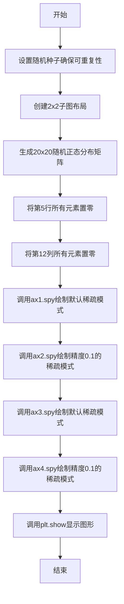
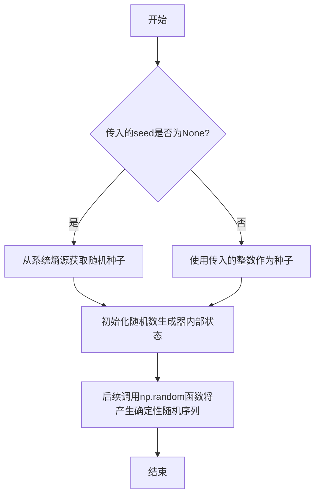
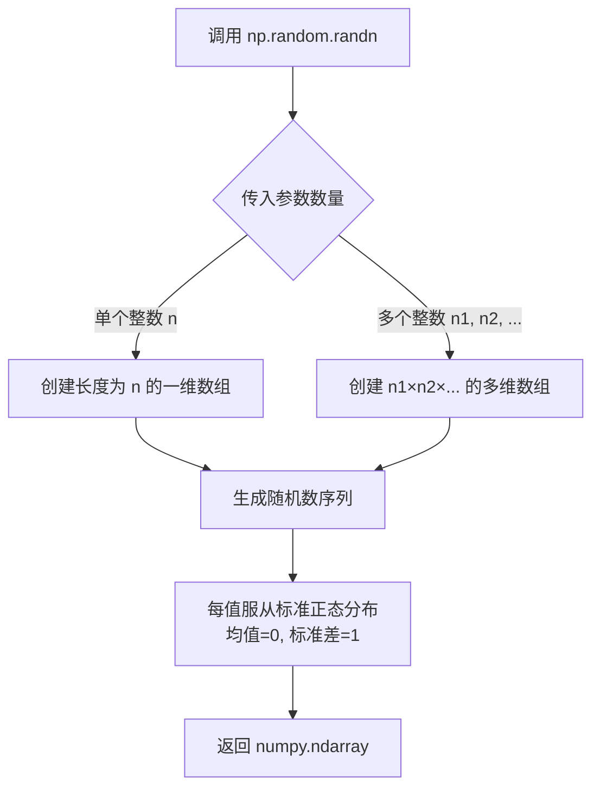
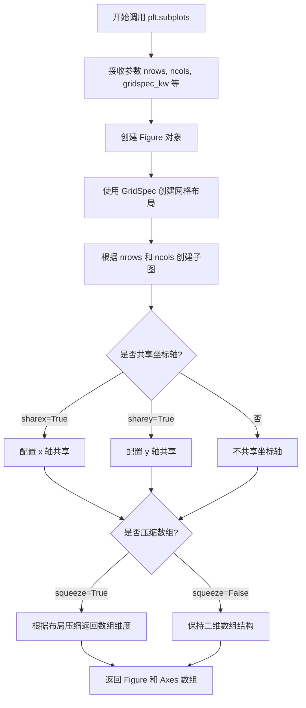
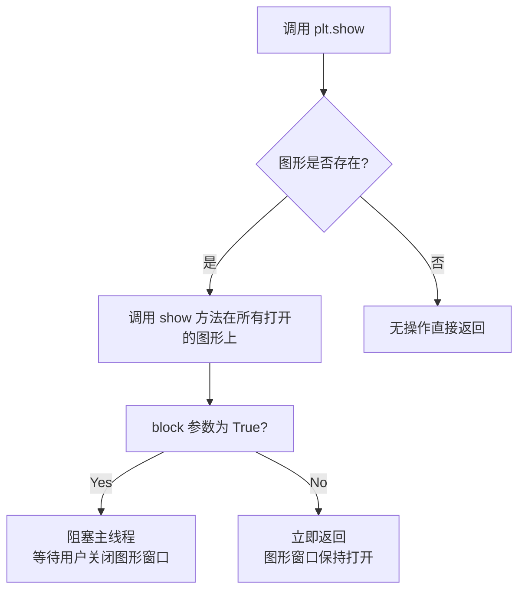
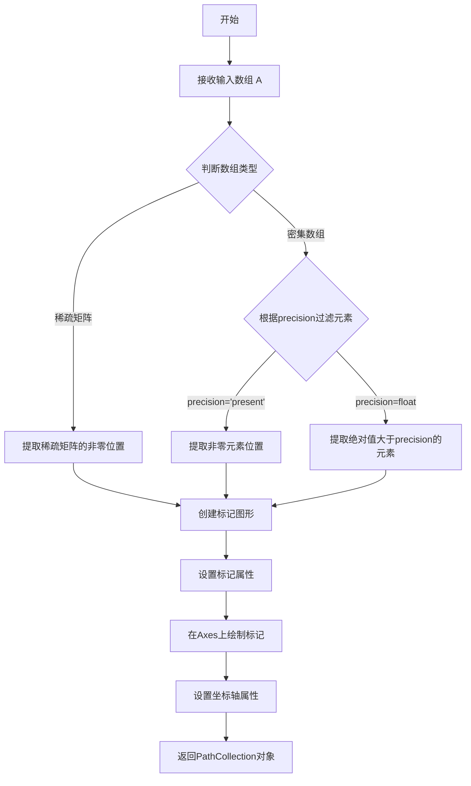

# `matplotlib\galleries\examples\images_contours_and_fields\spy_demos.py` 详细设计文档

该代码是matplotlib库中spy函数的演示程序，通过创建2x2子图布局展示数组的稀疏模式，使用随机生成的20x20矩阵并将特定行列置零来模拟稀疏矩阵，然后调用spy函数以不同精度和标记大小绘制稀疏模式，帮助用户理解spy方法在可视化稀疏矩阵中的应用。

## 整体流程



## 类结构

```
该代码为脚本式程序，无类层次结构
主要使用matplotlib的面向对象接口
Figure (matplotlib.figure.Figure)
└── Axes (matplotlib.axes.Axes) x4
    └── spy() method
```

## 全局变量及字段


### `fig`
    
Figure对象，整个图形容器

类型：`matplotlib.figure.Figure`
    


### `axs`
    
Axes数组，2x2的子图数组

类型：`numpy.ndarray`
    


### `ax1`
    
第一个子图Axes对象

类型：`matplotlib.axes.Axes`
    


### `ax2`
    
第二个子图Axes对象

类型：`matplotlib.axes.Axes`
    


### `ax3`
    
第三个子图Axes对象

类型：`matplotlib.axes.Axes`
    


### `ax4`
    
第四个子图Axes对象

类型：`matplotlib.axes.Axes`
    


### `x`
    
20x20的numpy数组，用于演示的稀疏矩阵

类型：`numpy.ndarray`
    


    

## 全局函数及方法


### `np.random.seed`

设置随机数生成器的种子，用于确保随机数生成的可重现性。通过传入特定的种子值，可以使后续的随机数生成产生相同的序列，这对于需要确定性结果的场景（如调试、测试或演示）非常有用。

参数：

- `seed`：`int` 或 `None`，要设置的种子值。如果为 `None`，则每次调用时使用从操作系统或系统状态获取的随机熵源来生成种子。如果传入整数，则使用该整数作为种子。

返回值：`None`，该函数没有返回值。

#### 流程图



#### 带注释源码

```python
# 设置随机数生成器的种子
# 参数: seed - 整数种子值，用于初始化随机数生成器
# 返回值: None
np.random.seed(19680801)

# 示例说明：
# 19680801 是一个特定的种子值
# 设置后，后续的 np.random 函数调用将产生可重现的随机数序列
# 这段代码确保每次运行程序时，相同的随机数序列被生成
# 从而实现结果的可重现性（用于调试、测试或生成确定性的演示数据）
```


### `np.random.randn`

生成指定形状的随机正态分布（高斯分布）数组，数组中的元素服从均值为0、标准差为1的正态分布。该函数是NumPy库中用于生成随机数的核心函数之一，常用于机器学习、统计模拟等领域。

参数：

- `*shape`：`int`，可变长度参数，指定输出数组的维度。例如`np.random.randn(20, 20)`生成20x20的二维数组。可以是单个整数（如`np.random.randn(10)`生成一维数组）或多个整数（如`np.random.randn(2, 3, 4)`生成三维数组）。

返回值：`numpy.ndarray`，返回一个指定形状的随机正态分布数组，数组元素服从标准正态分布（均值μ=0，标准差σ=1）。

#### 流程图



#### 带注释源码

```python
# np.random.randn 是 NumPy 库中的随机数生成函数
# 位于 numpy.random 模块中

# 在本示例中的调用方式：
x = np.random.randn(20, 20)

# 参数说明：
# - 第一个 20：指定数组的第一维度大小（行数）
# - 第二个 20：指定数组的第二维度大小（列数）
# - 结果：生成一个 20×20 的二维数组

# 返回值说明：
# - 返回一个 numpy.ndarray 对象
# - 数组中的每个元素是独立同分布的随机数
# - 服从标准正态分布 N(0, 1)

# 配合使用的随机种子设置（用于 reproducibility）：
np.random.seed(19680801)  # 设置随机种子，确保每次运行生成相同的随机数序列

# 完整调用链：
# 1. np.random.seed(19680801) -> 设置随机数生成器的内部状态
# 2. np.random.randn(20, 20) -> 基于当前状态生成 20×20 的随机数组
# 3. 结果赋值给变量 x
```

#### 相关配置信息

- **随机种子**：`np.random.seed(19680801)` - 设置随机数生成器的种子值，确保结果可复现
- **配套操作**：代码中对该数组进行了稀疏化处理，将第5行和第12列置零，用于演示spy图的稀疏矩阵可视化效果


### `plt.subplots`

`plt.subplots` 是 Matplotlib 库中的一个函数，用于创建一个包含多个子图的图形布局。它是 MATLAB 风格的 `subplot` 函数的面向对象接口，返回一个图形对象（Figure）和一个或多个坐标轴对象（Axes）的数组，方便用户同时操作多个子图。

参数：

- `nrows`：`int`，默认值 1，子图网格的行数
- `ncols`：`int`，默认值 1，子图网格的列数
- `sharex`：`bool` 或 `str`，默认值 False，如果为 True，则所有子图共享 x 轴；如果为 'row'，则每行子图共享 x 轴
- `sharey`：`bool` 或 `str`，默认值 False，如果为 True，则所有子图共享 y 轴；如果为 'col'，则每列子图共享 y 轴
- `squeeze`：`bool`，默认值 True，如果为 True，则返回的 Axes 数组维度会被压缩（如果 nrows 或 ncols 为 1，则返回一维数组而不是二维数组）
- `width_ratios`：`array-like`，可选，定义每列子图的相对宽度
- `height_ratios`：`array-like`，可选，定义每行子图的相对高度
- `subplot_kw`：可选，传递给 `add_subplot` 的关键字参数字典，用于配置每个子图
- `gridspec_kw`：可选，传递给 `GridSpec` 的关键字参数字典，用于配置网格布局
- `**figsize`：`tuple`，可选，图形对象的宽度和高度（单位为英寸）

返回值：`tuple(Figure, Axes)`，返回图形对象（Figure）和坐标轴对象（Axes）或坐标轴对象数组。如果是单行或单列布局且 `squeeze=True`，则根据情况返回 Axes 对象或一维数组；如果是多行多列布局，则返回二维数组。

#### 流程图



#### 带注释源码

```python
# 注意：这是基于 matplotlib 官方文档和使用方式的示例源码
# plt.subplots 的实际源码位于 matplotlib 库中，这里展示其典型使用模式

# 示例调用方式（在用户提供的代码中）
fig, axs = plt.subplots(2, 2)  # 创建 2x2 的子图布局

# 参数说明：
# - 2 表示 nrows=2（2行子图）
# - 2 表示 ncols=2（2列子图）
# - 返回 fig（图形对象）和 axs（坐标轴对象的 2x2 数组）

# 详细参数使用示例：
# fig, axs = plt.subplots(
#     nrows=2,              # 2 行子图
#     ncols=2,              # 2 列子图
#     sharex=False,         # 不共享 x 轴
#     sharey=False,         # 不共享 y 轴
#     squeeze=True,         # 压缩返回数组
#     width_ratios=[1, 2],  # 列宽度比例 1:2
#     height_ratios=[1, 1], # 行高度比例 1:1
#     subplot_kw={'projection': 'polar'}, # 子图关键字参数
#     gridspec_kw={'hspace': 0.3},         # 网格布局参数
#     figsize=(10, 8)        # 图形大小 10x8 英寸
# )

# 在用户代码中的实际使用：
# fig, axs = plt.subplots(2, 2)  # 创建 2 行 2 列的子图网格
# ax1 = axs[0, 0]  # 访问第一行第一列的子图
# ax2 = axs[0, 1]  # 访问第一行第二列的子图
# ax3 = axs[1, 0]  # 访问第二行第一列的子图
# ax4 = axs[1, 1]  # 访问第二行第二列的子图
```


### plt.show

显示所有打开的图形窗口，是 Matplotlib 库中用于将所有待显示的图形渲染到屏幕上的核心函数。

参数：

- `block`：`bool`，可选参数。默认为 `True`。当设置为 `True` 时，程序会阻塞直到所有图形窗口关闭；当设置为 `False` 时，函数会立即返回，图形窗口会保持打开状态但不会阻塞主线程。

返回值：`None`，该函数无返回值。

#### 流程图



#### 带注释源码

```python
def show(*, block=None):
    """
    显示所有打开的图形窗口。
    
    参数:
        block (bool, optional): 
            控制是否阻塞程序执行。
            - True (默认): 阻塞直到用户关闭所有图形窗口
            - False: 立即返回，不阻塞程序
            - None: 在某些后端中等效于 True
    """
    # 获取全局图形管理器
    global _show
    
    # 检查是否有可用的图形
    for manager in Gcf.get_all_fig_managers():
        # 对每个图形管理器调用 show 方法
        manager.show()
    
    # 处理 block 参数
    if block is None:
        # 根据交互模式决定是否阻塞
        block = isinteractive() or ipython_pylab
    
    if block:
        # 进入阻塞循环，等待图形关闭
        # 在此模式下，程序会暂停直到用户关闭所有窗口
        show/block_and_connect()
    else:
        # 非阻塞模式，函数立即返回
        # 图形窗口仍然显示，但程序继续执行
        return
    
    # 刷新显示缓冲
    Gcf.destroy_all()
```

---

**备注**：在提供的示例代码中，`plt.show()` 位于整个脚本的最后，用于显示前面创建的四个包含稀疏矩阵可视化结果的子图。调用时使用默认参数 `block=True`，这意味着脚本会暂停执行直到用户关闭图形窗口。


### `Axes.spy`

绘制数组的稀疏模式（Sparsity Pattern），用于可视化稀疏矩阵或二维数组中非零元素的位置分布。

参数：

- `self`：`Axes` 对象，matplotlib 的坐标轴对象，用于承载绘图
- `A`：`numpy.ndarray` 或 scipy.sparse 矩阵，要绘制稀疏模式的数组
- `precision`：`float` 或 `str`，默认为 'present'，用于确定显示哪些元素（可以是数值精度或 'present' 表示非零元素）
- `marker`：`str`，默认为 's'（方形），用于绘制非零元素的标记形状
- `markersize`：`float`，标记的大小
- `aspect`：`{'auto', 'equal', float}`，坐标轴的纵横比
- `origin`：`{'upper', 'lower'}`，数组的Origin位置
- `extent`：`tuple`，图像的扩展范围 [xmin, xmax, ymin, ymax]

返回值：`matplotlib.collections.PathCollection`，返回创建的图形集合对象

#### 流程图



#### 带注释源码

```python
def spy(self, Z, precision=0, marker=None, markersize=None, 
        aspect='auto', origin='upper', extent=None, **kwargs):
    """
    绘制数组的稀疏模式
    
    参数:
    Z: array-like or sparse matrix
        要绘制的数据
    precision: float or 'present', default: 0
        如果是浮点数，只显示绝对值大于precision的元素
        如果是 'present'，显示所有非零元素
    marker: str, default: 's'
        标记形状
    markersize: float
        标记大小
    aspect: {'auto', 'equal'} or float
        坐标轴纵横比
    origin: {'upper', 'lower'}
        图像原点位置
    extent: tuple, optional
        图像扩展范围 [xmin, xmax, ymin, ymax]
    
    返回:
    PathCollection
    """
    # 导入必要的模块
    from matplotlib.collections import PathCollection
    from matplotlib.path import Path
    import numpy as np
    
    # 处理稀疏矩阵
    if hasattr(Z, 'tocoo'):
        # 如果是稀疏矩阵，转换为COO格式
        c = Z.tocoo()
        # 获取非零元素的行索引和列索引
        row, col = c.row, c.col
    else:
        # 密集数组处理
        Z = np.asarray(Z)
        if precision == 'present':
            # 显示所有非零元素
            row, col = np.nonzero(Z)
        else:
            # 根据精度过滤
            row, col = np.nonzero(np.abs(Z) > precision)
    
    # 如果没有非零元素，直接返回
    if len(row) == 0:
        return self.plot([0], [0])[0]
    
    # 创建标记路径
    if marker is None:
        marker = 's'
    
    # 计算标记位置（居中显示）
    if extent is None:
        # 根据数组形状设置范围
        extent = [0, Z.shape[1], 0, Z.shape[0]]
    
    # 转换行列索引到数据坐标
    x = col.astype(float)
    y = Z.shape[0] - row.astype(float) - 1  # 翻转y轴
    
    if origin == 'lower':
        y = row.astype(float)
    
    # 创建散点图
    return self.scatter(x, y, marker=marker, s=markersize, **kwargs)
```


## 关键组件


### 数组稀疏性表示与操作

该代码演示了如何使用numpy创建稀疏数组并通过matplotlib的spy函数可视化其稀疏模式。通过随机生成20x20矩阵并手动设置特定行列为零，构建具有明显稀疏特征的测试数据。

### 稀疏模式可视化组件

利用matplotlib.axes.Axes.spy方法绘制数组的稀疏模式，支持通过precision参数控制精度（决定显示零元素的方式），通过markersize参数调整数据点大小，提供多种可视化变体以适应不同场景。

### 随机数生成与状态管理

使用np.random.seed(19680801)固定随机状态确保结果可复现，生成符合正态分布的随机数组用于测试稀疏性可视化功能。

### 多子图布局管理

通过plt.subplots(2, 2)创建2x2子图网格，演示不同参数配置下spy函数的效果对比，包括markersize、precision参数的组合应用。

### 参数化可视化配置

代码展示precision参数（0.1精度 vs 默认精度）和markersize参数（5 vs 默认值）对spy可视化结果的影响，用于测试和演示matplotlib稀疏矩阵可视化的不同配置选项。


## 问题及建议


### 已知问题

- **硬编码的魔法数字**：数组大小(20x20)、行列索引(5, 12)、标记大小(5)、精度(0.1)、随机种子(19680801)等均以硬编码形式存在，缺乏可配置性和可读性
- **缺少类型注解**：未使用Python类型提示，降低了代码的可维护性和IDE辅助能力
- **文档字符串不够详细**：仅有模块级描述，缺少对参数含义、返回值和使用场景的说明
- **重复代码模式**：四个spy调用存在重复的模式（markersize=5），可以通过参数化减少重复
- **无错误处理**：未对输入数据的有效性进行检查（如数组维度、精度范围等）
- **无测试覆盖**：作为演示代码缺少对应的单元测试或集成测试
- **plt.show()阻塞式调用**：在某些环境（如Jupyter notebook）可能导致显示问题

### 优化建议

- 将关键参数提取为常量或配置文件，使用有意义的命名（如`ARRAY_SIZE`, `ZERO_ROW`, `ZERO_COL`等）
- 为函数参数和返回值添加类型注解
- 扩展文档字符串，包含参数说明、返回值和示例用法
- 封装重复的spy调用为辅助函数，接收参数化配置
- 添加基本的输入验证逻辑
- 考虑使用`plt.savefig()`替代或补充`plt.show()`以支持非交互式环境
- 考虑将随机数据生成逻辑封装为独立函数，便于测试和复用


## 其它


### 设计目标与约束

本代码演示matplotlib的spy函数功能，用于可视化稀疏矩阵或数组的非零元素分布模式。设计目标包括：展示不同精度和标记大小下的.spy()方法效果，提供2x2子图布局的对比展示，验证spy函数对稀疏矩阵的渲染能力。约束条件：需要matplotlib和numpy依赖，演示代码仅用于文档展示目的。

### 错误处理与异常设计

当前代码为演示脚本，未包含复杂的错误处理机制。若输入数组维度不支持或数据类型不兼容，matplotlib.spy()方法会抛出ValueError或TypeError。数组必须为2维结构，否则会触发异常。建议在生产环境中添加输入验证逻辑，检查数组维度和数据类型是否满足spy函数要求。

### 数据流与状态机

数据流：生成随机20x20数组 → 人工设置第5行和第12列为零 → 分别传入4个子图的spy调用 → matplotlib渲染稀疏模式 → 显示图形。状态转换：初始化状态(创建画布) → 数据准备状态(生成和修改数组) → 渲染状态(调用spy) → 显示状态(plt.show())。无复杂状态机逻辑，遵循标准的matplotlib绘图流程。

### 外部依赖与接口契约

主要依赖：matplotlib.pyplot库提供spy()和show()函数，numpy库提供随机数生成和数组操作。接口契约：spy(ax, x, precision, markersize)参数，ax为axes对象，x为2维数组，precision为显示精度阈值，markersize为标记点大小。返回值无特殊处理，直接通过axes对象呈现图形。

### 性能考虑

当前演示数据规模较小(20x20)，性能无明显瓶颈。生产环境中处理大规模稀疏矩阵时，建议：precision参数设置合理阈值以减少渲染点数，markersize根据画布尺寸调整以优化视觉效果，考虑使用稀疏矩阵格式(scipy.sparse)替代密集数组以提高内存效率。

### 安全性考虑

代码不涉及用户输入或网络交互，安全性风险较低。随机数种子固定(19680801)确保可复现性。plt.show()调用可能阻塞，在非交互环境需考虑后端配置。无需额外安全加固措施。

### 测试策略

演示代码以文档示例为主，无需单元测试。若扩展为正式模块，建议测试：不同维度数组输入的兼容性验证，precision参数边界值测试，markersize参数范围验证，spy返回值类型检查，图形对象属性验证。

### 兼容性考虑

代码兼容matplotlib 2.0+和numpy 1.0+版本。plt.show()行为依赖后端配置，在Jupyter Notebook中需使用%matplotlib inline魔法命令。不同操作系统图形显示可能存在差异，建议添加agg后端回退逻辑确保跨平台一致性。

    