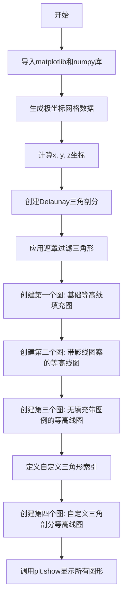

# `matplotlib\galleries\examples\images_contours_and_fields\tricontour_demo.py` 详细设计文档

这是一个matplotlib示例代码，演示如何使用tricontour和tricontourf函数绘制非结构化三角形网格的等高线图，包含Delaunay三角剖分、自定义三角剖分、填充等高线、影线图案和图例等可视化功能。

## 整体流程



## 类结构

```
脚本文件 (非面向对象)
└── 主要模块: matplotlib.pyplot, numpy, matplotlib.tri
    ├── Triangulation (三角剖分类)
    ├── Figure (图形容器)
    ├── Axes (坐标轴/绘图区域)
    └── ContourSet (等高线集合)
```

## 全局变量及字段


### `n_angles`
    
角度采样点数，定义极坐标中角度方向的采样密度

类型：`int`
    


### `n_radii`
    
半径采样点数，定义极坐标中半径方向的采样密度

类型：`int`
    


### `min_radius`
    
最小半径值，用于过滤过小的三角形和控制绘图区域

类型：`float`
    


### `radii`
    
半径数组，从最小半径到0.95线性分布的n_radii个采样点

类型：`ndarray`
    


### `angles`
    
角度数组，极坐标角度值，维度为n_angles x n_radii

类型：`ndarray`
    


### `x`
    
笛卡尔x坐标，由极坐标转换得到的二维坐标数组

类型：`ndarray`
    


### `y`
    
笛卡尔y坐标，由极坐标转换得到的二维坐标数组

类型：`ndarray`
    


### `z`
    
函数值/高度值，基于x,y坐标计算的目标函数值用于绘制等高线

类型：`ndarray`
    


### `triang`
    
三角剖分对象，包含Delaunay三角网格的顶点和三角形信息

类型：`Triangulation`
    


### `xy`
    
用户定义点坐标，以弧度为单位的二维坐标点集

类型：`ndarray`
    


### `x0`
    
高斯中心坐标x，用于计算指数衰减函数的中心点x

类型：`float`
    


### `y0`
    
高斯中心坐标y，用于计算指数衰减函数的中心点y

类型：`float`
    


### `triangles`
    
用户定义三角形索引，指定构成每个三角形的三个顶点索引

类型：`ndarray`
    


### `n_levels`
    
等高线级别数，控制等高线的分层数量

类型：`int`
    


### `artists`
    
图例艺术家对象，用于构建图例的图形元素列表

类型：`list`
    


### `labels`
    
图例标签，等高线数值的文本标签列表

类型：`list`
    


### `matplotlib.figure.fig1`
    
第一个matplotlib图形对象，用于展示基础等高线填充图

类型：`Figure`
    


### `matplotlib.figure.fig2`
    
第二个matplotlib图形对象，用于展示带 hatching 图案的等高线图

类型：`Figure`
    


### `matplotlib.figure.fig3`
    
第三个matplotlib图形对象，用于展示纯hatching无填充的等高线图

类型：`Figure`
    


### `matplotlib.figure.fig4`
    
第四个matplotlib图形对象，用于展示用户自定义三角剖分的等高线图

类型：`Figure`
    


### `matplotlib.axes.ax1`
    
第一个坐标轴对象，管理fig1的绘图区域和图形元素

类型：`Axes`
    


### `matplotlib.axes.ax2`
    
第二个坐标轴对象，管理fig2的绘图区域和图形元素

类型：`Axes`
    


### `matplotlib.axes.ax3`
    
第三个坐标轴对象，管理fig3的绘图区域和图形元素

类型：`Axes`
    


### `matplotlib.axes.ax4`
    
第四个坐标轴对象，管理fig4的绘图区域和图形元素

类型：`Axes`
    


### `matplotlib.contour.tcf`
    
等高线填充对象，包含填充等高线的数据和渲染信息

类型：`ContourSet`
    
    

## 全局函数及方法


## 关键组件


### Triangulation（三角剖分）

使用 `matplotlib.tri.Triangulation` 创建三角网格，支持自动 Delaunay 三角剖分或用户自定义三角形索引。

### 坐标生成（Data Generation）

生成极坐标网格的 x、y 坐标及对应的 z 值，用于演示三角等高线图的基本功能。

### 三角等高线填充（tricontourf）

使用 `ax.tricontourf()` 方法绘制填充颜色的三角等高线图，支持指定颜色映射（cmap）和填充层级。

### 三角等高线（tricontour）

使用 `ax.tricontour()` 方法绘制三角等高线的轮廓线，支持自定义颜色、线型和线宽。

### 三角形遮罩（Masking）

通过 `triang.set_mask()` 方法基于三角形中心距离筛选排除不需要的三角形，实现选择性渲染。

### 图案填充（Hatching）

在等高线图中添加斜线、交叉线等图案填充（hatches 参数），增强可视化效果。

### 自定义三角形索引（Custom Triangles）

用户可直接指定三角形的顶点索引数组，而非依赖 Delaunay 自动生成，适用于结构化三角网格。

### 图例元素（Legend Elements）

使用 `ContourSet.legend_elements()` 方法自动生成与等高线层级对应的图例标签。

### 颜色条（Colorbar）

使用 `fig.colorbar()` 为等高线图添加颜色条，显示数值与颜色的映射关系。

### 图形布局（Figure & Axes）

使用 `plt.subplots()` 创建.figure 和.axes 对象，设置坐标轴比例（set_aspect）确保可视化准确性。


## 问题及建议


### 已知问题

-   **魔法数字缺乏解释**：代码中包含大量硬编码的数值（如 `n_angles=48`, `n_radii=8`, `min_radius=0.25` 等），这些参数的意义没有注释说明，不利于后期维护和理解。
-   **重复代码模式**：x、y、z 坐标的计算逻辑在不同代码块中重复出现（如 `x = (radii * np.cos(angles)).flatten()` 和 `x = np.degrees(xy[:, 0])`），缺乏统一的封装。
-   **变量命名不一致**：第一部分使用 `triang` 作为 Triangulation 对象名，而第四部分直接使用 `triangles` 数组，降低了代码的一致性和可读性。
-   **硬编码的大数据集**：坐标点（`xy`）和三角形索引（`triangles`）以硬编码方式直接写在代码中，数据量较大且难以维护。
-   **注释掉的优化建议未实施**：代码注释中提到"It would be better to use a Triangulation object if the same triangulation was to be used more than once to save duplicated calculations"，但 fig4 部分并未采用此建议。
-   **缺乏错误处理**：没有对输入数据（如坐标范围、三角形索引有效性）进行验证，可能导致运行时错误或难以调试的问题。
-   **代码封装不足**：整个脚本是一个扁平化的演示脚本，缺乏函数封装，不便于作为模块被其他代码调用或复用。

### 优化建议

-   **提取配置参数**：将魔法数字提取为模块级常量或配置文件，并添加注释说明其含义和取值依据。
-   **函数封装**：将坐标生成逻辑封装为独立函数（如 `generate_delaunay_data()` 和 `generate_custom_triangulation()`），避免代码重复。
-   **统一变量命名**：统一使用 `triangulation` 或类似的命名规范，增强代码一致性。
-   **外部数据文件**：将大规模坐标和三角形数据存储在外部 JSON/CSV 文件中，通过文件读取方式加载，提高可维护性。
-   **实施优化建议**：在 fig4 中创建 Triangulation 对象而不是直接传递数组，提高性能并保持 API 一致性。
-   **添加数据验证**：在创建 Triangulation 之前验证坐标点数量、三角形索引有效性等，防止无效数据导致异常。
-   **重构为可复用模块**：将绘图逻辑封装为函数或类，支持参数化调用，提高代码的可测试性和可复用性。


## 其它


### 设计目标与约束

本代码旨在演示matplotlib中tri模块的三角剖分和等高线绘制功能，展示如何处理非结构化三角网格数据。主要设计约束包括：依赖matplotlib、numpy等科学计算库；需要正确安装对应版本的Matplotlib；处理大规模网格时可能存在性能瓶颈。

### 错误处理与异常设计

代码中未显式实现复杂的错误处理机制。潜在异常包括：输入数据维度不匹配导致的ValueError；空三角形数组导致的几何计算异常；内存不足导致的MemoryError。用户在使用时应确保输入数据符合Triangulation类的要求。

### 数据流与状态机

数据流从原始坐标数据(x, y, z)开始，经过三角剖分处理生成Triangulation对象，然后传递给tricontourf和tricontour函数进行等高线计算和渲染，最后通过Figure对象输出可视化结果。状态转换主要涉及数据准备阶段、三角剖分阶段、等高线计算阶段和图形渲染阶段。

### 外部依赖与接口契约

主要依赖包括：matplotlib.pyplot提供绘图接口；numpy提供数值计算功能；matplotlib.tri.Triangulation类提供三角剖分功能；matplotlib.colors和matplotlib.cm提供颜色映射。接口契约要求输入坐标数组为一维且长度一致，z值与坐标点一一对应。

### 性能考虑与优化空间

当前实现中每次调用tricontourf都会重新计算三角剖分，建议对重复使用的三角剖分创建Triangulation对象以缓存计算结果。对于大规模数据集，可考虑使用更高效的三角剖分算法或进行网格简化。当前代码在创建多个Figure对象时未进行资源释放，建议使用with语句管理图形生命周期。

### 可扩展性设计

代码设计允许用户自定义三角形索引数组，从而支持任意形状的三角网格。可扩展方向包括：添加更多等高线样式选项；支持3D三角曲面可视化；集成地理坐标系投影；支持动画等高线展示。当前架构通过matplotlib的插件式渲染器设计，便于扩展新的可视化后端。

### 安全性考虑

代码本身为演示脚本，不涉及用户输入验证和网络通信。潜在安全风险包括：大数据量可能导致内存溢出；恶意构造的三角形索引可能导致几何计算异常；自定义colormap时需注意颜色值范围。建议在生产环境中对输入数据进行有效性校验。

### 测试策略建议

建议添加单元测试验证Triangulation对象创建、坐标变换、掩码设置等核心功能；集成测试验证完整的数据流和渲染结果；性能测试评估大规模数据处理能力；回归测试确保不同版本Matplotlib的兼容性。测试数据应覆盖边界情况如空数据集、退化三角形等。

### 配置与参数管理

关键可配置参数包括：n_angles和n_radii控制采样点密度；min_radius控制内圈掩码阈值；hatches列表控制阴影线样式；cmap参数控制颜色映射方案。建议将可调参数抽取为配置文件或命令行参数，提高代码的灵活性。

### 版本兼容性说明

本代码基于Matplotlib 3.x系列设计，使用了tricontourf的hatches参数等较新特性。部分API如Triangulation.set_mask在不同版本间可能存在细微差异。建议在requirements.txt中明确指定Matplotlib版本要求，测试最低支持版本为3.2.0。

    