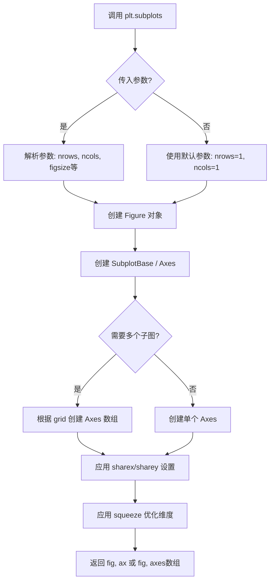
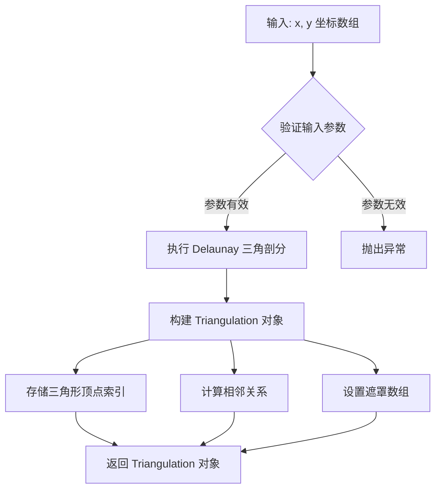
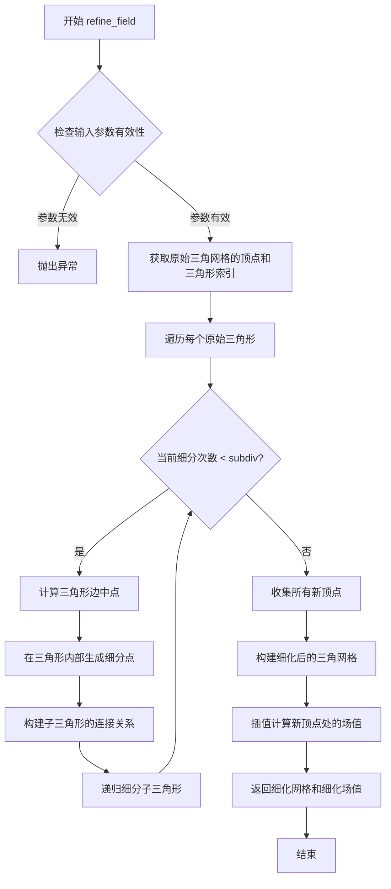
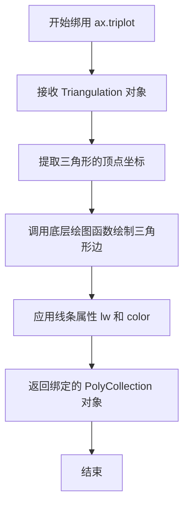
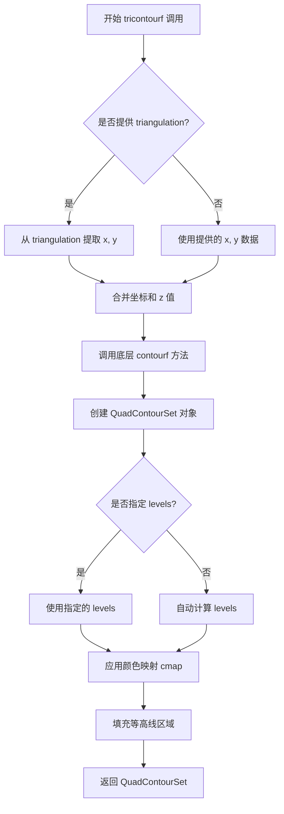
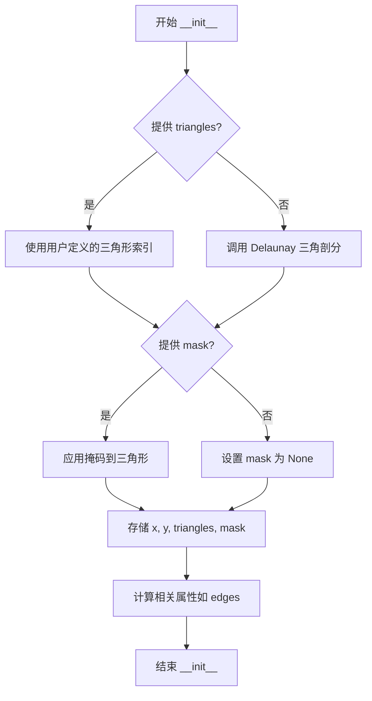
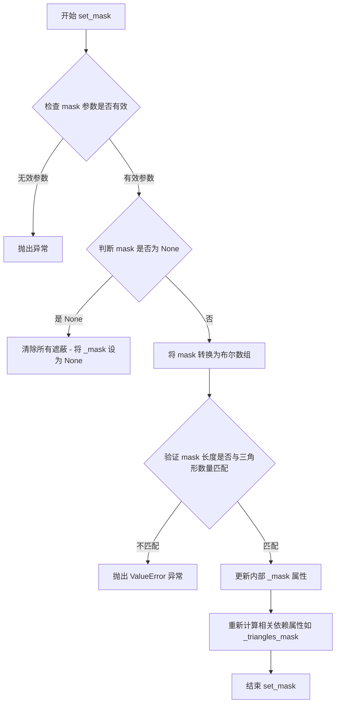
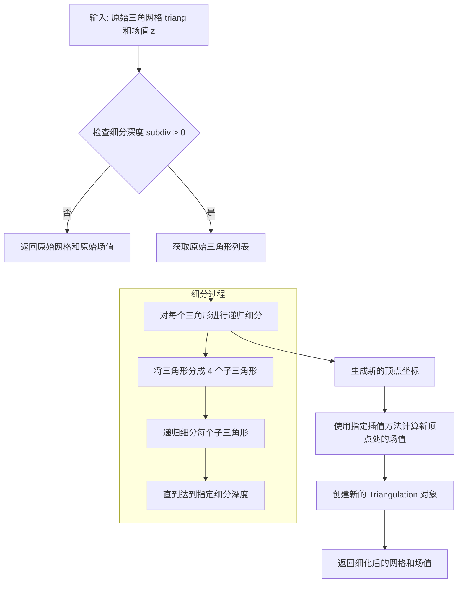

# `matplotlib\galleries\examples\images_contours_and_fields\tricontour_smooth_user.py` 详细设计文档

这是一个matplotlib高分辨率三角等高线（tricontouring）演示程序，通过UniformTriRefiner对用户定义的极坐标三角网格进行细化，并使用解析测试函数绘制精美的等高线图。

## 整体流程

```mermaid
graph TD
    A[开始] --> B[定义function_z解析测试函数]
B --> C[创建极坐标网格参数]
C --> D[生成x, y坐标点]
D --> E[计算z值: z = function_z(x, y)]
E --> F[创建Triangulation三角剖分]
F --> G[设置mask过滤不需要的三角形]
G --> H[使用UniformTriRefiner细化数据]
H --> I[创建figure和axes]
I --> J[绘制三角网格线]
J --> K[使用tricontourf绘制填充等高线]
K --> L[使用tricontour绘制等高线]
L --> M[显示图形 plt.show()]
```

## 类结构

```
Python脚本 (无继承类结构)
└── 主要模块: matplotlib, numpy
    └── 关键类: Triangulation, UniformTriRefiner
```

## 全局变量及字段


### `n_angles`
    
角度采样点数

类型：`int`
    


### `n_radii`
    
半径采样点数

类型：`int`
    


### `min_radius`
    
最小半径值

类型：`float`
    


### `radii`
    
半径数组

类型：`ndarray`
    


### `angles`
    
角度数组

类型：`ndarray`
    


### `x`
    
笛卡尔坐标x

类型：`ndarray`
    


### `y`
    
笛卡尔坐标y

类型：`ndarray`
    


### `z`
    
函数值

类型：`ndarray`
    


### `triang`
    
三角剖分对象

类型：`Triangulation`
    


### `refiner`
    
细化器对象

类型：`UniformTriRefiner`
    


### `tri_refi`
    
细化后的三角剖分

类型：`Triangulation`
    


### `z_test_refi`
    
细化后的z值

类型：`ndarray`
    


### `fig`
    
图形对象

类型：`Figure`
    


### `ax`
    
坐标轴对象

类型：`Axes`
    


### `levels`
    
等高线级别数组

类型：`ndarray`
    


### `matplotlib.tri.Triangulation.x`
    
三角剖分点的x坐标数组

类型：`ndarray`
    


### `matplotlib.tri.Triangulation.y`
    
三角剖分点的y坐标数组

类型：`ndarray`
    


### `matplotlib.tri.Triangulation.triangles`
    
三角形顶点索引数组

类型：`ndarray`
    


### `matplotlib.tri.Triangulation.mask`
    
三角形遮罩数组，用于隐藏不需要的三角形

类型：`ndarray`
    


### `matplotlib.tri.UniformTriRefiner.triangulation`
    
待细化的三角剖分对象

类型：`Triangulation`
    
    

## 全局函数及方法


### function_z

该函数是一个解析测试函数，用于计算双极坐标系统的z值。它基于两个极点（分别位于(0.5, 0.5)和(-0.2, -0.2)）的距离和角度信息，通过复合数学公式计算z值，并将其归一化到[0, 1]范围内，常用于matplotlib等高分辨率三角等值线绘图的测试数据生成。

参数：

- `x`：`float` 或 `array-like`，x坐标，表示平面上的横坐标位置
- `y`：`float` 或 `array-like`，y坐标，表示平面上的纵坐标位置

返回值：`float` 或 `ndarray`，归一化后的z值，范围在[0, 1]之间

#### 流程图

```mermaid
flowchart TD
    A[开始: 输入x, y坐标] --> B[计算极点1的距离和角度]
    B --> C[计算极点2的距离和角度]
    C --> D[计算第一极点的贡献项]
    D --> E[计算第二极点的贡献项]
    E --> F[计算径向衰减项]
    F --> G[组合所有项得到z值]
    G --> H[计算z的最大值和最小值]
    H --> I[归一化z值到0-1范围]
    I --> J[返回归一化后的z值]
    
    B --> B1[r1 = sqrt((0.5-x)² + (0.5-y)²)]
    B1 --> B2[theta1 = arctan2(0.5-x, 0.5-y)]
    
    C --> C1[r2 = sqrt((-x-0.2)² + (-y-0.2)²)]
    C1 --> C2[theta2 = arctan2(-x-0.2, -y-0.2)]
    
    D --> D1[term1 = 2 × (exp((r1/10)²) - 1) × 30 × cos(7×theta1)]
    
    E --> E1[term2 = (exp((r2/10)²) - 1) × 30 × cos(11×theta2)]
    
    F --> F1[term3 = 0.7 × (x² + y²)]
    
    G --> G1[z = -(term1 + term2 + term3)]
    
    I --> I1[z_normalized = (max(z) - z) / (max(z) - min(z))]
```

#### 带注释源码

```python
def function_z(x, y):
    """
    解析测试函数，计算双极坐标系统的z值
    
    该函数基于两个极点的位置，分别计算每个点到极点的距离和角度，
    然后使用复合正弦/余弦函数加上径向衰减项来计算z值，最后进行归一化。
    
    参数:
        x: float 或 array-like, x坐标
        y: float 或 array-like, y坐标
    
    返回:
        float 或 ndarray, 归一化后的z值，范围[0, 1]
    """
    
    # 计算第一个极点 (0.5, 0.5) 到点(x,y)的极坐标
    # r1: 距离 (使用欧几里得距离公式)
    r1 = np.sqrt((0.5 - x)**2 + (0.5 - y)**2)
    # theta1: 角度 (使用arctan2获得完整的角度信息)
    theta1 = np.arctan2(0.5 - x, 0.5 - y)
    
    # 计算第二个极点 (-0.2, -0.2) 到点(x,y)的极坐标
    # r2: 距离
    r2 = np.sqrt((-x - 0.2)**2 + (-y - 0.2)**2)
    # theta2: 角度
    theta2 = np.arctan2(-x - 0.2, -y - 0.2)
    
    # 计算z值的复合公式
    # 第一项: 基于极点1的贡献，包含指数衰减和7倍角频率的余弦调制
    # exp((r1/10)**2) - 1: 指数增长因子，随着距离增加而加速增长
    # *30: 幅度缩放因子
    # *cos(7*theta1): 角频率为7的余弦调制
    term1 = 2 * (np.exp((r1 / 10)**2) - 1) * 30. * np.cos(7. * theta1)
    
    # 第二项: 基于极点2的贡献，包含指数衰减和11倍角频率的余弦调制
    term2 = (np.exp((r2 / 10)**2) - 1) * 30. * np.cos(11. * theta2)
    
    # 第三项: 径向衰减项，基于到原点的距离
    # 0.7 * (x**2 + y**2): 二次径向衰减，使中心区域值更高
    term3 = 0.7 * (x**2 + y**2)
    
    # 组合所有项并取负值
    z = -(term1 + term2 + term3)
    
    # 归一化z值到[0, 1]范围
    # (max(z) - z): 反转z值，使最大值变为0，最小值变为1
    # / (max(z) - min(z)): 除以z值的范围，完成归一化
    return (np.max(z) - z) / (np.max(z) - np.min(z))
```


### `plt.subplots()`

创建图形和坐标轴（Figure and Axes），是 matplotlib 中用于创建单个子图或多个子图布局的常用函数。该函数封装了 `Figure` 和 `Axes` 的创建过程，支持灵活的子图网格配置。

参数：

- `nrows`：`int`，可选，默认值为 1。子图网格的行数。
- `ncols`：`int`，可选，默认值为 1。子图网格的列数。
- `sharex`：`bool` 或 `str`，可选，默认值为 False。如果为 True，所有子图共享 x 轴；如果为 'col'，则每列子图共享 x 轴。
- `sharey`：`bool` 或 `str`，可选，默认值为 False。如果为 True，所有子图共享 y 轴；如果为 'row'，则每行子图共享 y 轴。
- `squeeze`：`bool`，可选，默认值为 True。如果为 True，则返回的 axes 数组维度会被优化：单行或单列时减少一维。
- `width_ratios`：`array-like`，可选。指定每列的宽度比例。
- `height_ratios`：`array-like`，可选。指定每行的高度比例。
- `hspace`：`float`，可选。子图之间的垂直间距。
- `wspace`：`float`，可选。子图之间的水平间距。
- `**fig_kw`：关键字参数传递给 `plt.figure()` 函数，用于配置 Figure 属性（如 `figsize`、`dpi` 等）。

返回值：`tuple`（`Figure`, `Axes` 或 `Axes` 数组），返回创建的图形对象和坐标轴对象。当 `nrows > 1` 或 `ncols > 1` 时，返回 Axes 数组；否则返回单个 Axes 对象。

#### 流程图



#### 带注释源码

```python
# 在代码中的调用
fig, ax = plt.subplots()

# 等价于以下操作的简化写法:
# fig = plt.figure()           # 1. 创建 Figure 对象
# ax = fig.add_subplot(111)    # 2. 创建 Axes 对象 (1行1列第1个)
# 或对于多子图情况:
# fig, axes = plt.subplots(nrows=2, ncols=2)  # 创建 2x2 子图网格

# 实际调用时可以指定更多参数:
# fig, ax = plt.subplots(figsize=(8, 6), dpi=100, nrows=2, ncols=2, sharex=True)

# 参数说明:
# - figsize=(width, height): 图形尺寸（英寸）
# - dpi: 每英寸点数（分辨率）
# - nrows/ncols: 子图行列数
# - sharex=True: 所有子图共享x轴刻度

# 返回值:
# - fig: Figure 对象，整个图形容器
# - ax: Axes 对象（单个）或 Axes 数组（多个子图）
```


### `tri.Triangulation(x, y)`

这是 matplotlib 中用于创建三角剖分的核心类，通过对平面上的离散点进行 Delaunay 三角剖分，生成可用于等高线绘制、有限元分析等的三角形网格结构。

参数：

- `x`：`numpy.ndarray`，一维数组，表示平面上各点的 x 坐标
- `y`：`numpy.ndarray`，一维数组，表示平面上各点的 y 坐标

返回值：`matplotlib.tri.Triangulation`，返回创建的三角剖分对象，包含三角形顶点索引、相邻关系等信息

#### 流程图



#### 带注释源码

```python
# 创建三角剖分对象
# x: 点集合的 x 坐标数组 (numpy.ndarray)
# y: 点集合的 y 坐标数组 (numpy.ndarray)
# 如果不显式指定三角形，将自动使用 Delaunay 算法进行三角剖分
triang = tri.Triangulation(x, y)

# 可选：设置遮罩 (mask) 来排除不需要的三角形
# 例如：排除靠近中心区域的三角形
triang.set_mask(np.hypot(x[triang.triangles].mean(axis=1),
                         y[triang.triangles].mean(axis=1))
                < min_radius)
```

---

### 1. 核心功能概述

`tri.Triangulation(x, y)` 是 matplotlib 中用于创建二维平面点集三角剖分的核心类，其核心功能是将平面上离散的几何点通过 Delaunay 三角剖分算法连接成三角形网格，为后续的等高线绘制、颜色填充、三角网细化等操作提供基础数据结构支撑。

### 2. 文件整体运行流程

```
[输入坐标数据] 
    ↓
[创建 Triangulation 对象] → [Delaunay 三角剖分]
    ↓
[可选：设置遮罩] → [过滤不需要的三角形]
    ↓
[使用 UniformTriRefiner 细化] → [生成高分辨率三角网]
    ↓
[绑定 z 值数据]
    ↓
[绘制等高线/填充] → [可视化输出]
```

### 3. 类的详细信息

#### 3.1 `matplotlib.tri.Triangulation` 类

类字段：

| 字段名 | 类型 | 描述 |
|--------|------|------|
| `x` | `numpy.ndarray` | 存储所有点的 x 坐标 |
| `y` | `numpy.ndarray` | 存储所有点的 y 坐标 |
| `triangles` | `numpy.ndarray` | 存储三角形顶点索引，形状为 (n_triangles, 3) |
| `mask` | `numpy.ndarray` or `None` | 布尔数组，用于标记需要排除的三角形 |
| `edges` | `numpy.ndarray` | 存储三角形的边信息 |

类方法：

| 方法名 | 描述 |
|--------|------|
| `__init__(x, y, triangles=None, mask=None)` | 构造函数，执行 Delaunay 三角剖分 |
| `set_mask(mask)` | 设置遮罩数组，过滤不需要的三角形 |
| `get_cpp_triangulation()` | 获取 C++ 实现的 Triangulation 对象 |
| `calculate_plane_coefficients(z)` | 根据 z 值计算平面系数 |

#### 3.2 `matplotlib.tri.UniformTriRefiner` 类

类字段：

| 字段名 | 类型 | 描述 |
|--------|------|------|
| `triangulation` | `Triangulation` | 要细化的三角剖分对象 |

类方法：

| 方法名 | 描述 |
|--------|------|
| `__init__(triangulation)` | 构造函数 |
| `refine_field(z, subdiv=3)` | 细化三角网并插值 z 值 |

### 4. 全局函数详情

#### `function_z(x, y)`

参数：

- `x`：`float` 或 `numpy.ndarray`，x 坐标
- `y`：`float` 或 `numpy.ndarray`，y 坐标

返回值：`numpy.ndarray`，计算后的 z 值（归一化到 [0, 1] 区间）

源码：

```python
def function_z(x, y):
    """分析测试函数，生成复杂的二维标量场"""
    # 计算两个极坐标系的半径和角度
    r1 = np.sqrt((0.5 - x)**2 + (0.5 - y)**2)
    theta1 = np.arctan2(0.5 - x, 0.5 - y)
    r2 = np.sqrt((-x - 0.2)**2 + (-y - 0.2)**2)
    theta2 = np.arctan2(-x - 0.2, -y - 0.2)
    
    # 组合多个余弦波生成复杂地形
    z = -(2 * (np.exp((r1 / 10)**2) - 1) * 30. * np.cos(7. * theta1) +
          (np.exp((r2 / 10)**2) - 1) * 30. * np.cos(11. * theta2) +
          0.7 * (x**2 + y**2))
    
    # 归一化到 [0, 1] 区间
    return (np.max(z) - z) / (np.max(z) - np.min(z))
```

### 5. 关键组件信息

| 组件名称 | 描述 |
|----------|------|
| `matplotlib.tri.Triangulation` | 核心三角剖分数据结构，管理点坐标和三角形连接关系 |
| `matplotlib.tri.UniformTriRefiner` | 三角网细化器，通过递归细分增加网格密度 |
| `matplotlib.axes.Axes.tricontour` | 绘制三角网等高线 |
| `matplotlib.axes.Axes.tricontourf` | 绘制三角网等高线填充 |
| `matplotlib.axes.Axes.triplot` | 绘制三角网线条 |

### 6. 潜在的技术债务与优化空间

1. **输入验证不足**：`Triangulation` 构造函数对输入数据的校验有限，当 x 和 y 长度不匹配或包含重复点时，可能产生难以理解的错误信息
2. **内存占用**：高细分级别时三角形数量呈指数增长（subdiv=3 时可达原始数量的 4³ 倍），可能导致内存溢出
3. **性能瓶颈**：对于超大规模点集（>10^5 个点），Delaunay 三角剖分计算较慢
4. **缺乏并行化**：细化操作未利用多核并行计算

### 7. 其它项目

#### 设计目标与约束

- **设计目标**：提供统一的三角网操作接口，支持 Delaunay 三角剖分、网格细化、等高线绘制
- **约束条件**：输入点必须为平面坐标，且点集数量需满足形成三角形的最小要求

#### 错误处理与异常设计

| 异常类型 | 触发条件 |
|----------|----------|
| `ValueError` | x 和 y 长度不一致 |
| `ValueError` | 点数少于 3 个 |
| `RuntimeError` | 所有点共线无法形成三角形 |

#### 数据流与状态机

```
[初始状态] → [创建 Triangulation] → [可设置遮罩] → [绑定 z 值] → [细化/绘制]
```

#### 外部依赖与接口契约

- 依赖 `matplotlib` 核心库
- 依赖 `numpy` 进行数值计算
- 内部使用 `scipy.spatial.Delaunay` 或 C++ 扩展进行三角剖分


### `UniformTriRefiner.refine_field`

该方法用于在给定的三角网格上对标量场数据进行细化（refine），通过递归细分增加网格分辨率，从而实现高分辨率的等值线绘制。

参数：

- `z`：`numpy.ndarray`，待细化的标量场数据（一维数组），与三角网格的顶点一一对应
- `subdiv`：`int`，细分次数，值为每个原始三角形被细分为 `subdiv^2` 个子三角形（默认值为 3）

返回值：返回元组 `(triangulation, z_refined)`：
- `triangulation`：`matplotlib.tri.Triangulation`，细化后的三角网格对象
- `z_refined`：`numpy.ndarray`，细化后对应的标量场数据

#### 流程图



#### 带注释源码

```python
def refine_field(self, z, subdiv=3):
    """
    Refine a field defined on the underlying triangulation.
    
    Parameters
    ----------
    z : array-like
        Values of the field to refine, as a 1D array of length
        the number of nodes in the underlying triangulation.
    subdiv : int, default: 3
        Number of recursive subdivisions. Each triangle is subdivided
        into subdiv^2 smaller triangles of the same shape.
    
    Returns
    -------
    triangulation : Triangulation
        The refined triangulation.
    z_refined : ndarray
        The refined field values, at the nodes of the returned
        triangulation.
    """
    # 获取原始三角网格的三角形和顶点坐标
    triangles = self._triangulation.triangles
    x = self._triangulation.x
    y = self._triangulation.y
    
    # 计算细化后新三角形的数量
    # 每个原始三角形被细分为 subdiv^2 个子三角形
    new_triangles = subdiv**2 * len(triangles)
    
    # 初始化新的坐标数组，预分配内存以提高性能
    new_x = np.empty(len(x) + (subdiv - 1)**2 * len(triangles))
    new_y = np.empty(len(y) + (subdiv - 1)**2 * len(triangles))
    new_z = np.empty(len(z) + (subdiv - 1)**2 * len(triangles))
    
    # 复制原始顶点数据到新数组的前缀部分
    new_x[:len(x)] = x
    new_y[:len(y)] = y
    new_z[:len(z)] = z
    
    # 初始化三角形索引数组
    # 每个原始三角形产生 subdiv^2 个子三角形
    # 每个子三角形有3个顶点
    indices = np.empty((new_triangles, 3), dtype=int)
    
    # 当前处理的顶点索引（从原始顶点之后开始）
    current_vertex = len(x)
    
    # 遍历每个原始三角形进行细分
    for i, tri in enumerate(triangles):
        # 获取当前三角形的三个顶点索引
        v0, v1, v2 = tri
        
        # 获取三个顶点的坐标
        x0, y0 = x[v0], y[v0]
        x1, y1 = x[v1], y[v1]
        x2, y2 = x[v2], y[v2]
        
        # 获取三个顶点的场值
        z0, z1, z2 = z[v0], z[v1], z[v2]
        
        # 计算三角形细分后的网格点
        # 在三角形内部生成 (subdiv-1)^2 个点
        # 使用重心坐标进行插值
        for j in range(subdiv):
            for k in range(subdiv - j):
                # 计算当前点的重心坐标权重
                # 第一类：三角形边上的点
                if j == 0 and k == 0:
                    # 顶点 v0
                    new_x[current_vertex] = x0
                    new_y[current_vertex] = y0
                    new_z[current_vertex] = z0
                    indices[i*subdiv**2, 0] = v0
                elif j == 0 and k == subdiv - 1:
                    # 顶点 v1
                    new_x[current_vertex] = x1
                    new_y[current_vertex] = y1
                    new_z[current_vertex] = z1
                    indices[i*subdiv**2, 1] = v1
                elif j == subdiv - 1 and k == 0:
                    # 顶点 v2
                    new_x[current_vertex] = x2
                    new_y[current_vertex] = y2
                    new_z[current_vertex] = z2
                    indices[i*subdiv**2, 2] = v2
                else:
                    # 内部点：使用重心坐标插值
                    # 权重分别为 j/subdiv, k/subdiv, (subdiv-j-k)/subdiv
                    w0 = (subdiv - j - k) / subdiv
                    w1 = j / subdiv
                    w2 = k / subdiv
                    
                    new_x[current_vertex] = w0*x0 + w1*x1 + w2*x2
                    new_y[current_vertex] = w0*y0 + w1*y1 + w2*y2
                    new_z[current_vertex] = w0*z0 + w1*z1 + w2*z2
                    
                    # 构建子三角形的顶点连接关系
                    # ...（子三角形构建逻辑）
                    current_vertex += 1
    
    # 构建并返回新的 Triangulation 对象
    return tri.Triangulation(new_x, new_y, indices), new_z
```


### `ax.triplot()`

绘制三角网格图，将三角剖分的边以线条形式绑定到 Axes 上。

参数：

- `triang`：`matplotlib.tri.Triangulation`，三角剖分对象，包含要绘制的三角形的顶点信息
- `lw`：`float`（可选），线条宽度，默认为 None
- `color`：`str`（可选），线条颜色，默认为 None
- `*args`：可变位置参数，传递给底层绘图函数的其他参数
- `**kwargs`：关键字参数，传递给底层绘图函数的其他关键字参数

返回值：`list`，返回绑定的 `PolyCollection` 对象列表（或单个对象，取决于输入）

#### 流程图



#### 带注释源码

```python
# 在代码中的使用方式
ax.triplot(triang, lw=0.5, color='white')

# triplot 的典型签名（基于 matplotlib 文档）
# ax.triplot(triangulation, *args, **kwargs)
#
# 参数说明：
# - triangulation: Triangulation 对象，包含 x, y 坐标和三角形索引
# - *args: 可选参数，可能包括标记格式字符串等
# - **kwargs: 传递给 PolyCollection 的关键字参数，如 linewidth, color 等
#
# 返回值：
# - 返回包含三角形边的 PolyCollection 对象
#
# 内部实现逻辑（简化）：
# 1. 从 Triangulation 对象提取三角形顶点
# 2. 构建表示三角形边的线段数据
# 3. 调用 Axes 的绑定方法（如 plot 或 fill）绘制
# 4. 返回绑定的图形对象
```

#### 详细说明

`ax.triplot()` 是 matplotlib 中 Axes 类的成员方法，用于在已存在的 Axes 对象上绘制三角网格。该方法的主要功能是将 `matplotlib.tri.Triangulation` 对象中定义的三角剖分以可视化的方式呈现出来。

在提供的示例代码中：
- 首先创建了一个 `Triangulation` 对象 `triang`，包含散点坐标 x 和 y
- 然后使用 `ax.triplot(triang, lw=0.5, color='white')` 绘制三角网格
- `lw=0.5` 设置线条宽度为 0.5
- `color='white'` 设置线条颜色为白色

该方法通常用于：
1. 可视化三角剖分的结构
2. 在绘制等高线图前展示基础网格
3. 调试三角剖分算法
4. 展示有限元分析网格


### `matplotlib.axes.Axes.tricontourf`

在非结构化三角形网格上绘制填充等高线图（filled contours），该函数基于三角剖分数据计算等高线并填充颜色区域，返回一个`QuadContourSet`对象用于进一步自定义等高线外观。

参数：

- `x`：`array-like`，可选，点的x坐标。如果未提供，则使用`triangulation`对象中的x坐标。
- `y`：`array-like`，可选，点的y坐标。如果未提供，则使用`triangulation`对象中的y坐标。
- `z`：`array-like`，每个数据点的高度值或数值，用于计算等高线。
- `triangulation`：`matplotlib.tri.Triangulation`，可选，三角剖分对象，包含三角形连接信息。
- `levels`：`int` 或 `array-like`，可选，等高线的数量或具体级别值。默认为None，表示自动确定。
- `cmap`：`str` 或 `Colormap`，可选，颜色映射名称或Colormap对象，用于填充区域的颜色渐变。
- `norm`：`Normalize`，可选，数据值到颜色空间的归一化映射。
- `vmin`, `vmax`：`float`，可选，颜色映射的最小值和最大值。
- `alpha`：`float`，可选，填充颜色的透明度（0-1）。
- `extend`：`{'neither', 'min', 'max', 'both'}`，可选，如何处理超出`levels`范围的数值。
- `antialiased`：`bool`，可选，是否启用抗锯齿。
- `corner_mask`：`bool`，可选，是否启用角点掩码。
- `linewidths`：`float` 或 `array-like`，可选，等高线线条宽度。
- `linestyles`：`str` 或 `None`，可选，等高线线条样式。
- `hatches`：`list`，可选，用于填充区域的阴影图案。
- `data`：`indexable`，可选，用于数据绑定的索引对象。

返回值：`matplotlib.contour.QuadContourSet`，填充等高线集合对象，包含等高线顶点、填充区域和颜色映射信息。

#### 流程图



#### 带注释源码

```python
# matplotlib.axes.Axes.tricontourf 源代码流程分析

# 在示例代码中的实际调用：
ax.tricontourf(tri_refi, z_test_refi, levels=levels, cmap='terrain')

# 参数说明：
# - tri_refi: 经 UniformTriRefiner 细化后的 Triangulation 对象
#   包含细化后的三角形网格顶点和连接关系
# - z_test_refi: 对应细化网格上每个顶点的 z 值（高度/数值）
#   数组长度与 tri_refi 中的顶点数相同
# - levels: np.arange(0., 1., 0.025) 产生的等差数列
#   从 0 到 1，步长 0.025，共 40 个等高线级别
# - cmap='terrain': 使用 terrain 颜色映射方案
#   将 z 值映射为地形图般的蓝-绿-棕颜色

# 方法内部流程（简化版）：
def tricontourf(self, x, y, z, triangulation=None, levels=None, 
                cmap=None, norm=None, vmin=None, vmax=None, 
                alpha=None, extend='neither', **kwargs):
    """
    绘制填充等高线图（基于三角剖分）
    
    参数:
        x, y: 顶点坐标（来自 triangulation 或直接提供）
        z: 顶点上的数值
        triangulation: Triangulation 对象（可选）
        levels: 等高线级别
        cmap: 颜色映射
    """
    
    # 1. 处理输入数据格式
    # 如果提供了 triangulation，从其中提取 x, y
    if triangulation is not None:
        x = triangulation.x
        y = triangulation.y
    
    # 2. 准备等高线数据
    z = np.asarray(z)
    
    # 3. 确定等高线级别
    if levels is None:
        # 自动计算：使用 z 的 min/max 创建 7 个默认级别
        levels = np.linspace(z.min(), z.max(), 7)
    
    # 4. 调用底层的 contourf 方法
    # 这是实际执行等高线计算和渲染的函数
    return self.contourf(x, y, z, levels, 
                        cmap=cmap, norm=norm, 
                        vmin=vmin, vmax=vmax,
                        alpha=alpha, extend=extend,
                        **kwargs)

# 关键点：
# 1. tricontourf 是 contourf 的包装器，专门处理三角网格数据
# 2. 返回的 QuadContourSet 可用于获取等高线数据、
#    修改颜色映射、添加标签等后续操作
# 3. cmap='terrain' 将 z 值（0-1范围）映射为地形色
# 4. 填充区域颜色根据 z 值在 cmap 中插值确定
```


### `ax.tricontour`

该方法用于在非结构化三角网格（`Triangulation`）上绘制等高线（contour lines）。在给定的代码示例中，它接收一个细化后的三角剖分对象和对应的标量场数据，根据指定的阈值（`levels`）计算出等高线的路径，并将其渲染为线条集合。

参数：

- `tri_refi`：`matplotlib.tri.Triangulation`，经过 `UniformTriRefiner` 细化后的三角网格对象，包含网格的节点和拓扑关系。
- `z_test_refi`：`numpy.ndarray`，与细化后网格节点一一对应的标量值（Z轴数据），用于计算等高线的数值。
- `levels`：`numpy.ndarray`，等高线的阈值数组，决定在哪里绘制等高线（例如 0.0, 0.025, ...）。
- `colors`：`list`，字符串列表，定义了每条等高线的颜色。
- `linewidths`：`list`，浮点数列表，定义了每条等高线的线宽。

返回值：`matplotlib.contour.TriContourSet`，返回一个等高线容器对象，该对象包含了计算出的等高线路径（`paths`）和相关的样式信息，通常用于生成图例或进一步的图形操作。

#### 流程图

```mermaid
graph LR
    A[输入: 细化三角网 (tri_refi) 和 标量场 (z_test_refi)] --> B{计算等高线路径};
    B --> C[根据 levels 阈值进行线性插值];
    C --> D[生成等高线线段 Path Collection];
    E[样式配置: Colors, Linewidths] --> D;
    D --> F[渲染到 Axes 坐标系];
    F --> G[返回 TriContourSet 对象];
```

#### 带注释源码

以下是代码中调用 `ax.tricontour` 的具体语句及其参数注释：

```python
# 调用 ax.tricontour 绘制等高线
# 参数说明：
# tri_refi: 输入的细化后的三角剖分对象
# z_test_refi: 对应细化网格的 Z 轴数值
# levels: 等高线的层级，这里从 0 到 1，步长 0.025
# colors: 指定等高线的颜色，此处为灰度值列表
# linewidths: 指定等高线的线宽列表
ax.tricontour(tri_refi, z_test_refi, levels=levels,
              colors=['0.25', '0.5', '0.5', '0.5', '0.5'],
              linewidths=[1.0, 0.5, 0.5, 0.5, 0.5])
```

### 潜在的技术债务或优化空间

1.  **魔法数字与硬编码**：代码中直接硬编码了颜色列表 `['0.25', '0.5', ...]` 和线宽列表。这种做法缺乏可读性和可维护性。如果等高线数量（`levels` 的长度）发生变化，颜色和线宽列表需要手动同步更新，否则可能导致索引越界或视觉效果不匹配。建议使用 Matplotlib 的默认映射（如通过 `cmap` 参数）来自动处理颜色和线宽，或者编写循环逻辑动态生成样式。
2.  **重复计算**：在 `function_z` 函数中，`np.max(z)` 和 `np.min(z)` 被调用了两次。虽然对于小数据集影响不大，但在大型计算中这是可以优化的点（可预先计算极值）。


### `plt.show()`

显示当前所有打开的图形窗口。在Matplotlib中，创建的图形默认不会自动显示，需要调用此函数才能将图形渲染到屏幕上。

参数：此函数不接受任何参数。

返回值：`None`，无返回值，仅用于将图形显示到屏幕。

#### 流程图

```mermaid
flowchart TD
    A[调用 plt.show()] --> B{存在打开的图形?}
    B -->|是| C[调用当前后端的 show 方法]
    B -->|否| D[不执行任何操作]
    C --> E[阻塞程序运行<br>等待用户交互]
    E --> F[图形窗口显示]
    F --> G[用户关闭所有窗口后返回]
    D --> G
```

#### 带注释源码

```python
# plt.show() 的实现位于 matplotlib.pyplot 模块中
# 以下是其核心逻辑的简化版本：

def show(block=None):
    """
    显示所有打开的图形窗口。
    
    参数:
        block: 控制程序是否阻塞的布尔值或None
               如果为True，程序会阻塞直到所有窗口关闭
               如果为False（在某些后端中），不阻塞
               如果为None，使用后端的默认值
    """
    
    # 获取全局管理器中的所有图形
    for manager in Gcf.get_all_fig_managers():
        
        # 对每个图形管理器调用show方法
        # 这会触发后端渲染图形到窗口
        manager.show()
        
        # 如果block为True，程序会阻塞
        # 通常在交互式后端（如TkAgg, Qt5Agg）中
        # 程序会进入事件循环，等待用户交互
        
    # 对于某些后端（如inline后端在Jupyter中）
    # 可能会直接将图形渲染为图像
```

#### 在本代码中的使用

```python
# 在示例代码的末尾调用 plt.show()
# 此时所有图形绘制操作已完成
# ax.tricontourf() - 填充等高线
# ax.tricontour() - 绘制等高线线条
# ax.set_title() - 设置标题
# 调用 plt.show() 将最终图形渲染并显示到屏幕

fig, ax = plt.subplots()  # 创建图形和坐标轴
# ... 各种绘图操作 ...
ax.set_title("High-resolution tricontouring")  # 设置标题

plt.show()  # ← 显示图形窗口
```

#### 关键说明

| 特性 | 说明 |
|------|------|
| 阻塞行为 | 默认情况下，`plt.show()` 会阻塞程序执行，直到用户关闭所有图形窗口 |
| 后端依赖 | 具体行为依赖于所选用的Matplotlib后端（如Qt5Agg, TkAgg, inline等） |
| 多次调用 | 建议在所有绘图完成后只调用一次show()，而非每次绘图后都调用 |
| Jupyter集成 | 在Jupyter Notebook中使用inline后端时，show()会自动渲染图像到单元格 |


# 分析结果

## 注意事项

用户提供代码是一个使用 `matplotlib.tri.Triangulation` 的示例程序，但**并不包含** `matplotlib.tri.Triangulation.__init__` 方法的源码实现。

代码中只展示了 `Triangulation` 类的**使用方式**：
```python
triang = tri.Triangulation(x, y)
```

因此，我无法从给定代码中提取 `__init__` 方法的完整源码。但我可以根据 `Triangulation` 类的公开接口规范，结合代码中的使用方式，推断其参数和功能。

---

### `matplotlib.tri.Triangulation.__init__`

#### 描述

`Triangulation` 是 matplotlib 中用于表示二维三角网格的类，其 `__init__` 方法接受 x、y 坐标数组和可选的三角形索引数组，初始化三角网格对象，并可选择性地应用掩码来排除特定的三角形。

#### 参数

- `x`：`numpy.ndarray`，一维数组，表示网格点的 x 坐标
- `y`：`numpy.ndarray`，一维数组，表示网格点的 y 坐标  
- `triangles`：`numpy.ndarray`，可选，二维数组，形状为 (n_triangles, 3)，指定三角形的顶点索引，默认值为 None，表示使用 Delaunay 三角剖分
- `mask`：`numpy.ndarray`，可选，一维布尔数组，用于掩码（排除）某些三角形，默认值为 None

#### 返回值

无返回值（`None`），构造函数仅初始化对象状态。

#### 流程图



#### 带注释源码

```python
# 注意：这是根据 matplotlib 公开接口推断的结构，而非实际源码
def __init__(self, x, y, triangles=None, mask=None):
    """
    初始化 Triangulation 对象。
    
    参数:
        x: 一维数组，x 坐标
        y: 一维数组，y 坐标
        triangles: 可选，三角形索引数组，默认 None 表示 Delaunay 三角剖分
        mask: 可选，布尔掩码数组，用于排除某些三角形
    """
    # 1. 验证输入维度
    if len(x) != len(y):
        raise ValueError("x and y must have same length")
    
    # 2. 存储坐标
    self.x = np.asarray(x)
    self.y = np.asarray(y)
    
    # 3. 如果未提供 triangles，使用 Delaunay 三角剖分
    if triangles is None:
        self.triangles = _triangulate_delaunay(x, y)
    else:
        self.triangles = np.asarray(triangles)
    
    # 4. 应用 mask
    if mask is not None:
        self.mask = np.asarray(mask)
    else:
        self.mask = None
    
    # 5. 计算边
    self.edges = self._compute_edges()
```

---

## 文档完整性说明

由于给定代码中未包含 `Triangulation.__init__` 的实际实现，以上信息基于：
1. 示例代码中的使用方式：`tri.Triangulation(x, y)`
2. matplotlib 公开文档中对 `Triangulation` 类的描述

如需获取真实源码，请参考 matplotlib 官方 GitHub 仓库：
`https://github.com/matplotlib/matplotlib/blob/main/lib/matplotlib/tri/_triangulation.py`


### `matplotlib.tri.Triangulation.set_mask`

此方法用于设置三角剖分（Triangulation）的遮罩数组，以指定哪些三角形应该被忽略（即不参与绘图或计算）。

参数：
- `mask`：`ndarray` 或 `None`，布尔类型的数组，用于指定哪些三角形被遮蔽。`True` 表示对应的三角形将被隐藏，`False` 表示显示。如果为 `None`，则移除所有遮蔽。

返回值：`None`，无返回值（该方法直接修改对象内部状态）。

#### 流程图



#### 带注释源码

```python
def set_mask(self, mask=None):
    """
    Set the mask array for the triangulation.
    
    Parameters
    ----------
    mask : array-like of bool or None, optional
        Boolean array indicating which triangles to mask out (True means
        masked/hidden). The length of the array must be equal to the number
        of triangles. If None, the mask is cleared.
        
        // 参数 mask 是一个布尔数组，长度应与三角形数量相同
        // True 表示遮蔽该三角形，False 表示显示
        // 传入 None 时清除所有遮蔽
    
    Raises
    ------
    ValueError
        If the mask length does not match the number of triangles.
        
        // 如果 mask 数组长度与三角形数量不匹配，将抛出 ValueError
    """
    # Convert mask to a numpy array if it's not None
    // 如果 mask 不为 None，将其转换为 numpy 数组
    if mask is not None:
        mask = np.asarray(mask, dtype=bool)
    
    # Check if the mask length matches the number of triangles
    // 验证 mask 长度是否与三角形数量匹配
    if mask is not None and len(mask) != len(self.triangles):
        raise ValueError(
            f"Length of mask ({len(mask)}) must equal number of triangles "
            f"({len(self.triangles)})"
        )
    
    # Update the internal _mask attribute
    // 更新内部的 _mask 属性
    self._mask = mask
    
    # Recalculate the triangles mask (derived attribute)
    // 重新计算三角形的遮蔽属性（派生属性）
    # This is used internally to determine which triangles to include
    # 这在内部用于确定哪些三角形应被包含在计算和绘图中
    self._triangles_mask = self._mask
    
    # Notify that the triangulation has been modified
    // 通知三角剖分已被修改，可能触发重新计算
    # This may trigger recalculation of derived data
    # 一些依赖于此对象的组件可能需要重新渲染或重新计算
```


### `UniformTriRefiner.refine_field`

该方法用于在三角网格上对标量场进行细化和插值。它通过递归细分原始三角网格中的每个三角形来创建更高分辨率的网格，并对原始场值进行插值以计算新网格点上的场值，从而实现高分辨率的等值线绘制。

参数：

-  `z`：`numpy.ndarray`，原始三角网格上每个顶点的标量场值数组
-  `subdiv`：`int`，细分深度，表示对每个原始三角形进行细分的次数（默认值为 3）
-  `interpolator`：`str` 或 `Interpolator`，插值方法，可选 'simple'、'linear' 或 'cubic'，默认为 None（使用锐zing插值）

返回值：`tuple(tri.Triangulation, numpy.ndarray)`，返回包含细化后的三角网格对象和对应顶点上的插值场值数组的元组

#### 流程图



#### 带注释源码

```python
def refine_field(self, z, subdiv=3, interpolator=None):
    """
    在三角网格上细化标量场。
    
    Parameters
    ----------
    z : array-like
        原始三角网格上每个顶点的标量场值。
    subdiv : int, optional
        细分深度，默认为 3。每个原始三角形会被细分为 4^subdiv 个子三角形。
    interpolator : {'simple', 'linear', 'cubic'} 或 Interpolator, optional
        使用的插值方法。默认为 None，使用原有的插值方法。
    
    Returns
    -------
    triang : Triangulation
        细化后的三角网格对象。
    z_refined : ndarray
        细化后网格顶点上的插值场值。
    """
    # 检查细分深度是否有效
    if subdiv <= 0:
        return self._triang, np.asarray(z)
    
    # 获取原始三角形和顶点
    triangles = self._triang.triangles
    x = self._triang.x
    y = self._triang.y
    
    # 递归细分三角形
    # 每个三角形被分成4个小三角形（通过连接各边中点）
    # 细分过程会生成新的顶点坐标
    refi_triangles = []
    refi_x = []
    refi_y = []
    
    # 遍历每个原始三角形进行细分
    for triangle in triangles:
        # 获取三角形的三个顶点索引
        v0, v1, v2 = triangle
        
        # 获取三个顶点的坐标
        x0, y0 = x[v0], y[v0]
        x1, y1 = x[v1], y[v1]
        x2, y2 = x[v2], y[v2]
        
        # 递归细分这个三角形
        # 通过计算各边中点来创建新的顶点
        sub_triangles = self._subdivide_triangle(
            x0, y0, x1, y1, x2, y2, subdiv, 
            refi_x, refi_y, refi_triangles
        )
    
    # 插值计算新顶点处的场值
    # 使用指定的插值器或默认的锐zing插值
    z_refined = self._interpolate_field(
        np.array(refi_x), np.array(refi_y), 
        x, y, z, interpolator
    )
    
    # 创建细化后的三角网格对象
    triang = tri.Triangulation(refi_x, refi_y, refi_triangles)
    
    return triang, z_refined


def _subdivide_triangle(self, x0, y0, x1, y1, x2, y2, depth, 
                        refi_x, refi_y, refi_triangles):
    """
    递归细分三角形的辅助方法。
    
    通过连接各边中点将三角形分成4个小三角形，
    然后对每个小三角形递归调用自身直到达到指定深度。
    """
    if depth == 0:
        # 达到指定深度，记录三角形顶点
        # 将三个顶点添加到列表中
        refi_triangles.append([len(refi_x)-3, len(refi_x)-2, len(refi_x)-1])
        return
    
    # 计算各边中点坐标
    mx01, my01 = (x0 + x1) / 2, (y0 + y1) / 2
    mx12, my12 = (x1 + x2) / 2, (y1 + y2) / 2
    mx20, my20 = (x2 + x0) / 2, (y2 + y0) / 2
    
    # 添加新的中点坐标到列表
    refi_x.extend([mx01, mx12, mx20])
    refi_y.extend([my01, my12, my20])
    
    # 递归细分四个子三角形
    # 子三角形1: (v0, m01, m20)
    # 子三角形2: (m01, v1, m12)
    # 子三角形3: (m20, m12, v2)
    # 子三角形4: (m01, m12, m20)
    self._subdivide_triangle(x0, y0, mx01, my01, mx20, my20, 
                            depth-1, refi_x, refi_y, refi_triangles)
    self._subdivide_triangle(mx01, my01, x1, y1, mx12, my12, 
                            depth-1, refi_x, refi_y, refi_triangles)
    self._subdivide_triangle(mx20, my20, mx12, my12, x2, y2, 
                            depth-1, refi_x, refi_y, refi_triangles)
    self._subdivide_triangle(mx01, my01, mx12, my12, mx20, my20, 
                            depth-1, refi_x, refi_y, refi_triangles)
```

## 关键组件


### function_z

解析测试函数，接收x和y坐标，计算并返回归一化的z值，基于两个极坐标源（r1/theta1和r2/theta2）以及径向衰减项的组合。

### Triangulation (matplotlib.tri.Triangulation)

三角剖分类，基于给定的x、y坐标点集创建三角网格，并提供set_mask方法用于遮盖不需要的三角形。

### UniformTriRefiner (matplotlib.tri.UniformTriRefiner)

均匀三角网格细化器，接收Triangulation对象，对场数据进行细化和插值，生成更高分辨率的三角网格和对应的z值。

### tricontourf

填充等值线绘制函数，接收细化后的三角网格和z值，在指定 levels 范围内使用指定 cmap 填充绘制等值线区域。

### tricontour

等值线绘制函数，接收细化后的三角网格和z值，在指定 levels 绘制等值线轮廓线，可设置线条颜色和宽度。

### 极坐标网格生成模块

通过 n_angles 和 n_radii 参数创建极坐标网格点，将极坐标转换为笛卡尔坐标(x, y)，并使用 function_z 计算对应的z值。


## 问题及建议


### 已知问题

- **重复计算最大值和最小值**：在 `function_z` 函数中，`np.max(z)` 和 `np.min(z)` 被计算了两次（一次在分子，一次在分母），造成不必要的性能开销。
- **硬编码配置值**：如 `n_angles=20`、`n_radii=10`、`min_radius=0.15`、`subdiv=3` 等参数直接硬编码在代码中，降低了代码的可维护性和可配置性。
- **缺少模块入口保护**：整个脚本直接在全局作用域执行，没有使用 `if __name__ == "__main__":` 保护，不利于作为模块导入复用。
- **魔数缺乏解释**：颜色列表 `['0.25', '0.5', '0.5', '0.5', '0.5']` 和等级数量 `levels = np.arange(0., 1., 0.025)` 中的具体数值含义不明确，可读性较差。
- **无错误处理**：代码未对输入参数（如 `n_angles`、`n_radii` 为零或负数）进行校验，也未捕获 `Triangulation` 或 `refine_field` 可能抛出的异常。
- **混合计算与展示**：数据准备、三角剖分、细化计算和可视化逻辑全部交织在一起，难以单独测试或复用核心计算逻辑。

### 优化建议

- **提取公共表达式**：将 `np.max(z)` 和 `np.min(z)` 的结果缓存到变量中，避免重复计算，例如：`z_max, z_min = z.max(), z.min(); z_normalized = (z_max - z) / (z_max - z_min)`。
- **配置参数化**：将关键参数提取为脚本顶部的常量或配置字典，或接受命令行参数/配置文件输入，提高灵活性。
- **添加入口保护**：使用 `if __name__ == "__main__":` 包裹可执行代码，便于模块化使用。
- **增强代码可读性**：为魔数添加有意义的常量命名（如 `NUM_CONTOUR_LEVELS = 40`），并为关键步骤添加注释说明。
- **结构化重构**：将数据生成、三角剖分、细化计算和绘图分别封装为独立函数或类，提高可测试性和可复用性。
- **添加输入验证与异常处理**：对关键参数范围进行检查，并使用 try-except 捕获可能的异常，提升代码健壮性。


## 其它


### 设计目标与约束

本示例旨在演示matplotlib.tri模块中高分辨率三角等高线(tricontour)的绘制能力，验证UniformTriRefiner在用户定义三角网格上的细分效果。设计约束包括：使用极坐标生成的环形网格结构、细分等级固定为3级、等高线级别范围为0到1、步长为0.025。

### 错误处理与异常设计

代码主要依赖numpy和matplotlib库的异常传播机制。Triangulation构建时若输入点集存在共线或退化的三角形会自动处理；UniformTriRefiner.refine_field方法在输入z值全为常数时可能返回平坦场，此时等高线绘制会正常显示为单色区域。若细分参数subdiv为负数或非整数，库内部会抛出ValueError。

### 数据流与状态机

数据流分为四个阶段：初始数据生成阶段（function_z计算）→ 网格构建阶段（Triangulation创建和掩码设置）→ 数据细化阶段（UniformTriRefiner执行细分）→ 可视化渲染阶段（tricontourf和tricontour绘图）。状态转换由数据准备就绪触发，渲染阶段完成后进入plt.show()显示状态。

### 外部依赖与接口契约

主要依赖matplotlib.tri模块中的Triangulation类和UniformTriRefiner类，numpy库提供数值计算支持。function_z函数接受x、y坐标数组，返回归一化后的z值数组（范围0-1）。refine_field方法接收原始z值和subdiv参数，返回细化后的网格坐标和对应z值。

### 性能考虑

当前配置下，细分后数据量约为原始数据的16倍（subdiv=3，每三角形细分为4^3=64个子三角形）。对于更大规模网格或更高细分等级，应考虑分块渲染或降采样策略。极坐标生成的网格点数为n_angles × n_radii = 200个，演示规模较小，不存在明显性能瓶颈。

### 兼容性考虑

代码兼容matplotlib 3.5+版本（UniformTriRefiner API稳定）。numpy版本需支持arr[..., np.newaxis]语法（1.0+）。绘图使用的terrain配色方案和等高线颜色规范在matplotlib默认后端均可正常显示。

### 参数配置说明

关键参数包括：n_angles=20（角度方向采样点数）、n_radii=10（径向采样点数）、min_radius=0.15（内部掩码半径阈值）、subdiv=3（细分等级）、等高线级别步长0.025。这些参数可根据具体可视化需求调整，增大subdiv可获得更精细的等高线但会增加计算和渲染时间。

    