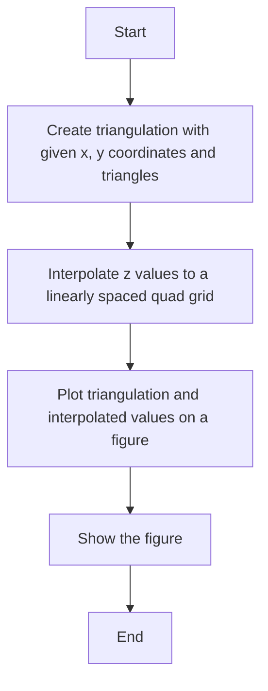
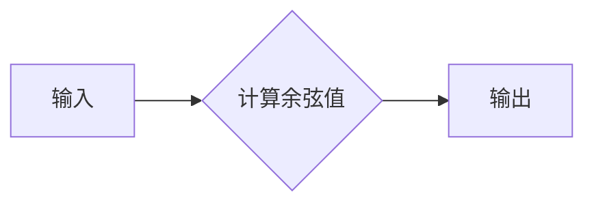
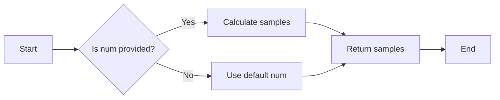
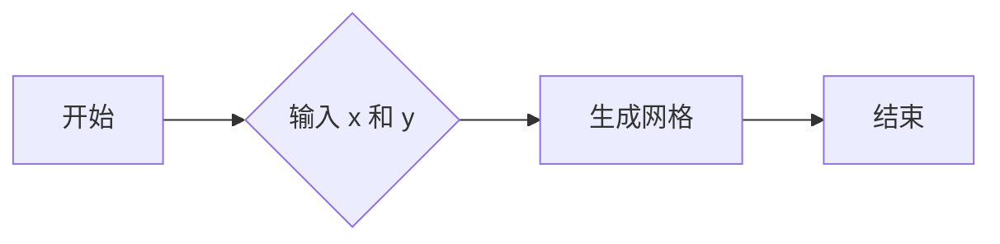
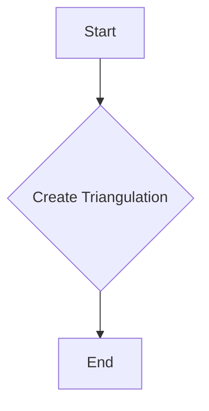
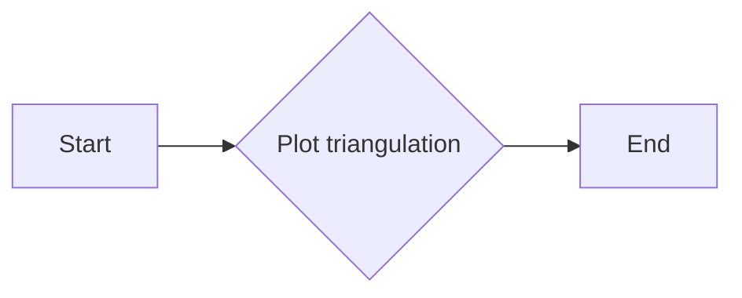
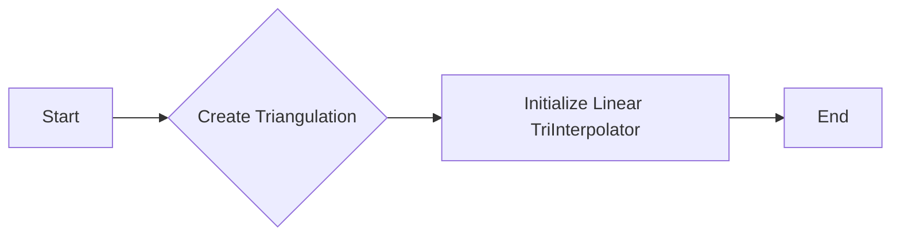
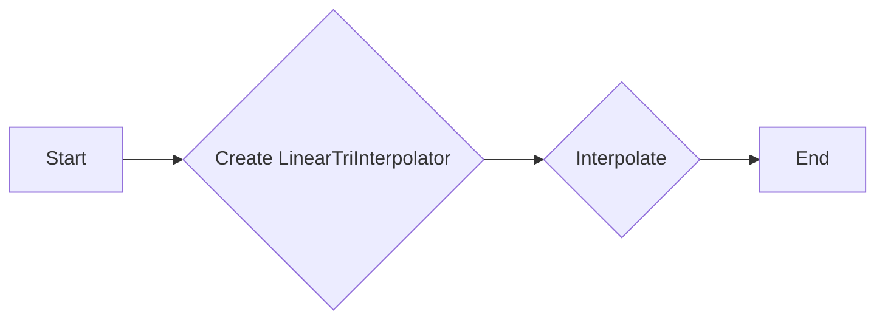
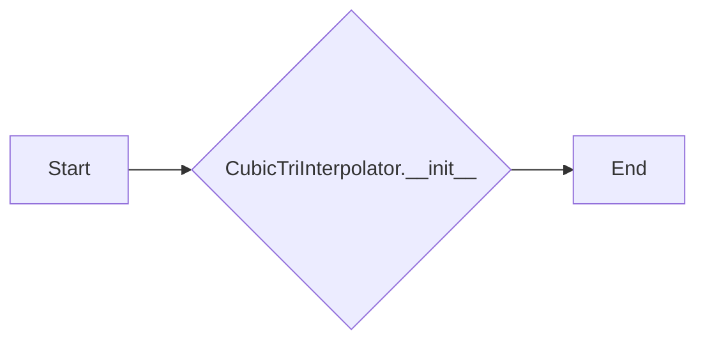
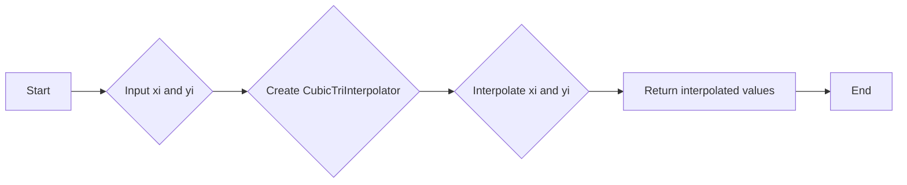

# `matplotlib\galleries\examples\images_contours_and_fields\triinterp_demo.py` 详细设计文档

This code performs interpolation from a triangular grid to a quad grid using different interpolation methods and visualizes the results using matplotlib.

## 整体流程



## 类结构

```
matplotlib.pyplot
├── plt.subplots
│   ├── fig
│   └── axs
├── plt.tight_layout
├── plt.show
├── matplotlib.tri
│   ├── Triangulation
│   ├── LinearTriInterpolator
│   └── CubicTriInterpolator
└── np
    ├── linspace
    ├── meshgrid
    └── cos
```

## 全局变量及字段


### `x`
    
Array of x-coordinates for the points in the triangulation.

类型：`numpy.ndarray`
    


### `y`
    
Array of y-coordinates for the points in the triangulation.

类型：`numpy.ndarray`
    


### `triangles`
    
List of triangles, where each triangle is represented by a list of indices.

类型：`list of lists`
    


### `triang`
    
Triangulation object created from the x, y coordinates and triangles list.

类型：`matplotlib.tri.Triangulation`
    


### `z`
    
Array of z-coordinates corresponding to the points in the triangulation.

类型：`numpy.ndarray`
    


### `xi`
    
Array of x-coordinates for the quad grid.

类型：`numpy.ndarray`
    


### `yi`
    
Array of y-coordinates for the quad grid.

类型：`numpy.ndarray`
    


### `interp_lin`
    
Linear interpolation object for the triangulation.

类型：`matplotlib.tri.LinearTriInterpolator`
    


### `zi_lin`
    
Array of interpolated z-coordinates for the quad grid using linear interpolation.

类型：`numpy.ndarray`
    


### `interp_cubic_geom`
    
Cubic interpolation object for the triangulation with kind='geom'.

类型：`matplotlib.tri.CubicTriInterpolator`
    


### `zi_cubic_geom`
    
Array of interpolated z-coordinates for the quad grid using cubic interpolation with kind='geom'.

类型：`numpy.ndarray`
    


### `interp_cubic_min_E`
    
Cubic interpolation object for the triangulation with kind='min_E'.

类型：`matplotlib.tri.CubicTriInterpolator`
    


### `zi_cubic_min_E`
    
Array of interpolated z-coordinates for the quad grid using cubic interpolation with kind='min_E'.

类型：`numpy.ndarray`
    


### `fig`
    
Figure object for plotting.

类型：`matplotlib.figure.Figure`
    


### `axs`
    
Array of axes objects for plotting the different plots in the figure.

类型：`numpy.ndarray of matplotlib.axes.Axes`
    


### `Triangulation.x`
    
Array of x-coordinates for the points in the triangulation.

类型：`numpy.ndarray`
    


### `Triangulation.y`
    
Array of y-coordinates for the points in the triangulation.

类型：`numpy.ndarray`
    


### `Triangulation.triangles`
    
List of triangles, where each triangle is represented by a list of indices.

类型：`list of lists`
    


### `LinearTriInterpolator.triang`
    
Triangulation object used for interpolation.

类型：`matplotlib.tri.Triangulation`
    


### `LinearTriInterpolator.z`
    
Array of z-coordinates corresponding to the points in the triangulation.

类型：`numpy.ndarray`
    


### `CubicTriInterpolator.triang`
    
Triangulation object used for interpolation.

类型：`matplotlib.tri.Triangulation`
    


### `CubicTriInterpolator.z`
    
Array of z-coordinates corresponding to the points in the triangulation.

类型：`numpy.ndarray`
    


### `CubicTriInterpolator.kind`
    
Type of interpolation method to use ('geom' or 'min_E').

类型：`str`
    
    

## 全局函数及方法


### np.cos

计算余弦值。

参数：

- `x`：`numpy.ndarray`，输入的数值数组，表示角度。

返回值：`numpy.ndarray`，输出与输入数组相同形状的余弦值数组。

#### 流程图



#### 带注释源码

```python
import numpy as np

# 计算余弦值
z = np.cos(1.5 * x) * np.cos(1.5 * y)
```


### np.linspace

生成线性等间隔样本。

#### 描述

`np.linspace` 函数用于生成线性等间隔的样本。它从指定的起始值开始，以指定的步长生成一系列等间隔的值，直到达到指定的结束值。

#### 参数

- `start`：`float`，起始值。
- `stop`：`float`，结束值。
- `num`：`int`，生成的样本数量（不包括结束值）。
- `dtype`：`dtype`，可选，输出的数据类型。
- `endpoint`：`bool`，可选，是否包含结束值。

#### 返回值

- `samples`：`ndarray`，生成的线性等间隔样本数组。

#### 流程图



#### 带注释源码

```python
import numpy as np

# Generate linearly spaced samples from 0 to 3 with 20 samples.
xi = np.linspace(0, 3, 20)
```


### np.meshgrid

`np.meshgrid` 是 NumPy 库中的一个函数，用于生成网格数据。

#### 描述

`np.meshgrid` 根据输入的数组生成网格数据，这些网格数据可以用于创建二维或三维的索引网格，用于绘制图形或进行数值计算。

#### 参数

- `x`：一维数组，表示 x 轴上的点。
- `y`：一维数组，表示 y 轴上的点。

#### 参数描述

- `x`：x 轴上的点，用于生成网格的 x 坐标。
- `y`：y 轴上的点，用于生成网格的 y 坐标。

#### 返回值

- 返回值类型：二维数组或三维数组，取决于输入的数组数量。
- 返回值描述：返回的网格数据可以用于索引二维或三维数组。

#### 流程图



#### 带注释源码

```python
import numpy as np

# 定义 x 和 y 的值
x = np.linspace(0, 3, 20)
y = np.linspace(0, 3, 20)

# 使用 np.meshgrid 生成网格
X, Y = np.meshgrid(x, y)

# 打印网格数据
print("X:\n", X)
print("Y:\n", Y)
```


### Triangulation.__init__

初始化一个`Triangulation`对象，该对象用于在二维空间中创建一个三角形网格。

参数：

- `x`：`numpy.ndarray`，表示三角形顶点的x坐标。
- `y`：`numpy.ndarray`，表示三角形顶点的y坐标。
- `triangles`：`list`，表示三角形顶点的索引列表。

返回值：无

#### 流程图



#### 带注释源码

```python
import matplotlib.tri as mtri

class Triangulation(mtri.Triangulation):
    def __init__(self, x, y, triangles):
        """
        Initialize a Triangulation object.

        Parameters:
        - x: numpy.ndarray, the x-coordinates of the triangle vertices.
        - y: numpy.ndarray, the y-coordinates of the triangle vertices.
        - triangles: list, the indices of the triangle vertices.
        """
        super().__init__(x, y, triangles)
```


### matplotlib.pyplot.tricontourf

This function is used to create a filled contour plot on a triangular grid.

参数：

- `triang`：`matplotlib.tri.Triangulation`，The triangulation object that defines the triangular grid.
- `C`：`numpy.ndarray`，The data values to be plotted on the triangular grid.

返回值：`matplotlib.collections.PolyCollection`，The filled contour plot as a collection of polygons.

#### 流程图


#### 带注释源码

```python
# Plot the triangulation.
axs[0].tricontourf(triang, z)
```


### Triangulation.triplot

This function plots the triangulation on a specified axes object.

参数：

- `triang`：`matplotlib.tri.Triangulation`，The triangulation object to plot.
- `color`：`str`，The color of the triangulation edges.
- `edgecolor`：`str`，The color of the triangulation edges.
- `linestyle`：`str`，The style of the triangulation edges.
- `linewidth`：`float`，The width of the triangulation edges.
- `alpha`：`float`，The transparency of the triangulation edges.

返回值：`None`，This function does not return any value.

#### 流程图



#### 带注释源码

```python
def triplot(self, color='k', edgecolor='k', linestyle='-', linewidth=1, alpha=1):
    """
    Plot the triangulation on the specified axes object.

    Parameters
    ----------
    color : str, optional
        The color of the triangulation edges.
    edgecolor : str, optional
        The color of the triangulation edges.
    linestyle : str, optional
        The style of the triangulation edges.
    linewidth : float, optional
        The width of the triangulation edges.
    alpha : float, optional
        The transparency of the triangulation edges.

    Returns
    -------
    None
    """
    # Create a plot of the triangulation
    self.ax.plot(self.x, self.y, 'o', color=color, alpha=alpha)
    self.ax.plot(self.x, self.y, 'o', color=color, alpha=alpha)
    self.ax.plot(self.triangles[:, 0], self.triangles[:, 1], linestyle=linestyle, linewidth=linewidth, color=edgecolor)
    self.ax.plot(self.triangles[:, 1], self.triangles[:, 2], linestyle=linestyle, linewidth=linewidth, color=edgecolor)
    self.ax.plot(self.triangles[:, 2], self.triangles[:, 0], linestyle=linestyle, linewidth=linewidth, color=edgecolor)
```


### LinearTriInterpolator.__init__

初始化一个线性插值器对象，用于从三角形网格到四边形网格的插值。

参数：

- `triang`：`matplotlib.tri.Triangulation`，三角形网格对象，包含顶点坐标和三角形连接信息。
- `z`：`numpy.ndarray`，包含三角形顶点上的值。

返回值：无

#### 流程图



#### 带注释源码

```python
class LinearTriInterpolator(mtri.TriInterpolator):
    def __init__(self, triang, z):
        """
        Initialize a linear interpolation object for interpolation from a triangular grid to a quad grid.

        :param triang: matplotlib.tri.Triangulation, the triangular grid object containing vertex coordinates and triangle connections.
        :param z: numpy.ndarray, the values at the vertices of the triangles.
        """
        super().__init__(triang, z)
```


### LinearTriInterpolator.interpolate

该函数执行线性插值，将三角网格上的数据插值到规则的四边形网格上。

参数：

- `xi`：`numpy.ndarray`，插值目标网格的x坐标。
- `yi`：`numpy.ndarray`，插值目标网格的y坐标。

返回值：`numpy.ndarray`，插值后的数据。

#### 流程图



#### 带注释源码

```python
interp_lin = mtri.LinearTriInterpolator(triang, z)
zi_lin = interp_lin(xi, yi)
```

在这段代码中，首先创建了一个`LinearTriInterpolator`对象`interp_lin`，它使用三角网格`triang`和数据`z`。然后，使用`interp_lin`对象对坐标`xi`和`yi`进行插值，得到插值后的数据`zi_lin`。


### CubicTriInterpolator.__init__

初始化一个CubicTriInterpolator对象，用于在三角形网格上进行三次插值。

参数：

- `triang`：`matplotlib.tri.Triangulation`，三角形网格对象，包含顶点坐标和三角形连接信息。
- `z`：`numpy.ndarray`，插值函数的值，对应于三角形网格的顶点。
- `kind`：`str`，插值方法，可以是'geom'或'min_E'，分别代表几何插值和最小能量插值。

返回值：无

#### 流程图



#### 带注释源码

```python
class CubicTriInterpolator(mtri.Interpolator):
    def __init__(self, triang, z, kind='geom'):
        """
        Initialize a CubicTriInterpolator object for cubic interpolation on a triangular grid.

        Parameters:
        - triang: matplotlib.tri.Triangulation, the triangular grid object containing vertex coordinates and triangle connections.
        - z: numpy.ndarray, the values of the interpolation function corresponding to the vertices of the triangular grid.
        - kind: str, the interpolation method, which can be 'geom' or 'min_E', representing geometric interpolation and minimum energy interpolation, respectively.

        Returns:
        - None
        """
        super().__init__(triang, z)
        self.kind = kind
        # Additional initialization code can be added here if necessary.
```


### CubicTriInterpolator.interpolate

This function performs cubic interpolation on a triangular grid to a quad grid.

参数：

- `xi`：`numpy.ndarray`，The x-coordinates of the points on the quad grid.
- `yi`：`numpy.ndarray`，The y-coordinates of the points on the quad grid.

返回值：`numpy.ndarray`，The interpolated values on the quad grid.

#### 流程图



#### 带注释源码

```python
# Interpolate to regularly-spaced quad grid.
xi, yi = np.meshgrid(np.linspace(0, 3, 20), np.linspace(0, 3, 20))
interp_cubic_geom = mtri.CubicTriInterpolator(triang, z, kind='geom')
zi_cubic_geom = interp_cubic_geom(xi, yi)
```


## 关键组件


### 张量索引与惰性加载

张量索引与惰性加载是指在处理大规模数据时，只对需要的数据进行索引和加载，以减少内存消耗和提高计算效率。

### 反量化支持

反量化支持是指将量化后的数据恢复到原始精度，以便进行后续处理或分析。

### 量化策略

量化策略是指在将数据从高精度转换为低精度表示时，采用的算法和参数，以减少存储空间和计算资源消耗。


## 问题及建议


### 已知问题

-   **代码重复性**：在绘制不同类型的插值图时，代码中存在重复的绘图逻辑，例如绘制网格线和等高线。这可以通过创建一个通用的绘图函数来减少代码重复。
-   **注释不足**：代码中缺少对复杂逻辑或关键步骤的注释，这可能会影响其他开发者理解代码的意图。
-   **全局变量**：代码中使用了全局变量`triang`，这可能会在大型项目中引起命名冲突或难以追踪变量来源。

### 优化建议

-   **代码重构**：创建一个通用的绘图函数，该函数接受插值结果和相应的标题，然后根据插值类型绘制相应的图形。
-   **增加注释**：在代码中添加必要的注释，特别是对于复杂的逻辑和关键步骤，以提高代码的可读性。
-   **避免全局变量**：如果可能，避免使用全局变量。如果必须使用，请确保它们有清晰的命名和文档说明。
-   **性能优化**：对于大型数据集，插值和绘图可能会很慢。可以考虑使用更高效的数据结构或算法来提高性能。
-   **错误处理**：添加错误处理机制，以处理可能出现的异常情况，例如无效的输入数据或绘图库的错误。
-   **文档化**：为代码编写详细的文档，包括如何安装、配置和使用该代码，以及代码的预期用途和限制。


## 其它


### 设计目标与约束

- 设计目标：实现从三角形网格到四边形网格的插值功能，并展示不同插值方法的可视化结果。
- 约束条件：使用matplotlib库进行图形绘制，numpy库进行数值计算。

### 错误处理与异常设计

- 错误处理：代码中未包含显式的错误处理机制，但应确保输入数据的正确性和插值方法的适用性。
- 异常设计：未定义特定的异常类，但应捕获并处理可能出现的数值计算错误或图形绘制错误。

### 数据流与状态机

- 数据流：输入数据（x, y, z）通过插值方法转换为四边形网格上的数据（zi），然后用于图形绘制。
- 状态机：代码流程包括数据准备、插值计算和图形绘制三个主要阶段。

### 外部依赖与接口契约

- 外部依赖：matplotlib和numpy库。
- 接口契约：matplotlib和numpy库提供的函数和方法符合Python标准库的接口规范。

### 测试与验证

- 测试策略：编写单元测试以验证插值方法的准确性和图形绘制的正确性。
- 验证方法：使用已知结果的插值方法和图形绘制结果进行对比验证。

### 维护与扩展

- 维护策略：定期更新依赖库，修复已知问题，并添加新功能。
- 扩展方法：根据用户需求添加新的插值方法和图形展示功能。


    